# (PART\*) Chapter 1 Introductory  Data Science {-}

<!-- ############################################################################################################################# -->

<!-- ################################################## -->
<!-- ################################################## -->
<!-- START SECTION ONE  -->
<!-- ################################################## -->
<!-- ################################################## -->

# FAIR Data Management Practices

This training module was developed by Rebecca Boyles, with contributions from Julia E. Rager.

All input files (script, data, and figures) can be downloaded from the [UNC-SRP TAME2 GitHub website](https://github.com/UNCSRP/TAME2).

## Introduction to Training Module
This training module provides a description of FAIR data management practices, and points participants to important resources to help ensure generated data meet current FAIR guidelines. This training module is descriptive content-based (as opposed to coding-based), in order to present information clearly and serve as an important resource alongside the other scripted training activities.

 

### Training Module's Environmental Heatlh Questions
This training module was specifically developed to answer the following questions:

1. What is FAIR?
2. When was FAIR first developed?
3. When making data ‘Findable’, who and what should be able to find your data?
4. When saving/formatting your data, which of the following formats is preferred to meet FAIR principles: .pdf, .csv, or a proprietary output file from your lab instrument?
5. How can I find a suitable data repository for my data?

 

## Introduction to FAIR
Proper data management is of utmost importance while leading data analyses within the field of environmental health science. A method to ensure proper data management is the implementation of Findability, Accessibility, Interoperability, and Reusability (FAIR) practices. A landmark paper that describes FAIR practices in environmental health research is the following:

+ Wilkinson MD, Dumontier M, Aalbersberg IJ, et al. The FAIR Guiding Principles for scientific data management and stewardship. Sci Data. 2016 Mar 15. PMID: [26978244](https://pubmed.ncbi.nlm.nih.gov/26978244/).

The FAIR principles describe a framework for data management and stewardship aimed at increasing the value of data by enabling sharing and reuse. These principles were originally developed from discussions during the [Jointly Designing a Data FAIRport](https://www.lorentzcenter.nl/jointly-designing-a-data-fairport.html) meeting at the Lorentz Center in Leiden, The Netherlands in 2014, which brought together stakeholders to discuss the creation of an environment for virtual computational science. The resulting principles are technology agnostic, discipline independent, community driven, and internationally adopted. 

Below is a schematic providing an overview of this guiding principle:

### Answer to Environmental Health Question 1 & 2
:::question
*With this background, we can answer **Environmental Health Question #1 and #2***: What is FAIR and when was it first developed?
:::

:::answer
**Answer**: FAIR is guiding framework that was recently established to promote best data management practices, to ensure that data are Findable, Accessibility, Interoperable, and Reusable. It was first developed in 2014- which means that these principles are very new and continuing to evolve!
:::

 

## Breaking Down FAIR, Letter-by-Letter

The aspects of the FAIR principles apply to data and metadata with the aim of making the information available to people and computers as described in the seminal paper by [Wilkinson et al., 2016](https://pubmed.ncbi.nlm.nih.gov/26978244/). 

### F (Findable) in FAIR
The F in FAIR identifies components of the principles needed to make the meta(data) findable through the application of unique persistent identifiers, thoroughly described, reference the unique identifiers, and that the descriptive information (i.e., metadata) could be searched by both *humans and computer systems*.

**F1. (Meta)data are assigned a globally unique and persistent identifier**  

+ Each dataset is assigned a globally unique and persistent identifier (PID), for example a DOI. These identifiers allow to find, cite and track (meta)data.  
+ A DOI looks like: https://doi.org/10.1109/5.771073  
+ Action: Ensure that each dataset is assigned a globally unique and persistent identifier. Certain repositories automatically assign identifiers to datasets as a service. If not, obtain a PID via a [PID registration service](https://pidservices.org/).

**F2. Data are described with rich metadata**  

+ Each dataset is thoroughly (see R1) described: these metadata document how the data was generated, under what term (license) and how it can be (re)used and provide the necessary context for proper interpretation. This information needs to be machine-readable.  
+ Action: Fully document each dataset in the metadata, which may include descriptive information about the context, quality and condition, or characteristics of the data. Another researcher in any field, or their computer, should be able to properly understand the nature of your dataset. Be as generous as possible with your metadata (see R1).

**F3. Metadata clearly and explicitly include the identifier of the data it describes**  

+ Explanation: The metadata and the dataset they describe are separate files. The association between a metadata file and the dataset is obvious thanks to the mention of the dataset’s PID in the metadata.  
+ Action: Make sure that the metadata contains the dataset’s PID.

**F4. (Meta)data are registered or indexed in a searchable resource**  

+ Explanation: Metadata are used to build easily searchable indexes of datasets. These resources will allow to search for existing datasets similarly to searching for a book in a library.  
+ Action: Provide detailed and complete metadata for each dataset (see F2).

### Answer to Environmental Health Question 3
:::question
*With this, we can answer **Environmental Health Question #3***: When making data ‘Findable’, who and what should be able to find your data?
:::

:::answer
**Answer**: Both humans and computer systems should be able to find your data.
:::

 

### A (Accessible) in FAIR
The A components are designed to enable meta(data) be available long-term, accessed by humans and machines using standard communication protocols with clearly described limitations on reuse.

**A1. (Meta)data are retrievable by their identifier using a standardized communications protocol**

+ Explanation: If one knows a dataset’s identifier and the location where it is archived, one can access at least the metadata. Furthermore, the user knows how to proceed to get access to the data.  
+ Action: Clearly define who can access the actual data and specify how. It is possible that data will not be downloaded, but rather reused *in situ*. If so, the metadata must specify the conditions under which this is allowed (sometimes versus the conditions needed to fulfill for external usage/“download”).

**A1.1 The protocol is open, free, and universally implementable**

+ Explanation: Anyone with a computer and an internet connection can access at least the metadata.

**A1.2 The protocol allows for an authentication and authorization procedure, where necessary**

+ Explanation: It often makes sense to request users to create a user account on a repository. This allows to authenticate the owner (or contributor) of each dataset, and to potentially set user specific rights.

**A2. Metadata are accessible, even when the data are no longer available**
  
+ Explanation: Maintaining all datasets in a readily usable state eternally would require an enormous amount of curation work (adapting to new standards for formats, converting to different format if specifically needed software is discontinued, etc). Keeping the metadata describing each dataset accessible, however, can be done with fewer resources. This allows to build comprehensive data indexes including all current, past, and potentially arising datasets.
+ Action: Provide detailed and complete metadata for each dataset (see R1).

  

### I (Interoperable) in FAIR
The I components of the principles address needs for data exchange and interpretation by humans and machines which includes the use of controlled vocabularies or ontologies to describe meta(data) and to describe provenance relationships through appropriate data citation.

**I1. (Meta)data use a formal, accessible, shared, and broadly applicable language**
  
+ Explanation: Interoperability typically means that each computer system has at least knowledge of the other system’s formats in which data is exchanged. If (meta)data are to be searchable and if compatible data sources should be combinable in a (semi)automatic way, computer systems need to be able to decide if the content of datasets are comparable. 
+ Action: Provide machine readable data and metadata in an accessible language, using a well-established formalism. Data and metadata are annotated with resolvable vocabularies/ontologies/thesauri that are commonly used in the field (see I2). 

**I2. (Meta)data use vocabularies that follow FAIR principles**
  
+ Explanation: The controlled vocabulary (e.g., [MESH](https://www.ncbi.nlm.nih.gov/mesh/)) used to describe datasets needs to be documented. This documentation needs to be easily findable and accessible by anyone who uses the dataset.
+ Action: The vocabularies/ontologies/thesauri are themselves findable, accessible, interoperable and thoroughly documented, hence FAIR. Lists of these standards can be found at: [NCBO BioPortal](https://bioportal.bioontology.org/), [FAIRSharing](https://fairsharing.org/), [OBO Foundry](http://www.obofoundry.org/).

**I3. (Meta)data include qualified references to other (meta)data**
  
+ Explanation: If the dataset builds on another dataset, if additional datasets are needed to complete the data, or if complementary information is stored in a different dataset, this needs to be specified. In particular, the scientific link between the datasets needs to be described. Furthermore, all datasets need to be properly cited (i.e. including their persistent identifiers).
+ Action: Properly cite relevant/associated datasets, by providing their persistent identifiers, in the metadata, and describe the scientific link/relation to your dataset.

  

### R (Reusable) in FAIR
The R components highlight needs for the meta(data) to be reused and support integration such as sufficient description of the data and data use limitations. 

**R1. Meta(data) are richly described with a plurality of accurate and relevant attributes**

Explanation: Description of a dataset is required at two different levels:  

+ Metadata describing the dataset: what does the dataset contain, how was the data generated, how has it been processed, how can it be reused.  
+ Metadata describing the data: any needed information to properly use the data, such as definitions of the variable names

Action: Provide complete metadata for each data file. 

+ Scope of your data: for what purpose was it generated/collected?  
+ Particularities or limitations about the data that other users should be aware of.  
+ Date of the dataset generation, lab conditions, who prepared the data, parameter settings, name and version of the software used.  
+ Variable names are explained or self-explanatory.   
+ Version of the archived and/or reused data is clearly specified and documented.

 

## What Does This Mean for You?
We advise the following as 'starting-points' for participants to start meeting FAIR guidances:

+ Learn how to create a [Data Management Plan](https://dmptool.org) 
+ Keep good documentation (project & data-level) while working
+ Do not use proprietary file formats (.csv is a great go-to formats for your data!)
+ When able, use a domain appropriate metadata standard or ontology
+ Ruthlessly document any steps in a project
+ Most of FAIR can be handled by selecting a good data or software repository
+ Don’t forget to include a [license](https://resources.data.gov/open-licenses/)! 

### Answer to Environmental Health Question 4
:::question
*With these, we can answer **Environmental Health Question #4***: When saving/formatting your data, which of the following formats is preferred to meet FAIR principles: .pdf, .csv, or a proprietary output file from your lab instrument?
:::

:::answer
**Answer**: A .csv file is preferred to enhance data sharing.
:::

  

## Data Repositories for Sharing of Data
When you are organizing your data to deposit online, it is important to identify an appropriate repository to publish your dataset it. A good starting place is a repository registry such as [FAIRsharing.org](https://fairsharing.org/) or [re3data.org](https://www.re3data.org/). Journals can also provide helpful resources and starting repository lists, such as [Nature](https://www.nature.com/sdata/policies/repositories#general) and [PLOS](https://journals.plos.org/plosone/s/recommended-repositories), which both have published a list of recommended repositories. Funding agencies, including the NIH, can also inform specific repositories.

Below are some examples of two main categories of data repositories:

**1. Domain Agnostic Data Repositories**
Domain agnostic repositories allow the deposition of any data type. Some examples include the following:

+ Data in Brief Articles (e.g., [Elsevier's Data in Brief Journal](https://www.journals.elsevier.com/data-in-brief))
+ [Dryad](https://www.datadryad.org)
+ [Figshare](https://figshare.com/)
+ [The Dataverse Project](https://dataverse.org/)
+ [Zenodo](https://zenodo.org/)

**2. Domain Specific Data Repositories**
Domain specific repositories allow the deposition of specific types of data, produced from specific types of technologies or within specific domains. Some examples include the following:

+ [Database of Genotypes and Phenotypes](https://www.ncbi.nlm.nih.gov/gap/)
+ [Gene Expression Omnibus](https://www.ncbi.nlm.nih.gov/geo/)
+ [The Immunology Database and Analysis Portal](https://www.immport.org/home)
+ [Metabolomics Workbench (National Metabolomics Data Repository)](https://www.metabolomicsworkbench.org/data/index.php)
+ [Microphysiology Systems Database](https://upddi.pitt.edu/microphysiology-systems-database/)
+ [Mouse Genome Informatics](http://www.informatics.jax.org/)
+ [Mouse Phenome Database](https://phenome.jax.org/)
+ [OpenNeuro](https://openneuro.org/)
+ [Protein Data Bank](https://www.rcsb.org/)
+ [ProteomeXchange](http://www.proteomexchange.org/)
+ [Rat Genome Database](https://rgd.mcw.edu/)
+ [The Database of Genotypes and Phenotypes](https://www.ncbi.nlm.nih.gov/gap/)
+ [Zebrafish Model Organism Database](http://zfin.org/)
+ and many, many, many others...

### Answer to Environmental Health Question 5
:::question
*With these, we can answer **Environmental Health Question #5***: How can I find a suitable data repository for my data?
:::

:::answer
**Answer**: I can search through a data repository registry service or look for recommendations from NIH or other funding agencies.
:::

  

## Recent Shifts in Regulatory Policies for Data Sharing

### The NIH Data Management and Sharing Policy
NIH’s data management and sharing (DMS) policy became effective January 2023. This policy specifically lists the expectations that investigators must comply with in order to promote the sharing of scientific data.

Information about this recent policy can be found through updated [NIH websites](https://sharing.nih.gov/data-management-and-sharing-policy).

Information about writing an official Data Management and Sharing (DMS) plan for your research can be found through [NIH's Guidance on Writing a Data Management & Sharing Plan](https://sharing.nih.gov/data-management-and-sharing-policy/planning-and-budgeting-for-data-management-and-sharing/writing-a-data-management-and-sharing-plan#after).

### The 2018 Evidence Act
The Evidence Act, or Foundations for Evidence-Based Policymaking Act of 2018, was signed into U.S. law on January 14, 2019. 

The Act requires federal agencies to build the capacity to use evidence and data in their decision-making and policymaking. It also requires agencies to: 
Develop an evidence-building plan as part of their quadrennial strategic plan & Develop an evaluation plan concurrent with their annual performance plan. 

The Evidence Act also:

+ Mandates that data be "open by default"
+ Specifies that a comprehensive data inventory should be created for each agency's open data assets 

**How Does the NIH Data Management and Sharing Policy Intersect with the 2018 Evidence Act?**
Making your data FAIR, by definition, makes it more shareable and reusable. Many of the requirements in the NIH DMS and the Evidence Act policy overlap with the FAIR principles.

### The CARE Principles for Indigenous Data Governance
While we are experiencing increased requirements for the open sharing of data, it is important to recognize that there are circumstances and populations that should, at the same time, be carefully protected. Examples include human clinical or epidemiological data that may become identifiable upon the sharing of sensitive data. Another example includes the consideration of Indigenous populations. A recent article by [Carroll et al. 2021](https://www.nature.com/articles/s41597-021-00892-0) describes in their abstract:

*As big data, open data, and open science advance to increase access to complex and large datasets for innovation, discovery, and decision-making, Indigenous Peoples’ rights to control and access their data within these data environments remain limited. Operationalizing the FAIR Principles for scientific data with the CARE Principles for Indigenous Data Governance enhances machine actionability and brings people and purpose to the fore to resolve Indigenous Peoples’ rights to and interests in their data across the data lifecycle.*

 

## Additional Training Resources on FAIR
Many organizations, from specific programs to broad organizations, provide training and resources for scientists in FAIR principles. Some of the notable global organizations organizing and providing training that offer opportunities for community involvement are:
 
+ [Committee on Data for Science and Technology (CODATA)](https://www.codata.org/uploads/CODATA@45years.pdf)
+ [Global Alliance for Genomics & Health](https://pubmed.ncbi.nlm.nih.gov/27149219/)
+ [GoFAIR](https://www.go-fair.org/)
+ [Force11](https://www.force11.org/)
+ [Research Data Alliance](http://www.dlib.org/dlib/january14/01guest_editorial.html)

**Example Workshops discussing FAIR**:

+ NAS Implementing FAIR Data for People and Machines: Impacts and Implications (2019). Available at: https://www.nationalacademies.org/our-work/implementing-fair-data-for-people-and-machines-impacts-and-implications

+ NIH Catalyzing Knowledge-driven Discovery in Environmental Health Sciences Through a Harmonized Language, Virtual Workshop (2021). Available at: https://www.niehs.nih.gov/news/events/pastmtg/2021/ehslanguage/index.cfm

+ NIH Trustworthy Data Repositories Workshop (2019). Available at: https://datascience.nih.gov/data-ecosystem/trustworthy-data-repositories-workshop

+ NIH Virtual Workshop on Data Metrics (2020). Available at: https://datascience.nih.gov/data-ecosystem/nih-virtual-workshop-on-data-metrics

+ NIH Workshop on the Role of Generalist Repositories to Enhance Data Discoverability and Reuse: Workshop Summary (2020). Available at: https://datascience.nih.gov/data-ecosystem/nih-data-repository-workshop-summary

 

**Example Government Report Documents on FAIR:**
  
+ Collins S, Genova F, Harrower N, Hodson S, Jones S, Laaksonen L, Mietchen D, Petrauskaite R, Wittenburg P. Turning FAIR into reality: Final report and action plan from the European Commission expert group on FAIR data: European Union; 2018. Available at: https://www.vdu.lt/cris/handle/20.500.12259/103794.

+ EU. FAIR Data Advanced Use Cases: From Principles to Practice in the Netherlands. 2018. European Union. Available at: doi:10.5281/zenodo.1250535.

+ NIH. Final NIH Policy for Data Management and Sharing and Supplemental Information. National Institutes of Health. Federal Register, vol. 85, 2020-23674, 30 Oct. 2020, pp. 68890–900. Available at: https://www.federalregister.gov/d/2020-23674.

+ NIH. NIH Strategic Plan for Data Science 2018. National Institutes of Health. Available at: https://datascience.nih.gov/strategicplan.

+ NLM. NLM Strategic Plan 2017 to 2027. U.S. National Library of Medicine, Feb. 2018. Available at: https://www.nlm.nih.gov/about/strategic-plan.html.

 

**Example Related Publications on FAIR:**

+ Comess S, Akbay A, Vasiliou M, Hines RN, Joppa L, Vasiliou V, Kleinstreuer N. Bringing Big Data to Bear in Environmental Public Health: Challenges and Recommendations. Front Artif Intell. 2020 May;3:31. doi: 10.3389/frai.2020.00031. Epub 2020 May 15. PMID: 33184612; PMCID: [PMC7654840](https://pubmed.ncbi.nlm.nih.gov/33184612/).

+ Koers H, Bangert D, Hermans E, van Horik R, de Jong M, Mokrane M. Recommendations for Services in a FAIR Data Ecosystem. Patterns (N Y). 2020 Jul 7;1(5):100058. doi: 10.1016/j.patter.2020.100058. Erratum in: Patterns (N Y). 2020 Sep 11;1(6):100104. PMID: [33205119](https://pubmed.ncbi.nlm.nih.gov/33205119/).

+ Kush RD, Warzel D, Kush MA, Sherman A, Navarro EA, Fitzmartin R, Pétavy F, Galvez J, Becnel LB, Zhou FL, Harmon N, Jauregui B, Jackson T, Hudson L. FAIR data sharing: The roles of common data elements and harmonization. J Biomed Inform. 2020 Jul;107:103421. doi: 10.1016/j.jbi.2020.103421. Epub 2020 May 12. PMID: [32407878](https://pubmed.ncbi.nlm.nih.gov/32407878/).

+ Lin D, Crabtree J, Dillo I, Downs RR, Edmunds R, Giaretta D, De Giusti M, L'Hours H, Hugo W, Jenkyns R, Khodiyar V, Martone ME, Mokrane M, Navale V, Petters J, Sierman B, Sokolova DV, Stockhause M, Westbrook J. The TRUST Principles for digital repositories. Sci Data. 2020 May 14;7(1):144. PMID: [32409645](https://pubmed.ncbi.nlm.nih.gov/32409645/).

+ Thessen AE, Grondin CJ, Kulkarni RD, Brander S, Truong L, Vasilevsky NA, Callahan TJ, Chan LE, Westra B, Willis M, Rothenberg SE, Jarabek AM, Burgoon L, Korrick SA, Haendel MA. Community Approaches for Integrating Environmental Exposures into Human Models of Disease. Environ Health Perspect. 2020 Dec;128(12):125002. PMID: [33369481](https://pubmed.ncbi.nlm.nih.gov/33369481/).

+ Roundtable on Environmental Health Sciences, Research, and Medicine; Board on Population Health and Public Health Practice; Health and Medicine Division; National Academies of Sciences, Engineering, and Medicine. Principles and Obstacles for Sharing Data from Environmental Health Research: Workshop Summary. Washington (DC): National Academies Press (US); 2016 Apr 29. PMID: [27227195](https://pubmed.ncbi.nlm.nih.gov/27227195/).

 

<label class="tykfont">
Test Your Knowledge 
</label>

:::tyk
Let’s imagine that you’re a researcher who is planning on gathering a lot of data using the zebrafish model. In order to adequately prepare your studies and steps to ensure data are deposited into proper repositories, you have the idea to check repository information obtained in [FAIRsharing.org](https://fairsharing.org/). What are some example repositories and relevant ontology resources that you could use to organize, deposit, and share your zebrafish data (hint: use the search tool)?
:::

<!-- ############################################################################################################################# -->

<!-- ################################################## -->
<!-- ################################################## -->
<!-- START SECTION TWO  -->
<!-- ################################################## -->
<!-- ################################################## -->

# Data Sharing through Online Repositories
## An Overview and Example with the Dataverse Repository

This training module was developed by Kyle R. Roell, Alexis Payton, and Julia E. Rager.

All input files (script, data, and figures) can be downloaded from the [UNC-SRP TAME2 GitHub website](https://github.com/UNCSRP/TAME2).

## Introduction to Training Module

Submitting data to publicly available repositories is an essential part of ensuring data meet FAIR guidelines, as discussed in detail in the previous training module. There are many benefits to sharing and submitting your researching, such as:

+ Making more use out of data that are generated in your lab
+ More easily sharing and integrating across datasets
+ Ensuring reproducibility in analysis findings and conclusions
+ Improving the tracking and archiving of data sources, and data updates
+ Increasing the awareness and attention surrounding your research as others locate your data through additional online queries

 

### Training Module's Environmental Health Questions
This training module was specifically developed to answer the following environmental health questions:

1. How should I structure my data for upload into online repositories?
2. What does the term 'metadata' mean and what does it look like?

This module will introduce some of the repositories that are commonly used to deposit data, how to set up metadata files, and how to organize example data in preparation for sharing. We will also provide information surrounding best practices for data organization and sharing through these repositories. Additional resources are also provided throughout, as there are many ways to organize, share, and deposit data depending on your data types and structures and overall research goals.

 

## Data Repositories

There are many publicly available repositories that we should consider when depositing data. Some general repository registries that are helpful to search through include [FAIRsharing.org](https://fairsharing.org/) or [re3data.org](https://www.re3data.org/). Journals can also provide helpful resources and starting repository lists, such as [Nature](https://www.nature.com/sdata/policies/repositories#general) and [PLOS](https://journals.plos.org/plosone/s/recommended-repositories), which both have published a list of recommended repositories. As detailed in the FAIR training module, there are two main categories of data repositories:

**1. Domain Agnostic Data Repositories**
Domain agnostic repositories allow the deposition of any data type. Some examples include:

+ Data in Brief Articles (e.g., [Elsevier's Data in Brief Journal](https://www.journals.elsevier.com/data-in-brief))
+ [Dryad](https://www.datadryad.org)
+ [Figshare](https://figshare.com/)
+ [The Dataverse Project](https://dataverse.org/)
+ [Zenodo](https://zenodo.org/)

**2. Domain Specific Data Repositories**
Domain specific repositories allow the deposition of specific types of data, produced from specific types of technologies or within specific domains. Some examples include:

+ [Database of Genotypes and Phenotypes](https://www.ncbi.nlm.nih.gov/gap/)
+ [Gene Expression Omnibus](https://www.ncbi.nlm.nih.gov/geo/)
+ [The Immunology Database and Analysis Portal](https://www.immport.org/home)
+ [Metabolomics Workbench (National Metabolomics Data Repository)](https://www.metabolomicsworkbench.org/data/index.php)
+ [Microphysiology Systems Database](https://upddi.pitt.edu/microphysiology-systems-database/)
+ [Mouse Genome Informatics](http://www.informatics.jax.org/)
+ [Mouse Phenome Database](https://phenome.jax.org/)
+ [OpenNeuro](https://openneuro.org/)
+ [Protein Data Bank](https://www.rcsb.org/)
+ [ProteomeXchange](http://www.proteomexchange.org/)
+ [Rat Genome Database](https://rgd.mcw.edu/)
+ [The Database of Genotypes and Phenotypes](https://www.ncbi.nlm.nih.gov/gap/)
+ [Zebrafish Model Organism Database](http://zfin.org/)
+ and many, many, many others...

This training module focuses on providing an example of how to organize and upload data into the Dataverse; though many of the methods described below pertain to other data repositories as well, and also incorporate general data organization and sharing best practices.

 

## The Dataverse Project
Dataverse, organized through [The Dataverse Project](https://dataverse.org/), is a popular repository option that allows for upload of most types of material, without any stringent requirements. The Dataverse organization also provides ample resources on how to organize, upload, and share data through Dataverse. These resources include very thorough, readable, and user guides and best practices. 

*Screenshot of the main page of [The Dataverse Project](https://dataverse.org/)*

An easier way to think about Dataverse is to interpret it similar to a folder system on your computer. A Dataverse is just an online folder that contains files, data, or datasets that are all related to some topic, project, etc. Although Dataverse was started at Harvard and the base Dataverse lives there, there are many versions of Dataverse that are specific to and supported by various institutions. For example, these training modules are being developed primarily by faculty, staff, and students at the University of North Carolina at Chapel Hill. As such, the examples contained in this module will specifically connect with the [UNC Dataverse](https://dataverse.unc.edu); though many of the methods outlined here are applicable to other Dataverses and additional online repositories, in general.

 

## What is a Dataverse?

Remember how we pointed out that a Dataverse is similar to a folder system on a computer? Well, here we are going to show you what that actually looks like. But first, something that can be confusing when starting to work with Dataverse is the fact that the term Dataverse is used for both the overarching repository as well as individual subsections (or folders) in which data are stored. For example, the UNC Dataverse is called a Dataverse, but to upload data, you need to upload it to a specific sub-Dataverse. So, what is the difference between the high level UNC Dataverse and smaller, sub-dataverses? Well, nothing, really. The UNC Dataverse is similar to a large folder that says, these are all the projects and research related to or contained within UNC. From there, we want to be more specific about where we store our research, so we are creating more sub-Dataverses (folders) within that higher, overarching UNC Dataverse. 

As an example, using the UNC Dataverse, here we can see various sub-Dataverses that have been created as repositories for specific projects or types of data. 

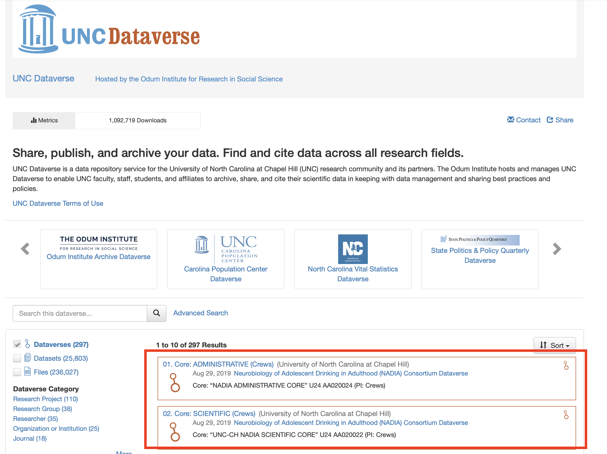

As another example looking within a specific Dataverse, here we can see the Dataverse that hosts datasets and publications for Dr. Julia Rager's lab, the [Ragerlab-Dataverse](https://dataverse.unc.edu/dataverse/ragerlab).

Within this Datavere, we can see various datasets produced by her lab. It is worth noting that the datasets may not necessarily be directly related to each other in terms of exact topic, for example, the Ragerlab-Dataverse hosts data pertaining to wildfire smoke exposure as well as chemical exposures and breast cancer. But they are all pertaining to experiments and analyses run within her specific lab. 

Let's now start talking more specifically about how to organize data and format files for Dataverse, create your own "Dataverse", upload datasets, and what this all means!

 

### Dataset Structure 

Before uploading your data to any data repository, it is important to structure your data efficiently and effectively, making it easy for others to navigate, understand, and utilize. While we will cover this in various sections throughout these training modules, here are some basic tips for data structure and organization. 

+ Keep all data for one participant or subject within one column (or row) of your dataset
  + Genomic data and other analytical assays tend to have subjects on columns and genes, expression, etc. as the rows
  + Descriptive and demographic data often tend to have subjects or participants as the rows and each descriptor variable (including demographics and any other subject variables) as columns
+ Create succinct, descriptive variable names
  + For example, do not use something like "This Variable Contains Information Regarding Smoking Status", and instead just using something like, "Smoking_Status"
  + Be aware of using spacing, special characters, and capitalization within variable names 
+ Think about transforming data from wide to long format depending on your specific dataset and general conventions
+ Be sure to follow specific guidelines of repository when appropriate

**TAME 2.0 Module 1.1 FAIR Data Management Practices** and **TAME 2.0 Module 1.4 Data Wrangling in Excel** are also helpful resources to reference when thinking about organizing your data. 

A general example of an organized, long format dataset in Excel in provided below:
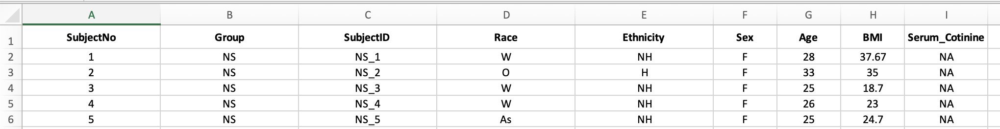

Only .csv or .txt files can be uploaded to dataverse; therefore, the metadata and data tabs in an excel file will need to saved and uploaded as two separate .csv or .txt files. 

### Answer to Environmental Health Question 1
:::question
*With this, we can answer **Environmental Health Question 1***: How should I structure my data for upload into online repositories?
:::

:::answer
**Answer**: It is ideal to have data clearly organized and filled, with succinct and descriptive variable names clearly labeled and values filled in. Most commonly, datasets should be saved as separate .csv or .txt files for upload into data repositories.
:::

 

## Metadata
There are many different definitions of what a metadata file is. Helpful explanations, for example, are provided by the [UNC University Libraries](https://guides.lib.unc.edu/metadata/definition):

:::txtbx
There are many definitions of metadata, but one of the simplest is *data about data*.  More specifically...

+ *Metadata (in terms of data management) describe a dataset:*  how they were collected; when they were collected; what assumptions were made in their methodology; their geographic scope; if there are multiple files, how they relate to one another; the definitions of individual variables and, if applicable, what possible answers were (i.e., to survey questions); the calibration of any equipment used in data collection; the version of software used for analysis; etc.  Very often, a dataset that has no metadata is incomprehensible.

+ *Metadata ARE data.* They are pieces of information that have some meaning in relation to another piece of information. They can be created, managed, stored, and preserved like any other data.

+ *Metadata can be applied to anything.* A computer file can be described in the same way that a book or piece of art can be described. For example, both can have a title, an author, and a year created.  Metadata should be documented for research outputs of any kind.

+ *Metadata generally has little value on their own.* Metadata adds value to other information, but are usually not valuable in themselves. There are exceptions to this rule, such as text transcription of an audio file.

There are three kinds of metadata:

+ Descriptive metadata consist of information about the content and context of your data.

  + Examples: title, creator, subject keywords, and description (abstract)

+ Structural metadata describe the physical structure of compound data.

  + Examples: camera used, aperture, exposure, file format, and relation to other data or files

+ Administrative metadata are information used to manage your data.

  + Examples: when and how they were created, who can access them, software required to use them, and copyright permissions

:::

Therefore, after having organized your primary dataset for submission into online repositories, it is equally important to have a metadata file for easy comprehension and utilization of your data for future researchers or anyone downloading your data. While most repositories capture some metadata on the dataset page (e.g., descripton of data, upload date, contact information), there is generally little information about the specific data values and variables. In this section, we review some general guidelines and tips to better annotate your data.

First, keep in mind, depending on the specific repository you are using, you may have to follow their metadata standards. But, if uploading to more generalist repository, this may be up to you to define. 

Generally, a metadata file consists of a set of descriptors for each variable in the data. If you are uploading data that contains many covariates or descriptive variables, it is essential that you provide a metadata file that describes these covariates. Both a description of the variable as well as any specific levels of any categorical or factor type variables. 

From the dataset presented previously, here we present an example of an associated metadata file:

### Answer to Environmental Health Question 2
:::question
*With this, we can answer **Environmental Health Question 2***: What does the term 'metadata' mean and what does it look like?
:::

:::answer
**Answer**: Metadata refers to the information that describes and explains data. It looks like an additional dataset that provides context with details such as the source, type, owner, and relationships to other datasets. This file can help users understand the relevance of a specific dataset and provide guidance on how to use it.
:::

 

## Creating a Dataverse

Now, let's review how to actually create a Dataverse. First, navigate to the parent Dataverse that you would like to use as your primary host website. For example, our group uses the [UNC Dataverse](https://dataverse.unc.edu/). If you do not already have one, create a username and login.

Then, from the home Dataverse page, click "Add Data" and select "New Dataverse".

And fill in the information necessary.

And that is it. After creating your Dataverse site, you will need to publish it; however, before it is accessible to the public, note that you can actually create a Dataverse within another Dataverse (similar to a folder within a folder on your computer). This makes sense even when you are creating a new Dataverse at the home, UNC Dataverse level, you are still technically creating a new Dataverse within an existing one (the large UNC Dataverse).

Here are some tips as you create your Dataverse:

+ Do not recreate a Dataverse that already exists
+ Choose a name that is specific, but general enough that it doesn't only pertain to one specific dataset
+ You can add more than one contact email, if necessary

 

## Creating a Dataset

Creating a dataset creates a page for your data containing information about that data, a citation for the data (something valuable and somewhat unique to Dataverse), as well the place from where you data can be directly accessed or downloaded. First, decide the specific Dataverse your data will live and navigate to that specific Dataverse site. Then carry out the following steps to create a dataset:

+ Navigate to the Dataverse page under which your dataset will live
+ Click "Add Data" and then select "New Dataset"

+ Fill in the necessary information
+ Upload your data and metadata file(s) structured as detailed above

Now, you have a dataset within your Dataverse. Again, you will have to publish the dataset for someone to have access to it. The easy part of using a more generalist repository like Dataverse, is that you do not have to have a strict data structure adherence. However, this means it is up to you to make sure your data is readable and useable.

 

## Concluding Remarks
In this training module, we set out to express the importance of uploading data to online repositories, demonstrate what the upload process may look like using a generalist repository (Dataverse), and give some examples and tips on structuring data for upload and creating metadata files. It is important to choose the appropriate repository for your data based on your field of study and specifications of your work.

 

<label class="tykfont">
Test Your Knowledge 
</label>

:::tyk
Try creating your own Dataverse repository, format your files to be uploaded to Dataverse, and upload those files to your new repository!
:::

<!-- ############################################################################################################################# -->

<!-- ################################################## -->
<!-- ################################################## -->
<!-- START SECTION THREE  -->
<!-- ################################################## -->
<!-- ################################################## -->

# File Management using Github

This training module was developed by Alexis Payton, Lauren E. Koval, Julia E. Rager.

All input files (script, data, and figures) can be downloaded from the [UNC-SRP TAME2 GitHub website](https://github.com/UNCSRP/TAME2).

## Introduction to Training Module

Good data practices like file management and code tracking are imperative for data analysis initiatives, especially when working in research teams and/or shared project folders. Often times analyses and manuscripts are edited many times prior to being submitted for a grant or publication. Analysis methods are also shared between members of a research team and to external communities, as further detailed in **TAME 2.0 Module 1.1 FAIR Data Management Practices**. Therefore, Github has emerged as an effective way to manage, share, and track how code changes over time. 

[Github](Github.com) is an open source or publicly accessible platform designed to facilitate version control and issue tracking of code.  It is used by us and many of our colleagues to not only document versions of script written for data analysis and visualization, but to also make our code publicly available for open communication and dissemination of results.

This training module serves a launch pad for getting acclimated with Github and includes...

+ Creating an account
+ Uploading code
+ Creating a repository and making it legible for manuscript submission

## Creating an Account
First, users must create their own accounts within github to start uploading/sharing code. To do this, navigate to [github.com](github.com), click "Sign Up", and follow the on screen instructions. 

 

## Creating a Repository
A repository, also known as a "repo", is similar to a project folder that will contain all code pertaining to a specific project (which can be used for specific research programs, grants, or manuscripts, as examples). A repository can be set to public or private. If a repo is initially set to private to keep findings confidential prior to publication, it can always be updated to public once findings are ready for public dissemination. Multiple people can be allowed to work on a project together within a single repository.

To access the repositories that are currently available to you through your user account, click the circle in top right-hand corner and click "Your repositories".  
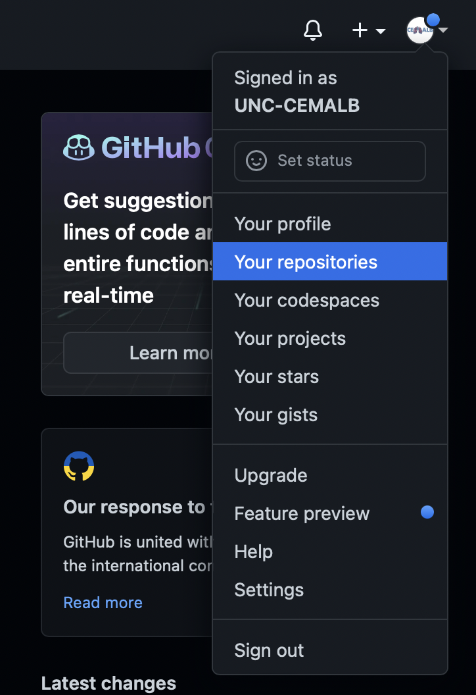

To create a new repository, click on the green button that says "New".

Then give your repository a descriptive name. We often edit the repo titles to match the title of specific manuscripts, though specific titling formats are up to the users/team's preference.

For more information, visit Github's [Create a repo](https://docs.github.com/en/get-started/quickstart/create-a-repo) documentation.

Then click "Add a README file" to initiate the README file, which is important to continually edit to provide analysis-specific background information, and any additional information that would be helpful during and after code is drafted to better facilitate tracking information and project details. *We provide further details surrounding specific information that can be included within the README file below.*
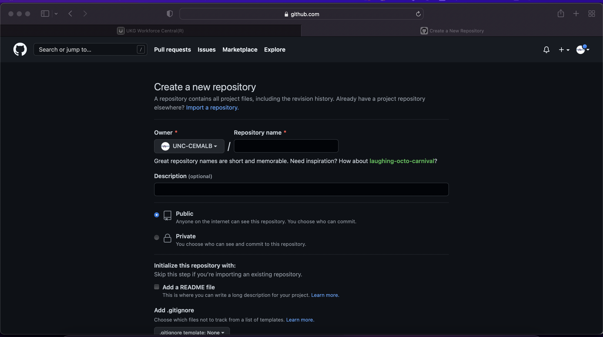

 

## Uploading Code

The simplest way to upload code is to first navigate to the repository that you would like to upload your code/associated files to. Note that this could represent a repo that you created or that someone granted you access to.  

Click “Add file” then click “Upload files”. Drag and drop your file containing your script into github and click “Commit changes”. 
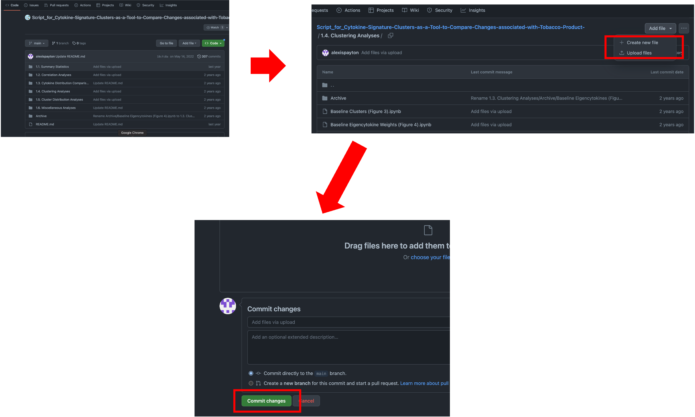

A more advanced way to upload code is by using the command line, which allows a user to directly interact with the computer or software application. Further documentation can be found [here](https://docs.github.com/en/repositories/working-with-files/managing-files/adding-a-file-to-a-repository).

 

## Adding Subfolders in a Repository
To keep the repository organized, it might be necessary to create a new folder (like the folder labeled “1.1. Summary Statistics” in the above screenshot). Files can be grouped into these folders based on the type of analysis. 

To do so, click on the new file and then click on the pencil icon next to the "Blame" button. 

Click on the box that contains the title of the file. Write the title of your new folder and then end with a forward slash (/). In the screenshot below, we're creating a new folder entitled "New Folder". Click “Commit changes” and your file should now be in a new folder. 

 

## Updating Code
Saving iterations of code can save valuable time later as analyses are constantly being updated and edited. If your code undergoes substantial changes, (e.g., adding/ removing steps or if there’s code that is likely to be beneficial later on, but is no longer relevant to the current analysis), it is helpful to save that version in Github for future reference.

To do so, create a subfolder named “Archive” and move the old file into it. If you have multiple versions of a file with the same name, add the current date to prevent the file from being overwritten later on as seen in the screenshot below. 
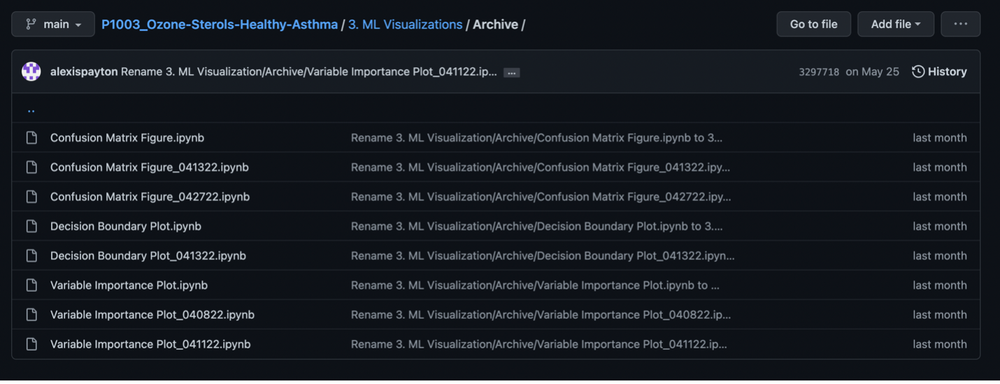

Once the old file version has been archived, now upload the most recent version of your code to the main folder. Based on the screenshot above, that would be under “3. ML Visualizations”. 

*Note: If a file is uploaded with the same name it will be overwritten, which can't be undone! Therefore, put the older file into the archive folder if you'd like it to be saved **PRIOR** to uploading the new version.*

 

## Updating Repository Titles and Structure to Support a Manuscript

If the code is for a manuscript, it's helpful to include the table or figure name it pertains to in the manuscript in parentheses. For example, "Baseline Clusters (Figure 3)". This allows viewers to find find the code for each table or figure faster. 
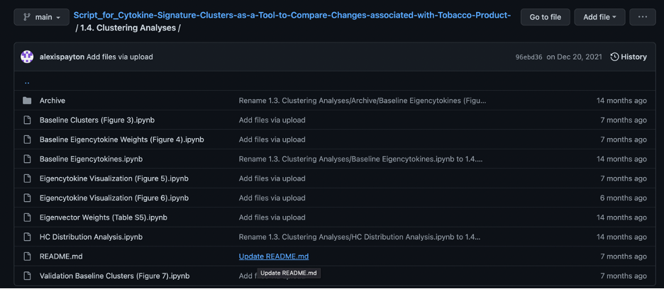

 

### Using a README.md file 
A README.md file is used to describe the overall aims and purpose of the analyses in the repository or a folder within a repository. It is often the first file that someone will look at in a repo/folder, so it is important to include information that would be valuable to an outsider trying to make use of the work.

To add a README.md file, click “Add file” and then “Create new file”. 

Name your file “README.md”. 

A README.md file uses R markdown syntax. This type of syntax is very helpful as you continue to develop R coding skills, as it provides a mechanism through which your code's output can be visualized and saved as a rendered file version. There are many helpful resources for R markdown, including some that we find helpful:

+ [R Markdown Cheatsheet](https://www.rstudio.com/wp-content/uploads/2015/02/rmarkdown-cheatsheet.pdf)
+ [R Markdown Syntax Overview](https://bookdown.org/yihui/rmarkdown/markdown-syntax.html)

The final README.md file for the **OVERALL** repository for manuscript submission should look something like the screenshot below. Always include…

+ The main goal of the project 
+ The final manuscript name, year it was published, Pub Med ID (if applicable)
+ Graphical abstract (if needed for publication)
+ Names and brief descriptions of each file
 +  Include both the goal of the analysis and the methodology used (ie. Using chi square tests to determine if there are statistically significant differences across demographic groups)
+ If the code was written in the software Jupyter (ie. has the extension .ipynb not .R or .Rmd), NBViewer is a website that can render jupyter notebooks (files). This is helpful, because sometimes the files take too long to render, so link the repository from the NB viewer website.
   + Go to [nbviewer.org](nbviewer.org) --> type in the name of the repository --> copy the url and add it to the README.md file

The final README.md file for the a subfolder within a repository should look something like the screenshot below. Always include…

+ The name of each file
+ Brief description of each file
  +  Include both the goal of the analysis and the methodology used
+ Table or Figure name in the corresponding manuscript (if applicable)

**Note**: That the organization structure for the README.md files are simply recommendations and should be changed based on needs of the project. However, it is important to include information and organize the repository in a way that helps other readers and colleagues navigate it who aren't familiar with the project. 

 

#### Example Repositories
Below are links to repositories that contain code for analyses used in published manuscripts. These are examples of well organized Github repositories.

- [Wildfires and Environmental Justice: Future Wildfire Events Predicted to Disproportionally Impact Socioeconomically Vulnerable Communities in North Carolina](https://github.com/UNC-CEMALB/Wildfires-and-Environmental-Justice-Future-Wildfire-Events-Predicted-to-Disproportionally-Impact-So/tree/main)

- [Plasma sterols and vitamin D are correlates and predictors of ozone-induced inflammation in the lung: A pilot study](https://github.com/UNC-CEMALB/Plasma-sterols-and-vitamin-D-are-correlates-and-predictors-of-ozone-induced-inflammation-in-the-lung/tree/main)

- [Cytokine signature clusters as a tool to compare changes associated with tobacco product use in upper and lower airway samples](https://github.com/Ragerlab/Script_for_Cytokine-Signature-Clusters-as-a-Tool-to-Compare-Changes-associated-with-Tobacco-Product-)

 

## Tracking Code Changes using Github Branches
Github is a useful platform for managing and facilitating code tracking performed by different collaborators through branches. 

When creating a repository on Github, it automatically creates a default branch entitled "main". It's possible to create a new **branch** which allows a programmer to make changes to files in a repository in isolation from the main branch. This is beneficial, because the same file can be compared across branches, potentially created by different scientists, and merged together to reflect those changes. **Note:** In order for this to work the file in main branch has to have the same name and the file in the newly created branch. 

Let's start by creating a new branch. First, navigate to a repository, select "main" and then "View all branches". 

Click "New branch", give your branch a title, and click "Create new branch". In the screenshot, you'll see the new branch entitled "jr-changes". 

As a new collaborator interested in comparing and merging code changes to a file, click on the new branch that was just created. Based on the screenshot, that means click "jr-changes". 

After uploading the file(s) to this branch, you'll see a notification that this branch is now a certain number of commits ahead of the main branch. A **commit** records the number of changes to files in a branch. Based on the screenshot, "jr-changes" is now 2 commits ahead of "main". 
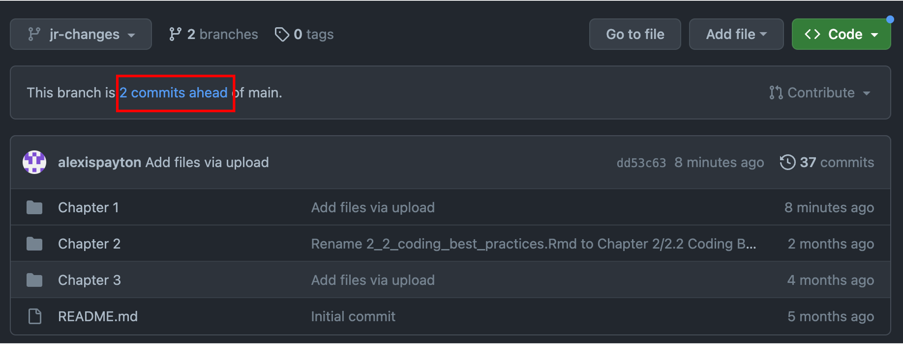

Click on "2 commits ahead" and scroll down to compare versions between the "main" and "jr-changes" branches. A pull request will need to be created. A **pull request** allows other collaborators to see changes made to a file within a branch. These proposed changes can be discussed and amended before merging them into the main branch. For more information, visit Github's [branches](https://docs.github.com/en/pull-requests/collaborating-with-pull-requests/proposing-changes-to-your-work-with-pull-requests/about-branches), [pull requests](https://docs.github.com/en/pull-requests/collaborating-with-pull-requests/proposing-changes-to-your-work-with-pull-requests/about-pull-requests) and [comparing branches in pull requests](https://docs.github.com/en/pull-requests/collaborating-with-pull-requests/proposing-changes-to-your-work-with-pull-requests/about-comparing-branches-in-pull-requests) documentation.
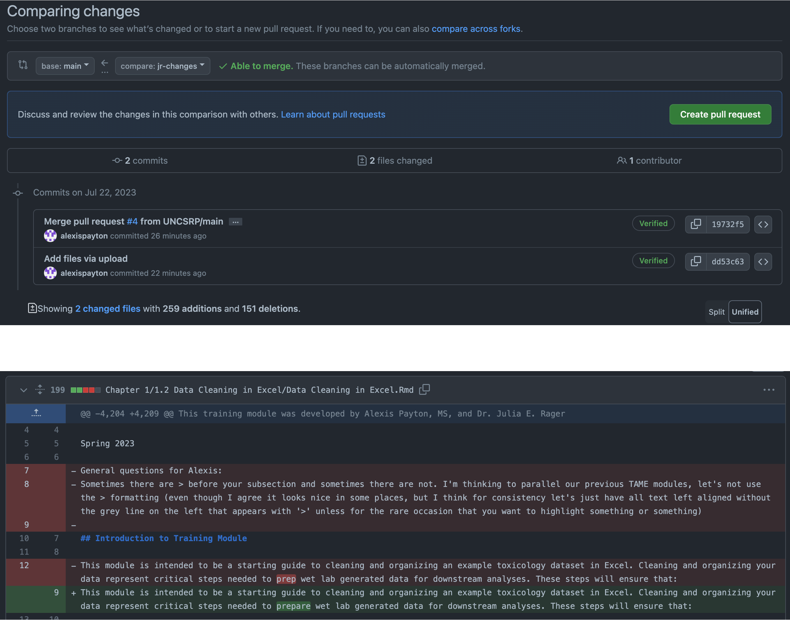

Go ahead and click on "Create pull request". Click on "Create pull request" again on the next screen. Select "Merge pull request" and then "Confirm merge". 

 

## Concluding Remarks
In summary, this training module serves as a basic tutorial for sharing code on Github in a way that is beneficial for scientific research. Concepts discussed include uploading and updating code, making a repository easily readable for manuscript submissions, and tracking code changes across collaborators. We encourage trainees and data scientists to implement code tracking and sharing through Github and to also keep up with current trends in data analysis documentation that continue to evolve over time.

<label class="tykfont">
Test Your Knowledge 
</label>

:::tyk
Try creating your own Github profile, set up a practice repo with subfolders, and a detailed READ.md file paralleling the suggested formatting and content detailed above for your own data analyses!
:::

<!-- ############################################################################################################################# -->

<!-- ################################################## -->
<!-- ################################################## -->
<!-- START SECTION FOUR  -->
<!-- ################################################## -->
<!-- ################################################## -->

# Data Wrangling in Excel

This training module was developed by Alexis Payton, Elise Hickman, and Julia E. Rager.

All input files (script, data, and figures) can be downloaded from the [UNC-SRP TAME2 GitHub website](https://github.com/UNCSRP/TAME2).

## Introduction to Training Module

This module is intended to be a starting guide to cleaning and organizing an example toxicology dataset in Excel. **Data wrangling** involves cleaning, removing of erroneous data, and restructuring necessary for to preparing wet lab generated data for downstream analyses. These steps will ensure that:

+ Data are amenable to downstream analyses in R, or your preferred programming language
+ Data are clear and easily interpretable by collaborators, reviewers, and readers 
    
Click [here](https://www.alteryx.com/glossary/data-wrangling#:~:text=Data%20wrangling%20is%20the%20process,also%20sometimes%20called%20data%20munging.) for more information on data wrangling.

In this training tutorial, we'll make use of an example dataset that needs to be wrangled. The dataset contains concentration values for molecules that were measured using protein-based ELISA technologies. These molecules specifically span 17 sterols and cytokines, selected based upon their important roles in mediating biological responses. These measures were derived from human serum samples. Demographic information also exists for each subject. 

The following steps detailed in this training module are by no means exhaustive! Further resources are provided at the end. This module provides example steps that are helpful when wrangling your data in Excel. Datasets often come in many different formats from our wet bench colleagues, therefore some steps will likely need to be added, removed, or amended depending on your specific data.

 

## Save a Copy of the Soon-To-Be Organized and Cleaned Dataset as a New File
Open Microsoft Excel and prior to **ANY** edits, click “File” --> “Save As” to save a new version of the file that can serve as the cleaned version of the data. This is very important for file tracking purposes, and can help in the instance that the original version needs to be referred back to (e.g., if data are accidentally deleted or modified during downstream steps).

+ The file needs to be named something indicative of the data it contains followed by the current date (e.g., "Allostatic Mediator Data_061622"). 
+ The title should be succinct and descriptive. 
+ It is okay to use dashes or underscores in the name of the title.
+ Do not include special characters, such as $, #, @, !, %, &, *, (, ), and +. Special characters tend to generate errors on local hard drives when syncing to cloud-based servers, and they are difficult to upload into programming software.

Let's first view what the dataset currently looks like:

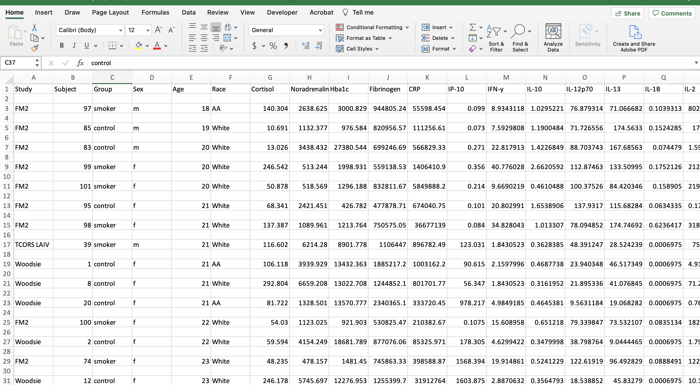

 

### Helpful Excel Keyboard Shortcuts

The following keyboard shortcuts can help you work more efficiently in Excel:

+ Move to the last cell in use on the sheet
    + Control + Fn + Right arrow key (Mac users) 
    + Control + End (PC users)
+ Move to the beginning of the sheet
    + Control + Fn + Left arrow key, then same Control + Fn + Up arrow key (Mac users)
    + Control + Home (PC users)
+ Highlight and grab all data
    + Click on the first cell in the upper left hand corner then click and hold Shift + Command + Down arrow key + Right arrow key (Mac users)
    + Shift + Command + Down arrow key + Right arrow key (PC users)

**Note:** This only works if there are no cells with missing information or gaps in the columns/rows used to define the peripheral area.

For more available shortcuts on various operating systems click [here](https://support.microsoft.com/en-us/office/keyboard-shortcuts-in-excel-1798d9d5-842a-42b8-9c99-9b7213f0040f). 

 

## Remove Extraneous White Space
Before we can begin organizing the data, we need to remove the entirely blank rows of cells. This reduces the file size and allows for the use of the filter function in Excel, as well as other organizing functions, which will be used in the next few steps. This step also makes the data look more tidy and amenable to import for coding purposes. 

+ **Excel Trick #1:** Select all lines that need to be removed and press Control + minus key for Mac and PC users. (Note that there are other ways to do this for larger datasets, but this works fine for this small example.)
+ **Excel Trick #2:** An easier way to remove blank rows and cells for larger datasets, includes clicking "Find & Select"--> "Special" --> "Blanks" --> click "OK" to select all blank rows and cells. Click "Delete" within the home tab --> "Delete sheet rows".

After removing the blank rows, the file should look like the screenshot below. 
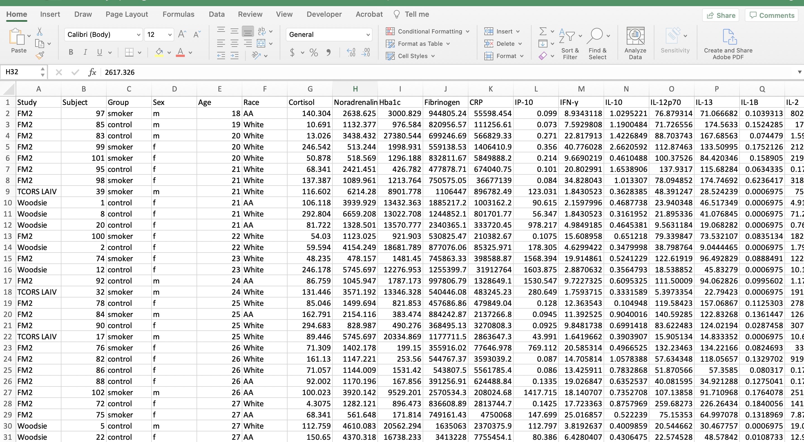

 

## Replace Missing Data with “NA”
There are many ways missing data can be encoded in datasets. This includes values like "blank", "N/A", "NA", or leaving a cell blank. Replacing all missing values with "NA" values is done for 2 reasons:

+ To confirm that the data is indeed missing 
+ R reads in "NA" values as missing values

To check for missing values, the filter function can be used on each column and only select cells with missing values. You may need to scroll to the bottom of the filter pop up window for numerical data. Enter "NA" into the cell of the filtered column. Double click the bottom right corner of the cell to copy the "NA" down the rest of the column.

There was no missing data in this dataset, so this step can be skipped. 

 

## Create a Metadata Tab
Metadata explains what each column represents in the dataset. Metadata is now a required component of data sharing, so it is best to initiate this process prior to data analysis. Ideally, this information is filled in by the scientist(s) who generated the data.

+ Create a new tab (preferably as the first tab) and label it “XXXXX_METADATA” (ie., “Allostatic_METADATA")
+ Then relabel the original data tab as “XXXX_DATA” (ie., “Allostatic_DATA). 
+ Within the metadata tab, create three columns: the first, "Column Identifier", contains each of the column names found in the data tab; the second, "Code", contains the individual variable/ abbreviation for each column identifier; the third, "Description" contains additional information and definitions for abbreviations.

 

## Abbreviate and Capitalize Categorical Data
Categorical data are easier to handle in programming languages when they are capitalized and abbreviated. It also helps reduce typos and potential typing mistakes within your script.

For this dataset, the following variables were edited:

+ Group
    + "control" became "NS" for non-smoker
    + "smoker" became "CS" for cigarette smoker
+ Sex
    + "f" became "F" for female
    + "m" became "M" for male
+ Race
    + "AA" became "B" for Black
    + "White" became "W" for White
    
**Excel Trick:** To change cells that contain the same data simultaneously, navigate to "Edit", click "Find", and then "Replace". 

Once the categorical data have been abbreviated, add those abbreviations to the metadata and describe what they symbolize. 
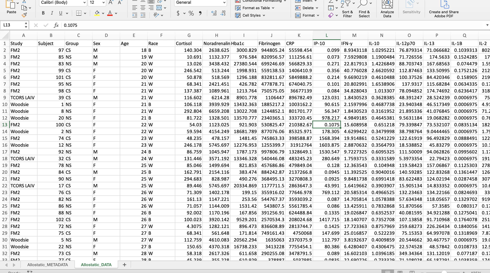

 

## Alphabetize (Sort) the Data by the Categorical Variable of Interest 
For this dataset, we will sort by the column "Group". This organizes the data and sets it up for the next step.

+ Highlight all the column headers.
+ Click on the "Sort & Filter" button and click "Filter".
+ Click on the arrow on cell that contains the column name "Group" and click "Ascending".

## Create a New Subject Number Column
Analysis-specific subjects are created to give an ordinal subject number to each subject, which allows the scientist to easily identify the number of subjects. In addition, these new ordinal subject numbers will be used to create a subject identifier that combines both a subject's group and subject number that is helpful for downstream visualization analyses.

+ Relabel the subject number/identifier column as “Original_Subject_Number” and create an ordinal subject number column labeled “Subject_Number”.

R reads in spaces between words as periods, therefore it’s common practice to replace spaces with underscores when doing data analysis in R. Avoid using dashes in column names or anywhere else in the dataset. 
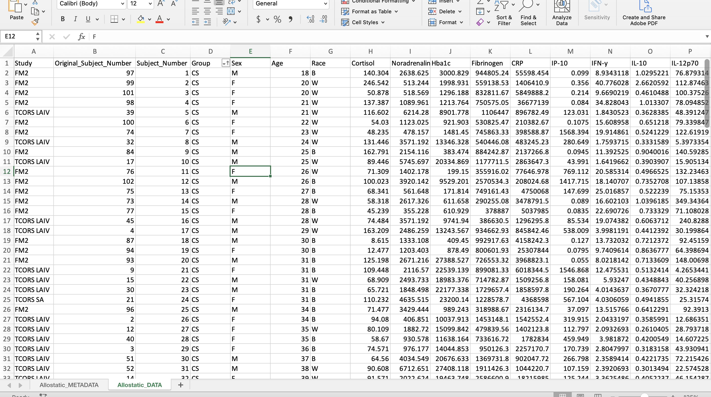

 

## Remove Special Symbols and Dashes
Programming languages, in general, do not operate well with special symbols and dashes, particularly when included in column identifiers. For this reason, it is best to remove these while cleaning up your data, prior to importing it into R or your preferred programming software.

In this case, this dataset contains dashes and Greek letters within some of the column header identifiers. Here, it is beneficial to remove these dashes (e.g., change IL-10 to IL10) and replace the Greek letters with first letter of the word in English (e.g., change TNF-$\alpha$ to TNFa). 

 

## Bold all Column Names and Center all Data
These data will likely be shared with collaborators, uploaded onto data deposition websites, and used as supporting information in published manuscripts. For these purposes, it is nice to format data in Excel such that it is visually appealing and easy to digest.

For example, here, it is nice to bold column identifiers and center the data, as shown below:
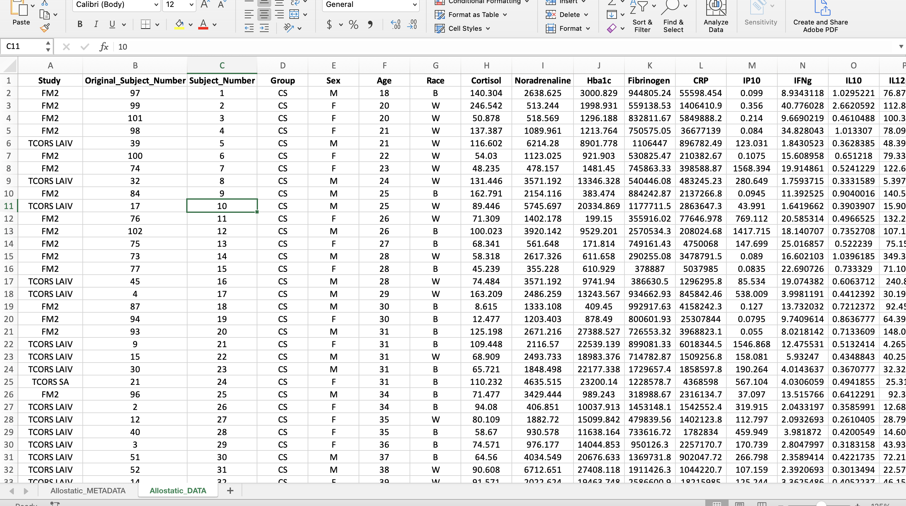

 

## Create a Subject Identifier Column
The subject identifier column labeled, “Group_Subject_No”, combines the subject number with the variable of interest (ie. Group for this dataset). This is useful for analyses to identify outliers by the subject number and the group. 

+ Insert 2 additional columns where the current "Sex" column is. 
+ To combine values from two different columns, type "=CONCAT(D1," _ ",C1)" in the first cell in the first column inserted.
+ Double click the right corner of the cell for the formula to be copied to last row in the dataset.
+ Copy the entire column and paste only the values in the second column by navigating to the drop down arrow next to "Paste" and click "Paste Values".
+ Label the second column "Group_Subject_No" and delete the first column.

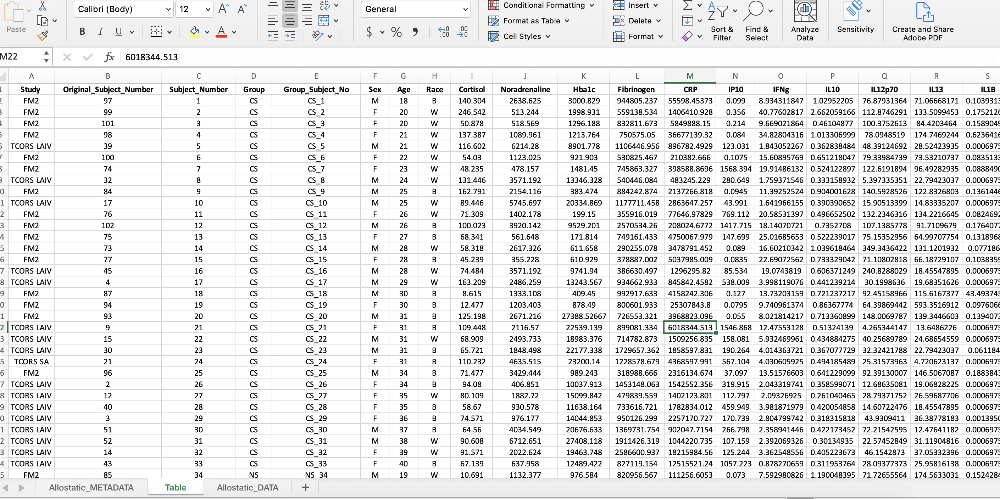

## Separate Subject Demographic Data from Experimental Measurements
This example dataset is very small, so the demographic data (e.g., sex, race, age) was kept within the same file as the experimentally measured molecules. Though in larger datasets (e.g., genome-wide data, exposomic data, etc), it is often beneficial to separate the demographic data into one file that can be labeled according to the following format: “XXX_Subject_Info_061622” (ie. “Allostatic_Subject_Info_061622”). 

This step was not completed for this current data, since it had a smaller size and the downstream analyses were simple.

 

## Convert Data from Wide to Long Format 
A wide format contains values that **DO NOT** repeat the subject identifier column. For this dataset, each subject has one row containing all of its data, therefore the subject identifier occurs once in the dataset.

**Wide Format**

A long format contains values that **DO** repeat the subject identifier column. For this dataset, that means a new column was created entitled "Variable" containing all the mediator names and a column entitled "Value" containing all their corresponding values. In the screenshot, an additional column, "Category", was added to help with the categorization of mediators in R analyses. 

**Long Format**

The reason a long format is preferred is because it makes visualizations and statistical analyses more efficient in R. In the long format, we were able to add a column entitled "Category" to categorize the mediators into "AL Biomarker" or "Cytokine" allowing us to more easily subset the mediators in R. Read more about wide and long formats [here](https://towardsdatascience.com/long-and-wide-formats-in-data-explained-e48d7c9a06cb).

To convert the data from a wide to long format, follow the steps below:

## Pivoting Data from a Wide to Long Format
To do this, a power query in Excel will be used. Note: If you are working on a Mac, you will need to have at least Excel 2016 installed to follow this tutorial, as Power Query is not avaialble for earlier versions. Add-ins are available for Windows users. See [this link](https://blog.enterprisedna.co/how-to-add-power-query-to-excel/) for more details. 

1. Start by copying all of the data, including the column titles. (Hint: Try using the keyboard shortcut mentioned above.)
2. Click the tab at the top that says "Data". Then click "Get Data (Power Query)" at the far left. 
3. It will ask you to choose a data source. Click "Blank table" in the bottom row. 
4. Paste the data into the table. (Hint: Use the shortcut Ctrl + "v"). At this point, your screen should look like the screenshot below. 

5. Click "Use first row as headers" and then click "Next" in the bottom right hand corner.
6. Select all the columns with biomarker names. That should be the column "Cortisol" through the end.

7. Click the "Transform" button in the upper left hand corner. Then click "Unpivot columns" in the middle of the pane. The final result should look like the sceenshot below with all the biomarkers now in one column entitled "Attribute" and their corresponding values in another column entitled "Value". 
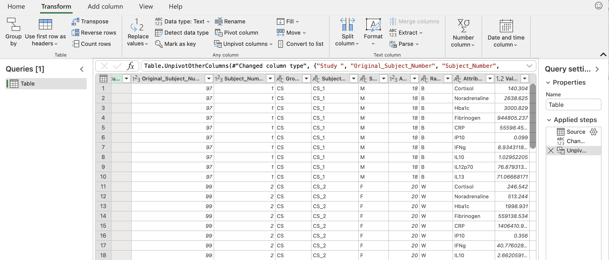

8. To save this, go back to the "Home" tab and click "Close & load". You should see something similar to the screenshot below. 
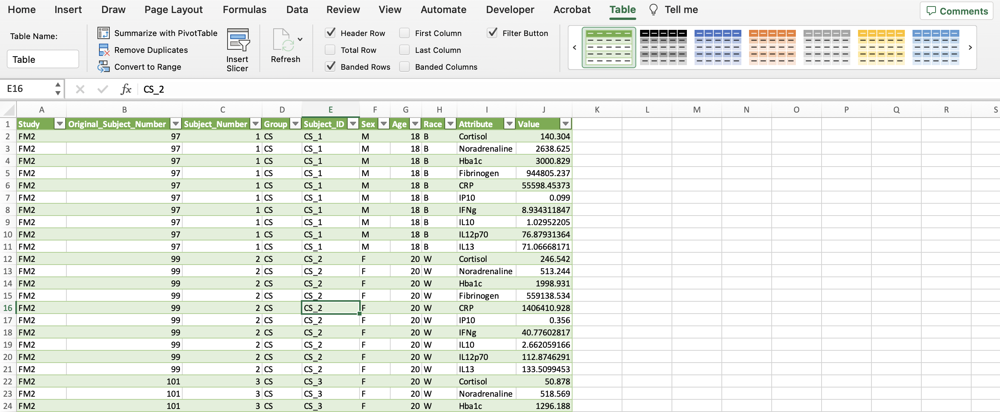

9. In the upper right with all the shaded tables (within the "Table" tab), click the arrow to the left of the green table until you see one with no shading. Then click the table with no colors. 
10. Click "Convert to Range" within the "Table" tab. This removes the power query capabilities, so that the data is a regular excel sheet. 
11. Now the "Category" column can be created to identify the types of biomarkers in the dataset. The allostatic load (AL) biomarkers denoted in the "Category" column include the variables Cortisol, CRP, Fibrinogen, Hba1c, HDL, and Noradrenaline. The rest of the variables were labeled as cytokines. Additionally, we can make this data more closely resemble the final long format screenshot by bolding the headers, centering all the data, etc. 

We have successfully wrangled our data and the final dataset now looks like this:

 

## Generating Summary-Level Statistics with Pivot Tables
A PivotTable is a tool in Excel used to summarize numerical data. It’s called a pivot table, because it pivots or changes how the data is displayed to make statistical inferences. This can be useful for generating initial summary-level statistics to guage the distribution of data.  

To create a PivotTable, start by selecting all of the data. (Hint: Try using the keyboard shortcut mentioned above.) Click "Insert" tab on the upper left-hand side, click "PivotTable", and click "OK". The new PivotTable should be available in a new sheet as seen in the screenshot below. 

A PivotTable will be constructed based on the column headers that can be dragged into the PivotTable fields located on the right-hand side. For example, what if we were interested in determining if there were differences in average expression between non-smokers and cigarette smokers in each category of biomarkers? As seen below, drag the "Group" variable under the "Rows" field and drag the "Value" variable under the "Values" field. 

Notice that it automatically calculates the sum of the expression values for each group. To change the function to average, click the "i" icon and select "Average". The output should mirror what's below with non-smokers having an average expression that's more than double that of cigarette smokers. 

 

## Excel vs. R: Which Should You Use?
For the most part, it's better to perform final analyses in R (or another programming language) rather than Excel for the following reasons...

+ R clearly shows the code (instructions), which makes editing, interpretability, and sharing easier. This makes analyses more reproducible and can save time. 
+ R has packages that makes more complex analyses possible (i.e., machine learning and heatmaps) that aren't available in Excel.
+ R can handle larger data sets.
+ R can compute and process data faster.

However, Excel is still a software that has many benefits for running analyses including...

+ Excel is user-friendly and most people have experience in navigating the software at a basic level.
+ Excel can be faster for rudimentary statistical analyses and visualizations. 

Depending on each scientist's skill-level and the complexity of the analysis, Excel or R could be beneficial.

 

## Concluding Remarks
In summary, this training module highlights the importance of data wrangling and how to do so in Microsoft Excel for downstream analyses. Concepts discussed include helpful Excel features like power queries and pivot tables and when to use Microsoft Excel vs. R. 

### Additional Resources
Data wrangling in Excel can be expedited with knowledge of useful features and functions to format data. Check out the resources below for additional information on Excel tricks.

+ [Data Analysis in Excel](https://careerfoundry.com/en/blog/data-analytics/data-analysis-in-excel/)
+ [Excel Spreesheet Hacks](https://www.lifehack.org/articles/technology/20-excel-spreadsheet-secrets-youll-never-know-you-dont-read-this.html)
+ [Excel for Beginners](https://www.udemy.com/course/useful-excel-for-beginners/)

 

<label class="tykfont">
Test Your Knowledge 
</label>

:::tyk
1. Try wrangling the "Module1_4_TYKInput.xlsx" to mimic the cleaned versions of the data found in "Module1_4_TYKSolution.xlsx". This dataset includes sterol and cytokine concentration levels extracted from induced sputum samples collected after ozone exposure. After wrangling, you should end up with a sheet for subject information and a sheet for experimental data.
2. Using the a PivotTable on the cleaned dataset, find the standard deviation of each cytokine variable stratified by the disease status.
:::
