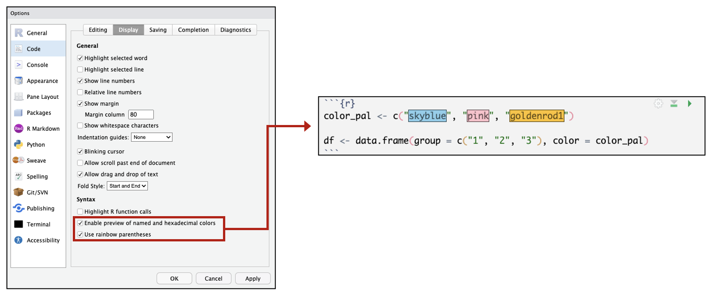
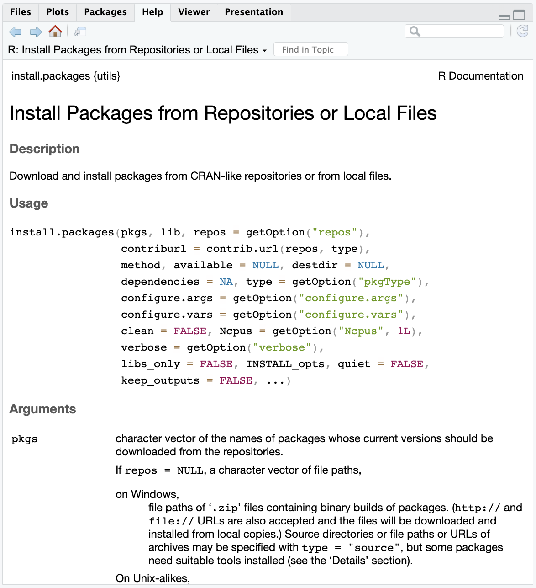
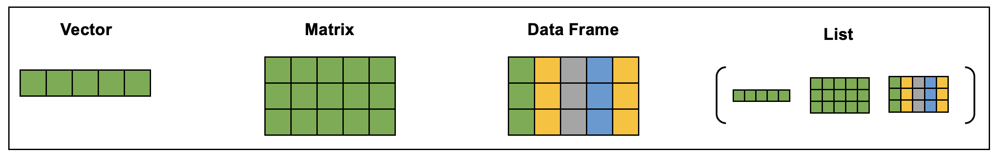
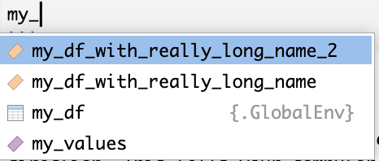
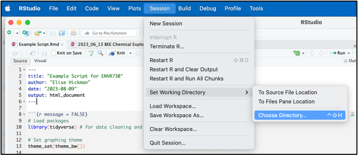
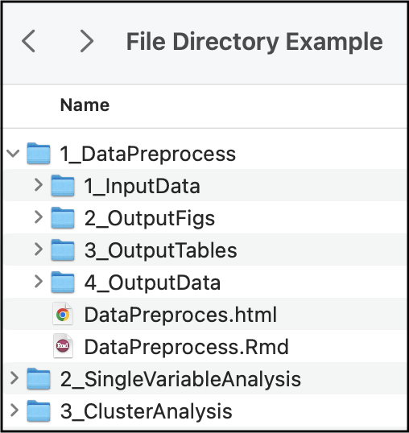
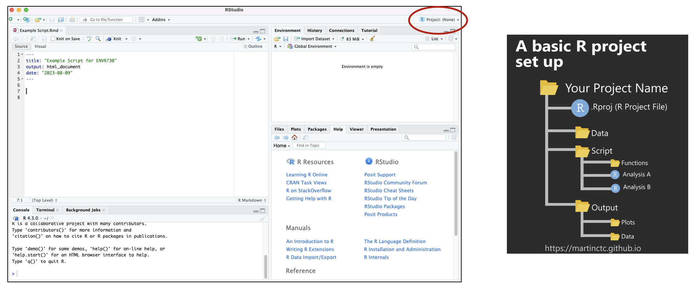
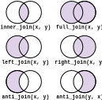

# (PART\*) Chapter 2 Coding in R {-}


<!-- ############################################################################################################################# -->

<!-- ################################################## -->
<!-- ################################################## -->
<!-- START SECTION ONE  -->
<!-- ################################################## -->
<!-- ################################################## -->


# Downloading and Programming in R

This training module was developed by Kyle Roell, Elise Hickman, and Julia E. Rager.

All input files (script, data, and figures) can be downloaded from the [UNC-SRP TAME2 GitHub website](https://github.com/UNCSRP/TAME2).

## Introduction to Training Module

In this training module, we will provide a brief introduction of:

+ R
+ R Studio
+ Packages in R
+ Scripting basics
+ Code troubleshooting

## General Introduction and Installation of R and RStudio

### What is R?

**R** is a programming language. Computer script (lines of code) can be used to increase data analysis reproducibility, transparency, and methods sharing, and is becoming increasingly incorporated into exposure science, toxicology, and environmental health research. One of the most commonly used coding languages in the field of environmental health science is the **R language**. Some advantages of using R include the following:

+ Free, open-source programming language that is licensed under the Free Software Foundation’s GNU General Public License
+ Can be run across all major platforms and operating systems, including Unix, Windows, and MacOS
+ Publicly available packages help you carry out analyses efficiently (without you having to code for everything yourself)
+ Large, diverse collection of packages
+ Comprehensive documentation
+ When code is efficiently tracked during development/execution, it promotes reproducible analyses

Because of these advantages, R has emerged as an avenue for world-wide collaboration in data science. Other commonly implemented scripting languages in the field of environmental health research include Python and SAS, among others; and these training tutorials focus on R as an important introductory-level example that also houses many relevant packages and example datasets as further described throughout TAME.

### Downloading and Installing R

To download R, first navigate to [https://cran.rstudio.com/](https://cran.rstudio.com/) and download the .pkg file for your operating system. Install this file according to your computer's typical program installation steps. 

### What is RStudio?

**RStudio** is an Integrated Development Environment (IDE) for R, which makes it more 'user friendly' when developing and using R script. It is a desktop application that can be downloaded for free, online.

### Downloading and Installing RStudio

To download RStudio:

+ Navigate to: [https://posit.co/download/rstudio-desktop/](https://posit.co/download/rstudio-desktop/) 
+ Scroll down and select "Download RStudio"
+ Install according to your computer's typical program installation steps

### RStudio Orientation

Here is a screenshot demonstrating what the RStudio desktop app looks like:


The default RStudio layout has four main panes (numbered above in the blue boxes):

1. **Source Editor:** allows you to open and edit script files and view data.
2. **Console:** where you can type code that will execute immediately when you press enter/return. This is also where code from script files will appear when you run the code. 
3. **Environment:** shows you the objects in your environment.
4. **Viewer:** has a number of useful tabs, including:
    1. **Files:** a file manager that allows you to navigate similar to Finder or File Explorer
    2. **Plots:** where plots you generate by executing code will appear
    3. **Packages:** shows you packages that are loaded (checked) and those that can be loaded (unchecked)
    4. **Help:** where help pages will appear for packages and functions (see below for further instructions on the help option)
  
Under "Tools" &rarr; "Global Options," RStudio panes can be customized to appear in different configurations or with different color themes. A number of other options can also be changed. For example, you can choose to have colors highlighted the color they appear or rainbow colored parentheses that can help you visualize nested code. 


## Introduction to R Packages

One of the major benefits to coding in the R language is access to the continually expanding resource of thousands of user-developed **packages**. Packages represent compilations of code and functions fitted for a specialized focus or purpose. These are
often written by R users and submitted to the [CRAN](https://cran.r-project.org/web/packages/), or another host such as [BioConductor](https://www.bioconductor.org/) or [Github](https://github.com/).

Packages aid in improved data analyses and methods sharing. Packages have varying utilities, spanning basic organization and manipulation of data, visualizing data, and more advanced approaches to parse and analyze data, with examples included in all of the proceeding training modules.

Examples of some common packages that we'll be using throughout these training modules include the following:

+ ***tidyverse***: A collection of open source R packages that share an underlying design philosophy, grammar, and data structures of tidy data. For more information on the *tidyverse* package, see its associated [CRAN webpage](https://cran.r-project.org/web/packages/tidyverse/index.html), primary [webpage](https://www.tidyverse.org/packages/), and [peer-reviewed article released in 2018](https://onlinelibrary.wiley.com/doi/10.1002/sdr.1600).

+ ***ggplot2***: A system for creating graphics. Users provide the data and tell R what type of graph to use,  how to map variables to aesthetics (elements of the graph), and additional stylistic elements to include in the graph. For more information on the *ggplot2* package, see its associated [CRAN webpage](https://cran.r-project.org/web/packages/ggplot2/index.html) and [R Documentation](https://www.rdocumentation.org/packages/ggplot2/versions/3.3.5).

More information on these packages, as well as many others, is included throughout TAME training modules.

### Downloading/Installing R Packages

R packages often do not need to be downloaded from a website. Instead, you can install packages and load them through running script in R. Note that you only need to install packages one time, but packages must be loaded each time you start a new R session.


```r
# Install the package
install.packages(“tidyverse”)

# Load the package for use
library(tidyverse)
```

Many packages also exist as part of the baseline configuration of an R working environment, and do not require manual loading each time you launch R. These include the following packages:

+ datasets
+ graphics
+ methods
+ stats
+ utils

You can learn more about a function by typing one question mark before the name of the function, which will bring up documentation in the Help tab of the Viewer window. Importantly, this documentation includes a description of the different arguments that can be passed to the function and examples for how to use the function. 


```r
?install.packages
```



You can learn more about a package by typing two question marks before the name of the package. This will bring up vingettes and help pages associated with that package. 


```r
??tidyverse
```


<br>

## Scripting Basics

### Data Types

Before writing any script, let's first review different data types in R. Data types are what they imply – the type of data you are handling. It is important to understand data types because functions often require a specific data type as input.

R has 5 basic data types:

+ Logical (e.g., TRUE or FALSE)
+ Integer (e.g., 1, 2, 3)
+ Numeric (real or decimal)
+ Character (e.g., ”apple”)
+ Complex (e.g., 1 + 0i)

Numeric variables are often stored as “double” values (sometimes shown as < dbl >), or a decimal type with at least two decimal places. Character variables can also be stored as factors, which are data structures that are implemented to store categorical data in a specific order (also known as levels). 

Data are stored in data structures. There are many different data structures in R. Some packages even implement unique data structures. The most common data structures are:

+ **Vectors:** also known as an atomic vector, can contain characters, logical values, integers, or numeric values (but all elements must be the same data type).
+ **Matrices:** a vector with multiple dimensions. Elements must still be all the same data type. 
+ **Data frames:** similar to a matrix but can contain different data types and additional attributes such as row names (and is one of the most common data structures in environmental health research). Tibbles are a stricter type of data frame implemented in the *tidyverse* package.
+ **Lists:** a special type of vector that acts as a container – other data structures can be stored within the list, and lists can contain other lists. Lists can contain elements that are different data structures. 

<div class="figure" style="text-align: center">

<p class="caption">(\#fig:unnamed-chunk-8)Created with *BioRender.com*</p>
</div>

### Writing Script

R code is written line by line. It may take just one line or many lines of code for one step to be executed, depending on the number of arguments to the function you are using. R code is executed (run) by selecting the line(s) of code to run and pressing return/enter (or a keyboard shortcut), or by clicking "Run" in the upper right corner of the script. 

A very simple example of running code is as follows:

```r
3 + 4
```

```
## [1] 7
```

We can see that when we ran our code, the answer was returned. But what if we want to store that answer? We can assign that number to a variable named `x` using the assignment operator `<-`:

```r
x <- 3 + 4
```

Then, if we run a line of code with our variable, we will get that value:

```r
x
```

```
## [1] 7
```

The assignment operator can also be used to assign values to any of the data structures discussed above, such as vectors and data frames, as shown here:

```r
# Creating a vector of values called my_values
my_values <- c(7, 3, 8, 9)

# Viewing the vector
my_values
```

```
## [1] 7 3 8 9
```

```r
# Creating a data frame of values corresponding to colors
my_df <- data.frame(values = my_values, color = c("Blue", "Red", "Yellow", "Purple"))

# Viewing the data frame
my_df
```

```
##   values  color
## 1      7   Blue
## 2      3    Red
## 3      8 Yellow
## 4      9 Purple
```

### Comments

You may have noticed in the code chunks above that there were `#` followed by phrases describing the code. R allows for scripts to contain non-code elements, called comments, that will not be run or interpreted. Comments are useful to help make code more interpretable for others or to add reminders of what and why parts of code may have been written.

To make a comment, simply use a `#` followed by the comment. A `#` only comments out a single line of code. In other words, only that line will be commented and therefore not be run, but lines directly above/below it will still be run:

```r
# This is an R comment!
```

For more on comments, see **TAME 2.0 Module 2.2 Coding Best Practices**.

### Autofilling 

RStudio will autofill function names and object names as you type, which can save a lot of time. When you are typing a variable or function name, you can press tab while typing. RStudio will look for variables or functions that match the first few letters you've typed. If multiple matches are found, RStudio will provide you with a drop down list to select from, which may be useful when searching through newly installed packages or trying to quickly type variable names in an R script.

For example, let's say we instead named our example data frame something much longer, and we had two data frames with similar names. If we start typing in `my_` and pause our typing, all of the objects that start with that name will appear as options in a list. To select which one to autofill, navigate down the list and click return/enter.


```r
my_df_with_really_long_name <- data.frame(values = my_values, color = c("Blue", "Red", "Yellow", "Purple"))

my_df_with_really_long_name_2 <- data.frame(values = my_values, color = c("Green", "Teal", "Magenta", "Orange"))
```




### Finding and Setting Your Working Directory 
Another step that is commonly done at the very beginning of your code is setting your working direction. This tells your computer where to look for files that you want to import and where to deposit output files produced during your scripted activities.

To view your current working directory, run the following:


```r
getwd()
```

To set or change the location of your working directory, run the following:


```r
setwd("/file path to where your input files are")
```

Note that macOS file paths use `/` to separate folders, whereas PC file paths use `\`.

You can easily find the file path to your desired working directory by navigating to "Session", then "Set Working Directory", and "Choose Directory":



In the popup box, navigate to the folder you want to set as your working directory and click "Open." Look in the R console, which will now contain a line of code with `setwd()` containing your file path. You can copy this line of code to the top of your script for future use. Alternatively, you can navigate to the folder you want in Finder or File Explorer and right click to see the file path. 

Within your working directory, you can make sub-folders to keep your analyses organized. Here is an example folder hierarchy:



How you set up your folder hierarchy is highly dependent on your specific analysis and coding style. However, we recommend that you:

+ Name your script something concise, but descriptive (no acronyms)
+ Consider using dates when appropriate
+ Separate your analysis into logical sections so that script doesn’t get too long or hard to follow
+ Revisit and adapt your organization as the project evolves!
+ Archive old code so you can revisit it

#### A Quick Note About Projects

Creating projects allows you to store your progress (open script, global environment) for one project in an R Project File. This facilitates quick transitions between multiple projects. Find detailed information about how to set up projects [here](https://support.posit.co/hc/en-us/articles/200526207-Using-RStudio-Projects).



### Importing Files 

After setting the working directory, you can import and export files using various functions based on the type of file being imported or exported. Often, it is easiest to import data into R that are in a comma separated value /  comma delimited file (.csv) or tab / text delimited file (.txt). 

Other datatypes such as SAS data files or large .csv files may require different functions to be more efficiently read in, and some of these file formats will be discussed in future modules. Files can also be imported and exported from Excel using the [*openxlsx*](https://ycphs.github.io/openxlsx/) package.

Below, we will demonstrate how to read in .csv and .txt files:


```r
# Read in the .csv data that's located in our working directory
csv.dataset <- read.csv("Module2_1_Input/Module2_1_InputData1.csv")

# Read in the .txt data
txt.dataset <- read.table("Module2_1_Input/Module2_1_InputData1.txt")
```

These datasets now appear as saved dataframes ("csv.dataset" and "txt.dataset") in our working environment.

### Viewing Data 

After data have been loaded into R, or created within R, you will likely want to view what these datasets look like. 
Datasets can be viewed in their entirety, or datasets can be subsetted to quickly look at part of the data.

Here's some example script to view just the beginnings of a dataframe using the `head()` function: 

```r
head(csv.dataset)
```

```
##    Sample Var1 Var2 Var3
## 1 sample1    1    2    1
## 2 sample2    2    4    4
## 3 sample3    3    6    9
## 4 sample4    4    8   16
## 5 sample5    5   10   25
```

Here, you can see that this automatically brings up a view of the first five rows of the dataframe.

Another way to view the first five rows of a dataframe is to run the following:

```r
csv.dataset[1:5,]
```

```
##    Sample Var1 Var2 Var3
## 1 sample1    1    2    1
## 2 sample2    2    4    4
## 3 sample3    3    6    9
## 4 sample4    4    8   16
## 5 sample5    5   10   25
```

This brings us to an important concept - indexing! Brackets are used in R to index. Within the bracket, the first argument represents the row numbers, and the second argument represents the column numbers. A colon between two numbers means to select all of the columns in between the left and right numbers. The above line of code told R to select rows 1 to 5, and, by leaving the column argument blank, all of the columns. 

Expanding on this, to view the first 5 rows and 2 columns, we can run the following:

```r
csv.dataset[1:5, 1:2]
```

```
##    Sample Var1
## 1 sample1    1
## 2 sample2    2
## 3 sample3    3
## 4 sample4    4
## 5 sample5    5
```

For another example: What if we want to only view the first and third row, and first and fourth column? We can use a vector within the index to do this:

```r
csv.dataset[c(1, 3), c(1, 4)]
```

```
##    Sample Var3
## 1 sample1    1
## 3 sample3    9
```

To view the entire dataset, use the `View()` function:


```r
View(csv.dataset)
```

Another way to view a dataset is to just click on the name of the data in the environment pane. The view window will pop up in the same way that it did with the `View()` function.

### Determining Data Structures and Data Types

As discussed above, there are a number of different data structures and types that can be used in R. Here, we will demonstrate functions that can be used to identify data structures and types within R objects. The `glimpse()` function, which is part of the *tidyverse* package, is helpful because it allows us to see an overview of our column names and the types of data contained within those columns. 


```r
# Load tidyverse package
library(tidyverse)

glimpse(csv.dataset)
```

```
## Rows: 5
## Columns: 4
## $ Sample <chr> "sample1", "sample2", "sample3", "sample4", "sample5"
## $ Var1   <int> 1, 2, 3, 4, 5
## $ Var2   <int> 2, 4, 6, 8, 10
## $ Var3   <int> 1, 4, 9, 16, 25
```
Here, we see that our `Sample` column is a character column, while the rest are integers.

The `class()` function is also helpful for understanding objects in our global environment:

```r
# What class (data structure) is our object?
class(csv.dataset)
```

```
## [1] "data.frame"
```

```r
# What class (data type) is a specific column in our data?
class(csv.dataset$Sample)
```

```
## [1] "character"
```

These functions are particularly helpful when introducing new functions or troubleshooting code because functions often require input data to be a specific structure or data type.

### Exporting Data

Now that we have these datasets saved as dataframes, we can use these as examples to export data files from the R environment back into our local directory.

There are many ways to export data in R. Data can be written out into a .csv file, tab delimited .txt file, or RData file, for example. There are also many functions within packages that write out specific datasets generated by that package. 

To write out to a .csv file:

```r
write.csv(csv.dataset, "Module2_1_SameCSVFileNowOut.csv")
```

To write out a .txt tab delimited file:

```r
write.table(txt.dataset, "Module2_1_SameTXTFileNowOut.txt")
```

R also allows objects to be saved in RData files. These files can be read into R, as well, and will load the object into the current workspace. Entire workspaces are also able to be saved in RData files, such that when you open an RData file, your script and Global Environment will be just as you saved them. Below includes example code to carry out these tasks, and though these files are not provided, they are just example code for future reference.


```r
# Read in saved single R data object 
r.obj = readRDS("data.rds")

# Write single R object to file
saveRDS(object, "single_object.rds")

# Read in multiple saved R objects
load("multiple_data.RData")

# Save multiple R objects 
save(object1, object2, "multiple_objects.RData")

# Save entire workspace
save.image("entire_workspace.RData")

# Load entire workspace
load("entire_workspace.RData")
```

## Code Troubleshooting 

Learning how to code is an iterative, exploratory process. The secret to coding is to...


Make sure to include "R" and the package and/or function name in your search. Don't be afraid to try out different solutions until you find one that works for you, but also know when it is time to ask for help. For example, when you have tried solutions available on forums, but they aren't working for you, or you know a colleague has already spent a significant amount of time developing code for this specific task. 

Note that when reading question/answer forums, make sure to look at how recent a post is, as packages are updated frequently, and old answers may or may not work. 

Some common reasons that code doesn't work and potential solutions to these problems include:

+ Two packages are loaded that have functions with the same name, and the default function is not the one you are intending to run.
  + Solutions: specify the package that you want the function to be called from each time you use it (e.g., `dplyr::select()`) or re-assign that function at the beginning of your script (e.g., `select <- dplyr::select`)
  
+ Your data object is the wrong input type (is a data frame and needs to be a matrix, is character but needs to be numeric)
  + Solution: double check the documentation (?functionname) for the input/variable type needed

+ You accidentally wrote over your data frame or variable with another section of code
  + Solution: re-run your code from the beginning, checking that your input is in the correct format

+ There is a bug in the function/package you are trying to use (this is most common after packages are updated or after you update your version of R)
  + Solution: post an issue on GitHub for that package (or StackOverflow if there is not a GitHub) using a reproducible example

There are a number of forums that can be extremely helpful when troubleshooting your code, such as:

+ [Stack Overflow](https://stackoverflow.com/): one of the most common forums to post questions related to coding and will often be the first few links in a Google search about any code troubleshooting. It is free to make an account, which allows you to post and answer questions. 
+ [Cross Validated](https://stats.stackexchange.com/): a forum focused on statistics, including machine learning, data analysis, data mining, and data visualization, and is best for conceptual questions related to how statistical tests are carried out, when to use specific tests, and how to interpret tests (rather than code execution questions, which are more appropriate to post on Stack Overflow).
+ [BioConductor Forum](https://support.bioconductor.org/): provides a platform for specific coding and conceptual questions about BioConductor packages.
+ [GitHub](https://github.com): can also be used to create posts about specific issues/bugs for functions within that package. 


**Before you post a question, make sure you have thoroughly explored answers to existing similar questions and are able to explain in your question why those haven’t worked for you.** You will also need to provide a **reproducible example** of your error or question, meaning that you provide all information (input data, packages, code) needed such that others can reproduce your exact issues. While demonstrating a reproducible example is beyond the scope of this module, see the below links and packages for help getting started:

+ Detailed step-by-step guides for how to make reproducible examples:
  + [How to Reprex](https://aosmith16.github.io/spring-r-topics/slides/week09_reprex.html#1) by Ariel Muldoon
  + [What's a reproducible example (reprex) and how do I create one?](https://community.rstudio.com/t/faq-whats-a-reproducible-example-reprex-and-how-do-i-create-one/5219)
+ Helpful packages:
  + [*reprex*](https://reprex.tidyverse.org/): part of tidyverse, useful for preparing reproducible code for posting to forums. 
  + [*datapasta*](https://aosmith16.github.io/spring-r-topics/slides/week09_reprex.html#43): useful for creating code you can copy and paste that creates a new data frame as a subset of your original data.

## Concluding Remarks

Together, this training module provides introductory level information on installing and loading packages in R, scripting basics, importing and exporting data, and code troubleshooting. 

### Additional Resources

+ [Coursera](https://www.coursera.org/learn/r-programming & https://www.coursera.org/courses?query=r)
+ [Stack Overflow How to Learn R](https://stackoverflow.com/questions/1744861/how-to-learn-r-as-a-programming-language)
+ [R for Data Science](https://r4ds.had.co.nz/)

<label class="tykfont">
Test Your Knowledge 
</label>

:::tyk
1. Install R and RStudio on your computer.
2. Launch RStudio and explore installing packages (e.g., *tidyverse*) and understanding data types using the [built-in datasets](https://machinelearningmastery.com/built-in-datasets-in-r/#:~:text=The%20ecosystem%20in%20R%20contains,to%20test%20out%20your%20program.) in R.
3. Make a vector of the letters A-E.
4. Make a data frame of the letters A-E in one column and their corresponding number in the alphabet order in the second column (e.g., A corresponds with 1).
:::


<!-- ############################################################################################################################# -->

<!-- ################################################## -->
<!-- ################################################## -->
<!-- START SECTION TWO  -->
<!-- ################################################## -->
<!-- ################################################## -->


# Coding "Best" Practices

This training module was developed by Kyle Roell, Alexis Payton, Elise Hickman, and Julia E. Rager.

All input files (script, data, and figures) can be downloaded from the [UNC-SRP TAME2 GitHub website](https://github.com/UNCSRP/TAME2).

## Introduction to Training Module

In this training module, we will be going over coding "best" practices. The reason we put "best" in quotes is because these practices are what we currently consider best or better, though everyone has different coding styles, annotation styles, etc that also change over time. Here, we hope to give you a sense of what we do when coding, why we do it, and why we think it is important. We will also be pointing out other guides to style, annotations, and best practices that we suggest implementing into your own coding.

Some of the questions we hope to answer in this module are:

+ What type of scripting file should I use?
+ What should I name my script?
+ What should I put at the top of every script and why is it important?
+ How should I annotate my code?
+ Why are annotations important?
+ How do I implement these coding practices into my own code?
+ Where can I find other resources to help with coding best practices?

In the following sections, we will be addressing these questions. Keep in mind that the advice and suggestions in this section are just that: advice and suggestions. So please take them into consideration and integrate them into your own coding style as appropriate.

## Scripting File Types

Two of the most common scripting file types applicable to the R language are .R (normal R files) and .Rmd (R Markdown). Normal R files appear as plain text and can be used for running any normal R code. R Markdown files are used for more intensive documentation of code and allow for a combination of code, non-code text explaining the code, and viewing of code output, tables, and figures that are rendered together into an output file (typically .html, although other formats such as .pdf are also offered). For example, TAME is coded using R Markdown, which allows us to include blocks of non-code text, hyperlinks, annotated code, schematics, and output figures all in one place. We highly encourage the use of R Markdown as the default scripting file type for R-based projects because it produces a polished final document that is easy for others to follow, whereas .R files are more appropriate for short, one-off analyses and writing in-depth functions and packages. However, code executed in normal .R files and R Markdown will produce the same results, and ultimately, which file type to use is personal preference. 

See below for screenshots that demonstrate some of the stylistic differences between .R, .Rmd, and .Rmd knitted to HTML format:


If you are interested in learning more about the basic features of R Markdown and how to use them, see the following resources:

+ [RStudio introduction to R Markdown](https://rmarkdown.rstudio.com/lesson-1.html)
+ [R Markdown Cheat Sheet](https://www.rstudio.com/wp-content/uploads/2015/02/rmarkdown-cheatsheet.pdf)
+ [Bookdown R Markdown guide](https://bookdown.org/yihui/rmarkdown/html-document.html)
+ [Including external images in R Markdown with knitr](https://www.r-bloggers.com/2021/02/external-graphics-with-knitr/)
+ [Interactive plots with plotly](https://cengel.github.io/R-data-viz/interactive-graphs.html)
+ [Interactive data tables with DT](https://rstudio.github.io/DT/)

### Naming the Script File

The first thing we need to talk about, which is sometimes overlooked in the discussion of coding practices, is script file naming conventions and high level descriptive headers within a script. It is important to remember to name your code something concise, but descriptive. You want to be able to easily recognize what the script is for and does without a cumbersome, lengthy title. Some tips for naming conventions:

+ Be concise, but descriptive
+ Use dates when appropriate 
+ Avoid special characters
+ Use full words if possible, avoiding non-standard acronyms

Keep in mind that each script should have a clear purpose within a given project. And, it is sometimes necessary, and often common, to have multiple scripts within one project that all pertain to different parts of the analysis. For example, it may be appropriate to have one script for data cleaning and pre-processing and another script for analyzing data. When scripting an analysis with multiple sub-analyses, some prefer to keep code for each sub-analysis separate (e.g., one file for an ANOVA and one file for a k-means analysis on the same data input), while others prefer to have longer code files with more subsections. Whichever method you choose, we recommend maintaining clear documentation that indicates locations for input and output files for each sub-analysis (e.g., whether global environment objects or output files from a previous script are needed to run the current script). 

## Script Headers and Annotation

### Script Header

Once your script is created and named, it is generally recommended to include a header at the top of the script. The script header can be used for describing:

+ Title of Script - This can be a longer or more readable name than script file name.
+ Author(s) - Who wrote the script?
+ Date - When was the script developed?
+ Description - Provides a more detailed description of the purpose of the script and any notes or special considerations for this particular script.

In R, it is common to include multiple `#`, the comment operator, or a `#` followed by another special character, to start and end a block of coding annotation or the script header. An example of this in an .R file is shown below:


```r
########################################################################
########################################################################
### Script Longer Title
### 
### Description of what this script does!
### Also can include special notes or anything else here.
###
### Created by: Kyle Roell and Julia Rager
### Last updated: 01 May 2023
########################################################################
########################################################################
```

This block of comment operators is common in .R but not .Rmd files because .Rmd files have their own specific type of header, known as the [YAML](https://zsmith27.github.io/rmarkdown_crash-course/lesson-4-yaml-headers.html), which contains the title, author, date, and formatting outputs for the .Rmd file:


We will now review how annotations within the script itself can make a huge difference in understanding the code within.

### Annotations

Before we review coding style considerations, it is important to address code annotating. So, what are annotations and why are they important?

Annotations are notes embedded within your code as comments that will not be run. The beauty of annotating your code is that not only others, but future you, will be able to read through and better understand what a particular piece of code does. We suggest annotating your code while you write it and incorporate a lot of description. While not every single line needs an annotation, or a very detailed one, it is helpful to provide comments and annotation as much as you can while maintaining feasibility.

#### General annotation style

In general, annotations will be short sentences that describe what your code does or why you are executing that specific code. This can be helpful when you are defining a covariate a specific way, performing a specific analytical technique, or just generally explaining why you are doing what you're doing.


```r
# Performing logistic regression to assess association between xyz and abc
# Regression confounders: V1, V2, V3 ...

xyz.regression.output = glm(xyz ~ abc + V1 + V2 + V3, family=binomial(), data=example.data)
```

#### Mid-script headings

Another common approach to annotations is to use mid-script type headings to separate out the script into various sections. For example, you might want to create distinct sections for "Loading Packages, Data, and Setup", "Covariate Definition", "Correlation Analysis", "Regression Analysis", etc. This can help you, and others, reading your script, to navigate the script more easily. It also can be more visually pleasing to see the script split up into multiple sections as opposed to one giant chunk of code interspersed with comments. Similar to above, the following example is specific to .R files. For .Rmd files, sub headers can be created by increasing the number of `#` before the header.


```r
###########################################################################
###########################################################################
###
### Regression Analyses
###
### You can even add some descriptions or notes here about this section!
###
###########################################################################


# Performing logistic regression to assess association between xyz and abc
# Regression confounders: V1, V2, V3 ...

xyz.regression.output = glm(xyz ~ abc + V1 + V2 + V3, family=binomial(), data=example.data)
```
<b>General tips for annotations:</b>

+ Make comments that are useful and meaningful
+ You don't need to comment every single line
+ In general, you probably won't over-comment your script, so more is generally better
+ That being said, don't write super long paragraphs every few lines
+ Split up your script into various sections using mid-script headings when appropriate


#### Quick, short comments and annotations

While it is important to provide descriptive annotations, not every one needs to be a sentence or longer. As stated previously, it is not necessary to comment every single line. Here is an example of very brief commenting:

```r
# Loading necessary packages

library(ggplot2)  # Plotting package
```

In the example above, we can see that these short comments clearly convey what the script does -- load the necessary package and indicate what the package is needed for. Short, one line annotations can also be placed after lines to clarify that specific line or within the larger mid-script headings to split up these larger sections of code. 


## Coding Style

Coding style is often a contentious topic! There are MANY styles of coding, and no two coders have the same exact style, even if they are following the same reference. Here, we will provide some guides to coding style and go over some of the basic, general tips for making your code readable and efficient. Here is an example showing how you can use spacing to align variable assignment:


```r
# Example of using spacing for alignment of variable assignment

Longer_variable_name_x = 1
Short_name_y           = 2
```

Note that guides will suggest you use `<-` as the assignment operator. However, for most situations, `<-` and `=` will do the same thing. 

For spacing around certain symbols and operators:

+ Include a space after `if`, before parenthesis
+ Include a space on either side of symbols such as `<`
+ The first (opening) curly brace should not be on its own line, but the second (closing) should


```r
# Example of poor style

if(Longer_variable_name_x <Short_name_y) {Short_name_y = 0}

# Example of better style

if (Longer_variable_name_x < Short_name_y) {
  Short_name_y = 0
}
```

**Summary of general tips for coding style:**

+ Variable names
  + Make them intuitive, short, but descriptive
  + Use the same convention throughout (ex: separating words with `.` or `_`)
+ Data names
  + Use _datatype (e.g., cytokines_df for a dataframe data type) following a short, concise name for your data so that readers know what type of input is being used AND/OR
  + Clearly define important data frames or other input in your code comments (e.g., "cytokines" refers to a data frame containing all of the cytokine data from this experiment)
+ Separate long lines onto two or more lines (typically for loops or functions)
+ Use `<-` for assignment operator
+ Using spacing appropriately for readability
  + Alignment of lines
  + After certain keywords when appropriate
+ Be consistent throughout 
  + Example: if you use Tidyverse conventions, continue to use it throughout your script
+ Try to make your code as readable as possible

**Common style guides:**

+ [Google's Style Guide](https://web.stanford.edu/class/cs109l/unrestricted/resources/google-style.html)
+ [Tidyverse Style Guide](https://style.tidyverse.org)
+ [R Blogger's Best Coding Practices](https://bookdown.org/content/d1e53ac9-28ce-472f-bc2c-f499f18264a3/)


## Script Organization

Lastly, it is important to note that organizing your script efficiently can help with readability as well. In general, as stated before, the beginning of your script should contain some sort of header lines to describe the script. The basic ordering we suggest for most scripts is: 

1. Header section
2. Loading libraries and data
3. Function definitions (if any user defined functions exist)
4. Data and variables manipulation
5. Analyses

While following this exact organization isn't absolute, using this structure or something similar can greatly improve the clarity of your analyses and make them easier for others to follow.

## Concluding Remarks

In this module, we demonstrate basic coding style and best practices. Please reference additional style guides (above) and create your own style from best practices that work for you. Aim to make your code understandable and readable, and consider what a future reader, including yourself, will need to understand why you wrote your code the way you did and how to apply your code to new analyses. 

<br>

<label class="tykfont">
Test Your Knowledge 
</label>

:::tyk
Using the input file provided ("Module2_2_TYKInput.R"):

1. Convert the script and annotations into R Markdown format.
2. Improve the organization, comments, and scripting to follow the coding best practices described in this module. List the changes you made at the bottom of the new R Markdown file.

*Notes on the starting code:*

1. This starting code uses dummy data to demonstrate how to make a graph in R that includes bars representing the mean, with standard deviation error bars overlaid. 
2. You don't need to understand every step in the code to be able to improve the existing coding style! You can run each step of the code if needed to understand better what it does.
:::


<!-- ############################################################################################################################# -->

<!-- ################################################## -->
<!-- ################################################## -->
<!-- START SECTION THREE  -->
<!-- ################################################## -->
<!-- ################################################## -->


# Data Manipulation and Reshaping

This training module was developed by Kyle Roell, Alexis Payton, Elise Hickman, and Julia E. Rager.

All input files (script, data, and figures) can be downloaded from the [UNC-SRP TAME2 GitHub website](https://github.com/UNCSRP/TAME2).

## Introduction to Training Module

Data within the fields of exposure science, toxicology, and public health are very rarely prepared and ready for downstream statistical analyses and visualization code. The beginning of almost any scripted analysis includes important formatting steps that make the data easier to read and work with. This can be done in several ways, including:

+ [Base R operations and functions](https://www.r-project.org/about.html), or
+ A collection of packages (and philosophy) known as [The Tidyverse](https://www.tidyverse.org).

In this training tutorial we will review some of the most common ways you can organize and manipulate data, including:

+ Merging data
+ Filtering and subsetting data
+ Pivoting data wider and longer (also known as casting and melting)

These approaches will first be demonstrated using the functions available in  base R. Then, the exact same approaches will be demonstrated using the functions and syntax that are part of the Tidyverse package.

We will demonstrate these data manipulation and organization methods using an environmentally relevant example data set from a human cohort. This dataset was generated by creating data distributions randomly pulled from our previously published cohorts, resulting in a unique data set for these training purposes. The dataset contains environmental exposure metrics from metal levels obtained using sources of drinking water and human urine samples and associated demographic data.

### Training Module's Environmental Health Question

This training module was specifically developed to answer the following environmental health question using data manipulation and reshaping approaches:

What is the average urinary chromium concentration across different maternal education levels?

We'll use base R and *Tidydverse* to answer this question, but let's start with Base R.

### Workspace Preparation and Data Import

#### Set your working directory

In preparation, first let's set our working directory to the folder path that contains our input files:

```r
setwd("/file path to where your input files are")
```

Note that macOS file paths use `/` as folder separators, and PC file paths use `\`.


#### Importing example datasets

Next, let's read in our example data sets:

```r
demographic_data <- read.csv("Module2_3_Input/Module2_3_InputData1.csv")
chemical_data <- read.csv("Module2_3_Input/Module2_3_InputData2.csv")
```

#### Viewing example datasets
Let's see what these datasets look like:

```r
dim(demographic_data)
```

```
## [1] 200   6
```

```r
dim(chemical_data)
```

```
## [1] 200   7
```


The demographic data set includes 200 rows x 7 columns, while the chemical measurement data set includes 200 rows x 7 columns.

We can preview the demographic data frame by using the `head()` function, which displays all the columns and the first 6 rows of a data frame:

```r
head(demographic_data)
```

```
##   ID  BMI     MAge MEdu       BW GA
## 1  1 27.7 22.99928    3 3180.058 34
## 2  2 26.8 30.05142    3 3210.823 43
## 3  3 33.2 28.04660    3 3311.551 40
## 4  4 30.1 34.81796    3 3266.844 32
## 5  5 37.4 42.68440    3 3664.088 35
## 6  6 33.3 24.94960    3 3328.988 40
```


These demographic data are organized according to subject ID (first column) followed by the following subject information:

+ `ID`: subject number
+ `BMI`: body mass index
+ `MAge`: maternal age in years
+ `MEdu`: maternal education level; 1 = "less than high school", 2 = "high school or some college", 3 = "college or greater"
+ `BW`: body weight in grams
+ `GA`: gestational age in weeks

We can also preview the chemical dataframe:

```r
head(chemical_data)
```

```
##   ID     DWAs     DWCd     DWCr       UAs       UCd      UCr
## 1  1 6.426464 1.292941 51.67987 10.192695 0.7537104 42.60187
## 2  2 7.832384 1.798535 50.10409 11.815088 0.9789506 41.30757
## 3  3 7.516569 1.288461 48.74001 10.079057 0.1903262 36.47716
## 4  4 5.906656 2.075259 50.92745  8.719123 0.9364825 42.47987
## 5  5 7.181873 2.762643 55.16882  9.436559 1.4977829 47.78528
## 6  6 9.723429 3.054057 51.14812 11.589403 1.6645837 38.26386
```

These chemical data are organized according to subject ID (first column), followed by measures of:
  
+ `DWAs`: drinking water arsenic levels in µg/L
+ `DWCd`: drinking water cadmium levels in µg/L
+ `DWCr`: drinking water chromium levels in µg/L
+ `UAs`: urinary arsenic levels in µg/L
+ `UCd`: urinary cadmium levels in µg/L
+ `UCr`: urinary chromium levels in µg/L

## Data Manipulation Using Base R

### Merging Data Using Base R Syntax

Merging datasets represents the joining together of two or more datasets, using a common identifier (generally some sort of ID) to connect the rows. This is useful if you have multiple datasets describing different aspects of the study, different variables, or different measures across the same samples. Samples could correspond to the same study participants, animals, cell culture samples, environmental media samples, etc, depending on the study design. In the current example, we will be joining human demographic data and environmental metals exposure data collected from drinking water and human urine samples.

Let's start by merging the example demographic data with the chemical measurement data using the base R function `merge()`. To learn more about this function, you can type `?merge`, which brings up helpful information in the R console. To merge these datasets with the merge function, use the following code. The `by =` argument specifies the column used to match the rows of data. 

```r
full.data <- merge(demographic_data, chemical_data, by = "ID") 
dim(full.data) 
```

```
## [1] 200  12
```

This merged dataframe contains 200 rows x 12 columns. Viewing this merged dataframe, we can see that the `merge()` function retained the first column in each original dataframe (`ID`), though did not replicate it since it was used as the identifier for merging. All other columns include their original data, just merged together by the IDs in the first column.

```r
head(full.data)
```

```
##   ID  BMI     MAge MEdu       BW GA     DWAs     DWCd     DWCr       UAs
## 1  1 27.7 22.99928    3 3180.058 34 6.426464 1.292941 51.67987 10.192695
## 2  2 26.8 30.05142    3 3210.823 43 7.832384 1.798535 50.10409 11.815088
## 3  3 33.2 28.04660    3 3311.551 40 7.516569 1.288461 48.74001 10.079057
## 4  4 30.1 34.81796    3 3266.844 32 5.906656 2.075259 50.92745  8.719123
## 5  5 37.4 42.68440    3 3664.088 35 7.181873 2.762643 55.16882  9.436559
## 6  6 33.3 24.94960    3 3328.988 40 9.723429 3.054057 51.14812 11.589403
##         UCd      UCr
## 1 0.7537104 42.60187
## 2 0.9789506 41.30757
## 3 0.1903262 36.47716
## 4 0.9364825 42.47987
## 5 1.4977829 47.78528
## 6 1.6645837 38.26386
```

These datasets were actually quite easy to merge, since they had the same exact column identifier and number of rows. You can edit your script to include more specifics in instances when these may differ across datasets that you would like to merge. This option allows you to edit the name of the column that is used in each dataframe. Here, these are still the same "ID", but you can see that adding the `by.x` and `by.y` arguments allows you to specify instances when different column names are used in the two datasets. 

```r
full.data <- merge(demographic_data, chemical_data, by.x = "ID", by.y = "ID") 

# Viewing data
head(full.data)
```

```
##   ID  BMI     MAge MEdu       BW GA     DWAs     DWCd     DWCr       UAs
## 1  1 27.7 22.99928    3 3180.058 34 6.426464 1.292941 51.67987 10.192695
## 2  2 26.8 30.05142    3 3210.823 43 7.832384 1.798535 50.10409 11.815088
## 3  3 33.2 28.04660    3 3311.551 40 7.516569 1.288461 48.74001 10.079057
## 4  4 30.1 34.81796    3 3266.844 32 5.906656 2.075259 50.92745  8.719123
## 5  5 37.4 42.68440    3 3664.088 35 7.181873 2.762643 55.16882  9.436559
## 6  6 33.3 24.94960    3 3328.988 40 9.723429 3.054057 51.14812 11.589403
##         UCd      UCr
## 1 0.7537104 42.60187
## 2 0.9789506 41.30757
## 3 0.1903262 36.47716
## 4 0.9364825 42.47987
## 5 1.4977829 47.78528
## 6 1.6645837 38.26386
```


Note that after merging datasets, it is always helpful to check that the merging was done properly before proceeding with your data analysis. Helpful checks could include viewing the merged dataset, checking the numbers of rows and columns to make sure chunks of data are not missing, and searching for values (or strings) that exist in one dataset but not the other, among other mechanisms of QA/QC.


### Filtering and Subsetting Data Using Base R Syntax

Filtering and subsetting data are useful tools when you need to focus on specific parts of your dataset for downstream analyses. These could represent, for example, specific samples or participants that meet certain criteria that you are interested in evaluating. It is also useful for removing unneeded variables or samples from dataframes as you are working through your script. 

Note that in the examples that follow, we will create new dataframes that are distinguished from our original dataframe by adding sequential numbers to the end of the dataframe name (e.g., subset.data1, subset.data2, subset.data3). This style of dataframe naming is useful for the simple examples we are demonstrating, but in a full scripted analysis, we encourage the use of more descriptive dataframe names. For example, if you are subsetting your data to include only the first 100 rows, you could name that dataframe "data.first100." 

For this example, let's first define a vector of columns that we want to keep in our analysis, then subset the data by keeping only the columns specified in our vector:

```r
# Defining a vector of columns to keep in the analysis
subset.columns <- c("BMI", "MAge", "MEdu")

# Subsetting the data by selecting the columns represented in the defined 'subset.columns' vector
subset.data1 <- full.data[,subset.columns]

# Viewing the top of this subsetted dataframe
head(subset.data1) 
```

```
##    BMI     MAge MEdu
## 1 27.7 22.99928    3
## 2 26.8 30.05142    3
## 3 33.2 28.04660    3
## 4 30.1 34.81796    3
## 5 37.4 42.68440    3
## 6 33.3 24.94960    3
```

We can also easily subset data based on row numbers. For example, to keep only the first 100 rows:

```r
subset.data2 <- full.data[1:100,]

# Viewing the dimensions of this new dataframe
dim(subset.data2)
```

```
## [1] 100  12
```

To remove the first 100 rows, we use the same code as above, but include a `-` sign before our vector to indicate that these rows should be removed:

```r
subset.data3 <- full.data[-c(1:100),]

# Viewing the dimensions of this new dataframe
dim(subset.data3)
```

```
## [1] 100  12
```

**Conditional statements** are also written to filter and subset data. A **conditional statement** is written to execute one block of code if the statement is true and a different block of code if the statement is false. 

A conditional statement requires a Boolean or true/false statement that will be either `TRUE` or `FALSE`. A couple of the more commonly used functions used to create conditional statements include...

+ `if(){}` or an **if statement** means "execute R code when the condition is met".
+ `if(){} else{}` or an **if/else statement** means "execute R code when condition 1 is met, if not execute R code for condition 2".
+ `ifelse()` is a function that executes the same logic as an if/else statement. The first argument specifies a condition to be met. If that condition is met, R code in the second argument is executed, and if that condition is not met, R code in the third argument is executed.

There are six comparison operators that are used to created these Boolean values:

+ `==` means "equals".
+ `!=` means "not equal".
+ `<` means "less than".
+ `>` means "greater than".
+ `<=` means "less than or equal to".
+ `>=` mean "greater than or equal to".

There are also three logical operators that are used to create these Boolean values:

+ `&` means "and".
+ `|` means "or".
+ `!` means "not".

We can filter data based on conditions using the `subset()` function. For example, the following code filters for subjects whose BMI is greater than 25 and who have a college education:

```r
subset.data4 <- subset(full.data, BMI > 25 & MEdu == 3)
```

Additionally, we can subset and select specific columns we would like to keep, using the `select` argument within the `subset()` function:

```r
# Filtering for subjects whose BMI is less than 22 or greater than 27
# Also selecting the BMI, maternal age, and maternal education columns
subset.data5 <- subset(full.data, BMI < 22 | BMI > 27, select = subset.columns)
```

For more information on the `subset()` function, see its associated [documentation](https://www.rdocumentation.org/packages/base/versions/3.6.2/topics/subset).


### Melting and Casting Data using Base R Syntax

Melting and casting refers to the conversion of data to "long" or "wide" form as discussed previously in **TAME 2.0 Module 1.4 Data Wrangling in Excel**. You will often see data within the environmental health field in wide format, though long format is necessary for some procedures, such as plotting with [*ggplot2*](https://ggplot2.tidyverse.org) and performing certain analyses.

Here, we'll illustrate some example script to melt and cast data using the [*reshape2*](https://www.rdocumentation.org/packages/reshape2/versions/1.4.4) package.
Let's first install and load the `reshape2` package:

```r
if (!requireNamespace("reshape2"))
  install.packages("reshape2");
```
 

```r
library(reshape2)
```

```
## 
## Attaching package: 'reshape2'
```

```
## The following object is masked from 'package:tidyr':
## 
##     smiths
```

Using the fully merged dataframe, let's remind ourselves what these data look like in the current dataframe format:

```r
head(full.data)
```

```
##   ID  BMI     MAge MEdu       BW GA     DWAs     DWCd     DWCr       UAs
## 1  1 27.7 22.99928    3 3180.058 34 6.426464 1.292941 51.67987 10.192695
## 2  2 26.8 30.05142    3 3210.823 43 7.832384 1.798535 50.10409 11.815088
## 3  3 33.2 28.04660    3 3311.551 40 7.516569 1.288461 48.74001 10.079057
## 4  4 30.1 34.81796    3 3266.844 32 5.906656 2.075259 50.92745  8.719123
## 5  5 37.4 42.68440    3 3664.088 35 7.181873 2.762643 55.16882  9.436559
## 6  6 33.3 24.94960    3 3328.988 40 9.723429 3.054057 51.14812 11.589403
##         UCd      UCr
## 1 0.7537104 42.60187
## 2 0.9789506 41.30757
## 3 0.1903262 36.47716
## 4 0.9364825 42.47987
## 5 1.4977829 47.78528
## 6 1.6645837 38.26386
```


These data are represented by single subject identifiers listed as unique IDs per row, with associated environmental measures and demographic data organized across the columns. Thus, this dataframe is currently in **wide (also known as casted)** format.

Let's convert this dataframe to **long (also known as melted)** format. Here, will will specify that we want a row for each unique sample ID + variable measure pair by using `id = "ID"`:

```r
full.melted <- melt(full.data, id = "ID") 

# Viewing this new dataframe
head(full.melted) 
```

```
##   ID variable value
## 1  1      BMI  27.7
## 2  2      BMI  26.8
## 3  3      BMI  33.2
## 4  4      BMI  30.1
## 5  5      BMI  37.4
## 6  6      BMI  33.3
```

You can see here that each measure that was originally contained as a unique column has been reoriented, such that the original column header is now listed throughout the second column labeled `variable`. Then, the third column contains the value of this variable.

Let's see an example view of the middle of this new dataframe:

```r
full.melted[1100:1110,1:3]
```

```
##       ID variable    value
## 1100 100     DWAs 7.928885
## 1101 101     DWAs 8.677403
## 1102 102     DWAs 8.115183
## 1103 103     DWAs 7.134189
## 1104 104     DWAs 8.816142
## 1105 105     DWAs 7.487227
## 1106 106     DWAs 7.541973
## 1107 107     DWAs 6.313516
## 1108 108     DWAs 6.654474
## 1109 109     DWAs 7.564429
## 1110 110     DWAs 7.357122
```

Here, we can see a different variable (DWAs) now being listed. This continues throughout the entire dataframe, which has the following dimensions:

```r
dim(full.melted)
```

```
## [1] 2200    3
```

Let's now re-cast this dataframe back into wide format using the `dcast()` function. Here, we are telling the `dcast()` function to give us a sample (ID) for every variable in the column labeled `variable`. The column names from the variable column and corresponding values from the value column are then used to fill in the dataset:

```r
full.cast <- dcast(full.melted, ID ~ variable) 
head(full.cast)
```

```
##   ID  BMI     MAge MEdu       BW GA     DWAs     DWCd     DWCr       UAs
## 1  1 27.7 22.99928    3 3180.058 34 6.426464 1.292941 51.67987 10.192695
## 2  2 26.8 30.05142    3 3210.823 43 7.832384 1.798535 50.10409 11.815088
## 3  3 33.2 28.04660    3 3311.551 40 7.516569 1.288461 48.74001 10.079057
## 4  4 30.1 34.81796    3 3266.844 32 5.906656 2.075259 50.92745  8.719123
## 5  5 37.4 42.68440    3 3664.088 35 7.181873 2.762643 55.16882  9.436559
## 6  6 33.3 24.94960    3 3328.988 40 9.723429 3.054057 51.14812 11.589403
##         UCd      UCr
## 1 0.7537104 42.60187
## 2 0.9789506 41.30757
## 3 0.1903262 36.47716
## 4 0.9364825 42.47987
## 5 1.4977829 47.78528
## 6 1.6645837 38.26386
```

Here, we can see that this dataframe is back in its original casted (or wide) format. Now that we're familiar with some base R functions to reshape our data, let's answer our original question: What is the average urinary chromium concentration for each maternal education level?

Although it is not necessary to calculate the average, we could first subset our data frame to only include the two columns we are interested in (MEdu and UCr):

```r
subset.data6 <- full.data[,c("MEdu", "UCr")]

head(subset.data6)
```

```
##   MEdu      UCr
## 1    3 42.60187
## 2    3 41.30757
## 3    3 36.47716
## 4    3 42.47987
## 5    3 47.78528
## 6    3 38.26386
```

Next, we will make a new data frame for each maternal education level: 

```r
# Creating new data frames based on maternal education category
data.matedu.1 <- subset(subset.data6, MEdu == 1)
data.matedu.2 <- subset(subset.data6, MEdu == 2)
data.matedu.3 <- subset(subset.data6, MEdu == 3)

# Previewing the first data frame to make sure our function is working as specified
head(data.matedu.1)
```

```
##    MEdu      UCr
## 14    1 38.59349
## 18    1 47.77878
## 37    1 35.33980
## 63    1 34.72255
## 66    1 34.13982
## 76    1 31.38145
```

Last, we can calculate the average urinary chromium concentration using each of our data frames:

```r
mean(data.matedu.1$UCr)
```

```
## [1] 39.88055
```

```r
mean(data.matedu.2$UCr)
```

```
## [1] 40.61807
```

```r
mean(data.matedu.3$UCr)
```

```
## [1] 40.41556
```

:::question
<i> With this, we can answer our **Environmental Health Question**: </i> 

What is the average urinary chromium concentration across different maternal education levels?
:::

:::answer
**Answer:** The average urinary Chromium concentrations are 39.9 µg/L for participants with less than high school education, 40.6 µg/L for participants with high school or some college education, and 40.4 µg/L for participants with college education or greater.
:::

## Introduction to Tidyverse

[Tidyverse](https://www.tidyverse.org) is a collection of packages that are commonly used to more efficiently organize and manipulate datasets in R. This collection of packages has its own specific type of syntax and formatting that differ slightly from base R functions. There are eight core tidyverse packages:

+ For data visualization and exploration:
  + *ggplot2*
+ For data wrangling and transformation:
  + *dplyr*
  + *tidyr*
  + *stringr*
  + *forcats*
+ For data import and management:
  + *tibble*
  + *readr*
+ For functional programming:
  + *purr*

Here, we will carry out all the of the same data organization exercises demonstrated above using packages that are part of The Tidyverse, specifically using functions that are part of the *dplyr* and *tidyr* packages. 

### Downloading and Loading the Tidyverse Package

If you don't have *tidyverse* already installed, you will need to install it using:

```r
if(!require(tidyverse)) 
    install.packages("tidyverse")
```
 
And then load the *tidyverse* package using:

```r
library(tidyverse)
```

Note that by loading the *tidyverse* package, you are also loading all of the packages included within The Tidyverse and do not need to separately load these packages. 

### Merging Data Using Tidyverse Syntax

To merge the same example dataframes using *tidyverse*, you can run the following script: 

```r
full.data.tidy <- inner_join(demographic_data, chemical_data, by = "ID")

head(full.data.tidy)
```

```
##   ID  BMI     MAge MEdu       BW GA     DWAs     DWCd     DWCr       UAs
## 1  1 27.7 22.99928    3 3180.058 34 6.426464 1.292941 51.67987 10.192695
## 2  2 26.8 30.05142    3 3210.823 43 7.832384 1.798535 50.10409 11.815088
## 3  3 33.2 28.04660    3 3311.551 40 7.516569 1.288461 48.74001 10.079057
## 4  4 30.1 34.81796    3 3266.844 32 5.906656 2.075259 50.92745  8.719123
## 5  5 37.4 42.68440    3 3664.088 35 7.181873 2.762643 55.16882  9.436559
## 6  6 33.3 24.94960    3 3328.988 40 9.723429 3.054057 51.14812 11.589403
##         UCd      UCr
## 1 0.7537104 42.60187
## 2 0.9789506 41.30757
## 3 0.1903262 36.47716
## 4 0.9364825 42.47987
## 5 1.4977829 47.78528
## 6 1.6645837 38.26386
```

Note that you can still merge dataframes that have different ID column names with the argument `by = c("ID.x", "ID.y")`. *tidyverse* also has other `join`, functions, shown in the graphic below ([source](https://tavareshugo.github.io/r-intro-tidyverse-gapminder/08-joins/index.html)):


+ **inner_join** keeps only rows that have matching ID variables in both datasets
+ **full_join** keeps the rows in both datasets
+ **left_join** matches rows based on the ID variables in the first dataset (and omits any rows from the second dataset that do not have matching ID variables in the first dataset)
+ **right_join** matches rows based on ID variables in the second dataset (and omits any rows from the first dataset that do not have matching ID variables in the second dataset)
+ **anti_join(x,y)** keeps the rows that are unique to the first dataset
+ **anti_join(y,x)** keeps the rows that are unique to the second dataset

### The Pipe Operator

One of the most important elements of Tidyverse syntax is use of the pipe operator (`%>%`). The pipe operator can be used to chain multiple functions together. It takes the object (typically a dataframe) to the left of the pipe operator and passes it to the function to the right of the pipe operator. Multiple pipes can be used in chain to execute multiple data cleaning steps without the need for intermediate dataframes. The pipe operator can be used to pass data to functions within all of the Tidyverse universe packages, not just the functions demonstrated here. 

Below, we can see the same code executed above, but this time with the pipe operator. The `demographic_data` dataframe is passed to `inner_join()` as the first argument to that function, with the following arguments remaining the same.

```r
full.data.tidy2 <- demographic_data %>% 
  inner_join(chemical_data, by = "ID")

head(full.data.tidy2)
```

```
##   ID  BMI     MAge MEdu       BW GA     DWAs     DWCd     DWCr       UAs
## 1  1 27.7 22.99928    3 3180.058 34 6.426464 1.292941 51.67987 10.192695
## 2  2 26.8 30.05142    3 3210.823 43 7.832384 1.798535 50.10409 11.815088
## 3  3 33.2 28.04660    3 3311.551 40 7.516569 1.288461 48.74001 10.079057
## 4  4 30.1 34.81796    3 3266.844 32 5.906656 2.075259 50.92745  8.719123
## 5  5 37.4 42.68440    3 3664.088 35 7.181873 2.762643 55.16882  9.436559
## 6  6 33.3 24.94960    3 3328.988 40 9.723429 3.054057 51.14812 11.589403
##         UCd      UCr
## 1 0.7537104 42.60187
## 2 0.9789506 41.30757
## 3 0.1903262 36.47716
## 4 0.9364825 42.47987
## 5 1.4977829 47.78528
## 6 1.6645837 38.26386
```

Because the pipe operator is often used in a chain, it is best practice is to start a new line after each pipe operator, with the new lines of code indented. This makes code with multiple piped steps easier to follow. However, if just one function is being executed, the pipe operator can be used on the same line as the input and function or omitted altogether (as shown in the previous two code chunks). Here is an example of placing the function to the right of the pipe operator on a new line, with placeholder functions shown as additional steps:

```r
full.data.tidy3 <- demographic_data %>% 
  inner_join(chemical_data, by = "ID") %>%
  additional_function_1() %>%
  additional_function_2() 
```

### Filtering and Subsetting Data Using Tidyverse Syntax

#### Column-wise functions

The `select()` function is used to subset columns in Tidyverse. Here, we can use our previously defined vector `subset.columns` in the `select()` function to keep only the columns in our `subset.columns` vector. The `all_of()` function tells the `select()` to keep all of the columns that match elements of the `subset.columns` vector. 

```r
subset.tidy1 <- full.data.tidy %>% 
    select(all_of(subset.columns))

head(subset.tidy1)
```

```
##    BMI     MAge MEdu
## 1 27.7 22.99928    3
## 2 26.8 30.05142    3
## 3 33.2 28.04660    3
## 4 30.1 34.81796    3
## 5 37.4 42.68440    3
## 6 33.3 24.94960    3
```

There are many different ways that `select()` can be used. See below for some examples using dummy variable names:

```r
# Select specific ranges in the dataframe
data <- data %>%
  select(start_column_1:end_column_1)

data <- data %>%
  select(c(start_column_1:end_column_1, start_column_2:end_column_2))

# Select columns that match the elements in a character vector an an additional range of columns
data <- data %>%
  select(c(all_of(character_vector), start_column_1:end_column_1))
```

To select columns that have names that contain specific strings, you can use functions such as `starts_with()`, `ends_with()`, and `contains()`. These functions allow you to ignore the case of the strings with `ignore.case = TRUE`. These arguments can be combined with specific column names and other selection ranges.

```r
data <- data %>%
  select(starts_with("starting_string"))

data <- data %>%
  select(other_column_to_keep, starts_with("starting_string"))
```

To remove columns using tidyverse, you can use similar code, but include a `-` sign before the argument defining the columns.

```r
# Removing columns
subset.tidy2 <- full.data.tidy %>% 
    select(-all_of(subset.columns))

# Viewing this new dataframe
head(subset.tidy2) 
```

```
##   ID       BW GA     DWAs     DWCd     DWCr       UAs       UCd      UCr
## 1  1 3180.058 34 6.426464 1.292941 51.67987 10.192695 0.7537104 42.60187
## 2  2 3210.823 43 7.832384 1.798535 50.10409 11.815088 0.9789506 41.30757
## 3  3 3311.551 40 7.516569 1.288461 48.74001 10.079057 0.1903262 36.47716
## 4  4 3266.844 32 5.906656 2.075259 50.92745  8.719123 0.9364825 42.47987
## 5  5 3664.088 35 7.181873 2.762643 55.16882  9.436559 1.4977829 47.78528
## 6  6 3328.988 40 9.723429 3.054057 51.14812 11.589403 1.6645837 38.26386
```

#### Row-wise functions

The `slice()` function can be used to keep or remove a certain number of rows based on their position within the dataframe. For example, we can retain only the first 100 rows using the following code:


```r
subset.tidy3 <- full.data.tidy %>% 
    slice(1:100) 

dim(subset.tidy3)
```

```
## [1] 100  12
```

Or, we can remove the first 100 rows:

```r
subset.tidy4 <- full.data.tidy %>% 
    slice(-c(1:100))

dim(subset.tidy4)
```

```
## [1] 100  12
```

The related functions `slice_min()` and `slice_max()` can be used to select rows with the smallest or largest values of a variable.

The `filter()` function can be used to keep or remove specific rows based on conditional statements. For example, we can keep only rows where BMI is greater than 25 and age is greater than 31:

```r
subset.tidy5 <- full.data.tidy %>% 
    filter(BMI > 25 & MAge > 31)

dim(subset.tidy5)
```

```
## [1] 49 12
```

#### Combining column and row-wise functions

Now, we can see how Tidyverse makes it easy to chain together multiple data manipulation steps. Here, we first filter rows based on values for BMI and age, then we select our columns of interest:

```r
subset.tidy6 <- full.data.tidy %>% 
    filter(BMI > 25 & MAge > 31) %>% 
    select(BMI, MAge, MEdu)

head(subset.tidy6)
```

```
##    BMI     MAge MEdu
## 1 30.1 34.81796    3
## 2 37.4 42.68440    3
## 3 36.9 33.58589    3
## 4 33.7 33.82961    3
## 5 25.7 37.08028    3
## 6 28.4 47.85761    3
```

### Melting and Casting Data Using Tidyverse Syntax

To melt and cast data in Tidyverse, you can use the pivot functions (i.e., `pivot_longer()` or `pivot_wider()`). 

The first argument in the `pivot_longer()` function specifies which columns should be pivoted. This can be specified with either positive or negative selection - i.e., naming columns to pivot with a vector or range or naming columns not to pivot with a `-` sign. Here, we are telling the function to pivot all of the columns except the ID column, which we need to keep to be able to trace back which values came from which subject. The `names_to =` argument allows you to set what you want to name the column that stores the variable names (the column names in wide format). The `values_to =` argument allows you to set what you want to name the column that stores the values. We almost always call these columns "var" and "value", respectively, but you can name them anything that makes sense for your dataset. 

```r
full.pivotlong <- full.data.tidy %>% 
    pivot_longer(-ID, names_to = "var", values_to = "value")

head(full.pivotlong, 15)
```

```
## # A tibble: 15 × 3
##       ID var      value
##    <int> <chr>    <dbl>
##  1     1 BMI     27.7  
##  2     1 MAge    23.0  
##  3     1 MEdu     3    
##  4     1 BW    3180.   
##  5     1 GA      34    
##  6     1 DWAs     6.43 
##  7     1 DWCd     1.29 
##  8     1 DWCr    51.7  
##  9     1 UAs     10.2  
## 10     1 UCd      0.754
## 11     1 UCr     42.6  
## 12     2 BMI     26.8  
## 13     2 MAge    30.1  
## 14     2 MEdu     3    
## 15     2 BW    3211.
```

To pivot our data back to wide format, we can use `pivot_wider()`, which will pull the column names from the column specified in the `names_from =` argument and the corresponding values from the column specified in the `values_from = ` argument.

```r
full.pivotwide <- full.pivotlong %>% 
    pivot_wider(names_from = "var", values_from = "value")

head(full.pivotwide)
```

```
## # A tibble: 6 × 12
##      ID   BMI  MAge  MEdu    BW    GA  DWAs  DWCd  DWCr   UAs   UCd   UCr
##   <int> <dbl> <dbl> <dbl> <dbl> <dbl> <dbl> <dbl> <dbl> <dbl> <dbl> <dbl>
## 1     1  27.7  23.0     3 3180.    34  6.43  1.29  51.7 10.2  0.754  42.6
## 2     2  26.8  30.1     3 3211.    43  7.83  1.80  50.1 11.8  0.979  41.3
## 3     3  33.2  28.0     3 3312.    40  7.52  1.29  48.7 10.1  0.190  36.5
## 4     4  30.1  34.8     3 3267.    32  5.91  2.08  50.9  8.72 0.936  42.5
## 5     5  37.4  42.7     3 3664.    35  7.18  2.76  55.2  9.44 1.50   47.8
## 6     6  33.3  24.9     3 3329.    40  9.72  3.05  51.1 11.6  1.66   38.3
```

Now that we're familiar with some *tidyverse* functions to reshape our data, let's answer our original question: What is the average urinary Chromium concentration for each maternal education level?

We can use the `group_by()` function to group our dataset by education class, then the summarize function to calculate the mean of our variable of interest within each class. Note how much shorter and more efficient this code is than the code we used to calculate the same values using base R!

```r
full.data %>%
  group_by(MEdu) %>%
  summarize(Avg_UCr = mean(UCr))
```

```
## # A tibble: 3 × 2
##    MEdu Avg_UCr
##   <int>   <dbl>
## 1     1    39.9
## 2     2    40.6
## 3     3    40.4
```

For more detailed and advanced examples of pivoting in Tidyverse, see the [Tidyverse Pivoting Vignette](https://cran.r-project.org/web/packages/tidyr/vignettes/pivot.html).

## Concluding Remarks

This training module provides an introductory level overview of data organization and manipulation basics in base R and Tidyverse, including merging, filtering, subsetting, melting, and casting, and demonstrates these methods with an environmentally relevant dataset. These methods are used regularly in scripted analyses and are important preparation steps for almost all downstream analyses and visualizations. 


<label class="tykfont">
Test Your Knowledge 
</label>

:::tyk
What subjects, arranged from highest to lowest drinking water cadmium levels, had babies at at least 35 weeks and had urinary cadmium levels of at least 1.5 µg/L?

**Hint**: Try using the `arrange()` function from the *tidyverse* package.
:::


<!-- ############################################################################################################################# -->

<!-- ################################################## -->
<!-- ################################################## -->
<!-- START SECTION FOUR  -->
<!-- ################################################## -->
<!-- ################################################## -->


# Improving Coding Efficiencies

This training module was developed by Elise Hickman, Alexis Payton, Kyle Roell, and Julia E. Rager.

All input files (script, data, and figures) can be downloaded from the [UNC-SRP TAME2 GitHub website](https://github.com/UNCSRP/TAME2).

## Introduction to Training Module

In this module, we'll explore how to improve coding efficiency. Coding efficiency involves performing a task in as few lines as possible and can...

+ Shorten code by eliminating redundancies
+ Reduce the number of typos
+ Help other coders understand script better

Specific approaches that we will discuss in this module include loops, functions, and list operations, which can all be used to make code more succinct. A **loop** is employed when we want to perform a repetitive task, while a **function** contains a block of code organized together to perform one specific task. **List operations**, in which the same function is applied to a list of dataframes, can also be used to code more efficiently.

### Training Module's Environmental Health Questions

This training module was specifically developed to answer the following environmental health questions:

1. Are there statistically significant differences in drinking water arsenic, cadmium, and chromium between normal weight (BMI < 25) and overweight (BMI $\geq$ 25) subjects?

2. Are there statistically significant differences in drinking water arsenic, cadmium, and chromium between underweight (BMI < 18.5) and non-underweight (BMI $\geq$ 18.5) subjects?

3. Are there statistically significant difference in drinking water arsenic, cadmium, and chromium between non-obese (BMI < 29.9) and obese (BMI $\geq$ 29.9) subjects?

We will demonstrate how this analysis can be approached using for loops, functions, or list operations. We will introduce the syntax and structure of each approach first, followed by application of the approach to our data. First, let's prepare the workspace and familiarize ourselves with the dataset we are going to use.


### Data Import and Workspace Preparation

#### Installing required packages

If you already have these packages installed, you can skip this step, or you can run the below code which checks installation status for you. We will be using the *tidyverse* package for data manipulation steps and the [*rstatix*](https://github.com/kassambara/rstatix) package for statistical tests, as it provides pipe friendly adaptations of the base R statistical tests and returns results in a dataframe rather than a list format, making results easier to access. This brings up an important aspect of coding efficiency - sometimes, there is already a package that has been designed with functions to help you execute your desired analysis in an efficient way, so you don't need to write custom functions yourself! So, don't forget to explore packages relevant to your analysis before spending a lot of time developing custom solutions (although, sometimes this is necessary).


```r
if (!requireNamespace("tidyverse"))
  install.packages("tidyverse")
if (!requireNamespace("rstatix"))
  install.packages("rstatix")
```

#### Loading required packages


```r
library(tidyverse)
library(rstatix)
```

#### Setting your working directory


```r
setwd("/file path to where your input files are")
```

#### Importing example dataset

The first example dataset contains subject demographic data, and the second dataset contains corresponding chemical data. Familiarize yourself with these data used previously in **TAME 2.0 Module 2.3 Data Manipulation and Reshaping**. 


```r
# Load the demographic data
demographic_data <- read.csv("Module2_4_Input/Module2_4_InputData1.csv")

# View the top of the demographic dataset
head(demographic_data) 
```

```
##   ID  BMI     MAge MEdu       BW GA
## 1  1 27.7 22.99928    3 3180.058 34
## 2  2 26.8 30.05142    3 3210.823 43
## 3  3 33.2 28.04660    3 3311.551 40
## 4  4 30.1 34.81796    3 3266.844 32
## 5  5 37.4 42.68440    3 3664.088 35
## 6  6 33.3 24.94960    3 3328.988 40
```

```r
# Load the chemical data
chemical_data <- read.csv("Module2_4_Input/Module2_4_InputData2.csv")

# View the top of the chemical dataset
head(chemical_data)
```

```
##   ID     DWAs     DWCd     DWCr       UAs       UCd      UCr
## 1  1 6.426464 1.292941 51.67987 10.192695 0.7537104 42.60187
## 2  2 7.832384 1.798535 50.10409 11.815088 0.9789506 41.30757
## 3  3 7.516569 1.288461 48.74001 10.079057 0.1903262 36.47716
## 4  4 5.906656 2.075259 50.92745  8.719123 0.9364825 42.47987
## 5  5 7.181873 2.762643 55.16882  9.436559 1.4977829 47.78528
## 6  6 9.723429 3.054057 51.14812 11.589403 1.6645837 38.26386
```

#### Preparing the example dataset

For ease of analysis, we will merge these two datasets before proceeding.

```r
# Merging data
full_data <- inner_join(demographic_data, chemical_data, by = "ID")

# Previewing new data
head(full_data)
```

```
##   ID  BMI     MAge MEdu       BW GA     DWAs     DWCd     DWCr       UAs
## 1  1 27.7 22.99928    3 3180.058 34 6.426464 1.292941 51.67987 10.192695
## 2  2 26.8 30.05142    3 3210.823 43 7.832384 1.798535 50.10409 11.815088
## 3  3 33.2 28.04660    3 3311.551 40 7.516569 1.288461 48.74001 10.079057
## 4  4 30.1 34.81796    3 3266.844 32 5.906656 2.075259 50.92745  8.719123
## 5  5 37.4 42.68440    3 3664.088 35 7.181873 2.762643 55.16882  9.436559
## 6  6 33.3 24.94960    3 3328.988 40 9.723429 3.054057 51.14812 11.589403
##         UCd      UCr
## 1 0.7537104 42.60187
## 2 0.9789506 41.30757
## 3 0.1903262 36.47716
## 4 0.9364825 42.47987
## 5 1.4977829 47.78528
## 6 1.6645837 38.26386
```

Continuous demographic variables, like BMI, are often dichotomized (or converted to a categorical variable with two categories representing higher vs. lower values) to increase statistical power in analyses. This is particularly important for clinical data that tend to have smaller sample sizes. In our initial dataframe, BMI is a continuous or numeric variable; however, our questions require us to dichotomize BMI. We can use the following code, which relies on if/else logic (see **TAME 2.0 Module 2.3 Data Manipulation and Reshaping** for more information) to generate a new column representing our dichotomized BMI variable for our first environmental health question.

```r
# Adding dichotomized BMI column
full_data <- full_data %>%
  mutate(Dichotomized_BMI = ifelse(BMI < 25, "Normal", "Overweight"))

# Previewing new data
head(full_data)
```

```
##   ID  BMI     MAge MEdu       BW GA     DWAs     DWCd     DWCr       UAs
## 1  1 27.7 22.99928    3 3180.058 34 6.426464 1.292941 51.67987 10.192695
## 2  2 26.8 30.05142    3 3210.823 43 7.832384 1.798535 50.10409 11.815088
## 3  3 33.2 28.04660    3 3311.551 40 7.516569 1.288461 48.74001 10.079057
## 4  4 30.1 34.81796    3 3266.844 32 5.906656 2.075259 50.92745  8.719123
## 5  5 37.4 42.68440    3 3664.088 35 7.181873 2.762643 55.16882  9.436559
## 6  6 33.3 24.94960    3 3328.988 40 9.723429 3.054057 51.14812 11.589403
##         UCd      UCr Dichotomized_BMI
## 1 0.7537104 42.60187       Overweight
## 2 0.9789506 41.30757       Overweight
## 3 0.1903262 36.47716       Overweight
## 4 0.9364825 42.47987       Overweight
## 5 1.4977829 47.78528       Overweight
## 6 1.6645837 38.26386       Overweight
```

We can see that we now have created a new column entitled `Dichotomized_BMI` that we can use to perform a statistical test to assess if there are differences between drinking water metals between normal and overweight subjects.

<br>

## Loops

We will start with loops. There are three main types of loops in R: `for`, `while`, and `repeat`. We will focus on `for` loops in this module, but for more in-depth information on loops, including the additional types of loops, see [here](https://intro2r.com/loops.html). Before applying loops to our data, let's discuss how `for` loops work. 

The basic structure of a `for` loop is shown here:

```r
# Basic structure of a for loop
for (i in 1:4){
    print(i)
}
```

```
## [1] 1
## [1] 2
## [1] 3
## [1] 4
```

`for` loops always start with `for` followed by a statement in parentheses. The argument in the parentheses tells R how to iterate (or repeat) through the code in the curly brackets. Here, we are telling R to iterate through the code in curly brackets 4 times. Each time we told R to print the value of our iterator, or `i`, which has a value of 1, 2, 3, and then 4. Loops can also iterate through columns in a dataset. For example, we can use a `for` loop to print the ages of each subject:

```r
# Creating a smaller dataframe for our loop example
full_data_subset <- full_data[1:6, ]

# Finding the total number of rows or subjects in the dataset
number_of_rows <- length(full_data_subset$MAge)

# Creating a for loop to iterate from 1 to the last row
for (i in 1:number_of_rows){
    # Printing each subject age
    # Need to put `[i]` to index the correct value corresponding to the row we are evaluating
    print(full_data_subset$MAge[i])
}
```

```
## [1] 22.99928
## [1] 30.05142
## [1] 28.0466
## [1] 34.81796
## [1] 42.6844
## [1] 24.9496
```

Now that we know how a `for` loop works, how can we apply this approach to determine whether there are statistically significant differences in drinking water arsenic, cadmium, and chromium between normal weight (BMI < 25) and overweight (BMI $\geq$ 25) subjects.

Because our data are normally distributed and there are two groups that we are comparing, we will use a t-test applied to each metal measured in drinking water. Testing for assumptions is outside the scope of this module, but see **TAME 2.0 Module 3.3 Normality Tests and Data Transformation** for more information on this topic.

Running a t-test in R is very simple, which we can demonstrate by running a t-test on the drinking water arsenic data:

```r
# Running t-test and storing results in t_test_res
t_test_res <- full_data %>% 
  t_test(DWAs ~ Dichotomized_BMI)

# Viewing results
t_test_res
```

```
## # A tibble: 1 × 8
##   .y.   group1 group2        n1    n2 statistic    df     p
## * <chr> <chr>  <chr>      <int> <int>     <dbl> <dbl> <dbl>
## 1 DWAs  Normal Overweight    96   104    -0.728  192. 0.468
```

We can see that our p-value is 0.468. Because this is greater than 0.05, we cannot reject the null hypothesis that normal weight and overweight subjects are exposed to the same drinking water arsenic concentrations. Although this was a very simple line of code to run, what if we have many columns we want to run the same t-test on? We can use a `for` loop to iterate through these columns. 

Let's break down the steps of our `for` loop before executing the code.

1. First, we will define the variables (columns) we want to run our t-test on. This is different from our approach above, because in those code chunks, we were using numbers to indicate the number of iterations through the loop. Here, we are naming the specific variables instead, and R will iterate though each of these variables. Note that we could omit this step and instead use the numeric column index of our variables of interest `[7:9]`. However, naming the specific columns makes this approach more robust because if additional data are added to or removed from our dataframe, the numeric column index of our variables could change. Which approach you choose really depends on the purpose of your loop!

2. Second, we will create an empty dataframe where we will store the results generated by our `for` loop.

3. Third, we will actually run our for loop. This will tell R: for each variable in our `vars_of_interest` vector, run a t-test with that variable (and store the results in a temporary dataframe called "res"), then add those results to our final results dataframe. A row will be added to the results dataframe each time R iterates through a new variable, resulting in a dataframe that stores the results of all of our t-tests.


```r
# Defining variables (columns) we want to run a t-test on
vars_of_interest <- c("DWAs", "DWCd", "DWCr")

# Creating an empty dataframe to store results
t_test_res_DW <- data.frame()

# Running for loop
for (i in vars_of_interest) {
  
  # Storing the results of each iteration of the loop in a temporary results dataframe
  res <- full_data %>%
    
    # Writing the formula needed for each iteration of the loop
    t_test(as.formula(paste(i, "~ Dichotomized_BMI", sep = "")))
  
  # Adding a row to the results dataframe each time the loop is iterated
  t_test_res_DW <- bind_rows(t_test_res_DW, res)
}

# Viewing our results
t_test_res_DW
```

```
##    .y. group1     group2 n1  n2  statistic       df     p
## 1 DWAs Normal Overweight 96 104 -0.7279621 192.3363 0.468
## 2 DWCd Normal Overweight 96 104 -0.5894360 196.1147 0.556
## 3 DWCr Normal Overweight 96 104  0.1102933 197.9870 0.912
```

:::question
<i> With this, we can answer **Environmental Health Question #1**:</i> 

Are there statistically significant differences in drinking water arsenic, cadmium, and chromium between normal weight (BMI < 25) and overweight (BMI $\geq$ 25) subjects?
:::

:::answer
**Answer**: No, there are not any statistically significant differences in drinking water metals between normal weight and overweight subjects. 
:::

<br>

### Formulas and Pasting 

Note the use of the code `as.formula(paste0(i, "~ Dichotomized_BMI"))`. Let's take a quick detour to discuss the use of the `as.formula()` and `paste()` functions, as these are important functions often used in loops and user-defined functions. 

Many statistical test functions and regression functions require one argument to be a formula, which is typically formatted as `y ~ x`, where y is the dependent variable of interest and x is an independent variable. For some functions, additional variables can be included on the right side of the formula to represent covariates (additional variables of interest). The function `as.formula()` returns the argument in parentheses in formula format so that it can be correctly passed to other functions. We can demonstrate that here by assigning a dummy variable `j` the character string `var1`:


```r
# Assigning variable
j <- "var1"

# Demonstrating output of as.formula()
as.formula(paste(j, " ~ Dichotomized_BMI", sep = ""))
```

```
## var1 ~ Dichotomized_BMI
```

We can use the `paste()` function to combine strings of characters. The paste function takes each argument (as many arguments as is needed) and pastes them together into one character string, with the separator between arguments set by the `sep = ` argument. When our y variable is changing with each iteration of our for loop, we can use the `paste()` function to write our formula correctly by telling the function to paste the variable `i`, followed by the rest of our formula, which stays the same for each iteration of the loop. Let's examine the output of just the `paste()` part of our code:

```r
paste(j, " ~ Dichotomized_BMI", sep = "")
```

```
## [1] "var1 ~ Dichotomized_BMI"
```

The `paste()` function is very flexible and can be useful in many other settings when you need to create one character string from arguments from different sources! Notice that the output looks different from the output of `as.formula()`. There is a returned index (`[1]`), and there are quotes around the character string. The last function we will highlight here is the `noquote()` function, which can be helpful if you'd like a string without quotes:

```r
noquote(paste(j, " ~ Dichotomized_BMI", sep = ""))
```

```
## [1] var1 ~ Dichotomized_BMI
```

However, this still returns an indexed number, so there are times when it will not allow code to execute properly (for example, when we need a formula format). 

Next, we will learn about functions and apply them to our dataset to answer our additional environmental health questions. 

<br>

## Functions

Functions are useful when you want to execute a block of code organized together to perform one specific task, and you want to be able to change parameters for that task easily rather than having to copy and paste code over and over that largely stays the same but might have small modifications in certain arguments. The basic structure of a function is as follows:


```r
function_name <- function(parameter_1, parameter_2...){
  
    # Function body (where the code goes)
    insert_code_here  
  
    # What the function returns
    return()
}
```

A function requires you to name it as we did with `function_name`. In parentheses, the function requires you to specify the arguments or parameters. Parameters (i.e., `parameter_1`) act as placeholders in the body of the function. This allows us to change the values of the parameters each time a function is called, while the majority of the code remains the same. Lastly, we have a `return()` statement, which specifies what object (i.e., vector, dataframe, etc.) we want to retrieve from a function. Although a function can display the last expression from the function body in the absence of a `return()` statement, it's a good habit to include it as the last expression. It is important to note that, although functions can take many input parameters and execute large code chunks, they can only return one item, whether that is a value, vector, dataframe, plot, code output, or list.  
 
When writing your own functions, it is important to describe the purpose of the function, its input, its parameters, and its output so that others can understand what your functions does and how to use it. This can be defined either in text above a code chunk if you are using R Markdown or as comments within the code itself. We'll start with a simple function. Let's say we want to convert temperatures from Fahrenheit to Celsius. We can write a function that takes the temperature in Fahrenheit and converts it to Celsius. Note that we have given our parameters descriptive names (`fahrenheit_temperature`, `celsius_temperature`), which makes our code more readable than if we assigned them dummy names such as x and y.


```r
# Function to convert temperatures in Fahrenheit to Celsius
## Parameters: temperature in Fahrenheit (input)
## Output: temperature in Celsius

fahrenheit_to_celsius <- function(fahrenheit_temperature){

    celsius_temperature <- (fahrenheit_temperature - 32) * (5/9)
    
    return(celsius_temperature)
}
```

Notice that the above code block was run, but there isn't an output. Rather, running the code assigns the function code to that function. When you run code defining a function, that function will appear in your Global Environment under the "Functions" section. We can see the output of the function by providing an input value. Let's start by converting 41 degrees Fahrenheit to Celsius:


```r
# Calling the function
# Here, 41 is the `fahrenheit_temperature` in the function
fahrenheit_to_celsius(41)
```

```
## [1] 5
```

41 degrees Fahrenheit is equivalent to 5 degrees Celsius. We can also have the function convert a vector of values.


```r
# Defining vector of temperatures
vector_of_temperatures <- c(81,74,23,65)

# Calling the function
fahrenheit_to_celsius(vector_of_temperatures)
```

```
## [1] 27.22222 23.33333 -5.00000 18.33333
```

Before getting back to answer our environmental health related questions, let's look at one more example of a function. This time we'll create a function that can calculate the circumference of a circle based on its radius in inches. Here you can also see a different style of commenting to describe the function's purpose, inputs, and outputs.


```r
circle_circumference <- function(radius){
    # Calculating a circle's circumference based on the radius inches

    # :parameters: radius
    # :output: circumference and radius
    
    # Calculating diameter first
    diameter <- 2 * radius
    
    # Calculating circumference
    circumference <- pi * diameter
    
    return(circumference)
}

# Calling function
circle_circumference(3)
```

```
## [1] 18.84956
```

So, if a circle had a radius of 3 inches, its circumference would be ~19 inches. What if we were interested in seeing the diameter to double check our code?


```r
diameter
```

```
## Error in eval(expr, envir, enclos): object 'diameter' not found
```

R throws an error, because the variable `diameter` was created inside the function and the function only returned the `circumference` variable. This is actually one of the ways that functions can improve coding efficiency - by not needing to store intermediate variables that aren't of interest to the main goal of the code or analysis. However, there are two ways we can still see the `diameter` variable: 

1. Put print statements in the body of the function (`print(diameter)`). 
2. Have the function return a different variable or list of variables (`c(circumference, diameter)`). See the below section on **List Operation** for more on this topic.

We can now move on to using a more complicated function to answer all three of our environmental health questions without repeating our earlier code three times. The main difference between each of our first three environmental health questions is the BMI cutoff used to dichotomize the BMI variable, so we can use that as one of the parameters for our function. We can also use arguments in our function to name our groups.

We can adapt our previous `for` loop code into a function that will take different BMI cutoffs and return statistical results by including parameters to define the parts of the analysis that will change with each unique question. For example:

+ Changing the BMI cutoff from a number (in our previous code) to our parameter name that specifies the cutoff
+ Changing the group names for assigning category (in our previous code) to our parameter names


```r
# Function to dichotomize BMI into different categories and return results of t-test on drinking water metals between dichotomized groups

## Parameters: 
### input_data: dataframe containing BMI and drinking water metals levels
### bmi_cutoff: numeric value specifying the cut point for dichotomizing BMI
### lower_group_name: name for the group of subjects with BMIs lower than the cutoff
### upper_group_name: name for the group of subjects with BMIs higher than the cutoff
### variables: vector of variable names that statistical test should be run on 

## Output: dataframe with statistical results for each variable in the variables vector

bmi_DW_ttest <- function(input_data, bmi_cutoff, lower_group_name, upper_group_name, variables){
  
  # Creating dichotomized variable
  dichotomized_data <- input_data %>% 
    mutate(Dichotomized_BMI = ifelse(BMI < bmi_cutoff, lower_group_name, upper_group_name))
  
  # Creating an empty dataframe to store results
  t_test_res_DW <- data.frame()
  
  # Running for loop
  for (i in variables) {
    
    # Storing the results of each iteration of the loop in a temporary results dataframe
    res <- dichotomized_data %>%
      
    # Writing the formula needed for each iteration of the loop
    t_test(as.formula(paste(i, "~ Dichotomized_BMI", sep = "")))
    
    # Adding a row to the results dataframe each time the loop is iterated
    t_test_res_DW <- bind_rows(t_test_res_DW, res)
  }

  # Return results
  return(t_test_res_DW)
  
}
```

For the first example of using the function, we have included the name of each argument for clarity, but this isn't necessary *if* you pass in the arguments *in the order they were defined when writing the function*. 

```r
# Defining variables (columns) we want to run a t-test on
vars_of_interest <- c("DWAs", "DWCd", "DWCr")

# Apply function for normal vs. overweight (bmi_cutoff = 25)
bmi_DW_ttest(input_data = full_data, bmi_cutoff = 25, lower_group_name = "Normal", 
             upper_group_name = "Overweight", variables = vars_of_interest)
```

```
##    .y. group1     group2 n1  n2  statistic       df     p
## 1 DWAs Normal Overweight 96 104 -0.7279621 192.3363 0.468
## 2 DWCd Normal Overweight 96 104 -0.5894360 196.1147 0.556
## 3 DWCr Normal Overweight 96 104  0.1102933 197.9870 0.912
```

Here, we can see the same results as above in the **Loops** section. We can next apply the function to answer our additional environmental health questions:

```r
# Apply function for underweight vs. non-underweight (bmi_cutoff = 18.5)
bmi_DW_ttest(full_data, 18.5, "Underweight", "Non-Underweight", vars_of_interest)
```

```
##    .y.          group1      group2  n1 n2   statistic       df     p
## 1 DWAs Non-Underweight Underweight 166 34 -0.86947835 53.57143 0.388
## 2 DWCd Non-Underweight Underweight 166 34 -0.97359810 55.45450 0.334
## 3 DWCr Non-Underweight Underweight 166 34  0.04305105 56.08814 0.966
```

```r
# Apply function for non-obese vs. obese (bmi_cutoff = 29.9)
bmi_DW_ttest(full_data, 29.9, "Non-Obese", "Obese", vars_of_interest)
```

```
##    .y.    group1 group2  n1 n2  statistic       df      p
## 1 DWAs Non-Obese  Obese 144 56 -1.9312097 86.80253 0.0567
## 2 DWCd Non-Obese  Obese 144 56  0.3431076 94.52209 0.7320
## 3 DWCr Non-Obese  Obese 144 56 -0.6878311 89.61818 0.4930
```

:::question
<i> With this, we can answer **Environmental Health Questions #2 & #3**:</i> 

Are there statistically significant differences in drinking water arsenic, cadmium, and chromium between underweight (BMI < 18.5) and non-underweight (BMI $\geq$ 18.5) subjects or between non-obese (BMI < 29.9) and obese (BMI $\geq$ 29.9) subjects?
:::

:::answer
**Answer**: No, there are not any statistically significant differences in drinking water metals between underweight and non-underweight subjects or between non-obese and obese subjects.
:::

Here, we were able to answer all three of our environmental health questions within relatively few lines of code by using a function to efficiently assess different variations on our analysis. 

In the last section of this module, we will demonstrate how to use list operations to improve coding efficiency.

<br>

## List operations

Lists are a data type in R that can store other data types (including lists, to make nested lists). This allows you to store multiple dataframes in one object and apply the same functions to each dataframe in the list. Lists can also be helpful for storing the results of a function if you would like to be able to access multiple outputs. For example, if we return to our example of a function that calculates the circumference of a circle, we can store both the diameter and circumference as list objects. The function will then return a list containing both of these values when called.

```r
# Adding list element to our function
circle_circumference_4 <- function(radius){
    # Calculating a circle's circumference and diameter based on the radius in inches

    # :parameters: radius
    # :output: list that contains diameter [1] and circumference [2]
    
    # Calculating diameter first
    diameter <- 2 * radius
    
    # Calculating circumference
    circumference <- pi * diameter
    
    # Storing results in a named list
    results <- list("diameter" = diameter, "circumference" = circumference)
    
    # Return results
    results
}

# Calling function
circle_circumference_4(10)
```

```
## $diameter
## [1] 20
## 
## $circumference
## [1] 62.83185
```

We can also call the results individually using the following code:

```r
# Storing results of function
circle_10 <- circle_circumference_4(10)

# Viewing only diameter

## Method 1
circle_10$diameter
```

```
## [1] 20
```

```r
## Method 2
circle_10[1]
```

```
## $diameter
## [1] 20
```

```r
# Viewing only circumference

## Method 1
circle_10$circumference
```

```
## [1] 62.83185
```

```r
## Method 2
circle_10[2]
```

```
## $circumference
## [1] 62.83185
```

In the context of our dataset, we can use list operations to clean up and combine our results from all three BMI stratification approaches. This is often necessary to prepare data to share with collaborators or for supplementary tables in a manuscript. Let's revisit our code for producing our statistical results, this time assigning our results to a dataframe rather than viewing them.

```r
# Defining variables (columns) we want to run a t-test on
vars_of_interest <- c("DWAs", "DWCd", "DWCr")

# Normal vs. overweight (bmi_cutoff = 25)
norm_vs_overweight <- bmi_DW_ttest(input_data = full_data, bmi_cutoff = 25, lower_group_name = "Normal", 
             upper_group_name = "Overweight", variables = vars_of_interest)

# Underweight vs. non-underweight (bmi_cutoff = 18.5)
under_vs_nonunderweight <- bmi_DW_ttest(full_data, 18.5, "Underweight", "Non-Underweight", vars_of_interest)

# Non-obese vs. obese (bmi_cutoff = 29.9)
nonobese_vs_obese <- bmi_DW_ttest(full_data, 29.9, "Non-Obese", "Obese", vars_of_interest)

# Viewing one results dataframe as an example
norm_vs_overweight
```

```
##    .y. group1     group2 n1  n2  statistic       df     p
## 1 DWAs Normal Overweight 96 104 -0.7279621 192.3363 0.468
## 2 DWCd Normal Overweight 96 104 -0.5894360 196.1147 0.556
## 3 DWCr Normal Overweight 96 104  0.1102933 197.9870 0.912
```

For publication purposes, let's say we want to make the following formatting changes:

+ Keep only the comparison of interest (for example Normal vs. Overweight) and the associated p-value, removing columns that are not as useful for interpreting or sharing the results 
+ Rename the `.y.` column so that its contents are clearer
+ Collapse all of our data into one final dataframe

We can first write a function to execute these cleaning steps:

```r
# Function to clean results dataframes

## Parameters: 
### input_data: dataframe containing results of t-test

## Output: cleaned dataframe

data_cleaning <- function(input_data) {
  
  data <- input_data %>%
    
    # Rename .y. column
    rename("Variable" = ".y.") %>%
    
    # Merge group1 and group2
    unite(Comparison, group1, group2, sep = " vs. ") %>%
    
    # Keep only columns of interest 
    select(c(Variable, Comparison, p))
  
  return(data)
}
```

Then, we can make a list of our dataframes to clean and apply:

```r
# Making list of dataframes
t_test_res_list <- list(norm_vs_overweight, under_vs_nonunderweight, nonobese_vs_obese)

# Viewing list of dataframes
head(t_test_res_list)
```

```
## [[1]]
##    .y. group1     group2 n1  n2  statistic       df     p
## 1 DWAs Normal Overweight 96 104 -0.7279621 192.3363 0.468
## 2 DWCd Normal Overweight 96 104 -0.5894360 196.1147 0.556
## 3 DWCr Normal Overweight 96 104  0.1102933 197.9870 0.912
## 
## [[2]]
##    .y.          group1      group2  n1 n2   statistic       df     p
## 1 DWAs Non-Underweight Underweight 166 34 -0.86947835 53.57143 0.388
## 2 DWCd Non-Underweight Underweight 166 34 -0.97359810 55.45450 0.334
## 3 DWCr Non-Underweight Underweight 166 34  0.04305105 56.08814 0.966
## 
## [[3]]
##    .y.    group1 group2  n1 n2  statistic       df      p
## 1 DWAs Non-Obese  Obese 144 56 -1.9312097 86.80253 0.0567
## 2 DWCd Non-Obese  Obese 144 56  0.3431076 94.52209 0.7320
## 3 DWCr Non-Obese  Obese 144 56 -0.6878311 89.61818 0.4930
```

And we can apply the cleaning function to each of the dataframes using the `lapply()` function, which takes a list as the first argument and the function to apply to each list element as the second argument:

```r
# Applying cleaning function
t_test_res_list_cleaned <- lapply(t_test_res_list, data_cleaning)

# Vieweing cleaned dataframes
head(t_test_res_list_cleaned)
```

```
## [[1]]
##   Variable            Comparison     p
## 1     DWAs Normal vs. Overweight 0.468
## 2     DWCd Normal vs. Overweight 0.556
## 3     DWCr Normal vs. Overweight 0.912
## 
## [[2]]
##   Variable                      Comparison     p
## 1     DWAs Non-Underweight vs. Underweight 0.388
## 2     DWCd Non-Underweight vs. Underweight 0.334
## 3     DWCr Non-Underweight vs. Underweight 0.966
## 
## [[3]]
##   Variable          Comparison      p
## 1     DWAs Non-Obese vs. Obese 0.0567
## 2     DWCd Non-Obese vs. Obese 0.7320
## 3     DWCr Non-Obese vs. Obese 0.4930
```

Last, we can collapse our list down into one dataframe using the `do.call()` and `rbind.data.frame()` functions, which together, take the elements of the list and collapse them into a dataframe by binding the rows together:

```r
t_test_res_cleaned <- do.call(rbind.data.frame, t_test_res_list_cleaned)

# Viewing final dataframe
t_test_res_cleaned
```

```
##   Variable                      Comparison      p
## 1     DWAs           Normal vs. Overweight 0.4680
## 2     DWCd           Normal vs. Overweight 0.5560
## 3     DWCr           Normal vs. Overweight 0.9120
## 4     DWAs Non-Underweight vs. Underweight 0.3880
## 5     DWCd Non-Underweight vs. Underweight 0.3340
## 6     DWCr Non-Underweight vs. Underweight 0.9660
## 7     DWAs             Non-Obese vs. Obese 0.0567
## 8     DWCd             Non-Obese vs. Obese 0.7320
## 9     DWCr             Non-Obese vs. Obese 0.4930
```

The above example is just that - an example to demonstrate the mechanics of using list operations. However, there are actually a couple of even more efficient ways to execute the above cleaning steps:

1. Build cleaning steps into the analysis function if you know you will not need to access the raw results dataframe.
2. Bind all three dataframes together, then execute the cleaning steps.

We will demonstrate #2 below:

```r
# Start by binding the rows of each of the results dataframes
t_test_res_cleaned_2 <- bind_rows(norm_vs_overweight, under_vs_nonunderweight, nonobese_vs_obese) %>%
  
  # Rename .y. column
    rename("Variable" = ".y.") %>%
    
  # Merge group1 and group2
  unite(Comparison, group1, group2, sep = " vs. ") %>%
    
  # Keep only columns of interest 
  select(c(Variable, Comparison, p))

# Viewing results
t_test_res_cleaned_2
```

```
##   Variable                      Comparison      p
## 1     DWAs           Normal vs. Overweight 0.4680
## 2     DWCd           Normal vs. Overweight 0.5560
## 3     DWCr           Normal vs. Overweight 0.9120
## 4     DWAs Non-Underweight vs. Underweight 0.3880
## 5     DWCd Non-Underweight vs. Underweight 0.3340
## 6     DWCr Non-Underweight vs. Underweight 0.9660
## 7     DWAs             Non-Obese vs. Obese 0.0567
## 8     DWCd             Non-Obese vs. Obese 0.7320
## 9     DWCr             Non-Obese vs. Obese 0.4930
```

As you can see, this dataframe is the same as the one we produced using list operations. It was produced using fewer lines of code and without the need for a user-defined function! For our purposes, this was a more efficient approach. However, we felt it was important to demonstrate the mechanics of list operations because there may be times where you do need to keep dataframes separate during specific analyses. 

<br>

## Concluding Remarks

This module provided an introduction to loops, functions, and list operations and demonstrated how to use them to efficiently analyze an environmentally relevant dataset. When and how you implement these approaches depends on your coding style and the goals of your analysis. Although here we were focused on statistical tests and data cleaning, these flexible approaches can be used in a variety of data analysis steps. We encourage you to implement loops, functions, and list operations in your analyses when you find the need to iterate through statistical tests, visualizations, data cleaning, or other common workflow elements! 

## Additional Resources

+ [Intro2r Loops](https://intro2r.com/functions-in-r.html)
+ [Intro2r Functions in R](https://intro2r.com/prog_r.html)
+ [Hadley Wickham Advanced R - Functionals](http://adv-r.had.co.nz/Functionals.html)

<br>


<label class="tykfont">
Test Your Knowledge 
</label>

:::tyk
Use the same input data we used in this module to answer the following questions and produce a cleaned, publication-ready data table of results. Note that these data are normally distributed, so you can use a t-test. 

1. Are there statistically significant differences in urine metal concentrations (ie. arsenic levels, cadmium levels, etc.) between younger (MAge < 40) and older (MAge $\geq$ 40) mothers?
2. Are there statistically significant differences in urine metal concentrations (ie. arsenic levels, cadmium levels, etc.) between between normal weight (BMI < 25) and overweight (BMI $\geq$ 25) subjects?
:::
