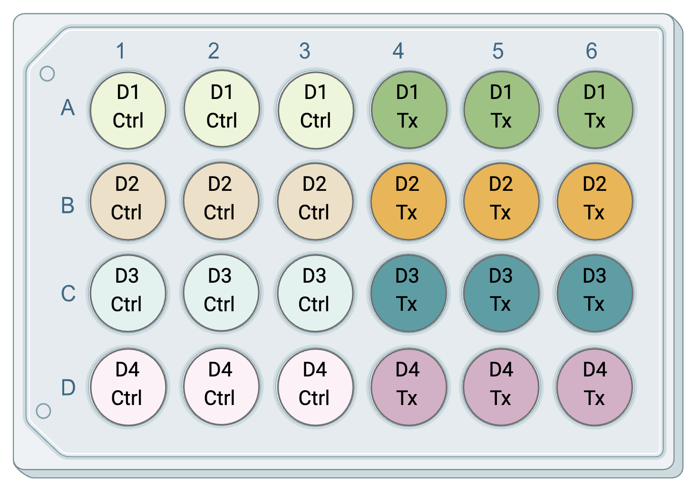
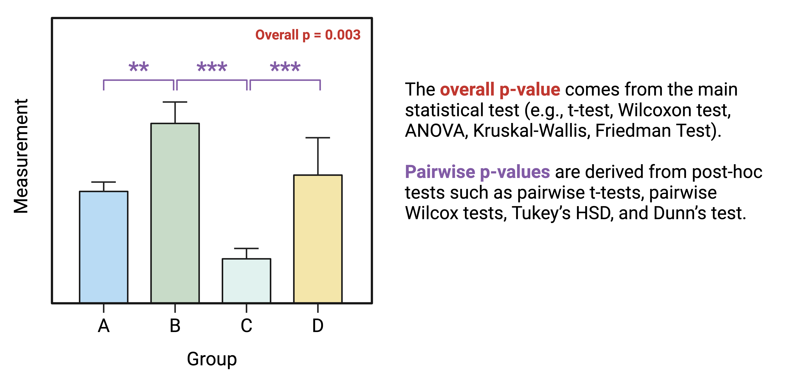
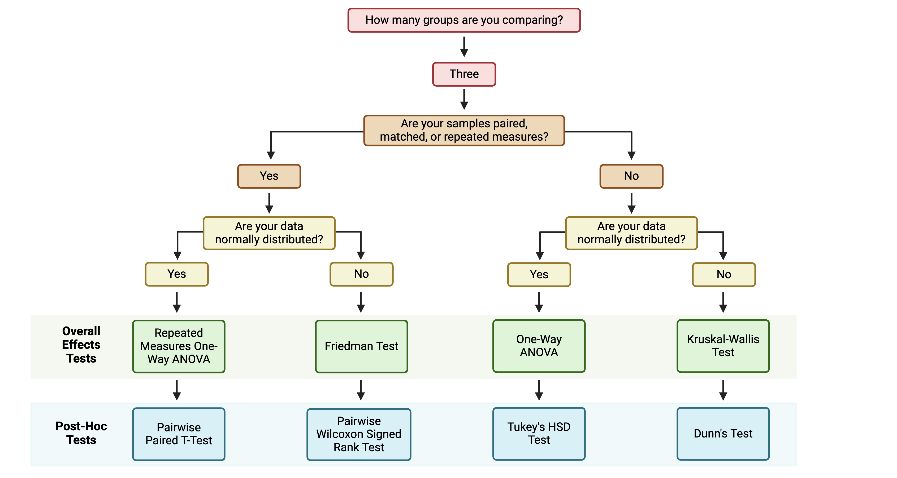

# (PART\*) Chapter 4 Converting Wet Lab Data into Dry Lab Analyses {-}


<!-- ############################################################################################################################# -->

<!-- ################################################## -->
<!-- ################################################## -->
<!-- START SECTION ONE  -->
<!-- ################################################## -->
<!-- ################################################## -->


# Overview of Experimental Design and Example Data 

This training module was developed by Elise Hickman, Sarah Miller, and Julia E. Rager.

All input files (script, data, and figures) can be downloaded from the [UNC-SRP TAME2 GitHub website](https://github.com/UNCSRP/TAME2).

## Introduction to Training Module

Converting wet lab experimentation data into dry lab analyses facilitates reproducibility and transparency in data analysis. This is helpful for consistency across members of the same research group, review of analyses by collaborators or reviewers, and implementation of similar future analyses. In comparison with analysis workflows that use subscription- or license-based applications, such as Prism or SAS, analysis workflows that leverage open-source programming languages such as R also increase accessibility of analyses. Additionally, scripted analyses minimize the risk for copy-paste error, which can occur when cleaning experimental data, transferring it to an analysis application, and exporting and formatting analysis results.

Some of the barriers in converting wet lab experimentation into dry lab analyses include data cleaning, selection and implementation of appropriate statistical tests, and reporting results. This chapter will provide introductory material guiding wet-bench scientists in R analyses, bridging the gap between commonly available R tutorials (which, while helpful, may not provide sufficient level of detail or relevant examples) and intensive data science workflows (which may be too detailed). 

In this module, we will provide an overview of key experimental design features and terms that will be used throughout this chapter, and we will provide a detailed overview of the example data. In the subsequent modules, we will dive into analyzing the example data.

## Replicates

One of the most important components of selecting an appropriate analysis is first understanding how data should be compared between samples, which often means addressing experimental replicates. There are two main types of replicates that are used in environmental health research: biological replicates and technical replicates. 

### Biological Replicates

Biological replicates are the preferred unit of statistical comparison because they represent biologically distinct samples, demonstrating biological variation in the system. What is considered to be a biological replicate can depend on what model system is being used. For example, in studies with human clinical samples or cells from different human donors, the different humans are considered the biological replicates. In studies using animals as model organisms, individual animals are typically considered biological replicates, although this can vary depending on the experimental design. In studies that use cell lines, which are derived from one human or animal and are modified to continuously grow in culture, a biological replicate could be either cells from different passages (different thawed aliquots) grown in completely separate flasks, all experimented with on the same day, or repeating an experiment on the same set of cells (one thawed aliquot) but on separate experimental days, so the cells have grown/replicated between experiments. 

The final "N" that you report should reflect your biological replicates, or independent experiments. What constitutes an independent experiment or biological replicate is highly field-, lab-, organism-, and endpoint-dependent, so make sure to discuss this within your research group in the experiment planning phase and again before your analysis begins. No matter what you choose, ensure that when you report your results, you are transparent about what your biological replicates are. For example, the below diagram (adapted from [BitesizeBio](https://bitesizebio.com/47982/n-number-cell-lines/)) illustrates different ways of defining replicates in experiments with cell lines: 

<div class="figure" style="text-align: center">

<p class="caption">(\#fig:unnamed-chunk-1)Created with *BioRender.com*</p>
</div>

N = 3 cells could be considered technical replicates if the endpoint of interest is very low throughput, such as single cell imaging or analyses. N = 3 cell culture wells is a more common approach to technical replicates and is typically used when one sample is collected from each well, such as in the case of media or cell lysate collection. Note that each well within the Week 1 biological replicate would be considered a technical replicate for Week 1's experiment. Similarly, each well within the Week 2 biological replicate would be considered a technical replicate for Week 2's experiment. For more on technical replicates, see the next section. 

Although N = 3 cell lines is a less common approach to biological replicates, some argue for this approach because each cell line is typically derived from one biological source. In this scenario, each of the cell lines would be unique but would represent the same cell type or lineage (e.g., for respiratory epithelium, A549, 16HBE, and BEAS-2B cell lines). 

Also note that to perform statistical analyses, an N of at least 3 biological replicates is needed, and an even higher N may be needed for a sufficiently powered study. Although power calculations are outside the scope of this module, we encourage you to use power calculation resources, such as [G*Power](https://www.psychologie.hhu.de/arbeitsgruppen/allgemeine-psychologie-und-arbeitspsychologie/gpower.html) to assist in selecting an appropriate N for your study. 


### Technical Replicates

Technical replicates are repeated measurements on the same sample or biological source, demonstrating the variation underlying protocols, equipment, and sample handling. In environmental health research, there can be technical replicates separately related to either the experimental design or the downstream analyses. Technical replicates related to experimental design refer to the chemical exposure for cell-based (*in vitro*) experiments, where there may be multiple wells of cells from the same passage or human/mouse exposed to the same treatment. Technical replicates related to downstream analyses refer to the endpoints that are measured after chemical exposure in each sample. To illustrate this, consider an experiment where cells from four unique human donors (D1-D4) are grown in cell culture plates, and then three wells of cells from each donor are exposed to a chemical treatment (Tx) or a vehicle control (Ctrl). The plate layout might look something like this, with technical replicates related to experimental design, i.e. chemical exposure, in the same color:

<div class="figure" style="text-align: center">

<p class="caption">(\#fig:unnamed-chunk-2)Created with *BioRender.com*</p>
</div>

For this experiment, we have four biological replicates (the four donors) and three technical exposure replicates per dose (because three wells from each donor were exposed to each condition). The technical replicates here capture potential unintended variation between wells in cell growth and chemical exposure.

Following the exposure of the cells to a chemical of interest, the media is collected from each well and assayed using a plate reader assay for concentrations of a marker of inflammation. For each sample collected (from each well), there are three technical replicates used to measure the concentration of the inflammatory marker. The purpose of these technical replicates is to capture potential unintended well-to-well variation in the plate reader assay. The plate layout might look something like this, ***with the letter and number in each well of the plate layout representing the well in the exposure plate layout that the media sample being assayed came from***:

<div class="figure" style="text-align: center">

<p class="caption">(\#fig:unnamed-chunk-3)Created with *BioRender.com*</p>
</div>


Technical replicates should typically be averaged before performing any statistical analysis. For the experiment described above, we would:

1. Average the technical replicates for the plate reader assay to obtain one value per original cell culture well for inflammatory marker concentration. 

2. Then, average the technical replicates for the chemical exposure to obtain one value per biological replicate (donor). 

This would result in a dataset with eight values (four control and four treatment) for statistical analysis. 

#### Number and inclusion of technical replicates

The above example is just one approach to experimental design. As mentioned above in the biological replicates section, selection of appropriate biological and technical replicates can vary greatly depending on your model organism, experimental design, assay, and standards in the field. For example, there may be cases where well-to-well variation for certain assays is minimal compared with variation between biological replicates, or when including technical replicates for each donor is experimentally or financially unfeasible, resulting in a lack of technical replicates. 

### Matched Experimental Design

Matching (also known as paired or repeated measures) in an experimental design is also a very important concept when selecting the appropriate statistical analysis. In experiments with matched design, multiple measurements are collected from the same biological replicate. This typically provides increased statistical power because changes are observed within each biological replicate relative to its starting point. In environmental health research, this can include study designs such as:

1. Samples were collected from the same individuals, animals, or cell culture wells pre- and post-exposure. 

2. Cells from the same biological replicate were exposed to different doses of a chemical.

The experimental design described above represents a matched design because cells from the same donor are exposed to both the treatment and the vehicle control.

## Orientation to Example Data for Chapter 4

In this chapter, we will be using an example dataset derived from an *in vitro*, or cell culture, experiment. Before diving into analysis of these data in the subsequent modules, we will provide an overview of where these data came from and preview what the input data frames look like.  

### Experimental Design

In this experiment, primary human bronchial epithelial cells (HBECs) from sixteen different donors were exposed to the gas acrolein, which is emitted from the combustion of fossil fuels, tobacco, wood, and plastic. Inhalation exposure to acrolein is associated with airway inhalation, and this study aimed to understand how exposure to acrolein changes secretion of markers of inflammation. Prior to experimentation, the HBECs were grown on a permeable membrane support for 24 days with air on one side and liquid media on the other side, allowing them to differentiate into a form that is very similar to what is found in the human body. The cells were then exposed for 2 hours to 0 (filtered air), 0.6, 1, 2, or 4 ppm acrolein, with two technical replicate wells from each donor per dose. Twenty-four hours later, the media was collected, and concentrations of inflammatory markers were measured using an [enzyme-linked immunosorbent assay (ELISA)](https://www.thermofisher.com/us/en/home/life-science/protein-biology/protein-biology-learning-center/protein-biology-resource-library/pierce-protein-methods/overview-elisa.html). 

<div class="figure" style="text-align: center">

<p class="caption">(\#fig:unnamed-chunk-4)Created with *BioRender.com*</p>
</div>

Note that this is a matched experimental design because cells from every donor were exposed to every concentration of acrolein, rather than cells from different donors being exposed to each of the different doses. 

### Starting Data 

Next, let's familiarize ourselves with the data that resulted from this experiment. There are two input data files, one that contains cytokine concentration data and one that contains demographic information about the donors:


The cytokine data contains information about the cytokine measurements for each of the six proteins measured in the basolateral media for each sample (units = pg/mL), which can be identified by the donor, dose, and replicate columns. The demographic data contains information about the age and sex of each donor. In the subsequent modules, we'll be using these data to assess whether exposure to acrolein significantly changes secretion of inflammatory markers and whether donor characteristics, such as sex and age, modify these responses.

## Concluding Remarks

This module reviewed important components of experimental design, such as replicates and matching, which are critical for data pre-processing and selecting appropriate statistical tests. 

<label class="tykfont">
Test Your Knowledge 
</label>

:::tyk
Read the following experimental design descriptions. For each description, determine the number of biological replicates (per group), the number of technical replicates, and whether the experimental design is matched. 

1. One hundred participants are recruited to a study aiming to determine whether people who use e-cigarettes have different concentrations of inflammatory markers in their airways. Fifty participants are non e-cigarette users and 50 participants are e-cigarette users. After the airway samples are collected, each sample is analyzed with an ELISA, with three measurements taken per sample. 

2. Twenty mice are used in a study aiming to understand the effects of particulate matter on cardiovascular health. The mice are randomized such that half of the mice are exposed to filtered air and half are exposed to particulate matter. During the exposures, the mice are continuously monitored for endpoints such as heart rate and heart function. One month later, the mice that were exposed to particulate matter are exposed to filtered air, and the mice that were exposed to filtered air are exposed to particulate matter, with the same cardiovascular endpoints collected. 
:::


<!-- ############################################################################################################################# -->

<!-- ################################################## -->
<!-- ################################################## -->
<!-- START SECTION TWO  -->
<!-- ################################################## -->
<!-- ################################################## -->


# Data Import, Processing, and Summary Statistics 

This training module was developed by Elise Hickman, Alexis Payton, Sarah Miller, and Julia E. Rager.

All input files (script, data, and figures) can be downloaded from the [UNC-SRP TAME2 GitHub website](https://github.com/UNCSRP/TAME2).

## Introduction to Training Module

The first steps in any scripted analysis of wet-bench data include importing the data, cleaning the data to prepare for analyses, and conducting preliminary data exploration steps, such as addressing missing values, calculating summary statistics, and assessing normality. Although less exciting than diving right into the statistical analysis, these steps are crucial in guiding downstream analyses and ensuring accurate results. In this module, we will discuss each of these steps and work through them using an example dataset (introduced in **TAME 2.0 Module 4.1 Overview of Experimental Design and Example Data** of inflammatory markers secreted by airway epithelial cells after exposure to different concentrations of acrolein.

### Training Module's Environmental Health Questions

This training module was specifically developed to answer the following environmental health questions:

1. What is the mean concentration of each inflammatory biomarker by acrolein concentration?

2. Are our data normally distributed?

## Data Import

First, we need to import our data. Data can be imported into R from many different file formats, including .csv (as demonstrated in previous chapters), .txt, .xlsx, and .pdf. Often, data are formatted in Excel prior to import, and the [*openxlsx*](https://ycphs.github.io/openxlsx/) package provides helpful functions that allow the user to import data from Excel, create workbooks for storing results generated in R, and export data from R to Excel workbooks. Below, we will use the `read.xlsx()` function to import our data directly from Excel. Other useful packages include [*pdftools*](https://github.com/ropensci/pdftools) (PDF import),  [*tm*](https://cran.r-project.org/web/packages/tm/vignettes/tm.pdf) (text mining of PDFs), and [*plater*](https://cran.r-project.org/web/packages/plater/vignettes/plater-basics.html) (plate reader formatted data import).


### Workspace Preparation and Data Import

#### Set working directory

In preparation, first let's set our working directory to the folder path that contains our input files:


```r
setwd("/filepath to where your input files are")
```

#### Load required packages

And load required packages:


```r
library(openxlsx) # for importing Excel files
library(DT) # for easier viewing of data tables
library(tidyverse) # for data cleaning and graphing
library(imputeLCMD) # for data imputation with QRILC
library(table1) # for summary table
library(vtable) # for summary table
library(ggpubr) # for making Q-Q plots with ggplot 
```


#### Import example datasets

Next, let's read in our example datasets:

```r
biomarker_data <- read.xlsx("Module4_2_Input/Module4_2_InputData1.xlsx")
demographic_data <- read.xlsx("Module4_2_Input/Module4_2_InputData2.xlsx")
```

#### View example datasets

First, let's preview our example data. Using the `datatable()` function from the *DT* package allows us to interactively scroll through our biomarker data.

```r
datatable(biomarker_data)
```

```{=html}
<div class="datatables html-widget html-fill-item" id="htmlwidget-edc83e553c0f2ca0ec06" style="width:100%;height:auto;"></div>
<script type="application/json" data-for="htmlwidget-edc83e553c0f2ca0ec06">{"x":{"filter":"none","vertical":false,"data":[["1","2","3","4","5","6","7","8","9","10","11","12","13","14","15","16","17","18","19","20","21","22","23","24","25","26","27","28","29","30","31","32","33","34","35","36","37","38","39","40","41","42","43","44","45","46","47","48","49","50","51","52","53","54","55","56","57","58","59","60","61","62","63","64","65","66","67","68","69","70","71","72","73","74","75","76","77","78","79","80","81","82","83","84","85","86","87","88","89","90","91","92","93","94","95","96","97","98","99","100","101","102","103","104","105","106","107","108","109","110","111","112","113","114","115","116","117","118","119","120","121","122","123","124","125","126","127","128","129","130","131","132","133","134","135","136","137","138","139","140","141","142","143","144","145","146","147","148","149","150","151","152","153","154","155","156","157","158","159","160"],["D1","D2","D3","D4","D5","D6","D7","D8","D9","D10","D11","D12","D13","D14","D15","D16","D1","D2","D3","D4","D5","D6","D7","D8","D9","D10","D11","D12","D13","D14","D15","D16","D1","D2","D3","D4","D5","D6","D7","D8","D9","D10","D11","D12","D13","D14","D15","D16","D1","D2","D3","D4","D5","D6","D7","D8","D9","D10","D11","D12","D13","D14","D15","D16","D1","D2","D3","D4","D5","D6","D7","D8","D9","D10","D11","D12","D13","D14","D15","D16","D1","D2","D3","D4","D5","D6","D7","D8","D9","D10","D11","D12","D13","D14","D15","D16","D1","D2","D3","D4","D5","D6","D7","D8","D9","D10","D11","D12","D13","D14","D15","D16","D1","D2","D3","D4","D5","D6","D7","D8","D9","D10","D11","D12","D13","D14","D15","D16","D1","D2","D3","D4","D5","D6","D7","D8","D9","D10","D11","D12","D13","D14","D15","D16","D1","D2","D3","D4","D5","D6","D7","D8","D9","D10","D11","D12","D13","D14","D15","D16"],[0,0,0,0,0,0,0,0,0,0,0,0,0,0,0,0,0.6,0.6,0.6,0.6,0.6,0.6,0.6,0.6,0.6,0.6,0.6,0.6,0.6,0.6,0.6,0.6,1,1,1,1,1,1,1,1,1,1,1,1,1,1,1,1,2,2,2,2,2,2,2,2,2,2,2,2,2,2,2,2,4,4,4,4,4,4,4,4,4,4,4,4,4,4,4,4,0,0,0,0,0,0,0,0,0,0,0,0,0,0,0,0,0.6,0.6,0.6,0.6,0.6,0.6,0.6,0.6,0.6,0.6,0.6,0.6,0.6,0.6,0.6,0.6,1,1,1,1,1,1,1,1,1,1,1,1,1,1,1,1,2,2,2,2,2,2,2,2,2,2,2,2,2,2,2,2,4,4,4,4,4,4,4,4,4,4,4,4,4,4,4,4],[1,1,1,1,1,1,1,1,1,1,1,1,1,1,1,1,1,1,1,1,1,1,1,1,1,1,1,1,1,1,1,1,1,1,1,1,1,1,1,1,1,1,1,1,1,1,1,1,1,1,1,1,1,1,1,1,1,1,1,1,1,1,1,1,1,1,1,1,1,1,1,1,1,1,1,1,1,1,1,1,2,2,2,2,2,2,2,2,2,2,2,2,2,2,2,2,2,2,2,2,2,2,2,2,2,2,2,2,2,2,2,2,2,2,2,2,2,2,2,2,2,2,2,2,2,2,2,2,2,2,2,2,2,2,2,2,2,2,2,2,2,2,2,2,2,2,2,2,2,2,2,2,2,2,2,2,2,2,2,2],[13.26,11.02,11.32,11.18,8.69,6.71,7.87,10.11,8.869999999999999,12.39,14.11,9.73,9.83,9.75,10.34571428571429,10.11,12.42,11.1,12.54,10.24,8,7.28,7.88,10.93,8.720000000000001,12.06,14.36,8.59,9.07,9.949999999999999,10.22428571428572,10.22428571428572,12.55,11.59,11.61,12.02,8.35,11.76,9.81,11.59,11.13,12.73,14.78,11.45,9.43,11.8,11.47142857142857,11.59,13.23,8.43,12.53,3.13,12.25,11.37,10.33,12.99,10.96,12.66,12.73,10.61,10.31,13.72,11.08928571428571,11.37,10.63,12.81,9.880000000000001,17.28,13.6,11.93,10.66,14.16,12.77,12.46,13.6,7.86,12.42,13.84,12.42142857142857,12.46,12,10.15,10.6,9.880000000000001,7.26,5.83,6.65,8.68,7.74,11.92,12.43,8.800000000000001,8.67,8.16,9.197857142857142,8.800000000000001,13.02,11.3,12.16,10.51,8.16,7.71,8.26,10.91,9.09,12.36,14.15,8.789999999999999,9.130000000000001,9.69,10.37428571428572,10.37428571428572,12.34,10.47,10.94,10.61,7.22,11.33,7.52,10.48,9.789999999999999,11.37,13.67,10.34,8.470000000000001,10.07,10.33,10.47,13.44,8.699999999999999,9.5,13.68,12.26,11.94,10.94,13.5,10.9,12.53,13.25,10.68,10.41,13.64,11.81214285714286,11.94,10.09,12.14,9.18,15.99,12.24,11.11,8.76,13.65,11.74,11.05,12.6,7.31,11.41,12.61,11.42,11.42],[1100.47,472.1,611.87,328.26,14.84,174.38,277.68,2772.77,128.48,414.77,1187.36,615.6799999999999,283.72,187.51,612.135,414.77,1298.94,637.35,828.29,321.39,15.2,114.23,264.92,3417.01,158.27,438.2,1154.57,532.6,269.57,192.66,688.8000000000001,438.2,833.9299999999999,524.11,614.99,439.01,18.2,165.19,228.98,2801.85,131.09,380.11,989.41,508.88,170.14,242.6,574.8921428571429,439.01,1044.69,381.44,772.01,641.17,40.57,123.33,161.79,1859.58,155.81,854.5700000000001,899.76,304.68,163.61,228.69,545.1214285714285,381.44,1123.37,28.83,751.36,219.63,34.57,323.07,481.13,357.62,24.57,190.44,259.75,193.53,16.79,88.91,292.3978571428572,219.63,1107.72,474.48,588.45,321.59,13.91,169.02,280.06,2720.11,127.44,405.93,1199.72,617.52,285.5,188.15,607.1142857142858,405.93,1283.64,636.29,806.98,329.85,17.58,114.66,263.26,3369.52,161.08,435.3,1130.06,526.09,273.04,190.55,681.2785714285714,435.3,811.62,525.76,585.74,434.27,17.83,166.14,235.38,2819.04,129.11,373.4,983.37,511.28,169.22,234.69,571.2035714285714,434.27,1022.94,393.13,760.5700000000001,650.22,42.54,124.06,165.67,1902.58,152.02,818.87,901.15,313.42,167.34,227.12,545.8307142857144,393.13,1146.83,27.84,756.48,195.28,35.88,333.79,478.45,377.49,25.45,182.44,263.98,197.61,15.58,91.31999999999999,294.8871428571429,197.61],[36292.57,25439.34,24654.6,23825.7,17504.9,11099.84,12415.64,18131.15,20614.12,35493.56,33949.25,15885.92,20604.15,16270.8,22298.68142857143,20614.12,46107.81,25876.96,30163.14,22211.63,15943.24,11196.96,14713.98,21742.66,18827.56,36444.95,48042.38,16594.76,19994.08,17964.85,24701.78285714286,21742.66,36166.34,null,26696.07,29626.69,17143.72,13923.51,15166.47,22525.33,null,35901.82,46541.14,null,20075.02,22585.19,26031.93636363637,24308.56318181818,42729.62,31695.42,34751.24,64650.82,38096.75,47679.53,22894.16,33252.23,26798.35,81542.88,74197.75999999999,29052.07,19997.71,36989.15,41737.69214285714,36989.15,123431.3,161270.2,144296.4,41552.38,83413.5,78688.66,137315.2,37062.96,85823.24000000001,108839.5,69392.60000000001,84240.08,102113.6,84952.55,95885.15500000003,85823.24000000001,37033.11,24499.93,24966.09,23887.29,17616.43,10569.15,12178.42,17368.88,20550.84,34456.03,31713.68,15808.44,19893.89,15527.56,21862.12428571429,20550.84,46936.91,26452.63,30843.75,22811.07,16464.42,11423.21,14581.4,22215.35,18670.46,37835.25,47679.75,17309.63,19654.98,18069.5,25067.73642857143,22215.35,36194.8,null,26424.8,29906.94,17343.9,13767.75,14775.73,22228.43,null,35274.58,45466.64,null,19170.36,21962.01,25683.26727272727,23955.84863636364,44222.37,30332.27,35141.75,65716.10000000001,39143.03,48158.27,22397.82,33115.8,26747.61,85040.21000000001,73174.89999999999,28667.48,20823.16,38032.79,42193.82571428572,38032.79,121294,159996.4,141851.8,41551.05,83766.34,80988.08,131484.6,35575.33,80646.31,107679.3,71046.63,83514.25999999999,97088.25,83421.81,94278.86857142857,83766.34],[0.32,2.89,0.21,1.19,0.48,1.48,1.04,0.88,1.39,0.22,1.35,0.78,0.43,1.94,1.042857142857143,1.04,0.08,0.15,0.07000000000000001,0.37,0.16,1.93,1.64,1.13,1.02,null,1.09,0.23,null,0.16,0.6691666666666666,0.37,0.5,0.48,0.61,1.76,0.29,0.75,2.4,0.9399999999999999,0.34,0.29,1.39,0.7,4.12,1.05,1.115714285714285,0.75,0.04,0.62,0.65,2.05,1.96,0.98,0.08,0.73,0.47,0.27,1,1.77,1.39,1.6,0.9721428571428572,0.9721428571428572,0.59,1.7,0.3,3.66,0.89,0.48,1.28,1.99,1.83,1.2,2.31,0.36,0.9,1.57,1.361428571428571,1.28,0.26,0.23,0.27,0.48,1.34,3.8,0.1,1.16,8.029999999999999,0.05,6.71,0.1,2.31,0.25,1.792142857142857,0.48,0.11,0.31,0.11,0.09,0.15,1.39,0.02,0.72,0.01,null,2.11,0.12,null,0.14,0.4399999999999999,0.14,0.26,0.62,0.3,0.29,10.6,1.23,0.18,1.18,0.31,0.16,1.55,0.58,null,0.67,1.379230769230769,0.6,1.73,0.73,0.17,0.54,0.44,1.05,0.17,0.93,0.54,0.19,0.9399999999999999,1.91,0.9,0.76,0.7857142857142857,0.76,0.16,1.6,0.2,2.53,0.72,0.25,1.24,1.96,1.73,1,1.92,0.16,0.73,1.61,1.129285714285714,1.129285714285714],[2.21,2.14,7.36,3.53,3.63,1.93,1.1,3.72,0.74,1.98,7.27,2,1.01,1.61,2.873571428571428,2.14,2.56,2.72,1.61,3.65,3.5,2.51,1.11,4.26,1.12,1.89,8.25,2.53,1.03,2.11,2.775000000000001,2.53,2.51,2.73,2.15,3.29,2.42,4.01,18.78,4.49,2.34,2.15,6.57,3.64,0.86,1.88,4.13,2.73,2.41,3.98,1.62,4.92,4,6.71,1.74,6.21,4.33,2.92,7.89,9.460000000000001,5.34,5.7,4.802142857142857,4.802142857142857,3.54,6.52,2.61,11.85,5.8,2.94,4.27,9.1,7.22,6.1,8.85,2.02,4.68,7.04,5.895714285714286,5.895714285714286,3.07,2.98,2.15,5.58,3.59,2.98,2.82,5.83,1.47,2.67,9.56,2.21,2,3.93,3.631428571428572,2.98,2.37,3.32,2.03,4.26,4.67,4.14,1.88,4.92,1.91,1.99,8.65,3,1.58,2.49,3.372142857142857,3,2.78,3.38,3.08,5.21,3.38,4.52,3.42,6.65,3.55,3.51,9.210000000000001,4.56,1.77,3.93,4.210714285714285,3.55,2.97,5.22,2.05,9.029999999999999,4.57,7.55,2.91,7.77,5.68,3.57,8.050000000000001,7.44,6.14,6.36,5.664999999999999,5.68,9.220000000000001,7.36,3.77,12.72,6.7,4.03,7.25,11.08,7.75,6.16,11.51,1.92,5.44,10.29,7.514285714285713,7.36],[840.15,1473.95,659.11,317.44,684.41,1747.14,1283.13,963.13,888.54,1403.65,523.91,688.66,607.05,1619.15,978.5299999999999,888.54,843.51,1797.04,594.4400000000001,296.94,634.76,1991.14,1316.97,911.71,1087.69,1366.48,593.3,686.04,627.85,1592.17,1024.288571428571,911.71,724.58,1756.42,533.08,393.74,789.4299999999999,2897.94,1286.39,1055.57,1376.92,1397.72,678.89,793.83,1204.1,1823.47,1193.72,1193.72,1055.99,3508.22,641.35,670.59,1398.74,2525.07,1666.68,1555.25,2306.87,1672.74,942.61,1938.45,2418.53,2049.55,1739.331428571429,1672.74,2087.9,2103.69,2113.62,511.01,1674,954.04,3401.2,677.6,1948.54,2433.39,638.5,159.97,1875.89,1953.13,1609.462857142857,1875.89,817.28,1491.14,652.09,303.76,688.6900000000001,1734.19,1295.18,978.83,889.84,1387.21,518.89,687.02,606.72,1600.92,975.1257142857141,889.84,849.7,1820.32,571.1900000000001,298.29,631.72,2050.29,1329.88,930.85,1083.1,1394.52,602.22,674.5700000000001,652.22,1613.52,1035.885,930.85,714.8099999999999,1819.75,513.11,389.76,775.8200000000001,2968.98,1367.26,1059.32,1391.71,1402.56,682.28,778.09,1171.59,1777.33,1200.883571428572,1171.59,1056.56,3572.19,674.8,692.03,1421.1,2595.99,1694.72,1625.5,2367.68,1701.4,982.65,1950.98,2484.71,2066.93,1777.66,1701.4,2061.36,2080.9,2042.7,492.12,1659.16,949.41,3399.82,673.67,1951.32,2421.46,634.86,154.07,1828.42,1958.01,1593.377142857142,1828.42]],"container":"<table class=\"display\">\n  <thead>\n    <tr>\n      <th> <\/th>\n      <th>Donor<\/th>\n      <th>Dose<\/th>\n      <th>Replicate<\/th>\n      <th>IL1B<\/th>\n      <th>IL6<\/th>\n      <th>IL8<\/th>\n      <th>IL10<\/th>\n      <th>TNFa<\/th>\n      <th>VEGF<\/th>\n    <\/tr>\n  <\/thead>\n<\/table>","options":{"columnDefs":[{"className":"dt-right","targets":[2,3,4,5,6,7,8,9]},{"orderable":false,"targets":0},{"name":" ","targets":0},{"name":"Donor","targets":1},{"name":"Dose","targets":2},{"name":"Replicate","targets":3},{"name":"IL1B","targets":4},{"name":"IL6","targets":5},{"name":"IL8","targets":6},{"name":"IL10","targets":7},{"name":"TNFa","targets":8},{"name":"VEGF","targets":9}],"order":[],"autoWidth":false,"orderClasses":false}},"evals":[],"jsHooks":[]}</script>
```

We can see that our biomarker data are arranged with samples in rows and sample information and biomarker measurements in the columns. 


```r
datatable(demographic_data)
```

```{=html}
<div class="datatables html-widget html-fill-item" id="htmlwidget-701d44c2d6f6031fc22d" style="width:100%;height:auto;"></div>
<script type="application/json" data-for="htmlwidget-701d44c2d6f6031fc22d">{"x":{"filter":"none","vertical":false,"data":[["1","2","3","4","5","6","7","8","9","10","11","12","13","14","15","16"],["D1","D2","D3","D4","D5","D6","D7","D8","D9","D10","D11","D12","D13","D14","D15","D16"],[22,35,27,60,43,38,26,36,40,44,46,52,58,65,37,25],["M","F","M","F","F","M","M","F","F","M","M","M","M","M","F","F"]],"container":"<table class=\"display\">\n  <thead>\n    <tr>\n      <th> <\/th>\n      <th>Donor<\/th>\n      <th>Age_yr<\/th>\n      <th>Sex<\/th>\n    <\/tr>\n  <\/thead>\n<\/table>","options":{"columnDefs":[{"className":"dt-right","targets":2},{"orderable":false,"targets":0},{"name":" ","targets":0},{"name":"Donor","targets":1},{"name":"Age_yr","targets":2},{"name":"Sex","targets":3}],"order":[],"autoWidth":false,"orderClasses":false}},"evals":[],"jsHooks":[]}</script>
```

Our demographic data provide information about the donors that our cells came from, matching to the `Donor` column in our biomarker data. 

## Handling Missing Values

Next, we will investigate whether we have missing values and which variables and donors have missing values.


```r
# Calculate the total number of NAs per variable
biomarker_data %>% 
  summarise(across(IL1B:VEGF, ~sum(is.na(.))))
```

```
##   IL1B IL6 IL8 IL10 TNFa VEGF
## 1    0   0   6    5    0    0
```

```r
# Calculate the number of missing values per subject
biomarker_data %>%
  group_by(Donor) %>%
  summarise(across(IL1B:VEGF, ~sum(is.na(.))))
```

```
## # A tibble: 16 × 7
##    Donor  IL1B   IL6   IL8  IL10  TNFa  VEGF
##    <chr> <int> <int> <int> <int> <int> <int>
##  1 D1        0     0     0     0     0     0
##  2 D10       0     0     0     2     0     0
##  3 D11       0     0     0     0     0     0
##  4 D12       0     0     2     0     0     0
##  5 D13       0     0     0     3     0     0
##  6 D14       0     0     0     0     0     0
##  7 D15       0     0     0     0     0     0
##  8 D16       0     0     0     0     0     0
##  9 D2        0     0     2     0     0     0
## 10 D3        0     0     0     0     0     0
## 11 D4        0     0     0     0     0     0
## 12 D5        0     0     0     0     0     0
## 13 D6        0     0     0     0     0     0
## 14 D7        0     0     0     0     0     0
## 15 D8        0     0     0     0     0     0
## 16 D9        0     0     2     0     0     0
```

Here, we can see that we do have a few missing values. What should we do with these values?

### Missing Values and Data Imputation

#### Missing values

Before deciding what to do about our missing values, it's important to understand why they are missing. There are a few different types of missing values that could be present in a dataset:

1. **Missing completely at random (MCAR):** has nothing to do with the experimental unit being studied (e.g., a sample is damaged or lost in the lab)

2. **Missing at random (MAR):** there may be a systematic difference between missing and measured values, but they can be explained by observed differences in the data or experimental unit

3. **Missing not at random (MNAR):** data are missing due to factors that are not observed/measured (e.g., measurement for a specific endpoint is below the limit of detection (LOD) of an assay)

We know from the researchers who generated this dataset that the values are missing because these specific proteins were below the limit of detection for the assay for certain samples; therefore, our data are missing not at random. This can help us with our choice of imputation method, described below. 

#### Imputation

Imputation is the assignment of a value to a missing data point by inferring that value from other properties of the dataset or externally defined limits. Whether or not you should impute your data is not a one-size-fits-all approach and may vary depending on your field, experimental design, the type of data, and the type of missing values in your dataset. Two questions you can ask yourself when deciding whether or not to impute data are:

1. Is imputation needed for downstream analyses? *Some analyses are not permissive to including NAs or 0s; others are.* 

2. Will imputing values bias my analyses unnecessarily? *If so, consider analyzing subsets of the data that are complete separately.*


There are many different imputation methods (too many to cover them all in this module); here, we will introduce a few that we use most often. We encourage you to explore these in more depth and to understand typical imputation workflows for your lab, data type, and/or discipline. 

- For variables where imputed values are expected to be generally bound by the existing range of data (e.g., MCAR): [missForest](https://rpubs.com/lmorgan95/MissForest)

- For variables with samples below the limit of detection for the assay, such as for mass spectrometry or ELISAs (e.g., MNAR)
  - Replace non-detects with the limit of detection divided by the square root of 2
  - [Quantile Regression Imputation of Left-Censored Data (QRILC)](https://www.nature.com/articles/s41598-017-19120-0)
  - [GSimp](https://github.com/WandeRum/GSimp) (can also be used to impute values above a specific threshold)

If you do impute missing values, make sure to include both your raw and imputed data, along with detailed information about the imputation method, within your manuscript, supplemental information, and/or GitHub. You can even present summary statistics for both raw and imputed data for additional transparency. 

### Imputation of Our Data

Before imputing our data, it is a good idea to implement a background filter that checks to see if a certain percentage of values for each variable are missing. For variables with a very high percentage of missing values, imputation can be unreliable because there is not enough information for the imputation algorithm to reference. The threshold for what this percentage should be can vary by study design and the extent to which your data are subset into groups that may have differing biomarker profiles; however, a common threshold we frequently use is to remove variables with missing data for 25% or more of samples. 

We can use the following code to calculate the percentage values missing for each endpoint:

```r
biomarker_data %>% 
  summarise(across(IL1B:VEGF, ~sum(is.na(.))/nrow(biomarker_data)*100))
```

```
##   IL1B IL6  IL8  IL10 TNFa VEGF
## 1    0   0 3.75 3.125    0    0
```

Here, we can see that only about 3-4% of values are missing for our variables with missing data, so we will proceed to imputation with our dataset as-is. 

We will impute values using QRILC, which pulls from the left side of the data distribution (the lower values) to impute missing values. We will write a function that will apply QRILC imputation to our dataframe. This function takes a data frame with missing values as input and returns a dataframe with QRILC imputed values in place of NAs as output. 

```r
QRILC_imputation = function(df){
  
    # Normalize data before applying QRILC per QRILC documentation
    ## Select only numeric columns, log2 transform, and convert to a matrix
    ### 4 comes from there being 3 metadata columns before the numeric data starts
    QRILC_prep = df[,4:dim(df)[2]] %>% 
         mutate_all(., function(x) log2(x + 1)) %>%
         as.matrix()

    imputed_QRILC_object = impute.QRILC(QRILC_prep, tune.sigma = 0.1)
    QRILC_log2_df = data.frame(imputed_QRILC_object[1]) 
    
    # Converting back the original scale
    QRILC_df = QRILC_log2_df %>%
        mutate_all(., function(x) 2^x - 1)
    
    # Adding back in metadata columns
    QRILC_df = cbind(Donor = df$Donor,
                     Dose = df$Dose,
                     Replicate = df$Replicate,
                     QRILC_df)
    
   return(QRILC_df)
}
```

Now we can apply the QRILC function to our dataframe. We use the function `set.seed()` to ensure that the QRILC function generates the same numbers each time we run the script. For more on setting seeds, see [here](https://www.statology.org/set-seed-in-r/).

```r
# Set random seed to ensure reproducibility in results
set.seed(1104)

# Apply function
biomarker_data_imp <- QRILC_imputation(biomarker_data)
```

## Averaging Replicates

The last step we need to take before our data are ready for analysis is averaging the two technical replicates for each donor and dose. We will do this by creating an ID column that represents the donor and dose together and using that column to group and average the data. This results in a dataframe where our rows contain data representing each biological replicate exposed to each of the five concentrations of acrolein. 

```r
biomarker_data_imp_avg <- biomarker_data_imp %>%
  
  # Create an ID column that represents the donor and dose
  unite(Donor_Dose, Donor, Dose, sep = "_") %>%
  
  # Average replicates with each unique Donor_Dose
  group_by(Donor_Dose) %>%
  summarize(across(IL1B:VEGF, mean)) %>%
  
  # Round results to the same number of significant figures as the original data
   mutate(across(IL1B:VEGF, \(x) round(x, 2))) %>%

  # Separate back out the Donor_Dose column
  separate(Donor_Dose, into = c("Donor", "Dose"), sep = "_")

# View new data frame
datatable(biomarker_data_imp_avg)
```

```{=html}
<div class="datatables html-widget html-fill-item" id="htmlwidget-02c2bf491448623fd298" style="width:100%;height:auto;"></div>
<script type="application/json" data-for="htmlwidget-02c2bf491448623fd298">{"x":{"filter":"none","vertical":false,"data":[["1","2","3","4","5","6","7","8","9","10","11","12","13","14","15","16","17","18","19","20","21","22","23","24","25","26","27","28","29","30","31","32","33","34","35","36","37","38","39","40","41","42","43","44","45","46","47","48","49","50","51","52","53","54","55","56","57","58","59","60","61","62","63","64","65","66","67","68","69","70","71","72","73","74","75","76","77","78","79","80"],["D10","D10","D10","D10","D10","D11","D11","D11","D11","D11","D12","D12","D12","D12","D12","D13","D13","D13","D13","D13","D14","D14","D14","D14","D14","D15","D15","D15","D15","D15","D16","D16","D16","D16","D16","D1","D1","D1","D1","D1","D2","D2","D2","D2","D2","D3","D3","D3","D3","D3","D4","D4","D4","D4","D4","D5","D5","D5","D5","D5","D6","D6","D6","D6","D6","D7","D7","D7","D7","D7","D8","D8","D8","D8","D8","D9","D9","D9","D9","D9"],["0","0.6","1","2","4","0","0.6","1","2","4","0","0.6","1","2","4","0","0.6","1","2","4","0","0.6","1","2","4","0","0.6","1","2","4","0","0.6","1","2","4","0","0.6","1","2","4","0","0.6","1","2","4","0","0.6","1","2","4","0","0.6","1","2","4","0","0.6","1","2","4","0","0.6","1","2","4","0","0.6","1","2","4","0","0.6","1","2","4","0","0.6","1","2","4"],[12.16,12.21,12.05,12.6,11.75,13.27,14.25,14.23,12.99,13.1,9.27,8.69,10.89,10.64,7.58,9.25,9.1,8.949999999999999,10.36,11.91,8.960000000000001,9.82,10.94,13.68,13.23,9.77,10.3,10.9,11.45,11.92,9.460000000000001,10.3,11.03,11.66,11.94,12.63,12.72,12.45,13.33,10.36,10.59,11.2,11.03,8.57,12.47,10.96,12.35,11.28,11.02,9.529999999999999,10.53,10.38,11.31,8.4,16.63,7.98,8.08,7.78,12.25,12.92,6.27,7.5,11.55,11.66,11.52,7.26,8.07,8.66,10.64,9.710000000000001,9.390000000000001,10.92,11.04,13.25,13.9,8.31,8.91,10.46,10.93,12.25],[410.35,436.75,376.76,836.72,186.44,1193.54,1142.31,986.39,900.45,261.86,616.6,529.34,510.08,309.05,195.57,284.61,271.3,169.68,165.48,16.18,187.83,191.6,238.65,227.9,90.12,609.62,685.04,573.05,545.48,293.64,410.35,436.75,436.64,387.29,208.62,1104.09,1291.29,822.77,1033.82,1135.1,473.29,636.8200000000001,524.9400000000001,387.29,28.34,600.16,817.64,600.36,766.29,753.92,324.92,325.62,436.64,645.7,207.45,14.38,16.39,18.01,41.55,35.22,171.7,114.45,165.66,123.69,328.43,278.87,264.09,232.18,163.73,479.79,2746.44,3393.26,2810.45,1881.08,367.56,127.96,159.68,130.1,153.92,25.01],[34974.79,37140.1,35588.2,83291.53999999999,108259.4,32831.47,47861.07,46003.89,73686.33,70219.61,15847.18,16952.19,9090.41,28859.78,83877.17,20249.02,19824.53,19622.69,20410.44,99600.92,15899.18,18017.18,22273.6,37510.97,84187.17999999999,22080.4,24884.76,25857.6,41965.76,95082.00999999999,20582.48,21979,24132.21,37510.97,84794.78999999999,36662.84,46522.36,36180.57,43476,122362.65,24969.64,26164.79,9087.049999999999,31013.84,160633.3,24810.35,30503.45,26560.43,34946.49,143074.1,23856.5,22511.35,29766.81,65183.46,41551.72,17560.67,16203.83,17243.81,38619.89,83589.92,10834.49,11310.08,13845.63,47918.9,79838.37,12297.03,14647.69,14971.1,22645.99,134399.9,17750.02,21979,22376.88,33184.02,36319.14,20582.48,18749.01,9107.459999999999,26772.98,83234.77],[0.14,-0.19,0.22,0.23,1.1,4.03,1.6,1.47,0.97,2.12,0.44,0.18,0.64,1.84,0.26,1.37,-0.19,1.96,1.14,0.8100000000000001,1.09,0.15,0.86,1.18,1.59,1.42,0.55,1.25,0.88,1.25,0.76,0.26,0.68,0.87,1.2,0.29,0.1,0.38,0.88,0.37,1.56,0.23,0.55,0.68,1.65,0.24,0.09,0.45,0.41,0.25,0.84,0.23,1.02,1.29,3.09,0.91,0.15,5.44,1.2,0.8,2.64,1.66,0.99,1.01,0.36,0.57,0.83,1.29,0.12,1.26,1.02,0.92,1.06,0.83,1.98,4.71,0.52,0.33,0.5,1.78],[2.33,1.94,2.83,3.24,6.13,8.42,8.449999999999999,7.89,7.97,10.18,2.1,2.76,4.1,8.449999999999999,1.97,1.5,1.31,1.31,5.74,5.06,2.77,2.3,2.9,6.03,8.66,3.25,3.07,4.17,5.23,6.7,2.56,2.76,3.14,5.24,6.63,2.64,2.46,2.64,2.69,6.38,2.56,3.02,3.06,4.6,6.94,4.76,1.82,2.62,1.83,3.19,4.56,3.96,4.25,6.97,12.29,3.61,4.08,2.9,4.28,6.25,2.46,3.32,4.26,7.13,3.49,1.96,1.5,11.1,2.33,5.76,4.78,4.59,5.57,6.99,10.09,1.1,1.52,2.94,5,7.48],[1395.43,1380.5,1400.14,1687.07,2427.43,521.4,597.76,680.58,962.63,636.6799999999999,687.84,680.3,785.96,1944.71,157.02,606.88,640.03,1187.85,2451.62,1852.15,1610.03,1602.84,1800.4,2058.24,1955.57,976.83,1030.09,1197.3,1758.5,1601.42,889.1900000000001,921.28,1182.65,1687.07,1852.15,828.72,846.6,719.7,1056.28,2074.63,1482.54,1808.68,1788.09,3540.2,2092.3,655.6,582.8099999999999,523.09,658.08,2078.16,310.6,297.61,391.75,681.3099999999999,501.57,686.55,633.24,782.63,1409.92,1666.58,1740.66,2020.71,2933.46,2560.53,951.72,1289.16,1323.43,1326.83,1680.7,3400.51,970.98,921.28,1057.45,1590.37,675.64,889.1900000000001,1085.39,1384.32,2337.27,1949.93]],"container":"<table class=\"display\">\n  <thead>\n    <tr>\n      <th> <\/th>\n      <th>Donor<\/th>\n      <th>Dose<\/th>\n      <th>IL1B<\/th>\n      <th>IL6<\/th>\n      <th>IL8<\/th>\n      <th>IL10<\/th>\n      <th>TNFa<\/th>\n      <th>VEGF<\/th>\n    <\/tr>\n  <\/thead>\n<\/table>","options":{"columnDefs":[{"className":"dt-right","targets":[3,4,5,6,7,8]},{"orderable":false,"targets":0},{"name":" ","targets":0},{"name":"Donor","targets":1},{"name":"Dose","targets":2},{"name":"IL1B","targets":3},{"name":"IL6","targets":4},{"name":"IL8","targets":5},{"name":"IL10","targets":6},{"name":"TNFa","targets":7},{"name":"VEGF","targets":8}],"order":[],"autoWidth":false,"orderClasses":false}},"evals":[],"jsHooks":[]}</script>
```

## Descriptive Statistics

Generating descriptive statistics (e.g., mean, median, mode, range, standard deviation) can be helpful for understanding the general distribution of your data and for reporting results either in the main body of a manuscript/report (for small datasets) or in the supplementary material (for larger datasets). There are a number of different approaches that can be used to calculate summary statistics, including functions that are part of base R and that are part of packages. Here, we will demonstrate a few different ways to efficiently calculate descriptive statistics across our dataset. 

### Method #1 - Tidyverse and Basic Functions

The mean, or average of data points, is one of the most commonly reported summary statistics and is often reported as mean ± standard deviation to demonstrate the spread in the data. Here, we will make a table of mean ± standard deviation for each of our biomarkers across each of the dose groups using *tidyverse* functions. 


```r
# Calculate means
biomarker_group_means <- biomarker_data_imp_avg %>%
  group_by(Dose) %>%
  summarise(across(IL1B:VEGF, \(x) mean(x))) 

# View data
datatable(biomarker_group_means)
```

```{=html}
<div class="datatables html-widget html-fill-item" id="htmlwidget-ef55400c9206c1c4f393" style="width:100%;height:auto;"></div>
<script type="application/json" data-for="htmlwidget-ef55400c9206c1c4f393">{"x":{"filter":"none","vertical":false,"data":[["1","2","3","4","5"],["0","0.6","1","2","4"],[9.75375,10.3,10.909375,11.464375,11.92],[597.1693749999999,669.520625,564.5225,535.59,288.328125],[21986.78375,24703.149375,22606.77125,41687.335,94439.059375],[1.376875,0.443125,1.161875,0.876875,1.241875],[3.21,3.05375,4.105,5.2325,6.7],[971.35,1023.284375,1196.3875,1754.03125,1617.09125]],"container":"<table class=\"display\">\n  <thead>\n    <tr>\n      <th> <\/th>\n      <th>Dose<\/th>\n      <th>IL1B<\/th>\n      <th>IL6<\/th>\n      <th>IL8<\/th>\n      <th>IL10<\/th>\n      <th>TNFa<\/th>\n      <th>VEGF<\/th>\n    <\/tr>\n  <\/thead>\n<\/table>","options":{"columnDefs":[{"className":"dt-right","targets":[2,3,4,5,6,7]},{"orderable":false,"targets":0},{"name":" ","targets":0},{"name":"Dose","targets":1},{"name":"IL1B","targets":2},{"name":"IL6","targets":3},{"name":"IL8","targets":4},{"name":"IL10","targets":5},{"name":"TNFa","targets":6},{"name":"VEGF","targets":7}],"order":[],"autoWidth":false,"orderClasses":false}},"evals":[],"jsHooks":[]}</script>
```

You'll notice that there are a lot of decimal places in our calculated means, while in our original data, there are only two decimal places. We can add a step to round the data to our above code chunk to produce cleaner results.


```r
# Calculate means
biomarker_group_means <- biomarker_data_imp_avg %>%
  group_by(Dose) %>%
  summarise(across(IL1B:VEGF, \(x) mean(x))) %>%
  mutate(across(IL1B:VEGF, \(x) round(x, 2)))

# View data
datatable(biomarker_group_means)
```

```{=html}
<div class="datatables html-widget html-fill-item" id="htmlwidget-e04e2e2549e5b7434b75" style="width:100%;height:auto;"></div>
<script type="application/json" data-for="htmlwidget-e04e2e2549e5b7434b75">{"x":{"filter":"none","vertical":false,"data":[["1","2","3","4","5"],["0","0.6","1","2","4"],[9.75,10.3,10.91,11.46,11.92],[597.17,669.52,564.52,535.59,288.33],[21986.78,24703.15,22606.77,41687.34,94439.06],[1.38,0.44,1.16,0.88,1.24],[3.21,3.05,4.1,5.23,6.7],[971.35,1023.28,1196.39,1754.03,1617.09]],"container":"<table class=\"display\">\n  <thead>\n    <tr>\n      <th> <\/th>\n      <th>Dose<\/th>\n      <th>IL1B<\/th>\n      <th>IL6<\/th>\n      <th>IL8<\/th>\n      <th>IL10<\/th>\n      <th>TNFa<\/th>\n      <th>VEGF<\/th>\n    <\/tr>\n  <\/thead>\n<\/table>","options":{"columnDefs":[{"className":"dt-right","targets":[2,3,4,5,6,7]},{"orderable":false,"targets":0},{"name":" ","targets":0},{"name":"Dose","targets":1},{"name":"IL1B","targets":2},{"name":"IL6","targets":3},{"name":"IL8","targets":4},{"name":"IL10","targets":5},{"name":"TNFa","targets":6},{"name":"VEGF","targets":7}],"order":[],"autoWidth":false,"orderClasses":false}},"evals":[],"jsHooks":[]}</script>
```

:::question
<i>With this, we can answer **Environmental Health Question 1**:</i> 

What is the mean concentration of each inflammatory biomarker by acrolein concentration?
:::

:::answer
**Answer:** With the above table, we can see the mean concentrations for each of our inflammatory biomarkers by acrolein dose. IL-8 overall has the highest concentrations, followed by VEGF and IL-6. For IL1B, IL8, TNFa, and VEGF, it appears that the concentration of the biomarker goes up with increasing dose. 
:::

We can use very similar code to calculate our standard deviations:


```r
# Calculate means
biomarker_group_sds <- biomarker_data_imp_avg %>%
  group_by(Dose) %>%
  summarise(across(IL1B:VEGF, \(x) sd(x))) %>%
  mutate(across(IL1B:VEGF, \(x) round(x, 1)))

# View data
datatable(biomarker_group_sds)
```

```{=html}
<div class="datatables html-widget html-fill-item" id="htmlwidget-2706b4ab2b65e64ce424" style="width:100%;height:auto;"></div>
<script type="application/json" data-for="htmlwidget-2706b4ab2b65e64ce424">{"x":{"filter":"none","vertical":false,"data":[["1","2","3","4","5"],["0","0.6","1","2","4"],[1.9,1.9,1.5,1.6,2],[658.2,810.1,652.3,474.2,297.2],[7570,10768,10647.6,17939.2,33535.4],[1.3,0.6,1.2,0.4,0.8],[1.8,1.7,2.4,2,2.7],[417,485.8,620.7,749.3,836.3]],"container":"<table class=\"display\">\n  <thead>\n    <tr>\n      <th> <\/th>\n      <th>Dose<\/th>\n      <th>IL1B<\/th>\n      <th>IL6<\/th>\n      <th>IL8<\/th>\n      <th>IL10<\/th>\n      <th>TNFa<\/th>\n      <th>VEGF<\/th>\n    <\/tr>\n  <\/thead>\n<\/table>","options":{"columnDefs":[{"className":"dt-right","targets":[2,3,4,5,6,7]},{"orderable":false,"targets":0},{"name":" ","targets":0},{"name":"Dose","targets":1},{"name":"IL1B","targets":2},{"name":"IL6","targets":3},{"name":"IL8","targets":4},{"name":"IL10","targets":5},{"name":"TNFa","targets":6},{"name":"VEGF","targets":7}],"order":[],"autoWidth":false,"orderClasses":false}},"evals":[],"jsHooks":[]}</script>
```

Now we've calculated both the means and standard deviations! However, these are typically presented as mean ± standard deviation. We can merge these dataframes by executing the following steps:

1. Pivot each dataframe to a long format, with each row containing the value for one biomarker at one dose.
2. Create a variable that represents each unique row (combination of `Dose` and `variable`).
3. Join the data frames by row. 
4. Unite the two columns with mean and standard deviation, with `±` in between them.
5. Pivot the dataframe wider so that the dataframe resembles what we started with for the means and standard deviations. 

First, we'll pivot each dataframe to a long format and create a variable that represents each unique row. 

```r
# Pivot dataframes longer and create variable column for each row
biomarker_group_means_long <- pivot_longer(biomarker_group_means, 
                                           !Dose, names_to = "variable", values_to = "mean") %>%
  unite(Dose_variable, Dose, variable, remove = FALSE)

biomarker_group_sds_long <- pivot_longer(biomarker_group_means,
                                         !Dose, names_to = "variable", values_to = "sd") %>%
  unite(Dose_variable, Dose, variable, remove = FALSE)


# Preview what dataframe looks like
datatable(biomarker_group_means_long)
```

```{=html}
<div class="datatables html-widget html-fill-item" id="htmlwidget-4e44ecdecaad4c3b07ab" style="width:100%;height:auto;"></div>
<script type="application/json" data-for="htmlwidget-4e44ecdecaad4c3b07ab">{"x":{"filter":"none","vertical":false,"data":[["1","2","3","4","5","6","7","8","9","10","11","12","13","14","15","16","17","18","19","20","21","22","23","24","25","26","27","28","29","30"],["0_IL1B","0_IL6","0_IL8","0_IL10","0_TNFa","0_VEGF","0.6_IL1B","0.6_IL6","0.6_IL8","0.6_IL10","0.6_TNFa","0.6_VEGF","1_IL1B","1_IL6","1_IL8","1_IL10","1_TNFa","1_VEGF","2_IL1B","2_IL6","2_IL8","2_IL10","2_TNFa","2_VEGF","4_IL1B","4_IL6","4_IL8","4_IL10","4_TNFa","4_VEGF"],["0","0","0","0","0","0","0.6","0.6","0.6","0.6","0.6","0.6","1","1","1","1","1","1","2","2","2","2","2","2","4","4","4","4","4","4"],["IL1B","IL6","IL8","IL10","TNFa","VEGF","IL1B","IL6","IL8","IL10","TNFa","VEGF","IL1B","IL6","IL8","IL10","TNFa","VEGF","IL1B","IL6","IL8","IL10","TNFa","VEGF","IL1B","IL6","IL8","IL10","TNFa","VEGF"],[9.75,597.17,21986.78,1.38,3.21,971.35,10.3,669.52,24703.15,0.44,3.05,1023.28,10.91,564.52,22606.77,1.16,4.1,1196.39,11.46,535.59,41687.34,0.88,5.23,1754.03,11.92,288.33,94439.06,1.24,6.7,1617.09]],"container":"<table class=\"display\">\n  <thead>\n    <tr>\n      <th> <\/th>\n      <th>Dose_variable<\/th>\n      <th>Dose<\/th>\n      <th>variable<\/th>\n      <th>mean<\/th>\n    <\/tr>\n  <\/thead>\n<\/table>","options":{"columnDefs":[{"className":"dt-right","targets":4},{"orderable":false,"targets":0},{"name":" ","targets":0},{"name":"Dose_variable","targets":1},{"name":"Dose","targets":2},{"name":"variable","targets":3},{"name":"mean","targets":4}],"order":[],"autoWidth":false,"orderClasses":false}},"evals":[],"jsHooks":[]}</script>
```

Next, we will join the mean and standard deviation datasets. Notice that we are only joining the `Dose_variable` and `sd` columns from the standard deviation data frame to prevent duplicate columns (`Dose`, `variable`) from being included.

```r
# Merge the dataframes by row
biomarker_group_summstats <- left_join(biomarker_group_means_long, 
                                       biomarker_group_sds_long %>% select(c(Dose_variable, sd)), 
                                       by = "Dose_variable")

# Preview the new dataframe
datatable(biomarker_group_summstats)
```

```{=html}
<div class="datatables html-widget html-fill-item" id="htmlwidget-6ba1213904c5b92cfa49" style="width:100%;height:auto;"></div>
<script type="application/json" data-for="htmlwidget-6ba1213904c5b92cfa49">{"x":{"filter":"none","vertical":false,"data":[["1","2","3","4","5","6","7","8","9","10","11","12","13","14","15","16","17","18","19","20","21","22","23","24","25","26","27","28","29","30"],["0_IL1B","0_IL6","0_IL8","0_IL10","0_TNFa","0_VEGF","0.6_IL1B","0.6_IL6","0.6_IL8","0.6_IL10","0.6_TNFa","0.6_VEGF","1_IL1B","1_IL6","1_IL8","1_IL10","1_TNFa","1_VEGF","2_IL1B","2_IL6","2_IL8","2_IL10","2_TNFa","2_VEGF","4_IL1B","4_IL6","4_IL8","4_IL10","4_TNFa","4_VEGF"],["0","0","0","0","0","0","0.6","0.6","0.6","0.6","0.6","0.6","1","1","1","1","1","1","2","2","2","2","2","2","4","4","4","4","4","4"],["IL1B","IL6","IL8","IL10","TNFa","VEGF","IL1B","IL6","IL8","IL10","TNFa","VEGF","IL1B","IL6","IL8","IL10","TNFa","VEGF","IL1B","IL6","IL8","IL10","TNFa","VEGF","IL1B","IL6","IL8","IL10","TNFa","VEGF"],[9.75,597.17,21986.78,1.38,3.21,971.35,10.3,669.52,24703.15,0.44,3.05,1023.28,10.91,564.52,22606.77,1.16,4.1,1196.39,11.46,535.59,41687.34,0.88,5.23,1754.03,11.92,288.33,94439.06,1.24,6.7,1617.09],[9.75,597.17,21986.78,1.38,3.21,971.35,10.3,669.52,24703.15,0.44,3.05,1023.28,10.91,564.52,22606.77,1.16,4.1,1196.39,11.46,535.59,41687.34,0.88,5.23,1754.03,11.92,288.33,94439.06,1.24,6.7,1617.09]],"container":"<table class=\"display\">\n  <thead>\n    <tr>\n      <th> <\/th>\n      <th>Dose_variable<\/th>\n      <th>Dose<\/th>\n      <th>variable<\/th>\n      <th>mean<\/th>\n      <th>sd<\/th>\n    <\/tr>\n  <\/thead>\n<\/table>","options":{"columnDefs":[{"className":"dt-right","targets":[4,5]},{"orderable":false,"targets":0},{"name":" ","targets":0},{"name":"Dose_variable","targets":1},{"name":"Dose","targets":2},{"name":"variable","targets":3},{"name":"mean","targets":4},{"name":"sd","targets":5}],"order":[],"autoWidth":false,"orderClasses":false}},"evals":[],"jsHooks":[]}</script>
```

Then, we can unite the mean and standard deviation columns and add the ± symbol between them by storing that character as a variable and pasting that variable in our `paste()` function. 

```r
# Store plus/minus character
plusminus <-"\u00b1"
Encoding(plusminus)<-"UTF-8"

# Create new column with mean +/- standard deviation
biomarker_group_summstats <- biomarker_group_summstats %>%
  mutate(mean_sd = paste(mean, plusminus, sd, sep = " "))

# Preview the new dataframe
datatable(biomarker_group_summstats)
```

```{=html}
<div class="datatables html-widget html-fill-item" id="htmlwidget-4ea9bb2d1597d4b0ae1d" style="width:100%;height:auto;"></div>
<script type="application/json" data-for="htmlwidget-4ea9bb2d1597d4b0ae1d">{"x":{"filter":"none","vertical":false,"data":[["1","2","3","4","5","6","7","8","9","10","11","12","13","14","15","16","17","18","19","20","21","22","23","24","25","26","27","28","29","30"],["0_IL1B","0_IL6","0_IL8","0_IL10","0_TNFa","0_VEGF","0.6_IL1B","0.6_IL6","0.6_IL8","0.6_IL10","0.6_TNFa","0.6_VEGF","1_IL1B","1_IL6","1_IL8","1_IL10","1_TNFa","1_VEGF","2_IL1B","2_IL6","2_IL8","2_IL10","2_TNFa","2_VEGF","4_IL1B","4_IL6","4_IL8","4_IL10","4_TNFa","4_VEGF"],["0","0","0","0","0","0","0.6","0.6","0.6","0.6","0.6","0.6","1","1","1","1","1","1","2","2","2","2","2","2","4","4","4","4","4","4"],["IL1B","IL6","IL8","IL10","TNFa","VEGF","IL1B","IL6","IL8","IL10","TNFa","VEGF","IL1B","IL6","IL8","IL10","TNFa","VEGF","IL1B","IL6","IL8","IL10","TNFa","VEGF","IL1B","IL6","IL8","IL10","TNFa","VEGF"],[9.75,597.17,21986.78,1.38,3.21,971.35,10.3,669.52,24703.15,0.44,3.05,1023.28,10.91,564.52,22606.77,1.16,4.1,1196.39,11.46,535.59,41687.34,0.88,5.23,1754.03,11.92,288.33,94439.06,1.24,6.7,1617.09],[9.75,597.17,21986.78,1.38,3.21,971.35,10.3,669.52,24703.15,0.44,3.05,1023.28,10.91,564.52,22606.77,1.16,4.1,1196.39,11.46,535.59,41687.34,0.88,5.23,1754.03,11.92,288.33,94439.06,1.24,6.7,1617.09],["9.75 ± 9.75","597.17 ± 597.17","21986.78 ± 21986.78","1.38 ± 1.38","3.21 ± 3.21","971.35 ± 971.35","10.3 ± 10.3","669.52 ± 669.52","24703.15 ± 24703.15","0.44 ± 0.44","3.05 ± 3.05","1023.28 ± 1023.28","10.91 ± 10.91","564.52 ± 564.52","22606.77 ± 22606.77","1.16 ± 1.16","4.1 ± 4.1","1196.39 ± 1196.39","11.46 ± 11.46","535.59 ± 535.59","41687.34 ± 41687.34","0.88 ± 0.88","5.23 ± 5.23","1754.03 ± 1754.03","11.92 ± 11.92","288.33 ± 288.33","94439.06 ± 94439.06","1.24 ± 1.24","6.7 ± 6.7","1617.09 ± 1617.09"]],"container":"<table class=\"display\">\n  <thead>\n    <tr>\n      <th> <\/th>\n      <th>Dose_variable<\/th>\n      <th>Dose<\/th>\n      <th>variable<\/th>\n      <th>mean<\/th>\n      <th>sd<\/th>\n      <th>mean_sd<\/th>\n    <\/tr>\n  <\/thead>\n<\/table>","options":{"columnDefs":[{"className":"dt-right","targets":[4,5]},{"orderable":false,"targets":0},{"name":" ","targets":0},{"name":"Dose_variable","targets":1},{"name":"Dose","targets":2},{"name":"variable","targets":3},{"name":"mean","targets":4},{"name":"sd","targets":5},{"name":"mean_sd","targets":6}],"order":[],"autoWidth":false,"orderClasses":false}},"evals":[],"jsHooks":[]}</script>
```

Last, we can pivot the dataframe wider to revert it to its original layout, which is more digestible to read.

```r
# Pivot dataframe wider
biomarker_group_summstats <- biomarker_group_summstats %>%
  
  # Remove columns we don't need any more
  select(-c(Dose_variable, mean, sd)) %>%
  
  # Pivot wider
  pivot_wider(id_cols = Dose, names_from = "variable", values_from = "mean_sd")

# View final dataframe
datatable(biomarker_group_summstats)
```

```{=html}
<div class="datatables html-widget html-fill-item" id="htmlwidget-92b8115f116d4aca7a2f" style="width:100%;height:auto;"></div>
<script type="application/json" data-for="htmlwidget-92b8115f116d4aca7a2f">{"x":{"filter":"none","vertical":false,"data":[["1","2","3","4","5"],["0","0.6","1","2","4"],["9.75 ± 9.75","10.3 ± 10.3","10.91 ± 10.91","11.46 ± 11.46","11.92 ± 11.92"],["597.17 ± 597.17","669.52 ± 669.52","564.52 ± 564.52","535.59 ± 535.59","288.33 ± 288.33"],["21986.78 ± 21986.78","24703.15 ± 24703.15","22606.77 ± 22606.77","41687.34 ± 41687.34","94439.06 ± 94439.06"],["1.38 ± 1.38","0.44 ± 0.44","1.16 ± 1.16","0.88 ± 0.88","1.24 ± 1.24"],["3.21 ± 3.21","3.05 ± 3.05","4.1 ± 4.1","5.23 ± 5.23","6.7 ± 6.7"],["971.35 ± 971.35","1023.28 ± 1023.28","1196.39 ± 1196.39","1754.03 ± 1754.03","1617.09 ± 1617.09"]],"container":"<table class=\"display\">\n  <thead>\n    <tr>\n      <th> <\/th>\n      <th>Dose<\/th>\n      <th>IL1B<\/th>\n      <th>IL6<\/th>\n      <th>IL8<\/th>\n      <th>IL10<\/th>\n      <th>TNFa<\/th>\n      <th>VEGF<\/th>\n    <\/tr>\n  <\/thead>\n<\/table>","options":{"columnDefs":[{"orderable":false,"targets":0},{"name":" ","targets":0},{"name":"Dose","targets":1},{"name":"IL1B","targets":2},{"name":"IL6","targets":3},{"name":"IL8","targets":4},{"name":"IL10","targets":5},{"name":"TNFa","targets":6},{"name":"VEGF","targets":7}],"order":[],"autoWidth":false,"orderClasses":false}},"evals":[],"jsHooks":[]}</script>
```

These data are now in a publication-ready format that can be exported to a .txt, .csv., or .xlsx file for easy sharing. 

### Method #2 - Applying a List of Functions

Calculating our mean and standard deviation separately using *tidyverse* wasn't too difficult, but what if we want to calculate other descriptive statistics, such as minimum, median, and maximum? We could use the above approach, but we would need to make a separate dataframe for each and then merge them all together. Instead, we can use the `map_dfr()` function from the *purrr* package, which is also part of *tidyverse.* This function takes a list of functions you want to apply to your data and applies these functions over specified columns in the data. Let's see how it works:


```r
# Define summary functions
summary_functs <- lst(min, median, mean, max, sd)

# Apply functions to data, grouping by dose
# .id = "statistic" tells the function to create a column describing which statistic that row is reporting
biomarker_descriptive_stats_all <- map_dfr(summary_functs, 
                                           ~ summarize(biomarker_data_imp_avg %>% group_by(Dose),
                                                       across(IL1B:VEGF, .x)), .id = "statistic")

# View data
datatable(biomarker_descriptive_stats_all)
```

```{=html}
<div class="datatables html-widget html-fill-item" id="htmlwidget-06d3e36e36cf0d432383" style="width:100%;height:auto;"></div>
<script type="application/json" data-for="htmlwidget-06d3e36e36cf0d432383">{"x":{"filter":"none","vertical":false,"data":[["1","2","3","4","5","6","7","8","9","10","11","12","13","14","15","16","17","18","19","20","21","22","23","24","25"],["min","min","min","min","min","median","median","median","median","median","mean","mean","mean","mean","mean","max","max","max","max","max","sd","sd","sd","sd","sd"],["0","0.6","1","2","4","0","0.6","1","2","4","0","0.6","1","2","4","0","0.6","1","2","4","0","0.6","1","2","4"],[6.27,7.5,7.78,8.4,7.58,9.425000000000001,10.3,11.03,11.555,11.93,9.75375,10.3,10.909375,11.464375,11.92,13.27,14.25,14.23,13.68,16.63,1.899234494912797,1.905189404407516,1.513289876395134,1.56458287838431,2.044165681478224],[14.38,16.39,18.01,41.55,16.18,410.35,436.75,436.64,387.29,208.035,597.1693749999999,669.520625,564.5225,535.59,288.328125,2746.44,3393.26,2810.45,1881.08,1135.1,658.2397037398939,810.1192296896284,652.2647653266782,474.1640196950137,297.2423973621248],[10834.49,11310.08,9087.049999999999,20410.44,36319.14,20582.48,21979,22325.24,37510.97,84490.98499999999,21986.78375,24703.149375,22606.77125,41687.335,94439.059375,36662.84,47861.07,46003.89,83291.53999999999,160633.3,7570.028454551431,10768.04243681303,10647.63009995049,17939.24569853593,33535.41840978907],[0.14,-0.19,0.22,0.12,0.25,0.9650000000000001,0.23,0.925,0.88,1.225,1.376875,0.443125,1.161875,0.876875,1.241875,4.71,1.66,5.44,1.84,3.09,1.326864568572593,0.5551662663863262,1.2325,0.4307004953174151,0.7830982803369362],[1.1,1.31,1.31,1.83,1.97,2.6,2.76,3.1,5.235,6.505,3.21,3.05375,4.105,5.2325,6.7,8.42,8.449999999999999,11.1,8.449999999999999,12.29,1.76761232552088,1.733769977053857,2.387821880570939,2.004084163235999,2.690268883711564],[310.6,297.61,391.75,658.08,157.02,889.1900000000001,921.28,1185.25,1687.07,1852.15,971.35,1023.284375,1196.3875,1754.03125,1617.09125,1740.66,2020.71,2933.46,3540.2,3400.51,417.0417453924726,485.7680272444005,620.7245347763638,749.2713471622502,836.2607857829598]],"container":"<table class=\"display\">\n  <thead>\n    <tr>\n      <th> <\/th>\n      <th>statistic<\/th>\n      <th>Dose<\/th>\n      <th>IL1B<\/th>\n      <th>IL6<\/th>\n      <th>IL8<\/th>\n      <th>IL10<\/th>\n      <th>TNFa<\/th>\n      <th>VEGF<\/th>\n    <\/tr>\n  <\/thead>\n<\/table>","options":{"columnDefs":[{"className":"dt-right","targets":[3,4,5,6,7,8]},{"orderable":false,"targets":0},{"name":" ","targets":0},{"name":"statistic","targets":1},{"name":"Dose","targets":2},{"name":"IL1B","targets":3},{"name":"IL6","targets":4},{"name":"IL8","targets":5},{"name":"IL10","targets":6},{"name":"TNFa","targets":7},{"name":"VEGF","targets":8}],"order":[],"autoWidth":false,"orderClasses":false}},"evals":[],"jsHooks":[]}</script>
```

Depending on your final goal, descriptive statistics data can then be extracted from this dataframe and cleaned up or reformatted as needed to create a publication-ready table! 

### Other Methods

There are also packages that have been developed for specifically making summary tables, such as [*table1*](https://cran.r-project.org/web/packages/table1/vignettes/table1-examples.html) and [*vtable*](https://cran.r-project.org/web/packages/vtable/vignettes/sumtable.html). These packages can create summary tables in HTML format, which appear nicely in R Markdown and can be copied and pasted into Word. Here, we will briefly demonstrate how these packages work, and we encourage you to explore more using the package vignettes!

#### Table1

The *table1* package makes summary tables using the function `table1()`, which takes the columns that you want in the rows of the table on the left side of the first argument, followed by `|` and then the grouping variable. The output table can be customized in a number of ways, including what summary statistics are output and whether or not statistical comparisons are run between groups (see package vignette for more details). 

```r
# Get names of all of the columns to include in the table
paste(names(biomarker_data_imp_avg %>% select(IL1B:VEGF)), collapse=" + ")
```

```
## [1] "IL1B + IL6 + IL8 + IL10 + TNFa + VEGF"
```


```r
# Make the table
table1(~ IL1B + IL6 + IL8 + IL10 + TNFa + VEGF | Dose, data = biomarker_data_imp_avg)
```


#### Vtable

The *vtable* package includes the function `st()`, which can also be used to make HTML tables (and other output formats; see `out` argument). For example: 


```r
# HTML output
st(biomarker_data_imp_avg, group = 'Dose')
```

<table class="table" style="margin-left: auto; margin-right: auto;">
<caption>(\#tab:unnamed-chunk-28)Summary Statistics</caption>
 <thead>
<tr>
<th style="border-bottom:hidden;padding-bottom:0; padding-left:3px;padding-right:3px;text-align: center; " colspan="1"><div style="border-bottom: 1px solid #ddd; padding-bottom: 5px; ">Dose</div></th>
<th style="border-bottom:hidden;padding-bottom:0; padding-left:3px;padding-right:3px;text-align: center; " colspan="3"><div style="border-bottom: 1px solid #ddd; padding-bottom: 5px; ">0</div></th>
<th style="border-bottom:hidden;padding-bottom:0; padding-left:3px;padding-right:3px;text-align: center; " colspan="3"><div style="border-bottom: 1px solid #ddd; padding-bottom: 5px; ">0.6</div></th>
<th style="border-bottom:hidden;padding-bottom:0; padding-left:3px;padding-right:3px;text-align: center; " colspan="3"><div style="border-bottom: 1px solid #ddd; padding-bottom: 5px; ">1</div></th>
<th style="border-bottom:hidden;padding-bottom:0; padding-left:3px;padding-right:3px;text-align: center; " colspan="3"><div style="border-bottom: 1px solid #ddd; padding-bottom: 5px; ">2</div></th>
<th style="border-bottom:hidden;padding-bottom:0; padding-left:3px;padding-right:3px;text-align: center; " colspan="3"><div style="border-bottom: 1px solid #ddd; padding-bottom: 5px; ">4</div></th>
</tr>
  <tr>
   <th style="text-align:left;"> Variable </th>
   <th style="text-align:left;"> N </th>
   <th style="text-align:left;"> Mean </th>
   <th style="text-align:left;"> SD </th>
   <th style="text-align:left;"> N </th>
   <th style="text-align:left;"> Mean </th>
   <th style="text-align:left;"> SD </th>
   <th style="text-align:left;"> N </th>
   <th style="text-align:left;"> Mean </th>
   <th style="text-align:left;"> SD </th>
   <th style="text-align:left;"> N </th>
   <th style="text-align:left;"> Mean </th>
   <th style="text-align:left;"> SD </th>
   <th style="text-align:left;"> N </th>
   <th style="text-align:left;"> Mean </th>
   <th style="text-align:left;"> SD </th>
  </tr>
 </thead>
<tbody>
  <tr>
   <td style="text-align:left;"> IL1B </td>
   <td style="text-align:left;"> 16 </td>
   <td style="text-align:left;"> 9.8 </td>
   <td style="text-align:left;"> 1.9 </td>
   <td style="text-align:left;"> 16 </td>
   <td style="text-align:left;"> 10 </td>
   <td style="text-align:left;"> 1.9 </td>
   <td style="text-align:left;"> 16 </td>
   <td style="text-align:left;"> 11 </td>
   <td style="text-align:left;"> 1.5 </td>
   <td style="text-align:left;"> 16 </td>
   <td style="text-align:left;"> 11 </td>
   <td style="text-align:left;"> 1.6 </td>
   <td style="text-align:left;"> 16 </td>
   <td style="text-align:left;"> 12 </td>
   <td style="text-align:left;"> 2 </td>
  </tr>
  <tr>
   <td style="text-align:left;"> IL6 </td>
   <td style="text-align:left;"> 16 </td>
   <td style="text-align:left;"> 597 </td>
   <td style="text-align:left;"> 658 </td>
   <td style="text-align:left;"> 16 </td>
   <td style="text-align:left;"> 670 </td>
   <td style="text-align:left;"> 810 </td>
   <td style="text-align:left;"> 16 </td>
   <td style="text-align:left;"> 565 </td>
   <td style="text-align:left;"> 652 </td>
   <td style="text-align:left;"> 16 </td>
   <td style="text-align:left;"> 536 </td>
   <td style="text-align:left;"> 474 </td>
   <td style="text-align:left;"> 16 </td>
   <td style="text-align:left;"> 288 </td>
   <td style="text-align:left;"> 297 </td>
  </tr>
  <tr>
   <td style="text-align:left;"> IL8 </td>
   <td style="text-align:left;"> 16 </td>
   <td style="text-align:left;"> 21987 </td>
   <td style="text-align:left;"> 7570 </td>
   <td style="text-align:left;"> 16 </td>
   <td style="text-align:left;"> 24703 </td>
   <td style="text-align:left;"> 10768 </td>
   <td style="text-align:left;"> 16 </td>
   <td style="text-align:left;"> 22607 </td>
   <td style="text-align:left;"> 10648 </td>
   <td style="text-align:left;"> 16 </td>
   <td style="text-align:left;"> 41687 </td>
   <td style="text-align:left;"> 17939 </td>
   <td style="text-align:left;"> 16 </td>
   <td style="text-align:left;"> 94439 </td>
   <td style="text-align:left;"> 33535 </td>
  </tr>
  <tr>
   <td style="text-align:left;"> IL10 </td>
   <td style="text-align:left;"> 16 </td>
   <td style="text-align:left;"> 1.4 </td>
   <td style="text-align:left;"> 1.3 </td>
   <td style="text-align:left;"> 16 </td>
   <td style="text-align:left;"> 0.44 </td>
   <td style="text-align:left;"> 0.56 </td>
   <td style="text-align:left;"> 16 </td>
   <td style="text-align:left;"> 1.2 </td>
   <td style="text-align:left;"> 1.2 </td>
   <td style="text-align:left;"> 16 </td>
   <td style="text-align:left;"> 0.88 </td>
   <td style="text-align:left;"> 0.43 </td>
   <td style="text-align:left;"> 16 </td>
   <td style="text-align:left;"> 1.2 </td>
   <td style="text-align:left;"> 0.78 </td>
  </tr>
  <tr>
   <td style="text-align:left;"> TNFa </td>
   <td style="text-align:left;"> 16 </td>
   <td style="text-align:left;"> 3.2 </td>
   <td style="text-align:left;"> 1.8 </td>
   <td style="text-align:left;"> 16 </td>
   <td style="text-align:left;"> 3.1 </td>
   <td style="text-align:left;"> 1.7 </td>
   <td style="text-align:left;"> 16 </td>
   <td style="text-align:left;"> 4.1 </td>
   <td style="text-align:left;"> 2.4 </td>
   <td style="text-align:left;"> 16 </td>
   <td style="text-align:left;"> 5.2 </td>
   <td style="text-align:left;"> 2 </td>
   <td style="text-align:left;"> 16 </td>
   <td style="text-align:left;"> 6.7 </td>
   <td style="text-align:left;"> 2.7 </td>
  </tr>
  <tr>
   <td style="text-align:left;"> VEGF </td>
   <td style="text-align:left;"> 16 </td>
   <td style="text-align:left;"> 971 </td>
   <td style="text-align:left;"> 417 </td>
   <td style="text-align:left;"> 16 </td>
   <td style="text-align:left;"> 1023 </td>
   <td style="text-align:left;"> 486 </td>
   <td style="text-align:left;"> 16 </td>
   <td style="text-align:left;"> 1196 </td>
   <td style="text-align:left;"> 621 </td>
   <td style="text-align:left;"> 16 </td>
   <td style="text-align:left;"> 1754 </td>
   <td style="text-align:left;"> 749 </td>
   <td style="text-align:left;"> 16 </td>
   <td style="text-align:left;"> 1617 </td>
   <td style="text-align:left;"> 836 </td>
  </tr>
</tbody>
</table>

```r
# Dataframe output
st(biomarker_data_imp_avg, group = 'Dose', out = 'return')
```

```
##   Variable  N  Mean   SD   N  Mean    SD  N  Mean    SD  N  Mean    SD  N  Mean
## 1     Dose  0            0.6              1              2              4      
## 2     IL1B 16   9.8  1.9  16    10   1.9 16    11   1.5 16    11   1.6 16    12
## 3      IL6 16   597  658  16   670   810 16   565   652 16   536   474 16   288
## 4      IL8 16 21987 7570  16 24703 10768 16 22607 10648 16 41687 17939 16 94439
## 5     IL10 16   1.4  1.3  16  0.44  0.56 16   1.2   1.2 16  0.88  0.43 16   1.2
## 6     TNFa 16   3.2  1.8  16   3.1   1.7 16   4.1   2.4 16   5.2     2 16   6.7
## 7     VEGF 16   971  417  16  1023   486 16  1196   621 16  1754   749 16  1617
##      SD
## 1      
## 2     2
## 3   297
## 4 33535
## 5  0.78
## 6   2.7
## 7   836
```

Similar to *table1*, see the package vignette for detailed information about how to customize tables using this package.

## Normality Assessment and Data Transformation

The last step we will take before beginning to test our data for statistical differences between groups (in the next module) is to understand our data's distribution through normality assessment. This will inform which statistical tests we will perform on our data. For more detail on normality testing, including detailed explanations of each type of normality assessment and explanations of the code underlying the following graphs and tables, see **TAME Module 3.3, Normality Tests and Data Transformations**.

We'll start by looking at histograms of our data for qualitative normality assessment:

```r
# Set theme
theme_set(theme_bw())

# Pivot data longer to prepare for plotting
biomarker_data_imp_avg_long <- biomarker_data_imp_avg %>%
  pivot_longer(-c(Donor, Dose), names_to = "variable", values_to = "value")

# Make figure panel of histograms
ggplot(biomarker_data_imp_avg_long, aes(value)) +
  geom_histogram(fill = "gray40", color = "black", binwidth = function(x) {(max(x) - min(x))/25}) +
  facet_wrap(~ variable, scales = "free", nrow = 2) +
  labs(y = "# of Observations", x = "Value")
```


From these histograms, we can see that IL-1B appears to be normally distributed, while the other endpoints do not appear to be normally distributed. 

We can also use Q-Q plots to assess normality qualitatively:

```r
ggqqplot(biomarker_data_imp_avg_long, x = "value", facet.by = "variable", ggtheme = theme_bw(), scales = "free")
```


With this figure panel, we can see that most of the variables have very noticeable deviations from the reference, suggesting non-normal distributions.

To assess normality quantitatively, we can use the Shapiro-Wilk test. Note that the null hypothesis is that the sample distribution is normal, and a significant p-value means the distribution is non-normal.

```r
# Apply Shapiro Wilk test to dataframe
shapiro_res <-  apply(biomarker_data_imp_avg %>% select(IL1B:VEGF), 2, shapiro.test)

# Create results data frame
shapiro_res <- do.call(rbind.data.frame, shapiro_res)

# Clean data frame
shapiro_res <- shapiro_res %>% 
  
  ## Add normality conclusion
  mutate(normal = ifelse(p.value < 0.05, F, T)) %>%
  
  ## Remove columns that do not contain informative data
  select(c(p.value, normal)) 

# View cleaned up data frame
datatable(shapiro_res)
```

```{=html}
<div class="datatables html-widget html-fill-item" id="htmlwidget-2c47673a87405ee81141" style="width:100%;height:auto;"></div>
<script type="application/json" data-for="htmlwidget-2c47673a87405ee81141">{"x":{"filter":"none","vertical":false,"data":[["IL1B","IL6","IL8","IL10","TNFa","VEGF"],[0.7908975299411561,1.061132292837358e-11,1.578095224843693e-09,1.646966900182463e-09,4.301352465611483e-05,0.0009741571784854114],[true,false,false,false,false,false]],"container":"<table class=\"display\">\n  <thead>\n    <tr>\n      <th> <\/th>\n      <th>p.value<\/th>\n      <th>normal<\/th>\n    <\/tr>\n  <\/thead>\n<\/table>","options":{"columnDefs":[{"className":"dt-right","targets":1},{"orderable":false,"targets":0},{"name":" ","targets":0},{"name":"p.value","targets":1},{"name":"normal","targets":2}],"order":[],"autoWidth":false,"orderClasses":false}},"evals":[],"jsHooks":[]}</script>
```

:::question

<i>With this, we can answer **Environmental Health Question 2**:</i> 

Are our data normally distributed?
:::

:::answer
**Answer:** The results from the Shapiro-Wilk test demonstrate that the IL1B data are normally distributed, while the other variables are non-normally distributed. These results support the conclusions we made based on our qualitative assessment above with histograms and Q-Q plots. 
:::

### Log2 Transforming and Re-Assessing Normality

Log2 transformation is a common transformation used in environmental health research and can move data closer to a normal distribution. For more on data transformation, see **TAME Module 3.3, Normality Tests and Data Transformations**. We will pseudo-log2 transform our data, which adds a 1 to each value before log2 transformation and ensures that resulting values are positive real numbers. Let's see if the log2 data are more normally distributed than the raw data. 


```r
# Apply log2 transformation to data
biomarker_data_imp_avg_log2 <- biomarker_data_imp_avg %>%
  mutate(across(IL1B:VEGF, ~ log2(.x + 1)))
```

Make histogram panel:

```r
# Pivot data longer and make figure panel of histograms
biomarker_data_imp_avg_log2_long <- biomarker_data_imp_avg_log2 %>%
  pivot_longer(-c(Donor, Dose), names_to = "variable", values_to = "value")

# Make histogram panel
ggplot(biomarker_data_imp_avg_log2_long, aes(value)) +
  geom_histogram(fill = "gray40", color = "black", binwidth = function(x) {(max(x) - min(x))/25}) +
  facet_wrap(~ variable, scales = "free") +
  labs(y = "# of Observations", x = "Value")
```


Make Q-Q plot panel:

```r
ggqqplot(biomarker_data_imp_avg_log2_long, x = "value", facet.by = "variable", ggtheme = theme_bw(), scales = "free")
```


Run Shapiro-Wilk test:

```r
# Apply Shapiro Wilk test
shapiro_res_log2 <-  apply(biomarker_data_imp_avg_log2 %>% select(IL1B:VEGF), 2, shapiro.test)

# Create results data frame
shapiro_res_log2 <- do.call(rbind.data.frame, shapiro_res_log2)

# Clean data frame
shapiro_res_log2 <- shapiro_res_log2 %>% 
  
  ## Add normality conclusion
  mutate(normal = ifelse(p.value < 0.05, F, T)) %>%
  
  ## Remove columns that do not contain informative data
  select(c(p.value, normal)) 

# View cleaned up data frame
shapiro_res_log2
```

```
##          p.value normal
## IL1B 0.250821677   TRUE
## IL6  0.001445717  FALSE
## IL8  0.017386740  FALSE
## IL10 0.018935719  FALSE
## TNFa 0.194774045   TRUE
## VEGF 0.047231367  FALSE
```

The histograms and Q-Q plots demonstrate that the log2 data are more normally distributed than the raw data. The results from the Shapiro-Wilk test also demonstrate that the the log2 data are more normally distributed as a whole than the raw data. Overall, the p-values, even for the variables that are still non-normally distributed, are much higher. 

So, should we proceed with the raw data or the log2 data? This depends on what analyses we plan to do. In general, it is best to keep the data in as close to its raw format as possible, so if all of our analyses are available with a non-parametric test, we could use our raw data. However, some statistical tests do not have a non-parametric equivalent, in which case it would likely be best to use the log2-transformed data. For subsequent modules, we will proceed with the log2 data for consistency; however, choices regarding normality assessment can vary, so be sure to discuss these choices within your research group before proceeding with your analysis. 

For more on decisions regarding normality, see **TAME Module 3.3 Normality Tests and Data Transformations**. For more on parametric vs. non-parametric tests, see **TAME Module 4.4 Two Group Comparisons and Visualizations** and **TAME Module 4.5 Multi-Group Comparisons and Visualizations**.


## Concluding Remarks

Taken together, this module demonstrates important data processing steps necessary before proceeding with between-group statistical testing, including data import, handling missing values, averaging replicates, generating descriptive statistics tables, and assessing normality. Careful consideration and description of these steps in the methods section of a manuscript or report increases reproducibility of analyses and helps to improve the accuracy and statistical validity of subsequent statistical results. 

<label class="tykfont">
Test Your Knowledge 
</label>

:::tyk

Functional endpoints from these cultures were also measured. These endpoints were: 1) Membrane Permeability (MemPerm), 2) Trans-Epithelial Electrical Resistance (TEER), 3) Ciliary Beat Frequency (CBF), and 4) Expression of Mucin (MUC5AC). Work through the same processes demonstrated in this module using the provided data ("Module4_2_TYKInput.xlsx") to answer the following questions:

1. How many technical replicates are there for each dose? 
2. Are there any missing values? 
3. What are the average values for each endpoint by dose?
4. Are the raw data normally distributed? 
:::


<!-- ############################################################################################################################# -->

<!-- ################################################## -->
<!-- ################################################## -->
<!-- START SECTION THREE  -->
<!-- ################################################## -->
<!-- ################################################## -->


# Data Import from PDF Sources

This training module was developed by Elise Hickman, Alexis Payton, and Julia E. Rager.

All input files (script, data, and figures) can be downloaded from the [UNC-SRP TAME2 GitHub website](https://github.com/UNCSRP/TAME2).

## Introduction to Training Module

Most tutorials for R rely on importing .csv, .xlsx, or .txt files, but there are numerous other file formats that can store data, and these file formats can be more difficult to import into R. PDFs can be particularly difficult to interface with in R because they are not formatted with defined rows/columns/cells as is done in Excel or .csv/.txt formatting.  In this module, we will demonstrate how to import data from from PDFs into R and format it such that it is amenable for downstream analyses or export as a table. Familiarity with *tidyverse*, for loops, and functions will make this module much more approachable, so be sure to review **TAME 2.0 Modules 2.3 Data Manipulation and Reshaping** and **2.4 Improving Coding Efficiencies** if you need a refresher. 

<br>

### Overview of Example Data

To demonstrate import of data from PDFs, we will be leveraging two example datasets, described in more detail in their respective sections later on in the module.

1. PDFs generated by Nanoparticle Tracking Analysis (NTA), a technique used to quantify the size and distribution of particles (such as extracellular vesicles) in a sample. We will be extracting data from an experiment in which epithelial cells were exposed to four different environmental chemicals or a vehicle control, and secreted particles were isolated and characterized using NTA. 

2. A PDF containing information about variables collected as part of a study whose samples are part of NIH's [BioLINCC Repository](https://biolincc.nhlbi.nih.gov/home/).

### Training Module's Environmental Health Questions

This training module was specifically developed to answer the following environmental health questions:

1. Which chemical(s) increase and decrease the concentration of particles secreted by epithelial cells? 
2. How many variables total are available to us to request from the study whose data are store in the repository, and what are these variables?

<br>

## Importing Data from Many Single PDFs with the Same Formatting

### Getting Familiar with the Example Dataset

The following example is based on extracting data from PDFs generated by Nanoparticle Tracking Analysis (NTA), a technique used to quantify the size and distribution of particles in a sample. Each PDF file is associated with one sample, and each PDF contains multiple values that we want to extract. Although this is a very specific type of data, keep in mind that this general approach can be applied to any data stored in PDF format - you will just need to make modifications based on the layout of your PDF file! 

For this example, we will be extracting data from 5 PDFs that are identically formatted but contain information unique to each sample. The samples represent particles isolated from epithelial cell media following an experiment where cells were exposed to four different environmental chemicals (labeled "A", "B", "C", and "D") or a vehicle control (labeled "Ctrl").

Here is what a full view of one of the PDFs looks like, with values we want to extract highlighted in yellow:


Our goal is to extract these values and end up with a dataframe that looks like this, with each sample in a row and each variable in a column:

```{=html}
<div class="datatables html-widget html-fill-item" id="htmlwidget-19679e8f9c46819c085c" style="width:100%;height:auto;"></div>
<script type="application/json" data-for="htmlwidget-19679e8f9c46819c085c">{"x":{"filter":"none","vertical":false,"data":[["1","2","3","4","5"],["20230214_0002_Expt1_A_size_488","20230214_0006_Expt1_Ctrl_size_488","20230214_0014_Expt1_C_size_488","20230214_0023_Expt1_D_size_488","20230214_0024_Expt1_B_size_488"],["20230214","20230214","20230214","20230214","20230214"],["Expt1","Expt1","Expt1","Expt1","Expt1"],["A","Ctrl","C","D","B"],["488","488","488","488","488"],[200,50,1000,1000,2000],[43000000,32000000,56000000,13000000,17000000],[102.7,109.3,98.40000000000001,75.3,73.7],[174.9,191.4,169.6,145.2,137.6],[292.9,312.2,292.8,260.2,233.5],[191.8,206.8,187.8,169.5,161.7],[80,83.09999999999999,77.8,71.40000000000001,62.3]],"container":"<table class=\"display\">\n  <thead>\n    <tr>\n      <th> <\/th>\n      <th>Sample Identifier<\/th>\n      <th>Date<\/th>\n      <th>Experiment Number<\/th>\n      <th>Sample_ID<\/th>\n      <th>Wavelength<\/th>\n      <th>Dilution Factor<\/th>\n      <th>Concentration (Particles/mL)<\/th>\n      <th>X10<\/th>\n      <th>X50<\/th>\n      <th>X90<\/th>\n      <th>Mean<\/th>\n      <th>StdDev<\/th>\n    <\/tr>\n  <\/thead>\n<\/table>","options":{"columnDefs":[{"className":"dt-right","targets":[6,7,8,9,10,11,12]},{"orderable":false,"targets":0},{"name":" ","targets":0},{"name":"Sample Identifier","targets":1},{"name":"Date","targets":2},{"name":"Experiment Number","targets":3},{"name":"Sample_ID","targets":4},{"name":"Wavelength","targets":5},{"name":"Dilution Factor","targets":6},{"name":"Concentration (Particles/mL)","targets":7},{"name":"X10","targets":8},{"name":"X50","targets":9},{"name":"X90","targets":10},{"name":"Mean","targets":11},{"name":"StdDev","targets":12}],"order":[],"autoWidth":false,"orderClasses":false}},"evals":[],"jsHooks":[]}</script>
```

If your files are not already named in a way that reflects unique sample information, such as the date of the experiment or sample ID, update your file names to contain this information before proceeding with the script. Here are the names for the example PDF files:


<br>

### Workspace Preparation and Data Import

#### Installing and loading required R packages

If you already have these packages installed, you can skip this step, or you can run the below code which checks installation status for you. We will be using the *pdftools* and *tm* packages to extract text from the PDF. And instead of using `head()` to preview dataframes, we will be using the function `datatable()` from the *DT* package. This function produces interactive tables and generates better formatting for viewing dataframes that have long character strings (like the ones we will be viewing in this section).


```r
if (!requireNamespace("pdftools"))
  install.packages("pdftools")
if (!requireNamespace("tm"))
  install.packages("tm")
if (!requireNamespace("DT"))
  install.packages("DT")
if (!requireNamespace("janitor"))
  install.packages("janitor")
```

Next, load the packages.

```r
library(tidyverse)
library(pdftools)
library(tm)
library(DT)
library(janitor)
```

#### Initial data import from PDF files

The following code stores the file names of all of the files in your directory that end in .pdf. To ensure that only PDFs of interest are imported, consider making a subfolder within your directory containing only the PDF extraction script file and the PDFs you want to extract data from.

```r
pdf_list <- list.files(path = "./Module4_3_Input", pattern = "488.pdf$")
```

We can see that each of our file names are now contained in the list.

```r
head(pdf_list)
```

```
## [1] "20230214_0002_Expt1_A_size_488.pdf"   
## [2] "20230214_0006_Expt1_Ctrl_size_488.pdf"
## [3] "20230214_0014_Expt1_C_size_488.pdf"   
## [4] "20230214_0023_Expt1_D_size_488.pdf"   
## [5] "20230214_0024_Expt1_B_size_488.pdf"
```

Next, we need to make a dataframe to store the extracted data. The `PDF Identifier` column will store the file name, and the `Text` column will store extracted text from the PDF.

```r
pdf_raw <- data.frame("PDF Identifier" = c(), "Text" = c())
```

The following code uses a `for` loop to loop through each file (as stored in the pdf_list vector) and extract the text from the PDF. Sometimes this code generates duplicates, so we will also remove the duplicates with `distinct()`. 

```r
for (i in 1:length(pdf_list)){
    
    # Iterating through each pdf file and separating each line of text 
    document_text = pdf_text(paste("./Module4_3_Input/", pdf_list[i], sep = "")) %>% 
      strsplit("\n")
    
    # Saving the name of each PDF file and its text
    document = data.frame("PDF Identifier" = gsub(x = pdf_list[i], pattern = ".pdf", replacement = ""), 
        "Text" = document_text, stringsAsFactors = FALSE)
    
    colnames(document) <- c("PDF Identifier", "Text")
    
    # Appending the new text data to the dataframe
    pdf_raw <- rbind(pdf_raw, document) 
}

pdf_raw <- pdf_raw %>%
  distinct()
```

The new dataframe contains the data from all of the PDFs, with the `PDF Identifier` column containing the name of the input PDF file that corresponds to the text in the column next to it. 

```r
datatable(pdf_raw)
```

```{=html}
<div class="datatables html-widget html-fill-item" id="htmlwidget-d4eb5c6cceed50e05d7b" style="width:100%;height:auto;"></div>
<script type="application/json" data-for="htmlwidget-d4eb5c6cceed50e05d7b">{"x":{"filter":"none","vertical":false,"data":[["1","2","3","4","5","6","7","8","9","10","11","12","13","14","15","16","17","18","19","20","21","22","23","24","25","26","27","28","29","30","31","32","33","34","35","36","37","38","39","40","41","42","43","44","45","46","47","48","49","50","51","52","53","54","55","56","57","58","59","60","61","62","63","64","65","66","67","68","69","70","71","72","73","74","75","76","77","78","79","80","81","82","83","84","85","86","87","88","89","90","91","92","93","94","95","96","97","98","99","100","101","102","103","104","105","106","107","108","109","110","111","112","113","114","115","116","117","118","119","120","121","122","123","124","125","126","127","128","129","130","131","132","133","134","135","136","137","138","139","140","141","142","143","144","145","146","147","148","149","150","151","152","153","154","155","156","157","158","159","160","161","162","163","164","165","166","167","168","169","170","171","172","173","174","175","176","177","178","179","180","181","182","183","184","185","186","187","188","189","190","191","192","193","194","195","196","197","198","199","200","201","202","203","204","205","206","207","208","209","210","211","212","213","214","215","216","217","218","219","220","221","222","223","224","225","226","227","228","229","230","231","232","233","234","235","236","237","238","239","240","241","242","243","244","245","246","247","248","249","250","251","252","253","254","255","256","257","258","259","260","261","262","263","264","265","266","267","268","269","270","271","272","273","274","275","276"],["20230214_0002_Expt1_A_size_488","20230214_0002_Expt1_A_size_488","20230214_0002_Expt1_A_size_488","20230214_0002_Expt1_A_size_488","20230214_0002_Expt1_A_size_488","20230214_0002_Expt1_A_size_488","20230214_0002_Expt1_A_size_488","20230214_0002_Expt1_A_size_488","20230214_0002_Expt1_A_size_488","20230214_0002_Expt1_A_size_488","20230214_0002_Expt1_A_size_488","20230214_0002_Expt1_A_size_488","20230214_0002_Expt1_A_size_488","20230214_0002_Expt1_A_size_488","20230214_0002_Expt1_A_size_488","20230214_0002_Expt1_A_size_488","20230214_0002_Expt1_A_size_488","20230214_0002_Expt1_A_size_488","20230214_0002_Expt1_A_size_488","20230214_0002_Expt1_A_size_488","20230214_0002_Expt1_A_size_488","20230214_0002_Expt1_A_size_488","20230214_0002_Expt1_A_size_488","20230214_0002_Expt1_A_size_488","20230214_0002_Expt1_A_size_488","20230214_0002_Expt1_A_size_488","20230214_0002_Expt1_A_size_488","20230214_0002_Expt1_A_size_488","20230214_0002_Expt1_A_size_488","20230214_0002_Expt1_A_size_488","20230214_0002_Expt1_A_size_488","20230214_0002_Expt1_A_size_488","20230214_0002_Expt1_A_size_488","20230214_0002_Expt1_A_size_488","20230214_0002_Expt1_A_size_488","20230214_0002_Expt1_A_size_488","20230214_0002_Expt1_A_size_488","20230214_0002_Expt1_A_size_488","20230214_0002_Expt1_A_size_488","20230214_0002_Expt1_A_size_488","20230214_0002_Expt1_A_size_488","20230214_0002_Expt1_A_size_488","20230214_0002_Expt1_A_size_488","20230214_0002_Expt1_A_size_488","20230214_0002_Expt1_A_size_488","20230214_0002_Expt1_A_size_488","20230214_0002_Expt1_A_size_488","20230214_0002_Expt1_A_size_488","20230214_0002_Expt1_A_size_488","20230214_0002_Expt1_A_size_488","20230214_0002_Expt1_A_size_488","20230214_0002_Expt1_A_size_488","20230214_0002_Expt1_A_size_488","20230214_0002_Expt1_A_size_488","20230214_0002_Expt1_A_size_488","20230214_0002_Expt1_A_size_488","20230214_0002_Expt1_A_size_488","20230214_0002_Expt1_A_size_488","20230214_0006_Expt1_Ctrl_size_488","20230214_0006_Expt1_Ctrl_size_488","20230214_0006_Expt1_Ctrl_size_488","20230214_0006_Expt1_Ctrl_size_488","20230214_0006_Expt1_Ctrl_size_488","20230214_0006_Expt1_Ctrl_size_488","20230214_0006_Expt1_Ctrl_size_488","20230214_0006_Expt1_Ctrl_size_488","20230214_0006_Expt1_Ctrl_size_488","20230214_0006_Expt1_Ctrl_size_488","20230214_0006_Expt1_Ctrl_size_488","20230214_0006_Expt1_Ctrl_size_488","20230214_0006_Expt1_Ctrl_size_488","20230214_0006_Expt1_Ctrl_size_488","20230214_0006_Expt1_Ctrl_size_488","20230214_0006_Expt1_Ctrl_size_488","20230214_0006_Expt1_Ctrl_size_488","20230214_0006_Expt1_Ctrl_size_488","20230214_0006_Expt1_Ctrl_size_488","20230214_0006_Expt1_Ctrl_size_488","20230214_0006_Expt1_Ctrl_size_488","20230214_0006_Expt1_Ctrl_size_488","20230214_0006_Expt1_Ctrl_size_488","20230214_0006_Expt1_Ctrl_size_488","20230214_0006_Expt1_Ctrl_size_488","20230214_0006_Expt1_Ctrl_size_488","20230214_0006_Expt1_Ctrl_size_488","20230214_0006_Expt1_Ctrl_size_488","20230214_0006_Expt1_Ctrl_size_488","20230214_0006_Expt1_Ctrl_size_488","20230214_0006_Expt1_Ctrl_size_488","20230214_0006_Expt1_Ctrl_size_488","20230214_0006_Expt1_Ctrl_size_488","20230214_0006_Expt1_Ctrl_size_488","20230214_0006_Expt1_Ctrl_size_488","20230214_0006_Expt1_Ctrl_size_488","20230214_0006_Expt1_Ctrl_size_488","20230214_0006_Expt1_Ctrl_size_488","20230214_0006_Expt1_Ctrl_size_488","20230214_0006_Expt1_Ctrl_size_488","20230214_0006_Expt1_Ctrl_size_488","20230214_0006_Expt1_Ctrl_size_488","20230214_0006_Expt1_Ctrl_size_488","20230214_0006_Expt1_Ctrl_size_488","20230214_0006_Expt1_Ctrl_size_488","20230214_0006_Expt1_Ctrl_size_488","20230214_0006_Expt1_Ctrl_size_488","20230214_0006_Expt1_Ctrl_size_488","20230214_0006_Expt1_Ctrl_size_488","20230214_0006_Expt1_Ctrl_size_488","20230214_0006_Expt1_Ctrl_size_488","20230214_0006_Expt1_Ctrl_size_488","20230214_0006_Expt1_Ctrl_size_488","20230214_0006_Expt1_Ctrl_size_488","20230214_0006_Expt1_Ctrl_size_488","20230214_0006_Expt1_Ctrl_size_488","20230214_0006_Expt1_Ctrl_size_488","20230214_0006_Expt1_Ctrl_size_488","20230214_0014_Expt1_C_size_488","20230214_0014_Expt1_C_size_488","20230214_0014_Expt1_C_size_488","20230214_0014_Expt1_C_size_488","20230214_0014_Expt1_C_size_488","20230214_0014_Expt1_C_size_488","20230214_0014_Expt1_C_size_488","20230214_0014_Expt1_C_size_488","20230214_0014_Expt1_C_size_488","20230214_0014_Expt1_C_size_488","20230214_0014_Expt1_C_size_488","20230214_0014_Expt1_C_size_488","20230214_0014_Expt1_C_size_488","20230214_0014_Expt1_C_size_488","20230214_0014_Expt1_C_size_488","20230214_0014_Expt1_C_size_488","20230214_0014_Expt1_C_size_488","20230214_0014_Expt1_C_size_488","20230214_0014_Expt1_C_size_488","20230214_0014_Expt1_C_size_488","20230214_0014_Expt1_C_size_488","20230214_0014_Expt1_C_size_488","20230214_0014_Expt1_C_size_488","20230214_0014_Expt1_C_size_488","20230214_0014_Expt1_C_size_488","20230214_0014_Expt1_C_size_488","20230214_0014_Expt1_C_size_488","20230214_0014_Expt1_C_size_488","20230214_0014_Expt1_C_size_488","20230214_0014_Expt1_C_size_488","20230214_0014_Expt1_C_size_488","20230214_0014_Expt1_C_size_488","20230214_0014_Expt1_C_size_488","20230214_0014_Expt1_C_size_488","20230214_0014_Expt1_C_size_488","20230214_0014_Expt1_C_size_488","20230214_0014_Expt1_C_size_488","20230214_0014_Expt1_C_size_488","20230214_0014_Expt1_C_size_488","20230214_0014_Expt1_C_size_488","20230214_0014_Expt1_C_size_488","20230214_0014_Expt1_C_size_488","20230214_0014_Expt1_C_size_488","20230214_0014_Expt1_C_size_488","20230214_0014_Expt1_C_size_488","20230214_0014_Expt1_C_size_488","20230214_0014_Expt1_C_size_488","20230214_0014_Expt1_C_size_488","20230214_0014_Expt1_C_size_488","20230214_0014_Expt1_C_size_488","20230214_0014_Expt1_C_size_488","20230214_0014_Expt1_C_size_488","20230214_0014_Expt1_C_size_488","20230214_0014_Expt1_C_size_488","20230214_0014_Expt1_C_size_488","20230214_0014_Expt1_C_size_488","20230214_0014_Expt1_C_size_488","20230214_0014_Expt1_C_size_488","20230214_0023_Expt1_D_size_488","20230214_0023_Expt1_D_size_488","20230214_0023_Expt1_D_size_488","20230214_0023_Expt1_D_size_488","20230214_0023_Expt1_D_size_488","20230214_0023_Expt1_D_size_488","20230214_0023_Expt1_D_size_488","20230214_0023_Expt1_D_size_488","20230214_0023_Expt1_D_size_488","20230214_0023_Expt1_D_size_488","20230214_0023_Expt1_D_size_488","20230214_0023_Expt1_D_size_488","20230214_0023_Expt1_D_size_488","20230214_0023_Expt1_D_size_488","20230214_0023_Expt1_D_size_488","20230214_0023_Expt1_D_size_488","20230214_0023_Expt1_D_size_488","20230214_0023_Expt1_D_size_488","20230214_0023_Expt1_D_size_488","20230214_0023_Expt1_D_size_488","20230214_0023_Expt1_D_size_488","20230214_0023_Expt1_D_size_488","20230214_0023_Expt1_D_size_488","20230214_0023_Expt1_D_size_488","20230214_0023_Expt1_D_size_488","20230214_0023_Expt1_D_size_488","20230214_0023_Expt1_D_size_488","20230214_0023_Expt1_D_size_488","20230214_0023_Expt1_D_size_488","20230214_0023_Expt1_D_size_488","20230214_0023_Expt1_D_size_488","20230214_0023_Expt1_D_size_488","20230214_0023_Expt1_D_size_488","20230214_0023_Expt1_D_size_488","20230214_0023_Expt1_D_size_488","20230214_0023_Expt1_D_size_488","20230214_0023_Expt1_D_size_488","20230214_0023_Expt1_D_size_488","20230214_0023_Expt1_D_size_488","20230214_0023_Expt1_D_size_488","20230214_0023_Expt1_D_size_488","20230214_0023_Expt1_D_size_488","20230214_0023_Expt1_D_size_488","20230214_0023_Expt1_D_size_488","20230214_0024_Expt1_B_size_488","20230214_0024_Expt1_B_size_488","20230214_0024_Expt1_B_size_488","20230214_0024_Expt1_B_size_488","20230214_0024_Expt1_B_size_488","20230214_0024_Expt1_B_size_488","20230214_0024_Expt1_B_size_488","20230214_0024_Expt1_B_size_488","20230214_0024_Expt1_B_size_488","20230214_0024_Expt1_B_size_488","20230214_0024_Expt1_B_size_488","20230214_0024_Expt1_B_size_488","20230214_0024_Expt1_B_size_488","20230214_0024_Expt1_B_size_488","20230214_0024_Expt1_B_size_488","20230214_0024_Expt1_B_size_488","20230214_0024_Expt1_B_size_488","20230214_0024_Expt1_B_size_488","20230214_0024_Expt1_B_size_488","20230214_0024_Expt1_B_size_488","20230214_0024_Expt1_B_size_488","20230214_0024_Expt1_B_size_488","20230214_0024_Expt1_B_size_488","20230214_0024_Expt1_B_size_488","20230214_0024_Expt1_B_size_488","20230214_0024_Expt1_B_size_488","20230214_0024_Expt1_B_size_488","20230214_0024_Expt1_B_size_488","20230214_0024_Expt1_B_size_488","20230214_0024_Expt1_B_size_488","20230214_0024_Expt1_B_size_488","20230214_0024_Expt1_B_size_488","20230214_0024_Expt1_B_size_488","20230214_0024_Expt1_B_size_488","20230214_0024_Expt1_B_size_488","20230214_0024_Expt1_B_size_488","20230214_0024_Expt1_B_size_488","20230214_0024_Expt1_B_size_488","20230214_0024_Expt1_B_size_488","20230214_0024_Expt1_B_size_488","20230214_0024_Expt1_B_size_488","20230214_0024_Expt1_B_size_488","20230214_0024_Expt1_B_size_488","20230214_0024_Expt1_B_size_488","20230214_0024_Expt1_B_size_488","20230214_0024_Expt1_B_size_488","20230214_0024_Expt1_B_size_488","20230214_0024_Expt1_B_size_488","20230214_0024_Expt1_B_size_488","20230214_0024_Expt1_B_size_488","20230214_0024_Expt1_B_size_488","20230214_0024_Expt1_B_size_488","20230214_0024_Expt1_B_size_488","20230214_0024_Expt1_B_size_488","20230214_0024_Expt1_B_size_488","20230214_0024_Expt1_B_size_488","20230214_0024_Expt1_B_size_488","20230214_0024_Expt1_B_size_488"],["                                                                                                    Electrophoresis &amp; Brownian Motion","                                                                                                              Video Analysis","                                                                                                       Laser Scattering Microscopy","                                           www.particle-metrix.de","","                                                                                      Operator (Report): sop_kabanovlab.inst","                                                                                      Video Operator: sop_kabanovlab.inst"," Sample Parameters                                                                   Result (sizes in nm)"," Sample Name: G104_F1                                                                                   Number      Concentration    Volume"," Comment: Sens=80, Sample Remarks0:                                                  Median (X50)        174.9       174.9       283.6"," Sample Remarks1:                                                                    Span                 80.0       79.9      116.6"," Sample Remarks2:"," Electrolyte:                                                                        Concentration:                 4.3E+7 Particles / mL"," Temperature: 24.64 °C sensed                                                        Dilution Factor:                     200"," pH 7.0 entered                                                                      Original Concentration:        8.6E+9 Particles / mL"," Conductivity: 9241.01 µS/cm sensed"," Instrument Parameters"," Laser Wavelength: 488 nm                                                            Quality"," Filter Wavelength: Scatter                                                          Average Counted Particles per Frame: 94"," Measurement Parameters                                                              Number of Traced Particles: 745"," Cell S/N: ZNTA"," Measurement Mode: Size Distribution 2 Cycles                                        Analysis Parameters"," 11 Positions, 3 Removed for Analysis                                                Max Area: 1000, Min Area: 10, Min Brightness: 20"," 1.3E+6                                                                              1.5E+8"," 1.2E+6"," 1.1E+6                                                                             1.25E+8"," 1.0E+6"," 9.0E+5","                                                                                      1E+8"," 8.0E+5"," 7.0E+5","                                                                                     7.5E+7"," 6.0E+5"," 5.0E+5","                                                                                      5E+7"," 4.0E+5"," 3.0E+5"," 2.0E+5                                                                              2.5E+7"," 1.0E+5"," 0.0E+0                                                                                   0","          0   100   200     300   400 500 600      700     800   900   1000                   0   100   200   300   400  500     600   700    800   900   1000","                                   Diameter / nm                                                                     Diameter / nm","Peak Analysis (Concentration)","Diameter / nm             Particles/mL       FWHM / nm             Percentage","       150.3                   1.8E+6            145.5                   85.6","       284.8                   5.8E+5             41.2                   14.4","X Values (all sizes are given in nm)","               Number             Concentration          Volume","   X10          102.7                    102.7            168.0","   X50          174.9                    174.9            283.6","   X90          292.9                    293.0            463.2","  Span            1.1                       1.1              1.0","                                                                                          Comment"," Mean           191.8                    191.8            305.3","StdDev           80.0                     79.9            116.6","                                                                                                                                                             (Signature)","Analyzed Video: C:\\Zetaview Data\\Nancy\\2023_02_14\\20230214_0002_G104_F1_size_488.avi","ZetaVIEW S/N 19-490, Software ZetaView (version 8.05.12 SP2), Camera 0.713 mum/px                              Experiment: 2023-02-14 14:47, Report: 2023-02-14 14:50","                                                                                                   Electrophoresis &amp; Brownian Motion","                                                                                                             Video Analysis","                                                                                                      Laser Scattering Microscopy","                                           www.particle-metrix.de","","                                                                                    Operator (Report): sop_kabanovlab.inst","                                                                                    Video Operator: sop_kabanovlab.inst"," Sample Parameters                                                                  Result (sizes in nm)"," Sample Name: G104_F4                                                                                  Number      Concentration    Volume"," Comment: Sens=80, Sample Remarks0:                                                 Median (X50)        191.4       191.4       292.6"," Sample Remarks1:                                                                   Span                 83.1       83.0      121.8"," Sample Remarks2:"," Electrolyte:                                                                       Concentration:                 3.2E+7 Particles / mL"," Temperature: 25.05 °C sensed                                                       Dilution Factor:                     50"," pH 7.0 entered                                                                     Original Concentration:        1.6E+9 Particles / mL"," Conductivity: 15000.00 µS/cm sensed"," Instrument Parameters"," Laser Wavelength: 488 nm                                                           Quality"," Filter Wavelength: Scatter                                                         Average Counted Particles per Frame: 70"," Measurement Parameters                                                             Number of Traced Particles: 752"," Cell S/N: ZNTA"," Measurement Mode: Size Distribution 2 Cycles                                       Analysis Parameters"," 11 Positions, 1 Removed for Analysis                                               Max Area: 1000, Min Area: 10, Min Brightness: 20"," 1.2E+6                                                                              2E+8"," 1.1E+6                                                                             1.8E+8"," 1.0E+6","                                                                                    1.6E+8"," 9.0E+5","                                                                                    1.4E+8"," 8.0E+5"," 7.0E+5                                                                             1.2E+8"," 6.0E+5                                                                              1E+8"," 5.0E+5                                                                              8E+7"," 4.0E+5","                                                                                     6E+7"," 3.0E+5","                                                                                     4E+7"," 2.0E+5"," 1.0E+5                                                                              2E+7"," 0.0E+0                                                                                  0","          0   100   200     300   400 500 600      700     800   900   1000                  0   100   200   300   400  500     600   700    800   900   1000","                                   Diameter / nm                                                                    Diameter / nm","Peak Analysis (Concentration)","Diameter / nm             Particles/mL       FWHM / nm             Percentage","       167.3                   1.3E+6            134.2                   95.4","       396.9                   1.6E+5             33.7                     4.6","X Values (all sizes are given in nm)","               Number             Concentration          Volume","   X10          109.3                    109.3            181.5","   X50          191.4                    191.4            292.6","   X90          312.2                    312.2            494.7","  Span            1.1                       1.1              1.1","                                                                                         Comment"," Mean           206.8                    206.8            318.4","StdDev           83.1                     83.0            121.8","                                                                                                                                                            (Signature)","Analyzed Video: C:\\Zetaview Data\\Nancy\\2023_02_14\\20230214_0006_G104_F4_size_488.avi","ZetaVIEW S/N 19-490, Software ZetaView (version 8.05.12 SP2), Camera 0.713 mum/px                             Experiment: 2023-02-14 15:06, Report: 2023-02-14 15:08","                                                                                                   Electrophoresis &amp; Brownian Motion","                                                                                                             Video Analysis","                                                                                                      Laser Scattering Microscopy","                                           www.particle-metrix.de","","                                                                                    Operator (Report): sop_kabanovlab.inst","                                                                                    Video Operator: sop_kabanovlab.inst"," Sample Parameters                                                                  Result (sizes in nm)"," Sample Name: G104_F1-4                                                                                Number      Concentration    Volume"," Comment: Sens=80, Sample Remarks0:                                                 Median (X50)        169.6       169.6       273.3"," Sample Remarks1:                                                                   Span                 77.8       77.8       95.9"," Sample Remarks2:"," Electrolyte:                                                                       Concentration:                 5.6E+7 Particles / mL"," Temperature: 25.68 °C sensed                                                       Dilution Factor:                     1000"," pH 7.0 entered                                                                     Original Concentration:        5.6E+10 Particles / mL"," Conductivity: 12216.54 µS/cm sensed"," Instrument Parameters"," Laser Wavelength: 488 nm                                                           Quality"," Filter Wavelength: Scatter                                                         Average Counted Particles per Frame: 123"," Measurement Parameters                                                             Number of Traced Particles: 994"," Cell S/N: ZNTA"," Measurement Mode: Size Distribution 2 Cycles                                       Analysis Parameters"," 11 Positions, 2 Removed for Analysis                                               Max Area: 1000, Min Area: 10, Min Brightness: 20"," 2.4E+6                                                                              2E+8"," 2.2E+6                                                                             1.8E+8"," 2.0E+6","                                                                                    1.6E+8"," 1.8E+6","                                                                                    1.4E+8"," 1.6E+6"," 1.4E+6                                                                             1.2E+8"," 1.2E+6                                                                              1E+8"," 1.0E+6                                                                              8E+7"," 8.0E+5","                                                                                     6E+7"," 6.0E+5","                                                                                     4E+7"," 4.0E+5"," 2.0E+5                                                                              2E+7"," 0.0E+0                                                                                  0","          0   100   200     300   400 500 600      700     800   900   1000                  0   100   200   300   400  500     600   700    800   900   1000","                                   Diameter / nm                                                                    Diameter / nm","Peak Analysis (Concentration)","Diameter / nm             Particles/mL       FWHM / nm             Percentage","       141.1                   2.7E+6            142.8                   95.0","       353.6                   3.9E+5             25.9                     5.0","X Values (all sizes are given in nm)","               Number             Concentration          Volume","   X10           98.4                     98.4            164.5","   X50          169.6                    169.6            273.3","   X90          292.8                    292.8            411.9","  Span            1.1                       1.1              0.9","                                                                                         Comment"," Mean           187.8                    187.8            287.2","StdDev           77.8                     77.8              95.9","                                                                                                                                                            (Signature)","Analyzed Video: C:\\Zetaview Data\\Nancy\\2023_02_14\\20230214_0014_G104_F1-4_size_488.avi","ZetaVIEW S/N 19-490, Software ZetaView (version 8.05.12 SP2), Camera 0.713 mum/px                             Experiment: 2023-02-14 15:37, Report: 2023-02-14 15:40","                                                                                                    Electrophoresis &amp; Brownian Motion","                                                                                                              Video Analysis","                                                                                                       Laser Scattering Microscopy","                                           www.particle-metrix.de","","                                                                                      Operator (Report): sop_kabanovlab.inst","                                                                                      Video Operator: sop_kabanovlab.inst"," Sample Parameters                                                                    Result (sizes in nm)"," Sample Name: G104_F3_scatter80                                                                         Number      Concentration    Volume"," Comment: Sample Remarks0:                                                            Median (X50)       145.2       145.2       237.4"," Sample Remarks1:                                                                     Span                71.4       71.1       76.4"," Sample Remarks2:"," Electrolyte:                                                                         Concentration:                 1.3E+7 Particles / mL"," Temperature: 27.49 °C sensed                                                         Dilution Factor:                     1000"," pH 7.0 entered                                                                       Original Concentration:        1.3E+10 Particles / mL"," Conductivity: 12726.56 µS/cm sensed"," Instrument Parameters"," Laser Wavelength: 488 nm                                                             Quality"," Filter Wavelength: Scatter                                                           Average Counted Particles per Frame: 28"," Measurement Parameters                                                               Number of Traced Particles: 133"," Cell S/N: ZNTA"," Measurement Mode: Size Distribution 1 Cycle                                          Analysis Parameters"," 11 Positions, 2 Removed for Analysis                                                 Max Area: 1000, Min Area: 10, Min Brightness: 20"," 7.5E+6                                                                             7.5E+7"," 5.0E+6                                                                               5E+7"," 2.5E+6                                                                             2.5E+7"," 0.0E+0                                                                                   0","          0   100   200     300   400 500 600      700     800   900   1000                   0   100   200   300   400  500     600    700    800   900   1000","                                   Diameter / nm                                                                     Diameter / nm","Peak Analysis (Concentration)","Diameter / nm             Particles/mL       FWHM / nm             Percentage","       146.3                   2.2E+6            158.0                  100.0","X Values (all sizes are given in nm)","               Number             Concentration          Volume","   X10           75.3                     75.3            140.6","   X50          145.2                    145.2            237.4","   X90          260.2                    260.2            337.7","  Span            1.3                       1.3              0.8"," Mean           169.5                    169.5            256.0","                                                                                          Comment","StdDev           71.4                     71.1              76.4","                                                                                                                                                              (Signature)","Analyzed Video: D:\\Julia Rager\\0413223\\20230412_0023_G104_F3_scatter80_size_488.avi","ZetaVIEW S/N 19-490, Software ZetaView (version 8.05.12 SP2), Camera 0.713 mum/px                               Experiment: 2023-04-12 14:28, Report: 2023-04-12 14:29","                                                                                                    Electrophoresis &amp; Brownian Motion","                                                                                                              Video Analysis","                                                                                                       Laser Scattering Microscopy","                                           www.particle-metrix.de","","                                                                                      Operator (Report): sop_kabanovlab.inst","                                                                                      Video Operator: sop_kabanovlab.inst"," Sample Parameters                                                                    Result (sizes in nm)"," Sample Name: G104_F2_scatter80                                                                         Number      Concentration    Volume"," Comment: Sample Remarks0:                                                            Median (X50)       137.6       137.6       211.3"," Sample Remarks1:                                                                     Span                62.3       62.1       69.2"," Sample Remarks2:"," Electrolyte:                                                                         Concentration:                 1.7E+7 Particles / mL"," Temperature: 27.56 °C sensed                                                         Dilution Factor:                     2000"," pH 7.0 entered                                                                       Original Concentration:        3.4E+10 Particles / mL"," Conductivity: 14213.85 µS/cm sensed"," Instrument Parameters"," Laser Wavelength: 488 nm                                                             Quality"," Filter Wavelength: Scatter                                                           Average Counted Particles per Frame: 38"," Measurement Parameters                                                               Number of Traced Particles: 183"," Cell S/N: ZNTA"," Measurement Mode: Size Distribution 1 Cycle                                          Analysis Parameters"," 11 Positions, 2 Removed for Analysis                                                 Max Area: 1000, Min Area: 10, Min Brightness: 20"," 1.0E+7                                                                             1.1E+8"," 9.0E+6                                                                               1E+8","                                                                                      9E+7"," 8.0E+6","                                                                                      8E+7"," 7.0E+6","                                                                                      7E+7"," 6.0E+6","                                                                                      6E+7"," 5.0E+6","                                                                                      5E+7"," 4.0E+6","                                                                                      4E+7"," 3.0E+6","                                                                                      3E+7"," 2.0E+6                                                                               2E+7"," 1.0E+6                                                                               1E+7"," 0.0E+0                                                                                   0","          0   100   200     300   400 500 600      700     800   900   1000                   0   100   200   300   400  500     600    700    800   900   1000","                                   Diameter / nm                                                                     Diameter / nm","Peak Analysis (Concentration)","Diameter / nm             Particles/mL       FWHM / nm             Percentage","       145.3                   3.2E+6            148.0                  100.0","X Values (all sizes are given in nm)","               Number             Concentration          Volume","   X10           73.7                     73.7            127.2","   X50          137.6                    137.6            211.3","   X90          233.5                    233.5            322.4","  Span            1.2                       1.2              0.9"," Mean           161.7                    161.7            231.0","                                                                                          Comment","StdDev           62.3                     62.1              69.2","                                                                                                                                                              (Signature)","Analyzed Video: D:\\Julia Rager\\0413223\\20230412_0024_G104_F2_scatter80_size_488.avi","ZetaVIEW S/N 19-490, Software ZetaView (version 8.05.12 SP2), Camera 0.713 mum/px                               Experiment: 2023-04-12 14:35, Report: 2023-04-12 14:37"]],"container":"<table class=\"display\">\n  <thead>\n    <tr>\n      <th> <\/th>\n      <th>PDF Identifier<\/th>\n      <th>Text<\/th>\n    <\/tr>\n  <\/thead>\n<\/table>","options":{"columnDefs":[{"orderable":false,"targets":0},{"name":" ","targets":0},{"name":"PDF Identifier","targets":1},{"name":"Text","targets":2}],"order":[],"autoWidth":false,"orderClasses":false}},"evals":[],"jsHooks":[]}</script>
```


### Extracting Variables of Interest 

Specific variables of interest can be extracted from the `pdf_raw` dataframe by filtering the dataframe for rows that contain a specific character string. This character string could be the variable of interest (if that word or set of words is unique and only occurs in that one place in the document) or a character string that occurs in the same line of the PDF as your variable of interest. Examples of both of these approaches are shown below. 

It is important to note that there can be different numbers of spaces in each row and after each semicolon, which will change the `sep` argument for each variable. For example, there are a different number of spaces after the semicolon for "Dilution Factor" than there are for "Concentration" (see above PDF screen shot for reference). We will work through an example for the first variable of interest, dilution factor, in detail. 

First, we can see what the dataframe looks like when we just filter rows based on keeping only rows that contain the string "Dilution Factor" in the text column using the `grepl()` function. 

```r
dilution_factor_df <- pdf_raw %>%
  filter(grepl("Dilution Factor", Text))

datatable(dilution_factor_df)
```

```{=html}
<div class="datatables html-widget html-fill-item" id="htmlwidget-2d5aca8ea8286ce5dbec" style="width:100%;height:auto;"></div>
<script type="application/json" data-for="htmlwidget-2d5aca8ea8286ce5dbec">{"x":{"filter":"none","vertical":false,"data":[["1","2","3","4","5"],["20230214_0002_Expt1_A_size_488","20230214_0006_Expt1_Ctrl_size_488","20230214_0014_Expt1_C_size_488","20230214_0023_Expt1_D_size_488","20230214_0024_Expt1_B_size_488"],[" Temperature: 24.64 °C sensed                                                        Dilution Factor:                     200"," Temperature: 25.05 °C sensed                                                       Dilution Factor:                     50"," Temperature: 25.68 °C sensed                                                       Dilution Factor:                     1000"," Temperature: 27.49 °C sensed                                                         Dilution Factor:                     1000"," Temperature: 27.56 °C sensed                                                         Dilution Factor:                     2000"]],"container":"<table class=\"display\">\n  <thead>\n    <tr>\n      <th> <\/th>\n      <th>PDF Identifier<\/th>\n      <th>Text<\/th>\n    <\/tr>\n  <\/thead>\n<\/table>","options":{"columnDefs":[{"orderable":false,"targets":0},{"name":" ","targets":0},{"name":"PDF Identifier","targets":1},{"name":"Text","targets":2}],"order":[],"autoWidth":false,"orderClasses":false}},"evals":[],"jsHooks":[]}</script>
```

The value we are trying to extract is at the end of a long character string. We will want to use the tidyverse function `separate()` to isolate those values, but we need to know what part of the character string will separate the dilution factor values from the rest of the text. To determine this, we can call just one of the data cells and copy the semicolon and following spaces for use in the `separate()` function. 

```r
# Return the value in the first row and second column.
dilution_factor_df[1,2]
```

```
## [1] " Temperature: 24.64 °C sensed                                                        Dilution Factor:                     200"
```

Building on top of the previous code, we can now separate the dilution factor value from the rest of the text in the string. The `separate()` function takes an input data column and separates it into two or more columns based on the character passed to the separation argument. Here, everything before the separation string is discarded by setting the first new column to NA. Everything after the separation string will be stored in a new column called `Dilution Factor`, The starting `Text` column is removed by default.

```r
dilution_factor_df <- pdf_raw %>%
  filter(grepl("Dilution Factor", Text)) %>%
  separate(Text, into = c(NA, "Dilution Factor"), sep = ":                     ")

datatable(dilution_factor_df)
```

```{=html}
<div class="datatables html-widget html-fill-item" id="htmlwidget-00a9f4bf04bddb8d9667" style="width:100%;height:auto;"></div>
<script type="application/json" data-for="htmlwidget-00a9f4bf04bddb8d9667">{"x":{"filter":"none","vertical":false,"data":[["1","2","3","4","5"],["20230214_0002_Expt1_A_size_488","20230214_0006_Expt1_Ctrl_size_488","20230214_0014_Expt1_C_size_488","20230214_0023_Expt1_D_size_488","20230214_0024_Expt1_B_size_488"],["200","50","1000","1000","2000"]],"container":"<table class=\"display\">\n  <thead>\n    <tr>\n      <th> <\/th>\n      <th>PDF Identifier<\/th>\n      <th>Dilution Factor<\/th>\n    <\/tr>\n  <\/thead>\n<\/table>","options":{"columnDefs":[{"orderable":false,"targets":0},{"name":" ","targets":0},{"name":"PDF Identifier","targets":1},{"name":"Dilution Factor","targets":2}],"order":[],"autoWidth":false,"orderClasses":false}},"evals":[],"jsHooks":[]}</script>
```

For the "Original Concentration" variable, we filter rows by the string "pH" because the word concentration is found in multiple locations in the document. 

```r
concentration_df = pdf_raw %>%
    filter(grepl("pH", Text)) %>% 
    separate(Text, c(NA, "Concentration"), sep = ":        ") 

datatable(concentration_df)
```

```{=html}
<div class="datatables html-widget html-fill-item" id="htmlwidget-cb18a0f311b73961ff93" style="width:100%;height:auto;"></div>
<script type="application/json" data-for="htmlwidget-cb18a0f311b73961ff93">{"x":{"filter":"none","vertical":false,"data":[["1","2","3","4","5"],["20230214_0002_Expt1_A_size_488","20230214_0006_Expt1_Ctrl_size_488","20230214_0014_Expt1_C_size_488","20230214_0023_Expt1_D_size_488","20230214_0024_Expt1_B_size_488"],["8.6E+9 Particles / mL","1.6E+9 Particles / mL","5.6E+10 Particles / mL","1.3E+10 Particles / mL","3.4E+10 Particles / mL"]],"container":"<table class=\"display\">\n  <thead>\n    <tr>\n      <th> <\/th>\n      <th>PDF Identifier<\/th>\n      <th>Concentration<\/th>\n    <\/tr>\n  <\/thead>\n<\/table>","options":{"columnDefs":[{"orderable":false,"targets":0},{"name":" ","targets":0},{"name":"PDF Identifier","targets":1},{"name":"Concentration","targets":2}],"order":[],"autoWidth":false,"orderClasses":false}},"evals":[],"jsHooks":[]}</script>
```

With the dilution factor variable, there were no additional characters after the value of interest, but here, "Particles / mL" remains and needs to be removed so that the data can be used in downstream analyses. We can add an additional cleaning step to remove "Particles / mL" from the data and add the units to the column title. `sep = " P"` refers to the space before and first letter of the string to be removed.

```r
concentration_df = pdf_raw %>%
    filter(grepl("pH", Text)) %>% 
    separate(Text, c(NA, "Concentration"), sep = ":        ") %>%
    separate(Concentration, c("Concentration (Particles/ mL)", NA), sep = " P")

datatable(concentration_df)
```

```{=html}
<div class="datatables html-widget html-fill-item" id="htmlwidget-5135afd2c7f986116808" style="width:100%;height:auto;"></div>
<script type="application/json" data-for="htmlwidget-5135afd2c7f986116808">{"x":{"filter":"none","vertical":false,"data":[["1","2","3","4","5"],["20230214_0002_Expt1_A_size_488","20230214_0006_Expt1_Ctrl_size_488","20230214_0014_Expt1_C_size_488","20230214_0023_Expt1_D_size_488","20230214_0024_Expt1_B_size_488"],["8.6E+9","1.6E+9","5.6E+10","1.3E+10","3.4E+10"]],"container":"<table class=\"display\">\n  <thead>\n    <tr>\n      <th> <\/th>\n      <th>PDF Identifier<\/th>\n      <th>Concentration (Particles/ mL)<\/th>\n    <\/tr>\n  <\/thead>\n<\/table>","options":{"columnDefs":[{"orderable":false,"targets":0},{"name":" ","targets":0},{"name":"PDF Identifier","targets":1},{"name":"Concentration (Particles/ mL)","targets":2}],"order":[],"autoWidth":false,"orderClasses":false}},"evals":[],"jsHooks":[]}</script>
```

Next, we want to extract size distribution data from the lower table. Note that the space in the first `separate()` function comes from the space between the "Number" and "Concentration" column in the string, and the space in the second `separate()` function comes from the space between the variable name and the number of interest.  We can also convert values to numeric since they are currently stored as characters.

```r
size_distribution_df = pdf_raw %>%
    filter(grepl("X10", Text)| grepl("X50 ", Text)| grepl("X90", Text) | grepl("Mean", Text)| grepl("StdDev", Text)) %>%
    separate(Text, c("Text", NA), sep = "                ") %>%
    separate(Text, c("Text", "Size"), sep = "       ") %>%
    mutate(Size = as.numeric(Size)) %>%
    pivot_wider(names_from = Text, values_from = Size)

datatable(size_distribution_df)
```

```{=html}
<div class="datatables html-widget html-fill-item" id="htmlwidget-312c73e41b5046cf01df" style="width:100%;height:auto;"></div>
<script type="application/json" data-for="htmlwidget-312c73e41b5046cf01df">{"x":{"filter":"none","vertical":false,"data":[["1","2","3","4","5"],["20230214_0002_Expt1_A_size_488","20230214_0006_Expt1_Ctrl_size_488","20230214_0014_Expt1_C_size_488","20230214_0023_Expt1_D_size_488","20230214_0024_Expt1_B_size_488"],[102.7,109.3,98.40000000000001,75.3,73.7],[174.9,191.4,169.6,145.2,137.6],[292.9,312.2,292.8,260.2,233.5],[191.8,206.8,187.8,169.5,161.7],[80,83.09999999999999,77.8,71.40000000000001,62.3]],"container":"<table class=\"display\">\n  <thead>\n    <tr>\n      <th> <\/th>\n      <th>PDF Identifier<\/th>\n      <th>   X10<\/th>\n      <th>   X50<\/th>\n      <th>   X90<\/th>\n      <th> Mean<\/th>\n      <th>StdDev<\/th>\n    <\/tr>\n  <\/thead>\n<\/table>","options":{"columnDefs":[{"className":"dt-right","targets":[2,3,4,5,6]},{"orderable":false,"targets":0},{"name":" ","targets":0},{"name":"PDF Identifier","targets":1},{"name":"   X10","targets":2},{"name":"   X50","targets":3},{"name":"   X90","targets":4},{"name":" Mean","targets":5},{"name":"StdDev","targets":6}],"order":[],"autoWidth":false,"orderClasses":false}},"evals":[],"jsHooks":[]}</script>
```

### Creating the final dataframe

Now that we have created dataframes for all of the variables that we are interested in, we can join them together into one final dataframe.

```r
# Make list of all dataframes to include
all_variables <- list(dilution_factor_df, concentration_df, size_distribution_df)

# Combine dataframes using reduce function. Sometimes, duplicate rows are generated by full_join.  
full_df = all_variables %>%
  reduce(full_join, by = "PDF Identifier") %>%
  distinct()

# View new dataframe
datatable(full_df)
```

```{=html}
<div class="datatables html-widget html-fill-item" id="htmlwidget-fe1b93938d78a3f8a06f" style="width:100%;height:auto;"></div>
<script type="application/json" data-for="htmlwidget-fe1b93938d78a3f8a06f">{"x":{"filter":"none","vertical":false,"data":[["1","2","3","4","5"],["20230214_0002_Expt1_A_size_488","20230214_0006_Expt1_Ctrl_size_488","20230214_0014_Expt1_C_size_488","20230214_0023_Expt1_D_size_488","20230214_0024_Expt1_B_size_488"],["200","50","1000","1000","2000"],["8.6E+9","1.6E+9","5.6E+10","1.3E+10","3.4E+10"],[102.7,109.3,98.40000000000001,75.3,73.7],[174.9,191.4,169.6,145.2,137.6],[292.9,312.2,292.8,260.2,233.5],[191.8,206.8,187.8,169.5,161.7],[80,83.09999999999999,77.8,71.40000000000001,62.3]],"container":"<table class=\"display\">\n  <thead>\n    <tr>\n      <th> <\/th>\n      <th>PDF Identifier<\/th>\n      <th>Dilution Factor<\/th>\n      <th>Concentration (Particles/ mL)<\/th>\n      <th>   X10<\/th>\n      <th>   X50<\/th>\n      <th>   X90<\/th>\n      <th> Mean<\/th>\n      <th>StdDev<\/th>\n    <\/tr>\n  <\/thead>\n<\/table>","options":{"columnDefs":[{"className":"dt-right","targets":[4,5,6,7,8]},{"orderable":false,"targets":0},{"name":" ","targets":0},{"name":"PDF Identifier","targets":1},{"name":"Dilution Factor","targets":2},{"name":"Concentration (Particles/ mL)","targets":3},{"name":"   X10","targets":4},{"name":"   X50","targets":5},{"name":"   X90","targets":6},{"name":" Mean","targets":7},{"name":"StdDev","targets":8}],"order":[],"autoWidth":false,"orderClasses":false}},"evals":[],"jsHooks":[]}</script>
```

For easier downstream analysis, the last step is to separate the `PDF Identifier` column into an informative sample ID that matches up with other experimental data. 

```r
final_df <- full_df %>%
  separate('PDF Identifier', 
           # Split sample identifier column into new columns, retaining the original column
           into = c("Date", "FileNumber", "Experiment Number", "Sample_ID", "Size", "Wavelength"), sep = "_", remove = FALSE) %>%
  select(-c(FileNumber, Size)) %>% # Remove uninformative columns
  mutate(across('Dilution Factor':'StdDev', as.numeric)) # Change variables to numeric where appropriate

datatable(final_df)
```

```{=html}
<div class="datatables html-widget html-fill-item" id="htmlwidget-5096abde3b8ed887c1f3" style="width:100%;height:auto;"></div>
<script type="application/json" data-for="htmlwidget-5096abde3b8ed887c1f3">{"x":{"filter":"none","vertical":false,"data":[["1","2","3","4","5"],["20230214_0002_Expt1_A_size_488","20230214_0006_Expt1_Ctrl_size_488","20230214_0014_Expt1_C_size_488","20230214_0023_Expt1_D_size_488","20230214_0024_Expt1_B_size_488"],["20230214","20230214","20230214","20230214","20230214"],["Expt1","Expt1","Expt1","Expt1","Expt1"],["A","Ctrl","C","D","B"],["488","488","488","488","488"],[200,50,1000,1000,2000],[8600000000,1600000000,56000000000,13000000000,34000000000],[102.7,109.3,98.40000000000001,75.3,73.7],[174.9,191.4,169.6,145.2,137.6],[292.9,312.2,292.8,260.2,233.5],[191.8,206.8,187.8,169.5,161.7],[80,83.09999999999999,77.8,71.40000000000001,62.3]],"container":"<table class=\"display\">\n  <thead>\n    <tr>\n      <th> <\/th>\n      <th>PDF Identifier<\/th>\n      <th>Date<\/th>\n      <th>Experiment Number<\/th>\n      <th>Sample_ID<\/th>\n      <th>Wavelength<\/th>\n      <th>Dilution Factor<\/th>\n      <th>Concentration (Particles/ mL)<\/th>\n      <th>   X10<\/th>\n      <th>   X50<\/th>\n      <th>   X90<\/th>\n      <th> Mean<\/th>\n      <th>StdDev<\/th>\n    <\/tr>\n  <\/thead>\n<\/table>","options":{"columnDefs":[{"className":"dt-right","targets":[6,7,8,9,10,11,12]},{"orderable":false,"targets":0},{"name":" ","targets":0},{"name":"PDF Identifier","targets":1},{"name":"Date","targets":2},{"name":"Experiment Number","targets":3},{"name":"Sample_ID","targets":4},{"name":"Wavelength","targets":5},{"name":"Dilution Factor","targets":6},{"name":"Concentration (Particles/ mL)","targets":7},{"name":"   X10","targets":8},{"name":"   X50","targets":9},{"name":"   X90","targets":10},{"name":" Mean","targets":11},{"name":"StdDev","targets":12}],"order":[],"autoWidth":false,"orderClasses":false}},"evals":[],"jsHooks":[]}</script>
```

Let's make a graph to help us answer Environmental Health Question 1. 

```r
theme_set(theme_bw())

data_for_graphing <- final_df %>%
  clean_names()

data_for_graphing$sample_id <- factor(data_for_graphing$sample_id, levels = c("Ctrl", "A", "B", "C", "D"))

ggplot(data_for_graphing, aes(x = sample_id, y = concentration_particles_m_l)) +
  geom_bar(stat = "identity", fill = "gray70", color = "black") +
  ylab("Particle Concentration (Particles/mL)") +
  xlab("Exposure")
```


:::question
*With this, we can answer **Environmental Health Question #1***: Which chemical(s) increase and decrease the concentration of particles secreted by epithelial cells?
:::

:::answer
**Answer**: Chemicals B and C appear to increase the concentration of secreted particles. However, additional replicates of this experiment are needed to assess statistical significance.
:::

<br>

## Importing Data Stored in PDF Tables

The above workflow is useful if you just want to extract a few specific values from PDFs, but isn't as useful if data are already in a table format in a PDF. The [*tabulapdf package*](https://github.com/ropensci/tabulapdf) provides helpful functions for extracting dataframes from tables in PDF format.

### Getting Familiar with the Example Dataset

The following example is based on extracting dataframes from a long PDF containing many individual data tables. This particular PDF came from the NIH's BioLINCC Repository and details variables that researchers can request from the repository. Variables are part of larger datasets that contain many variables, with each dataset in a separate table. All of the tables are stored in one PDF file, and some of the tables are longer than one page (this will become relevant later on!). Similar to the first PDF workflow, remember that this is a specific example intended to demonstrate how to work through extracting data from PDFs. Modifications will need to be made for differently formatted PDFs.

Here is what the first three pages of our 75-page starting PDF look like:


If we zoom in a bit more on the first page, we can see that the dataset name is defined in bold above each table. This formatting is consistent throughout the PDF. 


The zoomed in view also allows us to see the columns and their contents more clearly. Some are more informative than others. The columns we are most interested in are listed below along with a description to guide you through the contents. 

- `Num`: The number assigned to each variable in the dataset. This numbering restarts with 1 for each table.
- `Variable`: The variable name.
- `Type`: The type (or class) of the variable, either numeric or character.
- `Label`: A description of the variable and values associated with the variable. 

After extracting the data, we want to end up with a dataframe that contains all of the variables, their corresponding columns, and a column that indicates which dataset the variable is associated with:

```{=html}
<div class="datatables html-widget html-fill-item" id="htmlwidget-bb366def59e6e9df02c3" style="width:100%;height:auto;"></div>
<script type="application/json" data-for="htmlwidget-bb366def59e6e9df02c3">{"x":{"filter":"none","vertical":false,"data":[["1","2","3","4","5","6","7","8","9","10","11","12","13","14","15","16","17","18","19","20","21","22","23","24","25","26","27","28","29","30","31","32","33","34","35","36","37","38","39","40","41","42","43","44","45","46","47","48","49","50","51","52","53","54","55","56","57","58","59","60","61","62","63","64","65","66","67","68","69","70","71","72","73","74","75","76","77","78","79","80","81","82","83","84","85","86","87","88","89","90","91","92","93","94","95","96","97","98","99","100","101","102","103","104","105","106","107","108","109","110","111","112","113","114","115","116","117","118","119","120","121","122","123","124","125","126","127","128","129","130","131","132","133","134","135","136","137","138","139","140","141","142","143","144","145","146","147","148","149","150","151","152","153","154","155","156","157","158","159","160","161","162","163","164","165","166","167","168","169","170","171","172","173","174","175","176","177","178","179","180","181","182","183","184","185","186","187","188","189","190","191","192","193","194","195","196","197","198","199","200","201","202","203","204","205","206","207","208","209","210","211","212","213","214","215","216","217","218","219","220","221","222","223","224","225","226","227","228","229","230","231","232","233","234","235","236","237","238","239","240","241","242","243","244","245","246","247","248","249","250","251","252","253","254","255","256","257","258","259","260","261","262","263","264","265","266","267","268","269","270","271","272","273","274","275","276","277","278","279","280","281","282","283","284","285","286","287","288","289","290","291","292","293","294","295","296","297","298","299","300","301","302","303","304","305","306","307","308","309","310","311","312","313","314","315","316","317","318","319","320","321","322","323","324","325","326","327","328","329","330","331","332","333","334","335","336","337","338","339","340","341","342","343","344","345","346","347","348","349","350","351","352","353","354","355","356","357","358","359","360","361","362","363","364","365","366","367","368","369","370","371","372","373","374","375","376","377","378","379","380","381","382","383","384","385","386","387","388","389","390","391","392","393","394","395","396","397","398","399","400","401","402","403","404","405","406","407","408","409","410","411","412","413","414","415","416","417","418","419","420","421","422","423","424","425","426","427","428","429","430","431","432","433","434","435","436","437","438","439","440","441","442","443","444","445","446","447","448","449","450","451","452","453","454","455","456","457","458","459","460","461","462","463","464","465","466","467","468","469","470","471","472","473","474","475","476","477","478","479","480","481","482","483","484","485","486","487","488","489","490","491","492","493","494","495","496","497","498","499","500","501","502","503","504","505","506","507","508","509","510","511","512","513","514","515","516","517","518","519","520","521","522","523","524","525","526","527","528","529","530","531","532","533","534","535","536","537","538","539","540","541","542","543","544","545","546","547","548","549","550","551","552","553","554","555","556","557","558","559","560","561","562","563","564","565","566","567","568","569","570","571","572","573","574","575","576","577","578","579","580","581","582","583","584","585","586","587","588","589","590","591","592","593","594","595","596","597","598","599","600","601","602","603","604","605","606","607","608","609","610","611","612","613","614","615","616","617","618","619","620","621","622","623","624","625","626","627","628","629","630","631","632","633","634","635","636","637","638","639","640","641","642","643","644","645","646","647","648","649","650","651","652","653","654","655","656","657","658","659","660","661","662","663","664","665","666","667","668","669","670","671","672","673","674","675","676","677","678","679","680","681","682","683","684","685","686","687","688","689","690","691","692","693","694","695","696","697","698","699","700","701","702","703","704","705","706","707","708","709","710","711","712","713","714","715","716","717","718","719","720","721","722","723","724","725","726","727","728","729","730","731","732","733","734","735","736","737","738","739","740","741","742","743","744","745","746","747","748","749","750","751","752","753","754","755","756","757","758","759","760","761","762","763","764","765","766","767","768","769","770","771","772","773","774","775","776","777","778","779","780","781","782","783","784","785","786","787","788","789","790","791","792","793","794","795","796","797","798","799","800","801","802","803","804","805","806","807","808","809","810","811","812","813","814","815","816","817","818","819","820","821","822","823","824","825","826","827","828","829","830","831","832","833","834","835","836","837","838","839","840","841","842","843","844","845","846","847","848","849","850","851","852","853","854","855","856","857","858","859","860","861","862","863","864","865","866","867","868","869","870","871","872","873","874","875","876","877","878","879","880","881","882","883","884","885","886","887","888","889","890","891","892","893","894","895","896","897","898","899","900","901","902","903","904","905","906","907","908","909","910","911","912","913","914","915","916","917","918","919","920","921","922","923","924","925","926","927","928","929","930","931","932","933","934","935","936","937","938","939","940","941","942","943","944","945","946","947","948","949","950","951","952","953","954","955","956","957","958","959","960","961","962","963","964","965","966","967","968","969","970","971","972","973","974","975","976","977","978","979","980","981","982","983","984","985","986","987","988","989","990","991","992","993","994","995","996","997","998","999","1000","1001","1002","1003","1004","1005","1006","1007","1008","1009","1010","1011","1012","1013","1014","1015","1016","1017","1018","1019","1020","1021","1022","1023","1024","1025","1026","1027","1028","1029","1030","1031","1032","1033","1034","1035","1036","1037","1038","1039","1040","1041","1042","1043","1044","1045","1046","1047","1048","1049","1050","1051","1052","1053","1054","1055","1056","1057","1058","1059","1060","1061","1062","1063","1064","1065","1066","1067","1068","1069","1070","1071","1072","1073","1074","1075","1076","1077","1078","1079","1080","1081","1082","1083","1084","1085","1086","1087","1088","1089","1090","1091","1092","1093","1094","1095","1096","1097","1098","1099","1100","1101","1102","1103","1104","1105","1106","1107","1108","1109","1110","1111","1112","1113","1114","1115","1116","1117","1118","1119","1120","1121","1122","1123","1124","1125","1126","1127","1128","1129","1130","1131","1132","1133","1134","1135","1136","1137","1138","1139","1140","1141","1142","1143","1144","1145","1146","1147","1148","1149","1150","1151","1152","1153","1154","1155","1156","1157","1158","1159","1160","1161","1162","1163","1164","1165","1166","1167","1168","1169","1170","1171","1172","1173","1174","1175","1176","1177","1178","1179","1180","1181","1182","1183","1184","1185","1186","1187","1188","1189","1190"],["aaaq.sas7bdat","aaaq.sas7bdat","aaaq.sas7bdat","aaaq.sas7bdat","aaaq.sas7bdat","aaaq.sas7bdat","aaaq.sas7bdat","aaaq.sas7bdat","aaaq.sas7bdat","aaaq.sas7bdat","aaaq.sas7bdat","aaaq.sas7bdat","aaaq.sas7bdat","abp.sas7bdat","abp.sas7bdat","abp.sas7bdat","abp.sas7bdat","abp.sas7bdat","abp.sas7bdat","abp.sas7bdat","abp.sas7bdat","abp.sas7bdat","abp.sas7bdat","abp.sas7bdat","abp.sas7bdat","abp.sas7bdat","abp.sas7bdat","abp.sas7bdat","abp.sas7bdat","abp.sas7bdat","abp.sas7bdat","abp.sas7bdat","abp.sas7bdat","abp.sas7bdat","abp.sas7bdat","abp.sas7bdat","abp.sas7bdat","abp.sas7bdat","abp.sas7bdat","abp.sas7bdat","abp.sas7bdat","abp.sas7bdat","abp.sas7bdat","act.sas7bdat","act.sas7bdat","act.sas7bdat","act.sas7bdat","act.sas7bdat","act.sas7bdat","act.sas7bdat","act.sas7bdat","act.sas7bdat","act.sas7bdat","act.sas7bdat","aeclin.sas7bdat","aeclin.sas7bdat","aeclin.sas7bdat","aeclin.sas7bdat","aeclin.sas7bdat","aeclin.sas7bdat","aeclin.sas7bdat","aeclin.sas7bdat","aeclin.sas7bdat","aeclin.sas7bdat","aeclin.sas7bdat","aeclin.sas7bdat","aeclin.sas7bdat","aeclin.sas7bdat","aeclin.sas7bdat","aeclin.sas7bdat","aeclin.sas7bdat","aeclin.sas7bdat","aeclin.sas7bdat","aeclin.sas7bdat","aeclin.sas7bdat","asthma_hx_adult.sas7bdat","asthma_hx_adult.sas7bdat","asthma_hx_adult.sas7bdat","asthma_hx_adult.sas7bdat","asthma_hx_adult.sas7bdat","asthma_hx_adult.sas7bdat","asthma_hx_adult.sas7bdat","asthma_hx_adult.sas7bdat","asthma_hx_adult.sas7bdat","asthma_hx_adult.sas7bdat","asthma_hx_adult.sas7bdat","asthma_hx_adult.sas7bdat","asthma_hx_adult.sas7bdat","asthma_hx_adult.sas7bdat","asthma_hx_adult.sas7bdat","asthma_hx_adult.sas7bdat","asthma_hx_adult.sas7bdat","asthma_hx_adult.sas7bdat","asthma_hx_adult.sas7bdat","asthma_hx_adult.sas7bdat","asthma_hx_adult.sas7bdat","asthma_hx_adult.sas7bdat","asthma_hx_adult.sas7bdat","asthma_hx_adult.sas7bdat","asthma_hx_adult.sas7bdat","asthma_hx_adult.sas7bdat","asthma_hx_adult.sas7bdat","asthma_hx_adult.sas7bdat","asthma_hx_adult.sas7bdat","asthma_hx_adult.sas7bdat","asthma_hx_adult.sas7bdat","asthma_hx_adult.sas7bdat","asthma_hx_adult.sas7bdat","asthma_hx_adult.sas7bdat","asthma_hx_adult.sas7bdat","asthma_hx_adult.sas7bdat","asthma_hx_adult.sas7bdat","asthma_hx_adult.sas7bdat","asthma_hx_adult.sas7bdat","asthma_hx_adult.sas7bdat","asthma_hx_adult.sas7bdat","asthma_hx_adult.sas7bdat","asthma_hx_adult.sas7bdat","asthma_hx_adult.sas7bdat","asthma_hx_adult.sas7bdat","asthma_hx_adult.sas7bdat","asthma_hx_adult.sas7bdat","asthma_hx_adult.sas7bdat","asthma_hx_adult.sas7bdat","asthma_hx_adult.sas7bdat","asthma_hx_adult.sas7bdat","asthma_hx_adult.sas7bdat","asthma_hx_adult.sas7bdat","asthma_hx_adult.sas7bdat","asthma_hx_adult.sas7bdat","asthma_hx_adult.sas7bdat","asthma_hx_adult.sas7bdat","asthma_hx_adult.sas7bdat","asthma_hx_adult.sas7bdat","asthma_hx_adult.sas7bdat","asthma_hx_adult.sas7bdat","asthma_hx_adult.sas7bdat","asthma_hx_adult.sas7bdat","asthma_hx_adult.sas7bdat","asthma_hx_adult.sas7bdat","asthma_hx_adult.sas7bdat","asthma_hx_adult.sas7bdat","asthma_hx_adult.sas7bdat","asthma_hx_adult.sas7bdat","asthma_hx_adult.sas7bdat","asthma_hx_adult.sas7bdat","asui.sas7bdat","asui.sas7bdat","asui.sas7bdat","asui.sas7bdat","asui.sas7bdat","asui.sas7bdat","asui.sas7bdat","asui.sas7bdat","asui.sas7bdat","asui.sas7bdat","asui.sas7bdat","asui.sas7bdat","asui.sas7bdat","asui.sas7bdat","asui.sas7bdat","asui.sas7bdat","baseline.sas7bdat","baseline.sas7bdat","baseline.sas7bdat","baseline.sas7bdat","baseline.sas7bdat","baseline.sas7bdat","baseline.sas7bdat","baseline.sas7bdat","bmi.sas7bdat","bmi.sas7bdat","bmi.sas7bdat","bmi.sas7bdat","change_meds.sas7bdat","change_meds.sas7bdat","change_meds.sas7bdat","change_meds.sas7bdat","change_meds.sas7bdat","change_meds.sas7bdat","change_meds.sas7bdat","change_meds.sas7bdat","change_meds.sas7bdat","change_meds.sas7bdat","change_meds.sas7bdat","cmed.sas7bdat","cmed.sas7bdat","cmed.sas7bdat","cmed.sas7bdat","cmed.sas7bdat","cmed.sas7bdat","cmed.sas7bdat","cmed.sas7bdat","cmed.sas7bdat","cmed.sas7bdat","cmed.sas7bdat","cmed.sas7bdat","cmed.sas7bdat","cmed.sas7bdat","cmed.sas7bdat","cmed.sas7bdat","cmed.sas7bdat","cmed.sas7bdat","comply.sas7bdat","comply.sas7bdat","comply.sas7bdat","comply.sas7bdat","comply.sas7bdat","comply.sas7bdat","comply.sas7bdat","comply.sas7bdat","comply.sas7bdat","comply.sas7bdat","comply.sas7bdat","comply.sas7bdat","comply.sas7bdat","comply.sas7bdat","comply.sas7bdat","comply.sas7bdat","comply.sas7bdat","ctxqx.sas7bdat","ctxqx.sas7bdat","ctxqx.sas7bdat","ctxqx.sas7bdat","ctxqx.sas7bdat","ctxqx.sas7bdat","ctxqx.sas7bdat","ctxqx.sas7bdat","ctxqx.sas7bdat","ctxqx.sas7bdat","elig0a.sas7bdat","elig0a.sas7bdat","elig0a.sas7bdat","elig0a.sas7bdat","elig0a.sas7bdat","elig0a.sas7bdat","elig0a.sas7bdat","elig0a.sas7bdat","elig0a.sas7bdat","elig0a.sas7bdat","elig0a.sas7bdat","elig0a.sas7bdat","elig0a.sas7bdat","elig0a.sas7bdat","elig0a.sas7bdat","elig0a.sas7bdat","elig0a.sas7bdat","elig0a.sas7bdat","elig0a.sas7bdat","elig0a.sas7bdat","elig0a.sas7bdat","elig0a.sas7bdat","elig0a.sas7bdat","elig0a.sas7bdat","elig0a.sas7bdat","elig0a.sas7bdat","elig0a.sas7bdat","elig0a.sas7bdat","elig0a.sas7bdat","elig0a.sas7bdat","elig0a.sas7bdat","elig0b.sas7bdat","elig0b.sas7bdat","elig0b.sas7bdat","elig0b.sas7bdat","elig0b.sas7bdat","elig0b.sas7bdat","elig0b.sas7bdat","elig0b.sas7bdat","elig0b.sas7bdat","elig0b.sas7bdat","elig0b.sas7bdat","elig0b.sas7bdat","elig0b.sas7bdat","elig0b.sas7bdat","elig0b.sas7bdat","elig0b.sas7bdat","elig1.sas7bdat","elig1.sas7bdat","elig1.sas7bdat","elig1.sas7bdat","elig1.sas7bdat","elig1.sas7bdat","elig1.sas7bdat","elig1.sas7bdat","elig1.sas7bdat","elig1.sas7bdat","elig1.sas7bdat","elig1.sas7bdat","elig1.sas7bdat","elig1.sas7bdat","elig1.sas7bdat","elig1.sas7bdat","elig1.sas7bdat","elig1.sas7bdat","elig1.sas7bdat","elig1.sas7bdat","elig1.sas7bdat","elig1.sas7bdat","elig2.sas7bdat","elig2.sas7bdat","elig2.sas7bdat","elig2.sas7bdat","elig2.sas7bdat","elig2.sas7bdat","elig2.sas7bdat","elig2.sas7bdat","elig2.sas7bdat","elig2.sas7bdat","elig2.sas7bdat","elig2.sas7bdat","elig2.sas7bdat","elig2.sas7bdat","elig2.sas7bdat","elig2.sas7bdat","elig2.sas7bdat","elig2.sas7bdat","elig2.sas7bdat","elig2.sas7bdat","elig2.sas7bdat","elig2.sas7bdat","elig2.sas7bdat","elig2.sas7bdat","elig2.sas7bdat","elig2.sas7bdat","elig2.sas7bdat","elig2.sas7bdat","elig2.sas7bdat","elig2.sas7bdat","elig2.sas7bdat","elig3.sas7bdat","elig3.sas7bdat","elig3.sas7bdat","elig3.sas7bdat","elig3.sas7bdat","elig3.sas7bdat","elig3.sas7bdat","elig3.sas7bdat","elig3.sas7bdat","elig3.sas7bdat","elig3.sas7bdat","elig3.sas7bdat","elig3.sas7bdat","elig3.sas7bdat","elig3.sas7bdat","elig3.sas7bdat","elig3.sas7bdat","elig3.sas7bdat","elig4.sas7bdat","elig4.sas7bdat","elig4.sas7bdat","elig4.sas7bdat","elig4.sas7bdat","elig4.sas7bdat","elig4.sas7bdat","elig4.sas7bdat","elig4.sas7bdat","elig4.sas7bdat","elig4.sas7bdat","elig4.sas7bdat","elig4.sas7bdat","elig5.sas7bdat","elig5.sas7bdat","elig5.sas7bdat","elig5.sas7bdat","elig5.sas7bdat","elig5.sas7bdat","elig5.sas7bdat","elig5.sas7bdat","elig5.sas7bdat","elig5.sas7bdat","elig5.sas7bdat","elig5.sas7bdat","elig5.sas7bdat","elig5.sas7bdat","elig5.sas7bdat","elig5.sas7bdat","elig5.sas7bdat","elig5.sas7bdat","elig5.sas7bdat","elig5.sas7bdat","elig5.sas7bdat","elig5.sas7bdat","elig5.sas7bdat","elig5.sas7bdat","elig5.sas7bdat","elig5.sas7bdat","elig5.sas7bdat","elig5.sas7bdat","eno.sas7bdat","eno.sas7bdat","eno.sas7bdat","eno.sas7bdat","eno.sas7bdat","eno.sas7bdat","eno.sas7bdat","eno.sas7bdat","eno.sas7bdat","eno.sas7bdat","eno.sas7bdat","heq.sas7bdat","heq.sas7bdat","heq.sas7bdat","heq.sas7bdat","heq.sas7bdat","heq.sas7bdat","heq.sas7bdat","heq.sas7bdat","heq.sas7bdat","heq.sas7bdat","heq.sas7bdat","heq.sas7bdat","heq.sas7bdat","heq.sas7bdat","heq.sas7bdat","heq.sas7bdat","heq.sas7bdat","heq.sas7bdat","heq.sas7bdat","heq.sas7bdat","heq.sas7bdat","heq.sas7bdat","heq.sas7bdat","heq.sas7bdat","heq.sas7bdat","heq.sas7bdat","heq.sas7bdat","heq.sas7bdat","heq.sas7bdat","heq.sas7bdat","heq.sas7bdat","heq.sas7bdat","heq.sas7bdat","heq.sas7bdat","heq.sas7bdat","heq.sas7bdat","heq.sas7bdat","heq.sas7bdat","heq.sas7bdat","heq.sas7bdat","heq.sas7bdat","heq.sas7bdat","heq.sas7bdat","heq.sas7bdat","heq.sas7bdat","heq.sas7bdat","heq.sas7bdat","heq.sas7bdat","heq.sas7bdat","heq.sas7bdat","heq.sas7bdat","heq.sas7bdat","heq.sas7bdat","heq.sas7bdat","heq.sas7bdat","heq.sas7bdat","heq.sas7bdat","heq.sas7bdat","heq.sas7bdat","heq.sas7bdat","heq.sas7bdat","heq.sas7bdat","heq.sas7bdat","heq.sas7bdat","heq.sas7bdat","heq.sas7bdat","heq.sas7bdat","heq.sas7bdat","heq.sas7bdat","household_sei.sas7bdat","household_sei.sas7bdat","household_sei.sas7bdat","household_sei.sas7bdat","household_sei.sas7bdat","household_sei.sas7bdat","household_sei.sas7bdat","household_sei.sas7bdat","household_sei.sas7bdat","household_sei.sas7bdat","ige.sas7bdat","ige.sas7bdat","ige.sas7bdat","ige.sas7bdat","ige.sas7bdat","ige.sas7bdat","ige.sas7bdat","ige.sas7bdat","ige.sas7bdat","ige.sas7bdat","ige.sas7bdat","ige.sas7bdat","ige.sas7bdat","ige.sas7bdat","ige.sas7bdat","ige.sas7bdat","ige.sas7bdat","ige.sas7bdat","lab.sas7bdat","lab.sas7bdat","lab.sas7bdat","lab.sas7bdat","lab.sas7bdat","lab.sas7bdat","lab.sas7bdat","lab.sas7bdat","lab.sas7bdat","lab.sas7bdat","lab.sas7bdat","lab.sas7bdat","lab.sas7bdat","lexam_ped.sas7bdat","lexam_ped.sas7bdat","lexam_ped.sas7bdat","lexam_ped.sas7bdat","lexam_ped.sas7bdat","lexam_ped.sas7bdat","lexam_ped.sas7bdat","lexam_ped.sas7bdat","lexam_ped.sas7bdat","lexam_ped.sas7bdat","lexam_ped.sas7bdat","lexam_ped.sas7bdat","lexam_ped.sas7bdat","lexam_ped.sas7bdat","lexam_ped.sas7bdat","lexam_ped.sas7bdat","lexam_ped.sas7bdat","lexam_ped.sas7bdat","lexam_ped.sas7bdat","lexam_ped.sas7bdat","metha.sas7bdat","metha.sas7bdat","metha.sas7bdat","metha.sas7bdat","metha.sas7bdat","metha.sas7bdat","metha.sas7bdat","metha.sas7bdat","metha.sas7bdat","metha.sas7bdat","metha.sas7bdat","metha.sas7bdat","metha.sas7bdat","metha.sas7bdat","metha.sas7bdat","metha.sas7bdat","metha_add_trt.sas7bdat","metha_add_trt.sas7bdat","metha_add_trt.sas7bdat","metha_add_trt.sas7bdat","metha_add_trt.sas7bdat","metha_add_trt.sas7bdat","metha_add_trt.sas7bdat","metha_add_trt.sas7bdat","metha_add_trt.sas7bdat","metha_add_trt.sas7bdat","metha_add_trt.sas7bdat","metha_add_trt.sas7bdat","metha_add_trt.sas7bdat","metha_add_trt.sas7bdat","metha_add_trt.sas7bdat","metha_add_trt.sas7bdat","metha_add_trt.sas7bdat","metha_add_trt.sas7bdat","metha_add_trt.sas7bdat","metha_add_trt.sas7bdat","metha_add_trt.sas7bdat","metha_add_trt.sas7bdat","metha_add_trt.sas7bdat","metha_add_trt.sas7bdat","metha_add_trt.sas7bdat","metha_add_trt.sas7bdat","metha_add_trt.sas7bdat","metha_add_trt.sas7bdat","methachk_adult.sas7bdat","methachk_adult.sas7bdat","methachk_adult.sas7bdat","methachk_adult.sas7bdat","methachk_adult.sas7bdat","methachk_adult.sas7bdat","methachk_adult.sas7bdat","methachk_adult.sas7bdat","methachk_adult.sas7bdat","methachk_adult.sas7bdat","methachk_adult.sas7bdat","methachk_adult.sas7bdat","methachk_adult.sas7bdat","methachk_adult.sas7bdat","methachk_ped.sas7bdat","methachk_ped.sas7bdat","methachk_ped.sas7bdat","methachk_ped.sas7bdat","methachk_ped.sas7bdat","methachk_ped.sas7bdat","methachk_ped.sas7bdat","methachk_ped.sas7bdat","methachk_ped.sas7bdat","methachk_ped.sas7bdat","methachk_ped.sas7bdat","methachk_ped.sas7bdat","methachk_ped.sas7bdat","methachk_ped.sas7bdat","methachk_ped.sas7bdat","methachk_ped.sas7bdat","methachk_ped.sas7bdat","palb4_spiro.sas7bdat","palb4_spiro.sas7bdat","palb4_spiro.sas7bdat","palb4_spiro.sas7bdat","palb4_spiro.sas7bdat","palb4_spiro.sas7bdat","palb4_spiro.sas7bdat","palb4_spiro.sas7bdat","palb4_spiro.sas7bdat","palb4_spiro.sas7bdat","palb4_spiro.sas7bdat","palb4_spiro.sas7bdat","palb4_spiro.sas7bdat","palb4_spiro.sas7bdat","parttxqx.sas7bdat","parttxqx.sas7bdat","parttxqx.sas7bdat","parttxqx.sas7bdat","parttxqx.sas7bdat","parttxqx.sas7bdat","parttxqx.sas7bdat","parttxqx.sas7bdat","parttxqx.sas7bdat","parttxqx.sas7bdat","parttxqx.sas7bdat","parttxqx.sas7bdat","parttxqx.sas7bdat","periostin.sas7bdat","periostin.sas7bdat","periostin.sas7bdat","periostin.sas7bdat","periostin.sas7bdat","periostin.sas7bdat","pipra4_spiro.sas7bdat","pipra4_spiro.sas7bdat","pipra4_spiro.sas7bdat","pipra4_spiro.sas7bdat","pipra4_spiro.sas7bdat","pipra4_spiro.sas7bdat","pipra4_spiro.sas7bdat","pipra4_spiro.sas7bdat","pipra4_spiro.sas7bdat","pipra4_spiro.sas7bdat","pipra4_spiro.sas7bdat","pipra4_spiro.sas7bdat","pipra4_spiro.sas7bdat","pipra4_spiro.sas7bdat","preg_test.sas7bdat","preg_test.sas7bdat","preg_test.sas7bdat","preg_test.sas7bdat","preg_test.sas7bdat","preg_test.sas7bdat","preg_test.sas7bdat","preg_test.sas7bdat","preg_test.sas7bdat","preg_test.sas7bdat","preg_test.sas7bdat","prior_cond_adult.sas7bdat","prior_cond_adult.sas7bdat","prior_cond_adult.sas7bdat","prior_cond_adult.sas7bdat","prior_cond_adult.sas7bdat","prior_cond_adult.sas7bdat","prior_cond_adult.sas7bdat","prior_cond_adult.sas7bdat","prior_cond_adult.sas7bdat","prior_cond_adult.sas7bdat","prior_cond_adult.sas7bdat","prior_cond_adult.sas7bdat","prior_cond_adult.sas7bdat","prior_cond_adult.sas7bdat","prior_cond_adult.sas7bdat","prior_cond_adult.sas7bdat","prior_cond_adult.sas7bdat","prior_cond_adult.sas7bdat","prior_cond_adult.sas7bdat","prior_cond_all.sas7bdat","prior_cond_all.sas7bdat","prior_cond_all.sas7bdat","prior_cond_all.sas7bdat","prior_cond_all.sas7bdat","prior_cond_all.sas7bdat","prior_cond_all.sas7bdat","prior_cond_all.sas7bdat","prior_cond_all.sas7bdat","prior_cond_all.sas7bdat","prior_cond_all.sas7bdat","prior_cond_all.sas7bdat","prior_cond_all.sas7bdat","prior_cond_all.sas7bdat","prior_cond_all.sas7bdat","prior_cond_all.sas7bdat","prior_cond_all.sas7bdat","prior_cond_all.sas7bdat","prior_cond_all.sas7bdat","prior_cond_all.sas7bdat","prior_cond_all.sas7bdat","prior_cond_all.sas7bdat","prior_cond_all.sas7bdat","prior_cond_all.sas7bdat","prior_trt.sas7bdat","prior_trt.sas7bdat","prior_trt.sas7bdat","prior_trt.sas7bdat","prior_trt.sas7bdat","prior_trt.sas7bdat","prior_trt.sas7bdat","prior_trt.sas7bdat","prior_trt.sas7bdat","prior_trt.sas7bdat","prior_trt.sas7bdat","prior_trt.sas7bdat","prior_trt.sas7bdat","prior_trt.sas7bdat","prior_trt.sas7bdat","prior_trt.sas7bdat","prior_trt.sas7bdat","prior_trt.sas7bdat","prior_trt.sas7bdat","prior_trt.sas7bdat","prior_trt.sas7bdat","prior_trt.sas7bdat","prior_trt.sas7bdat","prior_trt.sas7bdat","prior_trt.sas7bdat","prior_trt.sas7bdat","prior_trt.sas7bdat","prior_trt.sas7bdat","prior_trt.sas7bdat","prior_trt.sas7bdat","prior_trt.sas7bdat","prior_trt.sas7bdat","prior_trt.sas7bdat","prior_trt.sas7bdat","prior_trt.sas7bdat","prior_trt.sas7bdat","prior_trt.sas7bdat","prior_trt.sas7bdat","prior_trt.sas7bdat","prior_trt.sas7bdat","prior_trt.sas7bdat","prior_trt.sas7bdat","prior_trt.sas7bdat","prior_trt.sas7bdat","prior_trt.sas7bdat","prior_trt.sas7bdat","prior_trt.sas7bdat","prior_trt.sas7bdat","prior_trt.sas7bdat","prior_trt.sas7bdat","prior_trt.sas7bdat","prior_trt.sas7bdat","prior_trt.sas7bdat","prior_trt.sas7bdat","prior_trt.sas7bdat","prior_trt.sas7bdat","prior_trt.sas7bdat","prior_trt.sas7bdat","prior_trt.sas7bdat","pss_10.sas7bdat","pss_10.sas7bdat","pss_10.sas7bdat","pss_10.sas7bdat","pss_10.sas7bdat","pss_10.sas7bdat","pss_10.sas7bdat","pss_10.sas7bdat","pss_10.sas7bdat","pss_10.sas7bdat","pss_10.sas7bdat","pss_10.sas7bdat","pss_10.sas7bdat","pss_10.sas7bdat","pss_10.sas7bdat","pss_10.sas7bdat","pulmonarychk.sas7bdat","pulmonarychk.sas7bdat","pulmonarychk.sas7bdat","pulmonarychk.sas7bdat","pulmonarychk.sas7bdat","pulmonarychk.sas7bdat","pulmonarychk.sas7bdat","pulmonarychk.sas7bdat","pulmonarychk.sas7bdat","pulmonarychk.sas7bdat","pulmonarychk.sas7bdat","pulmonarychk.sas7bdat","pulmonarychk.sas7bdat","pulmonarychk.sas7bdat","pulmonarychk.sas7bdat","pulmonarychk.sas7bdat","pulmonarychk.sas7bdat","pulmonarychk.sas7bdat","pulmonarychk.sas7bdat","pulmonarychk.sas7bdat","pulmonarychk.sas7bdat","rand_iaql_12.sas7bdat","rand_iaql_12.sas7bdat","rand_iaql_12.sas7bdat","rand_iaql_12.sas7bdat","rand_iaql_12.sas7bdat","rand_iaql_12.sas7bdat","rand_iaql_12.sas7bdat","rand_iaql_12.sas7bdat","rand_iaql_12.sas7bdat","rand_iaql_12.sas7bdat","rand_iaql_12.sas7bdat","rand_iaql_12.sas7bdat","rand_iaql_12.sas7bdat","rand_iaql_12.sas7bdat","rand_iaql_12.sas7bdat","rand_iaql_12.sas7bdat","rand_iaql_12.sas7bdat","rand_iaql_12.sas7bdat","regimen.sas7bdat","regimen.sas7bdat","regimen.sas7bdat","regimen.sas7bdat","regimen.sas7bdat","regimen.sas7bdat","registry.sas7bdat","registry.sas7bdat","registry.sas7bdat","registry.sas7bdat","registry.sas7bdat","registry.sas7bdat","serious.sas7bdat","serious.sas7bdat","serious.sas7bdat","serious.sas7bdat","serious.sas7bdat","serious.sas7bdat","serious.sas7bdat","serious.sas7bdat","serious.sas7bdat","serious.sas7bdat","serious.sas7bdat","serious.sas7bdat","serious.sas7bdat","serious.sas7bdat","serious.sas7bdat","serious.sas7bdat","serious.sas7bdat","serious.sas7bdat","serious.sas7bdat","serious.sas7bdat","serious.sas7bdat","serious.sas7bdat","serious.sas7bdat","serious.sas7bdat","serious.sas7bdat","serious.sas7bdat","serious.sas7bdat","serious.sas7bdat","serious.sas7bdat","serious.sas7bdat","serious.sas7bdat","sexam_ped.sas7bdat","sexam_ped.sas7bdat","sexam_ped.sas7bdat","sexam_ped.sas7bdat","sexam_ped.sas7bdat","sexam_ped.sas7bdat","sexam_ped.sas7bdat","sexam_ped.sas7bdat","sexam_ped.sas7bdat","sexam_ped.sas7bdat","sexam_ped.sas7bdat","sexam_ped.sas7bdat","sexam_ped.sas7bdat","sexam_ped.sas7bdat","sigex.sas7bdat","sigex.sas7bdat","sigex.sas7bdat","sigex.sas7bdat","sigex.sas7bdat","sigex.sas7bdat","sigex.sas7bdat","sigex.sas7bdat","sigex.sas7bdat","sigex.sas7bdat","sigex.sas7bdat","sigex.sas7bdat","sigex.sas7bdat","sigex.sas7bdat","sigex.sas7bdat","sigex.sas7bdat","sigex.sas7bdat","sigex.sas7bdat","sigex.sas7bdat","sigex.sas7bdat","sigex.sas7bdat","sigex.sas7bdat","sigex.sas7bdat","sigex.sas7bdat","sigex.sas7bdat","sigex.sas7bdat","sigex.sas7bdat","sigex.sas7bdat","sigex.sas7bdat","sigex.sas7bdat","sigex.sas7bdat","sigex.sas7bdat","sigex_follow.sas7bdat","sigex_follow.sas7bdat","sigex_follow.sas7bdat","sigex_follow.sas7bdat","sigex_follow.sas7bdat","sigex_follow.sas7bdat","sigex_follow.sas7bdat","sigex_follow.sas7bdat","sigex_follow.sas7bdat","sigex_follow.sas7bdat","sigex_follow.sas7bdat","sigex_follow.sas7bdat","sigex_follow.sas7bdat","sigex_follow.sas7bdat","sigex_follow.sas7bdat","sigex_follow.sas7bdat","sigex_follow.sas7bdat","sigex_follow.sas7bdat","sigex_follow.sas7bdat","sigex_follow.sas7bdat","sigex_follow.sas7bdat","sigex_follow.sas7bdat","sigex_follow.sas7bdat","sigex_follow.sas7bdat","snq.sas7bdat","snq.sas7bdat","snq.sas7bdat","snq.sas7bdat","snq.sas7bdat","snq.sas7bdat","snq.sas7bdat","snq.sas7bdat","snq.sas7bdat","snq.sas7bdat","snq.sas7bdat","spiro.sas7bdat","spiro.sas7bdat","spiro.sas7bdat","spiro.sas7bdat","spiro.sas7bdat","spiro.sas7bdat","spiro.sas7bdat","spiro.sas7bdat","spiro.sas7bdat","spiro.sas7bdat","spiro.sas7bdat","spiro.sas7bdat","spiro.sas7bdat","spirotel.sas7bdat","spirotel.sas7bdat","spirotel.sas7bdat","spirotel.sas7bdat","spirotel.sas7bdat","spirotel.sas7bdat","spirotel.sas7bdat","spirotel.sas7bdat","spirotel.sas7bdat","spirotel.sas7bdat","spirotel.sas7bdat","spirotel.sas7bdat","spirotel.sas7bdat","spirotel.sas7bdat","spirotel.sas7bdat","spirotel.sas7bdat","spirotel.sas7bdat","spirotel.sas7bdat","spirotel.sas7bdat","spirotel.sas7bdat","spirotel.sas7bdat","spirotel.sas7bdat","spirotel.sas7bdat","spirotel.sas7bdat","spirotel.sas7bdat","spirotel.sas7bdat","spirotel.sas7bdat","spirotel.sas7bdat","spirotel.sas7bdat","spirotel.sas7bdat","spirotel.sas7bdat","spirotel.sas7bdat","spirotel.sas7bdat","spirotel.sas7bdat","spirotel.sas7bdat","spirotel.sas7bdat","spirotel.sas7bdat","spirotel.sas7bdat","spirotel.sas7bdat","spirotel.sas7bdat","spirotel.sas7bdat","sputlab.sas7bdat","sputlab.sas7bdat","sputlab.sas7bdat","sputlab.sas7bdat","sputlab.sas7bdat","sputlab.sas7bdat","sputlab.sas7bdat","sputlab.sas7bdat","sputlab.sas7bdat","sputlab.sas7bdat","sputread.sas7bdat","sputread.sas7bdat","sputread.sas7bdat","sputread.sas7bdat","sputread.sas7bdat","sputread.sas7bdat","sputread.sas7bdat","sputread.sas7bdat","sputread.sas7bdat","sputread.sas7bdat","sputread.sas7bdat","sputread.sas7bdat","sputread.sas7bdat","sputread.sas7bdat","sputread.sas7bdat","sputread.sas7bdat","sputread.sas7bdat","sputum.sas7bdat","sputum.sas7bdat","sputum.sas7bdat","sputum.sas7bdat","sputum.sas7bdat","sputum.sas7bdat","sputum.sas7bdat","sputum.sas7bdat","sputum.sas7bdat","sputum.sas7bdat","sputum.sas7bdat","sputum.sas7bdat","sputum.sas7bdat","sputum.sas7bdat","sputum.sas7bdat","sputum.sas7bdat","sputum.sas7bdat","sputum.sas7bdat","sputum.sas7bdat","sputum_add_trt.sas7bdat","sputum_add_trt.sas7bdat","sputum_add_trt.sas7bdat","sputum_add_trt.sas7bdat","sputum_add_trt.sas7bdat","sputum_add_trt.sas7bdat","sputum_add_trt.sas7bdat","sputum_add_trt.sas7bdat","sputum_add_trt.sas7bdat","sputum_add_trt.sas7bdat","sputum_add_trt.sas7bdat","sputum_add_trt.sas7bdat","sputum_add_trt.sas7bdat","sputum_add_trt.sas7bdat","sputumchk.sas7bdat","sputumchk.sas7bdat","sputumchk.sas7bdat","sputumchk.sas7bdat","sputumchk.sas7bdat","sputumchk.sas7bdat","sputumchk.sas7bdat","sputumchk.sas7bdat","sputumchk.sas7bdat","sputumchk.sas7bdat","sputumchk.sas7bdat","sputumchk.sas7bdat","sputumchk.sas7bdat","sputumchk.sas7bdat","sputumchk.sas7bdat","term.sas7bdat","term.sas7bdat","term.sas7bdat","term.sas7bdat","term.sas7bdat","term.sas7bdat","term.sas7bdat","term.sas7bdat","term.sas7bdat","term.sas7bdat","term.sas7bdat","term.sas7bdat","term.sas7bdat","term.sas7bdat","term.sas7bdat","term.sas7bdat","term.sas7bdat","term.sas7bdat","term.sas7bdat","term.sas7bdat","term.sas7bdat","term.sas7bdat","term.sas7bdat","term.sas7bdat","term.sas7bdat","term.sas7bdat","txfail.sas7bdat","txfail.sas7bdat","txfail.sas7bdat","txfail.sas7bdat","txfail.sas7bdat","txfail.sas7bdat","txfail.sas7bdat","txfail.sas7bdat","txfail.sas7bdat","txfail.sas7bdat","txfail.sas7bdat","txfail.sas7bdat","txfail.sas7bdat","txfail.sas7bdat","txfail.sas7bdat","txfail.sas7bdat","txfail.sas7bdat","txfail.sas7bdat","txfail.sas7bdat","txfail_chk.sas7bdat","txfail_chk.sas7bdat","txfail_chk.sas7bdat","txfail_chk.sas7bdat","txfail_chk.sas7bdat","txfail_chk.sas7bdat","txfail_chk.sas7bdat","txfail_chk.sas7bdat","txfail_chk.sas7bdat","txfail_chk.sas7bdat","txfail_chk.sas7bdat","txfail_chk.sas7bdat","txfail_chk.sas7bdat","txfail_chk.sas7bdat","txfail_chk.sas7bdat","txfail_chk.sas7bdat","txfail_chk.sas7bdat","txfail_chk.sas7bdat","washout.sas7bdat","washout.sas7bdat","washout.sas7bdat","washout.sas7bdat","washout.sas7bdat","washout.sas7bdat","washout.sas7bdat","washout.sas7bdat","washout.sas7bdat","washout.sas7bdat","washout.sas7bdat","wpai_asthma.sas7bdat","wpai_asthma.sas7bdat","wpai_asthma.sas7bdat","wpai_asthma.sas7bdat","wpai_asthma.sas7bdat","wpai_asthma.sas7bdat","wpai_asthma.sas7bdat","wpai_asthma.sas7bdat","wpai_asthma.sas7bdat","wpai_asthma.sas7bdat","wpai_asthma.sas7bdat","wpai_asthma.sas7bdat","wpai_asthma.sas7bdat","wpai_asthma.sas7bdat","wpai_asthma.sas7bdat","wurss_21.sas7bdat","wurss_21.sas7bdat","wurss_21.sas7bdat","wurss_21.sas7bdat","wurss_21.sas7bdat","wurss_21.sas7bdat","wurss_21.sas7bdat","wurss_21.sas7bdat","wurss_21.sas7bdat","wurss_21.sas7bdat","wurss_21.sas7bdat","wurss_21.sas7bdat","wurss_21.sas7bdat","wurss_21.sas7bdat","wurss_21.sas7bdat","wurss_21.sas7bdat","wurss_21.sas7bdat","wurss_21.sas7bdat","wurss_21.sas7bdat","wurss_21.sas7bdat","wurss_21.sas7bdat","wurss_21.sas7bdat","wurss_21.sas7bdat","wurss_21.sas7bdat","wurss_21.sas7bdat","wurss_21.sas7bdat","wurss_21.sas7bdat","wurss_21.sas7bdat"],[1,2,3,4,5,6,7,8,9,10,11,12,13,1,2,3,4,5,6,7,8,9,10,11,12,13,14,15,16,17,18,19,20,21,22,23,24,25,26,27,28,29,30,1,2,3,4,5,6,7,8,9,10,11,1,2,3,4,5,6,7,8,9,10,11,12,13,14,15,16,17,18,19,20,21,1,2,3,4,5,6,7,8,9,10,11,12,13,14,15,16,17,18,19,20,21,22,23,24,25,26,27,28,29,30,31,32,33,34,35,36,37,38,39,40,41,42,43,44,45,46,47,48,49,50,51,52,53,54,55,56,57,58,59,60,61,62,63,64,65,66,67,68,69,70,71,1,2,3,4,5,6,7,8,9,10,11,12,13,14,15,16,1,2,3,4,5,6,7,8,1,2,3,4,1,2,3,4,5,6,7,8,9,10,11,1,2,3,4,5,6,7,8,9,10,11,12,13,14,15,16,17,18,1,2,3,4,5,6,7,8,9,10,11,12,13,14,15,16,17,1,2,3,4,5,6,7,8,9,10,1,2,3,4,5,6,7,8,9,10,11,12,13,14,15,16,17,18,19,20,21,22,23,24,25,26,27,28,29,30,31,1,2,3,4,5,6,7,8,9,10,11,12,13,14,15,16,1,2,3,4,5,6,7,8,9,10,11,12,13,14,15,16,17,18,19,20,21,22,1,2,3,4,5,6,7,8,9,10,11,12,13,14,15,16,17,18,19,20,21,22,23,24,25,26,27,28,29,30,31,1,2,3,4,5,6,7,8,9,10,11,12,13,14,15,16,17,18,1,2,3,4,5,6,7,8,9,10,11,12,13,1,2,3,4,5,6,7,8,9,10,11,12,13,14,15,16,17,18,19,20,21,22,23,24,25,26,27,28,1,2,3,4,5,6,7,8,9,10,11,1,2,3,4,5,6,7,8,9,10,11,12,13,14,15,16,17,18,19,20,21,22,23,24,25,26,27,28,29,30,31,32,33,34,35,36,37,38,39,40,41,42,43,44,45,46,47,48,49,50,51,52,53,54,55,56,57,58,59,60,61,62,63,64,65,66,67,68,69,1,2,3,4,5,6,7,8,9,10,1,2,3,4,5,6,7,8,9,10,11,12,13,14,15,16,17,18,1,2,3,4,5,6,7,8,9,10,11,12,13,1,2,3,4,5,6,7,8,9,10,11,12,13,14,15,16,17,18,19,20,1,2,3,4,5,6,7,8,9,10,11,12,13,14,15,16,1,2,3,4,5,6,7,8,9,10,11,12,13,14,15,16,17,18,19,20,21,22,23,24,25,26,27,28,1,2,3,4,5,6,7,8,9,10,11,12,13,14,1,2,3,4,5,6,7,8,9,10,11,12,13,14,15,16,17,1,2,3,4,5,6,7,8,9,10,11,12,13,14,1,2,3,4,5,6,7,8,9,10,11,12,13,1,2,3,4,5,6,1,2,3,4,5,6,7,8,9,10,11,12,13,14,1,2,3,4,5,6,7,8,9,10,11,1,2,3,4,5,6,7,8,9,10,11,12,13,14,15,16,17,18,19,1,2,3,4,5,6,7,8,9,10,11,12,13,14,15,16,17,18,19,20,21,22,23,24,1,2,3,4,5,6,7,8,9,10,11,12,13,14,15,16,17,18,19,20,21,22,23,24,25,26,27,28,29,30,31,32,33,34,35,36,37,38,39,40,41,42,43,44,45,46,47,48,49,50,51,52,53,54,55,56,57,58,59,1,2,3,4,5,6,7,8,9,10,11,12,13,14,15,16,1,2,3,4,5,6,7,8,9,10,11,12,13,14,15,16,17,18,19,20,21,1,2,3,4,5,6,7,8,9,10,11,12,13,14,15,16,17,18,1,2,3,4,5,6,1,2,3,4,5,6,1,2,3,4,5,6,7,8,9,10,11,12,13,14,15,16,17,18,19,20,21,22,23,24,25,26,27,28,29,30,31,1,2,3,4,5,6,7,8,9,10,11,12,13,14,1,2,3,4,5,6,7,8,9,10,11,12,13,14,15,16,17,18,19,20,21,22,23,24,25,26,27,28,29,30,31,32,1,2,3,4,5,6,7,8,9,10,11,12,13,14,15,16,17,18,19,20,21,22,23,24,1,2,3,4,5,6,7,8,9,10,11,1,2,3,4,5,6,7,8,9,10,11,12,13,1,2,3,4,5,6,7,8,9,10,11,12,13,14,15,16,17,18,19,20,21,22,23,24,25,26,27,28,29,30,31,32,33,34,35,36,37,38,39,40,41,1,2,3,4,5,6,7,8,9,10,1,2,3,4,5,6,7,8,9,10,11,12,13,14,15,16,17,1,2,3,4,5,6,7,8,9,10,11,12,13,14,15,16,17,18,19,1,2,3,4,5,6,7,8,9,10,11,12,13,14,1,2,3,4,5,6,7,8,9,10,11,12,13,14,15,1,2,3,4,5,6,7,8,9,10,11,12,13,14,15,16,17,18,19,20,21,22,23,24,25,26,1,2,3,4,5,6,7,8,9,10,11,12,13,14,15,16,17,18,19,1,2,3,4,5,6,7,8,9,10,11,12,13,14,15,16,17,18,1,2,3,4,5,6,7,8,9,10,11,1,2,3,4,5,6,7,8,9,10,11,12,13,14,15,1,2,3,4,5,6,7,8,9,10,11,12,13,14,15,16,17,18,19,20,21,22,23,24,25,26,27,28],["AAQ_1000","AAQ_1010","AAQ_1020","AAQ_1030","AAQ_1040","AAQ_1050","AAQ_1060","VNUM_C","VNUM","VDATE","RAND_ID","ENROLL_TYPE","ENROLL_ORDER","ABP_1000","ABP_1010","ABP_1020","ABP_1030","ABP_1040","ABP_1050","ABP_1060","ABP_1070","ABP_1080","ABP_1090","ABP_1100","ABP_1110","ABP_1120","ABP_1130","ABP_1140","ABP_1150","ABP_1160","ABP_1170","ABP_1180","ABP_1190","ABP_1200","ABP_1210","ABP_1220","ABP_1230","VNUM_C","VNUM","VDATE","RAND_ID","ENROLL_TYPE","ENROLL_ORDER","ACT_1","ACT_2","ACT_3","ACT_4","ACT_5","VNUM_C","VNUM","VDATE","RAND_ID","ENROLL_TYPE","ENROLL_ORDER","ICD9_CAT","AEC_1000","AEC_1010","AEC_1040","AEC_1050","AEC_1060","AEC_1070","AEC_1080","AEC_1090","AEC_1100","AEC_1110","AEC_1120","AEC_1020","AEC_1030","VNUM_C","VNUM","ICD9LONG","ICD9SHRT","RAND_ID","ENROLL_TYPE","ENROLL_ORDER","AHA_1000","AHA_1020","AHA_1030","AHA_1040","AHA_1050","AHA_1060","AHA_1070","AHA_1090","AHA_1100","AHA_1110","AHA_1120","AHA_1130","AHA_1140","AHA_1150","AHA_1160","AHA_1170","AHA_1180","AHA_1190","AHA_1200","AHA_1210","AHA_1220","AHA_1250","AHA_1260","AHA_1270","AHA_1280","AHA_1290","AHA_1300","AHA_1310","AHA_1320","AHA_1330","AHA_1340","AHA_1350","AHA_1360","AHA_1370","AHA_1380","AHA_1390","AHA_1400","AHA_1410","AHA_1420","AHA_1430","AHA_1440","AHA_1450","AHA_1460","AHA_1470","AHA_1500","AHA_1570","AHA_1580","AHA_1590","AHA_1600","AHA_1730","AHA_1740","AHA_1750","AHA_1760","AHA_1770","AHA_1780","AHA_1790","AHA_1800","AHA_1810","AHA_1820","AHA_1830","AHA_1840","AHA_1850","AHA_1890","AHA_1900","VNUM_C","VNUM","VDATE","DATE_VAPE","RAND_ID","ENROLL_TYPE","ENROLL_ORDER","ASU_1000","ASU_1010","ASU_1020","ASU_1030","ASU_1040","ASU_1050","ASU_1060","ASU_1070","ASU_1080","ASU_1090","VNUM_C","VNUM","VDATE","RAND_ID","ENROLL_TYPE","ENROLL_ORDER","BAS_1000","BAS_1010","VNUM_C","VNUM","VDATE","RAND_ID","ENROLL_TYPE","ENROLL_ORDER","BMI","RAND_ID","ENROLL_TYPE","ENROLL_ORDER","PAGE","CHG_1000","CHG_1010","CHG_1020","CHG_1030","VNUM_C","VNUM","VDATE","RAND_ID","ENROLL_TYPE","ENROLL_ORDER","CME_1040","CME_1050","CME_1055","CME_1000","CME_1010","CME_1020","CME_1030","CME_1080","CME_1090","CME_1060","CME_1070","VNUM_C","VNUM","GEN_NAME","CLASS","RAND_ID","ENROLL_TYPE","ENROLL_ORDER","COM_1000","COM_1010","COM_1020","COM_1030","COM_1040","COM_1050","COM_1060","COM_1070","COM_1080","COM_1090","COM_1100","VNUM_C","VNUM","VDATE","RAND_ID","ENROLL_TYPE","ENROLL_ORDER","CTX_1000","CTX_1010","CTX_1030","CTX_1040","VNUM_C","VNUM","VDATE","RAND_ID","ENROLL_TYPE","ENROLL_ORDER","E0A_1000","E0A_1020","E0A_1030","E0A_1040","E0A_1043","E0A_1045","E0A_1050","E0A_1060","E0A_1070","E0A_1073","E0A_1075","E0A_1080","E0A_1090","E0A_1100","E0A_1110","E0A_1120","E0A_1130","E0A_1140","E0A_1145","E0A_1150","E0A_1160","E0A_1170","E0A_1180","E0A_1190","E0A_1010","VNUM_C","VNUM","VDATE","RAND_ID","ENROLL_TYPE","ENROLL_ORDER","E0B_1000","E0B_1010","E0B_1020","E0B_1030","E0B_1040","E0B_1050","E0B_1060","E0B_1065","E0B_1070","E0B_1080","VNUM_C","VNUM","VDATE","RAND_ID","ENROLL_TYPE","ENROLL_ORDER","E1_1000","E1_1020","E1_1030","E1_1040","E1_1050","E1_1060","E1_1065","E1_1070","E1_1080","E1_1090","E1_1100","E1_1110","E1_1120","E1_1130","E1_1140","E1_1010","VNUM_C","VNUM","VDATE","RAND_ID","ENROLL_TYPE","ENROLL_ORDER","E2_1000","E2_1010","E2_1020","E2_1030","E2_1040","E2_1050","E2_1060","E2_1070","E2_1080","E2_1090","E2_1100","E2_1110","E2_1120","E2_1130","E2_1140","E2_1145","E2_1150","E2_1160","E2_1170","E2_1173","E2_1175","E2_1180","E2_1190","E2_1200","E2_1210","VNUM_C","VNUM","VDATE","RAND_ID","ENROLL_TYPE","ENROLL_ORDER","E3_1000","E3_1010","E3_1020","E3_1030","E3_1070","E3_1080","E3_1090","E3_1100","E3_1110","E3_1120","E3_1130","E3_1040","VNUM_C","VNUM","VDATE","RAND_ID","ENROLL_TYPE","ENROLL_ORDER","E4_1000","E4_1010","E4_1020","E4_1030","E4_1050","E4_1060","E4_1070","VNUM_C","VNUM","VDATE","RAND_ID","ENROLL_TYPE","ENROLL_ORDER","E5_1000","E5_1010","E5_1020","E5_1030","E5_1035","E5_1040","E5_1050","E5_1060","E5_1065","E5_1070","E5_1080","E5_1085","E5_1090","E5_1100","E5_1110","E5_1120","E5_1130","E5_1140","E5_1150","E5_1160","E5_1170","E5_1180","VNUM_C","VNUM","VDATE","RAND_ID","ENROLL_TYPE","ENROLL_ORDER","ENO_1000","ENO_1010","ENO_1020","ENO_1040","ENO_1050","VNUM_C","VNUM","VDATE","RAND_ID","ENROLL_TYPE","ENROLL_ORDER","HEQ_1000","HEQ_1010","HEQ_1020","HEQ_1030","HEQ_1040","HEQ_1050","HEQ_1060","HEQ_1070","HEQ_1080","HEQ_1090","HEQ_1100","HEQ_1110","HEQ_1120","HEQ_1130","HEQ_1140","HEQ_1150","HEQ_1160","HEQ_1170","HEQ_1180","HEQ_1190","HEQ_1200","HEQ_1210","HEQ_1220","HEQ_1230","HEQ_1240","HEQ_1250","HEQ_1260","HEQ_1270","HEQ_1280","HEQ_1290","HEQ_1300","HEQ_1310","HEQ_1320","HEQ_1330","HEQ_1340","HEQ_1350","HEQ_1360","HEQ_1370","HEQ_1380","HEQ_1390","HEQ_1400","HEQ_1410","HEQ_1420","HEQ_1430","HEQ_1440","HEQ_1450","HEQ_1460","HEQ_1470","HEQ_1480","HEQ_1490","HEQ_1500","HEQ_1510","HEQ_1520","HEQ_1530","HEQ_1540","HEQ_1550","HEQ_1560","HEQ_1570","HEQ_1580","HEQ_1590","HEQ_1600","HEQ_1610","HEQ_1620","VNUM_C","VNUM","VDATE","RAND_ID","ENROLL_TYPE","ENROLL_ORDER","SEI_1000","SEI_1010","SEI_1020","SEI_1030","VNUM_C","VNUM","VDATE","RAND_ID","ENROLL_TYPE","ENROLL_ORDER","IGE","RE1","RE5","RE72","RE74","RMX1","RI6","RGX2","RTX4","RTX6","RWX1","RW3","RD2","RD1","N_ALLERGENPOS","RAND_ID","ENROLL_TYPE","ENROLL_ORDER","LAB_1000","LAB_1010","LAB_1020","LAB_1030","LAB_1040","LAB_1050","LAB_1060","VNUM_C","VNUM","VDATE","RAND_ID","ENROLL_TYPE","ENROLL_ORDER","PLE_1000","PLE_1010","PLE_1020","PLE_1030","PLE_1040","PLE_1050","PLE_1060","PLE_1070","PLE_1080","PLE_1090","PLE_1100","PLE_1110","PLE_1130","PLE_1140","VNUM_C","VNUM","VDATE","RAND_ID","ENROLL_TYPE","ENROLL_ORDER","MTH_1000","MTH_1010","MTH_1020","MTH_1030","MTH_1040","MTH_1050","MTH_1060","MTH_1070","MTH_1080","MTH_1090","VNUM_C","VNUM","VDATE","RAND_ID","ENROLL_TYPE","ENROLL_ORDER","MAD_1000","MAD_1010","MAD_1020","MAD_1030","MAD_1040","MAD_1050","MAD_1060","MAD_1070","MAD_1090","MAD_1100","MAD_1110","MAD_1120","MAD_1130","MAD_1140","MAD_1150","MAD_1160","MAD_1170","MAD_1180","MAD_1190","MAD_1200","MAD_1220","MAD_1230","VNUM_C","VNUM","VDATE","RAND_ID","ENROLL_TYPE","ENROLL_ORDER","MCA_1000","MCA_1010","MCA_1050","MCA_1060","MCA_1070","MCA_1080","MCA_1100","MCA_1110","VNUM_C","VNUM","VDATE","RAND_ID","ENROLL_TYPE","ENROLL_ORDER","MCP_1000","MCP_1010","MCP_1030","MCP_1040","MCP_1050","MCP_1060","MCP_1070","MCP_1080","MCP_1090","MCP_1100","MCP_1110","VNUM_C","VNUM","VDATE","RAND_ID","ENROLL_TYPE","ENROLL_ORDER","PA4_1000","PA4_1010","PA4_1020","PA4_1030","PA4_1040","PA4_1050","PA4_1060","PA4_1070","VNUM_C","VNUM","VDATE","RAND_ID","ENROLL_TYPE","ENROLL_ORDER","PTX_1000","PTX_1010","PTX_1020","PTX_1030","PTX_1040","PTX_1050","PTX_1060","VNUM_C","VNUM","VDATE","RAND_ID","ENROLL_TYPE","ENROLL_ORDER","VNUM","PERIOSTIN","VDATE","RAND_ID","ENROLL_TYPE","ENROLL_ORDER","PI4_1000","PI4_1010","PI4_1020","PI4_1030","PI4_1040","PI4_1050","PI4_1060","PI4_1070","VNUM_C","VNUM","VDATE","RAND_ID","ENROLL_TYPE","ENROLL_ORDER","PRG_1000","PRG_1010","PRG_1020","PRG_1030","PRG_1040","VNUM_C","VNUM","VDATE","RAND_ID","ENROLL_TYPE","ENROLL_ORDER","PAD_1000","PAD_1010","PAD_1020","PAD_1030","PAD_1040","PAD_1050","PAD_1060","PAD_1070","PAD_1080","PAD_1090","PAD_1100","PAD_1110","PAD_1120","VNUM_C","VNUM","VDATE","RAND_ID","ENROLL_TYPE","ENROLL_ORDER","PAL_1000","PAL_1010","PAL_1020","PAL_1030","PAL_1040","PAL_1050","PAL_1060","PAL_1070","PAL_1080","PAL_1090","PAL_1100","PAL_1110","PAL_1120","PAL_1130","PAL_1150","PAL_1160","PAL_1170","PAL_1180","VNUM_C","VNUM","VDATE","RAND_ID","ENROLL_TYPE","ENROLL_ORDER","PTR_1000","PTR_1010","PTR_1050","PTR_1060","PTR_1100","PTR_1140","PTR_1180","PTR_1220","PTR_1260","PTR_1300","PTR_1340","PTR_1380","PTR_1390","PTR_1430","PTR_1470","PTR_1480","PTR_1490","PTR_1500","PTR_1535","PTR_1540","PTR_1550","PTR_1560","PTR_1600","PTR_1610","PTR_1620","PTR_1630","PTR_1670","PTR_1710","PTR_1750","PTR_1790","PTR_1830","PTR_1870","PTR_1910","VNUM_C","VNUM","VDATE","DATE_Q02","DATE_Q03","DATE_Q04","DATE_Q05","DATE_Q07","DATE_Q08","DATE_Q09","DATE_Q10","DATE_Q11","DATE_Q12","DATE_Q13","DATE_Q14","DATE_Q15","DATE_Q16","DATE_Q17","DATE_Q18","DATE_Q19","DATE_Q20","DATE_Q21","DATE_Q22","RAND_ID","ENROLL_TYPE","ENROLL_ORDER","P10_1000","P10_1010","P10_1020","P10_1030","P10_1040","P10_1050","P10_1060","P10_1070","P10_1080","P10_1090","VNUM_C","VNUM","VDATE","RAND_ID","ENROLL_TYPE","ENROLL_ORDER","PCH_1000","PCH_1010","PCH_1020","PCH_1030","PCH_1040","PCH_1050","PCH_1060","PCH_1070","PCH_1080","PCH_1090","PCH_1100","PCH_1110","PCH_1120","PCH_1130","PCH_1140","VNUM_C","VNUM","VDATE","RAND_ID","ENROLL_TYPE","ENROLL_ORDER","IAQ_1000","IAQ_1010","IAQ_1020","IAQ_1030","IAQ_1040","IAQ_1050","IAQ_1060","IAQ_1070","IAQ_1080","IAQ_1090","IAQ_1100","IAQ_1110","VNUM_C","VNUM","VDATE","RAND_ID","ENROLL_TYPE","ENROLL_ORDER","REGIMEN_PERIOD_1","REGIMEN_PERIOD_2","REGIMEN_PERIOD_3","RAND_ID","ENROLL_TYPE","ENROLL_ORDER","REG_1080","REG_1150","AGE","RAND_ID","ENROLL_TYPE","ENROLL_ORDER","SER_1010","SER_1020","SER_1030","SER_1040","SER_1050","SER_1060","SER_1070","SER_1100","SER_1110","SER_1120","SER_1130","SER_1140","SER_1150","SER_1160","SER_1170","SER_1180","SER_1190","SER_1200","SER_1210","SER_1220","SER_1240","SER_1250","SER_1000","SER_1080","SER_1090","VNUM_C","VNUM","VDATE","RAND_ID","ENROLL_TYPE","ENROLL_ORDER","PSE_1060","PSE_1070","PSE_1080","PSE_1090","PSE_1100","PSE_1110","PSE_1130","PSE_1140","VNUM_C","VNUM","VDATE","RAND_ID","ENROLL_TYPE","ENROLL_ORDER","SIG_1000","SIG_1010","SIG_1020","SIG_1030","SIG_1040","SIG_1050","SIG_1060","SIG_1080","SIG_1090","SIG_1100","SIG_1110","SIG_1120","SIG_1130","SIG_1140","SIG_1150","SIG_1160","SIG_1170","SIG_1180","SIG_1190","SIG_1200","SIG_1210","SIG_1220","SIG_1230","SIG_1240","SIG_1250","SIG_1070","VNUM_C","VNUM","VDATE","RAND_ID","ENROLL_TYPE","ENROLL_ORDER","SFU_1000","SFU_1010","SFU_1020","SFU_1030","SFU_1040","SFU_1050","SFU_1060","SFU_1070","SFU_1080","SFU_1090","SFU_1100","SFU_1110","SFU_1120","SFU_1130","SFU_1140","SFU_1150","SFU_1160","SFU_1170","VNUM_C","VNUM","VDATE","RAND_ID","ENROLL_TYPE","ENROLL_ORDER","SNQ_1000","SNQ_1010","SNQ_1020","SNQ_1030","SNQ_1040","VNUM_C","VNUM","VDATE","RAND_ID","ENROLL_TYPE","ENROLL_ORDER","SPI_1010","SPI_1020","SPI_1040","SPI_1050","SPI_1060","SPI_1070","VNUM_C","VNUM","VDATE","SPI_1030","RAND_ID","ENROLL_TYPE","ENROLL_ORDER","AM_TRIAL_TYPE","AM_FVC","AM_FEV1","AM_PEF","AM_FEF2575","AM_FET","DRY_1","DRY_2","DRY_3","DRY_4","DRY_5","DRY_6","DRY_7","DRY_8","DRY_9","VNUM_C","VNUM","VDATE","DDATE","PM_TRIAL_TYPE","PM_FVC","PM_FEV1","PM_PEF","PM_FEF2575","PM_FET","DRY_10","DRY_11","DRY_12","DRY_13","DRY_14","DRY_15","DRY_16","DRY_17","DRY_18","DRY_19","DRY_20","DRY_21","DRY_22","RAND_ID","ENROLL_TYPE","ENROLL_ORDER","SLA_1010","SLA_1020","SLA_1030","SLA_1000","VNUM_C","VNUM","VDATE","RAND_ID","ENROLL_TYPE","ENROLL_ORDER","SRE_1010","SRE_1020","SRE_1030","SRE_1040","SRE_1050","SRE_1060","SRE_1070","SRE_1080","SRE_1090","SRE_1100","SRE_1000","VNUM_C","VNUM","VDATE","RAND_ID","ENROLL_TYPE","ENROLL_ORDER","SPU_1000","SPU_1010","SPU_1020","SPU_1030","SPU_1040","SPU_1050","SPU_1060","SPU_1070","SPU_1080","SPU_1090","SPU_1100","SPU_1110","SPU_1120","VNUM_C","VNUM","VDATE","RAND_ID","ENROLL_TYPE","ENROLL_ORDER","SAD_1000","SAD_1010","SAD_1020","SAD_1030","SAD_1040","SAD_1050","SAD_1060","SAD_1070","VNUM_C","VNUM","VDATE","RAND_ID","ENROLL_TYPE","ENROLL_ORDER","SCH_1000","SCH_1010","SCH_1020","SCH_1030","SCH_1040","SCH_1050","SCH_1055","SCH_1060","SCH_1070","VNUM_C","VNUM","VDATE","RAND_ID","ENROLL_TYPE","ENROLL_ORDER","TER_1000","TER_1010","TER_1020","TER_1040","TER_1050","TER_1070","TER_1080","TER_1090","TER_1100","TER_1110","TER_1120","TER_1130","TER_1140","TER_1150","TER_1160","TER_1170","TER_1180","TER_1185","TER_1200","TER_1060","VNUM_C","VNUM","VDATE","RAND_ID","ENROLL_TYPE","ENROLL_ORDER","TXF_1000","TXF_1010","TXF_1020","TXF_1030","TXF_1040","TXF_1050","TXF_1060","TXF_1070","TXF_1080","TXF_1090","TXF_1100","TXF_1110","TXF_1120","VNUM_C","VNUM","VDATE","RAND_ID","ENROLL_TYPE","ENROLL_ORDER","TCH_1000","TCH_1010","TCH_1020","TCH_1030","TCH_1040","TCH_1050","TCH_1060","TCH_1080","TCH_1090","TCH_1100","TCH_1110","TCH_1070","VNUM_C","VNUM","VDATE","RAND_ID","ENROLL_TYPE","ENROLL_ORDER","WSH_1000","WSH_1010","WSH_1020","WSH_1040","WSH_1050","VNUM_C","VNUM","VDATE","RAND_ID","ENROLL_TYPE","ENROLL_ORDER","WPA_1000","WPA_1010","WPA_1020","WPA_1030","WPA_1040","WPA_1050","WPA_1060","WPA_1070","WPA_1080","VNUM_C","VNUM","VDATE","RAND_ID","ENROLL_TYPE","ENROLL_ORDER","HOW_SICK_TODAY","RUNNY_NOSE","PLUGGED_NOSE","SNEEZING","SORE_THROAT","SCRATCHY_THROAT","COUGH","HOARSENESS","HEAD_CONGESTION","CHEST_CONGESTION","FEELING_TIRED","THINK_CLEARLY","SLEEP_WELL","BREATH_EASILY","WALK","DAILY_ACTIVITIES","WORK_OUTSIDE_HOME","WORK_INSIDE_HOME","INTERACT","LIVE_LIFE","MY_COLD_IS","VNUM_C","VNUM","VDATE","WDATE","RAND_ID","ENROLL_TYPE","ENROLL_ORDER"],["Num","Num","Num","Num","Num","Num","Num","Char","Num","Num","Char","Char","Num","Num","Num","Num","Num","Num","Num","Num","Num","Num","Num","Num","Num","Num","Num","Num","Num","Num","Num","Num","Num","Num","Num","Num","Num","Char","Num","Num","Char","Char","Num","Num","Num","Num","Num","Num","Char","Num","Num","Char","Char","Num","Char","Num","Char","Num","Num","Num","Num","Num","Num","Num","Num","Num","Num","Num","Char","Num","Char","Char","Char","Char","Num","Num","Num","Num","Num","Num","Num","Num","Num","Num","Num","Num","Num","Num","Num","Num","Num","Num","Num","Num","Num","Num","Num","Num","Num","Num","Num","Num","Num","Num","Num","Num","Num","Num","Num","Num","Num","Num","Num","Num","Num","Num","Num","Num","Num","Num","Num","Num","Num","Num","Num","Num","Num","Num","Num","Num","Num","Num","Num","Num","Num","Num","Num","Num","Num","Char","Num","Num","Num","Char","Char","Num","Num","Num","Num","Num","Num","Num","Num","Num","Num","Num","Char","Num","Num","Char","Char","Num","Num","Num","Char","Num","Num","Char","Char","Num","Num","Char","Char","Num","Num","Num","Num","Num","Num","Char","Num","Num","Char","Char","Num","Char","Char","Char","Num","Num","Num","Num","Num","Num","Num","Num","Char","Num","Char","Char","Char","Char","Num","Num","Num","Num","Num","Num","Num","Num","Num","Num","Num","Num","Char","Num","Num","Char","Char","Num","Num","Num","Num","Num","Char","Num","Num","Char","Char","Num","Num","Num","Num","Num","Num","Num","Num","Num","Num","Num","Num","Num","Num","Num","Num","Num","Num","Num","Num","Num","Num","Num","Num","Num","Num","Char","Num","Num","Char","Char","Num","Num","Num","Num","Num","Num","Num","Num","Num","Num","Num","Char","Num","Num","Char","Char","Num","Num","Num","Num","Num","Num","Num","Num","Num","Num","Num","Num","Num","Num","Num","Num","Num","Char","Num","Num","Char","Char","Num","Num","Num","Num","Num","Num","Num","Num","Num","Num","Num","Num","Num","Num","Num","Num","Num","Num","Num","Num","Num","Num","Num","Num","Num","Num","Char","Num","Num","Char","Char","Num","Num","Num","Num","Num","Num","Num","Num","Num","Num","Num","Num","Num","Char","Num","Num","Char","Char","Num","Num","Num","Num","Num","Num","Num","Num","Char","Num","Num","Char","Char","Num","Num","Num","Num","Num","Num","Num","Num","Num","Num","Num","Num","Num","Num","Num","Num","Num","Num","Num","Num","Num","Num","Num","Char","Num","Num","Char","Char","Num","Num","Num","Num","Char","Char","Char","Num","Num","Char","Char","Num","Num","Num","Num","Num","Num","Num","Num","Num","Num","Num","Num","Num","Num","Num","Num","Num","Num","Num","Num","Num","Num","Num","Num","Num","Num","Num","Num","Num","Num","Num","Num","Num","Num","Num","Num","Num","Num","Num","Num","Num","Num","Num","Num","Num","Num","Num","Num","Num","Num","Num","Num","Num","Num","Num","Num","Num","Num","Num","Num","Num","Num","Num","Num","Char","Num","Num","Char","Char","Num","Num","Num","Num","Num","Char","Num","Num","Char","Char","Num","Char","Char","Char","Char","Char","Char","Char","Char","Char","Char","Char","Char","Char","Char","Num","Char","Char","Num","Num","Num","Num","Num","Num","Num","Num","Char","Num","Num","Char","Char","Num","Num","Num","Num","Num","Num","Num","Num","Num","Num","Num","Num","Num","Num","Num","Char","Num","Num","Char","Char","Num","Num","Num","Num","Num","Num","Num","Char","Num","Char","Num","Char","Num","Num","Char","Char","Num","Num","Num","Num","Num","Num","Num","Num","Num","Char","Num","Num","Num","Num","Num","Num","Num","Num","Num","Num","Num","Char","Num","Char","Num","Num","Char","Char","Num","Num","Num","Num","Num","Num","Num","Num","Num","Char","Num","Num","Char","Char","Num","Num","Num","Num","Num","Num","Num","Num","Num","Num","Num","Num","Char","Num","Num","Char","Char","Num","Char","Char","Num","Num","Num","Num","Num","Num","Char","Num","Num","Char","Char","Num","Num","Num","Num","Num","Num","Num","Num","Char","Num","Num","Char","Char","Num","Num","Num","Num","Char","Char","Num","Char","Char","Num","Num","Num","Num","Num","Num","Char","Num","Num","Char","Char","Num","Num","Num","Num","Num","Num","Char","Num","Num","Char","Char","Num","Num","Num","Num","Num","Num","Num","Num","Num","Num","Num","Num","Num","Num","Char","Num","Num","Char","Char","Num","Num","Num","Num","Num","Num","Num","Num","Num","Num","Num","Num","Num","Num","Num","Num","Num","Num","Num","Char","Num","Num","Char","Char","Num","Num","Num","Num","Num","Num","Num","Num","Num","Num","Num","Num","Num","Num","Num","Num","Num","Num","Num","Num","Num","Num","Num","Num","Num","Num","Num","Num","Num","Num","Num","Num","Num","Num","Char","Num","Num","Num","Num","Num","Num","Num","Num","Num","Num","Num","Num","Num","Num","Num","Num","Num","Num","Num","Num","Num","Num","Char","Char","Num","Num","Num","Num","Num","Num","Num","Num","Num","Num","Num","Char","Num","Num","Char","Char","Num","Num","Num","Num","Num","Num","Num","Num","Num","Num","Num","Num","Num","Num","Num","Num","Char","Num","Num","Char","Char","Num","Num","Num","Num","Num","Num","Num","Num","Num","Num","Num","Num","Num","Char","Num","Num","Char","Char","Num","Char","Char","Char","Char","Char","Num","Num","Num","Num","Char","Char","Num","Char","Num","Num","Num","Num","Num","Num","Num","Num","Num","Num","Num","Num","Num","Num","Num","Num","Num","Num","Num","Num","Num","Num","Num","Num","Char","Num","Num","Char","Char","Num","Num","Num","Num","Num","Num","Num","Num","Num","Char","Num","Num","Char","Char","Num","Num","Num","Num","Num","Num","Num","Num","Num","Num","Num","Num","Num","Num","Num","Num","Num","Num","Num","Num","Num","Num","Num","Num","Num","Num","Num","Char","Num","Num","Char","Char","Num","Num","Num","Num","Num","Num","Num","Num","Num","Num","Num","Num","Num","Num","Num","Num","Num","Num","Num","Char","Num","Num","Char","Char","Num","Num","Num","Num","Num","Num","Char","Num","Num","Char","Char","Num","Char","Num","Num","Num","Num","Num","Char","Num","Num","Num","Char","Char","Num","Num","Num","Num","Num","Num","Num","Num","Num","Num","Num","Num","Num","Num","Num","Num","Char","Num","Num","Num","Num","Num","Num","Num","Num","Num","Num","Num","Num","Num","Num","Num","Num","Num","Num","Num","Num","Num","Num","Char","Char","Num","Char","Num","Num","Num","Char","Num","Num","Char","Char","Num","Num","Num","Num","Num","Num","Num","Num","Num","Num","Num","Num","Char","Num","Num","Char","Char","Num","Num","Char","Char","Num","Num","Num","Num","Num","Num","Num","Char","Num","Num","Char","Num","Num","Char","Char","Num","Num","Num","Char","Num","Num","Num","Char","Num","Char","Num","Num","Char","Char","Num","Num","Num","Num","Num","Num","Num","Num","Num","Num","Char","Num","Num","Char","Char","Num","Num","Num","Num","Num","Num","Num","Num","Num","Num","Num","Num","Num","Num","Num","Num","Num","Num","Num","Char","Num","Char","Num","Num","Char","Char","Num","Num","Num","Num","Num","Num","Num","Num","Num","Num","Num","Num","Num","Num","Char","Num","Num","Char","Char","Num","Num","Num","Num","Num","Num","Num","Num","Num","Num","Num","Num","Num","Char","Num","Num","Char","Char","Num","Num","Num","Num","Num","Num","Char","Num","Num","Char","Char","Num","Num","Num","Num","Num","Num","Num","Num","Num","Num","Char","Num","Num","Char","Char","Num","Num","Num","Num","Num","Num","Num","Num","Num","Num","Num","Num","Num","Num","Num","Num","Num","Num","Num","Num","Num","Num","Char","Num","Num","Num","Char","Char","Num"],["In the past 3 days, how much of the time did your asthma keep you from doing your usual activities at work, school, or at home? 0=None of the time, 1=A little of the time, 2=Some of the time, 3=Most of the time, 4=All of the time","During the past 3 days, how often have you had asthma symptoms? 0=Not at all, 1=Once per day, 2=2-3 times per day, 3=4-5 times per day, 4=6 or more times per day","During the past 3 days, how often have you used your rescue inhaler or nebulizer medication ? 0=Not at all, 1=Once per day, 2=2-3 times per day, 3=4-5 times per day, 4=6 or more times per day","During the past 3 days, how many total times did your asthma symptoms wake you up from sleep? 0=Not at all, 1=1 time in the last 3 days, 2=2-3 times in the last 3 days, 3=4-5 times in the last 3 days, 4=&gt;=6 times in the last 3 days","How would you rate the amount of impairment you have experienced due to your asthma in the past 3 days? 0=No impairment, 1=Mild impairment, 2=Moderate impairment, 3=Severe impairment, 4=Very severe impairment","How stressed or frightened were you by your asthma symptoms in the past 3 days? 0=Not at all, 1=Mildly, 2=Moderately, 3=Severely, 4=Very severely","Why do you think your asthma was worse in the past 3 days compared to what is normal for you? 0=I have not been worse over the past 3 days. My asthma symptoms have been usual., 1=Common cold, 2=Allergies, 3=Pollution or chemical irritant, 4=Too little asth","Visit Number (character)","Visit Number (numeric)","Number of days from Visit 1 to this visit","Randomized Master ID","Enrollment Type (Screen Fail, Randomized, Healthy Control)","Enrollment Order Number","Are you currently retired? 1=Yes,0=No","Are you retired because of asthma? 1=Yes,0=No","Are you currently unemployed? 1=Yes,0=No","Are you unemployed because of asthma? 1=Yes,0=No","Do you get paid to do work? 1=Yes,0=No","How much does your asthma bother you at your paid work? 0=No bother at all, 1=Minor irritation, 2=Slight bother, 3=Moderate bother, 4=A lot of bother, 5=Makes my life a misery","Overall, how much does your asthma bother you when you do jobs around the house? 0=No bother at all, 1=Minor irritation, 2=Slight bother, 3=Moderate bother, 4=A lot of bother, 5=Makes my life a misery, 0=None of these really apply to me","Overall, how much does your asthma bother your social life? 0=No bother at all, 1=Minor irritation, 2=Slight bother, 3=Moderate bother, 4=A lot of bother, 5=Makes my life a misery","Overall, how much does your asthma bother your personal life? 0=No bother at all, 1=Minor irritation, 2=Slight bother, 3=Moderate bother, 4=A lot of bother, 5=Makes my life a misery, 0=None of these really apply to me","Are you involved in leisure activities, such as: walking for pleasure, sports, exercise, travelling, taking vacations? 1=Yes,0=No","When involved in leisure activities, how much does your asthma bother you? 0=No bother at all, 1=Minor irritation, 2=Slight bother, 3=Moderate bother, 4=A lot of bother, 5=Makes my life a misery","Would you say that you can't do some of these sorts of things because of asthma? 1=Yes,0=No","How much does your asthma bother you when you sleep? 0=No bother at all, 1=Minor irritation, 2=Slight bother, 3=Moderate bother, 4=A lot of bother, 5=Makes my life a misery","How much does the cost of your asthma medicines bother you? 0=No bother at all, 1=Minor irritation, 2=Slight bother, 3=Moderate bother, 4=A lot of bother, 5=Makes my life a misery","Do you get free prescriptions? 1=Yes,0=No","How much does the inconvenience or embarrassment of taking your asthma medicines bother you? 0=No bother at all, 1=Minor irritation, 2=Slight bother, 3=Moderate bother, 4=A lot of bother, 5=Makes my life a misery","How much do coughs and colds bother you? 0=No bother at all, 1=Minor irritation, 2=Slight bother, 3=Moderate bother, 4=A lot of bother, 5=Makes my life a misery, 0=None of these really apply to me","Feeling upset is also a bother.  Does your asthma make you feel anxious, depressed, tired, or helpless? 1=Yes,0=No","Feeling upset is also a bother.  Does your asthma make you feel anxious, depressed, tired, or helpless? 0=No bother at all, 1=Minor irritation, 2=Slight bother, 3=Moderate bother, 4=A lot of bother, 5=Makes my life a misery","How much bother is the worry that you will have an asthma attack when visiting a new place? 0=No bother at all, 1=Minor irritation, 2=Slight bother, 3=Moderate bother, 4=A lot of bother, 5=Makes my life a misery","How much bother is the worry that you will catch a cold? 0=No bother at all, 1=Minor irritation, 2=Slight bother, 3=Moderate bother, 4=A lot of bother, 5=Makes my life a misery","How much bother is the worry that you will let others down? 0=No bother at all, 1=Minor irritation, 2=Slight bother, 3=Moderate bother, 4=A lot of bother, 5=Makes my life a misery","How much bother is the worry that your health may get worse in the future? 0=No bother at all, 1=Minor irritation, 2=Slight bother, 3=Moderate bother, 4=A lot of bother, 5=Makes my life a misery","How much bother is the worry that you won't be able to cope with an asthma attack? 0=No bother at all, 1=Minor irritation, 2=Slight bother, 3=Moderate bother, 4=A lot of bother, 5=Makes my life a misery","Visit Number (character)","Visit Number (numeric)","Number of days from Visit 1 to this visit","Randomized Master ID","Enrollment Type (Screen Fail, Randomized, Healthy Control)","Enrollment Order Number","In the past 4 weeks, how much of the time did your asthma keep you from getting as much done at work, school or at home? 1=All of the time, 2=Most of the time, 3=Some of the time, 4=A little of the time, 5=None of the time","During the past 4 weeks, how often have your had shortness of breath? 1=All of the time, 2=Most of the time, 3=Some of the time, 4=A little of the time, 5=None of the time","During the past 4 weeks, how often did your asthma symptoms wake you up at night or earlier than usual in the morning? 1=All of the time, 2=Most of the time, 3=Some of the time, 4=A little of the time, 5=None of the time","During the past 4 weeks, how often have you used your rescue inhaler or nebulizer medication? 1=All of the time, 2=Most of the time, 3=Some of the time, 4=A little of the time, 5=None of the time","How would you rate your asthma control during the past 4 weeks? 1=All of the time, 2=Most of the time, 3=Some of the time, 4=A little of the time, 5=None of the time","Visit Number (character)","Visit Number (numeric)","Number of days from Visit 1 to this visit","Randomized Master ID","Enrollment Type (Screen Fail, Randomized, Healthy Control)","Enrollment Order Number","ICD-9 category","Description of Adverse Event","ICD9 Code","Ongoing at current visit","Type (1=Intermitent; 2=Continuous)","Severity (1=Mild; 2=Moderate; 3=Severe)","Serious (0=No, 1=Yes)","Likelyhood of Relationship to Study Drug(s) (1=None; 2=Unlikely (remote); 3=Possible; 4=Probable)","Change in Study Drugs (1=Unchanged; 2=Altered)","Outcome (1=Completely recovered; 2=Recovered, but with lasting effects; 3=Death)","Treatment Required (1=None; 2=Medication; 3=Hospitalization; 4=Other)","Ongoing at final visit","Date Started","Date Stopped","Visit Number (character)","Visit Number (numeric)","Long ICD-9 description","Short ICD-9 description","Randomized Master ID","Enrollment Type (Screen Fail, Randomized, Healthy Control)","Enrollment Order Number","ASTHMA HISTORY1.Approximately how old were you when chest symptoms suggesting asthma first appeared?","Did these symptoms appear immediately after or as a result of:1a. a respiratory infection such as a cold or pneumonia? 1=Yes, 0=No, 8=Don't Know","an occupational or job change? 1=Yes, 0=No, 8=Don't Know","a household move? 1=Yes, 0=No, 8=Don't Know","a pregnancy? 1=Yes, 0=No, 8=Don't Know","a hormonal change ? 1=Yes, 0=No, 8=Don't Know","How old were you when a doctor first diagnosed you with asthma?","Have any of your immediate blood relatives been told by a physician that they have asthma? 1=Yes, 0=No, 8=Don't Know","Father  (1=Yes, 0=No, 8=Don't Know)","Brother(s) or Sister(s)  (1=Yes, 0=No, 8=Don't Know, 9=N/A)","Child(ren)  (1=Yes, 0=No, 8=Don't Know, 9=N/A)","ASTHMA SYMPTOMS1.How do you categorize your asthma symptoms throughout the course of the year? 1=Relatively the same all year, 2=Vary by season","Winter? 1=Yes,0=No","Spring? 1=Yes,0=No","Summer? 1=Yes,0=No","Fall? 1=Yes,0=No","In the last 12 months, how many...  5a.Asthma episodes have you had that required emergency care or an unscheduled office visit?","Overnight hospitalizations have you had due to asthma?","Courses of systemic corticosteroid therapy  for asthma have you taken?","Days of work, school, or housework have you missed due to asthma?","In the past 3 months, how many days of work, school, or housework have you missed due to asthma?","Have you ever been admitted to an intensive care unit for asthma? 1=Yes,0=No","How many times have you been admitted to an intensive care unit for asthma?","Have you ever had invasive mechanical ventilation? 1=Yes, 0=No, 8=Don't Know","Have you ever had non-invasive mechanical ventilation? 1=Yes, 0=No, 8=Don't Know","Do any of the following currently provoke your asthma? 1=Yes, 0=No, 8=Don't Know","Menstrual cycle(If participant is male or a postmenopausal female, leave blank.) (1=Yes, 0=No, 8=Don't Know)","Aspirin or non-steroidal anti-inflammatory drugs (e.g., Aleve, Motrin) (1=Yes, 0=No, 8=Don't Know)","Respiratory infections (e.g., colds)  (1=Yes, 0=No, 8=Don't Know)","Irritants (e.g., pollution, odors, perfumes, chemicals, household cleaners) (1=Yes, 0=No, 8=Don't Know)","Weather conditions (e.g., change in weather, humidity)  (1=Yes, 0=No, 8=Don't Know)","Exposure to cold air  (1=Yes, 0=No, 8=Don't Know)","Emotional factors (e.g., stress, laughing)  (1=Yes, 0=No, 8=Don't Know)","Tobacco smoke  (1=Yes, 0=No, 8=Don't Know)","Food additives/preservatives (e.g., MSG, sulfites)  (1=Yes, 0=No, 8=Don't Know)","Allergies (e.g., dust, animals, pollens)(1=Yes, 0=No, 8=Don't Know)","Other (1=Yes,0=No)","To which of the following did a doctor or other health practitioner say you were allergic? 1=Yes, 0=No, 8=Don't Know","Foods  (1=Yes, 0=No, 8=Don't Know)","Things you breathe in or are exposed to (e.g., dust, pollens, molds, animal fur, feathers, dander)  (1=Yes, 0=No, 8=Don't Know)","Stinging insects such as bees or wasps (1=Yes, 0=No, 8=Don't Know)","Latex  (1=Yes, 0=No, 8=Don't Know)","Other  (1=Yes,0=No)","Have you ever had eczema / atopic dermatitis ? 1=Yes, 0=No, 8=Don't Know","If YES, was your eczema diagnosed by a doctor? 1=Yes,0=No","Have any of your immediate blood relatives been told by a physician that they have allergies/eczema/hay fever? 1=Yes, 0=No, 8=Don't Know","Father  (1=Yes, 0=No, 8=Don't Know, 9=N/A)","Brother(s) or Sister(s)(1=Yes, 0=No, 8=Don't Know, 9=N/A)","Child(ren)  (1=Yes, 0=No, 8=Don't Know, 9=N/A)","Did you grow up in a household where you were exposed to tobacco smoke? 1=Yes,0=No","Do you currently smoke? 1=Yes,0=No","Record smoking history in pack-years*. __ __ . __ pack-years","Were you ever a smoker? 1=Yes,0=No","Record smoking history in pack-years*. __ __ . __ pack-years","Do you currently live in a household where you are exposed to tobacco smoke? 1=Yes,0=No","Do you currently vape  or use a hookah ? 1=Yes,0=No","How frequently do you vape or use a hookah? 1=Infrequently , 2=Occasionally , 3=Weekly , 4=Daily","Do you currently vape (i.e., use nicotine or any other substances in an e-cigarette device) or use a hookah (waterpipe)?  If NO, skip to Q16. How frequently do you vape or use a hookah?  If Infrequently or Occasionally, skip to Q17.  How many days a week","Do you currently vape (i.e., use nicotine or any other substances in an e-cigarette device) or use a hookah (waterpipe)?  If NO, skip to Q16. How frequently do you vape or use a hookah?  If Infrequently or Occasionally, skip to Q17.  How many times a day","Do you currently vape (i.e., use nicotine or any other substances in an e-cigarette device) or use a hookah (waterpipe)?  If NO, skip to Q16. How frequently do you vape or use a hookah?  If Infrequently or Occasionally, skip to Q17.  How many years have y","Have you ever vaped or used a hookah in the past? 1=Yes,0=No","Have you ever vaped or used a hookah in the past?  If NO, skip to Q17. Approximately how many years did you vape or use a hookah?  (1-99 years)","Do you currently live in a household where you are exposed to others vaping or using a hookah? 1=Yes,0=No","Do you spend time in social settings  where you are exposed to others vaping or using a hookah? 1=Yes,0=No","Visit Number (character)","Visit Number (numeric)","Number of days from Visit 1 to this visit","When was the last time that you vaped or used a hookah? (number of days from Visit 1)","Randomized Master ID","Enrollment Type (Screen Fail, Randomized, Healthy Control)","Enrollment Order Number","How many days were you bothered by coughing during the past 2 weeks? 0=Not at all, 1=1-3 days, 2=4-7 days, 3=8-14 days","On average, how severe was your coughing during the past 2 weeks? 1=Mild, 2=Moderate, 3=Severe","How many days were you bothered by wheezing during the past 2 weeks? 0=Not at all, 1=1-3 days, 2=4-7 days, 3=8-14 days","On average, how severe was your wheezing during the past 2 weeks? 1=Mild, 2=Moderate, 3=Severe","How many days were you bothered by shortness of breath during the past 2 weeks? 0=Not at all, 1=1-3 days, 2=4-7 days, 3=8-14 days","Over average, how severe was your shortness of breath during the past 2 weeks? 1=Mild, 2=Moderate, 3=Severe","How many days were you awakened at night during the past 2 weeks? 0=Not at all, 1=1-3 days, 2=4-7 days, 3=8-14 days","On average, how much of a problem was being awakened at night during the past 2 weeks? 1=Mild, 2=Moderate, 3=Severe","How many days were you bothered by side effects of your asthma medication during the past 2 weeks? 0=Not at all, 1=1-3 days, 2=4-7 days, 3=8-14 days","On average, how severe were the side effects of your asthma medication during the past 2 weeks? 1=Mild, 2=Moderate, 3=Severe","Visit Number (character)","Visit Number (numeric)","Number of days from Visit 1 to this visit","Randomized Master ID","Enrollment Type (Screen Fail, Randomized, Healthy Control)","Enrollment Order Number","Participants baseline peak flow (PEF) value (0-999 L/M) First visit (Visit 0A, or Visit 1): PEF (FEF Max) from prebronchodilator (baseline) spirometry at first visit (convert to L/M)","Participants baseline rescue use value (0-99 puffs/day) First visit (Visit 0A, or Visit 1): Self-reported average daily use of albuterol during the 14 days prior to first visit.","Visit Number (character)","Visit Number (numeric)","Number of days from Visit 1 to this visit","Randomized Master ID","Enrollment Type (Screen Fail, Randomized, Healthy Control)","Enrollment Order Number","body mass index computed from height and weight measured at Visit 1","Randomized Master ID","Enrollment Type (Screen Fail, Randomized, Healthy Control)","Enrollment Order Number","Page Number","Reason for change in scheduled medications status (1=Adverse Event, 2=Other (specify))","Reason for change in scheduled medications status Related adverse event number (0-99)","Current status of participants scheduled medications (1=Discontinued, 2=Resumed)","Date change took effect","Visit Number (character)","Visit Number (numeric)","Number of days from Visit 1 to this visit","Randomized Master ID","Enrollment Type (Screen Fail, Randomized, Healthy Control)","Enrollment Order Number","Code to identify a drug unit of measure; (Units)","Code to identify how frequently a drug is taken or administered. (Frequency)","Code to identify the route used to administer a drug. (Route)","Name of Medication","This number corresponds to the ID number of the AHFS monograph. (Medication Code)","Related Event","Medication Dose","Ongoing at current visit","Ongoing at final visit","Start Date","Stop Date","Visit Number (character)","Visit Number (numeric)","GEN_DRUG_NAME","CLASS_TEXT","Randomized Master ID","Enrollment Type (Screen Fail, Randomized, Healthy Control)","Enrollment Order Number","Diary and Peak Flow Compliance: Number of full days since the last visit (0-999 days)","Diary and Peak Flow Compliance: Number of days where AM and PM scheduled sessions are complete (AM and PM PEF and all diary questions for AM and PM answered) (0-999 days)","Diary and Peak Flow Compliance: Percent compliance If the compliance value in Q1c is less than 75Pct, re-emphasize the importance of completing scheduled diary assessments and peak flows. (0-150.0Pct)","Scheduled Respimat Compliance (Visits 2-9 only): Number of scheduled puffs since the last visit (0-999 puffs)","Scheduled Respimat Compliance (Visits 2-9 only): Number of remaining puffs on scheduled Respimat Reference all returned Respimats (0-999 puffs)","Scheduled Respimat Compliance (Visits 2-9 only): Number of puffs taken (60 x (# used Respimats)) - Q2b (0-999 puffs)","Scheduled Respimat Compliance (Visits 2-9 only): Percent compliance=Q2c/Q2a x 100 If the participant took less than 75Pct of the scheduled Respimat puffs, re-emphasize the importance of maintaining the daily dosing schedule. (0-150.0Pct)","Scheduled Twisthaler Compliance (Visits 4-9 only): Number of scheduled puffs since the last visit (0-999 puffs)","Scheduled Twisthaler Compliance (Visits 4-9 only): Number of remaining puffs reflected on scheduled Twisthaler counters Total the values reflected on all counters for all returned Twisthalers (i.e., out of their pouches). (0-999 puffs)","Scheduled Twisthaler Compliance (Visits 4-9 only): Number of puffs taken (60 x (# used Twisthalers)) - Q3b (0-999 puffs)","Scheduled Twisthaler Compliance (Visits 4-9 only): Percent compliance=Q3c/Q3a x 100 If the participant took less than 75Pct of the scheduled Twisthaler puffs, re-emphasize the importance of maintaining the daily dosing schedule. (0-150.0Pct)","Visit Number (character)","Visit Number (numeric)","Number of days from Visit 1 to this visit","Randomized Master ID","Enrollment Type (Screen Fail, Randomized, Healthy Control)","Enrollment Order Number","1=mometasone, 2=placebo","Blinded Scheduled Twisthaler Contents - How sure are you about your answer in Q1? 1=Absolutely sure - I know what the Twisthaler/MDI contains, 2=Moderately sure, 3=Somewhat sure, 4=Not sure at all - purely a guess","1=tiotropium, 2=placebo","Blinded Scheduled Respimat Contents - How sure are you about your answer in Q4? 1=Absolutely sure - I know what the Respimat capsules contain, 2=Moderately sure, 3=Somewhat sure, 4=Not sure at all - purely a guess","Visit Number (character)","Visit Number (numeric)","Number of days from Visit 1 to this visit","Randomized Master ID","Enrollment Type (Screen Fail, Randomized, Healthy Control)","Enrollment Order Number","Has the participant or parent/legal guardian signed the SIENA Informed Consent document? 1=Yes,0=No","Ages 12-17 Only: Has the participant signed and dated the assent form or, if the participant is less than the local age of assent, has the participant given verbal assent? 1=Yes,0=No","Has the participant used an inhaled corticosteroid in the past 6 weeks? 1=Yes,0=No","Will the participant be 12 years of age, or older, as of Visit 1? 1=Yes,0=No","Has the participant used an inhaled corticosteroid or combination inhaled corticosteroid/LABA in the past 3 weeks? 1=Yes,0=No","If NO, has the participant used a leukotriene modifier in the past 3 weeks? 1=Yes,0=No","Over the past 3 months, on average, how many days per week has the participant used inhaled corticosteroid therapy?","Over the past 3 months, on average, how many days per week has the participant used inhaled corticosteroid therapy: &lt; 5? 1=Yes,0=No","Over the past 3 months, has the participant used greater than the equivalent of 80-240 mcg of inhaled beclomethasone daily? 1=Yes,0=No","Over the past 3 months, on average, how many days per week has the participant used combination inhaled corticosteroid/LABA therapy?","Over the past 3 months, on average, how many days per week has the participant used combination inhaled corticosteroid/LABA therapy,  &lt; 5 (1=Yes,0=No)","Over the past 3 months, on average, how many days per week has the participant had daytime asthma symptoms?","Over the past 3 months, on average, how many days per week has the participant had daytime asthma symptoms,  &lt;=2? 1=Yes,0=No","Over the past 3 months, on average, how many nighttime awakenings per month has the participant had due to asthma symptoms?","Over the past 3 months, on average, how many nighttime awakenings per month has the participant had due to asthma symptoms, &lt;=2? 1=Yes,0=No","Over the past 3 months, on average, how many days per week has the participant used his/her short acting betaagonist  for relief of symptoms?","Over the past 3 months, on average, how many days per week has the participant used his/her short acting betaagonist  for relief of symptoms, &lt; 2? 1=Yes,0=No","Was the participants FEV1 Pct predicted &gt; 80Pct? 1=Yes,0=No","Was the participants FEV1 Pct predicted &gt; 70Pct? 1=Yes,0=No","Does the participant have current evidence of any of the conditions listed on the Exclusionary Medical Conditions for SIENA  reference card, or any chronic diseases that would prevent participation in the trial or put the participant at risk by participati","Is the participant currently taking any medications listed on the Exclusionary Drugs for SIENA  reference card? 1=Yes,0=No","Is the participant able to go off these medications for the required washout period prior to Visit 1 and for the duration of the study? 1=Yes,0=No","Is the participant able to use the spirotel e-diary/PEF meter correctly, as evidenced by achieving a score of 13 on the spirotel Performance Checklist ? 1=Yes,0=No","Is the participant eligible to proceed? 1=Yes,0=No","Has the participant or parent/legal guardian signed the SIENA Informed Consent document?","Visit Number (character)","Visit Number (numeric)","Number of days from Visit 1 to this visit","Randomized Master ID","Enrollment Type (Screen Fail, Randomized, Healthy Control)","Enrollment Order Number","In the past month, on average, how many days per week has the participant had daytime symptoms?","In the past month, on average, how many days per week has the participant had daytime symptoms, &lt;=2? 1=Yes,0=No","In the past month, on average, how many nighttime awakenings per month has the participant had due to asthma symptoms?","In the past month, on average, how many nighttime awakenings per month has the participant had due to asthma symptoms,  &lt;=2? 1=Yes,0=No","In the past month, on average, how many days per week has the participant used his/her short acting beta-agonist  for relief of symptoms?","In the past month, on average, how many days per week has the participant used his/her short acting beta-agonist  for relief of symptoms, &lt; 2? 1=Yes,0=No","Was the participants FEV1 Pct predicted &gt; 80Pct? 1=Yes,0=No","Was the participants FEV1 Pct predicted &gt; 70Pct? 1=Yes,0=No","Is there any new information that makes the participant ineligible according to the eligibility criteria? 1=Yes,0=No","Is the participant eligible to proceed? 1=Yes,0=No","Visit Number (character)","Visit Number (numeric)","Number of days from Visit 1 to this visit","Randomized Master ID","Enrollment Type (Screen Fail, Randomized, Healthy Control)","Enrollment Order Number","Did the participant or parent/legal guardian sign the SIENA Informed Consent document? 1=Yes,0=No","Ages 12-17 Only: Has the participant signed and dated the assent form or, if the participant is less than the local age of assent, has the participant given verbal assent? 1=Yes,0=No","Is the participant 12 years of age, or older? 1=Yes,0=No","Does the participant plan to move away from the clinical site in the upcoming 11 months such that his/her ability to complete the study will be jeopardized? 1=Yes,0=No","Has the participant used investigative drugs and/or enrolled in an intervention trial in the past 30 days, or have plans to enroll in such a trial during the SIENA study? 1=Yes,0=No","Has the participant had a respiratory infection within the past 6 weeks? 1=Yes,0=No","Has the participant had a respiratory infection within the past 4 weeks? 1=Yes,0=No","During the past 4 weeks, on average, how many days per week has the participant had daytime asthma symptoms?","During the past 4 weeks, on average, how many days per week has the participant had daytime asthma symptoms  &gt; 2? 1=Yes,0=No","During the past 4 weeks, how many nighttime awakenings due to asthma symptoms has the participant had?","During the past 4 weeks, how many nighttime awakenings due to asthma symptoms has the participant had,  &gt; 2? 1=Yes,0=No","During the past 4 weeks, on average, how many days per week has the participant used his/her short-acting beta-agonist  for relief of symptoms?","During the past 4 weeks, on average, how many days per week has the participant used his/her short-acting beta-agonist  for relief of symptoms, &gt; 2? 1=Yes,0=No","Is Q7a, Q8a, or Q9a checked YES? 1=Yes,0=No","Is the participant eligible to proceed? 1=Yes,0=No","Did the participant or parent/legal guardian sign the SIENA Informed Consent document?","Visit Number (character)","Visit Number (numeric)","Number of days from Visit 1 to this visit","Randomized Master ID","Enrollment Type (Screen Fail, Randomized, Healthy Control)","Enrollment Order Number","Does the participant have current evidence of any of the conditions listed on the Exclusionary Medical Conditions for SIENA  reference card, or any chronic diseases  that would prevent participation in the trial or put the participant at risk by participat","Does the participant have a history of bladder-neck obstruction, urinary retention, benign prostatic hyperplasia , or a clinically relevant urologic disorder that precludes study participation? 1=Yes,0=No","Does the participant have a history of narrow angle glaucoma? 1=Yes,0=No","Does the participant have a history of significant cardiovascular disorders or arrhythmias? 1=Yes,0=No","Has the participant taken any medications listed on the Exclusionary Drugs for SIENA  reference card within the specified time periods? 1=Yes,0=No","Is the participant currently taking prescription or OTC medication other than those listed on the Allowed Medications  reference card? 1=Yes,0=No","Based on input from the participant and the study physician, will the participant need to use intranasal steroids at any time during the study? 1=Yes,0=No","Is the participant willing to use a single intranasal steroid at a stable dose continuously for the duration of the study, starting at Visit 1? 1=Yes,0=No","Is the participant currently receiving allergen immunotherapy  other than an established maintenance regimen implemented continuously for a minimum of 3 months? 1=Yes,0=No","Has the participant taken omalizumab within the past 3 months? 1=Yes,0=No","Has the participant used any smokeless tobacco products  in the past year? 1=Yes,0=No","Has the participant smoked cigarettes, a pipe, cigar, marijuana, electronic cigarettes, or any other substance in the past year? 1=Yes,0=No","Ages 18+ Only: Does the participant have a smoking history of greater than 10 pack-years? 1=Yes,0=No","Ages 12-17 Only: Does the participant have a smoking history of greater than 5 pack-years? 1=Yes,0=No","Has the participant received a physician diagnosis of asthma at least 12 months ago? 1=Yes,0=No","Has the participant received a physician diagnosis of asthma at least 12 months ago or had a history consistent with asthma for the previous 12 months? 1=Yes,0=No","Has the participant experienced a life-threatening asthma exacerbation requiring treatment with intubation or mechanical ventilation in the past 5 years? 1=Yes,0=No","Has the participant had an asthma exacerbation requiring systemic corticosteroid treatment in the past 6 weeks? 1=Yes,0=No","Has the participant used an oral or inhaled corticosteroid, or leukotriene modifier in the past 6 weeks? 1=Yes,0=No","Has the participant used an oral corticosteroid in the past 6 weeks? 1=Yes,0=No","Has the participant used an inhaled corticosteroid or leukotriene modifier in the past 3 weeks? 1=Yes,0=No","Is the participant potentially able to bear children? 1=Yes, 0=No, 9=N/A","Is the participant currently pregnant or lactating? 1=Yes,0=No","Does the participant agree to use one of the approved methods indicated on the Birth Control Methods  reference card for the duration of the study? 1=Yes,0=No","Is the participant eligible to proceed? 1=Yes,0=No","Visit Number (character)","Visit Number (numeric)","Number of days from Visit 1 to this visit","Randomized Master ID","Enrollment Type (Screen Fail, Randomized, Healthy Control)","Enrollment Order Number","Was the participants prebronchodilator FEV1 &gt;=70Pct predicted? 1=Yes,0=No","Did the participants FEV1 improve &gt;=12Pct and &gt;=200 ml in response to four puffs of albuterol? 1=Yes,0=No","Does the participant have valid source documentation within the past 6 months for an overread AsthmaNet methacholine challenge  with a PC20 &lt;=16 mg/ml? 1=Yes,0=No","Did the participants FEV1 improve &gt;=12Pct and &gt;=200 ml in response to four puffs of albuterol?","Was the participants methacholine PC20 &lt;=16 mg/ml? 1=Yes,0=No","Is the participant able to use the spirotel e-diary/PEF meter correctly, as evidenced by achieving a score of 13 on the Spirotel Performance Checklist ? 1=Yes, 0=No, 9=N/A","Has the participant used the Twisthaler previously? 1=Yes,0=No","Is the participant able to use a Twisthaler properly, as evidenced by achieving a score of 12 on the Twisthaler Inhalation Technique Checklist ? 1=Yes,0=No","Is the participant able to use a metered dose inhaler properly, as evidenced by achieving a score of 11 on the MDI Inhalation Technique Checklist  ? 1=Yes,0=No","Does the participant have any condition or issue which, in the opinion of the investigator, might interfere with study participation? 1=Yes,0=No","Is the participant eligible to proceed? 1=Yes,0=No","Does the participant have valid source documentation within the past 6 months for an overread AsthmaNet methacholine challenge  with a PC20 &lt;=16 mg/ml?","Visit Number (character)","Visit Number (numeric)","Number of days from Visit 1 to this visit","Randomized Master ID","Enrollment Type (Screen Fail, Randomized, Healthy Control)","Enrollment Order Number","Since Visit 1, has the participant experienced a treatment failure event as defined in the protocol? 1=Yes,0=No","Has the participant experienced two or more treatment failures? 1=Yes,0=No","Since Visit 1, has the participant experienced one or more asthma exacerbations as defined in the protocol? 1=Yes,0=No","Since Visit 1, has the participant taken any medications listed on the Exclusionary Drugs for SIENA  reference card? 1=Yes,0=No","Is there any new information that makes the participant ineligible according to the eligibility criteria? 1=Yes,0=No","Does the participant have any condition or issue which, in the opinion of the investigator, might interfere with study participation? 1=Yes,0=No","Is the participant eligible to proceed? 1=Yes,0=No","Visit Number (character)","Visit Number (numeric)","Number of days from Visit 1 to this visit","Randomized Master ID","Enrollment Type (Screen Fail, Randomized, Healthy Control)","Enrollment Order Number","Did the participant provide two acceptable sputum induction samples during the run-in? 1=Yes,0=No","Since Visit 1, has the participant experienced a treatment failure event as defined in the protocol? 1=Yes,0=No","Has the participant experienced two or more treatment failures? 1=Yes,0=No","Did the participant complete Asmanex220 mcg treatment at least 6 weeks ago? 1=Yes,0=No","Has the participant experienced two or more treatment failures? 1=Yes,0=No","Since Visit 1, has the participant experienced one or more asthma exacerbations as defined in the protocol? 1=Yes,0=No","Since Visit 1, has the participant taken any medications listed on the Exclusionary Drugs for SIENA  reference card? 1=Yes,0=No","Has the participant experienced a respiratory tract infection in the past 6 weeks? 1=Yes,0=No","Has the participant experienced a respiratory tract infection in the past 4 weeks? 1=Yes,0=No","According to the Spirotel SIENA Eligibility Report: Did the participant report daytime asthma symptoms daily during the run-in? 1=Yes,0=No","According to the Spirotel SIENA Eligibility Report: Did the participant report night-time awakenings due to asthma symptoms more than once per week during the run-in? 1=Yes,0=No","According to the Spirotel SIENA Eligibility Report: Did the participant report night-time awakenings due to asthma symptoms more than twice per week during the run-in? 1=Yes,0=No","According to the Spirotel SIENA Eligibility Report: Did the participant report daily albuterol use for asthma symptom control during the run-in? 1=Yes,0=No","According to the Spirotel SIENA Eligibility Report: Did the participant record at least 75Pct of AM and PM peak flow measurements and symptoms on his or her spirotel during the run-in? 1=Yes,0=No","Did the participant take at least 75Pct of the required puffs from his or her Respimat during the run-in? 1=Yes,0=No","Was the participants prebronchodilator FEV1 &gt;=70Pct predicted? 1=Yes,0=No","Has the participant used the Respimat previously? 1=Yes,0=No","Is the participant able to use a Respimat inhaler properly, as evidenced by achieving a score of 15 on the Respimat Inhalation Technique Checklist? 1=Yes,0=No","Does the participant wish to withdraw consent from the study? 1=Yes,0=No","Is there any new information that makes the participant ineligible according to the eligibility criteria? 1=Yes,0=No","Does the participant have any condition or issue which, in the opinion of the investigator, might interfere with study participation? 1=Yes,0=No","Is the participant eligible to proceed? 1=Yes,0=No","Visit Number (character)","Visit Number (numeric)","Number of days from Visit 1 to this visit","Randomized Master ID","Enrollment Type (Screen Fail, Randomized, Healthy Control)","Enrollment Order Number","Has QC procedure been performed on the NIOX MINO today? 1=Yes,0=No","Did the participant eat or drink within the past hour? 1=Yes,0=No","Did the participant take part in strenuous activity/exercise within the past hour? 1=Yes,0=No","Time eNO started (based on a 24-hour clock) (0000-2359)","ENO Measurement","Visit Number (character)","Visit Number (numeric)","Number of days from Visit 1 to this visit","Randomized Master ID","Enrollment Type (Screen Fail, Randomized, Healthy Control)","Enrollment Order Number","Who is the respondent? 1=Self/Participant, 2=Parent/Guardian, 3=Other","How long have you lived in the current house? (Estimate if uncertain.) (1010) years","How long have you lived in the current house? (Estimate if uncertain.)(1020) months","Does your house use a wood burning stove as a primary source of heat? 1=Yes, 0=No, 8=Don't Know","Does your house use an air conditioner? 1=Yes, 0=No, 8=Don't Know","Does your house use an evaporative cooler ? 1=Yes, 0=No, 8=Don't Know","Does your house use a humidifier? 1=Yes, 0=No, 8=Don't Know","Does your house use a dehumidifier? 1=Yes, 0=No, 8=Don't Know","Has there been water damage to your house, basement, or its contents during the past 12 months? 1=Yes, 0=No, 8=Don't Know","Has there been any mold or mildew, on any surfaces, inside your house in the past 12 months? 1=Yes, 0=No, 8=Don't Know","Which rooms have or have had mold or mildew?10a.Bathroom(s)  (1 = Yes, 0 = No)","Which rooms have or have had mold or mildew?10b.Basement or attic (1 = Yes, 0 = No)","Which rooms have or have had mold or mildew? 10c.Kitchen (1 = Yes, 0 = No)","Which rooms have or have had mold or mildew? 10d.Your bedroom (1 = Yes, 0 = No)","Which rooms have or have had mold or mildew? 10e.Other bedrooms (1 = Yes, 0 = No)","Which rooms have or have had mold or mildew? 10f.Living or family room (1 = Yes, 0 = No)","Which rooms have or have had mold or mildew? 10g.Other (1 = Yes, 0 = No)","Do you ever see cockroaches in your house? 1=Yes,0=No","In which room(s) have you seen cockroaches?12a.Kitchen (1 = Yes, 0 = No)","In which room(s) have you seen cockroaches?  12b.Basement or attic (1 = Yes, 0 = No)","In which room(s) have you seen cockroaches? 12c.Bathroom(s) (1 = Yes, 0 = No)","In which room(s) have you seen cockroaches? 12d.Living or family room (1 = Yes, 0 = No)","In which room(s) have you seen cockroaches? 12e.Your bedroom  (1 = Yes, 0 = No)","In which room(s) have you seen cockroaches? 12f.Other bedrooms (1 = Yes, 0 = No)","In which room(s) have you seen cockroaches? 12g.Garage (1 = Yes, 0 = No)","In which room(s) have you seen cockroaches? 12h.Other (1 = Yes, 0 = No)","Do you ever see rodents  or rodent droppings in your house? 1=Yes,0=No","14.In which room(s) have you seen rodents or rodent droppings? 14a. Kitchen (1 = Yes, 0 = No)","14.In which room(s) have you seen rodents or rodent droppings? 14b. Basement or attic (1 = Yes, 0 = No)","14.In which room(s) have you seen rodents or rodent droppings? 14c. Bathroom(s) (1 = Yes, 0 = No)","14.In which room(s) have you seen rodents or rodent droppings?14d. Living or family room (1 = Yes, 0 = No)","14.In which room(s) have you seen rodents or rodent droppings? 14e. Your bedroom(1 = Yes, 0 = No)","14.In which room(s) have you seen rodents or rodent droppings? 14f. Other bedrooms (1 = Yes, 0 = No)","14.In which room(s) have you seen rodents or rodent droppings? 14g. Garage (1 = Yes, 0 = No)","14.In which room(s) have you seen rodents or rodent droppings? 14h. Other (1 = Yes, 0 = No)","15.Are any of the following located on your property or next to your property? 15a. Barns(1 = Yes, 0 = No)","15.Are any of the following located on your property or next to your property?15b. Hay(1 = Yes, 0 = No)","15.Are any of the following located on your property or next to your property? 15c. Woodsheds(1 = Yes, 0 = No)","15.Are any of the following located on your property or next to your property? 15d. Firewood(1 = Yes, 0 = No)","15.Are any of the following located on your property or next to your property?15e. Chicken coops (1 = Yes, 0 = No)","15.Are any of the following located on your property or next to your property? 15f. Corral (1 = Yes, 0 = No)","CHARACTERISTICS OF THE PARTICIPANT'S BEDROOM16.What is the floor covering in your bedroom? 1=Rug/carpet, 2=Vinyl tile or linoleum, 3=Wood, 4=Ceramic tile, 5=Other , 9=Don't know","What type of mattress is on your bed? 1=None, 2=Inner spring mattress, 3=Foam mattress, 4=Waterbed, 5=Air mattress, 6=Other , 9=Don't know","Is the mattress completely enclosed in an allergy-proof, encasing cover? 1=Yes,0=No","Does your bed have a box spring? 1=Yes,0=No","Is the box spring completely enclosed in an allergy-proof, encasing cover? 1=Yes,0=No","What type of pillow do you usually sleep with? 1=None, 2=Feather/down, 3=Foam/Dacron/synthetic, 5=Other , 9=Don't know","Is the pillow completely enclosed in an allergy-proof, encasing cover? 1=Yes,0=No","Does your household have any pets? 1=Yes,0=No","Enter the number of pets that the household has. (Enter '00' if none. If none to Q24a - Q24d, skip to the next question.)24a.Cat","Cat  (1=Indoor, 2=Outdoor, 3=Both)","Enter the number of pets that the household has. Dog","Dog(1=Indoor, 2=Outdoor, 3=Both)","Enter the number of pets that the household has 24c.Rabbit, guinea pig, hamster, gerbil, or mouse","Rabbit, guinea pig, hamster, gerbil, or mouse (1=Indoor, 2=Outdoor, 3=Both)","Enter the number of pets that the household has 24d.Bird","Bird (1=Indoor, 2=Outdoor, 3=Both)","In general, and on a regular basis, are you exposed to any of the following animals?  25a.Cat(1 = Yes, 0 = No)","In general, and on a regular basis, are you exposed to any of the following animals? 25b.Dog(1 = Yes, 0 = No)","In general, and on a regular basis, are you exposed to any of the following animals? 25c.Rabbit, guinea pig, hamster, gerbil, or mouse(1 = Yes, 0 = No)","In general, and on a regular basis, are you exposed to any of the following animals? 25d.Bird (1 = Yes, 0 = No)","In general, and on a regular basis, are you exposed to any of the following animals? 25e.Farm animals (1 = Yes, 0 = No)","In general, and on a regular basis, are you exposed to any of the following animals?  25f.Other (1 = Yes, 0 = No)","Visit Number (character)","Visit Number (numeric)","Number of days from Visit 1 to this visit","Randomized Master ID","Enrollment Type (Screen Fail, Randomized, Healthy Control)","Enrollment Order Number","Who is the respondent? 1=Self/Participant, 2=Parent/Guardian, 3=Other (specify","Highest education of any household member (1=No High School diploma/GED, 2=High Schol grad, 3=Technical training, 4=Some college, no degree, 5=Assoc degree, 6=Bachelor degree, 7=Masters degree/MD/PhD/JD/PharmD, 9=Decline to answer, 10=Don't know)","Category best describes the combined annual income, before taxes, of all members of your household for the last year. (1=Less than $25,000, 2=$25,000 - $49,999, 3=$50,000 - $99,999, 4=$100,000 or more, 9=Decline to answer, 10=Don't know)","How many people  are supported by this income reported in Q3?","Visit Number (character)","Visit Number (numeric)","Number of days from Visit 1 to this visit","Randomized Master ID","Enrollment Type (Screen Fail, Randomized, Healthy Control)","Enrollment Order Number","Total IgE","Cat (E1)","Dog (E5)","Mouse (E72)","Rat (E74)","Mold mix (MX1)","Cockroach, German (I6)","Grass mix (GX2)","Tree mix (TX4)","Tree mix (TX6)","Weed mix (WX1)","Weed (W3)","Mite (D2)","Mite (D1)","Number or allergen specific (Cat, Dog, Mouse, etc) that were either POS or greater than 0.35","Randomized Master ID","Enrollment Type (Screen Fail, Randomized, Healthy Control)","Enrollment Order Number","CBC with differential cell count: Eosinophils (absolute count) (0-9999/uL)","CBC with differential cell count: WBC (0-999.9 K/uL)","CBC with differential cell count: Differential Lymphocytes (0-99.9Pct)","CBC with differential cell count: Differential Monocytes (0-99.9Pct)","CBC with differential cell count: Differential Basophils (0-99.9Pct)","CBC with differential cell count: Differential Neutrophils (0-99.9Pct)","CBC with differential cell count: Differential Eosinophils (0-99.9Pct)","Visit Number (character)","Visit Number (numeric)","Number of days from Visit 1 to this visit","Randomized Master ID","Enrollment Type (Screen Fail, Randomized, Healthy Control)","Enrollment Order Number","PARENTAL HEIGHT - First study visit only or until both are completed 1.Biological mother's height (complete height or check unknown) __ feet","PARENTAL HEIGHT - First study visit only or until both are completed1.Biological mother's height (complete height or check unknown) __ __ inches","PARENTAL HEIGHT - First study visit only or until both are completed 1.Biological mother's height (complete height or check unknown) (9=Don't Know)","Biological father's height (complete height or check unknown) __ feet","Biological father's height (complete height or check unknown) __ __ inches","Biological father's height (complete height or check unknown) (9=Don't Know)","PARTICIPANT MEASUREMENTS - Complete at all applicable study visits3. What type of height measurement was obtained? 1=Standing height, 2=Length","First measurement __ __ __ . __ cm","Second measurement __ __ __ . __ cm","Third measurement __ __ __ . __ cm","Average height or length measurement __ __ __ . __ cm","In your judgment, was the participant's height or length measurement acceptable? 1=Yes,0=No","Weight (shoes off, light clothing) __ __ __ . __ kg","ORAL CANDIDIASIS5.Does the participant have evidence of oral candidiasis? 1=Yes,0=No","Visit Number (character)","Visit Number (numeric)","Number of days from Visit 1 to this visit","Randomized Master ID","Enrollment Type (Screen Fail, Randomized, Healthy Control)","Enrollment Order Number","Post Diluent FEV1","Did the participant drop20Pct at the diluent stage? 1=Yes,0=No","Last concentration of methacholine administered __ __ . __ __ __ __ mg/ml","FEV1 after last concentration of methacholine administered","Did the participant achieve a PC20? 1=Yes,0=No","PC20 __ __ . __ __ mg/ml","Time methacholine challenge ended (based on 24-hour clock)","FEV1","Time of FEV1 in Q7a (based on 24-hour clock)","Was the FEV1 from Q7athe methacholine reversal reference value  in the gray box above? 1=Yes,0=No","Visit Number (character)","Visit Number (numeric)","Number of days from Visit 1 to this visit","Randomized Master ID","Enrollment Type (Screen Fail, Randomized, Healthy Control)","Enrollment Order Number","Was an additional treatment used in the first hour? 1=Yes,0=No","Additional albuterol by MDI (1=Yes,0=No)","Number of additional puffs of albuterol administered (1=2, 2=4, 3=&gt;4)","Nebulized Beta-agonist(1=Yes,0=No)","Subcutaneous epinephrine(1=Yes,0=No)","Implementation of clinic emergency protocol or algorithm (1=Yes,0=No)","Other  (1=Yes,0=No)","Participant's FEV1 after additional treatment within first hour.2a.FEV1","Time of FEV1 in Q2a (based on 24-hour clock)","Was the FEV1 from Q2a &gt;the methacholine reversal reference value  in the gray box on the Methacholine Challenge Testing  form? 1=Yes,0=No","Was additional treatment used after one hour? 1=Yes,0=No","Additional albuterol by MDI (1=Yes,0=No)","Number of additional puffs of albuterol administered (1=2, 2=4, 3=&gt;4)","Nebulized Beta-agonist  (1=Yes,0=No)","Subcutaneous epinephrine(1=Yes,0=No)","Implementation of clinic emergency protocol or algorithm  (1=Yes,0=No)","Treatment in the emergency room  (1=Yes,0=No)","Overnight hospitalization (1=Yes,0=No)","Other (1=Yes,0=No)","Participant's final FEV1 after methacholine challenge4a.FEV1","Time of FEV1 in Q4a (based on 24-hour clock)","Was the FEV1 from Q4a ? 1=Yes,0=No","Visit Number (character)","Visit Number (numeric)","Number of days from Visit 1 to this visit","Randomized Master ID","Enrollment Type (Screen Fail, Randomized, Healthy Control)","Enrollment Order Number","Exclusions and Confounders1.Has the participant had any severe acute illness in the past 4 weeks? 1=Yes,0=No","If YES, has the participant received permission from the supervising physician to proceed with the methacholine challenge testing? 1=Yes,0=No","Has the participant used an oral or injectable steroid  in the last 4 weeks? 1=Yes,0=No","Does the participant have a baseline  FEV1 less than 55Pct of predicted or less than 1.0 L? 1=Yes,0=No","Pregnancy test results:  (Check N/A if the participant is male, or is female and is post-menopausal, had a hysterectomy or tubal ligation.) (1=Positive, 0=Negative, 9=N/A)","Is the participant's systolic blood pressure &gt; 200 mm Hg or diastolic blood pressure &gt; 100 mm Hg? 1=Yes,0=No","Is there any other reason the participant should not proceed with the methacholine challenge testing? 1=Yes,0=No","Is the participant eligible to proceed with the diluent  pulmonary function testing for the methacholine challenge? 1=Yes,0=No","Visit Number (character)","Visit Number (numeric)","Number of days from Visit 1 to this visit","Randomized Master ID","Enrollment Type (Screen Fail, Randomized, Healthy Control)","Enrollment Order Number","Exclusions and Confounders:  1.Has the participant had any severe acute illness in the past 4 weeks? 1=Yes,0=No","If YES, has the participant received permission from the supervising physician to proceed with the methacholine challenge testing? 1=Yes,0=No","During the past 4 weeks, has the participant had any respiratory infections, colds, or bronchitis ? 1=Yes,0=No","If YES, during the past 2 weeks, has the participant had any respiratory infections, colds, or bronchitis ? 1=Yes,0=No","Has the participant used an oral or injectable steroid  in the last 4 weeks? 1=Yes,0=No","Does the participant have a baseline  FEV1 less than 70Pct of predicted? 1=Yes,0=No","Pregnancy test results(Check N/A if the participant is male, or is female and has not started menses.)(1=Positive, 0=Negative, 9=N/A)","If participant's age is ? 1=Yes,0=No","If participant's age is &lt; 12 years: Is the participant's systolic blood pressure &gt; 180 mm Hg or diastolic blood pressure &gt; 90 mm Hg? 1=Yes,0=No","Is there any other reason the participant should not proceed with the methacholine challenge testing? 1=Yes,0=No","Is the participant eligible to proceed with the diluent  pulmonary function testing for the methacholine challenge? 1=Yes,0=No","Visit Number (character)","Visit Number (numeric)","Number of days from Visit 1 to this visit","Randomized Master ID","Enrollment Type (Screen Fail, Randomized, Healthy Control)","Enrollment Order Number","Time albuterol administered (based on 24-hour clock)","Time post-albuterol spirometry started (based on 24-hour clock)","Highest FVC","Highest FEV1","Highest FEV1 (Pct predicted)","FEF Max","FEF25-75","In your judgment, was the subject's spirometry technique acceptable? 1=Yes,0=No","Visit Number (character)","Visit Number (numeric)","Number of days from Visit 1 to this visit","Randomized Master ID","Enrollment Type (Screen Fail, Randomized, Healthy Control)","Enrollment Order Number","Who is the respondent? 1=Self/Participant, 2=Parent/Guardian, 3=Other","Please check the box next to the treatment that you believe you received over the past 12 weeks. 1=mometasone, 2=placebo","Blinded Scheduled Twisthaler Contents: How sure are you about your answer to Question 2? 1=Absolutely sure -  I know what the MDI contains, 2=Moderately sure, 3=Somewhat sure, 4=Not sure at all - purely a guess","Please comment with respect to any observations you made that helped you make your choice in Question 2 . 1=I have no comments, 2=I noticed the following:","Please check the box next to the treatment that you believe you received over the past 12 weeks. 1=tiotropium, 2=placebo","How sure are you about your answer to Question 5? 1=Absolutely sure - I know what the Respimat capsules contain, 2=Moderately sure, 3=Somewhat sure, 4=Not sure at all - purely a guess","1=I have no comments, 2=I noticed the following:","Visit Number (character)","Visit Number (numeric)","Number of days from Visit 1 to this visit","Randomized Master ID","Enrollment Type (Screen Fail, Randomized, Healthy Control)","Enrollment Order Number","Visit Number (numeric)","Level of periostin in peripheral blood (ng/ml)","Number of days from Visit 1 to this visit","Randomized Master ID","Enrollment Type (Screen Fail, Randomized, Healthy Control)","Enrollment Order Number","Time ipratropium administered (based on 24-hour clock) (0000-2359)","Time post-ipratropium spirometry started (based on 24-hour clock) (0000-2359)","Highest FVC (0-9.99 L)","Highest FEV1 (0-9.99 L)","Highest FEV1 (Pct predicted) (0-999 Pct predicted)","FEF Max (0-99.99 L/S)","FEF25-75 (0-9.99 L/S)","In your judgment, was the participants spirometry technique acceptable? 1=Yes,0=No","Visit Number (character)","Visit Number (numeric)","Number of days from Visit 1 to this visit","Randomized Master ID","Enrollment Type (Screen Fail, Randomized, Healthy Control)","Enrollment Order Number","Is the participant unable to bear children due to any of the following reasons? 1=Yes,0=No","Post-menopausal (at least one year since last menses) (1=Yes,0=No)","Hysterectomy(1=Yes,0=No)","Tubal ligation(1=Yes,0=No)","Pregnancy test results  (1=Positive, 0=Negative)","Visit Number (character)","Visit Number (numeric)","Number of days from Visit 1 to this visit","Randomized Master ID","Enrollment Type (Screen Fail, Randomized, Healthy Control)","Enrollment Order Number","Have you had any diseases, illnesses, conditions, or surgeries related Blood, Lymph, or Immune Systems? 1=Yes,0=No","Eyes(1=Yes,0=No)","Breasts (1=Yes,0=No)","Endocrine Systems (1=Yes,0=No)","Heart and Blood Vessels  (1=Yes,0=No)","Liver or Pancreas (1=Yes,0=No)","Kidneys or Urinary Tract System  (1=Yes,0=No)","Reproductive System (1=Yes,0=No)","Muscles or Bones (1=Yes,0=No)","Nervous System (1=Yes,0=No)","Psychiatric(1=Yes,0=No)","Drug Allergies (1=Yes,0=No)","Other (1=Yes,0=No)","Visit Number (character)","Visit Number (numeric)","Number of days from Visit 1 to this visit","Randomized Master ID","Enrollment Type (Screen Fail, Randomized, Healthy Control)","Enrollment Order Number","Who is the respondent? 1=Self/Participant, 2=Parent/Guardian, 3=Other","Skin (1=Yes,0=No)","Have you ever had allergic rhinitis ? 1=Yes, 0=No, 9=Don't know","Have you ever had nasal polyps? 1=Yes, 0=No, 9=Don't know","Do you have chronic or recurrent sinusitis ? 1=Yes, 0=No, 9=Don't know","Have you ever been diagnosed with vocal cord dysfunction? 1=Yes, 0=No, 9=Don't know","Have you ever had other conditions related to the ear, nose, or throat? 1=Yes,0=No","Have you ever had pneumonia? 1=Yes, 0=No, 9=Don't know","If YES, were you diagnosed by chest x-ray? 1=Yes, 0=No, 9=Don't know","If YES, were you treated with antibiotics? 1=Yes, 0=No, 9=Don't know","Have you ever had bronchitis? 1=Yes, 0=No, 9=Don't know","Have you ever had other conditions related to the lungs ? 1=Yes, 0=No, 9=Don't know","Do you have gastroesophageal reflux disease ? 1=Yes, 0=No, 9=Don't know","Have you ever had other conditions related to the stomach or intestines? 1=Yes,0=No","Have you been diagnosed with sleep disordered breathing ? 1=Yes,0=No","If YES, are you being treated with CPAP or BiPAP? 1=Yes,0=No","Have you ever had other sleep disorders? 1=Yes,0=No","Have you ever had other conditions that have not been mentioned on this form? 1=Yes,0=No","Visit Number (character)","Visit Number (numeric)","Number of days from Visit 1 to this visit","Randomized Master ID","Enrollment Type (Screen Fail, Randomized, Healthy Control)","Enrollment Order Number","Who is the respondent? 1=Self/Participant, 2=Parent/Guardian, 3=Other","Short-acting Inhaled Beta-Agonists by Inhaler (e.g., albuterol, Primatene Mist, Maxair, ProAir, Proventil, Ventolin, Xopenex)  (1=Yes, 0=No, 9=Don't Know)","If YES, indicate average weekly puffs in the past month (Enter '000' if none used) weekly puffs","Rescue treatment via a Nebulizer Machine (e.g., albuterol, ipratropium, Combivent, Xopenex, levalbuterol)  (1=Yes, 0=No, 9=Don't Know)","Long-acting Inhaled Beta-Agonists (e.g., Serevent, Foradil, salmeterol, formoterol) Do not consider combination medications. (1=Yes, 0=No, 9=Don't Know)","Oral Beta-Agonists (e.g., albuterol, Brethine, Bricanyl, metaproterenol, Proventil, Ventolin, Repetabs, Volmax)  (1=Yes, 0=No, 9=Don't Know)","Oral Theophylline (short-acting or sustained release)(e.g., Aminophylline, Slo-Phyllin, Slo-bid, Theo-Dur, Uniphyl)(1=Yes, 0=No, 9=Don't Know)","Inhaled Anticholinergic by Inhaler (e.g., Atrovent, Combivent, Spiriva) (1=Yes, 0=No, 9=Don't Know)","Leukotriene Antagonist / 5LO Inhibitors (e.g., Accolate, Zyflo, Singulair) (1=Yes, 0=No, 9=Don't Know)","IgE Blocker (e.g., Xolair)(1=Yes, 0=No, 9=Don't Know)","Oral Steroids FOR ASTHMA (e.g., Prednisone, Prelone, Pediapred, Medrol, Orapred, Decadron,  dexamethasone)(1=Yes, 0=No, 9=Don't Know)","If YES, in the past 12 months, how many courses of steroids by mouth have you taken FOR ASTHMA? 1=1 course, 2=2 courses, 3=3 courses, 4=4 courses, 5=5 courses, 6=More than 5 courses","Injectable Steroids FOR ASTHMA (e.g., Medrol, Solumedrol, Decadron, dexamethasone, triamcinolone, Kenalog, hydrocortisone IV)(1=Yes, 0=No, 9=Don't Know)","Steroids by Inhaler (e.g., Asmanex Twisthaler, QVAR, Flovent, Pulmicort Flexhaler)(1=Yes, 0=No, 9=Don't Know)","Indicate most recent type of inhaled steroid taken (refer to PRIOR_TRT_CARD reference card) code","Indicate number of daily puffs used daily puffs","Indicate the total number of months that you used the inhaled steroid out of the past 12 months months","Steroids by Nebulizer (e.g., Pulmicort Respules, budesonide) (1=Yes, 0=No, 9=Don't Know)","Steroids by Nebulizer (e.g., Pulmicort Respules, budesonide). If YES, complete Q13a - Q13c. Indicate most recent type of nebulized steroid taken (refer to PRIOR_TRT_CARD reference card)","Indicate number of daily treatments used daily treatments","Indicate the total number of months that you used the nebulized steroid out of the past 12 months months","Long-Acting Beta-Agonist and Inhaled Steroid Combination Medications (e.g., Advair Diskus, Symbicort MDI, Dulera MDI)(1=Yes, 0=No, 9=Don't Know)","Indicate most recent type of combination medication taken (refer to PRIOR_TRT_CARD reference card) code","Indicate number of daily puffs used daily puffs","Indicate the total number of months that you used the combination medication out of the past 12 months months","Nasal Steroids (e.g., Beconase, Vancenase, Flonase, Nasacort, Nasalide, Nasarel, Omnaris, Rhinocort, Nasonex)(1=Yes, 0=No, 9=Don't Know)","Non-steroidal Anti-allergic Nasal Medications (e.g., Nasalcrom, Astelin, Astepro, ipratropium)(1=Yes, 0=No, 9=Don't Know)","Anti-allergic Oral Medications (e.g., fexofenadine, loratadine, cetirizine, chlorpheniramine) (1=Yes, 0=No, 9=Don't Know)","Topical Steroids - Prescription (e.g., Synalar, Lidex, Dermacin, Fluocinonide) (1=Yes, 0=No, 9=Don't Know)","Topical Steroids - OTC (e.g., Hydrocortisone - multiple strengths and products) (1=Yes, 0=No, 9=Don't Know)","Other Medication FOR ASTHMA OR ALLERGIES (1=Yes, 0=No, 9=Don't Know)","Oral Steroids for Conditions Other Than Asthma (e.g., Prednisone, Prelone, Pediapred, Medrol, Orapred, Decadron, dexamethasone) (1=Yes, 0=No, 9=Don't Know)","Injectable Steroids for Conditions Other Than Asthma (e.g., Medrol, Solumedrol, Decadron, dexamethasone,  triamcinolone, Kenalog, hydrocortisone IV)(1=Yes, 0=No, 9=Don't Know)","Visit Number (character)","Visit Number (numeric)","Number of days from Visit 1 to this visit","Short-acting Inhaled Beta-Agonists by Inhaler (e.g., albuterol, Primatene Mist, Maxair, ProAir, Proventil, Ventolin, Xopenex) Date","Rescue treatment via a Nebulizer Machine (e.g., albuterol, ipratropium, Combivent, Xopenex, levalbuterol) Date","Long-acting Inhaled Beta-Agonists (e.g., Serevent, Foradil, salmeterol, formoterol) Do not consider combination medications. Date","Oral Beta-Agonists (e.g., albuterol, Brethine, Bricanyl, metaproterenol, Proventil, Ventolin, Repetabs, Volmax) Date","Inhaled Anticholinergic by Inhaler (e.g., Atrovent, Combivent, Spiriva) Date","Leukotriene Antagonist / 5LO Inhibitors (e.g., Accolate, Zyflo, Singulair) Date","IgE Blocker (e.g., Xolair) Date","Oral Steroids FOR ASTHMA (e.g., Prednisone, Prelone, Pediapred, Medrol, Orapred, Decadron, dexamethasone) Date","Injectable Steroids FOR ASTHMA (e.g., Medrol, Solumedrol, Decadron, dexamethasone, triamcinolone, Kenalog, hydrocortisone IV) Date","Steroids by Inhaler (e.g., Asmanex Twisthaler, QVAR, Flovent, Pulmicort Flexhaler) Date","Steroids by Nebulizer (e.g., Pulmicort Respules, budesonide) Date","Long-Acting Beta-Agonist and Inhaled Steroid Combination Medications (e.g., Advair Diskus, Symbicort MDI, Dulera MDI) Date","Nasal Steroids (e.g., Beconase, Vancenase, Flonase, Nasacort, Nasalide, Nasarel, Omnaris, Rhinocort, Nasonex) Date","Non-steroidal Anti-allergic Nasal Medications (e.g., Nasalcrom, Astelin, Astepro, ipratropium) Date","Anti-allergic Oral Medications (e.g., fexofenadine, loratadine, cetirizine, chlorpheniramine) Date","Topical Steroids - Prescription (e.g., Synalar, Lidex, Dermacin, Fluocinonide) Date","Topical Steroids - OTC (e.g., Hydrocortisone - multiple strengths and products) Date","Other Medication FOR ASTHMA OR ALLERGIES Date","Oral Steroids for Conditions Other Than Asthma (e.g., Prednisone, Prelone, Pediapred, Medrol, Orapred, Decadron, dexamethasone) Date","Injectable Steroids for Conditions Other Than Asthma (e.g., Medrol, Solumedrol, Decadron, dexamethasone, triamcinolone, Kenalog, hydrocortisone IV) Date","Randomized Master ID","Enrollment Type (Screen Fail, Randomized, Healthy Control)","Enrollment Order Number","In the last month, how often have you been upset because of something that happened unexpectedly? 0=Never, 1=Almost never, 2=Sometimes, 3=Fairly often, 4=Very often","In the last month, how often have you felt that you were unable to control the important things in your life? 0=Never, 1=Almost never, 2=Sometimes, 3=Fairly often, 4=Very often","In the last month, how often have you felt nervous and stressed? 0=Never, 1=Almost never, 2=Sometimes, 3=Fairly often, 4=Very often","In the last month, how often have you felt confident about being able to handle your personal problems? 0=Never, 1=Almost never, 2=Sometimes, 3=Fairly often, 4=Very often","In the last month, how often have you felt that things were going your way? 0=Never, 1=Almost never, 2=Sometimes, 3=Fairly often, 4=Very often","In the last month, how often have you found that you could not cope with all the things that you had to do? 0=Never, 1=Almost never, 2=Sometimes, 3=Fairly often, 4=Very often","In the last month, how often have you been able to control irritations in your life? 0=Never, 1=Almost never, 2=Sometimes, 3=Fairly often, 4=Very often","In the last month, how often have you felt that you were on top of things? 0=Never, 1=Almost never, 2=Sometimes, 3=Fairly often, 4=Very often","In the last month, how often have you been angered because of things that happened that were outside of your control? 0=Never, 1=Almost never, 2=Sometimes, 3=Fairly often, 4=Very often","In the last month, how often have you felt that your difficulties were piling up so high that you could not overcome them? 0=Never, 1=Almost never, 2=Sometimes, 3=Fairly often, 4=Very often","Visit Number (character)","Visit Number (numeric)","Number of days from Visit 1 to this visit","Randomized Master ID","Enrollment Type (Screen Fail, Randomized, Healthy Control)","Enrollment Order Number","Have you consumed caffeine in the past 4 hours? 1=Yes,0=No","Have you used medications with caffeine in the past 4 hours? 1=Yes,0=No","Have you used any weight loss medications in the past 4 hours? 1=Yes,0=No","Have you consumed any food containing alcohol or beverages containing alcohol in the past 4 hours? 1=Yes,0=No","Have you used a rescue intermediate-acting inhaled betaagonist in the past 6 hours? 1=Yes,0=No","Have you used a short-acting anticholinergic in the past 6 hours? 1=Yes,0=No","Have you used any ophthalmic antihistamines in the past 6 hours? 1=Yes,0=No","Have you used any nasal antihistamines in the past 6 hours? 1=Yes,0=No","Have you used any nasal decongestants in the past 6 hours? 1=Yes,0=No","Have you used any oral antihistamines in the past 48 hours? 1=Yes,0=No","Have you used any oral decongestants or cold remedies in the past 48 hours? 1=Yes,0=No","Have you used any smokeless tobacco products today? 1=Yes,0=No","At this time, is your asthma worse because of recent exposure to triggers? 1=Yes,0=No","Is there any other reason you should not proceed with spirometry testing? 1=Yes,0=No","Is the participant eligible to proceed with the spirometry testing? 1=Yes,0=No","Visit Number (character)","Visit Number (numeric)","Number of days from Visit 1 to this visit","Randomized Master ID","Enrollment Type (Screen Fail, Randomized, Healthy Control)","Enrollment Order Number","In the past 4 weeks, I worried about the long-term effects of asthma on my health (1=Not at all, 2=A little bit, 3=Somewhat, 4=Quite a bit, 5=Very much)","In the past 4 weeks, I had to worry about asthma triggers (1=Not at all, 2=A little bit, 3=Somewhat, 4=Quite a bit, 5=Very much)","In the past 4 weeks, my asthma was on my mind (1=Not at all, 2=A little bit, 3=Somewhat, 4=Quite a bit, 5=Very much)","In the past 4 weeks, it was hard to get a good nights sleep because of my asthma (1=Not at all, 2=A little bit, 3=Somewhat, 4=Quite a bit, 5=Very much)","In the past 4 weeks, I felt like I couldnt enjoy life because of my asthma (1=Not at all, 2=A little bit, 3=Somewhat, 4=Quite a bit, 5=Very much)","In the past 4 weeks, I felt that asthma was controlling my life (1=Not at all, 2=A little bit, 3=Somewhat, 4=Quite a bit, 5=Very much)","In the past 4 weeks, I felt frustrated that I couldnt make plans in advance because of my asthma (1=Not at all, 2=A little bit, 3=Somewhat, 4=Quite a bit, 5=Very much)","In the past 4 weeks, because of my asthma, everyday activities were a struggle (1=Not at all, 2=A little bit, 3=Somewhat, 4=Quite a bit, 5=Very much)","In the past 4 weeks, asthma placed stress on my relationships with family, friends, significant others, or co-workers (1=Not at all, 2=A little bit, 3=Somewhat, 4=Quite a bit, 5=Very much)","In the past 4 weeks, because of my asthma, I felt frustrated that I have to do things differently than people who dont have asthma (1=Not at all, 2=A little bit, 3=Somewhat, 4=Quite a bit, 5=Very much)","In the past 4 weeks, I felt like I missed out on doing things with others because of my asthma (1=Not at all, 2=A little bit, 3=Somewhat, 4=Quite a bit, 5=Very much)","In the past 4 weeks, because of my asthma, I had to do a lot of planning to make sure I always had an inhaler ready (1=Not at all, 2=A little bit, 3=Somewhat, 4=Quite a bit, 5=Very much)","Visit Number (character)","Visit Number (numeric)","Number of days from Visit 1 to this visit","Randomized Master ID","Enrollment Type (Screen Fail, Randomized, Healthy Control)","Enrollment Order Number","Randomized treatment assignment period 1: (Mometasone, Tiotropium or Placebo)","Randomized treatment assignment period 2: (Mometasone, Tiotropium or Placebo)","Randomized treatment assignment period 3: (Mometasone, Tiotropium or Placebo)","Randomized Master ID","Enrollment Type (Screen Fail, Randomized, Healthy Control)","Enrollment Order Number","Sex (1=Male, 2=Female)","Primary Racial Identification for Spirometry (1=Amer Indian or Alaskan Native, 2=Asian or Pacific Islander, 3=Black, 4=White, 5=Hispanic or Latino, 6=Other)","Participant's Age at Visit 1","Randomized Master ID","Enrollment Type (Screen Fail, Randomized, Healthy Control)","Enrollment Order Number","Description of Adverse Event (ICD9 Code)","Is the participant currently taking study drug? 1=Yes,0=No","Time interval between the last administration of the study drug and the Adverse Event","What was the unit of time for the interval in Question #4? 1=Second, 2=Minute, 3=Hour, 4=Day","Fatal event(1=Yes,0=No)","Life-threatening event (1=Yes,0=No)","Inpatient hospitalization required(1=Yes,0=No)","Hospitalization prolonged  (1=Yes,0=No)","Disabling or incapacitating  (1=Yes,0=No)","Overdose (1=Yes,0=No)","Cancer (1=Yes,0=No)","Congenital anomaly(1=Yes,0=No)","Serious laboratory abnormality with clinical symptoms(1=Yes,0=No)","Height failure (per protocol MOP)(1=Yes,0=No)","Pregnancy(1=Yes,0=No)","Other (1=Yes,0=No)","What in your opinion caused the event? 1=Yes,0=No","Withdrawal of study drug(s)(1=Yes,0=No)","Concurrent medication  (1=Yes,0=No)","Other condition or event  (1=Yes,0=No)","Was the event expected or unexpected? 1=Expected, 2=Unexpected","Was the event possibly, probably, or definitely related to study participation? 1=Yes,0=No","Date of Adverse Event","Admission date","Discharge date","Visit Number (character)","Visit Number (numeric)","Number of days from Visit 1 to this visit","Randomized Master ID","Enrollment Type (Screen Fail, Randomized, Healthy Control)","Enrollment Order Number","What type of height measurement was obtained? 1=Standing height, 2=Length","First measurement __ __ __ . __ cm","Second measurement __ __ __ . __ cm","Third measurement __ __ __ . __ cm","Average height or length measurement __ __ __ . __ cm","In your judgment, was the participant's height or length measurement acceptable? 1=Yes,0=No","Weight (shoes off, light clothing) __ __ __ . __ kg","Does the participant have evidence of oral candidiasis? 1=Yes,0=No","Visit Number (character)","Visit Number (numeric)","Number of days from Visit 1 to this visit","Randomized Master ID","Enrollment Type (Screen Fail, Randomized, Healthy Control)","Enrollment Order Number","Did the participant fail to respond within 48 hours to the treatment failure rescue algorithm? 1=Yes,0=No","Did the participant use at least 16 puffs as needed albuterol per 24 hours for a period of 48 hours? 1=Yes,0=No","Did the participant experience prebronchodilator FEV1 values &lt; 50Pct of the baseline prebronchodilator value obtained at Visit 1 on two consecutive spirometric determinations made on different days? 1=Yes, 0=No, 9=Not evaluated","Did the participant experience prebronchodilator FEV1 values &lt; 40Pct of predicted on two consecutive spirometric determinations made on different days? 1=Yes, 0=No, 9=Not evaluated","Did the study or treating physician prescribe the participant oral/parenteral corticosteroids for the treatment of his/her asthma? 1=Yes,0=No","Did the participant experience a significant asthma exacerbation in the opinion of the study investigator or personal physician? 1=Yes,0=No","Did the participant experience a significant asthma exacerbation? 1=Yes,0=No","Did the participant seek care for significant asthma exacerbation conditions? 1=Yes,0=No","What type of care was sought: Study Investigator or Coordinator? 1=Yes,0=No","What type of care was sought: Study Investigator or Coordinator? 1=Scheduled clinic visit, 2=Unscheduled clinic visit, 3=Phone contact","What type of care was sought: Primary Care or Other Physician? 1=Yes,0=No","What type of care was sought: Primary Care or Other Physician? 1=Scheduled clinic visit, 2=Unscheduled clinic visit, 3=Phone contact","What type of care was sought: Emergency Department visit? 1=Yes,0=No","What type of care was sought: Urgent care visit? 1=Yes,0=No","Was the participant hospitalized? 1=Yes,0=No","Duration of hospital stay (0-99.9 days)","Was intubation or ventilation assistance required? 1=Yes,0=No","Was the participant admitted to the intensive care unit? 1=Yes,0=No","Has the participant taken any of the following medications (excluding study ICS) since significant asthma exacerbation conditions started, Inhaled corticosteroids (1=Yes,0=No)","Has the participant taken any of the following medications (excluding study ICS) since significant asthma exacerbation conditions started, Nebulized bronchodilator (1=Yes, 0=No )","Has the participant taken any of the following medications (excluding study ICS) since significant asthma exacerbation conditions started, Oral corticosteroids (1=Yes, 0=No )","Has the participant taken any of the following medications (excluding study ICS) since significant asthma exacerbation conditions started, IM or IV steroids (1=Yes, 0=No )","Has the participant taken any of the following medications (excluding study ICS) since significant asthma exacerbation conditions started, Antibiotics (1=Yes, 0=No )","Has the participant taken any of the following medications (excluding study ICS) since significant asthma exacerbation conditions started, Other (1=Yes, 0=No )","Why do you think the participant experienced a significant asthma exacerbation? 1=Common cold, 2=Allergies, 3=Pollution or chemical irritant, 4=Too little asthma maintenance medication, 5=Exercise, 6=Other","Date exacerbation conditions were met","Visit Number (character)","Visit Number (numeric)","Number of days from Visit 1 to this visit","Randomized Master ID","Enrollment Type (Screen Fail, Randomized, Healthy Control)","Enrollment Order Number","Which phone contact following Asthma Exacerbation visit is being performed? 1=Phone Contact #1 , 2=Phone Contact #2 , 3=Phone Contact #3","Since the most recent Asthma Exacerbation contact, has the participant sought additional care for significant asthma exacerbation conditions? 1=Yes,0=No","What type of care was sought: Study Investigator or Coordinator? 1=Yes,0=No","What type of care was sought: Study Investigator or Coordinator? 1=Scheduled clinic visit, 2=Unscheduled clinic visit, 3=Phone contact","What type of care was sought: Primary Care or Other Physician? 1=Yes,0=No","What type of care was sought: Primary Care or Other Physician? 1=Scheduled clinic visit, 2=Unscheduled clinic visit, 3=Phone contact","What type of care was sought: Emergency Department visit? 1=Yes,0=No","What type of care was sought: Urgent care visit? 1=Yes,0=No","Was the participant hospitalized? 1=Yes,0=No","Duration of hospital stay (0-99.9 days)","Was intubation or ventilation assistance required? 1=Yes,0=No","Was the participant admitted to the intensive care unit? 1=Yes,0=No","Due to persistent symptoms, has the participant started taking any of the following medications since the most recent Asthma Exacerbation contact, Inhaled corticosteroids (1=Yes,0=No)","Due to persistent symptoms, has the participant started taking any of the following medications since the most recent Asthma Exacerbation contact, Nebulized bronchodilator (1=Yes,0=No)","Due to persistent symptoms, has the participant started taking any of the following medications since the most recent Asthma Exacerbation contact, Oral corticosteroids (1=Yes,0=No)","Due to persistent symptoms, has the participant started taking any of the following medications since the most recent Asthma Exacerbation contact, IM or IV steroids (1=Yes,0=No)","Due to persistent symptoms, has the participant started taking any of the following medications since the most recent Asthma Exacerbation contact, Antibiotics (1=Yes,0=No)","Due to persistent symptoms, has the participant started taking any of the following medications since the most recent Asthma Exacerbation contact, Other (1=Yes,0=No)","Visit Number (character)","Visit Number (numeric)","Number of days from Visit 1 to this visit","Randomized Master ID","Enrollment Type (Screen Fail, Randomized, Healthy Control)","Enrollment Order Number","Runny Nose  (0=Never1=1-4 times per month, 2=2-6 times per week, 3=Daily)","Post nasal drip  (0=Never1=1-4 times per month, 2=2-6 times per week, 3=Daily)","Need to blow your nose  (0=Never1=1-4 times per month, 2=2-6 times per week, 3=Daily)","Facial pain/pressure(0=Never1=1-4 times per month, 2=2-6 times per week, 3=Daily)","Nasal obstruction  (0=Never1=1-4 times per month, 2=2-6 times per week, 3=Daily)","Visit Number (character)","Visit Number (numeric)","Number of days from Visit 1 to this visit","Randomized Master ID","Enrollment Type (Screen Fail, Randomized, Healthy Control)","Enrollment Order Number","Time spirometry started (based on 24-hour clock)","The reported FEV1 and FVC are the best volumes of all acceptable maneuvers. 1.Highest FVC","Highest FEV1 (Pct predicted)","The reported flow rates correspond to the maneuver where FEV1 + FVC is maximized. FEF Max","FEF25-75","In your judgment, was the subject's spirometry technique acceptable? 0=No, 1=Yes","Visit Number (character)","Visit Number (numeric)","Number of days from Visit 1 to this visit","Highest FEV1","Randomized Master ID","Enrollment Type (Screen Fail, Randomized, Healthy Control)","Enrollment Order Number","TRIAL_TYPE","FVC","FEV1","PEF","FEF2575","FET","Number of times the participant woke up last night due to asthma symptoms # Times woke up due to asthma (0-9)","Number of puffs the participant will take from the WHITE study inhaler this morning # Puffs from WHITE inhaler in AM (0-9)","only) Number of puffs the participant will take from the BLUE study inhaler this morning # Puffs from BLUE inhaler in AM (0-9)","Has the participant taken any puffs from his/her RED RESCUE albuterol inhaler in the past 4 hours? 1=yes, 0=no","Shortness of Breath Score Shortness of Breath Score overnight (0,1,2,3)","Chest tightness score Chest Tightness Score overnight (0,1,2,3)","Wheezing score Wheezing Score overnight (0,1,2,3)","Coughing score Coughing Score overnight (0,1,2,3)","Phlegm/Mucus score Phlegm/Mucus Score overnight (0,1,2,3)","Visit Number (character)","Visit Number (numeric)","Number of days from Visit 1 to this visit","date 'fixed' for analysis so that associated AM and PM always have same ddate","TRIAL_TYPE","FVC","FEV1","PEF","FEF2575","FET","Number of puffs the participant will take from the WHITE study inhaler tonight # Puffs from WHITE inhaler in PM (0-9)","Has the participant taken any puffs from his/her RED RESCUE albuterol inhaler during the past 4 hours? 1=yes, 0=no","Shortness of Breath Score Shortness of Breath Score since waking this morning (0,1,2,3)","Chest tightness score Chest Tightness Score since waking this morning (0,1,2,3)","Wheezing score Wheezing Score since waking this morning (0,1,2,3)","Coughing score Coughing Score since waking this morning (0,1,2,3)","Phlegm/Mucus score Phlegm/Mucus Score since waking this morning (0,1,2,3)","Did your regular exercise cause unusually severe shortness of breath during the past 24 hours? 1=Yes, 0=No, 9=N/A","Number of RED RESCUE albuterol puffs taken in the past 24 hours to prevent symptoms# Preventive  RED RESCUE puffs  in past 24 hours?","Number of RED RESCUE albuterol puffs taken for asthma symptoms or low peak flow during past 24 hours  # RED RESCUE  puffs for symptoms  in past 24 hours?","Number of times used RED RESCUE albuterol inhaler for asthma symptoms during past 24 hours  # Times used  RED RESCUE for symptoms in past 24 hours?","Did RED RESCUE albuterol relieve symptoms for less than 4 hours after treatment during past 24 hours? 1=Yes,0=No","Was the participant seen by a healthcare provider  for an unscheduled visit in the past 24 hours due to asthma symptoms? 1=Yes,0=No","Randomized Master ID","Enrollment Type (Screen Fail, Randomized, Healthy Control)","Enrollment Order Number","Processing: Time processing started (based on 24-hour clock) __ __ __ __ (0 - 2359)","Processing Sample: Total Cell Count: __ __ __ __. __x 10^4 cells/ml (0 - 9999.9)","Was the participant's sputum sample processed within 4 hours after collection? 1=Yes,0=No","Processing Sample: Processing Date __ __ / __ __ / 20 __ __","Visit Number (character)","Visit Number (numeric)","Number of days from Visit 1 to this visit","Randomized Master ID","Enrollment Type (Screen Fail, Randomized, Healthy Control)","Enrollment Order Number","Rate slide's quality:  (1=Very good, 2=Good, 3=Acceptable, 4=Poor but readable, 5=Not readable)","Record the number on the slide(s) that was (were) read (0 - 9)","Record the number on the slide(s) that was (were) read: These are numbers that were assigned to the slides at each site. (0 -9)","Total Cell Count: __ __ __ __ . __ x 10^4 cells/ml (0 - 9999.9)","Differential Cell Counts: Squamous Cells __ __ . __ Pct (0.0 - 99.9)","Differential Cell Counts: Epithelial Cells __ __ . __ Pct (0.0 - 99.9)","Differential Cell Counts: Macrophages __ __ . __ Pct (0.0 - 99.9)","Differential Cell Counts: Neutrophils __ __ . __ Pct (0 -99.9)","Differential Cell Counts: Eosinophils __ __ . __ Pct (0 - 99.9)","Differential Cell Counts: Lymphocytes __ __ . __ Pct (0 -99.9)","Date of Read __ __ / __ __ / 20 __ __","Visit Number (character)","Visit Number (numeric)","Number of days from Visit 1 to this visit","Randomized Master ID","Enrollment Type (Screen Fail, Randomized, Healthy Control)","Enrollment Order Number","For this protocol, what was the duration of sputum induction the first time the participant's sample was processed within 4 hours after collection?","Sputum induction start time (based on 24-hour clock)","Sputum induction stop time (based on 24-hour clock)","Duration of sputum induction collection phase at this visit -- minutes (0 - 99.9)","Was the duration ? 1=Yes,0=No","Volume of sputum sample at this visit -- ml (0.0 - 999.9)","Is the volume adequate for processing? 1=Yes,0=No","Is the sample adequate for laboratory analysis? 1=Yes,0=No","Participant's FEV1 immediately after completion of sputum induction: -- (0.0 -9.99 L)","FEV1 (Pct predicted) (0 - 999)","Time of FEV1 in Q7a (based on 24-hour clock)","Percent difference in FEV1 ((Reference - Q7a) / Reference) X100 (-99.9 - 99.9 Pct)","Did the participant's FEV1 drop &gt; 10Pct from reference FEV1 as indicated in Q7d? 1=Yes,0=No","Visit Number (character)","Visit Number (numeric)","Number of days from Visit 1 to this visit","Randomized Master ID","Enrollment Type (Screen Fail, Randomized, Healthy Control)","Enrollment Order Number","Participant's FEV1 after initial 2 puffs of albuterol: 1a.FEV1 __ . __ __ L (0 -9.99)","Participant's FEV1 after initial 2 puffs of albuterol: 1b. FEV1 (Pct predicted)__ __ __ Pct predicted (0 - 999)","Participant's FEV1 after initial 2 puffs of albuterol: 1c. Time of FEV1 from Q1a (based on 24-hour clock) __ __ __ __ (0 - 2359)","Participant's FEV1 after initial 2 puffs of albuterol: 1d. Was the FEV1 from Q1a &gt;=the sputum induction reversal reference value in the gray box above? 1=Yes,0=No","Participant's FEV1 after 2 additional puffs of albuterol: 2a. FEV1 __ . __ __ L (0 - 9.99)","Participant's FEV1 after 2 additional puffs of albuterol: 2b. FEV1 (Pct predicted) __ __ __ Pct predicted (0 - 999)","Participant's FEV1 after 2 additional puffs of albuterol: 2c. Time of FEV1 from Q2a (based on 24-hour clock)__ __ __ __ (0 - 2359)","Participant's FEV1 after 2 additional puffs of albuterol: 2d.Was the FEV1 from Q2a ? 1=Yes,0=No","Visit Number (character)","Visit Number (numeric)","Number of days from Visit 1 to this visit","Randomized Master ID","Enrollment Type (Screen Fail, Randomized, Healthy Control)","Enrollment Order Number","Was the participant's FEV1 after reversal from the methacholine challenge greater yhan 90Pct of the baseline FEV1 (1=Yes,0=No)","If NO, has the participant received permission from the supervising physician to proceed with sputum induction testing? 1=Yes,0=No","Physician's Signature:_________ (1=signature present, NULL=signature missing)","Participant's FEV1 used for assessment of eligibility for sputum induction __ . __ __ L (0 - 9.99)","Participant's FEV1 (Pct predicted) used for assessment of eligibility for sputum induction __ __ __ Pct predicted (O-999)","Was the participant's FEV1  from Q3 ? 1=Yes,0=No","Has the participant used any smokeless tobacco products  today? 1=Yes,0=No","Is there any other reason the participant should not proceed with sputum induction? 1=Yes,0=No","Is the participant eligible for sputum induction? 1=Yes,0=No","Visit Number (character)","Visit Number (numeric)","Number of days from Visit 1 to this visit","Randomized Master ID","Enrollment Type (Screen Fail, Randomized, Healthy Control)","Enrollment Order Number","Has the participant completed the study through Visit 9? 1=Yes,0=No","Who initiated termination of the participant? 1=Participant, 2=Clinical Staff","1=no longer interested in participating*, 2=no longer willing to follow protocol*, 3=difficult access to clinic , 4=unable to make visits during clinic hours, 5=moving out of the area, 6=unable to continue due to personal constraints*, 7=unable to continue","Did clinical staff terminate the participant due to pregnancy? 1=Yes, 0=No, 9=N/A","Did clinical staff terminate the participant due to loss to follow-up? 1=Yes,0=No","Did clinical staff terminate the participant due to loss to follow-up, type of contact (1=In-person visit, 2=Phone call)","Did clinical staff terminate the participant due to an asthma-related adverse event? 1=Yes,0=No","Did clinical staff terminate the participant due to a medication-related adverse event? 1=Yes,0=No","Did clinical staff terminate the participant due to an adverse event not related to asthma or medications? 1=Yes,0=No","Did clinical staff terminate the participant due to ineligibility during the Supervised Washout ? 1=Yes,0=No","Did clinical staff terminate the participant due to non-compliance with medication dosing? 1=Yes,0=No","Did clinical staff terminate the participant due to non-compliance with diary completion? 1=Yes,0=No","Did clinical staff terminate the participant due to non-compliance with visit attendance? 1=Yes,0=No","Did clinical staff terminate the participant due to non-compliance with peak flow monitoring? 1=Yes,0=No","Did clinical staff terminate the participant due to significant asthma exacerbation or two treatment failures during run-in ? 1=Yes,0=No","Did clinical staff terminate the participant due to ineligibility during the run-in period  for reasons other than compliance or exacerbation/treatment failure or high sputum eosinophils ? 1=Yes,0=No","Did clinical staff terminate the participant due to other reason? 1=Yes,0=No","Did clinical staff terminate the participant due to ineligibility due to high sputum eosinophils in the run-in ? 1=Yes,0=No","Did clinical staff terminate the participant due to... Indicate the letter corresponding to the primary reason the participant was terminated. (a-n)","Did clinical staff terminate the participant due to loss to follow-up, date of last contact with participant","Visit Number (character)","Visit Number (numeric)","Number of days from Visit 1 to this visit","Randomized Master ID","Enrollment Type (Screen Fail, Randomized, Healthy Control)","Enrollment Order Number","Did the participant seek care for treatment failure conditions? 1=Yes,0=No","What type of care was sought: Study Investigator or Coordinator? 1=Yes,0=No","What type of care was sought: Study Investigator or Coordinator? 1=Scheduled clinic visit, 2=Unscheduled clinic visit, 3=Phone contact, other than call to notify clinic as instructed in spirotel","What type of care was sought: Primary Care or Other Physician? 1=Yes,0=No","What type of care was sought: Primary Care or Other Physician? 1=Scheduled clinic visit, 2=Unscheduled clinic visit, 3=Phone contact","What type of care was sought: Emergency Department visit? 1=Yes,0=No","What type of care was sought: Urgent care visit? 1=Yes,0=No","Has the participant taken any of the following medications (excluding study medication and high-dose ICS taken as instructed for treatment failure) since treatment failure conditions started:  Inhaled corticosteroids (1=Yes,0=No)","Has the participant taken any of the following medications (excluding study medication and high-dose ICS taken as instructed for treatment failure) since treatment failure conditions started:  Nebulized bronchodilator (1=Yes,0=No)","Has the participant taken any of the following medications (excluding study medication and high-dose ICS taken as instructed for treatment failure) since treatment failure conditions started: Oral corticosteroids form.  (1=Yes,0=No)","Has the participant taken any of the following medications (excluding study medication and high-dose ICS taken as instructed for treatment failure) since treatment failure conditions started:  IM or IV steroids form.  (1=Yes,0=No)","Has the participant taken any of the following medications (excluding study medication and high-dose ICS taken as instructed for treatment failure) since treatment failure conditions started: Antibiotics (1=Yes,0=No)","Has the participant taken any of the following medications (excluding study medication and high-dose ICS taken as instructed for treatment failure) since treatment failure conditions started:  Other (1=Yes,0=No)","Visit Number (character)","Visit Number (numeric)","Number of days from Visit 1 to this visit","Randomized Master ID","Enrollment Type (Screen Fail, Randomized, Healthy Control)","Enrollment Order Number","Did the participant awaken from asthma three or more times in a two-week period or on two consecutive nights? 1=Yes,0=No","Did the participant use albuterol for relief of symptoms four or more times/day for two or more consecutive days? 1=Yes,0=No","Did albuterol relieve symptoms for less than four hours after treatment? 1=Yes,0=No","Did the participant use albuterol for relief of symptoms daily for seven days, and this use exceeded two times the weekly use of albuterol in the baseline period? 1=Yes,0=No","Did regular exercise cause unusually severe shortness of breath on two or more days during a seven day period? 1=Yes,0=No","Did the participant experience a significant asthma exacerbation? 1=Yes,0=No","Did the participant experience a treatment failure? 1=Yes,0=No","Has the participant experienced two treatment failures in the current treatment period ? 1=Yes,0=No","Does the study physician feel the study treatment contributed directly to the treatment failure, such that it is in the participants best interest to discontinue the current blinded treatment? 1=Yes,0=No","Did the participant begin daily treatment with high-dose ICS for 10 days? 1=Yes,0=No","Did the participant begin daily treatment with high-dose ICS for 10 days? 1=Did not think symptoms werebad enough, 2=Other","Date treatment failure conditions were met","Visit Number (character)","Visit Number (numeric)","Number of days from Visit 1 to this visit","Randomized Master ID","Enrollment Type (Screen Fail, Randomized, Healthy Control)","Enrollment Order Number","During this last treatment period , has the participant experienced a treatment failure or asthma exacerbation? 1=Yes,0=No","Has the participant experienced two or more treatment failures in this last treatment period, or does the study physician feel the study treatment contributed directly to the treatment failure such that it is in the participants best interest to discontinu","As of today, have 2 weeks passed since the participants final dose of open-label Asmanex? 1=Yes,0=No","As of today, have 6 weeks passed since the participants final dose of open-label Asmanex? 1=Yes,0=No","As of today, have 3 weeks passed since the participants final dose of open-label Asmanex? 1=Yes,0=No","Visit Number (character)","Visit Number (numeric)","Number of days from Visit 1 to this visit","Randomized Master ID","Enrollment Type (Screen Fail, Randomized, Healthy Control)","Enrollment Order Number","Are you currently employed ? 1=Yes,0=No","In general, how many hours per week do you usually work?","During the past seven days, how many hours did you miss from work because of problems associated with your asthma?","During the past seven days, how much did asthma affect your productivity while you were working?","Do you currently attend classes in an academic setting ? 1=Yes,0=No","In general, how many hours per week do you usually attend classes?","During the past seven days, how many hours did you miss from class or school because of problems associated with your asthma?","During the past seven days, how much did asthma affect your productivity while in school or attending classes in an academic setting?","During the past seven days, how much did your asthma affect your ability to do your regular daily activities, other than work at a job or attend classes?","Visit Number (character)","Visit Number (numeric)","Number of days from Visit 1 to this visit","Randomized Master ID","Enrollment Type (Screen Fail, Randomized, Healthy Control)","Enrollment Order Number","How sick today? 0=Not Sick, 1=Very Mildy, 2 and 3=Mildly, 4 and 5=Moderately, 6 and 7=Severely","Runny Nose:(0=Do Not Have this Symptom, 1=Very Mildy, 2 and 3=Mildly, 4 and 5=Moderately, 6 and 7=Severely)","PLUGGED_NOSE  (0=Do Not Have this Symptom, 1=Very Mildy, 2 and 3=Mildly, 4 and 5=Moderately, 6 and 7=Severely)","SNEEZING  (0=Do Not Have this Symptom, 1=Very Mildy, 2 and 3=Mildly, 4 and 5=Moderately, 6 and 7=Severely)","SORE_THROAT  (0=Do Not Have this Symptom, 1=Very Mildy, 2 and 3=Mildly, 4 and 5=Moderately, 6 and 7=Severely)","SCRATCHY_THROAT  (0=Do Not Have this Symptom, 1=Very Mildy, 2 and 3=Mildly, 4 and 5=Moderately, 6 and 7=Severely)","COUGH (0=Do Not Have this Symptom, 1=Very Mildy, 2 and 3=Mildly, 4 and 5=Moderately, 6 and 7=Severely)","HOARSENESS  (0=Do Not Have this Symptom, 1=Very Mildy, 2 and 3=Mildly, 4 and 5=Moderately, 6 and 7=Severely)","HEAD_CONGESTION  (0=Do Not Have this Symptom, 1=Very Mildy, 2 and 3=Mildly, 4 and 5=Moderately, 6 and 7=Severely)","CHEST_CONGESTION  (0=Do Not Have this Symptom, 1=Very Mildy, 2 and 3=Mildly, 4 and 5=Moderately, 6 and 7=Severely)","FEELING_TIRED (0=Do Not Have this Symptom, 1=Very Mildy, 2 and 3=Mildly, 4 and 5=Moderately, 6 and 7=Severely)","THINK_CLEARLY  (0=Not at all, 1=Very Mildy, 2 and 3=Mildly, 4 and 5=Moderately, 6 and 7=Severely)","SLEEP_WELL  (0=Not at all, 1=Very Mildy, 2 and 3=Mildly, 4 and 5=Moderately, 6 and 7=Severely)","BREATH_EASILY  (0=Not at all, 1=Very Mildy, 2 and 3=Mildly, 4 and 5=Moderately, 6 and 7=Severely)","WALK  (0=Not at all, 1=Very Mildy, 2 and 3=Mildly, 4 and 5=Moderately, 6 and 7=Severely)","DAILY_ACTIVITIES  (0=Not at all, 1=Very Mildy, 2 and 3=Mildly, 4 and 5=Moderately, 6 and 7=Severely)","WORK_OUTSIDE_HOME  (0=Not at all, 1=Very Mildy, 2 and 3=Mildly, 4 and 5=Moderately, 6 and 7=Severely)","WORK_INSIDE_HOME  (0=Not at all, 1=Very Mildy, 2 and 3=Mildly, 4 and 5=Moderately, 6 and 7=Severely)","INTERACT  (0=Not at all, 1=Very Mildy, 2 and 3=Mildly, 4 and 5=Moderately, 6 and 7=Severely)","LIVE_LIFE  (0=Not at all, 1=Very Mildy, 2 and 3=Mildly, 4 and 5=Moderately, 6 and 7=Severely)","MY_COLD_IS  (1=Very much better, 2=Somewhat better, 3=A little better, 4=The same, 5=A little worse, 6=Somewhat worse, 7=Very much worse)","Visit Number (character)","Visit Number (numeric)","Number of days from Visit 1 to this visit","Date (number of days from Visit 1)","Randomized Master ID","Enrollment Type (Screen Fail, Randomized, Healthy Control)","Enrollment Order Number"]],"container":"<table class=\"display\">\n  <thead>\n    <tr>\n      <th> <\/th>\n      <th>data_set_name<\/th>\n      <th>variable_number_within_dataset<\/th>\n      <th>variable<\/th>\n      <th>type<\/th>\n      <th>variable_description<\/th>\n    <\/tr>\n  <\/thead>\n<\/table>","options":{"columnDefs":[{"className":"dt-right","targets":2},{"orderable":false,"targets":0},{"name":" ","targets":0},{"name":"data_set_name","targets":1},{"name":"variable_number_within_dataset","targets":2},{"name":"variable","targets":3},{"name":"type","targets":4},{"name":"variable_description","targets":5}],"order":[],"autoWidth":false,"orderClasses":false}},"evals":[],"jsHooks":[]}</script>
```

### Workspace Preparation and Data Import

#### Installing and loading required R packages

Similar to previous sections, we need to install and load a few packages before proceeding. The *tabulapdf* package needs to be installed in a specific way as shown below and can sometimes be difficult to install on Macs. If errors are produced, follow the troubleshooting tips outlined in [this](https://stackoverflow.com/questions/67849830/how-to-install-rjava-package-in-mac-with-m1-architecture) Stack Overflow solution.


```r
# To install all of the packages except for tabulapdf
if (!requireNamespace("stringr"))
  install.packages("stringr")
if (!requireNamespace("pdftools"))
  install.packages("pdftools")
if (!requireNamespace("rJava"))
  install.packages("rJava")
```


```r
# To install tabulapdf
if (!require("remotes")) {
    install.packages("remotes")
}

library(remotes)

remotes::install_github(c("ropensci/tabulizerjars", "ropensci/tabulapdf"), force=TRUE, INSTALL_opts = "--no-multiarch")
```

```
## 
## ── R CMD build ─────────────────────────────────────────────────────────────────
## * checking for file ‘/private/var/folders/kc/3hph74j116v2dqn0nbnkbgtr0000gp/T/RtmpbbZTm3/remotes92f2f5fc3eb/ropensci-tabulizerjars-d1924e0/DESCRIPTION’ ... OK
## * preparing ‘tabulizerjars’:
## * checking DESCRIPTION meta-information ... OK
## * checking for LF line-endings in source and make files and shell scripts
## * checking for empty or unneeded directories
## * building ‘tabulizerjars_1.0.1.tar.gz’
## 
## 
## ── R CMD build ─────────────────────────────────────────────────────────────────
## * checking for file ‘/private/var/folders/kc/3hph74j116v2dqn0nbnkbgtr0000gp/T/RtmpbbZTm3/remotes92f41267d26/ropensci-tabulapdf-1ed0728/DESCRIPTION’ ... OK
## * preparing ‘tabulapdf’:
## * checking DESCRIPTION meta-information ... OK
## * checking for LF line-endings in source and make files and shell scripts
## * checking for empty or unneeded directories
## Removed empty directory ‘tabulapdf/docs’
## * building ‘tabulapdf_1.0.5-3.tar.gz’
```

Load packages:

```r
library(tabulapdf) 
library(tidyverse) 
library(janitor) 
library(pdftools) 
library(stringr)
```

#### Initial data import from PDF file

The `extract_tables()` function automatically extracts tables from PDFs and stores them as tibbles (a specific tidyverse data structure similar to a dataframe) within a list. One table is extracted per page, even if the table spans multiple pages. This line of code can take a few seconds to run depending on the length of your PDF.

```r
tables <- extract_tables("Module4_3_Input/Module4_3_InputData4.pdf", output = "tibble")
```

Glimpsing the first three elements in the tables list, we can see that each list element is a dataframe containing the columns from the PDF tables. 

```r
glimpse(tables[1:3])
```

```
## List of 3
##  $ : spc_tbl_ [30 × 7] (S3: spec_tbl_df/tbl_df/tbl/data.frame)
##   ..$ Num     : num [1:30] 1 NA NA NA 2 NA NA 3 NA NA ...
##   ..$ Variable: chr [1:30] "AAQ_1000" NA NA NA ...
##   ..$ Type    : chr [1:30] "Num" NA NA NA ...
##   ..$ Len     : num [1:30] 8 NA NA NA 8 NA NA 8 NA NA ...
##   ..$ Format  : chr [1:30] "2." NA NA NA ...
##   ..$ Informat: chr [1:30] "2." NA NA NA ...
##   ..$ Label   : chr [1:30] "In the past 3 days, how much of the time did your asthma keep you from" "doing your usual activities at work, school, or at home? 0=None of the" "time, 1=A little of the time, 2=Some of the time, 3=Most of the time, 4=All" "of the time" ...
##   ..- attr(*, "spec")=
##   .. .. cols(
##   .. ..   Num = col_double(),
##   .. ..   Variable = col_character(),
##   .. ..   Type = col_character(),
##   .. ..   Len = col_double(),
##   .. ..   Format = col_character(),
##   .. ..   Informat = col_character(),
##   .. ..   Label = col_character()
##   .. .. )
##   ..- attr(*, "problems")=<externalptr> 
##  $ : spc_tbl_ [46 × 7] (S3: spec_tbl_df/tbl_df/tbl/data.frame)
##   ..$ Num     : num [1:46] 1 2 3 4 5 6 NA NA 7 NA ...
##   ..$ Variable: chr [1:46] "ABP_1000" "ABP_1010" "ABP_1020" "ABP_1030" ...
##   ..$ Type    : chr [1:46] "Num" "Num" "Num" "Num" ...
##   ..$ Len     : num [1:46] 8 8 8 8 8 8 NA NA 8 NA ...
##   ..$ Format  : num [1:46] 2 2 2 2 2 2 NA NA 2 NA ...
##   ..$ Informat: num [1:46] 2 2 2 2 2 2 NA NA 2 NA ...
##   ..$ Label   : chr [1:46] "Are you currently retired? 1=Yes,0=No" "Are you retired because of asthma? 1=Yes,0=No" "Are you currently unemployed? 1=Yes,0=No" "Are you unemployed because of asthma? 1=Yes,0=No" ...
##   ..- attr(*, "spec")=
##   .. .. cols(
##   .. ..   Num = col_double(),
##   .. ..   Variable = col_character(),
##   .. ..   Type = col_character(),
##   .. ..   Len = col_double(),
##   .. ..   Format = col_double(),
##   .. ..   Informat = col_double(),
##   .. ..   Label = col_character()
##   .. .. )
##   ..- attr(*, "problems")=<externalptr> 
##  $ : spc_tbl_ [21 × 7] (S3: spec_tbl_df/tbl_df/tbl/data.frame)
##   ..$ Num     : num [1:21] 20 NA NA 21 NA NA 22 NA NA 23 ...
##   ..$ Variable: chr [1:21] "ABP_1190" NA NA "ABP_1200" ...
##   ..$ Type    : chr [1:21] "Num" NA NA "Num" ...
##   ..$ Len     : num [1:21] 8 NA NA 8 NA NA 8 NA NA 8 ...
##   ..$ Format  : chr [1:21] "2." NA NA "2." ...
##   ..$ Informat: chr [1:21] "2." NA NA "2." ...
##   ..$ Label   : chr [1:21] "How much bother is the worry that you will have an asthma attack when" "visiting a new place? 0=No bother at all, 1=Minor irritation, 2=Slight" "bother, 3=Moderate bother, 4=A lot of bother, 5=Makes my life a misery" "How much bother is the worry that you will catch a cold? 0=No bother at" ...
##   ..- attr(*, "spec")=
##   .. .. cols(
##   .. ..   Num = col_double(),
##   .. ..   Variable = col_character(),
##   .. ..   Type = col_character(),
##   .. ..   Len = col_double(),
##   .. ..   Format = col_character(),
##   .. ..   Informat = col_character(),
##   .. ..   Label = col_character()
##   .. .. )
##   ..- attr(*, "problems")=<externalptr>
```

Exploring further, here is how each dataframe is formatted:

```r
datatable(tables[[1]])
```

```{=html}
<div class="datatables html-widget html-fill-item" id="htmlwidget-a03593e81c0194a1e3a8" style="width:100%;height:auto;"></div>
<script type="application/json" data-for="htmlwidget-a03593e81c0194a1e3a8">{"x":{"filter":"none","vertical":false,"data":[["1","2","3","4","5","6","7","8","9","10","11","12","13","14","15","16","17","18","19","20","21","22","23","24","25","26","27","28","29","30"],[1,null,null,null,2,null,null,3,null,null,4,null,null,null,5,null,null,6,null,null,7,null,null,null,8,9,10,11,12,13],["AAQ_1000",null,null,null,"AAQ_1010",null,null,"AAQ_1020",null,null,"AAQ_1030",null,null,null,"AAQ_1040",null,null,"AAQ_1050",null,null,"AAQ_1060",null,null,null,"VNUM_C","VNUM","VDATE","RAND_ID","ENROLL_TYPE","ENROLL_ORDER"],["Num",null,null,null,"Num",null,null,"Num",null,null,"Num",null,null,null,"Num",null,null,"Num",null,null,"Num",null,null,null,"Char","Num","Num","Char","Char","Num"],[8,null,null,null,8,null,null,8,null,null,8,null,null,null,8,null,null,8,null,null,8,null,null,null,3,8,8,6,15,8],["2.",null,null,null,"2.",null,null,"2.",null,null,"2.",null,null,null,"2.",null,null,"2.",null,null,"2.",null,null,null,"$3.",null,null,null,null,null],["2.",null,null,null,"2.",null,null,"2.",null,null,"2.",null,null,null,"2.",null,null,"2.",null,null,"2.",null,null,null,"$3.",null,null,null,null,null],["In the past 3 days, how much of the time did your asthma keep you from","doing your usual activities at work, school, or at home? 0=None of the","time, 1=A little of the time, 2=Some of the time, 3=Most of the time, 4=All","of the time","During the past 3 days, how often have you had asthma symptoms? 0=Not","at all, 1=Once per day, 2=2-3 times per day, 3=4-5 times per day, 4=6 or","more times per day","During the past 3 days, how often have you used your rescue inhaler or","nebulizer medication ? 0=Not at all, 1=Once per day, 2=2-3 times per day,","3=4-5 times per day, 4=6 or more times per day","During the past 3 days, how many total times did your asthma symptoms","wake you up from sleep? 0=Not at all, 1=1 time in the last 3 days, 2=2-3","times in the last 3 days, 3=4-5 times in the last 3 days, 4=&gt;=6 times in the","last 3 days","How would you rate the amount of impairment you have experienced due","to your asthma in the past 3 days? 0=No impairment, 1=Mild impairment,","2=Moderate impairment, 3=Severe impairment, 4=Very severe impairment","How stressed or frightened were you by your asthma symptoms in the past","3 days? 0=Not at all, 1=Mildly, 2=Moderately, 3=Severely, 4=Very","severely","Why do you think your asthma was worse in the past 3 days compared to","what is normal for you? 0=I have not been worse over the past 3 days. My","asthma symptoms have been usual., 1=Common cold, 2=Allergies,","3=Pollution or chemical irritant, 4=Too little asth","Visit Number (character)","Visit Number (numeric)","Number of days from Visit 1 to this visit","Randomized Master ID","Enrollment Type (Screen Fail, Randomized, Healthy Control)","Enrollment Order Number"]],"container":"<table class=\"display\">\n  <thead>\n    <tr>\n      <th> <\/th>\n      <th>Num<\/th>\n      <th>Variable<\/th>\n      <th>Type<\/th>\n      <th>Len<\/th>\n      <th>Format<\/th>\n      <th>Informat<\/th>\n      <th>Label<\/th>\n    <\/tr>\n  <\/thead>\n<\/table>","options":{"columnDefs":[{"className":"dt-right","targets":[1,4]},{"orderable":false,"targets":0},{"name":" ","targets":0},{"name":"Num","targets":1},{"name":"Variable","targets":2},{"name":"Type","targets":3},{"name":"Len","targets":4},{"name":"Format","targets":5},{"name":"Informat","targets":6},{"name":"Label","targets":7}],"order":[],"autoWidth":false,"orderClasses":false}},"evals":[],"jsHooks":[]}</script>
```

Notice that, although the dataframe format mirrors the PDF table format, the label column is stored across multiple rows with NAs in the other columns of that row because the text was across multiple lines. In our final dataframe, we will want the entire block of text in one cell. We can also remove the "Len", "Format", and "Informat" columns because they are not informative and they are not found in every table. Next, we will walk through how to clean up this table using a series of steps in tidyverse. 

### Cleaning dataframes

First, we will select the columns we are interested in and use the `fill()` function to change the NAs in the "Num" column so that each line of text in the "Label" column has the correct "Num" value in the same row. 

```r
cleaned_table1 <- data.frame(tables[[1]]) %>% # Extract the first table in the list
  
  # Select only the columns of interest
  select(c(Num, Variable, Type, Label)) %>% 
  
  # Change the "Num" column to numeric, which is required for the fill function
  mutate(Num = as.numeric(Num)) %>% 
  
  # Fill in the NAs in the "Num" column down the column
  fill(Num, .direction = "down") 

datatable(cleaned_table1)
```

```{=html}
<div class="datatables html-widget html-fill-item" id="htmlwidget-790427022f137543fa99" style="width:100%;height:auto;"></div>
<script type="application/json" data-for="htmlwidget-790427022f137543fa99">{"x":{"filter":"none","vertical":false,"data":[["1","2","3","4","5","6","7","8","9","10","11","12","13","14","15","16","17","18","19","20","21","22","23","24","25","26","27","28","29","30"],[1,1,1,1,2,2,2,3,3,3,4,4,4,4,5,5,5,6,6,6,7,7,7,7,8,9,10,11,12,13],["AAQ_1000",null,null,null,"AAQ_1010",null,null,"AAQ_1020",null,null,"AAQ_1030",null,null,null,"AAQ_1040",null,null,"AAQ_1050",null,null,"AAQ_1060",null,null,null,"VNUM_C","VNUM","VDATE","RAND_ID","ENROLL_TYPE","ENROLL_ORDER"],["Num",null,null,null,"Num",null,null,"Num",null,null,"Num",null,null,null,"Num",null,null,"Num",null,null,"Num",null,null,null,"Char","Num","Num","Char","Char","Num"],["In the past 3 days, how much of the time did your asthma keep you from","doing your usual activities at work, school, or at home? 0=None of the","time, 1=A little of the time, 2=Some of the time, 3=Most of the time, 4=All","of the time","During the past 3 days, how often have you had asthma symptoms? 0=Not","at all, 1=Once per day, 2=2-3 times per day, 3=4-5 times per day, 4=6 or","more times per day","During the past 3 days, how often have you used your rescue inhaler or","nebulizer medication ? 0=Not at all, 1=Once per day, 2=2-3 times per day,","3=4-5 times per day, 4=6 or more times per day","During the past 3 days, how many total times did your asthma symptoms","wake you up from sleep? 0=Not at all, 1=1 time in the last 3 days, 2=2-3","times in the last 3 days, 3=4-5 times in the last 3 days, 4=&gt;=6 times in the","last 3 days","How would you rate the amount of impairment you have experienced due","to your asthma in the past 3 days? 0=No impairment, 1=Mild impairment,","2=Moderate impairment, 3=Severe impairment, 4=Very severe impairment","How stressed or frightened were you by your asthma symptoms in the past","3 days? 0=Not at all, 1=Mildly, 2=Moderately, 3=Severely, 4=Very","severely","Why do you think your asthma was worse in the past 3 days compared to","what is normal for you? 0=I have not been worse over the past 3 days. My","asthma symptoms have been usual., 1=Common cold, 2=Allergies,","3=Pollution or chemical irritant, 4=Too little asth","Visit Number (character)","Visit Number (numeric)","Number of days from Visit 1 to this visit","Randomized Master ID","Enrollment Type (Screen Fail, Randomized, Healthy Control)","Enrollment Order Number"]],"container":"<table class=\"display\">\n  <thead>\n    <tr>\n      <th> <\/th>\n      <th>Num<\/th>\n      <th>Variable<\/th>\n      <th>Type<\/th>\n      <th>Label<\/th>\n    <\/tr>\n  <\/thead>\n<\/table>","options":{"columnDefs":[{"className":"dt-right","targets":1},{"orderable":false,"targets":0},{"name":" ","targets":0},{"name":"Num","targets":1},{"name":"Variable","targets":2},{"name":"Type","targets":3},{"name":"Label","targets":4}],"order":[],"autoWidth":false,"orderClasses":false}},"evals":[],"jsHooks":[]}</script>
```

We still need to move all of the Label text for each variable into one cell in one row instead of across multiple rows. For this, we can use the `unlist()` function. Here is a demonstration of how the `unlist()` function works using just the first variable:

```r
cleaned_table1_var1 <- cleaned_table1 %>%
  
  # Filter dataframe to just contain rows associated with the first variable
  filter(Num == 1) %>% 
  
  # Paste all character strings in the Label column with a space in between them into a new column called "new_label"
  mutate(new_label =  paste(unlist(Label), collapse = " ")) 

datatable(cleaned_table1_var1)
```

```{=html}
<div class="datatables html-widget html-fill-item" id="htmlwidget-d82de792f42bbf5685a1" style="width:100%;height:auto;"></div>
<script type="application/json" data-for="htmlwidget-d82de792f42bbf5685a1">{"x":{"filter":"none","vertical":false,"data":[["1","2","3","4"],[1,1,1,1],["AAQ_1000",null,null,null],["Num",null,null,null],["In the past 3 days, how much of the time did your asthma keep you from","doing your usual activities at work, school, or at home? 0=None of the","time, 1=A little of the time, 2=Some of the time, 3=Most of the time, 4=All","of the time"],["In the past 3 days, how much of the time did your asthma keep you from doing your usual activities at work, school, or at home? 0=None of the time, 1=A little of the time, 2=Some of the time, 3=Most of the time, 4=All of the time","In the past 3 days, how much of the time did your asthma keep you from doing your usual activities at work, school, or at home? 0=None of the time, 1=A little of the time, 2=Some of the time, 3=Most of the time, 4=All of the time","In the past 3 days, how much of the time did your asthma keep you from doing your usual activities at work, school, or at home? 0=None of the time, 1=A little of the time, 2=Some of the time, 3=Most of the time, 4=All of the time","In the past 3 days, how much of the time did your asthma keep you from doing your usual activities at work, school, or at home? 0=None of the time, 1=A little of the time, 2=Some of the time, 3=Most of the time, 4=All of the time"]],"container":"<table class=\"display\">\n  <thead>\n    <tr>\n      <th> <\/th>\n      <th>Num<\/th>\n      <th>Variable<\/th>\n      <th>Type<\/th>\n      <th>Label<\/th>\n      <th>new_label<\/th>\n    <\/tr>\n  <\/thead>\n<\/table>","options":{"columnDefs":[{"className":"dt-right","targets":1},{"orderable":false,"targets":0},{"name":" ","targets":0},{"name":"Num","targets":1},{"name":"Variable","targets":2},{"name":"Type","targets":3},{"name":"Label","targets":4},{"name":"new_label","targets":5}],"order":[],"autoWidth":false,"orderClasses":false}},"evals":[],"jsHooks":[]}</script>
```

We now have all of the text we want in one cell, but we have duplicate rows that we don't need. We can get rid of these rows by assigning blank values "NA" and then omitting rows that contain NAs.

```r
cleaned_table1_var1 <- cleaned_table1_var1 %>%
  mutate(across(Variable, na_if, ""))  %>%
    na.omit()

datatable(cleaned_table1_var1)
```

```{=html}
<div class="datatables html-widget html-fill-item" id="htmlwidget-a631f61bfc6088744dee" style="width:100%;height:auto;"></div>
<script type="application/json" data-for="htmlwidget-a631f61bfc6088744dee">{"x":{"filter":"none","vertical":false,"data":[["1"],[1],["AAQ_1000"],["Num"],["In the past 3 days, how much of the time did your asthma keep you from"],["In the past 3 days, how much of the time did your asthma keep you from doing your usual activities at work, school, or at home? 0=None of the time, 1=A little of the time, 2=Some of the time, 3=Most of the time, 4=All of the time"]],"container":"<table class=\"display\">\n  <thead>\n    <tr>\n      <th> <\/th>\n      <th>Num<\/th>\n      <th>Variable<\/th>\n      <th>Type<\/th>\n      <th>Label<\/th>\n      <th>new_label<\/th>\n    <\/tr>\n  <\/thead>\n<\/table>","options":{"columnDefs":[{"className":"dt-right","targets":1},{"orderable":false,"targets":0},{"name":" ","targets":0},{"name":"Num","targets":1},{"name":"Variable","targets":2},{"name":"Type","targets":3},{"name":"Label","targets":4},{"name":"new_label","targets":5}],"order":[],"autoWidth":false,"orderClasses":false}},"evals":[],"jsHooks":[]}</script>
```

We need to apply this code to the whole dataframe and not just one variable, so we can add `group_by(Num)` to our cleaning workflow, followed by the code we just applied to our filtered dataframe.

```r
cleaned_table1 <- data.frame(tables[[1]]) %>% # Extract the first table in the list
  
  # Select only the columns of interest
  select(c(Num, Variable, Type, Label)) %>% 
  
  # Change the "Num" column to numeric, which is required for the fill function
  mutate(Num = as.numeric(Num)) %>% 
  
  # Fill in the NAs in the "Num" column down the column
  fill(Num, .direction = "down") %>% 
  
  # Group by variable number
  group_by(Num) %>% 
  # Unlist the text replace the text in the "Label" column with the unlisted text
  mutate(Label = paste(unlist(Label), collapse =" ")) %>% 
  
  # Make blanks in the "Variable" column into NAs
  mutate(across(Variable, na_if, ""))  %>% 
  
  # Remove rows with NAs
  na.omit() 

datatable(cleaned_table1)
```

```{=html}
<div class="datatables html-widget html-fill-item" id="htmlwidget-b7de5a6963c129073257" style="width:100%;height:auto;"></div>
<script type="application/json" data-for="htmlwidget-b7de5a6963c129073257">{"x":{"filter":"none","vertical":false,"data":[["1","2","3","4","5","6","7","8","9","10","11","12","13"],[1,2,3,4,5,6,7,8,9,10,11,12,13],["AAQ_1000","AAQ_1010","AAQ_1020","AAQ_1030","AAQ_1040","AAQ_1050","AAQ_1060","VNUM_C","VNUM","VDATE","RAND_ID","ENROLL_TYPE","ENROLL_ORDER"],["Num","Num","Num","Num","Num","Num","Num","Char","Num","Num","Char","Char","Num"],["In the past 3 days, how much of the time did your asthma keep you from doing your usual activities at work, school, or at home? 0=None of the time, 1=A little of the time, 2=Some of the time, 3=Most of the time, 4=All of the time","During the past 3 days, how often have you had asthma symptoms? 0=Not at all, 1=Once per day, 2=2-3 times per day, 3=4-5 times per day, 4=6 or more times per day","During the past 3 days, how often have you used your rescue inhaler or nebulizer medication ? 0=Not at all, 1=Once per day, 2=2-3 times per day, 3=4-5 times per day, 4=6 or more times per day","During the past 3 days, how many total times did your asthma symptoms wake you up from sleep? 0=Not at all, 1=1 time in the last 3 days, 2=2-3 times in the last 3 days, 3=4-5 times in the last 3 days, 4=&gt;=6 times in the last 3 days","How would you rate the amount of impairment you have experienced due to your asthma in the past 3 days? 0=No impairment, 1=Mild impairment, 2=Moderate impairment, 3=Severe impairment, 4=Very severe impairment","How stressed or frightened were you by your asthma symptoms in the past 3 days? 0=Not at all, 1=Mildly, 2=Moderately, 3=Severely, 4=Very severely","Why do you think your asthma was worse in the past 3 days compared to what is normal for you? 0=I have not been worse over the past 3 days. My asthma symptoms have been usual., 1=Common cold, 2=Allergies, 3=Pollution or chemical irritant, 4=Too little asth","Visit Number (character)","Visit Number (numeric)","Number of days from Visit 1 to this visit","Randomized Master ID","Enrollment Type (Screen Fail, Randomized, Healthy Control)","Enrollment Order Number"]],"container":"<table class=\"display\">\n  <thead>\n    <tr>\n      <th> <\/th>\n      <th>Num<\/th>\n      <th>Variable<\/th>\n      <th>Type<\/th>\n      <th>Label<\/th>\n    <\/tr>\n  <\/thead>\n<\/table>","options":{"columnDefs":[{"className":"dt-right","targets":1},{"orderable":false,"targets":0},{"name":" ","targets":0},{"name":"Num","targets":1},{"name":"Variable","targets":2},{"name":"Type","targets":3},{"name":"Label","targets":4}],"order":[],"autoWidth":false,"orderClasses":false}},"evals":[],"jsHooks":[]}</script>
```

Ultimately, we need to clean up each dataframe in the list the same way, and we need all of the dataframes to be in one dataframe, instead of in a list. There are a couple of different ways to do this. Both rely on the code shown above for cleaning up each dataframe. Option #1 uses a for loop, while Option #2 uses application of a function on the list of dataframes. Both result in the same ending dataframe!

**Option #1**

```r
# Create a dataframe for storing variables
variables <- data.frame()

# Make a for loop to format each dataframe and add it to the variables 
for (i in 1:length(tables)) {
  
  table <- data.frame(tables[[i]]) %>%
    select(c(Num, Variable, Type, Label)) %>%
    mutate(Num = as.numeric(Num)) %>%
    fill(Num, .direction = "down") %>%
    group_by(Num) %>%
    mutate(Label = paste(unlist(Label), collapse =" ")) %>%
    mutate(across(Variable, na_if, ""))  %>%
    na.omit()

  variables <- bind_rows(variables, table)
}

# View resulting dataframe
datatable(variables)
```

```{=html}
<div class="datatables html-widget html-fill-item" id="htmlwidget-d350ca0c6f2d387c9d70" style="width:100%;height:auto;"></div>
<script type="application/json" data-for="htmlwidget-d350ca0c6f2d387c9d70">{"x":{"filter":"none","vertical":false,"data":[["1","2","3","4","5","6","7","8","9","10","11","12","13","14","15","16","17","18","19","20","21","22","23","24","25","26","27","28","29","30","31","32","33","34","35","36","37","38","39","40","41","42","43","44","45","46","47","48","49","50","51","52","53","54","55","56","57","58","59","60","61","62","63","64","65","66","67","68","69","70","71","72","73","74","75","76","77","78","79","80","81","82","83","84","85","86","87","88","89","90","91","92","93","94","95","96","97","98","99","100","101","102","103","104","105","106","107","108","109","110","111","112","113","114","115","116","117","118","119","120","121","122","123","124","125","126","127","128","129","130","131","132","133","134","135","136","137","138","139","140","141","142","143","144","145","146","147","148","149","150","151","152","153","154","155","156","157","158","159","160","161","162","163","164","165","166","167","168","169","170","171","172","173","174","175","176","177","178","179","180","181","182","183","184","185","186","187","188","189","190","191","192","193","194","195","196","197","198","199","200","201","202","203","204","205","206","207","208","209","210","211","212","213","214","215","216","217","218","219","220","221","222","223","224","225","226","227","228","229","230","231","232","233","234","235","236","237","238","239","240","241","242","243","244","245","246","247","248","249","250","251","252","253","254","255","256","257","258","259","260","261","262","263","264","265","266","267","268","269","270","271","272","273","274","275","276","277","278","279","280","281","282","283","284","285","286","287","288","289","290","291","292","293","294","295","296","297","298","299","300","301","302","303","304","305","306","307","308","309","310","311","312","313","314","315","316","317","318","319","320","321","322","323","324","325","326","327","328","329","330","331","332","333","334","335","336","337","338","339","340","341","342","343","344","345","346","347","348","349","350","351","352","353","354","355","356","357","358","359","360","361","362","363","364","365","366","367","368","369","370","371","372","373","374","375","376","377","378","379","380","381","382","383","384","385","386","387","388","389","390","391","392","393","394","395","396","397","398","399","400","401","402","403","404","405","406","407","408","409","410","411","412","413","414","415","416","417","418","419","420","421","422","423","424","425","426","427","428","429","430","431","432","433","434","435","436","437","438","439","440","441","442","443","444","445","446","447","448","449","450","451","452","453","454","455","456","457","458","459","460","461","462","463","464","465","466","467","468","469","470","471","472","473","474","475","476","477","478","479","480","481","482","483","484","485","486","487","488","489","490","491","492","493","494","495","496","497","498","499","500","501","502","503","504","505","506","507","508","509","510","511","512","513","514","515","516","517","518","519","520","521","522","523","524","525","526","527","528","529","530","531","532","533","534","535","536","537","538","539","540","541","542","543","544","545","546","547","548","549","550","551","552","553","554","555","556","557","558","559","560","561","562","563","564","565","566","567","568","569","570","571","572","573","574","575","576","577","578","579","580","581","582","583","584","585","586","587","588","589","590","591","592","593","594","595","596","597","598","599","600","601","602","603","604","605","606","607","608","609","610","611","612","613","614","615","616","617","618","619","620","621","622","623","624","625","626","627","628","629","630","631","632","633","634","635","636","637","638","639","640","641","642","643","644","645","646","647","648","649","650","651","652","653","654","655","656","657","658","659","660","661","662","663","664","665","666","667","668","669","670","671","672","673","674","675","676","677","678","679","680","681","682","683","684","685","686","687","688","689","690","691","692","693","694","695","696","697","698","699","700","701","702","703","704","705","706","707","708","709","710","711","712","713","714","715","716","717","718","719","720","721","722","723","724","725","726","727","728","729","730","731","732","733","734","735","736","737","738","739","740","741","742","743","744","745","746","747","748","749","750","751","752","753","754","755","756","757","758","759","760","761","762","763","764","765","766","767","768","769","770","771","772","773","774","775","776","777","778","779","780","781","782","783","784","785","786","787","788","789","790","791","792","793","794","795","796","797","798","799","800","801","802","803","804","805","806","807","808","809","810","811","812","813","814","815","816","817","818","819","820","821","822","823","824","825","826","827","828","829","830","831","832","833","834","835","836","837","838","839","840","841","842","843","844","845","846","847","848","849","850","851","852","853","854","855","856","857","858","859","860","861","862","863","864","865","866","867","868","869","870","871","872","873","874","875","876","877","878","879","880","881","882","883","884","885","886","887","888","889","890","891","892","893","894","895","896","897","898","899","900","901","902","903","904","905","906","907","908","909","910","911","912","913","914","915","916","917","918","919","920","921","922","923","924","925","926","927","928","929","930","931","932","933","934","935","936","937","938","939","940","941","942","943","944","945","946","947","948","949","950","951","952","953","954","955","956","957","958","959","960","961","962","963","964","965","966","967","968","969","970","971","972","973","974","975","976","977","978","979","980","981","982","983","984","985","986","987","988","989","990","991","992","993","994","995","996","997","998","999","1000","1001","1002","1003","1004","1005","1006","1007","1008","1009","1010","1011","1012","1013","1014","1015","1016","1017","1018","1019","1020","1021","1022","1023","1024","1025","1026","1027","1028","1029","1030","1031","1032","1033","1034","1035","1036","1037","1038","1039","1040","1041","1042","1043","1044","1045","1046","1047","1048","1049","1050","1051","1052","1053","1054","1055","1056","1057","1058","1059","1060","1061","1062","1063","1064","1065","1066","1067","1068","1069","1070","1071","1072","1073","1074","1075","1076","1077","1078","1079","1080","1081","1082","1083","1084","1085","1086","1087","1088","1089","1090","1091","1092","1093","1094","1095","1096","1097","1098","1099","1100","1101","1102","1103","1104","1105","1106","1107","1108","1109","1110","1111","1112","1113","1114","1115","1116","1117","1118","1119","1120","1121","1122","1123","1124","1125","1126","1127","1128","1129","1130","1131","1132","1133","1134","1135","1136","1137","1138","1139","1140","1141","1142","1143","1144","1145","1146","1147","1148","1149","1150","1151","1152","1153","1154","1155","1156","1157","1158","1159","1160","1161","1162","1163","1164","1165","1166","1167","1168","1169","1170","1171","1172","1173","1174","1175","1176","1177","1178","1179","1180","1181","1182","1183","1184","1185","1186","1187","1188","1189","1190"],[1,2,3,4,5,6,7,8,9,10,11,12,13,1,2,3,4,5,6,7,8,9,10,11,12,13,14,15,16,17,18,19,20,21,22,23,24,25,26,27,28,29,30,1,2,3,4,5,6,7,8,9,10,11,1,2,3,4,5,6,7,8,9,10,11,12,13,14,15,16,17,18,19,20,21,1,2,3,4,5,6,7,8,9,10,11,12,13,14,15,16,17,18,19,20,21,22,23,24,25,26,27,28,29,30,31,32,33,34,35,36,37,38,39,40,41,42,43,44,45,46,47,48,49,50,51,52,53,54,55,56,57,58,59,60,61,62,63,64,65,66,67,68,69,70,71,1,2,3,4,5,6,7,8,9,10,11,12,13,14,15,16,1,2,3,4,5,6,7,8,1,2,3,4,1,2,3,4,5,6,7,8,9,10,11,1,2,3,4,5,6,7,8,9,10,11,12,13,14,15,16,17,18,1,2,3,4,5,6,7,8,9,10,11,12,13,14,15,16,17,1,2,3,4,5,6,7,8,9,10,1,2,3,4,5,6,7,8,9,10,11,12,13,14,15,16,17,18,19,20,21,22,23,24,25,26,27,28,29,30,31,1,2,3,4,5,6,7,8,9,10,11,12,13,14,15,16,1,2,3,4,5,6,7,8,9,10,11,12,13,14,15,16,17,18,19,20,21,22,1,2,3,4,5,6,7,8,9,10,11,12,13,14,15,16,17,18,19,20,21,22,23,24,25,26,27,28,29,30,31,1,2,3,4,5,6,7,8,9,10,11,12,13,14,15,16,17,18,1,2,3,4,5,6,7,8,9,10,11,12,13,1,2,3,4,5,6,7,8,9,10,11,12,13,14,15,16,17,18,19,20,21,22,23,24,25,26,27,28,1,2,3,4,5,6,7,8,9,10,11,1,2,3,4,5,6,7,8,9,10,11,12,13,14,15,16,17,18,19,20,21,22,23,24,25,26,27,28,29,30,31,32,33,34,35,36,37,38,39,40,41,42,43,44,45,46,47,48,49,50,51,52,53,54,55,56,57,58,59,60,61,62,63,64,65,66,67,68,69,1,2,3,4,5,6,7,8,9,10,1,2,3,4,5,6,7,8,9,10,11,12,13,14,15,16,17,18,1,2,3,4,5,6,7,8,9,10,11,12,13,1,2,3,4,5,6,7,8,9,10,11,12,13,14,15,16,17,18,19,20,1,2,3,4,5,6,7,8,9,10,11,12,13,14,15,16,1,2,3,4,5,6,7,8,9,10,11,12,13,14,15,16,17,18,19,20,21,22,23,24,25,26,27,28,1,2,3,4,5,6,7,8,9,10,11,12,13,14,1,2,3,4,5,6,7,8,9,10,11,12,13,14,15,16,17,1,2,3,4,5,6,7,8,9,10,11,12,13,14,1,2,3,4,5,6,7,8,9,10,11,12,13,1,2,3,4,5,6,1,2,3,4,5,6,7,8,9,10,11,12,13,14,1,2,3,4,5,6,7,8,9,10,11,1,2,3,4,5,6,7,8,9,10,11,12,13,14,15,16,17,18,19,1,2,3,4,5,6,7,8,9,10,11,12,13,14,15,16,17,18,19,20,21,22,23,24,1,2,3,4,5,6,7,8,9,10,11,12,13,14,15,16,17,18,19,20,21,22,23,24,25,26,27,28,29,30,31,32,33,34,35,36,37,38,39,40,41,42,43,44,45,46,47,48,49,50,51,52,53,54,55,56,57,58,59,1,2,3,4,5,6,7,8,9,10,11,12,13,14,15,16,1,2,3,4,5,6,7,8,9,10,11,12,13,14,15,16,17,18,19,20,21,1,2,3,4,5,6,7,8,9,10,11,12,13,14,15,16,17,18,1,2,3,4,5,6,1,2,3,4,5,6,1,2,3,4,5,6,7,8,9,10,11,12,13,14,15,16,17,18,19,20,21,22,23,24,25,26,27,28,29,30,31,1,2,3,4,5,6,7,8,9,10,11,12,13,14,1,2,3,4,5,6,7,8,9,10,11,12,13,14,15,16,17,18,19,20,21,22,23,24,25,26,27,28,29,30,31,32,1,2,3,4,5,6,7,8,9,10,11,12,13,14,15,16,17,18,19,20,21,22,23,24,1,2,3,4,5,6,7,8,9,10,11,1,2,3,4,5,6,7,8,9,10,11,12,13,1,2,3,4,5,6,7,8,9,10,11,12,13,14,15,16,17,18,19,20,21,22,23,24,25,26,27,28,29,30,31,32,33,34,35,36,37,38,39,40,41,1,2,3,4,5,6,7,8,9,10,1,2,3,4,5,6,7,8,9,10,11,12,13,14,15,16,17,1,2,3,4,5,6,7,8,9,10,11,12,13,14,15,16,17,18,19,1,2,3,4,5,6,7,8,9,10,11,12,13,14,1,2,3,4,5,6,7,8,9,10,11,12,13,14,15,1,2,3,4,5,6,7,8,9,10,11,12,13,14,15,16,17,18,19,20,21,22,23,24,25,26,1,2,3,4,5,6,7,8,9,10,11,12,13,14,15,16,17,18,19,1,2,3,4,5,6,7,8,9,10,11,12,13,14,15,16,17,18,1,2,3,4,5,6,7,8,9,10,11,1,2,3,4,5,6,7,8,9,10,11,12,13,14,15,1,2,3,4,5,6,7,8,9,10,11,12,13,14,15,16,17,18,19,20,21,22,23,24,25,26,27,28],["AAQ_1000","AAQ_1010","AAQ_1020","AAQ_1030","AAQ_1040","AAQ_1050","AAQ_1060","VNUM_C","VNUM","VDATE","RAND_ID","ENROLL_TYPE","ENROLL_ORDER","ABP_1000","ABP_1010","ABP_1020","ABP_1030","ABP_1040","ABP_1050","ABP_1060","ABP_1070","ABP_1080","ABP_1090","ABP_1100","ABP_1110","ABP_1120","ABP_1130","ABP_1140","ABP_1150","ABP_1160","ABP_1170","ABP_1180","ABP_1190","ABP_1200","ABP_1210","ABP_1220","ABP_1230","VNUM_C","VNUM","VDATE","RAND_ID","ENROLL_TYPE","ENROLL_ORDER","ACT_1","ACT_2","ACT_3","ACT_4","ACT_5","VNUM_C","VNUM","VDATE","RAND_ID","ENROLL_TYPE","ENROLL_ORDER","ICD9_CAT","AEC_1000","AEC_1010","AEC_1040","AEC_1050","AEC_1060","AEC_1070","AEC_1080","AEC_1090","AEC_1100","AEC_1110","AEC_1120","AEC_1020","AEC_1030","VNUM_C","VNUM","ICD9LONG","ICD9SHRT","RAND_ID","ENROLL_TYPE","ENROLL_ORDER","AHA_1000","AHA_1020","AHA_1030","AHA_1040","AHA_1050","AHA_1060","AHA_1070","AHA_1090","AHA_1100","AHA_1110","AHA_1120","AHA_1130","AHA_1140","AHA_1150","AHA_1160","AHA_1170","AHA_1180","AHA_1190","AHA_1200","AHA_1210","AHA_1220","AHA_1250","AHA_1260","AHA_1270","AHA_1280","AHA_1290","AHA_1300","AHA_1310","AHA_1320","AHA_1330","AHA_1340","AHA_1350","AHA_1360","AHA_1370","AHA_1380","AHA_1390","AHA_1400","AHA_1410","AHA_1420","AHA_1430","AHA_1440","AHA_1450","AHA_1460","AHA_1470","AHA_1500","AHA_1570","AHA_1580","AHA_1590","AHA_1600","AHA_1730","AHA_1740","AHA_1750","AHA_1760","AHA_1770","AHA_1780","AHA_1790","AHA_1800","AHA_1810","AHA_1820","AHA_1830","AHA_1840","AHA_1850","AHA_1890","AHA_1900","VNUM_C","VNUM","VDATE","DATE_VAPE","RAND_ID","ENROLL_TYPE","ENROLL_ORDER","ASU_1000","ASU_1010","ASU_1020","ASU_1030","ASU_1040","ASU_1050","ASU_1060","ASU_1070","ASU_1080","ASU_1090","VNUM_C","VNUM","VDATE","RAND_ID","ENROLL_TYPE","ENROLL_ORDER","BAS_1000","BAS_1010","VNUM_C","VNUM","VDATE","RAND_ID","ENROLL_TYPE","ENROLL_ORDER","BMI","RAND_ID","ENROLL_TYPE","ENROLL_ORDER","PAGE","CHG_1000","CHG_1010","CHG_1020","CHG_1030","VNUM_C","VNUM","VDATE","RAND_ID","ENROLL_TYPE","ENROLL_ORDER","CME_1040","CME_1050","CME_1055","CME_1000","CME_1010","CME_1020","CME_1030","CME_1080","CME_1090","CME_1060","CME_1070","VNUM_C","VNUM","GEN_NAME","CLASS","RAND_ID","ENROLL_TYPE","ENROLL_ORDER","COM_1000","COM_1010","COM_1020","COM_1030","COM_1040","COM_1050","COM_1060","COM_1070","COM_1080","COM_1090","COM_1100","VNUM_C","VNUM","VDATE","RAND_ID","ENROLL_TYPE","ENROLL_ORDER","CTX_1000","CTX_1010","CTX_1030","CTX_1040","VNUM_C","VNUM","VDATE","RAND_ID","ENROLL_TYPE","ENROLL_ORDER","E0A_1000","E0A_1020","E0A_1030","E0A_1040","E0A_1043","E0A_1045","E0A_1050","E0A_1060","E0A_1070","E0A_1073","E0A_1075","E0A_1080","E0A_1090","E0A_1100","E0A_1110","E0A_1120","E0A_1130","E0A_1140","E0A_1145","E0A_1150","E0A_1160","E0A_1170","E0A_1180","E0A_1190","E0A_1010","VNUM_C","VNUM","VDATE","RAND_ID","ENROLL_TYPE","ENROLL_ORDER","E0B_1000","E0B_1010","E0B_1020","E0B_1030","E0B_1040","E0B_1050","E0B_1060","E0B_1065","E0B_1070","E0B_1080","VNUM_C","VNUM","VDATE","RAND_ID","ENROLL_TYPE","ENROLL_ORDER","E1_1000","E1_1020","E1_1030","E1_1040","E1_1050","E1_1060","E1_1065","E1_1070","E1_1080","E1_1090","E1_1100","E1_1110","E1_1120","E1_1130","E1_1140","E1_1010","VNUM_C","VNUM","VDATE","RAND_ID","ENROLL_TYPE","ENROLL_ORDER","E2_1000","E2_1010","E2_1020","E2_1030","E2_1040","E2_1050","E2_1060","E2_1070","E2_1080","E2_1090","E2_1100","E2_1110","E2_1120","E2_1130","E2_1140","E2_1145","E2_1150","E2_1160","E2_1170","E2_1173","E2_1175","E2_1180","E2_1190","E2_1200","E2_1210","VNUM_C","VNUM","VDATE","RAND_ID","ENROLL_TYPE","ENROLL_ORDER","E3_1000","E3_1010","E3_1020","E3_1030","E3_1070","E3_1080","E3_1090","E3_1100","E3_1110","E3_1120","E3_1130","E3_1040","VNUM_C","VNUM","VDATE","RAND_ID","ENROLL_TYPE","ENROLL_ORDER","E4_1000","E4_1010","E4_1020","E4_1030","E4_1050","E4_1060","E4_1070","VNUM_C","VNUM","VDATE","RAND_ID","ENROLL_TYPE","ENROLL_ORDER","E5_1000","E5_1010","E5_1020","E5_1030","E5_1035","E5_1040","E5_1050","E5_1060","E5_1065","E5_1070","E5_1080","E5_1085","E5_1090","E5_1100","E5_1110","E5_1120","E5_1130","E5_1140","E5_1150","E5_1160","E5_1170","E5_1180","VNUM_C","VNUM","VDATE","RAND_ID","ENROLL_TYPE","ENROLL_ORDER","ENO_1000","ENO_1010","ENO_1020","ENO_1040","ENO_1050","VNUM_C","VNUM","VDATE","RAND_ID","ENROLL_TYPE","ENROLL_ORDER","HEQ_1000","HEQ_1010","HEQ_1020","HEQ_1030","HEQ_1040","HEQ_1050","HEQ_1060","HEQ_1070","HEQ_1080","HEQ_1090","HEQ_1100","HEQ_1110","HEQ_1120","HEQ_1130","HEQ_1140","HEQ_1150","HEQ_1160","HEQ_1170","HEQ_1180","HEQ_1190","HEQ_1200","HEQ_1210","HEQ_1220","HEQ_1230","HEQ_1240","HEQ_1250","HEQ_1260","HEQ_1270","HEQ_1280","HEQ_1290","HEQ_1300","HEQ_1310","HEQ_1320","HEQ_1330","HEQ_1340","HEQ_1350","HEQ_1360","HEQ_1370","HEQ_1380","HEQ_1390","HEQ_1400","HEQ_1410","HEQ_1420","HEQ_1430","HEQ_1440","HEQ_1450","HEQ_1460","HEQ_1470","HEQ_1480","HEQ_1490","HEQ_1500","HEQ_1510","HEQ_1520","HEQ_1530","HEQ_1540","HEQ_1550","HEQ_1560","HEQ_1570","HEQ_1580","HEQ_1590","HEQ_1600","HEQ_1610","HEQ_1620","VNUM_C","VNUM","VDATE","RAND_ID","ENROLL_TYPE","ENROLL_ORDER","SEI_1000","SEI_1010","SEI_1020","SEI_1030","VNUM_C","VNUM","VDATE","RAND_ID","ENROLL_TYPE","ENROLL_ORDER","IGE","RE1","RE5","RE72","RE74","RMX1","RI6","RGX2","RTX4","RTX6","RWX1","RW3","RD2","RD1","N_ALLERGENPOS","RAND_ID","ENROLL_TYPE","ENROLL_ORDER","LAB_1000","LAB_1010","LAB_1020","LAB_1030","LAB_1040","LAB_1050","LAB_1060","VNUM_C","VNUM","VDATE","RAND_ID","ENROLL_TYPE","ENROLL_ORDER","PLE_1000","PLE_1010","PLE_1020","PLE_1030","PLE_1040","PLE_1050","PLE_1060","PLE_1070","PLE_1080","PLE_1090","PLE_1100","PLE_1110","PLE_1130","PLE_1140","VNUM_C","VNUM","VDATE","RAND_ID","ENROLL_TYPE","ENROLL_ORDER","MTH_1000","MTH_1010","MTH_1020","MTH_1030","MTH_1040","MTH_1050","MTH_1060","MTH_1070","MTH_1080","MTH_1090","VNUM_C","VNUM","VDATE","RAND_ID","ENROLL_TYPE","ENROLL_ORDER","MAD_1000","MAD_1010","MAD_1020","MAD_1030","MAD_1040","MAD_1050","MAD_1060","MAD_1070","MAD_1090","MAD_1100","MAD_1110","MAD_1120","MAD_1130","MAD_1140","MAD_1150","MAD_1160","MAD_1170","MAD_1180","MAD_1190","MAD_1200","MAD_1220","MAD_1230","VNUM_C","VNUM","VDATE","RAND_ID","ENROLL_TYPE","ENROLL_ORDER","MCA_1000","MCA_1010","MCA_1050","MCA_1060","MCA_1070","MCA_1080","MCA_1100","MCA_1110","VNUM_C","VNUM","VDATE","RAND_ID","ENROLL_TYPE","ENROLL_ORDER","MCP_1000","MCP_1010","MCP_1030","MCP_1040","MCP_1050","MCP_1060","MCP_1070","MCP_1080","MCP_1090","MCP_1100","MCP_1110","VNUM_C","VNUM","VDATE","RAND_ID","ENROLL_TYPE","ENROLL_ORDER","PA4_1000","PA4_1010","PA4_1020","PA4_1030","PA4_1040","PA4_1050","PA4_1060","PA4_1070","VNUM_C","VNUM","VDATE","RAND_ID","ENROLL_TYPE","ENROLL_ORDER","PTX_1000","PTX_1010","PTX_1020","PTX_1030","PTX_1040","PTX_1050","PTX_1060","VNUM_C","VNUM","VDATE","RAND_ID","ENROLL_TYPE","ENROLL_ORDER","VNUM","PERIOSTIN","VDATE","RAND_ID","ENROLL_TYPE","ENROLL_ORDER","PI4_1000","PI4_1010","PI4_1020","PI4_1030","PI4_1040","PI4_1050","PI4_1060","PI4_1070","VNUM_C","VNUM","VDATE","RAND_ID","ENROLL_TYPE","ENROLL_ORDER","PRG_1000","PRG_1010","PRG_1020","PRG_1030","PRG_1040","VNUM_C","VNUM","VDATE","RAND_ID","ENROLL_TYPE","ENROLL_ORDER","PAD_1000","PAD_1010","PAD_1020","PAD_1030","PAD_1040","PAD_1050","PAD_1060","PAD_1070","PAD_1080","PAD_1090","PAD_1100","PAD_1110","PAD_1120","VNUM_C","VNUM","VDATE","RAND_ID","ENROLL_TYPE","ENROLL_ORDER","PAL_1000","PAL_1010","PAL_1020","PAL_1030","PAL_1040","PAL_1050","PAL_1060","PAL_1070","PAL_1080","PAL_1090","PAL_1100","PAL_1110","PAL_1120","PAL_1130","PAL_1150","PAL_1160","PAL_1170","PAL_1180","VNUM_C","VNUM","VDATE","RAND_ID","ENROLL_TYPE","ENROLL_ORDER","PTR_1000","PTR_1010","PTR_1050","PTR_1060","PTR_1100","PTR_1140","PTR_1180","PTR_1220","PTR_1260","PTR_1300","PTR_1340","PTR_1380","PTR_1390","PTR_1430","PTR_1470","PTR_1480","PTR_1490","PTR_1500","PTR_1535","PTR_1540","PTR_1550","PTR_1560","PTR_1600","PTR_1610","PTR_1620","PTR_1630","PTR_1670","PTR_1710","PTR_1750","PTR_1790","PTR_1830","PTR_1870","PTR_1910","VNUM_C","VNUM","VDATE","DATE_Q02","DATE_Q03","DATE_Q04","DATE_Q05","DATE_Q07","DATE_Q08","DATE_Q09","DATE_Q10","DATE_Q11","DATE_Q12","DATE_Q13","DATE_Q14","DATE_Q15","DATE_Q16","DATE_Q17","DATE_Q18","DATE_Q19","DATE_Q20","DATE_Q21","DATE_Q22","RAND_ID","ENROLL_TYPE","ENROLL_ORDER","P10_1000","P10_1010","P10_1020","P10_1030","P10_1040","P10_1050","P10_1060","P10_1070","P10_1080","P10_1090","VNUM_C","VNUM","VDATE","RAND_ID","ENROLL_TYPE","ENROLL_ORDER","PCH_1000","PCH_1010","PCH_1020","PCH_1030","PCH_1040","PCH_1050","PCH_1060","PCH_1070","PCH_1080","PCH_1090","PCH_1100","PCH_1110","PCH_1120","PCH_1130","PCH_1140","VNUM_C","VNUM","VDATE","RAND_ID","ENROLL_TYPE","ENROLL_ORDER","IAQ_1000","IAQ_1010","IAQ_1020","IAQ_1030","IAQ_1040","IAQ_1050","IAQ_1060","IAQ_1070","IAQ_1080","IAQ_1090","IAQ_1100","IAQ_1110","VNUM_C","VNUM","VDATE","RAND_ID","ENROLL_TYPE","ENROLL_ORDER","REGIMEN_PERIOD_1","REGIMEN_PERIOD_2","REGIMEN_PERIOD_3","RAND_ID","ENROLL_TYPE","ENROLL_ORDER","REG_1080","REG_1150","AGE","RAND_ID","ENROLL_TYPE","ENROLL_ORDER","SER_1010","SER_1020","SER_1030","SER_1040","SER_1050","SER_1060","SER_1070","SER_1100","SER_1110","SER_1120","SER_1130","SER_1140","SER_1150","SER_1160","SER_1170","SER_1180","SER_1190","SER_1200","SER_1210","SER_1220","SER_1240","SER_1250","SER_1000","SER_1080","SER_1090","VNUM_C","VNUM","VDATE","RAND_ID","ENROLL_TYPE","ENROLL_ORDER","PSE_1060","PSE_1070","PSE_1080","PSE_1090","PSE_1100","PSE_1110","PSE_1130","PSE_1140","VNUM_C","VNUM","VDATE","RAND_ID","ENROLL_TYPE","ENROLL_ORDER","SIG_1000","SIG_1010","SIG_1020","SIG_1030","SIG_1040","SIG_1050","SIG_1060","SIG_1080","SIG_1090","SIG_1100","SIG_1110","SIG_1120","SIG_1130","SIG_1140","SIG_1150","SIG_1160","SIG_1170","SIG_1180","SIG_1190","SIG_1200","SIG_1210","SIG_1220","SIG_1230","SIG_1240","SIG_1250","SIG_1070","VNUM_C","VNUM","VDATE","RAND_ID","ENROLL_TYPE","ENROLL_ORDER","SFU_1000","SFU_1010","SFU_1020","SFU_1030","SFU_1040","SFU_1050","SFU_1060","SFU_1070","SFU_1080","SFU_1090","SFU_1100","SFU_1110","SFU_1120","SFU_1130","SFU_1140","SFU_1150","SFU_1160","SFU_1170","VNUM_C","VNUM","VDATE","RAND_ID","ENROLL_TYPE","ENROLL_ORDER","SNQ_1000","SNQ_1010","SNQ_1020","SNQ_1030","SNQ_1040","VNUM_C","VNUM","VDATE","RAND_ID","ENROLL_TYPE","ENROLL_ORDER","SPI_1010","SPI_1020","SPI_1040","SPI_1050","SPI_1060","SPI_1070","VNUM_C","VNUM","VDATE","SPI_1030","RAND_ID","ENROLL_TYPE","ENROLL_ORDER","AM_TRIAL_TYPE","AM_FVC","AM_FEV1","AM_PEF","AM_FEF2575","AM_FET","DRY_1","DRY_2","DRY_3","DRY_4","DRY_5","DRY_6","DRY_7","DRY_8","DRY_9","VNUM_C","VNUM","VDATE","DDATE","PM_TRIAL_TYPE","PM_FVC","PM_FEV1","PM_PEF","PM_FEF2575","PM_FET","DRY_10","DRY_11","DRY_12","DRY_13","DRY_14","DRY_15","DRY_16","DRY_17","DRY_18","DRY_19","DRY_20","DRY_21","DRY_22","RAND_ID","ENROLL_TYPE","ENROLL_ORDER","SLA_1010","SLA_1020","SLA_1030","SLA_1000","VNUM_C","VNUM","VDATE","RAND_ID","ENROLL_TYPE","ENROLL_ORDER","SRE_1010","SRE_1020","SRE_1030","SRE_1040","SRE_1050","SRE_1060","SRE_1070","SRE_1080","SRE_1090","SRE_1100","SRE_1000","VNUM_C","VNUM","VDATE","RAND_ID","ENROLL_TYPE","ENROLL_ORDER","SPU_1000","SPU_1010","SPU_1020","SPU_1030","SPU_1040","SPU_1050","SPU_1060","SPU_1070","SPU_1080","SPU_1090","SPU_1100","SPU_1110","SPU_1120","VNUM_C","VNUM","VDATE","RAND_ID","ENROLL_TYPE","ENROLL_ORDER","SAD_1000","SAD_1010","SAD_1020","SAD_1030","SAD_1040","SAD_1050","SAD_1060","SAD_1070","VNUM_C","VNUM","VDATE","RAND_ID","ENROLL_TYPE","ENROLL_ORDER","SCH_1000","SCH_1010","SCH_1020","SCH_1030","SCH_1040","SCH_1050","SCH_1055","SCH_1060","SCH_1070","VNUM_C","VNUM","VDATE","RAND_ID","ENROLL_TYPE","ENROLL_ORDER","TER_1000","TER_1010","TER_1020","TER_1040","TER_1050","TER_1070","TER_1080","TER_1090","TER_1100","TER_1110","TER_1120","TER_1130","TER_1140","TER_1150","TER_1160","TER_1170","TER_1180","TER_1185","TER_1200","TER_1060","VNUM_C","VNUM","VDATE","RAND_ID","ENROLL_TYPE","ENROLL_ORDER","TXF_1000","TXF_1010","TXF_1020","TXF_1030","TXF_1040","TXF_1050","TXF_1060","TXF_1070","TXF_1080","TXF_1090","TXF_1100","TXF_1110","TXF_1120","VNUM_C","VNUM","VDATE","RAND_ID","ENROLL_TYPE","ENROLL_ORDER","TCH_1000","TCH_1010","TCH_1020","TCH_1030","TCH_1040","TCH_1050","TCH_1060","TCH_1080","TCH_1090","TCH_1100","TCH_1110","TCH_1070","VNUM_C","VNUM","VDATE","RAND_ID","ENROLL_TYPE","ENROLL_ORDER","WSH_1000","WSH_1010","WSH_1020","WSH_1040","WSH_1050","VNUM_C","VNUM","VDATE","RAND_ID","ENROLL_TYPE","ENROLL_ORDER","WPA_1000","WPA_1010","WPA_1020","WPA_1030","WPA_1040","WPA_1050","WPA_1060","WPA_1070","WPA_1080","VNUM_C","VNUM","VDATE","RAND_ID","ENROLL_TYPE","ENROLL_ORDER","HOW_SICK_TODAY","RUNNY_NOSE","PLUGGED_NOSE","SNEEZING","SORE_THROAT","SCRATCHY_THROAT","COUGH","HOARSENESS","HEAD_CONGESTION","CHEST_CONGESTION","FEELING_TIRED","THINK_CLEARLY","SLEEP_WELL","BREATH_EASILY","WALK","DAILY_ACTIVITIES","WORK_OUTSIDE_HOME","WORK_INSIDE_HOME","INTERACT","LIVE_LIFE","MY_COLD_IS","VNUM_C","VNUM","VDATE","WDATE","RAND_ID","ENROLL_TYPE","ENROLL_ORDER"],["Num","Num","Num","Num","Num","Num","Num","Char","Num","Num","Char","Char","Num","Num","Num","Num","Num","Num","Num","Num","Num","Num","Num","Num","Num","Num","Num","Num","Num","Num","Num","Num","Num","Num","Num","Num","Num","Char","Num","Num","Char","Char","Num","Num","Num","Num","Num","Num","Char","Num","Num","Char","Char","Num","Char","Num","Char","Num","Num","Num","Num","Num","Num","Num","Num","Num","Num","Num","Char","Num","Char","Char","Char","Char","Num","Num","Num","Num","Num","Num","Num","Num","Num","Num","Num","Num","Num","Num","Num","Num","Num","Num","Num","Num","Num","Num","Num","Num","Num","Num","Num","Num","Num","Num","Num","Num","Num","Num","Num","Num","Num","Num","Num","Num","Num","Num","Num","Num","Num","Num","Num","Num","Num","Num","Num","Num","Num","Num","Num","Num","Num","Num","Num","Num","Num","Num","Num","Num","Num","Char","Num","Num","Num","Char","Char","Num","Num","Num","Num","Num","Num","Num","Num","Num","Num","Num","Char","Num","Num","Char","Char","Num","Num","Num","Char","Num","Num","Char","Char","Num","Num","Char","Char","Num","Num","Num","Num","Num","Num","Char","Num","Num","Char","Char","Num","Char","Char","Char","Num","Num","Num","Num","Num","Num","Num","Num","Char","Num","Char","Char","Char","Char","Num","Num","Num","Num","Num","Num","Num","Num","Num","Num","Num","Num","Char","Num","Num","Char","Char","Num","Num","Num","Num","Num","Char","Num","Num","Char","Char","Num","Num","Num","Num","Num","Num","Num","Num","Num","Num","Num","Num","Num","Num","Num","Num","Num","Num","Num","Num","Num","Num","Num","Num","Num","Num","Char","Num","Num","Char","Char","Num","Num","Num","Num","Num","Num","Num","Num","Num","Num","Num","Char","Num","Num","Char","Char","Num","Num","Num","Num","Num","Num","Num","Num","Num","Num","Num","Num","Num","Num","Num","Num","Num","Char","Num","Num","Char","Char","Num","Num","Num","Num","Num","Num","Num","Num","Num","Num","Num","Num","Num","Num","Num","Num","Num","Num","Num","Num","Num","Num","Num","Num","Num","Num","Char","Num","Num","Char","Char","Num","Num","Num","Num","Num","Num","Num","Num","Num","Num","Num","Num","Num","Char","Num","Num","Char","Char","Num","Num","Num","Num","Num","Num","Num","Num","Char","Num","Num","Char","Char","Num","Num","Num","Num","Num","Num","Num","Num","Num","Num","Num","Num","Num","Num","Num","Num","Num","Num","Num","Num","Num","Num","Num","Char","Num","Num","Char","Char","Num","Num","Num","Num","Char","Char","Char","Num","Num","Char","Char","Num","Num","Num","Num","Num","Num","Num","Num","Num","Num","Num","Num","Num","Num","Num","Num","Num","Num","Num","Num","Num","Num","Num","Num","Num","Num","Num","Num","Num","Num","Num","Num","Num","Num","Num","Num","Num","Num","Num","Num","Num","Num","Num","Num","Num","Num","Num","Num","Num","Num","Num","Num","Num","Num","Num","Num","Num","Num","Num","Num","Num","Num","Num","Num","Char","Num","Num","Char","Char","Num","Num","Num","Num","Num","Char","Num","Num","Char","Char","Num","Char","Char","Char","Char","Char","Char","Char","Char","Char","Char","Char","Char","Char","Char","Num","Char","Char","Num","Num","Num","Num","Num","Num","Num","Num","Char","Num","Num","Char","Char","Num","Num","Num","Num","Num","Num","Num","Num","Num","Num","Num","Num","Num","Num","Num","Char","Num","Num","Char","Char","Num","Num","Num","Num","Num","Num","Num","Char","Num","Char","Num","Char","Num","Num","Char","Char","Num","Num","Num","Num","Num","Num","Num","Num","Num","Char","Num","Num","Num","Num","Num","Num","Num","Num","Num","Num","Num","Char","Num","Char","Num","Num","Char","Char","Num","Num","Num","Num","Num","Num","Num","Num","Num","Char","Num","Num","Char","Char","Num","Num","Num","Num","Num","Num","Num","Num","Num","Num","Num","Num","Char","Num","Num","Char","Char","Num","Char","Char","Num","Num","Num","Num","Num","Num","Char","Num","Num","Char","Char","Num","Num","Num","Num","Num","Num","Num","Num","Char","Num","Num","Char","Char","Num","Num","Num","Num","Char","Char","Num","Char","Char","Num","Num","Num","Num","Num","Num","Char","Num","Num","Char","Char","Num","Num","Num","Num","Num","Num","Char","Num","Num","Char","Char","Num","Num","Num","Num","Num","Num","Num","Num","Num","Num","Num","Num","Num","Num","Char","Num","Num","Char","Char","Num","Num","Num","Num","Num","Num","Num","Num","Num","Num","Num","Num","Num","Num","Num","Num","Num","Num","Num","Char","Num","Num","Char","Char","Num","Num","Num","Num","Num","Num","Num","Num","Num","Num","Num","Num","Num","Num","Num","Num","Num","Num","Num","Num","Num","Num","Num","Num","Num","Num","Num","Num","Num","Num","Num","Num","Num","Num","Char","Num","Num","Num","Num","Num","Num","Num","Num","Num","Num","Num","Num","Num","Num","Num","Num","Num","Num","Num","Num","Num","Num","Char","Char","Num","Num","Num","Num","Num","Num","Num","Num","Num","Num","Num","Char","Num","Num","Char","Char","Num","Num","Num","Num","Num","Num","Num","Num","Num","Num","Num","Num","Num","Num","Num","Num","Char","Num","Num","Char","Char","Num","Num","Num","Num","Num","Num","Num","Num","Num","Num","Num","Num","Num","Char","Num","Num","Char","Char","Num","Char","Char","Char","Char","Char","Num","Num","Num","Num","Char","Char","Num","Char","Num","Num","Num","Num","Num","Num","Num","Num","Num","Num","Num","Num","Num","Num","Num","Num","Num","Num","Num","Num","Num","Num","Num","Num","Char","Num","Num","Char","Char","Num","Num","Num","Num","Num","Num","Num","Num","Num","Char","Num","Num","Char","Char","Num","Num","Num","Num","Num","Num","Num","Num","Num","Num","Num","Num","Num","Num","Num","Num","Num","Num","Num","Num","Num","Num","Num","Num","Num","Num","Num","Char","Num","Num","Char","Char","Num","Num","Num","Num","Num","Num","Num","Num","Num","Num","Num","Num","Num","Num","Num","Num","Num","Num","Num","Char","Num","Num","Char","Char","Num","Num","Num","Num","Num","Num","Char","Num","Num","Char","Char","Num","Char","Num","Num","Num","Num","Num","Char","Num","Num","Num","Char","Char","Num","Num","Num","Num","Num","Num","Num","Num","Num","Num","Num","Num","Num","Num","Num","Num","Char","Num","Num","Num","Num","Num","Num","Num","Num","Num","Num","Num","Num","Num","Num","Num","Num","Num","Num","Num","Num","Num","Num","Char","Char","Num","Char","Num","Num","Num","Char","Num","Num","Char","Char","Num","Num","Num","Num","Num","Num","Num","Num","Num","Num","Num","Num","Char","Num","Num","Char","Char","Num","Num","Char","Char","Num","Num","Num","Num","Num","Num","Num","Char","Num","Num","Char","Num","Num","Char","Char","Num","Num","Num","Char","Num","Num","Num","Char","Num","Char","Num","Num","Char","Char","Num","Num","Num","Num","Num","Num","Num","Num","Num","Num","Char","Num","Num","Char","Char","Num","Num","Num","Num","Num","Num","Num","Num","Num","Num","Num","Num","Num","Num","Num","Num","Num","Num","Num","Char","Num","Char","Num","Num","Char","Char","Num","Num","Num","Num","Num","Num","Num","Num","Num","Num","Num","Num","Num","Num","Char","Num","Num","Char","Char","Num","Num","Num","Num","Num","Num","Num","Num","Num","Num","Num","Num","Num","Char","Num","Num","Char","Char","Num","Num","Num","Num","Num","Num","Char","Num","Num","Char","Char","Num","Num","Num","Num","Num","Num","Num","Num","Num","Num","Char","Num","Num","Char","Char","Num","Num","Num","Num","Num","Num","Num","Num","Num","Num","Num","Num","Num","Num","Num","Num","Num","Num","Num","Num","Num","Num","Char","Num","Num","Num","Char","Char","Num"],["In the past 3 days, how much of the time did your asthma keep you from doing your usual activities at work, school, or at home? 0=None of the time, 1=A little of the time, 2=Some of the time, 3=Most of the time, 4=All of the time","During the past 3 days, how often have you had asthma symptoms? 0=Not at all, 1=Once per day, 2=2-3 times per day, 3=4-5 times per day, 4=6 or more times per day","During the past 3 days, how often have you used your rescue inhaler or nebulizer medication ? 0=Not at all, 1=Once per day, 2=2-3 times per day, 3=4-5 times per day, 4=6 or more times per day","During the past 3 days, how many total times did your asthma symptoms wake you up from sleep? 0=Not at all, 1=1 time in the last 3 days, 2=2-3 times in the last 3 days, 3=4-5 times in the last 3 days, 4=&gt;=6 times in the last 3 days","How would you rate the amount of impairment you have experienced due to your asthma in the past 3 days? 0=No impairment, 1=Mild impairment, 2=Moderate impairment, 3=Severe impairment, 4=Very severe impairment","How stressed or frightened were you by your asthma symptoms in the past 3 days? 0=Not at all, 1=Mildly, 2=Moderately, 3=Severely, 4=Very severely","Why do you think your asthma was worse in the past 3 days compared to what is normal for you? 0=I have not been worse over the past 3 days. My asthma symptoms have been usual., 1=Common cold, 2=Allergies, 3=Pollution or chemical irritant, 4=Too little asth","Visit Number (character)","Visit Number (numeric)","Number of days from Visit 1 to this visit","Randomized Master ID","Enrollment Type (Screen Fail, Randomized, Healthy Control)","Enrollment Order Number","Are you currently retired? 1=Yes,0=No","Are you retired because of asthma? 1=Yes,0=No","Are you currently unemployed? 1=Yes,0=No","Are you unemployed because of asthma? 1=Yes,0=No","Do you get paid to do work? 1=Yes,0=No","How much does your asthma bother you at your paid work? 0=No bother at all, 1=Minor irritation, 2=Slight bother, 3=Moderate bother, 4=A lot of bother, 5=Makes my life a misery","Overall, how much does your asthma bother you when you do jobs around the house? 0=No bother at all, 1=Minor irritation, 2=Slight bother, 3=Moderate bother, 4=A lot of bother, 5=Makes my life a misery, 0=None of these really apply to me","Overall, how much does your asthma bother your social life? 0=No bother at all, 1=Minor irritation, 2=Slight bother, 3=Moderate bother, 4=A lot of bother, 5=Makes my life a misery","Overall, how much does your asthma bother your personal life? 0=No bother at all, 1=Minor irritation, 2=Slight bother, 3=Moderate bother, 4=A lot of bother, 5=Makes my life a misery, 0=None of these really apply to me","Are you involved in leisure activities, such as: walking for pleasure, sports, exercise, travelling, taking vacations? 1=Yes,0=No","When involved in leisure activities, how much does your asthma bother you? 0=No bother at all, 1=Minor irritation, 2=Slight bother, 3=Moderate bother, 4=A lot of bother, 5=Makes my life a misery","Would you say that you can't do some of these sorts of things because of asthma? 1=Yes,0=No","How much does your asthma bother you when you sleep? 0=No bother at all, 1=Minor irritation, 2=Slight bother, 3=Moderate bother, 4=A lot of bother, 5=Makes my life a misery","How much does the cost of your asthma medicines bother you? 0=No bother at all, 1=Minor irritation, 2=Slight bother, 3=Moderate bother, 4=A lot of bother, 5=Makes my life a misery","Do you get free prescriptions? 1=Yes,0=No","How much does the inconvenience or embarrassment of taking your asthma medicines bother you? 0=No bother at all, 1=Minor irritation, 2=Slight bother, 3=Moderate bother, 4=A lot of bother, 5=Makes my life a misery","How much do coughs and colds bother you? 0=No bother at all, 1=Minor irritation, 2=Slight bother, 3=Moderate bother, 4=A lot of bother, 5=Makes my life a misery, 0=None of these really apply to me","Feeling upset is also a bother.  Does your asthma make you feel anxious, depressed, tired, or helpless? 1=Yes,0=No","Feeling upset is also a bother.  Does your asthma make you feel anxious, depressed, tired, or helpless? 0=No bother at all, 1=Minor irritation, 2=Slight bother, 3=Moderate bother, 4=A lot of bother, 5=Makes my life a misery","How much bother is the worry that you will have an asthma attack when visiting a new place? 0=No bother at all, 1=Minor irritation, 2=Slight bother, 3=Moderate bother, 4=A lot of bother, 5=Makes my life a misery","How much bother is the worry that you will catch a cold? 0=No bother at all, 1=Minor irritation, 2=Slight bother, 3=Moderate bother, 4=A lot of bother, 5=Makes my life a misery","How much bother is the worry that you will let others down? 0=No bother at all, 1=Minor irritation, 2=Slight bother, 3=Moderate bother, 4=A lot of bother, 5=Makes my life a misery","How much bother is the worry that your health may get worse in the future? 0=No bother at all, 1=Minor irritation, 2=Slight bother, 3=Moderate bother, 4=A lot of bother, 5=Makes my life a misery","How much bother is the worry that you won't be able to cope with an asthma attack? 0=No bother at all, 1=Minor irritation, 2=Slight bother, 3=Moderate bother, 4=A lot of bother, 5=Makes my life a misery","Visit Number (character)","Visit Number (numeric)","Number of days from Visit 1 to this visit","Randomized Master ID","Enrollment Type (Screen Fail, Randomized, Healthy Control)","Enrollment Order Number","In the past 4 weeks, how much of the time did your asthma keep you from getting as much done at work, school or at home? 1=All of the time, 2=Most of the time, 3=Some of the time, 4=A little of the time, 5=None of the time","During the past 4 weeks, how often have your had shortness of breath? 1=All of the time, 2=Most of the time, 3=Some of the time, 4=A little of the time, 5=None of the time","During the past 4 weeks, how often did your asthma symptoms wake you up at night or earlier than usual in the morning? 1=All of the time, 2=Most of the time, 3=Some of the time, 4=A little of the time, 5=None of the time","During the past 4 weeks, how often have you used your rescue inhaler or nebulizer medication? 1=All of the time, 2=Most of the time, 3=Some of the time, 4=A little of the time, 5=None of the time","How would you rate your asthma control during the past 4 weeks? 1=All of the time, 2=Most of the time, 3=Some of the time, 4=A little of the time, 5=None of the time","Visit Number (character)","Visit Number (numeric)","Number of days from Visit 1 to this visit","Randomized Master ID","Enrollment Type (Screen Fail, Randomized, Healthy Control)","Enrollment Order Number","ICD-9 category","Description of Adverse Event","ICD9 Code","Ongoing at current visit","Type (1=Intermitent; 2=Continuous)","Severity (1=Mild; 2=Moderate; 3=Severe)","Serious (0=No, 1=Yes)","Likelyhood of Relationship to Study Drug(s) (1=None; 2=Unlikely (remote); 3=Possible; 4=Probable)","Change in Study Drugs (1=Unchanged; 2=Altered)","Outcome (1=Completely recovered; 2=Recovered, but with lasting effects; 3=Death)","Treatment Required (1=None; 2=Medication; 3=Hospitalization; 4=Other)","Ongoing at final visit","Date Started","Date Stopped","Visit Number (character)","Visit Number (numeric)","Long ICD-9 description","Short ICD-9 description","Randomized Master ID","Enrollment Type (Screen Fail, Randomized, Healthy Control)","Enrollment Order Number","ASTHMA HISTORY1.Approximately how old were you when chest symptoms suggesting asthma first appeared?","Did these symptoms appear immediately after or as a result of:1a. a respiratory infection such as a cold or pneumonia? 1=Yes, 0=No, 8=Don't Know","an occupational or job change? 1=Yes, 0=No, 8=Don't Know","a household move? 1=Yes, 0=No, 8=Don't Know","a pregnancy? 1=Yes, 0=No, 8=Don't Know","a hormonal change ? 1=Yes, 0=No, 8=Don't Know","How old were you when a doctor first diagnosed you with asthma?","Have any of your immediate blood relatives been told by a physician that they have asthma? 1=Yes, 0=No, 8=Don't Know","Father  (1=Yes, 0=No, 8=Don't Know)","Brother(s) or Sister(s)  (1=Yes, 0=No, 8=Don't Know, 9=N/A)","Child(ren)  (1=Yes, 0=No, 8=Don't Know, 9=N/A)","ASTHMA SYMPTOMS1.How do you categorize your asthma symptoms throughout the course of the year? 1=Relatively the same all year, 2=Vary by season","Winter? 1=Yes,0=No","Spring? 1=Yes,0=No","Summer? 1=Yes,0=No","Fall? 1=Yes,0=No","In the last 12 months, how many...  5a.Asthma episodes have you had that required emergency care or an unscheduled office visit?","Overnight hospitalizations have you had due to asthma?","Courses of systemic corticosteroid therapy  for asthma have you taken?","Days of work, school, or housework have you missed due to asthma?","In the past 3 months, how many days of work, school, or housework have you missed due to asthma?","Have you ever been admitted to an intensive care unit for asthma? 1=Yes,0=No","How many times have you been admitted to an intensive care unit for asthma?","Have you ever had invasive mechanical ventilation? 1=Yes, 0=No, 8=Don't Know","Have you ever had non-invasive mechanical ventilation? 1=Yes, 0=No, 8=Don't Know","Do any of the following currently provoke your asthma? 1=Yes, 0=No, 8=Don't Know","Menstrual cycle(If participant is male or a postmenopausal female, leave blank.) (1=Yes, 0=No, 8=Don't Know)","Aspirin or non-steroidal anti-inflammatory drugs (e.g., Aleve, Motrin) (1=Yes, 0=No, 8=Don't Know)","Respiratory infections (e.g., colds)  (1=Yes, 0=No, 8=Don't Know)","Irritants (e.g., pollution, odors, perfumes, chemicals, household cleaners) (1=Yes, 0=No, 8=Don't Know)","Weather conditions (e.g., change in weather, humidity)  (1=Yes, 0=No, 8=Don't Know)","Exposure to cold air  (1=Yes, 0=No, 8=Don't Know)","Emotional factors (e.g., stress, laughing)  (1=Yes, 0=No, 8=Don't Know)","Tobacco smoke  (1=Yes, 0=No, 8=Don't Know)","Food additives/preservatives (e.g., MSG, sulfites)  (1=Yes, 0=No, 8=Don't Know)","Allergies (e.g., dust, animals, pollens)(1=Yes, 0=No, 8=Don't Know)","Other (1=Yes,0=No)","To which of the following did a doctor or other health practitioner say you were allergic? 1=Yes, 0=No, 8=Don't Know","Foods  (1=Yes, 0=No, 8=Don't Know)","Things you breathe in or are exposed to (e.g., dust, pollens, molds, animal fur, feathers, dander)  (1=Yes, 0=No, 8=Don't Know)","Stinging insects such as bees or wasps (1=Yes, 0=No, 8=Don't Know)","Latex  (1=Yes, 0=No, 8=Don't Know)","Other  (1=Yes,0=No)","Have you ever had eczema / atopic dermatitis ? 1=Yes, 0=No, 8=Don't Know","If YES, was your eczema diagnosed by a doctor? 1=Yes,0=No","Have any of your immediate blood relatives been told by a physician that they have allergies/eczema/hay fever? 1=Yes, 0=No, 8=Don't Know","Father  (1=Yes, 0=No, 8=Don't Know, 9=N/A)","Brother(s) or Sister(s)(1=Yes, 0=No, 8=Don't Know, 9=N/A)","Child(ren)  (1=Yes, 0=No, 8=Don't Know, 9=N/A)","Did you grow up in a household where you were exposed to tobacco smoke? 1=Yes,0=No","Do you currently smoke? 1=Yes,0=No","Record smoking history in pack-years*. __ __ . __ pack-years","Were you ever a smoker? 1=Yes,0=No","Record smoking history in pack-years*. __ __ . __ pack-years","Do you currently live in a household where you are exposed to tobacco smoke? 1=Yes,0=No","Do you currently vape  or use a hookah ? 1=Yes,0=No","How frequently do you vape or use a hookah? 1=Infrequently , 2=Occasionally , 3=Weekly , 4=Daily","Do you currently vape (i.e., use nicotine or any other substances in an e-cigarette device) or use a hookah (waterpipe)?  If NO, skip to Q16. How frequently do you vape or use a hookah?  If Infrequently or Occasionally, skip to Q17.  How many days a week","Do you currently vape (i.e., use nicotine or any other substances in an e-cigarette device) or use a hookah (waterpipe)?  If NO, skip to Q16. How frequently do you vape or use a hookah?  If Infrequently or Occasionally, skip to Q17.  How many times a day","Do you currently vape (i.e., use nicotine or any other substances in an e-cigarette device) or use a hookah (waterpipe)?  If NO, skip to Q16. How frequently do you vape or use a hookah?  If Infrequently or Occasionally, skip to Q17.  How many years have y","Have you ever vaped or used a hookah in the past? 1=Yes,0=No","Have you ever vaped or used a hookah in the past?  If NO, skip to Q17. Approximately how many years did you vape or use a hookah?  (1-99 years)","Do you currently live in a household where you are exposed to others vaping or using a hookah? 1=Yes,0=No","Do you spend time in social settings  where you are exposed to others vaping or using a hookah? 1=Yes,0=No","Visit Number (character)","Visit Number (numeric)","Number of days from Visit 1 to this visit","When was the last time that you vaped or used a hookah? (number of days from Visit 1)","Randomized Master ID","Enrollment Type (Screen Fail, Randomized, Healthy Control)","Enrollment Order Number","How many days were you bothered by coughing during the past 2 weeks? 0=Not at all, 1=1-3 days, 2=4-7 days, 3=8-14 days","On average, how severe was your coughing during the past 2 weeks? 1=Mild, 2=Moderate, 3=Severe","How many days were you bothered by wheezing during the past 2 weeks? 0=Not at all, 1=1-3 days, 2=4-7 days, 3=8-14 days","On average, how severe was your wheezing during the past 2 weeks? 1=Mild, 2=Moderate, 3=Severe","How many days were you bothered by shortness of breath during the past 2 weeks? 0=Not at all, 1=1-3 days, 2=4-7 days, 3=8-14 days","Over average, how severe was your shortness of breath during the past 2 weeks? 1=Mild, 2=Moderate, 3=Severe","How many days were you awakened at night during the past 2 weeks? 0=Not at all, 1=1-3 days, 2=4-7 days, 3=8-14 days","On average, how much of a problem was being awakened at night during the past 2 weeks? 1=Mild, 2=Moderate, 3=Severe","How many days were you bothered by side effects of your asthma medication during the past 2 weeks? 0=Not at all, 1=1-3 days, 2=4-7 days, 3=8-14 days","On average, how severe were the side effects of your asthma medication during the past 2 weeks? 1=Mild, 2=Moderate, 3=Severe","Visit Number (character)","Visit Number (numeric)","Number of days from Visit 1 to this visit","Randomized Master ID","Enrollment Type (Screen Fail, Randomized, Healthy Control)","Enrollment Order Number","Participants baseline peak flow (PEF) value (0-999 L/M) First visit (Visit 0A, or Visit 1): PEF (FEF Max) from prebronchodilator (baseline) spirometry at first visit (convert to L/M)","Participants baseline rescue use value (0-99 puffs/day) First visit (Visit 0A, or Visit 1): Self-reported average daily use of albuterol during the 14 days prior to first visit.","Visit Number (character)","Visit Number (numeric)","Number of days from Visit 1 to this visit","Randomized Master ID","Enrollment Type (Screen Fail, Randomized, Healthy Control)","Enrollment Order Number","body mass index computed from height and weight measured at Visit 1","Randomized Master ID","Enrollment Type (Screen Fail, Randomized, Healthy Control)","Enrollment Order Number","Page Number","Reason for change in scheduled medications status (1=Adverse Event, 2=Other (specify))","Reason for change in scheduled medications status Related adverse event number (0-99)","Current status of participants scheduled medications (1=Discontinued, 2=Resumed)","Date change took effect","Visit Number (character)","Visit Number (numeric)","Number of days from Visit 1 to this visit","Randomized Master ID","Enrollment Type (Screen Fail, Randomized, Healthy Control)","Enrollment Order Number","Code to identify a drug unit of measure; (Units)","Code to identify how frequently a drug is taken or administered. (Frequency)","Code to identify the route used to administer a drug. (Route)","Name of Medication","This number corresponds to the ID number of the AHFS monograph. (Medication Code)","Related Event","Medication Dose","Ongoing at current visit","Ongoing at final visit","Start Date","Stop Date","Visit Number (character)","Visit Number (numeric)","GEN_DRUG_NAME","CLASS_TEXT","Randomized Master ID","Enrollment Type (Screen Fail, Randomized, Healthy Control)","Enrollment Order Number","Diary and Peak Flow Compliance: Number of full days since the last visit (0-999 days)","Diary and Peak Flow Compliance: Number of days where AM and PM scheduled sessions are complete (AM and PM PEF and all diary questions for AM and PM answered) (0-999 days)","Diary and Peak Flow Compliance: Percent compliance If the compliance value in Q1c is less than 75Pct, re-emphasize the importance of completing scheduled diary assessments and peak flows. (0-150.0Pct)","Scheduled Respimat Compliance (Visits 2-9 only): Number of scheduled puffs since the last visit (0-999 puffs)","Scheduled Respimat Compliance (Visits 2-9 only): Number of remaining puffs on scheduled Respimat Reference all returned Respimats (0-999 puffs)","Scheduled Respimat Compliance (Visits 2-9 only): Number of puffs taken (60 x (# used Respimats)) - Q2b (0-999 puffs)","Scheduled Respimat Compliance (Visits 2-9 only): Percent compliance=Q2c/Q2a x 100 If the participant took less than 75Pct of the scheduled Respimat puffs, re-emphasize the importance of maintaining the daily dosing schedule. (0-150.0Pct)","Scheduled Twisthaler Compliance (Visits 4-9 only): Number of scheduled puffs since the last visit (0-999 puffs)","Scheduled Twisthaler Compliance (Visits 4-9 only): Number of remaining puffs reflected on scheduled Twisthaler counters Total the values reflected on all counters for all returned Twisthalers (i.e., out of their pouches). (0-999 puffs)","Scheduled Twisthaler Compliance (Visits 4-9 only): Number of puffs taken (60 x (# used Twisthalers)) - Q3b (0-999 puffs)","Scheduled Twisthaler Compliance (Visits 4-9 only): Percent compliance=Q3c/Q3a x 100 If the participant took less than 75Pct of the scheduled Twisthaler puffs, re-emphasize the importance of maintaining the daily dosing schedule. (0-150.0Pct)","Visit Number (character)","Visit Number (numeric)","Number of days from Visit 1 to this visit","Randomized Master ID","Enrollment Type (Screen Fail, Randomized, Healthy Control)","Enrollment Order Number","1=mometasone, 2=placebo","Blinded Scheduled Twisthaler Contents - How sure are you about your answer in Q1? 1=Absolutely sure - I know what the Twisthaler/MDI contains, 2=Moderately sure, 3=Somewhat sure, 4=Not sure at all - purely a guess","1=tiotropium, 2=placebo","Blinded Scheduled Respimat Contents - How sure are you about your answer in Q4? 1=Absolutely sure - I know what the Respimat capsules contain, 2=Moderately sure, 3=Somewhat sure, 4=Not sure at all - purely a guess","Visit Number (character)","Visit Number (numeric)","Number of days from Visit 1 to this visit","Randomized Master ID","Enrollment Type (Screen Fail, Randomized, Healthy Control)","Enrollment Order Number","Has the participant or parent/legal guardian signed the SIENA Informed Consent document? 1=Yes,0=No","Ages 12-17 Only: Has the participant signed and dated the assent form or, if the participant is less than the local age of assent, has the participant given verbal assent? 1=Yes,0=No","Has the participant used an inhaled corticosteroid in the past 6 weeks? 1=Yes,0=No","Will the participant be 12 years of age, or older, as of Visit 1? 1=Yes,0=No","Has the participant used an inhaled corticosteroid or combination inhaled corticosteroid/LABA in the past 3 weeks? 1=Yes,0=No","If NO, has the participant used a leukotriene modifier in the past 3 weeks? 1=Yes,0=No","Over the past 3 months, on average, how many days per week has the participant used inhaled corticosteroid therapy?","Over the past 3 months, on average, how many days per week has the participant used inhaled corticosteroid therapy: &lt; 5? 1=Yes,0=No","Over the past 3 months, has the participant used greater than the equivalent of 80-240 mcg of inhaled beclomethasone daily? 1=Yes,0=No","Over the past 3 months, on average, how many days per week has the participant used combination inhaled corticosteroid/LABA therapy?","Over the past 3 months, on average, how many days per week has the participant used combination inhaled corticosteroid/LABA therapy,  &lt; 5 (1=Yes,0=No)","Over the past 3 months, on average, how many days per week has the participant had daytime asthma symptoms?","Over the past 3 months, on average, how many days per week has the participant had daytime asthma symptoms,  &lt;=2? 1=Yes,0=No","Over the past 3 months, on average, how many nighttime awakenings per month has the participant had due to asthma symptoms?","Over the past 3 months, on average, how many nighttime awakenings per month has the participant had due to asthma symptoms, &lt;=2? 1=Yes,0=No","Over the past 3 months, on average, how many days per week has the participant used his/her short acting betaagonist  for relief of symptoms?","Over the past 3 months, on average, how many days per week has the participant used his/her short acting betaagonist  for relief of symptoms, &lt; 2? 1=Yes,0=No","Was the participants FEV1 Pct predicted &gt; 80Pct? 1=Yes,0=No","Was the participants FEV1 Pct predicted &gt; 70Pct? 1=Yes,0=No","Does the participant have current evidence of any of the conditions listed on the Exclusionary Medical Conditions for SIENA  reference card, or any chronic diseases that would prevent participation in the trial or put the participant at risk by participati","Is the participant currently taking any medications listed on the Exclusionary Drugs for SIENA  reference card? 1=Yes,0=No","Is the participant able to go off these medications for the required washout period prior to Visit 1 and for the duration of the study? 1=Yes,0=No","Is the participant able to use the spirotel e-diary/PEF meter correctly, as evidenced by achieving a score of 13 on the spirotel Performance Checklist ? 1=Yes,0=No","Is the participant eligible to proceed? 1=Yes,0=No","Has the participant or parent/legal guardian signed the SIENA Informed Consent document?","Visit Number (character)","Visit Number (numeric)","Number of days from Visit 1 to this visit","Randomized Master ID","Enrollment Type (Screen Fail, Randomized, Healthy Control)","Enrollment Order Number","In the past month, on average, how many days per week has the participant had daytime symptoms?","In the past month, on average, how many days per week has the participant had daytime symptoms, &lt;=2? 1=Yes,0=No","In the past month, on average, how many nighttime awakenings per month has the participant had due to asthma symptoms?","In the past month, on average, how many nighttime awakenings per month has the participant had due to asthma symptoms,  &lt;=2? 1=Yes,0=No","In the past month, on average, how many days per week has the participant used his/her short acting beta-agonist  for relief of symptoms?","In the past month, on average, how many days per week has the participant used his/her short acting beta-agonist  for relief of symptoms, &lt; 2? 1=Yes,0=No","Was the participants FEV1 Pct predicted &gt; 80Pct? 1=Yes,0=No","Was the participants FEV1 Pct predicted &gt; 70Pct? 1=Yes,0=No","Is there any new information that makes the participant ineligible according to the eligibility criteria? 1=Yes,0=No","Is the participant eligible to proceed? 1=Yes,0=No","Visit Number (character)","Visit Number (numeric)","Number of days from Visit 1 to this visit","Randomized Master ID","Enrollment Type (Screen Fail, Randomized, Healthy Control)","Enrollment Order Number","Did the participant or parent/legal guardian sign the SIENA Informed Consent document? 1=Yes,0=No","Ages 12-17 Only: Has the participant signed and dated the assent form or, if the participant is less than the local age of assent, has the participant given verbal assent? 1=Yes,0=No","Is the participant 12 years of age, or older? 1=Yes,0=No","Does the participant plan to move away from the clinical site in the upcoming 11 months such that his/her ability to complete the study will be jeopardized? 1=Yes,0=No","Has the participant used investigative drugs and/or enrolled in an intervention trial in the past 30 days, or have plans to enroll in such a trial during the SIENA study? 1=Yes,0=No","Has the participant had a respiratory infection within the past 6 weeks? 1=Yes,0=No","Has the participant had a respiratory infection within the past 4 weeks? 1=Yes,0=No","During the past 4 weeks, on average, how many days per week has the participant had daytime asthma symptoms?","During the past 4 weeks, on average, how many days per week has the participant had daytime asthma symptoms  &gt; 2? 1=Yes,0=No","During the past 4 weeks, how many nighttime awakenings due to asthma symptoms has the participant had?","During the past 4 weeks, how many nighttime awakenings due to asthma symptoms has the participant had,  &gt; 2? 1=Yes,0=No","During the past 4 weeks, on average, how many days per week has the participant used his/her short-acting beta-agonist  for relief of symptoms?","During the past 4 weeks, on average, how many days per week has the participant used his/her short-acting beta-agonist  for relief of symptoms, &gt; 2? 1=Yes,0=No","Is Q7a, Q8a, or Q9a checked YES? 1=Yes,0=No","Is the participant eligible to proceed? 1=Yes,0=No","Did the participant or parent/legal guardian sign the SIENA Informed Consent document?","Visit Number (character)","Visit Number (numeric)","Number of days from Visit 1 to this visit","Randomized Master ID","Enrollment Type (Screen Fail, Randomized, Healthy Control)","Enrollment Order Number","Does the participant have current evidence of any of the conditions listed on the Exclusionary Medical Conditions for SIENA  reference card, or any chronic diseases  that would prevent participation in the trial or put the participant at risk by participat","Does the participant have a history of bladder-neck obstruction, urinary retention, benign prostatic hyperplasia , or a clinically relevant urologic disorder that precludes study participation? 1=Yes,0=No","Does the participant have a history of narrow angle glaucoma? 1=Yes,0=No","Does the participant have a history of significant cardiovascular disorders or arrhythmias? 1=Yes,0=No","Has the participant taken any medications listed on the Exclusionary Drugs for SIENA  reference card within the specified time periods? 1=Yes,0=No","Is the participant currently taking prescription or OTC medication other than those listed on the Allowed Medications  reference card? 1=Yes,0=No","Based on input from the participant and the study physician, will the participant need to use intranasal steroids at any time during the study? 1=Yes,0=No","Is the participant willing to use a single intranasal steroid at a stable dose continuously for the duration of the study, starting at Visit 1? 1=Yes,0=No","Is the participant currently receiving allergen immunotherapy  other than an established maintenance regimen implemented continuously for a minimum of 3 months? 1=Yes,0=No","Has the participant taken omalizumab within the past 3 months? 1=Yes,0=No","Has the participant used any smokeless tobacco products  in the past year? 1=Yes,0=No","Has the participant smoked cigarettes, a pipe, cigar, marijuana, electronic cigarettes, or any other substance in the past year? 1=Yes,0=No","Ages 18+ Only: Does the participant have a smoking history of greater than 10 pack-years? 1=Yes,0=No","Ages 12-17 Only: Does the participant have a smoking history of greater than 5 pack-years? 1=Yes,0=No","Has the participant received a physician diagnosis of asthma at least 12 months ago? 1=Yes,0=No","Has the participant received a physician diagnosis of asthma at least 12 months ago or had a history consistent with asthma for the previous 12 months? 1=Yes,0=No","Has the participant experienced a life-threatening asthma exacerbation requiring treatment with intubation or mechanical ventilation in the past 5 years? 1=Yes,0=No","Has the participant had an asthma exacerbation requiring systemic corticosteroid treatment in the past 6 weeks? 1=Yes,0=No","Has the participant used an oral or inhaled corticosteroid, or leukotriene modifier in the past 6 weeks? 1=Yes,0=No","Has the participant used an oral corticosteroid in the past 6 weeks? 1=Yes,0=No","Has the participant used an inhaled corticosteroid or leukotriene modifier in the past 3 weeks? 1=Yes,0=No","Is the participant potentially able to bear children? 1=Yes, 0=No, 9=N/A","Is the participant currently pregnant or lactating? 1=Yes,0=No","Does the participant agree to use one of the approved methods indicated on the Birth Control Methods  reference card for the duration of the study? 1=Yes,0=No","Is the participant eligible to proceed? 1=Yes,0=No","Visit Number (character)","Visit Number (numeric)","Number of days from Visit 1 to this visit","Randomized Master ID","Enrollment Type (Screen Fail, Randomized, Healthy Control)","Enrollment Order Number","Was the participants prebronchodilator FEV1 &gt;=70Pct predicted? 1=Yes,0=No","Did the participants FEV1 improve &gt;=12Pct and &gt;=200 ml in response to four puffs of albuterol? 1=Yes,0=No","Does the participant have valid source documentation within the past 6 months for an overread AsthmaNet methacholine challenge  with a PC20 &lt;=16 mg/ml? 1=Yes,0=No","Did the participants FEV1 improve &gt;=12Pct and &gt;=200 ml in response to four puffs of albuterol?","Was the participants methacholine PC20 &lt;=16 mg/ml? 1=Yes,0=No","Is the participant able to use the spirotel e-diary/PEF meter correctly, as evidenced by achieving a score of 13 on the Spirotel Performance Checklist ? 1=Yes, 0=No, 9=N/A","Has the participant used the Twisthaler previously? 1=Yes,0=No","Is the participant able to use a Twisthaler properly, as evidenced by achieving a score of 12 on the Twisthaler Inhalation Technique Checklist ? 1=Yes,0=No","Is the participant able to use a metered dose inhaler properly, as evidenced by achieving a score of 11 on the MDI Inhalation Technique Checklist  ? 1=Yes,0=No","Does the participant have any condition or issue which, in the opinion of the investigator, might interfere with study participation? 1=Yes,0=No","Is the participant eligible to proceed? 1=Yes,0=No","Does the participant have valid source documentation within the past 6 months for an overread AsthmaNet methacholine challenge  with a PC20 &lt;=16 mg/ml?","Visit Number (character)","Visit Number (numeric)","Number of days from Visit 1 to this visit","Randomized Master ID","Enrollment Type (Screen Fail, Randomized, Healthy Control)","Enrollment Order Number","Since Visit 1, has the participant experienced a treatment failure event as defined in the protocol? 1=Yes,0=No","Has the participant experienced two or more treatment failures? 1=Yes,0=No","Since Visit 1, has the participant experienced one or more asthma exacerbations as defined in the protocol? 1=Yes,0=No","Since Visit 1, has the participant taken any medications listed on the Exclusionary Drugs for SIENA  reference card? 1=Yes,0=No","Is there any new information that makes the participant ineligible according to the eligibility criteria? 1=Yes,0=No","Does the participant have any condition or issue which, in the opinion of the investigator, might interfere with study participation? 1=Yes,0=No","Is the participant eligible to proceed? 1=Yes,0=No","Visit Number (character)","Visit Number (numeric)","Number of days from Visit 1 to this visit","Randomized Master ID","Enrollment Type (Screen Fail, Randomized, Healthy Control)","Enrollment Order Number","Did the participant provide two acceptable sputum induction samples during the run-in? 1=Yes,0=No","Since Visit 1, has the participant experienced a treatment failure event as defined in the protocol? 1=Yes,0=No","Has the participant experienced two or more treatment failures? 1=Yes,0=No","Did the participant complete Asmanex220 mcg treatment at least 6 weeks ago? 1=Yes,0=No","Has the participant experienced two or more treatment failures? 1=Yes,0=No","Since Visit 1, has the participant experienced one or more asthma exacerbations as defined in the protocol? 1=Yes,0=No","Since Visit 1, has the participant taken any medications listed on the Exclusionary Drugs for SIENA  reference card? 1=Yes,0=No","Has the participant experienced a respiratory tract infection in the past 6 weeks? 1=Yes,0=No","Has the participant experienced a respiratory tract infection in the past 4 weeks? 1=Yes,0=No","According to the Spirotel SIENA Eligibility Report: Did the participant report daytime asthma symptoms daily during the run-in? 1=Yes,0=No","According to the Spirotel SIENA Eligibility Report: Did the participant report night-time awakenings due to asthma symptoms more than once per week during the run-in? 1=Yes,0=No","According to the Spirotel SIENA Eligibility Report: Did the participant report night-time awakenings due to asthma symptoms more than twice per week during the run-in? 1=Yes,0=No","According to the Spirotel SIENA Eligibility Report: Did the participant report daily albuterol use for asthma symptom control during the run-in? 1=Yes,0=No","According to the Spirotel SIENA Eligibility Report: Did the participant record at least 75Pct of AM and PM peak flow measurements and symptoms on his or her spirotel during the run-in? 1=Yes,0=No","Did the participant take at least 75Pct of the required puffs from his or her Respimat during the run-in? 1=Yes,0=No","Was the participants prebronchodilator FEV1 &gt;=70Pct predicted? 1=Yes,0=No","Has the participant used the Respimat previously? 1=Yes,0=No","Is the participant able to use a Respimat inhaler properly, as evidenced by achieving a score of 15 on the Respimat Inhalation Technique Checklist? 1=Yes,0=No","Does the participant wish to withdraw consent from the study? 1=Yes,0=No","Is there any new information that makes the participant ineligible according to the eligibility criteria? 1=Yes,0=No","Does the participant have any condition or issue which, in the opinion of the investigator, might interfere with study participation? 1=Yes,0=No","Is the participant eligible to proceed? 1=Yes,0=No","Visit Number (character)","Visit Number (numeric)","Number of days from Visit 1 to this visit","Randomized Master ID","Enrollment Type (Screen Fail, Randomized, Healthy Control)","Enrollment Order Number","Has QC procedure been performed on the NIOX MINO today? 1=Yes,0=No","Did the participant eat or drink within the past hour? 1=Yes,0=No","Did the participant take part in strenuous activity/exercise within the past hour? 1=Yes,0=No","Time eNO started (based on a 24-hour clock) (0000-2359)","ENO Measurement","Visit Number (character)","Visit Number (numeric)","Number of days from Visit 1 to this visit","Randomized Master ID","Enrollment Type (Screen Fail, Randomized, Healthy Control)","Enrollment Order Number","Who is the respondent? 1=Self/Participant, 2=Parent/Guardian, 3=Other","How long have you lived in the current house? (Estimate if uncertain.) (1010) years","How long have you lived in the current house? (Estimate if uncertain.)(1020) months","Does your house use a wood burning stove as a primary source of heat? 1=Yes, 0=No, 8=Don't Know","Does your house use an air conditioner? 1=Yes, 0=No, 8=Don't Know","Does your house use an evaporative cooler ? 1=Yes, 0=No, 8=Don't Know","Does your house use a humidifier? 1=Yes, 0=No, 8=Don't Know","Does your house use a dehumidifier? 1=Yes, 0=No, 8=Don't Know","Has there been water damage to your house, basement, or its contents during the past 12 months? 1=Yes, 0=No, 8=Don't Know","Has there been any mold or mildew, on any surfaces, inside your house in the past 12 months? 1=Yes, 0=No, 8=Don't Know","Which rooms have or have had mold or mildew?10a.Bathroom(s)  (1 = Yes, 0 = No)","Which rooms have or have had mold or mildew?10b.Basement or attic (1 = Yes, 0 = No)","Which rooms have or have had mold or mildew? 10c.Kitchen (1 = Yes, 0 = No)","Which rooms have or have had mold or mildew? 10d.Your bedroom (1 = Yes, 0 = No)","Which rooms have or have had mold or mildew? 10e.Other bedrooms (1 = Yes, 0 = No)","Which rooms have or have had mold or mildew? 10f.Living or family room (1 = Yes, 0 = No)","Which rooms have or have had mold or mildew? 10g.Other (1 = Yes, 0 = No)","Do you ever see cockroaches in your house? 1=Yes,0=No","In which room(s) have you seen cockroaches?12a.Kitchen (1 = Yes, 0 = No)","In which room(s) have you seen cockroaches?  12b.Basement or attic (1 = Yes, 0 = No)","In which room(s) have you seen cockroaches? 12c.Bathroom(s) (1 = Yes, 0 = No)","In which room(s) have you seen cockroaches? 12d.Living or family room (1 = Yes, 0 = No)","In which room(s) have you seen cockroaches? 12e.Your bedroom  (1 = Yes, 0 = No)","In which room(s) have you seen cockroaches? 12f.Other bedrooms (1 = Yes, 0 = No)","In which room(s) have you seen cockroaches? 12g.Garage (1 = Yes, 0 = No)","In which room(s) have you seen cockroaches? 12h.Other (1 = Yes, 0 = No)","Do you ever see rodents  or rodent droppings in your house? 1=Yes,0=No","14.In which room(s) have you seen rodents or rodent droppings? 14a. Kitchen (1 = Yes, 0 = No)","14.In which room(s) have you seen rodents or rodent droppings? 14b. Basement or attic (1 = Yes, 0 = No)","14.In which room(s) have you seen rodents or rodent droppings? 14c. Bathroom(s) (1 = Yes, 0 = No)","14.In which room(s) have you seen rodents or rodent droppings?14d. Living or family room (1 = Yes, 0 = No)","14.In which room(s) have you seen rodents or rodent droppings? 14e. Your bedroom(1 = Yes, 0 = No)","14.In which room(s) have you seen rodents or rodent droppings? 14f. Other bedrooms (1 = Yes, 0 = No)","14.In which room(s) have you seen rodents or rodent droppings? 14g. Garage (1 = Yes, 0 = No)","14.In which room(s) have you seen rodents or rodent droppings? 14h. Other (1 = Yes, 0 = No)","15.Are any of the following located on your property or next to your property? 15a. Barns(1 = Yes, 0 = No)","15.Are any of the following located on your property or next to your property?15b. Hay(1 = Yes, 0 = No)","15.Are any of the following located on your property or next to your property? 15c. Woodsheds(1 = Yes, 0 = No)","15.Are any of the following located on your property or next to your property? 15d. Firewood(1 = Yes, 0 = No)","15.Are any of the following located on your property or next to your property?15e. Chicken coops (1 = Yes, 0 = No)","15.Are any of the following located on your property or next to your property? 15f. Corral (1 = Yes, 0 = No)","CHARACTERISTICS OF THE PARTICIPANT'S BEDROOM16.What is the floor covering in your bedroom? 1=Rug/carpet, 2=Vinyl tile or linoleum, 3=Wood, 4=Ceramic tile, 5=Other , 9=Don't know","What type of mattress is on your bed? 1=None, 2=Inner spring mattress, 3=Foam mattress, 4=Waterbed, 5=Air mattress, 6=Other , 9=Don't know","Is the mattress completely enclosed in an allergy-proof, encasing cover? 1=Yes,0=No","Does your bed have a box spring? 1=Yes,0=No","Is the box spring completely enclosed in an allergy-proof, encasing cover? 1=Yes,0=No","What type of pillow do you usually sleep with? 1=None, 2=Feather/down, 3=Foam/Dacron/synthetic, 5=Other , 9=Don't know","Is the pillow completely enclosed in an allergy-proof, encasing cover? 1=Yes,0=No","Does your household have any pets? 1=Yes,0=No","Enter the number of pets that the household has. (Enter '00' if none. If none to Q24a - Q24d, skip to the next question.)24a.Cat","Cat  (1=Indoor, 2=Outdoor, 3=Both)","Enter the number of pets that the household has. Dog","Dog(1=Indoor, 2=Outdoor, 3=Both)","Enter the number of pets that the household has 24c.Rabbit, guinea pig, hamster, gerbil, or mouse","Rabbit, guinea pig, hamster, gerbil, or mouse (1=Indoor, 2=Outdoor, 3=Both)","Enter the number of pets that the household has 24d.Bird","Bird (1=Indoor, 2=Outdoor, 3=Both)","In general, and on a regular basis, are you exposed to any of the following animals?  25a.Cat(1 = Yes, 0 = No)","In general, and on a regular basis, are you exposed to any of the following animals? 25b.Dog(1 = Yes, 0 = No)","In general, and on a regular basis, are you exposed to any of the following animals? 25c.Rabbit, guinea pig, hamster, gerbil, or mouse(1 = Yes, 0 = No)","In general, and on a regular basis, are you exposed to any of the following animals? 25d.Bird (1 = Yes, 0 = No)","In general, and on a regular basis, are you exposed to any of the following animals? 25e.Farm animals (1 = Yes, 0 = No)","In general, and on a regular basis, are you exposed to any of the following animals?  25f.Other (1 = Yes, 0 = No)","Visit Number (character)","Visit Number (numeric)","Number of days from Visit 1 to this visit","Randomized Master ID","Enrollment Type (Screen Fail, Randomized, Healthy Control)","Enrollment Order Number","Who is the respondent? 1=Self/Participant, 2=Parent/Guardian, 3=Other (specify","Highest education of any household member (1=No High School diploma/GED, 2=High Schol grad, 3=Technical training, 4=Some college, no degree, 5=Assoc degree, 6=Bachelor degree, 7=Masters degree/MD/PhD/JD/PharmD, 9=Decline to answer, 10=Don't know)","Category best describes the combined annual income, before taxes, of all members of your household for the last year. (1=Less than $25,000, 2=$25,000 - $49,999, 3=$50,000 - $99,999, 4=$100,000 or more, 9=Decline to answer, 10=Don't know)","How many people  are supported by this income reported in Q3?","Visit Number (character)","Visit Number (numeric)","Number of days from Visit 1 to this visit","Randomized Master ID","Enrollment Type (Screen Fail, Randomized, Healthy Control)","Enrollment Order Number","Total IgE","Cat (E1)","Dog (E5)","Mouse (E72)","Rat (E74)","Mold mix (MX1)","Cockroach, German (I6)","Grass mix (GX2)","Tree mix (TX4)","Tree mix (TX6)","Weed mix (WX1)","Weed (W3)","Mite (D2)","Mite (D1)","Number or allergen specific (Cat, Dog, Mouse, etc) that were either POS or greater than 0.35","Randomized Master ID","Enrollment Type (Screen Fail, Randomized, Healthy Control)","Enrollment Order Number","CBC with differential cell count: Eosinophils (absolute count) (0-9999/uL)","CBC with differential cell count: WBC (0-999.9 K/uL)","CBC with differential cell count: Differential Lymphocytes (0-99.9Pct)","CBC with differential cell count: Differential Monocytes (0-99.9Pct)","CBC with differential cell count: Differential Basophils (0-99.9Pct)","CBC with differential cell count: Differential Neutrophils (0-99.9Pct)","CBC with differential cell count: Differential Eosinophils (0-99.9Pct)","Visit Number (character)","Visit Number (numeric)","Number of days from Visit 1 to this visit","Randomized Master ID","Enrollment Type (Screen Fail, Randomized, Healthy Control)","Enrollment Order Number","PARENTAL HEIGHT - First study visit only or until both are completed 1.Biological mother's height (complete height or check unknown) __ feet","PARENTAL HEIGHT - First study visit only or until both are completed1.Biological mother's height (complete height or check unknown) __ __ inches","PARENTAL HEIGHT - First study visit only or until both are completed 1.Biological mother's height (complete height or check unknown) (9=Don't Know)","Biological father's height (complete height or check unknown) __ feet","Biological father's height (complete height or check unknown) __ __ inches","Biological father's height (complete height or check unknown) (9=Don't Know)","PARTICIPANT MEASUREMENTS - Complete at all applicable study visits3. What type of height measurement was obtained? 1=Standing height, 2=Length","First measurement __ __ __ . __ cm","Second measurement __ __ __ . __ cm","Third measurement __ __ __ . __ cm","Average height or length measurement __ __ __ . __ cm","In your judgment, was the participant's height or length measurement acceptable? 1=Yes,0=No","Weight (shoes off, light clothing) __ __ __ . __ kg","ORAL CANDIDIASIS5.Does the participant have evidence of oral candidiasis? 1=Yes,0=No","Visit Number (character)","Visit Number (numeric)","Number of days from Visit 1 to this visit","Randomized Master ID","Enrollment Type (Screen Fail, Randomized, Healthy Control)","Enrollment Order Number","Post Diluent FEV1","Did the participant drop20Pct at the diluent stage? 1=Yes,0=No","Last concentration of methacholine administered __ __ . __ __ __ __ mg/ml","FEV1 after last concentration of methacholine administered","Did the participant achieve a PC20? 1=Yes,0=No","PC20 __ __ . __ __ mg/ml","Time methacholine challenge ended (based on 24-hour clock)","FEV1","Time of FEV1 in Q7a (based on 24-hour clock)","Was the FEV1 from Q7athe methacholine reversal reference value  in the gray box above? 1=Yes,0=No","Visit Number (character)","Visit Number (numeric)","Number of days from Visit 1 to this visit","Randomized Master ID","Enrollment Type (Screen Fail, Randomized, Healthy Control)","Enrollment Order Number","Was an additional treatment used in the first hour? 1=Yes,0=No","Additional albuterol by MDI (1=Yes,0=No)","Number of additional puffs of albuterol administered (1=2, 2=4, 3=&gt;4)","Nebulized Beta-agonist(1=Yes,0=No)","Subcutaneous epinephrine(1=Yes,0=No)","Implementation of clinic emergency protocol or algorithm (1=Yes,0=No)","Other  (1=Yes,0=No)","Participant's FEV1 after additional treatment within first hour.2a.FEV1","Time of FEV1 in Q2a (based on 24-hour clock)","Was the FEV1 from Q2a &gt;the methacholine reversal reference value  in the gray box on the Methacholine Challenge Testing  form? 1=Yes,0=No","Was additional treatment used after one hour? 1=Yes,0=No","Additional albuterol by MDI (1=Yes,0=No)","Number of additional puffs of albuterol administered (1=2, 2=4, 3=&gt;4)","Nebulized Beta-agonist  (1=Yes,0=No)","Subcutaneous epinephrine(1=Yes,0=No)","Implementation of clinic emergency protocol or algorithm  (1=Yes,0=No)","Treatment in the emergency room  (1=Yes,0=No)","Overnight hospitalization (1=Yes,0=No)","Other (1=Yes,0=No)","Participant's final FEV1 after methacholine challenge4a.FEV1","Time of FEV1 in Q4a (based on 24-hour clock)","Was the FEV1 from Q4a ? 1=Yes,0=No","Visit Number (character)","Visit Number (numeric)","Number of days from Visit 1 to this visit","Randomized Master ID","Enrollment Type (Screen Fail, Randomized, Healthy Control)","Enrollment Order Number","Exclusions and Confounders1.Has the participant had any severe acute illness in the past 4 weeks? 1=Yes,0=No","If YES, has the participant received permission from the supervising physician to proceed with the methacholine challenge testing? 1=Yes,0=No","Has the participant used an oral or injectable steroid  in the last 4 weeks? 1=Yes,0=No","Does the participant have a baseline  FEV1 less than 55Pct of predicted or less than 1.0 L? 1=Yes,0=No","Pregnancy test results:  (Check N/A if the participant is male, or is female and is post-menopausal, had a hysterectomy or tubal ligation.) (1=Positive, 0=Negative, 9=N/A)","Is the participant's systolic blood pressure &gt; 200 mm Hg or diastolic blood pressure &gt; 100 mm Hg? 1=Yes,0=No","Is there any other reason the participant should not proceed with the methacholine challenge testing? 1=Yes,0=No","Is the participant eligible to proceed with the diluent  pulmonary function testing for the methacholine challenge? 1=Yes,0=No","Visit Number (character)","Visit Number (numeric)","Number of days from Visit 1 to this visit","Randomized Master ID","Enrollment Type (Screen Fail, Randomized, Healthy Control)","Enrollment Order Number","Exclusions and Confounders:  1.Has the participant had any severe acute illness in the past 4 weeks? 1=Yes,0=No","If YES, has the participant received permission from the supervising physician to proceed with the methacholine challenge testing? 1=Yes,0=No","During the past 4 weeks, has the participant had any respiratory infections, colds, or bronchitis ? 1=Yes,0=No","If YES, during the past 2 weeks, has the participant had any respiratory infections, colds, or bronchitis ? 1=Yes,0=No","Has the participant used an oral or injectable steroid  in the last 4 weeks? 1=Yes,0=No","Does the participant have a baseline  FEV1 less than 70Pct of predicted? 1=Yes,0=No","Pregnancy test results(Check N/A if the participant is male, or is female and has not started menses.)(1=Positive, 0=Negative, 9=N/A)","If participant's age is ? 1=Yes,0=No","If participant's age is &lt; 12 years: Is the participant's systolic blood pressure &gt; 180 mm Hg or diastolic blood pressure &gt; 90 mm Hg? 1=Yes,0=No","Is there any other reason the participant should not proceed with the methacholine challenge testing? 1=Yes,0=No","Is the participant eligible to proceed with the diluent  pulmonary function testing for the methacholine challenge? 1=Yes,0=No","Visit Number (character)","Visit Number (numeric)","Number of days from Visit 1 to this visit","Randomized Master ID","Enrollment Type (Screen Fail, Randomized, Healthy Control)","Enrollment Order Number","Time albuterol administered (based on 24-hour clock)","Time post-albuterol spirometry started (based on 24-hour clock)","Highest FVC","Highest FEV1","Highest FEV1 (Pct predicted)","FEF Max","FEF25-75","In your judgment, was the subject's spirometry technique acceptable? 1=Yes,0=No","Visit Number (character)","Visit Number (numeric)","Number of days from Visit 1 to this visit","Randomized Master ID","Enrollment Type (Screen Fail, Randomized, Healthy Control)","Enrollment Order Number","Who is the respondent? 1=Self/Participant, 2=Parent/Guardian, 3=Other","Please check the box next to the treatment that you believe you received over the past 12 weeks. 1=mometasone, 2=placebo","Blinded Scheduled Twisthaler Contents: How sure are you about your answer to Question 2? 1=Absolutely sure -  I know what the MDI contains, 2=Moderately sure, 3=Somewhat sure, 4=Not sure at all - purely a guess","Please comment with respect to any observations you made that helped you make your choice in Question 2 . 1=I have no comments, 2=I noticed the following:","Please check the box next to the treatment that you believe you received over the past 12 weeks. 1=tiotropium, 2=placebo","How sure are you about your answer to Question 5? 1=Absolutely sure - I know what the Respimat capsules contain, 2=Moderately sure, 3=Somewhat sure, 4=Not sure at all - purely a guess","1=I have no comments, 2=I noticed the following:","Visit Number (character)","Visit Number (numeric)","Number of days from Visit 1 to this visit","Randomized Master ID","Enrollment Type (Screen Fail, Randomized, Healthy Control)","Enrollment Order Number","Visit Number (numeric)","Level of periostin in peripheral blood (ng/ml)","Number of days from Visit 1 to this visit","Randomized Master ID","Enrollment Type (Screen Fail, Randomized, Healthy Control)","Enrollment Order Number","Time ipratropium administered (based on 24-hour clock) (0000-2359)","Time post-ipratropium spirometry started (based on 24-hour clock) (0000-2359)","Highest FVC (0-9.99 L)","Highest FEV1 (0-9.99 L)","Highest FEV1 (Pct predicted) (0-999 Pct predicted)","FEF Max (0-99.99 L/S)","FEF25-75 (0-9.99 L/S)","In your judgment, was the participants spirometry technique acceptable? 1=Yes,0=No","Visit Number (character)","Visit Number (numeric)","Number of days from Visit 1 to this visit","Randomized Master ID","Enrollment Type (Screen Fail, Randomized, Healthy Control)","Enrollment Order Number","Is the participant unable to bear children due to any of the following reasons? 1=Yes,0=No","Post-menopausal (at least one year since last menses) (1=Yes,0=No)","Hysterectomy(1=Yes,0=No)","Tubal ligation(1=Yes,0=No)","Pregnancy test results  (1=Positive, 0=Negative)","Visit Number (character)","Visit Number (numeric)","Number of days from Visit 1 to this visit","Randomized Master ID","Enrollment Type (Screen Fail, Randomized, Healthy Control)","Enrollment Order Number","Have you had any diseases, illnesses, conditions, or surgeries related Blood, Lymph, or Immune Systems? 1=Yes,0=No","Eyes(1=Yes,0=No)","Breasts (1=Yes,0=No)","Endocrine Systems (1=Yes,0=No)","Heart and Blood Vessels  (1=Yes,0=No)","Liver or Pancreas (1=Yes,0=No)","Kidneys or Urinary Tract System  (1=Yes,0=No)","Reproductive System (1=Yes,0=No)","Muscles or Bones (1=Yes,0=No)","Nervous System (1=Yes,0=No)","Psychiatric(1=Yes,0=No)","Drug Allergies (1=Yes,0=No)","Other (1=Yes,0=No)","Visit Number (character)","Visit Number (numeric)","Number of days from Visit 1 to this visit","Randomized Master ID","Enrollment Type (Screen Fail, Randomized, Healthy Control)","Enrollment Order Number","Who is the respondent? 1=Self/Participant, 2=Parent/Guardian, 3=Other","Skin (1=Yes,0=No)","Have you ever had allergic rhinitis ? 1=Yes, 0=No, 9=Don't know","Have you ever had nasal polyps? 1=Yes, 0=No, 9=Don't know","Do you have chronic or recurrent sinusitis ? 1=Yes, 0=No, 9=Don't know","Have you ever been diagnosed with vocal cord dysfunction? 1=Yes, 0=No, 9=Don't know","Have you ever had other conditions related to the ear, nose, or throat? 1=Yes,0=No","Have you ever had pneumonia? 1=Yes, 0=No, 9=Don't know","If YES, were you diagnosed by chest x-ray? 1=Yes, 0=No, 9=Don't know","If YES, were you treated with antibiotics? 1=Yes, 0=No, 9=Don't know","Have you ever had bronchitis? 1=Yes, 0=No, 9=Don't know","Have you ever had other conditions related to the lungs ? 1=Yes, 0=No, 9=Don't know","Do you have gastroesophageal reflux disease ? 1=Yes, 0=No, 9=Don't know","Have you ever had other conditions related to the stomach or intestines? 1=Yes,0=No","Have you been diagnosed with sleep disordered breathing ? 1=Yes,0=No","If YES, are you being treated with CPAP or BiPAP? 1=Yes,0=No","Have you ever had other sleep disorders? 1=Yes,0=No","Have you ever had other conditions that have not been mentioned on this form? 1=Yes,0=No","Visit Number (character)","Visit Number (numeric)","Number of days from Visit 1 to this visit","Randomized Master ID","Enrollment Type (Screen Fail, Randomized, Healthy Control)","Enrollment Order Number","Who is the respondent? 1=Self/Participant, 2=Parent/Guardian, 3=Other","Short-acting Inhaled Beta-Agonists by Inhaler (e.g., albuterol, Primatene Mist, Maxair, ProAir, Proventil, Ventolin, Xopenex)  (1=Yes, 0=No, 9=Don't Know)","If YES, indicate average weekly puffs in the past month (Enter '000' if none used) weekly puffs","Rescue treatment via a Nebulizer Machine (e.g., albuterol, ipratropium, Combivent, Xopenex, levalbuterol)  (1=Yes, 0=No, 9=Don't Know)","Long-acting Inhaled Beta-Agonists (e.g., Serevent, Foradil, salmeterol, formoterol) Do not consider combination medications. (1=Yes, 0=No, 9=Don't Know)","Oral Beta-Agonists (e.g., albuterol, Brethine, Bricanyl, metaproterenol, Proventil, Ventolin, Repetabs, Volmax)  (1=Yes, 0=No, 9=Don't Know)","Oral Theophylline (short-acting or sustained release)(e.g., Aminophylline, Slo-Phyllin, Slo-bid, Theo-Dur, Uniphyl)(1=Yes, 0=No, 9=Don't Know)","Inhaled Anticholinergic by Inhaler (e.g., Atrovent, Combivent, Spiriva) (1=Yes, 0=No, 9=Don't Know)","Leukotriene Antagonist / 5LO Inhibitors (e.g., Accolate, Zyflo, Singulair) (1=Yes, 0=No, 9=Don't Know)","IgE Blocker (e.g., Xolair)(1=Yes, 0=No, 9=Don't Know)","Oral Steroids FOR ASTHMA (e.g., Prednisone, Prelone, Pediapred, Medrol, Orapred, Decadron,  dexamethasone)(1=Yes, 0=No, 9=Don't Know)","If YES, in the past 12 months, how many courses of steroids by mouth have you taken FOR ASTHMA? 1=1 course, 2=2 courses, 3=3 courses, 4=4 courses, 5=5 courses, 6=More than 5 courses","Injectable Steroids FOR ASTHMA (e.g., Medrol, Solumedrol, Decadron, dexamethasone, triamcinolone, Kenalog, hydrocortisone IV)(1=Yes, 0=No, 9=Don't Know)","Steroids by Inhaler (e.g., Asmanex Twisthaler, QVAR, Flovent, Pulmicort Flexhaler)(1=Yes, 0=No, 9=Don't Know)","Indicate most recent type of inhaled steroid taken (refer to PRIOR_TRT_CARD reference card) code","Indicate number of daily puffs used daily puffs","Indicate the total number of months that you used the inhaled steroid out of the past 12 months months","Steroids by Nebulizer (e.g., Pulmicort Respules, budesonide) (1=Yes, 0=No, 9=Don't Know)","Steroids by Nebulizer (e.g., Pulmicort Respules, budesonide). If YES, complete Q13a - Q13c. Indicate most recent type of nebulized steroid taken (refer to PRIOR_TRT_CARD reference card)","Indicate number of daily treatments used daily treatments","Indicate the total number of months that you used the nebulized steroid out of the past 12 months months","Long-Acting Beta-Agonist and Inhaled Steroid Combination Medications (e.g., Advair Diskus, Symbicort MDI, Dulera MDI)(1=Yes, 0=No, 9=Don't Know)","Indicate most recent type of combination medication taken (refer to PRIOR_TRT_CARD reference card) code","Indicate number of daily puffs used daily puffs","Indicate the total number of months that you used the combination medication out of the past 12 months months","Nasal Steroids (e.g., Beconase, Vancenase, Flonase, Nasacort, Nasalide, Nasarel, Omnaris, Rhinocort, Nasonex)(1=Yes, 0=No, 9=Don't Know)","Non-steroidal Anti-allergic Nasal Medications (e.g., Nasalcrom, Astelin, Astepro, ipratropium)(1=Yes, 0=No, 9=Don't Know)","Anti-allergic Oral Medications (e.g., fexofenadine, loratadine, cetirizine, chlorpheniramine) (1=Yes, 0=No, 9=Don't Know)","Topical Steroids - Prescription (e.g., Synalar, Lidex, Dermacin, Fluocinonide) (1=Yes, 0=No, 9=Don't Know)","Topical Steroids - OTC (e.g., Hydrocortisone - multiple strengths and products) (1=Yes, 0=No, 9=Don't Know)","Other Medication FOR ASTHMA OR ALLERGIES (1=Yes, 0=No, 9=Don't Know)","Oral Steroids for Conditions Other Than Asthma (e.g., Prednisone, Prelone, Pediapred, Medrol, Orapred, Decadron, dexamethasone) (1=Yes, 0=No, 9=Don't Know)","Injectable Steroids for Conditions Other Than Asthma (e.g., Medrol, Solumedrol, Decadron, dexamethasone,  triamcinolone, Kenalog, hydrocortisone IV)(1=Yes, 0=No, 9=Don't Know)","Visit Number (character)","Visit Number (numeric)","Number of days from Visit 1 to this visit","Short-acting Inhaled Beta-Agonists by Inhaler (e.g., albuterol, Primatene Mist, Maxair, ProAir, Proventil, Ventolin, Xopenex) Date","Rescue treatment via a Nebulizer Machine (e.g., albuterol, ipratropium, Combivent, Xopenex, levalbuterol) Date","Long-acting Inhaled Beta-Agonists (e.g., Serevent, Foradil, salmeterol, formoterol) Do not consider combination medications. Date","Oral Beta-Agonists (e.g., albuterol, Brethine, Bricanyl, metaproterenol, Proventil, Ventolin, Repetabs, Volmax) Date","Inhaled Anticholinergic by Inhaler (e.g., Atrovent, Combivent, Spiriva) Date","Leukotriene Antagonist / 5LO Inhibitors (e.g., Accolate, Zyflo, Singulair) Date","IgE Blocker (e.g., Xolair) Date","Oral Steroids FOR ASTHMA (e.g., Prednisone, Prelone, Pediapred, Medrol, Orapred, Decadron, dexamethasone) Date","Injectable Steroids FOR ASTHMA (e.g., Medrol, Solumedrol, Decadron, dexamethasone, triamcinolone, Kenalog, hydrocortisone IV) Date","Steroids by Inhaler (e.g., Asmanex Twisthaler, QVAR, Flovent, Pulmicort Flexhaler) Date","Steroids by Nebulizer (e.g., Pulmicort Respules, budesonide) Date","Long-Acting Beta-Agonist and Inhaled Steroid Combination Medications (e.g., Advair Diskus, Symbicort MDI, Dulera MDI) Date","Nasal Steroids (e.g., Beconase, Vancenase, Flonase, Nasacort, Nasalide, Nasarel, Omnaris, Rhinocort, Nasonex) Date","Non-steroidal Anti-allergic Nasal Medications (e.g., Nasalcrom, Astelin, Astepro, ipratropium) Date","Anti-allergic Oral Medications (e.g., fexofenadine, loratadine, cetirizine, chlorpheniramine) Date","Topical Steroids - Prescription (e.g., Synalar, Lidex, Dermacin, Fluocinonide) Date","Topical Steroids - OTC (e.g., Hydrocortisone - multiple strengths and products) Date","Other Medication FOR ASTHMA OR ALLERGIES Date","Oral Steroids for Conditions Other Than Asthma (e.g., Prednisone, Prelone, Pediapred, Medrol, Orapred, Decadron, dexamethasone) Date","Injectable Steroids for Conditions Other Than Asthma (e.g., Medrol, Solumedrol, Decadron, dexamethasone, triamcinolone, Kenalog, hydrocortisone IV) Date","Randomized Master ID","Enrollment Type (Screen Fail, Randomized, Healthy Control)","Enrollment Order Number","In the last month, how often have you been upset because of something that happened unexpectedly? 0=Never, 1=Almost never, 2=Sometimes, 3=Fairly often, 4=Very often","In the last month, how often have you felt that you were unable to control the important things in your life? 0=Never, 1=Almost never, 2=Sometimes, 3=Fairly often, 4=Very often","In the last month, how often have you felt nervous and stressed? 0=Never, 1=Almost never, 2=Sometimes, 3=Fairly often, 4=Very often","In the last month, how often have you felt confident about being able to handle your personal problems? 0=Never, 1=Almost never, 2=Sometimes, 3=Fairly often, 4=Very often","In the last month, how often have you felt that things were going your way? 0=Never, 1=Almost never, 2=Sometimes, 3=Fairly often, 4=Very often","In the last month, how often have you found that you could not cope with all the things that you had to do? 0=Never, 1=Almost never, 2=Sometimes, 3=Fairly often, 4=Very often","In the last month, how often have you been able to control irritations in your life? 0=Never, 1=Almost never, 2=Sometimes, 3=Fairly often, 4=Very often","In the last month, how often have you felt that you were on top of things? 0=Never, 1=Almost never, 2=Sometimes, 3=Fairly often, 4=Very often","In the last month, how often have you been angered because of things that happened that were outside of your control? 0=Never, 1=Almost never, 2=Sometimes, 3=Fairly often, 4=Very often","In the last month, how often have you felt that your difficulties were piling up so high that you could not overcome them? 0=Never, 1=Almost never, 2=Sometimes, 3=Fairly often, 4=Very often","Visit Number (character)","Visit Number (numeric)","Number of days from Visit 1 to this visit","Randomized Master ID","Enrollment Type (Screen Fail, Randomized, Healthy Control)","Enrollment Order Number","Have you consumed caffeine in the past 4 hours? 1=Yes,0=No","Have you used medications with caffeine in the past 4 hours? 1=Yes,0=No","Have you used any weight loss medications in the past 4 hours? 1=Yes,0=No","Have you consumed any food containing alcohol or beverages containing alcohol in the past 4 hours? 1=Yes,0=No","Have you used a rescue intermediate-acting inhaled betaagonist in the past 6 hours? 1=Yes,0=No","Have you used a short-acting anticholinergic in the past 6 hours? 1=Yes,0=No","Have you used any ophthalmic antihistamines in the past 6 hours? 1=Yes,0=No","Have you used any nasal antihistamines in the past 6 hours? 1=Yes,0=No","Have you used any nasal decongestants in the past 6 hours? 1=Yes,0=No","Have you used any oral antihistamines in the past 48 hours? 1=Yes,0=No","Have you used any oral decongestants or cold remedies in the past 48 hours? 1=Yes,0=No","Have you used any smokeless tobacco products today? 1=Yes,0=No","At this time, is your asthma worse because of recent exposure to triggers? 1=Yes,0=No","Is there any other reason you should not proceed with spirometry testing? 1=Yes,0=No","Is the participant eligible to proceed with the spirometry testing? 1=Yes,0=No","Visit Number (character)","Visit Number (numeric)","Number of days from Visit 1 to this visit","Randomized Master ID","Enrollment Type (Screen Fail, Randomized, Healthy Control)","Enrollment Order Number","In the past 4 weeks, I worried about the long-term effects of asthma on my health (1=Not at all, 2=A little bit, 3=Somewhat, 4=Quite a bit, 5=Very much)","In the past 4 weeks, I had to worry about asthma triggers (1=Not at all, 2=A little bit, 3=Somewhat, 4=Quite a bit, 5=Very much)","In the past 4 weeks, my asthma was on my mind (1=Not at all, 2=A little bit, 3=Somewhat, 4=Quite a bit, 5=Very much)","In the past 4 weeks, it was hard to get a good nights sleep because of my asthma (1=Not at all, 2=A little bit, 3=Somewhat, 4=Quite a bit, 5=Very much)","In the past 4 weeks, I felt like I couldnt enjoy life because of my asthma (1=Not at all, 2=A little bit, 3=Somewhat, 4=Quite a bit, 5=Very much)","In the past 4 weeks, I felt that asthma was controlling my life (1=Not at all, 2=A little bit, 3=Somewhat, 4=Quite a bit, 5=Very much)","In the past 4 weeks, I felt frustrated that I couldnt make plans in advance because of my asthma (1=Not at all, 2=A little bit, 3=Somewhat, 4=Quite a bit, 5=Very much)","In the past 4 weeks, because of my asthma, everyday activities were a struggle (1=Not at all, 2=A little bit, 3=Somewhat, 4=Quite a bit, 5=Very much)","In the past 4 weeks, asthma placed stress on my relationships with family, friends, significant others, or co-workers (1=Not at all, 2=A little bit, 3=Somewhat, 4=Quite a bit, 5=Very much)","In the past 4 weeks, because of my asthma, I felt frustrated that I have to do things differently than people who dont have asthma (1=Not at all, 2=A little bit, 3=Somewhat, 4=Quite a bit, 5=Very much)","In the past 4 weeks, I felt like I missed out on doing things with others because of my asthma (1=Not at all, 2=A little bit, 3=Somewhat, 4=Quite a bit, 5=Very much)","In the past 4 weeks, because of my asthma, I had to do a lot of planning to make sure I always had an inhaler ready (1=Not at all, 2=A little bit, 3=Somewhat, 4=Quite a bit, 5=Very much)","Visit Number (character)","Visit Number (numeric)","Number of days from Visit 1 to this visit","Randomized Master ID","Enrollment Type (Screen Fail, Randomized, Healthy Control)","Enrollment Order Number","Randomized treatment assignment period 1: (Mometasone, Tiotropium or Placebo)","Randomized treatment assignment period 2: (Mometasone, Tiotropium or Placebo)","Randomized treatment assignment period 3: (Mometasone, Tiotropium or Placebo)","Randomized Master ID","Enrollment Type (Screen Fail, Randomized, Healthy Control)","Enrollment Order Number","Sex (1=Male, 2=Female)","Primary Racial Identification for Spirometry (1=Amer Indian or Alaskan Native, 2=Asian or Pacific Islander, 3=Black, 4=White, 5=Hispanic or Latino, 6=Other)","Participant's Age at Visit 1","Randomized Master ID","Enrollment Type (Screen Fail, Randomized, Healthy Control)","Enrollment Order Number","Description of Adverse Event (ICD9 Code)","Is the participant currently taking study drug? 1=Yes,0=No","Time interval between the last administration of the study drug and the Adverse Event","What was the unit of time for the interval in Question #4? 1=Second, 2=Minute, 3=Hour, 4=Day","Fatal event(1=Yes,0=No)","Life-threatening event (1=Yes,0=No)","Inpatient hospitalization required(1=Yes,0=No)","Hospitalization prolonged  (1=Yes,0=No)","Disabling or incapacitating  (1=Yes,0=No)","Overdose (1=Yes,0=No)","Cancer (1=Yes,0=No)","Congenital anomaly(1=Yes,0=No)","Serious laboratory abnormality with clinical symptoms(1=Yes,0=No)","Height failure (per protocol MOP)(1=Yes,0=No)","Pregnancy(1=Yes,0=No)","Other (1=Yes,0=No)","What in your opinion caused the event? 1=Yes,0=No","Withdrawal of study drug(s)(1=Yes,0=No)","Concurrent medication  (1=Yes,0=No)","Other condition or event  (1=Yes,0=No)","Was the event expected or unexpected? 1=Expected, 2=Unexpected","Was the event possibly, probably, or definitely related to study participation? 1=Yes,0=No","Date of Adverse Event","Admission date","Discharge date","Visit Number (character)","Visit Number (numeric)","Number of days from Visit 1 to this visit","Randomized Master ID","Enrollment Type (Screen Fail, Randomized, Healthy Control)","Enrollment Order Number","What type of height measurement was obtained? 1=Standing height, 2=Length","First measurement __ __ __ . __ cm","Second measurement __ __ __ . __ cm","Third measurement __ __ __ . __ cm","Average height or length measurement __ __ __ . __ cm","In your judgment, was the participant's height or length measurement acceptable? 1=Yes,0=No","Weight (shoes off, light clothing) __ __ __ . __ kg","Does the participant have evidence of oral candidiasis? 1=Yes,0=No","Visit Number (character)","Visit Number (numeric)","Number of days from Visit 1 to this visit","Randomized Master ID","Enrollment Type (Screen Fail, Randomized, Healthy Control)","Enrollment Order Number","Did the participant fail to respond within 48 hours to the treatment failure rescue algorithm? 1=Yes,0=No","Did the participant use at least 16 puffs as needed albuterol per 24 hours for a period of 48 hours? 1=Yes,0=No","Did the participant experience prebronchodilator FEV1 values &lt; 50Pct of the baseline prebronchodilator value obtained at Visit 1 on two consecutive spirometric determinations made on different days? 1=Yes, 0=No, 9=Not evaluated","Did the participant experience prebronchodilator FEV1 values &lt; 40Pct of predicted on two consecutive spirometric determinations made on different days? 1=Yes, 0=No, 9=Not evaluated","Did the study or treating physician prescribe the participant oral/parenteral corticosteroids for the treatment of his/her asthma? 1=Yes,0=No","Did the participant experience a significant asthma exacerbation in the opinion of the study investigator or personal physician? 1=Yes,0=No","Did the participant experience a significant asthma exacerbation? 1=Yes,0=No","Did the participant seek care for significant asthma exacerbation conditions? 1=Yes,0=No","What type of care was sought: Study Investigator or Coordinator? 1=Yes,0=No","What type of care was sought: Study Investigator or Coordinator? 1=Scheduled clinic visit, 2=Unscheduled clinic visit, 3=Phone contact","What type of care was sought: Primary Care or Other Physician? 1=Yes,0=No","What type of care was sought: Primary Care or Other Physician? 1=Scheduled clinic visit, 2=Unscheduled clinic visit, 3=Phone contact","What type of care was sought: Emergency Department visit? 1=Yes,0=No","What type of care was sought: Urgent care visit? 1=Yes,0=No","Was the participant hospitalized? 1=Yes,0=No","Duration of hospital stay (0-99.9 days)","Was intubation or ventilation assistance required? 1=Yes,0=No","Was the participant admitted to the intensive care unit? 1=Yes,0=No","Has the participant taken any of the following medications (excluding study ICS) since significant asthma exacerbation conditions started, Inhaled corticosteroids (1=Yes,0=No)","Has the participant taken any of the following medications (excluding study ICS) since significant asthma exacerbation conditions started, Nebulized bronchodilator (1=Yes, 0=No )","Has the participant taken any of the following medications (excluding study ICS) since significant asthma exacerbation conditions started, Oral corticosteroids (1=Yes, 0=No )","Has the participant taken any of the following medications (excluding study ICS) since significant asthma exacerbation conditions started, IM or IV steroids (1=Yes, 0=No )","Has the participant taken any of the following medications (excluding study ICS) since significant asthma exacerbation conditions started, Antibiotics (1=Yes, 0=No )","Has the participant taken any of the following medications (excluding study ICS) since significant asthma exacerbation conditions started, Other (1=Yes, 0=No )","Why do you think the participant experienced a significant asthma exacerbation? 1=Common cold, 2=Allergies, 3=Pollution or chemical irritant, 4=Too little asthma maintenance medication, 5=Exercise, 6=Other","Date exacerbation conditions were met","Visit Number (character)","Visit Number (numeric)","Number of days from Visit 1 to this visit","Randomized Master ID","Enrollment Type (Screen Fail, Randomized, Healthy Control)","Enrollment Order Number","Which phone contact following Asthma Exacerbation visit is being performed? 1=Phone Contact #1 , 2=Phone Contact #2 , 3=Phone Contact #3","Since the most recent Asthma Exacerbation contact, has the participant sought additional care for significant asthma exacerbation conditions? 1=Yes,0=No","What type of care was sought: Study Investigator or Coordinator? 1=Yes,0=No","What type of care was sought: Study Investigator or Coordinator? 1=Scheduled clinic visit, 2=Unscheduled clinic visit, 3=Phone contact","What type of care was sought: Primary Care or Other Physician? 1=Yes,0=No","What type of care was sought: Primary Care or Other Physician? 1=Scheduled clinic visit, 2=Unscheduled clinic visit, 3=Phone contact","What type of care was sought: Emergency Department visit? 1=Yes,0=No","What type of care was sought: Urgent care visit? 1=Yes,0=No","Was the participant hospitalized? 1=Yes,0=No","Duration of hospital stay (0-99.9 days)","Was intubation or ventilation assistance required? 1=Yes,0=No","Was the participant admitted to the intensive care unit? 1=Yes,0=No","Due to persistent symptoms, has the participant started taking any of the following medications since the most recent Asthma Exacerbation contact, Inhaled corticosteroids (1=Yes,0=No)","Due to persistent symptoms, has the participant started taking any of the following medications since the most recent Asthma Exacerbation contact, Nebulized bronchodilator (1=Yes,0=No)","Due to persistent symptoms, has the participant started taking any of the following medications since the most recent Asthma Exacerbation contact, Oral corticosteroids (1=Yes,0=No)","Due to persistent symptoms, has the participant started taking any of the following medications since the most recent Asthma Exacerbation contact, IM or IV steroids (1=Yes,0=No)","Due to persistent symptoms, has the participant started taking any of the following medications since the most recent Asthma Exacerbation contact, Antibiotics (1=Yes,0=No)","Due to persistent symptoms, has the participant started taking any of the following medications since the most recent Asthma Exacerbation contact, Other (1=Yes,0=No)","Visit Number (character)","Visit Number (numeric)","Number of days from Visit 1 to this visit","Randomized Master ID","Enrollment Type (Screen Fail, Randomized, Healthy Control)","Enrollment Order Number","Runny Nose  (0=Never1=1-4 times per month, 2=2-6 times per week, 3=Daily)","Post nasal drip  (0=Never1=1-4 times per month, 2=2-6 times per week, 3=Daily)","Need to blow your nose  (0=Never1=1-4 times per month, 2=2-6 times per week, 3=Daily)","Facial pain/pressure(0=Never1=1-4 times per month, 2=2-6 times per week, 3=Daily)","Nasal obstruction  (0=Never1=1-4 times per month, 2=2-6 times per week, 3=Daily)","Visit Number (character)","Visit Number (numeric)","Number of days from Visit 1 to this visit","Randomized Master ID","Enrollment Type (Screen Fail, Randomized, Healthy Control)","Enrollment Order Number","Time spirometry started (based on 24-hour clock)","The reported FEV1 and FVC are the best volumes of all acceptable maneuvers. 1.Highest FVC","Highest FEV1 (Pct predicted)","The reported flow rates correspond to the maneuver where FEV1 + FVC is maximized. FEF Max","FEF25-75","In your judgment, was the subject's spirometry technique acceptable? 0=No, 1=Yes","Visit Number (character)","Visit Number (numeric)","Number of days from Visit 1 to this visit","Highest FEV1","Randomized Master ID","Enrollment Type (Screen Fail, Randomized, Healthy Control)","Enrollment Order Number","TRIAL_TYPE","FVC","FEV1","PEF","FEF2575","FET","Number of times the participant woke up last night due to asthma symptoms # Times woke up due to asthma (0-9)","Number of puffs the participant will take from the WHITE study inhaler this morning # Puffs from WHITE inhaler in AM (0-9)","only) Number of puffs the participant will take from the BLUE study inhaler this morning # Puffs from BLUE inhaler in AM (0-9)","Has the participant taken any puffs from his/her RED RESCUE albuterol inhaler in the past 4 hours? 1=yes, 0=no","Shortness of Breath Score Shortness of Breath Score overnight (0,1,2,3)","Chest tightness score Chest Tightness Score overnight (0,1,2,3)","Wheezing score Wheezing Score overnight (0,1,2,3)","Coughing score Coughing Score overnight (0,1,2,3)","Phlegm/Mucus score Phlegm/Mucus Score overnight (0,1,2,3)","Visit Number (character)","Visit Number (numeric)","Number of days from Visit 1 to this visit","date 'fixed' for analysis so that associated AM and PM always have same ddate","TRIAL_TYPE","FVC","FEV1","PEF","FEF2575","FET","Number of puffs the participant will take from the WHITE study inhaler tonight # Puffs from WHITE inhaler in PM (0-9)","Has the participant taken any puffs from his/her RED RESCUE albuterol inhaler during the past 4 hours? 1=yes, 0=no","Shortness of Breath Score Shortness of Breath Score since waking this morning (0,1,2,3)","Chest tightness score Chest Tightness Score since waking this morning (0,1,2,3)","Wheezing score Wheezing Score since waking this morning (0,1,2,3)","Coughing score Coughing Score since waking this morning (0,1,2,3)","Phlegm/Mucus score Phlegm/Mucus Score since waking this morning (0,1,2,3)","Did your regular exercise cause unusually severe shortness of breath during the past 24 hours? 1=Yes, 0=No, 9=N/A","Number of RED RESCUE albuterol puffs taken in the past 24 hours to prevent symptoms# Preventive  RED RESCUE puffs  in past 24 hours?","Number of RED RESCUE albuterol puffs taken for asthma symptoms or low peak flow during past 24 hours  # RED RESCUE  puffs for symptoms  in past 24 hours?","Number of times used RED RESCUE albuterol inhaler for asthma symptoms during past 24 hours  # Times used  RED RESCUE for symptoms in past 24 hours?","Did RED RESCUE albuterol relieve symptoms for less than 4 hours after treatment during past 24 hours? 1=Yes,0=No","Was the participant seen by a healthcare provider  for an unscheduled visit in the past 24 hours due to asthma symptoms? 1=Yes,0=No","Randomized Master ID","Enrollment Type (Screen Fail, Randomized, Healthy Control)","Enrollment Order Number","Processing: Time processing started (based on 24-hour clock) __ __ __ __ (0 - 2359)","Processing Sample: Total Cell Count: __ __ __ __. __x 10^4 cells/ml (0 - 9999.9)","Was the participant's sputum sample processed within 4 hours after collection? 1=Yes,0=No","Processing Sample: Processing Date __ __ / __ __ / 20 __ __","Visit Number (character)","Visit Number (numeric)","Number of days from Visit 1 to this visit","Randomized Master ID","Enrollment Type (Screen Fail, Randomized, Healthy Control)","Enrollment Order Number","Rate slide's quality:  (1=Very good, 2=Good, 3=Acceptable, 4=Poor but readable, 5=Not readable)","Record the number on the slide(s) that was (were) read (0 - 9)","Record the number on the slide(s) that was (were) read: These are numbers that were assigned to the slides at each site. (0 -9)","Total Cell Count: __ __ __ __ . __ x 10^4 cells/ml (0 - 9999.9)","Differential Cell Counts: Squamous Cells __ __ . __ Pct (0.0 - 99.9)","Differential Cell Counts: Epithelial Cells __ __ . __ Pct (0.0 - 99.9)","Differential Cell Counts: Macrophages __ __ . __ Pct (0.0 - 99.9)","Differential Cell Counts: Neutrophils __ __ . __ Pct (0 -99.9)","Differential Cell Counts: Eosinophils __ __ . __ Pct (0 - 99.9)","Differential Cell Counts: Lymphocytes __ __ . __ Pct (0 -99.9)","Date of Read __ __ / __ __ / 20 __ __","Visit Number (character)","Visit Number (numeric)","Number of days from Visit 1 to this visit","Randomized Master ID","Enrollment Type (Screen Fail, Randomized, Healthy Control)","Enrollment Order Number","For this protocol, what was the duration of sputum induction the first time the participant's sample was processed within 4 hours after collection?","Sputum induction start time (based on 24-hour clock)","Sputum induction stop time (based on 24-hour clock)","Duration of sputum induction collection phase at this visit -- minutes (0 - 99.9)","Was the duration ? 1=Yes,0=No","Volume of sputum sample at this visit -- ml (0.0 - 999.9)","Is the volume adequate for processing? 1=Yes,0=No","Is the sample adequate for laboratory analysis? 1=Yes,0=No","Participant's FEV1 immediately after completion of sputum induction: -- (0.0 -9.99 L)","FEV1 (Pct predicted) (0 - 999)","Time of FEV1 in Q7a (based on 24-hour clock)","Percent difference in FEV1 ((Reference - Q7a) / Reference) X100 (-99.9 - 99.9 Pct)","Did the participant's FEV1 drop &gt; 10Pct from reference FEV1 as indicated in Q7d? 1=Yes,0=No","Visit Number (character)","Visit Number (numeric)","Number of days from Visit 1 to this visit","Randomized Master ID","Enrollment Type (Screen Fail, Randomized, Healthy Control)","Enrollment Order Number","Participant's FEV1 after initial 2 puffs of albuterol: 1a.FEV1 __ . __ __ L (0 -9.99)","Participant's FEV1 after initial 2 puffs of albuterol: 1b. FEV1 (Pct predicted)__ __ __ Pct predicted (0 - 999)","Participant's FEV1 after initial 2 puffs of albuterol: 1c. Time of FEV1 from Q1a (based on 24-hour clock) __ __ __ __ (0 - 2359)","Participant's FEV1 after initial 2 puffs of albuterol: 1d. Was the FEV1 from Q1a &gt;=the sputum induction reversal reference value in the gray box above? 1=Yes,0=No","Participant's FEV1 after 2 additional puffs of albuterol: 2a. FEV1 __ . __ __ L (0 - 9.99)","Participant's FEV1 after 2 additional puffs of albuterol: 2b. FEV1 (Pct predicted) __ __ __ Pct predicted (0 - 999)","Participant's FEV1 after 2 additional puffs of albuterol: 2c. Time of FEV1 from Q2a (based on 24-hour clock)__ __ __ __ (0 - 2359)","Participant's FEV1 after 2 additional puffs of albuterol: 2d.Was the FEV1 from Q2a ? 1=Yes,0=No","Visit Number (character)","Visit Number (numeric)","Number of days from Visit 1 to this visit","Randomized Master ID","Enrollment Type (Screen Fail, Randomized, Healthy Control)","Enrollment Order Number","Was the participant's FEV1 after reversal from the methacholine challenge greater yhan 90Pct of the baseline FEV1 (1=Yes,0=No)","If NO, has the participant received permission from the supervising physician to proceed with sputum induction testing? 1=Yes,0=No","Physician's Signature:_________ (1=signature present, NULL=signature missing)","Participant's FEV1 used for assessment of eligibility for sputum induction __ . __ __ L (0 - 9.99)","Participant's FEV1 (Pct predicted) used for assessment of eligibility for sputum induction __ __ __ Pct predicted (O-999)","Was the participant's FEV1  from Q3 ? 1=Yes,0=No","Has the participant used any smokeless tobacco products  today? 1=Yes,0=No","Is there any other reason the participant should not proceed with sputum induction? 1=Yes,0=No","Is the participant eligible for sputum induction? 1=Yes,0=No","Visit Number (character)","Visit Number (numeric)","Number of days from Visit 1 to this visit","Randomized Master ID","Enrollment Type (Screen Fail, Randomized, Healthy Control)","Enrollment Order Number","Has the participant completed the study through Visit 9? 1=Yes,0=No","Who initiated termination of the participant? 1=Participant, 2=Clinical Staff","1=no longer interested in participating*, 2=no longer willing to follow protocol*, 3=difficult access to clinic , 4=unable to make visits during clinic hours, 5=moving out of the area, 6=unable to continue due to personal constraints*, 7=unable to continue","Did clinical staff terminate the participant due to pregnancy? 1=Yes, 0=No, 9=N/A","Did clinical staff terminate the participant due to loss to follow-up? 1=Yes,0=No","Did clinical staff terminate the participant due to loss to follow-up, type of contact (1=In-person visit, 2=Phone call)","Did clinical staff terminate the participant due to an asthma-related adverse event? 1=Yes,0=No","Did clinical staff terminate the participant due to a medication-related adverse event? 1=Yes,0=No","Did clinical staff terminate the participant due to an adverse event not related to asthma or medications? 1=Yes,0=No","Did clinical staff terminate the participant due to ineligibility during the Supervised Washout ? 1=Yes,0=No","Did clinical staff terminate the participant due to non-compliance with medication dosing? 1=Yes,0=No","Did clinical staff terminate the participant due to non-compliance with diary completion? 1=Yes,0=No","Did clinical staff terminate the participant due to non-compliance with visit attendance? 1=Yes,0=No","Did clinical staff terminate the participant due to non-compliance with peak flow monitoring? 1=Yes,0=No","Did clinical staff terminate the participant due to significant asthma exacerbation or two treatment failures during run-in ? 1=Yes,0=No","Did clinical staff terminate the participant due to ineligibility during the run-in period  for reasons other than compliance or exacerbation/treatment failure or high sputum eosinophils ? 1=Yes,0=No","Did clinical staff terminate the participant due to other reason? 1=Yes,0=No","Did clinical staff terminate the participant due to ineligibility due to high sputum eosinophils in the run-in ? 1=Yes,0=No","Did clinical staff terminate the participant due to... Indicate the letter corresponding to the primary reason the participant was terminated. (a-n)","Did clinical staff terminate the participant due to loss to follow-up, date of last contact with participant","Visit Number (character)","Visit Number (numeric)","Number of days from Visit 1 to this visit","Randomized Master ID","Enrollment Type (Screen Fail, Randomized, Healthy Control)","Enrollment Order Number","Did the participant seek care for treatment failure conditions? 1=Yes,0=No","What type of care was sought: Study Investigator or Coordinator? 1=Yes,0=No","What type of care was sought: Study Investigator or Coordinator? 1=Scheduled clinic visit, 2=Unscheduled clinic visit, 3=Phone contact, other than call to notify clinic as instructed in spirotel","What type of care was sought: Primary Care or Other Physician? 1=Yes,0=No","What type of care was sought: Primary Care or Other Physician? 1=Scheduled clinic visit, 2=Unscheduled clinic visit, 3=Phone contact","What type of care was sought: Emergency Department visit? 1=Yes,0=No","What type of care was sought: Urgent care visit? 1=Yes,0=No","Has the participant taken any of the following medications (excluding study medication and high-dose ICS taken as instructed for treatment failure) since treatment failure conditions started:  Inhaled corticosteroids (1=Yes,0=No)","Has the participant taken any of the following medications (excluding study medication and high-dose ICS taken as instructed for treatment failure) since treatment failure conditions started:  Nebulized bronchodilator (1=Yes,0=No)","Has the participant taken any of the following medications (excluding study medication and high-dose ICS taken as instructed for treatment failure) since treatment failure conditions started: Oral corticosteroids form.  (1=Yes,0=No)","Has the participant taken any of the following medications (excluding study medication and high-dose ICS taken as instructed for treatment failure) since treatment failure conditions started:  IM or IV steroids form.  (1=Yes,0=No)","Has the participant taken any of the following medications (excluding study medication and high-dose ICS taken as instructed for treatment failure) since treatment failure conditions started: Antibiotics (1=Yes,0=No)","Has the participant taken any of the following medications (excluding study medication and high-dose ICS taken as instructed for treatment failure) since treatment failure conditions started:  Other (1=Yes,0=No)","Visit Number (character)","Visit Number (numeric)","Number of days from Visit 1 to this visit","Randomized Master ID","Enrollment Type (Screen Fail, Randomized, Healthy Control)","Enrollment Order Number","Did the participant awaken from asthma three or more times in a two-week period or on two consecutive nights? 1=Yes,0=No","Did the participant use albuterol for relief of symptoms four or more times/day for two or more consecutive days? 1=Yes,0=No","Did albuterol relieve symptoms for less than four hours after treatment? 1=Yes,0=No","Did the participant use albuterol for relief of symptoms daily for seven days, and this use exceeded two times the weekly use of albuterol in the baseline period? 1=Yes,0=No","Did regular exercise cause unusually severe shortness of breath on two or more days during a seven day period? 1=Yes,0=No","Did the participant experience a significant asthma exacerbation? 1=Yes,0=No","Did the participant experience a treatment failure? 1=Yes,0=No","Has the participant experienced two treatment failures in the current treatment period ? 1=Yes,0=No","Does the study physician feel the study treatment contributed directly to the treatment failure, such that it is in the participants best interest to discontinue the current blinded treatment? 1=Yes,0=No","Did the participant begin daily treatment with high-dose ICS for 10 days? 1=Yes,0=No","Did the participant begin daily treatment with high-dose ICS for 10 days? 1=Did not think symptoms werebad enough, 2=Other","Date treatment failure conditions were met","Visit Number (character)","Visit Number (numeric)","Number of days from Visit 1 to this visit","Randomized Master ID","Enrollment Type (Screen Fail, Randomized, Healthy Control)","Enrollment Order Number","During this last treatment period , has the participant experienced a treatment failure or asthma exacerbation? 1=Yes,0=No","Has the participant experienced two or more treatment failures in this last treatment period, or does the study physician feel the study treatment contributed directly to the treatment failure such that it is in the participants best interest to discontinu","As of today, have 2 weeks passed since the participants final dose of open-label Asmanex? 1=Yes,0=No","As of today, have 6 weeks passed since the participants final dose of open-label Asmanex? 1=Yes,0=No","As of today, have 3 weeks passed since the participants final dose of open-label Asmanex? 1=Yes,0=No","Visit Number (character)","Visit Number (numeric)","Number of days from Visit 1 to this visit","Randomized Master ID","Enrollment Type (Screen Fail, Randomized, Healthy Control)","Enrollment Order Number","Are you currently employed ? 1=Yes,0=No","In general, how many hours per week do you usually work?","During the past seven days, how many hours did you miss from work because of problems associated with your asthma?","During the past seven days, how much did asthma affect your productivity while you were working?","Do you currently attend classes in an academic setting ? 1=Yes,0=No","In general, how many hours per week do you usually attend classes?","During the past seven days, how many hours did you miss from class or school because of problems associated with your asthma?","During the past seven days, how much did asthma affect your productivity while in school or attending classes in an academic setting?","During the past seven days, how much did your asthma affect your ability to do your regular daily activities, other than work at a job or attend classes?","Visit Number (character)","Visit Number (numeric)","Number of days from Visit 1 to this visit","Randomized Master ID","Enrollment Type (Screen Fail, Randomized, Healthy Control)","Enrollment Order Number","How sick today? 0=Not Sick, 1=Very Mildy, 2 and 3=Mildly, 4 and 5=Moderately, 6 and 7=Severely","Runny Nose:(0=Do Not Have this Symptom, 1=Very Mildy, 2 and 3=Mildly, 4 and 5=Moderately, 6 and 7=Severely)","PLUGGED_NOSE  (0=Do Not Have this Symptom, 1=Very Mildy, 2 and 3=Mildly, 4 and 5=Moderately, 6 and 7=Severely)","SNEEZING  (0=Do Not Have this Symptom, 1=Very Mildy, 2 and 3=Mildly, 4 and 5=Moderately, 6 and 7=Severely)","SORE_THROAT  (0=Do Not Have this Symptom, 1=Very Mildy, 2 and 3=Mildly, 4 and 5=Moderately, 6 and 7=Severely)","SCRATCHY_THROAT  (0=Do Not Have this Symptom, 1=Very Mildy, 2 and 3=Mildly, 4 and 5=Moderately, 6 and 7=Severely)","COUGH (0=Do Not Have this Symptom, 1=Very Mildy, 2 and 3=Mildly, 4 and 5=Moderately, 6 and 7=Severely)","HOARSENESS  (0=Do Not Have this Symptom, 1=Very Mildy, 2 and 3=Mildly, 4 and 5=Moderately, 6 and 7=Severely)","HEAD_CONGESTION  (0=Do Not Have this Symptom, 1=Very Mildy, 2 and 3=Mildly, 4 and 5=Moderately, 6 and 7=Severely)","CHEST_CONGESTION  (0=Do Not Have this Symptom, 1=Very Mildy, 2 and 3=Mildly, 4 and 5=Moderately, 6 and 7=Severely)","FEELING_TIRED (0=Do Not Have this Symptom, 1=Very Mildy, 2 and 3=Mildly, 4 and 5=Moderately, 6 and 7=Severely)","THINK_CLEARLY  (0=Not at all, 1=Very Mildy, 2 and 3=Mildly, 4 and 5=Moderately, 6 and 7=Severely)","SLEEP_WELL  (0=Not at all, 1=Very Mildy, 2 and 3=Mildly, 4 and 5=Moderately, 6 and 7=Severely)","BREATH_EASILY  (0=Not at all, 1=Very Mildy, 2 and 3=Mildly, 4 and 5=Moderately, 6 and 7=Severely)","WALK  (0=Not at all, 1=Very Mildy, 2 and 3=Mildly, 4 and 5=Moderately, 6 and 7=Severely)","DAILY_ACTIVITIES  (0=Not at all, 1=Very Mildy, 2 and 3=Mildly, 4 and 5=Moderately, 6 and 7=Severely)","WORK_OUTSIDE_HOME  (0=Not at all, 1=Very Mildy, 2 and 3=Mildly, 4 and 5=Moderately, 6 and 7=Severely)","WORK_INSIDE_HOME  (0=Not at all, 1=Very Mildy, 2 and 3=Mildly, 4 and 5=Moderately, 6 and 7=Severely)","INTERACT  (0=Not at all, 1=Very Mildy, 2 and 3=Mildly, 4 and 5=Moderately, 6 and 7=Severely)","LIVE_LIFE  (0=Not at all, 1=Very Mildy, 2 and 3=Mildly, 4 and 5=Moderately, 6 and 7=Severely)","MY_COLD_IS  (1=Very much better, 2=Somewhat better, 3=A little better, 4=The same, 5=A little worse, 6=Somewhat worse, 7=Very much worse)","Visit Number (character)","Visit Number (numeric)","Number of days from Visit 1 to this visit","Date (number of days from Visit 1)","Randomized Master ID","Enrollment Type (Screen Fail, Randomized, Healthy Control)","Enrollment Order Number"]],"container":"<table class=\"display\">\n  <thead>\n    <tr>\n      <th> <\/th>\n      <th>Num<\/th>\n      <th>Variable<\/th>\n      <th>Type<\/th>\n      <th>Label<\/th>\n    <\/tr>\n  <\/thead>\n<\/table>","options":{"columnDefs":[{"className":"dt-right","targets":1},{"orderable":false,"targets":0},{"name":" ","targets":0},{"name":"Num","targets":1},{"name":"Variable","targets":2},{"name":"Type","targets":3},{"name":"Label","targets":4}],"order":[],"autoWidth":false,"orderClasses":false}},"evals":[],"jsHooks":[]}</script>
```

**Option #2**

```r
# Write a function that applies all of the cleaning steps to an dataframe (output = cleaned dataframe)
clean_tables <- function(data) {
  
  data <- data %>%
    select(c(Num, Variable, Type, Label)) %>%
    mutate(Num = as.numeric(Num)) %>%
    fill(Num, .direction = "down") %>%
    group_by(Num) %>%
    mutate(Label = paste(unlist(Label), collapse =" ")) %>%
    mutate(across(Variable, na_if, ""))  %>%
    na.omit()
  
  return(data)
}

# Apply the function over each table in the list of tables 
tables_clean <- lapply(X = tables, FUN = clean_tables)

# Unlist the dataframes and combine them into one dataframe
tables_clean_unlisted <- do.call(rbind, tables_clean)

# View resulting dataframe
datatable(tables_clean_unlisted)
```

```{=html}
<div class="datatables html-widget html-fill-item" id="htmlwidget-1dad5e6e5b3df5eb172f" style="width:100%;height:auto;"></div>
<script type="application/json" data-for="htmlwidget-1dad5e6e5b3df5eb172f">{"x":{"filter":"none","vertical":false,"data":[["1","2","3","4","5","6","7","8","9","10","11","12","13","14","15","16","17","18","19","20","21","22","23","24","25","26","27","28","29","30","31","32","33","34","35","36","37","38","39","40","41","42","43","44","45","46","47","48","49","50","51","52","53","54","55","56","57","58","59","60","61","62","63","64","65","66","67","68","69","70","71","72","73","74","75","76","77","78","79","80","81","82","83","84","85","86","87","88","89","90","91","92","93","94","95","96","97","98","99","100","101","102","103","104","105","106","107","108","109","110","111","112","113","114","115","116","117","118","119","120","121","122","123","124","125","126","127","128","129","130","131","132","133","134","135","136","137","138","139","140","141","142","143","144","145","146","147","148","149","150","151","152","153","154","155","156","157","158","159","160","161","162","163","164","165","166","167","168","169","170","171","172","173","174","175","176","177","178","179","180","181","182","183","184","185","186","187","188","189","190","191","192","193","194","195","196","197","198","199","200","201","202","203","204","205","206","207","208","209","210","211","212","213","214","215","216","217","218","219","220","221","222","223","224","225","226","227","228","229","230","231","232","233","234","235","236","237","238","239","240","241","242","243","244","245","246","247","248","249","250","251","252","253","254","255","256","257","258","259","260","261","262","263","264","265","266","267","268","269","270","271","272","273","274","275","276","277","278","279","280","281","282","283","284","285","286","287","288","289","290","291","292","293","294","295","296","297","298","299","300","301","302","303","304","305","306","307","308","309","310","311","312","313","314","315","316","317","318","319","320","321","322","323","324","325","326","327","328","329","330","331","332","333","334","335","336","337","338","339","340","341","342","343","344","345","346","347","348","349","350","351","352","353","354","355","356","357","358","359","360","361","362","363","364","365","366","367","368","369","370","371","372","373","374","375","376","377","378","379","380","381","382","383","384","385","386","387","388","389","390","391","392","393","394","395","396","397","398","399","400","401","402","403","404","405","406","407","408","409","410","411","412","413","414","415","416","417","418","419","420","421","422","423","424","425","426","427","428","429","430","431","432","433","434","435","436","437","438","439","440","441","442","443","444","445","446","447","448","449","450","451","452","453","454","455","456","457","458","459","460","461","462","463","464","465","466","467","468","469","470","471","472","473","474","475","476","477","478","479","480","481","482","483","484","485","486","487","488","489","490","491","492","493","494","495","496","497","498","499","500","501","502","503","504","505","506","507","508","509","510","511","512","513","514","515","516","517","518","519","520","521","522","523","524","525","526","527","528","529","530","531","532","533","534","535","536","537","538","539","540","541","542","543","544","545","546","547","548","549","550","551","552","553","554","555","556","557","558","559","560","561","562","563","564","565","566","567","568","569","570","571","572","573","574","575","576","577","578","579","580","581","582","583","584","585","586","587","588","589","590","591","592","593","594","595","596","597","598","599","600","601","602","603","604","605","606","607","608","609","610","611","612","613","614","615","616","617","618","619","620","621","622","623","624","625","626","627","628","629","630","631","632","633","634","635","636","637","638","639","640","641","642","643","644","645","646","647","648","649","650","651","652","653","654","655","656","657","658","659","660","661","662","663","664","665","666","667","668","669","670","671","672","673","674","675","676","677","678","679","680","681","682","683","684","685","686","687","688","689","690","691","692","693","694","695","696","697","698","699","700","701","702","703","704","705","706","707","708","709","710","711","712","713","714","715","716","717","718","719","720","721","722","723","724","725","726","727","728","729","730","731","732","733","734","735","736","737","738","739","740","741","742","743","744","745","746","747","748","749","750","751","752","753","754","755","756","757","758","759","760","761","762","763","764","765","766","767","768","769","770","771","772","773","774","775","776","777","778","779","780","781","782","783","784","785","786","787","788","789","790","791","792","793","794","795","796","797","798","799","800","801","802","803","804","805","806","807","808","809","810","811","812","813","814","815","816","817","818","819","820","821","822","823","824","825","826","827","828","829","830","831","832","833","834","835","836","837","838","839","840","841","842","843","844","845","846","847","848","849","850","851","852","853","854","855","856","857","858","859","860","861","862","863","864","865","866","867","868","869","870","871","872","873","874","875","876","877","878","879","880","881","882","883","884","885","886","887","888","889","890","891","892","893","894","895","896","897","898","899","900","901","902","903","904","905","906","907","908","909","910","911","912","913","914","915","916","917","918","919","920","921","922","923","924","925","926","927","928","929","930","931","932","933","934","935","936","937","938","939","940","941","942","943","944","945","946","947","948","949","950","951","952","953","954","955","956","957","958","959","960","961","962","963","964","965","966","967","968","969","970","971","972","973","974","975","976","977","978","979","980","981","982","983","984","985","986","987","988","989","990","991","992","993","994","995","996","997","998","999","1000","1001","1002","1003","1004","1005","1006","1007","1008","1009","1010","1011","1012","1013","1014","1015","1016","1017","1018","1019","1020","1021","1022","1023","1024","1025","1026","1027","1028","1029","1030","1031","1032","1033","1034","1035","1036","1037","1038","1039","1040","1041","1042","1043","1044","1045","1046","1047","1048","1049","1050","1051","1052","1053","1054","1055","1056","1057","1058","1059","1060","1061","1062","1063","1064","1065","1066","1067","1068","1069","1070","1071","1072","1073","1074","1075","1076","1077","1078","1079","1080","1081","1082","1083","1084","1085","1086","1087","1088","1089","1090","1091","1092","1093","1094","1095","1096","1097","1098","1099","1100","1101","1102","1103","1104","1105","1106","1107","1108","1109","1110","1111","1112","1113","1114","1115","1116","1117","1118","1119","1120","1121","1122","1123","1124","1125","1126","1127","1128","1129","1130","1131","1132","1133","1134","1135","1136","1137","1138","1139","1140","1141","1142","1143","1144","1145","1146","1147","1148","1149","1150","1151","1152","1153","1154","1155","1156","1157","1158","1159","1160","1161","1162","1163","1164","1165","1166","1167","1168","1169","1170","1171","1172","1173","1174","1175","1176","1177","1178","1179","1180","1181","1182","1183","1184","1185","1186","1187","1188","1189","1190"],[1,2,3,4,5,6,7,8,9,10,11,12,13,1,2,3,4,5,6,7,8,9,10,11,12,13,14,15,16,17,18,19,20,21,22,23,24,25,26,27,28,29,30,1,2,3,4,5,6,7,8,9,10,11,1,2,3,4,5,6,7,8,9,10,11,12,13,14,15,16,17,18,19,20,21,1,2,3,4,5,6,7,8,9,10,11,12,13,14,15,16,17,18,19,20,21,22,23,24,25,26,27,28,29,30,31,32,33,34,35,36,37,38,39,40,41,42,43,44,45,46,47,48,49,50,51,52,53,54,55,56,57,58,59,60,61,62,63,64,65,66,67,68,69,70,71,1,2,3,4,5,6,7,8,9,10,11,12,13,14,15,16,1,2,3,4,5,6,7,8,1,2,3,4,1,2,3,4,5,6,7,8,9,10,11,1,2,3,4,5,6,7,8,9,10,11,12,13,14,15,16,17,18,1,2,3,4,5,6,7,8,9,10,11,12,13,14,15,16,17,1,2,3,4,5,6,7,8,9,10,1,2,3,4,5,6,7,8,9,10,11,12,13,14,15,16,17,18,19,20,21,22,23,24,25,26,27,28,29,30,31,1,2,3,4,5,6,7,8,9,10,11,12,13,14,15,16,1,2,3,4,5,6,7,8,9,10,11,12,13,14,15,16,17,18,19,20,21,22,1,2,3,4,5,6,7,8,9,10,11,12,13,14,15,16,17,18,19,20,21,22,23,24,25,26,27,28,29,30,31,1,2,3,4,5,6,7,8,9,10,11,12,13,14,15,16,17,18,1,2,3,4,5,6,7,8,9,10,11,12,13,1,2,3,4,5,6,7,8,9,10,11,12,13,14,15,16,17,18,19,20,21,22,23,24,25,26,27,28,1,2,3,4,5,6,7,8,9,10,11,1,2,3,4,5,6,7,8,9,10,11,12,13,14,15,16,17,18,19,20,21,22,23,24,25,26,27,28,29,30,31,32,33,34,35,36,37,38,39,40,41,42,43,44,45,46,47,48,49,50,51,52,53,54,55,56,57,58,59,60,61,62,63,64,65,66,67,68,69,1,2,3,4,5,6,7,8,9,10,1,2,3,4,5,6,7,8,9,10,11,12,13,14,15,16,17,18,1,2,3,4,5,6,7,8,9,10,11,12,13,1,2,3,4,5,6,7,8,9,10,11,12,13,14,15,16,17,18,19,20,1,2,3,4,5,6,7,8,9,10,11,12,13,14,15,16,1,2,3,4,5,6,7,8,9,10,11,12,13,14,15,16,17,18,19,20,21,22,23,24,25,26,27,28,1,2,3,4,5,6,7,8,9,10,11,12,13,14,1,2,3,4,5,6,7,8,9,10,11,12,13,14,15,16,17,1,2,3,4,5,6,7,8,9,10,11,12,13,14,1,2,3,4,5,6,7,8,9,10,11,12,13,1,2,3,4,5,6,1,2,3,4,5,6,7,8,9,10,11,12,13,14,1,2,3,4,5,6,7,8,9,10,11,1,2,3,4,5,6,7,8,9,10,11,12,13,14,15,16,17,18,19,1,2,3,4,5,6,7,8,9,10,11,12,13,14,15,16,17,18,19,20,21,22,23,24,1,2,3,4,5,6,7,8,9,10,11,12,13,14,15,16,17,18,19,20,21,22,23,24,25,26,27,28,29,30,31,32,33,34,35,36,37,38,39,40,41,42,43,44,45,46,47,48,49,50,51,52,53,54,55,56,57,58,59,1,2,3,4,5,6,7,8,9,10,11,12,13,14,15,16,1,2,3,4,5,6,7,8,9,10,11,12,13,14,15,16,17,18,19,20,21,1,2,3,4,5,6,7,8,9,10,11,12,13,14,15,16,17,18,1,2,3,4,5,6,1,2,3,4,5,6,1,2,3,4,5,6,7,8,9,10,11,12,13,14,15,16,17,18,19,20,21,22,23,24,25,26,27,28,29,30,31,1,2,3,4,5,6,7,8,9,10,11,12,13,14,1,2,3,4,5,6,7,8,9,10,11,12,13,14,15,16,17,18,19,20,21,22,23,24,25,26,27,28,29,30,31,32,1,2,3,4,5,6,7,8,9,10,11,12,13,14,15,16,17,18,19,20,21,22,23,24,1,2,3,4,5,6,7,8,9,10,11,1,2,3,4,5,6,7,8,9,10,11,12,13,1,2,3,4,5,6,7,8,9,10,11,12,13,14,15,16,17,18,19,20,21,22,23,24,25,26,27,28,29,30,31,32,33,34,35,36,37,38,39,40,41,1,2,3,4,5,6,7,8,9,10,1,2,3,4,5,6,7,8,9,10,11,12,13,14,15,16,17,1,2,3,4,5,6,7,8,9,10,11,12,13,14,15,16,17,18,19,1,2,3,4,5,6,7,8,9,10,11,12,13,14,1,2,3,4,5,6,7,8,9,10,11,12,13,14,15,1,2,3,4,5,6,7,8,9,10,11,12,13,14,15,16,17,18,19,20,21,22,23,24,25,26,1,2,3,4,5,6,7,8,9,10,11,12,13,14,15,16,17,18,19,1,2,3,4,5,6,7,8,9,10,11,12,13,14,15,16,17,18,1,2,3,4,5,6,7,8,9,10,11,1,2,3,4,5,6,7,8,9,10,11,12,13,14,15,1,2,3,4,5,6,7,8,9,10,11,12,13,14,15,16,17,18,19,20,21,22,23,24,25,26,27,28],["AAQ_1000","AAQ_1010","AAQ_1020","AAQ_1030","AAQ_1040","AAQ_1050","AAQ_1060","VNUM_C","VNUM","VDATE","RAND_ID","ENROLL_TYPE","ENROLL_ORDER","ABP_1000","ABP_1010","ABP_1020","ABP_1030","ABP_1040","ABP_1050","ABP_1060","ABP_1070","ABP_1080","ABP_1090","ABP_1100","ABP_1110","ABP_1120","ABP_1130","ABP_1140","ABP_1150","ABP_1160","ABP_1170","ABP_1180","ABP_1190","ABP_1200","ABP_1210","ABP_1220","ABP_1230","VNUM_C","VNUM","VDATE","RAND_ID","ENROLL_TYPE","ENROLL_ORDER","ACT_1","ACT_2","ACT_3","ACT_4","ACT_5","VNUM_C","VNUM","VDATE","RAND_ID","ENROLL_TYPE","ENROLL_ORDER","ICD9_CAT","AEC_1000","AEC_1010","AEC_1040","AEC_1050","AEC_1060","AEC_1070","AEC_1080","AEC_1090","AEC_1100","AEC_1110","AEC_1120","AEC_1020","AEC_1030","VNUM_C","VNUM","ICD9LONG","ICD9SHRT","RAND_ID","ENROLL_TYPE","ENROLL_ORDER","AHA_1000","AHA_1020","AHA_1030","AHA_1040","AHA_1050","AHA_1060","AHA_1070","AHA_1090","AHA_1100","AHA_1110","AHA_1120","AHA_1130","AHA_1140","AHA_1150","AHA_1160","AHA_1170","AHA_1180","AHA_1190","AHA_1200","AHA_1210","AHA_1220","AHA_1250","AHA_1260","AHA_1270","AHA_1280","AHA_1290","AHA_1300","AHA_1310","AHA_1320","AHA_1330","AHA_1340","AHA_1350","AHA_1360","AHA_1370","AHA_1380","AHA_1390","AHA_1400","AHA_1410","AHA_1420","AHA_1430","AHA_1440","AHA_1450","AHA_1460","AHA_1470","AHA_1500","AHA_1570","AHA_1580","AHA_1590","AHA_1600","AHA_1730","AHA_1740","AHA_1750","AHA_1760","AHA_1770","AHA_1780","AHA_1790","AHA_1800","AHA_1810","AHA_1820","AHA_1830","AHA_1840","AHA_1850","AHA_1890","AHA_1900","VNUM_C","VNUM","VDATE","DATE_VAPE","RAND_ID","ENROLL_TYPE","ENROLL_ORDER","ASU_1000","ASU_1010","ASU_1020","ASU_1030","ASU_1040","ASU_1050","ASU_1060","ASU_1070","ASU_1080","ASU_1090","VNUM_C","VNUM","VDATE","RAND_ID","ENROLL_TYPE","ENROLL_ORDER","BAS_1000","BAS_1010","VNUM_C","VNUM","VDATE","RAND_ID","ENROLL_TYPE","ENROLL_ORDER","BMI","RAND_ID","ENROLL_TYPE","ENROLL_ORDER","PAGE","CHG_1000","CHG_1010","CHG_1020","CHG_1030","VNUM_C","VNUM","VDATE","RAND_ID","ENROLL_TYPE","ENROLL_ORDER","CME_1040","CME_1050","CME_1055","CME_1000","CME_1010","CME_1020","CME_1030","CME_1080","CME_1090","CME_1060","CME_1070","VNUM_C","VNUM","GEN_NAME","CLASS","RAND_ID","ENROLL_TYPE","ENROLL_ORDER","COM_1000","COM_1010","COM_1020","COM_1030","COM_1040","COM_1050","COM_1060","COM_1070","COM_1080","COM_1090","COM_1100","VNUM_C","VNUM","VDATE","RAND_ID","ENROLL_TYPE","ENROLL_ORDER","CTX_1000","CTX_1010","CTX_1030","CTX_1040","VNUM_C","VNUM","VDATE","RAND_ID","ENROLL_TYPE","ENROLL_ORDER","E0A_1000","E0A_1020","E0A_1030","E0A_1040","E0A_1043","E0A_1045","E0A_1050","E0A_1060","E0A_1070","E0A_1073","E0A_1075","E0A_1080","E0A_1090","E0A_1100","E0A_1110","E0A_1120","E0A_1130","E0A_1140","E0A_1145","E0A_1150","E0A_1160","E0A_1170","E0A_1180","E0A_1190","E0A_1010","VNUM_C","VNUM","VDATE","RAND_ID","ENROLL_TYPE","ENROLL_ORDER","E0B_1000","E0B_1010","E0B_1020","E0B_1030","E0B_1040","E0B_1050","E0B_1060","E0B_1065","E0B_1070","E0B_1080","VNUM_C","VNUM","VDATE","RAND_ID","ENROLL_TYPE","ENROLL_ORDER","E1_1000","E1_1020","E1_1030","E1_1040","E1_1050","E1_1060","E1_1065","E1_1070","E1_1080","E1_1090","E1_1100","E1_1110","E1_1120","E1_1130","E1_1140","E1_1010","VNUM_C","VNUM","VDATE","RAND_ID","ENROLL_TYPE","ENROLL_ORDER","E2_1000","E2_1010","E2_1020","E2_1030","E2_1040","E2_1050","E2_1060","E2_1070","E2_1080","E2_1090","E2_1100","E2_1110","E2_1120","E2_1130","E2_1140","E2_1145","E2_1150","E2_1160","E2_1170","E2_1173","E2_1175","E2_1180","E2_1190","E2_1200","E2_1210","VNUM_C","VNUM","VDATE","RAND_ID","ENROLL_TYPE","ENROLL_ORDER","E3_1000","E3_1010","E3_1020","E3_1030","E3_1070","E3_1080","E3_1090","E3_1100","E3_1110","E3_1120","E3_1130","E3_1040","VNUM_C","VNUM","VDATE","RAND_ID","ENROLL_TYPE","ENROLL_ORDER","E4_1000","E4_1010","E4_1020","E4_1030","E4_1050","E4_1060","E4_1070","VNUM_C","VNUM","VDATE","RAND_ID","ENROLL_TYPE","ENROLL_ORDER","E5_1000","E5_1010","E5_1020","E5_1030","E5_1035","E5_1040","E5_1050","E5_1060","E5_1065","E5_1070","E5_1080","E5_1085","E5_1090","E5_1100","E5_1110","E5_1120","E5_1130","E5_1140","E5_1150","E5_1160","E5_1170","E5_1180","VNUM_C","VNUM","VDATE","RAND_ID","ENROLL_TYPE","ENROLL_ORDER","ENO_1000","ENO_1010","ENO_1020","ENO_1040","ENO_1050","VNUM_C","VNUM","VDATE","RAND_ID","ENROLL_TYPE","ENROLL_ORDER","HEQ_1000","HEQ_1010","HEQ_1020","HEQ_1030","HEQ_1040","HEQ_1050","HEQ_1060","HEQ_1070","HEQ_1080","HEQ_1090","HEQ_1100","HEQ_1110","HEQ_1120","HEQ_1130","HEQ_1140","HEQ_1150","HEQ_1160","HEQ_1170","HEQ_1180","HEQ_1190","HEQ_1200","HEQ_1210","HEQ_1220","HEQ_1230","HEQ_1240","HEQ_1250","HEQ_1260","HEQ_1270","HEQ_1280","HEQ_1290","HEQ_1300","HEQ_1310","HEQ_1320","HEQ_1330","HEQ_1340","HEQ_1350","HEQ_1360","HEQ_1370","HEQ_1380","HEQ_1390","HEQ_1400","HEQ_1410","HEQ_1420","HEQ_1430","HEQ_1440","HEQ_1450","HEQ_1460","HEQ_1470","HEQ_1480","HEQ_1490","HEQ_1500","HEQ_1510","HEQ_1520","HEQ_1530","HEQ_1540","HEQ_1550","HEQ_1560","HEQ_1570","HEQ_1580","HEQ_1590","HEQ_1600","HEQ_1610","HEQ_1620","VNUM_C","VNUM","VDATE","RAND_ID","ENROLL_TYPE","ENROLL_ORDER","SEI_1000","SEI_1010","SEI_1020","SEI_1030","VNUM_C","VNUM","VDATE","RAND_ID","ENROLL_TYPE","ENROLL_ORDER","IGE","RE1","RE5","RE72","RE74","RMX1","RI6","RGX2","RTX4","RTX6","RWX1","RW3","RD2","RD1","N_ALLERGENPOS","RAND_ID","ENROLL_TYPE","ENROLL_ORDER","LAB_1000","LAB_1010","LAB_1020","LAB_1030","LAB_1040","LAB_1050","LAB_1060","VNUM_C","VNUM","VDATE","RAND_ID","ENROLL_TYPE","ENROLL_ORDER","PLE_1000","PLE_1010","PLE_1020","PLE_1030","PLE_1040","PLE_1050","PLE_1060","PLE_1070","PLE_1080","PLE_1090","PLE_1100","PLE_1110","PLE_1130","PLE_1140","VNUM_C","VNUM","VDATE","RAND_ID","ENROLL_TYPE","ENROLL_ORDER","MTH_1000","MTH_1010","MTH_1020","MTH_1030","MTH_1040","MTH_1050","MTH_1060","MTH_1070","MTH_1080","MTH_1090","VNUM_C","VNUM","VDATE","RAND_ID","ENROLL_TYPE","ENROLL_ORDER","MAD_1000","MAD_1010","MAD_1020","MAD_1030","MAD_1040","MAD_1050","MAD_1060","MAD_1070","MAD_1090","MAD_1100","MAD_1110","MAD_1120","MAD_1130","MAD_1140","MAD_1150","MAD_1160","MAD_1170","MAD_1180","MAD_1190","MAD_1200","MAD_1220","MAD_1230","VNUM_C","VNUM","VDATE","RAND_ID","ENROLL_TYPE","ENROLL_ORDER","MCA_1000","MCA_1010","MCA_1050","MCA_1060","MCA_1070","MCA_1080","MCA_1100","MCA_1110","VNUM_C","VNUM","VDATE","RAND_ID","ENROLL_TYPE","ENROLL_ORDER","MCP_1000","MCP_1010","MCP_1030","MCP_1040","MCP_1050","MCP_1060","MCP_1070","MCP_1080","MCP_1090","MCP_1100","MCP_1110","VNUM_C","VNUM","VDATE","RAND_ID","ENROLL_TYPE","ENROLL_ORDER","PA4_1000","PA4_1010","PA4_1020","PA4_1030","PA4_1040","PA4_1050","PA4_1060","PA4_1070","VNUM_C","VNUM","VDATE","RAND_ID","ENROLL_TYPE","ENROLL_ORDER","PTX_1000","PTX_1010","PTX_1020","PTX_1030","PTX_1040","PTX_1050","PTX_1060","VNUM_C","VNUM","VDATE","RAND_ID","ENROLL_TYPE","ENROLL_ORDER","VNUM","PERIOSTIN","VDATE","RAND_ID","ENROLL_TYPE","ENROLL_ORDER","PI4_1000","PI4_1010","PI4_1020","PI4_1030","PI4_1040","PI4_1050","PI4_1060","PI4_1070","VNUM_C","VNUM","VDATE","RAND_ID","ENROLL_TYPE","ENROLL_ORDER","PRG_1000","PRG_1010","PRG_1020","PRG_1030","PRG_1040","VNUM_C","VNUM","VDATE","RAND_ID","ENROLL_TYPE","ENROLL_ORDER","PAD_1000","PAD_1010","PAD_1020","PAD_1030","PAD_1040","PAD_1050","PAD_1060","PAD_1070","PAD_1080","PAD_1090","PAD_1100","PAD_1110","PAD_1120","VNUM_C","VNUM","VDATE","RAND_ID","ENROLL_TYPE","ENROLL_ORDER","PAL_1000","PAL_1010","PAL_1020","PAL_1030","PAL_1040","PAL_1050","PAL_1060","PAL_1070","PAL_1080","PAL_1090","PAL_1100","PAL_1110","PAL_1120","PAL_1130","PAL_1150","PAL_1160","PAL_1170","PAL_1180","VNUM_C","VNUM","VDATE","RAND_ID","ENROLL_TYPE","ENROLL_ORDER","PTR_1000","PTR_1010","PTR_1050","PTR_1060","PTR_1100","PTR_1140","PTR_1180","PTR_1220","PTR_1260","PTR_1300","PTR_1340","PTR_1380","PTR_1390","PTR_1430","PTR_1470","PTR_1480","PTR_1490","PTR_1500","PTR_1535","PTR_1540","PTR_1550","PTR_1560","PTR_1600","PTR_1610","PTR_1620","PTR_1630","PTR_1670","PTR_1710","PTR_1750","PTR_1790","PTR_1830","PTR_1870","PTR_1910","VNUM_C","VNUM","VDATE","DATE_Q02","DATE_Q03","DATE_Q04","DATE_Q05","DATE_Q07","DATE_Q08","DATE_Q09","DATE_Q10","DATE_Q11","DATE_Q12","DATE_Q13","DATE_Q14","DATE_Q15","DATE_Q16","DATE_Q17","DATE_Q18","DATE_Q19","DATE_Q20","DATE_Q21","DATE_Q22","RAND_ID","ENROLL_TYPE","ENROLL_ORDER","P10_1000","P10_1010","P10_1020","P10_1030","P10_1040","P10_1050","P10_1060","P10_1070","P10_1080","P10_1090","VNUM_C","VNUM","VDATE","RAND_ID","ENROLL_TYPE","ENROLL_ORDER","PCH_1000","PCH_1010","PCH_1020","PCH_1030","PCH_1040","PCH_1050","PCH_1060","PCH_1070","PCH_1080","PCH_1090","PCH_1100","PCH_1110","PCH_1120","PCH_1130","PCH_1140","VNUM_C","VNUM","VDATE","RAND_ID","ENROLL_TYPE","ENROLL_ORDER","IAQ_1000","IAQ_1010","IAQ_1020","IAQ_1030","IAQ_1040","IAQ_1050","IAQ_1060","IAQ_1070","IAQ_1080","IAQ_1090","IAQ_1100","IAQ_1110","VNUM_C","VNUM","VDATE","RAND_ID","ENROLL_TYPE","ENROLL_ORDER","REGIMEN_PERIOD_1","REGIMEN_PERIOD_2","REGIMEN_PERIOD_3","RAND_ID","ENROLL_TYPE","ENROLL_ORDER","REG_1080","REG_1150","AGE","RAND_ID","ENROLL_TYPE","ENROLL_ORDER","SER_1010","SER_1020","SER_1030","SER_1040","SER_1050","SER_1060","SER_1070","SER_1100","SER_1110","SER_1120","SER_1130","SER_1140","SER_1150","SER_1160","SER_1170","SER_1180","SER_1190","SER_1200","SER_1210","SER_1220","SER_1240","SER_1250","SER_1000","SER_1080","SER_1090","VNUM_C","VNUM","VDATE","RAND_ID","ENROLL_TYPE","ENROLL_ORDER","PSE_1060","PSE_1070","PSE_1080","PSE_1090","PSE_1100","PSE_1110","PSE_1130","PSE_1140","VNUM_C","VNUM","VDATE","RAND_ID","ENROLL_TYPE","ENROLL_ORDER","SIG_1000","SIG_1010","SIG_1020","SIG_1030","SIG_1040","SIG_1050","SIG_1060","SIG_1080","SIG_1090","SIG_1100","SIG_1110","SIG_1120","SIG_1130","SIG_1140","SIG_1150","SIG_1160","SIG_1170","SIG_1180","SIG_1190","SIG_1200","SIG_1210","SIG_1220","SIG_1230","SIG_1240","SIG_1250","SIG_1070","VNUM_C","VNUM","VDATE","RAND_ID","ENROLL_TYPE","ENROLL_ORDER","SFU_1000","SFU_1010","SFU_1020","SFU_1030","SFU_1040","SFU_1050","SFU_1060","SFU_1070","SFU_1080","SFU_1090","SFU_1100","SFU_1110","SFU_1120","SFU_1130","SFU_1140","SFU_1150","SFU_1160","SFU_1170","VNUM_C","VNUM","VDATE","RAND_ID","ENROLL_TYPE","ENROLL_ORDER","SNQ_1000","SNQ_1010","SNQ_1020","SNQ_1030","SNQ_1040","VNUM_C","VNUM","VDATE","RAND_ID","ENROLL_TYPE","ENROLL_ORDER","SPI_1010","SPI_1020","SPI_1040","SPI_1050","SPI_1060","SPI_1070","VNUM_C","VNUM","VDATE","SPI_1030","RAND_ID","ENROLL_TYPE","ENROLL_ORDER","AM_TRIAL_TYPE","AM_FVC","AM_FEV1","AM_PEF","AM_FEF2575","AM_FET","DRY_1","DRY_2","DRY_3","DRY_4","DRY_5","DRY_6","DRY_7","DRY_8","DRY_9","VNUM_C","VNUM","VDATE","DDATE","PM_TRIAL_TYPE","PM_FVC","PM_FEV1","PM_PEF","PM_FEF2575","PM_FET","DRY_10","DRY_11","DRY_12","DRY_13","DRY_14","DRY_15","DRY_16","DRY_17","DRY_18","DRY_19","DRY_20","DRY_21","DRY_22","RAND_ID","ENROLL_TYPE","ENROLL_ORDER","SLA_1010","SLA_1020","SLA_1030","SLA_1000","VNUM_C","VNUM","VDATE","RAND_ID","ENROLL_TYPE","ENROLL_ORDER","SRE_1010","SRE_1020","SRE_1030","SRE_1040","SRE_1050","SRE_1060","SRE_1070","SRE_1080","SRE_1090","SRE_1100","SRE_1000","VNUM_C","VNUM","VDATE","RAND_ID","ENROLL_TYPE","ENROLL_ORDER","SPU_1000","SPU_1010","SPU_1020","SPU_1030","SPU_1040","SPU_1050","SPU_1060","SPU_1070","SPU_1080","SPU_1090","SPU_1100","SPU_1110","SPU_1120","VNUM_C","VNUM","VDATE","RAND_ID","ENROLL_TYPE","ENROLL_ORDER","SAD_1000","SAD_1010","SAD_1020","SAD_1030","SAD_1040","SAD_1050","SAD_1060","SAD_1070","VNUM_C","VNUM","VDATE","RAND_ID","ENROLL_TYPE","ENROLL_ORDER","SCH_1000","SCH_1010","SCH_1020","SCH_1030","SCH_1040","SCH_1050","SCH_1055","SCH_1060","SCH_1070","VNUM_C","VNUM","VDATE","RAND_ID","ENROLL_TYPE","ENROLL_ORDER","TER_1000","TER_1010","TER_1020","TER_1040","TER_1050","TER_1070","TER_1080","TER_1090","TER_1100","TER_1110","TER_1120","TER_1130","TER_1140","TER_1150","TER_1160","TER_1170","TER_1180","TER_1185","TER_1200","TER_1060","VNUM_C","VNUM","VDATE","RAND_ID","ENROLL_TYPE","ENROLL_ORDER","TXF_1000","TXF_1010","TXF_1020","TXF_1030","TXF_1040","TXF_1050","TXF_1060","TXF_1070","TXF_1080","TXF_1090","TXF_1100","TXF_1110","TXF_1120","VNUM_C","VNUM","VDATE","RAND_ID","ENROLL_TYPE","ENROLL_ORDER","TCH_1000","TCH_1010","TCH_1020","TCH_1030","TCH_1040","TCH_1050","TCH_1060","TCH_1080","TCH_1090","TCH_1100","TCH_1110","TCH_1070","VNUM_C","VNUM","VDATE","RAND_ID","ENROLL_TYPE","ENROLL_ORDER","WSH_1000","WSH_1010","WSH_1020","WSH_1040","WSH_1050","VNUM_C","VNUM","VDATE","RAND_ID","ENROLL_TYPE","ENROLL_ORDER","WPA_1000","WPA_1010","WPA_1020","WPA_1030","WPA_1040","WPA_1050","WPA_1060","WPA_1070","WPA_1080","VNUM_C","VNUM","VDATE","RAND_ID","ENROLL_TYPE","ENROLL_ORDER","HOW_SICK_TODAY","RUNNY_NOSE","PLUGGED_NOSE","SNEEZING","SORE_THROAT","SCRATCHY_THROAT","COUGH","HOARSENESS","HEAD_CONGESTION","CHEST_CONGESTION","FEELING_TIRED","THINK_CLEARLY","SLEEP_WELL","BREATH_EASILY","WALK","DAILY_ACTIVITIES","WORK_OUTSIDE_HOME","WORK_INSIDE_HOME","INTERACT","LIVE_LIFE","MY_COLD_IS","VNUM_C","VNUM","VDATE","WDATE","RAND_ID","ENROLL_TYPE","ENROLL_ORDER"],["Num","Num","Num","Num","Num","Num","Num","Char","Num","Num","Char","Char","Num","Num","Num","Num","Num","Num","Num","Num","Num","Num","Num","Num","Num","Num","Num","Num","Num","Num","Num","Num","Num","Num","Num","Num","Num","Char","Num","Num","Char","Char","Num","Num","Num","Num","Num","Num","Char","Num","Num","Char","Char","Num","Char","Num","Char","Num","Num","Num","Num","Num","Num","Num","Num","Num","Num","Num","Char","Num","Char","Char","Char","Char","Num","Num","Num","Num","Num","Num","Num","Num","Num","Num","Num","Num","Num","Num","Num","Num","Num","Num","Num","Num","Num","Num","Num","Num","Num","Num","Num","Num","Num","Num","Num","Num","Num","Num","Num","Num","Num","Num","Num","Num","Num","Num","Num","Num","Num","Num","Num","Num","Num","Num","Num","Num","Num","Num","Num","Num","Num","Num","Num","Num","Num","Num","Num","Num","Num","Char","Num","Num","Num","Char","Char","Num","Num","Num","Num","Num","Num","Num","Num","Num","Num","Num","Char","Num","Num","Char","Char","Num","Num","Num","Char","Num","Num","Char","Char","Num","Num","Char","Char","Num","Num","Num","Num","Num","Num","Char","Num","Num","Char","Char","Num","Char","Char","Char","Num","Num","Num","Num","Num","Num","Num","Num","Char","Num","Char","Char","Char","Char","Num","Num","Num","Num","Num","Num","Num","Num","Num","Num","Num","Num","Char","Num","Num","Char","Char","Num","Num","Num","Num","Num","Char","Num","Num","Char","Char","Num","Num","Num","Num","Num","Num","Num","Num","Num","Num","Num","Num","Num","Num","Num","Num","Num","Num","Num","Num","Num","Num","Num","Num","Num","Num","Char","Num","Num","Char","Char","Num","Num","Num","Num","Num","Num","Num","Num","Num","Num","Num","Char","Num","Num","Char","Char","Num","Num","Num","Num","Num","Num","Num","Num","Num","Num","Num","Num","Num","Num","Num","Num","Num","Char","Num","Num","Char","Char","Num","Num","Num","Num","Num","Num","Num","Num","Num","Num","Num","Num","Num","Num","Num","Num","Num","Num","Num","Num","Num","Num","Num","Num","Num","Num","Char","Num","Num","Char","Char","Num","Num","Num","Num","Num","Num","Num","Num","Num","Num","Num","Num","Num","Char","Num","Num","Char","Char","Num","Num","Num","Num","Num","Num","Num","Num","Char","Num","Num","Char","Char","Num","Num","Num","Num","Num","Num","Num","Num","Num","Num","Num","Num","Num","Num","Num","Num","Num","Num","Num","Num","Num","Num","Num","Char","Num","Num","Char","Char","Num","Num","Num","Num","Char","Char","Char","Num","Num","Char","Char","Num","Num","Num","Num","Num","Num","Num","Num","Num","Num","Num","Num","Num","Num","Num","Num","Num","Num","Num","Num","Num","Num","Num","Num","Num","Num","Num","Num","Num","Num","Num","Num","Num","Num","Num","Num","Num","Num","Num","Num","Num","Num","Num","Num","Num","Num","Num","Num","Num","Num","Num","Num","Num","Num","Num","Num","Num","Num","Num","Num","Num","Num","Num","Num","Char","Num","Num","Char","Char","Num","Num","Num","Num","Num","Char","Num","Num","Char","Char","Num","Char","Char","Char","Char","Char","Char","Char","Char","Char","Char","Char","Char","Char","Char","Num","Char","Char","Num","Num","Num","Num","Num","Num","Num","Num","Char","Num","Num","Char","Char","Num","Num","Num","Num","Num","Num","Num","Num","Num","Num","Num","Num","Num","Num","Num","Char","Num","Num","Char","Char","Num","Num","Num","Num","Num","Num","Num","Char","Num","Char","Num","Char","Num","Num","Char","Char","Num","Num","Num","Num","Num","Num","Num","Num","Num","Char","Num","Num","Num","Num","Num","Num","Num","Num","Num","Num","Num","Char","Num","Char","Num","Num","Char","Char","Num","Num","Num","Num","Num","Num","Num","Num","Num","Char","Num","Num","Char","Char","Num","Num","Num","Num","Num","Num","Num","Num","Num","Num","Num","Num","Char","Num","Num","Char","Char","Num","Char","Char","Num","Num","Num","Num","Num","Num","Char","Num","Num","Char","Char","Num","Num","Num","Num","Num","Num","Num","Num","Char","Num","Num","Char","Char","Num","Num","Num","Num","Char","Char","Num","Char","Char","Num","Num","Num","Num","Num","Num","Char","Num","Num","Char","Char","Num","Num","Num","Num","Num","Num","Char","Num","Num","Char","Char","Num","Num","Num","Num","Num","Num","Num","Num","Num","Num","Num","Num","Num","Num","Char","Num","Num","Char","Char","Num","Num","Num","Num","Num","Num","Num","Num","Num","Num","Num","Num","Num","Num","Num","Num","Num","Num","Num","Char","Num","Num","Char","Char","Num","Num","Num","Num","Num","Num","Num","Num","Num","Num","Num","Num","Num","Num","Num","Num","Num","Num","Num","Num","Num","Num","Num","Num","Num","Num","Num","Num","Num","Num","Num","Num","Num","Num","Char","Num","Num","Num","Num","Num","Num","Num","Num","Num","Num","Num","Num","Num","Num","Num","Num","Num","Num","Num","Num","Num","Num","Char","Char","Num","Num","Num","Num","Num","Num","Num","Num","Num","Num","Num","Char","Num","Num","Char","Char","Num","Num","Num","Num","Num","Num","Num","Num","Num","Num","Num","Num","Num","Num","Num","Num","Char","Num","Num","Char","Char","Num","Num","Num","Num","Num","Num","Num","Num","Num","Num","Num","Num","Num","Char","Num","Num","Char","Char","Num","Char","Char","Char","Char","Char","Num","Num","Num","Num","Char","Char","Num","Char","Num","Num","Num","Num","Num","Num","Num","Num","Num","Num","Num","Num","Num","Num","Num","Num","Num","Num","Num","Num","Num","Num","Num","Num","Char","Num","Num","Char","Char","Num","Num","Num","Num","Num","Num","Num","Num","Num","Char","Num","Num","Char","Char","Num","Num","Num","Num","Num","Num","Num","Num","Num","Num","Num","Num","Num","Num","Num","Num","Num","Num","Num","Num","Num","Num","Num","Num","Num","Num","Num","Char","Num","Num","Char","Char","Num","Num","Num","Num","Num","Num","Num","Num","Num","Num","Num","Num","Num","Num","Num","Num","Num","Num","Num","Char","Num","Num","Char","Char","Num","Num","Num","Num","Num","Num","Char","Num","Num","Char","Char","Num","Char","Num","Num","Num","Num","Num","Char","Num","Num","Num","Char","Char","Num","Num","Num","Num","Num","Num","Num","Num","Num","Num","Num","Num","Num","Num","Num","Num","Char","Num","Num","Num","Num","Num","Num","Num","Num","Num","Num","Num","Num","Num","Num","Num","Num","Num","Num","Num","Num","Num","Num","Char","Char","Num","Char","Num","Num","Num","Char","Num","Num","Char","Char","Num","Num","Num","Num","Num","Num","Num","Num","Num","Num","Num","Num","Char","Num","Num","Char","Char","Num","Num","Char","Char","Num","Num","Num","Num","Num","Num","Num","Char","Num","Num","Char","Num","Num","Char","Char","Num","Num","Num","Char","Num","Num","Num","Char","Num","Char","Num","Num","Char","Char","Num","Num","Num","Num","Num","Num","Num","Num","Num","Num","Char","Num","Num","Char","Char","Num","Num","Num","Num","Num","Num","Num","Num","Num","Num","Num","Num","Num","Num","Num","Num","Num","Num","Num","Char","Num","Char","Num","Num","Char","Char","Num","Num","Num","Num","Num","Num","Num","Num","Num","Num","Num","Num","Num","Num","Char","Num","Num","Char","Char","Num","Num","Num","Num","Num","Num","Num","Num","Num","Num","Num","Num","Num","Char","Num","Num","Char","Char","Num","Num","Num","Num","Num","Num","Char","Num","Num","Char","Char","Num","Num","Num","Num","Num","Num","Num","Num","Num","Num","Char","Num","Num","Char","Char","Num","Num","Num","Num","Num","Num","Num","Num","Num","Num","Num","Num","Num","Num","Num","Num","Num","Num","Num","Num","Num","Num","Char","Num","Num","Num","Char","Char","Num"],["In the past 3 days, how much of the time did your asthma keep you from doing your usual activities at work, school, or at home? 0=None of the time, 1=A little of the time, 2=Some of the time, 3=Most of the time, 4=All of the time","During the past 3 days, how often have you had asthma symptoms? 0=Not at all, 1=Once per day, 2=2-3 times per day, 3=4-5 times per day, 4=6 or more times per day","During the past 3 days, how often have you used your rescue inhaler or nebulizer medication ? 0=Not at all, 1=Once per day, 2=2-3 times per day, 3=4-5 times per day, 4=6 or more times per day","During the past 3 days, how many total times did your asthma symptoms wake you up from sleep? 0=Not at all, 1=1 time in the last 3 days, 2=2-3 times in the last 3 days, 3=4-5 times in the last 3 days, 4=&gt;=6 times in the last 3 days","How would you rate the amount of impairment you have experienced due to your asthma in the past 3 days? 0=No impairment, 1=Mild impairment, 2=Moderate impairment, 3=Severe impairment, 4=Very severe impairment","How stressed or frightened were you by your asthma symptoms in the past 3 days? 0=Not at all, 1=Mildly, 2=Moderately, 3=Severely, 4=Very severely","Why do you think your asthma was worse in the past 3 days compared to what is normal for you? 0=I have not been worse over the past 3 days. My asthma symptoms have been usual., 1=Common cold, 2=Allergies, 3=Pollution or chemical irritant, 4=Too little asth","Visit Number (character)","Visit Number (numeric)","Number of days from Visit 1 to this visit","Randomized Master ID","Enrollment Type (Screen Fail, Randomized, Healthy Control)","Enrollment Order Number","Are you currently retired? 1=Yes,0=No","Are you retired because of asthma? 1=Yes,0=No","Are you currently unemployed? 1=Yes,0=No","Are you unemployed because of asthma? 1=Yes,0=No","Do you get paid to do work? 1=Yes,0=No","How much does your asthma bother you at your paid work? 0=No bother at all, 1=Minor irritation, 2=Slight bother, 3=Moderate bother, 4=A lot of bother, 5=Makes my life a misery","Overall, how much does your asthma bother you when you do jobs around the house? 0=No bother at all, 1=Minor irritation, 2=Slight bother, 3=Moderate bother, 4=A lot of bother, 5=Makes my life a misery, 0=None of these really apply to me","Overall, how much does your asthma bother your social life? 0=No bother at all, 1=Minor irritation, 2=Slight bother, 3=Moderate bother, 4=A lot of bother, 5=Makes my life a misery","Overall, how much does your asthma bother your personal life? 0=No bother at all, 1=Minor irritation, 2=Slight bother, 3=Moderate bother, 4=A lot of bother, 5=Makes my life a misery, 0=None of these really apply to me","Are you involved in leisure activities, such as: walking for pleasure, sports, exercise, travelling, taking vacations? 1=Yes,0=No","When involved in leisure activities, how much does your asthma bother you? 0=No bother at all, 1=Minor irritation, 2=Slight bother, 3=Moderate bother, 4=A lot of bother, 5=Makes my life a misery","Would you say that you can't do some of these sorts of things because of asthma? 1=Yes,0=No","How much does your asthma bother you when you sleep? 0=No bother at all, 1=Minor irritation, 2=Slight bother, 3=Moderate bother, 4=A lot of bother, 5=Makes my life a misery","How much does the cost of your asthma medicines bother you? 0=No bother at all, 1=Minor irritation, 2=Slight bother, 3=Moderate bother, 4=A lot of bother, 5=Makes my life a misery","Do you get free prescriptions? 1=Yes,0=No","How much does the inconvenience or embarrassment of taking your asthma medicines bother you? 0=No bother at all, 1=Minor irritation, 2=Slight bother, 3=Moderate bother, 4=A lot of bother, 5=Makes my life a misery","How much do coughs and colds bother you? 0=No bother at all, 1=Minor irritation, 2=Slight bother, 3=Moderate bother, 4=A lot of bother, 5=Makes my life a misery, 0=None of these really apply to me","Feeling upset is also a bother.  Does your asthma make you feel anxious, depressed, tired, or helpless? 1=Yes,0=No","Feeling upset is also a bother.  Does your asthma make you feel anxious, depressed, tired, or helpless? 0=No bother at all, 1=Minor irritation, 2=Slight bother, 3=Moderate bother, 4=A lot of bother, 5=Makes my life a misery","How much bother is the worry that you will have an asthma attack when visiting a new place? 0=No bother at all, 1=Minor irritation, 2=Slight bother, 3=Moderate bother, 4=A lot of bother, 5=Makes my life a misery","How much bother is the worry that you will catch a cold? 0=No bother at all, 1=Minor irritation, 2=Slight bother, 3=Moderate bother, 4=A lot of bother, 5=Makes my life a misery","How much bother is the worry that you will let others down? 0=No bother at all, 1=Minor irritation, 2=Slight bother, 3=Moderate bother, 4=A lot of bother, 5=Makes my life a misery","How much bother is the worry that your health may get worse in the future? 0=No bother at all, 1=Minor irritation, 2=Slight bother, 3=Moderate bother, 4=A lot of bother, 5=Makes my life a misery","How much bother is the worry that you won't be able to cope with an asthma attack? 0=No bother at all, 1=Minor irritation, 2=Slight bother, 3=Moderate bother, 4=A lot of bother, 5=Makes my life a misery","Visit Number (character)","Visit Number (numeric)","Number of days from Visit 1 to this visit","Randomized Master ID","Enrollment Type (Screen Fail, Randomized, Healthy Control)","Enrollment Order Number","In the past 4 weeks, how much of the time did your asthma keep you from getting as much done at work, school or at home? 1=All of the time, 2=Most of the time, 3=Some of the time, 4=A little of the time, 5=None of the time","During the past 4 weeks, how often have your had shortness of breath? 1=All of the time, 2=Most of the time, 3=Some of the time, 4=A little of the time, 5=None of the time","During the past 4 weeks, how often did your asthma symptoms wake you up at night or earlier than usual in the morning? 1=All of the time, 2=Most of the time, 3=Some of the time, 4=A little of the time, 5=None of the time","During the past 4 weeks, how often have you used your rescue inhaler or nebulizer medication? 1=All of the time, 2=Most of the time, 3=Some of the time, 4=A little of the time, 5=None of the time","How would you rate your asthma control during the past 4 weeks? 1=All of the time, 2=Most of the time, 3=Some of the time, 4=A little of the time, 5=None of the time","Visit Number (character)","Visit Number (numeric)","Number of days from Visit 1 to this visit","Randomized Master ID","Enrollment Type (Screen Fail, Randomized, Healthy Control)","Enrollment Order Number","ICD-9 category","Description of Adverse Event","ICD9 Code","Ongoing at current visit","Type (1=Intermitent; 2=Continuous)","Severity (1=Mild; 2=Moderate; 3=Severe)","Serious (0=No, 1=Yes)","Likelyhood of Relationship to Study Drug(s) (1=None; 2=Unlikely (remote); 3=Possible; 4=Probable)","Change in Study Drugs (1=Unchanged; 2=Altered)","Outcome (1=Completely recovered; 2=Recovered, but with lasting effects; 3=Death)","Treatment Required (1=None; 2=Medication; 3=Hospitalization; 4=Other)","Ongoing at final visit","Date Started","Date Stopped","Visit Number (character)","Visit Number (numeric)","Long ICD-9 description","Short ICD-9 description","Randomized Master ID","Enrollment Type (Screen Fail, Randomized, Healthy Control)","Enrollment Order Number","ASTHMA HISTORY1.Approximately how old were you when chest symptoms suggesting asthma first appeared?","Did these symptoms appear immediately after or as a result of:1a. a respiratory infection such as a cold or pneumonia? 1=Yes, 0=No, 8=Don't Know","an occupational or job change? 1=Yes, 0=No, 8=Don't Know","a household move? 1=Yes, 0=No, 8=Don't Know","a pregnancy? 1=Yes, 0=No, 8=Don't Know","a hormonal change ? 1=Yes, 0=No, 8=Don't Know","How old were you when a doctor first diagnosed you with asthma?","Have any of your immediate blood relatives been told by a physician that they have asthma? 1=Yes, 0=No, 8=Don't Know","Father  (1=Yes, 0=No, 8=Don't Know)","Brother(s) or Sister(s)  (1=Yes, 0=No, 8=Don't Know, 9=N/A)","Child(ren)  (1=Yes, 0=No, 8=Don't Know, 9=N/A)","ASTHMA SYMPTOMS1.How do you categorize your asthma symptoms throughout the course of the year? 1=Relatively the same all year, 2=Vary by season","Winter? 1=Yes,0=No","Spring? 1=Yes,0=No","Summer? 1=Yes,0=No","Fall? 1=Yes,0=No","In the last 12 months, how many...  5a.Asthma episodes have you had that required emergency care or an unscheduled office visit?","Overnight hospitalizations have you had due to asthma?","Courses of systemic corticosteroid therapy  for asthma have you taken?","Days of work, school, or housework have you missed due to asthma?","In the past 3 months, how many days of work, school, or housework have you missed due to asthma?","Have you ever been admitted to an intensive care unit for asthma? 1=Yes,0=No","How many times have you been admitted to an intensive care unit for asthma?","Have you ever had invasive mechanical ventilation? 1=Yes, 0=No, 8=Don't Know","Have you ever had non-invasive mechanical ventilation? 1=Yes, 0=No, 8=Don't Know","Do any of the following currently provoke your asthma? 1=Yes, 0=No, 8=Don't Know","Menstrual cycle(If participant is male or a postmenopausal female, leave blank.) (1=Yes, 0=No, 8=Don't Know)","Aspirin or non-steroidal anti-inflammatory drugs (e.g., Aleve, Motrin) (1=Yes, 0=No, 8=Don't Know)","Respiratory infections (e.g., colds)  (1=Yes, 0=No, 8=Don't Know)","Irritants (e.g., pollution, odors, perfumes, chemicals, household cleaners) (1=Yes, 0=No, 8=Don't Know)","Weather conditions (e.g., change in weather, humidity)  (1=Yes, 0=No, 8=Don't Know)","Exposure to cold air  (1=Yes, 0=No, 8=Don't Know)","Emotional factors (e.g., stress, laughing)  (1=Yes, 0=No, 8=Don't Know)","Tobacco smoke  (1=Yes, 0=No, 8=Don't Know)","Food additives/preservatives (e.g., MSG, sulfites)  (1=Yes, 0=No, 8=Don't Know)","Allergies (e.g., dust, animals, pollens)(1=Yes, 0=No, 8=Don't Know)","Other (1=Yes,0=No)","To which of the following did a doctor or other health practitioner say you were allergic? 1=Yes, 0=No, 8=Don't Know","Foods  (1=Yes, 0=No, 8=Don't Know)","Things you breathe in or are exposed to (e.g., dust, pollens, molds, animal fur, feathers, dander)  (1=Yes, 0=No, 8=Don't Know)","Stinging insects such as bees or wasps (1=Yes, 0=No, 8=Don't Know)","Latex  (1=Yes, 0=No, 8=Don't Know)","Other  (1=Yes,0=No)","Have you ever had eczema / atopic dermatitis ? 1=Yes, 0=No, 8=Don't Know","If YES, was your eczema diagnosed by a doctor? 1=Yes,0=No","Have any of your immediate blood relatives been told by a physician that they have allergies/eczema/hay fever? 1=Yes, 0=No, 8=Don't Know","Father  (1=Yes, 0=No, 8=Don't Know, 9=N/A)","Brother(s) or Sister(s)(1=Yes, 0=No, 8=Don't Know, 9=N/A)","Child(ren)  (1=Yes, 0=No, 8=Don't Know, 9=N/A)","Did you grow up in a household where you were exposed to tobacco smoke? 1=Yes,0=No","Do you currently smoke? 1=Yes,0=No","Record smoking history in pack-years*. __ __ . __ pack-years","Were you ever a smoker? 1=Yes,0=No","Record smoking history in pack-years*. __ __ . __ pack-years","Do you currently live in a household where you are exposed to tobacco smoke? 1=Yes,0=No","Do you currently vape  or use a hookah ? 1=Yes,0=No","How frequently do you vape or use a hookah? 1=Infrequently , 2=Occasionally , 3=Weekly , 4=Daily","Do you currently vape (i.e., use nicotine or any other substances in an e-cigarette device) or use a hookah (waterpipe)?  If NO, skip to Q16. How frequently do you vape or use a hookah?  If Infrequently or Occasionally, skip to Q17.  How many days a week","Do you currently vape (i.e., use nicotine or any other substances in an e-cigarette device) or use a hookah (waterpipe)?  If NO, skip to Q16. How frequently do you vape or use a hookah?  If Infrequently or Occasionally, skip to Q17.  How many times a day","Do you currently vape (i.e., use nicotine or any other substances in an e-cigarette device) or use a hookah (waterpipe)?  If NO, skip to Q16. How frequently do you vape or use a hookah?  If Infrequently or Occasionally, skip to Q17.  How many years have y","Have you ever vaped or used a hookah in the past? 1=Yes,0=No","Have you ever vaped or used a hookah in the past?  If NO, skip to Q17. Approximately how many years did you vape or use a hookah?  (1-99 years)","Do you currently live in a household where you are exposed to others vaping or using a hookah? 1=Yes,0=No","Do you spend time in social settings  where you are exposed to others vaping or using a hookah? 1=Yes,0=No","Visit Number (character)","Visit Number (numeric)","Number of days from Visit 1 to this visit","When was the last time that you vaped or used a hookah? (number of days from Visit 1)","Randomized Master ID","Enrollment Type (Screen Fail, Randomized, Healthy Control)","Enrollment Order Number","How many days were you bothered by coughing during the past 2 weeks? 0=Not at all, 1=1-3 days, 2=4-7 days, 3=8-14 days","On average, how severe was your coughing during the past 2 weeks? 1=Mild, 2=Moderate, 3=Severe","How many days were you bothered by wheezing during the past 2 weeks? 0=Not at all, 1=1-3 days, 2=4-7 days, 3=8-14 days","On average, how severe was your wheezing during the past 2 weeks? 1=Mild, 2=Moderate, 3=Severe","How many days were you bothered by shortness of breath during the past 2 weeks? 0=Not at all, 1=1-3 days, 2=4-7 days, 3=8-14 days","Over average, how severe was your shortness of breath during the past 2 weeks? 1=Mild, 2=Moderate, 3=Severe","How many days were you awakened at night during the past 2 weeks? 0=Not at all, 1=1-3 days, 2=4-7 days, 3=8-14 days","On average, how much of a problem was being awakened at night during the past 2 weeks? 1=Mild, 2=Moderate, 3=Severe","How many days were you bothered by side effects of your asthma medication during the past 2 weeks? 0=Not at all, 1=1-3 days, 2=4-7 days, 3=8-14 days","On average, how severe were the side effects of your asthma medication during the past 2 weeks? 1=Mild, 2=Moderate, 3=Severe","Visit Number (character)","Visit Number (numeric)","Number of days from Visit 1 to this visit","Randomized Master ID","Enrollment Type (Screen Fail, Randomized, Healthy Control)","Enrollment Order Number","Participants baseline peak flow (PEF) value (0-999 L/M) First visit (Visit 0A, or Visit 1): PEF (FEF Max) from prebronchodilator (baseline) spirometry at first visit (convert to L/M)","Participants baseline rescue use value (0-99 puffs/day) First visit (Visit 0A, or Visit 1): Self-reported average daily use of albuterol during the 14 days prior to first visit.","Visit Number (character)","Visit Number (numeric)","Number of days from Visit 1 to this visit","Randomized Master ID","Enrollment Type (Screen Fail, Randomized, Healthy Control)","Enrollment Order Number","body mass index computed from height and weight measured at Visit 1","Randomized Master ID","Enrollment Type (Screen Fail, Randomized, Healthy Control)","Enrollment Order Number","Page Number","Reason for change in scheduled medications status (1=Adverse Event, 2=Other (specify))","Reason for change in scheduled medications status Related adverse event number (0-99)","Current status of participants scheduled medications (1=Discontinued, 2=Resumed)","Date change took effect","Visit Number (character)","Visit Number (numeric)","Number of days from Visit 1 to this visit","Randomized Master ID","Enrollment Type (Screen Fail, Randomized, Healthy Control)","Enrollment Order Number","Code to identify a drug unit of measure; (Units)","Code to identify how frequently a drug is taken or administered. (Frequency)","Code to identify the route used to administer a drug. (Route)","Name of Medication","This number corresponds to the ID number of the AHFS monograph. (Medication Code)","Related Event","Medication Dose","Ongoing at current visit","Ongoing at final visit","Start Date","Stop Date","Visit Number (character)","Visit Number (numeric)","GEN_DRUG_NAME","CLASS_TEXT","Randomized Master ID","Enrollment Type (Screen Fail, Randomized, Healthy Control)","Enrollment Order Number","Diary and Peak Flow Compliance: Number of full days since the last visit (0-999 days)","Diary and Peak Flow Compliance: Number of days where AM and PM scheduled sessions are complete (AM and PM PEF and all diary questions for AM and PM answered) (0-999 days)","Diary and Peak Flow Compliance: Percent compliance If the compliance value in Q1c is less than 75Pct, re-emphasize the importance of completing scheduled diary assessments and peak flows. (0-150.0Pct)","Scheduled Respimat Compliance (Visits 2-9 only): Number of scheduled puffs since the last visit (0-999 puffs)","Scheduled Respimat Compliance (Visits 2-9 only): Number of remaining puffs on scheduled Respimat Reference all returned Respimats (0-999 puffs)","Scheduled Respimat Compliance (Visits 2-9 only): Number of puffs taken (60 x (# used Respimats)) - Q2b (0-999 puffs)","Scheduled Respimat Compliance (Visits 2-9 only): Percent compliance=Q2c/Q2a x 100 If the participant took less than 75Pct of the scheduled Respimat puffs, re-emphasize the importance of maintaining the daily dosing schedule. (0-150.0Pct)","Scheduled Twisthaler Compliance (Visits 4-9 only): Number of scheduled puffs since the last visit (0-999 puffs)","Scheduled Twisthaler Compliance (Visits 4-9 only): Number of remaining puffs reflected on scheduled Twisthaler counters Total the values reflected on all counters for all returned Twisthalers (i.e., out of their pouches). (0-999 puffs)","Scheduled Twisthaler Compliance (Visits 4-9 only): Number of puffs taken (60 x (# used Twisthalers)) - Q3b (0-999 puffs)","Scheduled Twisthaler Compliance (Visits 4-9 only): Percent compliance=Q3c/Q3a x 100 If the participant took less than 75Pct of the scheduled Twisthaler puffs, re-emphasize the importance of maintaining the daily dosing schedule. (0-150.0Pct)","Visit Number (character)","Visit Number (numeric)","Number of days from Visit 1 to this visit","Randomized Master ID","Enrollment Type (Screen Fail, Randomized, Healthy Control)","Enrollment Order Number","1=mometasone, 2=placebo","Blinded Scheduled Twisthaler Contents - How sure are you about your answer in Q1? 1=Absolutely sure - I know what the Twisthaler/MDI contains, 2=Moderately sure, 3=Somewhat sure, 4=Not sure at all - purely a guess","1=tiotropium, 2=placebo","Blinded Scheduled Respimat Contents - How sure are you about your answer in Q4? 1=Absolutely sure - I know what the Respimat capsules contain, 2=Moderately sure, 3=Somewhat sure, 4=Not sure at all - purely a guess","Visit Number (character)","Visit Number (numeric)","Number of days from Visit 1 to this visit","Randomized Master ID","Enrollment Type (Screen Fail, Randomized, Healthy Control)","Enrollment Order Number","Has the participant or parent/legal guardian signed the SIENA Informed Consent document? 1=Yes,0=No","Ages 12-17 Only: Has the participant signed and dated the assent form or, if the participant is less than the local age of assent, has the participant given verbal assent? 1=Yes,0=No","Has the participant used an inhaled corticosteroid in the past 6 weeks? 1=Yes,0=No","Will the participant be 12 years of age, or older, as of Visit 1? 1=Yes,0=No","Has the participant used an inhaled corticosteroid or combination inhaled corticosteroid/LABA in the past 3 weeks? 1=Yes,0=No","If NO, has the participant used a leukotriene modifier in the past 3 weeks? 1=Yes,0=No","Over the past 3 months, on average, how many days per week has the participant used inhaled corticosteroid therapy?","Over the past 3 months, on average, how many days per week has the participant used inhaled corticosteroid therapy: &lt; 5? 1=Yes,0=No","Over the past 3 months, has the participant used greater than the equivalent of 80-240 mcg of inhaled beclomethasone daily? 1=Yes,0=No","Over the past 3 months, on average, how many days per week has the participant used combination inhaled corticosteroid/LABA therapy?","Over the past 3 months, on average, how many days per week has the participant used combination inhaled corticosteroid/LABA therapy,  &lt; 5 (1=Yes,0=No)","Over the past 3 months, on average, how many days per week has the participant had daytime asthma symptoms?","Over the past 3 months, on average, how many days per week has the participant had daytime asthma symptoms,  &lt;=2? 1=Yes,0=No","Over the past 3 months, on average, how many nighttime awakenings per month has the participant had due to asthma symptoms?","Over the past 3 months, on average, how many nighttime awakenings per month has the participant had due to asthma symptoms, &lt;=2? 1=Yes,0=No","Over the past 3 months, on average, how many days per week has the participant used his/her short acting betaagonist  for relief of symptoms?","Over the past 3 months, on average, how many days per week has the participant used his/her short acting betaagonist  for relief of symptoms, &lt; 2? 1=Yes,0=No","Was the participants FEV1 Pct predicted &gt; 80Pct? 1=Yes,0=No","Was the participants FEV1 Pct predicted &gt; 70Pct? 1=Yes,0=No","Does the participant have current evidence of any of the conditions listed on the Exclusionary Medical Conditions for SIENA  reference card, or any chronic diseases that would prevent participation in the trial or put the participant at risk by participati","Is the participant currently taking any medications listed on the Exclusionary Drugs for SIENA  reference card? 1=Yes,0=No","Is the participant able to go off these medications for the required washout period prior to Visit 1 and for the duration of the study? 1=Yes,0=No","Is the participant able to use the spirotel e-diary/PEF meter correctly, as evidenced by achieving a score of 13 on the spirotel Performance Checklist ? 1=Yes,0=No","Is the participant eligible to proceed? 1=Yes,0=No","Has the participant or parent/legal guardian signed the SIENA Informed Consent document?","Visit Number (character)","Visit Number (numeric)","Number of days from Visit 1 to this visit","Randomized Master ID","Enrollment Type (Screen Fail, Randomized, Healthy Control)","Enrollment Order Number","In the past month, on average, how many days per week has the participant had daytime symptoms?","In the past month, on average, how many days per week has the participant had daytime symptoms, &lt;=2? 1=Yes,0=No","In the past month, on average, how many nighttime awakenings per month has the participant had due to asthma symptoms?","In the past month, on average, how many nighttime awakenings per month has the participant had due to asthma symptoms,  &lt;=2? 1=Yes,0=No","In the past month, on average, how many days per week has the participant used his/her short acting beta-agonist  for relief of symptoms?","In the past month, on average, how many days per week has the participant used his/her short acting beta-agonist  for relief of symptoms, &lt; 2? 1=Yes,0=No","Was the participants FEV1 Pct predicted &gt; 80Pct? 1=Yes,0=No","Was the participants FEV1 Pct predicted &gt; 70Pct? 1=Yes,0=No","Is there any new information that makes the participant ineligible according to the eligibility criteria? 1=Yes,0=No","Is the participant eligible to proceed? 1=Yes,0=No","Visit Number (character)","Visit Number (numeric)","Number of days from Visit 1 to this visit","Randomized Master ID","Enrollment Type (Screen Fail, Randomized, Healthy Control)","Enrollment Order Number","Did the participant or parent/legal guardian sign the SIENA Informed Consent document? 1=Yes,0=No","Ages 12-17 Only: Has the participant signed and dated the assent form or, if the participant is less than the local age of assent, has the participant given verbal assent? 1=Yes,0=No","Is the participant 12 years of age, or older? 1=Yes,0=No","Does the participant plan to move away from the clinical site in the upcoming 11 months such that his/her ability to complete the study will be jeopardized? 1=Yes,0=No","Has the participant used investigative drugs and/or enrolled in an intervention trial in the past 30 days, or have plans to enroll in such a trial during the SIENA study? 1=Yes,0=No","Has the participant had a respiratory infection within the past 6 weeks? 1=Yes,0=No","Has the participant had a respiratory infection within the past 4 weeks? 1=Yes,0=No","During the past 4 weeks, on average, how many days per week has the participant had daytime asthma symptoms?","During the past 4 weeks, on average, how many days per week has the participant had daytime asthma symptoms  &gt; 2? 1=Yes,0=No","During the past 4 weeks, how many nighttime awakenings due to asthma symptoms has the participant had?","During the past 4 weeks, how many nighttime awakenings due to asthma symptoms has the participant had,  &gt; 2? 1=Yes,0=No","During the past 4 weeks, on average, how many days per week has the participant used his/her short-acting beta-agonist  for relief of symptoms?","During the past 4 weeks, on average, how many days per week has the participant used his/her short-acting beta-agonist  for relief of symptoms, &gt; 2? 1=Yes,0=No","Is Q7a, Q8a, or Q9a checked YES? 1=Yes,0=No","Is the participant eligible to proceed? 1=Yes,0=No","Did the participant or parent/legal guardian sign the SIENA Informed Consent document?","Visit Number (character)","Visit Number (numeric)","Number of days from Visit 1 to this visit","Randomized Master ID","Enrollment Type (Screen Fail, Randomized, Healthy Control)","Enrollment Order Number","Does the participant have current evidence of any of the conditions listed on the Exclusionary Medical Conditions for SIENA  reference card, or any chronic diseases  that would prevent participation in the trial or put the participant at risk by participat","Does the participant have a history of bladder-neck obstruction, urinary retention, benign prostatic hyperplasia , or a clinically relevant urologic disorder that precludes study participation? 1=Yes,0=No","Does the participant have a history of narrow angle glaucoma? 1=Yes,0=No","Does the participant have a history of significant cardiovascular disorders or arrhythmias? 1=Yes,0=No","Has the participant taken any medications listed on the Exclusionary Drugs for SIENA  reference card within the specified time periods? 1=Yes,0=No","Is the participant currently taking prescription or OTC medication other than those listed on the Allowed Medications  reference card? 1=Yes,0=No","Based on input from the participant and the study physician, will the participant need to use intranasal steroids at any time during the study? 1=Yes,0=No","Is the participant willing to use a single intranasal steroid at a stable dose continuously for the duration of the study, starting at Visit 1? 1=Yes,0=No","Is the participant currently receiving allergen immunotherapy  other than an established maintenance regimen implemented continuously for a minimum of 3 months? 1=Yes,0=No","Has the participant taken omalizumab within the past 3 months? 1=Yes,0=No","Has the participant used any smokeless tobacco products  in the past year? 1=Yes,0=No","Has the participant smoked cigarettes, a pipe, cigar, marijuana, electronic cigarettes, or any other substance in the past year? 1=Yes,0=No","Ages 18+ Only: Does the participant have a smoking history of greater than 10 pack-years? 1=Yes,0=No","Ages 12-17 Only: Does the participant have a smoking history of greater than 5 pack-years? 1=Yes,0=No","Has the participant received a physician diagnosis of asthma at least 12 months ago? 1=Yes,0=No","Has the participant received a physician diagnosis of asthma at least 12 months ago or had a history consistent with asthma for the previous 12 months? 1=Yes,0=No","Has the participant experienced a life-threatening asthma exacerbation requiring treatment with intubation or mechanical ventilation in the past 5 years? 1=Yes,0=No","Has the participant had an asthma exacerbation requiring systemic corticosteroid treatment in the past 6 weeks? 1=Yes,0=No","Has the participant used an oral or inhaled corticosteroid, or leukotriene modifier in the past 6 weeks? 1=Yes,0=No","Has the participant used an oral corticosteroid in the past 6 weeks? 1=Yes,0=No","Has the participant used an inhaled corticosteroid or leukotriene modifier in the past 3 weeks? 1=Yes,0=No","Is the participant potentially able to bear children? 1=Yes, 0=No, 9=N/A","Is the participant currently pregnant or lactating? 1=Yes,0=No","Does the participant agree to use one of the approved methods indicated on the Birth Control Methods  reference card for the duration of the study? 1=Yes,0=No","Is the participant eligible to proceed? 1=Yes,0=No","Visit Number (character)","Visit Number (numeric)","Number of days from Visit 1 to this visit","Randomized Master ID","Enrollment Type (Screen Fail, Randomized, Healthy Control)","Enrollment Order Number","Was the participants prebronchodilator FEV1 &gt;=70Pct predicted? 1=Yes,0=No","Did the participants FEV1 improve &gt;=12Pct and &gt;=200 ml in response to four puffs of albuterol? 1=Yes,0=No","Does the participant have valid source documentation within the past 6 months for an overread AsthmaNet methacholine challenge  with a PC20 &lt;=16 mg/ml? 1=Yes,0=No","Did the participants FEV1 improve &gt;=12Pct and &gt;=200 ml in response to four puffs of albuterol?","Was the participants methacholine PC20 &lt;=16 mg/ml? 1=Yes,0=No","Is the participant able to use the spirotel e-diary/PEF meter correctly, as evidenced by achieving a score of 13 on the Spirotel Performance Checklist ? 1=Yes, 0=No, 9=N/A","Has the participant used the Twisthaler previously? 1=Yes,0=No","Is the participant able to use a Twisthaler properly, as evidenced by achieving a score of 12 on the Twisthaler Inhalation Technique Checklist ? 1=Yes,0=No","Is the participant able to use a metered dose inhaler properly, as evidenced by achieving a score of 11 on the MDI Inhalation Technique Checklist  ? 1=Yes,0=No","Does the participant have any condition or issue which, in the opinion of the investigator, might interfere with study participation? 1=Yes,0=No","Is the participant eligible to proceed? 1=Yes,0=No","Does the participant have valid source documentation within the past 6 months for an overread AsthmaNet methacholine challenge  with a PC20 &lt;=16 mg/ml?","Visit Number (character)","Visit Number (numeric)","Number of days from Visit 1 to this visit","Randomized Master ID","Enrollment Type (Screen Fail, Randomized, Healthy Control)","Enrollment Order Number","Since Visit 1, has the participant experienced a treatment failure event as defined in the protocol? 1=Yes,0=No","Has the participant experienced two or more treatment failures? 1=Yes,0=No","Since Visit 1, has the participant experienced one or more asthma exacerbations as defined in the protocol? 1=Yes,0=No","Since Visit 1, has the participant taken any medications listed on the Exclusionary Drugs for SIENA  reference card? 1=Yes,0=No","Is there any new information that makes the participant ineligible according to the eligibility criteria? 1=Yes,0=No","Does the participant have any condition or issue which, in the opinion of the investigator, might interfere with study participation? 1=Yes,0=No","Is the participant eligible to proceed? 1=Yes,0=No","Visit Number (character)","Visit Number (numeric)","Number of days from Visit 1 to this visit","Randomized Master ID","Enrollment Type (Screen Fail, Randomized, Healthy Control)","Enrollment Order Number","Did the participant provide two acceptable sputum induction samples during the run-in? 1=Yes,0=No","Since Visit 1, has the participant experienced a treatment failure event as defined in the protocol? 1=Yes,0=No","Has the participant experienced two or more treatment failures? 1=Yes,0=No","Did the participant complete Asmanex220 mcg treatment at least 6 weeks ago? 1=Yes,0=No","Has the participant experienced two or more treatment failures? 1=Yes,0=No","Since Visit 1, has the participant experienced one or more asthma exacerbations as defined in the protocol? 1=Yes,0=No","Since Visit 1, has the participant taken any medications listed on the Exclusionary Drugs for SIENA  reference card? 1=Yes,0=No","Has the participant experienced a respiratory tract infection in the past 6 weeks? 1=Yes,0=No","Has the participant experienced a respiratory tract infection in the past 4 weeks? 1=Yes,0=No","According to the Spirotel SIENA Eligibility Report: Did the participant report daytime asthma symptoms daily during the run-in? 1=Yes,0=No","According to the Spirotel SIENA Eligibility Report: Did the participant report night-time awakenings due to asthma symptoms more than once per week during the run-in? 1=Yes,0=No","According to the Spirotel SIENA Eligibility Report: Did the participant report night-time awakenings due to asthma symptoms more than twice per week during the run-in? 1=Yes,0=No","According to the Spirotel SIENA Eligibility Report: Did the participant report daily albuterol use for asthma symptom control during the run-in? 1=Yes,0=No","According to the Spirotel SIENA Eligibility Report: Did the participant record at least 75Pct of AM and PM peak flow measurements and symptoms on his or her spirotel during the run-in? 1=Yes,0=No","Did the participant take at least 75Pct of the required puffs from his or her Respimat during the run-in? 1=Yes,0=No","Was the participants prebronchodilator FEV1 &gt;=70Pct predicted? 1=Yes,0=No","Has the participant used the Respimat previously? 1=Yes,0=No","Is the participant able to use a Respimat inhaler properly, as evidenced by achieving a score of 15 on the Respimat Inhalation Technique Checklist? 1=Yes,0=No","Does the participant wish to withdraw consent from the study? 1=Yes,0=No","Is there any new information that makes the participant ineligible according to the eligibility criteria? 1=Yes,0=No","Does the participant have any condition or issue which, in the opinion of the investigator, might interfere with study participation? 1=Yes,0=No","Is the participant eligible to proceed? 1=Yes,0=No","Visit Number (character)","Visit Number (numeric)","Number of days from Visit 1 to this visit","Randomized Master ID","Enrollment Type (Screen Fail, Randomized, Healthy Control)","Enrollment Order Number","Has QC procedure been performed on the NIOX MINO today? 1=Yes,0=No","Did the participant eat or drink within the past hour? 1=Yes,0=No","Did the participant take part in strenuous activity/exercise within the past hour? 1=Yes,0=No","Time eNO started (based on a 24-hour clock) (0000-2359)","ENO Measurement","Visit Number (character)","Visit Number (numeric)","Number of days from Visit 1 to this visit","Randomized Master ID","Enrollment Type (Screen Fail, Randomized, Healthy Control)","Enrollment Order Number","Who is the respondent? 1=Self/Participant, 2=Parent/Guardian, 3=Other","How long have you lived in the current house? (Estimate if uncertain.) (1010) years","How long have you lived in the current house? (Estimate if uncertain.)(1020) months","Does your house use a wood burning stove as a primary source of heat? 1=Yes, 0=No, 8=Don't Know","Does your house use an air conditioner? 1=Yes, 0=No, 8=Don't Know","Does your house use an evaporative cooler ? 1=Yes, 0=No, 8=Don't Know","Does your house use a humidifier? 1=Yes, 0=No, 8=Don't Know","Does your house use a dehumidifier? 1=Yes, 0=No, 8=Don't Know","Has there been water damage to your house, basement, or its contents during the past 12 months? 1=Yes, 0=No, 8=Don't Know","Has there been any mold or mildew, on any surfaces, inside your house in the past 12 months? 1=Yes, 0=No, 8=Don't Know","Which rooms have or have had mold or mildew?10a.Bathroom(s)  (1 = Yes, 0 = No)","Which rooms have or have had mold or mildew?10b.Basement or attic (1 = Yes, 0 = No)","Which rooms have or have had mold or mildew? 10c.Kitchen (1 = Yes, 0 = No)","Which rooms have or have had mold or mildew? 10d.Your bedroom (1 = Yes, 0 = No)","Which rooms have or have had mold or mildew? 10e.Other bedrooms (1 = Yes, 0 = No)","Which rooms have or have had mold or mildew? 10f.Living or family room (1 = Yes, 0 = No)","Which rooms have or have had mold or mildew? 10g.Other (1 = Yes, 0 = No)","Do you ever see cockroaches in your house? 1=Yes,0=No","In which room(s) have you seen cockroaches?12a.Kitchen (1 = Yes, 0 = No)","In which room(s) have you seen cockroaches?  12b.Basement or attic (1 = Yes, 0 = No)","In which room(s) have you seen cockroaches? 12c.Bathroom(s) (1 = Yes, 0 = No)","In which room(s) have you seen cockroaches? 12d.Living or family room (1 = Yes, 0 = No)","In which room(s) have you seen cockroaches? 12e.Your bedroom  (1 = Yes, 0 = No)","In which room(s) have you seen cockroaches? 12f.Other bedrooms (1 = Yes, 0 = No)","In which room(s) have you seen cockroaches? 12g.Garage (1 = Yes, 0 = No)","In which room(s) have you seen cockroaches? 12h.Other (1 = Yes, 0 = No)","Do you ever see rodents  or rodent droppings in your house? 1=Yes,0=No","14.In which room(s) have you seen rodents or rodent droppings? 14a. Kitchen (1 = Yes, 0 = No)","14.In which room(s) have you seen rodents or rodent droppings? 14b. Basement or attic (1 = Yes, 0 = No)","14.In which room(s) have you seen rodents or rodent droppings? 14c. Bathroom(s) (1 = Yes, 0 = No)","14.In which room(s) have you seen rodents or rodent droppings?14d. Living or family room (1 = Yes, 0 = No)","14.In which room(s) have you seen rodents or rodent droppings? 14e. Your bedroom(1 = Yes, 0 = No)","14.In which room(s) have you seen rodents or rodent droppings? 14f. Other bedrooms (1 = Yes, 0 = No)","14.In which room(s) have you seen rodents or rodent droppings? 14g. Garage (1 = Yes, 0 = No)","14.In which room(s) have you seen rodents or rodent droppings? 14h. Other (1 = Yes, 0 = No)","15.Are any of the following located on your property or next to your property? 15a. Barns(1 = Yes, 0 = No)","15.Are any of the following located on your property or next to your property?15b. Hay(1 = Yes, 0 = No)","15.Are any of the following located on your property or next to your property? 15c. Woodsheds(1 = Yes, 0 = No)","15.Are any of the following located on your property or next to your property? 15d. Firewood(1 = Yes, 0 = No)","15.Are any of the following located on your property or next to your property?15e. Chicken coops (1 = Yes, 0 = No)","15.Are any of the following located on your property or next to your property? 15f. Corral (1 = Yes, 0 = No)","CHARACTERISTICS OF THE PARTICIPANT'S BEDROOM16.What is the floor covering in your bedroom? 1=Rug/carpet, 2=Vinyl tile or linoleum, 3=Wood, 4=Ceramic tile, 5=Other , 9=Don't know","What type of mattress is on your bed? 1=None, 2=Inner spring mattress, 3=Foam mattress, 4=Waterbed, 5=Air mattress, 6=Other , 9=Don't know","Is the mattress completely enclosed in an allergy-proof, encasing cover? 1=Yes,0=No","Does your bed have a box spring? 1=Yes,0=No","Is the box spring completely enclosed in an allergy-proof, encasing cover? 1=Yes,0=No","What type of pillow do you usually sleep with? 1=None, 2=Feather/down, 3=Foam/Dacron/synthetic, 5=Other , 9=Don't know","Is the pillow completely enclosed in an allergy-proof, encasing cover? 1=Yes,0=No","Does your household have any pets? 1=Yes,0=No","Enter the number of pets that the household has. (Enter '00' if none. If none to Q24a - Q24d, skip to the next question.)24a.Cat","Cat  (1=Indoor, 2=Outdoor, 3=Both)","Enter the number of pets that the household has. Dog","Dog(1=Indoor, 2=Outdoor, 3=Both)","Enter the number of pets that the household has 24c.Rabbit, guinea pig, hamster, gerbil, or mouse","Rabbit, guinea pig, hamster, gerbil, or mouse (1=Indoor, 2=Outdoor, 3=Both)","Enter the number of pets that the household has 24d.Bird","Bird (1=Indoor, 2=Outdoor, 3=Both)","In general, and on a regular basis, are you exposed to any of the following animals?  25a.Cat(1 = Yes, 0 = No)","In general, and on a regular basis, are you exposed to any of the following animals? 25b.Dog(1 = Yes, 0 = No)","In general, and on a regular basis, are you exposed to any of the following animals? 25c.Rabbit, guinea pig, hamster, gerbil, or mouse(1 = Yes, 0 = No)","In general, and on a regular basis, are you exposed to any of the following animals? 25d.Bird (1 = Yes, 0 = No)","In general, and on a regular basis, are you exposed to any of the following animals? 25e.Farm animals (1 = Yes, 0 = No)","In general, and on a regular basis, are you exposed to any of the following animals?  25f.Other (1 = Yes, 0 = No)","Visit Number (character)","Visit Number (numeric)","Number of days from Visit 1 to this visit","Randomized Master ID","Enrollment Type (Screen Fail, Randomized, Healthy Control)","Enrollment Order Number","Who is the respondent? 1=Self/Participant, 2=Parent/Guardian, 3=Other (specify","Highest education of any household member (1=No High School diploma/GED, 2=High Schol grad, 3=Technical training, 4=Some college, no degree, 5=Assoc degree, 6=Bachelor degree, 7=Masters degree/MD/PhD/JD/PharmD, 9=Decline to answer, 10=Don't know)","Category best describes the combined annual income, before taxes, of all members of your household for the last year. (1=Less than $25,000, 2=$25,000 - $49,999, 3=$50,000 - $99,999, 4=$100,000 or more, 9=Decline to answer, 10=Don't know)","How many people  are supported by this income reported in Q3?","Visit Number (character)","Visit Number (numeric)","Number of days from Visit 1 to this visit","Randomized Master ID","Enrollment Type (Screen Fail, Randomized, Healthy Control)","Enrollment Order Number","Total IgE","Cat (E1)","Dog (E5)","Mouse (E72)","Rat (E74)","Mold mix (MX1)","Cockroach, German (I6)","Grass mix (GX2)","Tree mix (TX4)","Tree mix (TX6)","Weed mix (WX1)","Weed (W3)","Mite (D2)","Mite (D1)","Number or allergen specific (Cat, Dog, Mouse, etc) that were either POS or greater than 0.35","Randomized Master ID","Enrollment Type (Screen Fail, Randomized, Healthy Control)","Enrollment Order Number","CBC with differential cell count: Eosinophils (absolute count) (0-9999/uL)","CBC with differential cell count: WBC (0-999.9 K/uL)","CBC with differential cell count: Differential Lymphocytes (0-99.9Pct)","CBC with differential cell count: Differential Monocytes (0-99.9Pct)","CBC with differential cell count: Differential Basophils (0-99.9Pct)","CBC with differential cell count: Differential Neutrophils (0-99.9Pct)","CBC with differential cell count: Differential Eosinophils (0-99.9Pct)","Visit Number (character)","Visit Number (numeric)","Number of days from Visit 1 to this visit","Randomized Master ID","Enrollment Type (Screen Fail, Randomized, Healthy Control)","Enrollment Order Number","PARENTAL HEIGHT - First study visit only or until both are completed 1.Biological mother's height (complete height or check unknown) __ feet","PARENTAL HEIGHT - First study visit only or until both are completed1.Biological mother's height (complete height or check unknown) __ __ inches","PARENTAL HEIGHT - First study visit only or until both are completed 1.Biological mother's height (complete height or check unknown) (9=Don't Know)","Biological father's height (complete height or check unknown) __ feet","Biological father's height (complete height or check unknown) __ __ inches","Biological father's height (complete height or check unknown) (9=Don't Know)","PARTICIPANT MEASUREMENTS - Complete at all applicable study visits3. What type of height measurement was obtained? 1=Standing height, 2=Length","First measurement __ __ __ . __ cm","Second measurement __ __ __ . __ cm","Third measurement __ __ __ . __ cm","Average height or length measurement __ __ __ . __ cm","In your judgment, was the participant's height or length measurement acceptable? 1=Yes,0=No","Weight (shoes off, light clothing) __ __ __ . __ kg","ORAL CANDIDIASIS5.Does the participant have evidence of oral candidiasis? 1=Yes,0=No","Visit Number (character)","Visit Number (numeric)","Number of days from Visit 1 to this visit","Randomized Master ID","Enrollment Type (Screen Fail, Randomized, Healthy Control)","Enrollment Order Number","Post Diluent FEV1","Did the participant drop20Pct at the diluent stage? 1=Yes,0=No","Last concentration of methacholine administered __ __ . __ __ __ __ mg/ml","FEV1 after last concentration of methacholine administered","Did the participant achieve a PC20? 1=Yes,0=No","PC20 __ __ . __ __ mg/ml","Time methacholine challenge ended (based on 24-hour clock)","FEV1","Time of FEV1 in Q7a (based on 24-hour clock)","Was the FEV1 from Q7athe methacholine reversal reference value  in the gray box above? 1=Yes,0=No","Visit Number (character)","Visit Number (numeric)","Number of days from Visit 1 to this visit","Randomized Master ID","Enrollment Type (Screen Fail, Randomized, Healthy Control)","Enrollment Order Number","Was an additional treatment used in the first hour? 1=Yes,0=No","Additional albuterol by MDI (1=Yes,0=No)","Number of additional puffs of albuterol administered (1=2, 2=4, 3=&gt;4)","Nebulized Beta-agonist(1=Yes,0=No)","Subcutaneous epinephrine(1=Yes,0=No)","Implementation of clinic emergency protocol or algorithm (1=Yes,0=No)","Other  (1=Yes,0=No)","Participant's FEV1 after additional treatment within first hour.2a.FEV1","Time of FEV1 in Q2a (based on 24-hour clock)","Was the FEV1 from Q2a &gt;the methacholine reversal reference value  in the gray box on the Methacholine Challenge Testing  form? 1=Yes,0=No","Was additional treatment used after one hour? 1=Yes,0=No","Additional albuterol by MDI (1=Yes,0=No)","Number of additional puffs of albuterol administered (1=2, 2=4, 3=&gt;4)","Nebulized Beta-agonist  (1=Yes,0=No)","Subcutaneous epinephrine(1=Yes,0=No)","Implementation of clinic emergency protocol or algorithm  (1=Yes,0=No)","Treatment in the emergency room  (1=Yes,0=No)","Overnight hospitalization (1=Yes,0=No)","Other (1=Yes,0=No)","Participant's final FEV1 after methacholine challenge4a.FEV1","Time of FEV1 in Q4a (based on 24-hour clock)","Was the FEV1 from Q4a ? 1=Yes,0=No","Visit Number (character)","Visit Number (numeric)","Number of days from Visit 1 to this visit","Randomized Master ID","Enrollment Type (Screen Fail, Randomized, Healthy Control)","Enrollment Order Number","Exclusions and Confounders1.Has the participant had any severe acute illness in the past 4 weeks? 1=Yes,0=No","If YES, has the participant received permission from the supervising physician to proceed with the methacholine challenge testing? 1=Yes,0=No","Has the participant used an oral or injectable steroid  in the last 4 weeks? 1=Yes,0=No","Does the participant have a baseline  FEV1 less than 55Pct of predicted or less than 1.0 L? 1=Yes,0=No","Pregnancy test results:  (Check N/A if the participant is male, or is female and is post-menopausal, had a hysterectomy or tubal ligation.) (1=Positive, 0=Negative, 9=N/A)","Is the participant's systolic blood pressure &gt; 200 mm Hg or diastolic blood pressure &gt; 100 mm Hg? 1=Yes,0=No","Is there any other reason the participant should not proceed with the methacholine challenge testing? 1=Yes,0=No","Is the participant eligible to proceed with the diluent  pulmonary function testing for the methacholine challenge? 1=Yes,0=No","Visit Number (character)","Visit Number (numeric)","Number of days from Visit 1 to this visit","Randomized Master ID","Enrollment Type (Screen Fail, Randomized, Healthy Control)","Enrollment Order Number","Exclusions and Confounders:  1.Has the participant had any severe acute illness in the past 4 weeks? 1=Yes,0=No","If YES, has the participant received permission from the supervising physician to proceed with the methacholine challenge testing? 1=Yes,0=No","During the past 4 weeks, has the participant had any respiratory infections, colds, or bronchitis ? 1=Yes,0=No","If YES, during the past 2 weeks, has the participant had any respiratory infections, colds, or bronchitis ? 1=Yes,0=No","Has the participant used an oral or injectable steroid  in the last 4 weeks? 1=Yes,0=No","Does the participant have a baseline  FEV1 less than 70Pct of predicted? 1=Yes,0=No","Pregnancy test results(Check N/A if the participant is male, or is female and has not started menses.)(1=Positive, 0=Negative, 9=N/A)","If participant's age is ? 1=Yes,0=No","If participant's age is &lt; 12 years: Is the participant's systolic blood pressure &gt; 180 mm Hg or diastolic blood pressure &gt; 90 mm Hg? 1=Yes,0=No","Is there any other reason the participant should not proceed with the methacholine challenge testing? 1=Yes,0=No","Is the participant eligible to proceed with the diluent  pulmonary function testing for the methacholine challenge? 1=Yes,0=No","Visit Number (character)","Visit Number (numeric)","Number of days from Visit 1 to this visit","Randomized Master ID","Enrollment Type (Screen Fail, Randomized, Healthy Control)","Enrollment Order Number","Time albuterol administered (based on 24-hour clock)","Time post-albuterol spirometry started (based on 24-hour clock)","Highest FVC","Highest FEV1","Highest FEV1 (Pct predicted)","FEF Max","FEF25-75","In your judgment, was the subject's spirometry technique acceptable? 1=Yes,0=No","Visit Number (character)","Visit Number (numeric)","Number of days from Visit 1 to this visit","Randomized Master ID","Enrollment Type (Screen Fail, Randomized, Healthy Control)","Enrollment Order Number","Who is the respondent? 1=Self/Participant, 2=Parent/Guardian, 3=Other","Please check the box next to the treatment that you believe you received over the past 12 weeks. 1=mometasone, 2=placebo","Blinded Scheduled Twisthaler Contents: How sure are you about your answer to Question 2? 1=Absolutely sure -  I know what the MDI contains, 2=Moderately sure, 3=Somewhat sure, 4=Not sure at all - purely a guess","Please comment with respect to any observations you made that helped you make your choice in Question 2 . 1=I have no comments, 2=I noticed the following:","Please check the box next to the treatment that you believe you received over the past 12 weeks. 1=tiotropium, 2=placebo","How sure are you about your answer to Question 5? 1=Absolutely sure - I know what the Respimat capsules contain, 2=Moderately sure, 3=Somewhat sure, 4=Not sure at all - purely a guess","1=I have no comments, 2=I noticed the following:","Visit Number (character)","Visit Number (numeric)","Number of days from Visit 1 to this visit","Randomized Master ID","Enrollment Type (Screen Fail, Randomized, Healthy Control)","Enrollment Order Number","Visit Number (numeric)","Level of periostin in peripheral blood (ng/ml)","Number of days from Visit 1 to this visit","Randomized Master ID","Enrollment Type (Screen Fail, Randomized, Healthy Control)","Enrollment Order Number","Time ipratropium administered (based on 24-hour clock) (0000-2359)","Time post-ipratropium spirometry started (based on 24-hour clock) (0000-2359)","Highest FVC (0-9.99 L)","Highest FEV1 (0-9.99 L)","Highest FEV1 (Pct predicted) (0-999 Pct predicted)","FEF Max (0-99.99 L/S)","FEF25-75 (0-9.99 L/S)","In your judgment, was the participants spirometry technique acceptable? 1=Yes,0=No","Visit Number (character)","Visit Number (numeric)","Number of days from Visit 1 to this visit","Randomized Master ID","Enrollment Type (Screen Fail, Randomized, Healthy Control)","Enrollment Order Number","Is the participant unable to bear children due to any of the following reasons? 1=Yes,0=No","Post-menopausal (at least one year since last menses) (1=Yes,0=No)","Hysterectomy(1=Yes,0=No)","Tubal ligation(1=Yes,0=No)","Pregnancy test results  (1=Positive, 0=Negative)","Visit Number (character)","Visit Number (numeric)","Number of days from Visit 1 to this visit","Randomized Master ID","Enrollment Type (Screen Fail, Randomized, Healthy Control)","Enrollment Order Number","Have you had any diseases, illnesses, conditions, or surgeries related Blood, Lymph, or Immune Systems? 1=Yes,0=No","Eyes(1=Yes,0=No)","Breasts (1=Yes,0=No)","Endocrine Systems (1=Yes,0=No)","Heart and Blood Vessels  (1=Yes,0=No)","Liver or Pancreas (1=Yes,0=No)","Kidneys or Urinary Tract System  (1=Yes,0=No)","Reproductive System (1=Yes,0=No)","Muscles or Bones (1=Yes,0=No)","Nervous System (1=Yes,0=No)","Psychiatric(1=Yes,0=No)","Drug Allergies (1=Yes,0=No)","Other (1=Yes,0=No)","Visit Number (character)","Visit Number (numeric)","Number of days from Visit 1 to this visit","Randomized Master ID","Enrollment Type (Screen Fail, Randomized, Healthy Control)","Enrollment Order Number","Who is the respondent? 1=Self/Participant, 2=Parent/Guardian, 3=Other","Skin (1=Yes,0=No)","Have you ever had allergic rhinitis ? 1=Yes, 0=No, 9=Don't know","Have you ever had nasal polyps? 1=Yes, 0=No, 9=Don't know","Do you have chronic or recurrent sinusitis ? 1=Yes, 0=No, 9=Don't know","Have you ever been diagnosed with vocal cord dysfunction? 1=Yes, 0=No, 9=Don't know","Have you ever had other conditions related to the ear, nose, or throat? 1=Yes,0=No","Have you ever had pneumonia? 1=Yes, 0=No, 9=Don't know","If YES, were you diagnosed by chest x-ray? 1=Yes, 0=No, 9=Don't know","If YES, were you treated with antibiotics? 1=Yes, 0=No, 9=Don't know","Have you ever had bronchitis? 1=Yes, 0=No, 9=Don't know","Have you ever had other conditions related to the lungs ? 1=Yes, 0=No, 9=Don't know","Do you have gastroesophageal reflux disease ? 1=Yes, 0=No, 9=Don't know","Have you ever had other conditions related to the stomach or intestines? 1=Yes,0=No","Have you been diagnosed with sleep disordered breathing ? 1=Yes,0=No","If YES, are you being treated with CPAP or BiPAP? 1=Yes,0=No","Have you ever had other sleep disorders? 1=Yes,0=No","Have you ever had other conditions that have not been mentioned on this form? 1=Yes,0=No","Visit Number (character)","Visit Number (numeric)","Number of days from Visit 1 to this visit","Randomized Master ID","Enrollment Type (Screen Fail, Randomized, Healthy Control)","Enrollment Order Number","Who is the respondent? 1=Self/Participant, 2=Parent/Guardian, 3=Other","Short-acting Inhaled Beta-Agonists by Inhaler (e.g., albuterol, Primatene Mist, Maxair, ProAir, Proventil, Ventolin, Xopenex)  (1=Yes, 0=No, 9=Don't Know)","If YES, indicate average weekly puffs in the past month (Enter '000' if none used) weekly puffs","Rescue treatment via a Nebulizer Machine (e.g., albuterol, ipratropium, Combivent, Xopenex, levalbuterol)  (1=Yes, 0=No, 9=Don't Know)","Long-acting Inhaled Beta-Agonists (e.g., Serevent, Foradil, salmeterol, formoterol) Do not consider combination medications. (1=Yes, 0=No, 9=Don't Know)","Oral Beta-Agonists (e.g., albuterol, Brethine, Bricanyl, metaproterenol, Proventil, Ventolin, Repetabs, Volmax)  (1=Yes, 0=No, 9=Don't Know)","Oral Theophylline (short-acting or sustained release)(e.g., Aminophylline, Slo-Phyllin, Slo-bid, Theo-Dur, Uniphyl)(1=Yes, 0=No, 9=Don't Know)","Inhaled Anticholinergic by Inhaler (e.g., Atrovent, Combivent, Spiriva) (1=Yes, 0=No, 9=Don't Know)","Leukotriene Antagonist / 5LO Inhibitors (e.g., Accolate, Zyflo, Singulair) (1=Yes, 0=No, 9=Don't Know)","IgE Blocker (e.g., Xolair)(1=Yes, 0=No, 9=Don't Know)","Oral Steroids FOR ASTHMA (e.g., Prednisone, Prelone, Pediapred, Medrol, Orapred, Decadron,  dexamethasone)(1=Yes, 0=No, 9=Don't Know)","If YES, in the past 12 months, how many courses of steroids by mouth have you taken FOR ASTHMA? 1=1 course, 2=2 courses, 3=3 courses, 4=4 courses, 5=5 courses, 6=More than 5 courses","Injectable Steroids FOR ASTHMA (e.g., Medrol, Solumedrol, Decadron, dexamethasone, triamcinolone, Kenalog, hydrocortisone IV)(1=Yes, 0=No, 9=Don't Know)","Steroids by Inhaler (e.g., Asmanex Twisthaler, QVAR, Flovent, Pulmicort Flexhaler)(1=Yes, 0=No, 9=Don't Know)","Indicate most recent type of inhaled steroid taken (refer to PRIOR_TRT_CARD reference card) code","Indicate number of daily puffs used daily puffs","Indicate the total number of months that you used the inhaled steroid out of the past 12 months months","Steroids by Nebulizer (e.g., Pulmicort Respules, budesonide) (1=Yes, 0=No, 9=Don't Know)","Steroids by Nebulizer (e.g., Pulmicort Respules, budesonide). If YES, complete Q13a - Q13c. Indicate most recent type of nebulized steroid taken (refer to PRIOR_TRT_CARD reference card)","Indicate number of daily treatments used daily treatments","Indicate the total number of months that you used the nebulized steroid out of the past 12 months months","Long-Acting Beta-Agonist and Inhaled Steroid Combination Medications (e.g., Advair Diskus, Symbicort MDI, Dulera MDI)(1=Yes, 0=No, 9=Don't Know)","Indicate most recent type of combination medication taken (refer to PRIOR_TRT_CARD reference card) code","Indicate number of daily puffs used daily puffs","Indicate the total number of months that you used the combination medication out of the past 12 months months","Nasal Steroids (e.g., Beconase, Vancenase, Flonase, Nasacort, Nasalide, Nasarel, Omnaris, Rhinocort, Nasonex)(1=Yes, 0=No, 9=Don't Know)","Non-steroidal Anti-allergic Nasal Medications (e.g., Nasalcrom, Astelin, Astepro, ipratropium)(1=Yes, 0=No, 9=Don't Know)","Anti-allergic Oral Medications (e.g., fexofenadine, loratadine, cetirizine, chlorpheniramine) (1=Yes, 0=No, 9=Don't Know)","Topical Steroids - Prescription (e.g., Synalar, Lidex, Dermacin, Fluocinonide) (1=Yes, 0=No, 9=Don't Know)","Topical Steroids - OTC (e.g., Hydrocortisone - multiple strengths and products) (1=Yes, 0=No, 9=Don't Know)","Other Medication FOR ASTHMA OR ALLERGIES (1=Yes, 0=No, 9=Don't Know)","Oral Steroids for Conditions Other Than Asthma (e.g., Prednisone, Prelone, Pediapred, Medrol, Orapred, Decadron, dexamethasone) (1=Yes, 0=No, 9=Don't Know)","Injectable Steroids for Conditions Other Than Asthma (e.g., Medrol, Solumedrol, Decadron, dexamethasone,  triamcinolone, Kenalog, hydrocortisone IV)(1=Yes, 0=No, 9=Don't Know)","Visit Number (character)","Visit Number (numeric)","Number of days from Visit 1 to this visit","Short-acting Inhaled Beta-Agonists by Inhaler (e.g., albuterol, Primatene Mist, Maxair, ProAir, Proventil, Ventolin, Xopenex) Date","Rescue treatment via a Nebulizer Machine (e.g., albuterol, ipratropium, Combivent, Xopenex, levalbuterol) Date","Long-acting Inhaled Beta-Agonists (e.g., Serevent, Foradil, salmeterol, formoterol) Do not consider combination medications. Date","Oral Beta-Agonists (e.g., albuterol, Brethine, Bricanyl, metaproterenol, Proventil, Ventolin, Repetabs, Volmax) Date","Inhaled Anticholinergic by Inhaler (e.g., Atrovent, Combivent, Spiriva) Date","Leukotriene Antagonist / 5LO Inhibitors (e.g., Accolate, Zyflo, Singulair) Date","IgE Blocker (e.g., Xolair) Date","Oral Steroids FOR ASTHMA (e.g., Prednisone, Prelone, Pediapred, Medrol, Orapred, Decadron, dexamethasone) Date","Injectable Steroids FOR ASTHMA (e.g., Medrol, Solumedrol, Decadron, dexamethasone, triamcinolone, Kenalog, hydrocortisone IV) Date","Steroids by Inhaler (e.g., Asmanex Twisthaler, QVAR, Flovent, Pulmicort Flexhaler) Date","Steroids by Nebulizer (e.g., Pulmicort Respules, budesonide) Date","Long-Acting Beta-Agonist and Inhaled Steroid Combination Medications (e.g., Advair Diskus, Symbicort MDI, Dulera MDI) Date","Nasal Steroids (e.g., Beconase, Vancenase, Flonase, Nasacort, Nasalide, Nasarel, Omnaris, Rhinocort, Nasonex) Date","Non-steroidal Anti-allergic Nasal Medications (e.g., Nasalcrom, Astelin, Astepro, ipratropium) Date","Anti-allergic Oral Medications (e.g., fexofenadine, loratadine, cetirizine, chlorpheniramine) Date","Topical Steroids - Prescription (e.g., Synalar, Lidex, Dermacin, Fluocinonide) Date","Topical Steroids - OTC (e.g., Hydrocortisone - multiple strengths and products) Date","Other Medication FOR ASTHMA OR ALLERGIES Date","Oral Steroids for Conditions Other Than Asthma (e.g., Prednisone, Prelone, Pediapred, Medrol, Orapred, Decadron, dexamethasone) Date","Injectable Steroids for Conditions Other Than Asthma (e.g., Medrol, Solumedrol, Decadron, dexamethasone, triamcinolone, Kenalog, hydrocortisone IV) Date","Randomized Master ID","Enrollment Type (Screen Fail, Randomized, Healthy Control)","Enrollment Order Number","In the last month, how often have you been upset because of something that happened unexpectedly? 0=Never, 1=Almost never, 2=Sometimes, 3=Fairly often, 4=Very often","In the last month, how often have you felt that you were unable to control the important things in your life? 0=Never, 1=Almost never, 2=Sometimes, 3=Fairly often, 4=Very often","In the last month, how often have you felt nervous and stressed? 0=Never, 1=Almost never, 2=Sometimes, 3=Fairly often, 4=Very often","In the last month, how often have you felt confident about being able to handle your personal problems? 0=Never, 1=Almost never, 2=Sometimes, 3=Fairly often, 4=Very often","In the last month, how often have you felt that things were going your way? 0=Never, 1=Almost never, 2=Sometimes, 3=Fairly often, 4=Very often","In the last month, how often have you found that you could not cope with all the things that you had to do? 0=Never, 1=Almost never, 2=Sometimes, 3=Fairly often, 4=Very often","In the last month, how often have you been able to control irritations in your life? 0=Never, 1=Almost never, 2=Sometimes, 3=Fairly often, 4=Very often","In the last month, how often have you felt that you were on top of things? 0=Never, 1=Almost never, 2=Sometimes, 3=Fairly often, 4=Very often","In the last month, how often have you been angered because of things that happened that were outside of your control? 0=Never, 1=Almost never, 2=Sometimes, 3=Fairly often, 4=Very often","In the last month, how often have you felt that your difficulties were piling up so high that you could not overcome them? 0=Never, 1=Almost never, 2=Sometimes, 3=Fairly often, 4=Very often","Visit Number (character)","Visit Number (numeric)","Number of days from Visit 1 to this visit","Randomized Master ID","Enrollment Type (Screen Fail, Randomized, Healthy Control)","Enrollment Order Number","Have you consumed caffeine in the past 4 hours? 1=Yes,0=No","Have you used medications with caffeine in the past 4 hours? 1=Yes,0=No","Have you used any weight loss medications in the past 4 hours? 1=Yes,0=No","Have you consumed any food containing alcohol or beverages containing alcohol in the past 4 hours? 1=Yes,0=No","Have you used a rescue intermediate-acting inhaled betaagonist in the past 6 hours? 1=Yes,0=No","Have you used a short-acting anticholinergic in the past 6 hours? 1=Yes,0=No","Have you used any ophthalmic antihistamines in the past 6 hours? 1=Yes,0=No","Have you used any nasal antihistamines in the past 6 hours? 1=Yes,0=No","Have you used any nasal decongestants in the past 6 hours? 1=Yes,0=No","Have you used any oral antihistamines in the past 48 hours? 1=Yes,0=No","Have you used any oral decongestants or cold remedies in the past 48 hours? 1=Yes,0=No","Have you used any smokeless tobacco products today? 1=Yes,0=No","At this time, is your asthma worse because of recent exposure to triggers? 1=Yes,0=No","Is there any other reason you should not proceed with spirometry testing? 1=Yes,0=No","Is the participant eligible to proceed with the spirometry testing? 1=Yes,0=No","Visit Number (character)","Visit Number (numeric)","Number of days from Visit 1 to this visit","Randomized Master ID","Enrollment Type (Screen Fail, Randomized, Healthy Control)","Enrollment Order Number","In the past 4 weeks, I worried about the long-term effects of asthma on my health (1=Not at all, 2=A little bit, 3=Somewhat, 4=Quite a bit, 5=Very much)","In the past 4 weeks, I had to worry about asthma triggers (1=Not at all, 2=A little bit, 3=Somewhat, 4=Quite a bit, 5=Very much)","In the past 4 weeks, my asthma was on my mind (1=Not at all, 2=A little bit, 3=Somewhat, 4=Quite a bit, 5=Very much)","In the past 4 weeks, it was hard to get a good nights sleep because of my asthma (1=Not at all, 2=A little bit, 3=Somewhat, 4=Quite a bit, 5=Very much)","In the past 4 weeks, I felt like I couldnt enjoy life because of my asthma (1=Not at all, 2=A little bit, 3=Somewhat, 4=Quite a bit, 5=Very much)","In the past 4 weeks, I felt that asthma was controlling my life (1=Not at all, 2=A little bit, 3=Somewhat, 4=Quite a bit, 5=Very much)","In the past 4 weeks, I felt frustrated that I couldnt make plans in advance because of my asthma (1=Not at all, 2=A little bit, 3=Somewhat, 4=Quite a bit, 5=Very much)","In the past 4 weeks, because of my asthma, everyday activities were a struggle (1=Not at all, 2=A little bit, 3=Somewhat, 4=Quite a bit, 5=Very much)","In the past 4 weeks, asthma placed stress on my relationships with family, friends, significant others, or co-workers (1=Not at all, 2=A little bit, 3=Somewhat, 4=Quite a bit, 5=Very much)","In the past 4 weeks, because of my asthma, I felt frustrated that I have to do things differently than people who dont have asthma (1=Not at all, 2=A little bit, 3=Somewhat, 4=Quite a bit, 5=Very much)","In the past 4 weeks, I felt like I missed out on doing things with others because of my asthma (1=Not at all, 2=A little bit, 3=Somewhat, 4=Quite a bit, 5=Very much)","In the past 4 weeks, because of my asthma, I had to do a lot of planning to make sure I always had an inhaler ready (1=Not at all, 2=A little bit, 3=Somewhat, 4=Quite a bit, 5=Very much)","Visit Number (character)","Visit Number (numeric)","Number of days from Visit 1 to this visit","Randomized Master ID","Enrollment Type (Screen Fail, Randomized, Healthy Control)","Enrollment Order Number","Randomized treatment assignment period 1: (Mometasone, Tiotropium or Placebo)","Randomized treatment assignment period 2: (Mometasone, Tiotropium or Placebo)","Randomized treatment assignment period 3: (Mometasone, Tiotropium or Placebo)","Randomized Master ID","Enrollment Type (Screen Fail, Randomized, Healthy Control)","Enrollment Order Number","Sex (1=Male, 2=Female)","Primary Racial Identification for Spirometry (1=Amer Indian or Alaskan Native, 2=Asian or Pacific Islander, 3=Black, 4=White, 5=Hispanic or Latino, 6=Other)","Participant's Age at Visit 1","Randomized Master ID","Enrollment Type (Screen Fail, Randomized, Healthy Control)","Enrollment Order Number","Description of Adverse Event (ICD9 Code)","Is the participant currently taking study drug? 1=Yes,0=No","Time interval between the last administration of the study drug and the Adverse Event","What was the unit of time for the interval in Question #4? 1=Second, 2=Minute, 3=Hour, 4=Day","Fatal event(1=Yes,0=No)","Life-threatening event (1=Yes,0=No)","Inpatient hospitalization required(1=Yes,0=No)","Hospitalization prolonged  (1=Yes,0=No)","Disabling or incapacitating  (1=Yes,0=No)","Overdose (1=Yes,0=No)","Cancer (1=Yes,0=No)","Congenital anomaly(1=Yes,0=No)","Serious laboratory abnormality with clinical symptoms(1=Yes,0=No)","Height failure (per protocol MOP)(1=Yes,0=No)","Pregnancy(1=Yes,0=No)","Other (1=Yes,0=No)","What in your opinion caused the event? 1=Yes,0=No","Withdrawal of study drug(s)(1=Yes,0=No)","Concurrent medication  (1=Yes,0=No)","Other condition or event  (1=Yes,0=No)","Was the event expected or unexpected? 1=Expected, 2=Unexpected","Was the event possibly, probably, or definitely related to study participation? 1=Yes,0=No","Date of Adverse Event","Admission date","Discharge date","Visit Number (character)","Visit Number (numeric)","Number of days from Visit 1 to this visit","Randomized Master ID","Enrollment Type (Screen Fail, Randomized, Healthy Control)","Enrollment Order Number","What type of height measurement was obtained? 1=Standing height, 2=Length","First measurement __ __ __ . __ cm","Second measurement __ __ __ . __ cm","Third measurement __ __ __ . __ cm","Average height or length measurement __ __ __ . __ cm","In your judgment, was the participant's height or length measurement acceptable? 1=Yes,0=No","Weight (shoes off, light clothing) __ __ __ . __ kg","Does the participant have evidence of oral candidiasis? 1=Yes,0=No","Visit Number (character)","Visit Number (numeric)","Number of days from Visit 1 to this visit","Randomized Master ID","Enrollment Type (Screen Fail, Randomized, Healthy Control)","Enrollment Order Number","Did the participant fail to respond within 48 hours to the treatment failure rescue algorithm? 1=Yes,0=No","Did the participant use at least 16 puffs as needed albuterol per 24 hours for a period of 48 hours? 1=Yes,0=No","Did the participant experience prebronchodilator FEV1 values &lt; 50Pct of the baseline prebronchodilator value obtained at Visit 1 on two consecutive spirometric determinations made on different days? 1=Yes, 0=No, 9=Not evaluated","Did the participant experience prebronchodilator FEV1 values &lt; 40Pct of predicted on two consecutive spirometric determinations made on different days? 1=Yes, 0=No, 9=Not evaluated","Did the study or treating physician prescribe the participant oral/parenteral corticosteroids for the treatment of his/her asthma? 1=Yes,0=No","Did the participant experience a significant asthma exacerbation in the opinion of the study investigator or personal physician? 1=Yes,0=No","Did the participant experience a significant asthma exacerbation? 1=Yes,0=No","Did the participant seek care for significant asthma exacerbation conditions? 1=Yes,0=No","What type of care was sought: Study Investigator or Coordinator? 1=Yes,0=No","What type of care was sought: Study Investigator or Coordinator? 1=Scheduled clinic visit, 2=Unscheduled clinic visit, 3=Phone contact","What type of care was sought: Primary Care or Other Physician? 1=Yes,0=No","What type of care was sought: Primary Care or Other Physician? 1=Scheduled clinic visit, 2=Unscheduled clinic visit, 3=Phone contact","What type of care was sought: Emergency Department visit? 1=Yes,0=No","What type of care was sought: Urgent care visit? 1=Yes,0=No","Was the participant hospitalized? 1=Yes,0=No","Duration of hospital stay (0-99.9 days)","Was intubation or ventilation assistance required? 1=Yes,0=No","Was the participant admitted to the intensive care unit? 1=Yes,0=No","Has the participant taken any of the following medications (excluding study ICS) since significant asthma exacerbation conditions started, Inhaled corticosteroids (1=Yes,0=No)","Has the participant taken any of the following medications (excluding study ICS) since significant asthma exacerbation conditions started, Nebulized bronchodilator (1=Yes, 0=No )","Has the participant taken any of the following medications (excluding study ICS) since significant asthma exacerbation conditions started, Oral corticosteroids (1=Yes, 0=No )","Has the participant taken any of the following medications (excluding study ICS) since significant asthma exacerbation conditions started, IM or IV steroids (1=Yes, 0=No )","Has the participant taken any of the following medications (excluding study ICS) since significant asthma exacerbation conditions started, Antibiotics (1=Yes, 0=No )","Has the participant taken any of the following medications (excluding study ICS) since significant asthma exacerbation conditions started, Other (1=Yes, 0=No )","Why do you think the participant experienced a significant asthma exacerbation? 1=Common cold, 2=Allergies, 3=Pollution or chemical irritant, 4=Too little asthma maintenance medication, 5=Exercise, 6=Other","Date exacerbation conditions were met","Visit Number (character)","Visit Number (numeric)","Number of days from Visit 1 to this visit","Randomized Master ID","Enrollment Type (Screen Fail, Randomized, Healthy Control)","Enrollment Order Number","Which phone contact following Asthma Exacerbation visit is being performed? 1=Phone Contact #1 , 2=Phone Contact #2 , 3=Phone Contact #3","Since the most recent Asthma Exacerbation contact, has the participant sought additional care for significant asthma exacerbation conditions? 1=Yes,0=No","What type of care was sought: Study Investigator or Coordinator? 1=Yes,0=No","What type of care was sought: Study Investigator or Coordinator? 1=Scheduled clinic visit, 2=Unscheduled clinic visit, 3=Phone contact","What type of care was sought: Primary Care or Other Physician? 1=Yes,0=No","What type of care was sought: Primary Care or Other Physician? 1=Scheduled clinic visit, 2=Unscheduled clinic visit, 3=Phone contact","What type of care was sought: Emergency Department visit? 1=Yes,0=No","What type of care was sought: Urgent care visit? 1=Yes,0=No","Was the participant hospitalized? 1=Yes,0=No","Duration of hospital stay (0-99.9 days)","Was intubation or ventilation assistance required? 1=Yes,0=No","Was the participant admitted to the intensive care unit? 1=Yes,0=No","Due to persistent symptoms, has the participant started taking any of the following medications since the most recent Asthma Exacerbation contact, Inhaled corticosteroids (1=Yes,0=No)","Due to persistent symptoms, has the participant started taking any of the following medications since the most recent Asthma Exacerbation contact, Nebulized bronchodilator (1=Yes,0=No)","Due to persistent symptoms, has the participant started taking any of the following medications since the most recent Asthma Exacerbation contact, Oral corticosteroids (1=Yes,0=No)","Due to persistent symptoms, has the participant started taking any of the following medications since the most recent Asthma Exacerbation contact, IM or IV steroids (1=Yes,0=No)","Due to persistent symptoms, has the participant started taking any of the following medications since the most recent Asthma Exacerbation contact, Antibiotics (1=Yes,0=No)","Due to persistent symptoms, has the participant started taking any of the following medications since the most recent Asthma Exacerbation contact, Other (1=Yes,0=No)","Visit Number (character)","Visit Number (numeric)","Number of days from Visit 1 to this visit","Randomized Master ID","Enrollment Type (Screen Fail, Randomized, Healthy Control)","Enrollment Order Number","Runny Nose  (0=Never1=1-4 times per month, 2=2-6 times per week, 3=Daily)","Post nasal drip  (0=Never1=1-4 times per month, 2=2-6 times per week, 3=Daily)","Need to blow your nose  (0=Never1=1-4 times per month, 2=2-6 times per week, 3=Daily)","Facial pain/pressure(0=Never1=1-4 times per month, 2=2-6 times per week, 3=Daily)","Nasal obstruction  (0=Never1=1-4 times per month, 2=2-6 times per week, 3=Daily)","Visit Number (character)","Visit Number (numeric)","Number of days from Visit 1 to this visit","Randomized Master ID","Enrollment Type (Screen Fail, Randomized, Healthy Control)","Enrollment Order Number","Time spirometry started (based on 24-hour clock)","The reported FEV1 and FVC are the best volumes of all acceptable maneuvers. 1.Highest FVC","Highest FEV1 (Pct predicted)","The reported flow rates correspond to the maneuver where FEV1 + FVC is maximized. FEF Max","FEF25-75","In your judgment, was the subject's spirometry technique acceptable? 0=No, 1=Yes","Visit Number (character)","Visit Number (numeric)","Number of days from Visit 1 to this visit","Highest FEV1","Randomized Master ID","Enrollment Type (Screen Fail, Randomized, Healthy Control)","Enrollment Order Number","TRIAL_TYPE","FVC","FEV1","PEF","FEF2575","FET","Number of times the participant woke up last night due to asthma symptoms # Times woke up due to asthma (0-9)","Number of puffs the participant will take from the WHITE study inhaler this morning # Puffs from WHITE inhaler in AM (0-9)","only) Number of puffs the participant will take from the BLUE study inhaler this morning # Puffs from BLUE inhaler in AM (0-9)","Has the participant taken any puffs from his/her RED RESCUE albuterol inhaler in the past 4 hours? 1=yes, 0=no","Shortness of Breath Score Shortness of Breath Score overnight (0,1,2,3)","Chest tightness score Chest Tightness Score overnight (0,1,2,3)","Wheezing score Wheezing Score overnight (0,1,2,3)","Coughing score Coughing Score overnight (0,1,2,3)","Phlegm/Mucus score Phlegm/Mucus Score overnight (0,1,2,3)","Visit Number (character)","Visit Number (numeric)","Number of days from Visit 1 to this visit","date 'fixed' for analysis so that associated AM and PM always have same ddate","TRIAL_TYPE","FVC","FEV1","PEF","FEF2575","FET","Number of puffs the participant will take from the WHITE study inhaler tonight # Puffs from WHITE inhaler in PM (0-9)","Has the participant taken any puffs from his/her RED RESCUE albuterol inhaler during the past 4 hours? 1=yes, 0=no","Shortness of Breath Score Shortness of Breath Score since waking this morning (0,1,2,3)","Chest tightness score Chest Tightness Score since waking this morning (0,1,2,3)","Wheezing score Wheezing Score since waking this morning (0,1,2,3)","Coughing score Coughing Score since waking this morning (0,1,2,3)","Phlegm/Mucus score Phlegm/Mucus Score since waking this morning (0,1,2,3)","Did your regular exercise cause unusually severe shortness of breath during the past 24 hours? 1=Yes, 0=No, 9=N/A","Number of RED RESCUE albuterol puffs taken in the past 24 hours to prevent symptoms# Preventive  RED RESCUE puffs  in past 24 hours?","Number of RED RESCUE albuterol puffs taken for asthma symptoms or low peak flow during past 24 hours  # RED RESCUE  puffs for symptoms  in past 24 hours?","Number of times used RED RESCUE albuterol inhaler for asthma symptoms during past 24 hours  # Times used  RED RESCUE for symptoms in past 24 hours?","Did RED RESCUE albuterol relieve symptoms for less than 4 hours after treatment during past 24 hours? 1=Yes,0=No","Was the participant seen by a healthcare provider  for an unscheduled visit in the past 24 hours due to asthma symptoms? 1=Yes,0=No","Randomized Master ID","Enrollment Type (Screen Fail, Randomized, Healthy Control)","Enrollment Order Number","Processing: Time processing started (based on 24-hour clock) __ __ __ __ (0 - 2359)","Processing Sample: Total Cell Count: __ __ __ __. __x 10^4 cells/ml (0 - 9999.9)","Was the participant's sputum sample processed within 4 hours after collection? 1=Yes,0=No","Processing Sample: Processing Date __ __ / __ __ / 20 __ __","Visit Number (character)","Visit Number (numeric)","Number of days from Visit 1 to this visit","Randomized Master ID","Enrollment Type (Screen Fail, Randomized, Healthy Control)","Enrollment Order Number","Rate slide's quality:  (1=Very good, 2=Good, 3=Acceptable, 4=Poor but readable, 5=Not readable)","Record the number on the slide(s) that was (were) read (0 - 9)","Record the number on the slide(s) that was (were) read: These are numbers that were assigned to the slides at each site. (0 -9)","Total Cell Count: __ __ __ __ . __ x 10^4 cells/ml (0 - 9999.9)","Differential Cell Counts: Squamous Cells __ __ . __ Pct (0.0 - 99.9)","Differential Cell Counts: Epithelial Cells __ __ . __ Pct (0.0 - 99.9)","Differential Cell Counts: Macrophages __ __ . __ Pct (0.0 - 99.9)","Differential Cell Counts: Neutrophils __ __ . __ Pct (0 -99.9)","Differential Cell Counts: Eosinophils __ __ . __ Pct (0 - 99.9)","Differential Cell Counts: Lymphocytes __ __ . __ Pct (0 -99.9)","Date of Read __ __ / __ __ / 20 __ __","Visit Number (character)","Visit Number (numeric)","Number of days from Visit 1 to this visit","Randomized Master ID","Enrollment Type (Screen Fail, Randomized, Healthy Control)","Enrollment Order Number","For this protocol, what was the duration of sputum induction the first time the participant's sample was processed within 4 hours after collection?","Sputum induction start time (based on 24-hour clock)","Sputum induction stop time (based on 24-hour clock)","Duration of sputum induction collection phase at this visit -- minutes (0 - 99.9)","Was the duration ? 1=Yes,0=No","Volume of sputum sample at this visit -- ml (0.0 - 999.9)","Is the volume adequate for processing? 1=Yes,0=No","Is the sample adequate for laboratory analysis? 1=Yes,0=No","Participant's FEV1 immediately after completion of sputum induction: -- (0.0 -9.99 L)","FEV1 (Pct predicted) (0 - 999)","Time of FEV1 in Q7a (based on 24-hour clock)","Percent difference in FEV1 ((Reference - Q7a) / Reference) X100 (-99.9 - 99.9 Pct)","Did the participant's FEV1 drop &gt; 10Pct from reference FEV1 as indicated in Q7d? 1=Yes,0=No","Visit Number (character)","Visit Number (numeric)","Number of days from Visit 1 to this visit","Randomized Master ID","Enrollment Type (Screen Fail, Randomized, Healthy Control)","Enrollment Order Number","Participant's FEV1 after initial 2 puffs of albuterol: 1a.FEV1 __ . __ __ L (0 -9.99)","Participant's FEV1 after initial 2 puffs of albuterol: 1b. FEV1 (Pct predicted)__ __ __ Pct predicted (0 - 999)","Participant's FEV1 after initial 2 puffs of albuterol: 1c. Time of FEV1 from Q1a (based on 24-hour clock) __ __ __ __ (0 - 2359)","Participant's FEV1 after initial 2 puffs of albuterol: 1d. Was the FEV1 from Q1a &gt;=the sputum induction reversal reference value in the gray box above? 1=Yes,0=No","Participant's FEV1 after 2 additional puffs of albuterol: 2a. FEV1 __ . __ __ L (0 - 9.99)","Participant's FEV1 after 2 additional puffs of albuterol: 2b. FEV1 (Pct predicted) __ __ __ Pct predicted (0 - 999)","Participant's FEV1 after 2 additional puffs of albuterol: 2c. Time of FEV1 from Q2a (based on 24-hour clock)__ __ __ __ (0 - 2359)","Participant's FEV1 after 2 additional puffs of albuterol: 2d.Was the FEV1 from Q2a ? 1=Yes,0=No","Visit Number (character)","Visit Number (numeric)","Number of days from Visit 1 to this visit","Randomized Master ID","Enrollment Type (Screen Fail, Randomized, Healthy Control)","Enrollment Order Number","Was the participant's FEV1 after reversal from the methacholine challenge greater yhan 90Pct of the baseline FEV1 (1=Yes,0=No)","If NO, has the participant received permission from the supervising physician to proceed with sputum induction testing? 1=Yes,0=No","Physician's Signature:_________ (1=signature present, NULL=signature missing)","Participant's FEV1 used for assessment of eligibility for sputum induction __ . __ __ L (0 - 9.99)","Participant's FEV1 (Pct predicted) used for assessment of eligibility for sputum induction __ __ __ Pct predicted (O-999)","Was the participant's FEV1  from Q3 ? 1=Yes,0=No","Has the participant used any smokeless tobacco products  today? 1=Yes,0=No","Is there any other reason the participant should not proceed with sputum induction? 1=Yes,0=No","Is the participant eligible for sputum induction? 1=Yes,0=No","Visit Number (character)","Visit Number (numeric)","Number of days from Visit 1 to this visit","Randomized Master ID","Enrollment Type (Screen Fail, Randomized, Healthy Control)","Enrollment Order Number","Has the participant completed the study through Visit 9? 1=Yes,0=No","Who initiated termination of the participant? 1=Participant, 2=Clinical Staff","1=no longer interested in participating*, 2=no longer willing to follow protocol*, 3=difficult access to clinic , 4=unable to make visits during clinic hours, 5=moving out of the area, 6=unable to continue due to personal constraints*, 7=unable to continue","Did clinical staff terminate the participant due to pregnancy? 1=Yes, 0=No, 9=N/A","Did clinical staff terminate the participant due to loss to follow-up? 1=Yes,0=No","Did clinical staff terminate the participant due to loss to follow-up, type of contact (1=In-person visit, 2=Phone call)","Did clinical staff terminate the participant due to an asthma-related adverse event? 1=Yes,0=No","Did clinical staff terminate the participant due to a medication-related adverse event? 1=Yes,0=No","Did clinical staff terminate the participant due to an adverse event not related to asthma or medications? 1=Yes,0=No","Did clinical staff terminate the participant due to ineligibility during the Supervised Washout ? 1=Yes,0=No","Did clinical staff terminate the participant due to non-compliance with medication dosing? 1=Yes,0=No","Did clinical staff terminate the participant due to non-compliance with diary completion? 1=Yes,0=No","Did clinical staff terminate the participant due to non-compliance with visit attendance? 1=Yes,0=No","Did clinical staff terminate the participant due to non-compliance with peak flow monitoring? 1=Yes,0=No","Did clinical staff terminate the participant due to significant asthma exacerbation or two treatment failures during run-in ? 1=Yes,0=No","Did clinical staff terminate the participant due to ineligibility during the run-in period  for reasons other than compliance or exacerbation/treatment failure or high sputum eosinophils ? 1=Yes,0=No","Did clinical staff terminate the participant due to other reason? 1=Yes,0=No","Did clinical staff terminate the participant due to ineligibility due to high sputum eosinophils in the run-in ? 1=Yes,0=No","Did clinical staff terminate the participant due to... Indicate the letter corresponding to the primary reason the participant was terminated. (a-n)","Did clinical staff terminate the participant due to loss to follow-up, date of last contact with participant","Visit Number (character)","Visit Number (numeric)","Number of days from Visit 1 to this visit","Randomized Master ID","Enrollment Type (Screen Fail, Randomized, Healthy Control)","Enrollment Order Number","Did the participant seek care for treatment failure conditions? 1=Yes,0=No","What type of care was sought: Study Investigator or Coordinator? 1=Yes,0=No","What type of care was sought: Study Investigator or Coordinator? 1=Scheduled clinic visit, 2=Unscheduled clinic visit, 3=Phone contact, other than call to notify clinic as instructed in spirotel","What type of care was sought: Primary Care or Other Physician? 1=Yes,0=No","What type of care was sought: Primary Care or Other Physician? 1=Scheduled clinic visit, 2=Unscheduled clinic visit, 3=Phone contact","What type of care was sought: Emergency Department visit? 1=Yes,0=No","What type of care was sought: Urgent care visit? 1=Yes,0=No","Has the participant taken any of the following medications (excluding study medication and high-dose ICS taken as instructed for treatment failure) since treatment failure conditions started:  Inhaled corticosteroids (1=Yes,0=No)","Has the participant taken any of the following medications (excluding study medication and high-dose ICS taken as instructed for treatment failure) since treatment failure conditions started:  Nebulized bronchodilator (1=Yes,0=No)","Has the participant taken any of the following medications (excluding study medication and high-dose ICS taken as instructed for treatment failure) since treatment failure conditions started: Oral corticosteroids form.  (1=Yes,0=No)","Has the participant taken any of the following medications (excluding study medication and high-dose ICS taken as instructed for treatment failure) since treatment failure conditions started:  IM or IV steroids form.  (1=Yes,0=No)","Has the participant taken any of the following medications (excluding study medication and high-dose ICS taken as instructed for treatment failure) since treatment failure conditions started: Antibiotics (1=Yes,0=No)","Has the participant taken any of the following medications (excluding study medication and high-dose ICS taken as instructed for treatment failure) since treatment failure conditions started:  Other (1=Yes,0=No)","Visit Number (character)","Visit Number (numeric)","Number of days from Visit 1 to this visit","Randomized Master ID","Enrollment Type (Screen Fail, Randomized, Healthy Control)","Enrollment Order Number","Did the participant awaken from asthma three or more times in a two-week period or on two consecutive nights? 1=Yes,0=No","Did the participant use albuterol for relief of symptoms four or more times/day for two or more consecutive days? 1=Yes,0=No","Did albuterol relieve symptoms for less than four hours after treatment? 1=Yes,0=No","Did the participant use albuterol for relief of symptoms daily for seven days, and this use exceeded two times the weekly use of albuterol in the baseline period? 1=Yes,0=No","Did regular exercise cause unusually severe shortness of breath on two or more days during a seven day period? 1=Yes,0=No","Did the participant experience a significant asthma exacerbation? 1=Yes,0=No","Did the participant experience a treatment failure? 1=Yes,0=No","Has the participant experienced two treatment failures in the current treatment period ? 1=Yes,0=No","Does the study physician feel the study treatment contributed directly to the treatment failure, such that it is in the participants best interest to discontinue the current blinded treatment? 1=Yes,0=No","Did the participant begin daily treatment with high-dose ICS for 10 days? 1=Yes,0=No","Did the participant begin daily treatment with high-dose ICS for 10 days? 1=Did not think symptoms werebad enough, 2=Other","Date treatment failure conditions were met","Visit Number (character)","Visit Number (numeric)","Number of days from Visit 1 to this visit","Randomized Master ID","Enrollment Type (Screen Fail, Randomized, Healthy Control)","Enrollment Order Number","During this last treatment period , has the participant experienced a treatment failure or asthma exacerbation? 1=Yes,0=No","Has the participant experienced two or more treatment failures in this last treatment period, or does the study physician feel the study treatment contributed directly to the treatment failure such that it is in the participants best interest to discontinu","As of today, have 2 weeks passed since the participants final dose of open-label Asmanex? 1=Yes,0=No","As of today, have 6 weeks passed since the participants final dose of open-label Asmanex? 1=Yes,0=No","As of today, have 3 weeks passed since the participants final dose of open-label Asmanex? 1=Yes,0=No","Visit Number (character)","Visit Number (numeric)","Number of days from Visit 1 to this visit","Randomized Master ID","Enrollment Type (Screen Fail, Randomized, Healthy Control)","Enrollment Order Number","Are you currently employed ? 1=Yes,0=No","In general, how many hours per week do you usually work?","During the past seven days, how many hours did you miss from work because of problems associated with your asthma?","During the past seven days, how much did asthma affect your productivity while you were working?","Do you currently attend classes in an academic setting ? 1=Yes,0=No","In general, how many hours per week do you usually attend classes?","During the past seven days, how many hours did you miss from class or school because of problems associated with your asthma?","During the past seven days, how much did asthma affect your productivity while in school or attending classes in an academic setting?","During the past seven days, how much did your asthma affect your ability to do your regular daily activities, other than work at a job or attend classes?","Visit Number (character)","Visit Number (numeric)","Number of days from Visit 1 to this visit","Randomized Master ID","Enrollment Type (Screen Fail, Randomized, Healthy Control)","Enrollment Order Number","How sick today? 0=Not Sick, 1=Very Mildy, 2 and 3=Mildly, 4 and 5=Moderately, 6 and 7=Severely","Runny Nose:(0=Do Not Have this Symptom, 1=Very Mildy, 2 and 3=Mildly, 4 and 5=Moderately, 6 and 7=Severely)","PLUGGED_NOSE  (0=Do Not Have this Symptom, 1=Very Mildy, 2 and 3=Mildly, 4 and 5=Moderately, 6 and 7=Severely)","SNEEZING  (0=Do Not Have this Symptom, 1=Very Mildy, 2 and 3=Mildly, 4 and 5=Moderately, 6 and 7=Severely)","SORE_THROAT  (0=Do Not Have this Symptom, 1=Very Mildy, 2 and 3=Mildly, 4 and 5=Moderately, 6 and 7=Severely)","SCRATCHY_THROAT  (0=Do Not Have this Symptom, 1=Very Mildy, 2 and 3=Mildly, 4 and 5=Moderately, 6 and 7=Severely)","COUGH (0=Do Not Have this Symptom, 1=Very Mildy, 2 and 3=Mildly, 4 and 5=Moderately, 6 and 7=Severely)","HOARSENESS  (0=Do Not Have this Symptom, 1=Very Mildy, 2 and 3=Mildly, 4 and 5=Moderately, 6 and 7=Severely)","HEAD_CONGESTION  (0=Do Not Have this Symptom, 1=Very Mildy, 2 and 3=Mildly, 4 and 5=Moderately, 6 and 7=Severely)","CHEST_CONGESTION  (0=Do Not Have this Symptom, 1=Very Mildy, 2 and 3=Mildly, 4 and 5=Moderately, 6 and 7=Severely)","FEELING_TIRED (0=Do Not Have this Symptom, 1=Very Mildy, 2 and 3=Mildly, 4 and 5=Moderately, 6 and 7=Severely)","THINK_CLEARLY  (0=Not at all, 1=Very Mildy, 2 and 3=Mildly, 4 and 5=Moderately, 6 and 7=Severely)","SLEEP_WELL  (0=Not at all, 1=Very Mildy, 2 and 3=Mildly, 4 and 5=Moderately, 6 and 7=Severely)","BREATH_EASILY  (0=Not at all, 1=Very Mildy, 2 and 3=Mildly, 4 and 5=Moderately, 6 and 7=Severely)","WALK  (0=Not at all, 1=Very Mildy, 2 and 3=Mildly, 4 and 5=Moderately, 6 and 7=Severely)","DAILY_ACTIVITIES  (0=Not at all, 1=Very Mildy, 2 and 3=Mildly, 4 and 5=Moderately, 6 and 7=Severely)","WORK_OUTSIDE_HOME  (0=Not at all, 1=Very Mildy, 2 and 3=Mildly, 4 and 5=Moderately, 6 and 7=Severely)","WORK_INSIDE_HOME  (0=Not at all, 1=Very Mildy, 2 and 3=Mildly, 4 and 5=Moderately, 6 and 7=Severely)","INTERACT  (0=Not at all, 1=Very Mildy, 2 and 3=Mildly, 4 and 5=Moderately, 6 and 7=Severely)","LIVE_LIFE  (0=Not at all, 1=Very Mildy, 2 and 3=Mildly, 4 and 5=Moderately, 6 and 7=Severely)","MY_COLD_IS  (1=Very much better, 2=Somewhat better, 3=A little better, 4=The same, 5=A little worse, 6=Somewhat worse, 7=Very much worse)","Visit Number (character)","Visit Number (numeric)","Number of days from Visit 1 to this visit","Date (number of days from Visit 1)","Randomized Master ID","Enrollment Type (Screen Fail, Randomized, Healthy Control)","Enrollment Order Number"]],"container":"<table class=\"display\">\n  <thead>\n    <tr>\n      <th> <\/th>\n      <th>Num<\/th>\n      <th>Variable<\/th>\n      <th>Type<\/th>\n      <th>Label<\/th>\n    <\/tr>\n  <\/thead>\n<\/table>","options":{"columnDefs":[{"className":"dt-right","targets":1},{"orderable":false,"targets":0},{"name":" ","targets":0},{"name":"Num","targets":1},{"name":"Variable","targets":2},{"name":"Type","targets":3},{"name":"Label","targets":4}],"order":[],"autoWidth":false,"orderClasses":false}},"evals":[],"jsHooks":[]}</script>
```

### Adding Dataset Names

We now have a dataframe with all of the information from the PDFs contained in one long table. However, now we need to add back in the label on top of each table. We can't do this with the *tabulapdf* package because the name isn't stored in the table. But we can use the *pdftools* package for this! 

First, we will read in the pdf using the PDF tools package. This results in a vector containing a long character string for each page of the PDF. Notice a few features of these character strings: 

+ Each line is separated by `\n`
+ Elements [1] and [2] of the vector contain the text "dataset Name:", while element [3] does not because the third page was a continuation of the table from the second page and therefore did not have a table title. 


```r
table_names <- pdf_text("Module4_3_Input/Module4_3_InputData4.pdf")

head(table_names[1:3])
```

```
## [1] "                                                                                    10:13 Tuesday, February 11, 2020 1\n\n\nData Set Name: aaaq.sas7bdat\n\nNum Variable        Type Len Format Informat Label\n   1 AAQ_1000       Num        8 2.    2.    In the past 3 days, how much of the time did your asthma keep you from\n                                             doing your usual activities at work, school, or at home? 0=None of the\n                                             time, 1=A little of the time, 2=Some of the time, 3=Most of the time, 4=All\n                                             of the time\n   2 AAQ_1010       Num        8 2.    2.    During the past 3 days, how often have you had asthma symptoms? 0=Not\n                                             at all, 1=Once per day, 2=2-3 times per day, 3=4-5 times per day, 4=6 or\n                                             more times per day\n   3 AAQ_1020       Num        8 2.    2.    During the past 3 days, how often have you used your rescue inhaler or\n                                             nebulizer medication ? 0=Not at all, 1=Once per day, 2=2-3 times per day,\n                                             3=4-5 times per day, 4=6 or more times per day\n   4 AAQ_1030       Num        8 2.    2.    During the past 3 days, how many total times did your asthma symptoms\n                                             wake you up from sleep? 0=Not at all, 1=1 time in the last 3 days, 2=2-3\n                                             times in the last 3 days, 3=4-5 times in the last 3 days, 4=>=6 times in the\n                                             last 3 days\n   5 AAQ_1040       Num        8 2.    2.    How would you rate the amount of impairment you have experienced due\n                                             to your asthma in the past 3 days? 0=No impairment, 1=Mild impairment,\n                                             2=Moderate impairment, 3=Severe impairment, 4=Very severe impairment\n   6 AAQ_1050       Num        8 2.    2.    How stressed or frightened were you by your asthma symptoms in the past\n                                             3 days? 0=Not at all, 1=Mildly, 2=Moderately, 3=Severely, 4=Very\n                                             severely\n   7 AAQ_1060       Num        8 2.    2.    Why do you think your asthma was worse in the past 3 days compared to\n                                             what is normal for you? 0=I have not been worse over the past 3 days. My\n                                             asthma symptoms have been usual., 1=Common cold, 2=Allergies,\n                                             3=Pollution or chemical irritant, 4=Too little asth\n   8 VNUM_C         Char       3 $3.   $3.   Visit Number (character)\n   9 VNUM           Num        8             Visit Number (numeric)\n  10 VDATE          Num        8             Number of days from Visit 1 to this visit\n  11 RAND_ID        Char       6             Randomized Master ID\n  12 ENROLL_TYPE    Char   15                Enrollment Type (Screen Fail, Randomized, Healthy Control)\n  13 ENROLL_ORDER Num          8             Enrollment Order Number\n"                                                                                                                                                                                                                                                                                                                                                                                                                                                                                                                                                                                                                                                                                                                                                                                                                                                                                                                                                                                                                                                                                                                                                                                                                                                                                                                                                                                                                                                                                                                                                                                                                                                                                                                                                                  
## [2] "                                                                                    10:13 Tuesday, February 11, 2020 2\n\n\n\nData Set Name: abp.sas7bdat\n\nNum Variable        Type Len Format Informat Label\n   1 ABP_1000       Num       8 2.   2.      Are you currently retired? 1=Yes,0=No\n   2 ABP_1010       Num       8 2.   2.      Are you retired because of asthma? 1=Yes,0=No\n   3 ABP_1020       Num       8 2.   2.      Are you currently unemployed? 1=Yes,0=No\n   4 ABP_1030       Num       8 2.   2.      Are you unemployed because of asthma? 1=Yes,0=No\n   5 ABP_1040       Num       8 2.   2.      Do you get paid to do work? 1=Yes,0=No\n   6 ABP_1050       Num       8 2.   2.      How much does your asthma bother you at your paid work? 0=No bother\n                                             at all, 1=Minor irritation, 2=Slight bother, 3=Moderate bother, 4=A lot of\n                                             bother, 5=Makes my life a misery\n   7 ABP_1060       Num       8 2.   2.      Overall, how much does your asthma bother you when you do jobs\n                                             around the house? 0=No bother at all, 1=Minor irritation, 2=Slight bother,\n                                             3=Moderate bother, 4=A lot of bother, 5=Makes my life a misery,\n                                             0=None of these really apply to me\n   8 ABP_1070       Num       8 2.   2.      Overall, how much does your asthma bother your social life? 0=No bother\n                                             at all, 1=Minor irritation, 2=Slight bother, 3=Moderate bother, 4=A lot of\n                                             bother, 5=Makes my life a misery\n   9 ABP_1080       Num       8 2.   2.      Overall, how much does your asthma bother your personal life? 0=No\n                                             bother at all, 1=Minor irritation, 2=Slight bother, 3=Moderate bother,\n                                             4=A lot of bother, 5=Makes my life a misery, 0=None of these really\n                                             apply to me\n   10 ABP_1090      Num       8 2.   2.      Are you involved in leisure activities, such as: walking for pleasure,\n                                             sports, exercise, travelling, taking vacations? 1=Yes,0=No\n   11 ABP_1100      Num       8 2.   2.      When involved in leisure activities, how much does your asthma bother\n                                             you? 0=No bother at all, 1=Minor irritation, 2=Slight bother, 3=Moderate\n                                             bother, 4=A lot of bother, 5=Makes my life a misery\n   12 ABP_1110      Num       8 2.   2.      Would you say that you can't do some of these sorts of things because of\n                                             asthma? 1=Yes,0=No\n   13 ABP_1120      Num       8 2.   2.      How much does your asthma bother you when you sleep? 0=No bother at\n                                             all, 1=Minor irritation, 2=Slight bother, 3=Moderate bother, 4=A lot of\n                                             bother, 5=Makes my life a misery\n   14 ABP_1130      Num       8 2.   2.      How much does the cost of your asthma medicines bother you? 0=No\n                                             bother at all, 1=Minor irritation, 2=Slight bother, 3=Moderate bother,\n                                             4=A lot of bother, 5=Makes my life a misery\n   15 ABP_1140      Num       8 2.   2.      Do you get free prescriptions? 1=Yes,0=No\n   16 ABP_1150      Num       8 2.   2.      How much does the inconvenience or embarrassment of taking your\n                                             asthma medicines bother you? 0=No bother at all, 1=Minor irritation,\n                                             2=Slight bother, 3=Moderate bother, 4=A lot of bother, 5=Makes my life\n                                             a misery\n   17 ABP_1160      Num       8 2.   2.      How much do coughs and colds bother you? 0=No bother at all, 1=Minor\n                                             irritation, 2=Slight bother, 3=Moderate bother, 4=A lot of bother,\n                                             5=Makes my life a misery, 0=None of these really apply to me\n   18 ABP_1170      Num       8 2.   2.      Feeling upset is also a bother. Does your asthma make you feel anxious,\n                                             depressed, tired, or helpless? 1=Yes,0=No\n   19 ABP_1180      Num       8 2.   2.      Feeling upset is also a bother. Does your asthma make you feel anxious,\n                                             depressed, tired, or helpless? 0=No bother at all, 1=Minor irritation,\n                                             2=Slight bother, 3=Moderate bother, 4=A lot of bother, 5=Makes my life\n                                             a misery\n"
## [3] "                                                                                  10:13 Tuesday, February 11, 2020 3\n\n\nNum Variable       Type Len Format Informat Label\n  20 ABP_1190      Num     8 2.    2.       How much bother is the worry that you will have an asthma attack when\n                                            visiting a new place? 0=No bother at all, 1=Minor irritation, 2=Slight\n                                            bother, 3=Moderate bother, 4=A lot of bother, 5=Makes my life a misery\n  21 ABP_1200      Num     8 2.    2.       How much bother is the worry that you will catch a cold? 0=No bother at\n                                            all, 1=Minor irritation, 2=Slight bother, 3=Moderate bother, 4=A lot of\n                                            bother, 5=Makes my life a misery\n  22 ABP_1210      Num     8 2.    2.       How much bother is the worry that you will let others down? 0=No bother\n                                            at all, 1=Minor irritation, 2=Slight bother, 3=Moderate bother, 4=A lot of\n                                            bother, 5=Makes my life a misery\n  23 ABP_1220      Num     8 2.    2.       How much bother is the worry that your health may get worse in the\n                                            future? 0=No bother at all, 1=Minor irritation, 2=Slight bother,\n                                            3=Moderate bother, 4=A lot of bother, 5=Makes my life a misery\n  24 ABP_1230      Num     8 2.    2.       How much bother is the worry that you won't be able to cope with an\n                                            asthma attack? 0=No bother at all, 1=Minor irritation, 2=Slight bother,\n                                            3=Moderate bother, 4=A lot of bother, 5=Makes my life a misery\n  25 VNUM_C        Char    3 $3.   $3.      Visit Number (character)\n  26 VNUM          Num     8                Visit Number (numeric)\n  27 VDATE         Num     8                Number of days from Visit 1 to this visit\n  28 RAND_ID       Char    6                Randomized Master ID\n  29 ENROLL_TYPE   Char   15                Enrollment Type (Screen Fail, Randomized, Healthy Control)\n  30 ENROLL_ORDER Num      8                Enrollment Order Number\n"
```

Similar to the table cleaning section, we will work through an example of extracting the text of interest from one of these character vectors, then apply the same code to all of the character vectors. First, we will select just the first element in the vector and make it into a dataframe.

```r
# Create dataframe
dataset_name_df_var1 <- data.frame(strsplit(table_names[1], "\n"))

# Clean column name
colnames(dataset_name_df_var1) <- c("Text")

# View dataframe
datatable(dataset_name_df_var1)
```

```{=html}
<div class="datatables html-widget html-fill-item" id="htmlwidget-0fa80a023fd73479489d" style="width:100%;height:auto;"></div>
<script type="application/json" data-for="htmlwidget-0fa80a023fd73479489d">{"x":{"filter":"none","vertical":false,"data":[["1","2","3","4","5","6","7","8","9","10","11","12","13","14","15","16","17","18","19","20","21","22","23","24","25","26","27","28","29","30","31","32","33","34","35","36"],["                                                                                    10:13 Tuesday, February 11, 2020 1","","","Data Set Name: aaaq.sas7bdat","","Num Variable        Type Len Format Informat Label","   1 AAQ_1000       Num        8 2.    2.    In the past 3 days, how much of the time did your asthma keep you from","                                             doing your usual activities at work, school, or at home? 0=None of the","                                             time, 1=A little of the time, 2=Some of the time, 3=Most of the time, 4=All","                                             of the time","   2 AAQ_1010       Num        8 2.    2.    During the past 3 days, how often have you had asthma symptoms? 0=Not","                                             at all, 1=Once per day, 2=2-3 times per day, 3=4-5 times per day, 4=6 or","                                             more times per day","   3 AAQ_1020       Num        8 2.    2.    During the past 3 days, how often have you used your rescue inhaler or","                                             nebulizer medication ? 0=Not at all, 1=Once per day, 2=2-3 times per day,","                                             3=4-5 times per day, 4=6 or more times per day","   4 AAQ_1030       Num        8 2.    2.    During the past 3 days, how many total times did your asthma symptoms","                                             wake you up from sleep? 0=Not at all, 1=1 time in the last 3 days, 2=2-3","                                             times in the last 3 days, 3=4-5 times in the last 3 days, 4=&gt;=6 times in the","                                             last 3 days","   5 AAQ_1040       Num        8 2.    2.    How would you rate the amount of impairment you have experienced due","                                             to your asthma in the past 3 days? 0=No impairment, 1=Mild impairment,","                                             2=Moderate impairment, 3=Severe impairment, 4=Very severe impairment","   6 AAQ_1050       Num        8 2.    2.    How stressed or frightened were you by your asthma symptoms in the past","                                             3 days? 0=Not at all, 1=Mildly, 2=Moderately, 3=Severely, 4=Very","                                             severely","   7 AAQ_1060       Num        8 2.    2.    Why do you think your asthma was worse in the past 3 days compared to","                                             what is normal for you? 0=I have not been worse over the past 3 days. My","                                             asthma symptoms have been usual., 1=Common cold, 2=Allergies,","                                             3=Pollution or chemical irritant, 4=Too little asth","   8 VNUM_C         Char       3 $3.   $3.   Visit Number (character)","   9 VNUM           Num        8             Visit Number (numeric)","  10 VDATE          Num        8             Number of days from Visit 1 to this visit","  11 RAND_ID        Char       6             Randomized Master ID","  12 ENROLL_TYPE    Char   15                Enrollment Type (Screen Fail, Randomized, Healthy Control)","  13 ENROLL_ORDER Num          8             Enrollment Order Number"]],"container":"<table class=\"display\">\n  <thead>\n    <tr>\n      <th> <\/th>\n      <th>Text<\/th>\n    <\/tr>\n  <\/thead>\n<\/table>","options":{"columnDefs":[{"orderable":false,"targets":0},{"name":" ","targets":0},{"name":"Text","targets":1}],"order":[],"autoWidth":false,"orderClasses":false}},"evals":[],"jsHooks":[]}</script>
```

Next, we will extract the dataset name using the same approach used in extracting values from the nanoparticle tracking example above and assign the name to a variable. We filter by the string "Data Set Name" because this is the start of the text string in the row where our dataset name is stored and is the same across all of our datasets. 

```r
# Create dataframe
dataset_name_df_var1 <- dataset_name_df_var1 %>%
  filter(grepl("Data Set Name", dataset_name_df_var1$Text)) %>%
  separate(Text, into = c(NA, "dataset"), sep = "Data Set Name: ")

# Assign variable
dataset_name_var1 <- dataset_name_df_var1[1,1]

# View variable name
dataset_name_var1
```

```
## [1] "aaaq.sas7bdat"
```

Now that we have the dataset name stored as a variable, we can create a dataframe that will correspond to the rows in our `variables` dataframe. The challenge is that each dataset contains a different number of variables! We can determine how many rows each dataset contains by returning to our `variables` dataframe and calculating the number of rows associated with each dataset. The following code splits the `variables` dataframe into a list of dataframes by each occurrence of 1 in the "Num" column (when the numbering restarts for a new dataset).

```r
# Calculate the number of rows associated with each dataset for reference
dataset_list <- split(variables, cumsum(variables$Num == 1))

glimpse(dataset_list[1:3])
```

```
## List of 3
##  $ 1:'data.frame':	13 obs. of  4 variables:
##   ..$ Num     : num [1:13] 1 2 3 4 5 6 7 8 9 10 ...
##   ..$ Variable: chr [1:13] "AAQ_1000" "AAQ_1010" "AAQ_1020" "AAQ_1030" ...
##   ..$ Type    : chr [1:13] "Num" "Num" "Num" "Num" ...
##   ..$ Label   : chr [1:13] "In the past 3 days, how much of the time did your asthma keep you from doing your usual activities at work, sch"| __truncated__ "During the past 3 days, how often have you had asthma symptoms? 0=Not at all, 1=Once per day, 2=2-3 times per d"| __truncated__ "During the past 3 days, how often have you used your rescue inhaler or nebulizer medication ? 0=Not at all, 1=O"| __truncated__ "During the past 3 days, how many total times did your asthma symptoms wake you up from sleep? 0=Not at all, 1=1"| __truncated__ ...
##  $ 2:'data.frame':	30 obs. of  4 variables:
##   ..$ Num     : num [1:30] 1 2 3 4 5 6 7 8 9 10 ...
##   ..$ Variable: chr [1:30] "ABP_1000" "ABP_1010" "ABP_1020" "ABP_1030" ...
##   ..$ Type    : chr [1:30] "Num" "Num" "Num" "Num" ...
##   ..$ Label   : chr [1:30] "Are you currently retired? 1=Yes,0=No" "Are you retired because of asthma? 1=Yes,0=No" "Are you currently unemployed? 1=Yes,0=No" "Are you unemployed because of asthma? 1=Yes,0=No" ...
##  $ 3:'data.frame':	11 obs. of  4 variables:
##   ..$ Num     : num [1:11] 1 2 3 4 5 6 7 8 9 10 ...
##   ..$ Variable: chr [1:11] "ACT_1" "ACT_2" "ACT_3" "ACT_4" ...
##   ..$ Type    : chr [1:11] "Num" "Num" "Num" "Num" ...
##   ..$ Label   : chr [1:11] "In the past 4 weeks, how much of the time did your asthma keep you from getting as much done at work, school or"| __truncated__ "During the past 4 weeks, how often have your had shortness of breath? 1=All of the time, 2=Most of the time, 3="| __truncated__ "During the past 4 weeks, how often did your asthma symptoms wake you up at night or earlier than usual in the m"| __truncated__ "During the past 4 weeks, how often have you used your rescue inhaler or nebulizer medication? 1=All of the time"| __truncated__ ...
```

The number of rows in each list is the number of variables in that dataset. We can use this value in creating our dataframe of dataset names.

```r
# Store the number of rows in a variable
n_rows = nrow(data.frame(dataset_list[1]))
  
# Repeat the dataset name for the number of variables there are 
dataset_name_var1 = data.frame("dataset_name" = rep(dataset_name_var1, times = n_rows))

# View data farme
datatable(dataset_name_var1)
```

```{=html}
<div class="datatables html-widget html-fill-item" id="htmlwidget-6c50a0e6faf34a76c615" style="width:100%;height:auto;"></div>
<script type="application/json" data-for="htmlwidget-6c50a0e6faf34a76c615">{"x":{"filter":"none","vertical":false,"data":[["1","2","3","4","5","6","7","8","9","10","11","12","13"],["aaaq.sas7bdat","aaaq.sas7bdat","aaaq.sas7bdat","aaaq.sas7bdat","aaaq.sas7bdat","aaaq.sas7bdat","aaaq.sas7bdat","aaaq.sas7bdat","aaaq.sas7bdat","aaaq.sas7bdat","aaaq.sas7bdat","aaaq.sas7bdat","aaaq.sas7bdat"]],"container":"<table class=\"display\">\n  <thead>\n    <tr>\n      <th> <\/th>\n      <th>dataset_name<\/th>\n    <\/tr>\n  <\/thead>\n<\/table>","options":{"columnDefs":[{"orderable":false,"targets":0},{"name":" ","targets":0},{"name":"dataset_name","targets":1}],"order":[],"autoWidth":false,"orderClasses":false}},"evals":[],"jsHooks":[]}</script>
```

We now have a dataframe that can be joined with our `variables` dataframe for the first table. We can apply this approach to each table in our original PDF using a `for` loop.

```r
# Make dataframe to store dataset names
dataset_names <- data.frame()

# Create list of datasets
dataset_list <- split(variables, cumsum(variables$Num == 1))

# Remove elements from the table_names vector that do not contain the string "Data Set Name"
table_names_filtered <- stringr::str_subset(table_names, 'Data Set Name')

# Populate dataset_names dataframe
for (i in 1:length(table_names_filtered)) {
  
  # Get dataset name
  dataset_name_df <- data.frame(strsplit(table_names_filtered[i], "\n"))
  
  base::colnames(dataset_name_df) <- c("Text")
  
  dataset_name_df <- dataset_name_df %>%
    filter(grepl("Data Set Name", dataset_name_df$Text)) %>%
    separate(Text, into = c(NA, "dataset"), sep = "Data Set Name: ")

  dataset_name <- dataset_name_df[1,1]
  
  # Determine number of variables in that dataset
  data_set <- data.frame(dataset_list[i])
  n_rows = nrow(data_set)
  
  # Repeat the dataset name for the number of variables there are 
  dataset_name = data.frame("Data Set Name" = rep(dataset_name, times = n_rows))
  
  # Bind to dataframe
  dataset_names <- bind_rows(dataset_names, dataset_name) 
  
}


# Rename column
colnames(dataset_names) <- c("Data Set Name")

# View 
datatable(dataset_names)
```

```{=html}
<div class="datatables html-widget html-fill-item" id="htmlwidget-a3a091a25613615333ba" style="width:100%;height:auto;"></div>
<script type="application/json" data-for="htmlwidget-a3a091a25613615333ba">{"x":{"filter":"none","vertical":false,"data":[["1","2","3","4","5","6","7","8","9","10","11","12","13","14","15","16","17","18","19","20","21","22","23","24","25","26","27","28","29","30","31","32","33","34","35","36","37","38","39","40","41","42","43","44","45","46","47","48","49","50","51","52","53","54","55","56","57","58","59","60","61","62","63","64","65","66","67","68","69","70","71","72","73","74","75","76","77","78","79","80","81","82","83","84","85","86","87","88","89","90","91","92","93","94","95","96","97","98","99","100","101","102","103","104","105","106","107","108","109","110","111","112","113","114","115","116","117","118","119","120","121","122","123","124","125","126","127","128","129","130","131","132","133","134","135","136","137","138","139","140","141","142","143","144","145","146","147","148","149","150","151","152","153","154","155","156","157","158","159","160","161","162","163","164","165","166","167","168","169","170","171","172","173","174","175","176","177","178","179","180","181","182","183","184","185","186","187","188","189","190","191","192","193","194","195","196","197","198","199","200","201","202","203","204","205","206","207","208","209","210","211","212","213","214","215","216","217","218","219","220","221","222","223","224","225","226","227","228","229","230","231","232","233","234","235","236","237","238","239","240","241","242","243","244","245","246","247","248","249","250","251","252","253","254","255","256","257","258","259","260","261","262","263","264","265","266","267","268","269","270","271","272","273","274","275","276","277","278","279","280","281","282","283","284","285","286","287","288","289","290","291","292","293","294","295","296","297","298","299","300","301","302","303","304","305","306","307","308","309","310","311","312","313","314","315","316","317","318","319","320","321","322","323","324","325","326","327","328","329","330","331","332","333","334","335","336","337","338","339","340","341","342","343","344","345","346","347","348","349","350","351","352","353","354","355","356","357","358","359","360","361","362","363","364","365","366","367","368","369","370","371","372","373","374","375","376","377","378","379","380","381","382","383","384","385","386","387","388","389","390","391","392","393","394","395","396","397","398","399","400","401","402","403","404","405","406","407","408","409","410","411","412","413","414","415","416","417","418","419","420","421","422","423","424","425","426","427","428","429","430","431","432","433","434","435","436","437","438","439","440","441","442","443","444","445","446","447","448","449","450","451","452","453","454","455","456","457","458","459","460","461","462","463","464","465","466","467","468","469","470","471","472","473","474","475","476","477","478","479","480","481","482","483","484","485","486","487","488","489","490","491","492","493","494","495","496","497","498","499","500","501","502","503","504","505","506","507","508","509","510","511","512","513","514","515","516","517","518","519","520","521","522","523","524","525","526","527","528","529","530","531","532","533","534","535","536","537","538","539","540","541","542","543","544","545","546","547","548","549","550","551","552","553","554","555","556","557","558","559","560","561","562","563","564","565","566","567","568","569","570","571","572","573","574","575","576","577","578","579","580","581","582","583","584","585","586","587","588","589","590","591","592","593","594","595","596","597","598","599","600","601","602","603","604","605","606","607","608","609","610","611","612","613","614","615","616","617","618","619","620","621","622","623","624","625","626","627","628","629","630","631","632","633","634","635","636","637","638","639","640","641","642","643","644","645","646","647","648","649","650","651","652","653","654","655","656","657","658","659","660","661","662","663","664","665","666","667","668","669","670","671","672","673","674","675","676","677","678","679","680","681","682","683","684","685","686","687","688","689","690","691","692","693","694","695","696","697","698","699","700","701","702","703","704","705","706","707","708","709","710","711","712","713","714","715","716","717","718","719","720","721","722","723","724","725","726","727","728","729","730","731","732","733","734","735","736","737","738","739","740","741","742","743","744","745","746","747","748","749","750","751","752","753","754","755","756","757","758","759","760","761","762","763","764","765","766","767","768","769","770","771","772","773","774","775","776","777","778","779","780","781","782","783","784","785","786","787","788","789","790","791","792","793","794","795","796","797","798","799","800","801","802","803","804","805","806","807","808","809","810","811","812","813","814","815","816","817","818","819","820","821","822","823","824","825","826","827","828","829","830","831","832","833","834","835","836","837","838","839","840","841","842","843","844","845","846","847","848","849","850","851","852","853","854","855","856","857","858","859","860","861","862","863","864","865","866","867","868","869","870","871","872","873","874","875","876","877","878","879","880","881","882","883","884","885","886","887","888","889","890","891","892","893","894","895","896","897","898","899","900","901","902","903","904","905","906","907","908","909","910","911","912","913","914","915","916","917","918","919","920","921","922","923","924","925","926","927","928","929","930","931","932","933","934","935","936","937","938","939","940","941","942","943","944","945","946","947","948","949","950","951","952","953","954","955","956","957","958","959","960","961","962","963","964","965","966","967","968","969","970","971","972","973","974","975","976","977","978","979","980","981","982","983","984","985","986","987","988","989","990","991","992","993","994","995","996","997","998","999","1000","1001","1002","1003","1004","1005","1006","1007","1008","1009","1010","1011","1012","1013","1014","1015","1016","1017","1018","1019","1020","1021","1022","1023","1024","1025","1026","1027","1028","1029","1030","1031","1032","1033","1034","1035","1036","1037","1038","1039","1040","1041","1042","1043","1044","1045","1046","1047","1048","1049","1050","1051","1052","1053","1054","1055","1056","1057","1058","1059","1060","1061","1062","1063","1064","1065","1066","1067","1068","1069","1070","1071","1072","1073","1074","1075","1076","1077","1078","1079","1080","1081","1082","1083","1084","1085","1086","1087","1088","1089","1090","1091","1092","1093","1094","1095","1096","1097","1098","1099","1100","1101","1102","1103","1104","1105","1106","1107","1108","1109","1110","1111","1112","1113","1114","1115","1116","1117","1118","1119","1120","1121","1122","1123","1124","1125","1126","1127","1128","1129","1130","1131","1132","1133","1134","1135","1136","1137","1138","1139","1140","1141","1142","1143","1144","1145","1146","1147","1148","1149","1150","1151","1152","1153","1154","1155","1156","1157","1158","1159","1160","1161","1162","1163","1164","1165","1166","1167","1168","1169","1170","1171","1172","1173","1174","1175","1176","1177","1178","1179","1180","1181","1182","1183","1184","1185","1186","1187","1188","1189","1190"],["aaaq.sas7bdat","aaaq.sas7bdat","aaaq.sas7bdat","aaaq.sas7bdat","aaaq.sas7bdat","aaaq.sas7bdat","aaaq.sas7bdat","aaaq.sas7bdat","aaaq.sas7bdat","aaaq.sas7bdat","aaaq.sas7bdat","aaaq.sas7bdat","aaaq.sas7bdat","abp.sas7bdat","abp.sas7bdat","abp.sas7bdat","abp.sas7bdat","abp.sas7bdat","abp.sas7bdat","abp.sas7bdat","abp.sas7bdat","abp.sas7bdat","abp.sas7bdat","abp.sas7bdat","abp.sas7bdat","abp.sas7bdat","abp.sas7bdat","abp.sas7bdat","abp.sas7bdat","abp.sas7bdat","abp.sas7bdat","abp.sas7bdat","abp.sas7bdat","abp.sas7bdat","abp.sas7bdat","abp.sas7bdat","abp.sas7bdat","abp.sas7bdat","abp.sas7bdat","abp.sas7bdat","abp.sas7bdat","abp.sas7bdat","abp.sas7bdat","act.sas7bdat","act.sas7bdat","act.sas7bdat","act.sas7bdat","act.sas7bdat","act.sas7bdat","act.sas7bdat","act.sas7bdat","act.sas7bdat","act.sas7bdat","act.sas7bdat","aeclin.sas7bdat","aeclin.sas7bdat","aeclin.sas7bdat","aeclin.sas7bdat","aeclin.sas7bdat","aeclin.sas7bdat","aeclin.sas7bdat","aeclin.sas7bdat","aeclin.sas7bdat","aeclin.sas7bdat","aeclin.sas7bdat","aeclin.sas7bdat","aeclin.sas7bdat","aeclin.sas7bdat","aeclin.sas7bdat","aeclin.sas7bdat","aeclin.sas7bdat","aeclin.sas7bdat","aeclin.sas7bdat","aeclin.sas7bdat","aeclin.sas7bdat","asthma_hx_adult.sas7bdat","asthma_hx_adult.sas7bdat","asthma_hx_adult.sas7bdat","asthma_hx_adult.sas7bdat","asthma_hx_adult.sas7bdat","asthma_hx_adult.sas7bdat","asthma_hx_adult.sas7bdat","asthma_hx_adult.sas7bdat","asthma_hx_adult.sas7bdat","asthma_hx_adult.sas7bdat","asthma_hx_adult.sas7bdat","asthma_hx_adult.sas7bdat","asthma_hx_adult.sas7bdat","asthma_hx_adult.sas7bdat","asthma_hx_adult.sas7bdat","asthma_hx_adult.sas7bdat","asthma_hx_adult.sas7bdat","asthma_hx_adult.sas7bdat","asthma_hx_adult.sas7bdat","asthma_hx_adult.sas7bdat","asthma_hx_adult.sas7bdat","asthma_hx_adult.sas7bdat","asthma_hx_adult.sas7bdat","asthma_hx_adult.sas7bdat","asthma_hx_adult.sas7bdat","asthma_hx_adult.sas7bdat","asthma_hx_adult.sas7bdat","asthma_hx_adult.sas7bdat","asthma_hx_adult.sas7bdat","asthma_hx_adult.sas7bdat","asthma_hx_adult.sas7bdat","asthma_hx_adult.sas7bdat","asthma_hx_adult.sas7bdat","asthma_hx_adult.sas7bdat","asthma_hx_adult.sas7bdat","asthma_hx_adult.sas7bdat","asthma_hx_adult.sas7bdat","asthma_hx_adult.sas7bdat","asthma_hx_adult.sas7bdat","asthma_hx_adult.sas7bdat","asthma_hx_adult.sas7bdat","asthma_hx_adult.sas7bdat","asthma_hx_adult.sas7bdat","asthma_hx_adult.sas7bdat","asthma_hx_adult.sas7bdat","asthma_hx_adult.sas7bdat","asthma_hx_adult.sas7bdat","asthma_hx_adult.sas7bdat","asthma_hx_adult.sas7bdat","asthma_hx_adult.sas7bdat","asthma_hx_adult.sas7bdat","asthma_hx_adult.sas7bdat","asthma_hx_adult.sas7bdat","asthma_hx_adult.sas7bdat","asthma_hx_adult.sas7bdat","asthma_hx_adult.sas7bdat","asthma_hx_adult.sas7bdat","asthma_hx_adult.sas7bdat","asthma_hx_adult.sas7bdat","asthma_hx_adult.sas7bdat","asthma_hx_adult.sas7bdat","asthma_hx_adult.sas7bdat","asthma_hx_adult.sas7bdat","asthma_hx_adult.sas7bdat","asthma_hx_adult.sas7bdat","asthma_hx_adult.sas7bdat","asthma_hx_adult.sas7bdat","asthma_hx_adult.sas7bdat","asthma_hx_adult.sas7bdat","asthma_hx_adult.sas7bdat","asthma_hx_adult.sas7bdat","asui.sas7bdat","asui.sas7bdat","asui.sas7bdat","asui.sas7bdat","asui.sas7bdat","asui.sas7bdat","asui.sas7bdat","asui.sas7bdat","asui.sas7bdat","asui.sas7bdat","asui.sas7bdat","asui.sas7bdat","asui.sas7bdat","asui.sas7bdat","asui.sas7bdat","asui.sas7bdat","baseline.sas7bdat","baseline.sas7bdat","baseline.sas7bdat","baseline.sas7bdat","baseline.sas7bdat","baseline.sas7bdat","baseline.sas7bdat","baseline.sas7bdat","bmi.sas7bdat","bmi.sas7bdat","bmi.sas7bdat","bmi.sas7bdat","change_meds.sas7bdat","change_meds.sas7bdat","change_meds.sas7bdat","change_meds.sas7bdat","change_meds.sas7bdat","change_meds.sas7bdat","change_meds.sas7bdat","change_meds.sas7bdat","change_meds.sas7bdat","change_meds.sas7bdat","change_meds.sas7bdat","cmed.sas7bdat","cmed.sas7bdat","cmed.sas7bdat","cmed.sas7bdat","cmed.sas7bdat","cmed.sas7bdat","cmed.sas7bdat","cmed.sas7bdat","cmed.sas7bdat","cmed.sas7bdat","cmed.sas7bdat","cmed.sas7bdat","cmed.sas7bdat","cmed.sas7bdat","cmed.sas7bdat","cmed.sas7bdat","cmed.sas7bdat","cmed.sas7bdat","comply.sas7bdat","comply.sas7bdat","comply.sas7bdat","comply.sas7bdat","comply.sas7bdat","comply.sas7bdat","comply.sas7bdat","comply.sas7bdat","comply.sas7bdat","comply.sas7bdat","comply.sas7bdat","comply.sas7bdat","comply.sas7bdat","comply.sas7bdat","comply.sas7bdat","comply.sas7bdat","comply.sas7bdat","ctxqx.sas7bdat","ctxqx.sas7bdat","ctxqx.sas7bdat","ctxqx.sas7bdat","ctxqx.sas7bdat","ctxqx.sas7bdat","ctxqx.sas7bdat","ctxqx.sas7bdat","ctxqx.sas7bdat","ctxqx.sas7bdat","elig0a.sas7bdat","elig0a.sas7bdat","elig0a.sas7bdat","elig0a.sas7bdat","elig0a.sas7bdat","elig0a.sas7bdat","elig0a.sas7bdat","elig0a.sas7bdat","elig0a.sas7bdat","elig0a.sas7bdat","elig0a.sas7bdat","elig0a.sas7bdat","elig0a.sas7bdat","elig0a.sas7bdat","elig0a.sas7bdat","elig0a.sas7bdat","elig0a.sas7bdat","elig0a.sas7bdat","elig0a.sas7bdat","elig0a.sas7bdat","elig0a.sas7bdat","elig0a.sas7bdat","elig0a.sas7bdat","elig0a.sas7bdat","elig0a.sas7bdat","elig0a.sas7bdat","elig0a.sas7bdat","elig0a.sas7bdat","elig0a.sas7bdat","elig0a.sas7bdat","elig0a.sas7bdat","elig0b.sas7bdat","elig0b.sas7bdat","elig0b.sas7bdat","elig0b.sas7bdat","elig0b.sas7bdat","elig0b.sas7bdat","elig0b.sas7bdat","elig0b.sas7bdat","elig0b.sas7bdat","elig0b.sas7bdat","elig0b.sas7bdat","elig0b.sas7bdat","elig0b.sas7bdat","elig0b.sas7bdat","elig0b.sas7bdat","elig0b.sas7bdat","elig1.sas7bdat","elig1.sas7bdat","elig1.sas7bdat","elig1.sas7bdat","elig1.sas7bdat","elig1.sas7bdat","elig1.sas7bdat","elig1.sas7bdat","elig1.sas7bdat","elig1.sas7bdat","elig1.sas7bdat","elig1.sas7bdat","elig1.sas7bdat","elig1.sas7bdat","elig1.sas7bdat","elig1.sas7bdat","elig1.sas7bdat","elig1.sas7bdat","elig1.sas7bdat","elig1.sas7bdat","elig1.sas7bdat","elig1.sas7bdat","elig2.sas7bdat","elig2.sas7bdat","elig2.sas7bdat","elig2.sas7bdat","elig2.sas7bdat","elig2.sas7bdat","elig2.sas7bdat","elig2.sas7bdat","elig2.sas7bdat","elig2.sas7bdat","elig2.sas7bdat","elig2.sas7bdat","elig2.sas7bdat","elig2.sas7bdat","elig2.sas7bdat","elig2.sas7bdat","elig2.sas7bdat","elig2.sas7bdat","elig2.sas7bdat","elig2.sas7bdat","elig2.sas7bdat","elig2.sas7bdat","elig2.sas7bdat","elig2.sas7bdat","elig2.sas7bdat","elig2.sas7bdat","elig2.sas7bdat","elig2.sas7bdat","elig2.sas7bdat","elig2.sas7bdat","elig2.sas7bdat","elig3.sas7bdat","elig3.sas7bdat","elig3.sas7bdat","elig3.sas7bdat","elig3.sas7bdat","elig3.sas7bdat","elig3.sas7bdat","elig3.sas7bdat","elig3.sas7bdat","elig3.sas7bdat","elig3.sas7bdat","elig3.sas7bdat","elig3.sas7bdat","elig3.sas7bdat","elig3.sas7bdat","elig3.sas7bdat","elig3.sas7bdat","elig3.sas7bdat","elig4.sas7bdat","elig4.sas7bdat","elig4.sas7bdat","elig4.sas7bdat","elig4.sas7bdat","elig4.sas7bdat","elig4.sas7bdat","elig4.sas7bdat","elig4.sas7bdat","elig4.sas7bdat","elig4.sas7bdat","elig4.sas7bdat","elig4.sas7bdat","elig5.sas7bdat","elig5.sas7bdat","elig5.sas7bdat","elig5.sas7bdat","elig5.sas7bdat","elig5.sas7bdat","elig5.sas7bdat","elig5.sas7bdat","elig5.sas7bdat","elig5.sas7bdat","elig5.sas7bdat","elig5.sas7bdat","elig5.sas7bdat","elig5.sas7bdat","elig5.sas7bdat","elig5.sas7bdat","elig5.sas7bdat","elig5.sas7bdat","elig5.sas7bdat","elig5.sas7bdat","elig5.sas7bdat","elig5.sas7bdat","elig5.sas7bdat","elig5.sas7bdat","elig5.sas7bdat","elig5.sas7bdat","elig5.sas7bdat","elig5.sas7bdat","eno.sas7bdat","eno.sas7bdat","eno.sas7bdat","eno.sas7bdat","eno.sas7bdat","eno.sas7bdat","eno.sas7bdat","eno.sas7bdat","eno.sas7bdat","eno.sas7bdat","eno.sas7bdat","heq.sas7bdat","heq.sas7bdat","heq.sas7bdat","heq.sas7bdat","heq.sas7bdat","heq.sas7bdat","heq.sas7bdat","heq.sas7bdat","heq.sas7bdat","heq.sas7bdat","heq.sas7bdat","heq.sas7bdat","heq.sas7bdat","heq.sas7bdat","heq.sas7bdat","heq.sas7bdat","heq.sas7bdat","heq.sas7bdat","heq.sas7bdat","heq.sas7bdat","heq.sas7bdat","heq.sas7bdat","heq.sas7bdat","heq.sas7bdat","heq.sas7bdat","heq.sas7bdat","heq.sas7bdat","heq.sas7bdat","heq.sas7bdat","heq.sas7bdat","heq.sas7bdat","heq.sas7bdat","heq.sas7bdat","heq.sas7bdat","heq.sas7bdat","heq.sas7bdat","heq.sas7bdat","heq.sas7bdat","heq.sas7bdat","heq.sas7bdat","heq.sas7bdat","heq.sas7bdat","heq.sas7bdat","heq.sas7bdat","heq.sas7bdat","heq.sas7bdat","heq.sas7bdat","heq.sas7bdat","heq.sas7bdat","heq.sas7bdat","heq.sas7bdat","heq.sas7bdat","heq.sas7bdat","heq.sas7bdat","heq.sas7bdat","heq.sas7bdat","heq.sas7bdat","heq.sas7bdat","heq.sas7bdat","heq.sas7bdat","heq.sas7bdat","heq.sas7bdat","heq.sas7bdat","heq.sas7bdat","heq.sas7bdat","heq.sas7bdat","heq.sas7bdat","heq.sas7bdat","heq.sas7bdat","household_sei.sas7bdat","household_sei.sas7bdat","household_sei.sas7bdat","household_sei.sas7bdat","household_sei.sas7bdat","household_sei.sas7bdat","household_sei.sas7bdat","household_sei.sas7bdat","household_sei.sas7bdat","household_sei.sas7bdat","ige.sas7bdat","ige.sas7bdat","ige.sas7bdat","ige.sas7bdat","ige.sas7bdat","ige.sas7bdat","ige.sas7bdat","ige.sas7bdat","ige.sas7bdat","ige.sas7bdat","ige.sas7bdat","ige.sas7bdat","ige.sas7bdat","ige.sas7bdat","ige.sas7bdat","ige.sas7bdat","ige.sas7bdat","ige.sas7bdat","lab.sas7bdat","lab.sas7bdat","lab.sas7bdat","lab.sas7bdat","lab.sas7bdat","lab.sas7bdat","lab.sas7bdat","lab.sas7bdat","lab.sas7bdat","lab.sas7bdat","lab.sas7bdat","lab.sas7bdat","lab.sas7bdat","lexam_ped.sas7bdat","lexam_ped.sas7bdat","lexam_ped.sas7bdat","lexam_ped.sas7bdat","lexam_ped.sas7bdat","lexam_ped.sas7bdat","lexam_ped.sas7bdat","lexam_ped.sas7bdat","lexam_ped.sas7bdat","lexam_ped.sas7bdat","lexam_ped.sas7bdat","lexam_ped.sas7bdat","lexam_ped.sas7bdat","lexam_ped.sas7bdat","lexam_ped.sas7bdat","lexam_ped.sas7bdat","lexam_ped.sas7bdat","lexam_ped.sas7bdat","lexam_ped.sas7bdat","lexam_ped.sas7bdat","metha.sas7bdat","metha.sas7bdat","metha.sas7bdat","metha.sas7bdat","metha.sas7bdat","metha.sas7bdat","metha.sas7bdat","metha.sas7bdat","metha.sas7bdat","metha.sas7bdat","metha.sas7bdat","metha.sas7bdat","metha.sas7bdat","metha.sas7bdat","metha.sas7bdat","metha.sas7bdat","metha_add_trt.sas7bdat","metha_add_trt.sas7bdat","metha_add_trt.sas7bdat","metha_add_trt.sas7bdat","metha_add_trt.sas7bdat","metha_add_trt.sas7bdat","metha_add_trt.sas7bdat","metha_add_trt.sas7bdat","metha_add_trt.sas7bdat","metha_add_trt.sas7bdat","metha_add_trt.sas7bdat","metha_add_trt.sas7bdat","metha_add_trt.sas7bdat","metha_add_trt.sas7bdat","metha_add_trt.sas7bdat","metha_add_trt.sas7bdat","metha_add_trt.sas7bdat","metha_add_trt.sas7bdat","metha_add_trt.sas7bdat","metha_add_trt.sas7bdat","metha_add_trt.sas7bdat","metha_add_trt.sas7bdat","metha_add_trt.sas7bdat","metha_add_trt.sas7bdat","metha_add_trt.sas7bdat","metha_add_trt.sas7bdat","metha_add_trt.sas7bdat","metha_add_trt.sas7bdat","methachk_adult.sas7bdat","methachk_adult.sas7bdat","methachk_adult.sas7bdat","methachk_adult.sas7bdat","methachk_adult.sas7bdat","methachk_adult.sas7bdat","methachk_adult.sas7bdat","methachk_adult.sas7bdat","methachk_adult.sas7bdat","methachk_adult.sas7bdat","methachk_adult.sas7bdat","methachk_adult.sas7bdat","methachk_adult.sas7bdat","methachk_adult.sas7bdat","methachk_ped.sas7bdat","methachk_ped.sas7bdat","methachk_ped.sas7bdat","methachk_ped.sas7bdat","methachk_ped.sas7bdat","methachk_ped.sas7bdat","methachk_ped.sas7bdat","methachk_ped.sas7bdat","methachk_ped.sas7bdat","methachk_ped.sas7bdat","methachk_ped.sas7bdat","methachk_ped.sas7bdat","methachk_ped.sas7bdat","methachk_ped.sas7bdat","methachk_ped.sas7bdat","methachk_ped.sas7bdat","methachk_ped.sas7bdat","palb4_spiro.sas7bdat","palb4_spiro.sas7bdat","palb4_spiro.sas7bdat","palb4_spiro.sas7bdat","palb4_spiro.sas7bdat","palb4_spiro.sas7bdat","palb4_spiro.sas7bdat","palb4_spiro.sas7bdat","palb4_spiro.sas7bdat","palb4_spiro.sas7bdat","palb4_spiro.sas7bdat","palb4_spiro.sas7bdat","palb4_spiro.sas7bdat","palb4_spiro.sas7bdat","parttxqx.sas7bdat","parttxqx.sas7bdat","parttxqx.sas7bdat","parttxqx.sas7bdat","parttxqx.sas7bdat","parttxqx.sas7bdat","parttxqx.sas7bdat","parttxqx.sas7bdat","parttxqx.sas7bdat","parttxqx.sas7bdat","parttxqx.sas7bdat","parttxqx.sas7bdat","parttxqx.sas7bdat","periostin.sas7bdat","periostin.sas7bdat","periostin.sas7bdat","periostin.sas7bdat","periostin.sas7bdat","periostin.sas7bdat","pipra4_spiro.sas7bdat","pipra4_spiro.sas7bdat","pipra4_spiro.sas7bdat","pipra4_spiro.sas7bdat","pipra4_spiro.sas7bdat","pipra4_spiro.sas7bdat","pipra4_spiro.sas7bdat","pipra4_spiro.sas7bdat","pipra4_spiro.sas7bdat","pipra4_spiro.sas7bdat","pipra4_spiro.sas7bdat","pipra4_spiro.sas7bdat","pipra4_spiro.sas7bdat","pipra4_spiro.sas7bdat","preg_test.sas7bdat","preg_test.sas7bdat","preg_test.sas7bdat","preg_test.sas7bdat","preg_test.sas7bdat","preg_test.sas7bdat","preg_test.sas7bdat","preg_test.sas7bdat","preg_test.sas7bdat","preg_test.sas7bdat","preg_test.sas7bdat","prior_cond_adult.sas7bdat","prior_cond_adult.sas7bdat","prior_cond_adult.sas7bdat","prior_cond_adult.sas7bdat","prior_cond_adult.sas7bdat","prior_cond_adult.sas7bdat","prior_cond_adult.sas7bdat","prior_cond_adult.sas7bdat","prior_cond_adult.sas7bdat","prior_cond_adult.sas7bdat","prior_cond_adult.sas7bdat","prior_cond_adult.sas7bdat","prior_cond_adult.sas7bdat","prior_cond_adult.sas7bdat","prior_cond_adult.sas7bdat","prior_cond_adult.sas7bdat","prior_cond_adult.sas7bdat","prior_cond_adult.sas7bdat","prior_cond_adult.sas7bdat","prior_cond_all.sas7bdat","prior_cond_all.sas7bdat","prior_cond_all.sas7bdat","prior_cond_all.sas7bdat","prior_cond_all.sas7bdat","prior_cond_all.sas7bdat","prior_cond_all.sas7bdat","prior_cond_all.sas7bdat","prior_cond_all.sas7bdat","prior_cond_all.sas7bdat","prior_cond_all.sas7bdat","prior_cond_all.sas7bdat","prior_cond_all.sas7bdat","prior_cond_all.sas7bdat","prior_cond_all.sas7bdat","prior_cond_all.sas7bdat","prior_cond_all.sas7bdat","prior_cond_all.sas7bdat","prior_cond_all.sas7bdat","prior_cond_all.sas7bdat","prior_cond_all.sas7bdat","prior_cond_all.sas7bdat","prior_cond_all.sas7bdat","prior_cond_all.sas7bdat","prior_trt.sas7bdat","prior_trt.sas7bdat","prior_trt.sas7bdat","prior_trt.sas7bdat","prior_trt.sas7bdat","prior_trt.sas7bdat","prior_trt.sas7bdat","prior_trt.sas7bdat","prior_trt.sas7bdat","prior_trt.sas7bdat","prior_trt.sas7bdat","prior_trt.sas7bdat","prior_trt.sas7bdat","prior_trt.sas7bdat","prior_trt.sas7bdat","prior_trt.sas7bdat","prior_trt.sas7bdat","prior_trt.sas7bdat","prior_trt.sas7bdat","prior_trt.sas7bdat","prior_trt.sas7bdat","prior_trt.sas7bdat","prior_trt.sas7bdat","prior_trt.sas7bdat","prior_trt.sas7bdat","prior_trt.sas7bdat","prior_trt.sas7bdat","prior_trt.sas7bdat","prior_trt.sas7bdat","prior_trt.sas7bdat","prior_trt.sas7bdat","prior_trt.sas7bdat","prior_trt.sas7bdat","prior_trt.sas7bdat","prior_trt.sas7bdat","prior_trt.sas7bdat","prior_trt.sas7bdat","prior_trt.sas7bdat","prior_trt.sas7bdat","prior_trt.sas7bdat","prior_trt.sas7bdat","prior_trt.sas7bdat","prior_trt.sas7bdat","prior_trt.sas7bdat","prior_trt.sas7bdat","prior_trt.sas7bdat","prior_trt.sas7bdat","prior_trt.sas7bdat","prior_trt.sas7bdat","prior_trt.sas7bdat","prior_trt.sas7bdat","prior_trt.sas7bdat","prior_trt.sas7bdat","prior_trt.sas7bdat","prior_trt.sas7bdat","prior_trt.sas7bdat","prior_trt.sas7bdat","prior_trt.sas7bdat","prior_trt.sas7bdat","pss_10.sas7bdat","pss_10.sas7bdat","pss_10.sas7bdat","pss_10.sas7bdat","pss_10.sas7bdat","pss_10.sas7bdat","pss_10.sas7bdat","pss_10.sas7bdat","pss_10.sas7bdat","pss_10.sas7bdat","pss_10.sas7bdat","pss_10.sas7bdat","pss_10.sas7bdat","pss_10.sas7bdat","pss_10.sas7bdat","pss_10.sas7bdat","pulmonarychk.sas7bdat","pulmonarychk.sas7bdat","pulmonarychk.sas7bdat","pulmonarychk.sas7bdat","pulmonarychk.sas7bdat","pulmonarychk.sas7bdat","pulmonarychk.sas7bdat","pulmonarychk.sas7bdat","pulmonarychk.sas7bdat","pulmonarychk.sas7bdat","pulmonarychk.sas7bdat","pulmonarychk.sas7bdat","pulmonarychk.sas7bdat","pulmonarychk.sas7bdat","pulmonarychk.sas7bdat","pulmonarychk.sas7bdat","pulmonarychk.sas7bdat","pulmonarychk.sas7bdat","pulmonarychk.sas7bdat","pulmonarychk.sas7bdat","pulmonarychk.sas7bdat","rand_iaql_12.sas7bdat","rand_iaql_12.sas7bdat","rand_iaql_12.sas7bdat","rand_iaql_12.sas7bdat","rand_iaql_12.sas7bdat","rand_iaql_12.sas7bdat","rand_iaql_12.sas7bdat","rand_iaql_12.sas7bdat","rand_iaql_12.sas7bdat","rand_iaql_12.sas7bdat","rand_iaql_12.sas7bdat","rand_iaql_12.sas7bdat","rand_iaql_12.sas7bdat","rand_iaql_12.sas7bdat","rand_iaql_12.sas7bdat","rand_iaql_12.sas7bdat","rand_iaql_12.sas7bdat","rand_iaql_12.sas7bdat","regimen.sas7bdat","regimen.sas7bdat","regimen.sas7bdat","regimen.sas7bdat","regimen.sas7bdat","regimen.sas7bdat","registry.sas7bdat","registry.sas7bdat","registry.sas7bdat","registry.sas7bdat","registry.sas7bdat","registry.sas7bdat","serious.sas7bdat","serious.sas7bdat","serious.sas7bdat","serious.sas7bdat","serious.sas7bdat","serious.sas7bdat","serious.sas7bdat","serious.sas7bdat","serious.sas7bdat","serious.sas7bdat","serious.sas7bdat","serious.sas7bdat","serious.sas7bdat","serious.sas7bdat","serious.sas7bdat","serious.sas7bdat","serious.sas7bdat","serious.sas7bdat","serious.sas7bdat","serious.sas7bdat","serious.sas7bdat","serious.sas7bdat","serious.sas7bdat","serious.sas7bdat","serious.sas7bdat","serious.sas7bdat","serious.sas7bdat","serious.sas7bdat","serious.sas7bdat","serious.sas7bdat","serious.sas7bdat","sexam_ped.sas7bdat","sexam_ped.sas7bdat","sexam_ped.sas7bdat","sexam_ped.sas7bdat","sexam_ped.sas7bdat","sexam_ped.sas7bdat","sexam_ped.sas7bdat","sexam_ped.sas7bdat","sexam_ped.sas7bdat","sexam_ped.sas7bdat","sexam_ped.sas7bdat","sexam_ped.sas7bdat","sexam_ped.sas7bdat","sexam_ped.sas7bdat","sigex.sas7bdat","sigex.sas7bdat","sigex.sas7bdat","sigex.sas7bdat","sigex.sas7bdat","sigex.sas7bdat","sigex.sas7bdat","sigex.sas7bdat","sigex.sas7bdat","sigex.sas7bdat","sigex.sas7bdat","sigex.sas7bdat","sigex.sas7bdat","sigex.sas7bdat","sigex.sas7bdat","sigex.sas7bdat","sigex.sas7bdat","sigex.sas7bdat","sigex.sas7bdat","sigex.sas7bdat","sigex.sas7bdat","sigex.sas7bdat","sigex.sas7bdat","sigex.sas7bdat","sigex.sas7bdat","sigex.sas7bdat","sigex.sas7bdat","sigex.sas7bdat","sigex.sas7bdat","sigex.sas7bdat","sigex.sas7bdat","sigex.sas7bdat","sigex_follow.sas7bdat","sigex_follow.sas7bdat","sigex_follow.sas7bdat","sigex_follow.sas7bdat","sigex_follow.sas7bdat","sigex_follow.sas7bdat","sigex_follow.sas7bdat","sigex_follow.sas7bdat","sigex_follow.sas7bdat","sigex_follow.sas7bdat","sigex_follow.sas7bdat","sigex_follow.sas7bdat","sigex_follow.sas7bdat","sigex_follow.sas7bdat","sigex_follow.sas7bdat","sigex_follow.sas7bdat","sigex_follow.sas7bdat","sigex_follow.sas7bdat","sigex_follow.sas7bdat","sigex_follow.sas7bdat","sigex_follow.sas7bdat","sigex_follow.sas7bdat","sigex_follow.sas7bdat","sigex_follow.sas7bdat","snq.sas7bdat","snq.sas7bdat","snq.sas7bdat","snq.sas7bdat","snq.sas7bdat","snq.sas7bdat","snq.sas7bdat","snq.sas7bdat","snq.sas7bdat","snq.sas7bdat","snq.sas7bdat","spiro.sas7bdat","spiro.sas7bdat","spiro.sas7bdat","spiro.sas7bdat","spiro.sas7bdat","spiro.sas7bdat","spiro.sas7bdat","spiro.sas7bdat","spiro.sas7bdat","spiro.sas7bdat","spiro.sas7bdat","spiro.sas7bdat","spiro.sas7bdat","spirotel.sas7bdat","spirotel.sas7bdat","spirotel.sas7bdat","spirotel.sas7bdat","spirotel.sas7bdat","spirotel.sas7bdat","spirotel.sas7bdat","spirotel.sas7bdat","spirotel.sas7bdat","spirotel.sas7bdat","spirotel.sas7bdat","spirotel.sas7bdat","spirotel.sas7bdat","spirotel.sas7bdat","spirotel.sas7bdat","spirotel.sas7bdat","spirotel.sas7bdat","spirotel.sas7bdat","spirotel.sas7bdat","spirotel.sas7bdat","spirotel.sas7bdat","spirotel.sas7bdat","spirotel.sas7bdat","spirotel.sas7bdat","spirotel.sas7bdat","spirotel.sas7bdat","spirotel.sas7bdat","spirotel.sas7bdat","spirotel.sas7bdat","spirotel.sas7bdat","spirotel.sas7bdat","spirotel.sas7bdat","spirotel.sas7bdat","spirotel.sas7bdat","spirotel.sas7bdat","spirotel.sas7bdat","spirotel.sas7bdat","spirotel.sas7bdat","spirotel.sas7bdat","spirotel.sas7bdat","spirotel.sas7bdat","sputlab.sas7bdat","sputlab.sas7bdat","sputlab.sas7bdat","sputlab.sas7bdat","sputlab.sas7bdat","sputlab.sas7bdat","sputlab.sas7bdat","sputlab.sas7bdat","sputlab.sas7bdat","sputlab.sas7bdat","sputread.sas7bdat","sputread.sas7bdat","sputread.sas7bdat","sputread.sas7bdat","sputread.sas7bdat","sputread.sas7bdat","sputread.sas7bdat","sputread.sas7bdat","sputread.sas7bdat","sputread.sas7bdat","sputread.sas7bdat","sputread.sas7bdat","sputread.sas7bdat","sputread.sas7bdat","sputread.sas7bdat","sputread.sas7bdat","sputread.sas7bdat","sputum.sas7bdat","sputum.sas7bdat","sputum.sas7bdat","sputum.sas7bdat","sputum.sas7bdat","sputum.sas7bdat","sputum.sas7bdat","sputum.sas7bdat","sputum.sas7bdat","sputum.sas7bdat","sputum.sas7bdat","sputum.sas7bdat","sputum.sas7bdat","sputum.sas7bdat","sputum.sas7bdat","sputum.sas7bdat","sputum.sas7bdat","sputum.sas7bdat","sputum.sas7bdat","sputum_add_trt.sas7bdat","sputum_add_trt.sas7bdat","sputum_add_trt.sas7bdat","sputum_add_trt.sas7bdat","sputum_add_trt.sas7bdat","sputum_add_trt.sas7bdat","sputum_add_trt.sas7bdat","sputum_add_trt.sas7bdat","sputum_add_trt.sas7bdat","sputum_add_trt.sas7bdat","sputum_add_trt.sas7bdat","sputum_add_trt.sas7bdat","sputum_add_trt.sas7bdat","sputum_add_trt.sas7bdat","sputumchk.sas7bdat","sputumchk.sas7bdat","sputumchk.sas7bdat","sputumchk.sas7bdat","sputumchk.sas7bdat","sputumchk.sas7bdat","sputumchk.sas7bdat","sputumchk.sas7bdat","sputumchk.sas7bdat","sputumchk.sas7bdat","sputumchk.sas7bdat","sputumchk.sas7bdat","sputumchk.sas7bdat","sputumchk.sas7bdat","sputumchk.sas7bdat","term.sas7bdat","term.sas7bdat","term.sas7bdat","term.sas7bdat","term.sas7bdat","term.sas7bdat","term.sas7bdat","term.sas7bdat","term.sas7bdat","term.sas7bdat","term.sas7bdat","term.sas7bdat","term.sas7bdat","term.sas7bdat","term.sas7bdat","term.sas7bdat","term.sas7bdat","term.sas7bdat","term.sas7bdat","term.sas7bdat","term.sas7bdat","term.sas7bdat","term.sas7bdat","term.sas7bdat","term.sas7bdat","term.sas7bdat","txfail.sas7bdat","txfail.sas7bdat","txfail.sas7bdat","txfail.sas7bdat","txfail.sas7bdat","txfail.sas7bdat","txfail.sas7bdat","txfail.sas7bdat","txfail.sas7bdat","txfail.sas7bdat","txfail.sas7bdat","txfail.sas7bdat","txfail.sas7bdat","txfail.sas7bdat","txfail.sas7bdat","txfail.sas7bdat","txfail.sas7bdat","txfail.sas7bdat","txfail.sas7bdat","txfail_chk.sas7bdat","txfail_chk.sas7bdat","txfail_chk.sas7bdat","txfail_chk.sas7bdat","txfail_chk.sas7bdat","txfail_chk.sas7bdat","txfail_chk.sas7bdat","txfail_chk.sas7bdat","txfail_chk.sas7bdat","txfail_chk.sas7bdat","txfail_chk.sas7bdat","txfail_chk.sas7bdat","txfail_chk.sas7bdat","txfail_chk.sas7bdat","txfail_chk.sas7bdat","txfail_chk.sas7bdat","txfail_chk.sas7bdat","txfail_chk.sas7bdat","washout.sas7bdat","washout.sas7bdat","washout.sas7bdat","washout.sas7bdat","washout.sas7bdat","washout.sas7bdat","washout.sas7bdat","washout.sas7bdat","washout.sas7bdat","washout.sas7bdat","washout.sas7bdat","wpai_asthma.sas7bdat","wpai_asthma.sas7bdat","wpai_asthma.sas7bdat","wpai_asthma.sas7bdat","wpai_asthma.sas7bdat","wpai_asthma.sas7bdat","wpai_asthma.sas7bdat","wpai_asthma.sas7bdat","wpai_asthma.sas7bdat","wpai_asthma.sas7bdat","wpai_asthma.sas7bdat","wpai_asthma.sas7bdat","wpai_asthma.sas7bdat","wpai_asthma.sas7bdat","wpai_asthma.sas7bdat","wurss_21.sas7bdat","wurss_21.sas7bdat","wurss_21.sas7bdat","wurss_21.sas7bdat","wurss_21.sas7bdat","wurss_21.sas7bdat","wurss_21.sas7bdat","wurss_21.sas7bdat","wurss_21.sas7bdat","wurss_21.sas7bdat","wurss_21.sas7bdat","wurss_21.sas7bdat","wurss_21.sas7bdat","wurss_21.sas7bdat","wurss_21.sas7bdat","wurss_21.sas7bdat","wurss_21.sas7bdat","wurss_21.sas7bdat","wurss_21.sas7bdat","wurss_21.sas7bdat","wurss_21.sas7bdat","wurss_21.sas7bdat","wurss_21.sas7bdat","wurss_21.sas7bdat","wurss_21.sas7bdat","wurss_21.sas7bdat","wurss_21.sas7bdat","wurss_21.sas7bdat"]],"container":"<table class=\"display\">\n  <thead>\n    <tr>\n      <th> <\/th>\n      <th>Data Set Name<\/th>\n    <\/tr>\n  <\/thead>\n<\/table>","options":{"columnDefs":[{"orderable":false,"targets":0},{"name":" ","targets":0},{"name":"Data Set Name","targets":1}],"order":[],"autoWidth":false,"orderClasses":false}},"evals":[],"jsHooks":[]}</script>
```

### Combining Dataset Names and Variable Information

Last, we will merge together the dataframe containing dataset names and variable information.

```r
# Merge together
final_variable_df <- cbind(dataset_names, variables) %>%
  rename("Variable Description" = "Label", "Variable Number Within Dataset" = "Num") %>%
  clean_names()

datatable(final_variable_df)
```

```{=html}
<div class="datatables html-widget html-fill-item" id="htmlwidget-67f69ea809129d8ef009" style="width:100%;height:auto;"></div>
<script type="application/json" data-for="htmlwidget-67f69ea809129d8ef009">{"x":{"filter":"none","vertical":false,"data":[["1","2","3","4","5","6","7","8","9","10","11","12","13","14","15","16","17","18","19","20","21","22","23","24","25","26","27","28","29","30","31","32","33","34","35","36","37","38","39","40","41","42","43","44","45","46","47","48","49","50","51","52","53","54","55","56","57","58","59","60","61","62","63","64","65","66","67","68","69","70","71","72","73","74","75","76","77","78","79","80","81","82","83","84","85","86","87","88","89","90","91","92","93","94","95","96","97","98","99","100","101","102","103","104","105","106","107","108","109","110","111","112","113","114","115","116","117","118","119","120","121","122","123","124","125","126","127","128","129","130","131","132","133","134","135","136","137","138","139","140","141","142","143","144","145","146","147","148","149","150","151","152","153","154","155","156","157","158","159","160","161","162","163","164","165","166","167","168","169","170","171","172","173","174","175","176","177","178","179","180","181","182","183","184","185","186","187","188","189","190","191","192","193","194","195","196","197","198","199","200","201","202","203","204","205","206","207","208","209","210","211","212","213","214","215","216","217","218","219","220","221","222","223","224","225","226","227","228","229","230","231","232","233","234","235","236","237","238","239","240","241","242","243","244","245","246","247","248","249","250","251","252","253","254","255","256","257","258","259","260","261","262","263","264","265","266","267","268","269","270","271","272","273","274","275","276","277","278","279","280","281","282","283","284","285","286","287","288","289","290","291","292","293","294","295","296","297","298","299","300","301","302","303","304","305","306","307","308","309","310","311","312","313","314","315","316","317","318","319","320","321","322","323","324","325","326","327","328","329","330","331","332","333","334","335","336","337","338","339","340","341","342","343","344","345","346","347","348","349","350","351","352","353","354","355","356","357","358","359","360","361","362","363","364","365","366","367","368","369","370","371","372","373","374","375","376","377","378","379","380","381","382","383","384","385","386","387","388","389","390","391","392","393","394","395","396","397","398","399","400","401","402","403","404","405","406","407","408","409","410","411","412","413","414","415","416","417","418","419","420","421","422","423","424","425","426","427","428","429","430","431","432","433","434","435","436","437","438","439","440","441","442","443","444","445","446","447","448","449","450","451","452","453","454","455","456","457","458","459","460","461","462","463","464","465","466","467","468","469","470","471","472","473","474","475","476","477","478","479","480","481","482","483","484","485","486","487","488","489","490","491","492","493","494","495","496","497","498","499","500","501","502","503","504","505","506","507","508","509","510","511","512","513","514","515","516","517","518","519","520","521","522","523","524","525","526","527","528","529","530","531","532","533","534","535","536","537","538","539","540","541","542","543","544","545","546","547","548","549","550","551","552","553","554","555","556","557","558","559","560","561","562","563","564","565","566","567","568","569","570","571","572","573","574","575","576","577","578","579","580","581","582","583","584","585","586","587","588","589","590","591","592","593","594","595","596","597","598","599","600","601","602","603","604","605","606","607","608","609","610","611","612","613","614","615","616","617","618","619","620","621","622","623","624","625","626","627","628","629","630","631","632","633","634","635","636","637","638","639","640","641","642","643","644","645","646","647","648","649","650","651","652","653","654","655","656","657","658","659","660","661","662","663","664","665","666","667","668","669","670","671","672","673","674","675","676","677","678","679","680","681","682","683","684","685","686","687","688","689","690","691","692","693","694","695","696","697","698","699","700","701","702","703","704","705","706","707","708","709","710","711","712","713","714","715","716","717","718","719","720","721","722","723","724","725","726","727","728","729","730","731","732","733","734","735","736","737","738","739","740","741","742","743","744","745","746","747","748","749","750","751","752","753","754","755","756","757","758","759","760","761","762","763","764","765","766","767","768","769","770","771","772","773","774","775","776","777","778","779","780","781","782","783","784","785","786","787","788","789","790","791","792","793","794","795","796","797","798","799","800","801","802","803","804","805","806","807","808","809","810","811","812","813","814","815","816","817","818","819","820","821","822","823","824","825","826","827","828","829","830","831","832","833","834","835","836","837","838","839","840","841","842","843","844","845","846","847","848","849","850","851","852","853","854","855","856","857","858","859","860","861","862","863","864","865","866","867","868","869","870","871","872","873","874","875","876","877","878","879","880","881","882","883","884","885","886","887","888","889","890","891","892","893","894","895","896","897","898","899","900","901","902","903","904","905","906","907","908","909","910","911","912","913","914","915","916","917","918","919","920","921","922","923","924","925","926","927","928","929","930","931","932","933","934","935","936","937","938","939","940","941","942","943","944","945","946","947","948","949","950","951","952","953","954","955","956","957","958","959","960","961","962","963","964","965","966","967","968","969","970","971","972","973","974","975","976","977","978","979","980","981","982","983","984","985","986","987","988","989","990","991","992","993","994","995","996","997","998","999","1000","1001","1002","1003","1004","1005","1006","1007","1008","1009","1010","1011","1012","1013","1014","1015","1016","1017","1018","1019","1020","1021","1022","1023","1024","1025","1026","1027","1028","1029","1030","1031","1032","1033","1034","1035","1036","1037","1038","1039","1040","1041","1042","1043","1044","1045","1046","1047","1048","1049","1050","1051","1052","1053","1054","1055","1056","1057","1058","1059","1060","1061","1062","1063","1064","1065","1066","1067","1068","1069","1070","1071","1072","1073","1074","1075","1076","1077","1078","1079","1080","1081","1082","1083","1084","1085","1086","1087","1088","1089","1090","1091","1092","1093","1094","1095","1096","1097","1098","1099","1100","1101","1102","1103","1104","1105","1106","1107","1108","1109","1110","1111","1112","1113","1114","1115","1116","1117","1118","1119","1120","1121","1122","1123","1124","1125","1126","1127","1128","1129","1130","1131","1132","1133","1134","1135","1136","1137","1138","1139","1140","1141","1142","1143","1144","1145","1146","1147","1148","1149","1150","1151","1152","1153","1154","1155","1156","1157","1158","1159","1160","1161","1162","1163","1164","1165","1166","1167","1168","1169","1170","1171","1172","1173","1174","1175","1176","1177","1178","1179","1180","1181","1182","1183","1184","1185","1186","1187","1188","1189","1190"],["aaaq.sas7bdat","aaaq.sas7bdat","aaaq.sas7bdat","aaaq.sas7bdat","aaaq.sas7bdat","aaaq.sas7bdat","aaaq.sas7bdat","aaaq.sas7bdat","aaaq.sas7bdat","aaaq.sas7bdat","aaaq.sas7bdat","aaaq.sas7bdat","aaaq.sas7bdat","abp.sas7bdat","abp.sas7bdat","abp.sas7bdat","abp.sas7bdat","abp.sas7bdat","abp.sas7bdat","abp.sas7bdat","abp.sas7bdat","abp.sas7bdat","abp.sas7bdat","abp.sas7bdat","abp.sas7bdat","abp.sas7bdat","abp.sas7bdat","abp.sas7bdat","abp.sas7bdat","abp.sas7bdat","abp.sas7bdat","abp.sas7bdat","abp.sas7bdat","abp.sas7bdat","abp.sas7bdat","abp.sas7bdat","abp.sas7bdat","abp.sas7bdat","abp.sas7bdat","abp.sas7bdat","abp.sas7bdat","abp.sas7bdat","abp.sas7bdat","act.sas7bdat","act.sas7bdat","act.sas7bdat","act.sas7bdat","act.sas7bdat","act.sas7bdat","act.sas7bdat","act.sas7bdat","act.sas7bdat","act.sas7bdat","act.sas7bdat","aeclin.sas7bdat","aeclin.sas7bdat","aeclin.sas7bdat","aeclin.sas7bdat","aeclin.sas7bdat","aeclin.sas7bdat","aeclin.sas7bdat","aeclin.sas7bdat","aeclin.sas7bdat","aeclin.sas7bdat","aeclin.sas7bdat","aeclin.sas7bdat","aeclin.sas7bdat","aeclin.sas7bdat","aeclin.sas7bdat","aeclin.sas7bdat","aeclin.sas7bdat","aeclin.sas7bdat","aeclin.sas7bdat","aeclin.sas7bdat","aeclin.sas7bdat","asthma_hx_adult.sas7bdat","asthma_hx_adult.sas7bdat","asthma_hx_adult.sas7bdat","asthma_hx_adult.sas7bdat","asthma_hx_adult.sas7bdat","asthma_hx_adult.sas7bdat","asthma_hx_adult.sas7bdat","asthma_hx_adult.sas7bdat","asthma_hx_adult.sas7bdat","asthma_hx_adult.sas7bdat","asthma_hx_adult.sas7bdat","asthma_hx_adult.sas7bdat","asthma_hx_adult.sas7bdat","asthma_hx_adult.sas7bdat","asthma_hx_adult.sas7bdat","asthma_hx_adult.sas7bdat","asthma_hx_adult.sas7bdat","asthma_hx_adult.sas7bdat","asthma_hx_adult.sas7bdat","asthma_hx_adult.sas7bdat","asthma_hx_adult.sas7bdat","asthma_hx_adult.sas7bdat","asthma_hx_adult.sas7bdat","asthma_hx_adult.sas7bdat","asthma_hx_adult.sas7bdat","asthma_hx_adult.sas7bdat","asthma_hx_adult.sas7bdat","asthma_hx_adult.sas7bdat","asthma_hx_adult.sas7bdat","asthma_hx_adult.sas7bdat","asthma_hx_adult.sas7bdat","asthma_hx_adult.sas7bdat","asthma_hx_adult.sas7bdat","asthma_hx_adult.sas7bdat","asthma_hx_adult.sas7bdat","asthma_hx_adult.sas7bdat","asthma_hx_adult.sas7bdat","asthma_hx_adult.sas7bdat","asthma_hx_adult.sas7bdat","asthma_hx_adult.sas7bdat","asthma_hx_adult.sas7bdat","asthma_hx_adult.sas7bdat","asthma_hx_adult.sas7bdat","asthma_hx_adult.sas7bdat","asthma_hx_adult.sas7bdat","asthma_hx_adult.sas7bdat","asthma_hx_adult.sas7bdat","asthma_hx_adult.sas7bdat","asthma_hx_adult.sas7bdat","asthma_hx_adult.sas7bdat","asthma_hx_adult.sas7bdat","asthma_hx_adult.sas7bdat","asthma_hx_adult.sas7bdat","asthma_hx_adult.sas7bdat","asthma_hx_adult.sas7bdat","asthma_hx_adult.sas7bdat","asthma_hx_adult.sas7bdat","asthma_hx_adult.sas7bdat","asthma_hx_adult.sas7bdat","asthma_hx_adult.sas7bdat","asthma_hx_adult.sas7bdat","asthma_hx_adult.sas7bdat","asthma_hx_adult.sas7bdat","asthma_hx_adult.sas7bdat","asthma_hx_adult.sas7bdat","asthma_hx_adult.sas7bdat","asthma_hx_adult.sas7bdat","asthma_hx_adult.sas7bdat","asthma_hx_adult.sas7bdat","asthma_hx_adult.sas7bdat","asthma_hx_adult.sas7bdat","asui.sas7bdat","asui.sas7bdat","asui.sas7bdat","asui.sas7bdat","asui.sas7bdat","asui.sas7bdat","asui.sas7bdat","asui.sas7bdat","asui.sas7bdat","asui.sas7bdat","asui.sas7bdat","asui.sas7bdat","asui.sas7bdat","asui.sas7bdat","asui.sas7bdat","asui.sas7bdat","baseline.sas7bdat","baseline.sas7bdat","baseline.sas7bdat","baseline.sas7bdat","baseline.sas7bdat","baseline.sas7bdat","baseline.sas7bdat","baseline.sas7bdat","bmi.sas7bdat","bmi.sas7bdat","bmi.sas7bdat","bmi.sas7bdat","change_meds.sas7bdat","change_meds.sas7bdat","change_meds.sas7bdat","change_meds.sas7bdat","change_meds.sas7bdat","change_meds.sas7bdat","change_meds.sas7bdat","change_meds.sas7bdat","change_meds.sas7bdat","change_meds.sas7bdat","change_meds.sas7bdat","cmed.sas7bdat","cmed.sas7bdat","cmed.sas7bdat","cmed.sas7bdat","cmed.sas7bdat","cmed.sas7bdat","cmed.sas7bdat","cmed.sas7bdat","cmed.sas7bdat","cmed.sas7bdat","cmed.sas7bdat","cmed.sas7bdat","cmed.sas7bdat","cmed.sas7bdat","cmed.sas7bdat","cmed.sas7bdat","cmed.sas7bdat","cmed.sas7bdat","comply.sas7bdat","comply.sas7bdat","comply.sas7bdat","comply.sas7bdat","comply.sas7bdat","comply.sas7bdat","comply.sas7bdat","comply.sas7bdat","comply.sas7bdat","comply.sas7bdat","comply.sas7bdat","comply.sas7bdat","comply.sas7bdat","comply.sas7bdat","comply.sas7bdat","comply.sas7bdat","comply.sas7bdat","ctxqx.sas7bdat","ctxqx.sas7bdat","ctxqx.sas7bdat","ctxqx.sas7bdat","ctxqx.sas7bdat","ctxqx.sas7bdat","ctxqx.sas7bdat","ctxqx.sas7bdat","ctxqx.sas7bdat","ctxqx.sas7bdat","elig0a.sas7bdat","elig0a.sas7bdat","elig0a.sas7bdat","elig0a.sas7bdat","elig0a.sas7bdat","elig0a.sas7bdat","elig0a.sas7bdat","elig0a.sas7bdat","elig0a.sas7bdat","elig0a.sas7bdat","elig0a.sas7bdat","elig0a.sas7bdat","elig0a.sas7bdat","elig0a.sas7bdat","elig0a.sas7bdat","elig0a.sas7bdat","elig0a.sas7bdat","elig0a.sas7bdat","elig0a.sas7bdat","elig0a.sas7bdat","elig0a.sas7bdat","elig0a.sas7bdat","elig0a.sas7bdat","elig0a.sas7bdat","elig0a.sas7bdat","elig0a.sas7bdat","elig0a.sas7bdat","elig0a.sas7bdat","elig0a.sas7bdat","elig0a.sas7bdat","elig0a.sas7bdat","elig0b.sas7bdat","elig0b.sas7bdat","elig0b.sas7bdat","elig0b.sas7bdat","elig0b.sas7bdat","elig0b.sas7bdat","elig0b.sas7bdat","elig0b.sas7bdat","elig0b.sas7bdat","elig0b.sas7bdat","elig0b.sas7bdat","elig0b.sas7bdat","elig0b.sas7bdat","elig0b.sas7bdat","elig0b.sas7bdat","elig0b.sas7bdat","elig1.sas7bdat","elig1.sas7bdat","elig1.sas7bdat","elig1.sas7bdat","elig1.sas7bdat","elig1.sas7bdat","elig1.sas7bdat","elig1.sas7bdat","elig1.sas7bdat","elig1.sas7bdat","elig1.sas7bdat","elig1.sas7bdat","elig1.sas7bdat","elig1.sas7bdat","elig1.sas7bdat","elig1.sas7bdat","elig1.sas7bdat","elig1.sas7bdat","elig1.sas7bdat","elig1.sas7bdat","elig1.sas7bdat","elig1.sas7bdat","elig2.sas7bdat","elig2.sas7bdat","elig2.sas7bdat","elig2.sas7bdat","elig2.sas7bdat","elig2.sas7bdat","elig2.sas7bdat","elig2.sas7bdat","elig2.sas7bdat","elig2.sas7bdat","elig2.sas7bdat","elig2.sas7bdat","elig2.sas7bdat","elig2.sas7bdat","elig2.sas7bdat","elig2.sas7bdat","elig2.sas7bdat","elig2.sas7bdat","elig2.sas7bdat","elig2.sas7bdat","elig2.sas7bdat","elig2.sas7bdat","elig2.sas7bdat","elig2.sas7bdat","elig2.sas7bdat","elig2.sas7bdat","elig2.sas7bdat","elig2.sas7bdat","elig2.sas7bdat","elig2.sas7bdat","elig2.sas7bdat","elig3.sas7bdat","elig3.sas7bdat","elig3.sas7bdat","elig3.sas7bdat","elig3.sas7bdat","elig3.sas7bdat","elig3.sas7bdat","elig3.sas7bdat","elig3.sas7bdat","elig3.sas7bdat","elig3.sas7bdat","elig3.sas7bdat","elig3.sas7bdat","elig3.sas7bdat","elig3.sas7bdat","elig3.sas7bdat","elig3.sas7bdat","elig3.sas7bdat","elig4.sas7bdat","elig4.sas7bdat","elig4.sas7bdat","elig4.sas7bdat","elig4.sas7bdat","elig4.sas7bdat","elig4.sas7bdat","elig4.sas7bdat","elig4.sas7bdat","elig4.sas7bdat","elig4.sas7bdat","elig4.sas7bdat","elig4.sas7bdat","elig5.sas7bdat","elig5.sas7bdat","elig5.sas7bdat","elig5.sas7bdat","elig5.sas7bdat","elig5.sas7bdat","elig5.sas7bdat","elig5.sas7bdat","elig5.sas7bdat","elig5.sas7bdat","elig5.sas7bdat","elig5.sas7bdat","elig5.sas7bdat","elig5.sas7bdat","elig5.sas7bdat","elig5.sas7bdat","elig5.sas7bdat","elig5.sas7bdat","elig5.sas7bdat","elig5.sas7bdat","elig5.sas7bdat","elig5.sas7bdat","elig5.sas7bdat","elig5.sas7bdat","elig5.sas7bdat","elig5.sas7bdat","elig5.sas7bdat","elig5.sas7bdat","eno.sas7bdat","eno.sas7bdat","eno.sas7bdat","eno.sas7bdat","eno.sas7bdat","eno.sas7bdat","eno.sas7bdat","eno.sas7bdat","eno.sas7bdat","eno.sas7bdat","eno.sas7bdat","heq.sas7bdat","heq.sas7bdat","heq.sas7bdat","heq.sas7bdat","heq.sas7bdat","heq.sas7bdat","heq.sas7bdat","heq.sas7bdat","heq.sas7bdat","heq.sas7bdat","heq.sas7bdat","heq.sas7bdat","heq.sas7bdat","heq.sas7bdat","heq.sas7bdat","heq.sas7bdat","heq.sas7bdat","heq.sas7bdat","heq.sas7bdat","heq.sas7bdat","heq.sas7bdat","heq.sas7bdat","heq.sas7bdat","heq.sas7bdat","heq.sas7bdat","heq.sas7bdat","heq.sas7bdat","heq.sas7bdat","heq.sas7bdat","heq.sas7bdat","heq.sas7bdat","heq.sas7bdat","heq.sas7bdat","heq.sas7bdat","heq.sas7bdat","heq.sas7bdat","heq.sas7bdat","heq.sas7bdat","heq.sas7bdat","heq.sas7bdat","heq.sas7bdat","heq.sas7bdat","heq.sas7bdat","heq.sas7bdat","heq.sas7bdat","heq.sas7bdat","heq.sas7bdat","heq.sas7bdat","heq.sas7bdat","heq.sas7bdat","heq.sas7bdat","heq.sas7bdat","heq.sas7bdat","heq.sas7bdat","heq.sas7bdat","heq.sas7bdat","heq.sas7bdat","heq.sas7bdat","heq.sas7bdat","heq.sas7bdat","heq.sas7bdat","heq.sas7bdat","heq.sas7bdat","heq.sas7bdat","heq.sas7bdat","heq.sas7bdat","heq.sas7bdat","heq.sas7bdat","heq.sas7bdat","household_sei.sas7bdat","household_sei.sas7bdat","household_sei.sas7bdat","household_sei.sas7bdat","household_sei.sas7bdat","household_sei.sas7bdat","household_sei.sas7bdat","household_sei.sas7bdat","household_sei.sas7bdat","household_sei.sas7bdat","ige.sas7bdat","ige.sas7bdat","ige.sas7bdat","ige.sas7bdat","ige.sas7bdat","ige.sas7bdat","ige.sas7bdat","ige.sas7bdat","ige.sas7bdat","ige.sas7bdat","ige.sas7bdat","ige.sas7bdat","ige.sas7bdat","ige.sas7bdat","ige.sas7bdat","ige.sas7bdat","ige.sas7bdat","ige.sas7bdat","lab.sas7bdat","lab.sas7bdat","lab.sas7bdat","lab.sas7bdat","lab.sas7bdat","lab.sas7bdat","lab.sas7bdat","lab.sas7bdat","lab.sas7bdat","lab.sas7bdat","lab.sas7bdat","lab.sas7bdat","lab.sas7bdat","lexam_ped.sas7bdat","lexam_ped.sas7bdat","lexam_ped.sas7bdat","lexam_ped.sas7bdat","lexam_ped.sas7bdat","lexam_ped.sas7bdat","lexam_ped.sas7bdat","lexam_ped.sas7bdat","lexam_ped.sas7bdat","lexam_ped.sas7bdat","lexam_ped.sas7bdat","lexam_ped.sas7bdat","lexam_ped.sas7bdat","lexam_ped.sas7bdat","lexam_ped.sas7bdat","lexam_ped.sas7bdat","lexam_ped.sas7bdat","lexam_ped.sas7bdat","lexam_ped.sas7bdat","lexam_ped.sas7bdat","metha.sas7bdat","metha.sas7bdat","metha.sas7bdat","metha.sas7bdat","metha.sas7bdat","metha.sas7bdat","metha.sas7bdat","metha.sas7bdat","metha.sas7bdat","metha.sas7bdat","metha.sas7bdat","metha.sas7bdat","metha.sas7bdat","metha.sas7bdat","metha.sas7bdat","metha.sas7bdat","metha_add_trt.sas7bdat","metha_add_trt.sas7bdat","metha_add_trt.sas7bdat","metha_add_trt.sas7bdat","metha_add_trt.sas7bdat","metha_add_trt.sas7bdat","metha_add_trt.sas7bdat","metha_add_trt.sas7bdat","metha_add_trt.sas7bdat","metha_add_trt.sas7bdat","metha_add_trt.sas7bdat","metha_add_trt.sas7bdat","metha_add_trt.sas7bdat","metha_add_trt.sas7bdat","metha_add_trt.sas7bdat","metha_add_trt.sas7bdat","metha_add_trt.sas7bdat","metha_add_trt.sas7bdat","metha_add_trt.sas7bdat","metha_add_trt.sas7bdat","metha_add_trt.sas7bdat","metha_add_trt.sas7bdat","metha_add_trt.sas7bdat","metha_add_trt.sas7bdat","metha_add_trt.sas7bdat","metha_add_trt.sas7bdat","metha_add_trt.sas7bdat","metha_add_trt.sas7bdat","methachk_adult.sas7bdat","methachk_adult.sas7bdat","methachk_adult.sas7bdat","methachk_adult.sas7bdat","methachk_adult.sas7bdat","methachk_adult.sas7bdat","methachk_adult.sas7bdat","methachk_adult.sas7bdat","methachk_adult.sas7bdat","methachk_adult.sas7bdat","methachk_adult.sas7bdat","methachk_adult.sas7bdat","methachk_adult.sas7bdat","methachk_adult.sas7bdat","methachk_ped.sas7bdat","methachk_ped.sas7bdat","methachk_ped.sas7bdat","methachk_ped.sas7bdat","methachk_ped.sas7bdat","methachk_ped.sas7bdat","methachk_ped.sas7bdat","methachk_ped.sas7bdat","methachk_ped.sas7bdat","methachk_ped.sas7bdat","methachk_ped.sas7bdat","methachk_ped.sas7bdat","methachk_ped.sas7bdat","methachk_ped.sas7bdat","methachk_ped.sas7bdat","methachk_ped.sas7bdat","methachk_ped.sas7bdat","palb4_spiro.sas7bdat","palb4_spiro.sas7bdat","palb4_spiro.sas7bdat","palb4_spiro.sas7bdat","palb4_spiro.sas7bdat","palb4_spiro.sas7bdat","palb4_spiro.sas7bdat","palb4_spiro.sas7bdat","palb4_spiro.sas7bdat","palb4_spiro.sas7bdat","palb4_spiro.sas7bdat","palb4_spiro.sas7bdat","palb4_spiro.sas7bdat","palb4_spiro.sas7bdat","parttxqx.sas7bdat","parttxqx.sas7bdat","parttxqx.sas7bdat","parttxqx.sas7bdat","parttxqx.sas7bdat","parttxqx.sas7bdat","parttxqx.sas7bdat","parttxqx.sas7bdat","parttxqx.sas7bdat","parttxqx.sas7bdat","parttxqx.sas7bdat","parttxqx.sas7bdat","parttxqx.sas7bdat","periostin.sas7bdat","periostin.sas7bdat","periostin.sas7bdat","periostin.sas7bdat","periostin.sas7bdat","periostin.sas7bdat","pipra4_spiro.sas7bdat","pipra4_spiro.sas7bdat","pipra4_spiro.sas7bdat","pipra4_spiro.sas7bdat","pipra4_spiro.sas7bdat","pipra4_spiro.sas7bdat","pipra4_spiro.sas7bdat","pipra4_spiro.sas7bdat","pipra4_spiro.sas7bdat","pipra4_spiro.sas7bdat","pipra4_spiro.sas7bdat","pipra4_spiro.sas7bdat","pipra4_spiro.sas7bdat","pipra4_spiro.sas7bdat","preg_test.sas7bdat","preg_test.sas7bdat","preg_test.sas7bdat","preg_test.sas7bdat","preg_test.sas7bdat","preg_test.sas7bdat","preg_test.sas7bdat","preg_test.sas7bdat","preg_test.sas7bdat","preg_test.sas7bdat","preg_test.sas7bdat","prior_cond_adult.sas7bdat","prior_cond_adult.sas7bdat","prior_cond_adult.sas7bdat","prior_cond_adult.sas7bdat","prior_cond_adult.sas7bdat","prior_cond_adult.sas7bdat","prior_cond_adult.sas7bdat","prior_cond_adult.sas7bdat","prior_cond_adult.sas7bdat","prior_cond_adult.sas7bdat","prior_cond_adult.sas7bdat","prior_cond_adult.sas7bdat","prior_cond_adult.sas7bdat","prior_cond_adult.sas7bdat","prior_cond_adult.sas7bdat","prior_cond_adult.sas7bdat","prior_cond_adult.sas7bdat","prior_cond_adult.sas7bdat","prior_cond_adult.sas7bdat","prior_cond_all.sas7bdat","prior_cond_all.sas7bdat","prior_cond_all.sas7bdat","prior_cond_all.sas7bdat","prior_cond_all.sas7bdat","prior_cond_all.sas7bdat","prior_cond_all.sas7bdat","prior_cond_all.sas7bdat","prior_cond_all.sas7bdat","prior_cond_all.sas7bdat","prior_cond_all.sas7bdat","prior_cond_all.sas7bdat","prior_cond_all.sas7bdat","prior_cond_all.sas7bdat","prior_cond_all.sas7bdat","prior_cond_all.sas7bdat","prior_cond_all.sas7bdat","prior_cond_all.sas7bdat","prior_cond_all.sas7bdat","prior_cond_all.sas7bdat","prior_cond_all.sas7bdat","prior_cond_all.sas7bdat","prior_cond_all.sas7bdat","prior_cond_all.sas7bdat","prior_trt.sas7bdat","prior_trt.sas7bdat","prior_trt.sas7bdat","prior_trt.sas7bdat","prior_trt.sas7bdat","prior_trt.sas7bdat","prior_trt.sas7bdat","prior_trt.sas7bdat","prior_trt.sas7bdat","prior_trt.sas7bdat","prior_trt.sas7bdat","prior_trt.sas7bdat","prior_trt.sas7bdat","prior_trt.sas7bdat","prior_trt.sas7bdat","prior_trt.sas7bdat","prior_trt.sas7bdat","prior_trt.sas7bdat","prior_trt.sas7bdat","prior_trt.sas7bdat","prior_trt.sas7bdat","prior_trt.sas7bdat","prior_trt.sas7bdat","prior_trt.sas7bdat","prior_trt.sas7bdat","prior_trt.sas7bdat","prior_trt.sas7bdat","prior_trt.sas7bdat","prior_trt.sas7bdat","prior_trt.sas7bdat","prior_trt.sas7bdat","prior_trt.sas7bdat","prior_trt.sas7bdat","prior_trt.sas7bdat","prior_trt.sas7bdat","prior_trt.sas7bdat","prior_trt.sas7bdat","prior_trt.sas7bdat","prior_trt.sas7bdat","prior_trt.sas7bdat","prior_trt.sas7bdat","prior_trt.sas7bdat","prior_trt.sas7bdat","prior_trt.sas7bdat","prior_trt.sas7bdat","prior_trt.sas7bdat","prior_trt.sas7bdat","prior_trt.sas7bdat","prior_trt.sas7bdat","prior_trt.sas7bdat","prior_trt.sas7bdat","prior_trt.sas7bdat","prior_trt.sas7bdat","prior_trt.sas7bdat","prior_trt.sas7bdat","prior_trt.sas7bdat","prior_trt.sas7bdat","prior_trt.sas7bdat","prior_trt.sas7bdat","pss_10.sas7bdat","pss_10.sas7bdat","pss_10.sas7bdat","pss_10.sas7bdat","pss_10.sas7bdat","pss_10.sas7bdat","pss_10.sas7bdat","pss_10.sas7bdat","pss_10.sas7bdat","pss_10.sas7bdat","pss_10.sas7bdat","pss_10.sas7bdat","pss_10.sas7bdat","pss_10.sas7bdat","pss_10.sas7bdat","pss_10.sas7bdat","pulmonarychk.sas7bdat","pulmonarychk.sas7bdat","pulmonarychk.sas7bdat","pulmonarychk.sas7bdat","pulmonarychk.sas7bdat","pulmonarychk.sas7bdat","pulmonarychk.sas7bdat","pulmonarychk.sas7bdat","pulmonarychk.sas7bdat","pulmonarychk.sas7bdat","pulmonarychk.sas7bdat","pulmonarychk.sas7bdat","pulmonarychk.sas7bdat","pulmonarychk.sas7bdat","pulmonarychk.sas7bdat","pulmonarychk.sas7bdat","pulmonarychk.sas7bdat","pulmonarychk.sas7bdat","pulmonarychk.sas7bdat","pulmonarychk.sas7bdat","pulmonarychk.sas7bdat","rand_iaql_12.sas7bdat","rand_iaql_12.sas7bdat","rand_iaql_12.sas7bdat","rand_iaql_12.sas7bdat","rand_iaql_12.sas7bdat","rand_iaql_12.sas7bdat","rand_iaql_12.sas7bdat","rand_iaql_12.sas7bdat","rand_iaql_12.sas7bdat","rand_iaql_12.sas7bdat","rand_iaql_12.sas7bdat","rand_iaql_12.sas7bdat","rand_iaql_12.sas7bdat","rand_iaql_12.sas7bdat","rand_iaql_12.sas7bdat","rand_iaql_12.sas7bdat","rand_iaql_12.sas7bdat","rand_iaql_12.sas7bdat","regimen.sas7bdat","regimen.sas7bdat","regimen.sas7bdat","regimen.sas7bdat","regimen.sas7bdat","regimen.sas7bdat","registry.sas7bdat","registry.sas7bdat","registry.sas7bdat","registry.sas7bdat","registry.sas7bdat","registry.sas7bdat","serious.sas7bdat","serious.sas7bdat","serious.sas7bdat","serious.sas7bdat","serious.sas7bdat","serious.sas7bdat","serious.sas7bdat","serious.sas7bdat","serious.sas7bdat","serious.sas7bdat","serious.sas7bdat","serious.sas7bdat","serious.sas7bdat","serious.sas7bdat","serious.sas7bdat","serious.sas7bdat","serious.sas7bdat","serious.sas7bdat","serious.sas7bdat","serious.sas7bdat","serious.sas7bdat","serious.sas7bdat","serious.sas7bdat","serious.sas7bdat","serious.sas7bdat","serious.sas7bdat","serious.sas7bdat","serious.sas7bdat","serious.sas7bdat","serious.sas7bdat","serious.sas7bdat","sexam_ped.sas7bdat","sexam_ped.sas7bdat","sexam_ped.sas7bdat","sexam_ped.sas7bdat","sexam_ped.sas7bdat","sexam_ped.sas7bdat","sexam_ped.sas7bdat","sexam_ped.sas7bdat","sexam_ped.sas7bdat","sexam_ped.sas7bdat","sexam_ped.sas7bdat","sexam_ped.sas7bdat","sexam_ped.sas7bdat","sexam_ped.sas7bdat","sigex.sas7bdat","sigex.sas7bdat","sigex.sas7bdat","sigex.sas7bdat","sigex.sas7bdat","sigex.sas7bdat","sigex.sas7bdat","sigex.sas7bdat","sigex.sas7bdat","sigex.sas7bdat","sigex.sas7bdat","sigex.sas7bdat","sigex.sas7bdat","sigex.sas7bdat","sigex.sas7bdat","sigex.sas7bdat","sigex.sas7bdat","sigex.sas7bdat","sigex.sas7bdat","sigex.sas7bdat","sigex.sas7bdat","sigex.sas7bdat","sigex.sas7bdat","sigex.sas7bdat","sigex.sas7bdat","sigex.sas7bdat","sigex.sas7bdat","sigex.sas7bdat","sigex.sas7bdat","sigex.sas7bdat","sigex.sas7bdat","sigex.sas7bdat","sigex_follow.sas7bdat","sigex_follow.sas7bdat","sigex_follow.sas7bdat","sigex_follow.sas7bdat","sigex_follow.sas7bdat","sigex_follow.sas7bdat","sigex_follow.sas7bdat","sigex_follow.sas7bdat","sigex_follow.sas7bdat","sigex_follow.sas7bdat","sigex_follow.sas7bdat","sigex_follow.sas7bdat","sigex_follow.sas7bdat","sigex_follow.sas7bdat","sigex_follow.sas7bdat","sigex_follow.sas7bdat","sigex_follow.sas7bdat","sigex_follow.sas7bdat","sigex_follow.sas7bdat","sigex_follow.sas7bdat","sigex_follow.sas7bdat","sigex_follow.sas7bdat","sigex_follow.sas7bdat","sigex_follow.sas7bdat","snq.sas7bdat","snq.sas7bdat","snq.sas7bdat","snq.sas7bdat","snq.sas7bdat","snq.sas7bdat","snq.sas7bdat","snq.sas7bdat","snq.sas7bdat","snq.sas7bdat","snq.sas7bdat","spiro.sas7bdat","spiro.sas7bdat","spiro.sas7bdat","spiro.sas7bdat","spiro.sas7bdat","spiro.sas7bdat","spiro.sas7bdat","spiro.sas7bdat","spiro.sas7bdat","spiro.sas7bdat","spiro.sas7bdat","spiro.sas7bdat","spiro.sas7bdat","spirotel.sas7bdat","spirotel.sas7bdat","spirotel.sas7bdat","spirotel.sas7bdat","spirotel.sas7bdat","spirotel.sas7bdat","spirotel.sas7bdat","spirotel.sas7bdat","spirotel.sas7bdat","spirotel.sas7bdat","spirotel.sas7bdat","spirotel.sas7bdat","spirotel.sas7bdat","spirotel.sas7bdat","spirotel.sas7bdat","spirotel.sas7bdat","spirotel.sas7bdat","spirotel.sas7bdat","spirotel.sas7bdat","spirotel.sas7bdat","spirotel.sas7bdat","spirotel.sas7bdat","spirotel.sas7bdat","spirotel.sas7bdat","spirotel.sas7bdat","spirotel.sas7bdat","spirotel.sas7bdat","spirotel.sas7bdat","spirotel.sas7bdat","spirotel.sas7bdat","spirotel.sas7bdat","spirotel.sas7bdat","spirotel.sas7bdat","spirotel.sas7bdat","spirotel.sas7bdat","spirotel.sas7bdat","spirotel.sas7bdat","spirotel.sas7bdat","spirotel.sas7bdat","spirotel.sas7bdat","spirotel.sas7bdat","sputlab.sas7bdat","sputlab.sas7bdat","sputlab.sas7bdat","sputlab.sas7bdat","sputlab.sas7bdat","sputlab.sas7bdat","sputlab.sas7bdat","sputlab.sas7bdat","sputlab.sas7bdat","sputlab.sas7bdat","sputread.sas7bdat","sputread.sas7bdat","sputread.sas7bdat","sputread.sas7bdat","sputread.sas7bdat","sputread.sas7bdat","sputread.sas7bdat","sputread.sas7bdat","sputread.sas7bdat","sputread.sas7bdat","sputread.sas7bdat","sputread.sas7bdat","sputread.sas7bdat","sputread.sas7bdat","sputread.sas7bdat","sputread.sas7bdat","sputread.sas7bdat","sputum.sas7bdat","sputum.sas7bdat","sputum.sas7bdat","sputum.sas7bdat","sputum.sas7bdat","sputum.sas7bdat","sputum.sas7bdat","sputum.sas7bdat","sputum.sas7bdat","sputum.sas7bdat","sputum.sas7bdat","sputum.sas7bdat","sputum.sas7bdat","sputum.sas7bdat","sputum.sas7bdat","sputum.sas7bdat","sputum.sas7bdat","sputum.sas7bdat","sputum.sas7bdat","sputum_add_trt.sas7bdat","sputum_add_trt.sas7bdat","sputum_add_trt.sas7bdat","sputum_add_trt.sas7bdat","sputum_add_trt.sas7bdat","sputum_add_trt.sas7bdat","sputum_add_trt.sas7bdat","sputum_add_trt.sas7bdat","sputum_add_trt.sas7bdat","sputum_add_trt.sas7bdat","sputum_add_trt.sas7bdat","sputum_add_trt.sas7bdat","sputum_add_trt.sas7bdat","sputum_add_trt.sas7bdat","sputumchk.sas7bdat","sputumchk.sas7bdat","sputumchk.sas7bdat","sputumchk.sas7bdat","sputumchk.sas7bdat","sputumchk.sas7bdat","sputumchk.sas7bdat","sputumchk.sas7bdat","sputumchk.sas7bdat","sputumchk.sas7bdat","sputumchk.sas7bdat","sputumchk.sas7bdat","sputumchk.sas7bdat","sputumchk.sas7bdat","sputumchk.sas7bdat","term.sas7bdat","term.sas7bdat","term.sas7bdat","term.sas7bdat","term.sas7bdat","term.sas7bdat","term.sas7bdat","term.sas7bdat","term.sas7bdat","term.sas7bdat","term.sas7bdat","term.sas7bdat","term.sas7bdat","term.sas7bdat","term.sas7bdat","term.sas7bdat","term.sas7bdat","term.sas7bdat","term.sas7bdat","term.sas7bdat","term.sas7bdat","term.sas7bdat","term.sas7bdat","term.sas7bdat","term.sas7bdat","term.sas7bdat","txfail.sas7bdat","txfail.sas7bdat","txfail.sas7bdat","txfail.sas7bdat","txfail.sas7bdat","txfail.sas7bdat","txfail.sas7bdat","txfail.sas7bdat","txfail.sas7bdat","txfail.sas7bdat","txfail.sas7bdat","txfail.sas7bdat","txfail.sas7bdat","txfail.sas7bdat","txfail.sas7bdat","txfail.sas7bdat","txfail.sas7bdat","txfail.sas7bdat","txfail.sas7bdat","txfail_chk.sas7bdat","txfail_chk.sas7bdat","txfail_chk.sas7bdat","txfail_chk.sas7bdat","txfail_chk.sas7bdat","txfail_chk.sas7bdat","txfail_chk.sas7bdat","txfail_chk.sas7bdat","txfail_chk.sas7bdat","txfail_chk.sas7bdat","txfail_chk.sas7bdat","txfail_chk.sas7bdat","txfail_chk.sas7bdat","txfail_chk.sas7bdat","txfail_chk.sas7bdat","txfail_chk.sas7bdat","txfail_chk.sas7bdat","txfail_chk.sas7bdat","washout.sas7bdat","washout.sas7bdat","washout.sas7bdat","washout.sas7bdat","washout.sas7bdat","washout.sas7bdat","washout.sas7bdat","washout.sas7bdat","washout.sas7bdat","washout.sas7bdat","washout.sas7bdat","wpai_asthma.sas7bdat","wpai_asthma.sas7bdat","wpai_asthma.sas7bdat","wpai_asthma.sas7bdat","wpai_asthma.sas7bdat","wpai_asthma.sas7bdat","wpai_asthma.sas7bdat","wpai_asthma.sas7bdat","wpai_asthma.sas7bdat","wpai_asthma.sas7bdat","wpai_asthma.sas7bdat","wpai_asthma.sas7bdat","wpai_asthma.sas7bdat","wpai_asthma.sas7bdat","wpai_asthma.sas7bdat","wurss_21.sas7bdat","wurss_21.sas7bdat","wurss_21.sas7bdat","wurss_21.sas7bdat","wurss_21.sas7bdat","wurss_21.sas7bdat","wurss_21.sas7bdat","wurss_21.sas7bdat","wurss_21.sas7bdat","wurss_21.sas7bdat","wurss_21.sas7bdat","wurss_21.sas7bdat","wurss_21.sas7bdat","wurss_21.sas7bdat","wurss_21.sas7bdat","wurss_21.sas7bdat","wurss_21.sas7bdat","wurss_21.sas7bdat","wurss_21.sas7bdat","wurss_21.sas7bdat","wurss_21.sas7bdat","wurss_21.sas7bdat","wurss_21.sas7bdat","wurss_21.sas7bdat","wurss_21.sas7bdat","wurss_21.sas7bdat","wurss_21.sas7bdat","wurss_21.sas7bdat"],[1,2,3,4,5,6,7,8,9,10,11,12,13,1,2,3,4,5,6,7,8,9,10,11,12,13,14,15,16,17,18,19,20,21,22,23,24,25,26,27,28,29,30,1,2,3,4,5,6,7,8,9,10,11,1,2,3,4,5,6,7,8,9,10,11,12,13,14,15,16,17,18,19,20,21,1,2,3,4,5,6,7,8,9,10,11,12,13,14,15,16,17,18,19,20,21,22,23,24,25,26,27,28,29,30,31,32,33,34,35,36,37,38,39,40,41,42,43,44,45,46,47,48,49,50,51,52,53,54,55,56,57,58,59,60,61,62,63,64,65,66,67,68,69,70,71,1,2,3,4,5,6,7,8,9,10,11,12,13,14,15,16,1,2,3,4,5,6,7,8,1,2,3,4,1,2,3,4,5,6,7,8,9,10,11,1,2,3,4,5,6,7,8,9,10,11,12,13,14,15,16,17,18,1,2,3,4,5,6,7,8,9,10,11,12,13,14,15,16,17,1,2,3,4,5,6,7,8,9,10,1,2,3,4,5,6,7,8,9,10,11,12,13,14,15,16,17,18,19,20,21,22,23,24,25,26,27,28,29,30,31,1,2,3,4,5,6,7,8,9,10,11,12,13,14,15,16,1,2,3,4,5,6,7,8,9,10,11,12,13,14,15,16,17,18,19,20,21,22,1,2,3,4,5,6,7,8,9,10,11,12,13,14,15,16,17,18,19,20,21,22,23,24,25,26,27,28,29,30,31,1,2,3,4,5,6,7,8,9,10,11,12,13,14,15,16,17,18,1,2,3,4,5,6,7,8,9,10,11,12,13,1,2,3,4,5,6,7,8,9,10,11,12,13,14,15,16,17,18,19,20,21,22,23,24,25,26,27,28,1,2,3,4,5,6,7,8,9,10,11,1,2,3,4,5,6,7,8,9,10,11,12,13,14,15,16,17,18,19,20,21,22,23,24,25,26,27,28,29,30,31,32,33,34,35,36,37,38,39,40,41,42,43,44,45,46,47,48,49,50,51,52,53,54,55,56,57,58,59,60,61,62,63,64,65,66,67,68,69,1,2,3,4,5,6,7,8,9,10,1,2,3,4,5,6,7,8,9,10,11,12,13,14,15,16,17,18,1,2,3,4,5,6,7,8,9,10,11,12,13,1,2,3,4,5,6,7,8,9,10,11,12,13,14,15,16,17,18,19,20,1,2,3,4,5,6,7,8,9,10,11,12,13,14,15,16,1,2,3,4,5,6,7,8,9,10,11,12,13,14,15,16,17,18,19,20,21,22,23,24,25,26,27,28,1,2,3,4,5,6,7,8,9,10,11,12,13,14,1,2,3,4,5,6,7,8,9,10,11,12,13,14,15,16,17,1,2,3,4,5,6,7,8,9,10,11,12,13,14,1,2,3,4,5,6,7,8,9,10,11,12,13,1,2,3,4,5,6,1,2,3,4,5,6,7,8,9,10,11,12,13,14,1,2,3,4,5,6,7,8,9,10,11,1,2,3,4,5,6,7,8,9,10,11,12,13,14,15,16,17,18,19,1,2,3,4,5,6,7,8,9,10,11,12,13,14,15,16,17,18,19,20,21,22,23,24,1,2,3,4,5,6,7,8,9,10,11,12,13,14,15,16,17,18,19,20,21,22,23,24,25,26,27,28,29,30,31,32,33,34,35,36,37,38,39,40,41,42,43,44,45,46,47,48,49,50,51,52,53,54,55,56,57,58,59,1,2,3,4,5,6,7,8,9,10,11,12,13,14,15,16,1,2,3,4,5,6,7,8,9,10,11,12,13,14,15,16,17,18,19,20,21,1,2,3,4,5,6,7,8,9,10,11,12,13,14,15,16,17,18,1,2,3,4,5,6,1,2,3,4,5,6,1,2,3,4,5,6,7,8,9,10,11,12,13,14,15,16,17,18,19,20,21,22,23,24,25,26,27,28,29,30,31,1,2,3,4,5,6,7,8,9,10,11,12,13,14,1,2,3,4,5,6,7,8,9,10,11,12,13,14,15,16,17,18,19,20,21,22,23,24,25,26,27,28,29,30,31,32,1,2,3,4,5,6,7,8,9,10,11,12,13,14,15,16,17,18,19,20,21,22,23,24,1,2,3,4,5,6,7,8,9,10,11,1,2,3,4,5,6,7,8,9,10,11,12,13,1,2,3,4,5,6,7,8,9,10,11,12,13,14,15,16,17,18,19,20,21,22,23,24,25,26,27,28,29,30,31,32,33,34,35,36,37,38,39,40,41,1,2,3,4,5,6,7,8,9,10,1,2,3,4,5,6,7,8,9,10,11,12,13,14,15,16,17,1,2,3,4,5,6,7,8,9,10,11,12,13,14,15,16,17,18,19,1,2,3,4,5,6,7,8,9,10,11,12,13,14,1,2,3,4,5,6,7,8,9,10,11,12,13,14,15,1,2,3,4,5,6,7,8,9,10,11,12,13,14,15,16,17,18,19,20,21,22,23,24,25,26,1,2,3,4,5,6,7,8,9,10,11,12,13,14,15,16,17,18,19,1,2,3,4,5,6,7,8,9,10,11,12,13,14,15,16,17,18,1,2,3,4,5,6,7,8,9,10,11,1,2,3,4,5,6,7,8,9,10,11,12,13,14,15,1,2,3,4,5,6,7,8,9,10,11,12,13,14,15,16,17,18,19,20,21,22,23,24,25,26,27,28],["AAQ_1000","AAQ_1010","AAQ_1020","AAQ_1030","AAQ_1040","AAQ_1050","AAQ_1060","VNUM_C","VNUM","VDATE","RAND_ID","ENROLL_TYPE","ENROLL_ORDER","ABP_1000","ABP_1010","ABP_1020","ABP_1030","ABP_1040","ABP_1050","ABP_1060","ABP_1070","ABP_1080","ABP_1090","ABP_1100","ABP_1110","ABP_1120","ABP_1130","ABP_1140","ABP_1150","ABP_1160","ABP_1170","ABP_1180","ABP_1190","ABP_1200","ABP_1210","ABP_1220","ABP_1230","VNUM_C","VNUM","VDATE","RAND_ID","ENROLL_TYPE","ENROLL_ORDER","ACT_1","ACT_2","ACT_3","ACT_4","ACT_5","VNUM_C","VNUM","VDATE","RAND_ID","ENROLL_TYPE","ENROLL_ORDER","ICD9_CAT","AEC_1000","AEC_1010","AEC_1040","AEC_1050","AEC_1060","AEC_1070","AEC_1080","AEC_1090","AEC_1100","AEC_1110","AEC_1120","AEC_1020","AEC_1030","VNUM_C","VNUM","ICD9LONG","ICD9SHRT","RAND_ID","ENROLL_TYPE","ENROLL_ORDER","AHA_1000","AHA_1020","AHA_1030","AHA_1040","AHA_1050","AHA_1060","AHA_1070","AHA_1090","AHA_1100","AHA_1110","AHA_1120","AHA_1130","AHA_1140","AHA_1150","AHA_1160","AHA_1170","AHA_1180","AHA_1190","AHA_1200","AHA_1210","AHA_1220","AHA_1250","AHA_1260","AHA_1270","AHA_1280","AHA_1290","AHA_1300","AHA_1310","AHA_1320","AHA_1330","AHA_1340","AHA_1350","AHA_1360","AHA_1370","AHA_1380","AHA_1390","AHA_1400","AHA_1410","AHA_1420","AHA_1430","AHA_1440","AHA_1450","AHA_1460","AHA_1470","AHA_1500","AHA_1570","AHA_1580","AHA_1590","AHA_1600","AHA_1730","AHA_1740","AHA_1750","AHA_1760","AHA_1770","AHA_1780","AHA_1790","AHA_1800","AHA_1810","AHA_1820","AHA_1830","AHA_1840","AHA_1850","AHA_1890","AHA_1900","VNUM_C","VNUM","VDATE","DATE_VAPE","RAND_ID","ENROLL_TYPE","ENROLL_ORDER","ASU_1000","ASU_1010","ASU_1020","ASU_1030","ASU_1040","ASU_1050","ASU_1060","ASU_1070","ASU_1080","ASU_1090","VNUM_C","VNUM","VDATE","RAND_ID","ENROLL_TYPE","ENROLL_ORDER","BAS_1000","BAS_1010","VNUM_C","VNUM","VDATE","RAND_ID","ENROLL_TYPE","ENROLL_ORDER","BMI","RAND_ID","ENROLL_TYPE","ENROLL_ORDER","PAGE","CHG_1000","CHG_1010","CHG_1020","CHG_1030","VNUM_C","VNUM","VDATE","RAND_ID","ENROLL_TYPE","ENROLL_ORDER","CME_1040","CME_1050","CME_1055","CME_1000","CME_1010","CME_1020","CME_1030","CME_1080","CME_1090","CME_1060","CME_1070","VNUM_C","VNUM","GEN_NAME","CLASS","RAND_ID","ENROLL_TYPE","ENROLL_ORDER","COM_1000","COM_1010","COM_1020","COM_1030","COM_1040","COM_1050","COM_1060","COM_1070","COM_1080","COM_1090","COM_1100","VNUM_C","VNUM","VDATE","RAND_ID","ENROLL_TYPE","ENROLL_ORDER","CTX_1000","CTX_1010","CTX_1030","CTX_1040","VNUM_C","VNUM","VDATE","RAND_ID","ENROLL_TYPE","ENROLL_ORDER","E0A_1000","E0A_1020","E0A_1030","E0A_1040","E0A_1043","E0A_1045","E0A_1050","E0A_1060","E0A_1070","E0A_1073","E0A_1075","E0A_1080","E0A_1090","E0A_1100","E0A_1110","E0A_1120","E0A_1130","E0A_1140","E0A_1145","E0A_1150","E0A_1160","E0A_1170","E0A_1180","E0A_1190","E0A_1010","VNUM_C","VNUM","VDATE","RAND_ID","ENROLL_TYPE","ENROLL_ORDER","E0B_1000","E0B_1010","E0B_1020","E0B_1030","E0B_1040","E0B_1050","E0B_1060","E0B_1065","E0B_1070","E0B_1080","VNUM_C","VNUM","VDATE","RAND_ID","ENROLL_TYPE","ENROLL_ORDER","E1_1000","E1_1020","E1_1030","E1_1040","E1_1050","E1_1060","E1_1065","E1_1070","E1_1080","E1_1090","E1_1100","E1_1110","E1_1120","E1_1130","E1_1140","E1_1010","VNUM_C","VNUM","VDATE","RAND_ID","ENROLL_TYPE","ENROLL_ORDER","E2_1000","E2_1010","E2_1020","E2_1030","E2_1040","E2_1050","E2_1060","E2_1070","E2_1080","E2_1090","E2_1100","E2_1110","E2_1120","E2_1130","E2_1140","E2_1145","E2_1150","E2_1160","E2_1170","E2_1173","E2_1175","E2_1180","E2_1190","E2_1200","E2_1210","VNUM_C","VNUM","VDATE","RAND_ID","ENROLL_TYPE","ENROLL_ORDER","E3_1000","E3_1010","E3_1020","E3_1030","E3_1070","E3_1080","E3_1090","E3_1100","E3_1110","E3_1120","E3_1130","E3_1040","VNUM_C","VNUM","VDATE","RAND_ID","ENROLL_TYPE","ENROLL_ORDER","E4_1000","E4_1010","E4_1020","E4_1030","E4_1050","E4_1060","E4_1070","VNUM_C","VNUM","VDATE","RAND_ID","ENROLL_TYPE","ENROLL_ORDER","E5_1000","E5_1010","E5_1020","E5_1030","E5_1035","E5_1040","E5_1050","E5_1060","E5_1065","E5_1070","E5_1080","E5_1085","E5_1090","E5_1100","E5_1110","E5_1120","E5_1130","E5_1140","E5_1150","E5_1160","E5_1170","E5_1180","VNUM_C","VNUM","VDATE","RAND_ID","ENROLL_TYPE","ENROLL_ORDER","ENO_1000","ENO_1010","ENO_1020","ENO_1040","ENO_1050","VNUM_C","VNUM","VDATE","RAND_ID","ENROLL_TYPE","ENROLL_ORDER","HEQ_1000","HEQ_1010","HEQ_1020","HEQ_1030","HEQ_1040","HEQ_1050","HEQ_1060","HEQ_1070","HEQ_1080","HEQ_1090","HEQ_1100","HEQ_1110","HEQ_1120","HEQ_1130","HEQ_1140","HEQ_1150","HEQ_1160","HEQ_1170","HEQ_1180","HEQ_1190","HEQ_1200","HEQ_1210","HEQ_1220","HEQ_1230","HEQ_1240","HEQ_1250","HEQ_1260","HEQ_1270","HEQ_1280","HEQ_1290","HEQ_1300","HEQ_1310","HEQ_1320","HEQ_1330","HEQ_1340","HEQ_1350","HEQ_1360","HEQ_1370","HEQ_1380","HEQ_1390","HEQ_1400","HEQ_1410","HEQ_1420","HEQ_1430","HEQ_1440","HEQ_1450","HEQ_1460","HEQ_1470","HEQ_1480","HEQ_1490","HEQ_1500","HEQ_1510","HEQ_1520","HEQ_1530","HEQ_1540","HEQ_1550","HEQ_1560","HEQ_1570","HEQ_1580","HEQ_1590","HEQ_1600","HEQ_1610","HEQ_1620","VNUM_C","VNUM","VDATE","RAND_ID","ENROLL_TYPE","ENROLL_ORDER","SEI_1000","SEI_1010","SEI_1020","SEI_1030","VNUM_C","VNUM","VDATE","RAND_ID","ENROLL_TYPE","ENROLL_ORDER","IGE","RE1","RE5","RE72","RE74","RMX1","RI6","RGX2","RTX4","RTX6","RWX1","RW3","RD2","RD1","N_ALLERGENPOS","RAND_ID","ENROLL_TYPE","ENROLL_ORDER","LAB_1000","LAB_1010","LAB_1020","LAB_1030","LAB_1040","LAB_1050","LAB_1060","VNUM_C","VNUM","VDATE","RAND_ID","ENROLL_TYPE","ENROLL_ORDER","PLE_1000","PLE_1010","PLE_1020","PLE_1030","PLE_1040","PLE_1050","PLE_1060","PLE_1070","PLE_1080","PLE_1090","PLE_1100","PLE_1110","PLE_1130","PLE_1140","VNUM_C","VNUM","VDATE","RAND_ID","ENROLL_TYPE","ENROLL_ORDER","MTH_1000","MTH_1010","MTH_1020","MTH_1030","MTH_1040","MTH_1050","MTH_1060","MTH_1070","MTH_1080","MTH_1090","VNUM_C","VNUM","VDATE","RAND_ID","ENROLL_TYPE","ENROLL_ORDER","MAD_1000","MAD_1010","MAD_1020","MAD_1030","MAD_1040","MAD_1050","MAD_1060","MAD_1070","MAD_1090","MAD_1100","MAD_1110","MAD_1120","MAD_1130","MAD_1140","MAD_1150","MAD_1160","MAD_1170","MAD_1180","MAD_1190","MAD_1200","MAD_1220","MAD_1230","VNUM_C","VNUM","VDATE","RAND_ID","ENROLL_TYPE","ENROLL_ORDER","MCA_1000","MCA_1010","MCA_1050","MCA_1060","MCA_1070","MCA_1080","MCA_1100","MCA_1110","VNUM_C","VNUM","VDATE","RAND_ID","ENROLL_TYPE","ENROLL_ORDER","MCP_1000","MCP_1010","MCP_1030","MCP_1040","MCP_1050","MCP_1060","MCP_1070","MCP_1080","MCP_1090","MCP_1100","MCP_1110","VNUM_C","VNUM","VDATE","RAND_ID","ENROLL_TYPE","ENROLL_ORDER","PA4_1000","PA4_1010","PA4_1020","PA4_1030","PA4_1040","PA4_1050","PA4_1060","PA4_1070","VNUM_C","VNUM","VDATE","RAND_ID","ENROLL_TYPE","ENROLL_ORDER","PTX_1000","PTX_1010","PTX_1020","PTX_1030","PTX_1040","PTX_1050","PTX_1060","VNUM_C","VNUM","VDATE","RAND_ID","ENROLL_TYPE","ENROLL_ORDER","VNUM","PERIOSTIN","VDATE","RAND_ID","ENROLL_TYPE","ENROLL_ORDER","PI4_1000","PI4_1010","PI4_1020","PI4_1030","PI4_1040","PI4_1050","PI4_1060","PI4_1070","VNUM_C","VNUM","VDATE","RAND_ID","ENROLL_TYPE","ENROLL_ORDER","PRG_1000","PRG_1010","PRG_1020","PRG_1030","PRG_1040","VNUM_C","VNUM","VDATE","RAND_ID","ENROLL_TYPE","ENROLL_ORDER","PAD_1000","PAD_1010","PAD_1020","PAD_1030","PAD_1040","PAD_1050","PAD_1060","PAD_1070","PAD_1080","PAD_1090","PAD_1100","PAD_1110","PAD_1120","VNUM_C","VNUM","VDATE","RAND_ID","ENROLL_TYPE","ENROLL_ORDER","PAL_1000","PAL_1010","PAL_1020","PAL_1030","PAL_1040","PAL_1050","PAL_1060","PAL_1070","PAL_1080","PAL_1090","PAL_1100","PAL_1110","PAL_1120","PAL_1130","PAL_1150","PAL_1160","PAL_1170","PAL_1180","VNUM_C","VNUM","VDATE","RAND_ID","ENROLL_TYPE","ENROLL_ORDER","PTR_1000","PTR_1010","PTR_1050","PTR_1060","PTR_1100","PTR_1140","PTR_1180","PTR_1220","PTR_1260","PTR_1300","PTR_1340","PTR_1380","PTR_1390","PTR_1430","PTR_1470","PTR_1480","PTR_1490","PTR_1500","PTR_1535","PTR_1540","PTR_1550","PTR_1560","PTR_1600","PTR_1610","PTR_1620","PTR_1630","PTR_1670","PTR_1710","PTR_1750","PTR_1790","PTR_1830","PTR_1870","PTR_1910","VNUM_C","VNUM","VDATE","DATE_Q02","DATE_Q03","DATE_Q04","DATE_Q05","DATE_Q07","DATE_Q08","DATE_Q09","DATE_Q10","DATE_Q11","DATE_Q12","DATE_Q13","DATE_Q14","DATE_Q15","DATE_Q16","DATE_Q17","DATE_Q18","DATE_Q19","DATE_Q20","DATE_Q21","DATE_Q22","RAND_ID","ENROLL_TYPE","ENROLL_ORDER","P10_1000","P10_1010","P10_1020","P10_1030","P10_1040","P10_1050","P10_1060","P10_1070","P10_1080","P10_1090","VNUM_C","VNUM","VDATE","RAND_ID","ENROLL_TYPE","ENROLL_ORDER","PCH_1000","PCH_1010","PCH_1020","PCH_1030","PCH_1040","PCH_1050","PCH_1060","PCH_1070","PCH_1080","PCH_1090","PCH_1100","PCH_1110","PCH_1120","PCH_1130","PCH_1140","VNUM_C","VNUM","VDATE","RAND_ID","ENROLL_TYPE","ENROLL_ORDER","IAQ_1000","IAQ_1010","IAQ_1020","IAQ_1030","IAQ_1040","IAQ_1050","IAQ_1060","IAQ_1070","IAQ_1080","IAQ_1090","IAQ_1100","IAQ_1110","VNUM_C","VNUM","VDATE","RAND_ID","ENROLL_TYPE","ENROLL_ORDER","REGIMEN_PERIOD_1","REGIMEN_PERIOD_2","REGIMEN_PERIOD_3","RAND_ID","ENROLL_TYPE","ENROLL_ORDER","REG_1080","REG_1150","AGE","RAND_ID","ENROLL_TYPE","ENROLL_ORDER","SER_1010","SER_1020","SER_1030","SER_1040","SER_1050","SER_1060","SER_1070","SER_1100","SER_1110","SER_1120","SER_1130","SER_1140","SER_1150","SER_1160","SER_1170","SER_1180","SER_1190","SER_1200","SER_1210","SER_1220","SER_1240","SER_1250","SER_1000","SER_1080","SER_1090","VNUM_C","VNUM","VDATE","RAND_ID","ENROLL_TYPE","ENROLL_ORDER","PSE_1060","PSE_1070","PSE_1080","PSE_1090","PSE_1100","PSE_1110","PSE_1130","PSE_1140","VNUM_C","VNUM","VDATE","RAND_ID","ENROLL_TYPE","ENROLL_ORDER","SIG_1000","SIG_1010","SIG_1020","SIG_1030","SIG_1040","SIG_1050","SIG_1060","SIG_1080","SIG_1090","SIG_1100","SIG_1110","SIG_1120","SIG_1130","SIG_1140","SIG_1150","SIG_1160","SIG_1170","SIG_1180","SIG_1190","SIG_1200","SIG_1210","SIG_1220","SIG_1230","SIG_1240","SIG_1250","SIG_1070","VNUM_C","VNUM","VDATE","RAND_ID","ENROLL_TYPE","ENROLL_ORDER","SFU_1000","SFU_1010","SFU_1020","SFU_1030","SFU_1040","SFU_1050","SFU_1060","SFU_1070","SFU_1080","SFU_1090","SFU_1100","SFU_1110","SFU_1120","SFU_1130","SFU_1140","SFU_1150","SFU_1160","SFU_1170","VNUM_C","VNUM","VDATE","RAND_ID","ENROLL_TYPE","ENROLL_ORDER","SNQ_1000","SNQ_1010","SNQ_1020","SNQ_1030","SNQ_1040","VNUM_C","VNUM","VDATE","RAND_ID","ENROLL_TYPE","ENROLL_ORDER","SPI_1010","SPI_1020","SPI_1040","SPI_1050","SPI_1060","SPI_1070","VNUM_C","VNUM","VDATE","SPI_1030","RAND_ID","ENROLL_TYPE","ENROLL_ORDER","AM_TRIAL_TYPE","AM_FVC","AM_FEV1","AM_PEF","AM_FEF2575","AM_FET","DRY_1","DRY_2","DRY_3","DRY_4","DRY_5","DRY_6","DRY_7","DRY_8","DRY_9","VNUM_C","VNUM","VDATE","DDATE","PM_TRIAL_TYPE","PM_FVC","PM_FEV1","PM_PEF","PM_FEF2575","PM_FET","DRY_10","DRY_11","DRY_12","DRY_13","DRY_14","DRY_15","DRY_16","DRY_17","DRY_18","DRY_19","DRY_20","DRY_21","DRY_22","RAND_ID","ENROLL_TYPE","ENROLL_ORDER","SLA_1010","SLA_1020","SLA_1030","SLA_1000","VNUM_C","VNUM","VDATE","RAND_ID","ENROLL_TYPE","ENROLL_ORDER","SRE_1010","SRE_1020","SRE_1030","SRE_1040","SRE_1050","SRE_1060","SRE_1070","SRE_1080","SRE_1090","SRE_1100","SRE_1000","VNUM_C","VNUM","VDATE","RAND_ID","ENROLL_TYPE","ENROLL_ORDER","SPU_1000","SPU_1010","SPU_1020","SPU_1030","SPU_1040","SPU_1050","SPU_1060","SPU_1070","SPU_1080","SPU_1090","SPU_1100","SPU_1110","SPU_1120","VNUM_C","VNUM","VDATE","RAND_ID","ENROLL_TYPE","ENROLL_ORDER","SAD_1000","SAD_1010","SAD_1020","SAD_1030","SAD_1040","SAD_1050","SAD_1060","SAD_1070","VNUM_C","VNUM","VDATE","RAND_ID","ENROLL_TYPE","ENROLL_ORDER","SCH_1000","SCH_1010","SCH_1020","SCH_1030","SCH_1040","SCH_1050","SCH_1055","SCH_1060","SCH_1070","VNUM_C","VNUM","VDATE","RAND_ID","ENROLL_TYPE","ENROLL_ORDER","TER_1000","TER_1010","TER_1020","TER_1040","TER_1050","TER_1070","TER_1080","TER_1090","TER_1100","TER_1110","TER_1120","TER_1130","TER_1140","TER_1150","TER_1160","TER_1170","TER_1180","TER_1185","TER_1200","TER_1060","VNUM_C","VNUM","VDATE","RAND_ID","ENROLL_TYPE","ENROLL_ORDER","TXF_1000","TXF_1010","TXF_1020","TXF_1030","TXF_1040","TXF_1050","TXF_1060","TXF_1070","TXF_1080","TXF_1090","TXF_1100","TXF_1110","TXF_1120","VNUM_C","VNUM","VDATE","RAND_ID","ENROLL_TYPE","ENROLL_ORDER","TCH_1000","TCH_1010","TCH_1020","TCH_1030","TCH_1040","TCH_1050","TCH_1060","TCH_1080","TCH_1090","TCH_1100","TCH_1110","TCH_1070","VNUM_C","VNUM","VDATE","RAND_ID","ENROLL_TYPE","ENROLL_ORDER","WSH_1000","WSH_1010","WSH_1020","WSH_1040","WSH_1050","VNUM_C","VNUM","VDATE","RAND_ID","ENROLL_TYPE","ENROLL_ORDER","WPA_1000","WPA_1010","WPA_1020","WPA_1030","WPA_1040","WPA_1050","WPA_1060","WPA_1070","WPA_1080","VNUM_C","VNUM","VDATE","RAND_ID","ENROLL_TYPE","ENROLL_ORDER","HOW_SICK_TODAY","RUNNY_NOSE","PLUGGED_NOSE","SNEEZING","SORE_THROAT","SCRATCHY_THROAT","COUGH","HOARSENESS","HEAD_CONGESTION","CHEST_CONGESTION","FEELING_TIRED","THINK_CLEARLY","SLEEP_WELL","BREATH_EASILY","WALK","DAILY_ACTIVITIES","WORK_OUTSIDE_HOME","WORK_INSIDE_HOME","INTERACT","LIVE_LIFE","MY_COLD_IS","VNUM_C","VNUM","VDATE","WDATE","RAND_ID","ENROLL_TYPE","ENROLL_ORDER"],["Num","Num","Num","Num","Num","Num","Num","Char","Num","Num","Char","Char","Num","Num","Num","Num","Num","Num","Num","Num","Num","Num","Num","Num","Num","Num","Num","Num","Num","Num","Num","Num","Num","Num","Num","Num","Num","Char","Num","Num","Char","Char","Num","Num","Num","Num","Num","Num","Char","Num","Num","Char","Char","Num","Char","Num","Char","Num","Num","Num","Num","Num","Num","Num","Num","Num","Num","Num","Char","Num","Char","Char","Char","Char","Num","Num","Num","Num","Num","Num","Num","Num","Num","Num","Num","Num","Num","Num","Num","Num","Num","Num","Num","Num","Num","Num","Num","Num","Num","Num","Num","Num","Num","Num","Num","Num","Num","Num","Num","Num","Num","Num","Num","Num","Num","Num","Num","Num","Num","Num","Num","Num","Num","Num","Num","Num","Num","Num","Num","Num","Num","Num","Num","Num","Num","Num","Num","Num","Num","Char","Num","Num","Num","Char","Char","Num","Num","Num","Num","Num","Num","Num","Num","Num","Num","Num","Char","Num","Num","Char","Char","Num","Num","Num","Char","Num","Num","Char","Char","Num","Num","Char","Char","Num","Num","Num","Num","Num","Num","Char","Num","Num","Char","Char","Num","Char","Char","Char","Num","Num","Num","Num","Num","Num","Num","Num","Char","Num","Char","Char","Char","Char","Num","Num","Num","Num","Num","Num","Num","Num","Num","Num","Num","Num","Char","Num","Num","Char","Char","Num","Num","Num","Num","Num","Char","Num","Num","Char","Char","Num","Num","Num","Num","Num","Num","Num","Num","Num","Num","Num","Num","Num","Num","Num","Num","Num","Num","Num","Num","Num","Num","Num","Num","Num","Num","Char","Num","Num","Char","Char","Num","Num","Num","Num","Num","Num","Num","Num","Num","Num","Num","Char","Num","Num","Char","Char","Num","Num","Num","Num","Num","Num","Num","Num","Num","Num","Num","Num","Num","Num","Num","Num","Num","Char","Num","Num","Char","Char","Num","Num","Num","Num","Num","Num","Num","Num","Num","Num","Num","Num","Num","Num","Num","Num","Num","Num","Num","Num","Num","Num","Num","Num","Num","Num","Char","Num","Num","Char","Char","Num","Num","Num","Num","Num","Num","Num","Num","Num","Num","Num","Num","Num","Char","Num","Num","Char","Char","Num","Num","Num","Num","Num","Num","Num","Num","Char","Num","Num","Char","Char","Num","Num","Num","Num","Num","Num","Num","Num","Num","Num","Num","Num","Num","Num","Num","Num","Num","Num","Num","Num","Num","Num","Num","Char","Num","Num","Char","Char","Num","Num","Num","Num","Char","Char","Char","Num","Num","Char","Char","Num","Num","Num","Num","Num","Num","Num","Num","Num","Num","Num","Num","Num","Num","Num","Num","Num","Num","Num","Num","Num","Num","Num","Num","Num","Num","Num","Num","Num","Num","Num","Num","Num","Num","Num","Num","Num","Num","Num","Num","Num","Num","Num","Num","Num","Num","Num","Num","Num","Num","Num","Num","Num","Num","Num","Num","Num","Num","Num","Num","Num","Num","Num","Num","Char","Num","Num","Char","Char","Num","Num","Num","Num","Num","Char","Num","Num","Char","Char","Num","Char","Char","Char","Char","Char","Char","Char","Char","Char","Char","Char","Char","Char","Char","Num","Char","Char","Num","Num","Num","Num","Num","Num","Num","Num","Char","Num","Num","Char","Char","Num","Num","Num","Num","Num","Num","Num","Num","Num","Num","Num","Num","Num","Num","Num","Char","Num","Num","Char","Char","Num","Num","Num","Num","Num","Num","Num","Char","Num","Char","Num","Char","Num","Num","Char","Char","Num","Num","Num","Num","Num","Num","Num","Num","Num","Char","Num","Num","Num","Num","Num","Num","Num","Num","Num","Num","Num","Char","Num","Char","Num","Num","Char","Char","Num","Num","Num","Num","Num","Num","Num","Num","Num","Char","Num","Num","Char","Char","Num","Num","Num","Num","Num","Num","Num","Num","Num","Num","Num","Num","Char","Num","Num","Char","Char","Num","Char","Char","Num","Num","Num","Num","Num","Num","Char","Num","Num","Char","Char","Num","Num","Num","Num","Num","Num","Num","Num","Char","Num","Num","Char","Char","Num","Num","Num","Num","Char","Char","Num","Char","Char","Num","Num","Num","Num","Num","Num","Char","Num","Num","Char","Char","Num","Num","Num","Num","Num","Num","Char","Num","Num","Char","Char","Num","Num","Num","Num","Num","Num","Num","Num","Num","Num","Num","Num","Num","Num","Char","Num","Num","Char","Char","Num","Num","Num","Num","Num","Num","Num","Num","Num","Num","Num","Num","Num","Num","Num","Num","Num","Num","Num","Char","Num","Num","Char","Char","Num","Num","Num","Num","Num","Num","Num","Num","Num","Num","Num","Num","Num","Num","Num","Num","Num","Num","Num","Num","Num","Num","Num","Num","Num","Num","Num","Num","Num","Num","Num","Num","Num","Num","Char","Num","Num","Num","Num","Num","Num","Num","Num","Num","Num","Num","Num","Num","Num","Num","Num","Num","Num","Num","Num","Num","Num","Char","Char","Num","Num","Num","Num","Num","Num","Num","Num","Num","Num","Num","Char","Num","Num","Char","Char","Num","Num","Num","Num","Num","Num","Num","Num","Num","Num","Num","Num","Num","Num","Num","Num","Char","Num","Num","Char","Char","Num","Num","Num","Num","Num","Num","Num","Num","Num","Num","Num","Num","Num","Char","Num","Num","Char","Char","Num","Char","Char","Char","Char","Char","Num","Num","Num","Num","Char","Char","Num","Char","Num","Num","Num","Num","Num","Num","Num","Num","Num","Num","Num","Num","Num","Num","Num","Num","Num","Num","Num","Num","Num","Num","Num","Num","Char","Num","Num","Char","Char","Num","Num","Num","Num","Num","Num","Num","Num","Num","Char","Num","Num","Char","Char","Num","Num","Num","Num","Num","Num","Num","Num","Num","Num","Num","Num","Num","Num","Num","Num","Num","Num","Num","Num","Num","Num","Num","Num","Num","Num","Num","Char","Num","Num","Char","Char","Num","Num","Num","Num","Num","Num","Num","Num","Num","Num","Num","Num","Num","Num","Num","Num","Num","Num","Num","Char","Num","Num","Char","Char","Num","Num","Num","Num","Num","Num","Char","Num","Num","Char","Char","Num","Char","Num","Num","Num","Num","Num","Char","Num","Num","Num","Char","Char","Num","Num","Num","Num","Num","Num","Num","Num","Num","Num","Num","Num","Num","Num","Num","Num","Char","Num","Num","Num","Num","Num","Num","Num","Num","Num","Num","Num","Num","Num","Num","Num","Num","Num","Num","Num","Num","Num","Num","Char","Char","Num","Char","Num","Num","Num","Char","Num","Num","Char","Char","Num","Num","Num","Num","Num","Num","Num","Num","Num","Num","Num","Num","Char","Num","Num","Char","Char","Num","Num","Char","Char","Num","Num","Num","Num","Num","Num","Num","Char","Num","Num","Char","Num","Num","Char","Char","Num","Num","Num","Char","Num","Num","Num","Char","Num","Char","Num","Num","Char","Char","Num","Num","Num","Num","Num","Num","Num","Num","Num","Num","Char","Num","Num","Char","Char","Num","Num","Num","Num","Num","Num","Num","Num","Num","Num","Num","Num","Num","Num","Num","Num","Num","Num","Num","Char","Num","Char","Num","Num","Char","Char","Num","Num","Num","Num","Num","Num","Num","Num","Num","Num","Num","Num","Num","Num","Char","Num","Num","Char","Char","Num","Num","Num","Num","Num","Num","Num","Num","Num","Num","Num","Num","Num","Char","Num","Num","Char","Char","Num","Num","Num","Num","Num","Num","Char","Num","Num","Char","Char","Num","Num","Num","Num","Num","Num","Num","Num","Num","Num","Char","Num","Num","Char","Char","Num","Num","Num","Num","Num","Num","Num","Num","Num","Num","Num","Num","Num","Num","Num","Num","Num","Num","Num","Num","Num","Num","Char","Num","Num","Num","Char","Char","Num"],["In the past 3 days, how much of the time did your asthma keep you from doing your usual activities at work, school, or at home? 0=None of the time, 1=A little of the time, 2=Some of the time, 3=Most of the time, 4=All of the time","During the past 3 days, how often have you had asthma symptoms? 0=Not at all, 1=Once per day, 2=2-3 times per day, 3=4-5 times per day, 4=6 or more times per day","During the past 3 days, how often have you used your rescue inhaler or nebulizer medication ? 0=Not at all, 1=Once per day, 2=2-3 times per day, 3=4-5 times per day, 4=6 or more times per day","During the past 3 days, how many total times did your asthma symptoms wake you up from sleep? 0=Not at all, 1=1 time in the last 3 days, 2=2-3 times in the last 3 days, 3=4-5 times in the last 3 days, 4=&gt;=6 times in the last 3 days","How would you rate the amount of impairment you have experienced due to your asthma in the past 3 days? 0=No impairment, 1=Mild impairment, 2=Moderate impairment, 3=Severe impairment, 4=Very severe impairment","How stressed or frightened were you by your asthma symptoms in the past 3 days? 0=Not at all, 1=Mildly, 2=Moderately, 3=Severely, 4=Very severely","Why do you think your asthma was worse in the past 3 days compared to what is normal for you? 0=I have not been worse over the past 3 days. My asthma symptoms have been usual., 1=Common cold, 2=Allergies, 3=Pollution or chemical irritant, 4=Too little asth","Visit Number (character)","Visit Number (numeric)","Number of days from Visit 1 to this visit","Randomized Master ID","Enrollment Type (Screen Fail, Randomized, Healthy Control)","Enrollment Order Number","Are you currently retired? 1=Yes,0=No","Are you retired because of asthma? 1=Yes,0=No","Are you currently unemployed? 1=Yes,0=No","Are you unemployed because of asthma? 1=Yes,0=No","Do you get paid to do work? 1=Yes,0=No","How much does your asthma bother you at your paid work? 0=No bother at all, 1=Minor irritation, 2=Slight bother, 3=Moderate bother, 4=A lot of bother, 5=Makes my life a misery","Overall, how much does your asthma bother you when you do jobs around the house? 0=No bother at all, 1=Minor irritation, 2=Slight bother, 3=Moderate bother, 4=A lot of bother, 5=Makes my life a misery, 0=None of these really apply to me","Overall, how much does your asthma bother your social life? 0=No bother at all, 1=Minor irritation, 2=Slight bother, 3=Moderate bother, 4=A lot of bother, 5=Makes my life a misery","Overall, how much does your asthma bother your personal life? 0=No bother at all, 1=Minor irritation, 2=Slight bother, 3=Moderate bother, 4=A lot of bother, 5=Makes my life a misery, 0=None of these really apply to me","Are you involved in leisure activities, such as: walking for pleasure, sports, exercise, travelling, taking vacations? 1=Yes,0=No","When involved in leisure activities, how much does your asthma bother you? 0=No bother at all, 1=Minor irritation, 2=Slight bother, 3=Moderate bother, 4=A lot of bother, 5=Makes my life a misery","Would you say that you can't do some of these sorts of things because of asthma? 1=Yes,0=No","How much does your asthma bother you when you sleep? 0=No bother at all, 1=Minor irritation, 2=Slight bother, 3=Moderate bother, 4=A lot of bother, 5=Makes my life a misery","How much does the cost of your asthma medicines bother you? 0=No bother at all, 1=Minor irritation, 2=Slight bother, 3=Moderate bother, 4=A lot of bother, 5=Makes my life a misery","Do you get free prescriptions? 1=Yes,0=No","How much does the inconvenience or embarrassment of taking your asthma medicines bother you? 0=No bother at all, 1=Minor irritation, 2=Slight bother, 3=Moderate bother, 4=A lot of bother, 5=Makes my life a misery","How much do coughs and colds bother you? 0=No bother at all, 1=Minor irritation, 2=Slight bother, 3=Moderate bother, 4=A lot of bother, 5=Makes my life a misery, 0=None of these really apply to me","Feeling upset is also a bother.  Does your asthma make you feel anxious, depressed, tired, or helpless? 1=Yes,0=No","Feeling upset is also a bother.  Does your asthma make you feel anxious, depressed, tired, or helpless? 0=No bother at all, 1=Minor irritation, 2=Slight bother, 3=Moderate bother, 4=A lot of bother, 5=Makes my life a misery","How much bother is the worry that you will have an asthma attack when visiting a new place? 0=No bother at all, 1=Minor irritation, 2=Slight bother, 3=Moderate bother, 4=A lot of bother, 5=Makes my life a misery","How much bother is the worry that you will catch a cold? 0=No bother at all, 1=Minor irritation, 2=Slight bother, 3=Moderate bother, 4=A lot of bother, 5=Makes my life a misery","How much bother is the worry that you will let others down? 0=No bother at all, 1=Minor irritation, 2=Slight bother, 3=Moderate bother, 4=A lot of bother, 5=Makes my life a misery","How much bother is the worry that your health may get worse in the future? 0=No bother at all, 1=Minor irritation, 2=Slight bother, 3=Moderate bother, 4=A lot of bother, 5=Makes my life a misery","How much bother is the worry that you won't be able to cope with an asthma attack? 0=No bother at all, 1=Minor irritation, 2=Slight bother, 3=Moderate bother, 4=A lot of bother, 5=Makes my life a misery","Visit Number (character)","Visit Number (numeric)","Number of days from Visit 1 to this visit","Randomized Master ID","Enrollment Type (Screen Fail, Randomized, Healthy Control)","Enrollment Order Number","In the past 4 weeks, how much of the time did your asthma keep you from getting as much done at work, school or at home? 1=All of the time, 2=Most of the time, 3=Some of the time, 4=A little of the time, 5=None of the time","During the past 4 weeks, how often have your had shortness of breath? 1=All of the time, 2=Most of the time, 3=Some of the time, 4=A little of the time, 5=None of the time","During the past 4 weeks, how often did your asthma symptoms wake you up at night or earlier than usual in the morning? 1=All of the time, 2=Most of the time, 3=Some of the time, 4=A little of the time, 5=None of the time","During the past 4 weeks, how often have you used your rescue inhaler or nebulizer medication? 1=All of the time, 2=Most of the time, 3=Some of the time, 4=A little of the time, 5=None of the time","How would you rate your asthma control during the past 4 weeks? 1=All of the time, 2=Most of the time, 3=Some of the time, 4=A little of the time, 5=None of the time","Visit Number (character)","Visit Number (numeric)","Number of days from Visit 1 to this visit","Randomized Master ID","Enrollment Type (Screen Fail, Randomized, Healthy Control)","Enrollment Order Number","ICD-9 category","Description of Adverse Event","ICD9 Code","Ongoing at current visit","Type (1=Intermitent; 2=Continuous)","Severity (1=Mild; 2=Moderate; 3=Severe)","Serious (0=No, 1=Yes)","Likelyhood of Relationship to Study Drug(s) (1=None; 2=Unlikely (remote); 3=Possible; 4=Probable)","Change in Study Drugs (1=Unchanged; 2=Altered)","Outcome (1=Completely recovered; 2=Recovered, but with lasting effects; 3=Death)","Treatment Required (1=None; 2=Medication; 3=Hospitalization; 4=Other)","Ongoing at final visit","Date Started","Date Stopped","Visit Number (character)","Visit Number (numeric)","Long ICD-9 description","Short ICD-9 description","Randomized Master ID","Enrollment Type (Screen Fail, Randomized, Healthy Control)","Enrollment Order Number","ASTHMA HISTORY1.Approximately how old were you when chest symptoms suggesting asthma first appeared?","Did these symptoms appear immediately after or as a result of:1a. a respiratory infection such as a cold or pneumonia? 1=Yes, 0=No, 8=Don't Know","an occupational or job change? 1=Yes, 0=No, 8=Don't Know","a household move? 1=Yes, 0=No, 8=Don't Know","a pregnancy? 1=Yes, 0=No, 8=Don't Know","a hormonal change ? 1=Yes, 0=No, 8=Don't Know","How old were you when a doctor first diagnosed you with asthma?","Have any of your immediate blood relatives been told by a physician that they have asthma? 1=Yes, 0=No, 8=Don't Know","Father  (1=Yes, 0=No, 8=Don't Know)","Brother(s) or Sister(s)  (1=Yes, 0=No, 8=Don't Know, 9=N/A)","Child(ren)  (1=Yes, 0=No, 8=Don't Know, 9=N/A)","ASTHMA SYMPTOMS1.How do you categorize your asthma symptoms throughout the course of the year? 1=Relatively the same all year, 2=Vary by season","Winter? 1=Yes,0=No","Spring? 1=Yes,0=No","Summer? 1=Yes,0=No","Fall? 1=Yes,0=No","In the last 12 months, how many...  5a.Asthma episodes have you had that required emergency care or an unscheduled office visit?","Overnight hospitalizations have you had due to asthma?","Courses of systemic corticosteroid therapy  for asthma have you taken?","Days of work, school, or housework have you missed due to asthma?","In the past 3 months, how many days of work, school, or housework have you missed due to asthma?","Have you ever been admitted to an intensive care unit for asthma? 1=Yes,0=No","How many times have you been admitted to an intensive care unit for asthma?","Have you ever had invasive mechanical ventilation? 1=Yes, 0=No, 8=Don't Know","Have you ever had non-invasive mechanical ventilation? 1=Yes, 0=No, 8=Don't Know","Do any of the following currently provoke your asthma? 1=Yes, 0=No, 8=Don't Know","Menstrual cycle(If participant is male or a postmenopausal female, leave blank.) (1=Yes, 0=No, 8=Don't Know)","Aspirin or non-steroidal anti-inflammatory drugs (e.g., Aleve, Motrin) (1=Yes, 0=No, 8=Don't Know)","Respiratory infections (e.g., colds)  (1=Yes, 0=No, 8=Don't Know)","Irritants (e.g., pollution, odors, perfumes, chemicals, household cleaners) (1=Yes, 0=No, 8=Don't Know)","Weather conditions (e.g., change in weather, humidity)  (1=Yes, 0=No, 8=Don't Know)","Exposure to cold air  (1=Yes, 0=No, 8=Don't Know)","Emotional factors (e.g., stress, laughing)  (1=Yes, 0=No, 8=Don't Know)","Tobacco smoke  (1=Yes, 0=No, 8=Don't Know)","Food additives/preservatives (e.g., MSG, sulfites)  (1=Yes, 0=No, 8=Don't Know)","Allergies (e.g., dust, animals, pollens)(1=Yes, 0=No, 8=Don't Know)","Other (1=Yes,0=No)","To which of the following did a doctor or other health practitioner say you were allergic? 1=Yes, 0=No, 8=Don't Know","Foods  (1=Yes, 0=No, 8=Don't Know)","Things you breathe in or are exposed to (e.g., dust, pollens, molds, animal fur, feathers, dander)  (1=Yes, 0=No, 8=Don't Know)","Stinging insects such as bees or wasps (1=Yes, 0=No, 8=Don't Know)","Latex  (1=Yes, 0=No, 8=Don't Know)","Other  (1=Yes,0=No)","Have you ever had eczema / atopic dermatitis ? 1=Yes, 0=No, 8=Don't Know","If YES, was your eczema diagnosed by a doctor? 1=Yes,0=No","Have any of your immediate blood relatives been told by a physician that they have allergies/eczema/hay fever? 1=Yes, 0=No, 8=Don't Know","Father  (1=Yes, 0=No, 8=Don't Know, 9=N/A)","Brother(s) or Sister(s)(1=Yes, 0=No, 8=Don't Know, 9=N/A)","Child(ren)  (1=Yes, 0=No, 8=Don't Know, 9=N/A)","Did you grow up in a household where you were exposed to tobacco smoke? 1=Yes,0=No","Do you currently smoke? 1=Yes,0=No","Record smoking history in pack-years*. __ __ . __ pack-years","Were you ever a smoker? 1=Yes,0=No","Record smoking history in pack-years*. __ __ . __ pack-years","Do you currently live in a household where you are exposed to tobacco smoke? 1=Yes,0=No","Do you currently vape  or use a hookah ? 1=Yes,0=No","How frequently do you vape or use a hookah? 1=Infrequently , 2=Occasionally , 3=Weekly , 4=Daily","Do you currently vape (i.e., use nicotine or any other substances in an e-cigarette device) or use a hookah (waterpipe)?  If NO, skip to Q16. How frequently do you vape or use a hookah?  If Infrequently or Occasionally, skip to Q17.  How many days a week","Do you currently vape (i.e., use nicotine or any other substances in an e-cigarette device) or use a hookah (waterpipe)?  If NO, skip to Q16. How frequently do you vape or use a hookah?  If Infrequently or Occasionally, skip to Q17.  How many times a day","Do you currently vape (i.e., use nicotine or any other substances in an e-cigarette device) or use a hookah (waterpipe)?  If NO, skip to Q16. How frequently do you vape or use a hookah?  If Infrequently or Occasionally, skip to Q17.  How many years have y","Have you ever vaped or used a hookah in the past? 1=Yes,0=No","Have you ever vaped or used a hookah in the past?  If NO, skip to Q17. Approximately how many years did you vape or use a hookah?  (1-99 years)","Do you currently live in a household where you are exposed to others vaping or using a hookah? 1=Yes,0=No","Do you spend time in social settings  where you are exposed to others vaping or using a hookah? 1=Yes,0=No","Visit Number (character)","Visit Number (numeric)","Number of days from Visit 1 to this visit","When was the last time that you vaped or used a hookah? (number of days from Visit 1)","Randomized Master ID","Enrollment Type (Screen Fail, Randomized, Healthy Control)","Enrollment Order Number","How many days were you bothered by coughing during the past 2 weeks? 0=Not at all, 1=1-3 days, 2=4-7 days, 3=8-14 days","On average, how severe was your coughing during the past 2 weeks? 1=Mild, 2=Moderate, 3=Severe","How many days were you bothered by wheezing during the past 2 weeks? 0=Not at all, 1=1-3 days, 2=4-7 days, 3=8-14 days","On average, how severe was your wheezing during the past 2 weeks? 1=Mild, 2=Moderate, 3=Severe","How many days were you bothered by shortness of breath during the past 2 weeks? 0=Not at all, 1=1-3 days, 2=4-7 days, 3=8-14 days","Over average, how severe was your shortness of breath during the past 2 weeks? 1=Mild, 2=Moderate, 3=Severe","How many days were you awakened at night during the past 2 weeks? 0=Not at all, 1=1-3 days, 2=4-7 days, 3=8-14 days","On average, how much of a problem was being awakened at night during the past 2 weeks? 1=Mild, 2=Moderate, 3=Severe","How many days were you bothered by side effects of your asthma medication during the past 2 weeks? 0=Not at all, 1=1-3 days, 2=4-7 days, 3=8-14 days","On average, how severe were the side effects of your asthma medication during the past 2 weeks? 1=Mild, 2=Moderate, 3=Severe","Visit Number (character)","Visit Number (numeric)","Number of days from Visit 1 to this visit","Randomized Master ID","Enrollment Type (Screen Fail, Randomized, Healthy Control)","Enrollment Order Number","Participants baseline peak flow (PEF) value (0-999 L/M) First visit (Visit 0A, or Visit 1): PEF (FEF Max) from prebronchodilator (baseline) spirometry at first visit (convert to L/M)","Participants baseline rescue use value (0-99 puffs/day) First visit (Visit 0A, or Visit 1): Self-reported average daily use of albuterol during the 14 days prior to first visit.","Visit Number (character)","Visit Number (numeric)","Number of days from Visit 1 to this visit","Randomized Master ID","Enrollment Type (Screen Fail, Randomized, Healthy Control)","Enrollment Order Number","body mass index computed from height and weight measured at Visit 1","Randomized Master ID","Enrollment Type (Screen Fail, Randomized, Healthy Control)","Enrollment Order Number","Page Number","Reason for change in scheduled medications status (1=Adverse Event, 2=Other (specify))","Reason for change in scheduled medications status Related adverse event number (0-99)","Current status of participants scheduled medications (1=Discontinued, 2=Resumed)","Date change took effect","Visit Number (character)","Visit Number (numeric)","Number of days from Visit 1 to this visit","Randomized Master ID","Enrollment Type (Screen Fail, Randomized, Healthy Control)","Enrollment Order Number","Code to identify a drug unit of measure; (Units)","Code to identify how frequently a drug is taken or administered. (Frequency)","Code to identify the route used to administer a drug. (Route)","Name of Medication","This number corresponds to the ID number of the AHFS monograph. (Medication Code)","Related Event","Medication Dose","Ongoing at current visit","Ongoing at final visit","Start Date","Stop Date","Visit Number (character)","Visit Number (numeric)","GEN_DRUG_NAME","CLASS_TEXT","Randomized Master ID","Enrollment Type (Screen Fail, Randomized, Healthy Control)","Enrollment Order Number","Diary and Peak Flow Compliance: Number of full days since the last visit (0-999 days)","Diary and Peak Flow Compliance: Number of days where AM and PM scheduled sessions are complete (AM and PM PEF and all diary questions for AM and PM answered) (0-999 days)","Diary and Peak Flow Compliance: Percent compliance If the compliance value in Q1c is less than 75Pct, re-emphasize the importance of completing scheduled diary assessments and peak flows. (0-150.0Pct)","Scheduled Respimat Compliance (Visits 2-9 only): Number of scheduled puffs since the last visit (0-999 puffs)","Scheduled Respimat Compliance (Visits 2-9 only): Number of remaining puffs on scheduled Respimat Reference all returned Respimats (0-999 puffs)","Scheduled Respimat Compliance (Visits 2-9 only): Number of puffs taken (60 x (# used Respimats)) - Q2b (0-999 puffs)","Scheduled Respimat Compliance (Visits 2-9 only): Percent compliance=Q2c/Q2a x 100 If the participant took less than 75Pct of the scheduled Respimat puffs, re-emphasize the importance of maintaining the daily dosing schedule. (0-150.0Pct)","Scheduled Twisthaler Compliance (Visits 4-9 only): Number of scheduled puffs since the last visit (0-999 puffs)","Scheduled Twisthaler Compliance (Visits 4-9 only): Number of remaining puffs reflected on scheduled Twisthaler counters Total the values reflected on all counters for all returned Twisthalers (i.e., out of their pouches). (0-999 puffs)","Scheduled Twisthaler Compliance (Visits 4-9 only): Number of puffs taken (60 x (# used Twisthalers)) - Q3b (0-999 puffs)","Scheduled Twisthaler Compliance (Visits 4-9 only): Percent compliance=Q3c/Q3a x 100 If the participant took less than 75Pct of the scheduled Twisthaler puffs, re-emphasize the importance of maintaining the daily dosing schedule. (0-150.0Pct)","Visit Number (character)","Visit Number (numeric)","Number of days from Visit 1 to this visit","Randomized Master ID","Enrollment Type (Screen Fail, Randomized, Healthy Control)","Enrollment Order Number","1=mometasone, 2=placebo","Blinded Scheduled Twisthaler Contents - How sure are you about your answer in Q1? 1=Absolutely sure - I know what the Twisthaler/MDI contains, 2=Moderately sure, 3=Somewhat sure, 4=Not sure at all - purely a guess","1=tiotropium, 2=placebo","Blinded Scheduled Respimat Contents - How sure are you about your answer in Q4? 1=Absolutely sure - I know what the Respimat capsules contain, 2=Moderately sure, 3=Somewhat sure, 4=Not sure at all - purely a guess","Visit Number (character)","Visit Number (numeric)","Number of days from Visit 1 to this visit","Randomized Master ID","Enrollment Type (Screen Fail, Randomized, Healthy Control)","Enrollment Order Number","Has the participant or parent/legal guardian signed the SIENA Informed Consent document? 1=Yes,0=No","Ages 12-17 Only: Has the participant signed and dated the assent form or, if the participant is less than the local age of assent, has the participant given verbal assent? 1=Yes,0=No","Has the participant used an inhaled corticosteroid in the past 6 weeks? 1=Yes,0=No","Will the participant be 12 years of age, or older, as of Visit 1? 1=Yes,0=No","Has the participant used an inhaled corticosteroid or combination inhaled corticosteroid/LABA in the past 3 weeks? 1=Yes,0=No","If NO, has the participant used a leukotriene modifier in the past 3 weeks? 1=Yes,0=No","Over the past 3 months, on average, how many days per week has the participant used inhaled corticosteroid therapy?","Over the past 3 months, on average, how many days per week has the participant used inhaled corticosteroid therapy: &lt; 5? 1=Yes,0=No","Over the past 3 months, has the participant used greater than the equivalent of 80-240 mcg of inhaled beclomethasone daily? 1=Yes,0=No","Over the past 3 months, on average, how many days per week has the participant used combination inhaled corticosteroid/LABA therapy?","Over the past 3 months, on average, how many days per week has the participant used combination inhaled corticosteroid/LABA therapy,  &lt; 5 (1=Yes,0=No)","Over the past 3 months, on average, how many days per week has the participant had daytime asthma symptoms?","Over the past 3 months, on average, how many days per week has the participant had daytime asthma symptoms,  &lt;=2? 1=Yes,0=No","Over the past 3 months, on average, how many nighttime awakenings per month has the participant had due to asthma symptoms?","Over the past 3 months, on average, how many nighttime awakenings per month has the participant had due to asthma symptoms, &lt;=2? 1=Yes,0=No","Over the past 3 months, on average, how many days per week has the participant used his/her short acting betaagonist  for relief of symptoms?","Over the past 3 months, on average, how many days per week has the participant used his/her short acting betaagonist  for relief of symptoms, &lt; 2? 1=Yes,0=No","Was the participants FEV1 Pct predicted &gt; 80Pct? 1=Yes,0=No","Was the participants FEV1 Pct predicted &gt; 70Pct? 1=Yes,0=No","Does the participant have current evidence of any of the conditions listed on the Exclusionary Medical Conditions for SIENA  reference card, or any chronic diseases that would prevent participation in the trial or put the participant at risk by participati","Is the participant currently taking any medications listed on the Exclusionary Drugs for SIENA  reference card? 1=Yes,0=No","Is the participant able to go off these medications for the required washout period prior to Visit 1 and for the duration of the study? 1=Yes,0=No","Is the participant able to use the spirotel e-diary/PEF meter correctly, as evidenced by achieving a score of 13 on the spirotel Performance Checklist ? 1=Yes,0=No","Is the participant eligible to proceed? 1=Yes,0=No","Has the participant or parent/legal guardian signed the SIENA Informed Consent document?","Visit Number (character)","Visit Number (numeric)","Number of days from Visit 1 to this visit","Randomized Master ID","Enrollment Type (Screen Fail, Randomized, Healthy Control)","Enrollment Order Number","In the past month, on average, how many days per week has the participant had daytime symptoms?","In the past month, on average, how many days per week has the participant had daytime symptoms, &lt;=2? 1=Yes,0=No","In the past month, on average, how many nighttime awakenings per month has the participant had due to asthma symptoms?","In the past month, on average, how many nighttime awakenings per month has the participant had due to asthma symptoms,  &lt;=2? 1=Yes,0=No","In the past month, on average, how many days per week has the participant used his/her short acting beta-agonist  for relief of symptoms?","In the past month, on average, how many days per week has the participant used his/her short acting beta-agonist  for relief of symptoms, &lt; 2? 1=Yes,0=No","Was the participants FEV1 Pct predicted &gt; 80Pct? 1=Yes,0=No","Was the participants FEV1 Pct predicted &gt; 70Pct? 1=Yes,0=No","Is there any new information that makes the participant ineligible according to the eligibility criteria? 1=Yes,0=No","Is the participant eligible to proceed? 1=Yes,0=No","Visit Number (character)","Visit Number (numeric)","Number of days from Visit 1 to this visit","Randomized Master ID","Enrollment Type (Screen Fail, Randomized, Healthy Control)","Enrollment Order Number","Did the participant or parent/legal guardian sign the SIENA Informed Consent document? 1=Yes,0=No","Ages 12-17 Only: Has the participant signed and dated the assent form or, if the participant is less than the local age of assent, has the participant given verbal assent? 1=Yes,0=No","Is the participant 12 years of age, or older? 1=Yes,0=No","Does the participant plan to move away from the clinical site in the upcoming 11 months such that his/her ability to complete the study will be jeopardized? 1=Yes,0=No","Has the participant used investigative drugs and/or enrolled in an intervention trial in the past 30 days, or have plans to enroll in such a trial during the SIENA study? 1=Yes,0=No","Has the participant had a respiratory infection within the past 6 weeks? 1=Yes,0=No","Has the participant had a respiratory infection within the past 4 weeks? 1=Yes,0=No","During the past 4 weeks, on average, how many days per week has the participant had daytime asthma symptoms?","During the past 4 weeks, on average, how many days per week has the participant had daytime asthma symptoms  &gt; 2? 1=Yes,0=No","During the past 4 weeks, how many nighttime awakenings due to asthma symptoms has the participant had?","During the past 4 weeks, how many nighttime awakenings due to asthma symptoms has the participant had,  &gt; 2? 1=Yes,0=No","During the past 4 weeks, on average, how many days per week has the participant used his/her short-acting beta-agonist  for relief of symptoms?","During the past 4 weeks, on average, how many days per week has the participant used his/her short-acting beta-agonist  for relief of symptoms, &gt; 2? 1=Yes,0=No","Is Q7a, Q8a, or Q9a checked YES? 1=Yes,0=No","Is the participant eligible to proceed? 1=Yes,0=No","Did the participant or parent/legal guardian sign the SIENA Informed Consent document?","Visit Number (character)","Visit Number (numeric)","Number of days from Visit 1 to this visit","Randomized Master ID","Enrollment Type (Screen Fail, Randomized, Healthy Control)","Enrollment Order Number","Does the participant have current evidence of any of the conditions listed on the Exclusionary Medical Conditions for SIENA  reference card, or any chronic diseases  that would prevent participation in the trial or put the participant at risk by participat","Does the participant have a history of bladder-neck obstruction, urinary retention, benign prostatic hyperplasia , or a clinically relevant urologic disorder that precludes study participation? 1=Yes,0=No","Does the participant have a history of narrow angle glaucoma? 1=Yes,0=No","Does the participant have a history of significant cardiovascular disorders or arrhythmias? 1=Yes,0=No","Has the participant taken any medications listed on the Exclusionary Drugs for SIENA  reference card within the specified time periods? 1=Yes,0=No","Is the participant currently taking prescription or OTC medication other than those listed on the Allowed Medications  reference card? 1=Yes,0=No","Based on input from the participant and the study physician, will the participant need to use intranasal steroids at any time during the study? 1=Yes,0=No","Is the participant willing to use a single intranasal steroid at a stable dose continuously for the duration of the study, starting at Visit 1? 1=Yes,0=No","Is the participant currently receiving allergen immunotherapy  other than an established maintenance regimen implemented continuously for a minimum of 3 months? 1=Yes,0=No","Has the participant taken omalizumab within the past 3 months? 1=Yes,0=No","Has the participant used any smokeless tobacco products  in the past year? 1=Yes,0=No","Has the participant smoked cigarettes, a pipe, cigar, marijuana, electronic cigarettes, or any other substance in the past year? 1=Yes,0=No","Ages 18+ Only: Does the participant have a smoking history of greater than 10 pack-years? 1=Yes,0=No","Ages 12-17 Only: Does the participant have a smoking history of greater than 5 pack-years? 1=Yes,0=No","Has the participant received a physician diagnosis of asthma at least 12 months ago? 1=Yes,0=No","Has the participant received a physician diagnosis of asthma at least 12 months ago or had a history consistent with asthma for the previous 12 months? 1=Yes,0=No","Has the participant experienced a life-threatening asthma exacerbation requiring treatment with intubation or mechanical ventilation in the past 5 years? 1=Yes,0=No","Has the participant had an asthma exacerbation requiring systemic corticosteroid treatment in the past 6 weeks? 1=Yes,0=No","Has the participant used an oral or inhaled corticosteroid, or leukotriene modifier in the past 6 weeks? 1=Yes,0=No","Has the participant used an oral corticosteroid in the past 6 weeks? 1=Yes,0=No","Has the participant used an inhaled corticosteroid or leukotriene modifier in the past 3 weeks? 1=Yes,0=No","Is the participant potentially able to bear children? 1=Yes, 0=No, 9=N/A","Is the participant currently pregnant or lactating? 1=Yes,0=No","Does the participant agree to use one of the approved methods indicated on the Birth Control Methods  reference card for the duration of the study? 1=Yes,0=No","Is the participant eligible to proceed? 1=Yes,0=No","Visit Number (character)","Visit Number (numeric)","Number of days from Visit 1 to this visit","Randomized Master ID","Enrollment Type (Screen Fail, Randomized, Healthy Control)","Enrollment Order Number","Was the participants prebronchodilator FEV1 &gt;=70Pct predicted? 1=Yes,0=No","Did the participants FEV1 improve &gt;=12Pct and &gt;=200 ml in response to four puffs of albuterol? 1=Yes,0=No","Does the participant have valid source documentation within the past 6 months for an overread AsthmaNet methacholine challenge  with a PC20 &lt;=16 mg/ml? 1=Yes,0=No","Did the participants FEV1 improve &gt;=12Pct and &gt;=200 ml in response to four puffs of albuterol?","Was the participants methacholine PC20 &lt;=16 mg/ml? 1=Yes,0=No","Is the participant able to use the spirotel e-diary/PEF meter correctly, as evidenced by achieving a score of 13 on the Spirotel Performance Checklist ? 1=Yes, 0=No, 9=N/A","Has the participant used the Twisthaler previously? 1=Yes,0=No","Is the participant able to use a Twisthaler properly, as evidenced by achieving a score of 12 on the Twisthaler Inhalation Technique Checklist ? 1=Yes,0=No","Is the participant able to use a metered dose inhaler properly, as evidenced by achieving a score of 11 on the MDI Inhalation Technique Checklist  ? 1=Yes,0=No","Does the participant have any condition or issue which, in the opinion of the investigator, might interfere with study participation? 1=Yes,0=No","Is the participant eligible to proceed? 1=Yes,0=No","Does the participant have valid source documentation within the past 6 months for an overread AsthmaNet methacholine challenge  with a PC20 &lt;=16 mg/ml?","Visit Number (character)","Visit Number (numeric)","Number of days from Visit 1 to this visit","Randomized Master ID","Enrollment Type (Screen Fail, Randomized, Healthy Control)","Enrollment Order Number","Since Visit 1, has the participant experienced a treatment failure event as defined in the protocol? 1=Yes,0=No","Has the participant experienced two or more treatment failures? 1=Yes,0=No","Since Visit 1, has the participant experienced one or more asthma exacerbations as defined in the protocol? 1=Yes,0=No","Since Visit 1, has the participant taken any medications listed on the Exclusionary Drugs for SIENA  reference card? 1=Yes,0=No","Is there any new information that makes the participant ineligible according to the eligibility criteria? 1=Yes,0=No","Does the participant have any condition or issue which, in the opinion of the investigator, might interfere with study participation? 1=Yes,0=No","Is the participant eligible to proceed? 1=Yes,0=No","Visit Number (character)","Visit Number (numeric)","Number of days from Visit 1 to this visit","Randomized Master ID","Enrollment Type (Screen Fail, Randomized, Healthy Control)","Enrollment Order Number","Did the participant provide two acceptable sputum induction samples during the run-in? 1=Yes,0=No","Since Visit 1, has the participant experienced a treatment failure event as defined in the protocol? 1=Yes,0=No","Has the participant experienced two or more treatment failures? 1=Yes,0=No","Did the participant complete Asmanex220 mcg treatment at least 6 weeks ago? 1=Yes,0=No","Has the participant experienced two or more treatment failures? 1=Yes,0=No","Since Visit 1, has the participant experienced one or more asthma exacerbations as defined in the protocol? 1=Yes,0=No","Since Visit 1, has the participant taken any medications listed on the Exclusionary Drugs for SIENA  reference card? 1=Yes,0=No","Has the participant experienced a respiratory tract infection in the past 6 weeks? 1=Yes,0=No","Has the participant experienced a respiratory tract infection in the past 4 weeks? 1=Yes,0=No","According to the Spirotel SIENA Eligibility Report: Did the participant report daytime asthma symptoms daily during the run-in? 1=Yes,0=No","According to the Spirotel SIENA Eligibility Report: Did the participant report night-time awakenings due to asthma symptoms more than once per week during the run-in? 1=Yes,0=No","According to the Spirotel SIENA Eligibility Report: Did the participant report night-time awakenings due to asthma symptoms more than twice per week during the run-in? 1=Yes,0=No","According to the Spirotel SIENA Eligibility Report: Did the participant report daily albuterol use for asthma symptom control during the run-in? 1=Yes,0=No","According to the Spirotel SIENA Eligibility Report: Did the participant record at least 75Pct of AM and PM peak flow measurements and symptoms on his or her spirotel during the run-in? 1=Yes,0=No","Did the participant take at least 75Pct of the required puffs from his or her Respimat during the run-in? 1=Yes,0=No","Was the participants prebronchodilator FEV1 &gt;=70Pct predicted? 1=Yes,0=No","Has the participant used the Respimat previously? 1=Yes,0=No","Is the participant able to use a Respimat inhaler properly, as evidenced by achieving a score of 15 on the Respimat Inhalation Technique Checklist? 1=Yes,0=No","Does the participant wish to withdraw consent from the study? 1=Yes,0=No","Is there any new information that makes the participant ineligible according to the eligibility criteria? 1=Yes,0=No","Does the participant have any condition or issue which, in the opinion of the investigator, might interfere with study participation? 1=Yes,0=No","Is the participant eligible to proceed? 1=Yes,0=No","Visit Number (character)","Visit Number (numeric)","Number of days from Visit 1 to this visit","Randomized Master ID","Enrollment Type (Screen Fail, Randomized, Healthy Control)","Enrollment Order Number","Has QC procedure been performed on the NIOX MINO today? 1=Yes,0=No","Did the participant eat or drink within the past hour? 1=Yes,0=No","Did the participant take part in strenuous activity/exercise within the past hour? 1=Yes,0=No","Time eNO started (based on a 24-hour clock) (0000-2359)","ENO Measurement","Visit Number (character)","Visit Number (numeric)","Number of days from Visit 1 to this visit","Randomized Master ID","Enrollment Type (Screen Fail, Randomized, Healthy Control)","Enrollment Order Number","Who is the respondent? 1=Self/Participant, 2=Parent/Guardian, 3=Other","How long have you lived in the current house? (Estimate if uncertain.) (1010) years","How long have you lived in the current house? (Estimate if uncertain.)(1020) months","Does your house use a wood burning stove as a primary source of heat? 1=Yes, 0=No, 8=Don't Know","Does your house use an air conditioner? 1=Yes, 0=No, 8=Don't Know","Does your house use an evaporative cooler ? 1=Yes, 0=No, 8=Don't Know","Does your house use a humidifier? 1=Yes, 0=No, 8=Don't Know","Does your house use a dehumidifier? 1=Yes, 0=No, 8=Don't Know","Has there been water damage to your house, basement, or its contents during the past 12 months? 1=Yes, 0=No, 8=Don't Know","Has there been any mold or mildew, on any surfaces, inside your house in the past 12 months? 1=Yes, 0=No, 8=Don't Know","Which rooms have or have had mold or mildew?10a.Bathroom(s)  (1 = Yes, 0 = No)","Which rooms have or have had mold or mildew?10b.Basement or attic (1 = Yes, 0 = No)","Which rooms have or have had mold or mildew? 10c.Kitchen (1 = Yes, 0 = No)","Which rooms have or have had mold or mildew? 10d.Your bedroom (1 = Yes, 0 = No)","Which rooms have or have had mold or mildew? 10e.Other bedrooms (1 = Yes, 0 = No)","Which rooms have or have had mold or mildew? 10f.Living or family room (1 = Yes, 0 = No)","Which rooms have or have had mold or mildew? 10g.Other (1 = Yes, 0 = No)","Do you ever see cockroaches in your house? 1=Yes,0=No","In which room(s) have you seen cockroaches?12a.Kitchen (1 = Yes, 0 = No)","In which room(s) have you seen cockroaches?  12b.Basement or attic (1 = Yes, 0 = No)","In which room(s) have you seen cockroaches? 12c.Bathroom(s) (1 = Yes, 0 = No)","In which room(s) have you seen cockroaches? 12d.Living or family room (1 = Yes, 0 = No)","In which room(s) have you seen cockroaches? 12e.Your bedroom  (1 = Yes, 0 = No)","In which room(s) have you seen cockroaches? 12f.Other bedrooms (1 = Yes, 0 = No)","In which room(s) have you seen cockroaches? 12g.Garage (1 = Yes, 0 = No)","In which room(s) have you seen cockroaches? 12h.Other (1 = Yes, 0 = No)","Do you ever see rodents  or rodent droppings in your house? 1=Yes,0=No","14.In which room(s) have you seen rodents or rodent droppings? 14a. Kitchen (1 = Yes, 0 = No)","14.In which room(s) have you seen rodents or rodent droppings? 14b. Basement or attic (1 = Yes, 0 = No)","14.In which room(s) have you seen rodents or rodent droppings? 14c. Bathroom(s) (1 = Yes, 0 = No)","14.In which room(s) have you seen rodents or rodent droppings?14d. Living or family room (1 = Yes, 0 = No)","14.In which room(s) have you seen rodents or rodent droppings? 14e. Your bedroom(1 = Yes, 0 = No)","14.In which room(s) have you seen rodents or rodent droppings? 14f. Other bedrooms (1 = Yes, 0 = No)","14.In which room(s) have you seen rodents or rodent droppings? 14g. Garage (1 = Yes, 0 = No)","14.In which room(s) have you seen rodents or rodent droppings? 14h. Other (1 = Yes, 0 = No)","15.Are any of the following located on your property or next to your property? 15a. Barns(1 = Yes, 0 = No)","15.Are any of the following located on your property or next to your property?15b. Hay(1 = Yes, 0 = No)","15.Are any of the following located on your property or next to your property? 15c. Woodsheds(1 = Yes, 0 = No)","15.Are any of the following located on your property or next to your property? 15d. Firewood(1 = Yes, 0 = No)","15.Are any of the following located on your property or next to your property?15e. Chicken coops (1 = Yes, 0 = No)","15.Are any of the following located on your property or next to your property? 15f. Corral (1 = Yes, 0 = No)","CHARACTERISTICS OF THE PARTICIPANT'S BEDROOM16.What is the floor covering in your bedroom? 1=Rug/carpet, 2=Vinyl tile or linoleum, 3=Wood, 4=Ceramic tile, 5=Other , 9=Don't know","What type of mattress is on your bed? 1=None, 2=Inner spring mattress, 3=Foam mattress, 4=Waterbed, 5=Air mattress, 6=Other , 9=Don't know","Is the mattress completely enclosed in an allergy-proof, encasing cover? 1=Yes,0=No","Does your bed have a box spring? 1=Yes,0=No","Is the box spring completely enclosed in an allergy-proof, encasing cover? 1=Yes,0=No","What type of pillow do you usually sleep with? 1=None, 2=Feather/down, 3=Foam/Dacron/synthetic, 5=Other , 9=Don't know","Is the pillow completely enclosed in an allergy-proof, encasing cover? 1=Yes,0=No","Does your household have any pets? 1=Yes,0=No","Enter the number of pets that the household has. (Enter '00' if none. If none to Q24a - Q24d, skip to the next question.)24a.Cat","Cat  (1=Indoor, 2=Outdoor, 3=Both)","Enter the number of pets that the household has. Dog","Dog(1=Indoor, 2=Outdoor, 3=Both)","Enter the number of pets that the household has 24c.Rabbit, guinea pig, hamster, gerbil, or mouse","Rabbit, guinea pig, hamster, gerbil, or mouse (1=Indoor, 2=Outdoor, 3=Both)","Enter the number of pets that the household has 24d.Bird","Bird (1=Indoor, 2=Outdoor, 3=Both)","In general, and on a regular basis, are you exposed to any of the following animals?  25a.Cat(1 = Yes, 0 = No)","In general, and on a regular basis, are you exposed to any of the following animals? 25b.Dog(1 = Yes, 0 = No)","In general, and on a regular basis, are you exposed to any of the following animals? 25c.Rabbit, guinea pig, hamster, gerbil, or mouse(1 = Yes, 0 = No)","In general, and on a regular basis, are you exposed to any of the following animals? 25d.Bird (1 = Yes, 0 = No)","In general, and on a regular basis, are you exposed to any of the following animals? 25e.Farm animals (1 = Yes, 0 = No)","In general, and on a regular basis, are you exposed to any of the following animals?  25f.Other (1 = Yes, 0 = No)","Visit Number (character)","Visit Number (numeric)","Number of days from Visit 1 to this visit","Randomized Master ID","Enrollment Type (Screen Fail, Randomized, Healthy Control)","Enrollment Order Number","Who is the respondent? 1=Self/Participant, 2=Parent/Guardian, 3=Other (specify","Highest education of any household member (1=No High School diploma/GED, 2=High Schol grad, 3=Technical training, 4=Some college, no degree, 5=Assoc degree, 6=Bachelor degree, 7=Masters degree/MD/PhD/JD/PharmD, 9=Decline to answer, 10=Don't know)","Category best describes the combined annual income, before taxes, of all members of your household for the last year. (1=Less than $25,000, 2=$25,000 - $49,999, 3=$50,000 - $99,999, 4=$100,000 or more, 9=Decline to answer, 10=Don't know)","How many people  are supported by this income reported in Q3?","Visit Number (character)","Visit Number (numeric)","Number of days from Visit 1 to this visit","Randomized Master ID","Enrollment Type (Screen Fail, Randomized, Healthy Control)","Enrollment Order Number","Total IgE","Cat (E1)","Dog (E5)","Mouse (E72)","Rat (E74)","Mold mix (MX1)","Cockroach, German (I6)","Grass mix (GX2)","Tree mix (TX4)","Tree mix (TX6)","Weed mix (WX1)","Weed (W3)","Mite (D2)","Mite (D1)","Number or allergen specific (Cat, Dog, Mouse, etc) that were either POS or greater than 0.35","Randomized Master ID","Enrollment Type (Screen Fail, Randomized, Healthy Control)","Enrollment Order Number","CBC with differential cell count: Eosinophils (absolute count) (0-9999/uL)","CBC with differential cell count: WBC (0-999.9 K/uL)","CBC with differential cell count: Differential Lymphocytes (0-99.9Pct)","CBC with differential cell count: Differential Monocytes (0-99.9Pct)","CBC with differential cell count: Differential Basophils (0-99.9Pct)","CBC with differential cell count: Differential Neutrophils (0-99.9Pct)","CBC with differential cell count: Differential Eosinophils (0-99.9Pct)","Visit Number (character)","Visit Number (numeric)","Number of days from Visit 1 to this visit","Randomized Master ID","Enrollment Type (Screen Fail, Randomized, Healthy Control)","Enrollment Order Number","PARENTAL HEIGHT - First study visit only or until both are completed 1.Biological mother's height (complete height or check unknown) __ feet","PARENTAL HEIGHT - First study visit only or until both are completed1.Biological mother's height (complete height or check unknown) __ __ inches","PARENTAL HEIGHT - First study visit only or until both are completed 1.Biological mother's height (complete height or check unknown) (9=Don't Know)","Biological father's height (complete height or check unknown) __ feet","Biological father's height (complete height or check unknown) __ __ inches","Biological father's height (complete height or check unknown) (9=Don't Know)","PARTICIPANT MEASUREMENTS - Complete at all applicable study visits3. What type of height measurement was obtained? 1=Standing height, 2=Length","First measurement __ __ __ . __ cm","Second measurement __ __ __ . __ cm","Third measurement __ __ __ . __ cm","Average height or length measurement __ __ __ . __ cm","In your judgment, was the participant's height or length measurement acceptable? 1=Yes,0=No","Weight (shoes off, light clothing) __ __ __ . __ kg","ORAL CANDIDIASIS5.Does the participant have evidence of oral candidiasis? 1=Yes,0=No","Visit Number (character)","Visit Number (numeric)","Number of days from Visit 1 to this visit","Randomized Master ID","Enrollment Type (Screen Fail, Randomized, Healthy Control)","Enrollment Order Number","Post Diluent FEV1","Did the participant drop20Pct at the diluent stage? 1=Yes,0=No","Last concentration of methacholine administered __ __ . __ __ __ __ mg/ml","FEV1 after last concentration of methacholine administered","Did the participant achieve a PC20? 1=Yes,0=No","PC20 __ __ . __ __ mg/ml","Time methacholine challenge ended (based on 24-hour clock)","FEV1","Time of FEV1 in Q7a (based on 24-hour clock)","Was the FEV1 from Q7athe methacholine reversal reference value  in the gray box above? 1=Yes,0=No","Visit Number (character)","Visit Number (numeric)","Number of days from Visit 1 to this visit","Randomized Master ID","Enrollment Type (Screen Fail, Randomized, Healthy Control)","Enrollment Order Number","Was an additional treatment used in the first hour? 1=Yes,0=No","Additional albuterol by MDI (1=Yes,0=No)","Number of additional puffs of albuterol administered (1=2, 2=4, 3=&gt;4)","Nebulized Beta-agonist(1=Yes,0=No)","Subcutaneous epinephrine(1=Yes,0=No)","Implementation of clinic emergency protocol or algorithm (1=Yes,0=No)","Other  (1=Yes,0=No)","Participant's FEV1 after additional treatment within first hour.2a.FEV1","Time of FEV1 in Q2a (based on 24-hour clock)","Was the FEV1 from Q2a &gt;the methacholine reversal reference value  in the gray box on the Methacholine Challenge Testing  form? 1=Yes,0=No","Was additional treatment used after one hour? 1=Yes,0=No","Additional albuterol by MDI (1=Yes,0=No)","Number of additional puffs of albuterol administered (1=2, 2=4, 3=&gt;4)","Nebulized Beta-agonist  (1=Yes,0=No)","Subcutaneous epinephrine(1=Yes,0=No)","Implementation of clinic emergency protocol or algorithm  (1=Yes,0=No)","Treatment in the emergency room  (1=Yes,0=No)","Overnight hospitalization (1=Yes,0=No)","Other (1=Yes,0=No)","Participant's final FEV1 after methacholine challenge4a.FEV1","Time of FEV1 in Q4a (based on 24-hour clock)","Was the FEV1 from Q4a ? 1=Yes,0=No","Visit Number (character)","Visit Number (numeric)","Number of days from Visit 1 to this visit","Randomized Master ID","Enrollment Type (Screen Fail, Randomized, Healthy Control)","Enrollment Order Number","Exclusions and Confounders1.Has the participant had any severe acute illness in the past 4 weeks? 1=Yes,0=No","If YES, has the participant received permission from the supervising physician to proceed with the methacholine challenge testing? 1=Yes,0=No","Has the participant used an oral or injectable steroid  in the last 4 weeks? 1=Yes,0=No","Does the participant have a baseline  FEV1 less than 55Pct of predicted or less than 1.0 L? 1=Yes,0=No","Pregnancy test results:  (Check N/A if the participant is male, or is female and is post-menopausal, had a hysterectomy or tubal ligation.) (1=Positive, 0=Negative, 9=N/A)","Is the participant's systolic blood pressure &gt; 200 mm Hg or diastolic blood pressure &gt; 100 mm Hg? 1=Yes,0=No","Is there any other reason the participant should not proceed with the methacholine challenge testing? 1=Yes,0=No","Is the participant eligible to proceed with the diluent  pulmonary function testing for the methacholine challenge? 1=Yes,0=No","Visit Number (character)","Visit Number (numeric)","Number of days from Visit 1 to this visit","Randomized Master ID","Enrollment Type (Screen Fail, Randomized, Healthy Control)","Enrollment Order Number","Exclusions and Confounders:  1.Has the participant had any severe acute illness in the past 4 weeks? 1=Yes,0=No","If YES, has the participant received permission from the supervising physician to proceed with the methacholine challenge testing? 1=Yes,0=No","During the past 4 weeks, has the participant had any respiratory infections, colds, or bronchitis ? 1=Yes,0=No","If YES, during the past 2 weeks, has the participant had any respiratory infections, colds, or bronchitis ? 1=Yes,0=No","Has the participant used an oral or injectable steroid  in the last 4 weeks? 1=Yes,0=No","Does the participant have a baseline  FEV1 less than 70Pct of predicted? 1=Yes,0=No","Pregnancy test results(Check N/A if the participant is male, or is female and has not started menses.)(1=Positive, 0=Negative, 9=N/A)","If participant's age is ? 1=Yes,0=No","If participant's age is &lt; 12 years: Is the participant's systolic blood pressure &gt; 180 mm Hg or diastolic blood pressure &gt; 90 mm Hg? 1=Yes,0=No","Is there any other reason the participant should not proceed with the methacholine challenge testing? 1=Yes,0=No","Is the participant eligible to proceed with the diluent  pulmonary function testing for the methacholine challenge? 1=Yes,0=No","Visit Number (character)","Visit Number (numeric)","Number of days from Visit 1 to this visit","Randomized Master ID","Enrollment Type (Screen Fail, Randomized, Healthy Control)","Enrollment Order Number","Time albuterol administered (based on 24-hour clock)","Time post-albuterol spirometry started (based on 24-hour clock)","Highest FVC","Highest FEV1","Highest FEV1 (Pct predicted)","FEF Max","FEF25-75","In your judgment, was the subject's spirometry technique acceptable? 1=Yes,0=No","Visit Number (character)","Visit Number (numeric)","Number of days from Visit 1 to this visit","Randomized Master ID","Enrollment Type (Screen Fail, Randomized, Healthy Control)","Enrollment Order Number","Who is the respondent? 1=Self/Participant, 2=Parent/Guardian, 3=Other","Please check the box next to the treatment that you believe you received over the past 12 weeks. 1=mometasone, 2=placebo","Blinded Scheduled Twisthaler Contents: How sure are you about your answer to Question 2? 1=Absolutely sure -  I know what the MDI contains, 2=Moderately sure, 3=Somewhat sure, 4=Not sure at all - purely a guess","Please comment with respect to any observations you made that helped you make your choice in Question 2 . 1=I have no comments, 2=I noticed the following:","Please check the box next to the treatment that you believe you received over the past 12 weeks. 1=tiotropium, 2=placebo","How sure are you about your answer to Question 5? 1=Absolutely sure - I know what the Respimat capsules contain, 2=Moderately sure, 3=Somewhat sure, 4=Not sure at all - purely a guess","1=I have no comments, 2=I noticed the following:","Visit Number (character)","Visit Number (numeric)","Number of days from Visit 1 to this visit","Randomized Master ID","Enrollment Type (Screen Fail, Randomized, Healthy Control)","Enrollment Order Number","Visit Number (numeric)","Level of periostin in peripheral blood (ng/ml)","Number of days from Visit 1 to this visit","Randomized Master ID","Enrollment Type (Screen Fail, Randomized, Healthy Control)","Enrollment Order Number","Time ipratropium administered (based on 24-hour clock) (0000-2359)","Time post-ipratropium spirometry started (based on 24-hour clock) (0000-2359)","Highest FVC (0-9.99 L)","Highest FEV1 (0-9.99 L)","Highest FEV1 (Pct predicted) (0-999 Pct predicted)","FEF Max (0-99.99 L/S)","FEF25-75 (0-9.99 L/S)","In your judgment, was the participants spirometry technique acceptable? 1=Yes,0=No","Visit Number (character)","Visit Number (numeric)","Number of days from Visit 1 to this visit","Randomized Master ID","Enrollment Type (Screen Fail, Randomized, Healthy Control)","Enrollment Order Number","Is the participant unable to bear children due to any of the following reasons? 1=Yes,0=No","Post-menopausal (at least one year since last menses) (1=Yes,0=No)","Hysterectomy(1=Yes,0=No)","Tubal ligation(1=Yes,0=No)","Pregnancy test results  (1=Positive, 0=Negative)","Visit Number (character)","Visit Number (numeric)","Number of days from Visit 1 to this visit","Randomized Master ID","Enrollment Type (Screen Fail, Randomized, Healthy Control)","Enrollment Order Number","Have you had any diseases, illnesses, conditions, or surgeries related Blood, Lymph, or Immune Systems? 1=Yes,0=No","Eyes(1=Yes,0=No)","Breasts (1=Yes,0=No)","Endocrine Systems (1=Yes,0=No)","Heart and Blood Vessels  (1=Yes,0=No)","Liver or Pancreas (1=Yes,0=No)","Kidneys or Urinary Tract System  (1=Yes,0=No)","Reproductive System (1=Yes,0=No)","Muscles or Bones (1=Yes,0=No)","Nervous System (1=Yes,0=No)","Psychiatric(1=Yes,0=No)","Drug Allergies (1=Yes,0=No)","Other (1=Yes,0=No)","Visit Number (character)","Visit Number (numeric)","Number of days from Visit 1 to this visit","Randomized Master ID","Enrollment Type (Screen Fail, Randomized, Healthy Control)","Enrollment Order Number","Who is the respondent? 1=Self/Participant, 2=Parent/Guardian, 3=Other","Skin (1=Yes,0=No)","Have you ever had allergic rhinitis ? 1=Yes, 0=No, 9=Don't know","Have you ever had nasal polyps? 1=Yes, 0=No, 9=Don't know","Do you have chronic or recurrent sinusitis ? 1=Yes, 0=No, 9=Don't know","Have you ever been diagnosed with vocal cord dysfunction? 1=Yes, 0=No, 9=Don't know","Have you ever had other conditions related to the ear, nose, or throat? 1=Yes,0=No","Have you ever had pneumonia? 1=Yes, 0=No, 9=Don't know","If YES, were you diagnosed by chest x-ray? 1=Yes, 0=No, 9=Don't know","If YES, were you treated with antibiotics? 1=Yes, 0=No, 9=Don't know","Have you ever had bronchitis? 1=Yes, 0=No, 9=Don't know","Have you ever had other conditions related to the lungs ? 1=Yes, 0=No, 9=Don't know","Do you have gastroesophageal reflux disease ? 1=Yes, 0=No, 9=Don't know","Have you ever had other conditions related to the stomach or intestines? 1=Yes,0=No","Have you been diagnosed with sleep disordered breathing ? 1=Yes,0=No","If YES, are you being treated with CPAP or BiPAP? 1=Yes,0=No","Have you ever had other sleep disorders? 1=Yes,0=No","Have you ever had other conditions that have not been mentioned on this form? 1=Yes,0=No","Visit Number (character)","Visit Number (numeric)","Number of days from Visit 1 to this visit","Randomized Master ID","Enrollment Type (Screen Fail, Randomized, Healthy Control)","Enrollment Order Number","Who is the respondent? 1=Self/Participant, 2=Parent/Guardian, 3=Other","Short-acting Inhaled Beta-Agonists by Inhaler (e.g., albuterol, Primatene Mist, Maxair, ProAir, Proventil, Ventolin, Xopenex)  (1=Yes, 0=No, 9=Don't Know)","If YES, indicate average weekly puffs in the past month (Enter '000' if none used) weekly puffs","Rescue treatment via a Nebulizer Machine (e.g., albuterol, ipratropium, Combivent, Xopenex, levalbuterol)  (1=Yes, 0=No, 9=Don't Know)","Long-acting Inhaled Beta-Agonists (e.g., Serevent, Foradil, salmeterol, formoterol) Do not consider combination medications. (1=Yes, 0=No, 9=Don't Know)","Oral Beta-Agonists (e.g., albuterol, Brethine, Bricanyl, metaproterenol, Proventil, Ventolin, Repetabs, Volmax)  (1=Yes, 0=No, 9=Don't Know)","Oral Theophylline (short-acting or sustained release)(e.g., Aminophylline, Slo-Phyllin, Slo-bid, Theo-Dur, Uniphyl)(1=Yes, 0=No, 9=Don't Know)","Inhaled Anticholinergic by Inhaler (e.g., Atrovent, Combivent, Spiriva) (1=Yes, 0=No, 9=Don't Know)","Leukotriene Antagonist / 5LO Inhibitors (e.g., Accolate, Zyflo, Singulair) (1=Yes, 0=No, 9=Don't Know)","IgE Blocker (e.g., Xolair)(1=Yes, 0=No, 9=Don't Know)","Oral Steroids FOR ASTHMA (e.g., Prednisone, Prelone, Pediapred, Medrol, Orapred, Decadron,  dexamethasone)(1=Yes, 0=No, 9=Don't Know)","If YES, in the past 12 months, how many courses of steroids by mouth have you taken FOR ASTHMA? 1=1 course, 2=2 courses, 3=3 courses, 4=4 courses, 5=5 courses, 6=More than 5 courses","Injectable Steroids FOR ASTHMA (e.g., Medrol, Solumedrol, Decadron, dexamethasone, triamcinolone, Kenalog, hydrocortisone IV)(1=Yes, 0=No, 9=Don't Know)","Steroids by Inhaler (e.g., Asmanex Twisthaler, QVAR, Flovent, Pulmicort Flexhaler)(1=Yes, 0=No, 9=Don't Know)","Indicate most recent type of inhaled steroid taken (refer to PRIOR_TRT_CARD reference card) code","Indicate number of daily puffs used daily puffs","Indicate the total number of months that you used the inhaled steroid out of the past 12 months months","Steroids by Nebulizer (e.g., Pulmicort Respules, budesonide) (1=Yes, 0=No, 9=Don't Know)","Steroids by Nebulizer (e.g., Pulmicort Respules, budesonide). If YES, complete Q13a - Q13c. Indicate most recent type of nebulized steroid taken (refer to PRIOR_TRT_CARD reference card)","Indicate number of daily treatments used daily treatments","Indicate the total number of months that you used the nebulized steroid out of the past 12 months months","Long-Acting Beta-Agonist and Inhaled Steroid Combination Medications (e.g., Advair Diskus, Symbicort MDI, Dulera MDI)(1=Yes, 0=No, 9=Don't Know)","Indicate most recent type of combination medication taken (refer to PRIOR_TRT_CARD reference card) code","Indicate number of daily puffs used daily puffs","Indicate the total number of months that you used the combination medication out of the past 12 months months","Nasal Steroids (e.g., Beconase, Vancenase, Flonase, Nasacort, Nasalide, Nasarel, Omnaris, Rhinocort, Nasonex)(1=Yes, 0=No, 9=Don't Know)","Non-steroidal Anti-allergic Nasal Medications (e.g., Nasalcrom, Astelin, Astepro, ipratropium)(1=Yes, 0=No, 9=Don't Know)","Anti-allergic Oral Medications (e.g., fexofenadine, loratadine, cetirizine, chlorpheniramine) (1=Yes, 0=No, 9=Don't Know)","Topical Steroids - Prescription (e.g., Synalar, Lidex, Dermacin, Fluocinonide) (1=Yes, 0=No, 9=Don't Know)","Topical Steroids - OTC (e.g., Hydrocortisone - multiple strengths and products) (1=Yes, 0=No, 9=Don't Know)","Other Medication FOR ASTHMA OR ALLERGIES (1=Yes, 0=No, 9=Don't Know)","Oral Steroids for Conditions Other Than Asthma (e.g., Prednisone, Prelone, Pediapred, Medrol, Orapred, Decadron, dexamethasone) (1=Yes, 0=No, 9=Don't Know)","Injectable Steroids for Conditions Other Than Asthma (e.g., Medrol, Solumedrol, Decadron, dexamethasone,  triamcinolone, Kenalog, hydrocortisone IV)(1=Yes, 0=No, 9=Don't Know)","Visit Number (character)","Visit Number (numeric)","Number of days from Visit 1 to this visit","Short-acting Inhaled Beta-Agonists by Inhaler (e.g., albuterol, Primatene Mist, Maxair, ProAir, Proventil, Ventolin, Xopenex) Date","Rescue treatment via a Nebulizer Machine (e.g., albuterol, ipratropium, Combivent, Xopenex, levalbuterol) Date","Long-acting Inhaled Beta-Agonists (e.g., Serevent, Foradil, salmeterol, formoterol) Do not consider combination medications. Date","Oral Beta-Agonists (e.g., albuterol, Brethine, Bricanyl, metaproterenol, Proventil, Ventolin, Repetabs, Volmax) Date","Inhaled Anticholinergic by Inhaler (e.g., Atrovent, Combivent, Spiriva) Date","Leukotriene Antagonist / 5LO Inhibitors (e.g., Accolate, Zyflo, Singulair) Date","IgE Blocker (e.g., Xolair) Date","Oral Steroids FOR ASTHMA (e.g., Prednisone, Prelone, Pediapred, Medrol, Orapred, Decadron, dexamethasone) Date","Injectable Steroids FOR ASTHMA (e.g., Medrol, Solumedrol, Decadron, dexamethasone, triamcinolone, Kenalog, hydrocortisone IV) Date","Steroids by Inhaler (e.g., Asmanex Twisthaler, QVAR, Flovent, Pulmicort Flexhaler) Date","Steroids by Nebulizer (e.g., Pulmicort Respules, budesonide) Date","Long-Acting Beta-Agonist and Inhaled Steroid Combination Medications (e.g., Advair Diskus, Symbicort MDI, Dulera MDI) Date","Nasal Steroids (e.g., Beconase, Vancenase, Flonase, Nasacort, Nasalide, Nasarel, Omnaris, Rhinocort, Nasonex) Date","Non-steroidal Anti-allergic Nasal Medications (e.g., Nasalcrom, Astelin, Astepro, ipratropium) Date","Anti-allergic Oral Medications (e.g., fexofenadine, loratadine, cetirizine, chlorpheniramine) Date","Topical Steroids - Prescription (e.g., Synalar, Lidex, Dermacin, Fluocinonide) Date","Topical Steroids - OTC (e.g., Hydrocortisone - multiple strengths and products) Date","Other Medication FOR ASTHMA OR ALLERGIES Date","Oral Steroids for Conditions Other Than Asthma (e.g., Prednisone, Prelone, Pediapred, Medrol, Orapred, Decadron, dexamethasone) Date","Injectable Steroids for Conditions Other Than Asthma (e.g., Medrol, Solumedrol, Decadron, dexamethasone, triamcinolone, Kenalog, hydrocortisone IV) Date","Randomized Master ID","Enrollment Type (Screen Fail, Randomized, Healthy Control)","Enrollment Order Number","In the last month, how often have you been upset because of something that happened unexpectedly? 0=Never, 1=Almost never, 2=Sometimes, 3=Fairly often, 4=Very often","In the last month, how often have you felt that you were unable to control the important things in your life? 0=Never, 1=Almost never, 2=Sometimes, 3=Fairly often, 4=Very often","In the last month, how often have you felt nervous and stressed? 0=Never, 1=Almost never, 2=Sometimes, 3=Fairly often, 4=Very often","In the last month, how often have you felt confident about being able to handle your personal problems? 0=Never, 1=Almost never, 2=Sometimes, 3=Fairly often, 4=Very often","In the last month, how often have you felt that things were going your way? 0=Never, 1=Almost never, 2=Sometimes, 3=Fairly often, 4=Very often","In the last month, how often have you found that you could not cope with all the things that you had to do? 0=Never, 1=Almost never, 2=Sometimes, 3=Fairly often, 4=Very often","In the last month, how often have you been able to control irritations in your life? 0=Never, 1=Almost never, 2=Sometimes, 3=Fairly often, 4=Very often","In the last month, how often have you felt that you were on top of things? 0=Never, 1=Almost never, 2=Sometimes, 3=Fairly often, 4=Very often","In the last month, how often have you been angered because of things that happened that were outside of your control? 0=Never, 1=Almost never, 2=Sometimes, 3=Fairly often, 4=Very often","In the last month, how often have you felt that your difficulties were piling up so high that you could not overcome them? 0=Never, 1=Almost never, 2=Sometimes, 3=Fairly often, 4=Very often","Visit Number (character)","Visit Number (numeric)","Number of days from Visit 1 to this visit","Randomized Master ID","Enrollment Type (Screen Fail, Randomized, Healthy Control)","Enrollment Order Number","Have you consumed caffeine in the past 4 hours? 1=Yes,0=No","Have you used medications with caffeine in the past 4 hours? 1=Yes,0=No","Have you used any weight loss medications in the past 4 hours? 1=Yes,0=No","Have you consumed any food containing alcohol or beverages containing alcohol in the past 4 hours? 1=Yes,0=No","Have you used a rescue intermediate-acting inhaled betaagonist in the past 6 hours? 1=Yes,0=No","Have you used a short-acting anticholinergic in the past 6 hours? 1=Yes,0=No","Have you used any ophthalmic antihistamines in the past 6 hours? 1=Yes,0=No","Have you used any nasal antihistamines in the past 6 hours? 1=Yes,0=No","Have you used any nasal decongestants in the past 6 hours? 1=Yes,0=No","Have you used any oral antihistamines in the past 48 hours? 1=Yes,0=No","Have you used any oral decongestants or cold remedies in the past 48 hours? 1=Yes,0=No","Have you used any smokeless tobacco products today? 1=Yes,0=No","At this time, is your asthma worse because of recent exposure to triggers? 1=Yes,0=No","Is there any other reason you should not proceed with spirometry testing? 1=Yes,0=No","Is the participant eligible to proceed with the spirometry testing? 1=Yes,0=No","Visit Number (character)","Visit Number (numeric)","Number of days from Visit 1 to this visit","Randomized Master ID","Enrollment Type (Screen Fail, Randomized, Healthy Control)","Enrollment Order Number","In the past 4 weeks, I worried about the long-term effects of asthma on my health (1=Not at all, 2=A little bit, 3=Somewhat, 4=Quite a bit, 5=Very much)","In the past 4 weeks, I had to worry about asthma triggers (1=Not at all, 2=A little bit, 3=Somewhat, 4=Quite a bit, 5=Very much)","In the past 4 weeks, my asthma was on my mind (1=Not at all, 2=A little bit, 3=Somewhat, 4=Quite a bit, 5=Very much)","In the past 4 weeks, it was hard to get a good nights sleep because of my asthma (1=Not at all, 2=A little bit, 3=Somewhat, 4=Quite a bit, 5=Very much)","In the past 4 weeks, I felt like I couldnt enjoy life because of my asthma (1=Not at all, 2=A little bit, 3=Somewhat, 4=Quite a bit, 5=Very much)","In the past 4 weeks, I felt that asthma was controlling my life (1=Not at all, 2=A little bit, 3=Somewhat, 4=Quite a bit, 5=Very much)","In the past 4 weeks, I felt frustrated that I couldnt make plans in advance because of my asthma (1=Not at all, 2=A little bit, 3=Somewhat, 4=Quite a bit, 5=Very much)","In the past 4 weeks, because of my asthma, everyday activities were a struggle (1=Not at all, 2=A little bit, 3=Somewhat, 4=Quite a bit, 5=Very much)","In the past 4 weeks, asthma placed stress on my relationships with family, friends, significant others, or co-workers (1=Not at all, 2=A little bit, 3=Somewhat, 4=Quite a bit, 5=Very much)","In the past 4 weeks, because of my asthma, I felt frustrated that I have to do things differently than people who dont have asthma (1=Not at all, 2=A little bit, 3=Somewhat, 4=Quite a bit, 5=Very much)","In the past 4 weeks, I felt like I missed out on doing things with others because of my asthma (1=Not at all, 2=A little bit, 3=Somewhat, 4=Quite a bit, 5=Very much)","In the past 4 weeks, because of my asthma, I had to do a lot of planning to make sure I always had an inhaler ready (1=Not at all, 2=A little bit, 3=Somewhat, 4=Quite a bit, 5=Very much)","Visit Number (character)","Visit Number (numeric)","Number of days from Visit 1 to this visit","Randomized Master ID","Enrollment Type (Screen Fail, Randomized, Healthy Control)","Enrollment Order Number","Randomized treatment assignment period 1: (Mometasone, Tiotropium or Placebo)","Randomized treatment assignment period 2: (Mometasone, Tiotropium or Placebo)","Randomized treatment assignment period 3: (Mometasone, Tiotropium or Placebo)","Randomized Master ID","Enrollment Type (Screen Fail, Randomized, Healthy Control)","Enrollment Order Number","Sex (1=Male, 2=Female)","Primary Racial Identification for Spirometry (1=Amer Indian or Alaskan Native, 2=Asian or Pacific Islander, 3=Black, 4=White, 5=Hispanic or Latino, 6=Other)","Participant's Age at Visit 1","Randomized Master ID","Enrollment Type (Screen Fail, Randomized, Healthy Control)","Enrollment Order Number","Description of Adverse Event (ICD9 Code)","Is the participant currently taking study drug? 1=Yes,0=No","Time interval between the last administration of the study drug and the Adverse Event","What was the unit of time for the interval in Question #4? 1=Second, 2=Minute, 3=Hour, 4=Day","Fatal event(1=Yes,0=No)","Life-threatening event (1=Yes,0=No)","Inpatient hospitalization required(1=Yes,0=No)","Hospitalization prolonged  (1=Yes,0=No)","Disabling or incapacitating  (1=Yes,0=No)","Overdose (1=Yes,0=No)","Cancer (1=Yes,0=No)","Congenital anomaly(1=Yes,0=No)","Serious laboratory abnormality with clinical symptoms(1=Yes,0=No)","Height failure (per protocol MOP)(1=Yes,0=No)","Pregnancy(1=Yes,0=No)","Other (1=Yes,0=No)","What in your opinion caused the event? 1=Yes,0=No","Withdrawal of study drug(s)(1=Yes,0=No)","Concurrent medication  (1=Yes,0=No)","Other condition or event  (1=Yes,0=No)","Was the event expected or unexpected? 1=Expected, 2=Unexpected","Was the event possibly, probably, or definitely related to study participation? 1=Yes,0=No","Date of Adverse Event","Admission date","Discharge date","Visit Number (character)","Visit Number (numeric)","Number of days from Visit 1 to this visit","Randomized Master ID","Enrollment Type (Screen Fail, Randomized, Healthy Control)","Enrollment Order Number","What type of height measurement was obtained? 1=Standing height, 2=Length","First measurement __ __ __ . __ cm","Second measurement __ __ __ . __ cm","Third measurement __ __ __ . __ cm","Average height or length measurement __ __ __ . __ cm","In your judgment, was the participant's height or length measurement acceptable? 1=Yes,0=No","Weight (shoes off, light clothing) __ __ __ . __ kg","Does the participant have evidence of oral candidiasis? 1=Yes,0=No","Visit Number (character)","Visit Number (numeric)","Number of days from Visit 1 to this visit","Randomized Master ID","Enrollment Type (Screen Fail, Randomized, Healthy Control)","Enrollment Order Number","Did the participant fail to respond within 48 hours to the treatment failure rescue algorithm? 1=Yes,0=No","Did the participant use at least 16 puffs as needed albuterol per 24 hours for a period of 48 hours? 1=Yes,0=No","Did the participant experience prebronchodilator FEV1 values &lt; 50Pct of the baseline prebronchodilator value obtained at Visit 1 on two consecutive spirometric determinations made on different days? 1=Yes, 0=No, 9=Not evaluated","Did the participant experience prebronchodilator FEV1 values &lt; 40Pct of predicted on two consecutive spirometric determinations made on different days? 1=Yes, 0=No, 9=Not evaluated","Did the study or treating physician prescribe the participant oral/parenteral corticosteroids for the treatment of his/her asthma? 1=Yes,0=No","Did the participant experience a significant asthma exacerbation in the opinion of the study investigator or personal physician? 1=Yes,0=No","Did the participant experience a significant asthma exacerbation? 1=Yes,0=No","Did the participant seek care for significant asthma exacerbation conditions? 1=Yes,0=No","What type of care was sought: Study Investigator or Coordinator? 1=Yes,0=No","What type of care was sought: Study Investigator or Coordinator? 1=Scheduled clinic visit, 2=Unscheduled clinic visit, 3=Phone contact","What type of care was sought: Primary Care or Other Physician? 1=Yes,0=No","What type of care was sought: Primary Care or Other Physician? 1=Scheduled clinic visit, 2=Unscheduled clinic visit, 3=Phone contact","What type of care was sought: Emergency Department visit? 1=Yes,0=No","What type of care was sought: Urgent care visit? 1=Yes,0=No","Was the participant hospitalized? 1=Yes,0=No","Duration of hospital stay (0-99.9 days)","Was intubation or ventilation assistance required? 1=Yes,0=No","Was the participant admitted to the intensive care unit? 1=Yes,0=No","Has the participant taken any of the following medications (excluding study ICS) since significant asthma exacerbation conditions started, Inhaled corticosteroids (1=Yes,0=No)","Has the participant taken any of the following medications (excluding study ICS) since significant asthma exacerbation conditions started, Nebulized bronchodilator (1=Yes, 0=No )","Has the participant taken any of the following medications (excluding study ICS) since significant asthma exacerbation conditions started, Oral corticosteroids (1=Yes, 0=No )","Has the participant taken any of the following medications (excluding study ICS) since significant asthma exacerbation conditions started, IM or IV steroids (1=Yes, 0=No )","Has the participant taken any of the following medications (excluding study ICS) since significant asthma exacerbation conditions started, Antibiotics (1=Yes, 0=No )","Has the participant taken any of the following medications (excluding study ICS) since significant asthma exacerbation conditions started, Other (1=Yes, 0=No )","Why do you think the participant experienced a significant asthma exacerbation? 1=Common cold, 2=Allergies, 3=Pollution or chemical irritant, 4=Too little asthma maintenance medication, 5=Exercise, 6=Other","Date exacerbation conditions were met","Visit Number (character)","Visit Number (numeric)","Number of days from Visit 1 to this visit","Randomized Master ID","Enrollment Type (Screen Fail, Randomized, Healthy Control)","Enrollment Order Number","Which phone contact following Asthma Exacerbation visit is being performed? 1=Phone Contact #1 , 2=Phone Contact #2 , 3=Phone Contact #3","Since the most recent Asthma Exacerbation contact, has the participant sought additional care for significant asthma exacerbation conditions? 1=Yes,0=No","What type of care was sought: Study Investigator or Coordinator? 1=Yes,0=No","What type of care was sought: Study Investigator or Coordinator? 1=Scheduled clinic visit, 2=Unscheduled clinic visit, 3=Phone contact","What type of care was sought: Primary Care or Other Physician? 1=Yes,0=No","What type of care was sought: Primary Care or Other Physician? 1=Scheduled clinic visit, 2=Unscheduled clinic visit, 3=Phone contact","What type of care was sought: Emergency Department visit? 1=Yes,0=No","What type of care was sought: Urgent care visit? 1=Yes,0=No","Was the participant hospitalized? 1=Yes,0=No","Duration of hospital stay (0-99.9 days)","Was intubation or ventilation assistance required? 1=Yes,0=No","Was the participant admitted to the intensive care unit? 1=Yes,0=No","Due to persistent symptoms, has the participant started taking any of the following medications since the most recent Asthma Exacerbation contact, Inhaled corticosteroids (1=Yes,0=No)","Due to persistent symptoms, has the participant started taking any of the following medications since the most recent Asthma Exacerbation contact, Nebulized bronchodilator (1=Yes,0=No)","Due to persistent symptoms, has the participant started taking any of the following medications since the most recent Asthma Exacerbation contact, Oral corticosteroids (1=Yes,0=No)","Due to persistent symptoms, has the participant started taking any of the following medications since the most recent Asthma Exacerbation contact, IM or IV steroids (1=Yes,0=No)","Due to persistent symptoms, has the participant started taking any of the following medications since the most recent Asthma Exacerbation contact, Antibiotics (1=Yes,0=No)","Due to persistent symptoms, has the participant started taking any of the following medications since the most recent Asthma Exacerbation contact, Other (1=Yes,0=No)","Visit Number (character)","Visit Number (numeric)","Number of days from Visit 1 to this visit","Randomized Master ID","Enrollment Type (Screen Fail, Randomized, Healthy Control)","Enrollment Order Number","Runny Nose  (0=Never1=1-4 times per month, 2=2-6 times per week, 3=Daily)","Post nasal drip  (0=Never1=1-4 times per month, 2=2-6 times per week, 3=Daily)","Need to blow your nose  (0=Never1=1-4 times per month, 2=2-6 times per week, 3=Daily)","Facial pain/pressure(0=Never1=1-4 times per month, 2=2-6 times per week, 3=Daily)","Nasal obstruction  (0=Never1=1-4 times per month, 2=2-6 times per week, 3=Daily)","Visit Number (character)","Visit Number (numeric)","Number of days from Visit 1 to this visit","Randomized Master ID","Enrollment Type (Screen Fail, Randomized, Healthy Control)","Enrollment Order Number","Time spirometry started (based on 24-hour clock)","The reported FEV1 and FVC are the best volumes of all acceptable maneuvers. 1.Highest FVC","Highest FEV1 (Pct predicted)","The reported flow rates correspond to the maneuver where FEV1 + FVC is maximized. FEF Max","FEF25-75","In your judgment, was the subject's spirometry technique acceptable? 0=No, 1=Yes","Visit Number (character)","Visit Number (numeric)","Number of days from Visit 1 to this visit","Highest FEV1","Randomized Master ID","Enrollment Type (Screen Fail, Randomized, Healthy Control)","Enrollment Order Number","TRIAL_TYPE","FVC","FEV1","PEF","FEF2575","FET","Number of times the participant woke up last night due to asthma symptoms # Times woke up due to asthma (0-9)","Number of puffs the participant will take from the WHITE study inhaler this morning # Puffs from WHITE inhaler in AM (0-9)","only) Number of puffs the participant will take from the BLUE study inhaler this morning # Puffs from BLUE inhaler in AM (0-9)","Has the participant taken any puffs from his/her RED RESCUE albuterol inhaler in the past 4 hours? 1=yes, 0=no","Shortness of Breath Score Shortness of Breath Score overnight (0,1,2,3)","Chest tightness score Chest Tightness Score overnight (0,1,2,3)","Wheezing score Wheezing Score overnight (0,1,2,3)","Coughing score Coughing Score overnight (0,1,2,3)","Phlegm/Mucus score Phlegm/Mucus Score overnight (0,1,2,3)","Visit Number (character)","Visit Number (numeric)","Number of days from Visit 1 to this visit","date 'fixed' for analysis so that associated AM and PM always have same ddate","TRIAL_TYPE","FVC","FEV1","PEF","FEF2575","FET","Number of puffs the participant will take from the WHITE study inhaler tonight # Puffs from WHITE inhaler in PM (0-9)","Has the participant taken any puffs from his/her RED RESCUE albuterol inhaler during the past 4 hours? 1=yes, 0=no","Shortness of Breath Score Shortness of Breath Score since waking this morning (0,1,2,3)","Chest tightness score Chest Tightness Score since waking this morning (0,1,2,3)","Wheezing score Wheezing Score since waking this morning (0,1,2,3)","Coughing score Coughing Score since waking this morning (0,1,2,3)","Phlegm/Mucus score Phlegm/Mucus Score since waking this morning (0,1,2,3)","Did your regular exercise cause unusually severe shortness of breath during the past 24 hours? 1=Yes, 0=No, 9=N/A","Number of RED RESCUE albuterol puffs taken in the past 24 hours to prevent symptoms# Preventive  RED RESCUE puffs  in past 24 hours?","Number of RED RESCUE albuterol puffs taken for asthma symptoms or low peak flow during past 24 hours  # RED RESCUE  puffs for symptoms  in past 24 hours?","Number of times used RED RESCUE albuterol inhaler for asthma symptoms during past 24 hours  # Times used  RED RESCUE for symptoms in past 24 hours?","Did RED RESCUE albuterol relieve symptoms for less than 4 hours after treatment during past 24 hours? 1=Yes,0=No","Was the participant seen by a healthcare provider  for an unscheduled visit in the past 24 hours due to asthma symptoms? 1=Yes,0=No","Randomized Master ID","Enrollment Type (Screen Fail, Randomized, Healthy Control)","Enrollment Order Number","Processing: Time processing started (based on 24-hour clock) __ __ __ __ (0 - 2359)","Processing Sample: Total Cell Count: __ __ __ __. __x 10^4 cells/ml (0 - 9999.9)","Was the participant's sputum sample processed within 4 hours after collection? 1=Yes,0=No","Processing Sample: Processing Date __ __ / __ __ / 20 __ __","Visit Number (character)","Visit Number (numeric)","Number of days from Visit 1 to this visit","Randomized Master ID","Enrollment Type (Screen Fail, Randomized, Healthy Control)","Enrollment Order Number","Rate slide's quality:  (1=Very good, 2=Good, 3=Acceptable, 4=Poor but readable, 5=Not readable)","Record the number on the slide(s) that was (were) read (0 - 9)","Record the number on the slide(s) that was (were) read: These are numbers that were assigned to the slides at each site. (0 -9)","Total Cell Count: __ __ __ __ . __ x 10^4 cells/ml (0 - 9999.9)","Differential Cell Counts: Squamous Cells __ __ . __ Pct (0.0 - 99.9)","Differential Cell Counts: Epithelial Cells __ __ . __ Pct (0.0 - 99.9)","Differential Cell Counts: Macrophages __ __ . __ Pct (0.0 - 99.9)","Differential Cell Counts: Neutrophils __ __ . __ Pct (0 -99.9)","Differential Cell Counts: Eosinophils __ __ . __ Pct (0 - 99.9)","Differential Cell Counts: Lymphocytes __ __ . __ Pct (0 -99.9)","Date of Read __ __ / __ __ / 20 __ __","Visit Number (character)","Visit Number (numeric)","Number of days from Visit 1 to this visit","Randomized Master ID","Enrollment Type (Screen Fail, Randomized, Healthy Control)","Enrollment Order Number","For this protocol, what was the duration of sputum induction the first time the participant's sample was processed within 4 hours after collection?","Sputum induction start time (based on 24-hour clock)","Sputum induction stop time (based on 24-hour clock)","Duration of sputum induction collection phase at this visit -- minutes (0 - 99.9)","Was the duration ? 1=Yes,0=No","Volume of sputum sample at this visit -- ml (0.0 - 999.9)","Is the volume adequate for processing? 1=Yes,0=No","Is the sample adequate for laboratory analysis? 1=Yes,0=No","Participant's FEV1 immediately after completion of sputum induction: -- (0.0 -9.99 L)","FEV1 (Pct predicted) (0 - 999)","Time of FEV1 in Q7a (based on 24-hour clock)","Percent difference in FEV1 ((Reference - Q7a) / Reference) X100 (-99.9 - 99.9 Pct)","Did the participant's FEV1 drop &gt; 10Pct from reference FEV1 as indicated in Q7d? 1=Yes,0=No","Visit Number (character)","Visit Number (numeric)","Number of days from Visit 1 to this visit","Randomized Master ID","Enrollment Type (Screen Fail, Randomized, Healthy Control)","Enrollment Order Number","Participant's FEV1 after initial 2 puffs of albuterol: 1a.FEV1 __ . __ __ L (0 -9.99)","Participant's FEV1 after initial 2 puffs of albuterol: 1b. FEV1 (Pct predicted)__ __ __ Pct predicted (0 - 999)","Participant's FEV1 after initial 2 puffs of albuterol: 1c. Time of FEV1 from Q1a (based on 24-hour clock) __ __ __ __ (0 - 2359)","Participant's FEV1 after initial 2 puffs of albuterol: 1d. Was the FEV1 from Q1a &gt;=the sputum induction reversal reference value in the gray box above? 1=Yes,0=No","Participant's FEV1 after 2 additional puffs of albuterol: 2a. FEV1 __ . __ __ L (0 - 9.99)","Participant's FEV1 after 2 additional puffs of albuterol: 2b. FEV1 (Pct predicted) __ __ __ Pct predicted (0 - 999)","Participant's FEV1 after 2 additional puffs of albuterol: 2c. Time of FEV1 from Q2a (based on 24-hour clock)__ __ __ __ (0 - 2359)","Participant's FEV1 after 2 additional puffs of albuterol: 2d.Was the FEV1 from Q2a ? 1=Yes,0=No","Visit Number (character)","Visit Number (numeric)","Number of days from Visit 1 to this visit","Randomized Master ID","Enrollment Type (Screen Fail, Randomized, Healthy Control)","Enrollment Order Number","Was the participant's FEV1 after reversal from the methacholine challenge greater yhan 90Pct of the baseline FEV1 (1=Yes,0=No)","If NO, has the participant received permission from the supervising physician to proceed with sputum induction testing? 1=Yes,0=No","Physician's Signature:_________ (1=signature present, NULL=signature missing)","Participant's FEV1 used for assessment of eligibility for sputum induction __ . __ __ L (0 - 9.99)","Participant's FEV1 (Pct predicted) used for assessment of eligibility for sputum induction __ __ __ Pct predicted (O-999)","Was the participant's FEV1  from Q3 ? 1=Yes,0=No","Has the participant used any smokeless tobacco products  today? 1=Yes,0=No","Is there any other reason the participant should not proceed with sputum induction? 1=Yes,0=No","Is the participant eligible for sputum induction? 1=Yes,0=No","Visit Number (character)","Visit Number (numeric)","Number of days from Visit 1 to this visit","Randomized Master ID","Enrollment Type (Screen Fail, Randomized, Healthy Control)","Enrollment Order Number","Has the participant completed the study through Visit 9? 1=Yes,0=No","Who initiated termination of the participant? 1=Participant, 2=Clinical Staff","1=no longer interested in participating*, 2=no longer willing to follow protocol*, 3=difficult access to clinic , 4=unable to make visits during clinic hours, 5=moving out of the area, 6=unable to continue due to personal constraints*, 7=unable to continue","Did clinical staff terminate the participant due to pregnancy? 1=Yes, 0=No, 9=N/A","Did clinical staff terminate the participant due to loss to follow-up? 1=Yes,0=No","Did clinical staff terminate the participant due to loss to follow-up, type of contact (1=In-person visit, 2=Phone call)","Did clinical staff terminate the participant due to an asthma-related adverse event? 1=Yes,0=No","Did clinical staff terminate the participant due to a medication-related adverse event? 1=Yes,0=No","Did clinical staff terminate the participant due to an adverse event not related to asthma or medications? 1=Yes,0=No","Did clinical staff terminate the participant due to ineligibility during the Supervised Washout ? 1=Yes,0=No","Did clinical staff terminate the participant due to non-compliance with medication dosing? 1=Yes,0=No","Did clinical staff terminate the participant due to non-compliance with diary completion? 1=Yes,0=No","Did clinical staff terminate the participant due to non-compliance with visit attendance? 1=Yes,0=No","Did clinical staff terminate the participant due to non-compliance with peak flow monitoring? 1=Yes,0=No","Did clinical staff terminate the participant due to significant asthma exacerbation or two treatment failures during run-in ? 1=Yes,0=No","Did clinical staff terminate the participant due to ineligibility during the run-in period  for reasons other than compliance or exacerbation/treatment failure or high sputum eosinophils ? 1=Yes,0=No","Did clinical staff terminate the participant due to other reason? 1=Yes,0=No","Did clinical staff terminate the participant due to ineligibility due to high sputum eosinophils in the run-in ? 1=Yes,0=No","Did clinical staff terminate the participant due to... Indicate the letter corresponding to the primary reason the participant was terminated. (a-n)","Did clinical staff terminate the participant due to loss to follow-up, date of last contact with participant","Visit Number (character)","Visit Number (numeric)","Number of days from Visit 1 to this visit","Randomized Master ID","Enrollment Type (Screen Fail, Randomized, Healthy Control)","Enrollment Order Number","Did the participant seek care for treatment failure conditions? 1=Yes,0=No","What type of care was sought: Study Investigator or Coordinator? 1=Yes,0=No","What type of care was sought: Study Investigator or Coordinator? 1=Scheduled clinic visit, 2=Unscheduled clinic visit, 3=Phone contact, other than call to notify clinic as instructed in spirotel","What type of care was sought: Primary Care or Other Physician? 1=Yes,0=No","What type of care was sought: Primary Care or Other Physician? 1=Scheduled clinic visit, 2=Unscheduled clinic visit, 3=Phone contact","What type of care was sought: Emergency Department visit? 1=Yes,0=No","What type of care was sought: Urgent care visit? 1=Yes,0=No","Has the participant taken any of the following medications (excluding study medication and high-dose ICS taken as instructed for treatment failure) since treatment failure conditions started:  Inhaled corticosteroids (1=Yes,0=No)","Has the participant taken any of the following medications (excluding study medication and high-dose ICS taken as instructed for treatment failure) since treatment failure conditions started:  Nebulized bronchodilator (1=Yes,0=No)","Has the participant taken any of the following medications (excluding study medication and high-dose ICS taken as instructed for treatment failure) since treatment failure conditions started: Oral corticosteroids form.  (1=Yes,0=No)","Has the participant taken any of the following medications (excluding study medication and high-dose ICS taken as instructed for treatment failure) since treatment failure conditions started:  IM or IV steroids form.  (1=Yes,0=No)","Has the participant taken any of the following medications (excluding study medication and high-dose ICS taken as instructed for treatment failure) since treatment failure conditions started: Antibiotics (1=Yes,0=No)","Has the participant taken any of the following medications (excluding study medication and high-dose ICS taken as instructed for treatment failure) since treatment failure conditions started:  Other (1=Yes,0=No)","Visit Number (character)","Visit Number (numeric)","Number of days from Visit 1 to this visit","Randomized Master ID","Enrollment Type (Screen Fail, Randomized, Healthy Control)","Enrollment Order Number","Did the participant awaken from asthma three or more times in a two-week period or on two consecutive nights? 1=Yes,0=No","Did the participant use albuterol for relief of symptoms four or more times/day for two or more consecutive days? 1=Yes,0=No","Did albuterol relieve symptoms for less than four hours after treatment? 1=Yes,0=No","Did the participant use albuterol for relief of symptoms daily for seven days, and this use exceeded two times the weekly use of albuterol in the baseline period? 1=Yes,0=No","Did regular exercise cause unusually severe shortness of breath on two or more days during a seven day period? 1=Yes,0=No","Did the participant experience a significant asthma exacerbation? 1=Yes,0=No","Did the participant experience a treatment failure? 1=Yes,0=No","Has the participant experienced two treatment failures in the current treatment period ? 1=Yes,0=No","Does the study physician feel the study treatment contributed directly to the treatment failure, such that it is in the participants best interest to discontinue the current blinded treatment? 1=Yes,0=No","Did the participant begin daily treatment with high-dose ICS for 10 days? 1=Yes,0=No","Did the participant begin daily treatment with high-dose ICS for 10 days? 1=Did not think symptoms werebad enough, 2=Other","Date treatment failure conditions were met","Visit Number (character)","Visit Number (numeric)","Number of days from Visit 1 to this visit","Randomized Master ID","Enrollment Type (Screen Fail, Randomized, Healthy Control)","Enrollment Order Number","During this last treatment period , has the participant experienced a treatment failure or asthma exacerbation? 1=Yes,0=No","Has the participant experienced two or more treatment failures in this last treatment period, or does the study physician feel the study treatment contributed directly to the treatment failure such that it is in the participants best interest to discontinu","As of today, have 2 weeks passed since the participants final dose of open-label Asmanex? 1=Yes,0=No","As of today, have 6 weeks passed since the participants final dose of open-label Asmanex? 1=Yes,0=No","As of today, have 3 weeks passed since the participants final dose of open-label Asmanex? 1=Yes,0=No","Visit Number (character)","Visit Number (numeric)","Number of days from Visit 1 to this visit","Randomized Master ID","Enrollment Type (Screen Fail, Randomized, Healthy Control)","Enrollment Order Number","Are you currently employed ? 1=Yes,0=No","In general, how many hours per week do you usually work?","During the past seven days, how many hours did you miss from work because of problems associated with your asthma?","During the past seven days, how much did asthma affect your productivity while you were working?","Do you currently attend classes in an academic setting ? 1=Yes,0=No","In general, how many hours per week do you usually attend classes?","During the past seven days, how many hours did you miss from class or school because of problems associated with your asthma?","During the past seven days, how much did asthma affect your productivity while in school or attending classes in an academic setting?","During the past seven days, how much did your asthma affect your ability to do your regular daily activities, other than work at a job or attend classes?","Visit Number (character)","Visit Number (numeric)","Number of days from Visit 1 to this visit","Randomized Master ID","Enrollment Type (Screen Fail, Randomized, Healthy Control)","Enrollment Order Number","How sick today? 0=Not Sick, 1=Very Mildy, 2 and 3=Mildly, 4 and 5=Moderately, 6 and 7=Severely","Runny Nose:(0=Do Not Have this Symptom, 1=Very Mildy, 2 and 3=Mildly, 4 and 5=Moderately, 6 and 7=Severely)","PLUGGED_NOSE  (0=Do Not Have this Symptom, 1=Very Mildy, 2 and 3=Mildly, 4 and 5=Moderately, 6 and 7=Severely)","SNEEZING  (0=Do Not Have this Symptom, 1=Very Mildy, 2 and 3=Mildly, 4 and 5=Moderately, 6 and 7=Severely)","SORE_THROAT  (0=Do Not Have this Symptom, 1=Very Mildy, 2 and 3=Mildly, 4 and 5=Moderately, 6 and 7=Severely)","SCRATCHY_THROAT  (0=Do Not Have this Symptom, 1=Very Mildy, 2 and 3=Mildly, 4 and 5=Moderately, 6 and 7=Severely)","COUGH (0=Do Not Have this Symptom, 1=Very Mildy, 2 and 3=Mildly, 4 and 5=Moderately, 6 and 7=Severely)","HOARSENESS  (0=Do Not Have this Symptom, 1=Very Mildy, 2 and 3=Mildly, 4 and 5=Moderately, 6 and 7=Severely)","HEAD_CONGESTION  (0=Do Not Have this Symptom, 1=Very Mildy, 2 and 3=Mildly, 4 and 5=Moderately, 6 and 7=Severely)","CHEST_CONGESTION  (0=Do Not Have this Symptom, 1=Very Mildy, 2 and 3=Mildly, 4 and 5=Moderately, 6 and 7=Severely)","FEELING_TIRED (0=Do Not Have this Symptom, 1=Very Mildy, 2 and 3=Mildly, 4 and 5=Moderately, 6 and 7=Severely)","THINK_CLEARLY  (0=Not at all, 1=Very Mildy, 2 and 3=Mildly, 4 and 5=Moderately, 6 and 7=Severely)","SLEEP_WELL  (0=Not at all, 1=Very Mildy, 2 and 3=Mildly, 4 and 5=Moderately, 6 and 7=Severely)","BREATH_EASILY  (0=Not at all, 1=Very Mildy, 2 and 3=Mildly, 4 and 5=Moderately, 6 and 7=Severely)","WALK  (0=Not at all, 1=Very Mildy, 2 and 3=Mildly, 4 and 5=Moderately, 6 and 7=Severely)","DAILY_ACTIVITIES  (0=Not at all, 1=Very Mildy, 2 and 3=Mildly, 4 and 5=Moderately, 6 and 7=Severely)","WORK_OUTSIDE_HOME  (0=Not at all, 1=Very Mildy, 2 and 3=Mildly, 4 and 5=Moderately, 6 and 7=Severely)","WORK_INSIDE_HOME  (0=Not at all, 1=Very Mildy, 2 and 3=Mildly, 4 and 5=Moderately, 6 and 7=Severely)","INTERACT  (0=Not at all, 1=Very Mildy, 2 and 3=Mildly, 4 and 5=Moderately, 6 and 7=Severely)","LIVE_LIFE  (0=Not at all, 1=Very Mildy, 2 and 3=Mildly, 4 and 5=Moderately, 6 and 7=Severely)","MY_COLD_IS  (1=Very much better, 2=Somewhat better, 3=A little better, 4=The same, 5=A little worse, 6=Somewhat worse, 7=Very much worse)","Visit Number (character)","Visit Number (numeric)","Number of days from Visit 1 to this visit","Date (number of days from Visit 1)","Randomized Master ID","Enrollment Type (Screen Fail, Randomized, Healthy Control)","Enrollment Order Number"]],"container":"<table class=\"display\">\n  <thead>\n    <tr>\n      <th> <\/th>\n      <th>data_set_name<\/th>\n      <th>variable_number_within_dataset<\/th>\n      <th>variable<\/th>\n      <th>type<\/th>\n      <th>variable_description<\/th>\n    <\/tr>\n  <\/thead>\n<\/table>","options":{"columnDefs":[{"className":"dt-right","targets":2},{"orderable":false,"targets":0},{"name":" ","targets":0},{"name":"data_set_name","targets":1},{"name":"variable_number_within_dataset","targets":2},{"name":"variable","targets":3},{"name":"type","targets":4},{"name":"variable_description","targets":5}],"order":[],"autoWidth":false,"orderClasses":false}},"evals":[],"jsHooks":[]}</script>
```

We can also determine how many total variables we have, all of which are accessible via the table we just generated.  

```r
# Total number of variables
nrow(final_variable_df)
```

```
## [1] 1190
```

```r
# Total number of variables
```

:::question
*With this, we can answer **Environmental Health Question #2***: How many variables total are available to us to request from the study whose data are stored in the repository, and what are these variables?
:::

:::answer
**Answer**: There are 1190 variable available to us. We can browse through the variables, including the sub-table they were from, the type of variable they are, and how they were derived using the table we generated.
:::

<br>

## Concluding Remarks

This training module provides example case studies demonstrating how to import PDF data into R and clean it so that it is more useful and accessible for analyses. The approaches demonstrated in this module, though specific to our specific example data, can be adapted to many different types of PDF data. 

<br>

<label class="tykfont">
Test Your Knowledge 
</label>

:::tyk
Using the same input files that we used in part 1, "Importing Data from Many Single PDFs with the Same Formatting", found in the Module4_3_TYKInput folder, extract the remaining variables of interest (Original Concentration and Positions Removed) from the PDFs and summarize them in one dataframe. 
:::


<!-- ############################################################################################################################# -->

<!-- ################################################## -->
<!-- ################################################## -->
<!-- START SECTION FOUR  -->
<!-- ################################################## -->
<!-- ################################################## -->


# Two-Group Comparisons and Visualizations

This training module was developed by Elise Hickman, Alexis Payton, and Julia E. Rager.

All input files (script, data, and figures) can be downloaded from the [UNC-SRP TAME2 GitHub website](https://github.com/UNCSRP/TAME2).

## Introduction to Training Module

Two group statistical comparisons, in which we want to know whether the means between two different groups are significantly different, are some of the most common statistical tests in environmental health research and even biomedical research as a field. In this training module, we will demonstrate how to run two group statistical comparisons and how to present publication-quality figures and tables of these results. We will continue to use the same example dataset as used in this chapter's previous modules, which represents concentrations of inflammatory biomarkers secreted by airway epithelial cells after exposure to different concentrations of acrolein.

### Training Module's Environmental Health Questions

This training module was specifically developed to answer the following environmental health questions:

1. Are there significant differences in inflammatory biomarker concentrations between cells from male and female donors at baseline?
2. Are there significant differences in inflammatory biomarker concentrations between cells exposed to 0 and 4 ppm acrolein?

### Workspace Preparation and Data Import

Here, we will import the processed data that we generated at the end of **TAME 2.0 Module 4.2 Data Import, Processing, and Summary Statistics**. These data, along with the associated demographic data, were introduced in **TAME 2.0 Module 4.1 Overview of Experimental Design and Example Data**. These data represent log~2~ concentrations of inflammatory biomarkers secreted by airway epithelial cells after exposure to four different concentrations of acrolein (plus filtered air as a control). We will also load packages that will be needed for the analysis, including previously introduced packages such as *openxlsx*, *tidyverse*, *DT*, and *ggpubr*, and additional packages relevant to statistical analysis and graphing that will be discussed in greater detail below. 

```r
# Load packages
library(openxlsx)
library(tidyverse)
library(DT)
library(rstatix)
library(ggpubr)
```


```r
# Import data
biomarker_data <- read.xlsx("Module4_4_Input/Module4_4_InputData1.xlsx")
demographic_data <- read.xlsx("Module4_4_Input/Module4_4_InputData2.xlsx")

# View data
datatable(biomarker_data)
```

```{=html}
<div class="datatables html-widget html-fill-item" id="htmlwidget-190d51277f3c5d69c9a5" style="width:100%;height:auto;"></div>
<script type="application/json" data-for="htmlwidget-190d51277f3c5d69c9a5">{"x":{"filter":"none","vertical":false,"data":[["1","2","3","4","5","6","7","8","9","10","11","12","13","14","15","16","17","18","19","20","21","22","23","24","25","26","27","28","29","30","31","32","33","34","35","36","37","38","39","40","41","42","43","44","45","46","47","48","49","50","51","52","53","54","55","56","57","58","59","60","61","62","63","64","65","66","67","68","69","70","71","72","73","74","75","76","77","78","79","80"],["D10","D10","D10","D10","D10","D11","D11","D11","D11","D11","D12","D12","D12","D12","D12","D13","D13","D13","D13","D13","D14","D14","D14","D14","D14","D15","D15","D15","D15","D15","D16","D16","D16","D16","D16","D1","D1","D1","D1","D1","D2","D2","D2","D2","D2","D3","D3","D3","D3","D3","D4","D4","D4","D4","D4","D5","D5","D5","D5","D5","D6","D6","D6","D6","D6","D7","D7","D7","D7","D7","D8","D8","D8","D8","D8","D9","D9","D9","D9","D9"],["0","0.6","1","2","4","0","0.6","1","2","4","0","0.6","1","2","4","0","0.6","1","2","4","0","0.6","1","2","4","0","0.6","1","2","4","0","0.6","1","2","4","0","0.6","1","2","4","0","0.6","1","2","4","0","0.6","1","2","4","0","0.6","1","2","4","0","0.6","1","2","4","0","0.6","1","2","4","0","0.6","1","2","4","0","0.6","1","2","4","0","0.6","1","2","4"],[3.71808758396052,3.7235585614721,3.70597790168252,3.76553474636298,3.6724253419715,3.83491342970104,3.93073733756289,3.92884403671257,3.80632405739003,3.81762325751143,3.36036427654347,3.27649666564036,3.57167680997093,3.54101915313356,3.10097764772482,3.35755200461808,3.33628338786443,3.31469652565629,3.50589092972996,3.69041709553247,3.31614574229336,3.43562859405209,3.57773093149008,3.87578006306849,3.83086375675176,3.42894634476948,3.49825086752783,3.57288966842058,3.63807383718072,3.6915341649192,3.38681094647222,3.49825086752783,3.58856473740135,3.66220549965362,3.69376571221778,3.76871365703048,3.77820857639809,3.74953426766926,3.84096670448742,3.50589092972996,3.53480866123175,3.60880924267552,3.58856473740135,3.2585189247113,3.75167794568758,3.58014548442338,3.73876783680019,3.61823865559545,3.58736499093646,3.39643353125099,3.52732060787705,3.50842865253186,3.62175885670973,3.23266075679027,4.13996056954546,3.16671544496642,3.18269229751619,3.13422093976063,3.7279204545632,3.799087306074,2.86195536414487,3.08746284125034,3.64961545906341,3.66220549965362,3.64616265715789,3.04614178164472,3.1811025507538,3.27202318906105,3.54101915313356,3.42088657497553,3.37712374912949,3.57531233068744,3.58976348698498,3.83289001416474,3.8972404255748,3.21878116778407,3.30888505741176,3.51853513898218,3.5765221379205,3.7279204545632],[8.68422263328295,8.773963368433559,8.561326136453919,9.710324307072939,7.55028504908841,10.2222394489088,10.1590009172826,9.94747622373011,9.81610366284939,8.03815081026938,9.27052894238072,9.05077375519723,8.99740532549677,8.27635707925924,7.61889934790406,8.15790268278964,8.089053172156429,7.41515020542639,7.37920505996061,4.10265813136374,7.56094417806009,7.5894638929561,7.9047851297316,7.83857365266832,6.50969584193339,9.254131033541951,9.422148885880191,9.165032591502291,9.09402488708305,8.202809492125009,8.68422263328295,8.773963368433559,8.77360079528254,8.60099074240823,7.71163256182322,10.1099481540673,10.3357141430951,9.686097776967401,10.0151641270811,10.1498741117182,8.88962564051876,9.317005526387209,9.03875441393145,8.60099074240823,4.87479696589866,9.23160520814165,9.677085350559841,9.23208509872283,9.583628142323651,9.560179957764181,8.34837407519116,8.351469324267081,8.77360079528254,9.33695280016051,7.70355756192103,3.9429835981871,4.12018602753186,4.24868662687383,5.4110872267986,5.17871464117544,7.43212427264156,6.85112436288675,7.38076407498511,6.96220195703608,8.36382813184704,8.12861303870471,8.0503384381673,7.86530024272912,7.3639595068907,8.90926307937532,11.4238722598684,11.7288813640812,11.4570986742783,10.878112237463,8.52575569282949,7.01077983875324,7.32804655627074,7.03452387533439,7.27537959625362,4.70099449416827],[15.0940690235359,15.1807289234454,15.1191518828101,16.3458996676138,16.7241460980745,15.0028356680746,15.5465951732949,15.4894995973234,16.169128959283,16.0996069083821,13.9520295507825,14.0492691434224,13.1502883461063,14.8168226706095,16.3560077655342,14.30563571243,14.2750718138596,14.2603087281481,14.3170903457307,16.6038859325635,13.9567554773633,14.1371656727442,14.4431119040824,15.1950634099335,16.3613300730261,14.4305440239947,14.6030328264996,14.6583565484435,15.3569594653045,16.5368999542995,14.3291992954213,14.4239037658366,14.5587322032289,15.1950634099335,16.3717050181953,15.1620702745062,15.5056676741312,15.1429673906615,15.4079647745043,16.9008155214109,14.6079451777076,14.6753941971444,13.1497550568455,14.9206710618732,17.2934204566841,14.5987126147926,14.8967320984425,14.6970451993658,15.0929012215711,17.1264130896721,14.542155252148,14.4584290430224,14.8614654668171,15.9922404459517,15.3426552970282,14.1001424218123,13.9841362654046,14.0738746130993,15.2370937904406,16.3510586187167,13.4034767756747,13.4654490662827,13.7572472746771,15.5483372770406,16.2848127161883,13.5861396108168,13.8384840329337,13.8699889688218,14.4670316946933,17.0361832734254,14.1156143059506,14.4239037658366,14.4497857465895,15.0182445232662,15.1484821432167,14.3291992954213,14.1946037445951,13.1529914376826,14.708543993667,16.3449160294487],[0.189033824390017,-0.3040061868901,0.286881147788162,0.298658315564515,1.0703893278914,2.3305584000308,1.37851162325373,1.30451104180995,0.978195629681652,1.64154602908752,0.526068811667588,0.238786859587116,0.713695814843359,1.50589092972996,0.333423733725192,1.24488705912353,-0.3040061868901,1.56559717585423,1.09761079662642,0.855989697308481,1.06350294230616,0.20163386116965,0.895302621333307,1.1243281350022,1.37295209791183,1.27500704749987,0.632268215499513,1.16992500144231,0.910732661902913,1.16992500144231,0.8155754288625729,0.333423733725192,0.748461233004036,0.903038270112912,1.13750352374994,0.367371065648529,0.137503523749935,0.464668267003444,0.910732661902913,0.454175893185802,1.35614381022528,0.298658315564515,0.632268215499513,0.748461233004036,1.40599235967584,0.31034012061215,0.124328135002202,0.53605290024021,0.495695162624069,0.321928094887362,0.879705766282288,0.298658315564515,1.01435529297707,1.19534759832222,2.03210084316702,0.933572638261024,0.20163386116965,2.68706068833989,1.13750352374994,0.84799690655495,1.86393845042397,1.41142624572647,0.992768430768924,1.0071955014042,0.443606651475615,0.650764559116902,0.8718436485093179,1.19534759832222,0.16349873228288,1.17632277264046,1.01435529297707,0.941106310946431,1.04264433740849,0.8718436485093179,1.57531233068744,2.51349074558812,0.604071323668861,0.411426245726465,0.584962500721156,1.47508488294878],[1.73552217729654,1.55581615506164,1.93734439215023,2.08406426478847,2.83390207666916,3.23572705983806,3.24031432933371,3.15218341905505,3.16510798514454,3.48284828306847,1.63226821549951,1.91073266190291,2.35049724708413,3.24031432933371,1.57046293102604,1.32192809488736,1.20789285164133,1.20789285164133,2.75274859140713,2.59931779369823,1.91456452349394,1.72246602447109,1.96347412397489,2.81352468929781,3.27202318906105,2.08746284125034,2.02502879449152,2.37016428054021,2.63923216324928,2.94485844580754,1.83187724119167,1.91073266190291,2.0496307677246,2.64154602908752,2.93168305705981,1.86393845042397,1.790772037862,1.86393845042397,1.88362081628567,2.88362081628567,1.83187724119167,2.0071955014042,2.02147972741045,2.48542682717024,2.98913900736823,2.52606881166759,1.49569516262407,1.85598969730848,1.50080205305716,2.06695024392463,2.47508488294878,2.31034012061215,2.39231742277876,2.99457972421575,3.73226919950145,2.20476675065461,2.34482849699744,1.96347412397489,2.40053792958373,2.85798099512757,1.790772037862,2.11103131238874,2.39506279951758,3.0232553523003,2.16671544496642,1.56559717585423,1.32192809488736,3.59693514238723,1.73552217729654,2.75702324650746,2.53106949272595,2.48284828306847,2.7158933705476,2.99819550315325,3.47118746038699,1.0703893278914,1.33342373372519,1.97819562968165,2.58496250072116,3.08406426478847],[10.4475275409266,10.4320198468125,10.4523853997561,10.7211590148677,11.2458081856384,9.02901108665907,9.22583403553784,9.412739192116421,9.91233549843777,9.316688823436939,9.428025110276749,9.412146396540679,9.620146497339491,10.9260809830959,7.3039633562453,9.247642742898019,9.32424806586749,10.2153509830024,11.2601080099627,10.8557639471917,10.6537676442859,10.6473145095471,10.8149028512154,11.0078962674403,10.9341110109735,9.933439857942711,10.009954550333,10.2267734234482,10.7809497987497,10.646036617491,9.797969484059131,9.8490610025615,10.2090268302306,10.7211590148677,10.8557639471917,9.696480751820189,9.72723977748481,9.49325503512067,10.0461417816447,11.0193335777127,10.534828110721,10.8215188973143,10.8050102485124,11.7900226112658,11.031563370024,9.35887093968562,9.18935511254853,9.033670771393091,9.36430978186441,11.0217850685075,8.283551423174311,8.22211866974429,8.617467465294199,9.414283550503709,8.973180744513019,9.425320822759881,9.308885057411761,9.61402881967061,10.4624204732526,10.7035402591663,10.7662472988462,10.9813603523445,11.5188793273505,11.3227900730377,9.89590846480624,10.3333342781343,10.3711558797312,10.374854737178,10.7157046495212,11.7319596151152,9.92478281821723,9.8490610025615,10.0477374043091,10.6360535917989,9.40224465525408,9.797969484059131,10.0853263897027,10.4360035526972,11.191225812124,10.9299462991725]],"container":"<table class=\"display\">\n  <thead>\n    <tr>\n      <th> <\/th>\n      <th>Donor<\/th>\n      <th>Dose<\/th>\n      <th>IL1B<\/th>\n      <th>IL6<\/th>\n      <th>IL8<\/th>\n      <th>IL10<\/th>\n      <th>TNFa<\/th>\n      <th>VEGF<\/th>\n    <\/tr>\n  <\/thead>\n<\/table>","options":{"columnDefs":[{"className":"dt-right","targets":[3,4,5,6,7,8]},{"orderable":false,"targets":0},{"name":" ","targets":0},{"name":"Donor","targets":1},{"name":"Dose","targets":2},{"name":"IL1B","targets":3},{"name":"IL6","targets":4},{"name":"IL8","targets":5},{"name":"IL10","targets":6},{"name":"TNFa","targets":7},{"name":"VEGF","targets":8}],"order":[],"autoWidth":false,"orderClasses":false}},"evals":[],"jsHooks":[]}</script>
```

```r
datatable(demographic_data)
```

```{=html}
<div class="datatables html-widget html-fill-item" id="htmlwidget-a643fe591841f2da5736" style="width:100%;height:auto;"></div>
<script type="application/json" data-for="htmlwidget-a643fe591841f2da5736">{"x":{"filter":"none","vertical":false,"data":[["1","2","3","4","5","6","7","8","9","10","11","12","13","14","15","16"],["D1","D2","D3","D4","D5","D6","D7","D8","D9","D10","D11","D12","D13","D14","D15","D16"],[22,35,27,60,43,38,26,36,40,44,46,52,58,65,37,25],["M","F","M","F","F","M","M","F","F","M","M","M","M","M","F","F"]],"container":"<table class=\"display\">\n  <thead>\n    <tr>\n      <th> <\/th>\n      <th>Donor<\/th>\n      <th>Age_yr<\/th>\n      <th>Sex<\/th>\n    <\/tr>\n  <\/thead>\n<\/table>","options":{"columnDefs":[{"className":"dt-right","targets":2},{"orderable":false,"targets":0},{"name":" ","targets":0},{"name":"Donor","targets":1},{"name":"Age_yr","targets":2},{"name":"Sex","targets":3}],"order":[],"autoWidth":false,"orderClasses":false}},"evals":[],"jsHooks":[]}</script>
```

<br>

## Overview of Two Group Statistical Tests

Before applying statistical tests to our data, let's first review common two-group statistical tests, their underlying assumptions, and variations on these tests. 

### Common Tests

The two most common two-group statistical tests are the...

+ t-test (also known as the student's t-test) and the 
+ Wilcoxon test (also known as the Wilcox test, Wilcoxon test, or Mann Whitney test) 

Both of these tests are testing the null hypothesis that the means of the two populations (groups) are the same; the alternative hypothesis is that they are not the same. A significant p-value means that we can reject the null hypothesis that the means of the two groups are the same. Whether or not a p-value meets criteria for significance is experiment-specific, though commonly implemented p-value filters for significance include p<0.05 and p<0.01. P-values can also be called alpha values, and they indicate the probability of a **type I error**, or false positive, where the null hypothesis is rejected despite it actually being true. On the other hand, a **type II error**, or false negative, occurs when the null hypothesis is not rejected when it actually should have been. 

### Assumptions

The main difference between these two tests is in the assumption about the underlying distribution of the data. T-tests assume that the data are pulled from a normal distribution, while Wilcoxon tests do not assume that the data are pulled from a normal distribution. Therefore, it is most appropriate to use a t-test when data are, in general, normally distributed and a Wilcoxon test when data are not normally distributed. 

Additional assumptions underlying t-tests and Wilcoxon test are:

- The dependent variable is continuous or ordinal (discrete, ordered values).
- The data is collected from a representative, random sample.

T-tests also assume that:

- The standard deviations of the two groups are approximately equal (also called homogeneity of variance).

### When to Use a Parametric vs Non-Parametric Test?

Deciding whether to use a parametric or non-parametric test isn't a one size fits all approach, and the decision should be made holistically for each dataset. Typically, parametric tests should be used when the data are normally distributed, continuous, random sampled, without extreme outliers, and representative of independent samples or participants. A non-parametric test can be used when the sample size (*n*) is small, outliers are present in the dataset, and/or the data are not normally distributed. 

This decision matters more when dealing with smaller sample sizes (*n*<10) as smaller sample sizes are more prone to being skewed, and parametric tests are more sensitive to outliers. Therefore, when dealing with a smaller *n*, it might be best to perform a data transformation as discussed in **TAME 2.0 Module 3.3 Normality Testing & Data Transformations** and then perform a parametric test if more parametric assumptions are able to be met, or to use non-parametric tests. For larger sample sizes (*n*>50), outliers can potentially be removed and the dataset can be retested for assumptions. Lastly, what's considered "small" or "large" in regards to sample size can be subjective and should be taken into consideration within the context of the experiment. 

### Variations

**Unequal Variance:** When the assumption of homogeneity of variance is not met, a Welch's t-test is generally preferred over a student's t-test. This can be implemented easily by setting `var.equal = FALSE` as an argument to the function executing the t-test (e.g., `t.test()`, `t_test()`). For more on testing homogeneity of variance in R, see [here](https://www.datanovia.com/en/lessons/homogeneity-of-variance-test-in-r/).

**Paired vs Unpaired:** Variations on the t-test and Wilcoxon test are used when the experimental design is paired (also called repeated measures or matching). This occurs when there are different treatments, exposures, or time points collected from the same biological/experimental unit. For example, cells from the same donor or passage number exposed to different concentrations of a chemical represents a paired design. Matched/paired experiments have increased power to detect significant differences because samples can be compared back to their own controls. 

**One vs Two-Sided:** A one-sided test evaluates the hypothesis that the mean of the treatment group significantly differs in a specific direction from the control. A two-sided test evaluates the hypothesis that the mean of the treatment group significantly differs from the control but does not specify a direction for that change. A two-sided test is the preferred approach and the default in R because, typically, either direction of change is possible and represents an informative finding. However, one-sided tests may be appropriate if an effect can only possibly occur in one direction. This can be implemented by setting `alternative = "one.sided"` within the statistical testing function. 


### Which test should I choose?

We provide the following flowchart to help guide your choice of statistical test to compare two groups:
<div class="figure" style="text-align: center">

<p class="caption">(\#fig:unnamed-chunk-80)Created with *BioRender.com*</p>
</div>

<br>

## Statistical vs Biological Significance

Another important topic to discuss before proceeding to statistical testing is the true meaning of statistical significance. Statistical significance simply means that it is unlikely that the patterns being observed are due to random chance. However, just because an effect is statistically significant does not mean that it is biologically significant (i.e., has notable biological consequences). Often, there also needs to be a sufficient magnitude of effect (also called effect size) for the effects on a system to be meaningful. Although a p-value < 0.05 is often considered the threshold for significance, this is just a standard threshold set to a generally "acceptable" amount of error (5%). What about a p-value of 0.058 with a very large biological effect? Accounting for effect size is also why filters such as log~2~ fold change are often applied alongside p-value filters in -omics based analysis. 

In discussions of effect size, the population size is also a consideration - a small percentage increase in a very large population can represent tens of thousands of individuals (or more). Another consideration is that we frequently do not know what magnitude of biological effect should be considered "significant." These discussions can get complicated very quickly, and here we do not propose to have a solution to these thought experiments; rather, we recommend considering both statistical and biological significance when interpreting data. And, as stated in other sections of TAME, transparent reporting of statistical results will aid the audience in interpreting the data through their preferred perspectives. 

<br>

## Unpaired Test Example

We will start by performing a statistical test to determine whether there are significant differences in biomarker concentrations between male and female donors at baseline (0 ppm exposure). Previously we determined that the majority of our data was non-normally distributed (see **TAME 2.0 Module 4.2 Data Import, Processing, and Summary Statistics**), so we'll skip testing for that assumption in this module. Based on those results, we will use the Wilcoxon test to determine if there are significant differences between groups. The Wilcoxon test does not assume homogeneity of variance, so we do not need to test for that prior to applying the test. This is an unpaired analysis because samples collected from the cells derived from male and female donor cells are different sets of cells (i.e., independent from each other). Thus, the specific statistical test applied will be the Wilcoxon Rank Sum test. 

First, we will filter our dataframe to only data representing the control (0 ppm) exposure:

```r
biomarker_data_malevsfemale <- biomarker_data %>% filter(Dose == "0")
```

Next, we need to add the demographic data to our dataframe:

```r
biomarker_data_malevsfemale <- biomarker_data_malevsfemale %>% left_join(demographic_data %>% select(Donor, Sex), by = "Donor") 
```

Here is what our data look like now:

```r
datatable(biomarker_data_malevsfemale)
```

```{=html}
<div class="datatables html-widget html-fill-item" id="htmlwidget-46bce85ae5bb365889a8" style="width:100%;height:auto;"></div>
<script type="application/json" data-for="htmlwidget-46bce85ae5bb365889a8">{"x":{"filter":"none","vertical":false,"data":[["1","2","3","4","5","6","7","8","9","10","11","12","13","14","15","16"],["D10","D11","D12","D13","D14","D15","D16","D1","D2","D3","D4","D5","D6","D7","D8","D9"],["0","0","0","0","0","0","0","0","0","0","0","0","0","0","0","0"],[3.71808758396052,3.83491342970104,3.36036427654347,3.35755200461808,3.31614574229336,3.42894634476948,3.38681094647222,3.76871365703048,3.53480866123175,3.58014548442338,3.52732060787705,3.16671544496642,2.86195536414487,3.04614178164472,3.37712374912949,3.21878116778407],[8.68422263328295,10.2222394489088,9.27052894238072,8.15790268278964,7.56094417806009,9.254131033541951,8.68422263328295,10.1099481540673,8.88962564051876,9.23160520814165,8.34837407519116,3.9429835981871,7.43212427264156,8.12861303870471,11.4238722598684,7.01077983875324],[15.0940690235359,15.0028356680746,13.9520295507825,14.30563571243,13.9567554773633,14.4305440239947,14.3291992954213,15.1620702745062,14.6079451777076,14.5987126147926,14.542155252148,14.1001424218123,13.4034767756747,13.5861396108168,14.1156143059506,14.3291992954213],[0.189033824390017,2.3305584000308,0.526068811667588,1.24488705912353,1.06350294230616,1.27500704749987,0.8155754288625729,0.367371065648529,1.35614381022528,0.31034012061215,0.879705766282288,0.933572638261024,1.86393845042397,0.650764559116902,1.01435529297707,2.51349074558812],[1.73552217729654,3.23572705983806,1.63226821549951,1.32192809488736,1.91456452349394,2.08746284125034,1.83187724119167,1.86393845042397,1.83187724119167,2.52606881166759,2.47508488294878,2.20476675065461,1.790772037862,1.56559717585423,2.53106949272595,1.0703893278914],[10.4475275409266,9.02901108665907,9.428025110276749,9.247642742898019,10.6537676442859,9.933439857942711,9.797969484059131,9.696480751820189,10.534828110721,9.35887093968562,8.283551423174311,9.425320822759881,10.7662472988462,10.3333342781343,9.92478281821723,9.797969484059131],["M","M","M","M","M","F","F","M","F","M","F","F","M","M","F","F"]],"container":"<table class=\"display\">\n  <thead>\n    <tr>\n      <th> <\/th>\n      <th>Donor<\/th>\n      <th>Dose<\/th>\n      <th>IL1B<\/th>\n      <th>IL6<\/th>\n      <th>IL8<\/th>\n      <th>IL10<\/th>\n      <th>TNFa<\/th>\n      <th>VEGF<\/th>\n      <th>Sex<\/th>\n    <\/tr>\n  <\/thead>\n<\/table>","options":{"columnDefs":[{"className":"dt-right","targets":[3,4,5,6,7,8]},{"orderable":false,"targets":0},{"name":" ","targets":0},{"name":"Donor","targets":1},{"name":"Dose","targets":2},{"name":"IL1B","targets":3},{"name":"IL6","targets":4},{"name":"IL8","targets":5},{"name":"IL10","targets":6},{"name":"TNFa","targets":7},{"name":"VEGF","targets":8},{"name":"Sex","targets":9}],"order":[],"autoWidth":false,"orderClasses":false}},"evals":[],"jsHooks":[]}</script>
```

We can demonstrate the basic anatomy of the Wilcoxon test function `wilcox.test()` by running the function on just one variable. 

```r
wilcox.test(IL1B ~ Sex, data = biomarker_data_malevsfemale)
```

```
## 
## 	Wilcoxon rank sum exact test
## 
## data:  IL1B by Sex
## W = 29, p-value = 0.8371
## alternative hypothesis: true location shift is not equal to 0
```
The p-value of 0.8371 indicates that males and females do not have significantly different concentrations of IL-1$\beta$. 

The `wilcox.test()` function is part of the pre-loaded package *stats*. The package [*rstatix*](https://rpkgs.datanovia.com/rstatix/) provides identical statistical tests to *stats* but in a pipe-friendly (tidyverse-friendly) format, and these functions output results as dataframes rather than the text displayed above. 

```r
biomarker_data_malevsfemale %>% wilcox_test(IL1B ~ Sex)
```

```
## # A tibble: 1 × 7
##   .y.   group1 group2    n1    n2 statistic     p
## * <chr> <chr>  <chr>  <int> <int>     <dbl> <dbl>
## 1 IL1B  F      M          7     9        29 0.837
```
Here, we can see the exact same results as with the `wilcox.test()` function. For the rest of this module, we'll proceed with using the *rstatix* version of statistical testing functions.

Although it is simple to run the Wilcoxon test with the code above, it's impractical for a large number of endpoints and doesn't store the results in an organized way. Instead, we can run the Wilcoxon test over every variable of interest using a `for` loop. There are also other ways you could approach this, such as a function applied over a list. This `for` loop runs the Wilcoxon test on each endpoint, stores the results in a dataframe, and then binds together the results dataframes for each variable of interest. Note that you could easily change `wilcox_test()` to `t_test()` and add additional arguments to modify the way the statistical test is run. 

```r
# Create a vector with the names of the variables you want to run the test on
endpoints <- colnames(biomarker_data_malevsfemale %>% select(IL1B:VEGF)) 

# Create dataframe to store results
sex_wilcoxres <- data.frame()

# Run for loop
for (i in 1:length(endpoints)) {
  
  # Assign a name to the endpoint variable.
  endpoint <- endpoints[i]
  
  # Run wilcox test and store in results dataframe.
  res_df <- biomarker_data_malevsfemale %>%
    wilcox_test(as.formula(paste0(endpoint, "~ Sex", sep = "")))
  
  # Bind results from this test with other tests in this loop
  sex_wilcoxres <- rbind(sex_wilcoxres, res_df)
  
}

# View results
sex_wilcoxres
```

```
## # A tibble: 6 × 7
##   .y.   group1 group2    n1    n2 statistic     p
##   <chr> <chr>  <chr>  <int> <int>     <dbl> <dbl>
## 1 IL1B  F      M          7     9      29   0.837
## 2 IL6   F      M          7     9      28.5 0.791
## 3 IL8   F      M          7     9      34   0.832
## 4 IL10  F      M          7     9      43   0.252
## 5 TNFa  F      M          7     9      39   0.458
## 6 VEGF  F      M          7     9      30   0.916
```

:::question
<i>With this, we can answer **Environmental Health Question #1**:</i> 
Are there significant differences in inflammatory biomarker concentrations between cells from male and female donors at baseline?
:::

:::answer
**Answer**: There are not any significant differences in concentrations of any of our biomarkers between male and female donors at baseline.
:::

<br>

### Adjusting for Multiple Hypothesis Testing

Above, we compared concentrations between males and females for six different endpoints or variables. Each time we run a comparison (with a p-value threshold of < 0.05), we are accepting that there is a 5% chance that a significant result will actually be due to random chance and that we are rejecting the null hypothesis when it is actually true (type I error).

Since we are testing six different hypotheses simultaneously, what is the probability then of observing at least one significant result due just to chance? 

$$\mathbb{P}({\rm At Least One Significant Result}) = 1 - \mathbb{P}({\rm NoSignificantResults}) = 1 - (1 - 0.05)^{6} = 0.26$$

Here, we can see that we have a 26% chance of observing at least one significant result, even if all the tests are actually not significant. This chance increases as our number of endpoints increases; therefore, adjusting for multiple hypothesis testing becomes even more important with larger datasets. Many methods exist for adjusting for multiple hypothesis testing, with some of the most popular including Bonferroni, False Discovery Rate (FDR), and Benjamini-Hochberg (BH). 

However, opinions about when and how to adjust for multiple hypothesis testing can vary and also depend on the question you are trying to answer. For example, when there are a low number of variables (e.g., < 10), it's often not necessary to adjust for multiple hypothesis testing, and when there are many variables (e.g., 100s to 1000s), it is necessary, but what about for an intermediate number of comparisons? Whether or not to apply multiple hypothesis test correction also depends on whether each endpoint is of interest on its own or whether the analysis seeks to make general statements about all of the endpoints together and on whether reducing type I or type II error is most important in the analysis. 

For this analysis, we will not adjust for multiple hypothesis testing due to our relatively low number of variables. For more on multiple hypothesis testing, check out the following publications: 

+ Mohieddin J; Naser AP. "Why, When and How to Adjust Your P Values?". Cell Journal (Yakhteh), 20, 4, 2018, 604-607. doi: 10.22074/cellj.2019.5992 PUBMID: [30124010](https://www.celljournal.org/article_250554.html)
+ Feise, R.J. Do multiple outcome measures require p-value adjustment?. BMC Med Res Methodol 2, 8 (2002). https://doi.org/10.1186/1471-2288-2-8 PUBMID: [12069695](https://bmcmedresmethodol.biomedcentral.com/articles/10.1186/1471-2288-2-8#citeas)

<br>

## Paired Test Example

To demonstrate an example of a paired two-group test, we can also determine whether exposure to 4 ppm acrolein significantly changes biomarker concentrations. This is now a paired design because each donor's cells were exposed to both 0 and 4 ppm acrolein. 

To prepare the data, we will filter the dataframe to only include 0 and 4 ppm:

```r
biomarker_data_0vs4 <- biomarker_data %>%
  filter(Dose == "0" | Dose == "4")
```

Let's view the dataframe. Note how the measurements for each donor are next to each other - this an important element of the default handling of the paired analysis in R. The dataframe should have the donors in the same order for the 0 and 4 ppm data. 

```r
datatable(biomarker_data_0vs4)
```

```{=html}
<div class="datatables html-widget html-fill-item" id="htmlwidget-958176d70be35d9f1731" style="width:100%;height:auto;"></div>
<script type="application/json" data-for="htmlwidget-958176d70be35d9f1731">{"x":{"filter":"none","vertical":false,"data":[["1","2","3","4","5","6","7","8","9","10","11","12","13","14","15","16","17","18","19","20","21","22","23","24","25","26","27","28","29","30","31","32"],["D10","D10","D11","D11","D12","D12","D13","D13","D14","D14","D15","D15","D16","D16","D1","D1","D2","D2","D3","D3","D4","D4","D5","D5","D6","D6","D7","D7","D8","D8","D9","D9"],["0","4","0","4","0","4","0","4","0","4","0","4","0","4","0","4","0","4","0","4","0","4","0","4","0","4","0","4","0","4","0","4"],[3.71808758396052,3.6724253419715,3.83491342970104,3.81762325751143,3.36036427654347,3.10097764772482,3.35755200461808,3.69041709553247,3.31614574229336,3.83086375675176,3.42894634476948,3.6915341649192,3.38681094647222,3.69376571221778,3.76871365703048,3.50589092972996,3.53480866123175,3.75167794568758,3.58014548442338,3.39643353125099,3.52732060787705,4.13996056954546,3.16671544496642,3.799087306074,2.86195536414487,3.64616265715789,3.04614178164472,3.42088657497553,3.37712374912949,3.8972404255748,3.21878116778407,3.7279204545632],[8.68422263328295,7.55028504908841,10.2222394489088,8.03815081026938,9.27052894238072,7.61889934790406,8.15790268278964,4.10265813136374,7.56094417806009,6.50969584193339,9.254131033541951,8.202809492125009,8.68422263328295,7.71163256182322,10.1099481540673,10.1498741117182,8.88962564051876,4.87479696589866,9.23160520814165,9.560179957764181,8.34837407519116,7.70355756192103,3.9429835981871,5.17871464117544,7.43212427264156,8.36382813184704,8.12861303870471,8.90926307937532,11.4238722598684,8.52575569282949,7.01077983875324,4.70099449416827],[15.0940690235359,16.7241460980745,15.0028356680746,16.0996069083821,13.9520295507825,16.3560077655342,14.30563571243,16.6038859325635,13.9567554773633,16.3613300730261,14.4305440239947,16.5368999542995,14.3291992954213,16.3717050181953,15.1620702745062,16.9008155214109,14.6079451777076,17.2934204566841,14.5987126147926,17.1264130896721,14.542155252148,15.3426552970282,14.1001424218123,16.3510586187167,13.4034767756747,16.2848127161883,13.5861396108168,17.0361832734254,14.1156143059506,15.1484821432167,14.3291992954213,16.3449160294487],[0.189033824390017,1.0703893278914,2.3305584000308,1.64154602908752,0.526068811667588,0.333423733725192,1.24488705912353,0.855989697308481,1.06350294230616,1.37295209791183,1.27500704749987,1.16992500144231,0.8155754288625729,1.13750352374994,0.367371065648529,0.454175893185802,1.35614381022528,1.40599235967584,0.31034012061215,0.321928094887362,0.879705766282288,2.03210084316702,0.933572638261024,0.84799690655495,1.86393845042397,0.443606651475615,0.650764559116902,1.17632277264046,1.01435529297707,1.57531233068744,2.51349074558812,1.47508488294878],[1.73552217729654,2.83390207666916,3.23572705983806,3.48284828306847,1.63226821549951,1.57046293102604,1.32192809488736,2.59931779369823,1.91456452349394,3.27202318906105,2.08746284125034,2.94485844580754,1.83187724119167,2.93168305705981,1.86393845042397,2.88362081628567,1.83187724119167,2.98913900736823,2.52606881166759,2.06695024392463,2.47508488294878,3.73226919950145,2.20476675065461,2.85798099512757,1.790772037862,2.16671544496642,1.56559717585423,2.75702324650746,2.53106949272595,3.47118746038699,1.0703893278914,3.08406426478847],[10.4475275409266,11.2458081856384,9.02901108665907,9.316688823436939,9.428025110276749,7.3039633562453,9.247642742898019,10.8557639471917,10.6537676442859,10.9341110109735,9.933439857942711,10.646036617491,9.797969484059131,10.8557639471917,9.696480751820189,11.0193335777127,10.534828110721,11.031563370024,9.35887093968562,11.0217850685075,8.283551423174311,8.973180744513019,9.425320822759881,10.7035402591663,10.7662472988462,9.89590846480624,10.3333342781343,11.7319596151152,9.92478281821723,9.40224465525408,9.797969484059131,10.9299462991725]],"container":"<table class=\"display\">\n  <thead>\n    <tr>\n      <th> <\/th>\n      <th>Donor<\/th>\n      <th>Dose<\/th>\n      <th>IL1B<\/th>\n      <th>IL6<\/th>\n      <th>IL8<\/th>\n      <th>IL10<\/th>\n      <th>TNFa<\/th>\n      <th>VEGF<\/th>\n    <\/tr>\n  <\/thead>\n<\/table>","options":{"columnDefs":[{"className":"dt-right","targets":[3,4,5,6,7,8]},{"orderable":false,"targets":0},{"name":" ","targets":0},{"name":"Donor","targets":1},{"name":"Dose","targets":2},{"name":"IL1B","targets":3},{"name":"IL6","targets":4},{"name":"IL8","targets":5},{"name":"IL10","targets":6},{"name":"TNFa","targets":7},{"name":"VEGF","targets":8}],"order":[],"autoWidth":false,"orderClasses":false}},"evals":[],"jsHooks":[]}</script>
```

We can now run the same type of loop that we ran before, changing the independent variable in the formula to `~ Dose` and adding `paired = TRUE` to the `wilcox_test()` function.

```r
# Create a vector with the names of the variables you want to run the test on
endpoints <- colnames(biomarker_data_0vs4 %>% select(IL1B:VEGF)) 

# Create dataframe to store results
dose_wilcoxres <- data.frame()

# Run for loop
for (i in 1:length(endpoints)) {
  
  # Assign a name to the endpoint variable.
  endpoint <- endpoints[i]
  
  # Run wilcox test and store in results dataframe.
  res_df <- biomarker_data_0vs4 %>%
    wilcox_test(as.formula(paste0(endpoint, "~ Dose", sep = "")),
                paired = TRUE)
  
  # Bind results from this test with other tests in this loop
  dose_wilcoxres <- rbind(dose_wilcoxres, res_df)
}

# View results
dose_wilcoxres
```

```
## # A tibble: 6 × 7
##   .y.   group1 group2    n1    n2 statistic         p
##   <chr> <chr>  <chr>  <int> <int>     <dbl>     <dbl>
## 1 IL1B  0      4         16    16        18 0.00763  
## 2 IL6   0      4         16    16       114 0.0155   
## 3 IL8   0      4         16    16         0 0.0000305
## 4 IL10  0      4         16    16        65 0.9      
## 5 TNFa  0      4         16    16         5 0.000305 
## 6 VEGF  0      4         16    16        28 0.0386
```

Although this dataframe contains useful information about our statistical test, such as the groups being compared, the sample size (*n*) of each group, and the test statistic, what we really want (and what would likely be shared in supplemental material), is a more simplified version of these results in table format and more detailed information (*n*, specific statistical test, groups being compared) in the table legend. We can clean up the results using the following code to make clearer column names and ensure that the p-values are formatted consistently.


```r
dose_wilcoxres <- dose_wilcoxres %>%
  select(c(.y., p)) %>%
  mutate(p = format(p, digits = 3, scientific = TRUE)) %>%
  rename("Variable" = ".y.", "P-Value" = "p")

datatable(dose_wilcoxres)
```

```{=html}
<div class="datatables html-widget html-fill-item" id="htmlwidget-92f5ab3644d54958c1fb" style="width:100%;height:auto;"></div>
<script type="application/json" data-for="htmlwidget-92f5ab3644d54958c1fb">{"x":{"filter":"none","vertical":false,"data":[["1","2","3","4","5","6"],["IL1B","IL6","IL8","IL10","TNFa","VEGF"],["7.63e-03","1.55e-02","3.05e-05","9.00e-01","3.05e-04","3.86e-02"]],"container":"<table class=\"display\">\n  <thead>\n    <tr>\n      <th> <\/th>\n      <th>Variable<\/th>\n      <th>P-Value<\/th>\n    <\/tr>\n  <\/thead>\n<\/table>","options":{"columnDefs":[{"orderable":false,"targets":0},{"name":" ","targets":0},{"name":"Variable","targets":1},{"name":"P-Value","targets":2}],"order":[],"autoWidth":false,"orderClasses":false}},"evals":[],"jsHooks":[]}</script>
```

:::question
<i>With this, we can answer **Environmental Health Question #2**:</i>

Are there significant differences in inflammatory biomarker concentrations between cells exposed to 0 and 4 ppm acrolein?
:::

:::answer
**Answer**: Yes, there are significant differences in IL-1$\beta$, IL-6, IL-8, TNF-$\alpha$, and VEGF concentrations between cells exposed to 0 and 4 ppm acrolein. 
:::

<br>

## Visualizing Results

Now, let's visualize our results using *ggplot2*. For an introduction to *ggplot2* visualizations, see **TAME 2.0 Modules 3.1 Data Visualizations** and **3.2 Improving Data Visualizations**, as well as the extensive online documentation available for *ggplot2*.

### Single Plots
We will start by making a very basic box and whisker plot of the IL-1$\beta$ data with individual data points overlaid. It is best practice to show all data points, allowing the reader to view the whole spread of the data, which can be obscured by plots such as bar plots with mean and standard error.

```r
# Setting theme for plot
theme_set(theme_bw())

# Making plot
ggplot(biomarker_data_0vs4, aes(x = Dose, y = IL1B)) +
  geom_boxplot() +
  geom_jitter(position = position_jitter(0.15))
```


We could add statistical markings to denote significance to this graph manually in PowerPoint or Adobe Illustrator, but there are actually R packages that act as extensions to *ggplot2* and will do this for you! Two of our favorites are [*ggpubr*](http://www.sthda.com/english/articles/24-ggpubr-publication-ready-plots/76-add-p-values-and-significance-levels-to-ggplots/) and [*ggsignif*](https://cran.r-project.org/web/packages/ggsignif/vignettes/intro.html). Here is an example using *ggpubr*:

```r
ggplot(biomarker_data_0vs4, aes(x = Dose, y = IL1B)) +
  geom_boxplot() +
  geom_jitter(position = position_jitter(0.15)) +
  # Adding a p value from a paired Wilcoxon test
  stat_compare_means(method = "wilcox.test", paired = TRUE)
```


We can further clean up our figure by modifying elements of the plot's theme, including the font sizes, axis range, colors, and the way that the statistical results are presented. Perfecting figures can be time consuming but ultimately worth it, because clear figures aid greatly in presenting a coherent story that is understandable to readers/listeners. 

```r
ggplot(biomarker_data_0vs4, aes(x = Dose, y = IL1B)) +
  # outlier.shape = NA removes outliers
  geom_boxplot(aes(fill = Dose), outlier.shape = NA) +
  # Changing box plot colors
  scale_fill_manual(values = c("#BFBFBF", "#EE2B2B")) +
  geom_jitter(size = 3, position = position_jitter(0.15)) +
  # Adding a p value from a paired Wilcoxon test
  stat_compare_means(method = "wilcox.test", paired = TRUE,
                     # Changing the value to asterisks and moving to the middle of the plot
                     label = "p.signif", label.x = 1.5, label.y = 4.5, size = 12) +
  ylim(2.5, 5) +
  # Changing y axis label 
  labs(y = "Log2(IL-1\u03B2  (pg/mL))") +
  # Removing legend
  theme(legend.position = "none",
        axis.title = element_text(color = "black", size = 15),
        axis.title.x = element_text(vjust = -0.75),
        axis.title.y = element_text(vjust = 2),
        axis.text = element_text(color = "black", size = 12))
```


### Multiple plots

Making one plot was relatively straightforward, but to graph all of our endpoints, we would either need to repeat that code chunk for each individual biomarker or write a function to create similar plots given a specific biomarker as input. Then, we would need to stitch together the individual plots in external software or using a package such as [*patchwork*](https://patchwork.data-imaginist.com/) (which is a great package if you need to combine individual figures from different sources or different size ratios!). 

While these are workable solutions and would get us to the same place, *ggplot2* actually contains a function - `facet_wrap()` - that can be used to graph multiple endpoints from the same groups in one figure panel, which takes care of a lot of the work for us! 

To prepare our data for facet plotting, first we will pivot it longer:

```r
biomarker_data_0vs4_long <- biomarker_data_0vs4 %>%
  pivot_longer(-c(Donor, Dose), names_to = "variable", values_to = "value")

datatable(biomarker_data_0vs4_long)
```

```{=html}
<div class="datatables html-widget html-fill-item" id="htmlwidget-88e3906345844688755d" style="width:100%;height:auto;"></div>
<script type="application/json" data-for="htmlwidget-88e3906345844688755d">{"x":{"filter":"none","vertical":false,"data":[["1","2","3","4","5","6","7","8","9","10","11","12","13","14","15","16","17","18","19","20","21","22","23","24","25","26","27","28","29","30","31","32","33","34","35","36","37","38","39","40","41","42","43","44","45","46","47","48","49","50","51","52","53","54","55","56","57","58","59","60","61","62","63","64","65","66","67","68","69","70","71","72","73","74","75","76","77","78","79","80","81","82","83","84","85","86","87","88","89","90","91","92","93","94","95","96","97","98","99","100","101","102","103","104","105","106","107","108","109","110","111","112","113","114","115","116","117","118","119","120","121","122","123","124","125","126","127","128","129","130","131","132","133","134","135","136","137","138","139","140","141","142","143","144","145","146","147","148","149","150","151","152","153","154","155","156","157","158","159","160","161","162","163","164","165","166","167","168","169","170","171","172","173","174","175","176","177","178","179","180","181","182","183","184","185","186","187","188","189","190","191","192"],["D10","D10","D10","D10","D10","D10","D10","D10","D10","D10","D10","D10","D11","D11","D11","D11","D11","D11","D11","D11","D11","D11","D11","D11","D12","D12","D12","D12","D12","D12","D12","D12","D12","D12","D12","D12","D13","D13","D13","D13","D13","D13","D13","D13","D13","D13","D13","D13","D14","D14","D14","D14","D14","D14","D14","D14","D14","D14","D14","D14","D15","D15","D15","D15","D15","D15","D15","D15","D15","D15","D15","D15","D16","D16","D16","D16","D16","D16","D16","D16","D16","D16","D16","D16","D1","D1","D1","D1","D1","D1","D1","D1","D1","D1","D1","D1","D2","D2","D2","D2","D2","D2","D2","D2","D2","D2","D2","D2","D3","D3","D3","D3","D3","D3","D3","D3","D3","D3","D3","D3","D4","D4","D4","D4","D4","D4","D4","D4","D4","D4","D4","D4","D5","D5","D5","D5","D5","D5","D5","D5","D5","D5","D5","D5","D6","D6","D6","D6","D6","D6","D6","D6","D6","D6","D6","D6","D7","D7","D7","D7","D7","D7","D7","D7","D7","D7","D7","D7","D8","D8","D8","D8","D8","D8","D8","D8","D8","D8","D8","D8","D9","D9","D9","D9","D9","D9","D9","D9","D9","D9","D9","D9"],["0","0","0","0","0","0","4","4","4","4","4","4","0","0","0","0","0","0","4","4","4","4","4","4","0","0","0","0","0","0","4","4","4","4","4","4","0","0","0","0","0","0","4","4","4","4","4","4","0","0","0","0","0","0","4","4","4","4","4","4","0","0","0","0","0","0","4","4","4","4","4","4","0","0","0","0","0","0","4","4","4","4","4","4","0","0","0","0","0","0","4","4","4","4","4","4","0","0","0","0","0","0","4","4","4","4","4","4","0","0","0","0","0","0","4","4","4","4","4","4","0","0","0","0","0","0","4","4","4","4","4","4","0","0","0","0","0","0","4","4","4","4","4","4","0","0","0","0","0","0","4","4","4","4","4","4","0","0","0","0","0","0","4","4","4","4","4","4","0","0","0","0","0","0","4","4","4","4","4","4","0","0","0","0","0","0","4","4","4","4","4","4"],["IL1B","IL6","IL8","IL10","TNFa","VEGF","IL1B","IL6","IL8","IL10","TNFa","VEGF","IL1B","IL6","IL8","IL10","TNFa","VEGF","IL1B","IL6","IL8","IL10","TNFa","VEGF","IL1B","IL6","IL8","IL10","TNFa","VEGF","IL1B","IL6","IL8","IL10","TNFa","VEGF","IL1B","IL6","IL8","IL10","TNFa","VEGF","IL1B","IL6","IL8","IL10","TNFa","VEGF","IL1B","IL6","IL8","IL10","TNFa","VEGF","IL1B","IL6","IL8","IL10","TNFa","VEGF","IL1B","IL6","IL8","IL10","TNFa","VEGF","IL1B","IL6","IL8","IL10","TNFa","VEGF","IL1B","IL6","IL8","IL10","TNFa","VEGF","IL1B","IL6","IL8","IL10","TNFa","VEGF","IL1B","IL6","IL8","IL10","TNFa","VEGF","IL1B","IL6","IL8","IL10","TNFa","VEGF","IL1B","IL6","IL8","IL10","TNFa","VEGF","IL1B","IL6","IL8","IL10","TNFa","VEGF","IL1B","IL6","IL8","IL10","TNFa","VEGF","IL1B","IL6","IL8","IL10","TNFa","VEGF","IL1B","IL6","IL8","IL10","TNFa","VEGF","IL1B","IL6","IL8","IL10","TNFa","VEGF","IL1B","IL6","IL8","IL10","TNFa","VEGF","IL1B","IL6","IL8","IL10","TNFa","VEGF","IL1B","IL6","IL8","IL10","TNFa","VEGF","IL1B","IL6","IL8","IL10","TNFa","VEGF","IL1B","IL6","IL8","IL10","TNFa","VEGF","IL1B","IL6","IL8","IL10","TNFa","VEGF","IL1B","IL6","IL8","IL10","TNFa","VEGF","IL1B","IL6","IL8","IL10","TNFa","VEGF","IL1B","IL6","IL8","IL10","TNFa","VEGF","IL1B","IL6","IL8","IL10","TNFa","VEGF"],[3.71808758396052,8.68422263328295,15.0940690235359,0.189033824390017,1.73552217729654,10.4475275409266,3.6724253419715,7.55028504908841,16.7241460980745,1.0703893278914,2.83390207666916,11.2458081856384,3.83491342970104,10.2222394489088,15.0028356680746,2.3305584000308,3.23572705983806,9.02901108665907,3.81762325751143,8.03815081026938,16.0996069083821,1.64154602908752,3.48284828306847,9.316688823436939,3.36036427654347,9.27052894238072,13.9520295507825,0.526068811667588,1.63226821549951,9.428025110276749,3.10097764772482,7.61889934790406,16.3560077655342,0.333423733725192,1.57046293102604,7.3039633562453,3.35755200461808,8.15790268278964,14.30563571243,1.24488705912353,1.32192809488736,9.247642742898019,3.69041709553247,4.10265813136374,16.6038859325635,0.855989697308481,2.59931779369823,10.8557639471917,3.31614574229336,7.56094417806009,13.9567554773633,1.06350294230616,1.91456452349394,10.6537676442859,3.83086375675176,6.50969584193339,16.3613300730261,1.37295209791183,3.27202318906105,10.9341110109735,3.42894634476948,9.254131033541951,14.4305440239947,1.27500704749987,2.08746284125034,9.933439857942711,3.6915341649192,8.202809492125009,16.5368999542995,1.16992500144231,2.94485844580754,10.646036617491,3.38681094647222,8.68422263328295,14.3291992954213,0.8155754288625729,1.83187724119167,9.797969484059131,3.69376571221778,7.71163256182322,16.3717050181953,1.13750352374994,2.93168305705981,10.8557639471917,3.76871365703048,10.1099481540673,15.1620702745062,0.367371065648529,1.86393845042397,9.696480751820189,3.50589092972996,10.1498741117182,16.9008155214109,0.454175893185802,2.88362081628567,11.0193335777127,3.53480866123175,8.88962564051876,14.6079451777076,1.35614381022528,1.83187724119167,10.534828110721,3.75167794568758,4.87479696589866,17.2934204566841,1.40599235967584,2.98913900736823,11.031563370024,3.58014548442338,9.23160520814165,14.5987126147926,0.31034012061215,2.52606881166759,9.35887093968562,3.39643353125099,9.560179957764181,17.1264130896721,0.321928094887362,2.06695024392463,11.0217850685075,3.52732060787705,8.34837407519116,14.542155252148,0.879705766282288,2.47508488294878,8.283551423174311,4.13996056954546,7.70355756192103,15.3426552970282,2.03210084316702,3.73226919950145,8.973180744513019,3.16671544496642,3.9429835981871,14.1001424218123,0.933572638261024,2.20476675065461,9.425320822759881,3.799087306074,5.17871464117544,16.3510586187167,0.84799690655495,2.85798099512757,10.7035402591663,2.86195536414487,7.43212427264156,13.4034767756747,1.86393845042397,1.790772037862,10.7662472988462,3.64616265715789,8.36382813184704,16.2848127161883,0.443606651475615,2.16671544496642,9.89590846480624,3.04614178164472,8.12861303870471,13.5861396108168,0.650764559116902,1.56559717585423,10.3333342781343,3.42088657497553,8.90926307937532,17.0361832734254,1.17632277264046,2.75702324650746,11.7319596151152,3.37712374912949,11.4238722598684,14.1156143059506,1.01435529297707,2.53106949272595,9.92478281821723,3.8972404255748,8.52575569282949,15.1484821432167,1.57531233068744,3.47118746038699,9.40224465525408,3.21878116778407,7.01077983875324,14.3291992954213,2.51349074558812,1.0703893278914,9.797969484059131,3.7279204545632,4.70099449416827,16.3449160294487,1.47508488294878,3.08406426478847,10.9299462991725]],"container":"<table class=\"display\">\n  <thead>\n    <tr>\n      <th> <\/th>\n      <th>Donor<\/th>\n      <th>Dose<\/th>\n      <th>variable<\/th>\n      <th>value<\/th>\n    <\/tr>\n  <\/thead>\n<\/table>","options":{"columnDefs":[{"className":"dt-right","targets":4},{"orderable":false,"targets":0},{"name":" ","targets":0},{"name":"Donor","targets":1},{"name":"Dose","targets":2},{"name":"variable","targets":3},{"name":"value","targets":4}],"order":[],"autoWidth":false,"orderClasses":false}},"evals":[],"jsHooks":[]}</script>
```

Then, we can use similar code to what we used to make our single graph, with a few modifications to plot multiple panels simultaneously and adjust the style of the plot. Although it is beyond the scope of this module to explain the mechanics of each line of code, here are a few specific things to note about the code below that may be helpful when constructing similar plots:

- To create the plot with all six endpoints instead of just one, we:
  - Changed input dataframe from wide to long format
  - Changed `y =` from one specific endpoint to `value`
  - Added the `facet_wrap()` argument
    - `~ variable` tells the function to make an individual plot for each variable
    - `nrow = 2 ` tells the function to put the plots into two rows
    - `scales = "free_y"` tells the function to allow each individual graph to have a unique y-scale that best shows all of the data on that graph
    - `labeller` feeds the edited (more stylistically correct) names for each panel to the function

- To ensure that the statistical results appear cleanly, within `stat_compare_means()`, we:
  - Added `hide.ns = TRUE` so that only significant results are shown
  - Added `label.x.npc = "center"` and `hjust = 0.5` to ensure that asterisks are centered on the plot and that the text is center justified
  
- To add padding along the y axis, allowing space for significance asterisks, we added `scale_y_continuous(expand = expansion(mult = c(0.1, 0.4)))` 


```r
# Create clean labels for the graph titles
new_labels <- c("IL10" = "IL-10", "IL1B" = "IL-1\u03B2 ", "IL6" = "IL-6", "IL8" = "IL-8", 
                "TNFa" = "TNF-\u03b1", "VEGF" = "VEGF")

# Make graph
ggplot(biomarker_data_0vs4_long, aes(x = Dose, y = value)) +
  # outlier.shape = NA removes outliers
  geom_boxplot(aes(fill = Dose), outlier.shape = NA) +
  # Changing box plot colors
  scale_fill_manual(values = c("#BFBFBF", "#EE2B2B")) +
  geom_jitter(size = 1.5, position = position_jitter(0.15)) +
  # Adding a p value from a paired Wilcoxon test
  stat_compare_means(method = "wilcox.test", paired = TRUE,
                     # Changing the value to asterisks and moving to the middle of the plot
                     label = "p.signif", size = 10, hide.ns = TRUE, label.x.npc = "center",
                     hjust = 0.5) + 
  # Adding padding y axis 
  scale_y_continuous(expand = expansion(mult = c(0.1, 0.4))) +
  # Changing y axis label
  ylab(expression(Log[2]*"(Concentration (pg/ml))")) +
  # Faceting by each biomarker
  facet_wrap(~ variable, nrow = 2, scales = "free_y", labeller = labeller(variable = new_labels)) +
  # Removing legend
  theme(legend.position = "none",
        axis.title = element_text(color = "black", size = 12),
        axis.title.x = element_text(vjust = -0.75),
        axis.title.y = element_text(vjust = 2),
        axis.text = element_text(color = "black", size = 10),
        strip.text = element_text(size = 12, face = "bold"))
```


An appropriate title for this figure could be: 

"**Figure X. Exposure to 4 ppm acrolein increases inflammatory biomarker secretion in primary human bronchial epithelial cells.** Groups were compared using the Wilcoxon signed rank test. * p < 0.05, ** p < 0.01, *** p < 0.001, **** p < 0.0001, n = 16 per group (paired)." 

<br>

## Concluding Remarks

In this module, we introduced two-group statistical tests, which are some of the most common statistical tests applied in biomedical research. We applied these tests to our example dataset and demonstrated how to produce publication-quality tables and figures of our results. Implementing a workflow such as this enables efficient analysis of wet-bench generated data and customization of output figures and tables suited to your personal preferences. 

<br>

<label class="tykfont">
Test Your Knowledge 
</label>

:::tyk
Functional endpoints from these cultures were also measured. These endpoints were: 1) Membrane Permeability (MemPerm), 2) Trans-Epithelial Electrical Resistance (TEER), 3) Ciliary Beat Frequency (CBF), and 4) Expression of Mucin (MUC5AC). These data were already processed and tested for normality (see Test Your Knowledge for **TAME 2.0 Module 4.2 Data Import, Processing, and Summary Statistics**), with results indicating that two of the endpoints are normally distributed and two non-normally distributed. Due to the relatively low *n* of this dataset, we therefore recommend using non-parametric statistical tests. 

Use the same processes demonstrated in this module and the provided data (“Module4_4_TYKInput1.xlsx” (functional data) and “Module4_4_TYKInput2.xlsx” (demographic data)), run analyses and make publication-quality figures and tables to answer the following questions to determine: 

1. Are there significant differences in functional endpoints between cells from male and female donors at baseline? 
2. Are there significant differences in functional endpoints between cells exposed to 0 and 4 ppm acrolein? Go ahead and use non-parametric tests for these analyses. 
:::


<!-- ############################################################################################################################# -->

<!-- ################################################## -->
<!-- ################################################## -->
<!-- START SECTION FIVE  -->
<!-- ################################################## -->
<!-- ################################################## -->


# Multi-Group and Multi-Variable Comparisons and Visualizations

This training module was developed by Elise Hickman, Alexis Payton, and Julia E. Rager.

All input files (script, data, and figures) can be downloaded from the [UNC-SRP TAME2 GitHub website](https://github.com/UNCSRP/TAME2).

## Introduction to Training Module

In the previous module, we covered how to apply two-group statistical testing, one of the most basic types of statistical tests. In this module, we will build on the concepts introduced previously to apply statistical testing to datasets with more than two groups, which are also very common in environmental health research. We will review common multi-group overall effects tests and post-hoc tests, and we will demonstrate how to apply these tests and how to graph the results using the same example dataset as in previous modules in this chapter, which represents concentrations of inflammatory biomarkers secreted by airway epithelial cells after exposure to different concentrations of acrolein.

### Training Module's Environmental Health Questions

This training module was specifically developed to answer the following environmental health questions:

1. Are there significant differences in inflammatory biomarker concentrations between different doses of acrolein?
2. Do TNF-$\alpha$ concentrations significantly increase with increasing dose of acrolein?

### Workspace Preparation and Data Import

Here, we will import the processed data that we generated at the end of TAME 2.0 Module 4.2, introduced in **TAME 2.0 Module 4.1 Overview of Experimental Design and Example Data** and the associated demographic data. These data represent log~2~ concentrations of inflammatory biomarkers secreted by airway epithelial cells after exposure to four different concentrations of acrolein (plus filtered air as a control). We will also load packages that will be needed for the analysis, including previously introduced packages such as *openxlsx*, *tidyverse*, *DT*, *ggpubr*, and *rstatix*. 


```r
# Load packages
library(openxlsx)
library(tidyverse)
library(DT)
library(rstatix)
library(ggpubr)
```


```r
# Import data
biomarker_data <- read.xlsx("Module4_5_Input/Module4_5_InputData1.xlsx")
demographic_data <- read.xlsx("Module4_5_Input/Module4_5_InputData2.xlsx")

# View data
datatable(biomarker_data)
```

```{=html}
<div class="datatables html-widget html-fill-item" id="htmlwidget-08960640a406557a04f9" style="width:100%;height:auto;"></div>
<script type="application/json" data-for="htmlwidget-08960640a406557a04f9">{"x":{"filter":"none","vertical":false,"data":[["1","2","3","4","5","6","7","8","9","10","11","12","13","14","15","16","17","18","19","20","21","22","23","24","25","26","27","28","29","30","31","32","33","34","35","36","37","38","39","40","41","42","43","44","45","46","47","48","49","50","51","52","53","54","55","56","57","58","59","60","61","62","63","64","65","66","67","68","69","70","71","72","73","74","75","76","77","78","79","80"],["D10","D10","D10","D10","D10","D11","D11","D11","D11","D11","D12","D12","D12","D12","D12","D13","D13","D13","D13","D13","D14","D14","D14","D14","D14","D15","D15","D15","D15","D15","D16","D16","D16","D16","D16","D1","D1","D1","D1","D1","D2","D2","D2","D2","D2","D3","D3","D3","D3","D3","D4","D4","D4","D4","D4","D5","D5","D5","D5","D5","D6","D6","D6","D6","D6","D7","D7","D7","D7","D7","D8","D8","D8","D8","D8","D9","D9","D9","D9","D9"],["0","0.6","1","2","4","0","0.6","1","2","4","0","0.6","1","2","4","0","0.6","1","2","4","0","0.6","1","2","4","0","0.6","1","2","4","0","0.6","1","2","4","0","0.6","1","2","4","0","0.6","1","2","4","0","0.6","1","2","4","0","0.6","1","2","4","0","0.6","1","2","4","0","0.6","1","2","4","0","0.6","1","2","4","0","0.6","1","2","4","0","0.6","1","2","4"],[3.71808758396052,3.7235585614721,3.70597790168252,3.76553474636298,3.6724253419715,3.83491342970104,3.93073733756289,3.92884403671257,3.80632405739003,3.81762325751143,3.36036427654347,3.27649666564036,3.57167680997093,3.54101915313356,3.10097764772482,3.35755200461808,3.33628338786443,3.31469652565629,3.50589092972996,3.69041709553247,3.31614574229336,3.43562859405209,3.57773093149008,3.87578006306849,3.83086375675176,3.42894634476948,3.49825086752783,3.57288966842058,3.63807383718072,3.6915341649192,3.38681094647222,3.49825086752783,3.58856473740135,3.66220549965362,3.69376571221778,3.76871365703048,3.77820857639809,3.74953426766926,3.84096670448742,3.50589092972996,3.53480866123175,3.60880924267552,3.58856473740135,3.2585189247113,3.75167794568758,3.58014548442338,3.73876783680019,3.61823865559545,3.58736499093646,3.39643353125099,3.52732060787705,3.50842865253186,3.62175885670973,3.23266075679027,4.13996056954546,3.16671544496642,3.18269229751619,3.13422093976063,3.7279204545632,3.799087306074,2.86195536414487,3.08746284125034,3.64961545906341,3.66220549965362,3.64616265715789,3.04614178164472,3.1811025507538,3.27202318906105,3.54101915313356,3.42088657497553,3.37712374912949,3.57531233068744,3.58976348698498,3.83289001416474,3.8972404255748,3.21878116778407,3.30888505741176,3.51853513898218,3.5765221379205,3.7279204545632],[8.68422263328295,8.773963368433559,8.561326136453919,9.710324307072939,7.55028504908841,10.2222394489088,10.1590009172826,9.94747622373011,9.81610366284939,8.03815081026938,9.27052894238072,9.05077375519723,8.99740532549677,8.27635707925924,7.61889934790406,8.15790268278964,8.089053172156429,7.41515020542639,7.37920505996061,4.10265813136374,7.56094417806009,7.5894638929561,7.9047851297316,7.83857365266832,6.50969584193339,9.254131033541951,9.422148885880191,9.165032591502291,9.09402488708305,8.202809492125009,8.68422263328295,8.773963368433559,8.77360079528254,8.60099074240823,7.71163256182322,10.1099481540673,10.3357141430951,9.686097776967401,10.0151641270811,10.1498741117182,8.88962564051876,9.317005526387209,9.03875441393145,8.60099074240823,4.87479696589866,9.23160520814165,9.677085350559841,9.23208509872283,9.583628142323651,9.560179957764181,8.34837407519116,8.351469324267081,8.77360079528254,9.33695280016051,7.70355756192103,3.9429835981871,4.12018602753186,4.24868662687383,5.4110872267986,5.17871464117544,7.43212427264156,6.85112436288675,7.38076407498511,6.96220195703608,8.36382813184704,8.12861303870471,8.0503384381673,7.86530024272912,7.3639595068907,8.90926307937532,11.4238722598684,11.7288813640812,11.4570986742783,10.878112237463,8.52575569282949,7.01077983875324,7.32804655627074,7.03452387533439,7.27537959625362,4.70099449416827],[15.0940690235359,15.1807289234454,15.1191518828101,16.3458996676138,16.7241460980745,15.0028356680746,15.5465951732949,15.4894995973234,16.169128959283,16.0996069083821,13.9520295507825,14.0492691434224,13.1502883461063,14.8168226706095,16.3560077655342,14.30563571243,14.2750718138596,14.2603087281481,14.3170903457307,16.6038859325635,13.9567554773633,14.1371656727442,14.4431119040824,15.1950634099335,16.3613300730261,14.4305440239947,14.6030328264996,14.6583565484435,15.3569594653045,16.5368999542995,14.3291992954213,14.4239037658366,14.5587322032289,15.1950634099335,16.3717050181953,15.1620702745062,15.5056676741312,15.1429673906615,15.4079647745043,16.9008155214109,14.6079451777076,14.6753941971444,13.1497550568455,14.9206710618732,17.2934204566841,14.5987126147926,14.8967320984425,14.6970451993658,15.0929012215711,17.1264130896721,14.542155252148,14.4584290430224,14.8614654668171,15.9922404459517,15.3426552970282,14.1001424218123,13.9841362654046,14.0738746130993,15.2370937904406,16.3510586187167,13.4034767756747,13.4654490662827,13.7572472746771,15.5483372770406,16.2848127161883,13.5861396108168,13.8384840329337,13.8699889688218,14.4670316946933,17.0361832734254,14.1156143059506,14.4239037658366,14.4497857465895,15.0182445232662,15.1484821432167,14.3291992954213,14.1946037445951,13.1529914376826,14.708543993667,16.3449160294487],[0.189033824390017,-0.3040061868901,0.286881147788162,0.298658315564515,1.0703893278914,2.3305584000308,1.37851162325373,1.30451104180995,0.978195629681652,1.64154602908752,0.526068811667588,0.238786859587116,0.713695814843359,1.50589092972996,0.333423733725192,1.24488705912353,-0.3040061868901,1.56559717585423,1.09761079662642,0.855989697308481,1.06350294230616,0.20163386116965,0.895302621333307,1.1243281350022,1.37295209791183,1.27500704749987,0.632268215499513,1.16992500144231,0.910732661902913,1.16992500144231,0.8155754288625729,0.333423733725192,0.748461233004036,0.903038270112912,1.13750352374994,0.367371065648529,0.137503523749935,0.464668267003444,0.910732661902913,0.454175893185802,1.35614381022528,0.298658315564515,0.632268215499513,0.748461233004036,1.40599235967584,0.31034012061215,0.124328135002202,0.53605290024021,0.495695162624069,0.321928094887362,0.879705766282288,0.298658315564515,1.01435529297707,1.19534759832222,2.03210084316702,0.933572638261024,0.20163386116965,2.68706068833989,1.13750352374994,0.84799690655495,1.86393845042397,1.41142624572647,0.992768430768924,1.0071955014042,0.443606651475615,0.650764559116902,0.8718436485093179,1.19534759832222,0.16349873228288,1.17632277264046,1.01435529297707,0.941106310946431,1.04264433740849,0.8718436485093179,1.57531233068744,2.51349074558812,0.604071323668861,0.411426245726465,0.584962500721156,1.47508488294878],[1.73552217729654,1.55581615506164,1.93734439215023,2.08406426478847,2.83390207666916,3.23572705983806,3.24031432933371,3.15218341905505,3.16510798514454,3.48284828306847,1.63226821549951,1.91073266190291,2.35049724708413,3.24031432933371,1.57046293102604,1.32192809488736,1.20789285164133,1.20789285164133,2.75274859140713,2.59931779369823,1.91456452349394,1.72246602447109,1.96347412397489,2.81352468929781,3.27202318906105,2.08746284125034,2.02502879449152,2.37016428054021,2.63923216324928,2.94485844580754,1.83187724119167,1.91073266190291,2.0496307677246,2.64154602908752,2.93168305705981,1.86393845042397,1.790772037862,1.86393845042397,1.88362081628567,2.88362081628567,1.83187724119167,2.0071955014042,2.02147972741045,2.48542682717024,2.98913900736823,2.52606881166759,1.49569516262407,1.85598969730848,1.50080205305716,2.06695024392463,2.47508488294878,2.31034012061215,2.39231742277876,2.99457972421575,3.73226919950145,2.20476675065461,2.34482849699744,1.96347412397489,2.40053792958373,2.85798099512757,1.790772037862,2.11103131238874,2.39506279951758,3.0232553523003,2.16671544496642,1.56559717585423,1.32192809488736,3.59693514238723,1.73552217729654,2.75702324650746,2.53106949272595,2.48284828306847,2.7158933705476,2.99819550315325,3.47118746038699,1.0703893278914,1.33342373372519,1.97819562968165,2.58496250072116,3.08406426478847],[10.4475275409266,10.4320198468125,10.4523853997561,10.7211590148677,11.2458081856384,9.02901108665907,9.22583403553784,9.412739192116421,9.91233549843777,9.316688823436939,9.428025110276749,9.412146396540679,9.620146497339491,10.9260809830959,7.3039633562453,9.247642742898019,9.32424806586749,10.2153509830024,11.2601080099627,10.8557639471917,10.6537676442859,10.6473145095471,10.8149028512154,11.0078962674403,10.9341110109735,9.933439857942711,10.009954550333,10.2267734234482,10.7809497987497,10.646036617491,9.797969484059131,9.8490610025615,10.2090268302306,10.7211590148677,10.8557639471917,9.696480751820189,9.72723977748481,9.49325503512067,10.0461417816447,11.0193335777127,10.534828110721,10.8215188973143,10.8050102485124,11.7900226112658,11.031563370024,9.35887093968562,9.18935511254853,9.033670771393091,9.36430978186441,11.0217850685075,8.283551423174311,8.22211866974429,8.617467465294199,9.414283550503709,8.973180744513019,9.425320822759881,9.308885057411761,9.61402881967061,10.4624204732526,10.7035402591663,10.7662472988462,10.9813603523445,11.5188793273505,11.3227900730377,9.89590846480624,10.3333342781343,10.3711558797312,10.374854737178,10.7157046495212,11.7319596151152,9.92478281821723,9.8490610025615,10.0477374043091,10.6360535917989,9.40224465525408,9.797969484059131,10.0853263897027,10.4360035526972,11.191225812124,10.9299462991725]],"container":"<table class=\"display\">\n  <thead>\n    <tr>\n      <th> <\/th>\n      <th>Donor<\/th>\n      <th>Dose<\/th>\n      <th>IL1B<\/th>\n      <th>IL6<\/th>\n      <th>IL8<\/th>\n      <th>IL10<\/th>\n      <th>TNFa<\/th>\n      <th>VEGF<\/th>\n    <\/tr>\n  <\/thead>\n<\/table>","options":{"columnDefs":[{"className":"dt-right","targets":[3,4,5,6,7,8]},{"orderable":false,"targets":0},{"name":" ","targets":0},{"name":"Donor","targets":1},{"name":"Dose","targets":2},{"name":"IL1B","targets":3},{"name":"IL6","targets":4},{"name":"IL8","targets":5},{"name":"IL10","targets":6},{"name":"TNFa","targets":7},{"name":"VEGF","targets":8}],"order":[],"autoWidth":false,"orderClasses":false}},"evals":[],"jsHooks":[]}</script>
```

```r
datatable(demographic_data)
```

```{=html}
<div class="datatables html-widget html-fill-item" id="htmlwidget-618b8c686067f4584ab1" style="width:100%;height:auto;"></div>
<script type="application/json" data-for="htmlwidget-618b8c686067f4584ab1">{"x":{"filter":"none","vertical":false,"data":[["1","2","3","4","5","6","7","8","9","10","11","12","13","14","15","16"],["D1","D2","D3","D4","D5","D6","D7","D8","D9","D10","D11","D12","D13","D14","D15","D16"],[22,35,27,60,43,38,26,36,40,44,46,52,58,65,37,25],["M","F","M","F","F","M","M","F","F","M","M","M","M","M","F","F"]],"container":"<table class=\"display\">\n  <thead>\n    <tr>\n      <th> <\/th>\n      <th>Donor<\/th>\n      <th>Age_yr<\/th>\n      <th>Sex<\/th>\n    <\/tr>\n  <\/thead>\n<\/table>","options":{"columnDefs":[{"className":"dt-right","targets":2},{"orderable":false,"targets":0},{"name":" ","targets":0},{"name":"Donor","targets":1},{"name":"Age_yr","targets":2},{"name":"Sex","targets":3}],"order":[],"autoWidth":false,"orderClasses":false}},"evals":[],"jsHooks":[]}</script>
```

## Overview of Multi-Group Statistical Tests

Before applying statistical tests to our data, let's first review the mechanics of multi-group statistical tests, including overall effects tests and post-hoc tests. 
<div class="figure" style="text-align: center">

<p class="caption">(\#fig:unnamed-chunk-98)Created with *BioRender.com*</p>
</div>

### Overall Effects Tests

The first step for multi-group statistical testing is to run an overall effects test. The null hypothesis for the overall effects test is that there are no differences among group means. A significant p-value rejects the null hypothesis that the groups are drawn from populations with the same mean and indicates that at least one group differs significantly from the overall mean. Similar to two-group statistical testing, choice of the specific overall statistical test to run depends on whether the data are normally or non-normally distributed and whether the experimental design is paired:

<div class="figure" style="text-align: center">

<p class="caption">(\#fig:unnamed-chunk-99)Created with *BioRender.com*</p>
</div>

Importantly, overall effects tests return **one** p-value regardless of the number of groups being compared. To determine which pairwise comparisons are significant, post-hoc testing is needed. 

### Post-Hoc Testing

If significance is obtained with an overall effects test, we can use post-hoc testing to determine which specific pairs of groups are significantly different from each other. Just as with two group statistical tests and overall effects multi-group statistical tests, choosing the appropriate post-hoc test depends on the data's normality and whether the experimental design is paired:
<div class="figure" style="text-align: center">

<p class="caption">(\#fig:unnamed-chunk-100)Created with *BioRender.com*</p>
</div>

Note that the above diagram represents commonly selected post-hoc tests; others may also be appropriate depending on your specific experimental design. As with other aspects of the analysis, be sure to report which post-hoc test(s) you performed! 

### Correcting for Multiple Hypothesis Testing

Correcting for multiple hypothesis testing is important for both the overall effects test (if you are running it over many endpoints) and post-hoc tests; however, it is particularly important for post-hoc tests. This is because even an analysis of a relatively small number of experimental groups results in quite a few pairwise comparisons. Comparing each of our five dose groups to each other in our example data, there are 10 separate statistical tests being performed! Therefore, it is generally advisable to adjust pairwise post-hoc testing p-values. The Tukey's HSD function within *rstatix* does this automatically, while pairwise t-tests, pairwise Wilcoxon tests, and Dunn's test do not. P-value adjustment can be added to their respective *rstatix* functions using the `p.adjust.method = ` argument. 

When applying a post-hoc test, you may choose to compare every group to every other group, or you may only be interested in significant differences between specific groups (e.g., treatment groups vs. a control). This choice will be governed by your hypothesis. Statistical testing functions will typically default to comparing all groups to each other, but the comparisons can be defined using the `comparisons = ` argument if you want to restrict the test to specific comparisons. It is important to decide at the beginning of your analysis which comparisons are relevant to your hypothesis because the number of pairwise tests performed in the post-hoc analysis will influence how much the resulting p-values will be adjusted for multiple hypothesis testing. 

### Which test should I choose?

Use the following flowchart to help guide your choice of statistical test to compare multiple groups:
<div class="figure" style="text-align: center">

<p class="caption">(\#fig:unnamed-chunk-101)Created with *BioRender.com*</p>
</div>

<br>

## Multi-Group Analysis Example

To determine whether there are significant differences across all of our doses, the Friedman test is the most appropriate due to our matched experimental design and non-normally distributed data. The `friedman_test()` function is part of the [rstatix](https://github.com/kassambara/rstatix) package. This package also has many other helpful functions for statistical tests that are pipe/tidyverse friendly. To demonstrate how this test works, we will first perform the test on one variable:

```r
biomarker_data %>% friedman_test(IL1B ~ Dose | Donor)
```

```
## # A tibble: 1 × 6
##   .y.       n statistic    df      p method       
## * <chr> <int>     <dbl> <dbl>  <dbl> <chr>        
## 1 IL1B     16      12.5     4 0.0140 Friedman test
```

A p-value of 0.01 indicates that we can reject the null hypothesis that all of our data are drawn from groups that have equivalent means. 

Now, we can run a `for` loop similar to our two-group comparisons in **TAME 2.0 Module 4.4, Two Group Comparisons and Visualizations** to determine the overall p-value for each endpoint:

```r
# Create a vector with the names of the variables you want to run the test on
endpoints <- colnames(biomarker_data %>% select(IL1B:VEGF))

# Create data frame to store results
dose_friedmanres <- data.frame()

# Run for loop
for (i in 1:length(endpoints)) {
  
  # Assign a name to the endpoint variable.
  endpoint <- endpoints[i]
  
  # Run wilcox test and store in results data frame.
  res <- biomarker_data %>%
    friedman_test(as.formula(paste0(endpoint, "~ Dose | Donor", sep = ""))) %>%
    select(c(.y., p))
  
  dose_friedmanres <- rbind(dose_friedmanres, res)
}

# View results
datatable(dose_friedmanres)
```

```{=html}
<div class="datatables html-widget html-fill-item" id="htmlwidget-df9d10e19d2066299cbb" style="width:100%;height:auto;"></div>
<script type="application/json" data-for="htmlwidget-df9d10e19d2066299cbb">{"x":{"filter":"none","vertical":false,"data":[["1","2","3","4","5","6"],["IL1B","IL6","IL8","IL10","TNFa","VEGF"],[0.01399579248765089,0.01558587421705306,4.071975170150775e-10,0.002839556743989798,8.904966446852206e-07,2.338026427265107e-07]],"container":"<table class=\"display\">\n  <thead>\n    <tr>\n      <th> <\/th>\n      <th>.y.<\/th>\n      <th>p<\/th>\n    <\/tr>\n  <\/thead>\n<\/table>","options":{"columnDefs":[{"className":"dt-right","targets":2},{"orderable":false,"targets":0},{"name":" ","targets":0},{"name":".y.","targets":1},{"name":"p","targets":2}],"order":[],"autoWidth":false,"orderClasses":false}},"evals":[],"jsHooks":[]}</script>
```

These results demonstrate that all of our endpoints have significant overall differences across doses (p < 0.05). To determine which pairwise comparisons are significant, we next need to apply a post-hoc test. We will apply a pairwise, paired Wilcoxon test due to our experimental design and data distribution, with the Benjamini-Hochberg (BH) correction for multiple testing:

```r
dose_wilcox_posthoc_IL1B <- biomarker_data %>% 
  pairwise_wilcox_test(IL1B ~ Dose, paired = TRUE, p.adjust.method = "BH")

dose_wilcox_posthoc_IL1B 
```

```
## # A tibble: 10 × 9
##    .y.   group1 group2    n1    n2 statistic     p p.adj p.adj.signif
##  * <chr> <chr>  <chr>  <int> <int>     <dbl> <dbl> <dbl> <chr>       
##  1 IL1B  0      0.6       16    16        17 0.006 0.025 *           
##  2 IL1B  0      1         16    16        11 0.002 0.017 *           
##  3 IL1B  0      2         16    16        21 0.013 0.033 *           
##  4 IL1B  0      4         16    16        18 0.008 0.025 *           
##  5 IL1B  0.6    1         16    16        38 0.13  0.186 ns          
##  6 IL1B  0.6    2         16    16        31 0.058 0.096 ns          
##  7 IL1B  0.6    4         16    16        25 0.025 0.05  *           
##  8 IL1B  1      2         16    16        43 0.211 0.234 ns          
##  9 IL1B  1      4         16    16        40 0.159 0.199 ns          
## 10 IL1B  2      4         16    16        62 0.782 0.782 ns
```

Here, we can now see whether there are statistically significant differences in IL-1$\beta$ secretion between each of our doses. To generate pairwise comparison results for each of our inflammatory biomarkers, we can run a for loop similar to the one we ran for our overall test:

```r
# Create a vector with the names of the variables you want to run the test on
endpoints <- colnames(biomarker_data %>% select(IL1B:VEGF))

# Create data frame to store results
dose_wilcox_posthoc <- data.frame()

# Run for loop
for (i in 1:length(endpoints)) {
  
  # Assign a name to the endpoint variable.
  endpoint <- endpoints[i]
  
  # Run wilcox test and store in results data frame.
  res <- biomarker_data %>%
    pairwise_wilcox_test(as.formula(paste0(endpoint, "~ Dose", sep = "")), paired = TRUE, p.adjust.method = "BH")
  
  dose_wilcox_posthoc <- rbind(dose_wilcox_posthoc, res)
}

# View results
datatable(dose_wilcox_posthoc)
```

```{=html}
<div class="datatables html-widget html-fill-item" id="htmlwidget-1c71110f34b28f99a6ca" style="width:100%;height:auto;"></div>
<script type="application/json" data-for="htmlwidget-1c71110f34b28f99a6ca">{"x":{"filter":"none","vertical":false,"data":[["1","2","3","4","5","6","7","8","9","10","11","12","13","14","15","16","17","18","19","20","21","22","23","24","25","26","27","28","29","30","31","32","33","34","35","36","37","38","39","40","41","42","43","44","45","46","47","48","49","50","51","52","53","54","55","56","57","58","59","60"],["IL1B","IL1B","IL1B","IL1B","IL1B","IL1B","IL1B","IL1B","IL1B","IL1B","IL6","IL6","IL6","IL6","IL6","IL6","IL6","IL6","IL6","IL6","IL8","IL8","IL8","IL8","IL8","IL8","IL8","IL8","IL8","IL8","IL10","IL10","IL10","IL10","IL10","IL10","IL10","IL10","IL10","IL10","TNFa","TNFa","TNFa","TNFa","TNFa","TNFa","TNFa","TNFa","TNFa","TNFa","VEGF","VEGF","VEGF","VEGF","VEGF","VEGF","VEGF","VEGF","VEGF","VEGF"],["0","0","0","0","0.6","0.6","0.6","1","1","2","0","0","0","0","0.6","0.6","0.6","1","1","2","0","0","0","0","0.6","0.6","0.6","1","1","2","0","0","0","0","0.6","0.6","0.6","1","1","2","0","0","0","0","0.6","0.6","0.6","1","1","2","0","0","0","0","0.6","0.6","0.6","1","1","2"],["0.6","1","2","4","1","2","4","2","4","4","0.6","1","2","4","1","2","4","2","4","4","0.6","1","2","4","1","2","4","2","4","4","0.6","1","2","4","1","2","4","2","4","4","0.6","1","2","4","1","2","4","2","4","4","0.6","1","2","4","1","2","4","2","4","4"],[16,16,16,16,16,16,16,16,16,16,16,16,16,16,16,16,16,16,16,16,16,16,16,16,16,16,16,16,16,16,16,16,16,16,16,16,16,16,16,16,16,16,16,16,16,16,16,16,16,16,16,16,16,16,16,16,16,16,16,16],[16,16,16,16,16,16,16,16,16,16,16,16,16,16,16,16,16,16,16,16,16,16,16,16,16,16,16,16,16,16,16,16,16,16,16,16,16,16,16,16,16,16,16,16,16,16,16,16,16,16,16,16,16,16,16,16,16,16,16,16],[17,11,21,18,38,31,25,43,40,62,38,76,76,114,96,83,116,72,118,117,22,53,0,0,78,2,0,0,0,5,133,69,84,65,13,24,11,74,45,41,72,30,14,5,15,3,3,22,15,30,44,17,0,28,16,0,30,2,39,84],[0.006,0.002,0.013,0.008,0.13,0.058,0.025,0.211,0.159,0.782,0.127,0.706,0.706,0.016,0.159,0.464,0.011,0.86,0.008,0.008999999999999999,0.016,0.464,3.05e-05,3.05e-05,0.632,9.16e-05,3.05e-05,3.05e-05,3.05e-05,0.000305,0.000153,0.98,0.433,0.9,0.003,0.021,0.002,0.782,0.41,0.175,0.86,0.094,0.003,0.000305,0.012,0.000153,0.000153,0.016,0.004,0.051,0.231,0.006,3.05e-05,0.039,0.005,3.05e-05,0.051,9.16e-05,0.144,0.433],[0.025,0.017,0.033,0.025,0.186,0.096,0.05,0.234,0.199,0.782,0.254,0.784,0.784,0.039,0.265,0.663,0.037,0.86,0.037,0.037,0.019,0.516,6.1e-05,6.1e-05,0.632,0.000153,6.1e-05,6.1e-05,6.1e-05,0.000436,0.002,0.98,0.619,0.98,0.008999999999999999,0.054,0.008,0.978,0.619,0.35,0.86,0.104,0.008,0.001,0.019,0.0007649999999999999,0.0007649999999999999,0.022,0.008,0.063,0.257,0.013,0.000152,0.064,0.013,0.000152,0.07199999999999999,0.000305,0.18,0.433],["*","*","*","*","ns","ns","*","ns","ns","ns","ns","ns","ns","*","ns","ns","*","ns","*","*","*","ns","****","****","ns","***","****","****","****","***","**","ns","ns","ns","**","ns","**","ns","ns","ns","ns","ns","**","**","*","***","***","*","**","ns","ns","*","***","ns","*","***","ns","***","ns","ns"]],"container":"<table class=\"display\">\n  <thead>\n    <tr>\n      <th> <\/th>\n      <th>.y.<\/th>\n      <th>group1<\/th>\n      <th>group2<\/th>\n      <th>n1<\/th>\n      <th>n2<\/th>\n      <th>statistic<\/th>\n      <th>p<\/th>\n      <th>p.adj<\/th>\n      <th>p.adj.signif<\/th>\n    <\/tr>\n  <\/thead>\n<\/table>","options":{"columnDefs":[{"className":"dt-right","targets":[4,5,6,7,8]},{"orderable":false,"targets":0},{"name":" ","targets":0},{"name":".y.","targets":1},{"name":"group1","targets":2},{"name":"group2","targets":3},{"name":"n1","targets":4},{"name":"n2","targets":5},{"name":"statistic","targets":6},{"name":"p","targets":7},{"name":"p.adj","targets":8},{"name":"p.adj.signif","targets":9}],"order":[],"autoWidth":false,"orderClasses":false}},"evals":[],"jsHooks":[]}</script>
```

We now have a dataframe storing all of our pairwise comparison results. However, this is a lot to scroll through, making it hard to interpret. We can generate a publication-quality table by manipulating the table and joining it with the overall test data. 

```r
dose_results_cleaned <- dose_wilcox_posthoc %>%
  unite(comparison, group1, group2, sep = " vs. ") %>%
  select(c(.y., comparison, p.adj)) %>%
  pivot_wider(id_cols = ".y.", names_from = "comparison", values_from = "p.adj") %>%
  left_join(dose_friedmanres, by = ".y.") %>%
  relocate(p, .after = ".y.") %>%
  rename("Variable" = ".y.", "Overall" = "p") %>%
  mutate(across('Overall':'2 vs. 4', \(x) format(x, scientific = TRUE, digits = 3)))

datatable(dose_results_cleaned)
```

```{=html}
<div class="datatables html-widget html-fill-item" id="htmlwidget-a2e72ba3ea48ec93e1c0" style="width:100%;height:auto;"></div>
<script type="application/json" data-for="htmlwidget-a2e72ba3ea48ec93e1c0">{"x":{"filter":"none","vertical":false,"data":[["1","2","3","4","5","6"],["IL1B","IL6","IL8","IL10","TNFa","VEGF"],["1.40e-02","1.56e-02","4.07e-10","2.84e-03","8.90e-07","2.34e-07"],["2.50e-02","2.54e-01","1.90e-02","2.00e-03","8.60e-01","2.57e-01"],["1.70e-02","7.84e-01","5.16e-01","9.80e-01","1.04e-01","1.30e-02"],["3.30e-02","7.84e-01","6.10e-05","6.19e-01","8.00e-03","1.52e-04"],["2.5e-02","3.9e-02","6.1e-05","9.8e-01","1.0e-03","6.4e-02"],["1.86e-01","2.65e-01","6.32e-01","9.00e-03","1.90e-02","1.30e-02"],["9.60e-02","6.63e-01","1.53e-04","5.40e-02","7.65e-04","1.52e-04"],["5.00e-02","3.70e-02","6.10e-05","8.00e-03","7.65e-04","7.20e-02"],["2.34e-01","8.60e-01","6.10e-05","9.78e-01","2.20e-02","3.05e-04"],["1.99e-01","3.70e-02","6.10e-05","6.19e-01","8.00e-03","1.80e-01"],["7.82e-01","3.70e-02","4.36e-04","3.50e-01","6.30e-02","4.33e-01"]],"container":"<table class=\"display\">\n  <thead>\n    <tr>\n      <th> <\/th>\n      <th>Variable<\/th>\n      <th>Overall<\/th>\n      <th>0 vs. 0.6<\/th>\n      <th>0 vs. 1<\/th>\n      <th>0 vs. 2<\/th>\n      <th>0 vs. 4<\/th>\n      <th>0.6 vs. 1<\/th>\n      <th>0.6 vs. 2<\/th>\n      <th>0.6 vs. 4<\/th>\n      <th>1 vs. 2<\/th>\n      <th>1 vs. 4<\/th>\n      <th>2 vs. 4<\/th>\n    <\/tr>\n  <\/thead>\n<\/table>","options":{"columnDefs":[{"orderable":false,"targets":0},{"name":" ","targets":0},{"name":"Variable","targets":1},{"name":"Overall","targets":2},{"name":"0 vs. 0.6","targets":3},{"name":"0 vs. 1","targets":4},{"name":"0 vs. 2","targets":5},{"name":"0 vs. 4","targets":6},{"name":"0.6 vs. 1","targets":7},{"name":"0.6 vs. 2","targets":8},{"name":"0.6 vs. 4","targets":9},{"name":"1 vs. 2","targets":10},{"name":"1 vs. 4","targets":11},{"name":"2 vs. 4","targets":12}],"order":[],"autoWidth":false,"orderClasses":false}},"evals":[],"jsHooks":[]}</script>
```

To more easily see overall significance patterns, we could also make the same table but with significance stars instead of p-values by keeping the `p.adjust.signif` column instead of the `p.adj` column in our post-hoc test results dataframe:

```r
dose_results_cleaned_2 <- dose_wilcox_posthoc %>%
  unite(comparison, group1, group2, sep = " vs. ") %>%
  select(c(.y., comparison, p.adj.signif)) %>%
  pivot_wider(id_cols = ".y.", names_from = "comparison", values_from = "p.adj.signif") %>%
  left_join(dose_friedmanres, by = ".y.") %>%
  relocate(p, .after = ".y.") %>%
  rename("Variable" = ".y.", "Overall" = "p") %>%
  mutate(across('Overall':'2 vs. 4', \(x) format(x, scientific = TRUE, digits = 3)))

datatable(dose_results_cleaned_2)
```

```{=html}
<div class="datatables html-widget html-fill-item" id="htmlwidget-9fed251298f330772c60" style="width:100%;height:auto;"></div>
<script type="application/json" data-for="htmlwidget-9fed251298f330772c60">{"x":{"filter":"none","vertical":false,"data":[["1","2","3","4","5","6"],["IL1B","IL6","IL8","IL10","TNFa","VEGF"],["1.40e-02","1.56e-02","4.07e-10","2.84e-03","8.90e-07","2.34e-07"],["* ","ns","* ","**","ns","ns"],["* ","ns","ns","ns","ns","* "],["*   ","ns  ","****","ns  ","**  ","*** "],["*   ","*   ","****","ns  ","**  ","ns  "],["ns","ns","ns","**","* ","* "],["ns ","ns ","***","ns ","***","***"],["*   ","*   ","****","**  ","*** ","ns  "],["ns  ","ns  ","****","ns  ","*   ","*** "],["ns  ","*   ","****","ns  ","**  ","ns  "],["ns ","*  ","***","ns ","ns ","ns "]],"container":"<table class=\"display\">\n  <thead>\n    <tr>\n      <th> <\/th>\n      <th>Variable<\/th>\n      <th>Overall<\/th>\n      <th>0 vs. 0.6<\/th>\n      <th>0 vs. 1<\/th>\n      <th>0 vs. 2<\/th>\n      <th>0 vs. 4<\/th>\n      <th>0.6 vs. 1<\/th>\n      <th>0.6 vs. 2<\/th>\n      <th>0.6 vs. 4<\/th>\n      <th>1 vs. 2<\/th>\n      <th>1 vs. 4<\/th>\n      <th>2 vs. 4<\/th>\n    <\/tr>\n  <\/thead>\n<\/table>","options":{"columnDefs":[{"orderable":false,"targets":0},{"name":" ","targets":0},{"name":"Variable","targets":1},{"name":"Overall","targets":2},{"name":"0 vs. 0.6","targets":3},{"name":"0 vs. 1","targets":4},{"name":"0 vs. 2","targets":5},{"name":"0 vs. 4","targets":6},{"name":"0.6 vs. 1","targets":7},{"name":"0.6 vs. 2","targets":8},{"name":"0.6 vs. 4","targets":9},{"name":"1 vs. 2","targets":10},{"name":"1 vs. 4","targets":11},{"name":"2 vs. 4","targets":12}],"order":[],"autoWidth":false,"orderClasses":false}},"evals":[],"jsHooks":[]}</script>
```

### Answer to Environmental Health Question 1
:::question
<i> With this, we can answer **Environmental Health Question #1 **</i>: Are there significant differences in inflammatory biomarker concentrations between different doses of acrolein?
:::

:::answer
**Answer**: Yes, there are significant differences in inflammatory biomarker concentrations between different doses of acrolein. The overall p-values for all biomarkers are significant. Within each biomarker, at least one pairwise comparison was significant between doses, with a majority of these significant comparisons being with the highest dose (4 ppm).
:::

<br>

## Visualization of Multi-Group Statistical Results

The statistical results we generated are a lot to digest in table format, so it can be helpful to graph the results. As our statistical testing becomes more complicated, so does the code used to generate results. The *ggpubr* package can perform statistical testing and overlay the results onto graphs for a specific set of tests, such as overall effects tests and unpaired t-tests or Wilcoxon tests. However, for tests that aren't available by default, the package also contains the helpful `stat_pvalue_manual()` function that can be added to plots. This is what we will need to use to add the results of our pairwise, paired Wilcoxon test with BH correction, as there is no option for BH correction within the default function we might otherwise use (`stat_compare_means()`). We will first work through an example of this using one of our endpoints, and then we will demonstrate how to apply it to facet plotting.

### Single Plot

We first need to format our existing statistical results so that they match the format that the function needs as input. Specifically, the dataframe needs to contain the following columns:

+ `group1` and `group2`: the groups being compared
+ A column containing the results you want displayed (`p`, `p.adj`, or `p.adj.signif` typically)
+ `y.position`, which tells the function where to plot the significance markers

Our results dataframe for IL-1$\beta$ already contains our groups and p-values:

```r
datatable(dose_wilcox_posthoc_IL1B)
```

```{=html}
<div class="datatables html-widget html-fill-item" id="htmlwidget-501122ccd8faa7851308" style="width:100%;height:auto;"></div>
<script type="application/json" data-for="htmlwidget-501122ccd8faa7851308">{"x":{"filter":"none","vertical":false,"data":[["1","2","3","4","5","6","7","8","9","10"],["IL1B","IL1B","IL1B","IL1B","IL1B","IL1B","IL1B","IL1B","IL1B","IL1B"],["0","0","0","0","0.6","0.6","0.6","1","1","2"],["0.6","1","2","4","1","2","4","2","4","4"],[16,16,16,16,16,16,16,16,16,16],[16,16,16,16,16,16,16,16,16,16],[17,11,21,18,38,31,25,43,40,62],[0.006,0.002,0.013,0.008,0.13,0.058,0.025,0.211,0.159,0.782],[0.025,0.017,0.033,0.025,0.186,0.096,0.05,0.234,0.199,0.782],["*","*","*","*","ns","ns","*","ns","ns","ns"]],"container":"<table class=\"display\">\n  <thead>\n    <tr>\n      <th> <\/th>\n      <th>.y.<\/th>\n      <th>group1<\/th>\n      <th>group2<\/th>\n      <th>n1<\/th>\n      <th>n2<\/th>\n      <th>statistic<\/th>\n      <th>p<\/th>\n      <th>p.adj<\/th>\n      <th>p.adj.signif<\/th>\n    <\/tr>\n  <\/thead>\n<\/table>","options":{"columnDefs":[{"className":"dt-right","targets":[4,5,6,7,8]},{"orderable":false,"targets":0},{"name":" ","targets":0},{"name":".y.","targets":1},{"name":"group1","targets":2},{"name":"group2","targets":3},{"name":"n1","targets":4},{"name":"n2","targets":5},{"name":"statistic","targets":6},{"name":"p","targets":7},{"name":"p.adj","targets":8},{"name":"p.adj.signif","targets":9}],"order":[],"autoWidth":false,"orderClasses":false}},"evals":[],"jsHooks":[]}</script>
```

We can add the position columns using the function `add_xy_position()`:


```r
dose_wilcox_posthoc_IL1B <- dose_wilcox_posthoc_IL1B %>%
  add_xy_position(x = "Dose", step.increase = 2)

datatable(dose_wilcox_posthoc_IL1B)
```

```{=html}
<div class="datatables html-widget html-fill-item" id="htmlwidget-bb26886ebc36012a3871" style="width:100%;height:auto;"></div>
<script type="application/json" data-for="htmlwidget-bb26886ebc36012a3871">{"x":{"filter":"none","vertical":false,"data":[["1","2","3","4","5","6","7","8","9","10"],["IL1B","IL1B","IL1B","IL1B","IL1B","IL1B","IL1B","IL1B","IL1B","IL1B"],["0","0","0","0","0.6","0.6","0.6","1","1","2"],["0.6","1","2","4","1","2","4","2","4","4"],[16,16,16,16,16,16,16,16,16,16],[16,16,16,16,16,16,16,16,16,16],[17,11,21,18,38,31,25,43,40,62],[0.006,0.002,0.013,0.008,0.13,0.058,0.025,0.211,0.159,0.782],[0.025,0.017,0.033,0.025,0.186,0.096,0.05,0.234,0.199,0.782],["*","*","*","*","ns","ns","*","ns","ns","ns"],[4.749999999999999,5.427777777777776,6.105555555555553,6.783333333333331,7.461111111111109,8.138888888888886,8.816666666666663,9.49444444444444,10.17222222222222,10.84999999999999],[["0","0.6"],["0","1"],["0","2"],["0","4"],["0.6","1"],["0.6","2"],["0.6","4"],["1","2"],["1","4"],["2","4"]],[1,1,1,1,2,2,2,3,3,4],[2,3,4,5,3,4,5,4,5,5]],"container":"<table class=\"display\">\n  <thead>\n    <tr>\n      <th> <\/th>\n      <th>.y.<\/th>\n      <th>group1<\/th>\n      <th>group2<\/th>\n      <th>n1<\/th>\n      <th>n2<\/th>\n      <th>statistic<\/th>\n      <th>p<\/th>\n      <th>p.adj<\/th>\n      <th>p.adj.signif<\/th>\n      <th>y.position<\/th>\n      <th>groups<\/th>\n      <th>xmin<\/th>\n      <th>xmax<\/th>\n    <\/tr>\n  <\/thead>\n<\/table>","options":{"columnDefs":[{"className":"dt-right","targets":[4,5,6,7,8,10,12,13]},{"orderable":false,"targets":0},{"name":" ","targets":0},{"name":".y.","targets":1},{"name":"group1","targets":2},{"name":"group2","targets":3},{"name":"n1","targets":4},{"name":"n2","targets":5},{"name":"statistic","targets":6},{"name":"p","targets":7},{"name":"p.adj","targets":8},{"name":"p.adj.signif","targets":9},{"name":"y.position","targets":10},{"name":"groups","targets":11},{"name":"xmin","targets":12},{"name":"xmax","targets":13}],"order":[],"autoWidth":false,"orderClasses":false}},"evals":[],"jsHooks":[]}</script>
```

Now, we are ready to make a graph of our results. We will use `stat_friedman_test()` to add our overall p-value and `stat_pvalue_manual()` to add our pairwise values. 

```r
# Set graphing theme
theme_set(theme_bw())

# Make plot
ggplot(biomarker_data, aes(x = Dose, y = IL1B)) +
  geom_boxplot(aes(fill = Dose), outlier.shape = NA) +
  scale_fill_manual(values = c("#BFBFBF", "#D5A298", "#E38273", "#EB5F4E", "#EE2B2B")) +
  geom_jitter(size = 3, position = position_jitter(0.15)) +
  stat_friedman_test(wid = "Donor", p.adjust.method = "none", label = "p = {p.format}", 
                     label.x.npc = "left", label.y = 9.5, hjust = 0.5, size = 6) +
  stat_pvalue_manual(dose_wilcox_posthoc_IL1B, label = "p.adj.signif", size = 12, hide.ns = TRUE) +
  ylim(2.5, 10) +
  labs(y = "Log2(IL-1\u03B2  (pg/mL))", x = "Acrolein (ppm)") +
  theme(legend.position = "none",
        axis.title = element_text(color = "black", size = 15),
        axis.title.x = element_text(vjust = -0.75),
        axis.title.y = element_text(vjust = 2),
        axis.text = element_text(color = "black", size = 12))
```


However, to make room for all of our annotations, our data become compressed, and it makes it difficult to see our data. Although presentation of statistical results is largely a matter of personal preference, we could clean up this plot by making our annotations appear on top of the bars, with indication in the figure legend that the comparison is with a specific dose. We will do this by:

1. Filtering our results to those that are significant.
2. Changing the symbol for comparisons that are not to the 0 dose. 
3. Layering this text onto the plot with `geom_text()` rather than `stat_pvalue_manual()`. 

First, let's filter our results to significant results and change the symbol for comparisons that are not to the 0 dose to a caret (^) instead of stars. We can do this by creating a new column called label that keeps the existing label if `group1` is 0, and if not, changes the label to a caret of the same length. We then use the summarize function to paste the labels for each of the groups together, resulting in a final dataframe containing our annotations for our plot. 


```r
dose_wilcox_posthoc_IL1B_2 <- dose_wilcox_posthoc_IL1B %>%
  
  # Filter results to those that are significant
  filter(p.adj <= 0.05) %>%
  
  # Make new symbol
  mutate(label = ifelse(group1 == "0", p.adj.signif, strrep("^", nchar(p.adj.signif)))) %>%
  
  # Select only the columns we need
  select(c(group1, group2, label)) %>%
  
  # Combine symbols for the same group
  group_by(group2) %>% summarise(label = paste(label, collapse=" ")) %>%
  
  # Remove duplicate row
  distinct(group2, .keep_all = TRUE) %>%
  
  # Rename group2 to dose
  rename("Dose" = "group2")

dose_wilcox_posthoc_IL1B_2
```

```
## # A tibble: 4 × 2
##   Dose  label
##   <chr> <chr>
## 1 0.6   *    
## 2 1     *    
## 3 2     *    
## 4 4     * ^
```

Then, we can use the same code as for our previous plot, but instead of using `stat_pvalue_manual()`, we will use `geom_text()` in combination with the dataframe we just created. 

```r
ggplot(biomarker_data, aes(x = Dose, y = IL1B)) +
  geom_boxplot(aes(fill = Dose), outlier.shape = NA) +
  scale_fill_manual(values = c("#BFBFBF", "#D5A298", "#E38273", "#EB5F4E", "#EE2B2B")) +
  geom_jitter(size = 3, position = position_jitter(0.15)) +
  stat_friedman_test(wid = "Donor", p.adjust.method = "none", label = "p = {p.format}", 
                     label.x.npc = "left", label.y = 4.85, hjust = 0.5, size = 6) +
  geom_text(data = dose_wilcox_posthoc_IL1B_2, aes(x = Dose, y = 4.5, 
                                       label = paste0(label)), size = 10, hjust = 0.5) +
  ylim(2.5, 5) +
  labs(y = "Log2(IL-1\u03B2  (pg/mL))", x = "Acrolein (ppm)") +
  theme(legend.position = "none",
        axis.title = element_text(color = "black", size = 15),
        axis.title.x = element_text(vjust = -0.75),
        axis.title.y = element_text(vjust = 2),
        axis.text = element_text(color = "black", size = 12))
```


An appropriate title for this figure could be: 

"**Figure X. Exposure to 0.6-4 ppm acrolein increases IL-1$\beta$ secretion in primary human bronchial epithelial cells.** Groups were compared using the Friedman test to obtain overall p-value and Wilcoxon signed rank test for post-hoc testing. * p < 0.05 in comparison with 0 ppm, ^ p < 0.05 in comparison with 0.6 ppm, n = 16 per group (paired)." 


### Faceted Plot

Ideally, we would extend this sort of graphical approach to our faceted plot showing all of our endpoints. However, there are quite a few statistically significant comparisons to graph, including comparisons that are significant between different pairs of doses (not just back to the control). While we could attempt to graph all of them, ultimately, this will lead to a cluttered figure panel. When thinking about how to simplify our plots, some options are:

1. Instead of using the number of symbols to represent p-values, we could use a single symbol to represent any comparison with a p-value with at least p < 0.05, and that symbol could be different depending on which group the significance is in comparison to. Symbols can be difficult to parse in R, so we could use letters or even the group names above the column of interest. For example, if the concentration of an endpoint at 2 ppm was significant in comparison with both 0 and 0.6 ppm, we could annotate "0, 0.6" above the 2 ppm column, or we could choose a letter ("a, b") or symbol ("*, ^") to convey these results.

2. If the pattern is the same across many of the endpoints measured, we could graph a subset of the endpoints with the most notable data trends or the most biological meaning for the main body of the manuscript, with data for additional endpoints referred to in the text and shown in the supplemental figures or tables. 

3. If most of the significant comparisons are back to the control group, we could choose to only show comparisons with the control group, with textual description of the other significant comparisons and indication that those specific p-values can be viewed in the supplemental table of results. 

Which approach you decide to take (or maybe another approach altogether) is a matter of both personal preference and your specific study goals. You may also decide that it is important to you to show all significant comparisons, which will require more careful formatting of the plots to ensure that all text and annotations are legible. For this module, we will proceed with option #3 because many of our comparisons to the control dose (0) are significant, and we have enough groups that there likely will not be space to annotate all of them above our data. 

We will take similar steps here that we did when constructing our single endpoint graph, with a couple of small differences. Specifically, we need to:

1. Create a dataframe of labels/annotations as we did above, but now filtered to only significant comparisons with the 0 group.
2. Add to the label/annotation dataframe what we want the y position for each of the labels to be, which will be different for each endpoint. 

First, let's create our annotations dataframe. We will start with the results dataframe from our posthoc testing:

```r
datatable(dose_wilcox_posthoc)
```

```{=html}
<div class="datatables html-widget html-fill-item" id="htmlwidget-6fb23917753ab7f3056a" style="width:100%;height:auto;"></div>
<script type="application/json" data-for="htmlwidget-6fb23917753ab7f3056a">{"x":{"filter":"none","vertical":false,"data":[["1","2","3","4","5","6","7","8","9","10","11","12","13","14","15","16","17","18","19","20","21","22","23","24","25","26","27","28","29","30","31","32","33","34","35","36","37","38","39","40","41","42","43","44","45","46","47","48","49","50","51","52","53","54","55","56","57","58","59","60"],["IL1B","IL1B","IL1B","IL1B","IL1B","IL1B","IL1B","IL1B","IL1B","IL1B","IL6","IL6","IL6","IL6","IL6","IL6","IL6","IL6","IL6","IL6","IL8","IL8","IL8","IL8","IL8","IL8","IL8","IL8","IL8","IL8","IL10","IL10","IL10","IL10","IL10","IL10","IL10","IL10","IL10","IL10","TNFa","TNFa","TNFa","TNFa","TNFa","TNFa","TNFa","TNFa","TNFa","TNFa","VEGF","VEGF","VEGF","VEGF","VEGF","VEGF","VEGF","VEGF","VEGF","VEGF"],["0","0","0","0","0.6","0.6","0.6","1","1","2","0","0","0","0","0.6","0.6","0.6","1","1","2","0","0","0","0","0.6","0.6","0.6","1","1","2","0","0","0","0","0.6","0.6","0.6","1","1","2","0","0","0","0","0.6","0.6","0.6","1","1","2","0","0","0","0","0.6","0.6","0.6","1","1","2"],["0.6","1","2","4","1","2","4","2","4","4","0.6","1","2","4","1","2","4","2","4","4","0.6","1","2","4","1","2","4","2","4","4","0.6","1","2","4","1","2","4","2","4","4","0.6","1","2","4","1","2","4","2","4","4","0.6","1","2","4","1","2","4","2","4","4"],[16,16,16,16,16,16,16,16,16,16,16,16,16,16,16,16,16,16,16,16,16,16,16,16,16,16,16,16,16,16,16,16,16,16,16,16,16,16,16,16,16,16,16,16,16,16,16,16,16,16,16,16,16,16,16,16,16,16,16,16],[16,16,16,16,16,16,16,16,16,16,16,16,16,16,16,16,16,16,16,16,16,16,16,16,16,16,16,16,16,16,16,16,16,16,16,16,16,16,16,16,16,16,16,16,16,16,16,16,16,16,16,16,16,16,16,16,16,16,16,16],[17,11,21,18,38,31,25,43,40,62,38,76,76,114,96,83,116,72,118,117,22,53,0,0,78,2,0,0,0,5,133,69,84,65,13,24,11,74,45,41,72,30,14,5,15,3,3,22,15,30,44,17,0,28,16,0,30,2,39,84],[0.006,0.002,0.013,0.008,0.13,0.058,0.025,0.211,0.159,0.782,0.127,0.706,0.706,0.016,0.159,0.464,0.011,0.86,0.008,0.008999999999999999,0.016,0.464,3.05e-05,3.05e-05,0.632,9.16e-05,3.05e-05,3.05e-05,3.05e-05,0.000305,0.000153,0.98,0.433,0.9,0.003,0.021,0.002,0.782,0.41,0.175,0.86,0.094,0.003,0.000305,0.012,0.000153,0.000153,0.016,0.004,0.051,0.231,0.006,3.05e-05,0.039,0.005,3.05e-05,0.051,9.16e-05,0.144,0.433],[0.025,0.017,0.033,0.025,0.186,0.096,0.05,0.234,0.199,0.782,0.254,0.784,0.784,0.039,0.265,0.663,0.037,0.86,0.037,0.037,0.019,0.516,6.1e-05,6.1e-05,0.632,0.000153,6.1e-05,6.1e-05,6.1e-05,0.000436,0.002,0.98,0.619,0.98,0.008999999999999999,0.054,0.008,0.978,0.619,0.35,0.86,0.104,0.008,0.001,0.019,0.0007649999999999999,0.0007649999999999999,0.022,0.008,0.063,0.257,0.013,0.000152,0.064,0.013,0.000152,0.07199999999999999,0.000305,0.18,0.433],["*","*","*","*","ns","ns","*","ns","ns","ns","ns","ns","ns","*","ns","ns","*","ns","*","*","*","ns","****","****","ns","***","****","****","****","***","**","ns","ns","ns","**","ns","**","ns","ns","ns","ns","ns","**","**","*","***","***","*","**","ns","ns","*","***","ns","*","***","ns","***","ns","ns"]],"container":"<table class=\"display\">\n  <thead>\n    <tr>\n      <th> <\/th>\n      <th>.y.<\/th>\n      <th>group1<\/th>\n      <th>group2<\/th>\n      <th>n1<\/th>\n      <th>n2<\/th>\n      <th>statistic<\/th>\n      <th>p<\/th>\n      <th>p.adj<\/th>\n      <th>p.adj.signif<\/th>\n    <\/tr>\n  <\/thead>\n<\/table>","options":{"columnDefs":[{"className":"dt-right","targets":[4,5,6,7,8]},{"orderable":false,"targets":0},{"name":" ","targets":0},{"name":".y.","targets":1},{"name":"group1","targets":2},{"name":"group2","targets":3},{"name":"n1","targets":4},{"name":"n2","targets":5},{"name":"statistic","targets":6},{"name":"p","targets":7},{"name":"p.adj","targets":8},{"name":"p.adj.signif","targets":9}],"order":[],"autoWidth":false,"orderClasses":false}},"evals":[],"jsHooks":[]}</script>
```


```r
dose_wilcox_posthoc_forgraph <- dose_wilcox_posthoc %>%
  
  filter(p.adj <= 0.05) %>%
  
  # Filter for only comparisons to 0
  filter(group1 == "0") %>%
  
  # Rename columns
  rename("variable" = ".y.", "Dose" = "group2")
  
datatable(dose_wilcox_posthoc_forgraph)
```

```{=html}
<div class="datatables html-widget html-fill-item" id="htmlwidget-7ec0c04931f74504bf94" style="width:100%;height:auto;"></div>
<script type="application/json" data-for="htmlwidget-7ec0c04931f74504bf94">{"x":{"filter":"none","vertical":false,"data":[["1","2","3","4","5","6","7","8","9","10","11","12","13"],["IL1B","IL1B","IL1B","IL1B","IL6","IL8","IL8","IL8","IL10","TNFa","TNFa","VEGF","VEGF"],["0","0","0","0","0","0","0","0","0","0","0","0","0"],["0.6","1","2","4","4","0.6","2","4","0.6","2","4","1","2"],[16,16,16,16,16,16,16,16,16,16,16,16,16],[16,16,16,16,16,16,16,16,16,16,16,16,16],[17,11,21,18,114,22,0,0,133,14,5,17,0],[0.006,0.002,0.013,0.008,0.016,0.016,3.05e-05,3.05e-05,0.000153,0.003,0.000305,0.006,3.05e-05],[0.025,0.017,0.033,0.025,0.039,0.019,6.1e-05,6.1e-05,0.002,0.008,0.001,0.013,0.000152],["*","*","*","*","*","*","****","****","**","**","**","*","***"]],"container":"<table class=\"display\">\n  <thead>\n    <tr>\n      <th> <\/th>\n      <th>variable<\/th>\n      <th>group1<\/th>\n      <th>Dose<\/th>\n      <th>n1<\/th>\n      <th>n2<\/th>\n      <th>statistic<\/th>\n      <th>p<\/th>\n      <th>p.adj<\/th>\n      <th>p.adj.signif<\/th>\n    <\/tr>\n  <\/thead>\n<\/table>","options":{"columnDefs":[{"className":"dt-right","targets":[4,5,6,7,8]},{"orderable":false,"targets":0},{"name":" ","targets":0},{"name":"variable","targets":1},{"name":"group1","targets":2},{"name":"Dose","targets":3},{"name":"n1","targets":4},{"name":"n2","targets":5},{"name":"statistic","targets":6},{"name":"p","targets":7},{"name":"p.adj","targets":8},{"name":"p.adj.signif","targets":9}],"order":[],"autoWidth":false,"orderClasses":false}},"evals":[],"jsHooks":[]}</script>
```

The `Dose` column will be used to tell *ggplot2* where to place the annotations on the x axis, but we need to also specify where to add the annotations on the y axis. This will be different for each variable because each variable is on a different scale. We can approach this by computing the maximum value of each variable, then increasing that by 20% to add some space on top of the points. 


```r
sig_labs_y <- biomarker_data %>%
  summarise(across(IL1B:VEGF, \(x) max(x))) %>%
  t() %>% as.data.frame() %>%
  rownames_to_column("variable") %>%
  rename("y_pos" = "V1") %>%
  mutate(y_pos = y_pos*1.2)

sig_labs_y
```

```
##   variable     y_pos
## 1     IL1B  4.967953
## 2      IL6 14.074658
## 3      IL8 20.752105
## 4     IL10  3.224473
## 5     TNFa  4.478723
## 6     VEGF 14.148027
```

Then, we can join these data to our labeling dataframe to complete what we need to make the annotations.

```r
dose_wilcox_posthoc_forgraph <- dose_wilcox_posthoc_forgraph %>%
  left_join(sig_labs_y, by = "variable")
```

Now, it's time to graph! Keep in mind that although the plotting script can get long and unweildy, each line is just a new instruction to ggplot about a formatting element or an additional layer to add to the graph. 

```r
# Pivot data longer
biomarker_data_long <- biomarker_data %>%
  pivot_longer(-c(Donor, Dose), names_to = "variable", values_to = "value")

# Create clean labels for the graph titles
new_labels <- c("IL10" = "IL-10", "IL1B" = "IL-1\u03B2 ", "IL6" = "IL-6", "IL8" = "IL-8", 
                "TNFa" = "TNF-\u03b1", "VEGF" = "VEGF")

# Make graph
ggplot(biomarker_data_long, aes(x = Dose, y = value)) +
  # outlier.shape = NA removes outliers
  geom_boxplot(aes(fill = Dose), outlier.shape = NA) +
  # Changing box plot colors
  scale_fill_manual(values = c("#BFBFBF", "#D5A298", "#E38273", "#EB5F4E", "#EE2B2B")) +
  geom_jitter(size = 1.5, position = position_jitter(0.15)) +
  # Adding a p value from Friedman test
  stat_friedman_test(wid = "Donor", p.adjust.method = "none", label = "p = {p.format}", 
                     label.x.npc = "left", vjust = -3.5, hjust = 0.1, size = 3.5) + 
  # Add label
  geom_text(data = dose_wilcox_posthoc_forgraph, aes(x = Dose, y = y_pos, label = p.adj.signif,
                                       size = 5, hjust = 0.5)) +
  # Adding padding y axis 
  scale_y_continuous(expand = expansion(mult = c(0.1, 0.6))) +
  # Changing y axis label
  ylab(expression(Log[2]*"(Concentration (pg/ml))")) +
  # Changing x axis label
  xlab("Acrolein (ppm)") +
  # Faceting by each biomarker
  facet_wrap(~ variable, nrow = 2, scales = "free_y", labeller = labeller(variable = new_labels)) +
  # Removing legend
  theme(legend.position = "none",
        axis.title = element_text(color = "black", size = 12),
        axis.title.x = element_text(vjust = -0.75),
        axis.title.y = element_text(vjust = 2),
        axis.text = element_text(color = "black", size = 10),
        strip.text = element_text(size = 12, face = "bold"))
```


An appropriate title for this figure could be:

“**Figure X. Exposure to acrolein increases secretion of proinflammatory biomarkers in primary human bronchial epithelial cells.** Groups were compared using the Friedman test to obtain overall p-value and Wilcoxon signed rank test for post-hoc testing. * p < 0.05, ** p < 0.01, *** p < 0.001, **** p < 0.0001 for comparison with control. For additional significant comparisons, see Supplemental Table X. n = 16 per group (paired).”

### Answer to Environmental Health Question 2
:::question
<i> With this, we can answer **Environmental Health Question #2 **</i>: Do TNF-$\alpha$ concentrations significantly increase with increasing dose of acrolein?
:::

:::answer
**Answer**: Yes, TNF-$\alpha$ concentrations significantly increase with increasing dose of acrolein, which we were able to visualize, along with other mediators, in our facet plot. 
:::

<br>

## Concluding Remarks

In this module, we introduced common multi-group statistical tests, including both overall effects tests and post-hoc testing. We applied these tests to our example dataset and demonstrated how to produce publication-quality tables and figures of our results. Implementing a workflow such as this enables efficient analysis of wet-bench generated data and customization of output figures and tables suited to your personal preferences. 

### Additional Resources

- [STHDA: How to Add P-Values and Significance Levels to ggplots using *ggpubr*](http://www.sthda.com/english/articles/24-ggpubr-publication-ready-plots/76-add-p-values-and-significance-levels-to-ggplots/)
- [Adding p-values with *ggprism*](https://cran.r-project.org/web/packages/ggprism/vignettes/pvalues.html)
- [Overview of *ggsignif*](https://const-ae.github.io/ggsignif/)

<br>

<label class="tykfont">
Test Your Knowledge 
</label>

:::tyk

Functional endpoints from these cultures were also measured. These endpoints were: 1) Membrane Permeability (MemPerm), 2) Trans-Epithelial Electrical Resistance (TEER), 3) Ciliary Beat Frequency (CBF), and 4) Expression of Mucin (MUC5AC). These data were already processed and tested for normality (see Test Your Knowledge for **TAME 2.0 Module 4.2 Data Import, Processing, and Summary Statistics**), with results indicating that two of the endpoints are normally distributed and two non-normally distributed. 

Use the same processes demonstrated in this module and the provided data (“Module4_5_TYKInput.xlsx” (functional data)) to run analyses and make a publication-quality figure panel and table to answer the following question: Are there significant differences in functional endpoints between cells treated with different concentrations of acrolein?

For an extra challenge, try also making your faceted plot in the style of option #1 above, with different symbols, letters, or group names above columns to indicate which group that column in significant in comparison with. 
:::


<!-- ############################################################################################################################# -->

<!-- ################################################## -->
<!-- ################################################## -->
<!-- START SECTION SIX  -->
<!-- ################################################## -->
<!-- ################################################## -->

