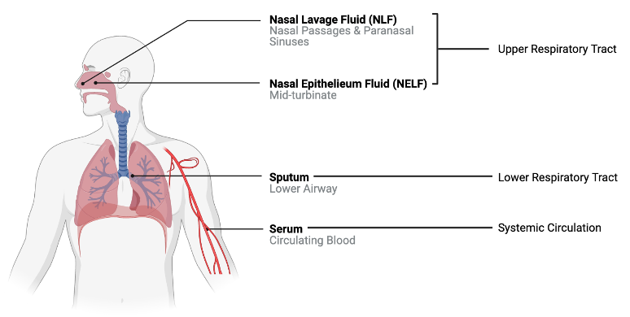

# (PART\*) Chapter 5 Machine Learning & Artificial Intelligence {-}

# 5.1 Introduction to Artificial Intelligence, Machine Learning, and Predictive Modeling for Environmental Health

This training module was developed by David M. Reif, with contributions from Elise Hickman, Alexis Payton, and Julia E. Rager

All input files (script, data, and figures) can be downloaded from the [UNC-SRP TAME2 GitHub website](https://github.com/UNCSRP/TAME2).

## Introduction to Training Module

Artificial intelligence (AI), machine learning (ML), and predictive modeling are becoming increasingly popular buzzwords both in the public domain and within research fields, including environmental health. Within environmental health, these computational techniques are implemented to integrate large, high dimensional datasets (e.g., chemical, biological, clinical/medical, model estimates, etc) to better understand links between environmental exposures and biological responses. 

In this training module, we will:

+ Provide general historical context and taxonomy of modern AI/ML
+ Provide an overview of the intersection between environmental health science ML through discussing...
    + Why there is a need for ML in environmental health science
    + The differences between ML and traditional statistical methods
    + Predictive modeling in the context of environmental health science 
    + Additional applications of ML in environmental health science

<br>

### Training Module's Environmental Health Question

This training module was specifically developed to answer the following environmental health question:

+ How and why are artificial intelligence, machine learning, and predictive modeling used in environmental health research?

## General Historical Context and Taxonomy of Modern AI/ML

Before diving in to the applications of AI and ML in environmental health, let's first establish what these term mean and how they are related. Note that the definitions surrounding AI and ML can be subjective, however the purpose of this module is not to get caught up in semantics, but to broadly understand how AI and ML can be applied to environmental health research. 

**Artificial Intelligence (AI)** encompasses computer systems that perform tasks typically associated with human cognition and intelligence. AI is found in our everyday lives, for instance, within face recognition, internet search queries, email spam detection, smart home devices, auto-navigation, and digital assistants. 

**Machine Learning (ML)** can be thought of as a subset of AI and describes a computer system that iteratively learns and improves from that experience autonomously. 

Below is a high level taxonomy of AI. It's not meant to be an exhaustive depiction of all AI techniques but a simple visualization of how some of these methodologies are nested within each other. **Note**: AI can be categorized in different ways and may deviate from what is illustrated below.
```{r out.width = "800px", echo = FALSE, out.width = "75%", fig.align = 'center'}

```

Advantages of AI and ML include the automation of repetitive tasks, complex problem solving, and reducing human error. However, disadvantages include learning from biased datasets or patterns that are reflected in the decisions of AI/ML and the potential limited interpretability of algorithms created by AI/ML. Check out the following resources for... 

+ Further explanation on differences in [Artificial Intelligence vs. Machine Learning](https://cloud.google.com/learn/artificial-intelligence-vs-machine-learning)
+ Other subsets of AI that fall outside of the scope of these modules in [Types of Artificial Intelligence](https://builtin.com/artificial-intelligence)
+ Additional discussion on the utility of ML approaches for high-dimensional data common in environmental health research in [Payton et. al](https://www.frontiersin.org/articles/10.3389/ftox.2023.1171175/full)

It is important to understand the methodological "roots" of current methods. Otherwise, it seems like every approach is novel! AI and ML methods have been around since the mid- to late- 1900s and continue to evolve in the present day. The earliest conceptual roots for these approaches can be traced from antiquity; however, it is generally thought that the field was named "artificial intelligence" at the ["Dartmouth Workshop"](https://home.dartmouth.edu/about/artificial-intelligence-ai-coined-dartmouth) in 1956, led by John McCarthy and others. The following schematic demonstrates the general taxonomy (categories, sub-fields, and specific methods) of modern AI and ML:

```{r out.width = "800px", echo = FALSE, fig.align = 'center'}

```

### A Brief Detour to Discuss ChatGPT

**ChatGPT (Chat Generative Pre-trained Transformer)** is a publicly available chatbot developed by OpenAI. It was released in November of 2022 and quickly gained popularity due to its accessibility and ability to have human-like conversations with the user across almost any imaginable topic.

Language Models (LLMs), including large language models like GPT-3 (a predecessor to ChatGPT), generally fall under the "Connectionist AI" category, which use deep learning techniques and are considered a subset of artificial neural networks. They fall under the deep learning subset due to their use of deep neural networks with many layers, allowing them to learn from large amounts of data and find intricate patterns.

LLMs are trained to predict the probability of a word given its context in a dataset (a form of next-word prediction), which is a machine learning methodology. It's notable that they use architectures like [Transformer Networks](https://en.wikipedia.org/wiki/Transformer_(machine_learning_model)), which are known for their efficiency in handling sequential data, making them a go-to choice for natural language processing (NLP) tasks. The use of attention mechanisms in these architectures allows the model to focus on different parts of the input sequence when producing an output sequence, offering a substantial improvement in performance for many natural language processing tasks.

The role of ChatGPT and similar tools in the environmental health research space is still being explored. Although ChatGPT has the potential to streamline certain parts of the research process, such as text and language polishing, synthesizing existing information, and suggesting custom coding solutions, it is not an intellectual replacement for the expertise and diverse viewpoints of scientists and must be used transparently and with caution. 

<br>

## Application of Machine Learning in Environmental Health Science

For the rest of this module and chapter, we will focus on machine learning (ML). Generally speaking, ML is considered to encompass the study of computer algorithms that can improve automatically through experience and by the use of data. It is seen as a part of artificial intelligence (AI), discussed broadly above. 

### Why do we need machine learning in environmental health science?

There are many avenues to incorporate ML into environmental health research, all aimed at better identifying patterns amongst large datasets spanning medical health records, clinical data, exposure monitoring data, chemistry profiles, and the rapidly expanding realm of biological response data including multiple -omics endpoints.

One well-known problem that can be better addressed by incorporating ML is the 'too many chemicals, too little data' problem. To detail, there are thousands of chemicals in commerce today. Testing these chemicals one by one for toxicity using comprehensive animal screening experiments would take decades and is not feasible financially. Current efforts to address this problem include using cell-based high throughput screening to efficiently determine biological responses to a variety of chemical exposures and treatment conditions. 

```{r out.width = "700px", echo = FALSE, fig.align = 'center'}

```

These screening efforts result in increasing amounts of data, which can be gathered to start building big databases.
```{r out.width = "700px", echo = FALSE, fig.align = 'center'}

```

When many of these datasets and databases are combined, including diversity across different types of screening platforms, technologies, cell types, species, and other experimental variables, the associated dimensionality of the data gets "big." 
```{r out.width = "500px", echo = FALSE, fig.align = 'center'}

```

This presents a problem because these data are diverse and high dimensional (the number of features or endpoints exceeds the number of observations/chemicals). To appropriately analyze and model these data, new approaches beyond traditional statistical methods are needed. 

### Machine Learning vs. Traditional Statistical Methods

There is *plenty* of debate as to where the line(s) between ML and traditional statistics should be drawn. In our opinion, a perfect delineation is not necessary for our purposes. Rather, we will focus on the usual goals/intent of each to help us understand the distinction for environmental health research.

Traditional statistics may be able to handle 1:1 or 1:many comparisons of singular quantities (e.g., activity concentrations for two chemicals). However, once the modeling becomes more complex or exploratory, assumptions of most traditional methods will be violated. Furthermore, statistics draws population inferences from a sample, while AI/ML finds generalizable predictive patterns ([Bzdok et al 2018](https://www.nature.com/articles/nmeth.4642)). This is particularly helpful in **predictive toxicology**, in which we leverage high dimensional data to obtain generalizable forecasts for the effects of chemicals on biological systems. 

This image shows graphical abstractions of how a "problem" is solved using:

+ Traditional statistics ((A) logistic regression and (B) linear regression), OR
+ Machine learning ((C) support vector machines, (D) artificial neural networks, and (E) decision trees)

```{r out.width = "700px", echo = FALSE, fig.align = 'center'}

```

### Predictive Modeling in the Context of Environmental Health Science

In the previous section, we briefly mentioned **predictive toxicology.** We often think of predictions as having a forward-time component (*i.e. What will happen next?*) ... what about "prediction" in a different sense as applied to toxicology? 

Our *working definition* is that **predictive toxicology** describes a multidisciplinary approach to chemical toxicity evaluation that more efficiently uses animal test results, when needed, and leverages expanding non-animal test methods to forecast the effects of a chemical on biological systems. Examples of the questions we can answer using predictive toxicology include:

+ Can we more efficiently design animal studies and analyze data from shorter assays using fewer animals to predict long-term health outcomes?
+ Can this suite of *in vitro* assays **predict** what would happen in an organism?
+ Can we use diverse, high dimensional data to cluster chemicals into **predicted** activity classes?

```{r out.width = "600px", echo = FALSE, fig.align = 'center'}
knitr::include_graphics("Module5_1_Input/Module5_1_Image7.png")
```

Similar logic applies to the field of exposure science. What about "prediction" applied to exposure science?

Our *working definition* is that **predictive exposure science** describes a multidisciplinary approach to chemical exposure evaluations that more efficiently uses biomonitoring, chemical inventory, and other exposure science-relevant databases to forecast exposure rates in target populations. For example:

+ Can we use existing biomonitoring data from NHANES to predict exposure rates for chemicals that have yet to be measured in target populations? (see ExpoCast program, e.g., [Wambagh et al 2014](https://pubmed.ncbi.nlm.nih.gov/25343693/))
+ Can I use chemical product use inventory data to predict the likelihood of a chemical being present in a certain consumer product? (e.g., [Phillips et al 2018](https://pubmed.ncbi.nlm.nih.gov/29405058/))

There are many different types of ML methods that we can employ in predictive toxicology and exposure science, depending on the data type / purpose of data analysis. A recent [review](https://pubmed.ncbi.nlm.nih.gov/34029068/) written together with [Erin Baker's lab](https://bakerlab.wordpress.ncsu.edu/) provides a high-level overview on some of the types of ML methods and challenges to address when analyzing multi-omic data (including chemical signature data).

### Answer to Environmental Health Question 
:::question
*With this, we can now answer our **Environmental Health Question***: How and why are machine learning, predictive modeling, and artificial intelligence used in environmental health research?
:::

:::answer
**Answer:** Machine learning, a subcategory of artificial intelligence, can be used in environmental health science to better understand patterns between chemical exposure and biological response in complex, high dimensional datasets. These datasets are often generated as part of efforts to screen many chemicals efficiently. Predictive modeling, which can include machine learning approaches, leverages these data to forecast the effects of a chemical on biological systems.
:::

### Additional Applications of Machine Learning in Environmental Health Science

In addition to the predictive toxicology questions above, ML can also be applied in the analysis of complex, high dimensional data in observational clinical (human subjects) studies in environmental health, such as:

+ Do subjects cluster by chemical exposure? Are there similarities between subjects that cluster together for chemical exposure, suggesting underlying factors relevant to chemical exposure? 
+ Are biological signatures in different exposure groups different enough overall that ML can predict which group a subject belongs to based on their signature?

<br>

## Concluding Remarks

In conclusion, this training module provides an overview of the field of AI and ML and discusses applications of these tools in environmental health science through predictive modeling. These methods represent common tools that are used in high dimensional data analyses within the field of environmental health sciences.

In the following modules, we will provide specific examples detailing how to apply both supervised and unsupervised machine learning methods to environmental health questions and how to interpret the results of these analyses. 

For a review article on ML, see:

+ Odenkirk MT, Reif DM, Baker ES. Multiomic Big Data Analysis Challenges: Increasing Confidence in the Interpretation of Artificial Intelligence Assessments. Anal Chem. 2021 Jun 8;93(22):7763-7773. PMID: [34029068](https://pubmed.ncbi.nlm.nih.gov/34029068/)

For additional case studies that leverage more advanced ML techniques, see the following recent publications that also address environmental health questions from our research groups, with bracketed tags at the end of each citation denoting ML methods used in that study:

+ Clark J, Avula V, Ring C, Eaves LA, Howard T, Santos HP, Smeester L, Bangma JT, O'Shea TM, Fry RC, Rager JE. Comparing the Predictivity of Human Placental Gene, microRNA, and CpG Methylation Signatures in Relation to Perinatal Outcomes. Toxicol Sci. 2021 Sep 28;183(2):269-284. PMID: [34255065](https://pubmed.ncbi.nlm.nih.gov/34255065/) *[hierarchical clustering, principal component analysis, random forest]*

+ Green AJ, Mohlenkamp MJ, Das J, Chaudhari M, Truong L, Tanguay RL, Reif DM. Leveraging high-throughput screening data, deep neural networks, and conditional generative adversarial networks to advance predictive toxicology. PLoS Comput Biol. 2021 Jul 2;17(7):e1009135. PMID: [3421407](https://pubmed.ncbi.nlm.nih.gov/34214078/) *[conditional generative adversarial network, deep neural network, support vector machine, random forest, multilayer perceptron]*

+ To KT, Truong L, Edwards S, Tanguay RL, Reif DM. Multivariate modeling of engineered nanomaterial features associated with developmental toxicity. NanoImpact. 2019 Apr;16:10.1016. PMID: [32133425](https://pubmed.ncbi.nlm.nih.gov/32133425/) *[random forest]*

+ Ring C, Sipes NS, Hsieh JH, Carberry C, Koval LE, Klaren WD, Harris MA, Auerbach SS, Rager JE. Predictive modeling of biological responses in the rat liver using in vitro Tox21 bioactivity: Benefits from high-throughput toxicokinetics. Comput Toxicol. 2021 May;18:100166. PMID: [34013136](https://pubmed.ncbi.nlm.nih.gov/34013136/) *[random forest]*

+ Hickman E, Payton A, Duffney P, Wells H, Ceppe AS, Brocke S, Bailey A, Rebuli ME, Robinette C, Ring B, Rager JE, Alexis NE, Jaspers I. Biomarkers of Airway Immune Homeostasis Differ Significantly with Generation of E-Cigarettes. Am J Respir Crit Care Med. 2022 Nov 15; 206(10):1248-1258. PMID: [35731626](https://pubmed.ncbi.nlm.nih.gov/35731626/) *[hierarchical clustering, quadratic discriminant analysis, multinomial logistic regression]*

+ Perryman AN, Kim H-YH, Payton A, Rager JE, McNell EE, Rebuli ME, et al. (2023) Plasma sterols and vitamin D are correlates and predictors of ozone-induced inflammation in the lung: A pilot study. PLoS ONE 18(5): e0285721. PMID: [37186612](https://journals.plos.org/plosone/article?id=10.1371/journal.pone.0285721) *[random forest, support vector machine, k nearest neighbor]*

+ Payton AD, Perryman AN, Hoffman JR, Avula V, Wells H, Robinette C, Alexis NE, Jaspers I, Rager JE, Rebuli ME. Cytokine signature clusters as a tool to compare changes associated with tobacco product use in upper and lower airway samples. American Journal of Physiology-Lung Cellular and Molecular Physiology 2022 322:5, L722-L736. PMID: [35318855](https://journals.physiology.org/doi/abs/10.1152/ajplung.00299.2021) *[k-means clustering, principal component analysis]*

# 5.2 Supervised Machine Learning 

This training module was developed by Alexis Payton, Oyemwenosa N. Avenbuan, Lauren E. Koval, and Julia E. Rager.

All input files (script, data, and figures) can be downloaded from the [UNC-SRP TAME2 GitHub website](https://github.com/UNCSRP/TAME2).

## Introduction to Training Module

Machine learning is a field that has been around for decades but has exploded in popularity and utility in recent years due to the proliferation of big and/or high dimensional data. Machine learning has the ability to sift through and learn from large volumes of data and use that knowledge to solve problems. The challenges of high dimensional data as they pertain to environmental health and the applications of machine learning to mitigate some of those challenges are discussed further in [Payton et. al](https://www.frontiersin.org/articles/10.3389/ftox.2023.1171175/full). In this module, we will introduce different types of machine learning and then focus in on supervised machine learning, including how to train and assess supervised machine learning models. We will then analyze an example dataset with supervised machine learning highlighting an example with random forest modeling. 

<br>

## Types of Machine Learning
Within the field of machine learning, there are many different types of algorithms that can be leveraged to address environmental health research questions. The two broad categories of machine learning frequently applied to environmental health research are: (1) supervised machine learning and (2) unsupervised machine learning.

**Supervised machine learning** involves training a model using a labeled dataset, where each independent or predictor variable is associated with a dependent variable with a known outcome. This allows the model to learn how to predict the labeled outcome on data it hasn't "seen" before based on the patterns and relationships it previously identified in the data. For example, supervised machine learning has been used for cancer prediction and prognosis based on variables like tumor size, stage, and age ([Lynch et. al](https://www.sciencedirect.com/science/article/abs/pii/S1386505617302368?via%3Dihub), [Asadi et. al](https://www.ncbi.nlm.nih.gov/pmc/articles/PMC7416093/)). 

Supervised machine learning includes: 

+ Classification: Using algorithms to classify a categorical outcome (ie. plant species, disease status, etc.)
+ Regression: Using algorithms to predict a continuous outcome (ie. gene expression, chemical concentration, etc.)
```{r, echo=FALSE, fig.width=4, fig.height=5, fig.align='center'}
knitr::include_graphics("Module5_2_Input/Module5_2_Image1.png")
```
<center> Soni, D. (2018, March 22). Supervised vs. Unsupervised Learning. Towards Data Science; Towards Data Science. https://towardsdatascience.com/supervised-vs-unsupervised-learning-14f68e32ea8d </center>

**Unsupervised machine learning**, on the other hand, involves using models to find patterns or associations between variables in a dataset that lacks a known or labeled outcome. For example, unsupervised machine learning has been used to identify new patterns across genes that are co-expressed, informing potential biological pathways mediating human disease ([Botía et. al](https://bmcsystbiol.biomedcentral.com/articles/10.1186/s12918-017-0420-6), [Pagnuco et. al](https://www.sciencedirect.com/science/article/pii/S0888754317300575?via%3Dihub)).

```{r, echo=FALSE, fig.width=52, fig.height=18, fig.align='center', out.width = "75%"}
knitr::include_graphics("Module5_2_Input/Module5_2_Image2.png")
```
<center> Langs, G., Röhrich, S., Hofmanninger, J., Prayer, F., Pan, J., Herold, C., & Prosch, H. (2018). Machine learning: from radiomics to discovery and routine. Der Radiologe, 58(S1), 1–6. PMID: [34013136](https://doi.org/10.1007/s00117-018-0407-3). Figure regenerated here in alignment with its published [Creative Commons Attribution 4.0 International License](https://creativecommons.org/licenses/by/4.0/). </center>

Overall, the distinction between supervised and unsupervised learning is an important concept in machine learning, as it can inform the choice of algorithms and techniques used to analyze and make predictions from data. It is worth noting that there are also other types of machine learning, such as [semi-supervised learning](https://www.altexsoft.com/blog/semi-supervised-learning/), [reinforcement learning](https://www.geeksforgeeks.org/what-is-reinforcement-learning/), and [deep learning](https://www.geeksforgeeks.org/introduction-deep-learning/), though we will not further discuss these topics in this module. 

<br>

## Types of Supervised Machine Learning Algorithms

Although this module's example will focus on a random forest model in the coding example below, other commonly used algorithms for supervised machine learning include: 

+ **K-Nearest Neighbors (KNN):** Uses distance to classify a data point in the test set based upon the most common class of neighboring data points from the training set. For more information on KNN, see [K-Nearest Neighbor](https://www.ibm.com/topics/knn).
```{r, echo=FALSE, out.width = "50%",fig.width=4, fig.height=5, fig.align='center'}

```

+ **Support Vector Machine (SVM):** Creates a decision boundary line (hyperplane) in n-dimensional space to separate the data into each class so that when new data is presented, they can be easily categorized. For more information on SVM, see [Support Vector Machine](https://www.javatpoint.com/machine-learning-support-vector-machine-algorithm).
```{r, echo=FALSE, out.width = "50%", fig.width=4, fig.height=5, fig.align='center'}
knitr::include_graphics("Module5_2_Input/Module5_2_Image7.png")
```

+ **Random Forest (RF):** Uses a multitude of decision trees trained on a subset of different samples from the training set and the resulting classification of a data point in the test set is aggregated from all the decision trees. A **decision tree** is a hierarchical model that depicts decisions from predictors and their resulting outcomes. It starts with a root node, which represents an initial test from a single predictor. The root node splits into subsequent decision nodes that test another feature. These decision nodes can either feed into more decision nodes or leaf nodes that represent the predicted class label. A branch or a sub-tree refers to a subsection of an entire decision tree.   

Here is an example decision tree with potential variables and decisions informing a college basketball player's likelihood of being drafted to the NBA: 
```{r, echo=FALSE, out.width = "75%",fig.width=4, fig.height=5, fig.align='center'}

```

While decision trees are highly interpretable, they are prone to overfitting, thus they may not always generalize well to data outside of the training set. To address this, random forests are comprised of many different decision trees. Each tree is trained on a subset of the samples in the training data, selected with replacement, and a randomly selected set of predictor variables. For a dataset with *p* predictors, it is common to test $\sqrt{p}$,  $\frac{p}{2}$, and *p* predictors to see which gives the best results. This process decorrelates the trees. For a classification problem, majority vote of the decision trees determines the final class for a prediction. This process loses interpretability inherent to individual trees, but reduces the risk of overfitting. 

For more information on RF and decision trees, check out [Random Forest](https://www.ibm.com/in-en/topics/random-forest) and
[Decision Trees](https://www.analyticsvidhya.com/blog/2021/08/decision-tree-algorithm/#What_is_a_Decision_Tree?).

**Note**: One algorithm is not inherently better than the others with each having their respective advantages and disadvantages. Each algorithm's predictive ability will be largely dependent on the size of the dataset, the distribution of the data points, and the scenario. 

<br>

## Training Supervised Machine Learning Models

In supervised machine learning, algorithms need to be trained before they can be used to predict on new data. This involves selecting a smaller portion of the dataset to train the model so it will learn how to predict the outcome as accurately as possible. The process of training an algorithm is essential for enabling the model to learn and improve over time, allowing it to make more accurate predictions and better adapt to new and changing circumstances. Ultimately, the quality and relevance of the training data will have a significant impact on the effectiveness of a machine learning model.

Common partitions of the full dataset used to train and test a supervised machine learning model are the following:

1. **Training Set:** a subset of the data that the algorithm "sees" and uses to identify patterns.

2. **Validation Set**: a subset of the training set that is used to evaluate the model's fit in an unbiased way allowing us to fine-tune its parameters and optimize performance. 

3. **Test Set:** a subset of data that is used to evaluate the final model's fit based on the training and validation sets. This provides an objective assessment of the model's ability to generalize new data.

It is common to split the dataset into a training set that contains 60% of the data and the test set that contains 40% of the data, though other common splits include 70% training / 30% test and 80% training / 20% test.

```{r, echo=FALSE, out.width = "65%", fig.align='center'}
knitr::include_graphics("Module5_2_Input/Module5_2_Image3.png")
```

It is important to note that the test set should only be examined after the algorithm has been trained using the training/validation sets. Using the test set during the development process can lead to overfitting, where the model performs well on the test data but poorly on new data. The ideal algorithm is generalizable or flexible enough to accurately predict unseen data. This is known as the bias-variance tradeoff. For further information on the bias-variance tradeoff, see [Understanding the Bias-Variance Tradeoff](https://towardsdatascience.com/understanding-the-bias-variance-tradeoff-165e6942b229).

### Cross Validation

Finally, we will discuss **cross validation**, which is an approach used during training to expose the model to more patterns in the data and aid in model evaluation. For example, if a model is trained and tested on a 60:40 split, our model's accuracy will likely be influenced by *where* this 60:40 split occurs in the dataset. This will likely bias the data and reduce the algorithm's ability to predict accurately for data not in the training set. Overall, cross validation (CV) is implemented to fine tune a model's parameters and improve prediction accuracy and ability to generalize. 

Although there are [a number of cross validation approaches](https://neptune.ai/blog/cross-validation-in-machine-learning-how-to-do-it-right), we will specifically highlight ***k*-fold cross validation**. k-fold cross validation works by splitting the samples in the training dataset into *k* equally sized folds or groups. For example, if we implement 5-fold CV, we start by...

1. Splitting the training data into 5 groups, or "folds". 
2. Five iterations of training/testing are then run where each of the 5 folds serves as the test data once and as part of the training set four times, as seen in the figure below. 
3. To measure predictive ability of each of the parameters tested, like the number of features to include, values like accuracy and specificity are calculated for each iteration. The parameters that optimize performance are selected for the final model which will be evaluated against the test set not used in training.
```{r, echo=FALSE, fig.width=4, fig.height=5, fig.align='center'}
knitr::include_graphics("Module5_2_Input/Module5_2_Image4.png")
```

Check out these resources for additional information on [Cross Validation in Machine Learning](https://towardsdatascience.com/cross-validation-in-machine-learning-72924a69872f) and [Cross Validation Pros & Cons](https://www.geeksforgeeks.org/cross-validation-machine-learning/).

<br>

## Assessing Classification-Based Model Performance  
Evaluation metrics from a confusion matrix are often used to determine the best model during training and measure model performance during testing for classification-based supervised machine learning models. A confusion matrix consists of a table that displays the numbers of how often the algorithm correctly and incorrectly predicted the outcome. 

Let's imagine you're interested in predicting whether or not a player will be drafted to the National Basketball Association (NBA) based on a dataset that contains variables regarding a player's assists, points, height etc. Let's say that this dataset contains information on 253 players with 114 that were actually drafted and 139 that weren't drafted. The confusion matrix below shows a model's results where a player that is drafted is the "positive" class and a player that is not drafted is the "negative" class.

```{r, echo=FALSE, out.width = "50%", fig.width=4, fig.height=5, fig.align='center'}

```

Helpful confusion matrix terminology:

+ **True positive (TP)**: the number of correctly classified "positive" data points (i.e., the number of correctly classified players to be drafted)
+ **True negative (TN)**: the number of correctly classified "negative" data points (i.e., the number of correctly classified players to be not drafted)
+ **False positive (FP)**: the number of incorrectly classified "positive" data points (i.e., the number of players not drafted incorrectly classified as draft picks)
+ **False negative (FN)**: the number of incorrectly classified "negative" data points (i.e., the number of draft picks incorrectly classified as players not drafted)


Some of the metrics that can be obtained from a confusion matrix are listed below:

+ **Overall Accuracy:** indicates how often the model makes a correct prediction relative to the total number of predictions made and is typically used to assess overall model performance ($\frac{TP+TN}{TP+TN+FP+FN}$).

+ **Sensitivity or Recall:** evaluates how well the model was able to predict the "positive" class. It is calculated as the ratio of correctly classified true positives to the total number of positive cases ($\frac{TP}{TP+FN}$). 

+ **Specificity:** evaluates how well the model was able to predict the "negative" class. It is calculated as the ratio of correctly classified true negatives to total number of negatives cases ($\frac{TN}{TN+FP}$).

+ **Balanced Accuracy:** is the mean of sensitivity and specificity and is often used in the case of a class imbalance to gauge how well the model can correctly predict values for both classes ($\frac{sensitivity+specificity}{2}$).   

+  **Positive Predictive Value (PPV) or Precision:**  evaluates how accurate predictions of the "positive" class are. It is calculated as the ratio of correctly classified true positives to total number of predicted positives ($\frac{TP}{TP+FN}$).

+  **Negative Predictive Value (NPV):**  evaluates how accurate predictions of the "negative" class are. It is calculated as the ratio of correctly classified true negatives to total number of predicted negatives ($\frac{TN}{TN+FP}$).

For the above metrics, values fall between 0 and 1. Instances of 0 indicate that the model was not able to classify any data points correctly, and instances of 1 indicate that the model was able to classify all test data correctly. Although subjective, an overall accuracy of at least 0.7 is considered respectable ([Barkved, 2022](https://www.obviously.ai/post/machine-learning-model-performance#:~:text=Good%20accuracy%20in%20machine%20learning,also%20consistent%20with%20industry%20standards.)). Furthermore, a variety of additional metrics exist for evaluating model performance for classification problems ([24 Evaluation Metrics for Binary Classification (And When to Use Them)](https://neptune.ai/blog/evaluation-metrics-binary-classification)). Selecting a metric for evaluating model performance varies by situation and is dependent not only on the individual dataset, but also the question being answered.


**Note**: For multi-class classification (more than two labeled outcomes to be predicted), the same metrics are often used, but are obtained in a slightly different way. Regression based supervised machine learning models use loss functions to evaluate model performance. For more information regarding confusion matrices and loss functions for regression-based models, see:

 + [Additional Confusion Matrix Metrics](https://medium.com/analytics-vidhya/what-is-a-confusion-matrix-d1c0f8feda5)
 + [Precision vs. Recall or Specificity vs. Sensitivity](https://towardsdatascience.com/should-i-look-at-precision-recall-or-specificity-sensitivity-3946158aace1)
 + [Loss Functions for Machine Learning Regression](https://towardsdatascience.com/understanding-the-3-most-common-loss-functions-for-machine-learning-regression-23e0ef3e14d3)

<br>


## Introduction to Activity and Example Dataset 

In this activity, we will analyze an example dataset to see whether we can use environmental monitoring data to predict areas of contamination using random forest (RF). This example model will leverage a dataset of well water variables that span geospatial location, sampling date, and well water attributes, with the goal of predicting whether detectable levels of inorganic arsenic (iAs) are present. This dataset was obtained through the sampling of 713 private wells across North Carolina through the University of North Carolina Superfund Research Program ([UNC-SRP](https://sph.unc.edu/superfund-pages/srp/)) using an analytical method that was capable of detecting levels of iAs greater than 5ppm. As demonstrated through the script below, the algorithm will first be trained and tested, and then resulting model performance will be assessed using the previously detailed confusion matrix and related performance metrics.


### Training Module's Environmental Health Questions

This training module was specifically developed to answer the following environmental health questions:

1. Which well water variables, spanning various geospatial locations, sampling dates, and well water attributes, significantly differ between samples containing detectable levels of iAs vs samples that are not contaminated/ non-detectable?
2. How can we train a random forest (RF) model to predict whether a well might be contaminated with iAs?
3. With this RF model, can we predict if iAs will be detected based on well water information? 
4. How could this RF model be improved upon, acknowledging that there is class imbalance?

<br>

### Script Preparations

#### Cleaning the global environment
```{r, clear__envi, echo=TRUE, eval=TRUE}
rm(list=ls())
```

#### Installing required R packages
If you already have these packages installed, you can skip this step, or you can run the below code which checks installation status for you
```{r, install_libs, echo=TRUE, eval=TRUE, warning=FALSE, results='hide', message=FALSE}
if (!requireNamespace("readxl"))
  install.packages("readxl");
if (!requireNamespace("lubridate"))
  install.packages("lubridate");
if (!requireNamespace("tidyverse"))
  install.packages("tidyverse");
if (!requireNamespace("gtsummary"))
  install.packages("gtsummary");
if (!requireNamespace("flextable"))
  install.packages("flextable");
if (!requireNamespace("caret"))
  install.packages("caret");
if (!requireNamespace("randomForest"))
  install.packages("randomForest");
```

#### Loading R packages required for this session
```{r, load_libs, echo=TRUE, eval=TRUE, warning=FALSE, error=FALSE, results='hide', message=FALSE}
library(readxl);
library(lubridate);
library(tidyverse);
library(gtsummary);
library(flextable);
library(caret);
library(randomForest);
```

#### Set your working directory
```{r, filepath, echo=TRUE, eval=FALSE, error=FALSE, results='hide', message=FALSE}
setwd("/filepath to where your input files are")
```

#### Importing example dataset
```{r, read_data, echo=TRUE, eval=TRUE}
# Load the data
arsenic_data <- data.frame(read_xlsx("Module5_2_Input/Module5_2_InputData.xlsx"))

# View the top of the dataset
head(arsenic_data) 
```

The columns in this dataset are described below:

+ `Well_ID`: Unique id for each well (This is the sample identifier and not a predictive feature)
+ `Water_Sample_Date`: Date that the well was sampled 
+ `Casing_Depth`: Depth of the casing of the well (ft)
+ `Well_Depth`: Depth of the well (ft)
+ `Static_Water_Depth`: Static water depth in the well (ft)
+ `Flow_Rate`: Well flow rate (gallons per minute)
+ `pH`: pH of water sample
+ `Detect_Concentration`: Binary identifier (either non-detect "ND" or detect "D") if iAs concentration detected in water sample 

### Changing Data Types 
First, `Detect_Concentration` needs to be converted from a character to a factor so that Random Forest knows that the non-detect class is the baseline or "negative" class, while the detect class will be the "positive" class. `Water_Sample_Date` will be converted from a character to a date type using the `mdy()` function from the *lubridate* package. This is done so that the model understands this column contains dates.
```{r, convert_type, echo=TRUE, eval=TRUE}
arsenic_data <- arsenic_data %>%
    # Converting `Detect_Concentration` from a character to a factor
    mutate(Detect_Concentration = relevel(factor(Detect_Concentration), ref = "ND"), 
    # Converting water sample date from a character to a date type 
    Water_Sample_Date = mdy(Water_Sample_Date)) %>% 
    # Removing tax id and only keeping the predictor and outcome variables in the dataset
    # This allows us to put the entire dataframe as is into RF
    select(-Well_ID) 

# Look at the top of the revised dataset
head(arsenic_data)
```

<br>

## Testing for Differences in Predictor Variables across the Outcome Classes

It is useful to run summary statistics on the variables that will be used as predictors in the algorithm to see if there are differences in distributions between the outcomes classes (either non-detect or detect in this case). Typically, greater significance often leads to better predictivity for a certain variable, since the model is better able to separate the classes. We'll use the `tbl_summary()` function from the *gtsummary* package. Note, this may only be practical with smaller datasets or for a subset of predictors if there are many.

For more information on the `tbl_summary()` function, check out this helpful [Tutorial](https://www.danieldsjoberg.com/gtsummary/articles/tbl_summary.html).
```{r, tbl, echo=TRUE, eval=TRUE}
arsenic_data %>%
    # Displaying the mean and standard deviation in parentheses for all continuous variables
    tbl_summary(by = Detect_Concentration, statistic = list(all_continuous() ~ "{mean} ({sd})")) %>% 
    # Adding a column that displays the total number of samples for each variable. This will be 713 for all variables since we have no missing data
    add_n() %>%     
    # Adding a column that displays the p-value from an anova test
    add_p(test = list(all_continuous() ~ "aov")) %>% 
    as_flex_table() %>%
    bold(bold = TRUE, part = "header")
```


Note that N refers to the total sample number; ND refers to the samples that contained non-detectable levels of iAs; and D refers to the samples that contained detectable levels of iAs.

### Answer to Environmental Health Question 1
:::question
*With this, we can answer **Environmental Health Question #1***: Which well water variables, spanning various geospatial locations, sampling dates, and well water attributes, significantly differ between samples containing detectable levels of iAs vs samples that are not contaminated/ non-detect?
:::

:::answer
**Answer**: All of the evaluated descriptor variables are significantly different, with p<0.05 between detect and non-detect iAs samples, with the exception of the sample date and the static water depth.
:::

With these findings, we feel comfortable moving forward with these well water descriptive variables as predictors in our model.

<br>

### Setting up Cross Validation
At this point, we can move forward with training and testing a RF model aimed at predicting whether or not detectable levels of iAs are present in well water samples. We'll take a glance at the distribution of `Detect_Concentration` between the two classes. 
```{r, train_test, echo=TRUE, eval=TRUE}

# Set seed for reproducibility
set.seed(17)

# Establish a list of indices that will used to identify our training and testing data with a 60-40 split
tt_indices <- createDataPartition(y = arsenic_data$Detect_Concentration, p = 0.6, list = FALSE)

# Use indices to make our training and testing datasets and view the number of Ds and NDs
iAs_train <- arsenic_data[tt_indices,]
table(iAs_train$Detect_Concentration)

iAs_test <- arsenic_data[-tt_indices,]
table(iAs_test$Detect_Concentration)
```

We can see that there are notably more non-detects (`ND`) than detects (`D`) in both our training and testing sets. This is something important to consider when evaluating our model's performance.

Now we can set up our cross validation and train our model. We will be using the `trainControl()` function from the *caret* package for this task. It is one of the most commonly used libraries for supervised machine learning in R and can be leveraged for a variety algorithms including RF, SVM, KNN, and others. This model will be trained with 5-fold cross validation. Additionally, we will test 2, 3, and 6 predictors through the `mtry` parameter.

See the *caret* documentation [here](https://cran.r-project.org/web/packages/caret/vignettes/caret.html).
```{r, train, echo=TRUE, eval=TRUE}

# Establish the parameters for our cross validation with 5 folds
control <- trainControl(method = 'cv',
                        number = 5,
                        search = 'grid',
                        classProbs = TRUE)

# Establish grid of predictors to test in our model as part of hyperparameter tuning
p <- ncol(arsenic_data) - 1 # p is the total number of predictors in the dataset
tunegrid_rf <- expand.grid(mtry = c(floor(sqrt(p)), p/2, p)) # We will test sqrt(p), p/2, and p predictors (2,3,& 6 predictors, respectively) to see which performs best
```

<br>

## Predicting iAs Detection with a Random Forest (RF) Model
```{r}
# Look at the column names in training dataset
colnames(iAs_train)

# Train model
rf_train <- train(x = iAs_train[,1:6], # Our predictor variables are in columns 1-6 of the dataframe
                         y = iAs_train[,7], # Our outcome variable is in column 7 of the dataframe
                         trControl = control, # Specify the cross-validation parameters we defined above
                         method = 'rf', # Specify we want to train a Random Forest
                         importance = TRUE, # This parameter calculates the variable importance for RF models specifically which can help with downstream analyses
                         tuneGrid = tunegrid_rf, # Specify the number of predictors we want to test as defined above
                         metric = "Accuracy",
                  ) # Specify what evaluation metric we want to use to decide which model is the best

# Look at the results of training
rf_train

# Save the best model from our training. The best performing model is determined by the number of predictor variables we tested that resulted in the highest accuracy during the cross validation step.
rf_final <- rf_train$finalModel

# View confusion matrix for best model
rf_final
```

### Answer to Environmental Health Question 2
:::question
*With this, we can answer **Environmental Health Question #2***:  How can we train a random forest (RF) model to predict whether a well might be contaminated with iAs?
:::

:::answer
**Answer**: As is standard practice with supervised ML, we split our full dataset into a training dataset and a test dataset using a 60-40 split. Using the *caret* package, we implemented 5-fold cross validation to train a RF while also testing different numbers of predictors to see which optimized performance. The model that resulted in the greatest accuracy was selected as the final model.
:::

Now we can see how well our model does on data it hasn't seen before by applying it to our testing data.
```{r, test, echo=TRUE, eval=TRUE}
# Use our best model to predict the classes for our test data. We need to make sure we remove the column of Ds/NDs from our test data.
rf_res <- predict(rf_final, iAs_test %>% 
                    select(!Detect_Concentration))

# View a confusion matrix of the results and gauge model performance
# Be sure to include the 'positive' parameter to specify the correct positive class
confusionMatrix(rf_res, iAs_test$Detect_Concentration, positive = "D")
```

### Answer to Environmental Health Question 3
:::question
*With this, we can answer **Environmental Health Question #3***: With this RF model, can we predict if iAs will be detected based on well water information? 
:::

:::answer
**Answer**: We can use this model to predict if iAs can be detected in well water given that an overall accuracy of ~0.72 is decent, however we should consider other metrics that may influence how good we feel about this model depending on what is important to the question we are trying to answer. For example, the model did a good job at predicting non-detect data based on a sensitivity of ~0.85 and a NPV ~0.78, but struggled at predicting detect data based on a specificity of ~0.39 and a PPV of ~0.50. Additionally, the balanced accuracy of ~0.62 further emphasizes the difference in predictive ability of the model for non-detects and detects. If it is highly important to us that detects are classified correctly, we may want to improve this model before implementing it.
:::

<br>

## Class Imbalance

It is worth noting this discrepancy in predictive capabilities for detects vs. non-detects makes sense due to the observed class imbalance in our training data. There were notably more non-detects than detects in the training set, so the model was exposed to more of these data points and struggles to distinguish unique characteristics of detects when compared to non-detects. Additionally, we told the training algorithm to prioritize selecting a final model based on its overall accuracy. In the instances of a heavy class imbalance, it is common for a high accuracy to be achieved as the more prevalent class is predicted more often, though this doesn't give the full picture of the model's predictive capabilities. For example, if you consider a dog/cat case with a set of 90 dogs and 10 cats, a model could achieve 90% accuracy by predicting dog every time, which isn’t at all helpful in predicting cats.

This is particularly important, because for toxicology related datasets, the "positive" class often represents the class with greater public health risk/ interest but can have less data. For example, when you classify subjects based upon whether or not they have asthma based on gene expression data. Asthmatics would likely be the "positive" class, but given that asthmatics are less prevalent than non-asthmatics in the general population, they would likely represent the minority class too.  

To address this issue, a few methods can be considered. Full implementation of these approaches is beyond the scope of this module, but relevant resources for further exploration are given.

+ **Synthetic Minority Oversampling Technique (SMOTE)**- increases the number of minority classes in the training data, thereby reducing the class imbalance by synthetically generating additional samples derived from the existing minority class samples.
  + [SMOTE Oversampling & Tutorial On How To Implement In Python And R](https://spotintelligence.com/2023/02/17/smote-oversampling-python-r/#:~:text=Conclusion-,The%20SMOTE%20(Synthetic%20Minority%20Over%2Dsampling%20Technique)%20algorithm%20is,datasets%20that%20aren't%20balanced.)
  + [How to Use SMOTE for Imbalanced Data in R (With Example)](https://www.statology.org/smote-in-r/)

+ **Adjusting the loss function**- Loss functions in machine learning quantify the penalty for a bad prediction. They can be adjusted to where the minority class is penalized more forcing the model to learn to make fewer mistakes when predicting the minority class. 
  
+ **Alternative Performance Metrics**- When training the model, alternative metrics to overall accuracy may yield a more robust model capable of better predicting the minority class. Example alternatives may include balanced accuracy or an [F1-score](https://thedatascientist.com/f-1-measure-useful-imbalanced-class-problems/). The *caret* package further allows for [custom, user-defined metrics](https://topepo.github.io/caret/model-training-and-tuning.html#alternate-performance-metrics) to be evaluated during training by specifying the *summaryFunction* parameter in the `trainControl()` function, as seen below, in addition to the [`defaultSummary()` and `twoClassSummary()` functions](https://cran.r-project.org/web/packages/caret/vignettes/caret.html).

In the example code below, we're creating a function (`f1`) that will calculate the F1 score and find the optimal model with the highest F1 score as opposed to the highest accuracy as we did above. 
```{r, alt_metric, echo=TRUE, eval=FALSE}
install.packages("MLmetrics")
library(MLmetrics)

f1 <- function(data, lev = NULL, model = NULL) {
  # Creating a function to calculate the F1 score
  f1_val <- F1_Score(y_pred = data$pred, y_true = data$obs, positive = lev[1])
  c(F1 = f1_val)
}

# 5 fold CV
ctrl <- trainControl(
  method = "cv", 
  number = 5,
  classProbs = TRUE, 
  summaryFunction = f1
)

# Training the RF model
mod <- train(x = X,
             y = Y,
             trControl = ctrl,
             method = "rf",
             tuneGrid = tunegrid_rf,
             importance = TRUE,
             # Basing the best model performance off of the F1 score within 5 CV
             metric = "F1")
```

For more in-depth information and additional ways to address class imbalance check out [How to Deal with Imbalanced Data in Classification](https://medium.com/game-of-bits/how-to-deal-with-imbalanced-data-in-classification-bd03cfc66066).

### Answer to Environmental Health Question 4
:::question
*With this, we can answer **Environmental Health Question #4***: How could this RF model be improved upon, acknowledging that there is class imbalance?
:::

:::answer
**Answer**: We can implement SMOTE to increase the number of training data points for the minority class thereby reducing the class imbalance. In conjunction with using SMOTE, another approach includes selecting an alternative performance metric during training that does a better job taking the existing class imbalance into consideration, such as balanced accuracy or an F1-score, improves our predictive ability for the minority class.
:::

<br>

## Concluding Remarks

In conclusion, this training module has provided an introduction to supervised machine learning using classification techniques in R. Machine learning is a powerful tool that can help researchers gain new insights and improve models to analyze complex datasets faster and in a more comprehensive way. The example we've explored demonstrates the utility of supervised machine learning models on an environmentally relevant dataset.

<br>

### Additional Resources
To learn more check out the following resources: 

+ [IBM - What is Machine Learning](https://www.ibm.com/topics/machine-learning)
+ [Curate List of AI and Machine Learning Resources](https://medium.com/machine-learning-in-practice/my-curated-list-of-ai-and-machine-learning-resources-from-around-the-web-9a97823b8524)
+ [Introduction to Machine Learning in R](https://machinelearningmastery.com/machine-learning-in-r-step-by-step/)
+ Machine Learning by Mueller, J. P. (2021). Machine learning for dummies. John Wiley &amp; Sons.

<br>

<label class="tykfont">
Test Your Knowledge 
</label>

:::tyk
Using the "Module5_2TYKInput.xlsx", use RF to determine if well water data can be accurate predictors of Manganese detection. The data is structured similarly to the "Module5_2_InputData.xlsx" used in this module, however it now includes 4 additional features:

+ `Longitude`: Longitude of address (decimal degrees)
+ `Latitude`: Latitude of address (decimal degrees)
+ `Stream_Distance`: Euclidean distance to the nearest stream (feet)
+ `Elevation`: Surface elevation of the sample location (feet)
:::

# 5.3 Supervised Machine Learning Model Interpretation

This training module was developed by Alexis Payton, Lauren E. Koval, and Julia E. Rager.

All input files (script, data, and figures) can be downloaded from the [UNC-SRP TAME2 GitHub website](https://github.com/UNCSRP/TAME2).

## Introduction to Training Module

Supervised machine learning (ML) represents a subset of ML methods wherein the outcome variable is known or assigned prior to training a model to be able to predict said outcome. As we discussed in previous modules, ML methods are advantageous in that they easily incorporate a multitude of potential predictor variables, which allows these models to more closely consider real-world, complex environmental health scenarios and offer new insights through a more holistic consideration of available data inputs. However, one disadvantage of ML is that it is often not as easily interpretable as traditional statistics (e.g., regression based methods with defined beta coefficients for each input predictor variable). With this limitation in mind, there are methods and concepts that can be applied to supervised ML algorithms to aid in the understanding of their predictions including variable (feature) importance and decision boundaries, which we will cover in this module. We will also include example visualization techniques of these methods, representing important aspects contributing to model interpretability, since visualizing helps convey concepts faster and across a broader target audience. In addition, this module addresses methods to communicate these findings in a paper so that a wider span of readers can understand overall take-home points. As with other data analyses, we advise to focus just as much on the **why** components of a study's research question(s) as opposed to only focusing on the **what** or **how**. To elaborate, we explain through this module that it is not as important to explain all the intricacies of how a model works and how its parameters were tuned; rather, it is more important to focus on why a particular model was selected and how it will be leveraged to answer your research questions. This can all be a bit subjective and requires expertise within your research field. As a first step, let's first learn about some model interpretation methodologies highlighting **Variable Importance** and **Decision Boundaries** as important examples relevant to environmental health research. Then, this training module will further describe approaches to summarize these methods and communicate supervised ML findings to a broader audience.

<br>

## Variable Importance

When a supervised ML algorithm makes predictions, it relies more heavily on some variables than others. How much a variable contributes to classifying data is known as **variable (feature) importance**. Often times, this is thought of as the impact on overall model performance if a variable were to be removed from the model. There are many methods that are used to measure feature importance, including...

+ **SHapley Additive exPlanations (SHAP)**: based on game theory where each variable is considered a "player" where we're seeking to determine each player's contribution to the outcome of a "game" or overall model performance. It divides the model performance metric amongst all the variables, so that the sum of the shapley values for all the predictors is equal to the overall model performance. For more information on SHAP, see [A Novel Approach to Feature Importance](https://towardsdatascience.com/a-novel-approach-to-feature-importance-shapley-additive-explanations-d18af30fc21b). 

+ **Mean decrease gini (gini impurity)**: quantifies the improvement of predictivity with the addition of each predictor in a decision tree, which is then averaged over all the decision trees tested. The higher the value the greater the importance on the algorithm. This metric can easily be extracted from classification-based models, including random forest (RF) classifications, which is what we will focus on in this module.

Note for RF regression-based models, node purity can be extracted as a measure of feature importance. For more information, please see the following resources regarding [Feature Importance](https://www.baeldung.com/cs/ml-feature-importance) and [Mean Decrease Gini](https://cran.r-project.org/web/packages/rfVarImpOOB/vignettes/rfVarImpOOB-vignette.html).

<br>

## Decision Boundary 
Another concept that is pertinent to a model's interpretability is understanding a decision boundary and how visualizing it can further aid in understanding how the model classifies new data points. A **decision boundary** is a line (or a hyperplane) that seeks to separate the training data by class. This line can be linear or non-linear and is formed in n-dimensional space. To clarify, although support vector machine (SVM) specifically uses decision boundaries to classify training data and make predictions on test data, decision boundaries can still be drawn for other algorithms.  

A decision boundary can be visualized to convey how well an algorithm is able to classify an outcome based on the data given. It is important to note that most ML models make use of datasets that contain three or more predictors, and it is difficult to visualize a plot in more than three dimensions. Therefore, the number of features and which features to plot need to be narrowed down to two variables. For this reason, the resulting visualization is not a true representation of the decision boundary from the initial model using all predictors, since the visualization only relies on prediction results from two variables. Nevertheless, decision boundary plots can be powerful visualizations to determine thresholds between the outcome classes.

When choosing variables for decision boundary plots, features that have the most influence on the model are often selected, but that is not always the case. Sometimes predictors are selected based upon the environmental health implications relevant to the research question. For example in [Perryman et. al](https://journals.plos.org/plosone/article?id=10.1371/journal.pone.0285721), lung response following ozone exposure was investigated by sampling derivatives of cholesterol biosynthesis in human subjects. In this paper, these sterol metabolites were used to predict whether a subject would be classified as having a lung response that was considered non-responsive or responsive. A decision boundary plot was made using two predictors:

+ Cholesterol, given that it had the highest variable importance and
+ Vitamin D, given its synthesis can be affected by ozone despite it having a lower variable importance in the paper's models.
```{r, echo=FALSE, fig.align='center', out.width = "80%"}
knitr::include_graphics("Module5_3_Input/Module5_3_Image1.png")
```
<center> **Figure 5. Decision boundary plot for SVM model predicting lung response class.** Cholesterol and 25-hydroxyvitamin D were used as predictors visualizing responder status [non-responders(green) and responders (yellow)] and disease status [non-asthmatics (triangles) and asthmatics (circles)]. The shaded regions are the model’s prediction of a subject’s lung response class at a given cholesterol and 25-hydroxyvitamin D concentration.</center>

Takeaways from this decision boundary plot:

+ Subjects with more lung inflammation ("responders") after ozone exposure tended to have higher Vitamin D levels (> 35pmol/mL) and lower Cholesterol levels (< 675nmol/mL).
+ These "responder" subjects were more likely to be non-asthmatics. 

<br>

## Introduction to Example Dataset and Activity

In the previous module, we investigated whether a classification-based RF model using well water variables would be accurate predictors of inorganic arsenic (iAs) contamination. While it is helpful to know if certain variables are able to be used to construct a model that accurately predict detectability, from a public health standpoint, it is also helpful to know which of those features contribute the most to a model's accuracy. Therefore, if we can identify the features that are associated with having lower arsenic detection, we can use that information to inform policies when new wells are constructed. In addition to identifying variables with the greatest importance to the algorithm, it is also pertinent to understand the ranges of when a well is more or less likely to have arsenic detected. For example, are wells with a lower flow rate more likely to have arsenic detected? In this module, this will be addressed by extracting variable importance from the same algorithm and plotting it. The two features with the highest variable importance will be identified and used to construct a decision boundary plot to determine how features are associated with iAs detection. 

The data to be used in this module was described and referenced previously in **TAME 2.0 Module 5.2 Supervised Machine Learning**.

### Training Module's Environmental Health Questions

This training module was specifically developed to answer the following environmental health questions:

1. After plotting variable importance from highest to lowest, which two predictors have the highest variable importance on the predictive accuracy of iAs detection from a RF algorithm?
2. Using the two features with the highest variable importance, under what conditions are we more likely to predict detectable iAs in wells based on a decision boundary plot?
3. How do the decision boundaries shift after incorporating SMOTE to address class imbalance?


### Script Preparations

#### Cleaning the global environment
```{r}
rm(list=ls())
```

#### Installing required R packages
If you already have these packages installed, you can skip this step, or you can run the below code which checks installation status for you
```{r message=FALSE}
if (!requireNamespace("readxl"))
  install.packages("readxl");
if (!requireNamespace("lubridate"))
  install.packages("lubridate");
if (!requireNamespace("tidyverse"))
  install.packages("tidyverse");
if (!requireNamespace("caret"))
  install.packages("caret");
if (!requireNamespace("randomForest"))
  install.packages("randomForest");
if (!requireNamespace("themis"))
  install.packages("themis");
```

#### Loading R packages required for this session
```{r message=FALSE}
library(readxl)
library(lubridate)
library(tidyverse)
library(caret)
library(randomForest)
library(e1071)
library(ggsci)
library(themis)
```

#### Set your working directory
```{r, eval=FALSE, echo=TRUE}
setwd("/filepath to where your input files are")
```

#### Importing example dataset
```{r}
# Load the data
arsenic_data <- data.frame(read_excel("Module5_3_Input/Module5_3_InputData.xlsx"))

# View the top of the dataset
head(arsenic_data) 
```

### Changing Data Types 
First, `Detect_Concentration` needs to be converted from a character to a factor so that Random Forest knows that the non-detect class is the baseline or "negative" class, while the detect class will be the "positive" class. `Water_Sample_Date` will be converted from a character to a date type using the `mdy()` function from the *lubridate* package. This is done so that the model understands this column contains dates.
```{r}
arsenic_data <- arsenic_data %>%
    # Converting `Detect_Concentration` from a character to a factor
    mutate(Detect_Concentration = relevel(factor(Detect_Concentration), ref = "ND"), 
    # Converting water sample date from a character to a date type 
    Water_Sample_Date = mdy(Water_Sample_Date)) %>% 
    # Removing well id and only keeping the predictor and outcome variables in the dataset
    # This allows us to put the entire dataframe as is into RF
    select(-Well_ID) 

# View the top of the current dataset
head(arsenic_data)
```
<br>

### Setting up Cross Validation
Note that the code below is different than the code presented in the previous module, **TAME 2.0 Module 5.2 Supervised Machine Learning**. Both coding methods are valid and produce comparable results, however we wanted to present another way to run *k*-fold cross validation and random forest. In 5-fold cross validation (CV), there are 5 equally-sized folds (ideally!). This means that 80% of the original dataset is split into the 4 folds that comprise the training set and the remaining 20% in the last fold is reserved for the test set. 

Previously, the `trainControl()` function was used for CV. This time we'll use the `createFolds()` function also from the *caret* package. 
```{r}
# Setting seed for reproducibility
set.seed(12)

# 5-fold cross validation
arsenic_index = createFolds(arsenic_data$Detect_Concentration, k = 5) 

# Seeing if about 20% of the records are in the testing set
kfold1 = arsenic_index[[1]]
length(kfold1)/nrow(arsenic_data)

# Creating vectors for parameters to be tuned
ntree_values = c(50, 250, 500) # number of decision trees 
p = dim(arsenic_data)[2] - 1 # number of predictor variables in the dataset
mtry_values = c(sqrt(p), p/2, p) # number of predictors to be used in the model
```
<br>

## Predicting iAs Detection with a Random Forest (RF) Model
Notice that in the code below we are choosing the final RF model to be the one with the lowest out of bag (OOB) error. In the previous module, the final model was chosen based on the highest accuracy, however this is a similar approach here given that OOB error = 1 - Accuracy.
```{r}
# Setting the seed again so the predictions are consistent
set.seed(12)

# Creating an empty dataframe to save the confusion matrix metrics and variable importance
metrics = data.frame()
variable_importance_df = data.frame()

# Iterating through the cross validation folds
for (i in 1:length(arsenic_index)){
    # Training data
    data_train = arsenic_data[-arsenic_index[[i]],]
    
    # Test data
    data_test = arsenic_data[arsenic_index[[i]],]
    
    # Creating empty lists and dataframes to store errors 
    reg_rf_pred_tune = list()
    rf_OOB_errors = list()
    rf_error_df = data.frame()
    
    # Tuning parameters: using ntree and mtry values to determine which combination yields the smallest OOB error 
    # from the validation datasets
    for (j in 1:length(ntree_values)){
        for (k in 1:length(mtry_values)){
            
            # Running RF to tune parameters
            reg_rf_pred_tune[[k]] = randomForest(Detect_Concentration ~ ., data = data_train, 
                                                 ntree = ntree_values[j], mtry = mtry_values[k])
            # Obtaining the OOB error
            rf_OOB_errors[[k]] = data.frame("Tree Number" = ntree_values[j], "Variable Number" = mtry_values[k], 
                                   "OOB_errors" = reg_rf_pred_tune[[k]]$err.rate[ntree_values[j],1])
            
            # Storing the values in a dataframe
            rf_error_df = rbind(rf_error_df, rf_OOB_errors[[k]])
        }
    }
    
    # Finding the lowest OOB error from the 5 folds using best number of predictors at split
    best_oob_errors <- which(rf_error_df$OOB_errors == min(rf_error_df$OOB_errors))

    # Now running RF on the entire training set with the tuned parameters
    # This will be done 5 times for each fold
    reg_rf <- randomForest(Detect_Concentration ~ ., data = data_train,
                               ntree = rf_error_df$Tree.Number[min(best_oob_errors)],
                               mtry = rf_error_df$Variable.Number[min(best_oob_errors)])

    # Predicting on test set and adding the predicted values as an additional column to the test data
    data_test$Pred_Detect_Concentration = predict(reg_rf, newdata = data_test, type = "response")
    matrix = confusionMatrix(data = data_test$Pred_Detect_Concentration, 
                             reference = data_test$Detect_Concentration, positive = "D")
    
    # Extracting accuracy, sens, spec, PPV, NPV and adding to the dataframe to take mean later
    matrix_values = data.frame(t(c(matrix$byClass[11])), t(c(matrix$byClass[1:4])))
    metrics = rbind(metrics, matrix_values)

    # Extracting variable importance
    variable_importance_values = data.frame(importance(reg_rf)) %>%
        rownames_to_column(var = "Predictor")
    variable_importance_df = rbind(variable_importance_df, variable_importance_values)
}

# Taking average across the 5 folds
metrics = metrics %>%
        summarise(`Balanced Accuracy` = mean(Balanced.Accuracy), Sensitivity = mean(Sensitivity), 
              Specificity = mean(Specificity), PPV = mean(Pos.Pred.Value), NPV = mean(Neg.Pred.Value))

variable_importance_df = variable_importance_df %>%
    group_by(Predictor) %>%
    summarise(MeanDecreaseGini = mean(MeanDecreaseGini)) %>%
    # Sorting from highest to lowest
    arrange(-MeanDecreaseGini)
```

The confusion matrix results from the previous module are shown below.
```{r, echo=FALSE, fig.align='center', out.width = "80%"}
knitr::include_graphics("Module5_3_Input/Module5_3_Image2.png")
```

Now let's double check that when using this new method, our results are still comparable. 
```{r}
# First comparing results to the previous module
round(metrics, 2)
```

They are! Now we'll take a look at the model's variable importance.
```{r}
variable_importance_df
```

Although we have the results we need, let's take it a step further and plot the data.

### Reformatting the dataframe for plotting 
First, the dataframe will be transformed so that the figure is more legible. Specifically, spaces will be added between the variables, and the `Predictor` column will be put into a factor to rearrange the order of the variables from lowest to highest mean decrease gini. For additional information on tricks like this to make visualizations easier to read, see **TAME 2.0 Module 3.2 Improving Data Visualizations**.
```{r}
# Adding spaces between the variables that need the space
modified_variable_importance_df = variable_importance_df %>%
     mutate(Predictor = gsub("_", " ", Predictor))

# Saving the order of the variables from lowest to highest mean decrease gini by putting into a factor
predictor_order = rev(modified_variable_importance_df$Predictor)
modified_variable_importance_df$Predictor = factor(modified_variable_importance_df$Predictor, 
                                                   levels = predictor_order)

head(modified_variable_importance_df)
```

## Variable Importance Plot
```{r fig.align='center', out.width = "65%"}
ggplot(data = modified_variable_importance_df , 
             aes(x = MeanDecreaseGini, y = Predictor, size = 2)) + 
  geom_point() + 

  theme_light() + 
  theme(axis.line = element_line(color = "black"), #making x and y axes black
        axis.text = element_text(size = 12), #changing size of x axis labels
        axis.title = element_text(face = "bold", size = rel(1.7)), #changes axis titles
        legend.title = element_text(face = 'bold', size = 14), #changes legend title
        legend.text = element_text(size = 12), #changes legend text
        strip.text.x = element_text(size = 15, face = "bold"), #changes size of facet x axis 
        strip.text.y = element_text(size = 15, face = "bold")) + #changes size of facet y axis 
  labs(x = 'Variable Importance', y = 'Predictor') + #changing axis labels 
  
  guides(size = "none")#removing size legend
```
An appropriate title for this figure could be:

“**Figure X. Variable importance from random forest models predicting iAs detection.** Variable importance is derived from mean decrease gini values extracted from random forest models. Features are listed on the y axis from greatest (top) to least (bottom) mean decrease gini."

### Answer to Environmental Health Question 1
:::question
*With this, we can answer **Environmental Health Question #1***: After plotting variable importance from highest to lowest, which two predictors have the highest variable importance on the predictive accuracy of iAs detection from a RF algorithm?
:::

:::answer
**Answer**: From the variable importance dataframe and plot, we can see that casing depth and pH had the greatest impact on RF followed by water sample date, flow rate, static water depth, and well depth in descending order. 
:::

Since casing depth and pH have been identified as the predictors with the highest variable importance, they will be prioritized as the two predictors included in the decision boundary plot example below.

<br>

### Decision Boundary Calculation

First, models will be trained using only casing depth and pH as variables. Since, the decision boundary plot will be used for visualization purposes, and a 2-D figure can only plot two variables, we will not worry about tuning the parameters as was previously done. In this module, we're creating a decision boundary based on a random forest model, however we'll also explore what decision boundaries look like for other algorithms including support vector machine (SVM), and k nearest neighbor (KNN), logistic regression. Each supervised ML method has its advantages and performance is dependent upon the situation and the dataset. Therefore, it is common to see multiple models used to predict an outcome of interest in a publication. Let's create additional boundary plots still using casing depth and pH, but this time we will use logistic regression, SVM, and KNN as comparisons to RF.
```{r}
# Creating a dataframe with variables based on the highest predictors
highest_pred_data = data.frame(arsenic_data[,c("Casing_Depth", "pH", "Detect_Concentration")])

# Training RF
rf_detect_arsenic = randomForest(Detect_Concentration~., data = highest_pred_data)

# Logistic regression
lr_detect_arsenic = glm(Detect_Concentration~., data = highest_pred_data, family = binomial(link = 'logit'))

# SVM with a radial kernel (hyperplane)
svm_detect_arsenic = svm(Detect_Concentration~., data = highest_pred_data, kernel = "radial")

# KNN
knn_detect_arsenic = knn3(Detect_Concentration~., data = highest_pred_data) # specifying 2 classes
```

From these predictions, decision boundaries will be calculated. This will be done by predicting `Detect_Concentration` between a grid of values - specifically the minimum and maximum of the two predictors (casing depth and pH). A non-linear line will be drawn on the plot to separate the two classes. 
```{r}
get_grid_df <- function(classification_model, data, resolution = 100, predict_type) {
    # This function predicts the outcome (Detect_Concentration) at evenly spaced data points using the two variables (pH and casing depth)
    # to create a decision boundary between the outcome classes (detect and non-detect samples).

    # :parameters: a classification-based supervised machine learning model, dataset containing the predictors and outcome variable,
    # specifies the number of data points to make between the minimum and maximum predictor values, prediction type
    # :output: a grid of values for both predictors and their corresponding predicted outcome class

    # Grabbing only the predictor data
    predictor_data <- data[,1:2]
    
    # Creating a dataframe that contains the min and max for both features
    min_max_df <- sapply(predictor_data, range, na.rm = TRUE)

    # Creating a vector of evenly spaced points between the min and max for the first variable (casing depth)
    variable1_vector <- seq(min_max_df[1,1], min_max_df[2,1], length.out = resolution)
    # Creating a vector of evenly spaced points between the min and max for the second variable (pH)
    variable2_vector <- seq(min_max_df[1,2], min_max_df[2,2], length.out = resolution)

    # Creating a dataframe of grid values by combining the two vectors
    grid_df <- data.frame(cbind(rep(variable1_vector, each = resolution), rep(variable2_vector, 
                                                                              time = resolution)))
    colnames(grid_df) <- colnames(min_max_df)
    
    # Predicting class label based on all the predictor pairs of data
    grid_df$Pred_Class = predict(classification_model, grid_df, type = predict_type)
    
    return(grid_df)
}

# calling function
# RF
grid_df_rf = get_grid_df(rf_detect_arsenic, highest_pred_data, predict_type = "class") %>% 
  # Adding in a column that indicates the model so all the dataframes can be combined
  mutate(Model = "A. Random Forest")

# SVM with a radial kernel (hyperplane)
grid_df_svm = get_grid_df(svm_detect_arsenic, highest_pred_data, predict_type = "class") %>%
  mutate(Model = "B. Support Vector Machine")

# KNN
grid_df_knn = get_grid_df(knn_detect_arsenic, highest_pred_data, predict_type = "class") %>%
    mutate(Model = "C. K Nearest Neighbor")

# Logistic regression
grid_df_lr = get_grid_df(lr_detect_arsenic, highest_pred_data, predict_type = "response") %>%
  # First specifying the cutoff point for logistic regression predictions
  # If the response is >= 0.5 it will be classified as a detect prediction
    mutate(Pred_Class = relevel(factor(ifelse(Pred_Class >= 0.5, "D", "ND")), ref = "ND"), 
           Model = "D. Logistic Regression")

# Creating 1 dataframe
grid_df = rbind(grid_df_rf, grid_df_lr, grid_df_svm, grid_df_knn)

# Viewing the dataframe to be plotted
head(grid_df)
```
## Decision Boundary Plot

Now let's plot the grid of predictions with the sampled data.
```{r warning = FALSE, fig.width=15, fig.height=10, fig.align='center'}
# choosing palette from package
ggsci_colors = pal_npg()(5)

ggplot() +
  geom_point(data = arsenic_data, aes(x = pH, y = Casing_Depth, color = Detect_Concentration),
            position = position_jitter(w = 0.1, h = 0.1), size = 4, alpha = 0.8) + 
  geom_contour(data = grid_df, aes(x = pH, y = Casing_Depth, z = as.numeric(Pred_Class == "D")), 
               color = "black", breaks = 0.5) + # adds contour line
  geom_point(data = grid_df, aes(x = pH, y = Casing_Depth, color = Pred_Class), 
             size = 0.1) + # shades plot
  xlim(5.9, NA) + # changes the limits of the x axis
  
  facet_wrap(~Model, scales = 'free') + 

  theme_light() + 
  theme(axis.line = element_line(color = "black"), #making x and y axes black
        axis.text = element_text(size = 10), #changing size of x axis labels
        axis.title = element_text(face = "bold", size = rel(1.7)), #changes axis titles
        legend.title = element_text(face = 'bold', size = 12), #changes legend title
        legend.text = element_text(size = 12), #changes legend text
        legend.position = "bottom", # move legend to top left corner
        legend.background = element_rect(color = 'black', fill = 'white', linetype = 'solid'), # changes legend background
        strip.text = element_text(size = 15, face = "bold")) +  #changes size of facet x axis 
  labs(y = 'Casing Depth (ft)') + #changing axis labels

  scale_color_manual(name = "Arsenic Detection", # renaming the legend
                     values = ggsci_colors[c(4,5)],
                      labels = c('Non-Detect','Detect')) # renaming the classes


```

### Answer to Environmental Health Question 2
:::question
*With this, we can answer **Environmental Health Question #2***: Using the two features with the highest variable importance, under what conditions are we more likely to predict detectable iAs in wells based on a decision boundary plot?
:::

:::answer
**Answer**: There is some overlap between detect and non-detect iAs samples; however, it is evident that wells with detectable levels of iAs were more likely to have lower (<80 ft) casing depths and a more basic pH (> 7) based on RF and KNN models. It seems like SVM and logistic regression could have potentially captured a greater "detect" region indicating that the models likely struggled to predict "detect" values. In the next section, SMOTE will be used to see if these decision boundaries can be improved.
:::

<br>

## Decision Boundary Plot Incorporating SMOTE

Here, we will create a decision boundary plot still using casing depth and pH, but this time we will make our dataset more balance to see how improve model performance visually. The **Synthetic Minority Oversampling Technique (SMOTE)** was introduced in **TAME 2.0 Module 5.2 Supervised Machine Learning** and will be used to make the dataset more balanced by oversampling the minority class (detect values) and undersampling the majority class (non-detect values). 

Starting by training each model:
```{r}
# Using SMOTE first to balance classes
balanced_highest_pred_data = smotenc(highest_pred_data, "Detect_Concentration")

# Training RF
rf_detect_arsenic = randomForest(Detect_Concentration~., data = balanced_highest_pred_data)

# Logistic regression
lr_detect_arsenic = glm(Detect_Concentration~., data = balanced_highest_pred_data, family = binomial(link = 'logit'))

# SVM with a radial kernel (hyperplane)
svm_detect_arsenic = svm(Detect_Concentration~., data = balanced_highest_pred_data, kernel = "radial")

# KNN
knn_detect_arsenic = knn3(Detect_Concentration~., data = balanced_highest_pred_data) # specifying 2 classes  
```

Now calling the `get_grid_df()` function we created above to create a grid of predictions. 
```{r}
# Calling function
# RF
balanced_grid_df_rf = get_grid_df(rf_detect_arsenic, balanced_highest_pred_data, predict_type = "class") %>% 
  # Adding in a column that indicates the model so all the dataframes can be combined
  mutate(Model = "A. Random Forest")

# SVM with a radial kernel (hyperplane)
balanced_grid_df_svm = get_grid_df(svm_detect_arsenic, balanced_highest_pred_data, predict_type = "class") %>%
  mutate(Model = "B. Support Vector Machine")

# KNN
balanced_grid_df_knn = get_grid_df(knn_detect_arsenic, balanced_highest_pred_data, predict_type = "class") %>%
    mutate(Model = "C. K Nearest Neighbor")

# Logistic regression
balanced_grid_df_lr = get_grid_df(lr_detect_arsenic, balanced_highest_pred_data, predict_type = "response") %>%
  # First specifying the cutoff point for logistic regression predictions
  # If the response is >= 0.5 it will be classified as a detect prediction
    mutate(Pred_Class = relevel(factor(ifelse(Pred_Class >= 0.5, "D", "ND")), ref = "ND"), 
           Model = "D. Logistic Regression")


# Creating 1 dataframe
balanced_grid_df = rbind(balanced_grid_df_rf, balanced_grid_df_lr, balanced_grid_df_svm, balanced_grid_df_knn)

# Viewing the dataframe to be plotted
head(balanced_grid_df)
```

```{r warning = FALSE, fig.width=15, fig.height=10, fig.align='center'}
# choosing palette from package
ggsci_colors = pal_npg()(5)

ggplot() +
  geom_point(data = arsenic_data, aes(x = pH, y = Casing_Depth, color = Detect_Concentration),
            position = position_jitter(w = 0.1, h = 0.1), size = 4, alpha = 0.8) + 
  geom_contour(data = balanced_grid_df, aes(x = pH, y = Casing_Depth, z = as.numeric(Pred_Class == "D")), 
               color = "black", breaks = 0.5) + # adds contour line
  geom_point(data = balanced_grid_df, aes(x = pH, y = Casing_Depth, color = Pred_Class), 
             size = 0.1) + # shades plot
  xlim(5.9, NA) + # changes the limits of the x axis
  
  facet_wrap(~Model, scales = 'free') + 

  theme_light() + 
  theme(axis.line = element_line(color = "black"), #making x and y axes black
        axis.text = element_text(size = 10), #changing size of x axis labels
        axis.title = element_text(face = "bold", size = rel(1.7)), #changes axis titles
        legend.title = element_text(face = 'bold', size = 12), #changes legend title
        legend.text = element_text(size = 12), #changes legend text
        legend.position = "bottom", # move legend to top left corner
        legend.background = element_rect(color = 'black', fill = 'white', linetype = 'solid'), # changes legend background
        strip.text = element_text(size = 15, face = "bold")) +  #changes size of facet x axis 
  labs(y = 'Casing Depth (ft)') + #changing axis labels

  scale_color_manual(name = "Arsenic Detection", # renaming the legend
                     values = ggsci_colors[c(4,5)],
                      labels = c('Non-Detect','Detect')) # renaming the classes
```
An appropriate title for this figure could be:

“**Figure X. Decision boundary plots from supervised machine learning models predicting iAs detection.** The top two predictors on model performance, casing depth and pH, were used to visualize arsenic detection [non-detect (red) and detect (blue)]. The shaded regions represent prediction of a well's detection class based on varying casing depth and pH values using (A) Random Forest, (B) Support Vector Machine, (C) K Nearest Neighbor, and (D) Logistic Regression.

### Answer to Environmental Health Question 3
:::question
*With this, we can answer **Environmental Health Question #3***: How do the decision boundaries shift after incorporating SMOTE to address class imbalance?
:::

:::answer
**Answer**: It is still evident that wells with detectable levels of iAs were more likely to have lower (<80 ft) casing depths and a more basic pH (> 7). However, we see the greatest shifts in the decision boundaries of SVM and logistic regression with both models now predicting greater regions to detectable iAs levels.
:::

<br>

## Concluding Remarks
In conclusion, this training module provided methodologies to aid in the interpretation of supervised ML with variable importance and decision boundary plots. Variable importance helps quantify the impact of each feature's importance on an algorithm's predictivity. The most important or environmentally-relevant predictors can be selected in a decision boundary plot to further understand and visualize the features impact on the model's classification. 

<br>

### Additional Resources

+ Christoph Molnar. (2019, August 27). Interpretable Machine Learning. Github.io. https://christophm.github.io/interpretable-ml-book/
+ [Variable Importance](https://compgenomr.github.io/book/trees-and-forests-random-forests-in-action.html#variable-importance-1)
+ [Decision Boundary](https://rpubs.com/ZheWangDataAnalytics/DecisionBoundary)

<br>

<label class="tykfont">
Test Your Knowledge 
</label>

:::tyk
1. Using the "Module5_2_TYKInput.xlsx", use RF to determine if well water data can be accurate predictors of manganese detection as was done in the previous module. However, this time, incorporate SMOTE in the model. Feel free to use either the `trainControl()` or `createFolds()` function for CV. Extract the variable importance for each predictor on a RF model. What two features have the highest variable importance? **Hint**: Regardless of the cross validation function you choose, run SMOTE on the training dataset only to create a more balanced training set while the test set will remain unchanged. 

2. Using casing depth and the feature with the highest variable importance, construct a decision boundary plot. Under what conditions are a well more likely to predict detectable manganese levels based on a decision boundary plot?
:::

# 5.4 Unsupervised Machine Learning Part 1: K-Means Clustering & PCA

This training module was developed by David M. Reif with contributions from Alexis Payton, Lauren E. Koval, and Julia E. Rager.

All input files (script, data, and figures) can be downloaded from the [UNC-SRP TAME2 GitHub website](https://github.com/UNCSRP/TAME2).

## Introduction to Training Module

To reiterate what has been discussed in the previous module, machine learning is a field that has great utility in environmental health sciences, often to investigate high-dimensional datasets. The two main classifications of machine learning discussed throughout the TAME Toolkit are supervised and unsupervised machine learning, though additional classifications exist. Previously, we discussed artificial intelligence and supervised machine learning in **TAME 2.0 Module 5.1 Introduction to Machine Learning & Artificial Intelligence**, **TAME 2.0 Module 5.2 Supervised Machine Learning**, and **TAME 2.0 Module 5.3 Supervised Machine Learning Model Interpretation**. In this module, we'll cover background information on unsupervised machine learning and then work through a scripted example of an unsupervised machine learning analysis.

## Introduction to Unsupervised Machine Learning

**Unsupervised machine learning**, as opposed to supervised machine learning, involves training a model on a dataset lacking ground truths or response variables. In this regard, unsupervised approaches are often used to identify underlying patterns amongst data in a more unbiased manner. This can provide the analyst with insights into the data that may not otherwise be apparent. Unsupervised machine learning has been used for understanding differences in gene expression patterns of breast cancer patients ([Jezequel et. al, 2015](https://link.springer.com/article/10.1186/s13058-015-0550-y)) and evaluating metabolomic signatures of patients with and without cystic fibrosis ([Laguna et. al, 2015](https://onlinelibrary.wiley.com/doi/full/10.1002/ppul.23225?casa_token=Vqlz3JgGm10AAAAA%3A4UFubAP2r97CKl9PK8oYDfgrcjrs_ZySDzDCx1t3qc6XvQRxOqIwjTn_eQxm_lzX8UQLE0zURJu94fI)).

:::moduletextbox
**Note**: Unsupervised machine learning is used for exploratory purposes, and just because it can find relationships between data points, that doesn't necessarily mean that those relationships have merit, are indicative of causal relationships, or have direct biological implications. Rather, these methods can be used to find new patterns that can also inform future studies testing direct relationships.
:::

```{r, echo=FALSE, out.width = "75%", fig.align = 'center'}
knitr::include_graphics("Module5_4_Input/Module5_4_Image1.png")
```
<center>Langs, G., Röhrich, S., Hofmanninger, J., Prayer, F., Pan, J., Herold, C., & Prosch, H. (2018). Machine learning: from radiomics to discovery and routine. Der Radiologe, 58(S1), 1–6. PMID: [34013136](https://doi.org/10.1007/s00117-018-0407-3). Figure regenerated here in alignment with its published [Creative Commons Attribution 4.0 International License](https://creativecommons.org/licenses/by/4.0/)</center>

Unsupervised machine learning includes:

+ **Clustering**: Involves grouping elements in a dataset such that the elements in the same group are more similar to each other than to the elements in the other groups. 
  + Exclusive (*K*-means)
  + Overlapping
  + Hierarchical 
  + Probabilistic 
+ **Dimensionality reduction**: Focuses on taking high-dimensional data and transforming it into a lower-dimensional space that has fewer features while preserving important information inherent to the original dataset. This is useful because reducing the number of features makes the data easier to visualize while trying to maintain the initial integrity of the dataset. 
  + Principal Component Analysis (PCA)
  + Singular Value Decomposition (SVD)
  + t-Distributed Stochastic Neighbor Embedding (t-SNE)
  + Uniform Manifold Approximation and Projection (UMAP)
  + Partial Least Squares-Discriminant Analysis (PLS-DA)
  

In this module, we'll focus on methods for ***K*-means clustering** and **Principal Component Analysis** described in more detail in the following sections. In the next module, **TAME 2.0 Module 5.5 Unsupervised Machine Learning II: Hierarchical Clustering**, we'll focus on hierarchical clustering. For further information on types of unsupervised machine learning, check out [Unsupervised Learning](https://cloud.google.com/discover/what-is-unsupervised-learning#section-3). 


<br>

### *K*-Means Clustering

*K*-means is a common clustering algorithm used to partition quantitative data. This algorithm works by first randomly selecting a pre-specified number of clusters, *k*, across the data space with each cluster having a data centroid. When using a standard Euclidean distance metric, the distance is calculated from an observation to each centroid, then the observation is assigned to the cluster of the closest centroid. After all observations have been assigned to one of the *k* clusters, the average of all observations in a cluster is calculated, and the centroid for the cluster is moved to the location of the mean. The process then repeats, with the distance computed between the observations and the updated centroids. Observations may be reassigned to the same cluster or moved to a different cluster if it is closer to another centroid. These iterations continue until there are no longer changes between cluster assignments for observations, resulting in the final cluster assignments that are then carried forward for analysis/interpretation.

Helpful resources on *k*-means clustering include the following: [The Elements of Statistical Learning](https://web.stanford.edu/~hastie/ElemStatLearn/printings/ESLII_print12_toc.pdf) &
[Towards Data Science](https://towardsdatascience.com/k-means-clustering-algorithm-applications-evaluation-methods-and-drawbacks-aa03e644b48a).

<br>

### Principal Component Analysis (PCA)

Principal Component Analysis, or PCA, is a dimensionality-reduction technique used to transform high-dimensional data into a lower dimensional space while trying to preserve as much of the variability in the original data as possible. PCA has strong foundations in linear algebra, so background knowledge of eigenvalues and eigenvectors is extremely useful. Though the mathematics of PCA is beyond the scope of this module, a variety of more in-depth resources on PCA exist including this [Towards Data Science Blog]("https://towardsdatascience.com/the-mathematics-behind-principal-component-analysis-fff2d7f4b643"), and this [Sartorius Blog](https://www.sartorius.com/en/knowledge/science-snippets/what-is-principal-component-analysis-pca-and-how-it-is-used-507186#:~:text=Principal%20component%20analysis%2C%20or%20PCA,more%20easily%20visualized%20and%20analyzed.). At a higher level, important concepts in PCA include:

1. PCA partitions variance in a dataset into linearly uncorrelated principal components (PCs), which are weighted combinations of the original features. 

2. Each PC (starting from the first one) summarizes a decreasing percentage of variance.

3. Every instance (e.g. chemical) in the original dataset has a "weight" or score" on each PC.

4. Any combination of PCs can be compared to summarize relationships amongst the instances (e.g. chemicals), but typically it's the first two eigenvectors that capture a majority of the variance.
```{r, echo=FALSE, out.width= "80%", fig.align = 'center'}
knitr::include_graphics("Module5_4_Input/Module5_4_Image2.png")
```

<br>

## Introduction to Example Data

In this activity, we are going to analyze an example dataset of physicochemical property information for chemicals spanning **per- and polyfluoroalkyl substances (PFAS) and statins**. PFAS represent a ubiquitous and pervasive class of man-made industrial chemicals that are commonly used in food packaging, commercial household products such as Teflon, cleaning products, and flame retardants. PFAS are recognized as highly stable compounds that, upon entering the environment, can persist for many years and act as harmful sources of exposure. Statins represent a class of lipid-lowering compounds that are commonly used as pharmaceutical treatments for patients at risk of cardiovascular disease. Because of their common use amongst patients, statins can also end up in water and wastewater effluent, making them environmentally relevant as well.

This example analysis was designed to evaluate the chemical space of these diverse compounds and to illustrate the utility of unsupervised machine learning methods to differentiate chemical class and make associations between chemical groupings that can inform a variety of environmental and toxicological applications. The two types of machine learning methods that will be employed are *k*-means and PCA (as described in the introduction).


### Training Module's Environmental Health Questions

This training module was specifically developed to answer the following environmental health questions:

1. Can we differentiate between PFAS and statin chemical classes when considering just the raw physicochemical property variables without applying unsupervised machine learning techniques?
2. If substances are able to be clustered, what are some of the physicochemical properties that seem to be driving chemical clustering patterns derived through *k*-means?
3. How do the data compare when physicochemical properties are reduced using PCA?
4. Upon reducing the data through PCA, which physicochemical property contributes the most towards informing data variance captured in the primary principal component?
5. If we did not have information telling us which chemical belonged to which class, could we use PCA and *k*-means to inform whether a chemical is more similar to a PFAS or a statin?
6. What kinds of applications/endpoints can be better understood and/or predicted because of these derived chemical groupings?

<br>

### Script Preparations

#### Cleaning the global environment
```{r, clear_env, echo=TRUE, eval=TRUE}
rm(list=ls())
```

#### Installing required R packages
If you already have these packages installed, you can skip this step, or you can run the below code which checks installation status for you
```{r, message=FALSE}
if (!requireNamespace("factoextra"))
  install.packages("factoextra");
if (!requireNamespace("pheatmap"))
  install.packages("pheatmap");
if (!requireNamespace("cowplot"))
  install.packages("cowplot");
```

#### Loading required R packages
```{r, results=FALSE, message=FALSE}
library(tidyverse)
library(factoextra)
library(pheatmap) #used to make heatmaps
library(cowplot)
```

Getting help with packages and functions
```{r}
?tidyverse # Package documentation for tidyverse
?kmeans # Package documentation for kmeans (a part of the standard stats R package, automatically uploaded)
?prcomp # Package documentation for deriving principal components within a PCA (a part of the standard stats R package, automatically uploaded)
?pheatmap # Package documentation for pheatmap
```

#### Set your working directory
```{r, eval=FALSE, echo=TRUE}
setwd("/filepath to where your input files are") 
```

#### Loading the Example Dataset
Let's start by loading the datasets needed for this training module. We are going to use a dataset of substances that have a diverse chemical space of PFAS and statin compounds. This list of chemicals will be uploaded alongside physicochemical property data. The chemical lists for 'PFAS' and 'Statins' were obtained from the EPA's Computational Toxicology Dashboard [Chemical Lists](https://comptox.epa.gov/dashboard/chemical-lists). The physicochemical properties were obtained by uploading these lists into the National Toxicology Program’s [Integrated Chemical Environment (ICE)](https://ice.ntp.niehs.nih.gov/). 
```{r}
dat <- read.csv("Module5_4_Input/Module5_4_InputData.csv", fileEncoding = "UTF-8-BOM")
```

#### Data Viewing

Starting with the overall dimensions:
```{r}
dim(dat)
```

Then looking at the first four rows and five columns of data:
```{r}
dat[1:4,1:5]
```

Note that the first column, `List`, designates the following two larger chemical classes:
```{r}
unique(dat$List)
```

Let's lastly view all of the column headers:
```{r}
colnames(dat)
```

In the data file, the first four columns represent chemical identifier information. All remaining columns represent different physicochemical properties derived from OPERA via [Integrated Chemical Environment (ICE)](https://ice.ntp.niehs.nih.gov/). Because the original titles of these physicochemical properties contained commas and spaces, R automatically converted these into periods. Hence, titles like `OPERA..Boiling.Point`.

For ease of downstream data analyses, let's create a more focused dataframe option containing only one chemical identifier (CASRN) as row names and then just the physicochemical property columns.
```{r}
# Creating a new dataframe that contains the physiocochemical properties
chemical_prop_df <- dat[,5:ncol(dat)]
rownames(chemical_prop_df) <- dat$CASRN
```

Now explore this data subset:
```{r}
dim(chemical_prop_df) # overall dimensions
chemical_prop_df[1:4,1:5] # viewing the first four rows and five columns
colnames(chemical_prop_df)
```
<br>

### Evaluating the Original Physicochemical Properties across Substances

Let's first plot two physicochemical properties to determine if and how substances group together without any fancy data reduction or other machine learning techniques. This will answer **Environmental Health Question #1**: Can we differentiate between PFAS and statin chemical classes when considering just the raw physicochemical property variables without applying unsupervised machine learning techniques?

Let's put molecular weight (`Molecular.Weight`) as one axis and boiling point (`OPERA..Boiling.Point`) on the other. We'll also color by the chemical classes using the `List` column from the original dataframe.
```{r fig.align='center'}
ggplot(chemical_prop_df[,1:2], aes(x = Molecular.Weight, y = OPERA..Boiling.Point, color = dat$List)) + 
  geom_point(size = 2) + theme_bw() + 
  ggtitle('Version A: Bivariate Plot of Two Original Physchem Variables') + 
  xlab("Molecular Weight") + ylab("Boiling Point")
```

Let's plot two other physicochemical property variables, Henry's Law constant (`OPERA..Henry.s.Law.Constant`) and melting point (`OPERA..Melting.Point`), to see if the same separation of chemical classes is apparent. 
```{r fig.align='center'}
ggplot(chemical_prop_df[,3:4], aes(x = OPERA..Henry.s.Law.Constant, y = OPERA..Melting.Point, 
                                                  color = dat$List)) + 
  geom_point(size = 2) + theme_bw() + 
  ggtitle('Version B: Bivariate Plot of Two Other Original Physchem Variables') + 
  xlab("OPERA..Henry.s.Law.Constant") + ylab("OPERA..Melting.Point")
```

### Answer to Environmental Health Question 1
:::question
*With these, we can answer **Environmental Health Question #1***: Can we differentiate between PFAS and statin chemical classes when considering just the raw physicochemical property variables without applying machine learning techniques?
:::

:::answer
**Answer**: Only in part. From the first plot, we can see that PFAS tend to have lower molecular weight ranges in comparison to the statins, though other property variables clearly overlap in ranges of values making the groupings not entirely clear.
:::

<br>

## Identifying Clusters of Chemicals through *K*-Means

Let's turn our attention to **Environmental Health Question #2**: If substances are able to be clustered, what are some of the physicochemical properties that seem to be driving chemical clustering patterns derived through *k*-means? This will be done deriving clusters of chemicals based on ALL underlying physicochemical property data using *k*-means clustering.

For this example, let's coerce the *k*-means algorithms to calculate 2 distinct clusters (based on their corresponding mean centered values). Here, we choose to derive two distinct clusters, because we are ultimately going to see if we can use this information to predict each chemical's classification into two distinct chemical classes (i.e., PFAS vs statins). Note that we can derive more clusters using similar code depending on the question being addressed.

We can give a name to this variable to easily provide the number of clusters in the next lines of code, `num.centers`:
```{r}
num.centers <- 2
```

Here we derive chemical clusters using *k*-means:
```{r}
clusters <- kmeans(chemical_prop_df,                  # input dataframe
                   centers = num.centers,  # number of cluster centers to calculate
                   iter.max = 1000,        # the maximum number of iterations allowed
                   nstart = 50)            # the number of rows used as the random set for the initial centers (during the first iteration)
```

The resulting property values that were derived as the final cluster centers can be pulled using:
```{r}
clusters$centers
```

Let's add the cluster assignments to the physicochemical data and create a new dataframe, which can then be used in a heatmap visualization to see how these physicochemical data distributions clustered according to *k*-means.

These cluster assignments can be pulled from the `cluster` list output, where chemicals are designated to each cluster with either a 1 or 2. You can view these using:
```{r}
clusters$cluster
```

Because these results are listed in the exact same order as the inputted dataframe, we can simply add these assignments to the `chemical_prop_df` dataframe.
```{r}
dat_wclusters <- cbind(chemical_prop_df,clusters$cluster)
colnames(dat_wclusters)[11] <- "Cluster"  # renaming this new column "Custer"
dat_wclusters <- dat_wclusters[order(dat_wclusters$Cluster),]  # sorting data by cluster assignments
```

To generate a heatmap, we need to first create a separate dataframe for the cluster assignments, ordered in the same way as the physicochemical data:
```{r}
hm_cluster <- data.frame(dat_wclusters$Cluster, row.names = row.names(dat_wclusters))  # creating the dataframe
colnames(hm_cluster) <- "Cluster"   # reassigning the column name
hm_cluster$Cluster <- as.factor(hm_cluster$Cluster)   # coercing the cluster numbers into factor variables, to make the heatmap prettier

head(hm_cluster)  # viewing this new cluster assignment dataframe
```

We're going to go ahead and clean up the physiocochemical property names to make the heatmap a bit tidier. 
```{r}
clean_names1 = gsub("OPERA..", "", colnames(dat_wclusters))
# "\\." denotes a period
clean_names2 = gsub("\\.", " ", clean_names1)

# Reassigning the cleaner names back to the df
colnames(dat_wclusters) = clean_names2

# Going back to add in the apostrophe in "Henry's Law Constant"
colnames(dat_wclusters)[3] = "Henry's Law Constant"
```
Then we can call this dataframe (`data_wclusters`) into the following heatmap visualization code leveraging the `pheatmap()` function. This function was designed specifically to enable clustered heatmap visualizations. Check out [pheatmap Documenation](https://www.rdocumentation.org/packages/pheatmap/versions/1.0.12/topics/pheatmap) for additional information.

<br>

### Heatmap Visualization of the Resulting *K*-Means Clusters
```{r, fig.height=8, fig.width=10}
pheatmap(dat_wclusters[,1:10], 
            cluster_rows = FALSE, cluster_cols = FALSE, # no further clustering, for simplicity
            scale = "column",    # scaling the data to make differences across chemicals more apparent
            annotation_row = hm_cluster, # calling the cluster assignment dataframe as a separate color bar
            annotation_names_row = FALSE, # adding removing the annotation name ("Cluster") from the x axis
            angle_col = 45, fontsize_col = 7, fontsize_row = 3, # adjusting size/ orientation of axes labels
            cellheight = 3, cellwidth = 25, # setting height and width for cells
            border_color = FALSE # specify no border surrounding the cells
)
```

An appropriate title for this figure could be:

“**Figure X. Heatmap of physicochemical properties with *k*-means cluster assignments.** Shown are the relative values for each physicochemical property labeled on the x axis. Individual chemical names are listed on the y axis. The chemicals are grouped based on their *k*-means cluster assignment as denoted by the color bar on the left."

Notice that the `pheatmap()` function does not add axes or legend titles. Adding those can provide clarity, however those can be added to the figure after exporting from R in MS Powerpoint or Adobe.

### Answer to Environmental Health Question 2
:::question
*With this, we can answer **Environmental Health Question #2***: What are some of the physicochemical properties that seem to be driving chemical clustering patterns derived through *k*-means?
:::

:::answer
**Answer**: Properties with values that show obvious differences between resulting clusters including molecular weight, boiling point, negative log of acid dissociation constant, octanol air partition coefficient, and octanol water distribution coefficient.
:::

<br>

## Principal Component Analysis (PCA)
Next, we will run through some example analyses applying the common data reduction technique of PCA. We'll start by determining how much of the variance is able to be captured within the first two principal components to answer **Environmental Health Question #3**: How do the data compare when physicochemical properties are reduced using PCA? 


We can calculate the principal components across ALL physicochemical data across all chemicals using the `prcomp()` function. Always make sure your data is centered and scaled prior to running to PCA, since it's sensitive to variables having different scales. 
```{r}
my.pca <- prcomp(chemical_prop_df,   # input dataframe of physchem data
                   scale = TRUE, center = TRUE) 
```

We can see how much of the variance was able to be captured in each of the eigenvectors or dimensions using a scree plot. 
```{r fig.align='center'}
fviz_eig(my.pca, addlabels = TRUE)
```

We can also calculate these values and pull them into a dataframe for future use. For example, to pull the percentage of variance explained by each principal component, we can run the following calculations, where first eigenvalues (eigs) are calculated and then used to calculate percent of variance per principal component:
```{r}
eigs <- my.pca$sdev^2
Comp.stats <- data.frame(eigs, eigs/sum(eigs), row.names = names(eigs))
colnames(Comp.stats) <- c("Eigen_Values", "Percent_of_Variance")

head(Comp.stats)
```

### Answer to Environmental Health Question 3
:::question
*With this, we can answer **Environmental Health Question #3***: How do the data compare when physicochemical properties are reduced using PCA?
:::

:::answer
**Answer**: Principal Component 1 captures ~41% of the variance and Principal Component 2 captures ~24% across all physicochemical property values across all chemicals. These two components together describe ~65% of data.
:::

<br>

Next, we'll use PCA to answer **Environmental Health Question #4**: Upon reducing the data through PCA, which physicochemical property contributes the most towards informing data variance captured in the primary principal component (Comp.1)?

Here are the resulting scores for each chemical's contribution towards each principal component (shown here as components `PC1`-`PC10`).
```{r}
head(my.pca$x)
```

And the resulting loading factors of each property's contribution towards each principal component. 
```{r}
my.pca$rotation
```

### Answer to Environmental Health Question 4
:::question
*With these results, we can answer **Environmental Health Question #4***: Upon reducing the data through PCA, which physicochemical property contributes the most towards informing data variance captured in the primary principal component (Comp.1)?
:::

:::answer
**Answer**: Boiling point contributes the most towards principal component 1, as it has the largest magnitude (0.464).
:::

<br>


### Visualizing PCA Results

Let's turn our attention to **Environmental Health Question #5**: If we did not have information telling us which chemical belonged to which class, could we use PCA and *k*-means to inform whether a chemical is more similar to a PFAS or a statin?

We can start by answering this question by visualizing the first two principal components and coloring each chemical according to class (i.e. PFAS vs statins).
```{r fig.align='center'}
ggplot(data.frame(my.pca$x), aes(x = PC1, y = PC2, color = dat$List)) + 
  geom_point(size = 2) + theme_bw() + 
  ggtitle('Version C: PCA Plot of the First 2 PCs, colored by Chemical Class') + 
  # it's good practice to put the percentage of the variance captured in the axes titles
  xlab("Principal Component 1 (40.9%)") + ylab("Principal Component 2 (23.8%)")
```

### Answer to Environmental Health Question 5
:::question
*With this, we can answer **Environmental Health Question #5***: If we did not have information telling us which chemical belonged to which class, could we use PCA and *k*-means to inform whether a chemical is more similar to a PFAS or a statin?
:::

:::answer
 **Answer**: Data become more compressed and variables reduce across principal components capturing the majority of the variance from the original dataset (~65%). This results in improved data visualizations, where all dimensions of the physiochemical dataset are compressed and captured across the displayed components. In addition, the figure above shows a clear separation between PFAS and statin chemical when visualizing the reduced dataset. 
:::

<br>

## Incorporating *K*-Means into PCA for Predictive Modeling

We can also identify cluster-based trends within data that are reduced after running PCA. This example analysis does so, expanding upon the previously generated PCA results. 

### Estimate *K*-Means Clusters from PCA Results

Let's first run code similar to the previous *k*-means analysis and associated parameters, though instead here we will use data reduced values from the PCA analysis. Specifically, clusters across PCA "scores" values will be derived, where scores represent the relative amount each chemical contributed to each principal component.
```{r}
clusters_PCA <- kmeans(my.pca$x, centers = num.centers, iter.max = 1000, nstart = 50)
```

The resulting PCA score values that were derived as the final cluster centers can be pulled using:
```{r}
clusters_PCA$centers
```

Viewing the final cluster assignment per chemical:
```{r}
head(cbind(rownames(chemical_prop_df),clusters_PCA$cluster))
```  

<br>

#### Visualizing *K*-Means Clusters from PCA Results

Let's now view, again, the results of the main PCA focusing on the first two principal components; though this time let's color each chemical according to *k*-means cluster.
```{r fig.align='center'}
ggplot(data.frame(my.pca$x), aes(x = PC1, y = PC2, color = as.factor(clusters_PCA$cluster))) + 
  geom_point(size = 2) + theme_bw() + 
  ggtitle('Version D: PCA Plot of the First 2 PCs, colored by k-means Clustering') + 
  # it's good practice to put the percentage of the variance capture in the axes titles
  xlab("Principal Component 1 (40.9%)") + ylab("Principal Component 2 (23.8%)")
```

Let's put these two PCA plots side by side to compare them more easily. We'll also tidy up the figures a bit so they're closer to publication-ready. 
```{r fig.align='center', fig.width = 20, fig.height = 6, fig.retina= 3}
# PCA plot colored by chemical class
pcaplot1 = ggplot(data.frame(my.pca$x), aes(x = PC1, y = PC2, color = dat$List)) + 
  geom_point(size = 2) + 
  
  theme_light() + 
  theme(axis.text = element_text(size = 9), # changing size of axis labels
      axis.title = element_text(face = "bold", size = rel(1.3)), # changes axis titles
      legend.title = element_text(face = 'bold', size = 10), # changes legend title
      legend.text = element_text(size = 9)) + # changes legend text

  labs(x = 'Principal Component 1 (40.9%)', y = 'Principal Component 2 (23.8%)', 
       color = "Chemical Class")  # changing axis labels 

# PCA Plot by k means clusters
pcaplot2 = ggplot(data.frame(my.pca$x), aes(x = PC1, y = PC2, color = as.factor(clusters_PCA$cluster))) + 
  geom_point(size = 2) +  
  
  theme_light() + 
  theme(axis.text = element_text(size = 9), # changing size of axis labels
      axis.title = element_text(face = "bold", size = rel(1.3)), # changes axis titles
      legend.text = element_text(size = 9)) + # changes legend text

  labs(x = 'Principal Component 1 (40.9%)', y = 'Principal Component 2 (23.8%)', 
       color = expression(bold(bolditalic(K)-Means~Cluster))) # changing axis labels 

# Creating 1 figure
plot_grid(pcaplot1, pcaplot2,
                     # Adding labels, changing size their size and position
                     labels = "AUTO", label_size = 15, label_x = 0.03)
```

An appropriate title for this figure could be:

“**Figure X. Principal Component Analysis (PCA) plots highlight similarities between chemical class and *k*-means clusters.** These PCA plots are based on physiochemical properties and compare (A) chemical class categories and the (B) *K*-means derived cluster assignments."

### Answer to Environmental Health Question 6
:::question
*With this we can answer **Environmental Health Question #6***: What kinds of applications/endpoints can be better understood and/or predicted because of these derived chemical groupings?
:::

:::answer
**Answer**: With these well-informed chemical groupings, we can now better understand the variables that attribute to the chemical classifications. We can also use this information to better understand data trends and predict environmental fate and transport for these chemicals. The reduced variables derived through PCA, and/or *k*-means clustering patterns can also be used as input variables to predict toxicological outcomes.
:::

<br>

## Concluding Remarks
In conclusion, this training module provides an example exercise on organizing physicochemical data and analyzing trends within these data to determine chemical groupings. Results are compared from those produced using just the original data vs. clustered data from *k*-means vs. reduced data from PCA. These methods represent common tools that are used in high dimensional data analyses within the field of environmental health sciences.

### Additional Resources
+ [Detailed study of Principal Component Analysis](https://f0nzie.github.io/machine_learning_compilation/detailed-study-of-principal-component-analysis.html)
+ [Practical Guide to Cluster Analysis in R](https://xsliulab.github.io/Workshop/2021/week10/r-cluster-book.pdf)

<br>

<label class="tykfont">
Test Your Knowledge 
</label>

:::tyk
In this training module, we presented an unsupervised machine learning example that was based on defining *k*-means clusters based on chemical class where *k* = 2. Often times, analyses are conducted to explore potential clustering relationships without a preexisting idea of what *k* or the number of clusters should be. In this test your knowledge section, we'll go through an example like that. 

Using the accompanying flame retardant and pesticide physicochemical property variables found in the file ("Module5_4_TYKInput.csv"), answer the following questions:

1. What are some of the physicochemical properties that seem to be driving chemical clustering patterns derived through *k*-means?
2. Upon reducing the data through PCA, which physicochemical property contributes the most towards informing data variance captured in the primary principal component?
3. If we did not have information telling us which chemical belonged to which class, could we use PCA and *k*-means to accurately predict whether a chemical is a PFAS or a statin?
::: 

# 5.5 Unsupervised Machine Learning Part 2: Additional Clustering Applications

This training module was developed by Alexis Payton, Lauren E. Koval, David M. Reif, and Julia E. Rager.

All input files (script, data, and figures) can be downloaded from the [UNC-SRP TAME2 GitHub website](https://github.com/UNCSRP/TAME2).

## Introduction to Training Module

The previous module **TAME 2.0 Module 5.4 Unsupervised Machine Learning**, served as introduction to unsupervised machine learning (ML). **Unsupervised ML** involves training a model on a dataset lacking ground truths or response variables. However, in the previous module, the number of clusters was selected based on prior information (i.e., chemical class), but what if you're in a situation where you don't know how many clusters to investigate a priori? This commonly occurs, particularly in the field of environmental health research in instances when investigators want to take a more unbiased view of their data and/or do not have information that can be used to inform the optimal number of clusters to select. In these instances,unsupervised ML techniques can be very helpful, and in this module, we'll explore the following concepts to further understand unsupervised ML:

+ *K*-Means and hierarchical clustering
+ Deriving the optimal number of clusters
+ Visualizing clusters through a PCA-based plot, dendrograms, and heatmaps
+ Determining each variable's contribution to the clusters 
 
 
<br>

## *K*-Means Clustering

As mentioned in the previous module, *K*-means is a common clustering algorithm used to partition quantitative data. This algorithm works by first, randomly selecting a pre-specified number of clusters, *k*, across the data space, with each cluster having a data centroid. When using a standard Euclidean distance metric, the distance is calculated from an observation to each centroid, then the observation is assigned to the cluster of the closest centroid. After all observations have been assigned to one of the *k* clusters, the average of all observations in a cluster is calculated, and the centroid for the cluster is moved to the location of the mean. The process then repeats, with the distance computed between the observations and the updated centroids. Observations may be reassigned to the same cluster or moved to a different cluster if it is closer to another centroid. These iterations continue until there are no longer changes between cluster assignments for observations, resulting in the final cluster assignments that are then carried forward for analysis/interpretation.

Helpful resources on *k*-means clustering include the following: [The Elements of Statistical Learning](https://web.stanford.edu/~hastie/ElemStatLearn/printings/ESLII_print12_toc.pdf) &
[Towards Data Science](https://towardsdatascience.com/k-means-clustering-algorithm-applications-evaluation-methods-and-drawbacks-aa03e644b48a).

<br>

## Hierarchical Clustering
**Hierarchical clustering** groups objects into clusters by repetitively joining similar observations until there is one large cluster (aka agglomerative or bottom-up) or repetitively splitting one large cluster until each observation stands alone (aka divisive or top-down). Regardless of whether agglomerative or divisive hierarchical clustering is used, the results can be visually represented in a tree-like figure called a dendrogram. The dendrogram below is based on the `USArrests` dataset available in R. The datset contains statistics on violent crimes rates (murder, assault, and rape) per capita (per 100,000 residents) for each state in the United States in 1973. For more information on the `USArrests` dataset, check out its associated [RDocumentation](https://www.rdocumentation.org/packages/datasets/versions/3.6.2/topics/USArrests).

```{r fig.align = 'center', echo=FALSE, out.width = "55%"}
knitr::include_graphics("Module5_5_Input/Module5_5_Image1.png")
```

An appropriate title for this figure could be:

“**Figure X. Hierarchical clustering of states based on violent crime.** The dendogram uses violent crime data including murder, assault, and rape rates per 100,000 residents for each state in 1973." 

Takeaways from this dendogram:

+ The 50 states can be grouped into 4 clusters based on violent crime statistics from 1973
+ The dendogram can only show us clusters of states but not the data trends that led to the clustering patterns that we see. Yes, it is useful to know what states have similar violent crime patterns overall, but it is important to pinpoint the variables (ie. murder, assault, and rape) that are responsible for the clustering patterns we're seeing. This idea will be explored later in the module with an environmentally-relevant dataset. 

Going back to hiearchical clustering, during the repetitive splitting or joining of observations, the similarity between existing clusters is calculated after each iteration. This value informs the formation of subsequent clusters. Different methods, or linkage functions, can be considered when calculating this similarity, particularly for agglomerative clustering which is often the preferred approach. Some example methods include:

+ **Complete Linkage**: the maximum distance between two data points located in separate clusters. 
+ **Single Linkage**: the minimum distance between two data points located in separate clusters. 
+ **Average Linkage**: the average pairwise distance between all pairs of data points in separate clusters.
+ **Centroid Linkage**: the distance between the centroids or centers of each cluster.
+ **Ward Linkage**: seeks to minimize the variance between clusters.  

Each method has its advantages and disadvantages and more information on all distance calculations between clusters can be found at the following resource: [Hierarchical Clustering](https://www.learndatasci.com/glossary/hierarchical-clustering/#Hierarchicalclusteringtypes).


### Deriving the Optimal Number of Clusters
Before clustering can be performed, the function needs to be informed of the number of clusters to group the objects into. In the previous module, an example was explored to see if *k*-means clustering would group the chemicals similarly to their chemical class (either a PFAS or statin). Therefore, we told the *k*-means function to cluster into 2 groups. In situations where there is little to no prior knowledge regarding the "correct" number of clusters to specify, methods exist for deriving the optimal number of clusters. Three common methods to find the optimal *k*, or number of clusters, for both *k*-means and hierarchical clustering include: the **elbow method**, **silhouette method**, and the **gap statistic method**. These techniques help us in determining the optimal *k* using visual inspection.

+ **Elbow Method**: uses a plot of the within cluster sum of squares (WCSS) on the y axis and different values of *k* on the x axis. The location where we no longer observe a significant reduction in WCSS, or where an "elbow" can be seen, is the optimal *k* value. As we can see, after a certain point, having more clusters does not lead to a significant reduction in WCSS. 
```{r fig.align = 'center', out.width = "75%", echo=FALSE}
knitr::include_graphics("Module5_5_Input/Module5_5_Image2.png")
```

Looking at the figures above, the elbow point is much clearer in the first plot versus the second, however, elbow curves from real-world datasets typically resemble the second figure. This is why it's recommended to consider more than one method to determine the optimal number of clusters. 

+ **Silhouette Method**: uses a plot of the average silhouette width (score) on the y axis and different values of *k* on the x axis. The silhouette score is measure of each object's similarity to its own cluster and how dissimilar it is to other clusters. The location where the average silhouette width is *maximized* is the optimal *k* value.
```{r fig.align = 'center', out.width = "65%", echo=FALSE}
knitr::include_graphics("Module5_5_Input/Module5_5_Image3.png")
```

Based on the figure above, the optimal number of clusters is 2 using the silhouette method. 

+ **Gap Statistic Method**: uses a plot of the gap statistic on the y axis and different values of *k* on the x axis. The gap statistic evaluates the intracluster variation in comparison to expected values derived from a Monte Carlo generated, null reference data distribution for varying values of *k*. The optimal number of clusters is the smallest value where the gap statistic of *k* is greater than or equal to the gap statistic of *k*+1 minus the standard deviation of *k*+1. More details can be found [here](https://uc-r.github.io/kmeans_clustering#:~:text=The%20gap%20statistic%20compares%20the,simulations%20of%20the%20sampling%20process.).
```{r fig.align = 'center', out.width = "65%", echo=FALSE}
knitr::include_graphics("Module5_5_Input/Module5_5_Image4.png")
```

Based on the figure above, the optimal number of clusters is 2 using the gap statistic method. 

For additional information and code on all three methods, check out [Determining the Optimal Number of Clusters: 3 Must Know Methods](https://www.datanovia.com/en/lessons/determining-the-optimal-number-of-clusters-3-must-know-methods/). It is also worth mentioning that while these methods are useful, further interpreting the result in the context of your problem can be beneficial, for example, checking whether clusters make biological sense when working with a genomic dataset. 

<br>


## Introduction to Example Data

We will apply these techniques using an example dataset from a previously published study where 22 cytokine concentrations were derived from 44 subjects with varying smoking statuses (14 non-smokers, 17 e-cigarette users, and 13 cigarette smokers) from 4 different sampling regions in the body. These samples were derived from nasal lavage fluid (NLF), nasal epithelieum fluid (NELF), sputum, and serum as pictured below. Samples were taken from different regions in the body to compare cytokine expression in the upper respiratory tract, lower respiratory tract, and systemic circulation. 
```{r fig.align = 'center', out.width = "75%", echo=FALSE}

```

A research question that we had was "Does cytokine expression change based on a subject's smoking habits? If so, does cigarette smoke or e-cigarette vapor induce cytokine suppression or proliferation?" Traditionally these questions would have been answered by analyzing each biomarker individually using a two-group comparison test like a t test (which we completed in this study). However, biomarkers do not work in isolation in the body, suggesting that individual biomarker statistical approaches may not capture the full biological responses occurring. Therefore we used a clustering approach to group cytokines as an attempt to more closely simulate interactions that occur *in vivo*. From there, statistical tests were run to assess the effects of smoking status on each cluster. 

For the purposes of this training exercise, we will focus solely on the nasal epithelieum lining fluid, or NELF, samples. In addition, we'll use *k*-means and hierarchical clustering to compare how cytokines cluster at baseline. Full methods are further described in the publication below:

+ Payton AD, Perryman AN, Hoffman JR, Avula V, Wells H, Robinette C, Alexis NE, Jaspers I, Rager JE, Rebuli ME. Cytokine signature clusters as a tool to compare changes associated with tobacco product use in upper and lower airway samples. American Journal of Physiology-Lung Cellular and Molecular Physiology 2022 322:5, L722-L736. PMID: [35318855](https://journals.physiology.org/doi/abs/10.1152/ajplung.00299.2021)

Let's read in and view the dataset we'll be working with.

### Script Preparations

#### Cleaning the global environment
```{r}
rm(list=ls())
```

#### Installing required R packages
If you already have these packages installed, you can skip this step, or you can run the below code which checks installation status for you
```{r, message=FALSE}
if (!requireNamespace("vegan"))
  install.packages("vegan");
if (!requireNamespace("ggrepel"))
  install.packages("ggrepel");
if (!requireNamespace("dendextend"))
  install.packages("dendextend");
if (!requireNamespace("ggsci"))
  install.packages("ggsci");
if (!requireNamespace("FactoMineR"))
install.packages("FactoMineR");
```

#### Loading required R packages
```{r, message=FALSE}
library(readxl)
library(factoextra)
library(FactoMineR)
library(tidyverse)
library(vegan)
library(ggrepel)
library(reshape2)
library(pheatmap)
library(ggsci)
suppressPackageStartupMessages(library(dendextend))
```

#### Set your working directory
```{r, eval=FALSE, echo=TRUE}
setwd("/filepath to where your input files are")
```

#### Importing example dataset

Then let's read in our example dataset. As mentioned in the introduction, this example dataset contains cytokine concentrations derived from 44 subjects. Let's import and view these data:
```{r}
# Reading in file
cytokines_df <- data.frame(read_excel("Module5_5_Input/Module5_5_InputData.xlsx", sheet = 2))

# Viewing data 
head(cytokines_df)
```

These data contain the following information:

+ `Original_Identifier`: initial identifier given to each subject by our wet bench colleagues
+ `Group`: denotes the smoking status of the subject ("NS" = "non-smoker", "Ecig" = "E-cigarette user", "CS" = "cigarette smoker")
+ `SubjectNo`: ordinal subject number assigned to each subject after the dataset was wrangled (1-44)
+ `SubjectID`: unique subject identifier that combines the group and subject number
+ `Compartment`: region of the body from which the sample was taken ("NLF" = "nasal lavage fluid sample", "NELF" = "nasal epithelieum lining fluid sample", "Sputum" = "induced sputum sample", "Serum" = "blood serum sample")
+ `Protein`: cytokine name
+ `Conc`: concentration (pg/mL)
+ `Conc_pslog2`: psuedo-log~2~ concentration

Now that the data has been read in, we can start by asking some initial questions about the data.

### Training Module's Environmental Health Questions
This training module was specifically developed to answer the following environmental health questions:

1. What is the optimal number of clusters the cytokines can be grouped into that were derived from nasal epithelium fluid (NELF) in non-smokers using *k*-means clustering?
2. After selecting a cluster number, which cytokines were assigned to each *k*-means cluster?
3. What is the optimal number of clusters the cytokines can be grouped into that were derived from nasal epithelium fluid (NELF) in non-smokers using hierarchical clustering?
4. How do the hierarchical cluster assignments compare to the *k*-means cluster assignments?
5. Which cytokines have the greatest contributions to the first two eigenvectors?

To answer the first environmental health question, let's start by filtering to include only NELF derived samples and non-smokers.
```{r}
baseline_df <- cytokines_df %>%
    filter(Group == "NS", Compartment == "NELF") 

head(baseline_df)
```

The functions we use will require us to cast the data wider. We will accomplish this using the `dcast()` function from the *reshape2* package. 
```{r}
wider_baseline_df <- reshape2::dcast(baseline_df, Protein ~ SubjectID, value.var = "Conc_pslog2") %>% 
  column_to_rownames("Protein")

head(wider_baseline_df)
```

Now we can derive clusters using the `fviz_nbclust()` function to determine the optimal *k* based on suggestions from the elbow, silhouette, and gap statistic methods. We can use this code for both *k*-means and hierarchical clustering by changing the `FUNcluster` parameter. Lets start with *k*-means:.
```{r fig.align = 'center'}
# Elbow method
fviz_nbclust(wider_baseline_df, FUNcluster = kmeans, method = "wss") +
  labs(subtitle = "Elbow method") 

# Silhouette method
fviz_nbclust(wider_baseline_df, FUNcluster = kmeans, method = "silhouette") + 
  labs(subtitle = "Silhouette method") 

# Gap statistic method
fviz_nbclust(wider_baseline_df, FUNcluster = kmeans, method = "gap_stat") + 
  labs(subtitle = "Gap Statisitc method") 
```

The elbow method is suggesting 2 or 3 clusters, the silhouette method is suggesting 2, and the gap statistic method is suggesting 1. Since each of these methods is recommending different *k* values, we can go ahead and run *k*-means to visualize the clusters and test those different *k*'s. *K*-means clusters will be visualized using the `fviz_cluster()` function.
```{r fig.align = 'center'}
# Choosing to iterate through 2 or 3 clusters using i as our iterator
for (i in 2:3){
    # nstart = number of random starting partitions, it's recommended for nstart > 1
    cluster_k <- kmeans(wider_baseline_df, centers = i, nstart = 25)
    cluster_plot <- fviz_cluster(cluster_k, data = wider_baseline_df) + ggtitle(paste0("k = ", i))
    print(cluster_plot)
}
```

### Answer to Environmental Health Question 1
:::question
*With this, we can answer **Environmental Health Question #1***: What is the optimal number of clusters the cytokines can be grouped into that were derived from nasal epithelium fluid (NELF) in non-smokers using *k*-means clustering?
:::

:::answer
**Answer**: 2 or 3 clusters can be justified here, based on using the elbow or silhouette method or if *k*-means happens to group cytokines together that were implicated in similar biological pathways. In the final paper, we moved forward with 3 clusters, because it was justifiable from the methods and provided more granularity in the clusters. 
:::

The final cluster assignments can easily be obtained using the `kmeans()` function from the *stats* package. 
```{r}
cluster_kmeans_3 <- kmeans(wider_baseline_df, centers = 3, nstart = 25)
cluster_kmeans_df <- data.frame(cluster_kmeans_3$cluster) %>%
    rownames_to_column("Cytokine") %>%
    rename(`K-Means Cluster` = cluster_kmeans_3.cluster) %>%
    # Ordering the dataframe for easier comparison
    arrange(`K-Means Cluster`)

cluster_kmeans_df
```

### Answer to Environmental Health Question 2
:::question
*With this, we can answer **Environmental Health Question #2***: After selecting a cluster number, which cytokines were assigned to each *k*-means cluster?
:::

:::answer
**Answer**: After choosing the number of clusters to be 3, the cluster assignments are as follows: 
```{r fig.align = 'center', echo=FALSE}

```
:::

<br>

## Hierarchical Clustering

Next, we'll turn our attention to answering environmental health questions 3 and 4: What is the optimal number of clusters the cytokines can be grouped into that were derived from nasal epithelium fluid (NELF) in non-smokers using hierarchical clustering? How do the hierarchical cluster assignments compare to the *k*-means cluster assignments?

Just as we used the elbow method, silhouette profile, and gap statistic to determine the optimal number of clusters for *k*-means, we can leverage the same approaches for hierarchical by changing the `FUNcluster` parameter.
```{r fig.align = 'center'}
# Elbow method
fviz_nbclust(wider_baseline_df, FUNcluster = hcut, method = "wss") +
  labs(subtitle = "Elbow method") 

# Silhouette method
fviz_nbclust(wider_baseline_df, FUNcluster = hcut, method = "silhouette") + 
  labs(subtitle = "Silhouette method") 

# Gap statistic method
fviz_nbclust(wider_baseline_df, FUNcluster = hcut, method = "gap_stat") + 
  labs(subtitle = "Gap Statisitc method") 
```
We can see the results are quite similar with 2-3 clusters appearing optimal.

### Answer to Environmental Health Question 3
:::question
*With this, we can answer **Environmental Health Question #3***: What is the optimal number of clusters the cytokines can be grouped into that were derived from nasal epithelium fluid (NELF) in non-smokers using hierarchical clustering?
:::

:::answer
**Answer**: Again, 2 or 3 clusters can be justified here, but for the same reasons mentioned for the first environmental health question, we landed on 3 clusters.
:::

Now we can perform the clustering and visualize and extract the results. We'll start by using the `dist()` function to calculate the euclidean distance between the clusters followed by the `hclust()` function to obtain the hierarchical clustering assignments. 
```{r}
# Viewing the wider dataframe we'll be working with
head(wider_baseline_df)
```


```{r}
# First scaling data with each subject (down columns)
scaled_df <- data.frame(apply(wider_baseline_df, 2, scale))
rownames(scaled_df) = rownames(wider_baseline_df)

head(scaled_df)
```

The `dist()` function is initially used to calculate the Euclidean distance between each cytokine. Next, the `hclust()` function is used to run the hierarchical clustering analysis using the complete method by default. The method can be changed in the function using the method parameter.
```{r}
# Calculating euclidean dist
dist_matrix <- dist(scaled_df, method = 'euclidean')

# Hierarchical clustering
cytokines_hc <- hclust(dist_matrix)
```

Now we can generate a dendrogram to help us evaluate the results using the `fviz_dend()` function from the *factoextra* package. We use k=3 to be consistent with the *k*-means analysis.
```{r fig.align = 'center', out.width = "75%", warning=FALSE}
    fviz_dend(cytokines_hc, k = 3, # Specifying k
              cex = 0.85, # Label size
              palette = "futurama", # Color palette see ?ggpubr::ggpar
              rect = TRUE, rect_fill = TRUE, # Add rectangle around groups
              horiz = TRUE, # Changes the orientation of the dendogram 
              rect_border = "futurama",  # Rectangle color
              labels_track_height = 0.8  # Changes the room for labels
             )
```

We can also extract those cluster assignments using the `cutree()` function from the *stats* package.
```{r}
hc_assignments_df <- data.frame(cutree(cytokines_hc, k = 3)) %>%
    rownames_to_column("Cytokine") %>%
    rename(`Hierarchical Cluster` = cutree.cytokines_hc..k...3.) %>%
    # Ordering the dataframe for easier comparison
    arrange(`Hierarchical Cluster`)

# Combining the dataframes to compare the cluster assignments from each approach
 comp <- full_join(cluster_kmeans_df, hc_assignments_df, by = "Cytokine")
 
 comp
```

For additional resources on running hierarchical clustering in R, see [Visualizing Clustering Dendrogram in R](https://agroninfotech.blogspot.com/2020/06/visualizing-clusters-in-r-hierarchical.html) and [Hiearchical Clustering on Principal Components](http://www.sthda.com/english/articles/31-principal-component-methods-in-r-practical-guide/117-hcpc-hierarchical-clustering-on-principal-components-essentials/).

### Answer to Environmental Health Question 4
:::question
*With this, we can answer **Environmental Health Question #4***: How do the hierarchical cluster assignments compare to the *k*-means cluster assignments?
:::

:::answer
**Answer**: Though this may not always be the case, in this instance, we see that *k*-means and hierarchical clustering with k=3 clusters yield the same groupings despite the clusters being presented in a different order.
:::

<br>

## Clustering Plot

One additional way to visualize clustering is to plot the first two principal components on the axes and color the data points based on their corresponding cluster. This visualization can be used for both *k*-means and hierarchical clustering using the `fviz_cluster()` function. This figure is essentially a PCA plot with shapes drawn around each cluster to make them distinct from each other.
```{r fig.align = 'center', fig.height=5.5, fig.width=6}
fviz_cluster(cluster_kmeans_3, data = wider_baseline_df)
```

Rather than using the `fviz_cluster()` function as shown in the figure above, we'll extract the data to recreate the sample figure using `ggplot()`. For the manuscript this was necessary, since it was important to facet the plots for each compartment (i.e., NLF, NELF, sputum, and serum). For a single plot, this data extraction isn't required, and the figure above can be further customized within the `fviz_cluster()` function. However, we'll go through the steps of obtaining the indices to recreate the same polygons in `ggplot()` directly. 

*K*-means actually uses principal component analysis (PCA) to reduce a dataset's dimensionality prior to obtaining the cluster assignments and plotting those clusters. Therefore, to obtain the coordinates of each cytokine within their respective clusters, PCA will need to be run first. 
```{r}
# First running PCA
pca_cytokine <- prcomp(wider_baseline_df, scale = TRUE, center = TRUE)
# Only need PC1 and PC2 for plotting, so selecting the first two columns
baseline_scores_df <- data.frame(scores(pca_cytokine)[,1:2]) 
baseline_scores_df$Cluster <- cluster_kmeans_3$cluster
baseline_scores_df$Protein <- rownames(baseline_scores_df)

# Changing cluster to a character for plotting
baseline_scores_df$Cluster = as.character(baseline_scores_df$Cluster)

head(baseline_scores_df)
```

Within each cluster, the `chull()` function is used to compute the indices of the points on the convex hull. These are needed for `ggplot()` to create the polygon shapes of each cluster. 
```{r}
# hull values for cluster 1
cluster_1 <- baseline_scores_df[baseline_scores_df$Cluster == 1, ][chull(baseline_scores_df %>% 
                                                                    filter(Cluster == 1)),]  
# hull values for cluster 2
cluster_2 <- baseline_scores_df[baseline_scores_df$Cluster == 2, ][chull(baseline_scores_df %>% 
                                                                    filter(Cluster == 2)),] 
# hull values for cluster 3
cluster_3 <- baseline_scores_df[baseline_scores_df$Cluster == 3, ][chull(baseline_scores_df %>% 
                                                                    filter(Cluster == 3)),]  
all_hulls_baseline <- rbind(cluster_1, cluster_2, cluster_3)
# Changing cluster to a character for plotting
all_hulls_baseline$Cluster = as.character(all_hulls_baseline$Cluster)

head(all_hulls_baseline)
```

Now plotting the clusters using `ggplot()`.
```{r fig.align = 'center', fig.height=5.5, fig.width=6}
ggplot() + 
  geom_point(data = baseline_scores_df, aes(x = PC1, y = PC2, color = Cluster, shape = Cluster), size = 4) + 
  # Adding cytokine names
  geom_text_repel(data = baseline_scores_df, aes(x = PC1, y = PC2, color = Cluster, label = Protein), 
                  show.legend = FALSE, size = 4.5) + 
  # Creating polygon shapes of the clusters
  geom_polygon(data = all_hulls_baseline, aes(x = PC1, y = PC2, group = as.factor(Cluster), fill = Cluster, 
                                        color = Cluster), alpha = 0.25, show.legend = FALSE) + 

  theme_light() + 
  theme(axis.text.x = element_text(vjust = 0.5), #rotating x labels/ moving x labels slightly to the left
        axis.line = element_line(colour="black"), #making x and y axes black
        axis.text = element_text(size = 13), #changing size of x axis labels
        axis.title = element_text(face = "bold", size = rel(1.7)), #changes axis titles
        legend.title = element_text(face = 'bold', size = 17), #changes legend title
        legend.text = element_text(size = 14), #changes legend text
        legend.position = 'bottom', # moving the legend to the bottom
        legend.background = element_rect(colour = 'black', fill = 'white', linetype = 'solid'), #changes the legend background
        strip.text.x = element_text(size = 18, face = "bold"), #changes size of facet x axis 
        strip.text.y = element_text(size = 18, face = "bold")) + #changes size of facet y axis 
  xlab('Dimension 1 (85.1%)') + ylab('Dimension 2 (7.7%)') + #changing axis labels 

  # Using colors from the startrek palette from ggsci
  scale_color_startrek(name = 'Cluster') +
  scale_fill_startrek(name = 'Cluster') 
```

An appropriate title for this figure could be:

“**Figure X. *K*-means clusters of cytokines at baseline.** Cytokines samples are derived from nasal epithelium (NELF) samples in 14 non-smoking subjects. Cytokine concentration values were transformed using a data reduction technique known as Principal Component Analysis (PCA). The first two eigenvectors plotted on the axes were able to capture a majority of the variance across all samples from the original dataset."

Takeaways from this clustering plot:

+ PCA was able to capture almost all (~93%) of the variance from the original dataset 
+ The 22 cytokines were able to be clustered into 3 distinct clusters using *k*-means

<br>

## Hierarchical Clustering Visualization

We can also build a heatmap using the `pheatmap()` function that has the capability to display hierarchical clustering dendrograms. To do so, we'll need to go back and use the `wider_baseline_df` dataframe.
```{r fig.align = 'center', fig.height=7, fig.width=8}
pheatmap(wider_baseline_df, 
            cluster_cols = FALSE, # hierarchical clustering of cytokines
            scale = "column",    # scaling the data to make differences across cytokines more apparent
            cutree_row = 3, # adds a space between the 3 largest clusters
            display_numbers = TRUE, number_color = "black", fontsize = 12, # adding average concentration values
            angle_col = 45, fontsize_col = 12, fontsize_row = 12, # adjusting size/ orientation of axes labels
            cellheight = 17, cellwidth = 30 # setting height and width for cells
)
```

An appropriate title for this figure could be:

“**Figure X. Hierarchical clustering of cytokines at baseline.** Cytokines samples are derived from nasal epithelium (NELF) samples in 14 non-smoking subjects. The heatmap visualizes psuedo log~2~ cytokine concentrations that were scaled within each subject."

It may be helpful to add axes titles like "Subject ID" for the x axis, "Cytokine" for the y axis, and "Scaled pslog~2~ Concentration" for the legend after exporting from R. The `pheatmap()` function does not have the functionality to add those titles. 

Nevertheless, let's identify some key takeaways from this heatmap:

+ The 22 cytokines were able to be clustered into 3 distinct clusters using hierarchical clustering
+ These clusters are based on cytokine concentration levels with the first cluster having the highest expression, the second cluster having the lowest expression, and the last cluster having average expression

<br>

## Variable Contributions
To answer our final environmental health question: Which cytokines have the greatest contributions to the first two eigenvectors, we'll use the `fviz_contrib()` function that plots the percentage of each variable's contribution to the principal component(s). It also displays a red dashed line, and variables that fall above are considered to have significant contributions to those principal components. For a refresher on PCA and variable contributions, see the previous module, **TAME 2.0 Module 5.4 Unsupervised Machine Learning**.
```{r fig.align = 'center'}
# kmeans contributions
fviz_contrib(pca_cytokine, 
             choice = "ind", addlabels = TRUE,
             axes = 1:2) # specifies to show contribution percentages for first 2 PCs

```

An appropriate title for this figure could be:

“**Figure X. Cytokine contributions to principal components.** The bar chart displays each cytokine's contribution to the first two eigenvectors in descending order from left to right. The red dashed line represents the expected contribution of each cytokine if all inputs were uniform, therefore the seven cytokines that fall above this reference line are considered to have significant contributions to the first two principal components." 

### Answer to Environmental Health Question 5
:::question
*With this, we can answer **Environmental Health Question #5***: Which cytokines have the greatest contributions to the first two eigenvectors?
:::

:::answer
**Answer**: The cytokines that have significant contributions to the first two principal components include IL-8, Fractalkine, IP-10, IL-4, MIG, I309, and IL-12p70. 
:::

<br>

## Concluding Remarks
In this module, we explored scenarios where clustering would be appropriate but lack contextual details informing the number of clusters that should be considered, thus resulting in the need to derive such a number. In addition, methodology for *k*-means and hierarchical clustering was presented, along with corresponding visualizations. Lastly, variable contributions to the eigenvectors were introduced as a means to determine the most influential variables on the principal components' composition. 

### Additional Resources
+ [*K*-Means Cluster Analysis](https://uc-r.github.io/kmeans_clustering#silo)
+ [*K*-Means Clustering in R](https://www.datanovia.com/en/lessons/k-means-clustering-in-r-algorith-and-practical-examples/)
+ [Hierarchical Clustering in R](https://uc-r.github.io/hc_clustering)

<br>

<label class="tykfont">
Test Your Knowledge 
</label>

:::tyk
Using the same dataset, answer the questions below. 

1. Determine the optimal number of *k*-means clusters of cytokines derived from the nasal epithelieum lining fluid of **e-cigarette users**. 
2. How do those clusters compare to the ones that were derived at baseline (in non-smokers)?
3. Which cytokines have the greatest contributions to the first two eigenvectors?
:::
