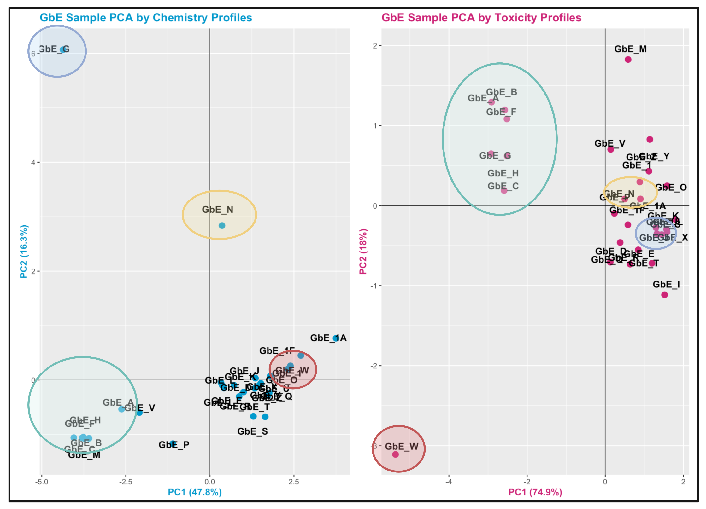
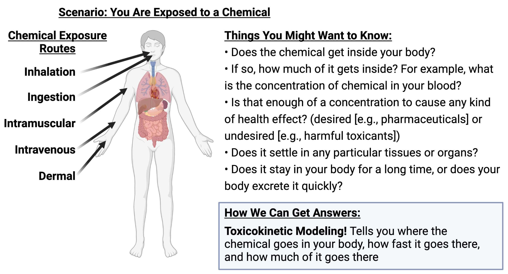
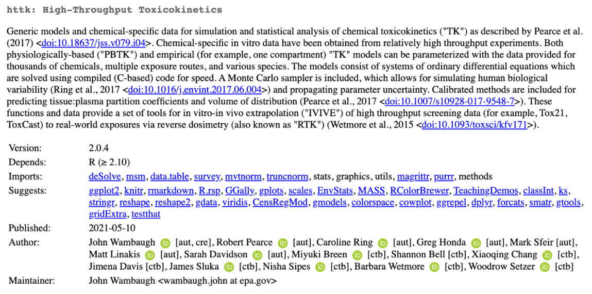
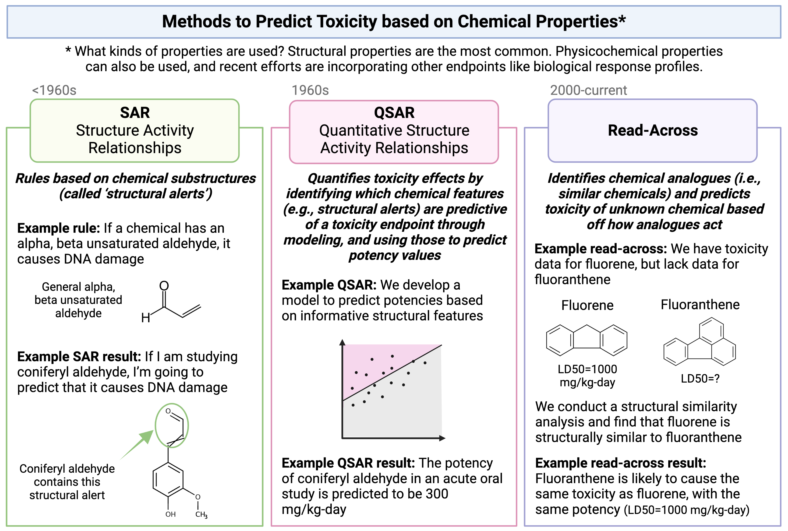
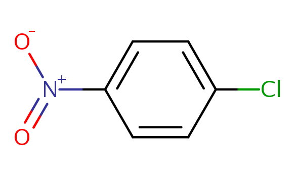
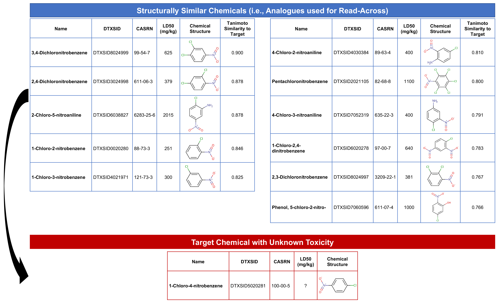

# (PART\*) Chapter 6 Applications in <br>Toxicology & Exposure <br>Science {-}

# 6.1 Descriptive Cohort Analyses

This training module was developed by Elise Hickman, Kyle Roell, and Julia E. Rager.

All input files (script, data, and figures) can be downloaded from the [UNC-SRP TAME2 GitHub website](https://github.com/UNCSRP/TAME2).

## Introduction to Training Module

Human cohort datasets are very commonly analyzed and integrated in environmental health research. Commone research study designs that incorporate human data include clinical, epidemiological, biomonitoring, and/or biomarker study designs. These datasets represent metrics of health and exposure collected from human participants at one or many points in time. Although these datasets can lend themselves to highly complex analyses, it is important to first explore the basic dataset properties to understand data missingness, filter data appropriately, generate demographic tables and summary statistics, and identify outliers. In this module, we will work through these common steps with an example dataset and discuss additional considerations when working with human cohort datasets. 

Our example data are derived from a study in which chemical exposure profiles were collected using silicone wristbands. Silicone wristbands are an affordable and minimally invasive method for sampling personal chemical exposure profiles. This exposure monitoring technique has been described through previous publications (see **TAME 2.0 Module 3.3 Normality Tests and Data Transformations**). The example workflow can also apply to other study designs, including biomonitoring and biomarker studies, which require careful consideration of chemical or biological marker detection filters, transparent reporting of descriptive statistics, and demographics tables. 

### Training Module's Environmental Health Questions 

1. What proportion of participants wore their wristbands for all seven days?
2. How many chemicals were detected in at least 20% of participants?
3. What are the demographics of the study participants?

### Workspace Preparation and Data Import

```{r message = FALSE}
# Load packages
library(tidyverse) # for data organization and manipulation
library(janitor) # for data cleaning
library(openxlsx) # for reading in and writing out files
library(DT) # for displaying tables
library(table1) # for making tables
library(patchwork) # for graphing
library(purrr) # for summary stats
library(factoextra) # for PCA outlier detection
library(table1) # for making demographics table

# Make sure select is calling the correct function
select <- dplyr::select

# Set graphing theme
theme_set(theme_bw())
```

First, we will import our raw chemical data and preview it.
```{r warning = FALSE}
wrist_data <- read.xlsx("Module6_1_Input/Module6_1_InputData1.xlsx") %>%
  mutate(across(everything(), \(x) as.numeric(x)))

datatable(wrist_data[ , 1:6])
```

In this study, 97 participants wore silicone wristbands for one week, and chemical concentrations on the wristbands were measured with gas chromatography mass spectrometry. This dataframe consists of a column with a unique identifier for each participant (`S_ID`), a column describing the number of days that participant wore the wristband (`Ndays`), and subsequent columns containing the amount of each chemical detected (nanograms of chemical per gram of wristband). The chemical columns are labeled with the chemical class first (e.g., alkyl OPE, or alkyl organophosphate ester), followed by and underscore and the chemical name (e.g., 2IPPDPP). This dataset contains 110 different chemicals categorized into 8 chemical classes (listed below with their abbreviations):

+ Brominated diphenyl ether (BDE)
+ Brominated flame retardant (BFR)
+ Organophosphate ester (OPE)
+ Polycyclic aromatic hydrocarbon (PAH)
+ Polychlorinated biphenyl (PCB)
+ Pesticide (Pest)
+ Phthalate (Phthal) 
+ Alkyl organophosphate ester (alkylOPE)

Through the data exploration and cleaning process, we will aim to:

+ Understand participant behaviors
+ Filter out chemicals with low detection
+ Generate a supplemental table containing chemical detection information and summary statistics such as minimum, mean, median, and maximum
+ Identify participant outliers 
+ Generate a demographics table

Although these steps are somewhat specific to our example dataset, similar steps can be taken with other datasets. We recommend thinking through the structure of your data and outlining data exploration and cleaning steps prior to starting your analysis. This process can be somewhat time-consuming and tedious but is important to ensure that your data are well-suited for downstream analyses. In addition, these steps should be included in any resulting manuscript as part of the narrative relating to the study cohort and data cleaning.

## Participant Exploration

We can use *tidyverse* functions to quickly tabulate how many days participants wore the wristbands.

```{r}
wrist_data %>%
  
  # Count number of participants for each number of days
  dplyr::count(Ndays) %>%
  
  # Calculate proportion of partipants for each number of days 
  mutate(prop = prop.table(n)) %>%
  
  # Arrange the table from highest to lowest number of days
  arrange(-Ndays) %>%
  
  # Round the proportion column to two decimal places
  mutate(across(prop, \(x) round(x, 2)))
```

### Answer to Environmental Health Question 1
:::question
*With this, we can now answer **Environmental Health Question #1***: What proportion of participants wore their wristbands for all seven days?
:::

:::answer
**Answer:** 86% of participants wore their wristbands for all seven days. 
:::

Because a few participants did not wear their wristbands for all seven days, it will be important to further explore whether there are outlier participants and to normalize the chemical concentrations by number of days the wristband was worn. We can first assess whether any participants have a particularly low or high number of chemicals detected relative to the other participants.

We'll prepare the data for graphing by creating a dataframe containing information about how many chemicals were detected per participant.
```{r}
wrist_det_by_participant <- wrist_data %>%
  
  # Remove Ndays column because we don't need it for this step
  select(-Ndays) %>%
  
  # Move S_ID to rownames so it doesn't interfere with count
  column_to_rownames("S_ID") %>%
  
  # Create a new column for number of chemicals detected
  mutate(n_det = rowSums(!is.na(.))) %>%
  
  # Clean dataframe
  rownames_to_column("S_ID") %>%
  select(c(S_ID, n_det))

datatable(wrist_det_by_participant)
```

Then, we can make our histogram:
```{r warning = FALSE, fig.align = "center"}
det_per_participant_graph <- ggplot(wrist_det_by_participant, aes(x = n_det)) +
  geom_histogram(color = "black", 
                 fill = "gray60",
                 alpha = 0.7,
                 binwidth = 2) +
  ggtitle("Distribution of Number of Chemicals Detected Per Participant") +
  ylab("Number of Participants") +
  xlab("Number of Chemicals Detected") +
  scale_x_continuous(breaks = seq(0, 70, by = 10), limits = c(0, 70), expand = c(0.025, 0.025)) +
  scale_y_continuous(breaks = seq(0, 15, by = 5), limits = c(0, 15), expand = c(0, 0)) +
  theme(plot.title = element_text(hjust = 0.5, size = 16),
        axis.title.x = element_text(margin = ggplot2::margin(t = 10), size = 13),
        axis.title.y = element_text(margin = ggplot2::margin(r = 10), size = 13),
        axis.text = element_text(size = 12))

det_per_participant_graph
```

From this histogram, we can see that the number of chemicals detected per participant ranges from about 30-65 chemicals, with no participants standing out as being well above or below the distribution. 

## Chemical Detection Filtering

Next, we want to apply a chemical detection filter to remove chemicals from the dataset with very low detection. To start, let's make a dataframe summarizing the percentage of participants in which each chemical was detected and graph this distribution using a histogram.

```{r}
# Create dataframe where n_detected is the sum of the rows where there are not NA values
chemical_counts <- data.frame(n_detected = colSums(!is.na(wrist_data %>% select(-c(S_ID, Ndays))))) %>%
  
  # Move rownames to a column
  rownames_to_column("class_chemical") %>%
  
  # Add n_undetected and percentage detected and undetected columns
  mutate(n_undetected = nrow(wrist_data) - n_detected,
         perc_detected = n_detected/nrow(wrist_data)*100,
         perc_undetected = n_undetected/nrow(wrist_data)*100) %>%
  
  # Round percentages to two decimal places
  mutate(across(c(perc_detected, perc_undetected), \(x) round(x, 2))) 

# View dataframe
datatable(chemical_counts)
```

```{r fig.align = "center"}
det_per_chemical_graph <- ggplot(chemical_counts, aes(x = perc_detected)) +
    geom_histogram(color = "black",
                   fill = "gray60",
                   alpha = 0.7,
                   binwidth = 1) +
    scale_x_continuous(breaks = seq(0, 100, by = 10), expand = c(0.025, 0.025)) +
    scale_y_continuous(breaks = seq(0, 25, by = 5), limits = c(0, 25), expand = c(0, 0)) +
    ggtitle("Distribution of Percentage Chemical Detection") +
    ylab("Number of Chemicals") +
    xlab("Percentage of Detection Across All Participants") +
    theme(plot.title = element_text(hjust = 0.5),
        axis.title.x = element_text(margin = ggplot2::margin(t = 10)),
        axis.title.y = element_text(margin = ggplot2::margin(r = 10)))

det_per_chemical_graph
```

From this histogram, we can see that many of the chemicals fall in the < 15% or > 90% detection range, with the others distributed evenly between 20 and 90% detection. How we choose to filter our data in part depends on the goals of our analysis. For example, if we only want to keep chemicals detected for almost all of the participants, we could set our threshold at 90% detection:
```{r fig.align = "center"}
# Add annotation column
chemical_counts <- chemical_counts %>%
  mutate(det_filter_90 = ifelse(perc_detected > 90, "Yes", "No"))

# How many chemicals pass this filter?
nrow(chemical_counts %>% filter(det_filter_90 == "Yes"))

# Make graph
det_per_chemical_graph_90 <- ggplot(chemical_counts, aes(x = perc_detected, fill = det_filter_90)) +
  geom_histogram(color = "black",
                 alpha = 0.7,
                 binwidth = 1) +
  scale_fill_manual(values = c("gray87", "gray32"), guide = "none") +
  geom_segment(aes(x = 90, y = 0, xend = 90, yend = 25), color = "firebrick", linetype = 2) +
  scale_x_continuous(breaks = seq(0, 100, by = 10), expand = c(0.025, 0.025)) +
  scale_y_continuous(breaks = seq(0, 25, by = 5), limits = c(0, 25), expand = c(0, 0)) +
  ggtitle("Distribution of Percentage Chemical Detection") +
  ylab("Number of Chemicals") +
  xlab("Percentage of Detection Across All Participants") +
  theme(plot.title = element_text(hjust = 0.5, size = 16),
        axis.title.x = element_text(margin = ggplot2::margin(t = 10), size = 13),
        axis.title.y = element_text(margin = ggplot2::margin(r = 10), size = 13),
        axis.text = element_text(size = 12))

det_per_chemical_graph_90
```

However, this only keeps 34 chemicals in our dataset, which is a significant proportion of all of the chemicals measured. We could also consider setting the filter at 20% detection to maximize inclusion of as many chemicals as possible.

```{r fig.align = "center"}
# Add annotation column
chemical_counts <- chemical_counts %>%
  mutate(det_filter_20 = ifelse(perc_detected > 20, "Yes", "No"))

# How many chemicals pass this filter?
nrow(chemical_counts %>% filter(det_filter_20 == "Yes"))

# Make graph
det_per_chemical_graph_20 <- ggplot(chemical_counts, aes(x = perc_detected, fill = det_filter_20)) +
  geom_histogram(color = "black",
                 alpha = 0.7,
                 binwidth = 1) +
  scale_fill_manual(values = c("gray87", "gray32"), guide = "none") +
  geom_segment(aes(x = 20, y = 0, xend = 20, yend = 25), color = "firebrick", linetype = 2) +
  scale_x_continuous(breaks = seq(0, 100, by = 10), expand = c(0.025, 0.025)) +
  scale_y_continuous(breaks = seq(0, 25, by = 5), limits = c(0, 25), expand = c(0, 0)) +
  ggtitle("Distribution of Percentage Chemical Detection") +
  ylab("Number of Chemicals") +
  xlab("Percentage of Detection Across All Participants") +
  theme(plot.title = element_text(hjust = 0.5, size = 16),
        axis.title.x = element_text(margin = ggplot2::margin(t = 10), size = 13),
        axis.title.y = element_text(margin = ggplot2::margin(r = 10), size = 13),
        axis.text = element_text(size = 12))

det_per_chemical_graph_20
```

### Answer to Environmental Health Question 2
:::question
*With this, we can now answer **Environmental Health Question #2***: How many chemicals were detected in at least 20% of participants?
:::

:::answer
**Answer:** 62 chemicals were detected in at least 20% of participants.
:::

We'll use the 20% detection filter for downstream analyses to maximize inclusion of data for our study. Note that selection of data filters is highly project- and goal- dependent, so be sure to take into consideration typical workflows for your type of data, study, or lab group. 

```{r}
# Create vector of chemicals to keep
chemicals_20perc <- chemical_counts %>%
  filter(perc_detected > 20) %>%
  pull(class_chemical)

# Filter dataframe
wrist_data_filtered <- wrist_data %>%
  column_to_rownames("S_ID") %>%
  dplyr::select(all_of(chemicals_20perc))
```

We can also summarize chemical detection vs. non-detection by chemical class to understand the number of chemicals in each class that were 1) detected in any participant or 2) detected in more than 20% of participants. 

```{r}
chemical_count_byclass <- chemical_counts %>%
  separate(class_chemical, into = c("class", NA), remove = FALSE, sep = "_") %>%
  group_by(class) %>%
  summarise(n_chemicals = n(), 
            n_chemicals_det = sum(n_detected > 0), 
            n_chemicals_det_20perc = sum(perc_detected >= 20)) %>%
  bind_rows(summarise(., across(where(is.numeric), sum),
                         across(where(is.character), ~'Total')))

datatable(chemical_count_byclass)
```

From these data, we can see that, of the 62 chemicals retained by our detection filter, some classes were retained more than others. For example, of the 8 of the 10 phthalates (80%) were retained by the 20% detection filter, while only 2 of the 11 PCBs (18%) were retained. 

## Outlier Identification

Next, we will check to see if any participants are outliers based on the entire chemical signature for each participant using principal component analysis (PCA). Prior to checking for outliers, a few final data cleaning steps are required, which are beyond the scope of this specific module, though we encourage participants to research these methods as they are important in general data pre-processing. These data cleaning steps were:

1. Imputing missing values.
2. Calculating time-weighted average values by dividing each value by the number of days the participant wore the wristband.
3. Assessing normality of data with and without log2 transformation. 

Here, we'll read in the fully cleaned and processed data, which contains data for all 97 participants and the 62 chemicals that passed the detection filter (imputed, time-weighted). We will also apply log2 transformation to move the data closer to a normal distribution. For more on these steps, see **TAME 2.0 Module 3.3 Normality Tests and Data Transformations** and **TAME 2.0 Module 4.2 Data Import, Processing, and Summary Statistics**.

```{r}
wrist_data_cleaned <- read.xlsx("Module6_1_Input/Module6_1_InputData2.xlsx") %>%
  column_to_rownames("S_ID") %>%
  mutate(across(everything(), \(x) log2(x+1)))

datatable(wrist_data_cleaned[ 1:6])
```

First, let's run PCA and plot our data.
```{r fig.align = "center"}
# Prepare dataframe
wrist_data_cleaned_scaled <- wrist_data_cleaned %>%
  scale() %>% data.frame()

# Run PCA
pca <- prcomp(wrist_data_cleaned_scaled)

# Visualize PCA
pca_chemplot <- fviz_pca_ind(pca, 
             label = "none",
             pointsize = 3) +
theme(axis.title = element_text(face = "bold", size = rel(1.1)),
      panel.border = element_rect(fill = NA, color = "black", linewidth = 0.3),
      panel.grid.minor = element_blank(),
      panel.grid.major = element_blank(), 
      plot.title = element_text(hjust = 0.5),
      legend.position = "none")

pca_chemplot
```

By visual inspection, it looks like there may be some outliers, so we can use a formula to detect outliers. One standard way to detect outliers is the criterion of being “more than 6 standard deviations away from the mean" ([Source](https://privefl.github.io/blog/detecting-outlier-samples-in-pca/)). 

We can apply this approach to our data by first creating a function to detect PCA outliers based on whether or not that participant passed a certain standard deviation cutoff. 

```{r}
# Create a function to detect PCA sample outliers. The input is the PCA results data frame and the number of standard deviations for the cutoff. The output is outlier names. 
outlier_detection = function(pca_df, sd){

    # getting scores
    scores = pca_df$x
    
    # identifying samples that are > 6 standard deviations away from the mean
    outlier_indices = apply(scores, 2, function(x) which( abs(x - mean(x)) > (sd * sd(x)) )) %>%
        Reduce(union, .)
    
    # getting sample names
    outliers = rownames(scores)[outlier_indices]
    
    return(outliers)
}

# Call function with different standard deviation cutoffs
outliers_6 <- outlier_detection(pca, 6)
outliers_5 <- outlier_detection(pca, 5)
outliers_4 <- outlier_detection(pca, 4)
outliers_3 <- outlier_detection(pca, 3)

# Summary data frame
outlier_summary <- data.frame(sd_cutoff = c(6, 5, 4, 3), n_outliers = c(length(outliers_6), length(outliers_5), length(outliers_4), length(outliers_3)))

outlier_summary
```

From these results, we see that there are no outliers that are > 6 standard deviations from the mean, so we will proceed with the dataset without filtering any participants out. 

## Summary Statistics Tables

Now that we have explored our dataset and finished processing the data, we can make a summary table that includes descriptive statistics (minimum, mean, median, maximum) for each of our chemicals. This table would go into supplementary material when the project is submitted for publication. It is a good idea to make this table using both the raw data and the cleaned data (imputed and normalized by time-weighted average) because different readers may have different interests in the data. For example, they may want to see the raw data so that they can understand chemical detection versus non-detection and absolute minimums or maximums of detection. Or, they may want to use the cleaned data for their own analyses. This table can also include information about whether or not the chemical passed our 20% detection filter. 

There are many ways to generate summary statistics tables in R. Here, we will demonstrate a method using the `map_dfr()` function, which takes a list of functions and applies them across columns of the data. The summary statistics are then placed in rows, with each column representing a variable.

```{r warning = FALSE}
# Define summary functions
summary_functs <- lst(min, median, mean, max)

# Apply summary functions to raw data
summarystats_raw <- map_dfr(summary_functs, ~ summarise(wrist_data, across(3:ncol(wrist_data), .x, na.rm = TRUE)), .id = "statistic")

# View data
datatable(summarystats_raw[, 1:6])
```

Through a few cleaning steps, we can transpose and format these data so that they are publication-quality.
```{r}
summarystats_raw <- summarystats_raw %>% 
  
  # Transpose dataframe and return to dataframe class
  t() %>% as.data.frame() %>%
  
  # Make the first row the column names
  row_to_names(1) %>%
  
  # Remove rows with NAs (those where data are completely missing)
  na.omit() %>%
  
  # Move chemical identifier to a column
  rownames_to_column("class_chemical") %>%
  
  # Round data
  mutate(across(min:max, as.numeric)) %>%
  mutate(across(where(is.numeric), round, 2)) %>%
  
  # Add a suffix to column titles so we know that these came from the raw data
  rename_with(~paste0(., "_raw"), min:max)

datatable(summarystats_raw)
```

We can apply the same steps to the cleaned data.

```{r}
summarystats_cleaned <- map_dfr(summary_functs, ~ summarise(wrist_data_cleaned, across(1:ncol(wrist_data_cleaned), .x, na.rm = TRUE)), 
                                .id = "statistic") %>%
  t() %>% as.data.frame() %>%
  row_to_names(1) %>%
  na.omit() %>%
  rownames_to_column("class_chemical") %>%
  mutate(across(min:max, as.numeric)) %>%
  mutate(across(where(is.numeric), round, 2)) %>%
  rename_with(~paste0(., "_cleaned"), min:max)

datatable(summarystats_cleaned)
```

Finally, we will merge the data from our `chemical_counts` dataframe (which contains detection information for all of our chemicals) with our summary statistics dataframes. 

```{r}
summarystats_final <- chemical_counts %>%
  
  # Remove 90% detection filter column
  select(-det_filter_90) %>%
  
  # Add raw summary stats
  left_join(summarystats_raw, by = "class_chemical") %>%
  
  # Add cleaned summary stats
  left_join(summarystats_cleaned, by = "class_chemical")

datatable(summarystats_final, width = 600)
```

## Demographics Table

Another important element of any analysis of human data is the demographics table. The demographics table provides key information about the study participants and can help inform downstream analyses, such as exploration of the impact of covariates on the endpoint of interest. There are many different ways to make demographics tables in R. Here, we will demonstrate making a demographics table with the *table1* package. For more on this package, including making tables with multiple groups and testing for statistical differences in demographics between groups, see the *table1* vignette [here](https://benjaminrich.github.io/table1/vignettes/table1-examples.html). 

First, we'll read in and view our demographic data:
```{r}
demo_data <- read.xlsx("Module6_1_Input/Module6_1_InputData3.xlsx")

datatable(demo_data)
```

Then, we can create new labels for our variables so that they are more nicely formatted and more intuitive for display in the table.
```{r}
# Create new labels for the demographics table
label(demo_data$mat_age_birth) <- "Age at Childbirth"
label(demo_data$pc_sex) <- "Sex"
label(demo_data$pc_gender) <- "Gender"
label(demo_data$pc_latino_hispanic) <- "Latino or Hispanic"
label(demo_data$pc_race_cleaned) <- "Race"
label(demo_data$pc_ed) <- "Educational Attainment"
```

Our demographics data also had "F" for female in the sex column. We can change this to "Female" so that the demographics table is more readable.
```{r}
demo_data <- demo_data %>%
  mutate(pc_sex = dplyr::recode(pc_sex, "F" = "Female"))

label(demo_data$pc_sex) <- "Sex"
```

Now, let's make the table. The first argument in the formula is all of the columns you want to include in the table, followed by the input dataframe.
```{r}
table1(~ mat_age_birth + pc_sex + pc_gender + pc_latino_hispanic + pc_race_cleaned + pc_ed, data = demo_data)
```

<br>

There are a couple of steps we could take to clean up the table:

1. Change the rendering for our continuous variable (age) to just mean (SD).
2. Order educational attainment so that it progresses from least to most education.

We can change the rendering for our continuous variable by defining our own rendering function (as demonstrated in the package's vignette).
```{r}
# Create function for custom table so that Mean (SD) is shown for continuous variables
my.render.cont <- function(x) {
  with(stats.apply.rounding(stats.default(x), digits=2), 
       c("", "Mean (SD)"=sprintf("%s (&plusmn; %s)", MEAN, SD)))
}
```

We can order the education attainment by changing it to a factor and defining the levels.
```{r}
demo_data <- demo_data %>%
  mutate(pc_ed = factor(pc_ed, levels = c("High School or GED", "Associate Degree", "Four-Year Degree", 
                                          "Master's Degree", "Professional Degree or PhD")))

label(demo_data$pc_ed) <- "Educational Attainment"
```

Then, we can make our final table. 
```{r}
table1(~ mat_age_birth + pc_sex + pc_gender + pc_latino_hispanic + pc_race_cleaned + pc_ed, 
       data = demo_data,
       render.continuous = my.render.cont)
```

### Answer to Environmental Health Question 3
:::question
*With this, we can now answer **Environmental Health Question #3***: What are the demographics of the study participants?
:::

:::answer
**Answer:** The study participants were all females who identified as women and were, on average, 31 years old when they gave birth. Participants were mostly non-latino/non-hispanic and White. Participants were spread across educational attainment levels, with the smallest education attainment group being those with an associate degree and the largest being those with a four-year degree. 
:::

## Concluding Remarks

In conclusion, this training module serves as an introduction to human cohort data exploration and preliminary analysis, including data filtering, summary statistics, and multivariate outlier detection. These methods are an important step at the beginning of human cohort analyses, and the concepts introduced in this module can be applied to a wide variety of datasets.

<br>

<label class="tykfont">
Test Your Knowledge 
</label>

:::tyk
Using a more expanded demographics file ("Module6_1_TYKInput.xlsx"), create a demographics table with:

+ The two new variables (home location and home type) included
+ The table split by which site the participant visited
+ Variable names and values presented in a publication-quality format (first letters capitalized, spaces between words, no underscores) 
:::

# 6.2 -Omics and System Biology: Transcriptomic Applications

This training module was developed by Lauren Koval, Dr. Kyle Roell, and Dr. Julia E. Rager.

All input files (script, data, and figures) can be downloaded from the [UNC-SRP TAME2 GitHub website](https://github.com/UNCSRP/TAME2).


## Introduction to Training Module

This training module incorporates the highly relevant example of RNA sequencing to evaluate the impacts of environmental exposures on cellular responses and general human health. **RNA sequencing** is the most common method that is currently implemented to measure the transcriptome. Results from an RNA sequencing platform are often summarized as count data, representing the number of relative times a gene (or other annotated portion of the genome) was 'read' in a given sample. For more details surrounding the methodological underpinnings of RNA sequencing, see the following recent review:

+ Stark R, Grzelak M, Hadfield J. RNA sequencing: the teenage years. Nat Rev Genet. 2019 Nov;20(11):631-656. doi: 10.1038/s41576-019-0150-2. Epub 2019 Jul 24. PMID: [31341269](https://pubmed.ncbi.nlm.nih.gov/31341269/).


In this training module, we guide participants through an example RNA sequencing analysis. Here, we analyze RNA sequencing data collected in a toxicology study evaluating the effects of biomass smoke exposure, representing wildfire-relevant exposure conditions. This study has been previously been described in the following publications:

+ Rager JE, Clark J, Eaves LA, Avula V, Niehoff NM, Kim YH, Jaspers I, Gilmour MI. Mixtures modeling identifies chemical inducers versus repressors of toxicity associated with wildfire smoke. Sci Total Environ. 2021 Jun 25;775:145759. doi: 10.1016/j.scitotenv.2021.145759. Epub 2021 Feb 10. PMID: [33611182](https://pubmed.ncbi.nlm.nih.gov/33611182/).

+ Kim YH, Warren SH, Krantz QT, King C, Jaskot R, Preston WT, George BJ, Hays MD, Landis MS, Higuchi M, DeMarini DM, Gilmour MI. Mutagenicity and Lung Toxicity of Smoldering vs. Flaming Emissions from Various Biomass Fuels: Implications for Health Effects from Wildland Fires. Environ Health Perspect. 2018 Jan 24;126(1):017011. doi: 10.1289/EHP2200. PMID: [29373863](https://pubmed.ncbi.nlm.nih.gov/29373863/).

Here, we specifically analyze mRNA sequencing profiles collected in mouse lung tissues. These mice were exposed to two different biomass burn scenarios: smoldering pine needles and flaming pine needles, representing certain wildfire smoke exposure scenarios that can occur. The goal of these analyses is to identify which genes demonstrate altered expression in response to these wildfire-relevant exposures, and identify which biological pathways these genes influence to evaluate findings at the systems biology level.

This training module begins by guiding users through the loading, viewing, and formatting of the example transcriptomics datasets and associated metadata. Methods to carry out quality assurance (QA) / quality control (QC) of the transcriptomics data are then described, which are advantageous to ensure high quality data are included in the final statistical analysis. Because these transcriptomic data were derived from bulk lung tissue samples, consisting of mixed cell populations that could have shifted in response to exposures, data are then adjusted for potential sources of heterogeneity using the R package [RUVseq](https://bioconductor.org/packages/release/bioc/html/RUVSeq.html).

Statistical models are then implemented to identify genes that were significantly differentially expressed between exposed vs unexposed samples. Models are implemented using algorithms within the commonly implemented R package [DESeq2](https://doi.org/10.1186/s13059-014-0550-8). This package is very convenient, well written, and widely used. The main advantage of this package is that is allows you to perform differential expression analyses and easily obtain various statistics and results with minimal script development on the user-end. 

After obtaining results from differential gene expression analyses, we visualize these results using both MA and volcano plots. Finally, we carry out a systems level analysis through pathway enrichment using the R package [PIANO](https://doi.org/10.1093/nar/gkt111) to identify which biological pathways were altered in response to these wildfire-relevant exposure scenarios.

## Introduction to the Field of "-Omics"

The field of "-omics" has rapidly evolved since its inception in the mid-1990’s, initiated from information obtained through sequencing of the human genome (see the [Human Genome Project](https://www.genome.gov/human-genome-project)) as well as the advent of high-content technologies. High-content technologies have allowed the rapid and economical assessment of genome-wide, or ‘omics’-based, endpoints.

Traditional molecular biology techniques typically evaluate the function(s) of individual genes and gene products. Omics-based methods, on the other hand, utilize non-targeted methods to identify many to all genes or gene products in a given environmental/biological sample. These non-targeted approaches allow for the unbiased investigation of potentially unknown or understudied molecular mediators involved in regulating cell health and disease. These molecular profiles have the potential of being altered in response to toxicant exposures and/or during disease initiation/progression.

To further understand the molecular consequences of -omics-based alterations, molecules can be overlaid onto molecular networks to uncover biological pathways and molecular functions that are perturbed at the systems biology level. An overview of these generally methods, starting with high-content technologies and ending of systems biology, is provided in the below figure (created with BioRender.com).

```{r, echo=FALSE, fig.align='center'} 
knitr::include_graphics("Module6_2_Input/Module6_2_Image1.png")
```

<br>
A helpful introduction to the field of -omics in relation to environmental health, as well as methods used to relate -omic-level alterations to systems biology, is provided in the following book chapter:

+ Rager JE, Fry RC. Systems Biology and Environmental Exposures. Chpt 4 of 'Network Biology' edited by WenJun Zhang. 2013. ISBN: 978-1-62618-941-3. Nova Science Publishers, Inc. Available at: https://www.novapublishers.com/wp-content/uploads/2019/07/978-1-62618-942-3_ch4.pdf.
  

An additional helpful resource describing computational methods that can be used in systems level analyses is the following book chapter:

+ Meisner M, Reif DM. Computational Methods Used in Systems Biology. Chpt 5 of 'Systems Biology in Toxicology and Environmental Health' edited by Fry RC. 2015: 85-115. ISBN 9780128015643. Academic Press. Available at: https://www.sciencedirect.com/science/article/pii/B9780128015643000055.


Parallel to human genomics/epigenomics-based research is the newer "-omics" topic of the **exposome**. The exposome was originally conceptualized as 'all life-course environmental exposures (including lifestyle factors), from the prenatal period onwards ([Wild et al. 2005](https://cebp.aacrjournals.org/content/14/8/1847.long)). Since then, this concept has received much attention and additional associated definitions. We like to think of the exposome as including anything in ones environment that may impact the overall health of an individual, excluding the individual's genome/epigenome. Common elements evaluated as part of the exposome include environmental exposures, such as chemicals and other substances that may impart toxicity. Additional potential stressors include lifestyle factors, socioeconomic factors, infectious agents, therapeutics, and other stressors that may be altered internally (e.g., microbiome). A helpful review of this research field is provided as the following publication:

+ Wild CP. The exposome: from concept to utility. Int J Epidemiol. 2012 Feb;41(1):24-32. doi: 10.1093/ije/dyr236. Epub 2012 Jan 31. PMID: [22296988](https://pubmed.ncbi.nlm.nih.gov/22296988/).


## Introduction to Transcriptomics
One of the most widely evaluated -omics endpoints is messenger RNA (mRNA) expression (also termed gene expression). As a reminder, mRNA molecules are a major type of RNA produced as the "middle step" in the [Central Dogma Theory](https://en.wikipedia.org/wiki/Central_dogma_of_molecular_biology#:~:text=The%20central%20dogma%20of%20molecular,The%20Central%20Dogma), which describes how genetic DNA is first transcribed into RNA and then translated into protein. Protein molecules are ultimately the major regulators of cellular processes and overall health. Therefore, any perturbations to this process (including changes to mRNA expression levels) can have tremendous consequences on overall cell function and health. A visualization of these steps in the Central Dogma theory are included below.

```{r, echo=FALSE, fig.align='center'} 
knitr::include_graphics("Module6_2_Input/Module6_2_Image2.png")
```


mRNA expression can be evaluated in a high-throughout/high-content manner, across the genome, and is referred to as the **transcriptome** when doing so. Transcriptomics can be measured using a variety of technologies, including high-density nucleic acid arrays (e.g., DNA microarrays or GeneChip arrays), high-throughput PCR technologies, or RNA sequencing technologies. These methods are used to obtain relative measures of genes that are being expressed or transcribed from DNA by measuring the abundance of mRNA molecules. Results of these methods are often termed as providing gene expression signatures or 'transcriptomes' of a sample under evaluation.


### Training Module's **Environmental Health Questions**

This training module was specifically developed to answer the following environmental health questions:

(1) What two types of data are commonly needed in the analysis of transcriptomics data?

(2) When preparing transcriptomics data for statistical analyses, what are three common data filtering steps that are completed during the data QA/QC process?

(3) When identifying potential sample outliers in a typical transcriptomics dataset, what two types of approaches are commonly employed to identify samples with outlying data distributions?

(4) What is an approach that analysts can use when evaluating transcriptomic data from tissues of mixed cellular composition to aid in controlling for sources of sample heterogeneity?

(5) How many genes showed significant differential expression associated with flaming pine needles exposure in the mouse lung, based on a statistical filter of a multiple test corrected p-value (padj) < 0.05?

(6) How many genes showed significant differential expression associated with smoldering pine needles exposure in the mouse lung, based on a statistical filter of a multiple test corrected p-value (padj) < 0.05?

(7) How many genes showed significant differential expression associated with lipopolysaccharide (LPS) exposure in the mouse lung, based on a statistical filter of a multiple test corrected p-value (padj) < 0.05?

(8) What biological pathways are disrupted in association with flaming pine needles exposure in the lung, identified through systems level analyses?


### Workspace Preparation and Data Import

<br>

#### Installing required R packages
If you already have these packages installed, you can skip this step, or you can run the below code which checks installation status for you
```{r packages, message=FALSE, warning=FALSE, error=FALSE}
if (!requireNamespace("tidyverse"))
   install.packages("tidyverse");
if (!requireNamespace("BiocManager"))
   BiocManager::install("BiocManager");
if (!requireNamespace("DESeq2"))
   BiocManager::install("DESeq2");
if (!requireNamespace("edgeR"))
   BiocManager::install("edgeR");
if (!requireNamespace("RUVSeq"))
   BiocManager::install("RUVSeq");
if (!requireNamespace("janitor"))
    install.packages("janitor");
if (!requireNamespace("pheatmap"))
   install.packages("pheatmap");
if (!requireNamespace("factoextra"))
    install.packages("factoextra");
if (!requireNamespace("RColorBrewer"))
     install.packages("RColorBrewer");
if (!requireNamespace("data.table"))
    install.packages("data.table");
if (!requireNamespace("EnhancedVolcano"))
   BiocManager::install("EnhancedVolcano");
if (!requireNamespace("piano"))
   BiocManager::install("piano");
```


#### Loading R packages required for this session
```{r, message=FALSE, warning=FALSE, error=FALSE}
library(tidyverse)
library(DESeq2)
library(edgeR)
library(RUVSeq)
library(janitor)
library(factoextra)
library(pheatmap)
library(data.table)
library(RColorBrewer)
library(EnhancedVolcano)
library(piano)
```


#### Set your working directory
```{r, eval=FALSE, echo=TRUE}
setwd("/filepath to where your input files are")
```


### Loading the Example Transcriptomic Dataset and Metadata

First, let's read in the transcriptional signature data, previously summarized as number of sequence reads per gene (also simply referred to as 'count data') and its associated metadata file:
```{r loaddata, message=F, warning=F, error=F}
# Read in the count data
countdata <- read.csv(file = 'Module6_2_Input/Module6_2_InputData1_GeneCounts.csv', check.names = FALSE)

# Read in the metadata (describing information on each sample)
sampleinfo <- read.csv(file = "Module6_2_Input/Module6_2_InputData2_SampleInfo.csv", check.names = FALSE)
```


### Data Viewing

Let's see how many rows and columns of data are present in the countdata dataframe 
```{r}
dim(countdata)
```

Let's also view the column headers
```{r}
colnames(countdata)
```

And finally let's view the top few rows of data
```{r}
head(countdata)
```
Together, this dataframe contains information across 30146 mRNA identifiers, that are labeled according to "Gene name" followed by an underscore and probe number assigned by the platform used in this analysis, BioSpyder TempoSeq Technologies.  

A total of 23 columns are included in this dataframe, the first of which represents the gene identifier, followed by gene count data across 22 samples.


Let's also see what the metadata dataframe looks like
```{r}
dim(sampleinfo)
```

Let's also view the column headers
```{r}
colnames(sampleinfo)
```

And finally let's view the top few rows of data
```{r}
head(sampleinfo)
```
Together, this dataframe contains information across the 22 total samples, that are labeled according to "SampleID_BioSpyderCountFile" header. These identifiers match those used as column headers in the countdata dataframe.

A total of 9 columns are included in this dataframe, including the following:

+ `SampleID_BioSpyderCountFile`: The unique sample identifers (total n=22)
+ `PlateBatch`: The plate number that was used in the generation of these data.
+ 'MouseID': The unique identifier, that starts with "M" followed by a number, for each mouse used in this study
+ `NumericID`: The unique numeric identifier for each mouse.
+ `Treatment`: The type of exposure condition that each mouse was administered. These include smoldering pine needles, flaming pine needles, vehicle control (saline), and positive inflammation control (LPS, or lipopolysaccharide)
+ `ID`: Another form of identifier that combines the mouse identifier with the exposure condition
+ `Timepoint`: The timepoint at which samples were collected (here, all 4h post-exposure)
+ `Tissue`: The type of tissue that was collected and analyzed (here, all lung tissue)
+ `Group`: The higher level identifier that groups samples together based on exposure condition, timepoint, and tissue

### Checking for Duplicate mRNA IDs

One common QC/preparation step that is helpful when organizing transcriptomics data is to check for potential duplicate mRNA IDs in the countdata. 
```{r}
# Visualize this data quickly by viewing top left corner, to check where ID column is located:
countdata[1:3,1:5]

# Then check for duplicates within column 1 (where the ID column is located):
Dups <- duplicated(countdata[,1])
summary(Dups)
```
  
In this case, because all potential duplicate checks turn up "FALSE", these data do not contain duplicate mRNA identifiers in its current organized format.

### Answer to Environmental Health Question 1

:::question
*With this, we can now answer **Environmental Health Question #1***: What two types of data are commonly needed in the analysis of transcriptomics data?
:::

:::answer
**Answer:** A file containing the raw -omics signatures are needed (in this case, the count data summarized per gene acquired from RNA sequencing technologies), and a file containing the associated metadata describing the actual samples, where they were derived from, what they represent, etc, is needed.
:::


## Formatting Data for Downstream Statistics

Most of the statistical analyses included in this training module will be carried out using the DESeq2 pipeline. This package requires that the count data and sample information data be formatted in a certain manner, which will expedite the downstream coding needed to carry out the statistics. Here, we will walk users through these initial formatting steps.

DESeq2 first requires a `coldata` dataframe, which includes the sample information (i.e., metadata). Let's create this new dataframe based on the original `sampleinfo` dataframe:
```{r, message=F, warning=F, error=F}
coldata <- sampleinfo
```


DESeq2 also requires a `countdata` dataframe, which we've previously created; however, this dataframe requires some minor formatting before it can be used as input for downstream script. 

First, the gene identifiers need to be converted into row names:
```{r, message=F, warning=F, error=F}
countdata <- countdata %>% column_to_rownames("Gene")
```

Then, the column names need to be edited. Let's remind ourselves what the column names are currently:
```{r, message=F, warning=F, error=F}
colnames(countdata)
```

These column identifiers need to be converted into more intuitive sample IDs, that also indicate treatment. This information can be found in the coldata dataframe. Specifically, information in the column labeled `SampleID_BioSpyderCountFile` will be helpful for these purposes.

To replace these original column identifiers with these more helpful sample identifiers, let's first make sure the order of the countdata columns are in the same order as the coldata column of `SampleID_BioSpyderCountFile`:
```{r, message=F, warning=F, error=F}
countdata <- setcolorder(countdata, as.character(coldata$SampleID_BioSpyderCountFile))
```

Now, we can rename the column names within the countdata dataframe with these more helpful identifiers, since both dataframes are now arranged in the same order:
```{r, message=F, warning=F, error=F}
colnames(countdata) <- coldata$ID # Rename the countdata column names with the treatment IDs. 
colnames(countdata) # Viewing these new column names
```
These new column identifiers look much better, and can better inform downstream statistical analysis script. Remember that these identifiers indicate that these are mouse samples ("M"), with unique numbers, followed by an underscore and the exposure condition.


When relabeling dataframes, it's always important to triple check any of these major edits. For example, here, let's double check that the same samples appear in the same order between the two working dataframes required for dowstream DESeq2 code:
```{r, message=F, warning=F, error=F}
setequal(as.character(coldata$ID), colnames(countdata))
identical(as.character(coldata$ID), colnames(countdata))
```

<br>

## Transcriptomics Data QA/QC
After preparing your transcriptomic data and sample information dataframes for statistical analyses, it is very important to carry out QA/QC on your organized datasets, prior to including all samples and all genes in the actual statistical model. It is critical to only include high quality data that inform underlying biology of exposure responses/disease etiology, rather than data that may contribute noise to the overall data distributions. Some common QA/QC steps and associated data pre-filters carried out in transcriptomics analyses are detailed below.


### Background Filter
It is very common to perform a background filter step when preparing transcriptomic data for statistical analyses. The goal of this step is to remove genes that are very lowly expressed across the majority of samples, and thus are referred to as universally lowly expressed. Signals from these genes can mute the overall signals that may be identified in -omics analyses. The specific threshold that you may want to apply as the background filter to your dataset will depend on the distribution of your dataset and analysis goal(s).

For this example, we apply a background threshold, to remove genes that are lowly expressed across the majority of samples, specifically defined as genes that have expression levels across at least 20% of the samples that are less than (or equal to) the median expression of all genes across all samples. This will result in including only genes that are expressed above background, that have expression levels in at least 20% of samples that are greater than the overall median expression. Script to apply this filter is detailed below:

```{r backfilt, message=F, warning=F, error=F}
# First count the total number of samples, and save it as a value in the global environment
nsamp <- ncol(countdata)

# Then, calculate the median expression level across all genes and all samples, and save it as a value
total_median <- median(as.matrix(countdata))


# We need to temporarily add back in the Gene column to the countdata so we can filter for genes that pass the background filter
countdata <- countdata %>% rownames_to_column("Gene")

# Then we can apply a set of filters and organization steps (using the tidyverse) to result in a list of genes that have an expression greater than the total median in at least 20% of the samples
genes_above_background <- countdata %>% # Start from the 'countdata' dataframe
  # Melt the data so that we have three columns: gene, exposure condition, and expression counts
  pivot_longer(cols=!Gene, names_to = "sampleID", values_to="expression") %>% 
  # Add a column that indicates whether the expression of a gene for the corresponding exposure condition is above (1) or not above (0) the median of all count data
  mutate(above_median=ifelse(expression>total_median,1,0)) %>% 
  group_by(Gene) %>% # Group the dataframe by the gene
  # For each gene, count the number of exposure conditions where the expression was greater than the median of all count data
  summarize(total_above_median=sum(above_median)) %>% 
  # Filter for genes that have expression above the median in at least 20% of the samples
  filter(total_above_median>=.2*nsamp) %>% 
  # Select just the genes that pass the filter
  select(Gene) 

# Then filter the original 'countdata' dataframe for only the genes above background. 
countdata <- left_join(genes_above_background, countdata, by="Gene")
```

Here, the `countdata` dataframe went from having 30,146 rows of data (representing genes) to 16,664 rows of data (representing genes with expression levels that passed this background filter)


### Sample Filtering
Another common QA/QC check is to evaluate whether there are any samples that did not produce adequate RNA material to be measured using the technology employed. Thus, a sample filter can be applied to remove samples that have inadequate data. Here, we demonstrate this filter by checking to see whether there were any samples that resulted in mRNA expression values of zero across all genes. If any sample demonstrates this issue, it should be removed prior to any statistical analysis. Note, there are other filter cut-offs you can use depending on your specific study.

Below is example script that checks for the presence of samples that meet the above criteria:
```{r sampfilt, message=FALSE, warning=FALSE, error=FALSE}
# Transpose filtered 'countdata', while keeping data in dataframe format, to allow for script that easily sums the total expression levels per sample
countdata_T <- countdata %>% 
  pivot_longer(cols=!Gene, names_to="sampleID",values_to="expression") %>% 
  pivot_wider(names_from=Gene, values_from=expression)

# Then add in a column to the transposed countdata dataframe that sums expression across all genes for each exposure condition
countdata_T$rowsum <- rowSums(countdata_T[2:ncol(countdata_T)])

# Remove samples that have no expression. All samples have some expression in this example, so all samples are retained.
countdata_T <- countdata_T %>% filter(rowsum!=0)

# Take the count data filtered for correct samples, remove the 'rowsums' column
countdata_T <- countdata_T %>% select(!rowsum) 

# Then, transpose it back to the correct format for analysis
countdata <- countdata_T %>%
  pivot_longer(cols=!sampleID, names_to = "Gene",values_to="expression") %>% 
  pivot_wider(names_from = sampleID, values_from = "expression")
```


### Identifying & Removing Sample Outliers
Prior to final statistical analysis, raw transcriptomic data are commonly evaluated for the presence of potential sample outliers. Outliers can result from experimental error, technical error/measurement error, and/or huge sources of variation in biology. For many analyses, it is beneficial to remove such outliers to enhance computational abilities to identify biologically meaningful signals across data. Here, we present two methods to check for the presence of sample outliers:

**1. Principal component analysis (PCA)** can be used to identify potential outliers in a dataset through visualization of summary-level values illustrating reduced representations of the entire dataset. Note that a more detailed description of PCA is provided in **TAME 2.0 Module 5.4 Unsupervised Machine Learning Part 1: K-Means & PCA**. Here, PCA is run on the raw count data and further analyzed using scree plots, assessing principal components (PCs), and visualized using biplots displaying the first two principal components as a scatter plot. 


**2. Hierarchical clustering** is another approach that can be used to identify potential outliers. Hierarchical clustering aims to cluster data based on a similarity measure, defined by the function and/or specified by the user. There are several R packages and functions that will run hierarchical clustering, but it is often helpful visually to do this in conjuction with a heatmap. Here, we use the package *pheatmap* (introduced in **TAME 2.0 Module 5.5 Unsupervised Machine Learning Part 2: Additional Clustering Applications**) with hierarchical clustering across samples to identify potential outliers. 


Let's start by using PCA to identify potential outliers, while providing a visualization of potential sources of variation across the dataset.

First we need to move the Gene column back to the rownames so our dataframe is numeric and we can run the PCA script
```{r, message=FALSE, warning=FALSE, error=FALSE}
countdata <- countdata %>% column_to_rownames("Gene")

# Let's remind ourselves what these data look like
countdata[1:10,1:5] #viewing first 10 rows and 5 columns
```


Then we can calculate principal components using transposed count data 
```{r}
pca <- prcomp(t(countdata))
```


And visualize the percent variation captured by each principal component (PC) with a scree plot
```{r, fig.align='center'}
# We can generate a scree plot that shows the eigenvalues of each component, indicating how much of the total variation is captured by each component
fviz_eig(pca, addlabels = TRUE)
```
  
This scree plot indicates that nearly all variation is explained in PC1 and PC2, so we are comfortable with viewing these first two PCs when evaluating whether or not potential outliers exist in this dataset.

#### Visualization of Transcriptomic Data using PCA

Further visualization of how these transcriptomic data appear through PCA can be produced through a scatter plot showing the data reduced values per sample:
```{r, fig.align='center', warning = FALSE}
# Calculate the percent variation captured by each PC
pca_percent <- round(100*pca$sdev^2/sum(pca$sdev^2),1)

# Make dataframe for PCA plot generation using first two components and the sample name
pca_df <- data.frame(PC1 = pca$x[,1], PC2 = pca$x[,2], Sample=colnames(countdata))

# Organize dataframe so we can color our points by the exposure condition
pca_df <- pca_df %>% separate(Sample, into = c("mouse_num", "expo_cond"), sep="_")

# Plot PC1 and PC2 for each sample and color the point by the exposure condition
ggplot(pca_df, aes(PC1,PC2, color = expo_cond))+
  geom_hline(yintercept = 0, size=0.3)+
  geom_vline(xintercept = 0, size=0.3)+
  geom_point(size=3) +
  geom_text(aes(label=mouse_num), vjust =-1, size=4)+
  labs(x=paste0("PC1 (",pca_percent[1],"%)"), y=paste0("PC2 (",pca_percent[2],"%)"))+
  ggtitle("PCA for 4h Lung Pine Needles & Control Exposure Conditions")
```
    
With this plot, we can see that samples do not demonstrate obvious groupings, where certain samples group far apart from others. Therefore, our PCA analysis indicates that there are unlikely any sample outliers in this dataset.


#### Now lets implement hierarchical clustering to identify potential outliers

First we need to create a dataframe of our transposed `countdata` such that samples are rows and genes are columns to input into the clustering algorithm.
```{r}
countdata_for_clustering <- t(countdata)
countdata_for_clustering[1:5,1:10] # Viewing what this transposed dataframe looks like
```


Next we can run hierarchical clustering in conjunction with the generation of a heatmap. Note that we scale these data for improved visualization.
```{r, fig.align='center'}
pheatmap(scale(countdata_for_clustering), main="Hierarchical Clustering",
         cluster_rows=TRUE, cluster_cols = FALSE,
         fontsize_col = 7, treeheight_row = 60, show_colnames = FALSE)
```
    
Like the PCA findings, heirarchical clustering demonstrated an overall lack of potential sample outliers because there were no obvious sample(s) that grouped separately from the rest along the clustering dendograms.  
Therefore, *neither approach points to outliers that should be removed in this analysis.*

<br>


### Answer to Environmental Health Question 2

:::question
*With this, we can now answer **Environmental Health Question #2***: When preparing transcriptomics data for statistical analyses, what are three common data filtering steps that are completed during the data QA/QC process?
:::

:::answer
**Answer:** (1) Background filter to remove genes that are universally lowly expressed; (2) Sample filter to remove samples that may be not have any detectable mRNA; (3) Sample outlier filter to remove samples with underlying data distributions outside of the overall, collective dataset.*
:::

### Answer to Environmental Health Question 3
:::question
*With this, we can now also answer **Environmental Health Question #3***: When identifying potential sample outliers in a typical transcriptomics dataset, what two types of approaches are commonly employed to identify samples with outlying data distributions?
:::

:::answer
**Answer:** Principal component analysis (PCA) and hierarchical clustering.
:::

<br>

## Controlling for Sources of Sample Heterogeneity
Because these transcriptomic data were generated from mouse lung tissues, there is potential for these samples to show heterogeneity based on underlying shifts in cell populations (e.g., neutrophil influx) or other aspects of sample heterogeneity (e.g., batch effects from plating, among other sources of heterogeneity that we may want to control for). For these kinds of complex samples, there are data processing methods that can be leveraged to minimize the influence of these sources of heterogeneity. Example methods include Remove Unwanted Variable (RUV), which is discussed here, as well as others (e.g., [Surrogate Variable Analysis (SVA)](https://academic.oup.com/nar/article/42/21/e161/2903156)).  

Here, we leverage the package called *RUVseq* to employ RUV on this sequencing dataset. Script was developed based off [Bioconductor website](https://bioconductor.org/packages/release/bioc/html/RUVSeq.html), [vignette](http://bioconductor.org/packages/release/bioc/vignettes/RUVSeq/inst/doc/RUVSeq.pdf), and original [publication](https://www.ncbi.nlm.nih.gov/pmc/articles/PMC4404308/).


#### Steps in carrying out RUV using RUVseq on this example dataset:
```{r, message=F, warning=F, error=F}
# First we store the treatment IDs and exposure conditions as a separate vector
ID <- coldata$ID

# And differentiate our treatments and control conditions, first by grabbing the groups associated with each sample
groups <- as.factor(coldata$Group)

# Let's view all the groups
groups

# then setting a control label
ctrl <- "Saline_4h_Lung"

# and extracting a vector of just our treatment groups
trt_groups <- setdiff(groups,ctrl)

# let's view this vector
trt_groups
```

*RUVseq* contains its own set of plotting and normalization functions, though requires input of what's called an object of S4 class SeqExpressionSet. Let's go ahead and make this object, using the *RUVseq* function `newSeqExpressionSet()`:
```{r}
exprSet <- newSeqExpressionSet(as.matrix(countdata),phenoData = data.frame(groups,row.names=colnames(countdata)))
```


And then use this object to generate some exploratory plots using built-in tools within *RUVseq*.
First starting with some bar charts summarizing overall data distributions per sample:
```{r, fig.align='center'}
colors <- brewer.pal(4, "Set2")
plotRLE(exprSet, outline=FALSE, ylim=c(-4, 4), col=colors[groups])
```
  
We can see from this plot that some of the samples show distributions that may vary from the overall - for instance, one of the flaming pine needles-exposed samples (in orange) is far lower than the rest.


Then viewing a PCA plot of these samples:
```{r, fig.align='center'}
colors <- brewer.pal(4, "Set2")
plotPCA(exprSet, col=colors[groups], cex=1.2)
```
  
This PCA plot shows pretty good data distributions, with samples mainly showing groupings based upon exposure condition (e.g., LPS), which is to be expected. With this, we can conclude that there may be some sources of unwanted variation, but not a huge amount. Let's see what the data look like after running RUV.


Now to actually run the RUVseq algorithm, to control for potential sources of sample heterogeneity, we need to first construct a matrix specifying the replicates (samples of the same exposure condition):
```{r}
# Construct a matrix specifying the replicates (samples of the same exposure condition) for running RUV
differences <- makeGroups(groups)

# Viewing this new matrix
head(differences)
```

This matrix groups the samples by exposure condition. Here, each of the four rows represents one of the four exposure conditions, and each of the six columns represents a possible sample. Since the LPS exposure condition only had four samples, instead of six like the rest of the exposure conditions, a value of -1 is automatically used as a place holder to fill out the matrix. The samples in the matrix are identified by the index of the sample in the previously defined 'groups' factor that was used to generate the matrix. For example, the PineNeedlesSmolder_4h_Lung samples are the the first six samples contained in the 'groups' factor, so in the matrix, samples of this exposure condition are identified as '1','2','3','4','5', and '6'. 


Let's now implement the RUVseq algorithm and, for this example, capture one factor (k=1) of unwanted variation. Note that the k parameter can be modified to capture additional factors, if necessary.
```{r}
# Now capture 1 factor (k=1) of unwanted variation
ruv_set <- RUVs(exprSet, rownames(countdata), k=1, differences) 
```


This results in a list of objects within `ruv_set`, which include the following important pieces of information:

(1) Estimated factors of unwanted variation are provided in the phenoData object, as viewed using the following:
```{r}
# viewing the estimated factors of unwanted variation in the column W_1
pData(ruv_set)
```


(2) Normalized counts obtained by regressing the original counts on the unwanted factors (normalizedCounts object within `ruv_set`). Note that the normalized counts should only used for exploratory purposes and not subsequent differential expression analyses. For additional information on this topic, please refer official *RUVSeq* documentation. The normalized counts can be viewed using the following:
```{r}
# Viewing the head of the normalized count data, accounting for unwanted variation
head(normCounts(ruv_set))
```


Let's again generate an exploratory plot using this updated dataset, focusing on the bar chart view since that was the most informative pre-RUV. Here are the updated bar charts summarizing overall data distributions per sample:
```{r, fig.align='center'}
colors <- brewer.pal(4, "Set2")
plotRLE(ruv_set, outline=FALSE, ylim=c(-4, 4), col=colors[groups])
```
  
This plot shows overall tighter data that are more similarly distributed across samples. Therefore, it is looking like this RUV addition improved the overall distribution of this dataset. It is important not to over-correct/over-smooth your datasets, so implement these types of pre-processing steps with caution. One strategy that we commonly employ to gage whether data smoothing is needed/applied correctly is to run the statistical models with and without correction of potential sources of heterogeneity, and critically evaluate similarities vs differences produced in the results.

### Answer to Environmental Health Question 4
:::question
*With this, we can now answer **Environmental Health Question #4***: What is an approach that analysts can use when evaluating transcriptomic data from tissues of mixed cellular composition to aid in controlling for sources of sample heterogeneity?
:::

:::answer
**Answer:** Remove unwanted variation (RUV), among other approaches, including surrogate variable analysis (SVA).
:::


<br>

## Identifying Genes that are Significantly Differentially Expressed by Environmental Exposure Conditions (e.g., Biomass Smoke Exposure)
At this point, we have completed several data pre-processing, QA/QC, and additional steps to prepare our example transcriptomics data for statistical analysis. And finally, we are ready to run the overall statistical model to identify genes that are altered in expression in association with different biomass burn conditions.  

Here we leverage the *DESeq2* package to carry out these statistical comparisons. This package is now the most commonly implemented analysis pipeline used for transcriptomic data, including sequencing data as well as transcriptomic data produced via other technologies (e.g., Nanostring, Fluidigm, and other gene expression technologies). This package is extremely well-documented and we encourage trainees to leverage these resources in parallel with the current training module when carrying out their own transcriptomics analyses in R:


+ [Bioconductor website](https://bioconductor.org/packages/release/bioc/html/DESeq2.html)  
+ [Vignette](http://bioconductor.org/packages/devel/bioc/vignettes/DESeq2/inst/doc/DESeq2.html)  
+ [Manual](https://bioconductor.org/packages/devel/bioc/manuals/DESeq2/man/DESeq2.pdf)  
+ Primary citation: Love MI, Huber W, Anders S. Moderated estimation of fold change and dispersion for RNA-seq data with DESeq2. Genome Biol. 2014;15(12):550. doi: 10.1186/s13059-014-0550-8. PMID: [25516281](https://pubmed.ncbi.nlm.nih.gov/25516281/)  


In brief, the basic calculations employed within the DESeq2 underlying algorithms include the following:
  
**1. Estimate size factors.** 
In the first step, size factors are estimated to help account for potential differences in the sequencing depth across samples. It is similar to a normalization parameter in the model. 

**2. Normalize count data.**
DESeq2 employs different normalization algorithms depending on the parameters selected / stage of analysis. The most commonly employed method is called the **median of ratios**, which takes into account sequencing depth and RNA composition, as described [here](https://hbctraining.github.io/DGE_workshop/lessons/02_DGE_count_normalization.html). Specifically, these normalized values are calculated as counts divided by sample-specific size factors determined by median ratio of gene counts relative to geometric mean per gene. DESeq2 then transforms these data using variance stabilization within the final statistical model. Because of these two steps, we prefer to export both the median of ratios normalized data as well as the variance stabilization transformed data, to save in our records and use when generating plots of expression levels for specific genes we are interested in. These steps are detailed below.

**3. Estimate  dispersion.**
The dispersion estimate takes into account the relationship between the variance of an observed count and its mean value. It is similar to a variance parameter. In DESeq2, dispersion is estimated using a maximum likelihood and empirical bayes approach.

**4. Fit negative binomial generalized linear model (GLM).**
Finally, a negative binomial model is fit for each gene using the design formula that will be described within the proceeding code. The Wald test is performed to test if log fold changes in expression (typically calculated as log(average exposed / average unexposed)) significantly differ from zero. Statistical p-values are reported from this test and also adjusted for multiple testing using the Benjamini and Hochberg procedure.  
  
Note that these calculations, among others, are embedded within the DESeq2 functions, so we do not need to code for them ourselves. Instead, we just need to make sure that we set-up the DESeq2 functions correctly, such that these calculations are carried out appropriately in our final transcriptomics analyses.


#### Setting up the DESeq2 experiment
Here we provide example script that is used to identify which genes are significantly differentially expressed in association with the example biomass smoke exposures, smoldering pine needles and flaming pine needles, as well as a positive inflammation control, LPS.

First, we need to set-up the DESeq2 experiment:
```{r, message=FALSE, warning=FALSE, error=FALSE}
# Set up our experiment using our RUV adjusted count and phenotype data.
# Our design indicates that our count data is dependent on the exposure condition (groups variable) and our factor of unwanted variation, and we have specified that there not be an intercept term through the use of '~0'
dds <- DESeqDataSetFromMatrix(countData = counts(ruv_set), # Grabbing count data from the 'ruv_set' object
                                 colData = pData(ruv_set), # Grabbing the phenotype data and corresponding factor of unwanted variation from the 'ruv_set' object
                                 design = ~0+groups+W_1) # Setting up the statistical formula (see below)
```

For the formula design, we use a '~0' at the front to not include an intercept term, and then also account for the exposure condition (groups) and the previously calculated factors of unwanted variation (W_1) of the samples. Formula design is an important step and should be carefully considered for each individual analysis. Other resources, including official *DESeq2* documentation, are available for consultation regarding formula design, as the specifics of formula design are beyond the scope of this training module.

It is worth noting that, by default, *DESeq2* will use the last variable in the design formula (`W_1`) in this case, as the default variable to be output from the "results" function. Additionally, if the variable is categorical, it will display results comparing the reference level to the last level of that variable. To get results for other variables or to see other comparisons within a categorical variable, we can use the `contrast` parameter, which will be demonstrated below. 


#### Estimating size factors
``` {r, message=FALSE, warning=FALSE, error=FALSE}
# Estimate size factors from the dds object that was just created as the experiment above
dds <- estimateSizeFactors(dds)
sizeFactors(dds)  # viewing the size factors
```

#### Calculating and exporting normalized counts

Here, we extract normalized counts and variance stabilized counts. 
``` {r, message=FALSE, warning=FALSE, error=FALSE}
# Extract normalized count data
normcounts <- as.data.frame(counts(dds, normalized=TRUE))

# Transforming normalized counts through variance stabilization
vsd <- varianceStabilizingTransformation(dds, blind=FALSE)
vsd_matrix <- as.matrix(assay(vsd))
```

We could also export them using code such as:
```{r eval = FALSE}
# Export data
write.csv(normcounts, "Module6_2_Input/Module6_2_Output_NormalizedCounts.csv")
write.csv(vsd_matrix, "Module6_2_Input/Module6_2_Output_VSDCounts.csv", row.names=TRUE)
```


#### Running the final DESeq2 experiment
Here, we are finally ready to run the actual statistical comparisons (exposed vs control samples) to calculate fold changes and p-values that describe the degree to which each gene may or may not be altered at the expression level in association with treatment.

For this example, we would like to run three different comparisons:  
(1) Smoldering Pine Needles vs. Control  
(2) Flaming Pine Needles vs. Control  
(3) LPS vs. Control  
which we can easily code for using a loop function, as detailed below. 

Note that we have commented out the line of code for writing out the CSV because we do not need it for the rest of the module, but this could be used if you need to write out and view results in an external application such as Excel for supplementary materials. 

```{r, message=FALSE, warning=FALSE, error=FALSE}
# Run experiment
dds_run <- DESeq(dds, betaPrior=FALSE) 

# Loop through and extract and export results for all contrasts (treatments vs. control)
for (trt in trt_groups){ # Iterate for each of the treatments listed in 'trt_groups'
  cat(trt) # Print which treatment group we are on in the loop 
  res <- results(dds_run, pAdjustMethod = "BH", contrast = c("groups",trt,ctrl)) # Extract the results of the DESeq2 analysis specifically for the comparison of the treatment group for the current iteration of the loop with the control group
  summary(res) # Print out a high-level summary of the results
  ordered <- as.data.frame(res[order(res$padj),]) # Make a dataframe of the results and order them by adjusted p-value from lowest to highest
  top10 <- head(ordered, n=10) # Make dataframe of the first ten rows of the ordered results
  cat("\nThe 10 most significantly differentially expressed genes by adjusted p-value:\n\n")
  print(top10) # View the first ten rows of the ordered results
  pfilt.05 <- nrow(ordered %>% filter(padj<0.05)) # Get the number of genes that are significantly differentially expressed where padj < 0.05
  cat("\nThe number of genes showing significant differential expression where padj < 0.05 is ", pfilt.05)
  pfilt.10 <- nrow(ordered %>% filter(padj<0.1)) # Get the number of genes that are significantly differentially expressed where padj < 0.10
  cat("\nThe number of genes showing significant differential expression where padj < 0.10 is ", pfilt.10,"\n\n")
  # write.csv(ordered, paste0("Module6_2_Output_StatisticalResults_",trt ,".csv")) ## Export the full dataframe of ordered results as a csv
}
```

### Answer to Environmental Health Question 5
:::question
*With this, we can now answer **Environmental Health Question #5***: How many genes showed significant differential expression associated with flaming pine needles exposure in the mouse lung, based on a statistical filter of a multiple test corrected p-value (padj) < 0.05?
:::

:::answer
**Answer:** 515 genes
:::

### Answer to Environmental Health Question 6
:::question
*With this, we can also now answer **Environmental Health Question #6***: How many genes showed significant differential expression associated with smoldering pine needles exposure in the mouse lung, based on a statistical filter of a multiple test corrected p-value (padj) < 0.05?
:::

:::answer
**Answer:** 679 genes
:::

### Answer to Environmental Health Question 7
:::question
*And, we can answer **Environmental Health Question #7***: How many genes showed significant differential expression associated with lipopolysaccharide (LPS) exposure in the mouse lung, based on a statistical filter of a multiple test corrected p-value (padj) < 0.05?
:::

:::answer
**Answer:** 4,813 genes
:::


*Together, we find that exposure to both flaming and smoldering of pine needles caused substantial disruptions in gene expression profiles. LPS serves as a positive control for inflammation and produced the greatest transcriptomic response.*


<br>

## Visualizing Statistical Results using MA Plots
[MA plots](https://en.wikipedia.org/wiki/MA_plot) represent a common method of visualization that illustrates differences between measurements taken in two samples, by transforming the data onto M (log ratio) and A (mean average) scales, then plotting these values.

Here, we leverage MA plots to show how log fold changes relate to expression levels. In these plots, the log fold change is plotted on the y-axis and expression values are plotted along the x-axis, and dots are colored according to statistical significance (using padj<0.05 as the statistical filter). Here we will generate an MA plot for Flaming Pine Needles.

```{r, message=F, warning=F, error=F, fig.align='center'}

res <- results(dds_run, pAdjustMethod = "BH", contrast = c("groups","PineNeedlesFlame_4h_Lung",ctrl)) # Re-extract the DESeq2 results for the flaming pine needles 
MA <- data.frame(res) # Make a preliminary dataframe of the flaming pine needle results
MA_ns <- MA[ which(MA$padj>=0.05),]  # Non-significant genes to plot
MA_up <- MA[ which(MA$padj<0.05 & MA$log2FoldChange > 0),]   # Significant up-regulated genes to plot
MA_down <- MA[ which(MA$padj<0.05 & MA$log2FoldChange < 0),]  #Significant down-regulated genes to plot

ggplot(MA_ns, aes(x = baseMean, y = log2FoldChange)) + # Plot data with counts on x-axis and log2 fold change on y-axis
  geom_point(color="gray75", size = .5) + # Set point size and color
  
  geom_point(data = MA_up, color="firebrick", size=1, show.legend = TRUE) + # Plot the up-regulated significant genes
  geom_point(data = MA_down, color="dodgerblue2", size=1, show.legend = TRUE) + # Plot down-regulated significant genes
  
  theme_bw() + # Change theme of plot from gray to black and white
  
  # We want to log10 transform x-axis for better visualizations
  scale_x_continuous(trans = "log10", breaks=c(1,10,100, 1000, 10000, 100000, 1000000), labels=c("1","10","100", "1000", "10000", "100000", "1000000")) + 
  # We will bound y axis as well to better fit data while not leaving out too many points
  scale_y_continuous(limits=c(-2, 2)) +
  
  xlab("Expression (Normalized Count)") + ylab(expression(Log[2]*" Fold Change")) + # Add labels for axes
  geom_hline(yintercept=0) # Add horizontal line at 0
```

An appropriate title for this figure could be:

“**Figure X. MA plot of fold change in expression as function of gene expression resulting from 4 hours of exposure to flaming pine needles in mice lung tissues.** Significantly upregulated genes (log~2~FC > 0 and p adjust < 0.05) are shown in red and significantly downregulated genes (log~2~FC < 0 and p adjust < 0.05) are shown in blue. Genes significantly associated are displayed in gray."


## Visualizing Statistical Results using Volcano Plots

Similar to MA plots, volcano plots provide visualizations of fold changes in expression from transcriptomic data. However, instead of plotting these values against expression, log fold change is plotted against (adjusted) p-values in volcano plots. Here, we use functions within the *[EnhancedVolcano package](https://www.rdocumentation.org/packages/EnhancedVolcano/versions/1.11.3/topics/EnhancedVolcano)* to generate a volcano plot for Flaming Pine Needles. 

Running the `EnhancedVolcano()` function to generate an example volcano plot:
```{r, message=FALSE, warning=FALSE, error=FALSE, fig.align='center', out.width = 700, out.height = 580}
Vol <- data.frame(res) # Dataset to use for plotting

EnhancedVolcano(Vol, 
                lab = rownames(res), # Label significant genes from dataset (can be a column name)
                x = 'log2FoldChange', # Column name in dataset with l2fc information
                y = 'padj', # Column name in dataset with adjusted p-value information
                ylab = "-Log(FDR-adjusted p value)", # Y-axis label
                pCutoff= 0.05, # Set p-value cutoff
                ylim=c(0,5), # Limit y-axis for better plot visuals
                xlim=c(-2,2), # Limit x-axis (similar to in MA plot y-axis)
                title= NULL, # Removing title
                subtitle = NULL, # Removing subtitle
                legendPosition = 'bottom') # Put legend on bottom
```


An appropriate title for this figure could be:

“**Figure X. Volcano plot of lung genes resulting from 4 hours of exposure to flaming pine needles.** Genes are colored according to level of significant differential loading in exposed vs unexposed (vehicle control) samples, using the following statistical cut-offs: P adjust (multiple test corrected p-value) <0.05 and fold change(FC) ±1.3 (log2FC ≥±0.3785)." 

<br>

## Interpretting Findings at the Systems Level through Pathway Enrichment Analysis

Pathway enrichment analysis is a very helpful tool that can be applied to interpret transcriptomic changes of interest in terms of systems biology. In these types of analyses, gene lists of interest are used to identify biological pathways that include genes present in your dataset more often than expected by chance alone.  There are many tools that can be used to carry out pathway enrichment analyses. Here, we are using the R package, *PIANO*, to carry out the statistical enrichment analysis based on the lists of genes we previously identified with differential expression associated with flaming pine needles exposure. 

To detail, the following input data are required to run *PIANO*:  
(1) Your background gene sets, which represent all genes queried from your experiment (aka your 'gene universe') 

(2) The list of genes you are interested in evaluating pathway enrichment of; here, this represents the genes identified with significant differential expression associated with flaming pine needles  

(3) A underlying pathway dataset; here, we're using the KEGG PATHWAY Database ([KEGG](https://www.genome.jp/kegg/pathway.html)), summarized through the Molecular Signature Database ([MSigDB](https://www.gsea-msigdb.org/gsea/msigdb/)) into pre-formatted input files (.gmt) ready for PIANO.

*Let's organize these three required data inputs.*


(1) Background gene set:
```{r}
# First grab the rownames of the 'res' object, which was redefined as the DESeq2 results for flaming pine needles prior to MA plot generation, and remove the BioSpyder numeric identifier using a sub function, while maintaining the gene symbol and place these IDs into a new list within the 'res' object (saved as 'id')
res$id <- gsub("_.*", "", rownames(res));

# Because these IDs now contain duplicate gene symbols, we need to remove duplicates
# One way to do this is to preferentially retain rows of data with the largest fold change (it doesn't really matter here, because we're just identifying unique genes within the background set)
res.ordered <- res[order(res$id, -abs(res$log2FoldChange) ), ] # sort by id and reverse of abs(log2foldchange)
res.ordered <- res.ordered[ !duplicated(res.ordered$id), ]     # removing gene duplicates

# Setting this as the background list
Background <- toupper(as.character(res.ordered$id))
Background[1:200] # viewing the first 200 genes in this background list
```

(2) The list of genes identified with significant differential expression associated with flaming pine needles:
```{r}
# Similar to the above script, but starting with the res$id object
# and filtering for genes with padj < 0.05

res.ordered <- res[order(res$id, -abs(res$log2FoldChange) ), ] #sort by id and reverse of abs(log2FC)
SigGenes <- toupper(as.character(res.ordered[which(res.ordered$padj<.05),"id"])) # pulling the genes with padj < 0.05
SigGenes <- SigGenes[ !duplicated(SigGenes)] # removing gene duplicates

length(SigGenes) # viewing the length of this significant gene list
```

Therefore, this gene set includes 488 *unique* genes significantly associated with the Flaming Pine Needles condition, based on padj<0.05.


(3) The underlying KEGG pathway dataset.
Note that this file was simply downloaded from [MSigDB](https://www.gsea-msigdb.org/gsea/msigdb/), ready for upload as a .gmt file. Here, we use the `loadGSC()` function enabled through the *PIANO* package to upload and organize these pathways.
```{r}
KEGG_Pathways <- loadGSC(file="Module6_2_Input/Module6_2_InputData3_KEGGv7.gmt", type="gmt")

length(KEGG_Pathways$gsc) # viewing the number of biological pathways contained in the database
```
This KEGG pathway database therefore includes 186 biological pathways available to query


With these data inputs ready, we can now run the pathway enrichment analysis. The enrichment statistic that is commonly employed through the *PIANO* package is based of a hypergeometric test, run through the `runGSAhyper()` function. This returns a p-value for each gene set from which you can determine enrichment status.
```{r, message=F, warning=F, error=F}
# Running the piano function based on the hypergeometric statistic
Results_GSA <- piano::runGSAhyper(genes=SigGenes, universe=Background,gsc=KEGG_Pathways, gsSizeLim=c(1,Inf), adjMethod = "fdr")

# Pulling the pathway enrichment results into a separate dataframe
PathwayResults <- as.data.frame(Results_GSA$resTab)

# Viewing the top of these pathway enrichment results (which are not ordered at the moment)
head(PathwayResults)

```
This dataframe therefore summarizes the enrichment p-value for each pathway, FDR adjusted p-value, number of significant genes in the gene set that intersect with genes in the pathway, etc.


With these results, let's identify which pathways meet a statistical enrichment p-value filter of 0.05:
```{r}
SigPathways <- PathwayResults[which(PathwayResults$`p-value` < 0.05),]
rownames(SigPathways)
```


### Answer to Environmental Health Question 8
:::question
*With this, we can now answer **Environmental Health Question #8***: What biological pathways are disrupted in association with flaming pine needles exposure in the lung, identified through systems level analyses?
:::

:::answer
**Answer:** Biological pathways involved in cardiopulmonary function (e.g., arrhythmogenic right ventricular cardiomyopathy, hypertrophic cardiomyopathy, vascular smooth muscle contraction), carcinogenesis signaling (e.g., Wnt signaling pathway, hedgehog signaling pathway), and hormone signaling (e.g., Gnrh signaling pathway), among others.
:::

<br>

## Concluding Remarks

In this module, users are guided through the uploading, organization, QA/QC, statistical analysis, and systems level analysis of an example -omics dataset based on transcriptomic responses to biomass burn scenarios, representing environmental exposure scenarios of growing concern worldwide. It is worth noting that the methods described herein represent a fraction of the approaches and tools that can be leveraged in the analysis of -omics datasets, and methods should be tailored to the purposes of each individual analysis' goal. For additional example research projects that have leveraged -omics and systems biology to address environmental health questions, see the following select relevant publications:


**Genomic publications evaluating gene-environment interactions and relations to disease etiology:**

+ Balik-Meisner M, Truong L, Scholl EH, La Du JK, Tanguay RL, Reif DM. Elucidating Gene-by-Environment Interactions Associated with Differential Susceptibility to Chemical Exposure. Environ Health Perspect. 2018 Jun 28;126(6):067010. PMID: [29968567](https://pubmed.ncbi.nlm.nih.gov/29968567/).

+ Ward-Caviness CK, Neas LM, Blach C, Haynes CS, LaRocque-Abramson K, Grass E, Dowdy ZE, Devlin RB, Diaz-Sanchez D, Cascio WE, Miranda ML, Gregory SG, Shah SH, Kraus WE, Hauser ER. A genome-wide trans-ethnic interaction study links the PIGR-FCAMR locus to coronary atherosclerosis via interactions between genetic variants and residential exposure to traffic. PLoS One. 2017 Mar 29;12(3):e0173880. PMID: [28355232](https://pubmed.ncbi.nlm.nih.gov/28355232/).


**Transcriptomic publications evaluating gene expression responses to environmental exposures and relations to disease etiology:**

+ Chang Y, Rager JE, Tilton SC. Linking Coregulated Gene Modules with Polycyclic Aromatic Hydrocarbon-Related Cancer Risk in the 3D Human Bronchial Epithelium. Chem Res Toxicol. 2021 Jun 21;34(6):1445-1455. PMID: [34048650](https://pubmed.ncbi.nlm.nih.gov/34048650/).

+ Chappell GA, Rager JE, Wolf J, Babic M, LeBlanc KJ, Ring CL, Harris MA, Thompson CM. Comparison of Gene Expression Responses in the Small Intestine of Mice Following Exposure to 3 Carcinogens Using the S1500+ Gene Set Informs a Potential Common Adverse Outcome Pathway. Toxicol Pathol. 2019 Oct;47(7):851-864. PMID: [31558096](https://pubmed.ncbi.nlm.nih.gov/31558096/).

+ Manuck TA, Eaves LA, Rager JE, Fry RC. Mid-pregnancy maternal blood nitric oxide-related gene and miRNA expression are associated with preterm birth. Epigenomics. 2021 May;13(9):667-682. PMID: [33890487](https://pubmed.ncbi.nlm.nih.gov/33890487/).


**Epigenomic publications** evaluating microRNA, CpG methylation, and/or histone methylation responses to environmental exposures and relations to disease etiology:

+ Chappell GA, Rager JE. Epigenetics in chemical-induced genotoxic carcinogenesis. Curr Opinion Toxicol. [2017 Oct; 6:10-17](https://www.sciencedirect.com/science/article/abs/pii/S2468202017300396).

+ Rager JE, Bailey KA, Smeester L, Miller SK, Parker JS, Laine JE, Drobná Z, Currier J, Douillet C, Olshan AF, Rubio-Andrade M, Stýblo M, García-Vargas G, Fry RC. Prenatal arsenic exposure and the epigenome: altered microRNAs associated with innate and adaptive immune signaling in newborn cord blood. Environ Mol Mutagen. 2014 Apr;55(3):196-208. PMID: [24327377](https://pubmed.ncbi.nlm.nih.gov/24327377/).

+ Rager JE, Bauer RN, Müller LL, Smeester L, Carson JL, Brighton LE, Fry RC, Jaspers I. DNA methylation in nasal epithelial cells from smokers: identification of ULBP3-related effects. Am J Physiol Lung Cell Mol Physiol. 2013 Sep 15;305(6):L432-8. PMID: [23831618](https://pubmed.ncbi.nlm.nih.gov/23831618/).

+ Smeester L, Rager JE, Bailey KA, Guan X, Smith N, García-Vargas G, Del Razo LM, Drobná Z, Kelkar H, Stýblo M, Fry RC. Epigenetic changes in individuals with arsenicosis. Chem Res Toxicol. 2011 Feb 18;24(2):165-7. PMID: [21291286](https://pubmed.ncbi.nlm.nih.gov/21291286/).


**Metabolomic publications** evaluating changes in the metabolome in response to environmental exposures and involved in disease etiology:

+ Lu K, Abo RP, Schlieper KA, Graffam ME, Levine S, Wishnok JS, Swenberg JA, Tannenbaum SR, Fox JG. Arsenic exposure perturbs the gut microbiome and its metabolic profile in mice: an integrated metagenomics and metabolomics analysis. Environ Health Perspect. 2014 Mar;122(3):284-91. PMID: 24413286; PMCID: [PMC3948040](https://pubmed.ncbi.nlm.nih.gov/24413286/).

+ Manuck TA, Lai Y, Ru H, Glover AV, Rager JE, Fry RC, Lu K. Metabolites from midtrimester plasma of pregnant patients at high risk for preterm birth. Am J Obstet Gynecol MFM. 2021 Jul;3(4):100393. PMID: [33991707](https://pubmed.ncbi.nlm.nih.gov/33991707/).


**Microbiome publications** evaluating changes in microbiome profiles in relation to the environment and human disease:

+ Chi L, Bian X, Gao B, Ru H, Tu P, Lu K. Sex-Specific Effects of Arsenic Exposure on the Trajectory and Function of the Gut Microbiome. Chem Res Toxicol. 2016 Jun 20;29(6):949-51.PMID: [27268458](https://pubmed.ncbi.nlm.nih.gov/27268458/).

+ Cho I, Blaser MJ. The human microbiome: at the interface of health and disease. Nat Rev Genet. 2012 Mar 13;13(4):260-70. PMID: [22411464](https://pubmed.ncbi.nlm.nih.gov/22411464/).

+ Lu K, Abo RP, Schlieper KA, Graffam ME, Levine S, Wishnok JS, Swenberg JA, Tannenbaum SR, Fox JG. Arsenic exposure perturbs the gut microbiome and its metabolic profile in mice: an integrated metagenomics and metabolomics analysis. Environ Health Perspect. 2014 Mar;122(3):284-91. PMID: [24413286](https://pubmed.ncbi.nlm.nih.gov/24413286/).


**Exposome publications** evaluating changes in chemical signatures in relation to the environment and human disease:

+ Rager JE, Strynar MJ, Liang S, McMahen RL, Richard AM, Grulke CM, Wambaugh JF, Isaacs KK, Judson R, Williams AJ, Sobus JR. Linking high resolution mass spectrometry data with exposure and toxicity forecasts to advance high-throughput environmental monitoring. Environ Int. 2016 Mar;88:269-280. PMID: [26812473](https://pubmed.ncbi.nlm.nih.gov/26812473/).

+ Rappaport SM, Barupal DK, Wishart D, Vineis P, Scalbert A. The blood exposome and its role in discovering causes of disease. Environ Health Perspect. 2014 Aug;122(8):769-74. PMID: [24659601](https://pubmed.ncbi.nlm.nih.gov/24659601/).

+ Viet SM, Falman JC, Merrill LS, Faustman EM, Savitz DA, Mervish N, Barr DB, Peterson LA, Wright R, Balshaw D, O'Brien B. Human Health Exposure Analysis Resource (HHEAR): A model for incorporating the exposome into health studies. Int J Hyg Environ Health. 2021 Jun;235:113768. PMID: [34034040](https://pubmed.ncbi.nlm.nih.gov/34034040/).

<br> <br>


<label class="tykfont">
Test Your Knowledge 
</label>

:::tyk
Using "Module6_2_TYKInput1.csv" (gene counts) and "Module6_2_TYKInput2.csv" (sample info) data sets, which have already been run through the QC process described in this module and are ready for analysis: 

1. Conduct a differential expression analysis associated with "Season" using DESeq2. (Don't worry about including any covariates or using RUV).
2. Find the number of significant differentially expressed genes associated with "Season", at the .05 level.
:::

# 6.3 Mixtures Analysis Methods Part 1: Overview and Example with Quantile G-Computation 

This training module was developed by Dr. Lauren Eaves, Dr. Kyle Roell, and Dr. Julia E. Rager.

All input files (script, data, and figures) can be downloaded from the [UNC-SRP TAME2 GitHub website](https://github.com/UNCSRP/TAME2).


```{r , include=FALSE}
#set default values for R Markdown "knitting" to HTML, Word, or PDF
knitr::opts_chunk$set(echo = TRUE) #print code chunks
```


## Introduction to Training Module 

Historically, toxicology and epidemiology studies have largely focused on analyzing relationships between one chemical and one outcome at a time. This is still important in identifying the degree to which a single chemical exposure is associated with a disease outcome (e.g., [UNC Superfund Research Program's](https://sph.unc.edu/superfund-pages/srp/) focus on inorganic arsenic exposure and its influence on metabolic disease). However, we are exposed, everyday, to many different stressors in our environment. It is therefore critical to deconvolute what co-occurring stressors (i.e., mixtures) in our environment impact human health! The field of mixtures research continues to grow to address this need, with the goals of developing methods to study environmental exposures using approaches to that better capture the mixture of exposures humans experience in real life. In this module, we will provide an overview of mixtures analysis methods and demonstrate how to use one of these methods, quantile g-computation, to analyzing chemical mixtures in a large geospatial epidemiologic study. 


## Overview of Mixtures Analysis 

### Mixtures Methods Relevance and Challenges 

**Mixtures approaches are recently becoming more routine in environmental health because methodological advancements are just now making mixtures research more feasible.** These advancements parallel the following:

+ Advances in the ability to measure many different chemicals (e.g., through suspect screening and non-targeted chemical analysis approaches) and stressors (e.g., through improved collection and storage of survey data and clinical data) in our environment
+ Improvements in data science to organize, store, and analyze big data
+ Developments in statistical methodologies to parse relationships within these data

Though statistical methodologies are still evolving, we will be discussing our current knowledge in this module.

**Some challenges that data analysts may experience when analyzing data from mixtures studies include the following:**

1. Size of mixture:
+ As the number of components evaluated increases, your available analysis methods and statistical power may decrease

2. Correlated data structure:
+ Statistical challenge of collinearity: If data include large amounts of collinearity, this may dampen the observed effects from components that are highly correlated (e.g., may commonly co-occur) to other components
+ Methodological challenge of co-occurring contaminant confounding: Co-occurring contaminant confounding may make it difficult to discern what is the true driver of the observed effect.

3. Data analysis method selection:
+ There are many different methods to choose from!
+ A critical rule to address this challenge is to, first and foremost, *lay out your study's question*. This question will then help guide your method selection, as discussed below.


### Overview of Mixtures Methods

There are many methods that can be implemented to also elucidate relationships between individual chemicals/chemical groups in complex mixtures and their resulting toxicity/health effects. Some of the more common methods used in mixtures analyses, as identified by our team, are summarized in the below figure according to potential questions that could be asked in a study. Two of the methods, specifically quantile based g-computation (qgcomp) and bayesian kernel machine regression (BKMR) are highlighted as example mixtures scripted activities (qgcomp in this script and BKMR in Mixtures Methods 2). Throughout TAME 2.0 training materials, other methods are included such as Principal Component Analysis (PCA), K-means clustering, hierarchical clustering, and predictive modeling / machine learning (e.g., Random Forest modeling and variable selection). The following figure provides an overview of the types of questions that can be asked regarding mixtures and models that are commonly used to answer these questions:

```{r, echo=FALSE, fig.align='center'} 
knitr::include_graphics("Module6_3_Input/Module6_3_Mixtures_Methods_Overview.png")
```

In this module, we will be using quantile based g-computation to analyze our data. This method is used for analysis of a total mixture effect as opposed to individual effects of mixture components. It is similar to previous, popular methods such as weighted quantile sum (WQS) regression, but does not assume directional homogeneity. It also provides access to models for non-additive and non-linear effects of the individual mixture components and overall mixture. Additionally, it runs very quickly and does not require as much computationally as other methods, making it an accessible option for those without access to many computational resources.


## Introduction to Example Data

This script outlines single-contaminant (logistic regression) and multi-contaminant modeling approaches (Quantile G-Computation (qgcomp)). The workflow follows the steps used to generate results published in [Eaves et al. 2023](https://pubmed.ncbi.nlm.nih.gov/37845729/). This study examined the relationship between metals in private well water and the risk of preterm birth. The study population was all singleton, non-anomalous births in NC between 2003-2015. Pregnancies were assigned tract-level metal exposure based on maternal residence at delivery. The relationship with single metal exposure was examined with logistic regression and metal mixtures with qgcomp.  

For more info on qgcomp, see [Keil et al. 2020](:https://ehp.niehs.nih.gov/doi/full/10.1289/EHP5838) and the associated [vignette](https://cran.r-project.org/web/packages/qgcomp/vignettes/qgcomp-vignette.html). 

Note that for educational purposes, in this example we are using a randomly sampled dataset of 100,000 births, rather than the full dataset of >1.3million (ie. using less than 10% of the full study population). Therefore the actual results of the analysis outlined below do not match the results published in the paper. 


### Training Module's Environmental Health Questions 

This training module was specifically developed to answer the following questions:

1. What is the risk of preterm birth associated with exposure to each of arsenic, lead, cadmium, chromium, manganese, copper and zinc via private well water individually?

2. What is the risk of preterm birth associated with combined exposure to arsenic, lead, cadmium, chromium, manganese, copper and zinc (ie. a mixture) via private well water?

3. Which of these chemicals has the strongest effect on preterm birth risk?

4. Which of these chemicals increases the risk of preterm birth and which decreases the risk of preterm birth?

### Workspace Preparation

Install packages as needed, then load the following packages:
```{r cars_, message = FALSE}
#load packages
library(tidyverse)
library(ggplot2)
library(knitr)
library(yaml)
library(rmarkdown)
library(broom)
library(ggpubr)
library(qgcomp)
```


Optionally, you can also create a current date variable to name output files, and create an output folder. 
```{r eval = FALSE}
# Create a current date variable to name outputfiles
cur_date <- str_replace_all(Sys.Date(),"-","")

#Create an output folder 
Output_Folder <- ("Module6_3_Output/")
```

### Data Import 
```{r}
cohort <- read.csv(file="Module6_3_Input/Module6_3_InputData.csv")
colnames(cohort)
head(cohort)
```

Note: there are many steps prior to the modeling steps outlined below. These are being skipped for educational purposes. Additional steps include assessment of normality and  transformations as needed, generation of a demographics table and assessing for missing data, imputation of missing data if needed, visualizing trends and distributions in the data, functional form assessments, decisions regarding what confounders to include etc.   

The following are the metals of interest: arsenic, lead, cadmium, chromium, manganese, copper, zinc. 

For each metal there are three exposure variables:   
  
1. `[metal]_perc`: 0: less than or equal to the 50th percentile, 1: above the 50th percentile and less than or equal to the 90th percentile, 3: above the 90th percentile
2. `[metal]_limit`: 0: <25% f well water tests for a given metal exceeded EPA regulatory standard, 1: 25% or over of well water tests for a given metal exceeded EPA regulatory standard
3. `[metal].Mean_avg`: the mean concentration of the metal in the tract (ppb). 
Please see the Eaves et al. 2023 paper linked above for further information on these variables. 

Other variables of interest (outcome and covariates) in this dataset:   
  
 * `preterm`:	0= 37 weeks gestational age or greater, 1= less than 37 weeks gestational age 
 * `mage`: maternal age in years, continuous
 * `sex`: sex of baby at birth: 1=M, 2=F
 * `racegp`: maternal race ethnicity: 1=white non-Hispanic, 2=Black non-Hispanic, 3=Hispanic, 4=Asian/Pacific Islander, 5=American Indian, 6=other/unknown
 * `smoke`: maternal smoking in pregnany: 0=non-smoker, 1=smoker 
 * `season_conep`: season of conception: 1=winter (Dec, Jan, Feb), 2=spring (Mar, Apr, May), 3=summer (June, Jul, Aug), 4=fall (Sept, Oct, Nov) 
 * `mothed`: mother's education: 1=<HS, 2=HS, 3=more than HS
 * `pov_perc`: ACS estimates for poverty rate in tract: 0=less than or equal to 25th percentile, 1= greater than 25th percentile and less than or equal to 50th percentile, 2= greater than 50th percentile and less than or equal to 75th percentile, 3= greater than 75th percentile
 * `Nitr_perc`: average of nitrites and nitrates in well water: 0= less than or equal to the 50th percentile, 1= above the 50th percentile and less than or equal to the 90th percentile, 2: above the 90th percentile

#### Check variable formats

Ensure that the outcome variable is binomial (factor) and has the correct reference level. Ensure that the exposure variables are categorical (factors). Ensure that covariates are in the correct variable format 
```{r, message=F, warning=F, error=F}

#outcome variable
cohort <- cohort %>% 
  mutate(preterm = as.factor(preterm)) 
cohort$preterm <- relevel(cohort$preterm, ref = "0")

#exposure variables
cohort <- cohort %>% 
  mutate(Arsenic_perc=as.factor(Arsenic_perc)) %>% 
  mutate(Cadmium_perc=as.factor(Cadmium_perc)) %>% 
  mutate(Chromium_perc=as.factor(Chromium_perc)) %>% 
  mutate(Copper_perc=as.factor(Copper_perc)) %>% 
  mutate(Lead_perc=as.factor(Lead_perc)) %>% 
  mutate(Manganese_perc=as.factor(Manganese_perc)) %>% 
  mutate(Zinc_perc=as.factor(Zinc_perc)) %>% 
  mutate(Arsenic_limit=as.factor(Arsenic_limit)) %>% 
  mutate(Cadmium_limit=as.factor(Cadmium_limit)) %>% 
  mutate(Chromium_limit=as.factor(Chromium_limit)) %>% 
  mutate(Copper_limit=as.factor(Copper_limit)) %>% 
  mutate(Lead_limit=as.factor(Lead_limit)) %>% 
  mutate(Manganese_limit=as.factor(Manganese_limit)) %>% 
  mutate(Zinc_limit=as.factor(Zinc_limit)) 


#ensure covariates are in correct variable type form 
cohort <- cohort %>% 
  mutate(racegp = as.factor(racegp)) %>% 
  mutate(mage = as.numeric(mage)) %>% 
  mutate(mage_sq = as.numeric(mage_sq)) %>% 
  mutate(smoke = as.numeric(smoke)) %>% 
  mutate(season_concep = as.factor(season_concep)) %>% 
  mutate(mothed = as.numeric(mothed)) %>% 
  mutate(Nitr_perc = as.numeric(Nitr_perc)) %>% 
  mutate(sex = as.factor(sex))%>% 
  mutate(pov_perc = as.factor(pov_perc))

```

#### Fit adjusted logistic regression models for each metal, for each categorical variable

First, we will fit an adjusted logistic regression model for each metal, for each categorical variable, to demonstrate a variable by variable approach before diving into mixtures methods. Note that there are different regression techniques (linear and logistic are covered in another TAME module) and that here we will start with using percentage variables.
```{r, message=F, warning=F, error=F}

metals <- c("Arsenic","Cadmium","Chromium", "Copper","Lead","Manganese","Zinc")

for (i in 1:length(metals)) {
  metal <- metals[[i]]
  metal <- as.name(metal)
  print(metal)
  
  print(is.factor(eval(parse(text = paste0("cohort$",metal,"_perc"))))) #check that metal var is a factor

  mod <- glm(preterm ~ eval(parse(text = paste0(metal,"_perc"))) + mage + mage_sq+ racegp + smoke + season_concep + mothed + Nitr_perc + pov_perc, family=binomial, data=cohort)
  
  mod_tid <- tidy(mod, conf.int=TRUE, conf.level=0.95) %>% 
  mutate(model_name=paste0(metal,"_adj_perc")) %>% 
  mutate(OR = exp(estimate)) %>% 
  mutate(OR.conf.high = exp(conf.high)) %>% 
  mutate(OR.conf.low = exp(conf.low)) 

  mod_tid[2,1] <- paste0(metal,"_perc_50to90")
  mod_tid[3,1] <- paste0(metal,"_perc_over90")
  
  plot <- mod_tid %>% 
  filter(grepl('perc_', term))%>% 
  ggplot(aes(OR, term, xmin = OR.conf.low, xmax = OR.conf.high, height = 0)) +
  geom_point() +
  scale_x_continuous(trans="log10")+
  geom_errorbarh()
  
  assign(paste0(metal,"_adj_perc"),mod_tid) 
  assign(paste0(metal,"_adj_perc_plot"),plot) 
  
}

```

Plot the results:
```{r, message=F, warning=F, error=F, fig.align='center'}


perc_plots <- ggarrange(Arsenic_adj_perc_plot,
                        Cadmium_adj_perc_plot,
                        Chromium_adj_perc_plot,
                        Copper_adj_perc_plot)
plot(perc_plots)

perc_plots1 <- ggarrange(Lead_adj_perc_plot,
                        Manganese_adj_perc_plot,
                        Zinc_adj_perc_plot)
plot(perc_plots1)
```

Save the plots:
```{r, eval = FALSE}
tiff(file = (paste0(Output_Folder,"/", cur_date, "_NCbirths_pretermbirth_singlemetal_adjusted_models_percplots_1.tiff")), width = 10, height = 8, units = "in", pointsize = 12, res = 600)
plot(perc_plots)
dev.off()

tiff(file = (paste0(Output_Folder,"/", cur_date, "_NCbirths_pretermbirth_singlemetal_adjusted_models_percplots_2.tiff")), width = 10, height = 8, units = "in", pointsize = 12, res = 600)
plot(perc_plots1)
dev.off()

```

We can also run the analysis using limit variables: 
```{r, message=F, warning=F, error=F, fig.align='center'}

  for (i in 1:length(metals)) {
  metal <- metals[[i]]
  metal <- as.name(metal)
  print(metal)
  
  print(is.factor(eval(parse(text = paste0("cohort$",metal,"_limit"))))) #check that metal var is a factor

  mod <- glm(preterm ~ eval(parse(text = paste0(metal,"_limit")))+ mage + mage_sq+ racegp + smoke + season_concep + mothed + Nitr_perc + pov_perc, family=binomial, data=cohort)
  
  mod_tid <- tidy(mod, conf.int=TRUE, conf.level=0.95) %>% 
  mutate(model_name=paste0(metal,"_adj_limit")) %>% 
  mutate(OR = exp(estimate)) %>% 
  mutate(OR.conf.high = exp(conf.high)) %>% 
  mutate(OR.conf.low = exp(conf.low)) 

  mod_tid[2,1] <- paste0(metal,"_limit_over25perc")
  
  plot <- mod_tid %>% 
  filter(grepl('limit', term))%>%
  ggplot(aes(OR, term, xmin = OR.conf.low, xmax = OR.conf.high, height = 0)) +
  geom_point() +
  scale_x_continuous(trans="log10")+
  geom_errorbarh()
  
  assign(paste0(metal,"_adj_limit"),mod_tid) 
  assign(paste0(metal,"_adj_limit_plot"),plot) 
  
}
```
Note: you will get this warning for some of the models:   
"Warning: glm.fit: fitted probabilities numerically 0 or 1". 
This is because for the variability in the exposure data, ideally the sample size would be larger (as noted above the analysis this draws from was completed on >1.3million observations). 

Plot the results:
```{r, message=F, warning=F, error=F, fig.align='center'}
limit_plots <- ggarrange(Arsenic_adj_limit_plot,
                        Cadmium_adj_limit_plot,
                        Chromium_adj_limit_plot,
                        Copper_adj_limit_plot)

plot(limit_plots)

limit_plots1 <- ggarrange(Lead_adj_limit_plot,
                        Manganese_adj_limit_plot,
                        Zinc_adj_limit_plot)

plot(limit_plots1)
```

Save the plots:
```{r, eval = FALSE}
tiff(file = (paste0(Output_Folder,"/", cur_date, "_NCbirths_pretermbirth_singlemetal_adjusted_models_limitplots1.tiff")), width = 10, height = 8, units = "in", pointsize = 12, res = 600)
plot(limit_plots)
dev.off()

tiff(file = (paste0(Output_Folder,"/", cur_date, "_NCbirths_pretermbirth_singlemetal_adjusted_models_limitplots2.tiff")), width = 10, height = 8, units = "in", pointsize = 12, res = 600)
plot(limit_plots1)
dev.off()
```

Merge all of the logistic regression model results. This is the data frame that you could export for supplementary material or to view the results in Excel. 
```{r, message=F, warning=F, error=F}
#merge all model output 
results_df <- rbind(Arsenic_adj_perc, Arsenic_adj_limit,
                    Cadmium_adj_perc, Cadmium_adj_limit,
                    Chromium_adj_perc, Chromium_adj_limit,
                    Copper_adj_perc, Copper_adj_limit,
                    Lead_adj_perc, Lead_adj_limit,
                    Manganese_adj_perc, Manganese_adj_limit,
                    Zinc_adj_perc, Zinc_adj_limit)
```

To select only the coefficients related to the primary exposures:
```{r}
results_df <- results_df %>% filter(str_detect(term, 'limit|50to90|over90')) 
```

This file outputs the coefficients and the odds ratios (OR) of the logistic regression models all together. 
+ The ORs in associated with [metal]_perc_50to90 can be interpreted as the OR comparing the odds of preterm birth among individuals in the 50th to 90th percentile of [metal] exposure compared to those below the 50th. 
+ The ORs in associated with [metal]_perc_over90 can be interpreted as the OR comparing the odds of preterm birth among individuals above the 90th percentile of [metal] exposure compared to those below the 50th. 
+ The ORs in associated with [metal]_limit_over25perc can be interpreted as the OR comparing the odds of preterm birth among individuals living in census tracts in with tests exceeding the an EPA standard for [metal] in 25% or more tests versus tracts with less that 25% of tests exceeding the standard 


### Answer to Environmental Health Question 1
:::question
*With this, we can answer also **Environmental Health Question #1***: What is the risk of preterm birth associated with exposure to each of arsenic, lead, cadmium, chromium, manganese, copper and zinc via private well water individually?
:::

:::answer
**Answer**: Using the interpretation guides described in the prior paragraph and the "_NCbirths_pretermbirth_singlemetal_adjusted_models.csv" file, you can answer this question. For example, for cadmium, compared to individuals residing in census tracts with cadmium below the 50th percentile, those residing in tracts with lead between the 50th and 90th percentile had a 7% increase in the adjusted odds of PTB (aOR 1.07 (95% CI: 1.00,1.14)) and those in tracts with cadmium above the 90th percentile had a 8% increased adjusted odds of PTB (aOR 1.08 (95% CI: 0.97,1.20). Compared to individuals in tracts with less than 25% of tests exceeding the standard for lead (note this is the EPA treatment technique action level=15 ppb), individuals residing in census tracts where 25% or more of tests exceeded the MCL had 1.23 (95% CI: 0.81,1.81) times the adjusted odds of preterm birth. IMPORTANT NOTE: as described above, these results differ from the publication (Eaves et al. 2023) because this scripted example is conducted on a smaller subsetted dataset.
:::

While the single contaminant models provide useful information, they cannot inform us of the effect of multiple simultaneous exposures or account for co-occurring contaminant confounding. Therefore, we want to utilize quantile g-compuation to assess mixtures. 

## Mixtures Model with Standard qqcomp
```{r, message=F, warning=F, error=F}
#list of exposure variables
Xnm <- c('Arsenic.Mean_avg', 'Cadmium.Mean_avg', 'Lead.Mean_avg', 'Manganese.Mean_avg', 'Chromium.Mean_avg', 'Copper.Mean_avg', 'Zinc.Mean_avg')
#list of covariates 
covars = c('mage','mage_sq','racegp','smoke','season_concep','mothed','Nitr_perc','pov_perc')

#fit adjusted model
PTB_adj_ppb <- qgcomp.noboot(preterm~.,
                          expnms=Xnm, dat=cohort[,c(Xnm,covars,'preterm')], family=binomial(), q=4)

```

In English, "preterm~." is saying fit a model that has preterm (1/0) as the dependent variable and then the independent variables (exposures and covariates) are all other variables in the dataset ("."). "expnms=Xnm" is saying that the mixture of exposures is given by the vector "Xnm," defined above. "dat=cohort[,c(Xnm,covars,'preterm')]" is saying that the dataset to be used to fit this model includes all columns in the cohort dataset that are listed in the "Xnm" and "covars" vectors and also the "preterm" variable. "family=binomial()" is saying that the outcome is a binary outcome and therefore the model will fit a logistic regression model. "q=4" is saying break the exposures into quartiles, other options woudl be q=3 for teriltes, q=5 for quintiles and so forth. 

This is a summary of the qgcomp model output
```{r, message=F, warning=F, error=F}
PTB_adj_ppb
```
This output can be interpreted as:

 * Cadmium, chromium, manganese and zinc had positive effects, as in they increased the risk of preterm birth. Arsenic, coppper and lead had negative effects, as in they reduced the risk of preterm birth. 
 * The total effect of all positive acting mixture components is given by the sum of positive coefficients = 0.0969, total effect of all negative acting mixture components is given by the sum of negative coefficients = -0.0532. 
 * The numbers underneath each of the individual mixture component are the weights assigned to each component. These sum to 1 in each direction. They represent the relative contribution of each component to the effect in that direction. If only one components was acting in the positive or negative direction, it would have a weight of 1. A component's weight multiplied by the sum of the coefficient's in the relevant direction is that individual component's coefficient and represents the independent effect of that component (e.g. cadmium log(OR) = 0.0969*0.4556=0.0441). 
 * The overall mixture effect (i.e. the log(OR) when all exposures are increased by one quartile) is given by psi1. Here it equals 0.0437. Note that this value is equal to combining the sum of coefficients in the positive direction adn the sum in the negative direction (ie. 0.0969-0.0532= 0.0437)

IMPORTANT NOTE: as described above, these results differ from the publication (Eaves et al. 2023) because this scripted example is conducted on a smaller subsetted dataset.

This is the plot that gives you the weights of the components 
```{r, message=F, warning=F, error=F, fig.align='center'}
plot(PTB_adj_ppb)
```

To save the plot: 
```{r, eval = FALSE}
tiff(file = (paste0(Output_Folder,"/", cur_date, "_NCbirths_pretermbirth_qgcomp_weights.tiff")), width = 10, height = 8, units = "in", pointsize = 12, res = 600)
plot(PTB_adj_ppb)
dev.off()
```


### Answer to Environmental Health Question 2
:::question
*With this, we can answer **Environmental Health Question #2***: What is the risk of preterm birth associated with combined exposure to arsenic, lead, cadmium, chromium, manganese, copper and zinc (ie. a mixture) via private well water?
:::

:::answer
**Answer**: When all exposures (arsenic, lead, cadmium, chromium, manganese, copper and zinc) are increased in concentration by one quartile the odds ratio is 1.044 (exp(0.043705)). IMPORTANT NOTE: as described above, these results differ from the publication (Eaves et al. 2023) because this scripted example is conducted on a smaller subsetted dataset. 
:::


### Answer to Environmental Health Question 3
:::question
*With this, we can answer also **Environmental Health Question #3***: Which of these chemicals has the strongest effect on preterm birth risk?
:::

:::answer
**Answer**: The mixture component with the strongest effect is the one that has the largest independent effect given my the component's coefficient (which can be calculated by (sum of coefficients in relevant direction)*(component weight), and, as shown below can also be generated to ouput into results files). In this case, the components with the largest independent effect is cadmium (0.0969*0.4556=0.0441). IMPORTANT NOTE: as described above, these results differ from the publication (Eaves et al. 2023) because this scripted example is conducted on a smaller subsetted dataset.
:::


### Answer to Environmental Health Question 4
:::question
*With this, we can answer also **Environmental Health Question #4***: Which of these chemicals increases the risk of preterm birth and which decreases the risk of preterm birth?
:::

:::answer
**Answer**: This is indicated by the direction of effect for each component. Thus, the mixture components that increase the risk of preterm birth are cadmium, chromium, manganese and zinc, while the mixture components that decrease the risk of preterm birth are arsenic, copper and lead. IMPORTANT NOTE: as described above, these results differ from the publication (Eaves et al. 2023) because this scripted example is conducted on a smaller subsetted dataset.
:::


We can export the mixtures modeling results using the following code, which stores the data in three different files:
+ Results_SlopeParams outputs the overall mixture effect results
+ Results_MetalCoeffs outputs the individual mixture components (metals) coefficients. Note that this will also output coefficient for covariates included in the model. 
+ Results_MetalWeights outputs the individual mixture components (metals) weights 
```{r, message=F, warning=F, error=F, eval = FALSE}
allmodels <- c("PTB_adj_ppb") #if you run more than one qgcomp model, list them here and the following code can output the results in clean format all together

clean_print <- function(x){
  output  = data.frame(
    x$coef,
    sqrt(x$var.coef),
    x$ci.coef,
    x$pval
  )
  names(output) = c("Estimate", "Std. Error", "Lower CI", "Upper CI", "p value")
  return(output)
}

Results_SlopeParams <- data.frame() #empty vector to append dfs to
for (i in allmodels){
  print(i)
  df <- eval(parse(text = paste0("clean_print(",i,")"))) %>%
    rownames_to_column("Parameter") %>%
    mutate("Model" = i) 
  Results_SlopeParams <- rbind(Results_SlopeParams,df)
}
Results_SlopeParams <- Results_SlopeParams %>% 
  mutate(OR=exp(Estimate)) %>% 
  mutate(UpperCI_OR=exp(`Upper CI`)) %>% 
  mutate(LowerCI_OR=exp(`Lower CI`))

Results_MetalCoeffs <- data.frame()
for (i in allmodels){
  print(i)
  df <- eval(parse(text = paste0("as.data.frame(summary(",i,"$fit)$coefficients[,])"))) %>% 
    mutate("Model" = i)
  df <- df %>% rownames_to_column(var="variable")  
  Results_MetalCoeffs<- rbind(Results_MetalCoeffs,df)
}

Results_MetalWeights <- data.frame()
for (i in allmodels){
  Results_PWeights <- eval(parse(text = paste0("as.data.frame(",i,"$pos.weights)"))) %>%
    rownames_to_column("Metal") %>%
    dplyr::rename("Weight" = 2) %>%
    mutate("Weight Direction" = "Positive")
  Results_NWeights <- eval(parse(text = paste0("as.data.frame(",i,"$neg.weights)"))) %>%
    rownames_to_column("Metal") %>%
    dplyr::rename("Weight" = 2) %>%
    mutate("Weight Direction" = "Negative")
  Results_Weights <- rbind(Results_PWeights, Results_NWeights) %>%
    mutate("Model" = i) %>% as.data.frame()
  Results_MetalWeights <- rbind(Results_MetalWeights, Results_Weights)
}

write.csv(Results_SlopeParams, paste0(Output_Folder,"/", cur_date, "_qgcomp_Results_SlopeParams.csv"), row.names=TRUE)
write.csv(Results_MetalCoeffs, paste0(Output_Folder,"/", cur_date, "_qgcomp_Results_MetalCoeffs.csv"), row.names=TRUE)
write.csv(Results_MetalWeights, paste0(Output_Folder,"/", cur_date, "_qgcomp_Results_MetalWeights.csv"), row.names=TRUE)
```


## Concluding Remarks
In conclusion, this module reviews a suite of methodologies researches can use to answer different questions relevant to environmental mixtures and their relationships to health outcomes. In this specific scripted example we utilized a large epidemiological dataset (for educational purposes, subsetted to a reduced sample size), to demonstrate using logistic regression to assess single contaminant associations with a health outcome (preterm birth) and quantile g computation to assess mixture effects with a health outcome. 

## Additional Resources
The field of mixtures is vast, with many different approaches and example studies to learn from as analysts lead in their own analyses. Some resources that can be helpful include the following reviews:

+ Our recent review on mixtures methodologies, particularly in the field of sufficient similarity, titled [Wrangling whole mixtures risk assessment: Recent advances in determining sufficient similarity](https://www.sciencedirect.com/science/article/abs/pii/S2468202023000323?via%3Dihub)
+ Two more general, epidemiology-focused reviews on mixtures questions and methodologies, titled [Complex Mixtures, Complex Analyses: an Emphasis on Interpretable Results](https://link.springer.com/article/10.1007/s40572-019-00229-5) and [Environmental exposure mixtures: questions and methods to address them](https://pubmed.ncbi.nlm.nih.gov/30643709/) 
+ [A helpful online toolkit](https://bookdown.org/andreabellavia/mixtures/preface.html) for mixtures analyses generated by Andrea Bellavia, PhD 

Some helpful mixtures case studies include the following:

+ Our recent study that implemented quantile g-computation statistics to identify chemicals present in wildfire smoke emissions that impact toxicity, published as the following: Rager JE, Clark J, Eaves LA, Avula V, Niehoff NM, Kim YH, Jaspers I, Gilmour MI. Mixtures modeling identifies chemical inducers versus repressors of toxicity associated with wildfire smoke. Sci Total Environ. 2021 Jun 25;775:145759. PMID: [33611182](https://pubmed.ncbi.nlm.nih.gov/33611182/).
+ Another study from our group that implemented quantile g-computation identify placental gene networks that had altered expression in response to cord tissue mixtures of metals, published as the following: Eaves LA, Bulka CM, Rager JE, Galusha AL, Parsons PJ, O’Shea TM and Fry RC. Metals mixtures modeling identifies birth weight-associated gene networks in the placentas of children born extremely preterm. Chemosphere. 2022;137469.PMID:[36493891](https://pubmed.ncbi.nlm.nih.gov/36493891/) 

Many other groups also leverage quantile g-computation, with the following as exemplar case studies: 

+ [Prenatal exposure to consumer product chemical mixtures and size for gestational age at delivery](https://link.springer.com/article/10.1186/s12940-021-00724-z)
+ [Use of personal care product mixtures and incident hormone-sensitive cancers in the Sister Study: A U.S.-wide prospective cohort](https://www.sciencedirect.com/science/article/pii/S0160412023005718)


<label class="tykfont">
Test Your Knowledge 
</label>

:::tyk

Using the metals dataset within the qgcomp package (see the [package vignette](https://cran.r-project.org/web/packages/qgcomp/vignettes/qgcomp-vignette.html) for how to access), answer the following three mixtures-related environmental health questions using quantile g-computation, focusing on a mixture of arsenic, copper, zinc and lead:

1. What is the risk of disease associated with combined exposure to each of the chemicals?
2. Which of these chemicals has the strongest effect on disease?
3. Which of these chemicals increases the risk of disease and which decreases the risk of disease?

Note that disease is given by the variable "disease_state" (1 = case, 0 = non-case).

:::

# 6.4 Mixtures Analysis Methods Part 2: Bayesian Kernel Machine Regression 

This training module was developed by Dr. Lauren Eaves, Dr. Kyle Roell, and Dr. Julia E. Rager.

All input files (script, data, and figures) can be downloaded from the [UNC-SRP TAME2 GitHub website](https://github.com/UNCSRP/TAME2).


```{r , include=FALSE}
#set default values for R Markdown "knitting" to HTML, Word, or PDF
knitr::opts_chunk$set(echo = TRUE) #print code chunks
```


## Introduction to Training Module 

In this training module, we will continue to explore mixtures analysis method, this time with a scripted example of Bayesian Kernel Machine Regression (BKMR). Please refer to **TAME 2.0 Module 6.3 Mixtures Analysis Methods Part 1: Overview and Example with Quantile G-Computation** for an overview of mixtures methodologies and a scripted example using Quantile g-Computation. 

## Introduction to Example Data

In this scripted example, we will use a dataset from the [Extremely Low Gestational Age Newborn (ELGAN) cohort](https://elgan.fpg.unc.edu/). Specifically, we will analyze metal mixtures assessed in cord tissue collected at delivery with neonatal inflammation measured over the first two weeks of life. 

For more information on the cord tissue metals data, please see the following two publications:

 + Eaves LA, Bulka CM, Rager JE, Galusha AL, Parsons PJ, O’Shea TM and Fry RC. [Metals mixtures modeling identifies birth weight-associated gene networks in the placentas of children born extremely preterm](https://pubmed.ncbi.nlm.nih.gov/36493891/). Chemosphere. 2022;137469. doi:10.1016/j.chemosphere.2022.137469.
 + Bulka CM, Eaves LA, Gardner AJ, Parsons PJ, Kyle RR, Smeester L, O"Shea TM, Fry RC. [Prenatal exposure to multiple metallic and metalloid trace elements and the risk of bacterial sepsis in extremely low gestational age newborns: A prospective cohort study](https://pubmed.ncbi.nlm.nih.gov/36405975/). Front Epidemiol. 2022;2. doi:10.3389/fepid.2022.958389
 
For more information on the neonatal inflammation data, please see the following publication: 

 + Eaves LA, Enggasser AE, Camerota M, Gogcu S, Gower WA, Hartwell H, Jackson WM, Jensen E, Joseph RM, Marsit CJ, Roell K, Santos HP Jr, Shenberger JS, Smeester L, Yanni D, Kuban KCK, O'Shea TM, Fry RC. [CpG methylation patterns in placenta and neonatal blood are differentially associated with neonatal inflammation](https://pubmed.ncbi.nlm.nih.gov/35764815/). Pediatr Res. June 2022. doi:10.1038/s41390-022-02150-4
 
Here, we have a dataset of n=254 participants for which we have complete data on neonatal inflammation, cord tissue metals and key demographic variables that will be included as confounders in the analysis.

Extensive research in the ELGAN study has demonstrated that neonatal inflammation is predictive of cerebral palsy, ASD, ADHD, obesity, cognitive impairment, attention problems,cerebral white matter damage, and decreased total brain volume, among other adverse outcomes. Therefore identifying exposures that lead to neonatal inflammation and could be intervened upon to reduce the risk of neonatal inflammation is critical to improve neonatal health. Environmental exposures during pregnancy such as metals may contribute to neonatal inflammation. As is often the case in environmental health, these chemical exposures are likely co-occurring and therefore mixtures methods are needed. 

## Introduction to BKMR

BKMR offers a flexible, non-parametric method to estimate:

1) The single exposure effect: odds ratio of inflammation when a single exposure is at its 75th percentile compared to its 25th percentile, with other exposures at their 50th percentile and covariates held constant
2) The overall mixture effect: odds ratio of inflammation when all exposures are fixed at their 75th percentile compared to when all of the factors are fixed to their 25th percentile; 
3) The interactive effect: the difference in the single-exposure effect when all of the other exposures are fixed at their 75th percentile, as compared to when all of the other factors are fixed at their 25th percentile; 


There are numerous excellent summaries of BKMR, including the publications in which it was first introduced: 

 + Bobb et al. [Bayesian kernel machine regression for estimating the health effects of multi-pollutant mixtures](https://academic.oup.com/biostatistics/article/16/3/493/269719)
 + Bobb et al. [Statistical software for analyzing the health effects of multiple concurrent exposures via Bayesian kernel machine regression](https://ehjournal.biomedcentral.com/articles/10.1186/s12940-018-0413-y) 

And other vignettes and toolkits including:

 + Jennifer Bobb's [Introduction to Bayesian kernel machine regression and the bkmr R package](https://jenfb.github.io/bkmr/overview.html) 
 + Andrea Bellavia's [Bayesian kernel machine regression](https://bookdown.org/andreabellavia/mixtures/bayesian-kernel-machine-regression.html) 
 

While BKMR can do many things other methods cannot, it can require a lot of computational resources and take a long time to run. Before working with your final dataset and analysis, if very large or complex, it is often recommended to start with a smaller sample to make sure everything is working correctly before starting an analysis that make takes days to complete. 


### Training Module's **Environmental Health Questions**
This training module was specifically developed to answer the following questions, which mirror the questions in **TAME 2.0 Module 6.3**, but are just in a different order:

1. Which of these chemicals has the strongest effect on neonatal inflammation risk?
2. Which of these chemicals increases the risk of neonatal inflammation and which decreases the risk of neonatal inflammation?
3. What is the risk of neonatal inflammation associated with exposure to each of manganese, copper, zinc, arsenic, selenium, cadmium, mercury, lead individually?
4. What is the risk of neonatal inflammation  associated with combined exposure to manganese, copper, zinc, arsenic, selenium, cadmium, mercury, lead (ie. a mixture)?
and in addition to the questions addressed in Mixtures Methods 1, we additionally can answer:
5. Are there interactions among manganese, copper, zinc, arsenic, selenium, cadmium, mercury, lead in relation to neonatal inflammation?

## Run BKMR

### Workspace Preparation

Install packages as needed, then load the following packages:
```{r cars, message = FALSE}
#load packages
library(tidyverse)
library(ggplot2)
library(knitr)
library(yaml)
library(rmarkdown)
library(broom)
library(ggpubr)
library(bkmr)
```

Optionally, you can also create a current date variable to name output files, and create an output folder. 
```{r eval = FALSE}
#Create a current date variable to name outputfiles
cur_date <- str_replace_all(Sys.Date(),"-","")

#Create an output folder 
Output_Folder <- ("Module6_4_Output/")
```

### Data Import
```{r}
cohort <- read.csv(file="Module6_4_Input/Module6_4_InputData.csv")
colnames(cohort)
head(cohort)
```

The variables in this dataset include sample and demographic information and cort tissue metal exposure in $mu$g/g or ng/g. 

*Sample and Demographic Variables*

+ "id": unique study ID  
 outcome:
+ "inflam_intense": 1= high inflammation, 0=low inflammation 
 covariates: 
+ "race1": maternal race, 1=White, 2=Black, 0=Other          
+ "sex": neonatal sex, 0=female, 1=male           
+ "gadays": gestational age at delivery in days         
+ "magecat": maternal age, 1= <21, 2=21-35, 3= > 35  
+ "medu":maternal education: 1= <12, 2=12, 3=13-15, 4=16, 5= >16        
+ "smoke": maternal smoking while pregnant, 0=no, 1=yes 

*Exposure Variables*

+ "Mn_ugg"         
+ "Cu_ugg"         
+ "Zn_ugg"        
+ "As_ngg"         
+ "Se_ugg"         
+ "Cd_ngg"         
+ "Hg_ngg"        
+ "Pb_ngg"     


There are many steps prior to the modeling steps outlined below. These are being skipped for educational purposes. Additional steps include assessment of normality and transformations as needed, generation of a demographics table and assessing for missing data, imputation of missing data if needed, visualizing trends and distributions in the data, assessing correlations between exposures, functional form assessments, and decisions regarding what confounders to include.

In addition, it is highly recommended to conduct single-contaminant modeling initially to understand individual chemical relationships with the outcomes of focus before conducting mixtures assessment. For an example of this, see **TAME 2.0 Module 6.3, Mixtures Analysis Methods Part 1: Overview and Example with Quantile G-Computation**. BKMR, as a flexible non-parametric modeling approach, does not allow for classical null-hypothesis testing, and 95% CI are interpreted as credible intervals, not confidence intervals. One approach therefore could be to explore non-linearities and interactions within BKMR to then validate generated hypotheses using quantile g-computation. 

### Fit the BKMR Model
First, define a matrix/vector of the exposure mixture, outcome, and confounders/covariates. BKMR performs better when the exposures are on a similar scale and when there are not outliers. Thus, we center and scale the exposure variables first. As noted above, in a complete analysis, thorough examination of exposure variable distributions, including outliers and normality, would be conducted before any exposure-outcome modeling. For more information on normality testing, see **TAME 2.0 Module 3.3, Normality Tests and Data Transformations.** 

First, we'll assign the matrix variables to their own data frame and scale the data.
```{r, message=F, warning=F, error=F}
#exposure mixture variables
mixture <- as.matrix(cohort[,10:17])
mixture <- log(mixture)
mixture <-scale(mixture, center=TRUE)
summary(mixture)
```

Then, we'll define the outcome variable and ensure it is the proper class and leveling.
```{r}
#outcome variable
cohort$inflam_intense  <-as.factor(cohort$inflam_intense)
cohort$inflam_intense <- relevel(cohort$inflam_intense, ref = "0")
y<-as.numeric(as.character(cohort$inflam_intense))
```

Next, we'll assign the covariates to a matrix. 
```{r}
#covariates
covariates<-as.matrix(cohort[,7:9])
```

Then, we can fit the BKMR model. Note that this script will take a few minutes to run. 
```{r}
set.seed(111)
fitkm <- kmbayes(y = y, Z = mixture, X = covariates, iter = 5000, verbose = FALSE, varsel = TRUE, family="binomial", est.h = TRUE)
```

For full information regarding options for the kmbayes function, refer to the BKMR reference manual: https://cran.r-project.org/web/packages/bkmr/bkmr.pdf 
 
### Assess Variable Importance  
BKMR conducts a variable selection procedure and generates posterior inclusion probabilities (PIP). The larger the PIP, the more a variable is contributing to the overall exposure-outcome effect. These are relative to each other,so there is no threshold as to when a variable becomes an "important" contributor (similar to the weights in quantile g-computation). 
```{r, message=F, warning=F, error=F}
ExtractPIPs(fitkm)
```

Relative to each other, the contributions to the effect of the mixture on neonatal inflammation are shown above for each component of the mixture. Note that if a variable PIP=0, BKMR will drop it from the model and the overall mixture effect will not include this exposure. 

### Answer to Environmental Health Question 1
:::question
*With this, we can answer **Environmental Health Question #1***: Which of these chemicals has the strongest effect on neonatal inflammation risk?
:::

:::answer
**Answer**: Based on the PIPs: Cadmium.
:::


### Assess Model Convergence 

We can use trace plots to evaluate how the parameters in the model converge over the many iterations. We hope to see that the line moves randomly but centers around a straight line 

```{r, message=F, warning=F, error=F, fig.align = "center"}
sel<-seq(0,5000,by=1)
TracePlot(fit = fitkm, par = "beta", sel=sel)
```

Based on this plot, it looks like the burn in period is roughly 1000 iterations. We will remove these from the results. 
```{r, message=F, warning=F, error=F, fig.align = "center"}
sel<-seq(1000,5000,by=1)
TracePlot(fit = fitkm, par = "beta", sel=sel)
```

### Presenting Model Results 

#### Single exposure effects
As described above, one way to examine single effects is to calculate the odds ratio of inflammation when a single exposure is at its 75th percentile compared to its 25th percentile, with other exposures are at their 50th percentile and covariates are held constant.

Here, we use the `PredictorResponseUnivar()` function to generate a dataset that details, at varying levels of each exposure ("z"), the relationship between that exposure and the outcome, holding other exposures at their 50th percentile and covariates constant. This relationship is given by a beta value, which because we have a binomial outcome and fit a probit model represents the log(odds) ("est"). The standard error for the beta value is also calculated ("se"). 

```{r, message=F, warning=F, error=F, fig.align = "center"}
pred.resp.univar <- PredictorResponseUnivar(fit=fitkm, sel=sel, 
                                            method="approx", q.fixed = 0.5)

head(pred.resp.univar)
```

We can then plot these data for each exposure to visualize the exposure-response function for each exposure. 

```{r}
ggplot(pred.resp.univar, aes(z, est, ymin = est - 1.96*se, 
                             ymax = est + 1.96*se)) + 
  geom_smooth(stat = "identity") + ylab("h(z)") + facet_wrap(~ variable) 
```

Then, we can generate a dataset that contains for each exposure ("variable"), the log(OR) ("est") (and its standard deviation ("sd")) corresponding to the odds of neonatal inflammation when an exposure is at its 75th compared to the odds when at the 25th percentile. The log(OR) is estimated at three levels of the other exposures (25th, 50th and 75th percentiles). We can use this dataset to identify odds ratios for neonatal inflammation (comparing the 75th to 25th percentile odds) for each exposure at differing levels of the other exposures. These odds ratios approximate risk, whereby an odds ratio >1 means there is increased risk of neonatal inflammation when that exposure is at its 75th percentile compared to its 25th percentile. We can then plot these data to see the logOR for each metal in relation to neonatal inflammation at varying levels of the rest of the exposures. 

```{r, message=F, warning=F, error=F, fig.align = "center"}
risks.singvar <- SingVarRiskSummaries(fit=fitkm, qs.diff = c(0.25, 0.75),
                                      q.fixed = c(0.25, 0.50, 0.75), 
                                      method = "approx")

ggplot(risks.singvar, aes(variable, est, ymin = est - 1.96*sd,  
                          ymax = est + 1.96*sd, col = q.fixed)) + 
       geom_hline(aes(yintercept=0), linetype="dashed", color="gray") +  
       geom_pointrange(position = position_dodge(width = 0.75)) +
       coord_flip() + theme(legend.position="none")+scale_x_discrete(name="") +
       scale_y_continuous(name="estimate") 

```


### Answer to Environmental Health Question 2
:::question
*With this, we can answer  **Environmental Health Question #2***: Which of these chemicals increases the risk of neonatal inflammation and which decreases the risk of neonatal inflammation?
:::

:::answer
**Answer**: At all levels of the other exposures, lead, cadmium, selenium, arsenic and zinc reduce the odds of neonatal inflammation, while manganese and mercury appear to increase the odds of neonatal inflammation. Copper appears has a null effect. Notice that the credibility intervals however for all metals span the null meaning we are not confident in the independent effect of any of the metals.
:::


### Answer to Environmental Health Question 3
:::question
*With this, we can also answer also **Environmental Health Question #3***: What is the risk of neonatal inflammation associated with exposure to each of manganese, copper, zinc, arsenic, selenium, cadmium, mercury, lead individually?
:::

:::answer
**Answer**: As an example, take manganese: when all other exposures are at their 50th percentile, the log(OR) for Mn comparing being at the 75th to the 25th percentile is 0.024, which equals an odds ratio of 1.02. From this, you should be able to calculate the odds ratios for the other metals yourself.
:::


#### Calculating the overall mixture effect 

Next, we can generate a dataset that details the effect (ie. log(OR) ("est") and corresponding standard deviation ("sd")) on neonatal inflammation of all exposures when at a particular quantile ("quantile") compared to all exposures being at the 50th percentile. We can use this dataset to identify odds ratios for neonatal inflammation upon simultaneous exposure to the entire mixture for different quantile threshold comparisons. These odds ratios approximate risk, whereby an odds ratio >1 means there is increased risk of neonatal inflammation when the entire mixture is set at the index quantile, compared to the 50th percentile. We can also plot these results to visualize the overall mixture effect dose-response relationship. 

```{r, message=F, warning=F, error=F, fig.align = "center"}
risks.overall <- OverallRiskSummaries(fit=fitkm, qs=seq(0.25, 0.75, by=0.05), 
                                      q.fixed = 0.5, method = "approx",
                                      sel=sel)

ggplot(risks.overall, aes(quantile, est, ymin = est - 1.96*sd, 
                          ymax = est + 1.96*sd)) +  
  geom_hline(yintercept=00, linetype="dashed", color="gray") + 
  geom_pointrange() + scale_y_continuous(name="estimate") 
```


### Answer to Environmental Health Question 4
:::question
*With this, we can answer **Environmental Health Question #4***: What is the risk of neonatal inflammation  associated with combined exposure to manganese, copper, zinc, arsenic, selenium, cadmium, mercury, lead (ie. a mixture)?
:::

:::answer
**Answer**: When every exposure is at its 25th percentile concentration compared to their 50th percentile concentration, the odds ratio for neonatal inflammation is 1.11 (exp(0.10073680)). When every exposure is at its 75th percentile concentration compared to their 50th percentile concentration, the odds ratio for neonatal inflammation is 0.87 (exp(-0.12000889)).
:::


### Evaluating interactive effects  

To understand bivariate interactions, we can generate a dataset that for each pairing of exposures details at varying levels of both exposures, the log(odds) ("est", and associated standard deviation ("sd")) of neonatal inflammation when all the other exposures are held constant. These plots can be tricky to interpret, so another way of looking at these results is to take "cross sections" at specific quantiles of the second exposure (see next step). 
```{r, message=F, warning=F, error=F, fig.align = "center"}
pred.resp.bivar  <- PredictorResponseBivar(fit=fitkm,  min.plot.dist = 1, 
                                           sel=sel,  method="approx")

ggplot(pred.resp.bivar, aes(z1, z2, fill = est)) + 
  geom_raster() + 
  facet_grid(variable2 ~ variable1) +
  scale_fill_gradientn(colours=c("#0000FFFF","#FFFFFFFF","#FF0000FF")) +
  xlab("expos1") +
  ylab("expos2") +
  ggtitle("h(expos1, expos2)")
```

Next, we generate a dataset that includes for each pairing of exposures, the log(odds) ("est" and associated standard deviation "sd") of neonatal inflammation at varying concentrations ("z1") of the first exposure ("variable 1") when the second exposure ("variable 2" is at its 25th, 50th and 75th percentile ("quantile"). 

```{r, message=F, warning=F, error=F, fig.align = "center"}
pred.resp.bivar.levels <- PredictorResponseBivarLevels(pred.resp.df= 
                        pred.resp.bivar,   Z = mixture, both_pairs=TRUE, 
                        qs = c(0.25, 0.5, 0.75))

ggplot(pred.resp.bivar.levels, aes(z1, est)) + 
  geom_smooth(aes(col = quantile), stat = "identity") + 
 facet_grid(variable2 ~ variable1) +
  ggtitle("h(expos1 | quantiles of expos2)") +
 xlab("expos1")
```

There is evidence of an interactive effect between two exposures when the exposure-response function for exposure 1 varies in form between the different quantiles of exposure 2. You can also zoom in on one plot, for example: 

```{r, message=F, warning=F, error=F, fig.align = "center"}
HgCd <- pred.resp.bivar.levels %>% 
  filter(variable1=="Hg_ngg") %>% 
  filter(variable2=="Cd_ngg")

ggplot(HgCd, aes(z1, est)) + 
  geom_smooth(aes(col = quantile), stat = "identity") + 
  ggtitle("h(expos1 | quantiles of expos2)") +
 xlab("expos1")


CdHg <- pred.resp.bivar.levels %>% 
  filter(variable1=="Cd_ngg") %>% 
  filter(variable2=="Hg_ngg")

ggplot(CdHg, aes(z1, est)) + 
  geom_smooth(aes(col = quantile), stat = "identity") + 
  ggtitle("h(expos1 | quantiles of expos2)") +
 xlab("expos1")
```

To visualize interactions between one exposure and the rest of the exposure components, we generate a dataset that details the difference in each exposure's ("variable") log(OR) comparing 75th to 25th percentile ("est", and associated standard deviation "sd") when the other exposure components are at their 75th versus 25th percentile. Perhaps more intuitively, these estimates represent the blue - red points plotted in the second figure under the single exposure effects section. 
```{r, message=F, warning=F, error=F, fig.align = "center"}

risks.int <- SingVarIntSummaries(fit=fitkm, qs.diff = c(0.25, 0.75),
                                 qs.fixed = c(0.25, 0.75))


ggplot(risks.int, aes(variable, est, ymin = est - 1.96*sd, 
                      ymax = est + 1.96*sd)) + 
  geom_pointrange(position = position_dodge(width = 0.75)) + 
  geom_hline(yintercept = 0, lty = 2, col = "brown") + coord_flip()
```


### Answer to Environmental Health Question 5
:::question
*With this, we can answer **Environmental Health Question #5***: Are there interactions among manganese, copper, zinc, arsenic, selenium, cadmium, mercury, lead in relation to neonatal inflammation?
:::

:::answer
**Answer**: There do not appear to be any single exposure and rest of mixture interactions (previous plot); however, there is suggestive evidence of a bivariate interaction between cadmium and mercury.
:::


## Concluding Remarks
In conclusion, this module extends upon **TAME 2.0 Module 6.3, Mixtures Analysis Methods Part 1: Overview and Example with Quantile G-Computation**. In this scripted example, we used a dataset from a human population study (n=246) of cord tissue metals and examined the outcome of neonatal inflammation. We found that increasing the entire mixture of metals reduced the risk of neonatal inflammation; however, certain metals increased the risk and others decreased the risk. There was also a suggestive interactive effect found between cadmium and mercury. 

## Additional Resources
The field of mixtures is vast, with many different approaches and example studies to learn from as analysts lead in their own analyses. Some resources that can be helpful include the following reviews:

+ Our recent review on mixtures methodologies, particularly in the field of sufficient similarity, titled [Wrangling whole mixtures risk assessment: Recent advances in determining sufficient similarity](https://www.sciencedirect.com/science/article/abs/pii/S2468202023000323?via%3Dihub)
+ Two more general, epidemiology-focused reviews on mixtures questions and methodologies, titled [Complex Mixtures, Complex Analyses: an Emphasis on Interpretable Results](https://link.springer.com/article/10.1007/s40572-019-00229-5) and [Environmental exposure mixtures: questions and methods to address them](https://pubmed.ncbi.nlm.nih.gov/30643709/) 
+ [A helpful online toolkit](https://bookdown.org/andreabellavia/mixtures/preface.html) for mixtures analyses generated by Andrea Bellavia, PhD 

Some helpful mixtures case studies using BKMR include the following:

+ [Prenatal metal concentrations and childhood cardio-metabolic risk using Bayesian Kernel Machine Regression to assess mixture and interaction effects](https://www.ncbi.nlm.nih.gov/pmc/articles/PMC6402346/) 
+ [Associations between Phthalate Metabolite Concentrations in Follicular Fluid and Reproductive Outcomes among Women Undergoing in Vitro Fertilization/Intracytoplasmic Sperm Injection Treatment](https://ehp.niehs.nih.gov/doi/full/10.1289/EHP11998) 
+ [Associations of Prenatal Per- and Polyfluoroalkyl Substance (PFAS) Exposures with Offspring Adiposity and Body Composition at 16–20 Years of Age: Project Viva](https://ehp.niehs.nih.gov/doi/full/10.1289/EHP12597) 


<label class="tykfont">
Test Your Knowledge 
</label>

:::tyk

Using the simulated dataset within the bkmr package (see below code for how to call and store this dataset), answer the key environmental health questions using BKMR. 

1. Which of these chemicals has the strongest effect on the outcome?
2. Which of these chemicals increases the outome and which decreases the outcome?
3. What is the effect on the outcome with exposure to each of the chemicals individually?
4. What is the effect on the outcome associated with combined exposure to all chemicals?
5. Are there interactions among the chemicals relation to the outcome?

Note that the outcome (y) variable is a continuous variable here, rather than binary as in the scripted example. 
:::

```{r}
# Set seed for reproducibility
set.seed(111)

# Create a dataset with 100 participants and 4 mixtures components
data <- SimData(n = 100, M = 4)

# Save outcome variable (y)
y <- data$y

# Save mixtures variables (Z and X)
Z <- data$Z
X <- data$X
```
# 6.5 Mixtures Analysis Methods Part 3: Sufficient Similarity

This training module was developed by Cynthia Rider, with contributions from Lauren E. Koval and Julia E. Rager.

All input files (script, data, and figures) can be downloaded from the [UNC-SRP TAME2 GitHub website](https://github.com/UNCSRP/TAME2).

```{r set_up, include=FALSE}
#set default values for R Markdown "knitting" to HTML, Word, or PDF
knitr::opts_chunk$set(echo = TRUE) #print code chunks
```

## Introduction to Training Module

Humans are rarely, if ever, exposed to single chemicals at a time. Instead, humans are often exposed to multiple stressors in their everyday environments in the form of mixtures. These stressors can include environmental chemicals and pharmaceuticals, and they can also include other types of stressors such as socioeconomic factors and other attributes that can place individuals at increased risk of acquiring disease. Because it is not possible to test every possible combination of exposure that an individual might experience in their lifetime, approaches that take into account variable and complex exposure conditions through mixtures modeling are needed.

There are different computational approaches that can be implemented to address this research topic. In this training module, we will demonstrate how to use **sufficient similarity** to determine which groups of exposure conditions are chemically/biologically similar enough to be regulated for safety together, based on the same set of regulatory criteria. Here, our example mixtures analysis will focus on characterizing the nutritional supplement *Ginkgo biloba*.


### Training Module's Environmental Health Questions

This training module was specifically developed to answer the following environmental health questions:

1. Based on the chemical analysis, which *Ginkgo biloba* extract looks the most different?
2. When viewing the variability between chemical profiles, how many groupings of potentially ‘sufficiently similar’ *Ginkgo biloba* samples do you see?
3. Based on the chemical analysis, which chemicals do you think are important in differentiating between the different *Ginkgo biloba* samples?
4. After removing two samples that have the most different chemical profiles (and are thus, potential outliers), do we obtain similar chemical groupings?
5. When viewing the variability between toxicity profiles, how many groupings of potentially ‘sufficiently similar’ *Ginkgo biloba* samples do you see?
6. Based on the toxicity analysis, which genes do you think are important in differentiating between the different *Ginkgo biloba* samples?
7. Were similar chemical groups identified when looking at just the chemistry vs. just the toxicity? How could this impact regulatory decisions, if we only had one of these datasets?


## Introduction to Toxicant and Dataset

*Ginkgo biloba* represents a popular type of botanical supplement currently on the market. People take *Ginkgo biloba* to improve brain function, but there is conflicting data on its efficacy. Like other botanicals, *Ginkgo biloba* is a complex mixture with 100s-1000s of constituents. Here, the variability in chemical and toxicological profiles across samples of *Ginkgo biloba* purchased from different commercial sources is evaluated. We can use data from a well-characterized sample (reference sample) to evaluate the safety of other samples that are ‘sufficiently similar’ to the reference sample. Samples that are different (i.e., do not meet the standards of sufficient similarity) from the reference sample would require additional safety data.

A total of 29 *Ginkgo biloba* extract samples were analyzed. These samples are abbreviated as “GbE_” followed by a unique sample identifier (GbE = *Ginkgo biloba* Extract). These data have been previously published:

+ Catlin NR, Collins BJ, Auerbach SS, Ferguson SS, Harnly JM, Gennings C, Waidyanatha S, Rice GE, Smith-Roe SL, Witt KL, Rider CV. How similar is similar enough? A sufficient similarity case study with Ginkgo biloba extract. Food Chem Toxicol. 2018 Aug;118:328-339. PMID: [29752982](https://pubmed.ncbi.nlm.nih.gov/29752982/).

+ Collins BJ, Kerns SP, Aillon K, Mueller G, Rider CV, DeRose EF, London RE, Harnly JM, Waidyanatha S. Comparison of phytochemical composition of Ginkgo biloba extracts using a combination of non-targeted and targeted analytical approaches. Anal Bioanal Chem. 2020 Oct;412(25):6789-6809. PMID: [32865633](https://pubmed.ncbi.nlm.nih.gov/32865633/).


### *Ginkgo biloba* Chemistry Dataset Overview

The chemical profiles of these sample extracts were first analyzed using targeted mass spectrometry-based approaches. The concentrations of 12 *Ginkgo biloba* marker compounds were measured in units of mean weight as a ratio [g chemical / g sample]. Note that in this dataset, non-detects have been replaced with values of zero for simplicity; though there are more advanced methods to impute values for non-detects. Script is provided to evaluate how *Ginkgo biloba* extracts group together, based on chemical profiles.

### *Ginkgo biloba* Toxicity Dataset Overview

The toxicological profiles of these samples were also analyzed using *in vitro* test methods. These data represent area under the curve (AUC) values indicating changes in gene expression across various concentrations of the *Ginkgo biloba* extract samples. Positive AUC values indicate a gene that was collectively increased in expression as concentration increased, and a negative AUC value indicates a gene that was collectively decreased in expression as exposure concentration increased. Script is provided to evaluate how *Ginkgo biloba* extracts group together, based on toxicity profiles.


## Workspace Preparation and Data Import

#### Install required R packages
If you already have these packages installed, you can skip this step, or you can run the below code which checks installation status for you
```{r, results=FALSE, message=FALSE}
if (!requireNamespace("tidyverse"))
  install.packages("tidyverse");

if (!requireNamespace("readxl"))
  install.packages("readxl");

if (!requireNamespace("factoextra"))
  install.packages("factoextra");

if (!requireNamespace("pheatmap"))
  install.packages("pheatmap");

if (!requireNamespace("gridExtra"))
  install.packages("gridExtra");

if (!requireNamespace("ggplotify"))
  install.packages("ggplotify")
```

#### Loading required packages
```{r, results=FALSE, message=FALSE}
library(readxl) #used to read in and work with excel files
library(factoextra) #used to run and visualize multivariate analyses, here PCA
library(pheatmap) #used to make heatmaps. This can be done in ggplot2 but pheatmap is easier and nicer
library(gridExtra) #used to arrange and visualize multiple figures at once
library(ggplotify) #used to make non ggplot figures (like a pheatmap) gg compatible
library(tidyverse) #all tidyverse packages, including dplyr and ggplot2
```

#### Set your working directory
```{r, eval=FALSE, echo=TRUE}
setwd("/filepath to where your input files are")
```

#### Import example *Ginkgo biloba* dataset

We need to first read in the chemistry and toxicity data from the provided excel file. Here, data were originally organized such that the actual observations start on row 2 (dataset descriptions were in the first row). So let's implement skip=1, which skips reading in the first row.

```{r}
chem <- read_xlsx("Module6_5_Input/Module6_5_InputData.xlsx" , sheet = "chemistry data", skip=1) # loads the chemistry data tab
tox  <- read_xlsx("Module6_5_Input/Module6_5_InputData.xlsx" , sheet = "in vitro data", skip=1) # loads the toxicity data tab
```

### View example dataset

Let's first see how many rows and columns of data are present in both datasets:
```{r}
dim(chem)
```

The chemistry dataset contains information on 29 samples (rows); and 1 sample identifier + 12 chemicals (total of 13 columns).

```{r}
dim(tox)
```

The tox dataset contains information on 29 samples (rows); and 1 sample identifier + 5 genes (total of 6 columns).


Let's also see what kind of data are organized within the datasets:
```{r}
colnames(chem)
```

```{r}
head(chem)
```

```{r}
colnames(tox)
```

```{r}
head(tox)
```


## Chemistry-Based Sufficient Similarity Analysis

The first method employed in this Sufficient Similarity analysis is Principal Component Analysis (PCA). PCA is a very common dimensionality reduction technique, as detailed in **TAME 2.0 Module 5.4 Unsupervised Machine Learning**.

In summary, PCA finds dimensions (eigenvectors) in the higher dimensional original data that capture as much of the variation as possible, which you can then plot. This allows you to project higher dimensional data, in this case 12 dimensions (representing 12 measured chemicals), in fewer dimensions (we'll use 2). These dimensions, or components, capture the "essence" of the original dataset.

Before we can run PCA on this chemistry dataset, we first need to scale the data across samples. We do this here for the chemistry dataset, because we specifically want to evaluate and potentially highlight/emphasize chemicals that may be at relatively low abundance. These low-abundance chemicals may actually be contaminants that drive toxicological effects.

Let's first re-save the original chemistry dataset to compare off of:
```{r}
chem_original <- chem
```

Then, we'll make a scaled version to carry forward in this analysis. To do this, we move the sample column the row names and then scale and center the data.
```{r}
chem <- chem %>% column_to_rownames("Sample")
chem <- as.data.frame(scale(as.matrix(chem)))
```

Let's now compare one of the rows of data (here, sample GbE_E) to see what scaling did:
```{r}
chem_original[5,]
chem[5,]
```

You can see that scaling made the concentrations distributed across each chemical center around 0.

Now, we can run PCA on the scaled data:
```{r}
chem_pca <- princomp(chem)
```

Looking at the scree plot, we see the first two principal components capture most of the variance in the data (~64%):
```{r fig.align = "center"}
fviz_eig(chem_pca)
```


Here are the resulting PCA scores for each sample, for each principal component (shown here as components 1-12):
```{r}
head(chem_pca$scores)
```

And the resulting loading factors of each chemical's contribution towards each principal component. Results are arranged by a chemical's contribution to PC1, the component accounting for most of the variation in the data.
```{r}
head(chem_pca$loadings)
```

We can save the chemical-specific loadings into a separate matrix and view them from highest to lowest values for PC1. 
```{r}
loadings <- as.data.frame.matrix(chem_pca$loadings)  
loadings %>% arrange(desc(Comp.1))
```

These resulting loading factors allow us to identify which constituents (of the 12 total) contribute to the principal components explaining data variabilities. For instance, we can see here that **Quercetin** is listed at the top, with the largest loading value for principal component 1. Thus, Quercetin represents the constituents that contributes to the overall variability in the dataset to the greatest extent. The next three chemicals are all **Ginkgolide** constituents, followed by **Bilobalide** and **Kaempferol**, and so forth.

If we look at principal component 2 (PC2), we can now see a different set of chemicals contributing to the variability captured in this component:
```{r}
loadings %>% arrange(desc(Comp.2))
```

Here, **Ginkgolic Acids** are listed first.

We can also visualize sample groupings based on these principal components 1 & 2:

```{r, warning=FALSE, message=FALSE, fig.height=6, fig.width=8, fig.align = "center"}
# First pull the percent variation captured by each component
pca_percent <- round(100*chem_pca$sdev^2/sum(chem_pca$sdev^2),1)

# Then make a dataframe for the PCA plot generation script using first three components
pca_df <- data.frame(PC1 = chem_pca$scores[,1], PC2 = chem_pca$scores[,2])

# Plot this dataframe
chem_pca_plt <- ggplot(pca_df, aes(PC1,PC2))+
  geom_hline(yintercept = 0, size=0.3)+
  geom_vline(xintercept = 0, size=0.3)+
  geom_point(size=3, color="deepskyblue3") +
  geom_text(aes(label=rownames(pca_df)), fontface="bold", position=position_jitter(width=0.4,height=0.4))+
  labs(x=paste0("PC1 (",pca_percent[1],"%)"), y=paste0("PC2 (",pca_percent[2],"%)"))+
  ggtitle("GbE Sample PCA by Chemistry Profiles")


# Changing the colors of the titles and axis text
chem_pca_plt <- chem_pca_plt + theme(plot.title=element_text(color="deepskyblue3", face="bold"),
                    axis.title.x=element_text(color="deepskyblue3", face="bold"),
                    axis.title.y=element_text(color="deepskyblue3", face="bold"))

# Viewing this resulting plot
chem_pca_plt
```

This plot tells us a lot about sample groupings based on chemical profiles!

### Answer to Environmental Health Question 1
:::question
<i>With this, we can answer **Environmental Health Question 1**:</i> Based on the chemical analysis, which *Ginkgo biloba* extract looks the most different?
:::

:::answer
**Answer:** GbE_G
:::

### Answer to Environmental Health Question 2
:::question
<i> We can also answer **Environmental Health Question 2**:</i> When viewing the variability between chemical profiles, how many groupings of potentially ‘sufficiently similar’ *Ginkgo biloba* samples do you see?
:::

:::answer
**Answer:** Approximately 4 (though could argue +1/-1): bottom left group; bottom right group; and two completely separate samples of GbE_G and GbE_N
:::


As an alternative way of viewing the chemical profile data, we can make a heat map of the scaled chemistry data. We concurrently run hierarchical clustering that shows us how closely samples are related to each other, based on different algorithms than data reduction-based PCA. Samples that fall on nearby branches are more similar. Samples that don't share branches with many/any others are often considered outliers.

By default, pheatmap uses a Euclidean distance to cluster the observations, which is a very common clustering algorithm.
For more details, see the following description of [Euclidean distance](https://en.wikipedia.org/wiki/Euclidean_distance).
```{r, warning=FALSE, message=FALSE, fig.align = "center"}
chem_hm <- pheatmap(chem, main="GbE Sample Heatmap by Chemistry Profiles",
                    cluster_rows=TRUE, cluster_cols = FALSE,
                    angle_col = 45, fontsize_col = 7, treeheight_row = 60)
```

This plot tells us a lot about the individual chemicals that differentiate the sample groupings.

### Answer to Environmental Health Question 3
:::question
<i>With this, we can answer **Environmental Health Question 3**:</i> Based on the chemical analysis, which chemicals do you think are important in differentiating between the different *Ginkgo biloba* samples?
:::

:::answer
**Answer:** All of the chemicals technically contribute to these sample patterns, but here are some that stand out: (i) Ginkgolic_Acid_C15 and Ginkgolic_Acid_C17 appear to drive the clustering of one particular GbE sample, GbE_G, as well as potentially GbE_N; (ii) Isorhamnetin influences the clustering of GbE_T; (iii) Bilobalide, Ginkgolides A & B, and Quercetin are also important because they show a general cluster of abundance at decreased levels at the bottom and increased levels at the top.
:::

Let's now revisit the PCA plot:
```{r, warning=FALSE, message=FALSE, fig.height=3, fig.width=5, fig.align = "center"}
chem_pca_plt
```

GbE_G and GbE_N look so different from the rest of the samples that they could be outliers and potentially influencing overall data trends. Let's make sure that, if we remove these two samples, our sample groupings still look the same.

First, we remove those two samples from the dataframe:
```{r, warning=FALSE, message=FALSE}
chem_filt <- chem %>%
  rownames_to_column("Sample") %>%
  filter(!Sample %in% c("GbE_G","GbE_N")) %>%
  column_to_rownames("Sample")
```

Then, we can re-run PCA and generate a heatmap of the chemical data with these outlier samples removed:
```{r, warning=FALSE, message=FALSE, fig.align = "center"}
chem_filt_pca <- princomp(chem_filt)

# Get the percent variation captured by each component
pca_percent_filt <- round(100*chem_filt_pca$sdev^2/sum(chem_filt_pca$sdev^2),1)

# Make dataframe for PCA plot generation using first three components
pca_df_filt <- data.frame(PC1 = chem_filt_pca$scores[,1], PC2 = chem_filt_pca$scores[,2])

# Plot this dataframe
chem_filt_pca_plt <- ggplot(pca_df_filt, aes(PC1,PC2))+
  geom_hline(yintercept = 0, size=0.3)+
  geom_vline(xintercept = 0, size=0.3)+
  geom_point(size=3, color="aquamarine2") +
  geom_text(aes(label=rownames(pca_df_filt)), fontface="bold", position=position_jitter(width=0.5,height=0.5))+
  labs(x=paste0("PC1 (",pca_percent[1],"%)"), y=paste0("PC2 (",pca_percent[2],"%)"))+
  ggtitle("GbE Sample PCA by Chemistry Profiles excluding Potential Outliers")

# Changing the colors of the titles and axis text
chem_filt_pca_plt <- chem_filt_pca_plt + theme(plot.title=element_text(color="aquamarine2", face="bold"),
                    axis.title.x=element_text(color="aquamarine2", face="bold"),
                    axis.title.y=element_text(color="aquamarine2", face="bold"))

# Viewing this resulting plot
chem_filt_pca_plt
```


To view the PCA plots of all samples vs filtered samples:
```{r, warning=FALSE, message=FALSE, fig.height=9, fig.width=8, fig.align = "center"}
grid.arrange(chem_pca_plt, chem_filt_pca_plt)
```


### Answer to Environmental Health Question 4
:::question
<i>With this, we can answer **Environmental Health Question 4**:</i> After removing two samples that have the most different chemical profiles (and are thus, potential outliers), do we obtain similar chemical groupings?
:::

:::answer
**Answer:** Yes! Removal of the potential outliers basically spreads the rest of the remaining data points out, since there is less variance in the overall dataset, and thus, more room to show variance amongst the remaining samples. The general locations of the samples on the PCA plot, however, remain consistent. We now feel confident that our similarity analysis is producing consistent grouping results.
:::


## Toxicity-Based Sufficient Similarity Analysis

Now, we will perform sufficient similarity analysis using the toxicity data.Unlike the chemistry dataset, we can use the toxicity dataset as is without scaling because we want to focus on genes that are showing a large response. Similarly, we want to de-emphasize genes that are showing a strong response to the exposure condition. If we scale these data, we will reduce this needed variability.

Here, we first move the sample column to row names:
```{r, warning=FALSE, message=FALSE}
tox <- tox %>% column_to_rownames("Sample")
```

Then, we can run PCA on this tox dataframe:
```{r, warning=FALSE, message=FALSE}
tox_pca <- princomp(tox)
```

Looking at the scree plot, we see the first two principal components capture most of the variation (~93%):
```{r, warning=FALSE, message=FALSE, fig.align = "center"}
fviz_eig(tox_pca)
```

We can then create a plot of the samples by principal components:
```{r, warning=FALSE, message=FALSE, fig.height=7, fig.width=6, fig.align = "center"}
# Get the percent variation captured by each component
pca_percent <- round(100*tox_pca$sdev^2/sum(tox_pca$sdev^2),1)

# Make dataframe for PCA plot generation using first three components
tox_pca_df <- data.frame(PC1 = tox_pca$scores[,1], PC2 = tox_pca$scores[,2])

# Plot the first two components
tox_pca_plt <- ggplot(tox_pca_df, aes(PC1,PC2))+
  geom_hline(yintercept = 0, size=0.3)+
  geom_vline(xintercept = 0, size=0.3)+
  geom_point(size=3, color="deeppink3") +
  geom_text(aes(label=rownames(pca_df)), fontface="bold", position=position_jitter(width=0.25,height=0.25))+
  labs(x=paste0("PC1 (",pca_percent[1],"%)"), y=paste0("PC2 (",pca_percent[2],"%)"))+
  ggtitle("GbE Sample PCA by Toxicity Profiles")

# Changing the colors of the titles and axis text
tox_pca_plt <- tox_pca_plt + theme(plot.title=element_text(color="deeppink3", face="bold"),
                    axis.title.x=element_text(color="deeppink3", face="bold"),
                    axis.title.y=element_text(color="deeppink3", face="bold"))

tox_pca_plt
```
  
This plot tells us a lot about sample groupings based on toxicity profiles!  

### Answer to Environmental Health Question 5
:::question
<i>With this, we can answer **Environmental Health Question 5**:</i> When viewing the variability between toxicity profiles, how many groupings of potentially ‘sufficiently similar’ *Ginkgo biloba* samples do you see?
:::

:::answer
**Answer:** Approximately 3 (though could argue +1/-1): top left group; top right group; GbE_M and GbE_W.
:::


Similar to the chemistry data, as an alternative way of viewing the toxicity profile data, we can make a heatmap of the toxicity data:
```{r, warning=FALSE, message=FALSE, fig.align = "center"}
tox_hm <- pheatmap(tox, main="GbE Sample Heatmap by Toxicity Profiles",
               cluster_rows=TRUE, cluster_cols = FALSE,
               angle_col = 45, fontsize_col = 7, treeheight_row = 60)
```

This plot tells us a lot about the individual genes that differentiate the sample groupings!

### Answer to Environmental Health Question 6
:::question
<i>With this, we can answer **Environmental Health Question 6**:</i> Based on the toxicity analysis, which genes do you think are important in differentiating between the different *Ginkgo biloba* samples?
:::

:::answer
**Answer:** It looks like the CYP enzyme genes, particularly CYP2B6, are highly up-regulated in response to several of these sample exposures, and thus dictate a lot of these groupings.
:::

## Comparing Chemistry vs. Toxicity Sufficient Similarity Analyses

Let's view the PCA plots for both datasets together, side-by-side:
```{r, fig.height=8, fig.width=11, fig.align = "center"}
pca_compare <- grid.arrange(chem_pca_plt,tox_pca_plt, nrow=1)
```

Let's also view the PCA plots for both datasets together, top-to-bottom, to visualize the trends along both axes better between these two views:
```{r, fig.height=10, fig.width=10, fig.align = "center"}
pca_compare <- grid.arrange(chem_pca_plt,tox_pca_plt)
```

Here is an edited version of the above figures, highlighting with colored circles some chemical groups of interest identified through chemistry vs toxicity-based sufficient similarity analyses:

```{r, echo=FALSE, fig.align = "center"} 

```


### Answer to Environmental Health Question 7
:::question
<i>With this, we can answer **Environmental Health Question 7**:</i> Were similar chemical groups identified when looking at just the chemistry vs. just the toxicity? How could this impact regulatory action, if we only had one of these datasets?
:::

:::answer
**Answer:** There are some similarities between groupings, though there are also notable differences. For example, samples GbE_A, GbE_B, GbE_C, GbE_F, and GbE_H group together from the chemistry and toxicity similarity analyses. Though samples GbE_G, GbE_W, GbE_N, and others clearly demonstrate differences in grouping assignments. These differences could impact the accuracy of how regulatory decisions are made, where if regulation was dictated solely on the chemistry (without toxicity data) and/or vice versa, we may miss important information that could aid in accurate health risk evaluations.
:::

### Additional Methods

Although we focused on sufficient similarity for this module, a number of other approaches exist to evaluate mixutres. For example, **relative potency factors** is another component-based approach that can be used to evalaute mixtures. Component-based approaches use data from individual chemicals (components of the mixture) and additivity models to estimate the effects of the mixture. For other methods, also see **TAME 2.0 Module 6.3 Mixtures I: Overview and Quantile G-Computation Application** and **TAME 2.0 Module 6.4 Mixtures II: BKMR Application**.

## Concluding Remarks

In this module, we evaluated the similarity between variable lots of *Ginkgo biloba* and identified sample groupings that could be used for chemical risk assessment purposes. Together, this example highlights the utility of sufficient similarity analyses to address environmental health research questions.

### Additional Resources

Some helpful resources that provide further background on the topic of mixtures toxicology and mixtures modeling include the following:

+ Carlin DJ, Rider CV, Woychik R, Birnbaum LS. Unraveling the health effects of environmental mixtures: an NIEHS priority. Environ Health Perspect. 2013 Jan;121(1):A6-8. PMID: [23409283](https://pubmed.ncbi.nlm.nih.gov/23409283/).

+ Drakvik E, Altenburger R, Aoki Y, Backhaus T, Bahadori T, Barouki R, Brack W, Cronin MTD, Demeneix B, Hougaard Bennekou S, van Klaveren J, Kneuer C, Kolossa-Gehring M, Lebret E, Posthuma L, Reiber L, Rider C, Rüegg J, Testa G, van der Burg B, van der Voet H, Warhurst AM, van de Water B, Yamazaki K, Öberg M, Bergman Å. Statement on advancing the assessment of chemical mixtures and their risks for human health and the environment. Environ Int. 2020 Jan;134:105267. PMID: [31704565](https://pubmed.ncbi.nlm.nih.gov/31704565/).

+ Rider CV, McHale CM, Webster TF, Lowe L, Goodson WH 3rd, La Merrill MA, Rice G, Zeise L, Zhang L, Smith MT. Using the Key Characteristics of Carcinogens to Develop Research on Chemical Mixtures and Cancer. Environ Health Perspect. 2021 Mar;129(3):35003. PMID: [33784186](https://pubmed.ncbi.nlm.nih.gov/33784186/).


+ Taylor KW, Joubert BR, Braun JM, Dilworth C, Gennings C, Hauser R, Heindel JJ, Rider CV, Webster TF, Carlin DJ. Statistical Approaches for Assessing Health Effects of Environmental Chemical Mixtures in Epidemiology: Lessons from an Innovative Workshop. Environ Health Perspect. 2016 Dec 1;124(12):A227-A229. PMID: [27905274](https://pubmed.ncbi.nlm.nih.gov/27905274/).


For more information and additional examples in environmental health research, see the following relevant publications implementing sufficient similarity methods to address complex mixtures:

+ Catlin NR, Collins BJ, Auerbach SS, Ferguson SS, Harnly JM, Gennings C, Waidyanatha S, Rice GE, Smith-Roe SL, Witt KL, Rider CV. How similar is similar enough? A sufficient similarity case study with Ginkgo biloba extract. Food Chem Toxicol. 2018 Aug;118:328-339. PMID: [29752982](https://pubmed.ncbi.nlm.nih.gov/29752982/).

+ Collins BJ, Kerns SP, Aillon K, Mueller G, Rider CV, DeRose EF, London RE, Harnly JM, Waidyanatha S. Comparison of phytochemical composition of Ginkgo biloba extracts using a combination of non-targeted and targeted analytical approaches. Anal Bioanal Chem. 2020 Oct;412(25):6789-6809. PMID: [32865633](https://pubmed.ncbi.nlm.nih.gov/32865633/).

+ Ryan KR, Huang MC, Ferguson SS, Waidyanatha S, Ramaiahgari S, Rice JR, Dunlap PE, Auerbach SS, Mutlu E, Cristy T, Peirfelice J, DeVito MJ, Smith-Roe SL, Rider CV. Evaluating Sufficient Similarity of Botanical Dietary Supplements: Combining Chemical and In Vitro Biological Data. Toxicol Sci. 2019 Dec 1;172(2):316-329. PMID: [31504990](https://pubmed.ncbi.nlm.nih.gov/31504990/).

+ Rice GE, Teuschler LK, Bull RJ, Simmons JE, Feder PI. Evaluating the similarity of complex drinking-water disinfection by-product mixtures: overview of the issues. J Toxicol Environ Health A. 2009;72(7):429-36. PMID: [19267305](https://pubmed.ncbi.nlm.nih.gov/19267305/).

<br>

<label class="tykfont">
Test Your Knowledge 
</label>

:::tyk
We recently published a study evaluating similarities across wildfire chemistry profiles using a more advanced analysis approach than described in this module (PMID: [36399130](https://pubmed.ncbi.nlm.nih.gov/36399130/)). For this test your knowledge box, let’s implement the more simple, PCA-based sufficient similarity analysis to identify groups of biomass smoke exposure signatures using chemical profiles. The relevant dataset is included in the file *Module6_5_TYKInput.csv*. Specifically: 

1. Perform a PCA on the chemistry data and visualize the proximity of each chemical signature to other signatures according to the first two principal components. 

2. Identify major groupings of biomass smoke exposure signatures.
:::

# 6.6 Toxicokinetic Modeling

This training module was developed by Caroline Ring and Lauren Koval. 

All input files (script, data, and figures) can be downloaded from the [UNC-SRP TAME2 GitHub website](https://github.com/UNCSRP/TAME2).

*Disclaimer: The views expressed in this document are those of the author and do not necessarily reflect the views or policies of the U.S. EPA.*


## Introduction to Training Module

This module serves as an example to guide trainees through the basics of toxicokinetic (TK) modeling and how this type of modeling can be used in the high-throughput setting for environmental health research applications. 

In this activity, the capabilities of a high-throughput toxicokinetic modeling package titled 'httk' are demonstrated on a suite of environmentally relevant chemicals. The httk R package implements high-throughput toxicokinetic modeling (hence, 'httk'), including a generic physiologically based toxicokinetic (PBTK) model as well as tables of chemical-specific parameters needed to solve the model for hundreds of chemicals. In this activity, the capabilities of 'httk' are demonstrated and explored. Example modeling estimates are produced for the high interest environmental chemical, bisphenol-A. Then, an example script is provided to derive the plasma concentration at steady state for an example environmental chemical, bisphenol-A.

The concept of reverse toxicokinetics is explained and demonstrated, again using bisphenol-A as an example chemical.

This module then demonstrates the derivation of the bioactivity-exposure ratio (BER) across many chemicals leveraging the capabilities of httk, while incorporating exposure measures. BERs are particularly useful in the evaluation of chemical risk, as they take into account both toxicity (i.e., *in vitro* potency) and exposure rates, the two essential components used in risk calculations for chemical safety and prioritization evaluations. Therefore, the estimates of both potency and exposure and needed to calculate BERs, which are described in this training module.

For potency estimates, the ToxCast high-throughput screening library is introduced as an example high-throughput dataset to carry out in vitro to in vivo extrapolation (IVIVE) modeling through httk. ToxCast activity concentrations that elicit 50% maximal bioactivity (AC50) are uploaded and organized as inputs, and then the tenth percentile ToxCast AC50 is calculated for each chemical (in other words, across all ToxCast screening assays, the tenth percentile of AC50 values were carried forward). These concentration estimates then serve as concentration estimates for potency. For exposure estimates, previously generated exposure estimates that have been inferred from CDC NHANES urinary biomonitoring data are used. 

The bioactivity-exposure ratio (BER) is then calculated across chemicals with both potency and exposure estimate information. This ratio is simply calculated as the ratio of the lower-end equivalent dose (for the most-sensitive 5\% of the population) divided by the upper-end estimated exposure (here, the upper bound on the inferred population median exposure). Chemicals are then ranked based on resulting BERs and visualized through plots. The importance of these chemical prioritization are then discussed in relation to environmental health research and corresponding regulatory decisions.

## Introduction to Toxicokinetic Modeling

To understand what toxicokinetic modeling is, consider the following scenario:

```{r, echo=FALSE, fig.align = "center"} 

```

Simply put, toxicokinetics answers these questions by describing "what the body does to the chemical" after an exposure scenario.

More technically, **toxicokinetic modeling** refers to the evaluation of the uptake and disposition of a chemical in the body.

### Notes on terminology
Pharmacokinetics (PK) is a synonym for toxicokinetics (TK). They are often used interchangeably. PK connotes pharmaceuticals; TK connotes environmental chemicals – but those connotations are weak.

A common abbreviation that you will also see in this research field is **ADME**, which stands for:  
**Absorption:** How does the chemical get absorbed into the body tissues?  
**Distribution:** Where does the chemical go inside the body?  
**Metabolism:** How do enzymes in the body break apart the chemical molecules?  
**Excretion:** How does the chemical leave the body?  
To place this term into the context of TK, TK models describe ADME mathematically by representing the body as compartments and flows.


### Types of TK models
TK models describe the body mathematically as one or more "compartments" connected by "flows." The compartments represent organs or tissues. Using mass balance equations, the amount or concentration of chemical in each compartment is described as a function of time.

Types of models discussed throughout this training module are described here.

#### 1 Compartment Model
The simplest TK model is a 1-compartment model, where the body is assumed to be one big well-mixed compartment.

#### 3 Compartment Model
A 3-compartment model mathematically incorporates three distinct body compartments, that can exhibit different parameters contributing to their individual mass balance. Commonly used compartments in 3-compartment modeling can include tissues like blood plasma, liver, gut, kidney, and/or 'rest of body' terms; though the specific compartments included depend on the chemical under evaluation, exposure scenario, and modeling assumptions.

#### PBTK Model 
A physiologically-based TK (PBTK) model incorporates compartments and flows that represent real physiological quantities (as opposed to the aforementioned empirical 1- and 3-compartment models). PBTK models have more parameters overall, including parameters representing physiological quantities that are known *a priori* based on studies of anatomy. The only PBTK model parameters that need to be estimated for each new chemical are parameters representing chemical-body interactions, which can include the following:  

- Rate of hepatic metabolism of chemical: How fast does liver break down chemical?
- Plasma protein binding: How tightly does the chemical bind to proteins in blood plasma? Liver may not be able to break down chemical that is bound to plasma protein.
- Blood:tissue partition coefficients: Assuming chemical diffuses between blood and other tissues very fast compared to the rate of blood flow, the ratio of concentration in blood to concentration in each tissue is approximately constant = partition coefficient.
- Rate of active transport into/out of a tissue: If chemical moves between blood and tissues not just by passive diffusion, but by cells actively transporting it in or out of the tissue
- Binding to other tissues: Some chemical may be bound inside a tissue and not available for diffusion or transport in/out


Types of TK modeling can also fall into the following major categories:  
1. **Forward TK Modeling:** Where external exposure doses are converted into internal doses (or concentrations of chemicals/drugs in one or more body tissues of interest)  
2. **Reverse TK Modeling:** The reverse of the above, where internal doses are converted into external exposure doses.


### Other TK modeling resources

For further information on TK modeling background, math, and example models, there are additional resources online including a helpful course website on [Basic Pharmacokinetics](https://www.boomer.org/c/p4/) by Dr. Bourne.


### Script Preparations

#### Cleaning the global environment
```{r}
rm(list=ls())
```

#### Installing required R packages
If you already have these packages installed, you can skip this step, or you can run the below code which checks installation status for you
```{r, results=FALSE, message=FALSE}
if(!nzchar(system.file(package = "ggplot2"))){
  install.packages("ggplot2")}
if(!nzchar(system.file(package = "reshape2"))){
  install.packages("reshape2")}
if(!nzchar(system.file(package = "stringr"))){
  install.packages("stringr")}
if(!nzchar(system.file(package = "httk"))){
  install.packages("httk")}
if(!nzchar(system.file(package = "eulerr"))){
  install.packages("eulerr")}
```


#### Loading R packages required for this session
```{r, results=FALSE, message=FALSE}
library(ggplot2) # ggplot2 will be used to generate associated graphics
library(reshape2) # reshape2 will be used to organize and transform datasets
library(stringr) # stringr will be used to aid in various data manipulation steps through this module
library(httk) # httk package will be used to carry out all toxicokinetic modeling steps
library(eulerr) #eulerr package will be used to generate Venn/Euler diagram graphics
```


For more information on the **ggplot2 package**, see its associated [CRAN webpage](https://cran.r-project.org/web/packages/ggplot2/index.html) and [RDocumentation webpage](https://www.rdocumentation.org/packages/ggplot2/versions/3.3.5).

For more information on the **reshape2 package**, see its associated [CRAN webpage](https://cran.r-project.org/web/packages/reshape2/index.html) and [RDocumentation webpage](https://www.rdocumentation.org/packages/reshape2/versions/1.4.4).

For more information on the **stringr package**, see its associated [CRAN webpage](https://cran.r-project.org/web/packages/stringr/index.html) and [RDocumentation webpage](https://www.rdocumentation.org/packages/stringr/versions/1.4.0).

For more information on the **httk package**, see its associated [CRAN webpage](https://cran.r-project.org/web/packages/httk/index.html) and parent publication by [Pearce et al. (2017)](https://www.ncbi.nlm.nih.gov/pmc/articles/PMC6134854/).

#### More information on the httk package
You can see an overview of the `httk` package by typing `?httk` at the R command line. 

You can see a browsable index of all functions in the `httk` package by typing `help(package="httk")` at the R command line.

You can see a browsable list of vignettes by typing `browseVignettes("httk")` at the R command line. (Please note that some of these vignettes were written using older versions of the package and may no longer work as written -- specifically the Ring (2017) vignette, which I wrote back in 2016. The `httk` team is actively working on updating these.)

You can get information about any function in `httk`, or indeed any function in any R package, by typing `help()` and placing the function name in quotation marks inside the parentheses. For example, to get information about the `httk` function `solve_model()`, type this:

```{r, eval=FALSE}
help("solve_model")
```

Note that this module was run with `httk` version 2.4.0.

#### Set your working directory
```{r, eval=FALSE, echo=TRUE}
setwd("/filepath to where your input files are")
```


### Training Module's Environmental Health Questions 
This training module was specifically developed to answer the following environmental health questions:

(1) After solving the TK model that evaluates bisphenol-A, what is the maximum concentration of bisphenol-A estimated to occur in human plasma, after 1 exposure dose of 1 mg/kg/day?

(2) After solving the TK model that evaluates bisphenol-A, what is the steady-state concentration of bisphenol-A estimated to occur in human plasma, for a long-term oral infusion dose of 1 mg/kg/day?

(3) What is the predicted range of bisphenol-A concentrations in plasma that can occur in a human population, assuming a long-term exposure rate of 1 mg/kg/day and steady-state conditions? Provide estimates at the 5th, 50th, and 95th percentile?

(4) Considering the chemicals evaluated in the above TK modeling example, do the $C_{ss}$-dose slope distributions become wider as the median $C_{ss}$-dose slope increases?

(5) How many chemicals have available AC50 values to evaluate in the current ToxCast/Tox21 high-throughput screening database?

(6) What are the chemicals with the three lowest predicted equivalent doses (for tenth-percentile ToxCast AC50s), for the most-sensitive 5\% of the population?

(7) Based on httk modeling estimates, are chemicals with higher bioactivity-exposure ratios always less potent than chemicals with lower bioactivity-exposure ratios?

(8) Based on httk modeling estimates, do chemicals with higher bioactivity-exposure ratios always have lower estimated exposures than chemicals with lower bioactivity-exposure ratios?

(9) How are chemical prioritization results different when using only hazard information vs. only exposure information vs. bioactivity-exposure ratios?

(10) Of the three data sets used in this training module -- bioactivity from ToxCast, TK data from `httk`, and exposure inferred from NHANES urinary biomonitoring -- which one most limits the number of chemicals that can be prioritized using BERs?

## Data and Models used in Toxicokinetic Modeling (TK)

### Common Models used in TK Modeling, that are Provided as Built-in Models in 'httk'

There are five TK models currently built into `httk`. They are:

* `pbtk`: A physiologically-based TK model with oral absorption. Contains the following compartments: gutlumen, gut, liver, kidneys, veins, arteries, lungs, and the rest of the body. Chemical is metabolized by the liver and excreted by the kidneys via glomerular filtration.
* `gas_pbtk`: A PBTK model with absorption via inhalation. Contains the same compartments as `pbtk`.
* `1compartment`: A simple one-compartment TK model with oral absorption.
* `3compartment`:  A three-compartment TK model with oral absorption. Compartments are gut, liver, and rest of body.
* `3compartmentss`: The steady-state solution to the 3-compartment model under an assumption of constant infusion dosing, without considering tissue partitioning. This was the first `httk` model (see Wambaugh et al. 2015, Wetmore et al. 2012, Rotroff et al. 2010).

### Chemical-Specific TK Data Built Into 'httk'

Each of these TK models has chemical-specific parameters. The chemical-specific TK information needed to parameterize these models is built into `httk`, in the form of a built-in lookup table in a data.frame called `chem.physical_and_invitro.data`. This lookup table means that in order to run a TK model for a particular chemical, you only need to specify the chemical. 

Look at the first few rows of this data.frame to see everything that's in there (it is a lot of information).

```{r}
head(chem.physical_and_invitro.data)
```

The table contains chemical identifiers: name, CASRN (Chemical Abstract Service Registry Number), and DTXSID (DSSTox ID, a chemical identifier from the EPA Distributed Structure-Searchable Toxicity Database, DSSTox for short -- more information can be found at https://www.epa.gov/chemical-research/distributed-structure-searchable-toxicity-dsstox-database). The table also contains physical-chemical properties for each chemical. These are used in predicting tissue partitioning. 

The table contains *in vitro* measured chemical-specific TK parameters, if available. These chemical-specific parameters include intrinsic hepatic clearance (`Clint`) and fraction unbound to plasma protein (`Funbound.plasma`) for each chemical. It also contains measured values for oral absorption fraction `Fgutabs`, and for the partition coefficient between blood and plasma `Rblood2plasma`, if these values have been measured for a given chemical. If available, there may be chemical-specific TK values for multiple species. 

#### Listing chemicals for which a TK model can be parameterized

You can easily get a list of all the chemicals for which a specific TK model can be parameterized (for a given species, if needed) using the function `get_cheminfo()`. 

For example, here is how you get a list of all the chemicals for which the PBTK model can be parameterized for humans.

```{r}
chems_pbtk <- get_cheminfo(info = c("Compound", "CAS", "DTXSID"),
                           model = "pbtk",
                           species = "Human")

head(chems_pbtk) #first few rows
```

How many such chemicals have parameter data to run a PBTK model in this package?

```{r}
nrow(chems_pbtk)
```

Here is how you get all the chemicals for which the 3-compartment steady-state model can be parameterized for humans.

```{r}
chems_3compss <- get_cheminfo(info = c("Compound", "CAS", "DTXSID"),
                           model = "3compartmentss",
                           species = "Human")
```

How many such chemicals have parameter data to run a 3-compartment steady-state model in this package?

```{r}
nrow(chems_3compss)
```

The 3-compartment steady-state model can be parameterized for a few more chemicals than the PBTK model, because it is a simpler model and requires less data to parameterize. Specifically, the 3-compartment steady-state model does not require estimating tissue partition coefficients, unlike the PBTK model.

### Solving Toxicokinetic Models to Obtain Internal Chemical Concentration vs. Time Predictions

You can solve any of the models for a specified chemical and specified dosing protocol, and get concentration vs. time predictions, using the function `solve_model()`. For example:

```{r, warning=FALSE}
sol_pbtk <- solve_model(chem.name = "Bisphenol-A", #chemical to simulate
            model = "pbtk", #TK model to use
            dosing = list(initial.dose = NULL, #for repeated dosing, if first dose is different from the rest, specify first dose here
                          doses.per.day = 1, #number of doses per day
                          daily.dose = 1, #total daily dose in mg/kg units
                          dosing.matrix = NULL), #used to specify more complicated dosing protocols
            days = 1) #number of days to simulate
```

There are some cryptic-sounding warnings that can safely be ignored. (They are providing information about certain assumptions that were made while solving the model). Then there is a final message providing the units of the output.

The output, assigned to `sol_pbtk`, is a matrix with concentration vs. time data for each of the compartments in the `pbtk` model. Time is in units of days. Additionally, the output traces the amount excreted via passive renal filtration (`Atubules`), the amount metabolized in the liver (`Ametabolized`), and the cumulative area under the curve for plasma concentration vs. time (`AUC`). Here are the first few rows of `sol_pbtk` so you can see the format.

```{r}
head(sol_pbtk)
```

You can plot the results, for example plasma concentration vs. time.

```{r fig.align = "center"}
sol_pbtk <- as.data.frame(sol_pbtk) #because ggplot2 requires data.frame input, not matrix

ggplot(sol_pbtk) +
  geom_line(aes(x = time,
                y = Cplasma)) +
  theme_bw() +
  xlab("Time, days") +
  ylab("Cplasma, uM") +
  ggtitle("Plasma concentration vs. time for single dose 1 mg/kg Bisphenol-A")
```

### Calculating summary metrics of internal dose produced from TK models

We can calculate summary metrics of internal dose -- peak concentration, average concentration, and AUC -- using the function `calc_tkstats()`. We have to specify the dosing protocol and length of simulation. Here, we use the same dosing protocol and simulation length as in the plot above.

```{r, warning = FALSE}
tkstats <- calc_tkstats(chem.name = "Bisphenol-A", #chemical to simulate
             stats = c("AUC", "peak", "mean"), #which metrics to return (these are the only three choices)
             model = "pbtk", #model to use
             tissue = "plasma", #tissue for which to return internal dose metrics
             days = 1, #length of simulation
             daily.dose = 1, #total daily dose in mg/kg/day
             doses.per.day = 1) #number of doses per day

print(tkstats)
```


### Answer to Environmental Health Question 1
:::question
*With this, we can answer **Environmental Health Question #1***: After solving the TK model that evaluates bisphenol-A, what is the maximum concentration of bisphenol-A estimated to occur in human plasma, after 1 exposure dose of 1 mg/kg/day?
:::

:::answer
**Answer**: The peak plasma concentration estimate for bisphenol-A, under the conditions tested, is 0.3779 uM.
:::


### Calculating steady-state concentration

Another summary metric is the steady-state concentration: If the same dose is given repeatedly over many days, the body concentration will (usually) reach a steady state after some time. The value of this steady-state concentration, and the time needed to achieve steady state, are different for different chemicals. Steady-state concentrations are useful when considering long-term, low-level exposures, which is frequently the situation in environmental health.

For example, here is a plot of plasma concentration vs. time for 1 mg/kg/day Bisphenol-A, administered for 12 days. You can see how the average plasma concentration reaches a steady state around 1.5 uM. Each peak represents one day's dose.

```{r, warning = FALSE, fig.align = "center"}
foo <- as.data.frame(solve_pbtk(
    chem.name='Bisphenol-A',
    daily.dose=1,
    days=12,
    doses.per.day=1,
    tsteps=2))

ggplot(foo) +
  geom_line(aes(x = time,
                y= Cplasma)) +
  scale_x_continuous(breaks = seq(0,12)) +
  xlab("Time, days") +
  ylab("Cplasma, uM")
```


`httk` includes a function `calc_analytic_css()` to calculate the steady-state plasma concentration ($C_{ss}$ for short) analytically for each model, for a specified chemical and daily oral dose. This function assumes that the daily oral dose is administered as an oral infusion, rather than a single oral bolus dose -- in effect, that the daily dose is divided into many small doses over the day. Therefore, the result of `calc_analytic_css()` may be slightly different than our previous estimate based on the concentration vs. time plot from a single oral bolus dose every day.

Here is the result of `calc_analytic_css()` for a 1 mg/kg/day dose of bisphenol-A.

```{r, warning = FALSE}
calc_analytic_css(chem.name = "Bisphenol-A",
                  daily.dose = 1,
                  output.units = "uM",
                  model = "pbtk",
                  concentration = "plasma")
```


### Answer to Environmental Health Question 2
:::question
*With this, we can answer **Environmental Health Question #2***: After solving the TK model that evaluates bisphenol-A, what is the steady-state concentration of bisphenol-A estimated to occur in human plasma, for a long-term oral infusion dose of 1 mg/kg/day?
:::

:::answer
**Answer**:  The steady-state plasma concentration estimate for bisphenol-A, under the conditions tested, is 0.9417 uM.
:::


### Steady-state concentration is linear with dose for `httk` models

For the TK models included in the `httk` package, steady-state concentration is linear with dose for a given chemical. The slope of the line is simply the steady-state concentration for a dose of 1 mg/kg/day. This can be shown by solving `calc_analytic_css()` for several doses, and plotting the dose-$C_{ss}$ points along a line whose slope is equal to $C_{ss}$ for 1 mg/kg/day.

```{r fig.align = "center"}
#choose five doses at which to find the Css
doses <- c(0.1, #all mg/kg/day
           0.5,
           1.0,
           1.5,
           2.0)
suppressWarnings(bpa_css <- sapply(doses,
                  function(dose) calc_analytic_css(chem.name = "Bisphenol-A",
                  daily.dose = dose,
                  output.units = "uM",
                  model = "pbtk",
                  concentration = "plasma",
                  suppress.messages = TRUE)))

DF <- data.frame(dose = doses,
                 Css = bpa_css)

#Plot the results
Cssdosefig  <- ggplot(DF) +
  geom_point(aes(x = dose,
                 y = Css),
             size = 3) +
  geom_abline( #plot a straight line
    intercept = 0, #intercept 0
              slope = DF[DF$dose==1, #slope = Css for 1 mg/kg/day
                         "Css"],
    linetype = 2
    ) +
  xlab("Daily dose, mg/kg/day") +
  ylab("Css, uM")

print(Cssdosefig)

```

## Reverse Toxicokinetics

In the previous TK examples, we started with a specified dosing protocol, then solved the TK models to find the resulting concentration in the body (e.g., in plasma). This allows us to convert from external exposure metrics to internal exposure metrics. However, many environmental health questions require the reverse: converting from internal exposure metrics to external exposure metrics. 

For example, when health effects of environmental chemicals are studied in epidemiological cohorts, adverse health effects are often related to *internal* exposure metrics, such as blood or plasma concentration of a chemical. Similarly, *in vitro* studies of chemical bioactivity (for example, the ToxCast program) relate bioactivity to *in vitro* concentration, which can be consdered analogous to internal exposure or body concentration. So we may know the *internal* exposure level associated with some adverse health effect of a chemical.

However, risk assessors and risk managers typically control *external* exposure to reduce the risk of adverse health effects. They need some way to start from an internal exposure associated with adverse health effects, and convert to the corresponding external exposure. 

The solution is *reverse toxicokinetics* (reverse TK). Starting with a specified internal exposure metric (body concentration), solve the TK model *in reverse* to find the corresponding external exposure that produced that concentration.

When exposures are long-term and low-level (as environmental exposures often are), then the relevant internal exposure metric is the steady-state concentration. In this case, it is useful to remember the linear relationship between $C_{ss}$ and dose for the `httk` TK models. It gives you a quick and easy way to perform reverse TK for the steady-state case.

The procedure is illustrated graphically below. 

1. Begin with a "target" concentration on the y-axis (labeled $C_{\textrm{target}}$). For example, $C_{\textrm{target}}$ may be the *in vitro* concentration associated with bioactivity in a ToxCast assay, or the plasma concentration associated with an adverse health effect in an epidemiological study.
2. Draw a horizontal line over to the $C_{ss}$-dose line.
3. Drop down vertically to the x-axis and read off the corresponding dose. This is the *administered equivalent dose* (AED): the the external dose or exposure rate, in mg/kg/day, that would produce an internal steady-state plasma concentration equal to the target concentration.


```{r, echo = FALSE, warning = FALSE, fig.align = "center"}
reverseTKfig <- Cssdosefig +
  geom_segment(aes(x = -Inf, y = 0.8671, xend = 0.75, yend = 0.8671),
               size = 2,
               arrow = arrow(angle = 30, length = unit(5, "mm"), type = "closed"),
               color = "#fc8d62") +
  geom_segment(aes(x = 0.75, y = 0.8671, xend = 0.75, yend = -Inf),
               size = 2,
               arrow = arrow(angle = 30, length = unit(5, "mm"), type = "closed"),
               color = "#fc8d62") +
  ggplot2::annotate("text",
             x = 0,
             y = 1,
             label = "1",
             size = 8,
             color = "#fc8d62",
             vjust = "bottom") +
  ggplot2::annotate("text",
             x = 0.75,
             y = 1,
             label = "2",
             size = 8,
             color = "#fc8d62",
             vjust = "bottom") +
  ggplot2::annotate("text",
             x = 0.8,
             y = 0,
             label = "3",
             size = 8,
             color = "#fc8d62",
             hjust = "left") +
  scale_y_continuous(breaks = c(seq(0, 2, by = 0.5), 0.8671),
                     labels = c(seq(0, 2, by = 0.5), "Ctarget"),
                     minor_breaks = seq(0.25, 1.75, by = 0.5)) +
  scale_x_continuous(breaks = c(seq(0, 2, by = 0.5), 0.75),
                     labels = c(seq(0, 2, by = 0.5), "AED"),
                     minor_breaks = seq(0.25, 1.75, by = 0.5)) +
  theme(
    axis.text.y = element_text(
      color = c(rep("black", length(seq(0, 2, by = 0.5))), "#fc8d62"),
      size = 12
    ),
    axis.text.x = element_text(
      color = c(rep("black", length(seq(0, 2, by = 0.5))), "#fc8d62"),
      size = 12
    )
  )

print(reverseTKfig)
```

Mathematically, the relation is very simple:

$$ AED = \frac{C_{\textrm{target}}}{C_{ss}\textrm{-dose slope}} $$

Since the $C_{ss}$-dose slope is simply $C_{ss}$ for a daily dose of 1 mg/kg/day, this equation can be rewritten as

$$ AED = \frac{C_{\textrm{target}}}{C_{ss}\textrm{ for 1 mg/kg/day}} $$

## Capturing Population Variability in Toxicokinetics, and Uncertainty in Chemical-Specific Parameters

For a given dose, $C_{ss}$ is determined by the values of the parameters of the TK model. These parameters describe absorption, distribution, metabolism, and excretion (ADME) of each chemical. They include both chemical-specific parameters, describing hepatic clearance and protein binding, and chemical-independent parameters, describing physiology. A table of these parameters is presented below.

```{r, results = "asis", echo = FALSE}
paramtable <- data.frame("Parameter" = c("Intrinsic hepatic clearance rate",
                                         "Fraction unbound to plasma protein",
                                         "Tissue:plasma partition coefficients",
                                         "Tissue masses",
                                         "Tissue blood flows",
                                         "Glomerular filtration rate",
                                         "Hepatocellularity"),
                         "Details" = c("Rate at which liver removes chemical from blood",
                                       "Free fraction of chemical in plasma",
                                       "Ratio of concentration in body tissues to concentration in plasma",
                                       "Mass of each body tissue (including total body weight)",
                                       "Blood flow rate to each body tissue",
                                       "Rate at which kidneys remove chemical from blood",
                                       "Number of cells per mg liver"),
                         "Estimated" = c("Measured *in vitro*",
                                             "Measured *in vitro*",
                                             "Estimated from chemical and tissue properties",
                                             rep("From anatomical literature", 4)
                         ),
                         "Type" = c(rep("Chemical-specific", 3),
                                    rep("Chemical-independent", 4))
)

knitr::kable(paramtable)
```

Because these parameters represent physiology and chemical-body interactions, their exact values will vary across individuals in a population, reflecting population physiological variability. Additionally, parameters are subject to measurement uncertainty. 

Since the $C_{ss}$-dose relation is determined by these parameters, variability and uncertainty in the TK parameters translates directly into variability and uncertainty in $C_{ss}$ for a given dose. In other words, there is a distribution of $C_{ss}$ values for each daily dose level of a chemical.

The $C_{ss}$-dose relationship is still linear when variability and uncertainty are taken into account. However, rather than a single $C_{ss}$-dose slope, there is a distribution of $C_{ss}$-dose slopes. Because the $C_{ss}$-dose slope is simply the $C_{ss}$ value for an exposure rate of 1 mg/kg/day, the distribution of the $C_{ss}$-dose slope is the same as the $C_{ss}$ distribution for an exposure rate of 1 mg/kg/day. 

A distribution of $C_{ss}$-dose slopes is illustrated in the figure below, along with boxplots illustrating the distributions for $C_{ss}$ itself at five different dose levels: 0.05, 0.25, 0.5, 0.75, and 0.95 mg/kg/day.


```{r, echo = FALSE, fig.align = "center", fig.cap = "Boxplots: Distributions of Css for five daily dose levels of Bisphenol-A. Boxes extend from 25th to 75th percentile. Lower whisker = 5th percentile; upper whisker = 95th percentile. Lines: Css-dose relations for each quantile." }

suppressWarnings(css_examp <- calc_mc_css(chem.name = "Bisphenol-A",
            which.quantile = c(0.05, #specify which quantiles to return
                               0.25,
                               0.5,
                               0.75,
                               0.95),
            output.units = "uM",
            suppress.messages = TRUE,
            model = "3compartmentss" #which model to use to calculate Css
            ))

#Css for various doses
css_dist_wide <- as.data.frame(
  t(
    sapply(doses,
           function(x) x * css_examp
    )
  )
)

#add column defining daily doses
css_dist_wide$dose <- doses

#data.frame of slope percentiles
slope_dist <- data.frame(slope = css_examp,
                         quantile= factor(names(css_examp),
                                          levels = names(css_examp)))

#colors for plotting -- specify order to be consistent with color use later
#This is a slight re-ordering of ColorBrewer2's "Set2" palette
plotcols <- c("5%" = "#66c2a5",
              "50%" = "#fc8d62",
              "95%" = "#8da0cb",
              "25%" = "#e78ac3",
              "75%" = "#a6d854")


ggplot(css_dist_wide) +
  geom_boxplot(aes(x = dose,
                   group = dose,
                   lower = `25%`,
                   upper = `75%`,
                   middle = `50%`,
                   ymin = `5%`,
                   ymax = `95%`),
               stat = "identity") +
  geom_abline(data = slope_dist,
              aes(intercept  =0,
                  slope = slope,
                  color = quantile),
              size = 1) +
  scale_color_manual(values = plotcols,
                     limits = levels(slope_dist$quantile),
                     name = "Percentile") +
  xlab("Daily dose, mg/kg/day") +
  ylab("Css, uM") +
  theme(legend.position = c(0.1,0.7))


```

### Variability and Uncertainty in Reverse Toxicokinetics

Earlier, we found that with a linear $C_{ss}$-dose relation, reverse toxicokinetics became a matter of a simple linear equation. For a given target concentration -- for example, a plasma concentration associated with adverse health effects *in vivo*, or a concentration associated with bioactivity *in vitro* -- we could predict an AED (administered equivalent dose), the external exposure rate in mg/kg/day that would produce the target concentration at steady state.

$$ AED = \frac{C_{\textrm{target}}}{C_{ss}\textrm{-dose slope}} $$

Since AED depends on the $C_{ss}$-dose slope, variability and uncertainty in that slope will induce variability and uncertainty in the AED. A distribution of slopes will lead to a distribution of AEDs for the same target concentration.

For example, a graphical representation of finding the AED distribution for a target concentration of 1 uM looks like this, for the same arbitrary example chemical used to illustrate the distribution of $C_{ss}$-dose slopes above. (The lines shown in this plot are the same as the previous plot, but the plot has been "zoomed in" on the y-axis.) 

The steps are the same as before:

1. Begin with a "target" concentration on the y-axis, here 1 uM.
2. Draw a horizontal line over to intersect each $C_{ss}$-dose line.
3. Where the horizontal line intersects each $C_{ss}$-dose line, drop down vertically to the x-axis and read off each corresponding AED (marked with colored circles matching the color of each $C_{ss}$-dose line).

```{r, echo = FALSE, warning = FALSE, fig.align = "center"}

ggplot(css_dist_wide,
       aes(x=dose, y = `95%`)) +
  geom_blank() +
  geom_abline(data = slope_dist,
              aes(intercept  =0,
                  slope = slope,
                  color = quantile),
              size = 1) +
  geom_hline(aes(yintercept = 1)) +
  geom_segment(aes(x = 1/css_examp,
                   xend = 1/css_examp,
                   y = 1,
                   yend = -Inf)) +
  geom_point(aes(x = 1/css_examp,
                 y = -Inf,
                 color = factor(c("5%", "25%", "50%", "75%", "95%"),
                                levels = levels(slope_dist$quantile))
                 ),
                 size = 5) +
  scale_color_manual(values = plotcols,
                     limits = levels(slope_dist$quantile),
                     name = "Percentile") +
  xlab("Daily dose, mg/kg/day") +
  ylab("Css, uM") +
  theme(legend.position = "right") +
  coord_cartesian(ylim = c(0,5),
                  clip = "off")
```

Notice that the line with the steepest, 95th-percentile slope (the purple line) yields the lowest AED (the purple dot, approximately 0.07 mg/kg/day for this example chemical), and the line with the shallowest, 5th-percentile slope (the turquoise blue line) yields the highest AED (the turquoise dot, approximately 2 mg/kg/day for this example chemical).

In general, the 95th-percentile $C_{ss}$-dose slope represents the most-sensitive 5\% of the population -- individuals who will reach the target concentration in their body with the smallest daily doses. Therefore, using the AED for the 95th-percentile $C_{ss}$-dose slope is a conservative choice, health-protective for 95\% of the estimated population.


### Monte Carlo approach to simulating variability and uncertainty
The `httk` package implements a Monte Carlo approach for simulating variability and uncertainty in TK.  

`httk` first defines distributions for the TK model parameters, representing population variabilty. These distributions are defined based on real data about U.S. population demographics and physiology collected as part of the Centers for Disease Control's National Health and Nutrition Examination Survey (NHANES) [(Ring et al., 2017)](https://pubmed.ncbi.nlm.nih.gov/28628784/). TK parameters with known measurement uncertainty (intrinsic hepatic clearance rate and fraction of chemical unbound in plasma) additionally have distributions defined to represent their uncertainty [(Wambaugh et al., 2019)](https://pubmed.ncbi.nlm.nih.gov/31532498/).

Then, `httk` samples sets of TK parameter values from these distributions (including appropriate correlations: for example, liver mass is correlated with body weight). Each sampled set of TK parameter values represents one "simulated individual." 

Next, `httk` calculates the $C_{ss}$-dose slope for each "simulated individual." The resulting sample of $C_{ss}$-dose slopes can be used to characterize the distribution of $C_{ss}$-dose slopes -- for example, by calculating percentiles.

`httk` makes this whole Monte Carlo process simple and transparent for the user, You just need to call one function, `calc_mc_css()`, specifying the chemical whose $C_{ss}$-dose slope distribution you want to calculate. Behind the scenes, `httk` will perform all the Monte Carlo calculations. It will return percentiles of the $C_{ss}$-dose slope (by default), or it can return all individual samples of $C_{ss}$-dose slope (if you want to do some calculations of your own).

### Chemical-Specific Example Capturing Population Variability for Bisphenol-A Plasma Concentration Estimates

The following code estimates the 5th percentile, 50th percentile, and 95th percentile of the $C_{ss}$-dose slope for the chemical bisphenol-A. For the sake of simplicity, we will use the 3-compartment steady-state model (rather than the PBTK model used in the previous examples). 

```{r, warning=FALSE}
css_examp <- calc_mc_css(chem.name = "Bisphenol-A",
            which.quantile = c(0.05, #specify which quantiles to return
                               0.5,
                               0.95),
            model = "3compartmentss", #which model to use to calculate Css
            output.units = "uM") #could also choose mg/Lo

print(css_examp)
```

Recall that the $C_{ss}$-dose slope is the same as $C_{ss}$ for a daily dose of 1 mg/kg/day. The function `calc_mc_css()` therefore assumes a dose of 1 mg/kg/day and calculates the resulting $C_{ss}$ distribution. If you need to calculate the $C_{ss}$ distribution for a different dose, e.g. 2 mg/kg/day, you can simply multiply the $C_{ss}$ percentiles from `calc_mc_css()` by your desired dose.

The steady-state plasma concentration for 1 mg/kg/day dose is returned in units of uM. The three requested quantiles are returned as a named numeric vector (whose names in this case are `5%`, `50%`, and `95%`).


### Answer to Environmental Health Question 3
:::question
*With this, we can answer **Environmental Health Question #3***: What is the predicted range of bisphenol-A concentrations in plasma that can occur in a human population, assuming a long-term exposure rate of 1 mg/kg/day and steady-state conditions? Provide estimates at the 5th, 50th, and 95th percentile?
:::

:::answer
**Answer**:  For a human population exposed to 1 mg/kg/day bisphenol-A, plasma concentrations are estimated to be `r unname(css_examp[1])` uM at the 5th percentile, `r unname(css_examp[2])` uM at the 50th percentile, and `r unname(css_examp[3])` uM at the 95th percentile.
:::


### High-Throughput Example Capturing Population Variability for ~1000 Chemicals

We can easily and (fairly) quickly do this for all 998 chemicals for which the 3-compartment steady-state model can be parameterized, using `sapply()` to loop over the chemicals. This will take a few minutes to run (for example, it takes about 10-15 minutes on a Dell Latitude with an Intel i7 processor).

In order to make the Monte Carlo sampling reproducible, set a seed for the random number generator. It doesn't matter what seed you choose -- it can be any integer. Here, the seed is set to 42, because it's the answer to the ultimate question of life, the universe, and everything [(Adams, 1979)](https://en.wikipedia.org/wiki/The_Hitchhiker%27s_Guide_to_the_Galaxy_(novel)).

```{r}
set.seed(42)

system.time(
  suppressWarnings(
    css_3compss <- sapply(chems_3compss$CAS,
              calc_mc_css,
              #additional arguments to calc_mc_css()
              model = "3compartmentss",
              which.quantile = c(0.05, 0.5, 0.95),
              output.units = "uM",
              suppress.messages = TRUE)
              )
)
```

Organizing the results:
```{r}
#css_3compss comes out as a 3 x 998 array,
#where rows are quantiles and columns are chemicals
#transpose it so that rows are chemicals and columns are quantiles
css_3compss <- t(css_3compss)
#convert to data.frame
css_3compss <- as.data.frame(css_3compss)
#make a column for CAS, rather than just leaving it as the row names
css_3compss$CAS <- row.names(css_3compss)

head(css_3compss) #View first few rows
```


### Plotting the $C_{ss}$-dose slope distribution quantiles across these ~1000 chemicals

Here, we will plot the resulting concentration distribution quantiles for each chemical, while sorting the chemicals from lowest to highest median value.

By default, `ggplot2` will plot the chemical CASRNs in alphabetically-sorted order. To force it to plot them in another order, we have to explicitly specify the desired order. The easiest way to do this is to add a column in the data.frame that contains the chemical names as a factor (categorical) variable, whose levels (categories) are explicitly set to be the CASRNs in our desired plotting order. Then we can tell `ggplot2` to plot that factor variable on the x-axis, rather than the original CASRN variable.

Set the ordering of the chemical CASRNs from lowest to highest median value
```{r}
chemical_order <- order(css_3compss$`50%`)
```

Create a factor (categorical) CAS column where the factor levels are given by the CASRNs with this ordering.

```{r}
css_3compss$CAS_factor <- factor(css_3compss$CAS, levels = css_3compss$CAS[chemical_order])
```

For plotting ease, reshape the data.frame into "long" format -- rather than having one column for each quantile of the $C_{ss}$ distribution, have a row for each chemical/quantile combination. We use the `melt` function from the `reshape2` package.

```{r}
css_3compss_melt <- melt(css_3compss,
                                   id.vars = "CAS_factor",
                                   measure.vars = c("5%", "50%", "95%"),
                                   variable.name = "Percentile",
                                   value.name = "Css_slope")
head(css_3compss_melt)
```

Plot the slope percentiles. Use a log scale for the y-axis because the slopes span orders of magnitude. Suppress the x-axis labels (the CASRNs) because they are not readable anyway.

```{r fig.align = "center"}
ggplot(css_3compss_melt) +
  geom_point(aes(x=CAS_factor,
                 y = Css_slope,
                 color = Percentile)) +
  scale_color_brewer(palette = "Set2") + #use better color scheme than default
  scale_y_log10() + #use log scale for y axis
  xlab("Chemical") +
  ylab("Css-dose slope (uM per mg/kg/day)") +
  annotation_logticks(sides = "l") + #add log ticks to y axis
  theme_bw() + #plot with white plot background instead of gray
  theme(axis.text.x = element_blank(), #suppress x-axis labels
        panel.grid.major.x = element_blank(), #suppress vertical grid lines
        legend.position = c(0.1,0.8) #place legend in lower right corner
        ) 
```


Chemicals along the x-axis are in order from lowest to highest median (50th percentile) predicted $C_{ss}$-dose slope. The orange points represent that 50th percentile $C_{ss}$-dose slope for each chemical. The green points represent the 5th percentile $C_{ss}$-dose slopes, and the purple points represent the 95th percentile $C_{ss}$-dose slope for each chemical. Each chemical has one orange point (50th percentile), one green point (5th percentile), and one purple point (95th percentile), characterizing the distribution of $C_{ss}$-dose slopes across the U.S. population for that chemical. The width of the distribution for each chemical is roughly represented by the vertical distance between the green and purple points for that chemical.


### Answer to Environmental Health Question 4
:::question
*With this, we can answer **Environmental Health Question #4***: Considering the chemicals evaluated in the above TK modeling example, do the $C_{ss}$-dose slope distributions become wider as the median $C_{ss}$-dose slope increases?
:::

:::answer
**Answer**: No -- the $C_{ss}$-dose slope distributions generally become narrower as the median $C_{ss}$-dose slope increases. This can be seen by looking at the right end of the plot, where the highest-median chemicals are located -- the distance between the green points and purple points, representing the 5th and 95th percentiles, are much smaller for these higher-median chemicals.
:::


## Reverse TK: Calculating Administered Equivalent Doses for ToxCast Bioactive Concentrations

As described in an earlier section of this document, the slope defining the linear relation between $C_{ss}$ and dose is useful for reverse toxicokinetics: converting an internal dose metric to an external dose metric. The internal dose metric may, for example, be a concentration associated with an *in vivo* health effect, or *in vitro* bioactivity. Here, we will consider *in vitro* bioactivity -- specifically, from the ToxCast program. ToxCast tests chemicals in multiple concentration-response format across a battery of *in vitro* assays that measure activity in a wide variety of biological endpoints. If a chemical showed any activity in an assay at any of its tested concentrations, then one metric of concentration associated with bioactivity is AC50 -- the concentration at which the assay response is halfway between its minimum and its maximum. 

The module won't address the details of how ToxCast determines assay activity and AC50s from raw concentration-response data. There is an entire R package for the ToxCast data processing workflow, called `tcpl`. If you want to learn more about those details, [start here](https://www.epa.gov/chemical-research/toxcast-data-generation-toxcast-pipeline-tcpl). Lots of information is available if you install the `tcpl` R package and look at the package vignette; it essentially walks you through the full ToxCast data processing workflow.

In this module, we will begin with pre-computed ToxCast AC50 values for various chemicals and assays. We will use `httk` to convert ToxCast AC50 values into administered equivalent doses (AEDs).

### Loading ToxCast AC50s

The latest public release of ToxCast high-throughput screening assay data can be downloaded [here](https://www.epa.gov/chemical-research/exploring-toxcast-data-downloadable-data). Previous public releases of ToxCast data included a matrix of AC50s by chemical and assay. The data format of the latest public release does not contain this kind of matrix. So this dataset was pre-processed to prepare a simple data.frame of AC50s for each chemical/assay combination for the purposes of this training module.

Read in the pre-processed data set and view the first few rows.

```{r}
toxcast <- read.csv("Module6_6_Input/Module6_6_InputData1.csv")
head(toxcast)
```

The columns of this data frame are:

* `Compound`: The compound name.

* `CAS`: The compound's CASRN.

* `DTXSID`: The compound's DSSTox Substance ID.

* `aenm`: Assay identifier. "aenm" stands for "Assay Endpoint Name." More information about the ToxCast assays is available on the [ToxCast data download page](https://www.epa.gov/chemical-research/exploring-toxcast-data-downloadable-data).

* `log10_ac50`: The AC50 for the chemical/assay combination on each row, in log10 uM units.

How many ToxCast chemicals are in this data set?

```{r}
length(unique(toxcast$DTXSID))
```


### Answer to Environmental Health Question 5
:::question
*With this, we can answer **Environmental Health Question #5***: How many chemicals have available AC50 values to evaluate in the current ToxCast/Tox21 high-throughput screening database?
:::

:::answer
**Answer**: 7863 chemicals.
:::


### Subsetting the ToxCast Chemicals to include those that are also in `httk`

Not all of the ToxCast chemicals have TK data built into `httk` such that we can perform reverse TK using the HTTK models. Let's subset the ToxCast data to include only the chemicals for which we can run the 3-compartment steady-state models. 

Previously, we used `get_cheminfo()` to get a list of chemicals for which we could run the 3-compartment steady state model, including the names, CASRNs, and DSSTox IDs of those chemicals. That list is stored in variable `chems_3compss`, a data.frame with compound name, CASRN, and DTXSID. Now, we can use that chemical list to subset the ToxCast data.

```{r}
toxcast_httk <- subset(toxcast,
                       subset = toxcast$DTXSID %in%
                         chems_3compss$DTXSID)
```

How many chemicals are in this subset?

```{r}
length(unique(toxcast_httk$DTXSID))
```

There were 869 `httk` chemicals for which we could run the 3-compartment steady-state model; only 911 of them had ToxCast data. Conversely, most of the 7863 ToxCast chemicals do not have TK data in `httk` such that we can run the 3-compartment steady state model.

### Identifying the Lower-Bound *In Vitro* AC50 Value per Chemical
ToxCast/Tox21 screens chemicals across multiple assays, such that each chemical has multiple resulting AC50 values, spanning a range of values. For example, here are boxplots of the AC50s for the first 20 chemicals listed in `chems_3compss`. Note that the chemical identifiers, DTXSID, are used here in these visualizations to represent unique chemicals.

```{r fig.align = "center"}
ggplot(toxcast_httk[toxcast_httk$DTXSID %in%
                      chems_3compss[1:20,
                                    "DTXSID"],
                    ]
       ) +
  geom_boxplot(aes(x=DTXSID, y = log10_ac50)) +
  ylab("log10 AC50") +
  theme_bw() +
  theme(axis.text.x = element_text(angle = 45,
                                   hjust = 1))
```


Sometimes we have an interest in getting the equivalent dose for an AC50 for one specific assay. For example, if we happen to be interested in estrogen-receptor activity, we might look specifically at one of the assays that measures estrogen receptor activity. 

However, sometimes we just want a general idea of what concentrations showed bioactivity in *any* of the ToxCast assays, regardless of the specific biological endpoint of each assay. In this case, typically, we are interested in a "reasonable lower bound" of bioactive concentrations across assays for each chemical. Intuitively, we suspect that the very lowest AC50s for each chemical might represent false activity. Therefore, we often select the tenth percentile of ToxCast AC50s for each chemical as that "reasonable lower bound" on bioactive concentrations.

Let's calculate the tenth percentile ToxCast AC50 for each chemical. Here, we use the base-R function `aggregate`, which groups a vector (specified in the `x` argument) by a list of factors (specified in the `by` argument), and applies a function to each group (specified in the `FUN` argument). You can add any extra arguments to the `FUN` function as named arguments to `aggregate`.

```{r}
toxcast_httk_P10 <- aggregate(x = toxcast_httk$log10_ac50, #aggregate the AC50s
                              by = list(DTXSID = toxcast_httk$DTXSID), #group AC50s by DTXSID
                              FUN = quantile, #the function to apply to each group
                              prob = 0.1) #an argument to the quantile() function
#by default the names of the output data.frame will be 'DTXSID' and 'x'
#let's change 'x' to be a more informative name
names(toxcast_httk_P10) <- c("DTXSID", "log10_ac50_P10")
```

Let's transform the tenth-percentile AC50 values back to the natural scale (they are currently on the log10 scale) and put them in a new column `AC50`. These AC50s will be in uM.

```{r}
toxcast_httk_P10$AC50 <- 10^(toxcast_httk_P10$log10_ac50_P10)
```

View the first few rows:

```{r}
head(toxcast_httk_P10)
```


### Calculating Equivalent Doses for 10th Percentile ToxCast AC50s

We can calculate equivalent doses in one line of R code -- again including all of the Monte Carlo for TK uncertainty and variability -- just by using the `httk` function `calc_mc_oral_equiv()`.

Note that in `calc_mc_oral_equiv()`, the `which.quantile` argument refers to the quantile of the $C_{ss}$-dose slope, not the quantile of the equivalent dose itself. So specifying `which.quantile = 0.95` will yield a *lower* equivalent dose than `which.quantile = 0.05`. 

Under the hood, `calc_mc_oral_equiv()` first calls `calc_mc_css()` to get percentiles of the $C_{ss}$-dose slope for a chemical. It then divides a user-specified target concentration (specified in argument `conc`) by each quantile of $C_{ss}$-dose slope to get the equivalent dose corresponding to that target concentration for each slope quantile.

Here, we're using the `mapply()` function in base R to call `calc_mc_oral_equiv()` in a loop over chemicals. This is because `calc_mc_oral_equiv()` requires two chemical-specific arguments -- the chemical identifier and the concentration for which to compute the equivalent dose. `mapply()` lets us provide vectors of values for each argument (in the named arguments `dtxsid` and `conc`), and will automatically loop over those vectors. We also use the argument `MoreArgs`, a named list of additional arguments to the function in `FUN` that will be the same for every iteration of the loop. Note that this line of code takes a few minutes to run.

```{r, results="hide"}
set.seed(42)

system.time(
  suppressWarnings(
  toxcast_equiv_dose <- mapply(FUN = calc_mc_oral_equiv,
  conc = toxcast_httk_P10$AC50,
    dtxsid = toxcast_httk_P10$DTXSID,
  MoreArgs = list(model = "3compartmentss",  #model to use
                  which.quantile = c(0.05, 0.5, 0.95), #quantiles of Css-dose slope
                       suppress.messages = TRUE)
  )
)
)

#by default, the results are a 3 x 869 matrix, where rows are quantiles and columns are chemicals

toxcast_equiv_dose <- t(toxcast_equiv_dose) #transpose so that rows are chemicals
toxcast_equiv_dose <- as.data.frame(toxcast_equiv_dose) #convert to data.frame
head(toxcast_equiv_dose) #look at first few rows
```

Let's add the DTXSIDs back into this data.frame.

```{r}
toxcast_equiv_dose$DTXSID <- toxcast_httk_P10$DTXSID
```

We can get the names of these chemicals by using the list of chemicals for which the 3-compartment steady-state model can be parameterized, which was stored in the variable ``chems_3compss`. In that dataframe, we have the compound name and CASRN corresponding to each DTXSID.

```{r}
head(chems_3compss)
```


Merge `chems_3compss` with `toxcast_equiv_dose`.

```{r}
toxcast_equiv_dose <- merge(chems_3compss,
                            toxcast_equiv_dose,
                            by = "DTXSID",
                            all.x = FALSE,
                            all.y = TRUE)

head(toxcast_equiv_dose)
```

To find the chemicals with the lowest equivalent doses at the 95th percentile level (corresponding to the most-sensitive 5\% of the population), sort this data.frame in ascending order on the `95%` column.

```{r}
toxcast_equiv_dose <- toxcast_equiv_dose[order(toxcast_equiv_dose$`95%`), ]
head(toxcast_equiv_dose, 10) #first ten rows of sorted table
```


### Answer to Environmental Health Question 6
:::question
*With this, we can answer **Environmental Health Question #6***: What are the chemicals with the three lowest predicted equivalent doses (for tenth-percentile ToxCast AC50s), for the most-sensitive 5\% of the population?
:::
 
:::answer
**Answer**: 2,4-d; secbumeton, and 1,4-dioxane
:::


## Comparing Equivalent Doses Estimated to Elicit Toxicity (Hazard) to External Exposure Estimates (Exposure), for Chemical Prioritization by Bioactivity-Exposure Ratios (BERs)

To estimate potential risk, hazard -- in the form of the equivalent dose for the 10th percentile Toxcast AC50 -- now needs to be compared to exposure. A quantitative metric for this comparison is the ratio of the lowest 5\% of equivalent doses to the highest 5\% of potential exposures. This metric is termed the Bioactivity-Exposure Ratio, or BER. Lower BER corresponds to higher potential risk. With BERs calculated for each chemical, we can ultimately rank all of the chemicals from lowest to highest BER, to achieve a chemical prioritization based on potential risk.

### Human Exposure Estimates

Here, we will use exposure estimates that have been inferred from CDC NHANES urinary biomonitoring data (Ring et al., 2019). These estimates consist of an estimated median, and estimated upper and lower 95\% credible interval bounds representing uncertainty in that estimated median. These estimates are provided here in the following csv file:

```{r}
exposure <- read.csv("Module6_6_Input/Module6_6_InputData2.csv")
head(exposure) #view first few rows
```

### Merging Exposure Estimates with Equivalent Dose Estimates of Toxicity (Hazard)

To calculate a BER for a chemical, it needs to have both an equivalent dose and an exposure estimate. Not all of the chemicals for which equivalent doses could be computed (*i.e.*, chemicals with both ToxCast AC50s and `httk` data) also have exposure estimates inferred from NHANES. Find out how many do.

```{r}
length(intersect(toxcast_equiv_dose$DTXSID, exposure$DTXSID))
```

This means that, using the ToxCast AC50 data for bioactive concentrations, the NHANES urinary inference data for exposures, and the `httk` package to convert bioactive concentrations to equivalent doses, we can compute BERs for `r length(intersect(toxcast_equiv_dose$DTXSID, exposure$DTXSID))` chemicals.

Merge together the ToxCast equivalent doses and the exposure data into a single data frame. Keep only the chemicals that have data in both ToxCast equivalent doses and exposure data frames.

```{r}
hazard_exposure <- merge(toxcast_equiv_dose,
                         exposure,
                         by = "DTXSID",
                         all = FALSE)
head(hazard_exposure) #view first few rows of result
```

### Plotting Hazard and Exposure Together

We can visually compare the equivalent doses and the inferred exposure estimates by plotting them together.

```{r fig.align = "center"}
ggplot(hazard_exposure) +
  geom_crossbar(aes(x = Compound.x, #Boxes for equivalent doses
                     y = `50%`,
                    ymax = `5%`,
                    ymin = `95%`,
                    color = "Equiv. dose")) +
  geom_crossbar(aes( x= Compound.x, #Boxes for exposures
                     y = Median,
                     ymax = up95,
                     ymin = low95,
                     color = "Exposure")) +
  scale_color_manual(values = c("Equiv. dose" = "black",
                                "Exposure" = "Orange"),
                     name = NULL) +
  scale_x_discrete(label = function(x) str_trunc(x, 20)
                   ) + #truncate chemical names to 20 chars
  scale_y_log10() +
  annotation_logticks(sides = "l") +
  ylab("Equiv. dose or Exposure, mg/kg/day") +
 theme_bw() +
  theme(axis.text.x = element_text(angle = 45,
                                   hjust = 1,
                                   size = 6),
        axis.title.x = element_blank(),
        legend.position = "top")
```

### Calculating Bioactivity-Exposure Ratios (BERs)

The bioactivity-exposure ratio (BER) is simply the ratio of the lower-end equivalent dose (for the most-sensitive 5\% of the population) divided by the upper-end estimated exposure (here, the upper bound on the inferred population median exposure). In the data frame `hazard_exposure` containing the hazard and exposure data, the lower-end equivalent dose is in column `95%` (corresponding to the 95th-percentile $C_{ss}$-dose slope) and the upper-end exposure is in column `up95`. Calculate the BER, and assign the result to a new column in the `hazard_exposure` data frame called `BER`.

```{r}
hazard_exposure[["BER"]] <- hazard_exposure[["95%"]]/hazard_exposure[["up95"]]
```

### Prioritizing Chemicals by BER

To prioritize chemicals according to potential risk, they can be sorted from lowest to highest BER. The lower the BER, the higher the priority.

Sort the rows of the data.frame from lowest to highest BER.

```{r}
hazard_exposure <- hazard_exposure[order(hazard_exposure$BER), ]
head(hazard_exposure)
```

The hazard-exposure plot above showed chemicals in alphabetical order. It can be revised to show chemicals in order of priority, from lowest to highest BER.

First, create a categorical (factor) variable for the compound names, whose levels are in order of increasing BER. (Since we already sorted the data.frame in order of increasing BER, we can just take the compound names in the order that they appear.)

```{r}
hazard_exposure$Compound_factor <- factor(hazard_exposure$Compound.x,
                                          levels = hazard_exposure$Compound.x)

```

Now, make the same plot as before, but use `Compound_factor` as the x-axis variable instead of `Compound`.

```{r fig.align = "center"}
ggplot(hazard_exposure) +
  geom_crossbar(aes(x = Compound_factor, #Boxes for equivalent dose
                     y = `50%`,
                    ymax = `5%`,
                    ymin = `95%`,
                    color = "Equiv. dose")) +
  geom_crossbar(aes( x= Compound_factor, #Boxes for exposure
                     y = Median,
                     ymax = up95,
                     ymin = low95,
                     color = "Exposure")) +
  scale_color_manual(values = c("Equiv. dose" = "black",
                                "Exposure" = "Orange"),
                     name = NULL) +
    scale_x_discrete(label = function(x) str_trunc(x, 20)
                   ) + #truncate chemical names
  scale_y_log10() +
  ylab("Equiv. dose or Exposure, mg/kg/day") +
  annotation_logticks(sides = "l") +
  theme_bw() +
  theme(axis.text.x = element_text(angle = 45,
                                   hjust = 1,
                                   size = 6),
        axis.title.x = element_blank(),
        legend.position = "top")
```


Now, the chemicals are displayed in order of increasing BER. From left to right, you can visually see the distance increase between the lower bound of equivalent doses (the bottom of the black boxes) and the upper bound of exposure estimates (the top of the orange boxes). Since the y-axis is put on a log10 scale, the distance between the boxes corresponds to the BER. We can gather a lot of information from this plot!


### Answer to Environmental Health Question 7
:::question
*With this, we can answer **Environmental Health Question #7***: Based on httk modeling estimates, are chemicals with higher bioactivity-exposure ratios always less potent than chemicals with lower bioactivity-exposure ratios?
:::
 
:::answer
**Answer**: Answer: No -- some chemicals with high potency (low equivalent doses) demonstrate high BERs because they have relatively low human exposure estimates; and vice versa.
:::


### Answer to Environmental Health Question 8
:::question
*With this, we can also answer **Environmental Health Question #8***: Based on httk modeling estimates, do chemicals with higher bioactivity-exposure ratios always have lower estimated exposures than chemicals with lower bioactivity-exposure ratios?
:::
 
:::answer
**Answer**: No -- some chemicals with high estimated exposures have equivalent doses that are higher still, resulting in a high BER despite the higher estimated exposure. Likewise, some chemicals with low estimated exposures also have lower equivalent doses, resulting in a low BER despite the low estimated exposure.
:::


### Answer to Environmental Health Question 9
:::question
*With this, we can also answer **Environmental Health Question #9***: How are chemical prioritization results different when using only hazard information vs. only exposure information vs. bioactivity-exposure ratios?
:::
 
:::answer
**Answer**: When chemicals are prioritized solely on the basis of hazard, more-potent chemicals will be highly prioritized. However, if humans are never exposed to these chemicals, or exposure is extremely low compared to potency, then despite the high potency, the potential risk may be low. Conversely, if chemicals are prioritized solely on the basis of exposure, then ubiquitous chemicals will be highly prioritized. However, if these chemicals are inert and do not produce adverse effects, then despite the high exposure, the potential risk may be low. For these reasons, risk-based chemical prioritization efforts consider both hazard (toxicity) and exposure, for instance through bioactivity-exposure ratios.
:::


### Filling Hazard and Exposure Data Gaps to Prioritize More Chemicals

To calculate a BER for a chemical, both bioactivity and exposure data are required, as well as sufficient TK data to perform reverse TK. In this training module, bioactivity data came from ToxCast AC50s; exposure data consisted of exposure inferences made from NHANES urinary biomonitoring data; and TK data consisted of parameter values measured *in vitro* and built into the `httk` R package. The intersections are illustrated in an Euler diagram below. BERs can only be calculated for chemicals in the triple intersection.

```{r fig.align = "center"}
fit <- eulerr::euler(list('ToxCast AC50s' = unique(toxcast$DTXSID),
                   'HTTK' = unique(chems_3compss$DTXSID),
                   'NHANES inferred exposure' = unique(exposure$DTXSID)
                   ),
                   shape = "ellipse")
plot(fit,
     legend = TRUE,
                   quantities = TRUE
              )
```

Clearly, it would be useful to gather more data to allow calculation of BERs for more chemicals. 


### Answer to Environmental Health Question 10
:::question
*With this, we can also answer **Environmental Health Question #10***:  Of the three data sets used in this training module -- bioactivity from ToxCast, TK data from `httk`, and exposure inferred from NHANES urinary biomonitoring -- which one most limits the number of chemicals that can be prioritized using BERs?
 
:::answer
**Answer**: The exposure data set includes the fewest chemicals and is therefore the most limiting.
:::


The exposure data set used in this training module is limited to chemicals for which NHANES did urinary biomonitoring for markers of exposure, which is a fairly small set of chemicals that were of interest to NHANES due to existing concerns about health effects of exposure, and/or other reasons. This data set was chosen because it is a convenient set of exposure estimates to use for demonstration purposes, but it could be expanded by including other sources of exposure data and exposure model predictions. Further discussion is beyond the scope of this training module, but as an example of this kind of high-throughput exposure modeling, see [Ring et al., 2019](https://pubmed.ncbi.nlm.nih.gov/30516957/).

It would additionally be useful to gather TK data for additional chemicals. *In vitro* measurement efforts are ongoing. Additonally, *in silico* modeling can produce useful predictions of TK properties to facilitate chemical prioritization. Efforts are ongoing to develop computational models to predict TK parameters from chemical structure and properties.

## Concluding Remarks

This training module provides an overview of toxicokinetic modeling using the `httk` R package, and its application to *in vitro*-*in vivo* extrapolation in the form of placing *in vitro* data in the context of exposure by calculating equivalent doses for *in vitro* bioactive concentrations. 

We would like to acknowledge the developers of the httk package, as detailed below via the CRAN website:

```{r, echo=FALSE, fig.align='center'} 

```


This module also summarizes the use of the Bioactivity-Exposure Ratio (BER) for chemical prioritization, and provides examples of calculating the BER and ranking chemicals accordingly.

Together, these approaches can be used to more efficiently identify chemicals present in the environment that pose a potential risk to human health.


For additional case studies that leverage TK and/or httk modeling techniques, see the following publications that also address environmental health questions:

+ Breen M, Ring CL, Kreutz A, Goldsmith MR, Wambaugh JF. High-throughput PBTK models for in vitro to in vivo extrapolation. Expert Opin Drug Metab Toxicol. 2021 Aug;17(8):903-921. PMID: [34056988](https://pubmed.ncbi.nlm.nih.gov/34056988/).

+ Klaren WD, Ring C, Harris MA, Thompson CM, Borghoff S, Sipes NS, Hsieh JH, Auerbach SS, Rager JE. Identifying Attributes That Influence In Vitro-to-In Vivo Concordance by Comparing In Vitro Tox21 Bioactivity Versus In Vivo DrugMatrix Transcriptomic Responses Across 130 Chemicals. Toxicol Sci. 2019 Jan 1;167(1):157-171. PMID: [30202884](https://pubmed.ncbi.nlm.nih.gov/30202884/).

+ Pearce RG, Setzer RW, Strope CL, Wambaugh JF, Sipes NS. httk: R Package for High-Throughput Toxicokinetics. J Stat Softw. 2017;79(4):1-26. PMID [30220889](https://www.ncbi.nlm.nih.gov/pmc/articles/PMC6134854/).

+ Ring CL, Pearce RG, Setzer RW, Wetmore BA, Wambaugh JF. Identifying populations sensitive to environmental chemicals by simulating toxicokinetic variability. Environ Int. 2017 Sep;106:105-118. PMID: [28628784](https://pubmed.ncbi.nlm.nih.gov/28628784/).

+ Ring C, Sipes NS, Hsieh JH, Carberry C, Koval LE, Klaren WD, Harris MA, Auerbach SS, Rager JE. Predictive modeling of biological responses in the rat liver using in vitro Tox21 bioactivity: Benefits from high-throughput toxicokinetics. Comput Toxicol. 2021 May;18:100166. PMID: [34013136](https://pubmed.ncbi.nlm.nih.gov/34013136/).

+ Rotroff DM, Wetmore BA, Dix DJ, Ferguson SS, Clewell HJ, Houck KA, Lecluyse EL, Andersen ME, Judson RS, Smith CM, Sochaski MA, Kavlock RJ, Boellmann F, Martin MT, Reif DM, Wambaugh JF, Thomas RS. Incorporating human dosimetry and exposure into high-throughput in vitro toxicity screening. Toxicol Sci. 2010 Oct;117(2):348-58. PMID: [20639261](https://pubmed.ncbi.nlm.nih.gov/20639261/).

+ Wetmore BA, Wambaugh JF, Ferguson SS, Sochaski MA, Rotroff DM, Freeman K, Clewell HJ 3rd, Dix DJ, Andersen ME, Houck KA, Allen B, Judson RS, Singh R, Kavlock RJ, Richard AM, Thomas RS. Integration of dosimetry, exposure, and high-throughput screening data in chemical toxicity assessment. Toxicol Sci. 2012 Jan;125(1):157-74. PMID: [21948869](https://pubmed.ncbi.nlm.nih.gov/21948869/).

+ Wambaugh JF, Wetmore BA, Pearce R, Strope C, Goldsmith R, Sluka JP, Sedykh A, Tropsha A, Bosgra S, Shah I, Judson R, Thomas RS, Setzer RW. Toxicokinetic Triage for Environmental Chemicals. Toxicol Sci. 2015 Sep;147(1):55-67. PMID: [26085347](https://pubmed.ncbi.nlm.nih.gov/26085347/).

+ Wambaugh JF, Wetmore BA, Ring CL, Nicolas CI, Pearce RG, Honda GS, Dinallo R, Angus D, Gilbert J, Sierra T, Badrinarayanan A, Snodgrass B, Brockman A, Strock C, Setzer RW, Thomas RS. Assessing Toxicokinetic Uncertainty and Variability in Risk Prioritization. Toxicol Sci. 2019 Dec 1;172(2):235-251. doi: 10.1093/toxsci/kfz205. PMID: [31532498](https://pubmed.ncbi.nlm.nih.gov/31532498/).


<br>

<label class="tykfont">
Test Your Knowledge 
</label>

:::tyk
1. After exposure to a single daily dose of 1 mg/kg/day methylparaben, what is the maximum concentration of methylparaben estimated to occur in human liver, estimated by the 3-comprtment model implemented in `httk`?
2. What is the predicted range of methylparaben concentrations in plasma that can occur in a human population, assuming a long-term exposure rate of 1 mg/kg/day and 3-compartment steady-state conditions? Provide estimates at the 5th, 50th, and 95th percentile.
:::

# Chemical Read-Across for Toxicity Predictions

This training module was developed by Grace Patlewicz, Lauren E. Koval, Alexis Payton, and Julia E. Rager.

All input files (script, data, and figures) can be downloaded from the [UNC-SRP TAME2 GitHub website](https://github.com/UNCSRP/TAME2).

*Disclaimer: The views expressed in this document are those of the author and do not necessarily reflect the views or policies of the U.S. EPA.*

```{r, include=FALSE}
#set default values for R Markdown "knitting" to HTML, Word, or PDF
knitr::opts_chunk$set(echo = TRUE) #print code chunks
```

## Introduction to Training Module

The method of **read-across** represents one type of computational approach that is commonly used to predict a chemical's toxicological effects using its properties. Other types of approaches that you will hear commonly used in this field include **SAR** and **QSAR** analyses. A high-level overview of each of these definitions and simple illustrative examples of these three computational modeling approaches is provided in the following schematic:
```{r, echo=FALSE} 

```

Focusing more on read-across, this computational approach represents the method of filling a data gap whereby a chemical with existing data values is used to make a prediction for a 'similar' chemical, typically one which is structurally similar. Thus, information from chemicals with data is read across to chemical(s) without data. 

In a typical read-across workflow, the first step is to determine the problem definition - what question are we trying to address. The second step starts the process of identifying chemical analogues that have information that can be used to inform this question, imparting information towards a chemical of interest that is lacking data. A specific type of read-across that is commonly employed is termed 'Generalized Read-Across' or GenRA, which is based upon similarity-weighted activity predictions. This type of read-across approach will be used here when conducting the example chemical read-across training module. This approach has been previously described and published:

+ Shah I, Liu J, Judson RS, Thomas RS, Patlewicz G. Systematically evaluating read-across prediction and performance using a local validity approach characterized by chemical structure and bioactivity information. Regul Toxicol Pharmacol. 2016 79:12-24. PMID: [27174420](https://pubmed.ncbi.nlm.nih.gov/27174420/)

<br>

## Introduction to Activity

In this activity we are going to consider a chemical of interest (which we call the target chemical) that is lacking acute oral toxicity information. Specifically, we would like to obtain estimates of the dose that causes lethality after acute (meaning, short-term) exposure conditions. These dose values are typically presented as LD50 values, and are usually collected through animal testing. There is huge interest surrounding the reduced reliance upon animal testing, and we would like to avoid further animal testing as much as possible. With this goal in mind, this activity aims to estimate an LD50 value for the target chemical using completely computational approaches, leveraging existing data as best we can. To achieve this aim, we explore ways in which we can search for structurally similar chemicals that have acute toxicity data already available. Data on these structurally similar chemicals, termed 'source analogues', are then used to predict acute toxicity for the target chemical of interest using the GenRA approach.

The dataset used for this training module were previously compiled and published in the following manuscript:
Helman G, Shah I, Patlewicz G. Transitioning the Generalised Read-Across approach (GenRA) to quantitative predictions: A case study using acute oral toxicity data. Comput Toxicol. 2019 Nov 1;12(November 2019):10.1016/j.comtox.2019.100097. doi: 10.1016/j.comtox.2019.100097. PMID: [33623834](https://pubmed.ncbi.nlm.nih.gov/33623834/)

+ With associated data available at: https://github.com/USEPA/CompTox-GenRA-acutetox-comptoxicol/tree/master/input

This exercise will specifically predict LD50 values for the chemical, 1-chloro-4-nitrobenzene (DTXSID5020281). This chemical is an organic compound with the formula ClC˜6˜H˜4˜NO˜2˜, and is a common intermediate in the production of a number of industrial compounds, including common antioxidants found in rubber.


### Training Module's Environmental Health Questions

This training module was specifically developed to answer the following environmental health questions:

1. How many chemicals with acute toxicity data are structurally similar to 1-chloro-4-nitrobenzene?
2. What is the predicted LD50 for 1-chloro-4-nitrobenzene using the GenRA approach?
3. How different is the predicted vs. experimentally observed LD50 for 1-chloro-4-nitrobenzene?


### Script Preparations

#### Cleaning the global environment
```{r}
rm(list=ls())
```

#### Installing required R packages
If you already have these packages installed, you can skip this step, or you can run the below code which checks installation status for you:
```{r, results=FALSE, message=FALSE}
if (!requireNamespace("tidyverse"))
  install.packages("tidyverse");
if (!requireNamespace("fingerprint"))
  install.packages("fingerprint");
if (!requireNamespace("rcdk"))
  install.packages("rcdk");
```

#### Loading R packages required for this session
```{r, results=FALSE, message=FALSE}
library(tidyverse) #all tidyverse packages, including dplyr and ggplot2
library(fingerprint) # a package that supports operations on molecular fingerprint data
library(rcdk) # a package that interfaces with the 'CDK', a Java framework for chemoinformatics libraries packaged for R
```

#### Set your working directory
```{r, eval=FALSE, echo=TRUE}
setwd("/filepath to where your input files are")
```

<br>

## Read-Across Example Analysis 

#### Loading Example Datasets
Let's start by loading the datasets needed for this training module. We are going to use a dataset of substances that have chemical identification information ready in the form of SMILES, as well as acute toxicity data, in the form of LD50 values.

The first file to upload is named `Module6_6_InputData1.csv` and contains the list of substances and their structural information, in the form of SMILES nomenclature. SMILES stands for Simplified molecular-input line-entry system, a form of line notation to describe the structure of a chemical.

The second file to upload is named `Module6_6_InputData2.csv` and contains the substances and their acute toxicity information.
```{r}
substances <- read.csv("Module6_7_Input/Module6_7_InputData1.csv")
acute_data <- read.csv("Module6_7_Input/Module6_7_InputData2.csv")
```

Let's first view the substances dataset:
```{r}
dim(substances)
```

```{r}
colnames(substances)
```

```{r}
head(substances)
```

We can see that this dataset contains information on 6955 chemicals (rows).  The columns are further described below:

+ `DTXSIDs`: a substance identifier provided through the [U.S. EPA's Computational Toxicology Dashboard](https://comptox.epa.gov/dashboard)
+ `SMILES` and `QSAR_READY_SMILES`: Chemical identifiers. The QSAR_READY_SMILES values are what we will specifically need in a later step, to construct chemical fingerprints from. 
+ `QSAR_READY_SMILES`: `SMILES` that have been standardized related to salts, tautomers, inorganics, aromaticity, and stereochemistry (among other factors) prior to any QSAR modeling or prediction.

Let's make sure that these values are recognized as character format and placed in its own vector, to ensure proper execution of functions throughout this script:
```{r}
all_smiles <- as.character(substances$QSAR_READY_SMILES)
```

Now let's view the acute toxicity dataset:
```{r}
dim(acute_data)
```

```{r}
colnames(acute_data)
```

```{r}
head(acute_data)
```

We can see that this dataset contains information on 6955 chemicals (rows). Some notable columns are explained below:
+ `DTXSIDs`: a substance identifier provided through the [U.S. EPA's Computational Toxicology Dashboard](https://comptox.epa.gov/dashboard)
+ `casrn`: CASRN number
+ `mol_weight`: molecular weight
+ `LD50_LM`: the -log~10~ of the millimolar LD50. LD stands for 'Lethal Dose'. The LD50 value is the dose of substance given all at once which causes the death of 50% of a group of test animals. The lower the LD50 in mg/kg, the more toxic that substance is. 

#### Important Notes on Units
In modeling studies, the convention is to convert toxicity values expressed as mg per unit into their molar or millimolar values and then to convert these to the base 10 logarithm. To increase clarity when plotting, such that higher toxicities would be expressed by higher values, the negative logarithm is then taken. For example, substance DTXSID00142939 has a molecular weight of 99.089 (grams per mole) and a LD50 of 32 mg/kg. This would be converted to a toxicity value of ($\frac{32}{99.089} = 0.322942~mmol/kg$). The logarithm of that would be -0.4908755. By convention, the negative logarithm of the millimolar concentration would then be used i.e. -log[mmol/kg]. This conversion has been used to create the `LD50_LM` values in the acute toxicity dataset. 

Let's check to see whether the same chemicals are present in both datasets:
```{r}
# First need to make sure that both dataframes are sorted by the identifier, DTXSID
substances <- substances[order(substances$DTXSID),]
acute_data <- acute_data[order(acute_data$DTXSID),]
# Then test to see whether data in these columns are equal
unique(substances$DTXSID == acute_data$DTXSID)
```
All accounts are true, meaning they are all equal (the same chemical).


### Data Visualizations of Acute Toxicity Values

Let's create a plot to show the distribution of the LD50 values in the dataset.
```{r fig.align = "center"}
ggplot(data = acute_data, aes(LD50_mgkg)) + 
  stat_ecdf(geom = "point")

ggplot(data = acute_data, aes(LD50_LM)) + 
  stat_ecdf(geom = "point")
```

**Can you see a difference between these two plots?**
Yes, if the LD50 mg/kg values are converted into -log[mmol/kg] scale (LD50_LM), then the distribution resembles a normal cumulative distribution curve.


### Selecting the 'Target' Chemical of Interest for Read-Across Analysis
For this exercise, we will select a 'target' substance of interest from our dataset, and assume that we have no acute toxicity data for it, and we will perform read-across for this target chemical. Note that this module's example dataset actually has full data coverage (meaning all chemicals have acute toxicity data), but this exercise is beneficial, because we can make toxicity predictions, and then check to see how close we are by viewing the experimentally observed values.

Our target substance for this exercise is going to be DTXSID5020281, which is 1-chloro-4-nitrobenzene. This chemical is an organic compound with the formula ClC~6~H~4~NO~2~, and is a common intermediate in the production of a number of industrially useful compounds, including common antioxidants found in rubber. Here is an image of the chemical structure (https://comptox.epa.gov/dashboard/dsstoxdb/results?search=DTXSID5020281):

```{r, echo=FALSE, fig.align='center'} 

```

Filtering the dataframes for only data on this target substance:
```{r}
target_substance <-filter(substances, DTXSID == 'DTXSID5020281')
target_acute_data <- filter(acute_data, DTXSID == 'DTXSID5020281')
```

<br>

### Calculating Structural Similarities between Substances

To eventually identify chemical analogues with information that can be 'read-across' to our target chemical  (1-chloro-4-nitrobenzene), we first need to evaluate how similar each chemical is to one another. In this example, we will base our search for similar substances upon similarities between chemical structure fingerprint representations. Once these chemical structure fingerprints are derived, they will be used to calculate the degree to which each possible pair of chemicals is similar, leveraging the Tanimoto metric. These findings will yield a similarity matrix of all possible pairwise similarity scores.


#### Converting Chemical Identifiers into Molecular Objects (MOL)

To derive structure fingerprints across all evaluated substances, we need to first convert the chemical identifiers originally provided as `QSAR_READY_SMILES` into molecular objects. The standard exchange format for molecular information is a MOL file. This is a chemical file format that contains plain text information and stores information about atoms, bonds and their connections.

We can carry out these identifier conversions using the 'parse.smiles' function within the rcdk package. Here we do this for the target chemical of interest, as well as all substances in the dataset.
```{r}
target_mol <- parse.smiles(as.character(target_substance$QSAR_READY_SMILES)) 
all_mols <-parse.smiles(all_smiles)
```

#### Computing chemical fingerprints

With these mol data, we can now compute the fingerprints for our target substance, as well as all the substances in the dataset. We can compute fingerprints leveraging the `get.fingerprint()` function. Let's first run it on the target chemical:
```{r}
target.fp <- get.fingerprint(target_mol[[1]], type = 'standard')
target.fp # View fingerprint
```

We can run the same function over the entire `all_mols` dataset, leveraging the `lapply()` function:
```{r}
all.fp <- lapply(all_mols, get.fingerprint, type = 'standard')
```

<br>

## Calculating Chemical Similarities

Using these molecular fingerprint data, we can now calculate the degree to which each chemical is similar to another chemical, based on structural similarity. The method employed in this example is the Tanimoto method. The Tanimoto similarity metric is a unitless number between zero and one that measures how similar two sets (in this case 2 chemicals) are from one another. A Tanimoto index of 1 means the 2 chemicals are identical whereas a index of 0 means that the chemicals share nothing in common. In the context of the fingerprints, a Tanimoto index of 0.5 means that half of the fingerprint matches between two chemicals whilst the other half does not match. 

Once these Tanimoto similarity indices are calculated between every possible chemical pair, the similarity results can be viewed in the form of a similarity matrix. In this matrix, all substances are listed across the rows and columns, and the degree to which every possible chemical pair is similar is summarized through values contained within the matrix. Further information about chemical similarity can be found here: https://en.wikipedia.org/wiki/Chemical_similarity

Steps to generate this similarity matrix are detailed here:
```{r}
all.fp.sim <- fingerprint::fp.sim.matrix(all.fp, method = 'tanimoto')
all.fp.sim <- as.data.frame(all.fp.sim) # Convert the outputted matrix to a dataframe
colnames(all.fp.sim) = substances$DTXSID # Placing chemical identifiers back as column headers
row.names(all.fp.sim) = substances$DTXSID # Placing chemical identifiers back as row names
```

Since we are querying a large number of chemicals, it is difficult to view the entire resulting similarity matrix. Let's, instead view portions of these results:
```{r}
all.fp.sim[1:5,1:5] # Viewing the first five rows and columns of data
```


```{r}
all.fp.sim[6:10,6:10] # Viewing the next five rows and columns of data
```
You can see that there is an identity line within this similarity matrix, where instances when a chemical's structure is being compared to itself, the similarity values are 1.00000.

All other possible chemical pairings show variable similarity scores, ranging from:
```{r}
min(all.fp.sim)
```

a minimum of zero, indicating no similarities between chemical structures.
```{r}
max(all.fp.sim)
```

a maximum of 1, indicating the identical chemical structure (which occurs when comparing a chemical to itself).

### Identifying Chemical Analogues
This step will find substances that are structurally similar to the target chemical, 1-chloro-4-nitrobenzene (with DTXSID5020281). Structurally similar chemicals are referred to as 'source analogues', with information that will be carried forward in this read-across analysis.

The first step to identifying chemical analogues is to subset the full similarity matrix to focus just on our target chemical.
```{r}
target.sim <- all.fp.sim %>% 
  filter(row.names(all.fp.sim) == 'DTXSID5020281')
```

Then we'll extract the substances that exceed a similarity threshold of 0.75 by selecting to keep columns which are > 0.75.
```{r}
target.sim <- target.sim %>% 
  select_if(function(x) any(x > 0.75))

dim(target.sim) # Show dimensions of subsetted matrix
```

This gives us our analogues list! Specifically, we selected 12 columns of data, representing our target chemical plus 11 structurally similar chemicals. Let's create a dataframe of these substance identifiers to carry forward in the read-across analysis:
```{r}
source_analogues <- t(target.sim) # Transposing the filtered similarity matrix results
DTXSID <-rownames(source_analogues) # Temporarily grabbing the dtxsid identifiers from this matrix
source_analogues <- cbind(DTXSID, source_analogues) # Adding these identifiers as a column
rownames(source_analogues) <- NULL # Removing the rownames from this dataframe, to land on a cleaned dataframe
colnames(source_analogues) <- c('DTXSID', 'Target_TanimotoSim') # Renaming column headers
source_analogues[1:12,1:2] # Viewing the cleaned dataframe of analogues
```

### Answer to Environmental Health Question 1
:::question
*With these, we can answer **Environmental Health Question #1***: How many chemicals with acute toxicity data are structurally similar to 1-chloro-4-nitrobenzene?
:::

:::answer
**Answer**: In this dataset, 11 chemicals are structurally similar to the target chemical, based on a Tanimoto similiary score of > 0.75.
:::

<br>

## Chemical Read-Across to Predict Acute Toxicity
Acute toxicity data from these chemical analogues can now be extracted and read across to the target chemical (1-chloro-4-nitrobenzene) to make predictions about its toxicity.

Let's first merge the acute data for these analogues into our working dataframe:
```{r}
source_analogues <- merge(source_analogues, acute_data, by.x = 'DTXSID', by.y = 'DTXSID')
```

Then, let's remove the target chemical of interest and create a new dataframe of just the source analogues:
```{r}
source_analogues_only <- source_analogues %>% 
  filter(Target_TanimotoSim!=1) # Removing the row of data with the target chemical, identified as the chemical with a similarity of 1 to itself

source_analogues_only[1:11,1:10] # Viewing the combined dataset of source analogues
```

### Read-across Calculations using GenRA
The final generalized read-across (GenRA) prediction is based on a similarity-weighted activity score. This score is specifically calculated as the following weighted average:

(pairwise similarity between the target and source analogue) * (the toxicity of the source analogue), summed across each individual analogue; and then this value is divided by the sum of all pairwise similarities. For further details surrounding this algorithm and its spelled out formulation, see [Shah et al.](https://pubmed.ncbi.nlm.nih.gov/27174420/).

Here are the underlying calculations needed to derive the similarity weighted activity score for this current exercise:
```{r}
source_analogues_only$wt_tox_calc <- 
  as.numeric(source_analogues_only$Target_TanimotoSim) * source_analogues_only$LD50_LM  
# Calculating (pairwise similarity between the target and source analogue) * (the toxicity of the source analogue) 
# for each analogy, and saving it as a new column titled 'wt_tox_calc'

source_analogues_only[1:3,1:11] # Viewing a portion of the updated dataframe with the 'wt_tox_cal' column

sum_tox <- sum(source_analogues_only$wt_tox_calc) #Summing this wt_tox_calc value across all analogues

sum_sims <- sum(as.numeric(source_analogues_only$Target_TanimotoSim))  # Summing all of the pairwise Tanimoto similarity scores

ReadAcross_Pred <- sum_tox/sum_sims  # Final calculation for the weighted activity score (i.e., read-across prediction)
```

### Converting LD50 Units
Right now, these results are in units of -log~10~ millimolar. So we still need to convert them into mg/kg equivalent, by converting out of -log~10~ and multiplying by the molecular weight of 1-chloro-4-nitrobenzene (g/mol):
```{r}
ReadAcross_Pred <- (10^(-ReadAcross_Pred))*157.55
ReadAcross_Pred 
```

### Answer to Environmental Health Question 2
:::question
*With this, we can answer **Environmental Health Question #2***: What is the predicted LD50 for 1-chloro-4-nitrobenzene, using the GenRA approach?
:::

:::answer
**Answer**:  1-chloro-4-nitrobenzene has a predicted LD50 (mg/kg) of 471 mg/kg.
:::

### Visual Representation of this Read-Across Approach

Here is a schematic summarizing the steps we employed in this analysis:
```{r, echo=FALSE} 

```
<br>

### Comparing Read-Across Predictions to Experimental Observations

Let's now compare how close this computationally-based prediction is to the experimentally observed LD50 value
```{r}
target_acute_data$LD50_mgkg
```
We can see that the experimentally observed LD50 values for this chemical is 460 mg/kg.

### Answer to Environmental Health Question 3
:::question
*With this, we can answer **Environmental Health Question #3***: How different is the predicted vs. experimentally observed LD50 for 1-chloro-4-nitrobenzene?
:::

:::answer
**Answer**: The predicted LD50 is 471 mg/kg, and the experimentally observed LD50 is 460 mg/kg, which is reasonably close!
:::

<br>

## Concluding Remarks

In conclusion, this training module leverages a dataset of substances with structural representations and toxicity data to create chemical fingerprint representations. We have selected a chemical of interest (target) and used the most similar analogues based on a similarity threshold to predict the acute toxicity of that target using the generalized read-across formula of weighted activity by similarity. We have seen that the prediction is in close agreement with that already reported for the target chemical in the dataset. Similar methods can be used to predict other toxicity endpoints, based on other datasets of chemicals. Additionally, further efforts are aimed at expanding read-across approaches to integrate *in vitro* data. 

More information on the GenRA approach as implemented in the EPA CompTox Chemicals Dashboard, as well as the extension of read-across to include bioactivity information, are described in the following manuscripts: 

+ Shah I, Liu J, Judson RS, Thomas RS, Patlewicz G. Systematically evaluating read-across prediction and performance using a local validity approach characterized by chemical structure and bioactivity information. Regul Toxicol Pharmacol. 2016 79:12-24. PMID: [27174420](https://pubmed.ncbi.nlm.nih.gov/27174420/)

+ Helman G, Shah I, Williams AJ, Edwards J, Dunne J, Patlewicz G. Generalized Read-Across (GenRA): A workflow implemented into the EPA CompTox Chemicals Dashboard. ALTEX. 2019;36(3):462-465. PMID: [30741315](https://pubmed.ncbi.nlm.nih.gov/30741315/).

+ GenRA has also been implemented as a standalone [python package](https://pypi.org/project/genra/#description).

<br>

<label class="tykfont">
Test Your Knowledge 
</label>

:::tyk
Use the same input data we used in this module to answer the following questions.

1. How many source analogues are structurally similar to methylparaben (DTXSID4022529) when considering a similarity threshold of 0.75?
2. What is the predicted LD50 for methylparaben in mg/kg, and how does this compare to the measured LD50 for methylparaben?
:::


:::

