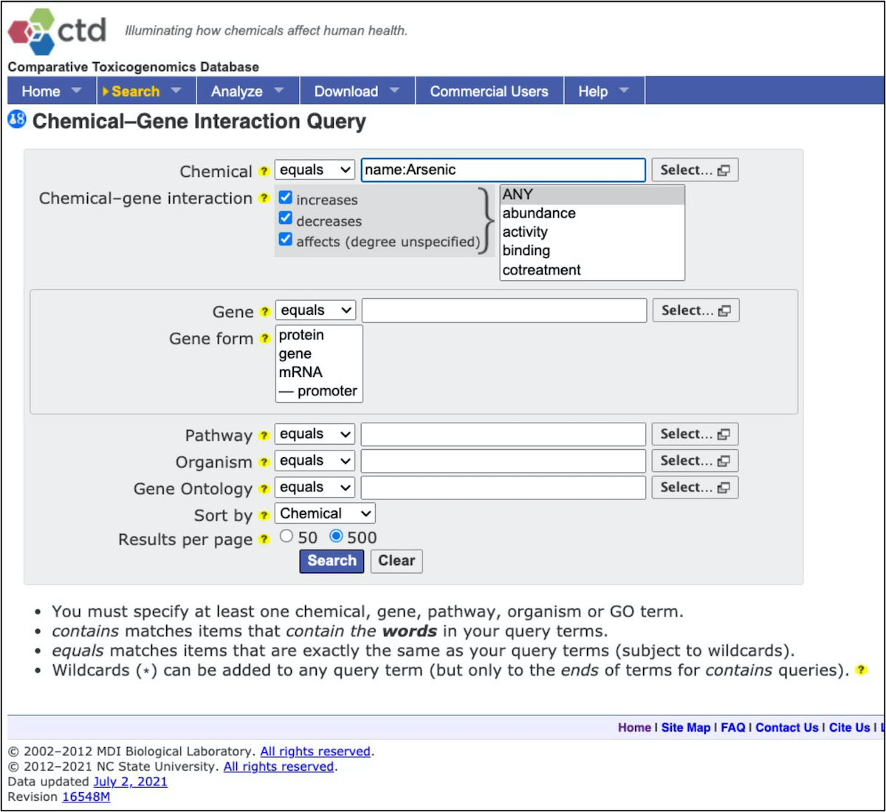
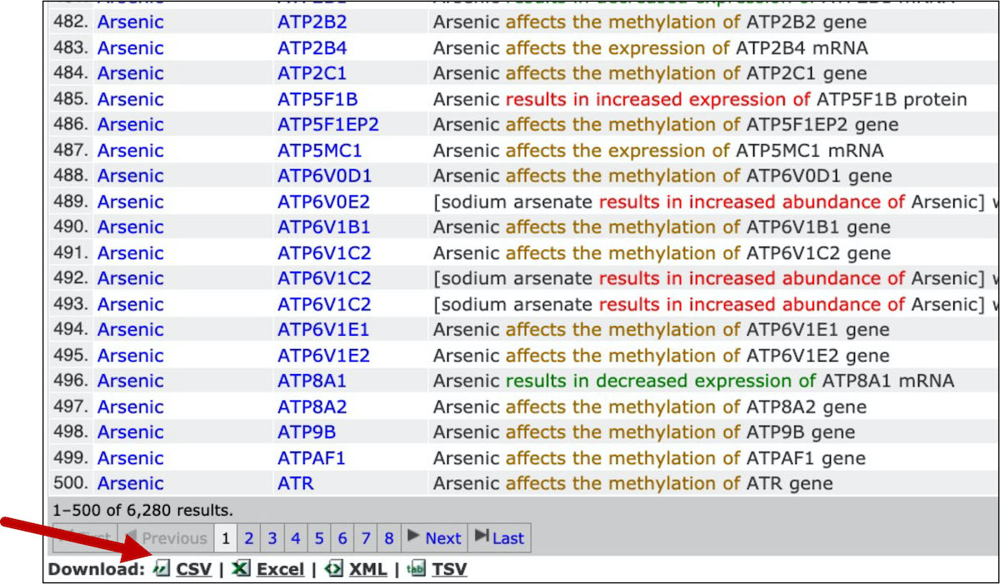
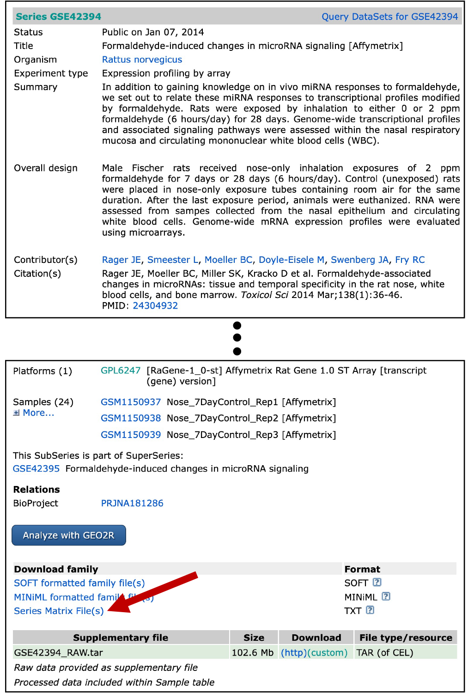
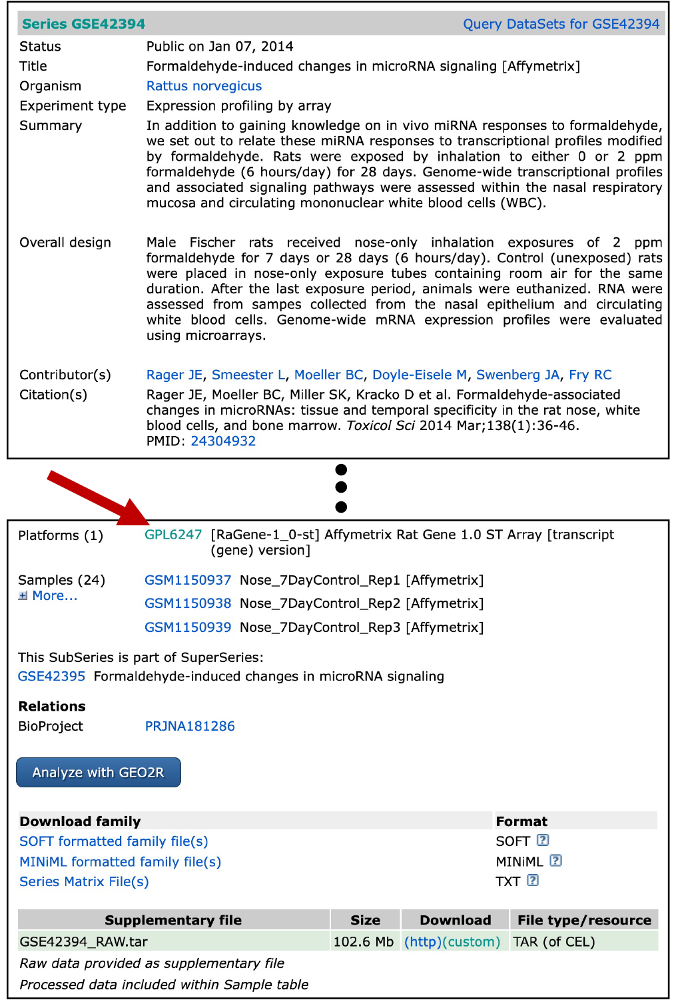

# (PART\*) Chapter 7 Environmental Health Database Mining {-}

# 7.1 Comparative Toxicogenomics Database

This training module was developed by Lauren E. Koval, Kyle R. Roell, and Julia E. Rager. 

All input files (script, data, and figures) can be downloaded from the [UNC-SRP TAME2 GitHub website](https://github.com/UNCSRP/TAME2).

```{r , include=FALSE}
#set default values for R Markdown "knitting" to HTML, Word, or PDF
knitr::opts_chunk$set(echo = TRUE) #print code chunks
```


## Introduction to Training Module

The Comparative Toxicogenomics Database (CTD) is a publicly available, online database that provides manually curated information about chemical-gene/protein interactions, chemical-disease and gene-disease relationships. CTD also recently incorporated curation of exposure data and chemical-phenotype relationships.

CTD is located at: http://ctdbase.org/. Here is a screenshot of the CTD homepage (as of August 5, 2021):
```{r, echo=FALSE, fig.align='center'} 
#knitr::include_graphics("_book/TAME_Toolkit_files/figure-html/Module3_1_CTD_homepage.jpg")
knitr::include_graphics("Module7_1_Input/Module7_1_Image1.jpg")
```

In this module, we will be using CTD to access and download data to perform data organization and analysis as an applications-based example towards environmental health research. This activity represents a demonstration of basic data manipulation, filtering, and organization steps in R, while highlighting the utility of CTD to identify novel genomic/epigenomic relationships to environmental exposures. Example visualizations are also included in this training module's script, providing visualizations of gene list comparison results.


### Training Module's Environmental Health Questions
This training module was specifically developed to answer the following environmental health questions:

(1) Which genes show altered expression in response to arsenic exposure?
(2) Of the genes showing altered expression, which may be under epigenetic control?


### Script Preparations

#### Cleaning the global environment
```{r}
rm(list=ls())
```


#### Installing required R packages
If you already have these packages installed, you can skip this step, or you can run the below code which checks installation status for you.
```{r, results=FALSE, message=FALSE}
if (!requireNamespace("tidyverse"))
  install.packages("tidyverse")
if (!requireNamespace("VennDiagram"))
install.packages("VennDiagram")
if (!requireNamespace("grid"))
install.packages("grid")
```


#### Loading R packages required for this session
```{r, results=FALSE, message=FALSE}
library(tidyverse)
library(VennDiagram)
library(grid)
```


#### Set your working directory
```{r, eval=FALSE, echo=TRUE}
setwd("/filepath to where your input files are")
```

 

## CTD Data in R

### Organizing Example Dataset from CTD

CTD requires manual querying of its database, outside of the R scripting environment. Because of this, let's first manually pull the data we need for this example analysis. We can answer both of the example questions by pulling all chemical-gene relationship data for arsenic, which we can do by following the below steps:

Navigate to the main CTD website: http://ctdbase.org/.

Select at the top, 'Search' -> 'Chemical-Gene Interactions'. 
<br>
```{r, echo=FALSE, fig.align='center'} 
knitr::include_graphics("Module7_1_Input/Module7_1_Image2.jpg")
```

<br>
  
Select to query all chemical-gene interaction data for arsenic.
<br>
```{r, echo=FALSE, fig.align='center'} 

```
<br>

  
Note that there are lots of results, represented by many many rows of data! Scroll to the bottom of the webpage and select to download as 'CSV'.
<br>
```{r, echo=FALSE, fig.align='center'} 

```
  
<br>
    
This is the file that we can now use to import into the R environment and analyze!
Note that the data pulled here represent data available on August 1, 2021


### Loading the Example CTD Dataset into R


Read in the csv file of the results from CTD query:
```{r, results=FALSE, message=FALSE}
ctd = read_csv("Module7_1_Input/Module7_1_InputData1.csv")
```


Let's first see how many rows and columns of data this file contains:
```{r}
dim(ctd)
```
This dataset includes 6280 observations (represented by rows) linking arsenic exposure to gene-level alterations
With information spanning across 9 columns


Let's also see what kind of data are organized within the columns:
```{r}
colnames(ctd)
```


```{r}
# Viewing the first five rows of data, across all 9 columns
ctd[1:9,1:5] 
```


#### Filtering data for genes with altered expression


To identify genes with altered expression in association with arsenic, we can leverage the results of our CTD query and filter this dataset to include only the rows that contain the term "expression" in the "Interaction Actions" column.
```{r}
exp_filt = ctd %>% filter(grepl("expression", `Interaction Actions`))
```

We now have 2586 observations, representing instances of arsenic exposure causing a changes in a target gene's expression levels.
```{r}
dim(exp_filt)
```


Let's see how many unique genes this represents:
```{r}
length(unique(exp_filt$`Gene Symbol`))
```
This reflects 1878 unique genes that show altered expression in association with arsenic.


Let's make a separate dataframe that includes only the unique genes, based on the "Gene Symbol" column.
```{r}
exp_genes = exp_filt %>% distinct(`Gene Symbol`, .keep_all=TRUE)

# Removing columns besides gene identifier
exp_genes = exp_genes[,4] 

# Viewing the first 10 genes listed
exp_genes[1:10,] 
```
This now provides us a list of 1878 genes showing altered expression in association with arsenic.


##### Technical notes on running the distinct function within tidyverse:
By default, the distinct function keeps the first instance of a duplicated value. This does have implications if the rest of the values in the rows differ. You will only retain the data associated with the first instance of the duplicated value (which is why we just retained the gene column here). It may be useful to first find the rows with the duplicate value and verify that results are as you would expect before removing observations. For example, in this dataset, expression levels can increase or decrease. If you were looking for just increases in expression, and there were genes that showed increased and decreased expression across different samples, using the distinct function just on "Gene Symbol" would not give you the results you wanted. If the first instance of the gene symbol noted decreased expression, that gene would not be returned in the results even though it might be one you would want. For this example case, we only care about expression change, regardless of direction, so this is not an issue. The distinct function can also take multiple columns to consider jointly as the value to check for duplicates if you are concerned about this.

<br>

### Answer to Environmental Health Question 1

:::question
*With this, we can answer **Environmental Health Question 1***:
Which genes show altered expression in response to arsenic exposure?
:::
:::answer
**Answer**: This list of 1878 genes have published evidence supporting their altered expression levels associated with arsenic exposure.
:::

<br>

## Identifying Genes Under Epigenetic Control


For this dataset, let's focus on gene-level methylation as a marker of epigenetic regulation. Let's return to our main dataframe, representing the results of the CTD query, and filter these results for only the rows that contain the term "methylation" in the "Interaction Actions" column.
```{r}
met_filt = ctd %>% filter(grepl("methylation",`Interaction Actions`))
```

We now have 3211 observations, representing instances of arsenic exposure causing a changes in a target gene's methylation levels.
```{r}
dim(met_filt)
```


Let's see how many unique genes this represents.
```{r}
length(unique(met_filt$`Gene Symbol`))
```
This reflects 3142 unique genes that show altered methylation in association with arsenic


Let's make a separate dataframe that includes only the unique genes, based on the "Gene Symbol" column.
```{r}
met_genes = met_filt %>% distinct(`Gene Symbol`, .keep_all=TRUE)

# Removing columns besides gene identifier
met_genes = met_genes[,4] 
```
This now provides us a list of 3142 genes showing altered methylation in association with arsenic.


With this list of genes with altered methylation, we can now compare it to previous list of genes with altered expression to yeild our final list of genes of interest. To achieve this last step, we present two different methods to carry out list comparisons below.


#### Method 1 for list comparisons: Merging


Merge the expression results with the methylation resuts on the Gene Symbol column found in both datasets.
```{r}
merge_df = merge(exp_genes, met_genes, by = "Gene Symbol")
```
We end up with 315 rows reflecting the 315 genes that show altered expression and altered methylation

Let's view these genes:
```{r}
merge_df[1:315,]
```


### Answer to Environmental Health Question 2

:::question
*With this, we can answer **Environmental Health Question 2***:
Of the genes showing altered expression, which may be under epigenetic control?
:::
:::answer
**Answer**:  We identified 315 genes with altered expression resulting from arsenic exposure, that also demonstrate epigenetic modifications from arsenic. These genes include many high interest molecules involved in regulating cell health, including several cyclin dependent kinases (e.g., CDK2, CDK4, CDK5, CDK6), molecules involved in oxidative stress (e.g., FOSB, NOS2), and cytokines involved in inflammatory response pathways (e.g., IFNG, IL10, IL16, IL1R1, IR1RAP, TGFB1, TGFB3).
:::


#### Method 2 for list comparisons: Intersection
For further training, shown here is another method for pulling this list of interest, through the use of the 'intersection' function.


Obtain a list of the overlapping genes in the overall expression results and the methylation results.
```{r}
inxn = intersect(exp_filt$`Gene Symbol`,met_filt$`Gene Symbol`)
```
Again, we end up with a list of 315 unique genes that show altered expression and altered methylation.


This list can be viewed on its own or converted to a dataframe (df).
```{r}
inxn_df = data.frame(genes=inxn)
```


This list can also be conveniently used to filter the original query results.
```{r}
inxn_df_all_data = ctd %>% filter(`Gene Symbol` %in% inxn)
```


Note that in this last case, the same 315 genes are present, but this time the results contain all records from the original query results, hence the 875 rows (875 records observations reflecting the 315 genes).
```{r}
summary(unique(sort(inxn_df_all_data$`Gene Symbol`))==sort(merge_df$`Gene Symbol`))
dim(inxn_df_all_data)
```


Visually we can represent this as a Venn diagram. Here, we use the ["VennDiagram"](https://bmcbioinformatics.biomedcentral.com/articles/10.1186/1471-2105-12-35) R package. 

```{r venn, message=F, eval=F, fig.align = "center"}
# Use the data we previously used for intersection in the venn diagram function
venn.plt = venn.diagram(
  x = list(exp_filt$`Gene Symbol`, met_filt$`Gene Symbol`),
  category.names = c("Altered Expression" , "Altered Methylation"),
  filename = NULL,
  
  # Change font size, type, and position
  cat.cex = 1.15,
  cat.fontface = "bold",
  cat.default.pos = "outer",
  cat.pos = c(-27, 27),
    cat.dist = c(0.055, 0.055),
  
  # Change color of ovals
  col=c("#440154ff", '#21908dff'),
  fill = c(alpha("#440154ff",0.3), alpha('#21908dff',0.3)),
)

```

```{r print-venn, fig.width = 7, fig.height = 7, echo=F, message=F, fig.align = "center"}
# Use the data we previously used for intersection in the venn diagram function
venn.plt = venn.diagram(
  x = list(exp_filt$`Gene Symbol`, met_filt$`Gene Symbol`),
  category.names = c("Altered Expression" , "Altered Methylation"),
  filename = NULL,
  output=F,
  
  # Change font size, type, and position
  cat.cex = 1.15,
  cat.fontface = "bold",
  cat.default.pos = "outer",
  cat.pos = c(-27, 27),
  cat.dist = c(0.055, 0.055),
  
  # Change color of ovals
  col=c("#440154ff", '#21908dff'),
  fill = c(alpha("#440154ff",0.3), alpha('#21908dff',0.3)),
)

grid::grid.draw(venn.plt)
```


## Concluding Remarks
In conclusion, we identified 315 genes that show altered expression in response to arsenic exposure that may be under epigenetic control. These genes represent critical mediators of oxidative stress and inflammation, among other important cellular processes. Results yielded an important list of genes representing potential targets for further evaluation, to better understand mechanism of environmental exposure-induced disease. Together, this example highlights the utility of CTD to address environmental health research questions.

For more information, see the recently updated primary CTD publication:  

+ Davis AP, Grondin CJ, Johnson RJ, Sciaky D, Wiegers J, Wiegers TC, Mattingly CJ. Comparative Toxicogenomics Database (CTD): update 2021. Nucleic Acids Res. 2021 Jan 8;49(D1):D1138-D1143. PMID: [33068428](https://pubmed.ncbi.nlm.nih.gov/33068428/).

Additional case studies relevant to environmental health research include the following:

+ An example publication leveraging CTD findings to identify mechanisms of metals-induced birth defects: Ahir BK, Sanders AP, Rager JE, Fry RC. Systems biology and birth defects prevention: blockade of the glucocorticoid receptor prevents arsenic-induced birth defects. Environ Health Perspect. 2013 Mar;121(3):332-8. PMID: [23458687](https://pubmed.ncbi.nlm.nih.gov/23458687/).  

+ An example publication leveraging CTD to help fill data gaps on data poor chemicals, in combination with ToxCast/Tox21 data streams, to elucidate environmental influences on disease pathways: Kosnik MB, Planchart A, Marvel SW, Reif DM, Mattingly CJ. Integration of curated and high-throughput screening data to elucidate environmental influences on disease pathways. Comput Toxicol. 2019 Nov;12:100094. PMID: [31453412](https://pubmed.ncbi.nlm.nih.gov/31453412/).  

+ An example publication leveraging CTD to extract chemical-disease relationships used to derive new chemical risk values, with the goal of prioritizing connections between environmental factors, genetic variants, and human diseases: Kosnik MB, Reif DM. Determination of chemical-disease risk values to prioritize connections between environmental factors, genetic variants, and human diseases. Toxicol Appl Pharmacol. 2019 Sep 15;379:114674. [PMID: 31323264](https://pubmed.ncbi.nlm.nih.gov/31323264/).


<label class="tykfont">
Test Your Knowledge 
</label>

:::tyk

Using the same dataset from this module (available at the GitHub site and as Module7_1_TYKInput.csv): 

1. Filter the data using the grepl function to look at only those observations that specifically decrease the target gene's "expression" level. How many observations are there?
2. Similarly, filter the data to identify how many observations there are where the target gene's "expression" level is simply "affected". Create a venn diagram to help visualize any overlap between these two filtered datasets.

:::

# 7.2 Gene Expression Omnibus

This training module was developed by Kyle R. Roell and Julia E. Rager.

All input files (script, data, and figures) can be downloaded from the [UNC-SRP TAME2 GitHub website](https://github.com/UNCSRP/TAME2).


```{r , include=FALSE}
# Set default values for R Markdown "knitting" to HTML, Word, or PDF
knitr::opts_chunk$set(echo = TRUE) #print code chunks
```

## Introduction to Training Module

[GEO](https://www.ncbi.nlm.nih.gov/geo/) is a publicly available database repository of high-throughput gene expression data and hybridization arrays, chips, and microarrays that span genome-wide endpoints of genomics, transcriptomics, and epigenomics. This training module specifically guides trainees through the loading of required packages and data, including the manual upload of GEO data as well as the upload/organization of data leveraging the [GEOquery package](https://www.bioconductor.org/packages/release/bioc/html/GEOquery.html). Data are then further organized and combined with gene annotation information through the merging of platform annotation files. Example visualizations are then produced, including boxplots to evaluate the overall distribution of expression data across samples, as well as heat map visualizations that compare unscaled versus scaled gene expression values. Statistical analyses are then included to identify which genes are significantly altered in expression upon exposure to formaldehyde. Together, this training module serves as a simple example showing methods to access and download GEO data and to perform data organization, analysis, and visualization tasks through applications-based questions.


## Introduction to GEO

The GEO repository is organized and managed by the [The National Center for Biotechnology Information (NCBI)](https://www.ncbi.nlm.nih.gov/), which seeks to advance science and health by providing access to biomedical and genomic information. The three [overall goals](https://www.ncbi.nlm.nih.gov/geo/info/overview.html) of GEO are to: (1) Provide a robust, versatile database in which to efficiently store high-throughput functional genomic data, (2) Offer simple submission procedures and formats that support complete and well-annotated data deposits from the research community, and (3) Provide user-friendly mechanisms that allow users to query, locate, review and download studies and gene expression profiles of interest.

Of high relevance to environmental health, data organized within GEO can be pulled and analyzed to address new environmental health questions, leveraging previously generated data. For example, we have pulled gene expression data from acute myeloid leukemia patients and re-analyzed these data to elucidate new mechanisms of epigenetically-regulated networks involved in cancer, that in turn, may be modified by environmental insults, as previously published in [Rager et al. 2012](https://pubmed.ncbi.nlm.nih.gov/22754483/). We have also pulled and analyzed gene expression data from published studies evaluating toxicity resulting from hexavalent chromium exposure, to further substantiate the role of epigenetic mediators in hexavelent chromium-induced carcinogenesis (see [Rager et al. 2019](https://pubmed.ncbi.nlm.nih.gov/30690063/)). This training exercise leverages an additional dataset that we published and deposited through GEO to evaluate the effects of formaldehyde inhalation exposure, as detailed below.


## Introduction to Example Data

In this training module, data will be pulled from the published GEO dataset recorded through the online series [GSE42394](https://www.ncbi.nlm.nih.gov/geo/query/acc.cgi?acc=GSE42394). This series represents Affymetrix rat genome-wide microarray data generated from our previous study, aimed at evaluating the transcriptomic effects of formaldehyde across three tissues: the nose, blood, and bone marrow. For the purposes of this training module, we will focus on evaluating gene expression profiles from nasal samples after 7 days of exposure, collected from rats exposed to 2 ppm formaldehyde via inhalation. These findings, in addition to other epigenomic endpoint measures, have been previously published (see [Rager et al. 2014](https://pubmed.ncbi.nlm.nih.gov/24304932/)).


### Training Module's Environmental Health Questions

This training module was specifically developed to answer the following environmental health questions:

(1) What kind of molecular identifiers are commonly used in microarray-based -omics technologies?
(2) How can we convert platform-specific molecular identifiers used in -omics study designs to gene-level information?
(3)	Why do we often scale gene expression signatures prior to heat map visualizations?
(4) What genes are altered in expression by formaldehyde inhalation exposure?
(5) What are the potential biological consequences of these gene-level perturbations?


### Script Preparations

#### Cleaning the global environment
```{r}
rm(list=ls())
```


#### Installing required R packages
If you already have these packages installed, you can skip this step, or you can run the below code which checks installation status for you
```{r, results=FALSE, message=FALSE}
if (!requireNamespace("tidyverse"))
  install.packages("tidyverse")
if (!requireNamespace("reshape2"))
    install.packages("reshape2")

# GEOquery, this will install BiocManager if you don't have it installed
if (!requireNamespace("BiocManager"))
  install.packages("BiocManager")
BiocManager::install("GEOquery")
```


#### Loading R packages required for this session
```{r, results=FALSE, message=FALSE, warning=FALSE}
library(tidyverse)
library(reshape2)
library(GEOquery)
```
For more information on the **tidyverse package**, see its associated [CRAN webpage](https://cran.r-project.org/web/packages/tidyverse/index.html), primary [webpage](https://www.tidyverse.org/packages/), and peer-reviewed [article released in 2018](https://onlinelibrary.wiley.com/doi/10.1002/sdr.1600).

For more information on the **reshape2 package**, see its associated [CRAN webpage](https://cran.r-project.org/web/packages/reshape2/index.html), [R Documentation](https://www.rdocumentation.org/packages/reshape2/versions/1.4.4), and [helpful website](https://seananderson.ca/2013/10/19/reshape/) providing an introduction to the reshape2 package.

For more information on the **GEOquery package**, see its associated [Bioconductor website](https://www.bioconductor.org/packages/release/bioc/html/GEOquery.html) and [R Documentation file](https://www.rdocumentation.org/packages/GEOquery/versions/2.38.4).


#### Set your working directory
```{r, eval=FALSE, echo=TRUE}
setwd("/filepath to where your input files are")
```

```{r, echo=FALSE}
#setwd("/Users/juliarager/IEHS Dropbox/Julia Rager/Research Projects/1_SRP/4_DMAC/DMAC Training Modules/Training_Modules/3_Chapter 3/3_2_Database_GEO/Clean_Files/")
```

## GEO Data in R

Let's start by loading the GEO dataset needed for this training module. As explained in the introduction, this module walks through two methods of uploading GEO data: manual option vs automatic option using the GEOquery package. These two methods are detailed below.

### 1. Manually Downloading and Uploading GEO Files

In this first method, we will navigate to the dataset within the GEO website, manually download its associated text data file, save it in our working directory, and then upload it into our global environment in R.

For the purposes of this training exercise, we manually downloaded the GEO series matrix file from the GEO series webpage, located at: https://www.ncbi.nlm.nih.gov/geo/query/acc.cgi?acc=GSE42394. The specific file that was downloaded was noted as "GSE42394_series_matrix.txt", pulled by clicking on the link indicated by the red arrow from the GEO series webpage:

```{r, echo=FALSE, fig.width=4, fig.height=5, fig.align = "center"}

```


For simplicity, we also have already pre-filtered this file for the samples we are interested in, focusing on the rat nasal gene expression data after 7 days of exposure to gaseous formaldehyde. This filtered file was saved as "GSE42394_series_matrix_filtered.txt", then renamed "Module7_2_InputData1.txt" for use in this module.


At this point, we can simply read in this pre-filtered text file for the purposes of this training module
```{r}
geodata_manual = read.table(file="Module7_2_Input/Module7_2_InputData1.txt",
                             header=T)
```


Because this is a manual approach, we have to also manually define the treated and untreated samples (based on manually opening the surrounding metadata from the GEO webpage)

Manually defining treated and untreated for these samples of interest:
```{r}
exposed_manual = c("GSM1150940", "GSM1150941", "GSM1150942")
unexposed_manual = c("GSM1150937", "GSM1150938", "GSM1150939")
```


### 2. Loading and Organizing GEO Files through the GEOquery Package
In this second method, we will leverage the GEOquery package, which allows for easier downloading and reading in of data from GEO without having to manually download raw text files, and manually assign sample attributes (e.g., exposed vs unexposed). This package is set-up to automatically merge sample information from GEO metadata files with raw genome-wide datasets.


Let's first use the getGEO function (from the GEOquery package) to load data from our series matrix ("GSE42394_series_matrix.txt", renamed "Module7_2_InputData2.txt" for use in this module). *Note that this line of code may take a couple of minutes to run.*
```{r, message=FALSE}
geo.getGEO.data = getGEO(filename='Module7_2_Input/Module7_2_InputData2.txt')
```


One of the reasons the getGEO package is so helpful is that we can automatically link a dataset with nicely organized sample information using the `pData()` function.
```{r}
sampleInfo = pData(geo.getGEO.data)
```


Let's view this sample information / metadata file, first by viewing what the column headers are.
```{r}
colnames(sampleInfo)
```

Then viewing the first five columns.
```{r}
sampleInfo[1:10,1:5]
```

This shows that each sample is provided with a unique number starting with "GSM", and these are described by information summarized in the "title" column. We can also see that these data were made public on Jan 7, 2014.


Let's view the next five columns.
```{r}
sampleInfo[1:10,6:10]
```

We can see that information is provided here surrounding the type of sample that was analyzed (i.e., RNA), more information on the collected samples within the column `source_name_ch1`, and the organism (rat) is provided in the `organism_ch1` column.


More detailed metadata information is provided throughout this file, as seen when viewing the column headers above.


#### Defining samples

Now, we can use this information to define the samples we want to analyze. Note that this is the same step we did manually above.

In this training exercise, we are focusing on responses in the nose, so we can easily filter for cell type = Nasal epithelial cells (specifically in the `cell type:ch1` variable). We are also focusing on responses collected after 7 days of exposure, which we can filter for using time = 7 day (specifically in the `time:ch1` variable). We will also define exposed and unexposed samples using the variable `treatment:ch1`.

First, let's subset the sampleInfo dataframe to just keep the samples we're interested in
```{r}
# Define a vector variable (here we call it 'keep') that will store rows we want to keep
keep = rownames(sampleInfo[which(sampleInfo$`cell type:ch1`=="Nasal epithelial cells" 
                                  & sampleInfo$`time:ch1`=="7 day"),])

# Then subset the sample info for just those samples we defined in keep variable
sampleInfo = sampleInfo[keep,]
```


Next, we can pull the exposed and unexposed animal IDs. Let's first see how these are labeled within the `treatment:ch1` variable.
```{r}
unique(sampleInfo$`treatment:ch1`)
```


And then search for the rows of data, pulling the sample animal IDs (which are in the variable `geo_accession`).
```{r}
exposedIDs = sampleInfo[which(sampleInfo$`treatment:ch1`=="2 ppm formaldehyde"), 
                          "geo_accession"]
unexposedIDs = sampleInfo[which(sampleInfo$`treatment:ch1`=="unexposed"), 
                            "geo_accession"]
```


The next step is to pull the expression data we want to use in our analyses. The GEOquery function, `exprs()`, allows us to easily pull these data. Here, we can pull the data we're interested in using the `exprs()` function, while defining the data we want to pull based off our previously generated 'keep' vector.
```{r}
# As a reminder, this is what the 'keep' vector includes 
# (i.e., animal IDs that we're interested in)
keep
```

```{r}
# Using the exprs() function
geodata = exprs(geo.getGEO.data[,keep])
```


Let's view the full dataset as is now:
```{r}
head(geodata)
```
This now represents a matrix of data, with animal IDs as column headers and expression levels within the matrix.


#### Simplifying column names
These column names are not the easiest to interpret, so let's rename these columns to indicate which animals were from the exposed vs. unexposed groups.

We need to first convert our expression dataset to a dataframe so we can edit columns names, and continue with downstream data manipulations that require dataframe formats.
```{r}
geodata = data.frame(geodata)
```


Let's remind ourselves what the column names are:
```{r}
colnames(geodata)
```

Which ones of these are exposed vs unexposed animals can be determined by viewing our previously defined vectors.
```{r}
exposedIDs
unexposedIDs
```

With this we can tell that the first three listed IDs are from unexposed animals, and the last three IDs are from exposed animals.

Let's simplify the names of these columns to indicate exposure status and replicate number.
```{r}
colnames(geodata) = c("Control_1", "Control_2", "Control_3", "Exposed_1", 
                       "Exposed_2", "Exposed_3")
```


And we'll now need to re-define our 'exposed' vs 'unexposed' vectors for downstream script.
```{r}
exposedIDs = c("Exposed_1", "Exposed_2", "Exposed_3")
unexposedIDs = c("Control_1", "Control_2", "Control_3")
```


Viewing the data again:
```{r}
head(geodata)
```

These data are now looking easier to interpret/analyze. Still, the row identifiers include 8 digit numbers starting with "107...". We know that this dataset is a gene expression dataset, but these identifiers, in themselves, don't tell us much about what genes these are referring to. These numeric IDs specifically represent microarray probesetIDs, that were produced by the Affymetrix platform used in the original study.

**But how can we tell which genes are represented by these data?!**


#### Adding gene symbol information

Each -omics dataset contained within GEO points to a specific platform that was used to obtain measurements.
In instances where we want more information surrounding the molecular identifiers, we can merge the platform-specific annotation file with the molecular IDs given in the full dataset.

For example, let's pull the platform-specific annotation file for this experiment. Let's revisit the [website](https://www.ncbi.nlm.nih.gov/geo/query/acc.cgi?acc=GSE42394) that contained the original dataset on GEO. Scroll down to where it lists "Platforms", and there is a hyperlinked platform number "GPL6247" (see arrow below).

```{r, echo=FALSE, fig.width=4, fig.height=5, fig.align = "center"}

```


Click on this, and you will be navigated to a different GEO website describing the Affymetrix rat array platform that was used in this analysis. Note that this website also includes information on when this array became available, links to other experiments that have used this platform within GEO, and much more.

Here, we're interested in pulling the corresponding gene symbol information for the probeset IDs. To do so, scroll to the bottom, and click "Annotation SOFT table..." and download the corresponding .gz file within your working directory. Unzip this, and you will find the master annotation file: "GPL6247.annot". 

In this exercise, we've already done these steps and unzipped the file in our working directory. So at this point, we can simply read in this annotation dataset, renamed "Module7_2_InputData2.annot", still using the `GEOquery()` function to help automate.

```{r, warning=FALSE}
geo.annot = GEOquery::getGEO(filename="Module7_2_Input/Module7_2_InputData3.annot")
```

Now we can use the `Table()` function from GEOquery to pull data from the annotation dataset.
```{r}
id.gene.table = GEOquery::Table(geo.annot)[,c("ID", "Gene symbol")]
id.gene.table[1:10,1:2]
```

With these two columns of data, we now have the needed IDs and gene symbols to match with our dataset.

Within the full dataset, we need to add a new column for the probeset ID, taken from the rownames, in preparation for the merging step.
```{r}
geodata$ID = rownames(geodata)
```

We can now merge the gene symbol information by ID with our expression data.
```{r}
geodata_genes = merge(geodata, id.gene.table, by="ID")
head(geodata_genes)
```

Note that many of the probeset IDs do not map to full gene symbols, which is shown here by viewing the top few rows - this is expected in genome-wide analyses based on microarray platforms.

Let's look at the first 25 unique genes in these data:
```{r}
UniqueGenes = unique(geodata_genes$`Gene symbol`)
UniqueGenes[1:25]
```

Again, you can see that the first value listed is blank, representing probesetIDs that do not match to fully annotated gene symbols. Though the rest pertain for gene symbols annotated to the rat genome.

You can also see that some gene symbols have multiple entries, separated by "///"

To simplify identifiers, we can pull just the first gene symbol, and remove the rest by using gsub().
```{r}
geodata_genes$`Gene symbol` = gsub("///.*", "", geodata_genes$`Gene symbol`)
```

Let's alphabetize by main expression dataframe by gene symbol.
```{r}
geodata_genes = geodata_genes[order(geodata_genes$`Gene symbol`),]
```

And then re-view these data:
```{r}
geodata_genes[1:5,]
```

In preparation for the visualization steps below, let's reset the probeset IDs to rownames.
```{r}
rownames(geodata_genes) = geodata_genes$ID

# Can then remove this column within the dataframe
geodata_genes$ID = NULL
```

Finally let's rearrange this dataset to include gene symbols as the first column, right after rownames (probeset IDs).
```{r}
geodata_genes = geodata_genes[,c(ncol(geodata_genes),1:(ncol(geodata_genes)-1))]
geodata_genes[1:5,]
dim(geodata_genes)
```

Note that this dataset includes expression measures across **29,214 probes, representing 14,019 unique genes**.
For simplicity in the final exercises, let's just filter for rows representing mapped genes.

```{r}
geodata_genes = geodata_genes[!(geodata_genes$`Gene symbol` == ""), ]
dim(geodata_genes)
```

Note that this dataset now includes 16,024 rows with mapped gene symbol identifiers.

### Answer to Environmental Health Question 1

:::question
<i>With this, we can now answer **Environmental Health Question 1**:</i>
What kind of molecular identifiers are commonly used in microarray-based -omics technologies?
:::
:::answer
**Answer**:  Platform-specific probeset IDs.
:::


### Answer to Environmental Health Question 2

:::question
<i>We can also answer **Environmental Health Question 2**:</i>
How can we convert platform-specific molecular identifiers used in -omics study designs to gene-level information?
:::
:::answer
**Answer**: We can merge platform-specific IDs with gene-level information using annotation files.
:::
<br>

## Visualizing Data

### Visualizing Gene Expression Data using Boxplots and Heat Maps

To visualize the -omics data, we can generate boxplots, heat maps, any many other types of visualizations. Here, we provide an example to plot a boxplot, which can be used to visualize the variability amongst samples. We also provide an example to plot a heat map, comparing unscaled vs scaled gene expression profiles. These visualizations can be useful to both simply visualize the data as well as identify patterns across samples or genes

#### Boxplot visualizations
For this example, let's simply use R's built in boxplot() function.

We only want to use columns with our expression data (2 to 7), so let's pull those columns when running the boxplot function.
```{r, fig.width=5, fig.height=4, fig.align = "center"}
boxplot(geodata_genes[,2:7])
```

There seem to be a lot of variability within each sample's range of expression levels, with many outliers. This makes sense given that we are analyzing the expression levels across the rat's entire genome, where some genes won't be expressed at all while others will be highly expressed due to biological and/or potential technical variability.
  
To show plots without outliers, we can simply use outline=F.
```{r, fig.width=5, fig.height=4, fig.align = "center"}
boxplot(geodata_genes[,2:7], outline=F)
```
  

#### Heat Map visualizations
Heat maps are also useful when evaluating large datasets.

There are many different packages you can use to generate heat maps. Here, we use the *superheat* package.

It also takes awhile to plot all genes across the genome, so to save time for this training module, let's randomly select 100 rows to plot.

```{r, fig.width=9, fig.height=7, fig.align = "center"}
# To ensure that the same subset of genes are selected each time
set.seed = 101                                     

# Random selection of 100 rows
row.sample = sample(1:nrow(geodata_genes),100) 

# Heat map code
superheat::superheat(geodata_genes[row.sample,2:7], # Only want to plot non-id/gene symbol columns (2 to 7)
                     pretty.order.rows = TRUE,
                     pretty.order.cols = TRUE,
                     col.dendrogram = T,
                     row.dendrogram = T)
```

This produces a heat map with sample IDs along the x-axis and probeset IDs along the y-axis. Here, the values being displayed represent normalized expression values.


One way to improve our ability to distinguish differences between samples is to **scale expression values** across probes. 

**Scaling data**

Z-score is a very common method of scaling that transforms data points to reflect the number of standard deviations they are from the overall mean. Z-score scaling data results in the overall transformation of a dataset to have an overall mean = 0 and standard deviation = 1.

Let's see what happens when we scale this gene expression dataset by z-score across each probe. This can be easily done using the `scale()` function.

This specific `scale()` function works by centering and scaling across columns, but since we want to use it across probesets (organized as rows), we need to first transpose our dataset, then run the scale function.
```{r}
geodata_genes_scaled = scale(t(geodata_genes[,2:7]), center=T, scale=T)
```

Now we can transpose it back to the original format (i.e., before it was transposed).
```{r}
geodata_genes_scaled = t(geodata_genes_scaled)
```


And then view what the normalized and now scaled expression data look like for now a random subset of 100 probesets (representing genes).
```{r, echo=FALSE, fig.width=9, fig.height=7, fig.align = "center"}
superheat::superheat(geodata_genes_scaled[row.sample,],
                     pretty.order.rows = TRUE,
                     pretty.order.cols = TRUE,
                     col.dendrogram = T,
                     row.dendrogram = T)
```

With these data now scaled, we can more easily visualize patterns between samples.


### Answer to Environmental Health Question 3

:::question
*We can also answer **Environmental Health Question 3***:
Why do we often scale gene expression signatures prior to heat map visualizations?
:::
:::answer
**Answer**: To better visualize patterns in expression signatures between samples.
:::

<br>
Now, with these data nicely organized, we can next explore how statistics can help us find which genes show trends in expression associated with formaldehyde exposure.


## Statistical Analyses

### Statistical Analyses to Identify Genes altered by Formaldehyde

A simple way to identify differences between formaldehyde-exposed and unexposed samples is to use a t-test. Because there are so many tests being performed, one for each gene, it is also important to carry out multiple test corrections through  a p-value adjustment method. 

We need to run a t-test for each row of our dataset. This exercise demonstrates two different methods to run a t-test:

+ Method 1: using a 'for loop'
+ Method 2: using the apply function (more computationally efficient)

#### Method 1 (m1): 'For Loop'

Let's first re-save the molecular probe IDs to a column within the dataframe, since we need those values in the loop function.
```{r}
geodata_genes$ID = rownames(geodata_genes)
```


We also need to initially create an empty dataframe to eventually store p-values.
```{r}
pValue_m1 = matrix(0, nrow=nrow(geodata_genes), ncol=3)
colnames(pValue_m1) = c("ID", "pval", "padj")
head(pValue_m1)
```

You can see the empty dataframe that was generated through this code.

Then we can loop through the entire dataset to acquire p-values from t-test statistics, comparing n=3 exposed vs n=3 unexposed samples.
```{r}
for (i in 1:nrow(geodata_genes)) {
  
  #Get the ID
  ID.i = geodata_genes[i, "ID"];
  
  #Run the t-test and get the p-value
  pval.i = t.test(geodata_genes[i,exposedIDs], geodata_genes[i,unexposedIDs])$p.value;
  
  #Store the data in the empty dataframe
  pValue_m1[i,"ID"] = ID.i;
  pValue_m1[i,"pval"] = pval.i
  
}
```

View the results:
```{r}
# Note that we're not pulling the last column (padj) since we haven't calculated these yet
pValue_m1[1:5,1:2] 
```


#### Method 2 (m2): Apply Function
For the second method, we can use the *apply()* function to calculate resulting t-test p-values more efficiently labeled. 

```{r}
pValue_m2 = apply(geodata_genes[,2:7], 1, function(x) t.test(x[unexposedIDs],
                                                              x[exposedIDs])$p.value)
names(pValue_m2) = geodata_genes[,"ID"]
```

We can convert the results into a dataframe to make it similar to m1 matrix we created above.
```{r}
pValue_m2  = data.frame(pValue_m2)

# Now create an ID column
pValue_m2$ID = rownames(pValue_m2)
```

Then we can view at the two datasets to see they result in the same pvalues.
```{r}
head(pValue_m1)
head(pValue_m2)
```
We can see from these results that both methods (m1 and m2) generate the same statistical p-values.

#### Interpreting Results

Let's again merge these data with the gene symbols to tell which genes are significant.

First, let's convert to a dataframe and then merge as before, for one of the above methods as an example (m1).
```{r}
pValue_m1 = data.frame(pValue_m1)
pValue_m1 = merge(pValue_m1, id.gene.table, by="ID")
```

We can also add a multiple test correction by applying a false discovery rate-adjusted p-value; here, using the Benjamini Hochberg (BH) method.
```{r}
# Here fdr is an alias for B-H method
pValue_m1[,"padj"] = p.adjust(pValue_m1[,"pval"], method=c("fdr"))
```

Now, we can sort these statistical results by adjusted p-values.
```{r}
pValue_m1.sorted = pValue_m1[order(pValue_m1[,'padj']),]
head(pValue_m1.sorted)
```

Pulling just the significant genes using an adjusted p-value threshold of 0.05.
```{r}
adj.pval.sig = pValue_m1[which(pValue_m1[,'padj'] < .05),]

# Viewing these genes
adj.pval.sig       
```


### Answer to Environmental Health Question 4

:::question
*With this, we can answer **Environmental Health Question 4***:</i>
What genes are altered in expression by formaldehyde inhalation exposure?
:::
:::answer
**Answer**: Olr633 and Slc7a8.
:::

Finally, let's plot these using a mini heat map.
Note that we can use probesetIDs, then gene symbols, in rownames to have them show in heat map labels.
```{r, echo=FALSE, fig.width=8, fig.height=4, fig.align = "center"}
rownames(geodata_genes) = paste(geodata_genes$ID, ": ",geodata_genes$`Gene symbol`)
superheat::superheat(geodata_genes[which(geodata_genes$ID %in% adj.pval.sig[,"ID"]),2:7])
```

Note that this statistical filter is pretty strict when comparing only n=3 vs n=3 biological replicates. If we loosen the statistical criteria to p-value < 0.05, this is what we can find:
```{r}
pval.sig = pValue_m1[which(pValue_m1[,'pval'] < .05),]
nrow(pval.sig)
```

5327 genes with significantly altered expression!

Note that other filters are commonly applied to further focus these lists (e.g., background and fold change filters) prior to statistical evaluation, which can impact the final results. See [Rager et al. 2013](https://pubmed.ncbi.nlm.nih.gov/24304932/)  for further statistical approaches and visualizations.

<br>

### Answer to Environmental Health Question 5

:::question
*With this, we can answer **Environmental Health Question 5***:
What are the potential biological consequences of these gene-level perturbations?
:::
:::answer
**Answer**: Olr633 stands for 'olfactory receptor 633'. Olr633 is up-regulated in expression, meaning that formaldehyde inhalation exposure has a smell that resulted in 'activated' olfactory receptors in the nose of these exposed rats. Slc7a8 stands for 'solute carrier family 7 member 8'. Slc7a8 is down-regulated in expression, and it plays a role in many biological processes, that when altered, can lead to changes in cellular homeostasis and disease.
:::

<br>

## Concluding Remarks

In conclusion, this training module provides an overview of pulling, organizing, visualizing, and analyzing -omics data from the online repository, Gene Expression Omnibus (GEO). Trainees are guided through the overall organization of an example high dimensional dataset, focusing on transcriptomic responses in the nasal epithelium of rats exposed to formaldehyde. Data are visualized and then analyzed using standard two-group comparisons. Findings are interpreted for biological relevance, yielding insight into the effects resulting from formaldehyde exposure. 

For additional case studies that leverage GEO, see the following publications that also address environmental health questions from our research group:

+ Rager JE, Fry RC. The aryl hydrocarbon receptor pathway: a key component of the microRNA-mediated AML signalisome. Int J Environ Res Public Health. 2012 May;9(5):1939-53. doi: 10.3390/ijerph9051939. Epub 2012 May 18. PMID: 22754483; PMCID: [PMC3386597](https://pubmed.ncbi.nlm.nih.gov/22754483/).

+ Rager JE, Suh M, Chappell GA, Thompson CM, Proctor DM. Review of transcriptomic responses to hexavalent chromium exposure in lung cells supports a role of epigenetic mediators in carcinogenesis. Toxicol Lett. 2019 May 1;305:40-50. PMID: [30690063](https://pubmed.ncbi.nlm.nih.gov/30690063/).


<label class="tykfont">
Test Your Knowledge 
</label>

:::tyk

Using the same dataset that was used in this module, available from the [UNC-SRP TAME2 GitHub website](https://github.com/UNCSRP/TAME2):
1. Load the downloaded GEO dataset into R using the packages and functions mentioned in this tutorial.
2. Filter the data to just those with "cell type" of "Circulating white blood cells".
3. Report the means of the first 5 rows of the gene expression data (10700001, 10700002, 10700003, 10700004, 10700005), across all samples.

:::

# 7.2 Gene Expression Omnibus

This training module was developed by Kyle R. Roell and Julia E. Rager.

All input files (script, data, and figures) can be downloaded from the [UNC-SRP TAME2 GitHub website](https://github.com/UNCSRP/TAME2).


```{r , include=FALSE}
# Set default values for R Markdown "knitting" to HTML, Word, or PDF
knitr::opts_chunk$set(echo = TRUE) #print code chunks
```

## Introduction to Training Module

[GEO](https://www.ncbi.nlm.nih.gov/geo/) is a publicly available database repository of high-throughput gene expression data and hybridization arrays, chips, and microarrays that span genome-wide endpoints of genomics, transcriptomics, and epigenomics. This training module specifically guides trainees through the loading of required packages and data, including the manual upload of GEO data as well as the upload/organization of data leveraging the [GEOquery package](https://www.bioconductor.org/packages/release/bioc/html/GEOquery.html). Data are then further organized and combined with gene annotation information through the merging of platform annotation files. Example visualizations are then produced, including boxplots to evaluate the overall distribution of expression data across samples, as well as heat map visualizations that compare unscaled versus scaled gene expression values. Statistical analyses are then included to identify which genes are significantly altered in expression upon exposure to formaldehyde. Together, this training module serves as a simple example showing methods to access and download GEO data and to perform data organization, analysis, and visualization tasks through applications-based questions.


## Introduction to GEO

The GEO repository is organized and managed by the [The National Center for Biotechnology Information (NCBI)](https://www.ncbi.nlm.nih.gov/), which seeks to advance science and health by providing access to biomedical and genomic information. The three [overall goals](https://www.ncbi.nlm.nih.gov/geo/info/overview.html) of GEO are to: (1) Provide a robust, versatile database in which to efficiently store high-throughput functional genomic data, (2) Offer simple submission procedures and formats that support complete and well-annotated data deposits from the research community, and (3) Provide user-friendly mechanisms that allow users to query, locate, review and download studies and gene expression profiles of interest.

Of high relevance to environmental health, data organized within GEO can be pulled and analyzed to address new environmental health questions, leveraging previously generated data. For example, we have pulled gene expression data from acute myeloid leukemia patients and re-analyzed these data to elucidate new mechanisms of epigenetically-regulated networks involved in cancer, that in turn, may be modified by environmental insults, as previously published in [Rager et al. 2012](https://pubmed.ncbi.nlm.nih.gov/22754483/). We have also pulled and analyzed gene expression data from published studies evaluating toxicity resulting from hexavalent chromium exposure, to further substantiate the role of epigenetic mediators in hexavelent chromium-induced carcinogenesis (see [Rager et al. 2019](https://pubmed.ncbi.nlm.nih.gov/30690063/)). This training exercise leverages an additional dataset that we published and deposited through GEO to evaluate the effects of formaldehyde inhalation exposure, as detailed below.


## Introduction to Example Data

In this training module, data will be pulled from the published GEO dataset recorded through the online series [GSE42394](https://www.ncbi.nlm.nih.gov/geo/query/acc.cgi?acc=GSE42394). This series represents Affymetrix rat genome-wide microarray data generated from our previous study, aimed at evaluating the transcriptomic effects of formaldehyde across three tissues: the nose, blood, and bone marrow. For the purposes of this training module, we will focus on evaluating gene expression profiles from nasal samples after 7 days of exposure, collected from rats exposed to 2 ppm formaldehyde via inhalation. These findings, in addition to other epigenomic endpoint measures, have been previously published (see [Rager et al. 2014](https://pubmed.ncbi.nlm.nih.gov/24304932/)).


### Training Module's Environmental Health Questions

This training module was specifically developed to answer the following environmental health questions:

(1) What kind of molecular identifiers are commonly used in microarray-based -omics technologies?
(2) How can we convert platform-specific molecular identifiers used in -omics study designs to gene-level information?
(3)	Why do we often scale gene expression signatures prior to heat map visualizations?
(4) What genes are altered in expression by formaldehyde inhalation exposure?
(5) What are the potential biological consequences of these gene-level perturbations?


### Script Preparations

#### Cleaning the global environment
```{r}
rm(list=ls())
```


#### Installing required R packages
If you already have these packages installed, you can skip this step, or you can run the below code which checks installation status for you
```{r, results=FALSE, message=FALSE}
if (!requireNamespace("tidyverse"))
  install.packages("tidyverse")
if (!requireNamespace("reshape2"))
    install.packages("reshape2")

# GEOquery, this will install BiocManager if you don't have it installed
if (!requireNamespace("BiocManager"))
  install.packages("BiocManager")
BiocManager::install("GEOquery")
```


#### Loading R packages required for this session
```{r, results=FALSE, message=FALSE, warning=FALSE}
library(tidyverse)
library(reshape2)
library(GEOquery)
```
For more information on the **tidyverse package**, see its associated [CRAN webpage](https://cran.r-project.org/web/packages/tidyverse/index.html), primary [webpage](https://www.tidyverse.org/packages/), and peer-reviewed [article released in 2018](https://onlinelibrary.wiley.com/doi/10.1002/sdr.1600).

For more information on the **reshape2 package**, see its associated [CRAN webpage](https://cran.r-project.org/web/packages/reshape2/index.html), [R Documentation](https://www.rdocumentation.org/packages/reshape2/versions/1.4.4), and [helpful website](https://seananderson.ca/2013/10/19/reshape/) providing an introduction to the reshape2 package.

For more information on the **GEOquery package**, see its associated [Bioconductor website](https://www.bioconductor.org/packages/release/bioc/html/GEOquery.html) and [R Documentation file](https://www.rdocumentation.org/packages/GEOquery/versions/2.38.4).


#### Set your working directory
```{r, eval=FALSE, echo=TRUE}
setwd("/filepath to where your input files are")
```

```{r, echo=FALSE}
#setwd("/Users/juliarager/IEHS Dropbox/Julia Rager/Research Projects/1_SRP/4_DMAC/DMAC Training Modules/Training_Modules/3_Chapter 3/3_2_Database_GEO/Clean_Files/")
```

## GEO Data in R

Let's start by loading the GEO dataset needed for this training module. As explained in the introduction, this module walks through two methods of uploading GEO data: manual option vs automatic option using the GEOquery package. These two methods are detailed below.

### 1. Manually Downloading and Uploading GEO Files

In this first method, we will navigate to the dataset within the GEO website, manually download its associated text data file, save it in our working directory, and then upload it into our global environment in R.

For the purposes of this training exercise, we manually downloaded the GEO series matrix file from the GEO series webpage, located at: https://www.ncbi.nlm.nih.gov/geo/query/acc.cgi?acc=GSE42394. The specific file that was downloaded was noted as "GSE42394_series_matrix.txt", pulled by clicking on the link indicated by the red arrow from the GEO series webpage:

```{r, echo=FALSE, fig.width=4, fig.height=5, fig.align = "center"}

```


For simplicity, we also have already pre-filtered this file for the samples we are interested in, focusing on the rat nasal gene expression data after 7 days of exposure to gaseous formaldehyde. This filtered file was saved as "GSE42394_series_matrix_filtered.txt", then renamed "Module7_2_InputData1.txt" for use in this module.


At this point, we can simply read in this pre-filtered text file for the purposes of this training module
```{r}
geodata_manual = read.table(file="Module7_2_Input/Module7_2_InputData1.txt",
                             header=T)
```


Because this is a manual approach, we have to also manually define the treated and untreated samples (based on manually opening the surrounding metadata from the GEO webpage)

Manually defining treated and untreated for these samples of interest:
```{r}
exposed_manual = c("GSM1150940", "GSM1150941", "GSM1150942")
unexposed_manual = c("GSM1150937", "GSM1150938", "GSM1150939")
```


### 2. Loading and Organizing GEO Files through the GEOquery Package
In this second method, we will leverage the GEOquery package, which allows for easier downloading and reading in of data from GEO without having to manually download raw text files, and manually assign sample attributes (e.g., exposed vs unexposed). This package is set-up to automatically merge sample information from GEO metadata files with raw genome-wide datasets.


Let's first use the getGEO function (from the GEOquery package) to load data from our series matrix ("GSE42394_series_matrix.txt", renamed "Module7_2_InputData2.txt" for use in this module). *Note that this line of code may take a couple of minutes to run.*
```{r, message=FALSE}
geo.getGEO.data = getGEO(filename='Module7_2_Input/Module7_2_InputData2.txt')
```


One of the reasons the getGEO package is so helpful is that we can automatically link a dataset with nicely organized sample information using the `pData()` function.
```{r}
sampleInfo = pData(geo.getGEO.data)
```


Let's view this sample information / metadata file, first by viewing what the column headers are.
```{r}
colnames(sampleInfo)
```

Then viewing the first five columns.
```{r}
sampleInfo[1:10,1:5]
```

This shows that each sample is provided with a unique number starting with "GSM", and these are described by information summarized in the "title" column. We can also see that these data were made public on Jan 7, 2014.


Let's view the next five columns.
```{r}
sampleInfo[1:10,6:10]
```

We can see that information is provided here surrounding the type of sample that was analyzed (i.e., RNA), more information on the collected samples within the column `source_name_ch1`, and the organism (rat) is provided in the `organism_ch1` column.


More detailed metadata information is provided throughout this file, as seen when viewing the column headers above.


#### Defining samples

Now, we can use this information to define the samples we want to analyze. Note that this is the same step we did manually above.

In this training exercise, we are focusing on responses in the nose, so we can easily filter for cell type = Nasal epithelial cells (specifically in the `cell type:ch1` variable). We are also focusing on responses collected after 7 days of exposure, which we can filter for using time = 7 day (specifically in the `time:ch1` variable). We will also define exposed and unexposed samples using the variable `treatment:ch1`.

First, let's subset the sampleInfo dataframe to just keep the samples we're interested in
```{r}
# Define a vector variable (here we call it 'keep') that will store rows we want to keep
keep = rownames(sampleInfo[which(sampleInfo$`cell type:ch1`=="Nasal epithelial cells" 
                                  & sampleInfo$`time:ch1`=="7 day"),])

# Then subset the sample info for just those samples we defined in keep variable
sampleInfo = sampleInfo[keep,]
```


Next, we can pull the exposed and unexposed animal IDs. Let's first see how these are labeled within the `treatment:ch1` variable.
```{r}
unique(sampleInfo$`treatment:ch1`)
```


And then search for the rows of data, pulling the sample animal IDs (which are in the variable `geo_accession`).
```{r}
exposedIDs = sampleInfo[which(sampleInfo$`treatment:ch1`=="2 ppm formaldehyde"), 
                          "geo_accession"]
unexposedIDs = sampleInfo[which(sampleInfo$`treatment:ch1`=="unexposed"), 
                            "geo_accession"]
```


The next step is to pull the expression data we want to use in our analyses. The GEOquery function, `exprs()`, allows us to easily pull these data. Here, we can pull the data we're interested in using the `exprs()` function, while defining the data we want to pull based off our previously generated 'keep' vector.
```{r}
# As a reminder, this is what the 'keep' vector includes 
# (i.e., animal IDs that we're interested in)
keep
```

```{r}
# Using the exprs() function
geodata = exprs(geo.getGEO.data[,keep])
```


Let's view the full dataset as is now:
```{r}
head(geodata)
```
This now represents a matrix of data, with animal IDs as column headers and expression levels within the matrix.


#### Simplifying column names
These column names are not the easiest to interpret, so let's rename these columns to indicate which animals were from the exposed vs. unexposed groups.

We need to first convert our expression dataset to a dataframe so we can edit columns names, and continue with downstream data manipulations that require dataframe formats.
```{r}
geodata = data.frame(geodata)
```


Let's remind ourselves what the column names are:
```{r}
colnames(geodata)
```

Which ones of these are exposed vs unexposed animals can be determined by viewing our previously defined vectors.
```{r}
exposedIDs
unexposedIDs
```

With this we can tell that the first three listed IDs are from unexposed animals, and the last three IDs are from exposed animals.

Let's simplify the names of these columns to indicate exposure status and replicate number.
```{r}
colnames(geodata) = c("Control_1", "Control_2", "Control_3", "Exposed_1", 
                       "Exposed_2", "Exposed_3")
```


And we'll now need to re-define our 'exposed' vs 'unexposed' vectors for downstream script.
```{r}
exposedIDs = c("Exposed_1", "Exposed_2", "Exposed_3")
unexposedIDs = c("Control_1", "Control_2", "Control_3")
```


Viewing the data again:
```{r}
head(geodata)
```

These data are now looking easier to interpret/analyze. Still, the row identifiers include 8 digit numbers starting with "107...". We know that this dataset is a gene expression dataset, but these identifiers, in themselves, don't tell us much about what genes these are referring to. These numeric IDs specifically represent microarray probesetIDs, that were produced by the Affymetrix platform used in the original study.

**But how can we tell which genes are represented by these data?!**


#### Adding gene symbol information

Each -omics dataset contained within GEO points to a specific platform that was used to obtain measurements.
In instances where we want more information surrounding the molecular identifiers, we can merge the platform-specific annotation file with the molecular IDs given in the full dataset.

For example, let's pull the platform-specific annotation file for this experiment. Let's revisit the [website](https://www.ncbi.nlm.nih.gov/geo/query/acc.cgi?acc=GSE42394) that contained the original dataset on GEO. Scroll down to where it lists "Platforms", and there is a hyperlinked platform number "GPL6247" (see arrow below).

```{r, echo=FALSE, fig.width=4, fig.height=5, fig.align = "center"}

```


Click on this, and you will be navigated to a different GEO website describing the Affymetrix rat array platform that was used in this analysis. Note that this website also includes information on when this array became available, links to other experiments that have used this platform within GEO, and much more.

Here, we're interested in pulling the corresponding gene symbol information for the probeset IDs. To do so, scroll to the bottom, and click "Annotation SOFT table..." and download the corresponding .gz file within your working directory. Unzip this, and you will find the master annotation file: "GPL6247.annot". 

In this exercise, we've already done these steps and unzipped the file in our working directory. So at this point, we can simply read in this annotation dataset, renamed "Module7_2_InputData2.annot", still using the `GEOquery()` function to help automate.

```{r, warning=FALSE}
geo.annot = GEOquery::getGEO(filename="Module7_2_Input/Module7_2_InputData3.annot")
```

Now we can use the `Table()` function from GEOquery to pull data from the annotation dataset.
```{r}
id.gene.table = GEOquery::Table(geo.annot)[,c("ID", "Gene symbol")]
id.gene.table[1:10,1:2]
```

With these two columns of data, we now have the needed IDs and gene symbols to match with our dataset.

Within the full dataset, we need to add a new column for the probeset ID, taken from the rownames, in preparation for the merging step.
```{r}
geodata$ID = rownames(geodata)
```

We can now merge the gene symbol information by ID with our expression data.
```{r}
geodata_genes = merge(geodata, id.gene.table, by="ID")
head(geodata_genes)
```

Note that many of the probeset IDs do not map to full gene symbols, which is shown here by viewing the top few rows - this is expected in genome-wide analyses based on microarray platforms.

Let's look at the first 25 unique genes in these data:
```{r}
UniqueGenes = unique(geodata_genes$`Gene symbol`)
UniqueGenes[1:25]
```

Again, you can see that the first value listed is blank, representing probesetIDs that do not match to fully annotated gene symbols. Though the rest pertain for gene symbols annotated to the rat genome.

You can also see that some gene symbols have multiple entries, separated by "///"

To simplify identifiers, we can pull just the first gene symbol, and remove the rest by using gsub().
```{r}
geodata_genes$`Gene symbol` = gsub("///.*", "", geodata_genes$`Gene symbol`)
```

Let's alphabetize by main expression dataframe by gene symbol.
```{r}
geodata_genes = geodata_genes[order(geodata_genes$`Gene symbol`),]
```

And then re-view these data:
```{r}
geodata_genes[1:5,]
```

In preparation for the visualization steps below, let's reset the probeset IDs to rownames.
```{r}
rownames(geodata_genes) = geodata_genes$ID

# Can then remove this column within the dataframe
geodata_genes$ID = NULL
```

Finally let's rearrange this dataset to include gene symbols as the first column, right after rownames (probeset IDs).
```{r}
geodata_genes = geodata_genes[,c(ncol(geodata_genes),1:(ncol(geodata_genes)-1))]
geodata_genes[1:5,]
dim(geodata_genes)
```

Note that this dataset includes expression measures across **29,214 probes, representing 14,019 unique genes**.
For simplicity in the final exercises, let's just filter for rows representing mapped genes.

```{r}
geodata_genes = geodata_genes[!(geodata_genes$`Gene symbol` == ""), ]
dim(geodata_genes)
```

Note that this dataset now includes 16,024 rows with mapped gene symbol identifiers.

### Answer to Environmental Health Question 1

:::question
<i>With this, we can now answer **Environmental Health Question 1**:</i>
What kind of molecular identifiers are commonly used in microarray-based -omics technologies?
:::
:::answer
**Answer**:  Platform-specific probeset IDs.
:::


### Answer to Environmental Health Question 2

:::question
<i>We can also answer **Environmental Health Question 2**:</i>
How can we convert platform-specific molecular identifiers used in -omics study designs to gene-level information?
:::
:::answer
**Answer**: We can merge platform-specific IDs with gene-level information using annotation files.
:::
<br>

## Visualizing Data

### Visualizing Gene Expression Data using Boxplots and Heat Maps

To visualize the -omics data, we can generate boxplots, heat maps, any many other types of visualizations. Here, we provide an example to plot a boxplot, which can be used to visualize the variability amongst samples. We also provide an example to plot a heat map, comparing unscaled vs scaled gene expression profiles. These visualizations can be useful to both simply visualize the data as well as identify patterns across samples or genes

#### Boxplot visualizations
For this example, let's simply use R's built in boxplot() function.

We only want to use columns with our expression data (2 to 7), so let's pull those columns when running the boxplot function.
```{r, fig.width=5, fig.height=4, fig.align = "center"}
boxplot(geodata_genes[,2:7])
```

There seem to be a lot of variability within each sample's range of expression levels, with many outliers. This makes sense given that we are analyzing the expression levels across the rat's entire genome, where some genes won't be expressed at all while others will be highly expressed due to biological and/or potential technical variability.
  
To show plots without outliers, we can simply use outline=F.
```{r, fig.width=5, fig.height=4, fig.align = "center"}
boxplot(geodata_genes[,2:7], outline=F)
```
  

#### Heat Map visualizations
Heat maps are also useful when evaluating large datasets.

There are many different packages you can use to generate heat maps. Here, we use the *superheat* package.

It also takes awhile to plot all genes across the genome, so to save time for this training module, let's randomly select 100 rows to plot.

```{r, fig.width=9, fig.height=7, fig.align = "center"}
# To ensure that the same subset of genes are selected each time
set.seed = 101                                     

# Random selection of 100 rows
row.sample = sample(1:nrow(geodata_genes),100) 

# Heat map code
superheat::superheat(geodata_genes[row.sample,2:7], # Only want to plot non-id/gene symbol columns (2 to 7)
                     pretty.order.rows = TRUE,
                     pretty.order.cols = TRUE,
                     col.dendrogram = T,
                     row.dendrogram = T)
```

This produces a heat map with sample IDs along the x-axis and probeset IDs along the y-axis. Here, the values being displayed represent normalized expression values.


One way to improve our ability to distinguish differences between samples is to **scale expression values** across probes. 

**Scaling data**

Z-score is a very common method of scaling that transforms data points to reflect the number of standard deviations they are from the overall mean. Z-score scaling data results in the overall transformation of a dataset to have an overall mean = 0 and standard deviation = 1.

Let's see what happens when we scale this gene expression dataset by z-score across each probe. This can be easily done using the `scale()` function.

This specific `scale()` function works by centering and scaling across columns, but since we want to use it across probesets (organized as rows), we need to first transpose our dataset, then run the scale function.
```{r}
geodata_genes_scaled = scale(t(geodata_genes[,2:7]), center=T, scale=T)
```

Now we can transpose it back to the original format (i.e., before it was transposed).
```{r}
geodata_genes_scaled = t(geodata_genes_scaled)
```


And then view what the normalized and now scaled expression data look like for now a random subset of 100 probesets (representing genes).
```{r, echo=FALSE, fig.width=9, fig.height=7, fig.align = "center"}
superheat::superheat(geodata_genes_scaled[row.sample,],
                     pretty.order.rows = TRUE,
                     pretty.order.cols = TRUE,
                     col.dendrogram = T,
                     row.dendrogram = T)
```

With these data now scaled, we can more easily visualize patterns between samples.


### Answer to Environmental Health Question 3

:::question
*We can also answer **Environmental Health Question 3***:
Why do we often scale gene expression signatures prior to heat map visualizations?
:::
:::answer
**Answer**: To better visualize patterns in expression signatures between samples.
:::

<br>
Now, with these data nicely organized, we can next explore how statistics can help us find which genes show trends in expression associated with formaldehyde exposure.


## Statistical Analyses

### Statistical Analyses to Identify Genes altered by Formaldehyde

A simple way to identify differences between formaldehyde-exposed and unexposed samples is to use a t-test. Because there are so many tests being performed, one for each gene, it is also important to carry out multiple test corrections through  a p-value adjustment method. 

We need to run a t-test for each row of our dataset. This exercise demonstrates two different methods to run a t-test:

+ Method 1: using a 'for loop'
+ Method 2: using the apply function (more computationally efficient)

#### Method 1 (m1): 'For Loop'

Let's first re-save the molecular probe IDs to a column within the dataframe, since we need those values in the loop function.
```{r}
geodata_genes$ID = rownames(geodata_genes)
```


We also need to initially create an empty dataframe to eventually store p-values.
```{r}
pValue_m1 = matrix(0, nrow=nrow(geodata_genes), ncol=3)
colnames(pValue_m1) = c("ID", "pval", "padj")
head(pValue_m1)
```

You can see the empty dataframe that was generated through this code.

Then we can loop through the entire dataset to acquire p-values from t-test statistics, comparing n=3 exposed vs n=3 unexposed samples.
```{r}
for (i in 1:nrow(geodata_genes)) {
  
  #Get the ID
  ID.i = geodata_genes[i, "ID"];
  
  #Run the t-test and get the p-value
  pval.i = t.test(geodata_genes[i,exposedIDs], geodata_genes[i,unexposedIDs])$p.value;
  
  #Store the data in the empty dataframe
  pValue_m1[i,"ID"] = ID.i;
  pValue_m1[i,"pval"] = pval.i
  
}
```

View the results:
```{r}
# Note that we're not pulling the last column (padj) since we haven't calculated these yet
pValue_m1[1:5,1:2] 
```


#### Method 2 (m2): Apply Function
For the second method, we can use the *apply()* function to calculate resulting t-test p-values more efficiently labeled. 

```{r}
pValue_m2 = apply(geodata_genes[,2:7], 1, function(x) t.test(x[unexposedIDs],
                                                              x[exposedIDs])$p.value)
names(pValue_m2) = geodata_genes[,"ID"]
```

We can convert the results into a dataframe to make it similar to m1 matrix we created above.
```{r}
pValue_m2  = data.frame(pValue_m2)

# Now create an ID column
pValue_m2$ID = rownames(pValue_m2)
```

Then we can view at the two datasets to see they result in the same pvalues.
```{r}
head(pValue_m1)
head(pValue_m2)
```
We can see from these results that both methods (m1 and m2) generate the same statistical p-values.

#### Interpreting Results

Let's again merge these data with the gene symbols to tell which genes are significant.

First, let's convert to a dataframe and then merge as before, for one of the above methods as an example (m1).
```{r}
pValue_m1 = data.frame(pValue_m1)
pValue_m1 = merge(pValue_m1, id.gene.table, by="ID")
```

We can also add a multiple test correction by applying a false discovery rate-adjusted p-value; here, using the Benjamini Hochberg (BH) method.
```{r}
# Here fdr is an alias for B-H method
pValue_m1[,"padj"] = p.adjust(pValue_m1[,"pval"], method=c("fdr"))
```

Now, we can sort these statistical results by adjusted p-values.
```{r}
pValue_m1.sorted = pValue_m1[order(pValue_m1[,'padj']),]
head(pValue_m1.sorted)
```

Pulling just the significant genes using an adjusted p-value threshold of 0.05.
```{r}
adj.pval.sig = pValue_m1[which(pValue_m1[,'padj'] < .05),]

# Viewing these genes
adj.pval.sig       
```


### Answer to Environmental Health Question 4

:::question
*With this, we can answer **Environmental Health Question 4***:</i>
What genes are altered in expression by formaldehyde inhalation exposure?
:::
:::answer
**Answer**: Olr633 and Slc7a8.
:::

Finally, let's plot these using a mini heat map.
Note that we can use probesetIDs, then gene symbols, in rownames to have them show in heat map labels.
```{r, echo=FALSE, fig.width=8, fig.height=4, fig.align = "center"}
rownames(geodata_genes) = paste(geodata_genes$ID, ": ",geodata_genes$`Gene symbol`)
superheat::superheat(geodata_genes[which(geodata_genes$ID %in% adj.pval.sig[,"ID"]),2:7])
```

Note that this statistical filter is pretty strict when comparing only n=3 vs n=3 biological replicates. If we loosen the statistical criteria to p-value < 0.05, this is what we can find:
```{r}
pval.sig = pValue_m1[which(pValue_m1[,'pval'] < .05),]
nrow(pval.sig)
```

5327 genes with significantly altered expression!

Note that other filters are commonly applied to further focus these lists (e.g., background and fold change filters) prior to statistical evaluation, which can impact the final results. See [Rager et al. 2013](https://pubmed.ncbi.nlm.nih.gov/24304932/)  for further statistical approaches and visualizations.

<br>

### Answer to Environmental Health Question 5

:::question
*With this, we can answer **Environmental Health Question 5***:
What are the potential biological consequences of these gene-level perturbations?
:::
:::answer
**Answer**: Olr633 stands for 'olfactory receptor 633'. Olr633 is up-regulated in expression, meaning that formaldehyde inhalation exposure has a smell that resulted in 'activated' olfactory receptors in the nose of these exposed rats. Slc7a8 stands for 'solute carrier family 7 member 8'. Slc7a8 is down-regulated in expression, and it plays a role in many biological processes, that when altered, can lead to changes in cellular homeostasis and disease.
:::

<br>

## Concluding Remarks

In conclusion, this training module provides an overview of pulling, organizing, visualizing, and analyzing -omics data from the online repository, Gene Expression Omnibus (GEO). Trainees are guided through the overall organization of an example high dimensional dataset, focusing on transcriptomic responses in the nasal epithelium of rats exposed to formaldehyde. Data are visualized and then analyzed using standard two-group comparisons. Findings are interpreted for biological relevance, yielding insight into the effects resulting from formaldehyde exposure. 

For additional case studies that leverage GEO, see the following publications that also address environmental health questions from our research group:

+ Rager JE, Fry RC. The aryl hydrocarbon receptor pathway: a key component of the microRNA-mediated AML signalisome. Int J Environ Res Public Health. 2012 May;9(5):1939-53. doi: 10.3390/ijerph9051939. Epub 2012 May 18. PMID: 22754483; PMCID: [PMC3386597](https://pubmed.ncbi.nlm.nih.gov/22754483/).

+ Rager JE, Suh M, Chappell GA, Thompson CM, Proctor DM. Review of transcriptomic responses to hexavalent chromium exposure in lung cells supports a role of epigenetic mediators in carcinogenesis. Toxicol Lett. 2019 May 1;305:40-50. PMID: [30690063](https://pubmed.ncbi.nlm.nih.gov/30690063/).


<label class="tykfont">
Test Your Knowledge 
</label>

:::tyk

Using the same dataset that was used in this module, available from the [UNC-SRP TAME2 GitHub website](https://github.com/UNCSRP/TAME2):
1. Load the downloaded GEO dataset into R using the packages and functions mentioned in this tutorial.
2. Filter the data to just those with "cell type" of "Circulating white blood cells".
3. Report the means of the first 5 rows of the gene expression data (10700001, 10700002, 10700003, 10700004, 10700005), across all samples.

:::


# 7.2 Gene Expression Omnibus

This training module was developed by Kyle R. Roell and Julia E. Rager.

All input files (script, data, and figures) can be downloaded from the [UNC-SRP TAME2 GitHub website](https://github.com/UNCSRP/TAME2).


```{r , include=FALSE}
# Set default values for R Markdown "knitting" to HTML, Word, or PDF
knitr::opts_chunk$set(echo = TRUE) #print code chunks
```

## Introduction to Training Module

[GEO](https://www.ncbi.nlm.nih.gov/geo/) is a publicly available database repository of high-throughput gene expression data and hybridization arrays, chips, and microarrays that span genome-wide endpoints of genomics, transcriptomics, and epigenomics. This training module specifically guides trainees through the loading of required packages and data, including the manual upload of GEO data as well as the upload/organization of data leveraging the [GEOquery package](https://www.bioconductor.org/packages/release/bioc/html/GEOquery.html). Data are then further organized and combined with gene annotation information through the merging of platform annotation files. Example visualizations are then produced, including boxplots to evaluate the overall distribution of expression data across samples, as well as heat map visualizations that compare unscaled versus scaled gene expression values. Statistical analyses are then included to identify which genes are significantly altered in expression upon exposure to formaldehyde. Together, this training module serves as a simple example showing methods to access and download GEO data and to perform data organization, analysis, and visualization tasks through applications-based questions.


## Introduction to GEO

The GEO repository is organized and managed by the [The National Center for Biotechnology Information (NCBI)](https://www.ncbi.nlm.nih.gov/), which seeks to advance science and health by providing access to biomedical and genomic information. The three [overall goals](https://www.ncbi.nlm.nih.gov/geo/info/overview.html) of GEO are to: (1) Provide a robust, versatile database in which to efficiently store high-throughput functional genomic data, (2) Offer simple submission procedures and formats that support complete and well-annotated data deposits from the research community, and (3) Provide user-friendly mechanisms that allow users to query, locate, review and download studies and gene expression profiles of interest.

Of high relevance to environmental health, data organized within GEO can be pulled and analyzed to address new environmental health questions, leveraging previously generated data. For example, we have pulled gene expression data from acute myeloid leukemia patients and re-analyzed these data to elucidate new mechanisms of epigenetically-regulated networks involved in cancer, that in turn, may be modified by environmental insults, as previously published in [Rager et al. 2012](https://pubmed.ncbi.nlm.nih.gov/22754483/). We have also pulled and analyzed gene expression data from published studies evaluating toxicity resulting from hexavalent chromium exposure, to further substantiate the role of epigenetic mediators in hexavelent chromium-induced carcinogenesis (see [Rager et al. 2019](https://pubmed.ncbi.nlm.nih.gov/30690063/)). This training exercise leverages an additional dataset that we published and deposited through GEO to evaluate the effects of formaldehyde inhalation exposure, as detailed below.


## Introduction to Example Data

In this training module, data will be pulled from the published GEO dataset recorded through the online series [GSE42394](https://www.ncbi.nlm.nih.gov/geo/query/acc.cgi?acc=GSE42394). This series represents Affymetrix rat genome-wide microarray data generated from our previous study, aimed at evaluating the transcriptomic effects of formaldehyde across three tissues: the nose, blood, and bone marrow. For the purposes of this training module, we will focus on evaluating gene expression profiles from nasal samples after 7 days of exposure, collected from rats exposed to 2 ppm formaldehyde via inhalation. These findings, in addition to other epigenomic endpoint measures, have been previously published (see [Rager et al. 2014](https://pubmed.ncbi.nlm.nih.gov/24304932/)).


### Training Module's Environmental Health Questions

This training module was specifically developed to answer the following environmental health questions:

(1) What kind of molecular identifiers are commonly used in microarray-based -omics technologies?
(2) How can we convert platform-specific molecular identifiers used in -omics study designs to gene-level information?
(3)	Why do we often scale gene expression signatures prior to heat map visualizations?
(4) What genes are altered in expression by formaldehyde inhalation exposure?
(5) What are the potential biological consequences of these gene-level perturbations?


### Script Preparations

#### Cleaning the global environment
```{r}
rm(list=ls())
```


#### Installing required R packages
If you already have these packages installed, you can skip this step, or you can run the below code which checks installation status for you
```{r, results=FALSE, message=FALSE}
if (!requireNamespace("tidyverse"))
  install.packages("tidyverse")
if (!requireNamespace("reshape2"))
    install.packages("reshape2")

# GEOquery, this will install BiocManager if you don't have it installed
if (!requireNamespace("BiocManager"))
  install.packages("BiocManager")
BiocManager::install("GEOquery")
```


#### Loading R packages required for this session
```{r, results=FALSE, message=FALSE, warning=FALSE}
library(tidyverse)
library(reshape2)
library(GEOquery)
```
For more information on the **tidyverse package**, see its associated [CRAN webpage](https://cran.r-project.org/web/packages/tidyverse/index.html), primary [webpage](https://www.tidyverse.org/packages/), and peer-reviewed [article released in 2018](https://onlinelibrary.wiley.com/doi/10.1002/sdr.1600).

For more information on the **reshape2 package**, see its associated [CRAN webpage](https://cran.r-project.org/web/packages/reshape2/index.html), [R Documentation](https://www.rdocumentation.org/packages/reshape2/versions/1.4.4), and [helpful website](https://seananderson.ca/2013/10/19/reshape/) providing an introduction to the reshape2 package.

For more information on the **GEOquery package**, see its associated [Bioconductor website](https://www.bioconductor.org/packages/release/bioc/html/GEOquery.html) and [R Documentation file](https://www.rdocumentation.org/packages/GEOquery/versions/2.38.4).


#### Set your working directory
```{r, eval=FALSE, echo=TRUE}
setwd("/filepath to where your input files are")
```

```{r, echo=FALSE}
#setwd("/Users/juliarager/IEHS Dropbox/Julia Rager/Research Projects/1_SRP/4_DMAC/DMAC Training Modules/Training_Modules/3_Chapter 3/3_2_Database_GEO/Clean_Files/")
```

## GEO Data in R

Let's start by loading the GEO dataset needed for this training module. As explained in the introduction, this module walks through two methods of uploading GEO data: manual option vs automatic option using the GEOquery package. These two methods are detailed below.

### 1. Manually Downloading and Uploading GEO Files

In this first method, we will navigate to the dataset within the GEO website, manually download its associated text data file, save it in our working directory, and then upload it into our global environment in R.

For the purposes of this training exercise, we manually downloaded the GEO series matrix file from the GEO series webpage, located at: https://www.ncbi.nlm.nih.gov/geo/query/acc.cgi?acc=GSE42394. The specific file that was downloaded was noted as "GSE42394_series_matrix.txt", pulled by clicking on the link indicated by the red arrow from the GEO series webpage:

```{r, echo=FALSE, fig.width=4, fig.height=5, fig.align = "center"}

```


For simplicity, we also have already pre-filtered this file for the samples we are interested in, focusing on the rat nasal gene expression data after 7 days of exposure to gaseous formaldehyde. This filtered file was saved as "GSE42394_series_matrix_filtered.txt", then renamed "Module7_2_InputData1.txt" for use in this module.


At this point, we can simply read in this pre-filtered text file for the purposes of this training module
```{r}
geodata_manual = read.table(file="Module7_2_Input/Module7_2_InputData1.txt",
                             header=T)
```


Because this is a manual approach, we have to also manually define the treated and untreated samples (based on manually opening the surrounding metadata from the GEO webpage)

Manually defining treated and untreated for these samples of interest:
```{r}
exposed_manual = c("GSM1150940", "GSM1150941", "GSM1150942")
unexposed_manual = c("GSM1150937", "GSM1150938", "GSM1150939")
```


### 2. Loading and Organizing GEO Files through the GEOquery Package
In this second method, we will leverage the GEOquery package, which allows for easier downloading and reading in of data from GEO without having to manually download raw text files, and manually assign sample attributes (e.g., exposed vs unexposed). This package is set-up to automatically merge sample information from GEO metadata files with raw genome-wide datasets.


Let's first use the getGEO function (from the GEOquery package) to load data from our series matrix ("GSE42394_series_matrix.txt", renamed "Module7_2_InputData2.txt" for use in this module). *Note that this line of code may take a couple of minutes to run.*
```{r, message=FALSE}
geo.getGEO.data = getGEO(filename='Module7_2_Input/Module7_2_InputData2.txt')
```


One of the reasons the getGEO package is so helpful is that we can automatically link a dataset with nicely organized sample information using the `pData()` function.
```{r}
sampleInfo = pData(geo.getGEO.data)
```


Let's view this sample information / metadata file, first by viewing what the column headers are.
```{r}
colnames(sampleInfo)
```

Then viewing the first five columns.
```{r}
sampleInfo[1:10,1:5]
```

This shows that each sample is provided with a unique number starting with "GSM", and these are described by information summarized in the "title" column. We can also see that these data were made public on Jan 7, 2014.


Let's view the next five columns.
```{r}
sampleInfo[1:10,6:10]
```

We can see that information is provided here surrounding the type of sample that was analyzed (i.e., RNA), more information on the collected samples within the column `source_name_ch1`, and the organism (rat) is provided in the `organism_ch1` column.


More detailed metadata information is provided throughout this file, as seen when viewing the column headers above.


#### Defining samples

Now, we can use this information to define the samples we want to analyze. Note that this is the same step we did manually above.

In this training exercise, we are focusing on responses in the nose, so we can easily filter for cell type = Nasal epithelial cells (specifically in the `cell type:ch1` variable). We are also focusing on responses collected after 7 days of exposure, which we can filter for using time = 7 day (specifically in the `time:ch1` variable). We will also define exposed and unexposed samples using the variable `treatment:ch1`.

First, let's subset the sampleInfo dataframe to just keep the samples we're interested in
```{r}
# Define a vector variable (here we call it 'keep') that will store rows we want to keep
keep = rownames(sampleInfo[which(sampleInfo$`cell type:ch1`=="Nasal epithelial cells" 
                                  & sampleInfo$`time:ch1`=="7 day"),])

# Then subset the sample info for just those samples we defined in keep variable
sampleInfo = sampleInfo[keep,]
```


Next, we can pull the exposed and unexposed animal IDs. Let's first see how these are labeled within the `treatment:ch1` variable.
```{r}
unique(sampleInfo$`treatment:ch1`)
```


And then search for the rows of data, pulling the sample animal IDs (which are in the variable `geo_accession`).
```{r}
exposedIDs = sampleInfo[which(sampleInfo$`treatment:ch1`=="2 ppm formaldehyde"), 
                          "geo_accession"]
unexposedIDs = sampleInfo[which(sampleInfo$`treatment:ch1`=="unexposed"), 
                            "geo_accession"]
```


The next step is to pull the expression data we want to use in our analyses. The GEOquery function, `exprs()`, allows us to easily pull these data. Here, we can pull the data we're interested in using the `exprs()` function, while defining the data we want to pull based off our previously generated 'keep' vector.
```{r}
# As a reminder, this is what the 'keep' vector includes 
# (i.e., animal IDs that we're interested in)
keep
```

```{r}
# Using the exprs() function
geodata = exprs(geo.getGEO.data[,keep])
```


Let's view the full dataset as is now:
```{r}
head(geodata)
```
This now represents a matrix of data, with animal IDs as column headers and expression levels within the matrix.


#### Simplifying column names
These column names are not the easiest to interpret, so let's rename these columns to indicate which animals were from the exposed vs. unexposed groups.

We need to first convert our expression dataset to a dataframe so we can edit columns names, and continue with downstream data manipulations that require dataframe formats.
```{r}
geodata = data.frame(geodata)
```


Let's remind ourselves what the column names are:
```{r}
colnames(geodata)
```

Which ones of these are exposed vs unexposed animals can be determined by viewing our previously defined vectors.
```{r}
exposedIDs
unexposedIDs
```

With this we can tell that the first three listed IDs are from unexposed animals, and the last three IDs are from exposed animals.

Let's simplify the names of these columns to indicate exposure status and replicate number.
```{r}
colnames(geodata) = c("Control_1", "Control_2", "Control_3", "Exposed_1", 
                       "Exposed_2", "Exposed_3")
```


And we'll now need to re-define our 'exposed' vs 'unexposed' vectors for downstream script.
```{r}
exposedIDs = c("Exposed_1", "Exposed_2", "Exposed_3")
unexposedIDs = c("Control_1", "Control_2", "Control_3")
```


Viewing the data again:
```{r}
head(geodata)
```

These data are now looking easier to interpret/analyze. Still, the row identifiers include 8 digit numbers starting with "107...". We know that this dataset is a gene expression dataset, but these identifiers, in themselves, don't tell us much about what genes these are referring to. These numeric IDs specifically represent microarray probesetIDs, that were produced by the Affymetrix platform used in the original study.

**But how can we tell which genes are represented by these data?!**


#### Adding gene symbol information

Each -omics dataset contained within GEO points to a specific platform that was used to obtain measurements.
In instances where we want more information surrounding the molecular identifiers, we can merge the platform-specific annotation file with the molecular IDs given in the full dataset.

For example, let's pull the platform-specific annotation file for this experiment. Let's revisit the [website](https://www.ncbi.nlm.nih.gov/geo/query/acc.cgi?acc=GSE42394) that contained the original dataset on GEO. Scroll down to where it lists "Platforms", and there is a hyperlinked platform number "GPL6247" (see arrow below).

```{r, echo=FALSE, fig.width=4, fig.height=5, fig.align = "center"}

```


Click on this, and you will be navigated to a different GEO website describing the Affymetrix rat array platform that was used in this analysis. Note that this website also includes information on when this array became available, links to other experiments that have used this platform within GEO, and much more.

Here, we're interested in pulling the corresponding gene symbol information for the probeset IDs. To do so, scroll to the bottom, and click "Annotation SOFT table..." and download the corresponding .gz file within your working directory. Unzip this, and you will find the master annotation file: "GPL6247.annot". 

In this exercise, we've already done these steps and unzipped the file in our working directory. So at this point, we can simply read in this annotation dataset, renamed "Module7_2_InputData2.annot", still using the `GEOquery()` function to help automate.

```{r, warning=FALSE}
geo.annot = GEOquery::getGEO(filename="Module7_2_Input/Module7_2_InputData3.annot")
```

Now we can use the `Table()` function from GEOquery to pull data from the annotation dataset.
```{r}
id.gene.table = GEOquery::Table(geo.annot)[,c("ID", "Gene symbol")]
id.gene.table[1:10,1:2]
```

With these two columns of data, we now have the needed IDs and gene symbols to match with our dataset.

Within the full dataset, we need to add a new column for the probeset ID, taken from the rownames, in preparation for the merging step.
```{r}
geodata$ID = rownames(geodata)
```

We can now merge the gene symbol information by ID with our expression data.
```{r}
geodata_genes = merge(geodata, id.gene.table, by="ID")
head(geodata_genes)
```

Note that many of the probeset IDs do not map to full gene symbols, which is shown here by viewing the top few rows - this is expected in genome-wide analyses based on microarray platforms.

Let's look at the first 25 unique genes in these data:
```{r}
UniqueGenes = unique(geodata_genes$`Gene symbol`)
UniqueGenes[1:25]
```

Again, you can see that the first value listed is blank, representing probesetIDs that do not match to fully annotated gene symbols. Though the rest pertain for gene symbols annotated to the rat genome.

You can also see that some gene symbols have multiple entries, separated by "///"

To simplify identifiers, we can pull just the first gene symbol, and remove the rest by using gsub().
```{r}
geodata_genes$`Gene symbol` = gsub("///.*", "", geodata_genes$`Gene symbol`)
```

Let's alphabetize by main expression dataframe by gene symbol.
```{r}
geodata_genes = geodata_genes[order(geodata_genes$`Gene symbol`),]
```

And then re-view these data:
```{r}
geodata_genes[1:5,]
```

In preparation for the visualization steps below, let's reset the probeset IDs to rownames.
```{r}
rownames(geodata_genes) = geodata_genes$ID

# Can then remove this column within the dataframe
geodata_genes$ID = NULL
```

Finally let's rearrange this dataset to include gene symbols as the first column, right after rownames (probeset IDs).
```{r}
geodata_genes = geodata_genes[,c(ncol(geodata_genes),1:(ncol(geodata_genes)-1))]
geodata_genes[1:5,]
dim(geodata_genes)
```

Note that this dataset includes expression measures across **29,214 probes, representing 14,019 unique genes**.
For simplicity in the final exercises, let's just filter for rows representing mapped genes.

```{r}
geodata_genes = geodata_genes[!(geodata_genes$`Gene symbol` == ""), ]
dim(geodata_genes)
```

Note that this dataset now includes 16,024 rows with mapped gene symbol identifiers.

### Answer to Environmental Health Question 1

:::question
<i>With this, we can now answer **Environmental Health Question 1**:</i>
What kind of molecular identifiers are commonly used in microarray-based -omics technologies?
:::
:::answer
**Answer**:  Platform-specific probeset IDs.
:::


### Answer to Environmental Health Question 2

:::question
<i>We can also answer **Environmental Health Question 2**:</i>
How can we convert platform-specific molecular identifiers used in -omics study designs to gene-level information?
:::
:::answer
**Answer**: We can merge platform-specific IDs with gene-level information using annotation files.
:::
<br>

## Visualizing Data

### Visualizing Gene Expression Data using Boxplots and Heat Maps

To visualize the -omics data, we can generate boxplots, heat maps, any many other types of visualizations. Here, we provide an example to plot a boxplot, which can be used to visualize the variability amongst samples. We also provide an example to plot a heat map, comparing unscaled vs scaled gene expression profiles. These visualizations can be useful to both simply visualize the data as well as identify patterns across samples or genes

#### Boxplot visualizations
For this example, let's simply use R's built in boxplot() function.

We only want to use columns with our expression data (2 to 7), so let's pull those columns when running the boxplot function.
```{r, fig.width=5, fig.height=4, fig.align = "center"}
boxplot(geodata_genes[,2:7])
```

There seem to be a lot of variability within each sample's range of expression levels, with many outliers. This makes sense given that we are analyzing the expression levels across the rat's entire genome, where some genes won't be expressed at all while others will be highly expressed due to biological and/or potential technical variability.
  
To show plots without outliers, we can simply use outline=F.
```{r, fig.width=5, fig.height=4, fig.align = "center"}
boxplot(geodata_genes[,2:7], outline=F)
```
  

#### Heat Map visualizations
Heat maps are also useful when evaluating large datasets.

There are many different packages you can use to generate heat maps. Here, we use the *superheat* package.

It also takes awhile to plot all genes across the genome, so to save time for this training module, let's randomly select 100 rows to plot.

```{r, fig.width=9, fig.height=7, fig.align = "center"}
# To ensure that the same subset of genes are selected each time
set.seed = 101                                     

# Random selection of 100 rows
row.sample = sample(1:nrow(geodata_genes),100) 

# Heat map code
superheat::superheat(geodata_genes[row.sample,2:7], # Only want to plot non-id/gene symbol columns (2 to 7)
                     pretty.order.rows = TRUE,
                     pretty.order.cols = TRUE,
                     col.dendrogram = T,
                     row.dendrogram = T)
```

This produces a heat map with sample IDs along the x-axis and probeset IDs along the y-axis. Here, the values being displayed represent normalized expression values.


One way to improve our ability to distinguish differences between samples is to **scale expression values** across probes. 

**Scaling data**

Z-score is a very common method of scaling that transforms data points to reflect the number of standard deviations they are from the overall mean. Z-score scaling data results in the overall transformation of a dataset to have an overall mean = 0 and standard deviation = 1.

Let's see what happens when we scale this gene expression dataset by z-score across each probe. This can be easily done using the `scale()` function.

This specific `scale()` function works by centering and scaling across columns, but since we want to use it across probesets (organized as rows), we need to first transpose our dataset, then run the scale function.
```{r}
geodata_genes_scaled = scale(t(geodata_genes[,2:7]), center=T, scale=T)
```

Now we can transpose it back to the original format (i.e., before it was transposed).
```{r}
geodata_genes_scaled = t(geodata_genes_scaled)
```


And then view what the normalized and now scaled expression data look like for now a random subset of 100 probesets (representing genes).
```{r, echo=FALSE, fig.width=9, fig.height=7, fig.align = "center"}
superheat::superheat(geodata_genes_scaled[row.sample,],
                     pretty.order.rows = TRUE,
                     pretty.order.cols = TRUE,
                     col.dendrogram = T,
                     row.dendrogram = T)
```

With these data now scaled, we can more easily visualize patterns between samples.


### Answer to Environmental Health Question 3

:::question
*We can also answer **Environmental Health Question 3***:
Why do we often scale gene expression signatures prior to heat map visualizations?
:::
:::answer
**Answer**: To better visualize patterns in expression signatures between samples.
:::

<br>
Now, with these data nicely organized, we can next explore how statistics can help us find which genes show trends in expression associated with formaldehyde exposure.


## Statistical Analyses

### Statistical Analyses to Identify Genes altered by Formaldehyde

A simple way to identify differences between formaldehyde-exposed and unexposed samples is to use a t-test. Because there are so many tests being performed, one for each gene, it is also important to carry out multiple test corrections through  a p-value adjustment method. 

We need to run a t-test for each row of our dataset. This exercise demonstrates two different methods to run a t-test:

+ Method 1: using a 'for loop'
+ Method 2: using the apply function (more computationally efficient)

#### Method 1 (m1): 'For Loop'

Let's first re-save the molecular probe IDs to a column within the dataframe, since we need those values in the loop function.
```{r}
geodata_genes$ID = rownames(geodata_genes)
```


We also need to initially create an empty dataframe to eventually store p-values.
```{r}
pValue_m1 = matrix(0, nrow=nrow(geodata_genes), ncol=3)
colnames(pValue_m1) = c("ID", "pval", "padj")
head(pValue_m1)
```

You can see the empty dataframe that was generated through this code.

Then we can loop through the entire dataset to acquire p-values from t-test statistics, comparing n=3 exposed vs n=3 unexposed samples.
```{r}
for (i in 1:nrow(geodata_genes)) {
  
  #Get the ID
  ID.i = geodata_genes[i, "ID"];
  
  #Run the t-test and get the p-value
  pval.i = t.test(geodata_genes[i,exposedIDs], geodata_genes[i,unexposedIDs])$p.value;
  
  #Store the data in the empty dataframe
  pValue_m1[i,"ID"] = ID.i;
  pValue_m1[i,"pval"] = pval.i
  
}
```

View the results:
```{r}
# Note that we're not pulling the last column (padj) since we haven't calculated these yet
pValue_m1[1:5,1:2] 
```


#### Method 2 (m2): Apply Function
For the second method, we can use the *apply()* function to calculate resulting t-test p-values more efficiently labeled. 

```{r}
pValue_m2 = apply(geodata_genes[,2:7], 1, function(x) t.test(x[unexposedIDs],
                                                              x[exposedIDs])$p.value)
names(pValue_m2) = geodata_genes[,"ID"]
```

We can convert the results into a dataframe to make it similar to m1 matrix we created above.
```{r}
pValue_m2  = data.frame(pValue_m2)

# Now create an ID column
pValue_m2$ID = rownames(pValue_m2)
```

Then we can view at the two datasets to see they result in the same pvalues.
```{r}
head(pValue_m1)
head(pValue_m2)
```
We can see from these results that both methods (m1 and m2) generate the same statistical p-values.

#### Interpreting Results

Let's again merge these data with the gene symbols to tell which genes are significant.

First, let's convert to a dataframe and then merge as before, for one of the above methods as an example (m1).
```{r}
pValue_m1 = data.frame(pValue_m1)
pValue_m1 = merge(pValue_m1, id.gene.table, by="ID")
```

We can also add a multiple test correction by applying a false discovery rate-adjusted p-value; here, using the Benjamini Hochberg (BH) method.
```{r}
# Here fdr is an alias for B-H method
pValue_m1[,"padj"] = p.adjust(pValue_m1[,"pval"], method=c("fdr"))
```

Now, we can sort these statistical results by adjusted p-values.
```{r}
pValue_m1.sorted = pValue_m1[order(pValue_m1[,'padj']),]
head(pValue_m1.sorted)
```

Pulling just the significant genes using an adjusted p-value threshold of 0.05.
```{r}
adj.pval.sig = pValue_m1[which(pValue_m1[,'padj'] < .05),]

# Viewing these genes
adj.pval.sig       
```


### Answer to Environmental Health Question 4

:::question
*With this, we can answer **Environmental Health Question 4***:</i>
What genes are altered in expression by formaldehyde inhalation exposure?
:::
:::answer
**Answer**: Olr633 and Slc7a8.
:::

Finally, let's plot these using a mini heat map.
Note that we can use probesetIDs, then gene symbols, in rownames to have them show in heat map labels.
```{r, echo=FALSE, fig.width=8, fig.height=4, fig.align = "center"}
rownames(geodata_genes) = paste(geodata_genes$ID, ": ",geodata_genes$`Gene symbol`)
superheat::superheat(geodata_genes[which(geodata_genes$ID %in% adj.pval.sig[,"ID"]),2:7])
```

Note that this statistical filter is pretty strict when comparing only n=3 vs n=3 biological replicates. If we loosen the statistical criteria to p-value < 0.05, this is what we can find:
```{r}
pval.sig = pValue_m1[which(pValue_m1[,'pval'] < .05),]
nrow(pval.sig)
```

5327 genes with significantly altered expression!

Note that other filters are commonly applied to further focus these lists (e.g., background and fold change filters) prior to statistical evaluation, which can impact the final results. See [Rager et al. 2013](https://pubmed.ncbi.nlm.nih.gov/24304932/)  for further statistical approaches and visualizations.

<br>

### Answer to Environmental Health Question 5

:::question
*With this, we can answer **Environmental Health Question 5***:
What are the potential biological consequences of these gene-level perturbations?
:::
:::answer
**Answer**: Olr633 stands for 'olfactory receptor 633'. Olr633 is up-regulated in expression, meaning that formaldehyde inhalation exposure has a smell that resulted in 'activated' olfactory receptors in the nose of these exposed rats. Slc7a8 stands for 'solute carrier family 7 member 8'. Slc7a8 is down-regulated in expression, and it plays a role in many biological processes, that when altered, can lead to changes in cellular homeostasis and disease.
:::

<br>

## Concluding Remarks

In conclusion, this training module provides an overview of pulling, organizing, visualizing, and analyzing -omics data from the online repository, Gene Expression Omnibus (GEO). Trainees are guided through the overall organization of an example high dimensional dataset, focusing on transcriptomic responses in the nasal epithelium of rats exposed to formaldehyde. Data are visualized and then analyzed using standard two-group comparisons. Findings are interpreted for biological relevance, yielding insight into the effects resulting from formaldehyde exposure. 

For additional case studies that leverage GEO, see the following publications that also address environmental health questions from our research group:

+ Rager JE, Fry RC. The aryl hydrocarbon receptor pathway: a key component of the microRNA-mediated AML signalisome. Int J Environ Res Public Health. 2012 May;9(5):1939-53. doi: 10.3390/ijerph9051939. Epub 2012 May 18. PMID: 22754483; PMCID: [PMC3386597](https://pubmed.ncbi.nlm.nih.gov/22754483/).

+ Rager JE, Suh M, Chappell GA, Thompson CM, Proctor DM. Review of transcriptomic responses to hexavalent chromium exposure in lung cells supports a role of epigenetic mediators in carcinogenesis. Toxicol Lett. 2019 May 1;305:40-50. PMID: [30690063](https://pubmed.ncbi.nlm.nih.gov/30690063/).


<label class="tykfont">
Test Your Knowledge 
</label>

:::tyk

Using the same dataset that was used in this module, available from the [UNC-SRP TAME2 GitHub website](https://github.com/UNCSRP/TAME2):
1. Load the downloaded GEO dataset into R using the packages and functions mentioned in this tutorial.
2. Filter the data to just those with "cell type" of "Circulating white blood cells".
3. Report the means of the first 5 rows of the gene expression data (10700001, 10700002, 10700003, 10700004, 10700005), across all samples.

:::


