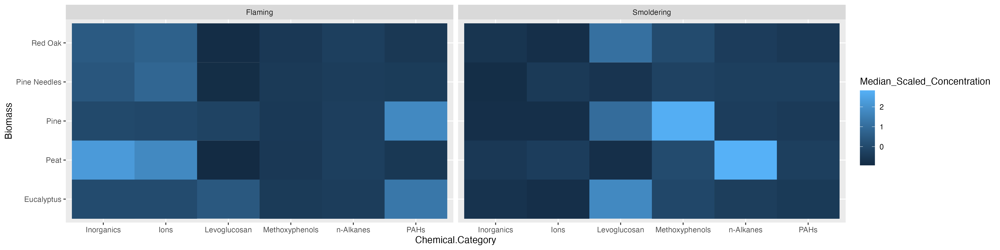

# Data Visualizations

This training module was developed by Alexis Payton, Kyle Roell, Lauren E. Koval, Elise Hickman, and Julia E. Rager.

All input files (script, data, and figures) can be downloaded from the [UNC-SRP TAME2 GitHub website](https://github.com/UNCSRP/TAME2).

## Introduction to Data Visualizations

Selecting an approach to visualize data is an important consideration when presenting scientific research, given that figures have the capability to summarize large amounts of data efficiently and effectively. (At least that's the goal!) This module will focus on basic data visualizations that we view to be most commonly used, both in and outside of the field of environmental health research, many of which you have likely seen before. This module is not meant to be an exhaustive representation of all figure types, rather it serves as an introduction to some types of figures and how to approach choosing the one that most optimally displays your data and primary findings. When selecting a data visualization approach, here are some helpful questions you should first ask yourself:

+ What message am I trying to convey with this figure?
+ How does this figure highlight major findings from the paper?
+ Who is the audience?
+ What type of data am I working with?

[A Guide To Getting Data Visualization Right](https://www.smashingmagazine.com/2023/01/guide-getting-data-visualization-right/) is a great resource for determining which figure is best suited for various types of data. More complex methodology-specific charts are presented in succeeding TAME modules. These include visualizations for:

+ Two Group Comparisons (e.g.,boxplots and logistic regression) in [Module 3.4 Introduction to Statistical Tests](insert link) and [Module 4.4 Two Group Comparisons and Visualizations](insert link)
+ Multi-Group Comparisons (e.g.,boxplots) in [Module 3.4 Introduction to Statistical Tests](insert link) and [Module 4.5 Mult-Group Comparisons and Visualizations](insert link)
+ Supervised Machine Learning (e.g.,decision boundary plots, variable importance plots) in [Module 5.3 Supervised ML Model Interpretation](insert link)
+ Unsupervised Machine Learning 
  + Principal Component Analysis (PCA) plots and heatmaps in  [Module 5.4 Unsupervised Machine Learning I: K-Means Clustering & PCA](insert link)
  + Dendrograms, clustering visualizations, heatmaps, and variable contribution plots in [Module 5.5 Unsupervised Machine Learning II: Additional Clustering Applications](insert link)
+ -Omics Expression (e.g.,MA plots and volcano plots) in [Module 6.2 -Omics and Systems Biology: Transcriptomic Applications](insert link)
+ Mixtures Methods
  + Forest Plots in [Module 6.3 Mixtures I: Overview and Quantile G-Computation Application](insert link)
  + Trace Plots in [Module 6.4 Mixtures II: BKMR Application](insert link)
  + Sufficient Similarity (e.g.,heatmaps, clustering) in [Module 6.5 Mixtures III: Sufficient Similarity](insert link)
+ Toxicokinetic Modeling (e.g.,line graph, dose response) in [Module 6.6 Toxicokinetic Modeling](insert link)

<br>

## Introduction to Training Module
Visualizing data is an important step in any data analysis, including those carried out in environmental health research. Often, visualizations allow scientists to better understand trends and patterns within a particular dataset under evaluation. Even after statistical analysis of a dataset, it is important to then communicate these findings to a wide variety of target audiences. Visualizations are a vital part of communicating complex data and results to target audiences.

In this module, we highlight some figures that can be used to visualize larger, more high-dimensional datasets using figures that are more simple (but still relevant!) than methods presented later on in TAME. This training module specifically reviews the formatting of data in preparation of generating visualizations, scaling datasets, and then guides users through the generation of the following example data visualizations:

+ Density plots
+ Boxplots
+ Correlation plots
+ Heatmaps

These visualization approaches are demonstrated using a large environmental chemistry dataset. This example dataset was generated through chemical speciation analysis of smoke samples collected during lab-based simulations of wildfire events. Specifically, different biomass materials (eucalyptus, peat, pine, pine needles, and red oak) were burned under two combustion conditions of flaming and smoldering, resulting in the generation of 12 different smoke samples. These data have been previously published in the following environmental health research studies, with data made publicly available:

+ Rager JE, Clark J, Eaves LA, Avula V, Niehoff NM, Kim YH, Jaspers I, Gilmour MI. Mixtures modeling identifies chemical inducers versus repressors of toxicity associated with wildfire smoke. Sci Total Environ. 2021 Jun 25;775:145759. doi: 10.1016/j.scitotenv.2021.145759. Epub 2021 Feb 10. PMID: [33611182](https://pubmed.ncbi.nlm.nih.gov/33611182/).
+ Kim YH, Warren SH, Krantz QT, King C, Jaskot R, Preston WT, George BJ, Hays MD, Landis MS, Higuchi M, DeMarini DM, Gilmour MI. Mutagenicity and Lung Toxicity of Smoldering vs. Flaming Emissions from Various Biomass Fuels: Implications for Health Effects from Wildland Fires. Environ Health Perspect. 2018 Jan 24;126(1):017011. doi: 10.1289/EHP2200. PMID: [29373863](https://pubmed.ncbi.nlm.nih.gov/29373863/).

### GGplot2

*ggplot2* is a powerful package used to create graphics in R. It was designed based on the philosophy that every figure can be built using a dataset, a coordinate system, and a geom that specifies the type of plot. As a result, it is fairly straightforward to create highly customizable figures and is typically preferred over using base R to generate graphics. We'll generate all of the figures in this module using *ggplot2*.

For additional resources on *ggplot2* see [ggplot2 Posit Documentation](https://ggplot2.tidyverse.org/) and [Data Visualization with ggplot2](https://datacarpentry.org/R-ecology-lesson/04-visualization-ggplot2.html).

### Script Preparations

#### Cleaning the global environment
```{r}
rm(list=ls())
```

#### Installing required R packages
If you already have these packages installed, you can skip this step, or you can run the below code which checks installation status for you
```{r install_libs, echo=TRUE, eval=TRUE, warning=FALSE, results='hide', message=FALSE}
if (!requireNamespace("GGally"))
  install.packages("GGally");
if (!requireNamespace("corrplot"))
  install.packages("corrplot");
if (!requireNamespace("pheatmap"))
  install.packages("pheatmap");
```

#### Loading R packages required for this session
```{r echo=TRUE, eval=TRUE, warning=FALSE, results='hide', message=FALSE}
library(tidyverse)
library(GGally)
library(corrplot)
library(reshape2)
library(pheatmap)
```

#### Set your working directory
```{r, eval=FALSE, echo=TRUE}
setwd("/filepath to where your input files are")
```

#### Importing example dataset
Then let's read in our example dataset. As mentioned in the introduction, this example dataset represents chemical measurements across 12 different biomass burn scenarios representing potential wildfire events. Let's upload and view these data:
```{r}
# Load the data
smoke_data <- read.csv("Module3_1_Input/Module3_1_InputData.csv")

# View the top of the dataset
head(smoke_data) 
```

### Training Module's Environmental Health Questions
This training module was specifically developed to answer the following environmental health questions:

1. How do the distributions of the chemical concentration data differ based on each biomass burn scenario?
2. Are there correlations between biomass burn conditions based on the chemical concentration data?
3. Under which biomass burn conditions are concentrations of certain chemical categories the highest?

<br>

We can create a **density plot** to answer the first question. Similar to a histogram, density plots are an effective way to show overall distributions of data and can be useful to compare across various test conditions or other stratifications of the data.

In this example of a density plot, we'll visualize the distributions of chemical concentration data on the x axis. A density plot automatically displays where values are concentrated on the y axis. Additionally, we'll want to have multiple density plots within the same figure for each biomass burn condition. 

Before the data can be visualized, it needs to be converted from a wide to long format. This is because we need to have variable or column names entitled `Chemical_Concentration` and `Biomass_Burn_Condition` that can be placed into `ggplot()`. For review on converting between long and wide formats and using other tidyverse tools, see **TAME 2.0 Module 2.3 Data Manipulation & Reshaping**.
```{r}
longer_smoke_data = pivot_longer(smoke_data, cols = 4:13, names_to = "Biomass_Burn_Condition", 
                                 values_to = "Chemical_Concentration")

head(longer_smoke_data)
```

#### Scaling dataframes for downstream data visualizations

A data preparation method that is commonly used to convert values into those that can be used to better illustrate overall data trends is **data scaling**. Scaling can be achieved through data transformations or normalization procedures, depending on the specific dataset and goal of analysis/visualization. Scaling is often carried out using data vectors or columns of a dataframe.

For this example, we will normalize the chemical concentration dataset using a basic scaling and centering procedure using the base R function, `scale()`. This algorithm results in the normalization of a dataset using the mean value and standard deviation. This scaling step will convert chemical concentration values in our dataset into normalized values across samples, such that each chemical's concentration distributions are more easily comparable between the different biomass burn conditions.

For more information on the `scale()` function, see its associated [RDocumentation](https://www.rdocumentation.org/packages/base/versions/3.6.2/topics/scale) and helpful tutorial on [Implementing the scale() function in R](https://www.journaldev.com/47818/r-scale-function).
```{r}
scaled_longer_smoke_data = longer_smoke_data %>%
    # scaling within each chemical
    group_by(Chemical) %>%
    mutate(Scaled_Chemical_Concentration = scale(Chemical_Concentration)) %>%
    ungroup()

head(scaled_longer_smoke_data) # see the new scaled values now in the last column (column 7)
```

We can see that in the `Scaled_Chemical_Concentration` column, each chemical is scaled based on a normal distribution centered around 0, with values now less than or greater than zero.

Now that we have our dataset formatted, let's plot it.

## Density Plot Visualization

The following code can be used to generate a density plot:
```{r fig.align = "center"}
ggplot(scaled_longer_smoke_data, aes(x = Scaled_Chemical_Concentration, color = Biomass_Burn_Condition)) + 
  geom_density()
```

### Answer to Environmental Health Question 1, Method I
:::question
*With this method, we can answer **Environmental Health Question #1***: How do the distributions of the chemical concentration data differ based on each biomass burn scenario?
::: 

:::answer
**Answer**: In general, there are a high number of chemicals that were measured at relatively lower abundances across all smoke samples (hence, the peak in occurrence density occurring towards the left, before 0). The three conditions of smoldering peat, flaming peat, and flaming pine contained the most chemicals at the highest relative concentrations (hence, these lines are the top three lines towards the right).
:::

<br>

## Boxplot Visualization
A **boxplot** can also be used to answer our first environmental health question: **How do the distributions of the chemical concentration data differ based on each biomass burn scenario?**. A boxplot also displays a data's distribution, but it incorporates a visualization of a five number summary (i.e., minimum, first quartile, median, third quartile, and maximum). Any outliers are displayed as dots.

For this example, let's have `Scaled_Chemical_Concentration` on the x axis and `Biomass_Burn_Condition` on the y axis. The `scaled_longer_smoke_data` dataframe is the format we need, so we'll use that for plotting.
```{r fig.align = "center"}
ggplot(scaled_longer_smoke_data, aes(x = Scaled_Chemical_Concentration, y = Biomass_Burn_Condition, 
                                     color = Biomass_Burn_Condition)) + 
  geom_boxplot()
```

### Answer to Environmental Health Question 1, Method II
:::question
*With this alternative method, we can answer, in a different way, **Environmental Health Question #1***: How do the distributions of the chemical concentration data differ based on each biomass burn scenario?
::: 

:::answer
**Answer, Method II**: The median chemical concentration is fairly low (less than 0) for all biomass burn conditions. Overall, there isn't much variation in chemical concentrations with the exception of smoldering peat, flaming peat, and flaming eucalyptus.
:::

<br>

## Correlation Visualizations
Let's turn our attention to the second environmental health question: **Are there correlations between biomass burn conditions based on the chemical concentration data?** We'll use two different correlation visualizations to answer this question using the *GGally* package. 

*GGally* is a package that serves as an extension of *ggplot2*, the baseline R plotting system based on the grammar of graphics. GGally is very useful for creating plots that compare groups or features within a dataset, among many other utilities. Here we will demonstrate the `ggpairs()` function within *GGally* using the scaled chemistry dataset. This function will produce an image that shows correlation values between biomass burn sample pairs and also illustrates the overall distributions of values in the samples. For more information on *GGally*, see its associated [RDocumentation](https://www.rdocumentation.org/packages/GGally/versions/1.5.0) and [example helpful tutorial](http://www.sthda.com/english/wiki/ggally-r-package-extension-to-ggplot2-for-correlation-matrix-and-survival-plots-r-software-and-data-visualization).

*GGally* requires a wide dataframe with ids (i.e.,`Chemical`) as the rows and the variables that will be compared to each other (i.e.,`Biomass_Burn_Condition`) as the columns. Let's create that dataframe.
```{r}
# first selecting the chemical, biomass burn condition, and 
# the scaled chemical concentration columns
wide_scaled_data = scaled_longer_smoke_data %>%
    pivot_wider(id_cols = Chemical, names_from = "Biomass_Burn_Condition", 
                               values_from = "Scaled_Chemical_Concentration") %>%
    # converting the chemical names to row names
    column_to_rownames(var = "Chemical")

head(wide_scaled_data)
```

By default, `ggpairs()` displays Pearson's correlations. To show Spearman's correlations takes more nuance, but can be done using the code that has been commented out below. 
```{r fig.align = "center", fig.width = 15, fig.height = 15}

# ggpairs with Pearson's correlations
wide_scaled_data = data.frame(as.matrix(wide_scaled_data))
ggpairs(wide_scaled_data)

# ggpairs with Spearman's correlations
# pearson_correlations = cor(wide_scaled_data, method = "spearman")
# ggpairs(wide_scaled_data, upper = list(continuous = wrap(ggally_cor, method = "spearman")))
```
    
Many of these biomass burn conditions have significant correlations denoted by the asterisks.

+ '*': p value < 0.1
+ '**': p value < 0.05
+ '***': p value < 0.01

The upper right portion displays the correlation values, where a value less than 0 indicates negative correlation and a value greater than 0 signifies positive correlation. The diagonal shows the density plots for each variable. The lower left portion visualizes the values of the two variables compared using a scatterplot.

### Answer to Environmental Health Question 2
:::question
*With this, we can answer **Environmental Health Question #2***: Are there correlations between biomass burn conditions based on the chemical concentration data?
:::

:::answer
**Answer**: There is low correlation between many of the variables (-0.5 < correlation value < 0.5). Eucalyptus flaming and pine flaming are significantly positively correlated along with peat flaming and pine needles flaming (correlation value ~0.7 and p value < 0.001).
:::

We can visualize correlations another way using the other function from *GGally*, `ggcorr()`, which visualizes each correlation as a square. Note that this function calculates Pearson's correlations by default. However, this can be changed using the `method` parameter shown in the code commented out below.
```{r fig.align = "center", fig.width = 10, fig.height = 7}
# Pearson's correlations
ggcorr(wide_scaled_data)

# Spearman's correlations
# ggcorr(wide_scaled_data, method = "spearman")
```

We'll visualize correlations between each of the groups using one more figure using the `corrplot()` function from the *corrplot* package.
```{r fig.align = "center"}
# Need to supply corrplot with a correlation matrix, here, using the 'cor' function
corrplot(cor(wide_scaled_data))
```

Each of these correlation figures displays the same information, but the one you choose to use is a matter of personal preference. Click on the following resources for additional information on [ggpairs()](https://r-charts.com/correlation/ggpairs/) and [corrplot()](https://cran.r-project.org/web/packages/corrplot/vignettes/corrplot-intro.html). 

<br>

## Heatmap Visualization

Last, we'll turn our attention to answering the final environmental health question: **Under which biomass burn conditions are concentrations of certain chemical categories the highest?** This can be addressed with the help of a heatmap.

**Heatmaps** are a highly effective method of viewing an entire dataset at once. Heatmaps can appear similar to correlation plots, but typically illustrate other values (e.g., concentrations, expression levels, presence/absence, etc) besides correlation values. They are used to draw patterns between two variables of highest interest (that comprise the x and y axis, though additional bars can be added to display other layers of information). In this instance, we'll use a heatmap to determine whether there are patterns apparent between chemical categories and biomass burn condition on chemical concentrations. 

For this example, we can plot `Biomass_Burn_Condition` and `Chemical.Category` on the axes and fill in the values with `Scaled_Chemical_Concentration`. When generating heatmaps, scaled values are often used to better distinguish patterns between groups/samples. 

In this example, we also plan to display the median scaled concentration value within the heatmap as an additional layer of helpful information to aid in interpretation. To do so, we'll need to take the median chemical concentration for each biomass burn condition within each chemical category. However, since we want `ggplot()` to visualize the median scaled values with the color of the tiles this step was already necessary. 
```{r}
# We'll find the median value and add that data to the dataframe as an additional column
heatmap_df = scaled_longer_smoke_data %>%
    group_by(Biomass_Burn_Condition, Chemical.Category) %>%
    mutate(Median_Scaled_Concentration = median(Scaled_Chemical_Concentration))

head(heatmap_df)
```

Now we can plot the data and add the `Median_Scaled_Concentration` to the figure using `geom_text()`. Note that specifying the original `Scaled_Chemical_Concentration` in the **fill** parameter will NOT give you the same heatmap as specifying the median values in `ggplot()`.
```{r fig.align = "center", fig.width = 12, fig.height= 5}
ggplot(data = heatmap_df, aes(x = Chemical.Category, y = Biomass_Burn_Condition,
                                           fill = Median_Scaled_Concentration)) + 
  geom_tile() + # function used to specify a heatmap for ggplot
  geom_text(aes(label = round(Median_Scaled_Concentration, 2))) # adding concentration values as text, rounding to two values after the decimal
```

### Answer to Environmental Health Question 3
:::question
*With this, we can answer **Environmental Health Question #3***: Under which biomass burn conditions are concentrations of certain chemical categories the highest?
:::

:::answer
**Answer**: Peat flaming has the highest concentrations of inorganics and ions. Eucalyptus smoldering has the highest concentrations of levoglucosans. Pine smoldering has the highest concentrations of methoxyphenols. Peat smoldering has the highest concentrations of n-alkanes. Pine needles smoldering has highest concentrations of PAHs. 
:::

This same heatmap can be achieved another way using the `pheatmap()` function from the *pheatmap* package. Using this function requires us to use a wide dataset, which we need to create. It will contain `Chemical.Category`, `Biomass_Burn_Condition` and `Scaled_Chemical_Concentration`. 
```{r, message=FALSE}
heatmap_df2 = scaled_longer_smoke_data %>%
    group_by(Biomass_Burn_Condition, Chemical.Category) %>%
    # using the summarize function instead of mutate function as was done previously since we only need the median values now
    summarize(Median_Scaled_Concentration = median(Scaled_Chemical_Concentration)) %>%
    # transforming the data to a wide format
    pivot_wider(id_cols = Biomass_Burn_Condition, names_from = "Chemical.Category", 
                               values_from = "Median_Scaled_Concentration") %>%
    # converting the chemical names to row names
    column_to_rownames(var = "Biomass_Burn_Condition")

head(heatmap_df2)
```

Now let's generate the same heatmap this time using the `pheatmap()` function:
```{r fig.align = "center"}
pheatmap(heatmap_df2, 
        # removing the clustering option from both rows and columns
        cluster_rows = FALSE, cluster_cols = FALSE,
        # adding the values for each cell, making those values black, and changing the font size
        display_numbers = TRUE, number_color = "black", fontsize = 12) 
```

Notice that the `pheatmap()` function does not include axes or legend titles as with `ggplot()`, however those can be added to the figure after exporting from R in MS Powerpoint or Adobe. Additional parameters, including `cluster_rows`, for the `pheatmap()` function are discussed further in **TAME 2.0 Module 5.4 Unsupervised Machine Learning**. For basic heatmaps like the ones shown here, `ggplot()` or `pheatmap()` can both be used however, both have their pros and cons. For example, `ggplot()` figures tend to be more customizable and easily combined with other figures, while `pheatmap()` has additional parameters built into the function that can make plotting certain features advantageous like clustering.

<br>

## Concluding Remarks
In conclusion, this training module provided example code to create highly customizable data visualizations using *ggplot2* pertinent to environmental health research.

<br>

<label class="tykfont">
Test Your Knowledge 
</label>

:::tyk
Replicate the figure below! The heatmap still visualizes the median chemical concentrations, but this time we're separating the burn conditions, allowing us to determine if the concentrations of chemicals released are contingent upon the burn condition.

For additional figures available and to view aspects of figures that can be changed in *GGplot2*, check out this [GGPlot2 Cheat Sheet](https://www.maths.usyd.edu.au/u/UG/SM/STAT3022/r/current/Misc/data-visualization-2.1.pdf). You might need it to make this figure!

**Hint 1**: Use the `separate()` function from *tidyverse* to split `Biomass_Burn_Condition` into `Biomass` and `Burn_Condition`. 

**Hint 2**: Use the function `facet_wrap()` within `ggplot()` to separate the heatmaps by `Burn_Condition`.
:::
```{r, echo=FALSE, fig.width=4, fig.height=5, fig.align='center'}

```