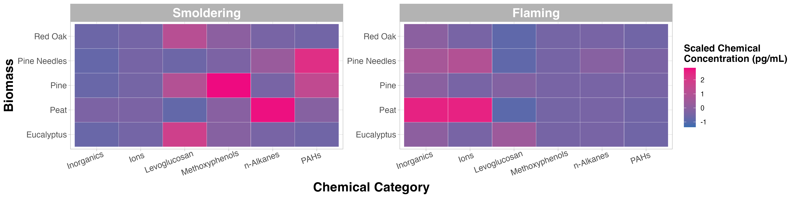

# Improving Data Visualizations

This training module was developed by Alexis Payton, Elise Hickman, and Julia E. Rager.

All input files (script, data, and figures) can be downloaded from the [UNC-SRP TAME2 GitHub website](https://github.com/UNCSRP/TAME2).

## Introduction to Data Visulization Conventions

Data visualizations are used to convey key takeaways from a research study's findings in a clear, succinct manner to highlight data trends, patterns, and/or relationships. In environmental health research, this is of particular importance for high-dimensional datasets that can typically be parsed using multiple methods, potentially resulting in many different approaches to visualize data. As a consequence, researchers are often faced with an overwhelming amount of options when deciding which visualization scheme(s) most optimally translate their results for effective dissemination. Effective data visualization approaches are vital to a researcher's success for many reasons. For instance, manuscript readers or peer reviewers often scroll through a study's text and focus on the quality and novelty of study figures before deciding whether to read/review the paper. Therefore, the importance of data visualizations cannot be understated in any research field.

As a high-level introduction, it is important that we first communicate some traits that we think are imperative towards ensuring a successful data visualization approach as described in more detail below.

Keys to successful data visualizations:

+ **Consider your audience, data type, and research question prior to selecting a figure to visualize your data**

  For example, if more computationally complex methods are used in a manuscript that is intended for a journal with an audience that doesn't have that same level of expertise, consider spending time focusing on how those results are presented in an approachable way for that audience. For a review of how to choose a rudimentary chart based on the data type, check out [How to Choose the Right Data Visualization](https://www.atlassian.com/data/charts/how-to-choose-data-visualization). Some of these basic charts will be presented in this module, while more complex analysis-specific visualizations, especially ones developed for high-dimensional data will be presented in later modules. 

+ **Take the legibility of the figure into account** 

  This includes avoiding abbreviations when possible. (If they can't be avoided explain them in the caption.) All titles should be capitalized, including titles for the legend(s) and axes. Underscores and periods between words should be replaced with spaces. Consider the legibility of the figure if printed in black and white. (However, that's not as important these days.) Lastly, feel free to describe your plot in further detail in the caption to aid the reader in understanding the results presented. 

+ **Minimize text**

  Main titles aren't necessary for single paneled figures (like the examples below), because in a publication the title of the figure is right underneath each figure. It's good practice to remove this kind of extraneous text, which can make the figure seem more cluttered. Titles can be helpful in multi-panel figures, especially if there are multiple panels with the same figure type that present slightly different results. For example, in the Test Your Knowledge section, you'll need to create two heatmaps, but one displays data under smoldering conditions and the other displays data under flaming conditions. In general, try to reduce the amount of extraneous text in a plot to keep a reader focused on the most important elements and takeaways in the plot.

+ **Use the minimal number of figures you need to support your narrative**

  It is important to include an optimal number of figures within manuscripts and scientific reports. Too many figures might overwhelm the overall narrative, while too few might not provide enough substance to support your main findings. It can be helpful to also consider placing some figures in supplemental material to aid in the overall flow of your scientific writing.

+ **Select an appropriate color palette**

  Packages have been developed to offer color palettes including *MetBrewer* and *RColorBrewer*. In addition, *ggsci* is a package that offers a collection of color palettes used in various scientific journals. For more information, check out  *MetBrewer*, see its associated [RDocumentation](https://cran.r-project.org/web/packages/MetBrewer/index.html) and [example tutorial](https://github.com/BlakeRMills/MetBrewer). For more information on *RColorBrewer*, see its associated [RDocumentation](https://cran.r-project.org/web/packages/RColorBrewer/index.html) and [example tutorial](https://r-graph-gallery.com/38-rcolorbrewers-palettes.html). For more information on *ggsci*, see its associated [RDocumentation](https://cran.r-project.org/web/packages/ggsci/vignettes/ggsci.html). In general, it's better to avoid bright and flashy colors that can be difficult to read.

  It's advisable to use colors for manuscript figures that are color-blind friendly. Check out these [Stack overflow answers about color blind-safe color palettes and packages](https://stackoverflow.com/questions/57153428/r-plot-color-combinations-that-are-colorblind-accessible). Popular packages for generating colorblind-friendly palettes include [viridis](https://cran.r-project.org/web/packages/viridis/vignettes/intro-to-viridis.html) and [rcartocolor](https://github.com/Nowosad/rcartocolor).

+ **Use color strategically**

  Color can be used to visualize a variable. There are three ways to categorize color schemes - sequential, diverging, and qualitative. Below, definitions are provided for each along with example figures that we've previously published that illustrate each color scheme. In addition, figure titles and captions are also provided for context. Note that some of these figures have been simplified from what was originally published to show more streamlined examples for TAME. 

  - **Sequential**: intended for ordered categorical data (i.e., disease severity, likert scale, quintiles). The choropleth map below is from [Winker, Payton et. al](https://doi.org/10.3389/fpubh.2024.1339700). 
```{r, echo=FALSE, out.width = "65%", fig.align='center', fig.cap= "**Figure 1. Geospatial distribution of the risk of future wildfire events across North Carolina.** Census tracts in North Carolina were binned into quintiles based on Wildfire Hazard Potential (WHP) with 1 (pale orange) having the lowest risk and 5 (dark red) having the highest risk. Figure regenerated here in alignment with its published [Creative Commons Attribution 4.0 International License](https://creativecommons.org/licenses/by/4.0/)"}
knitr::include_graphics("Module3_2_Input/Module3_2_Image1.png")
```

  - **Diverging**: intended to emphasize continuous data at extremes of the data range (typically using darker colors) and mid-range values (typically using lighter colors). This color scheme is ideal for charts like heatmaps. The heatmap below is from [Payton, Perryman et. al](0.1152/ajplung.00299.2021).
```{r, echo=FALSE, out.width = "90%", fig.align='center', fig.cap= "**Figure 6. Individual cytokine expression levels across all subjects.** Cytokine concentrations were derived from nasal lavage fluid samples. On the x axis, subjects were ordered first according to tobacco use status, starting with non-smokers then cigarette smokers and e-cigarette users. Within tobacco use groups, subjects are ordered from lowest to highest average cytokine concentration from left to right. Within each cluster shown on the y axis, cytokines are ordered from lowest to highest average cytokine concentration from bottom to top. Figure regenerated here in alignment with its published [Creative Commons Attribution 4.0 International License](https://creativecommons.org/licenses/by/4.0/)"}

```

  - **Qualitative**: intended for nominal categorical data to visualize clear differences between groups (i.e., soil types and exposure groups). The dendrogram below is from [Koval et. al](10.1038/s41370-022-00451-8).
```{r, echo=FALSE, out.width = "75%", fig.align='center', fig.cap= "**Figure 2. Translating chemical use inventory data to inform human exposure patterning.** Groups A-I illustrate the identified clusters of exposure source categories. Figure regenerated here in alignment with its published [Creative Commons Attribution 4.0 International License](https://creativecommons.org/licenses/by/4.0/)"}
knitr::include_graphics("Module3_2_Input/Module3_2_Image3.png")
```

+ **Consider ordering axes to reveal patterns relevant to the research questions**

  Ordering the axes can reveal potential patterns that may not be clear in the visualization otherwise. In the cytokine expression heatmap above, there are not clear differences in cytokine expression across the tobacco use groups. However, e-cigarette users seem to have slightly more muted responses compared to non-smokers and cigarette smokers in clusters B and C, which was corroborated in subsequent statistical analyses. It is also evident that Cluster A had the lowest cytokine concentrations, followed by Cluster B, and then Cluster C with the greatest concentrations. 
  
What makes these figures so compelling is how the aspects introduced above were thoughtfully incorporated. In the next section, we'll put those principles into practice using data that were described and referenced previously in **TAME 2.0 Module 3.1 Data Visualizations**. 

<br>

## Introduction to Training Module
In this module, *ggplot2*, R's data visualization package will be used to walk through ways to improve data visualizations. We'll recreate two figures (i.e., the boxplot and heatmap) constructed previously in **TAME 2.0 Module 3.1 Data Visualizations** and improve them so they are publication-ready. Additionally, we'll write figure titles and captions to contextualize the results presented for each visualization. When writing figure titles and captions, it is helpful to address the research question or overall concept that the figure seeks to capture rather than getting into the weeds of specific methods the plot is based on. This is especially important when visualizing more complex methods that your audience might not have as much knowledge on.

### Script Preparations

#### Cleaning the global environment
```{r, clear_env, echo=TRUE, eval=TRUE}
rm(list=ls())
```

#### Installing required R packages
If you already have these packages installed, you can skip this step, or you can run the below code which checks installation status for you
```{r, install_libs, echo=TRUE, eval=TRUE, warning=FALSE, results='hide', message=FALSE}
if (!requireNamespace("MetBrewer"))
  install.packages("MetBrewer");
if (!requireNamespace("RColorBrewer"))
  install.packages("RColorBrewer");
if (!requireNamespace("pheatmap"))
  install.packages("pheatmap");
if (!requireNamespace("cowplot"))
  install.packages("cowplot");
```

#### Loading required R packages
```{r, echo=TRUE, eval=TRUE, warning=FALSE, results='hide', message=FALSE}
library(tidyverse)
library(MetBrewer)
library(RColorBrewer)
library(pheatmap)
library(cowplot)
```

#### Set your working directory
```{r, eval=FALSE, echo=TRUE}
setwd("/filepath to where your input files are")
```

#### Importing example dataset
Let's now read in our example dataset. As mentioned in the introduction, this example dataset represents chemical measurements across 12 different biomass burn scenarios, representing chemicals emitted during potential wildfire events. Let's upload and view these data:
```{r}
# Load the data
smoke_data <- read.csv("Module3_2_Input/Module3_2_InputData.csv")

# View the top of the dataset
head(smoke_data) 
```

Now that we've been able to view the dataset, let's come up with questions that can be answered with our boxplot and heatmap figure. This will inform how we format the dataframe for visualization.

### Training Module's Environmental Health Questions 
This training module was specifically developed to answer the following environmental health questions:

1. Boxplot: How do the distributions of the chemical concentration data differ based on each biomass burn scenario?
2. Heatmap: Which classes of chemicals show the highest concentrations across the evaluated biomass burn conditions?
3. How can these figures be combined into a single plot that can be then be exported from R?

#### Formatting dataframes for downstream visualization code
First, format the dataframe by changing it from a wide to long format and normalizing the chemical concentration data. For more details on this data reshaping visit **TAME 2.0 Module 2.3 Data Manipulation & Reshaping**.
```{r}
scaled_longer_smoke_data = pivot_longer(smoke_data, cols = 4:13, names_to = "Biomass_Burn_Condition", 
                                 values_to = "Chemical_Concentration") %>%
    # scaling within each chemical
    group_by(Chemical) %>%
    mutate(Scaled_Chemical_Concentration = scale(Chemical_Concentration)) %>%
    ungroup()

head(scaled_longer_smoke_data)
```
<br>

## Creating an Improved Boxplot Visualization

As we did in the previous module, a boxplot will be constructed to answer the first environmental heath question: **How do the distributions of the chemical concentration data differ based on each biomass burn scenario?**. Let's remind ourselves of the original figure from the previous module. 

```{r fig.align = "center", echo = FALSE, fig.width = 7, fig.height = 5}
ggplot(data = scaled_longer_smoke_data, aes(x = Scaled_Chemical_Concentration, color = Biomass_Burn_Condition)) + 
  geom_boxplot()
```

Based on the figure above, peat smoldering has the highest median scaled chemical concentration. However, this was difficult to determine given that the burn conditions aren't labeled on the x axis and a sequential color palette was used, making it difficult to identify the correct boxplot with its burn condition in the legend. If you look closely, the colors in the legend are in a reverse order of the colors assigned to the boxplots. Let's identify some elements of this graph that can be modified to make it easier to answer our research question.

:::txtbx
### There are four main aspects we can adjust on this figure:

**1. The legibility of the text in the legend and axes.**

Creating spaces between the text or exchanging the underscores for spaces improves the legibility of the figure. 
   
 **2. The order of the boxplots.**
 
Ordering the biomass burn conditions from highest to lowest based on their median scaled chemical concentration allows the reader to easily determine the biomass burn condition that had the greatest or least chemical concentrations relative to each other. In R, this can be done by putting the `Biomass_Burn_Condition` variable into a factor.
     
**3. Use of color.**

Variables can be visualized using color, text, size, etc. In this figure, it is redundant to have the biomass burn condition encoded in the legend and the color. Instead this variable can be put on the y axis and the legend will be removed to be more concise. The shades of the colors will also be changed, but to keep each burn condition distinct from each other, colors will be chosen that are distinct from one another. Therefore, we will choose a qualitative color scheme. 

**4. Show all data points when possible.** 

Many journals now require that authors report every single value when making data visualizations, particularly for small *n* studies using bar graphs and boxplots to show results. Instead of just displaying the mean/median and surrounding data range, it is advised to show how every replicate landed in the study range when possible. Note that this requirement is not feasible for studies with larger sample sizes though should be considered for smaller *in vitro* and animal model studies.
:::

Let's start with addressing **#1: Legibility of Axis Text**. The legend title and axis titles can easily be changed with `ggplot()`, so that will be done later. To remove the underscore from the `Biomass_Burn_Condition` column, we can use the function `gsub()`, which will replace all of the underscores with spaces, resulting in a cleaner-looking graph. 
```{r}
# First adding spaces between the biomass burn conditions
scaled_longer_smoke_data = scaled_longer_smoke_data %>%
  mutate(Biomass_Burn_Condition = gsub("_", " ", Biomass_Burn_Condition))

# Viewing dataframe
head(scaled_longer_smoke_data)
```

**#2. Reordering the boxplots based on the median scaled chemical concentration**.
After calculating the median scaled chemical concentration for each biomass burn condition, the new dataframe will be arranged from lowest to highest median scaled concentration from the top of the dataframe to the bottom. This order will be saved in a vector, `median_biomass_order`. Although the biomass burn conditions are saved from lowest to highest concentration, `ggplot()` will plot them in reverse order with the highest concentration at the top and the lowest at the bottom of the y axis.

Axis reordering can also be accomplished using `reorder` within the `ggplot()` function as described [here](https://guslipkin.medium.com/reordering-bar-and-column-charts-with-ggplot2-in-r-435fad1c643e) and [here](https://r-graph-gallery.com/267-reorder-a-variable-in-ggplot2.html).
```{r}
median_biomass = scaled_longer_smoke_data %>%
    group_by(Biomass_Burn_Condition) %>%
    summarize(Median_Concentration = median(Scaled_Chemical_Concentration)) %>%
    # arranges dataframe from lowest to highest from top to bottom
    arrange(Median_Concentration)

head(median_biomass)

# Saving that order
median_biomass_order = median_biomass$Biomass_Burn_Condition
```


```{r}
# Putting into factor to organize the burn conditions
scaled_longer_smoke_data$Biomass_Burn_Condition = factor(scaled_longer_smoke_data$Biomass_Burn_Condition, 
                                                                levels = median_biomass_order)

# Final dataframe to be used for plotting
head(scaled_longer_smoke_data)
```

Now that the dataframe has been finalized, we can plot the new boxplot. The final revision, **#3: Making Use of Color**, will be addressed with `ggplot()`. However, a palette can be chosen from the *MetBrewer* package.
```{r}
# Choosing the "Jurarez" palette from the `MetBrewer` package
# `n = 12`, since there are 12 biomass burn conditions
juarez_colors = met.brewer(name = "Juarez", n = 12)[1:12]
```

**#4. Show all data points when possible** will also be addressed with `ggplot()` by simply using `geom_point()`. 
```{r fig.align = "center", out.width = "75%", out.height = "75%"}
FigureX1 = ggplot(scaled_longer_smoke_data, aes(x = Scaled_Chemical_Concentration, y = Biomass_Burn_Condition, 
                                   color = Biomass_Burn_Condition)) + 
  geom_boxplot() +
  # jittering the points, so they're not all on top of each other and adding transparency
  geom_point(position = position_jitter(h = 0.1), alpha = 0.7) + 

  theme_light() + # changing the theme
  theme(axis.text = element_text(size = 9), # changing size of axis labels
      axis.title = element_text(face = "bold", size = rel(1.5)), # changes axis titles
      legend.position = "none") + # removes legend

  xlab('Scaled Chemical Concentration (pg/uL)') + ylab('Biomass Burn Condition') + # changing axis labels 
  scale_color_manual(values = c(juarez_colors)) # changing the colors

FigureX1
```

An appropriate title for this figure could be:

“**Figure X. Chemical concentration distributions of biomass burn conditions.** The boxplots are based on the scaled chemical concentration values, which used the raw chemical concentrations values scaled within each chemical. The individual dots represent the concentrations of each chemical. The biomass burn conditions on the y axis are ordered from greatest (top) to least (bottom) based on median scaled chemical concentration." 

### Answer to Environmental Health Question 1
:::question
*With this, we can answer **Environmental Health Question #1***: Which biomass burn condition has the highest total chemical concentration?
:::

:::answer
**Answer**: Smoldering peat has the highest median chemical concentration, however the median concentrations are comparable across all biomass burn conditions. All the flaming conditions have the highest median chemical concentrations and more overall variation than their respective smoldering conditions with the exception of smoldering peat. 
:::

You may notice that the scaled chemical concentration was put on the x axis and burn condition was put on the y axis and not vice versa. When names are longer in length, they are more legible if placed on the y axis.

Other aspects of the figure were changed in the latest version, but those are minor compared to changing the order of the boxplots, revamping the text, and changing the usage of color. For example, the background was changed from gray to white. Figure backgrounds are generally white, because the figure is easier to read if the paper is printed in black and white. A plot's background can easily be changed to white in R using `theme_light()`, `theme_minimal()`, or `theme_bw()`. Posit provides a very helpful [GGplot2 cheat sheet](https://posit.co/resources/cheatsheets/?type=posit-cheatsheets&_page=2/) for changing a figure's parameters. 

<br>

## Creating an Improved Heatmap Visualization

We'll use a heatmap to answer the second environmental health question: **Which classes of chemicals show the highest concentrations across the evaluated biomass burn conditions?** Let's view the original heatmap from the previous module and find aspects of it that can be improved.
```{r fig.align = "center", fig.width = 10, fig.height= 5}
# Changing the biomass condition variable back to a character from a factor
scaled_longer_smoke_data$Biomass_Burn_Condition = as.character(scaled_longer_smoke_data$Biomass_Burn_Condition)

# Calculating the median value within each biomass burn condition and category
scaled_longer_smoke_data = scaled_longer_smoke_data %>%
    group_by(Biomass_Burn_Condition, Chemical.Category) %>%
    mutate(Median_Scaled_Concentration = median(Scaled_Chemical_Concentration))

# Plotting
ggplot(data = scaled_longer_smoke_data, aes(x = Chemical.Category, y = Biomass_Burn_Condition,
                                           fill = Median_Scaled_Concentration)) + 
  geom_tile() + 
  geom_text(aes(label = round(Median_Scaled_Concentration, 2))) # adding concentration values as text, rounding to two values after the decimal
```

From the figure above, it's clear that certain biomass burn conditions are associated with higher chemical concentrations for some of the chemical categories. For example, peat flaming exposure was associated with higher levels of inorganics and ions, while pine smoldering exposure was associated with higher levels of methoxyphenols. Although these are important findings, it is still difficult to determine if there are greater similarities in chemical profiles based on the biomass or the incineration temperature. Therefore, let's identify some elements of this chart that can be modified to make it easier to answer our research question. 

:::txtbx
### There are three main aspects we can adjust on this figure:

**1. The legibility of the text in the legend and axes.**
Similar to what we did previously, we'll replace underscores and periods with spaces in the axis labels and titles. 
   
**2. The order of the axis labels.**
Ordering the biomass burn condition and chemical category from highest to lowest based on their median scaled chemical concentration allows the reader to easily determine the biomass burn condition that had the greatest or least total chemical concentrations relative to each other. From the previous boxplot figure, biomass burn condition is already in this order, however we need to order the chemical category by putting the variable into a factor. 
     
**3. Use of color.**
Notice that in the boxplot we used a qualitative palette, which is best for creating visual differences between different classes or groups. In this heatmap, we'll choose a diverging color palette that uses two or more contrasting colors. A diverging color palette is able to highlight mid range with a lighter color and values at either extreme with a darker color or vice versa.
:::

**#1: Legibility of Text** can be addressed in `ggplot()` and so can **#2: Reordering the heatmap**.

`Biomass_Burn_Condition` has already been reordered and put into a factor, but we need to do the same with `Chemical.Category`. Similar to before, median scaled chemical concentration for each chemical category will be calculated. However, this time the new dataframe will be arranged from highest to lowest median scaled concentration from the top of the dataframe to the bottom. `ggplot()` will plot them in the SAME order with the highest concentration on the left side and the lowest on the right side of the figure.
```{r}
# Order the chemical category by the median scaled chemical concentration
median_chemical = scaled_longer_smoke_data %>%
    group_by(Chemical.Category) %>%
    summarize(Median_Concentration = median(Scaled_Chemical_Concentration)) %>%
    arrange(-Median_Concentration)

head(median_chemical)

# Saving that order
median_chemical_order = median_chemical$Chemical.Category
```

```{r}
# Putting into factor to organize the chemical categories
scaled_longer_smoke_data$Chemical.Category = factor(scaled_longer_smoke_data$Chemical.Category, 
                                                                levels = median_chemical_order)

# Putting burn conditons back into a factor to organize them
scaled_longer_smoke_data$Biomass_Burn_Condition = factor(scaled_longer_smoke_data$Biomass_Burn_Condition, 
                                                                levels = median_biomass_order)

# Viewing the dataframe to be plotted
head(scaled_longer_smoke_data)
```

Now that the dataframe has been finalized, we can plot the new boxplot. The final revision, **#3: Making Use of Color**, will be addressed with `ggplot()`. Here a palette is chosen from the *RColorBrewer* package.
```{r}
# Only needed to choose 2 colors for 'low' and 'high' in the heatmap
# `n = 8` in the code to generate more colors that can be chosen from
rcolorbrewer_colors = brewer.pal(n = 8, name = 'Accent')
```


```{r fig.align = "center", fig.width = 10, fig.height = 4}
FigureX2 = ggplot(data = scaled_longer_smoke_data, aes(x = Chemical.Category, y = Biomass_Burn_Condition,
                                           fill = Median_Scaled_Concentration)) + 
  geom_tile(color = 'white') + # adds white space between the tiles
  geom_text(aes(label = round(Median_Scaled_Concentration, 2))) + # adding concentration values as text

  theme_minimal() + # changing the theme
  theme(axis.text = element_text(size = 9), # changing size of axis labels
      axis.title = element_text(face = "bold", size = rel(1.5)), # changes axis titles
      legend.title = element_text(face = 'bold', size = 10), # changes legend title
      legend.text = element_text(size = 9)) + # changes legend text

  labs(x = 'Chemical Category', y = 'Biomass Burn Condition', 
       fill = "Scaled Chemical\nConcentration (pg/mL)") + # changing axis labels 
  scale_fill_gradient(low = rcolorbrewer_colors[5], high = rcolorbrewer_colors[6]) # changing the colors

FigureX2
```

An appropriate title for this figure could be:

“**Figure X. Chemical category concentrations across biomass burn conditions.** Scaled chemical concentration values are based on the raw chemical concentration values scaled within each chemical. Chemical category on the x axis is ordered from highest to lowest median concentration from left to right. Biomass burn condition on the y axis is ordered from the highest to lowest median concentration from top to bottom. The values in each tile represent the median scaled chemical concentration."

### Answer to Environmental Health Question 2
:::question
*With this, we can answer **Environmental Health Question #2***: Which classes of chemicals show the highest concentrations across the evaluated biomass burn conditions?
:::

:::answer
**Answer**: Ordering the axes from highest to lowest concentration didn't help organize the data as much as we would've liked given some of the variance of chemical concentrations across the chemical categories. Nevertheless, it's still clear that peat flaming produces the highest concentration of inorganics and ions, peat smoldering with n-Alkanes, eucalyptus smoldering with Levoglucosan, pine smoldering with methoxyphenols, and pine flaming with PAHs. In addition, flaming conditions seem to have higher levels of inorganics and ions while smoldering conditions seem to have higher levels of levoglucosan and PAHs.
:::

It would be helpful if there was a way to group these chemical profiles based on similarity and that's where the `pheatmap()` function can be helpful when it can be difficult to spot those patterns using visual inspection alone. Just for fun, let's briefly visualize a hierarchical clustering heatmap, which will be used to group both the biomass burn conditions and chemical categories based on their chemical concentrations. In this module, we'll focus only on the `pheatmap()` visualization, but more information on hierarchical clustering can be found in **Module 5.5 Unsupervised Machine Learning II: Additional Clustering Applications**.

As we showed in the previous module, this function requires a wide dataframe which we'll need to create. It will contain `Chemical.Category`, `Biomass_Burn_Condition` and `Scaled_Chemical_Concentration`. 
```{r, message=FALSE}
heatmap_df2 = scaled_longer_smoke_data %>%
    group_by(Biomass_Burn_Condition, Chemical.Category) %>%
    # using the summarize function instead of mutate function as was done previously since we only need the median values now
    summarize(Median_Scaled_Concentration = median(Scaled_Chemical_Concentration)) %>%
    # transforming the data to a wide format
    pivot_wider(id_cols = Biomass_Burn_Condition, names_from = "Chemical.Category", 
                               values_from = "Median_Scaled_Concentration") %>%
    # converting the chemical names to row names
    column_to_rownames(var = "Biomass_Burn_Condition")

head(heatmap_df2)
```

Now let's generate the same heatmap this time using the `pheatmap()` function:
```{r fig.align = "center"}
# creating a color palette 
blue_pink_palette = colorRampPalette(c(rcolorbrewer_colors[5], rcolorbrewer_colors[6]))

pheatmap(heatmap_df2, 
        # changing the color scheme
        color = blue_pink_palette(40),
        # hierarchical clustering of the biomass burn conditions
        cluster_rows = TRUE, 
        # creating white space between the two largest clusters
        cutree_row = 2, 
        # adding the values for each cell and making those values black
        display_numbers = TRUE, number_color = "black", 
        # changing the font size and the angle of the column names
        fontsize = 12, angle_col = 45) 
```
By using incorporating the dendrogram into the visualization, it's easier to see that the chemical profiles have greater similarities within incineration temperatures rather than biomasses (with the exception of pine needles smoldering).

<br>

## Creating Multi-Plot Figures
We can combine figures using the `plot_grid()` function from the *cowplot* package. For additional information on the `plot_grid()` function and parameters that can be changed see [Arranging Plots in a Grid](https://wilkelab.org/cowplot/articles/plot_grid.html). Other packages that have figure combining capabilities include the *[patchwork](https://patchwork.data-imaginist.com/)* package and the [`grid_arrange()`](https://cran.r-project.org/web/packages/gridExtra/vignettes/arrangeGrob.html) function from the *gridExtra* package.

Figures can also be combined after they're exported from R using other applications like MS powerpoint and Adobe pdf. 
```{r fig.align = "center", fig.width = 20, fig.height = 6, fig.retina= 3} 
FigureX = plot_grid(FigureX1, FigureX2,
                     # Adding labels, changing size their size and position
                     labels = "AUTO", label_size = 15, label_x = 0.04,
                     rel_widths = c(1, 1.5))
FigureX
```

An appropriate title for this figure could be:

“**Figure X. Chemical concentration distributions across biomass burn conditions.** (A) The boxplots are based on the scaled chemical concentration values, which used the raw chemical concentrations values scaled within each chemical. The individual dots represent the concentrations of each chemical. The biomass burn conditions on the y axis are ordered from greatest (top) to least (bottom) based on median scaled chemical concentration. (B) The heatmap visualizes concentrations across chemical categories. Chemical category on the x axis is ordered from highest to lowest median concentration from left to right. Biomass burn condition on the y axis is ordered from the highest to lowest median concentration from top to bottom. The values in each tile represent the median scaled chemical concentration. 

By putting these two figures side by side, it's now easier to compare the distributions of each biomass burn condition in figure A alongside the median chemical category concentrations in figure B that are responsible for the variation seen on the left. 

<br>

## Concluding Remarks
In conclusion, this training module provided information and example code for improving, streamlining, and making *ggplot2* figures publication ready. Keep in mind that concepts and ideas presented in this module can be subjective and might need to be amended given the situation, dataset, and visualization. 

<br>

### Additional Resources

+ [Beginner's Guide to Data Visualizations](https://towardsdatascience.com/beginners-guide-to-enhancing-visualizations-in-r-9fa5a00927c9) and [Improving Data Visualizations in R](https://towardsdatascience.com/8-tips-for-better-data-visualization-2f7118e8a9f4)
+ [Generating Colors for Visualizations](https://blog.datawrapper.de/colorguide/)
+ [Additional Hands on Training](https://github.com/hbctraining/publication_perfect)
+ Brewer, Cynthia A. 1994. Color use guidelines for mapping and visualization. Chapter 7 (pp. 123-147) in Visualization in Modern Cartography
+ Hattab, G., Rhyne, T.-M., & Heider, D. (2020). Ten simple rules to colorize biological data visualization. PLOS Computational Biology, 16(10), e1008259. PMID: [33057327](https://doi.org/10.1371/journal.pcbi.1008259)

Lastly, for researchers who are newer to R programming, [*ggpubr*](http://www.sthda.com/english/articles/24-ggpubr-publication-ready-plots/) is a package specifically designed to create publication-ready graphs similar to *ggplot2* with more concise syntax. This package is particularly useful for statistically relevant visualizations, which are further explored in later modules including, **TAME 2.0 Module 3.4 Introduction to Statistical Tests**, **TAME 2.0 Module 4.4 Two Group Comparisons and Visualizations**, and **TAME 2.0 Module 4.5 Multigroup Comparisons and Visualizations**.

<br>

<label class="tykfont">
Test Your Knowledge 
</label>

:::tyk
Replicate the figure below! The heatmap is the same as the "Test Your Knowledge" figure from **TAME 2.0 Module 3.1 Data Visualizations**. This time we'll focus on making the figure look more publication ready by cleaning up the titles, cleaning up the labels, and changing the colors. The heatmap still visualizes the median chemical concentrations, but this time we're separating the burn conditions, allowing us to determine if the concentrations of chemicals released are contingent upon the burn condition.

**Hint**: To view additional aspects of figures that can be changed in *ggplot2* check out this [GGPlot2 Cheat Sheet](https://www.maths.usyd.edu.au/u/UG/SM/STAT3022/r/current/Misc/data-visualization-2.1.pdf). It might come in handy!
:::
```{r, echo=FALSE, fig.width=4, fig.height=5, fig.align='center'}

```