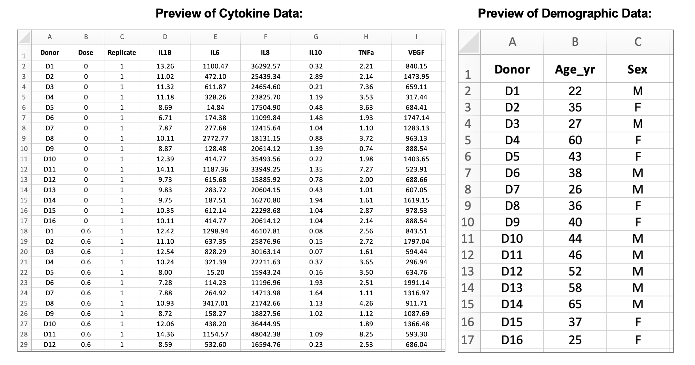

# 4.1 Overview of Experimental Design and Example Data 

This training module was developed by Elise Hickman, Sarah Miller, and Julia E. Rager.

All input files (script, data, and figures) can be downloaded from the [UNC-SRP TAME2 GitHub website](https://github.com/UNCSRP/TAME2).

## Introduction to Training Module

Converting wet lab experimentation data into dry lab analyses facilitates reproducibility and transparency in data analysis. This is helpful for consistency across members of the same research group, review of analyses by collaborators or reviewers, and implementation of similar future analyses. In comparison with analysis workflows that use subscription- or license-based applications, such as Prism or SAS, analysis workflows that leverage open-source programming languages such as R also increase accessibility of analyses. Additionally, scripted analyses minimize the risk for copy-paste error, which can occur when cleaning experimental data, transferring it to an analysis application, and exporting and formatting analysis results.

Some of the barriers in converting wet lab experimentation into dry lab analyses include data cleaning, selection and implementation of appropriate statistical tests, and reporting results. This chapter will provide introductory material guiding wet-bench scientists in R analyses, bridging the gap between commonly available R tutorials (which, while helpful, may not provide sufficient level of detail or relevant examples) and intensive data science workflows (which may be too detailed). 

In this module, we will provide an overview of key experimental design features and terms that will be used throughout this chapter, and we will provide a detailed overview of the example data. In the subsequent modules, we will dive into analyzing the example data.

## Replicates

One of the most important components of selecting an appropriate analysis is first understanding how data should be compared between samples, which often means addressing experimental replicates. There are two main types of replicates that are used in environmental health research: biological replicates and technical replicates. 

### Biological Replicates

Biological replicates are the preferred unit of statistical comparison because they represent biologically distinct samples, demonstrating biological variation in the system. What is considered to be a biological replicate can depend on what model system is being used. For example, in studies with human clinical samples or cells from different human donors, the different humans are considered the biological replicates. In studies using animals as model organisms, individual animals are typically considered biological replicates, although this can vary depending on the experimental design. In studies that use cell lines, which are derived from one human or animal and are modified to continuously grow in culture, a biological replicate could be either cells from different passages (different thawed aliquots) grown in completely separate flasks, all experimented with on the same day, or repeating an experiment on the same set of cells (one thawed aliquot) but on separate experimental days, so the cells have grown/replicated between experiments. 

The final "N" that you report should reflect your biological replicates, or independent experiments. What constitutes an independent experiment or biological replicate is highly field-, lab-, organism-, and endpoint-dependent, so make sure to discuss this within your research group in the experiment planning phase and again before your analysis begins. No matter what you choose, ensure that when you report your results, you are transparent about what your biological replicates are. For example, the below diagram (adapted from [BitesizeBio](https://bitesizebio.com/47982/n-number-cell-lines/)) illustrates different ways of defining replicates in experiments with cell lines: 

```{r, echo = FALSE, fig.align = "center", out.width = "650px"} 
knitr::include_graphics("Module4_1_Input/Module4_1_Image1.png")
```

N = 3 cells could be considered technical replicates if the endpoint of interest is very low throughput, such as single cell imaging or analyses. N = 3 cell culture wells is a more common approach to technical replicates and is typically used when one sample is collected from each well, such as in the case of media or cell lysate collection. Note that each well within the Week 1 biological replicate would be considered a technical replicate for Week 1's experiment. Similarly, each well within the Week 2 biological replicate would be considered a technical replicate for Week 2's experiment. For more on technical replicates, see the next section. 

Although N = 3 cell lines is a less common approach to biological replicates, some argue for this approach because each cell line is typically derived from one biological source. In this scenario, each of the cell lines would be unique but would represent the same cell type or lineage (e.g., for respiratory epithelium, A549, 16HBE, and BEAS-2B cell lines). 

Also note that to perform statistical analyses, an N of at least 3 biological replicates is needed, and an even higher N may be needed for a sufficiently powered study. Although power calculations are outside the scope of this module, we encourage you to use power calculation resources, such as [G*Power](https://www.psychologie.hhu.de/arbeitsgruppen/allgemeine-psychologie-und-arbeitspsychologie/gpower.html) to assist in selecting an appropriate N for your study. 


### Technical Replicates

Technical replicates are repeated measurements on the same sample or biological source, demonstrating the variation underlying protocols, equipment, and sample handling. In environmental health research, there can be technical replicates separately related to either the experimental design or the downstream analyses. Technical replicates related to experimental design refer to the chemical exposure for cell-based (*in vitro*) experiments, where there may be multiple wells of cells from the same passage or human/mouse exposed to the same treatment. Technical replicates related to downstream analyses refer to the endpoints that are measured after chemical exposure in each sample. To illustrate this, consider an experiment where cells from four unique human donors (D1-D4) are grown in cell culture plates, and then three wells of cells from each donor are exposed to a chemical treatment (Tx) or a vehicle control (Ctrl). The plate layout might look something like this, with technical replicates related to experimental design, i.e. chemical exposure, in the same color:

```{r, echo = FALSE, fig.align = "center", out.width = "500px"} 
knitr::include_graphics("Module4_1_Input/Module4_1_Image2.png")
```

For this experiment, we have four biological replicates (the four donors) and three technical exposure replicates per dose (because three wells from each donor were exposed to each condition). The technical replicates here capture potential unintended variation between wells in cell growth and chemical exposure.

Following the exposure of the cells to a chemical of interest, the media is collected from each well and assayed using a plate reader assay for concentrations of a marker of inflammation. For each sample collected (from each well), there are three technical replicates used to measure the concentration of the inflammatory marker. The purpose of these technical replicates is to capture potential unintended well-to-well variation in the plate reader assay. The plate layout might look something like this, ***with the letter and number in each well of the plate layout representing the well in the exposure plate layout that the media sample being assayed came from***:

```{r, echo = FALSE, fig.align = "center", out.width = "800px"} 

```


Technical replicates should typically be averaged before performing any statistical analysis. For the experiment described above, we would:

1. Average the technical replicates for the plate reader assay to obtain one value per original cell culture well for inflammatory marker concentration. 

2. Then, average the technical replicates for the chemical exposure to obtain one value per biological replicate (donor). 

This would result in a dataset with eight values (four control and four treatment) for statistical analysis. 

#### Number and inclusion of technical replicates

The above example is just one approach to experimental design. As mentioned above in the biological replicates section, selection of appropriate biological and technical replicates can vary greatly depending on your model organism, experimental design, assay, and standards in the field. For example, there may be cases where well-to-well variation for certain assays is minimal compared with variation between biological replicates, or when including technical replicates for each donor is experimentally or financially unfeasible, resulting in a lack of technical replicates. 

### Matched Experimental Design

Matching (also known as paired or repeated measures) in an experimental design is also a very important concept when selecting the appropriate statistical analysis. In experiments with matched design, multiple measurements are collected from the same biological replicate. This typically provides increased statistical power because changes are observed within each biological replicate relative to its starting point. In environmental health research, this can include study designs such as:

1. Samples were collected from the same individuals, animals, or cell culture wells pre- and post-exposure. 

2. Cells from the same biological replicate were exposed to different doses of a chemical.

The experimental design described above represents a matched design because cells from the same donor are exposed to both the treatment and the vehicle control.

## Orientation to Example Data for Chapter 4

In this chapter, we will be using an example dataset derived from an *in vitro*, or cell culture, experiment. Before diving into analysis of these data in the subsequent modules, we will provide an overview of where these data came from and preview what the input data frames look like.  

### Experimental Design

In this experiment, primary human bronchial epithelial cells (HBECs) from sixteen different donors were exposed to the gas acrolein, which is emitted from the combustion of fossil fuels, tobacco, wood, and plastic. Inhalation exposure to acrolein is associated with airway inhalation, and this study aimed to understand how exposure to acrolein changes secretion of markers of inflammation. Prior to experimentation, the HBECs were grown on a permeable membrane support for 24 days with air on one side and liquid media on the other side, allowing them to differentiate into a form that is very similar to what is found in the human body. The cells were then exposed for 2 hours to 0 (filtered air), 0.6, 1, 2, or 4 ppm acrolein, with two technical replicate wells from each donor per dose. Twenty-four hours later, the media was collected, and concentrations of inflammatory markers were measured using an [enzyme-linked immunosorbent assay (ELISA)](https://www.thermofisher.com/us/en/home/life-science/protein-biology/protein-biology-learning-center/protein-biology-resource-library/pierce-protein-methods/overview-elisa.html). 

```{r, echo = FALSE, fig.align = "center", out.width = "900px"} 
knitr::include_graphics("Module4_1_Input/Module4_1_Image4.png")
```

Note that this is a matched experimental design because cells from every donor were exposed to every concentration of acrolein, rather than cells from different donors being exposed to each of the different doses. 

### Starting Data 

Next, let's familiarize ourselves with the data that resulted from this experiment. There are two input data files, one that contains cytokine concentration data and one that contains demographic information about the donors:

```{r, echo = FALSE, fig.align = "center", out.width = "900px"} 

```

The cytokine data contains information about the cytokine measurements for each of the six proteins measured in the basolateral media for each sample (units = pg/mL), which can be identified by the donor, dose, and replicate columns. The demographic data contains information about the age and sex of each donor. In the subsequent modules, we'll be using these data to assess whether exposure to acrolein significantly changes secretion of inflammatory markers and whether donor characteristics, such as sex and age, modify these responses.

## Concluding Remarks

This module reviewed important components of experimental design, such as replicates and matching, which are critical for data pre-processing and selecting appropriate statistical tests. 

<label class="tykfont">
Test Your Knowledge 
</label>

:::tyk
Read the following experimental design descriptions. For each description, determine the number of biological replicates (per group), the number of technical replicates, and whether the experimental design is matched. 

1. One hundred participants are recruited to a study aiming to determine whether people who use e-cigarettes have different concentrations of inflammatory markers in their airways. Fifty participants are non e-cigarette users and 50 participants are e-cigarette users. After the airway samples are collected, each sample is analyzed with an ELISA, with three measurements taken per sample. 

2. Twenty mice are used in a study aiming to understand the effects of particulate matter on cardiovascular health. The mice are randomized such that half of the mice are exposed to filtered air and half are exposed to particulate matter. During the exposures, the mice are continuously monitored for endpoints such as heart rate and heart function. One month later, the mice that were exposed to particulate matter are exposed to filtered air, and the mice that were exposed to filtered air are exposed to particulate matter, with the same cardiovascular endpoints collected. 
:::