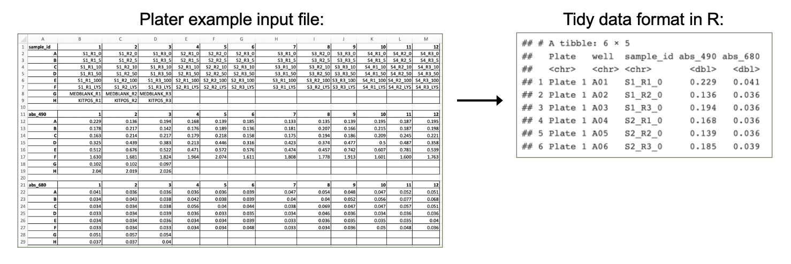

# 4.2 Data Import, Processing, and Summary Statistics 

This training module was developed by Elise Hickman, Alexis Payton, Sarah Miller, and Julia E. Rager.

All input files (script, data, and figures) can be downloaded from the [UNC-SRP TAME2 GitHub website](https://github.com/UNCSRP/TAME2).

## Introduction to Training Module

The first steps in any scripted analysis of wet-bench data include importing the data, cleaning the data to prepare for analyses, and conducting preliminary data exploration steps, such as addressing missing values, calculating summary statistics, and assessing normality. Although less exciting than diving right into the statistical analysis, these steps are crucial in guiding downstream analyses and ensuring accurate results. In this module, we will discuss each of these steps and work through them using an example dataset (introduced in **TAME 2.0 Module 4.1 Overview of Experimental Design and Example Data** of inflammatory markers secreted by airway epithelial cells after exposure to different concentrations of acrolein.

### Training Module's Environmental Health Questions

This training module was specifically developed to answer the following environmental health questions:

1. What is the mean concentration of each inflammatory biomarker by acrolein concentration?

2. Are our data normally distributed?

<br>

## Data Import

First, we need to import our data. Data can be imported into R from many different file formats, including .csv (as demonstrated in previous chapters), .txt, .xlsx, and .pdf. Often, data are formatted in Excel prior to import, and the [*openxlsx*](https://ycphs.github.io/openxlsx/) package provides helpful functions that allow the user to import data from Excel, create workbooks for storing results generated in R, and export data from R to Excel workbooks. Below, we will use the `read.xlsx()` function to import our data directly from Excel. Other useful packages include [*pdftools*](https://github.com/ropensci/pdftools) (PDF import),  [*tm*](https://cran.r-project.org/web/packages/tm/vignettes/tm.pdf) (text mining of PDFs), and [*plater*](https://cran.r-project.org/web/packages/plater/vignettes/plater-basics.html) (plate reader formatted data import).
```{r, echo = FALSE, fig.align = "center", out.width = "850px"} 

```

### Workspace Preparation and Data Import

#### Set working directory

In preparation, first let's set our working directory to the folder path that contains our input files:
```{r eval = FALSE}
setwd("/filepath to where your input files are")
```

#### Installing required R packages
If you already have these packages installed, you can skip this step, or you can run the below code which checks installation status for you
```{r, install_libs, echo=TRUE, eval=TRUE, warning=FALSE, results='hide', message=FALSE}
if (!requireNamespace("table1"))
  install.packages("table1");
if (!requireNamespace("vtable"))
  install.packages("vtable");
# some packages need to be installed through Bioconductor/ BiocManager
if (!require("BiocManager", quietly = TRUE))
    install.packages("BiocManager")
BiocManager::install("pcaMethods")
BiocManager::install("impute")
BiocManager::install("imputeLCMD")
```
#### Load required packages

And load required packages:
```{r message = FALSE}
library(openxlsx) # for importing Excel files
library(DT) # for easier viewing of data tables
library(tidyverse) # for data cleaning and graphing
library(imputeLCMD) # for data imputation with QRILC
library(table1) # for summary table
library(vtable) # for summary table
library(ggpubr) # for making Q-Q plots with ggplot 
```

#### Import example datasets

Next, let's read in our example datasets:
```{r}
biomarker_data <- read.xlsx("Module4_2_Input/Module4_2_InputData1.xlsx")
demographic_data <- read.xlsx("Module4_2_Input/Module4_2_InputData2.xlsx")
```

#### View example datasets

First, let's preview our example data. Using the `datatable()` function from the *DT* package allows us to interactively scroll through our biomarker data.
```{r}
datatable(biomarker_data)
```

We can see that our biomarker data are arranged with samples in rows and sample information and biomarker measurements in the columns. 
```{r}
datatable(demographic_data)
```

Our demographic data provide information about the donors that our cells came from, matching to the `Donor` column in our biomarker data. 

<br>

## Handling Missing Values

Next, we will investigate whether we have missing values and which variables and donors have missing values.
```{r}
# Calculate the total number of NAs per variable
biomarker_data %>% 
  summarise(across(IL1B:VEGF, ~sum(is.na(.))))

# Calculate the number of missing values per subject
biomarker_data %>%
  group_by(Donor) %>%
  summarise(across(IL1B:VEGF, ~sum(is.na(.))))
```

Here, we can see that we do have a few missing values. What should we do with these values?

### Missing Values and Data Imputation

#### Missing values

Before deciding what to do about our missing values, it's important to understand why they are missing. There are a few different types of missing values that could be present in a dataset:

1. **Missing completely at random (MCAR):** has nothing to do with the experimental unit being studied (e.g., a sample is damaged or lost in the lab)

2. **Missing at random (MAR):** there may be a systematic difference between missing and measured values, but they can be explained by observed differences in the data or experimental unit

3. **Missing not at random (MNAR):** data are missing due to factors that are not observed/measured (e.g., measurement for a specific endpoint is below the limit of detection (LOD) of an assay)

We know from the researchers who generated this dataset that the values are missing because these specific proteins were below the limit of detection for the assay for certain samples; therefore, our data are missing not at random. This can help us with our choice of imputation method, described below. 

#### Imputation

Imputation is the assignment of a value to a missing data point by inferring that value from other properties of the dataset or externally defined limits. Whether or not you should impute your data is not a one-size-fits-all approach and may vary depending on your field, experimental design, the type of data, and the type of missing values in your dataset. Two questions you can ask yourself when deciding whether or not to impute data are:

1. Is imputation needed for downstream analyses? *Some analyses are not permissive to including NAs or 0s; others are.* 

2. Will imputing values bias my analyses unnecessarily? *If so, consider analyzing subsets of the data that are complete separately.*


There are many different imputation methods (too many to cover them all in this module); here, we will introduce a few that we use most often. We encourage you to explore these in more depth and to understand typical imputation workflows for your lab, data type, and/or discipline. 

- For variables where imputed values are expected to be generally bound by the existing range of data (e.g., MCAR): [missForest](https://rpubs.com/lmorgan95/MissForest)

- For variables with samples below the limit of detection for the assay, such as for mass spectrometry or ELISAs (e.g., MNAR)
  - Replace non-detects with the limit of detection divided by the square root of 2
  - [Quantile Regression Imputation of Left-Censored Data (QRILC)](https://www.nature.com/articles/s41598-017-19120-0)
  - [GSimp](https://github.com/WandeRum/GSimp) (can also be used to impute values above a specific threshold)

If you do impute missing values, make sure to include both your raw and imputed data, along with detailed information about the imputation method, within your manuscript, supplemental information, and/or GitHub. You can even present summary statistics for both raw and imputed data for additional transparency. 

### Imputation of Our Data

Before imputing our data, it is a good idea to implement a background filter that checks to see if a certain percentage of values for each variable are missing. For variables with a very high percentage of missing values, imputation can be unreliable because there is not enough information for the imputation algorithm to reference. The threshold for what this percentage should be can vary by study design and the extent to which your data are subset into groups that may have differing biomarker profiles; however, a common threshold we frequently use is to remove variables with missing data for 25% or more of samples. 

We can use the following code to calculate the percentage values missing for each endpoint:
```{r}
biomarker_data %>% 
  summarise(across(IL1B:VEGF, ~sum(is.na(.))/nrow(biomarker_data)*100))
```

Here, we can see that only about 3-4% of values are missing for our variables with missing data, so we will proceed to imputation with our dataset as-is. 

We will impute values using QRILC, which pulls from the left side of the data distribution (the lower values) to impute missing values. We will write a function that will apply QRILC imputation to our dataframe. This function takes a dataframe with missing values as input and returns a dataframe with QRILC imputed values in place of NAs as output. 
```{r}
QRILC_imputation = function(df){
    # Normalize data before applying QRILC per QRILC documentation
    ## Select only numeric columns, psuedo log2 transform, and convert to a matrix
    ### 4 comes from there being 3 metadata columns before the numeric data starts
    QRILC_prep = df[,4:dim(df)[2]] %>% 
         mutate_all(., function(x) log2(x + 1)) %>%
         as.matrix()
    
    # QRILC imputation
    imputed_QRILC_object = impute.QRILC(QRILC_prep, tune.sigma = 0.1)
    QRILC_log2_df = data.frame(imputed_QRILC_object[1]) 
    
    # Converting back the original scale
    QRILC_df = QRILC_log2_df %>%
        mutate_all(., function(x) 2^x - 1)
    
    # Adding back in metadata columns
    QRILC_df = cbind(Donor = df$Donor,
                     Dose = df$Dose,
                     Replicate = df$Replicate,
                     QRILC_df)
    
   return(QRILC_df)
}
```

Now we can apply the `QRILC_imputation()` function to our dataframe. We use the function `set.seed()` to ensure that the QRILC function generates the same numbers each time we run the script. For more on setting seeds, see [here](https://www.statology.org/set-seed-in-r/).
```{r}
# Set random seed to ensure reproducibility in results
set.seed(1104)

# Apply function
biomarker_data_imp <- QRILC_imputation(biomarker_data)
```
<br>

## Averaging Replicates

The last step we need to take before our data are ready for analysis is averaging the two technical replicates for each donor and dose. We will do this by creating an ID column that represents the donor and dose together and using that column to group and average the data. This results in a dataframe where our rows contain data representing each biological replicate exposed to each of the five concentrations of acrolein. 
```{r}
biomarker_data_imp_avg <- biomarker_data_imp %>%
  
  # Create an ID column that represents the donor and dose
  unite(Donor_Dose, Donor, Dose, sep = "_") %>%
  
  # Average replicates with each unique Donor_Dose
  group_by(Donor_Dose) %>%
  summarize(across(IL1B:VEGF, mean)) %>%
  
  # Round results to the same number of significant figures as the original data
   mutate(across(IL1B:VEGF, \(x) round(x, 2))) %>%

  # Separate back out the Donor_Dose column
  separate(Donor_Dose, into = c("Donor", "Dose"), sep = "_")

# View new dataframe
datatable(biomarker_data_imp_avg)
```
<br>

## Descriptive Statistics

Generating descriptive statistics (e.g., mean, median, mode, range, standard deviation) can be helpful for understanding the general distribution of your data and for reporting results either in the main body of a manuscript/report (for small datasets) or in the supplementary material (for larger datasets). There are a number of different approaches that can be used to calculate summary statistics, including functions that are part of base R and that are part of packages. Here, we will demonstrate a few different ways to efficiently calculate descriptive statistics across our dataset. 

### Method #1 - Tidyverse and Basic Functions

The mean, or average of data points, is one of the most commonly reported summary statistics and is often reported as mean ± standard deviation to demonstrate the spread in the data. Here, we will make a table of mean ± standard deviation for each of our biomarkers across each of the dose groups using *tidyverse* functions. 
```{r}
# Calculate means
biomarker_group_means <- biomarker_data_imp_avg %>%
  group_by(Dose) %>%
  summarise(across(IL1B:VEGF, \(x) mean(x))) 

# View data
datatable(biomarker_group_means)
```

You'll notice that there are a lot of decimal places in our calculated means, while in our original data, there are only two decimal places. We can add a step to round the data to our above code chunk to produce cleaner results.
```{r}
# Calculate means
biomarker_group_means <- biomarker_data_imp_avg %>%
  group_by(Dose) %>%
  summarise(across(IL1B:VEGF, \(x) mean(x))) %>%
  mutate(across(IL1B:VEGF, \(x) round(x, 2)))

# View data
datatable(biomarker_group_means)
```

### Answer to Environmental Health Question 1
:::question
<i>With this, we can answer **Environmental Health Question 1**:</i> What is the mean concentration of each inflammatory biomarker by acrolein concentration?
:::

:::answer
**Answer:** With the above table, we can see the mean concentrations for each of our inflammatory biomarkers by acrolein dose. IL-8 overall has the highest concentrations, followed by VEGF and IL-6. For IL-1$\beta$, IL-8, TNF-$\alpha$, and VEGF, it appears that the concentration of the biomarker goes up with increasing dose. 
:::

We can use very similar code to calculate our standard deviations:
```{r}
# Calculate means
biomarker_group_sds <- biomarker_data_imp_avg %>%
  group_by(Dose) %>%
  summarise(across(IL1B:VEGF, \(x) sd(x))) %>%
  mutate(across(IL1B:VEGF, \(x) round(x, 1)))

# View data
datatable(biomarker_group_sds)
```

Now we've calculated both the means and standard deviations! However, these are typically presented as mean ± standard deviation. We can merge these dataframes by executing the following steps:

1. Pivot each dataframe to a long format, with each row containing the value for one biomarker at one dose.
2. Create a variable that represents each unique row (combination of `Dose` and `variable`).
3. Join the dataframes by row. 
4. Unite the two columns with mean and standard deviation, with `±` in between them.
5. Pivot the dataframe wider so that the dataframe resembles what we started with for the means and standard deviations. 

First, we'll pivot each dataframe to a long format and create a variable that represents each unique row. 
```{r}
# Pivot dataframes longer and create variable column for each row
biomarker_group_means_long <- pivot_longer(biomarker_group_means, 
                                           !Dose, names_to = "variable", values_to = "mean") %>%
  unite(Dose_variable, Dose, variable, remove = FALSE)

biomarker_group_sds_long <- pivot_longer(biomarker_group_means,
                                         !Dose, names_to = "variable", values_to = "sd") %>%
  unite(Dose_variable, Dose, variable, remove = FALSE)


# Preview what dataframe looks like
datatable(biomarker_group_means_long)
```

Next, we will join the mean and standard deviation datasets. Notice that we are only joining the `Dose_variable` and `sd` columns from the standard deviation dataframe to prevent duplicate columns (`Dose`, `variable`) from being included.
```{r}
# Merge the dataframes by row
biomarker_group_summstats <- left_join(biomarker_group_means_long, 
                                       biomarker_group_sds_long %>% select(c(Dose_variable, sd)), 
                                       by = "Dose_variable")

# Preview the new dataframe
datatable(biomarker_group_summstats)
```

Then, we can unite the mean and standard deviation columns and add the ± symbol between them by storing that character as a variable and pasting that variable in our `paste()` function. 
```{r}
# Store plus/minus character
plusminus <-"\u00b1"
Encoding(plusminus)<-"UTF-8"

# Create new column with mean +/- standard deviation
biomarker_group_summstats <- biomarker_group_summstats %>%
  mutate(mean_sd = paste(mean, plusminus, sd, sep = " "))

# Preview the new dataframe
datatable(biomarker_group_summstats)
```

Last, we can pivot the dataframe wider to revert it to its original layout, which is easier to read.
```{r}
# Pivot dataframe wider
biomarker_group_summstats <- biomarker_group_summstats %>%
  
  # Remove columns we don't need any more
  select(-c(Dose_variable, mean, sd)) %>%
  
  # Pivot wider
  pivot_wider(id_cols = Dose, names_from = "variable", values_from = "mean_sd")

# View final dataframe
datatable(biomarker_group_summstats)
```

These data are now in a publication-ready format that can be exported to a .txt, .csv., or .xlsx file for sharing. 

### Method #2 - Applying a List of Functions

Calculating our mean and standard deviation separately using *tidyverse* wasn't too difficult, but what if we want to calculate other descriptive statistics, such as minimum, median, and maximum? We could use the above approach, but we would need to make a separate dataframe for each and then merge them all together. Instead, we can use the `map_dfr()` function from the *purrr* package, which is also part of *tidyverse.* This function takes a list of functions you want to apply to your data and applies these functions over specified columns in the data. Let's see how it works:
```{r}
# Define summary functions
summary_functs <- lst(min, median, mean, max, sd)

# Apply functions to data, grouping by dose
# .id = "statistic" tells the function to create a column describing which statistic that row is reporting
biomarker_descriptive_stats_all <- map_dfr(summary_functs, 
                                           ~ summarize(biomarker_data_imp_avg %>% group_by(Dose),
                                                       across(IL1B:VEGF, .x)), .id = "statistic")

# View data
datatable(biomarker_descriptive_stats_all)
```

Depending on your final goal, descriptive statistics data can then be extracted from this dataframe and cleaned up or reformatted as needed to create a publication-ready table! 

### Other Methods

There are also packages that have been developed for specifically making summary tables, such as [*table1*](https://cran.r-project.org/web/packages/table1/vignettes/table1-examples.html) and [*vtable*](https://cran.r-project.org/web/packages/vtable/vignettes/sumtable.html). These packages can create summary tables in HTML format, which appear nicely in R Markdown and can be copied and pasted into Word. Here, we will briefly demonstrate how these packages work, and we encourage you to explore more using the package vignettes!

#### Table1

The *table1* package makes summary tables using the function `table1()`, which takes the columns that you want in the rows of the table on the left side of the first argument, followed by `|` and then the grouping variable. The output table can be customized in a number of ways, including what summary statistics are output and whether or not statistical comparisons are run between groups (see package vignette for more details). 
```{r}
# Get names of all of the columns to include in the table
paste(names(biomarker_data_imp_avg %>% select(IL1B:VEGF)), collapse=" + ")
```

```{r eval = FALSE}
# Make the table
table1(~ IL1B + IL6 + IL8 + IL10 + TNFa + VEGF | Dose, data = biomarker_data_imp_avg)
```

```{r, echo = FALSE, fig.align = "center", out.width = "850px"} 
knitr::include_graphics("Module4_2_Input/Module4_2_Image2.png")
```

#### Vtable

The *vtable* package includes the function `st()`, which can also be used to make HTML tables (and other output formats; see `out` argument). For example: 
```{r}
# HTML output
st(biomarker_data_imp_avg, group = 'Dose')

# Dataframe output
st(biomarker_data_imp_avg, group = 'Dose', out = 'return')
```

Similar to *table1*, see the package vignette for detailed information about how to customize tables using this package.

<br>

## Normality Assessment and Data Transformation

The last step we will take before beginning to test our data for statistical differences between groups (in the next module) is to understand our data's distribution through normality assessment. This will inform which statistical tests we will perform on our data. For more detail on normality testing, including detailed explanations of each type of normality assessment and explanations of the code underlying the following graphs and tables, see **TAME 2.0 Module 3.3 Normality Tests and Data Transformations**.

We'll start by looking at histograms of our data for qualitative normality assessment:
```{r message = FALSE, fig.align = 'center'}
# Set theme
theme_set(theme_bw())

# Pivot data longer to prepare for plotting
biomarker_data_imp_avg_long <- biomarker_data_imp_avg %>%
  pivot_longer(-c(Donor, Dose), names_to = "variable", values_to = "value")

# Make figure panel of histograms
ggplot(biomarker_data_imp_avg_long, aes(value)) +
  geom_histogram(fill = "gray40", color = "black", binwidth = function(x) {(max(x) - min(x))/25}) +
  facet_wrap(~ variable, scales = "free", nrow = 2) +
  labs(y = "# of Observations", x = "Value")
```

From these histograms, we can see that IL-1$\beta$ appears to be normally distributed, while the other endpoints do not appear to be normally distributed. 

We can also use Q-Q plots to assess normality qualitatively:
```{r fig.align = 'center'}
ggqqplot(biomarker_data_imp_avg_long, x = "value", facet.by = "variable", ggtheme = theme_bw(), scales = "free")
```

With this figure panel, we can see that most of the variables have very noticeable deviations from the reference, suggesting non-normal distributions.

To assess normality quantitatively, we can use the Shapiro-Wilk test. Note that the null hypothesis is that the sample distribution is normal, and a significant p-value means the distribution is non-normal.
```{r}
# Apply Shapiro Wilk test to dataframe
shapiro_res <-  apply(biomarker_data_imp_avg %>% select(IL1B:VEGF), 2, shapiro.test)

# Create results dataframe
shapiro_res <- do.call(rbind.data.frame, shapiro_res)

# Clean dataframe
shapiro_res <- shapiro_res %>% 
  
  ## Add normality conclusion
  mutate(normal = ifelse(p.value < 0.05, F, T)) %>%
  
  ## Remove columns that do not contain informative data
  select(c(p.value, normal)) 

# View cleaned up dataframe
datatable(shapiro_res)
```

### Answer to Environmental Health Question 2
:::question
<i>With this, we can answer **Environmental Health Question 2**:</i> Are our data normally distributed?
:::

:::answer
**Answer:** The results from the Shapiro-Wilk test demonstrate that the IL-1$\beta$ data are normally distributed, while the other variables are non-normally distributed. These results support the conclusions we made based on our qualitative assessment above with histograms and Q-Q plots. 
:::

### Log~2~ Transforming and Re-Assessing Normality

Log~2~ transformation is a common transformation used in environmental health research and can move data closer to a normal distribution. For more on data transformation, see **TAME 2.0 Module 3.3 Normality Tests and Data Transformations**. We will pseudo-log~2~ transform our data, which adds a 1 to each value before log~2~ transformation and ensures that resulting values are positive real numbers. Let's see if the log~2~ data are more normally distributed than the raw data. 
```{r}
# Apply log2 transformation to data
biomarker_data_imp_avg_log2 <- biomarker_data_imp_avg %>%
  mutate(across(IL1B:VEGF, ~ log2(.x + 1)))
```

Make histogram panel:
```{r fig.align = 'center'}
# Pivot data longer and make figure panel of histograms
biomarker_data_imp_avg_log2_long <- biomarker_data_imp_avg_log2 %>%
  pivot_longer(-c(Donor, Dose), names_to = "variable", values_to = "value")

# Make histogram panel
ggplot(biomarker_data_imp_avg_log2_long, aes(value)) +
  geom_histogram(fill = "gray40", color = "black", binwidth = function(x) {(max(x) - min(x))/25}) +
  facet_wrap(~ variable, scales = "free") +
  labs(y = "# of Observations", x = "Value")
```

Make Q-Q plot panel:
```{r fig.align = 'center'}
ggqqplot(biomarker_data_imp_avg_log2_long, x = "value", facet.by = "variable", ggtheme = theme_bw(), scales = "free")
```

Run Shapiro-Wilk test:
```{r}
# Apply Shapiro Wilk test
shapiro_res_log2 <-  apply(biomarker_data_imp_avg_log2 %>% select(IL1B:VEGF), 2, shapiro.test)

# Create results dataframe
shapiro_res_log2 <- do.call(rbind.data.frame, shapiro_res_log2)

# Clean dataframe
shapiro_res_log2 <- shapiro_res_log2 %>% 
  
  ## Add normality conclusion
  mutate(normal = ifelse(p.value < 0.05, F, T)) %>%
  
  ## Remove columns that do not contain informative data
  select(c(p.value, normal)) 

# View cleaned up dataframe
shapiro_res_log2
```

The histograms and Q-Q plots demonstrate that the log~2~ data are more normally distributed than the raw data. The results from the Shapiro-Wilk test also demonstrate that the the log~2~ data are more normally distributed as a whole than the raw data. Overall, the p-values, even for the variables that are still non-normally distributed, are much higher. 

So, should we proceed with the raw data or the log~2~ data? This depends on what analyses we plan to do. In general, it is best to keep the data in as close to its raw format as possible, so if all of our analyses are available with a non-parametric test, we could use our raw data. However, some statistical tests do not have a non-parametric equivalent, in which case it would likely be best to use the log~2~ transformed data. For subsequent modules, we will proceed with the log~2~ data for consistency; however, choices regarding normality assessment can vary, so be sure to discuss these choices within your research group before proceeding with your analysis. 

For more on decisions regarding normality, see **TAME 2.0 Module 3.3 Normality Tests and Data Transformations**. For more on parametric vs. non-parametric tests, see **TAME 2.0 Module 4.4 Two Group Comparisons and Visualizations** and **TAME 2.0 Module 4.5 Multi-Group Comparisons and Visualizations**.

<br>

## Concluding Remarks

Taken together, this module demonstrates important data processing steps necessary before proceeding with between-group statistical testing, including data import, handling missing values, averaging replicates, generating descriptive statistics tables, and assessing normality. Careful consideration and description of these steps in the methods section of a manuscript or report increases reproducibility of analyses and helps to improve the accuracy and statistical validity of subsequent statistical results. 

<br>

<label class="tykfont">
Test Your Knowledge 
</label>

:::tyk

Functional endpoints from these cultures were also measured. These endpoints were: 1) Membrane Permeability (MemPerm), 2) Trans-Epithelial Electrical Resistance (TEER), 3) Ciliary Beat Frequency (CBF), and 4) Expression of Mucin (MUC5AC). Work through the same processes demonstrated in this module using the provided data ("Module4_2_TYKInput.xlsx") to answer the following questions:

1. How many technical replicates are there for each dose? 
2. Are there any missing values? 
3. What are the average values for each endpoint by dose?
4. Are the raw data normally distributed? 
:::