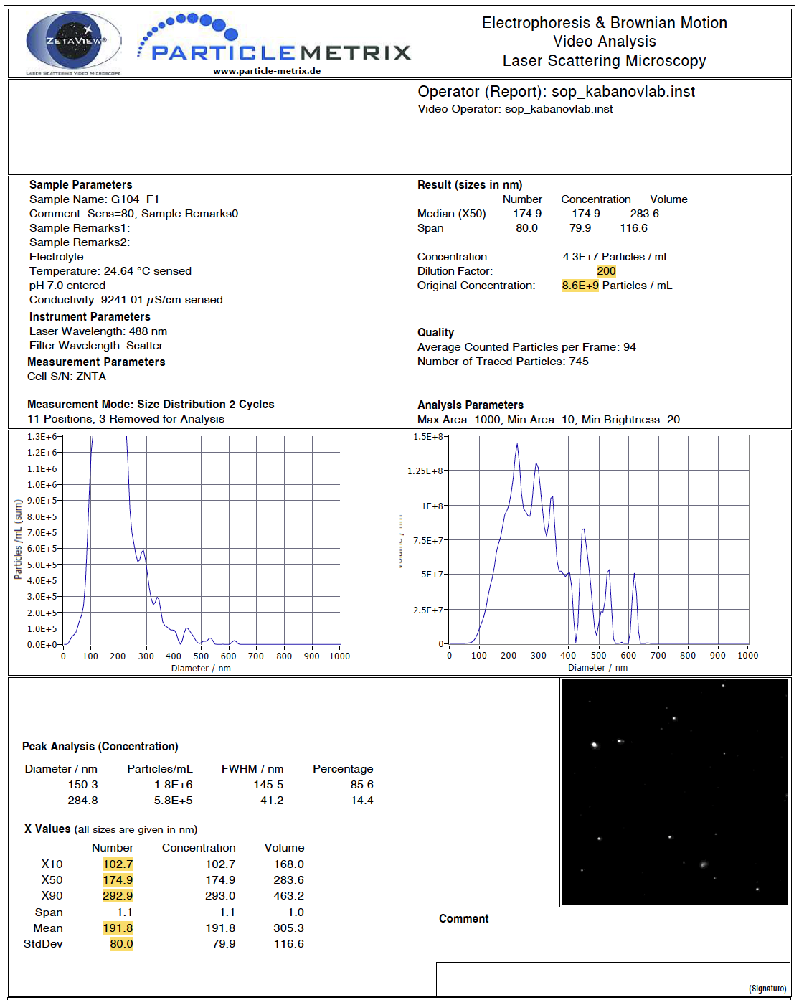
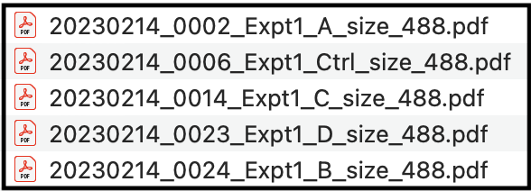
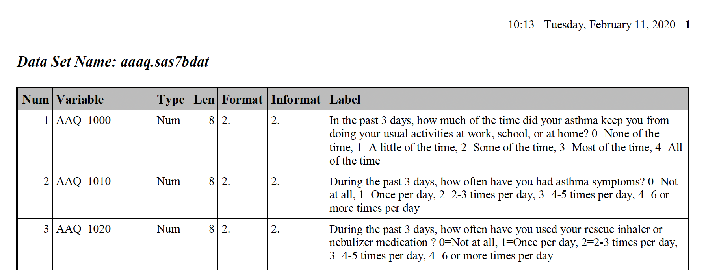

# 4.3 Data Import from PDF Sources

This training module was developed by Elise Hickman, Alexis Payton, and Julia E. Rager.

All input files (script, data, and figures) can be downloaded from the [UNC-SRP TAME2 GitHub website](https://github.com/UNCSRP/TAME2).

## Introduction to Training Module

Most tutorials for R rely on importing .csv, .xlsx, or .txt files, but there are numerous other file formats that can store data, and these file formats can be more difficult to import into R. PDFs can be particularly difficult to interface with in R because they are not formatted with defined rows/columns/cells as is done in Excel or .csv/.txt formatting.  In this module, we will demonstrate how to import data from from PDFs into R and format it such that it is amenable for downstream analyses or export as a table. Familiarity with *tidyverse*, for loops, and functions will make this module much more approachable, so be sure to review **TAME 2.0 Modules 2.3 Data Manipulation and Reshaping** and **2.4 Improving Coding Efficiencies** if you need a refresher. 

<br>

### Overview of Example Data

To demonstrate import of data from PDFs, we will be leveraging two example datasets, described in more detail in their respective sections later on in the module.

1. PDFs generated by Nanoparticle Tracking Analysis (NTA), a technique used to quantify the size and distribution of particles (such as extracellular vesicles) in a sample. We will be extracting data from an experiment in which epithelial cells were exposed to four different environmental chemicals or a vehicle control, and secreted particles were isolated and characterized using NTA. 

2. A PDF containing information about variables collected as part of a study whose samples are part of NIH's [BioLINCC Repository](https://biolincc.nhlbi.nih.gov/home/).

### Training Module's Environmental Health Questions

This training module was specifically developed to answer the following environmental health questions:

1. Which chemical(s) increase and decrease the concentration of particles secreted by epithelial cells? 
2. How many variables total are available to us to request from the study whose data are store in the repository, and what are these variables?

<br>

## Importing Data from Many Single PDFs with the Same Formatting

### Getting Familiar with the Example Dataset

The following example is based on extracting data from PDFs generated by Nanoparticle Tracking Analysis (NTA), a technique used to quantify the size and distribution of particles in a sample. Each PDF file is associated with one sample, and each PDF contains multiple values that we want to extract. Although this is a very specific type of data, keep in mind that this general approach can be applied to any data stored in PDF format - you will just need to make modifications based on the layout of your PDF file! 

For this example, we will be extracting data from 5 PDFs that are identically formatted but contain information unique to each sample. The samples represent particles isolated from epithelial cell media following an experiment where cells were exposed to four different environmental chemicals (labeled "A", "B", "C", and "D") or a vehicle control (labeled "Ctrl").

Here is what a full view of one of the PDFs looks like, with values we want to extract highlighted in yellow:
```{r echo = FALSE, out.width = "850px", fig.align = "center"}

```

Our goal is to extract these values and end up with a dataframe that looks like this, with each sample in a row and each variable in a column:
```{r echo = FALSE, message = FALSE}
# Loading packages
library(tidyverse)
library(openxlsx)
library(DT)

# Reading in data
ending_data <- read.xlsx("Module4_3_Input/Module4_3_InputData1.xlsx")

# Renaming some of the columns
ending_data <- ending_data %>%
  rename("Sample Identifier" = "Sample.Identifier", 
         "Experiment Number" = "Experiment.Number",
         "Dilution Factor" = "Dilution.Factor",
         "Concentration (Particles/mL)" = "Concentration.(Particles/.mL)")

datatable(ending_data)
```

If your files are not already named in a way that reflects unique sample information, such as the date of the experiment or sample ID, update your file names to contain this information before proceeding with the script. Here are the names for the example PDF files:
```{r, out.width = "400px", echo = FALSE, fig.align = 'center'}

```

<br>

### Workspace Preparation and Data Import

#### Installing and loading required R packages

If you already have these packages installed, you can skip this step, or you can run the below code which checks installation status for you. We will be using the *pdftools* and *tm* packages to extract text from the PDF. And instead of using `head()` to preview dataframes, we will be using the function `datatable()` from the *DT* package. This function produces interactive tables and generates better formatting for viewing dataframes that have long character strings (like the ones we will be viewing in this section).

```{r eval = FALSE}
if (!requireNamespace("pdftools"))
  install.packages("pdftools")
if (!requireNamespace("tm"))
  install.packages("tm")
if (!requireNamespace("DT"))
  install.packages("DT")
if (!requireNamespace("janitor"))
  install.packages("janitor")
```

Next, load the packages.
```{r warning = FALSE, message = FALSE}
library(tidyverse)
library(pdftools)
library(tm)
library(DT)
library(janitor)
```

#### Initial data import from PDF files

The following code stores the file names of all of the files in your directory that end in .pdf. To ensure that only PDFs of interest are imported, consider making a subfolder within your directory containing only the PDF extraction script file and the PDFs you want to extract data from.
```{r}
pdf_list <- list.files(path = "./Module4_3_Input", pattern = "488.pdf$")
```

We can see that each of our file names are now contained in the list.
```{r}
head(pdf_list)
```

Next, we need to make a dataframe to store the extracted data. The `PDF Identifier` column will store the file name, and the `Text` column will store extracted text from the PDF.
```{r}
pdf_raw <- data.frame("PDF Identifier" = c(), "Text" = c())
```

The following code uses a `for` loop to loop through each file (as stored in the pdf_list vector) and extract the text from the PDF. Sometimes this code generates duplicates, so we will also remove the duplicates with `distinct()`. 
```{r message = FALSE, warning = FALSE}
for (i in 1:length(pdf_list)){
    
    # Iterating through each pdf file and separating each line of text 
    document_text = pdf_text(paste("./Module4_3_Input/", pdf_list[i], sep = "")) %>% 
      strsplit("\n")
    
    # Saving the name of each PDF file and its text
    document = data.frame("PDF Identifier" = gsub(x = pdf_list[i], pattern = ".pdf", replacement = ""), 
        "Text" = document_text, stringsAsFactors = FALSE)
    
    colnames(document) <- c("PDF Identifier", "Text")
    
    # Appending the new text data to the dataframe
    pdf_raw <- rbind(pdf_raw, document) 
}

pdf_raw <- pdf_raw %>%
  distinct()
```

The new dataframe contains the data from all of the PDFs, with the `PDF Identifier` column containing the name of the input PDF file that corresponds to the text in the column next to it. 
```{r}
datatable(pdf_raw)
```


### Extracting Variables of Interest 

Specific variables of interest can be extracted from the `pdf_raw` dataframe by filtering the dataframe for rows that contain a specific character string. This character string could be the variable of interest (if that word or set of words is unique and only occurs in that one place in the document) or a character string that occurs in the same line of the PDF as your variable of interest. Examples of both of these approaches are shown below. 

It is important to note that there can be different numbers of spaces in each row and after each semicolon, which will change the `sep` argument for each variable. For example, there are a different number of spaces after the semicolon for "Dilution Factor" than there are for "Concentration" (see above PDF screen shot for reference). We will work through an example for the first variable of interest, dilution factor, in detail. 

First, we can see what the dataframe looks like when we just filter rows based on keeping only rows that contain the string "Dilution Factor" in the text column using the `grepl()` function. 
```{r}
dilution_factor_df <- pdf_raw %>%
  filter(grepl("Dilution Factor", Text))

datatable(dilution_factor_df)
```

The value we are trying to extract is at the end of a long character string. We will want to use the tidyverse function `separate()` to isolate those values, but we need to know what part of the character string will separate the dilution factor values from the rest of the text. To determine this, we can call just one of the data cells and copy the semicolon and following spaces for use in the `separate()` function. 
```{r}
# Return the value in the first row and second column.
dilution_factor_df[1,2]
```

Building on top of the previous code, we can now separate the dilution factor value from the rest of the text in the string. The `separate()` function takes an input data column and separates it into two or more columns based on the character passed to the separation argument. Here, everything before the separation string is discarded by setting the first new column to NA. Everything after the separation string will be stored in a new column called `Dilution Factor`, The starting `Text` column is removed by default.
```{r}
dilution_factor_df <- pdf_raw %>%
  filter(grepl("Dilution Factor", Text)) %>%
  separate(Text, into = c(NA, "Dilution Factor"), sep = ":                     ")

datatable(dilution_factor_df)
```

For the "Original Concentration" variable, we filter rows by the string "pH" because the word concentration is found in multiple locations in the document. 
```{r}
concentration_df = pdf_raw %>%
    filter(grepl("pH", Text)) %>% 
    separate(Text, c(NA, "Concentration"), sep = ":        ") 

datatable(concentration_df)
```

With the dilution factor variable, there were no additional characters after the value of interest, but here, "Particles / mL" remains and needs to be removed so that the data can be used in downstream analyses. We can add an additional cleaning step to remove "Particles / mL" from the data and add the units to the column title. `sep = " P"` refers to the space before and first letter of the string to be removed.
```{r}
concentration_df = pdf_raw %>%
    filter(grepl("pH", Text)) %>% 
    separate(Text, c(NA, "Concentration"), sep = ":        ") %>%
    separate(Concentration, c("Concentration (Particles/ mL)", NA), sep = " P")

datatable(concentration_df)
```

Next, we want to extract size distribution data from the lower table. Note that the space in the first `separate()` function comes from the space between the "Number" and "Concentration" column in the string, and the space in the second `separate()` function comes from the space between the variable name and the number of interest.  We can also convert values to numeric since they are currently stored as characters.
```{r}
size_distribution_df = pdf_raw %>%
    filter(grepl("X10", Text)| grepl("X50 ", Text)| grepl("X90", Text) | grepl("Mean", Text)| grepl("StdDev", Text)) %>%
    separate(Text, c("Text", NA), sep = "                ") %>%
    separate(Text, c("Text", "Size"), sep = "       ") %>%
    mutate(Size = as.numeric(Size)) %>%
    pivot_wider(names_from = Text, values_from = Size)

datatable(size_distribution_df)
```

### Creating the final dataframe

Now that we have created dataframes for all of the variables that we are interested in, we can join them together into one final dataframe.
```{r}
# Make list of all dataframes to include
all_variables <- list(dilution_factor_df, concentration_df, size_distribution_df)

# Combine dataframes using reduce function. Sometimes, duplicate rows are generated by full_join.  
full_df = all_variables %>%
  reduce(full_join, by = "PDF Identifier") %>%
  distinct()

# View new dataframe
datatable(full_df)
```

For easier downstream analysis, the last step is to separate the `PDF Identifier` column into an informative sample ID that matches up with other experimental data. 
```{r}
final_df <- full_df %>%
  separate('PDF Identifier', 
           # Split sample identifier column into new columns, retaining the original column
           into = c("Date", "FileNumber", "Experiment Number", "Sample_ID", "Size", "Wavelength"), sep = "_", remove = FALSE) %>%
  select(-c(FileNumber, Size)) %>% # Remove uninformative columns
  mutate(across('Dilution Factor':'StdDev', as.numeric)) # Change variables to numeric where appropriate

datatable(final_df)
```

Let's make a graph to help us answer Environmental Health Question 1. 
```{r message = FALSE}
theme_set(theme_bw())

data_for_graphing <- final_df %>%
  clean_names()

data_for_graphing$sample_id <- factor(data_for_graphing$sample_id, levels = c("Ctrl", "A", "B", "C", "D"))

ggplot(data_for_graphing, aes(x = sample_id, y = concentration_particles_m_l)) +
  geom_bar(stat = "identity", fill = "gray70", color = "black") +
  ylab("Particle Concentration (Particles/mL)") +
  xlab("Exposure")
```

:::question
*With this, we can answer **Environmental Health Question #1***: Which chemical(s) increase and decrease the concentration of particles secreted by epithelial cells?
:::

:::answer
**Answer**: Chemicals B and C appear to increase the concentration of secreted particles. However, additional replicates of this experiment are needed to assess statistical significance.
:::

<br>

## Importing Data Stored in PDF Tables

The above workflow is useful if you just want to extract a few specific values from PDFs, but isn't as useful if data are already in a table format in a PDF. The [*tabulapdf package*](https://github.com/ropensci/tabulapdf) provides helpful functions for extracting dataframes from tables in PDF format.

### Getting Familiar with the Example Dataset

The following example is based on extracting dataframes from a long PDF containing many individual data tables. This particular PDF came from the NIH's BioLINCC Repository and details variables that researchers can request from the repository. Variables are part of larger datasets that contain many variables, with each dataset in a separate table. All of the tables are stored in one PDF file, and some of the tables are longer than one page (this will become relevant later on!). Similar to the first PDF workflow, remember that this is a specific example intended to demonstrate how to work through extracting data from PDFs. Modifications will need to be made for differently formatted PDFs.

Here is what the first three pages of our 75-page starting PDF look like:
```{r echo = FALSE, out.width = "850px", fig.align = "center"}
knitr::include_graphics("Module4_3_Input/Module4_3_Image3.png")
```

If we zoom in a bit more on the first page, we can see that the dataset name is defined in bold above each table. This formatting is consistent throughout the PDF. 
```{r echo = FALSE, out.width = "850px", fig.align = "center"}

```

The zoomed in view also allows us to see the columns and their contents more clearly. Some are more informative than others. The columns we are most interested in are listed below along with a description to guide you through the contents. 

- `Num`: The number assigned to each variable in the dataset. This numbering restarts with 1 for each table.
- `Variable`: The variable name.
- `Type`: The type (or class) of the variable, either numeric or character.
- `Label`: A description of the variable and values associated with the variable. 

After extracting the data, we want to end up with a dataframe that contains all of the variables, their corresponding columns, and a column that indicates which dataset the variable is associated with:
```{r echo = FALSE}
biolincc_final <- read.xlsx("Module4_3_Input/Module4_3_InputData3.xlsx") %>%
  clean_names()

datatable(biolincc_final)
```

### Workspace Preparation and Data Import

#### Installing and loading required R packages

Similar to previous sections, we need to install and load a few packages before proceeding. The *tabulapdf* package needs to be installed in a specific way as shown below and can sometimes be difficult to install on Macs. If errors are produced, follow the troubleshooting tips outlined in [this](https://stackoverflow.com/questions/67849830/how-to-install-rjava-package-in-mac-with-m1-architecture) Stack Overflow solution.

```{r eval = FALSE}
# To install all of the packages except for tabulapdf
if (!requireNamespace("stringr"))
  install.packages("stringr")
if (!requireNamespace("pdftools"))
  install.packages("pdftools")
if (!requireNamespace("rJava"))
  install.packages("rJava")
```

```{r message = FALSE}
# To install tabulapdf
if (!require("remotes")) {
    install.packages("remotes")
}

library(remotes)

remotes::install_github(c("ropensci/tabulizerjars", "ropensci/tabulapdf"), force=TRUE, INSTALL_opts = "--no-multiarch")
```

Load packages:
```{r message = FALSE}
library(tabulapdf) 
library(tidyverse) 
library(janitor) 
library(pdftools) 
library(stringr)
```

#### Initial data import from PDF file

The `extract_tables()` function automatically extracts tables from PDFs and stores them as tibbles (a specific tidyverse data structure similar to a dataframe) within a list. One table is extracted per page, even if the table spans multiple pages. This line of code can take a few seconds to run depending on the length of your PDF.
```{r}
tables <- extract_tables("Module4_3_Input/Module4_3_InputData4.pdf", output = "tibble")
```

Glimpsing the first three elements in the tables list, we can see that each list element is a dataframe containing the columns from the PDF tables. 
```{r}
glimpse(tables[1:3])
```

Exploring further, here is how each dataframe is formatted:
```{r}
datatable(tables[[1]])
```

Notice that, although the dataframe format mirrors the PDF table format, the label column is stored across multiple rows with NAs in the other columns of that row because the text was across multiple lines. In our final dataframe, we will want the entire block of text in one cell. We can also remove the "Len", "Format", and "Informat" columns because they are not informative and they are not found in every table. Next, we will walk through how to clean up this table using a series of steps in tidyverse. 

### Cleaning dataframes

First, we will select the columns we are interested in and use the `fill()` function to change the NAs in the "Num" column so that each line of text in the "Label" column has the correct "Num" value in the same row. 
```{r}
cleaned_table1 <- data.frame(tables[[1]]) %>% # Extract the first table in the list
  
  # Select only the columns of interest
  select(c(Num, Variable, Type, Label)) %>% 
  
  # Change the "Num" column to numeric, which is required for the fill function
  mutate(Num = as.numeric(Num)) %>% 
  
  # Fill in the NAs in the "Num" column down the column
  fill(Num, .direction = "down") 

datatable(cleaned_table1)
```

We still need to move all of the Label text for each variable into one cell in one row instead of across multiple rows. For this, we can use the `unlist()` function. Here is a demonstration of how the `unlist()` function works using just the first variable:
```{r}
cleaned_table1_var1 <- cleaned_table1 %>%
  
  # Filter dataframe to just contain rows associated with the first variable
  filter(Num == 1) %>% 
  
  # Paste all character strings in the Label column with a space in between them into a new column called "new_label"
  mutate(new_label =  paste(unlist(Label), collapse = " ")) 

datatable(cleaned_table1_var1)
```

We now have all of the text we want in one cell, but we have duplicate rows that we don't need. We can get rid of these rows by assigning blank values "NA" and then omitting rows that contain NAs.
```{r warning = FALSE}
cleaned_table1_var1 <- cleaned_table1_var1 %>%
  mutate(across(Variable, na_if, ""))  %>%
    na.omit()

datatable(cleaned_table1_var1)
```

We need to apply this code to the whole dataframe and not just one variable, so we can add `group_by(Num)` to our cleaning workflow, followed by the code we just applied to our filtered dataframe.
```{r warning = FALSE}
cleaned_table1 <- data.frame(tables[[1]]) %>% # Extract the first table in the list
  
  # Select only the columns of interest
  select(c(Num, Variable, Type, Label)) %>% 
  
  # Change the "Num" column to numeric, which is required for the fill function
  mutate(Num = as.numeric(Num)) %>% 
  
  # Fill in the NAs in the "Num" column down the column
  fill(Num, .direction = "down") %>% 
  
  # Group by variable number
  group_by(Num) %>% 
  # Unlist the text replace the text in the "Label" column with the unlisted text
  mutate(Label = paste(unlist(Label), collapse =" ")) %>% 
  
  # Make blanks in the "Variable" column into NAs
  mutate(across(Variable, na_if, ""))  %>% 
  
  # Remove rows with NAs
  na.omit() 

datatable(cleaned_table1)
```

Ultimately, we need to clean up each dataframe in the list the same way, and we need all of the dataframes to be in one dataframe, instead of in a list. There are a couple of different ways to do this. Both rely on the code shown above for cleaning up each dataframe. Option #1 uses a for loop, while Option #2 uses application of a function on the list of dataframes. Both result in the same ending dataframe!

**Option #1**
```{r warning = FALSE}
# Create a dataframe for storing variables
variables <- data.frame()

# Make a for loop to format each dataframe and add it to the variables 
for (i in 1:length(tables)) {
  
  table <- data.frame(tables[[i]]) %>%
    select(c(Num, Variable, Type, Label)) %>%
    mutate(Num = as.numeric(Num)) %>%
    fill(Num, .direction = "down") %>%
    group_by(Num) %>%
    mutate(Label = paste(unlist(Label), collapse =" ")) %>%
    mutate(across(Variable, na_if, ""))  %>%
    na.omit()

  variables <- bind_rows(variables, table)
}

# View resulting dataframe
datatable(variables)
```

**Option #2**
```{r warning = FALSE}
# Write a function that applies all of the cleaning steps to an dataframe (output = cleaned dataframe)
clean_tables <- function(data) {
  
  data <- data %>%
    select(c(Num, Variable, Type, Label)) %>%
    mutate(Num = as.numeric(Num)) %>%
    fill(Num, .direction = "down") %>%
    group_by(Num) %>%
    mutate(Label = paste(unlist(Label), collapse =" ")) %>%
    mutate(across(Variable, na_if, ""))  %>%
    na.omit()
  
  return(data)
}

# Apply the function over each table in the list of tables 
tables_clean <- lapply(X = tables, FUN = clean_tables)

# Unlist the dataframes and combine them into one dataframe
tables_clean_unlisted <- do.call(rbind, tables_clean)

# View resulting dataframe
datatable(tables_clean_unlisted)
```

### Adding Dataset Names

We now have a dataframe with all of the information from the PDFs contained in one long table. However, now we need to add back in the label on top of each table. We can't do this with the *tabulapdf* package because the name isn't stored in the table. But we can use the *pdftools* package for this! 

First, we will read in the pdf using the PDF tools package. This results in a vector containing a long character string for each page of the PDF. Notice a few features of these character strings: 

+ Each line is separated by `\n`
+ Elements [1] and [2] of the vector contain the text "dataset Name:", while element [3] does not because the third page was a continuation of the table from the second page and therefore did not have a table title. 

```{r}
table_names <- pdf_text("Module4_3_Input/Module4_3_InputData4.pdf")

head(table_names[1:3])
```

Similar to the table cleaning section, we will work through an example of extracting the text of interest from one of these character vectors, then apply the same code to all of the character vectors. First, we will select just the first element in the vector and make it into a dataframe.
```{r}
# Create dataframe
dataset_name_df_var1 <- data.frame(strsplit(table_names[1], "\n"))

# Clean column name
colnames(dataset_name_df_var1) <- c("Text")

# View dataframe
datatable(dataset_name_df_var1)
```

Next, we will extract the dataset name using the same approach used in extracting values from the nanoparticle tracking example above and assign the name to a variable. We filter by the string "Data Set Name" because this is the start of the text string in the row where our dataset name is stored and is the same across all of our datasets. 
```{r}
# Create dataframe
dataset_name_df_var1 <- dataset_name_df_var1 %>%
  filter(grepl("Data Set Name", dataset_name_df_var1$Text)) %>%
  separate(Text, into = c(NA, "dataset"), sep = "Data Set Name: ")

# Assign variable
dataset_name_var1 <- dataset_name_df_var1[1,1]

# View variable name
dataset_name_var1
```

Now that we have the dataset name stored as a variable, we can create a dataframe that will correspond to the rows in our `variables` dataframe. The challenge is that each dataset contains a different number of variables! We can determine how many rows each dataset contains by returning to our `variables` dataframe and calculating the number of rows associated with each dataset. The following code splits the `variables` dataframe into a list of dataframes by each occurrence of 1 in the "Num" column (when the numbering restarts for a new dataset).
```{r}
# Calculate the number of rows associated with each dataset for reference
dataset_list <- split(variables, cumsum(variables$Num == 1))

glimpse(dataset_list[1:3])
```

The number of rows in each list is the number of variables in that dataset. We can use this value in creating our dataframe of dataset names.
```{r}
# Store the number of rows in a variable
n_rows = nrow(data.frame(dataset_list[1]))
  
# Repeat the dataset name for the number of variables there are 
dataset_name_var1 = data.frame("dataset_name" = rep(dataset_name_var1, times = n_rows))

# View data farme
datatable(dataset_name_var1)
```

We now have a dataframe that can be joined with our `variables` dataframe for the first table. We can apply this approach to each table in our original PDF using a `for` loop.
```{r}
# Make dataframe to store dataset names
dataset_names <- data.frame()

# Create list of datasets
dataset_list <- split(variables, cumsum(variables$Num == 1))

# Remove elements from the table_names vector that do not contain the string "Data Set Name"
table_names_filtered <- stringr::str_subset(table_names, 'Data Set Name')

# Populate dataset_names dataframe
for (i in 1:length(table_names_filtered)) {
  
  # Get dataset name
  dataset_name_df <- data.frame(strsplit(table_names_filtered[i], "\n"))
  
  base::colnames(dataset_name_df) <- c("Text")
  
  dataset_name_df <- dataset_name_df %>%
    filter(grepl("Data Set Name", dataset_name_df$Text)) %>%
    separate(Text, into = c(NA, "dataset"), sep = "Data Set Name: ")

  dataset_name <- dataset_name_df[1,1]
  
  # Determine number of variables in that dataset
  data_set <- data.frame(dataset_list[i])
  n_rows = nrow(data_set)
  
  # Repeat the dataset name for the number of variables there are 
  dataset_name = data.frame("Data Set Name" = rep(dataset_name, times = n_rows))
  
  # Bind to dataframe
  dataset_names <- bind_rows(dataset_names, dataset_name) 
  
}


# Rename column
colnames(dataset_names) <- c("Data Set Name")

# View 
datatable(dataset_names)
```

### Combining Dataset Names and Variable Information

Last, we will merge together the dataframe containing dataset names and variable information.
```{r}
# Merge together
final_variable_df <- cbind(dataset_names, variables) %>%
  rename("Variable Description" = "Label", "Variable Number Within Dataset" = "Num") %>%
  clean_names()

datatable(final_variable_df)
```

We can also determine how many total variables we have, all of which are accessible via the table we just generated.  
```{r}
# Total number of variables
nrow(final_variable_df)

# Total number of variables
```

:::question
*With this, we can answer **Environmental Health Question #2***: How many variables total are available to us to request from the study whose data are stored in the repository, and what are these variables?
:::

:::answer
**Answer**: There are 1190 variable available to us. We can browse through the variables, including the sub-table they were from, the type of variable they are, and how they were derived using the table we generated.
:::

<br>

## Concluding Remarks

This training module provides example case studies demonstrating how to import PDF data into R and clean it so that it is more useful and accessible for analyses. The approaches demonstrated in this module, though specific to our specific example data, can be adapted to many different types of PDF data. 

<br>

<label class="tykfont">
Test Your Knowledge 
</label>

:::tyk
Using the same input files that we used in part 1, "Importing Data from Many Single PDFs with the Same Formatting", found in the Module4_3_TYKInput folder, extract the remaining variables of interest (Original Concentration and Positions Removed) from the PDFs and summarize them in one dataframe. 
:::
