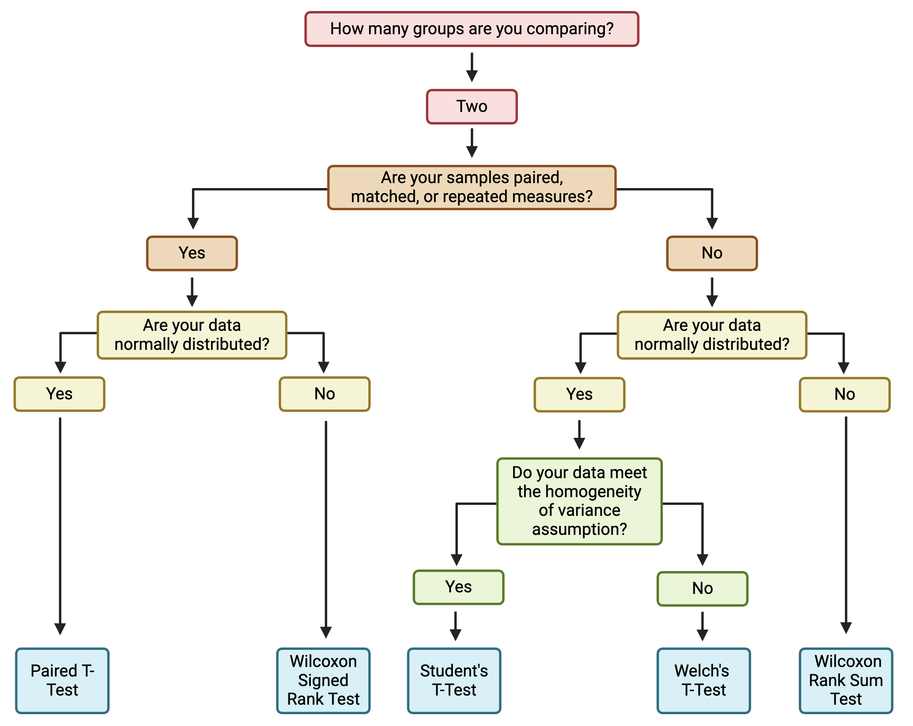

# 4.4 Two Group Comparisons and Visualizations

This training module was developed by Elise Hickman, Alexis Payton, and Julia E. Rager.

All input files (script, data, and figures) can be downloaded from the [UNC-SRP TAME2 GitHub website](https://github.com/UNCSRP/TAME2).

## Introduction to Training Module

Two group statistical comparisons, in which we want to know whether the means between two different groups are significantly different, are some of the most common statistical tests in environmental health research and even biomedical research as a field. In this training module, we will demonstrate how to run two group statistical comparisons and how to present publication-quality figures and tables of these results. We will continue to use the same example dataset as used in this chapter's previous modules, which represents concentrations of inflammatory biomarkers secreted by airway epithelial cells after exposure to different concentrations of acrolein.

### Training Module's Environmental Health Questions

This training module was specifically developed to answer the following environmental health questions:

1. Are there significant differences in inflammatory biomarker concentrations between cells from male and female donors at baseline?
2. Are there significant differences in inflammatory biomarker concentrations between cells exposed to 0 and 4 ppm acrolein?

### Workspace Preparation and Data Import

Here, we will import the processed data that we generated at the end of **TAME 2.0 Module 4.2 Data Import, Processing, and Summary Statistics**. These data, along with the associated demographic data, were introduced in **TAME 2.0 Module 4.1 Overview of Experimental Design and Example Data**. These data represent log~2~ concentrations of inflammatory biomarkers secreted by airway epithelial cells after exposure to four different concentrations of acrolein (plus filtered air as a control). We will also load packages that will be needed for the analysis, including previously introduced packages such as *openxlsx*, *tidyverse*, *DT*, and *ggpubr*, and additional packages relevant to statistical analysis and graphing that will be discussed in greater detail below. 
```{r message = FALSE}
# Load packages
library(openxlsx)
library(tidyverse)
library(DT)
library(rstatix)
library(ggpubr)
```

```{r}
# Import data
biomarker_data <- read.xlsx("Module4_4_Input/Module4_4_InputData1.xlsx")
demographic_data <- read.xlsx("Module4_4_Input/Module4_4_InputData2.xlsx")

# View data
datatable(biomarker_data)
datatable(demographic_data)
```

<br>

## Overview of Two Group Statistical Tests

Before applying statistical tests to our data, let's first review common two group statistical tests, their underlying assumptions, and variations on these tests. 

### Common Tests

The two most common two group statistical tests are the...

+ **T-test** (also known as the student's t-test) and the 
+ **Wilcoxon test** (also known as the Wilcox test, Wilcoxon test, or Mann Whitney test) 

Both of these tests are testing the null hypothesis that the means of the two populations (groups) are the same; the alternative hypothesis is that they are not the same. A significant p-value means that we can reject the null hypothesis that the means of the two groups are the same. Whether or not a p-value meets criteria for significance is experiment-specific, though commonly implemented p-value filters for significance include p<0.05 and p<0.01. P-values can also be called alpha values, and they indicate the probability of a **type I error**, or false positive, where the null hypothesis is rejected despite it actually being true. On the other hand, a **type II error**, or false negative, occurs when the null hypothesis is not rejected when it actually should have been. 

### Assumptions

The main difference between these two tests is in the assumption about the underlying distribution of the data. T-tests assume that the data are pulled from a normal distribution, while Wilcoxon tests do not assume that the data are pulled from a normal distribution. Therefore, it is most appropriate to use a t-test when data are, in general, normally distributed and a Wilcoxon test when data are not normally distributed. 

Additional assumptions underlying t-tests and Wilcoxon test are:

- The dependent variable is continuous or ordinal (discrete, ordered values).
- The data is collected from a representative, random sample.

T-tests also assume that:

- The standard deviations of the two groups are approximately equal (also called homogeneity of variance).

### When to Use a Parametric vs Non-Parametric Test?

Deciding whether to use a parametric or non-parametric test isn't a one size fits all approach, and the decision should be made holistically for each dataset. Typically, parametric tests should be used when the data are normally distributed, continuous, random sampled, without extreme outliers, and representative of independent samples or participants. A non-parametric test can be used when the sample size (*n*) is small, outliers are present in the dataset, and/or the data are not normally distributed. 

This decision matters more when dealing with smaller sample sizes (*n*<10) as smaller sample sizes are more prone to being skewed, and parametric tests are more sensitive to outliers. Therefore, when dealing with a smaller *n*, it might be best to perform a data transformation as discussed in **TAME 2.0 Module 3.3 Normality Testing & Data Transformations** and then perform a parametric test if more parametric assumptions are able to be met, or to use non-parametric tests. For larger sample sizes (*n*>50), outliers can potentially be removed and the dataset can be retested for assumptions. Lastly, what's considered "small" or "large" in regards to sample size can be subjective and should be taken into consideration within the context of the experiment. 

### Variations

**Unequal Variance:** When the assumption of homogeneity of variance is not met, a Welch's t-test is generally preferred over a student's t-test. This can be implemented easily by setting `var.equal = FALSE` as an argument to the function executing the t-test (e.g., `t.test()`, `t_test()`). For more on testing homogeneity of variance in R, see [here](https://www.datanovia.com/en/lessons/homogeneity-of-variance-test-in-r/).

**Paired vs Unpaired:** Variations on the t-test and Wilcoxon test are used when the experimental design is paired (also called repeated measures or matching). This occurs when there are different treatments, exposures, or time points collected from the same biological/experimental unit. For example, cells from the same donor or passage number exposed to different concentrations of a chemical represents a paired design. Matched/paired experiments have increased power to detect significant differences because samples can be compared back to their own controls. 

**One vs Two-Sided:** A one-sided test evaluates the hypothesis that the mean of the treatment group significantly differs in a specific direction from the control. A two-sided test evaluates the hypothesis that the mean of the treatment group significantly differs from the control but does not specify a direction for that change. A two-sided test is the preferred approach and the default in R because, typically, either direction of change is possible and represents an informative finding. However, one-sided tests may be appropriate if an effect can only possibly occur in one direction. This can be implemented by setting `alternative = "one.sided"` within the statistical testing function. 

### Which test should I choose?

We provide the following flowchart to help guide your choice of statistical test to compare two groups:
```{r, echo = FALSE, fig.align = "center", out.width = "800px"} 

```

<br>

## Statistical vs. Biological Significance

Another important topic to discuss before proceeding to statistical testing is the true meaning of statistical significance. Statistical significance simply means that it is unlikely that the patterns being observed are due to random chance. However, just because an effect is statistically significant does not mean that it is biologically significant (i.e., has notable biological consequences). Often, there also needs to be a sufficient magnitude of effect (also called effect size) for the effects on a system to be meaningful. Although a p-value < 0.05 is often considered the threshold for significance, this is just a standard threshold set to a generally "acceptable" amount of error (5%). What about a p-value of 0.058 with a very large biological effect? Accounting for effect size is also why filters such as log~2~ fold change are often applied alongside p-value filters in -omics based analysis. 

In discussions of effect size, the population size is also a consideration - a small percentage increase in a very large population can represent tens of thousands of individuals (or more). Another consideration is that we frequently do not know what magnitude of biological effect should be considered "significant." These discussions can get complicated very quickly, and here we do not propose to have a solution to these thought experiments; rather, we recommend considering both statistical and biological significance when interpreting data. And, as stated in other sections of TAME, transparent reporting of statistical results will aid the audience in interpreting the data through their preferred perspectives. 

<br>

## Unpaired Test Example

We will start by performing a statistical test to determine whether there are significant differences in biomarker concentrations between male and female donors at baseline (0 ppm exposure). Previously we determined that the majority of our data was non-normally distributed (see **TAME 2.0 Module 4.2 Data Import, Processing, and Summary Statistics**), so we'll skip testing for that assumption in this module. Based on those results, we will use the Wilcoxon test to determine if there are significant differences between groups. The Wilcoxon test does not assume homogeneity of variance, so we do not need to test for that prior to applying the test. This is an unpaired analysis because samples collected from the cells derived from male and female donor cells are different sets of cells (i.e., independent from each other). Thus, the specific statistical test applied will be the Wilcoxon Rank Sum test. 
First, we will filter our dataframe to only data representing the control (0 ppm) exposure:
```{r}
biomarker_data_malevsfemale <- biomarker_data %>% filter(Dose == "0")
```

Next, we need to add the demographic data to our dataframe:
```{r}
biomarker_data_malevsfemale <- biomarker_data_malevsfemale %>% left_join(demographic_data %>% select(Donor, Sex), by = "Donor") 
```

Here is what our data look like now:
```{r}
datatable(biomarker_data_malevsfemale)
```

We can demonstrate the basic anatomy of the Wilcoxon test function `wilcox.test()` by running the function on just one variable. 
```{r}
wilcox.test(IL1B ~ Sex, data = biomarker_data_malevsfemale)
```
The p-value of 0.8371 indicates that males and females do not have significantly different concentrations of IL-1$\beta$. 

The `wilcox.test()` function is part of the pre-loaded package *stats*. The package [*rstatix*](https://rpkgs.datanovia.com/rstatix/) provides identical statistical tests to *stats* but in a pipe-friendly (tidyverse-friendly) format, and these functions output results as dataframes rather than the text displayed above. 
```{r}
biomarker_data_malevsfemale %>% wilcox_test(IL1B ~ Sex)
```
Here, we can see the exact same results as with the `wilcox.test()` function. For the rest of this module, we'll proceed with using the *rstatix* version of statistical testing functions.

Although it is simple to run the Wilcoxon test with the code above, it's impractical for a large number of endpoints and doesn't store the results in an organized way. Instead, we can run the Wilcoxon test over every variable of interest using a `for` loop. There are also other ways you could approach this, such as a function applied over a list. This `for` loop runs the Wilcoxon test on each endpoint, stores the results in a dataframe, and then binds together the results dataframes for each variable of interest. Note that you could easily change `wilcox_test()` to `t_test()` and add additional arguments to modify the way the statistical test is run. 
```{r warning = FALSE}
# Create a vector with the names of the variables you want to run the test on
endpoints <- colnames(biomarker_data_malevsfemale %>% select(IL1B:VEGF)) 

# Create dataframe to store results
sex_wilcoxres <- data.frame()

# Run for loop
for (i in 1:length(endpoints)) {
  
  # Assign a name to the endpoint variable.
  endpoint <- endpoints[i]
  
  # Run wilcox test and store in results dataframe.
  res_df <- biomarker_data_malevsfemale %>%
    wilcox_test(as.formula(paste0(endpoint, "~ Sex", sep = "")))
  
  # Bind results from this test with other tests in this loop
  sex_wilcoxres <- rbind(sex_wilcoxres, res_df)
  
}

# View results
sex_wilcoxres
```

:::question
<i>With this, we can answer **Environmental Health Question #1**:</i> 
Are there significant differences in inflammatory biomarker concentrations between cells from male and female donors at baseline?
:::

:::answer
**Answer**: There are not any significant differences in concentrations of any of our biomarkers between male and female donors at baseline.
:::

<br>

### Adjusting for Multiple Hypothesis Testing

Above, we compared concentrations between males and females for six different endpoints or variables. Each time we run a comparison (with a p-value threshold of < 0.05), we are accepting that there is a 5% chance that a significant result will actually be due to random chance and that we are rejecting the null hypothesis when it is actually true (type I error).

Since we are testing six different hypotheses simultaneously, what is the probability then of observing at least one significant result due just to chance? 

$$\mathbb{P}({\rm At Least One Significant Result}) = 1 - \mathbb{P}({\rm NoSignificantResults}) = 1 - (1 - 0.05)^{6} = 0.26$$

Here, we can see that we have a 26% chance of observing at least one significant result, even if all the tests are actually not significant. This chance increases as our number of endpoints increases; therefore, adjusting for multiple hypothesis testing becomes even more important with larger datasets. Many methods exist for adjusting for multiple hypothesis testing, with some of the most popular including Bonferroni, False Discovery Rate (FDR), and Benjamini-Hochberg (BH). 

However, opinions about when and how to adjust for multiple hypothesis testing can vary and also depend on the question you are trying to answer. For example, when there are a low number of variables (e.g., < 10), it's often not necessary to adjust for multiple hypothesis testing, and when there are many variables (e.g., 100s to 1000s), it is necessary, but what about for an intermediate number of comparisons? Whether or not to apply multiple hypothesis test correction also depends on whether each endpoint is of interest on its own or whether the analysis seeks to make general statements about all of the endpoints together and on whether reducing type I or type II error is most important in the analysis. 

For this analysis, we will not adjust for multiple hypothesis testing due to our relatively low number of variables. For more on multiple hypothesis testing, check out the following publications: 

+ Mohieddin J; Naser AP. "Why, When and How to Adjust Your P Values?". Cell Journal (Yakhteh), 20, 4, 2018, 604-607. doi: 10.22074/cellj.2019.5992 PUBMID: [30124010](https://www.celljournal.org/article_250554.html)
+ Feise, R.J. Do multiple outcome measures require p-value adjustment?. BMC Med Res Methodol 2, 8 (2002). https://doi.org/10.1186/1471-2288-2-8 PUBMID: [12069695](https://bmcmedresmethodol.biomedcentral.com/articles/10.1186/1471-2288-2-8#citeas)

<br>

## Paired Test Example

To demonstrate an example of a paired two group test, we can also determine whether exposure to 4 ppm acrolein significantly changes biomarker concentrations. This is now a paired design because each donor's cells were exposed to both 0 and 4 ppm acrolein. 

To prepare the data, we will filter the dataframe to only include 0 and 4 ppm:
```{r}
biomarker_data_0vs4 <- biomarker_data %>%
  filter(Dose == "0" | Dose == "4")
```

Let's view the dataframe. Note how the measurements for each donor are next to each other - this an important element of the default handling of the paired analysis in R. The dataframe should have the donors in the same order for the 0 and 4 ppm data. 
```{r}
datatable(biomarker_data_0vs4)
```

We can now run the same type of loop that we ran before, changing the independent variable in the formula to `~ Dose` and adding `paired = TRUE` to the `wilcox_test()` function.
```{r}
# Create a vector with the names of the variables you want to run the test on
endpoints <- colnames(biomarker_data_0vs4 %>% select(IL1B:VEGF)) 

# Create dataframe to store results
dose_wilcoxres <- data.frame()

# Run for loop
for (i in 1:length(endpoints)) {
  
  # Assign a name to the endpoint variable.
  endpoint <- endpoints[i]
  
  # Run wilcox test and store in results dataframe.
  res_df <- biomarker_data_0vs4 %>%
    wilcox_test(as.formula(paste0(endpoint, "~ Dose", sep = "")),
                paired = TRUE)
  
  # Bind results from this test with other tests in this loop
  dose_wilcoxres <- rbind(dose_wilcoxres, res_df)
}

# View results
dose_wilcoxres
```

Although this dataframe contains useful information about our statistical test, such as the groups being compared, the sample size (*n*) of each group, and the test statistic, what we really want (and what would likely be shared in supplemental material), is a more simplified version of these results in table format and more detailed information (*n*, specific statistical test, groups being compared) in the table legend. We can clean up the results using the following code to make clearer column names and ensure that the p-values are formatted consistently.

```{r}
dose_wilcoxres <- dose_wilcoxres %>%
  select(c(.y., p)) %>%
  mutate(p = format(p, digits = 3, scientific = TRUE)) %>%
  rename("Variable" = ".y.", "P-Value" = "p")

datatable(dose_wilcoxres)
```

:::question
<i>With this, we can answer **Environmental Health Question #2**:</i>

Are there significant differences in inflammatory biomarker concentrations between cells exposed to 0 and 4 ppm acrolein?
:::

:::answer
**Answer**: Yes, there are significant differences in IL-1$\beta$, IL-6, IL-8, TNF-$\alpha$, and VEGF concentrations between cells exposed to 0 and 4 ppm acrolein. 
:::

<br>

## Visualizing Results

Now, let's visualize our results using *ggplot2*. For an introduction to *ggplot2* visualizations, see **TAME 2.0 Modules 3.1 Data Visualizations** and **3.2 Improving Data Visualizations**, as well as the extensive online documentation available for *ggplot2*.

### Single Plots
We will start by making a very basic box and whisker plot of the IL-1$\beta$ data with individual data points overlaid. It is best practice to show all data points, allowing the reader to view the whole spread of the data, which can be obscured by plots such as bar plots with mean and standard error.
```{r, fig.align = "center"}
# Setting theme for plot
theme_set(theme_bw())

# Making plot
ggplot(biomarker_data_0vs4, aes(x = Dose, y = IL1B)) +
  geom_boxplot() +
  geom_jitter(position = position_jitter(0.15))
```

We could add statistical markings to denote significance to this graph manually in PowerPoint or Adobe Illustrator, but there are actually R packages that act as extensions to *ggplot2* and will do this for you! Two of our favorites are [*ggpubr*](http://www.sthda.com/english/articles/24-ggpubr-publication-ready-plots/76-add-p-values-and-significance-levels-to-ggplots/) and [*ggsignif*](https://cran.r-project.org/web/packages/ggsignif/vignettes/intro.html). Here is an example using *ggpubr*:
```{r, fig.align = "center"}
ggplot(biomarker_data_0vs4, aes(x = Dose, y = IL1B)) +
  geom_boxplot() +
  geom_jitter(position = position_jitter(0.15)) +
  # Adding a p value from a paired Wilcoxon test
  stat_compare_means(method = "wilcox.test", paired = TRUE)
```

We can further clean up our figure by modifying elements of the plot's theme, including the font sizes, axis range, colors, and the way that the statistical results are presented. Perfecting figures can be time consuming but ultimately worth it, because clear figures aid greatly in presenting a coherent story that is understandable to readers/listeners. 
```{r fig.align = "center"}
ggplot(biomarker_data_0vs4, aes(x = Dose, y = IL1B)) +
  # outlier.shape = NA removes outliers
  geom_boxplot(aes(fill = Dose), outlier.shape = NA) +
  # Changing box plot colors
  scale_fill_manual(values = c("#BFBFBF", "#EE2B2B")) +
  geom_jitter(size = 3, position = position_jitter(0.15)) +
  # Adding a p value from a paired Wilcoxon test
  stat_compare_means(method = "wilcox.test", paired = TRUE,
                     # Changing the value to asterisks and moving to the middle of the plot
                     label = "p.signif", label.x = 1.5, label.y = 4.5, size = 12) +
  ylim(2.5, 5) +
  # Changing y axis label 
  labs(y = "Log2(IL-1\u03B2  (pg/mL))") +
  # Removing legend
  theme(legend.position = "none",
        axis.title = element_text(color = "black", size = 15),
        axis.title.x = element_text(vjust = -0.75),
        axis.title.y = element_text(vjust = 2),
        axis.text = element_text(color = "black", size = 12))
```

### Multiple plots

Making one plot was relatively straightforward, but to graph all of our endpoints, we would either need to repeat that code chunk for each individual biomarker or write a function to create similar plots given a specific biomarker as input. Then, we would need to stitch together the individual plots in external software or using a package such as [*patchwork*](https://patchwork.data-imaginist.com/) (which is a great package if you need to combine individual figures from different sources or different size ratios!). 

While these are workable solutions and would get us to the same place, *ggplot2* actually contains a function - `facet_wrap()` - that can be used to graph multiple endpoints from the same groups in one figure panel, which takes care of a lot of the work for us! 

To prepare our data for facet plotting, first we will pivot it longer:
```{r}
biomarker_data_0vs4_long <- biomarker_data_0vs4 %>%
  pivot_longer(-c(Donor, Dose), names_to = "variable", values_to = "value")

datatable(biomarker_data_0vs4_long)
```

Then, we can use similar code to what we used to make our single graph, with a few modifications to plot multiple panels simultaneously and adjust the style of the plot. Although it is beyond the scope of this module to explain the mechanics of each line of code, here are a few specific things to note about the code below that may be helpful when constructing similar plots:

- To create the plot with all six endpoints instead of just one, we:
  - Changed input dataframe from wide to long format
  - Changed `y =` from one specific endpoint to `value`
  - Added the `facet_wrap()` argument
    - `~ variable` tells the function to make an individual plot for each variable
    - `nrow = 2 ` tells the function to put the plots into two rows
    - `scales = "free_y"` tells the function to allow each individual graph to have a unique y-scale that best shows all of the data on that graph
    - `labeller` feeds the edited (more stylistically correct) names for each panel to the function

- To ensure that the statistical results appear cleanly, within `stat_compare_means()`, we:
  - Added `hide.ns = TRUE` so that only significant results are shown
  - Added `label.x.npc = "center"` and `hjust = 0.5` to ensure that asterisks are centered on the plot and that the text is center justified
  
- To add padding along the y axis, allowing space for significance asterisks, we added `scale_y_continuous(expand = expansion(mult = c(0.1, 0.4)))` 

```{r warning = FALSE, fig.align = "center"}
# Create clean labels for the graph titles
new_labels <- c("IL10" = "IL-10", "IL1B" = "IL-1\u03B2 ", "IL6" = "IL-6", "IL8" = "IL-8", 
                "TNFa" = "TNF-\u03b1", "VEGF" = "VEGF")

# Make graph
ggplot(biomarker_data_0vs4_long, aes(x = Dose, y = value)) +
  # outlier.shape = NA removes outliers
  geom_boxplot(aes(fill = Dose), outlier.shape = NA) +
  # Changing box plot colors
  scale_fill_manual(values = c("#BFBFBF", "#EE2B2B")) +
  geom_jitter(size = 1.5, position = position_jitter(0.15)) +
  # Adding a p value from a paired Wilcoxon test
  stat_compare_means(method = "wilcox.test", paired = TRUE,
                     # Changing the value to asterisks and moving to the middle of the plot
                     label = "p.signif", size = 10, hide.ns = TRUE, label.x.npc = "center",
                     hjust = 0.5) + 
  # Adding padding y axis 
  scale_y_continuous(expand = expansion(mult = c(0.1, 0.4))) +
  # Changing y axis label
  ylab(expression(Log[2]*"(Concentration (pg/ml))")) +
  # Faceting by each biomarker
  facet_wrap(~ variable, nrow = 2, scales = "free_y", labeller = labeller(variable = new_labels)) +
  # Removing legend
  theme(legend.position = "none",
        axis.title = element_text(color = "black", size = 12),
        axis.title.x = element_text(vjust = -0.75),
        axis.title.y = element_text(vjust = 2),
        axis.text = element_text(color = "black", size = 10),
        strip.text = element_text(size = 12, face = "bold"))
```

An appropriate title for this figure could be: 

"**Figure X. Exposure to 4 ppm acrolein increases inflammatory biomarker secretion in primary human bronchial epithelial cells.** Groups were compared using the Wilcoxon signed rank test. * p < 0.05, ** p < 0.01, *** p < 0.001, **** p < 0.0001, *n* = 16 per group (paired)." 

<br>

## Concluding Remarks

In this module, we introduced two group statistical tests, which are some of the most common statistical tests applied in biomedical research. We applied these tests to our example dataset and demonstrated how to produce publication-quality tables and figures of our results. Implementing a workflow such as this enables efficient analysis of wet-bench generated data and customization of output figures and tables suited to your personal preferences. 

<br>

<label class="tykfont">
Test Your Knowledge 
</label>

:::tyk
Functional endpoints from these cultures were also measured. These endpoints were: 1) Membrane Permeability (MemPerm), 2) Trans-Epithelial Electrical Resistance (TEER), 3) Ciliary Beat Frequency (CBF), and 4) Expression of Mucin (MUC5AC). These data were already processed and tested for normality (see Test Your Knowledge for **TAME 2.0 Module 4.2 Data Import, Processing, and Summary Statistics**), with results indicating that two of the endpoints are normally distributed and two non-normally distributed. Due to the relatively low *n* of this dataset, we therefore recommend using non-parametric statistical tests. 

Use the same processes demonstrated in this module and the provided data (“Module4_4_TYKInput1.xlsx” (functional data) and “Module4_4_TYKInput2.xlsx” (demographic data)), run analyses and make publication-quality figures and tables to answer the following questions to determine: 

1. Are there significant differences in functional endpoints between cells from male and female donors at baseline? 
2. Are there significant differences in functional endpoints between cells exposed to 0 and 4 ppm acrolein? Go ahead and use non-parametric tests for these analyses. 
:::