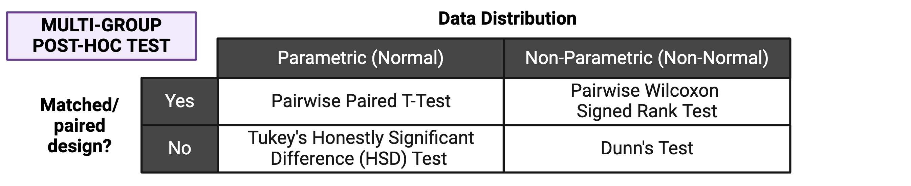

# 4.5 Multi-Group and Multi-Variable Comparisons and Visualizations

This training module was developed by Elise Hickman, Alexis Payton, and Julia E. Rager.

All input files (script, data, and figures) can be downloaded from the [UNC-SRP TAME2 GitHub website](https://github.com/UNCSRP/TAME2).

## Introduction to Training Module

In the previous module, we covered how to apply two-group statistical testing, one of the most basic types of statistical tests. In this module, we will build on the concepts introduced previously to apply statistical testing to datasets with more than two groups, which are also very common in environmental health research. We will review common multi-group overall effects tests and post-hoc tests, and we will demonstrate how to apply these tests and how to graph the results using the same example dataset as in previous modules in this chapter, which represents concentrations of inflammatory biomarkers secreted by airway epithelial cells after exposure to different concentrations of acrolein.

### Training Module's Environmental Health Questions

This training module was specifically developed to answer the following environmental health questions:

1. Are there significant differences in inflammatory biomarker concentrations between different doses of acrolein?
2. Do TNF-$\alpha$ concentrations significantly increase with increasing dose of acrolein?

### Workspace Preparation and Data Import

Here, we will import the processed data that we generated at the end of TAME 2.0 Module 4.2, introduced in **TAME 2.0 Module 4.1 Overview of Experimental Design and Example Data** and the associated demographic data. These data represent log~2~ concentrations of inflammatory biomarkers secreted by airway epithelial cells after exposure to four different concentrations of acrolein (plus filtered air as a control). We will also load packages that will be needed for the analysis, including previously introduced packages such as *openxlsx*, *tidyverse*, *DT*, *ggpubr*, and *rstatix*. 

#### Cleaning the global environment
```{r, clear_env, echo=TRUE, eval=TRUE}
rm(list=ls())
```

#### Loading R packages required for this session
```{r, load_libs, echo=TRUE, eval=TRUE, warning=FALSE, error=FALSE, results='hide', message=FALSE}
library(openxlsx)
library(tidyverse)
library(DT)
library(rstatix)
library(ggpubr)
```

#### Set your working directory
```{r, filepath, echo=TRUE, eval=FALSE, error=FALSE, results='hide', message=FALSE}
setwd("/filepath to where your input files are")
```

#### Importing example dataset
```{r, read_data, echo=TRUE, eval=TRUE}
biomarker_data <- read.xlsx("Module4_5_Input/Module4_5_InputData1.xlsx")
demographic_data <- read.xlsx("Module4_5_Input/Module4_5_InputData2.xlsx")

# View data
datatable(biomarker_data)
datatable(demographic_data)
```
<br>

## Overview of Multi-Group Statistical Tests

Before applying statistical tests to our data, let's first review the mechanics of multi-group statistical tests, including overall effects tests and post-hoc tests. 
```{r, echo = FALSE, fig.align = "center", out.width = "600px"} 
knitr::include_graphics("Module4_5_Input/Module4_5_Image1.png")
```

### Overall Effects Tests

The first step for multi-group statistical testing is to run an overall effects test. The null hypothesis for the overall effects test is that there are no differences among group means. A significant p-value rejects the null hypothesis that the groups are drawn from populations with the same mean and indicates that at least one group differs significantly from the overall mean. Similar to two-group statistical testing, choice of the specific overall statistical test to run depends on whether the data are normally or non-normally distributed and whether the experimental design is paired:

```{r, echo = FALSE, fig.align = "center", out.width = "700px"} 
knitr::include_graphics("Module4_5_Input/Module4_5_Image2.png")
```

Importantly, overall effects tests return **one** p-value regardless of the number of groups being compared. To determine which pairwise comparisons are significant, post-hoc testing is needed. 

### Post-Hoc Testing

If significance is obtained with an overall effects test, we can use post-hoc testing to determine which specific pairs of groups are significantly different from each other. Just as with two group statistical tests and overall effects multi-group statistical tests, choosing the appropriate post-hoc test depends on the data's normality and whether the experimental design is paired:
```{r, echo = FALSE, fig.align = "center", out.width = "700px"} 

```

Note that the above diagram represents commonly selected post-hoc tests; others may also be appropriate depending on your specific experimental design. As with other aspects of the analysis, be sure to report which post-hoc test(s) you performed! 

### Correcting for Multiple Hypothesis Testing

Correcting for multiple hypothesis testing is important for both the overall effects test (if you are running it over many endpoints) and post-hoc tests; however, it is particularly important for post-hoc tests. This is because even an analysis of a relatively small number of experimental groups results in quite a few pairwise comparisons. Comparing each of our five dose groups to each other in our example data, there are 10 separate statistical tests being performed! Therefore, it is generally advisable to adjust pairwise post-hoc testing p-values. The Tukey's HSD function within *rstatix* does this automatically, while pairwise t-tests, pairwise Wilcoxon tests, and Dunn's test do not. P-value adjustment can be added to their respective *rstatix* functions using the `p.adjust.method = ` argument. 

When applying a post-hoc test, you may choose to compare every group to every other group, or you may only be interested in significant differences between specific groups (e.g., treatment groups vs. a control). This choice will be governed by your hypothesis. Statistical testing functions will typically default to comparing all groups to each other, but the comparisons can be defined using the `comparisons = ` argument if you want to restrict the test to specific comparisons. It is important to decide at the beginning of your analysis which comparisons are relevant to your hypothesis because the number of pairwise tests performed in the post-hoc analysis will influence how much the resulting p-values will be adjusted for multiple hypothesis testing. 

### Which test should I choose?

Use the following flowchart to help guide your choice of statistical test to compare multiple groups:
```{r, echo = FALSE, fig.align = "center", out.width = "900px"} 

```

<br>

## Multi-Group Analysis Example

To determine whether there are significant differences across all of our doses, the Friedman test is the most appropriate due to our matched experimental design and non-normally distributed data. The `friedman_test()` function is part of the [rstatix](https://github.com/kassambara/rstatix) package. This package also has many other helpful functions for statistical tests that are pipe/tidyverse friendly. To demonstrate how this test works, we will first perform the test on one variable:
```{r}
biomarker_data %>% friedman_test(IL1B ~ Dose | Donor)
```

A p-value of 0.01 indicates that we can reject the null hypothesis that all of our data are drawn from groups that have equivalent means. 

Now, we can run a `for` loop similar to our two-group comparisons in **TAME 2.0 Module 4.4 Two Group Comparisons and Visualizations** to determine the overall p-value for each endpoint:
```{r}
# Create a vector with the names of the variables you want to run the test on
endpoints <- colnames(biomarker_data %>% select(IL1B:VEGF))

# Create data frame to store results
dose_friedmanres <- data.frame()

# Run for loop
for (i in 1:length(endpoints)) {
  
  # Assign a name to the endpoint variable.
  endpoint <- endpoints[i]
  
  # Run wilcox test and store in results data frame.
  res <- biomarker_data %>%
    friedman_test(as.formula(paste0(endpoint, "~ Dose | Donor", sep = ""))) %>%
    select(c(.y., p))
  
  dose_friedmanres <- rbind(dose_friedmanres, res)
}

# View results
datatable(dose_friedmanres)
```

These results demonstrate that all of our endpoints have significant overall differences across doses (p < 0.05). To determine which pairwise comparisons are significant, we next need to apply a post-hoc test. We will apply a pairwise, paired Wilcoxon test due to our experimental design and data distribution, with the Benjamini-Hochberg (BH) correction for multiple testing:
```{r}
dose_wilcox_posthoc_IL1B <- biomarker_data %>% 
  pairwise_wilcox_test(IL1B ~ Dose, paired = TRUE, p.adjust.method = "BH")

dose_wilcox_posthoc_IL1B 
```

Here, we can now see whether there are statistically significant differences in IL-1$\beta$ secretion between each of our doses. To generate pairwise comparison results for each of our inflammatory biomarkers, we can run a for loop similar to the one we ran for our overall test:
```{r}
# Create a vector with the names of the variables you want to run the test on
endpoints <- colnames(biomarker_data %>% select(IL1B:VEGF))

# Create data frame to store results
dose_wilcox_posthoc <- data.frame()

# Run for loop
for (i in 1:length(endpoints)) {
  
  # Assign a name to the endpoint variable.
  endpoint <- endpoints[i]
  
  # Run wilcox test and store in results data frame.
  res <- biomarker_data %>%
    pairwise_wilcox_test(as.formula(paste0(endpoint, "~ Dose", sep = "")), paired = TRUE, p.adjust.method = "BH")
  
  dose_wilcox_posthoc <- rbind(dose_wilcox_posthoc, res)
}

# View results
datatable(dose_wilcox_posthoc)
```

We now have a dataframe storing all of our pairwise comparison results. However, this is a lot to scroll through, making it hard to interpret. We can generate a publication-quality table by manipulating the table and joining it with the overall test data. 
```{r}
dose_results_cleaned <- dose_wilcox_posthoc %>%
  unite(comparison, group1, group2, sep = " vs. ") %>%
  select(c(.y., comparison, p.adj)) %>%
  pivot_wider(id_cols = ".y.", names_from = "comparison", values_from = "p.adj") %>%
  left_join(dose_friedmanres, by = ".y.") %>%
  relocate(p, .after = ".y.") %>%
  rename("Variable" = ".y.", "Overall" = "p") %>%
  mutate(across('Overall':'2 vs. 4', \(x) format(x, scientific = TRUE, digits = 3)))

datatable(dose_results_cleaned)
```

To more easily see overall significance patterns, we could also make the same table but with significance stars instead of p-values by keeping the `p.adjust.signif` column instead of the `p.adj` column in our post-hoc test results dataframe:
```{r}
dose_results_cleaned_2 <- dose_wilcox_posthoc %>%
  unite(comparison, group1, group2, sep = " vs. ") %>%
  select(c(.y., comparison, p.adj.signif)) %>%
  pivot_wider(id_cols = ".y.", names_from = "comparison", values_from = "p.adj.signif") %>%
  left_join(dose_friedmanres, by = ".y.") %>%
  relocate(p, .after = ".y.") %>%
  rename("Variable" = ".y.", "Overall" = "p") %>%
  mutate(across('Overall':'2 vs. 4', \(x) format(x, scientific = TRUE, digits = 3)))

datatable(dose_results_cleaned_2)
```

### Answer to Environmental Health Question 1
:::question
<i> With this, we can answer **Environmental Health Question #1 **</i>: Are there significant differences in inflammatory biomarker concentrations between different doses of acrolein?
:::

:::answer
**Answer**: Yes, there are significant differences in inflammatory biomarker concentrations between different doses of acrolein. The overall p-values for all biomarkers are significant. Within each biomarker, at least one pairwise comparison was significant between doses, with a majority of these significant comparisons being with the highest dose (4 ppm).
:::

<br>

## Visualization of Multi-Group Statistical Results

The statistical results we generated are a lot to digest in table format, so it can be helpful to graph the results. As our statistical testing becomes more complicated, so does the code used to generate results. The *ggpubr* package can perform statistical testing and overlay the results onto graphs for a specific set of tests, such as overall effects tests and unpaired t-tests or Wilcoxon tests. However, for tests that aren't available by default, the package also contains the helpful `stat_pvalue_manual()` function that can be added to plots. This is what we will need to use to add the results of our pairwise, paired Wilcoxon test with BH correction, as there is no option for BH correction within the default function we might otherwise use (`stat_compare_means()`). We will first work through an example of this using one of our endpoints, and then we will demonstrate how to apply it to facet plotting.

### Single Plot

We first need to format our existing statistical results so that they match the format that the function needs as input. Specifically, the dataframe needs to contain the following columns:

+ `group1` and `group2`: the groups being compared
+ A column containing the results you want displayed (`p`, `p.adj`, or `p.adj.signif` typically)
+ `y.position`, which tells the function where to plot the significance markers

Our results dataframe for IL-1$\beta$ already contains our groups and p-values:
```{r}
datatable(dose_wilcox_posthoc_IL1B)
```

We can add the position columns using the function `add_xy_position()`:

```{r}
dose_wilcox_posthoc_IL1B <- dose_wilcox_posthoc_IL1B %>%
  add_xy_position(x = "Dose", step.increase = 2)

datatable(dose_wilcox_posthoc_IL1B)
```

Now, we are ready to make a graph of our results. We will use `stat_friedman_test()` to add our overall p-value and `stat_pvalue_manual()` to add our pairwise values. 
```{r out.width = "600px", message = FALSE, fig.align = "center"}
# Set graphing theme
theme_set(theme_bw())

# Make plot
ggplot(biomarker_data, aes(x = Dose, y = IL1B)) +
  geom_boxplot(aes(fill = Dose), outlier.shape = NA) +
  scale_fill_manual(values = c("#BFBFBF", "#D5A298", "#E38273", "#EB5F4E", "#EE2B2B")) +
  geom_jitter(size = 3, position = position_jitter(0.15)) +
  stat_friedman_test(wid = "Donor", p.adjust.method = "none", label = "p = {p.format}", 
                     label.x.npc = "left", label.y = 9.5, hjust = 0.5, size = 6) +
  stat_pvalue_manual(dose_wilcox_posthoc_IL1B, label = "p.adj.signif", size = 12, hide.ns = TRUE) +
  ylim(2.5, 10) +
  labs(y = "Log2(IL-1\u03B2  (pg/mL))", x = "Acrolein (ppm)") +
  theme(legend.position = "none",
        axis.title = element_text(color = "black", size = 15),
        axis.title.x = element_text(vjust = -0.75),
        axis.title.y = element_text(vjust = 2),
        axis.text = element_text(color = "black", size = 12))
```

However, to make room for all of our annotations, our data become compressed, and it makes it difficult to see our data. Although presentation of statistical results is largely a matter of personal preference, we could clean up this plot by making our annotations appear on top of the bars, with indication in the figure legend that the comparison is with a specific dose. We will do this by:

1. Filtering our results to those that are significant.
2. Changing the symbol for comparisons that are not to the 0 dose. 
3. Layering this text onto the plot with `geom_text()` rather than `stat_pvalue_manual()`. 

First, let's filter our results to significant results and change the symbol for comparisons that are not to the 0 dose to a caret (^) instead of stars. We can do this by creating a new column called label that keeps the existing label if `group1` is 0, and if not, changes the label to a caret of the same length. We then use the summarize function to paste the labels for each of the groups together, resulting in a final dataframe containing our annotations for our plot. 

```{r}
dose_wilcox_posthoc_IL1B_2 <- dose_wilcox_posthoc_IL1B %>%
  
  # Filter results to those that are significant
  filter(p.adj <= 0.05) %>%
  
  # Make new symbol
  mutate(label = ifelse(group1 == "0", p.adj.signif, strrep("^", nchar(p.adj.signif)))) %>%
  
  # Select only the columns we need
  select(c(group1, group2, label)) %>%
  
  # Combine symbols for the same group
  group_by(group2) %>% summarise(label = paste(label, collapse=" ")) %>%
  
  # Remove duplicate row
  distinct(group2, .keep_all = TRUE) %>%
  
  # Rename group2 to dose
  rename("Dose" = "group2")

dose_wilcox_posthoc_IL1B_2
```

Then, we can use the same code as for our previous plot, but instead of using `stat_pvalue_manual()`, we will use `geom_text()` in combination with the dataframe we just created. 
```{r out.width = "600px", fig.align = "center"}
ggplot(biomarker_data, aes(x = Dose, y = IL1B)) +
  geom_boxplot(aes(fill = Dose), outlier.shape = NA) +
  scale_fill_manual(values = c("#BFBFBF", "#D5A298", "#E38273", "#EB5F4E", "#EE2B2B")) +
  geom_jitter(size = 3, position = position_jitter(0.15)) +
  stat_friedman_test(wid = "Donor", p.adjust.method = "none", label = "p = {p.format}", 
                     label.x.npc = "left", label.y = 4.85, hjust = 0.5, size = 6) +
  geom_text(data = dose_wilcox_posthoc_IL1B_2, aes(x = Dose, y = 4.5, 
                                       label = paste0(label)), size = 10, hjust = 0.5) +
  ylim(2.5, 5) +
  labs(y = "Log2(IL-1\u03B2  (pg/mL))", x = "Acrolein (ppm)") +
  theme(legend.position = "none",
        axis.title = element_text(color = "black", size = 15),
        axis.title.x = element_text(vjust = -0.75),
        axis.title.y = element_text(vjust = 2),
        axis.text = element_text(color = "black", size = 12))
```

An appropriate title for this figure could be: 

"**Figure X. Exposure to 0.6-4 ppm acrolein increases IL-1$\beta$ secretion in primary human bronchial epithelial cells.** Groups were compared using the Friedman test to obtain overall p-value and Wilcoxon signed rank test for post-hoc testing. * p < 0.05 in comparison with 0 ppm, ^ p < 0.05 in comparison with 0.6 ppm, n = 16 per group (paired)." 


### Faceted Plot

Ideally, we would extend this sort of graphical approach to our faceted plot showing all of our endpoints. However, there are quite a few statistically significant comparisons to graph, including comparisons that are significant between different pairs of doses (not just back to the control). While we could attempt to graph all of them, ultimately, this will lead to a cluttered figure panel. When thinking about how to simplify our plots, some options are:

1. Instead of using the number of symbols to represent p-values, we could use a single symbol to represent any comparison with a p-value with at least p < 0.05, and that symbol could be different depending on which group the significance is in comparison to. Symbols can be difficult to parse in R, so we could use letters or even the group names above the column of interest. For example, if the concentration of an endpoint at 2 ppm was significant in comparison with both 0 and 0.6 ppm, we could annotate "0, 0.6" above the 2 ppm column, or we could choose a letter ("a, b") or symbol ("*, ^") to convey these results.

2. If the pattern is the same across many of the endpoints measured, we could graph a subset of the endpoints with the most notable data trends or the most biological meaning for the main body of the manuscript, with data for additional endpoints referred to in the text and shown in the supplemental figures or tables. 

3. If most of the significant comparisons are back to the control group, we could choose to only show comparisons with the control group, with textual description of the other significant comparisons and indication that those specific p-values can be viewed in the supplemental table of results. 

Which approach you decide to take (or maybe another approach altogether) is a matter of both personal preference and your specific study goals. You may also decide that it is important to you to show all significant comparisons, which will require more careful formatting of the plots to ensure that all text and annotations are legible. For this module, we will proceed with option #3 because many of our comparisons to the control dose (0) are significant, and we have enough groups that there likely will not be space to annotate all of them above our data. 

We will take similar steps here that we did when constructing our single endpoint graph, with a couple of small differences. Specifically, we need to:

1. Create a dataframe of labels/annotations as we did above, but now filtered to only significant comparisons with the 0 group.
2. Add to the label/annotation dataframe what we want the y position for each of the labels to be, which will be different for each endpoint. 

First, let's create our annotations dataframe. We will start with the results dataframe from our posthoc testing:
```{r}
datatable(dose_wilcox_posthoc)
```

```{r}
dose_wilcox_posthoc_forgraph <- dose_wilcox_posthoc %>%
  
  filter(p.adj <= 0.05) %>%
  
  # Filter for only comparisons to 0
  filter(group1 == "0") %>%
  
  # Rename columns
  rename("variable" = ".y.", "Dose" = "group2")
  
datatable(dose_wilcox_posthoc_forgraph)
```

The `Dose` column will be used to tell *ggplot2* where to place the annotations on the x axis, but we need to also specify where to add the annotations on the y axis. This will be different for each variable because each variable is on a different scale. We can approach this by computing the maximum value of each variable, then increasing that by 20% to add some space on top of the points. 

```{r}
sig_labs_y <- biomarker_data %>%
  summarise(across(IL1B:VEGF, \(x) max(x))) %>%
  t() %>% as.data.frame() %>%
  rownames_to_column("variable") %>%
  rename("y_pos" = "V1") %>%
  mutate(y_pos = y_pos*1.2)

sig_labs_y
```

Then, we can join these data to our labeling dataframe to complete what we need to make the annotations.
```{r}
dose_wilcox_posthoc_forgraph <- dose_wilcox_posthoc_forgraph %>%
  left_join(sig_labs_y, by = "variable")
```

Now, it's time to graph! Keep in mind that although the plotting script can get long and unweildy, each line is just a new instruction to ggplot about a formatting element or an additional layer to add to the graph. 
```{r out.width = "800px", fig.align = "center"}
# Pivot data longer
biomarker_data_long <- biomarker_data %>%
  pivot_longer(-c(Donor, Dose), names_to = "variable", values_to = "value")

# Create clean labels for the graph titles
new_labels <- c("IL10" = "IL-10", "IL1B" = "IL-1\u03B2 ", "IL6" = "IL-6", "IL8" = "IL-8", 
                "TNFa" = "TNF-\u03b1", "VEGF" = "VEGF")

# Make graph
ggplot(biomarker_data_long, aes(x = Dose, y = value)) +
  # outlier.shape = NA removes outliers
  geom_boxplot(aes(fill = Dose), outlier.shape = NA) +
  # Changing box plot colors
  scale_fill_manual(values = c("#BFBFBF", "#D5A298", "#E38273", "#EB5F4E", "#EE2B2B")) +
  geom_jitter(size = 1.5, position = position_jitter(0.15)) +
  # Adding a p value from Friedman test
  stat_friedman_test(wid = "Donor", p.adjust.method = "none", label = "p = {p.format}", 
                     label.x.npc = "left", vjust = -3.5, hjust = 0.1, size = 3.5) + 
  # Add label
  geom_text(data = dose_wilcox_posthoc_forgraph, aes(x = Dose, y = y_pos, label = p.adj.signif,
                                       size = 5, hjust = 0.5)) +
  # Adding padding y axis 
  scale_y_continuous(expand = expansion(mult = c(0.1, 0.6))) +
  # Changing y axis label
  ylab(expression(Log[2]*"(Concentration (pg/ml))")) +
  # Changing x axis label
  xlab("Acrolein (ppm)") +
  # Faceting by each biomarker
  facet_wrap(~ variable, nrow = 2, scales = "free_y", labeller = labeller(variable = new_labels)) +
  # Removing legend
  theme(legend.position = "none",
        axis.title = element_text(color = "black", size = 12),
        axis.title.x = element_text(vjust = -0.75),
        axis.title.y = element_text(vjust = 2),
        axis.text = element_text(color = "black", size = 10),
        strip.text = element_text(size = 12, face = "bold"))
```

An appropriate title for this figure could be:

“**Figure X. Exposure to acrolein increases secretion of proinflammatory biomarkers in primary human bronchial epithelial cells.** Groups were compared using the Friedman test to obtain overall p-value and Wilcoxon signed rank test for post-hoc testing. * p < 0.05, ** p < 0.01, *** p < 0.001, **** p < 0.0001 for comparison with control. For additional significant comparisons, see Supplemental Table X. n = 16 per group (paired).”

### Answer to Environmental Health Question 2
:::question
<i> With this, we can answer **Environmental Health Question #2 **</i>: Do TNF-$\alpha$ concentrations significantly increase with increasing dose of acrolein?
:::

:::answer
**Answer**: Yes, TNF-$\alpha$ concentrations significantly increase with increasing dose of acrolein, which we were able to visualize, along with other mediators, in our facet plot. 
:::

<br>

## Concluding Remarks

In this module, we introduced common multi-group statistical tests, including both overall effects tests and post-hoc testing. We applied these tests to our example dataset and demonstrated how to produce publication-quality tables and figures of our results. Implementing a workflow such as this enables efficient analysis of wet-bench generated data and customization of output figures and tables suited to your personal preferences. 

### Additional Resources

- [STHDA: How to Add P-Values and Significance Levels to ggplots using *ggpubr*](http://www.sthda.com/english/articles/24-ggpubr-publication-ready-plots/76-add-p-values-and-significance-levels-to-ggplots/)
- [Adding p-values with *ggprism*](https://cran.r-project.org/web/packages/ggprism/vignettes/pvalues.html)
- [Overview of *ggsignif*](https://const-ae.github.io/ggsignif/)

<br>

<label class="tykfont">
Test Your Knowledge 
</label>

:::tyk

Functional endpoints from these cultures were also measured. These endpoints were: 1) Membrane Permeability (MemPerm), 2) Trans-Epithelial Electrical Resistance (TEER), 3) Ciliary Beat Frequency (CBF), and 4) Expression of Mucin (MUC5AC). These data were already processed and tested for normality (see Test Your Knowledge for **TAME 2.0 Module 4.2 Data Import, Processing, and Summary Statistics**), with results indicating that two of the endpoints are normally distributed and two non-normally distributed. 

Use the same processes demonstrated in this module and the provided data (“Module4_5_TYKInput.xlsx” (functional data)) to run analyses and make a publication-quality figure panel and table to answer the following question: Are there significant differences in functional endpoints between cells treated with different concentrations of acrolein?

For an extra challenge, try also making your faceted plot in the style of option #1 above, with different symbols, letters, or group names above columns to indicate which group that column in significant in comparison with. 
:::