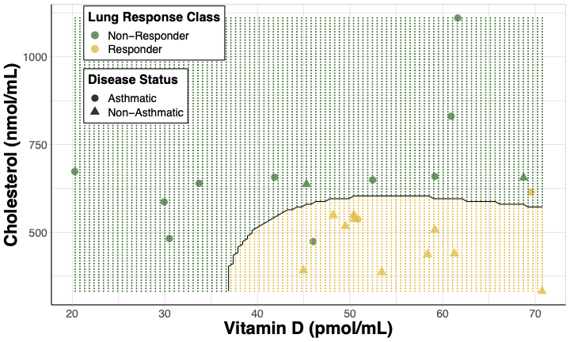
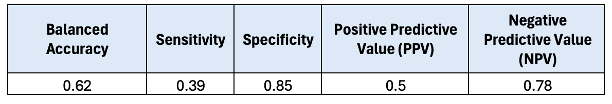

# 5.3 Supervised Machine Learning Model Interpretation

This training module was developed by Alexis Payton, Lauren E. Koval, and Julia E. Rager.

All input files (script, data, and figures) can be downloaded from the [UNC-SRP TAME2 GitHub website](https://github.com/UNCSRP/TAME2).

## Introduction to Training Module

Supervised machine learning (ML) represents a subset of ML methods wherein the outcome variable is known or assigned prior to training a model to be able to predict said outcome. As we discussed in previous modules, ML methods are advantageous in that they easily incorporate a multitude of potential predictor variables, which allows these models to more closely consider real-world, complex environmental health scenarios and offer new insights through a more holistic consideration of available data inputs. However, one disadvantage of ML is that it is often not as easily interpretable as traditional statistics (e.g., regression based methods with defined beta coefficients for each input predictor variable). With this limitation in mind, there are methods and concepts that can be applied to supervised ML algorithms to aid in the understanding of their predictions including variable (feature) importance and decision boundaries, which we will cover in this module. We will also include example visualization techniques of these methods, representing important aspects contributing to model interpretability, since visualizing helps convey concepts faster and across a broader target audience. In addition, this module addresses methods to communicate these findings in a paper so that a wider span of readers can understand overall take-home points. As with other data analyses, we advise to focus just as much on the **why** components of a study's research question(s) as opposed to only focusing on the **what** or **how**. To elaborate, we explain through this module that it is not as important to explain all the intricacies of how a model works and how its parameters were tuned; rather, it is more important to focus on why a particular model was selected and how it will be leveraged to answer your research questions. This can all be a bit subjective and requires expertise within your research field. As a first step, let's first learn about some model interpretation methodologies highlighting **Variable Importance** and **Decision Boundaries** as important examples relevant to environmental health research. Then, this training module will further describe approaches to summarize these methods and communicate supervised ML findings to a broader audience.

<br>

## Variable Importance

When a supervised ML algorithm makes predictions, it relies more heavily on some variables than others. How much a variable contributes to classifying data is known as **variable (feature) importance**. Often times, this is thought of as the impact on overall model performance if a variable were to be removed from the model. There are many methods that are used to measure feature importance, including...

+ **SHapley Additive exPlanations (SHAP)**: based on game theory where each variable is considered a "player" where we're seeking to determine each player's contribution to the outcome of a "game" or overall model performance. It divides the model performance metric amongst all the variables, so that the sum of the shapley values for all the predictors is equal to the overall model performance. For more information on SHAP, see [A Novel Approach to Feature Importance](https://towardsdatascience.com/a-novel-approach-to-feature-importance-shapley-additive-explanations-d18af30fc21b). 

+ **Mean decrease gini (gini impurity)**: quantifies the improvement of predictivity with the addition of each predictor in a decision tree, which is then averaged over all the decision trees tested. The higher the value the greater the importance on the algorithm. This metric can easily be extracted from classification-based models, including random forest (RF) classifications, which is what we will focus on in this module.

Note for RF regression-based models, node purity can be extracted as a measure of feature importance. For more information, please see the following resources regarding [Feature Importance](https://www.baeldung.com/cs/ml-feature-importance) and [Mean Decrease Gini](https://cran.r-project.org/web/packages/rfVarImpOOB/vignettes/rfVarImpOOB-vignette.html).

<br>

## Decision Boundary 
Another concept that is pertinent to a model's interpretability is understanding a decision boundary and how visualizing it can further aid in understanding how the model classifies new data points. A **decision boundary** is a line (or a hyperplane) that seeks to separate the training data by class. This line can be linear or non-linear and is formed in n-dimensional space. To clarify, although support vector machine (SVM) specifically uses decision boundaries to classify training data and make predictions on test data, decision boundaries can still be drawn for other algorithms.  

A decision boundary can be visualized to convey how well an algorithm is able to classify an outcome based on the data given. It is important to note that most ML models make use of datasets that contain three or more predictors, and it is difficult to visualize a plot in more than three dimensions. Therefore, the number of features and which features to plot need to be narrowed down to two variables. For this reason, the resulting visualization is not a true representation of the decision boundary from the initial model using all predictors, since the visualization only relies on prediction results from two variables. Nevertheless, decision boundary plots can be powerful visualizations to determine thresholds between the outcome classes.

When choosing variables for decision boundary plots, features that have the most influence on the model are often selected, but that is not always the case. Sometimes predictors are selected based upon the environmental health implications relevant to the research question. For example in [Perryman et. al](https://journals.plos.org/plosone/article?id=10.1371/journal.pone.0285721), lung response following ozone exposure was investigated by sampling derivatives of cholesterol biosynthesis in human subjects. In this paper, these sterol metabolites were used to predict whether a subject would be classified as having a lung response that was considered non-responsive or responsive. A decision boundary plot was made using two predictors:

+ Cholesterol, given that it had the highest variable importance and
+ Vitamin D, given its synthesis can be affected by ozone despite it having a lower variable importance in the paper's models.
```{r, echo=FALSE, fig.align='center', out.width = "80%"}

```
<center> **Figure 5. Decision boundary plot for SVM model predicting lung response class.** Cholesterol and 25-hydroxyvitamin D were used as predictors visualizing responder status [non-responders(green) and responders (yellow)] and disease status [non-asthmatics (triangles) and asthmatics (circles)]. The shaded regions are the model’s prediction of a subject’s lung response class at a given cholesterol and 25-hydroxyvitamin D concentration.</center>

Takeaways from this decision boundary plot:

+ Subjects with more lung inflammation ("responders") after ozone exposure tended to have higher Vitamin D levels (> 35pmol/mL) and lower Cholesterol levels (< 675nmol/mL).
+ These "responder" subjects were more likely to be non-asthmatics. 

<br>

## Introduction to Example Dataset and Activity

In the previous module, we investigated whether a classification-based RF model using well water variables would be accurate predictors of inorganic arsenic (iAs) contamination. While it is helpful to know if certain variables are able to be used to construct a model that accurately predict detectability, from a public health standpoint, it is also helpful to know which of those features contribute the most to a model's accuracy. Therefore, if we can identify the features that are associated with having lower arsenic detection, we can use that information to inform policies when new wells are constructed. In addition to identifying variables with the greatest importance to the algorithm, it is also pertinent to understand the ranges of when a well is more or less likely to have arsenic detected. For example, are wells with a lower flow rate more likely to have arsenic detected? In this module, this will be addressed by extracting variable importance from the same algorithm and plotting it. The two features with the highest variable importance will be identified and used to construct a decision boundary plot to determine how features are associated with iAs detection. 

The data to be used in this module was described and referenced previously in **TAME 2.0 Module 5.2 Supervised Machine Learning**.

### Training Module's Environmental Health Questions

This training module was specifically developed to answer the following environmental health questions:

1. After plotting variable importance from highest to lowest, which two predictors have the highest variable importance on the predictive accuracy of iAs detection from a RF algorithm?
2. Using the two features with the highest variable importance, under what conditions are we more likely to predict detectable iAs in wells based on a decision boundary plot?
3. How do the decision boundaries shift after incorporating SMOTE to address class imbalance?


### Script Preparations

#### Cleaning the global environment
```{r}
rm(list=ls())
```

#### Installing required R packages
If you already have these packages installed, you can skip this step, or you can run the below code which checks installation status for you
```{r message=FALSE}
if (!requireNamespace("readxl"))
  install.packages("readxl");
if (!requireNamespace("lubridate"))
  install.packages("lubridate");
if (!requireNamespace("tidyverse"))
  install.packages("tidyverse");
if (!requireNamespace("caret"))
  install.packages("caret");
if (!requireNamespace("randomForest"))
  install.packages("randomForest");
if (!requireNamespace("themis"))
  install.packages("themis");
```

#### Loading R packages required for this session
```{r message=FALSE}
library(readxl)
library(lubridate)
library(tidyverse)
library(caret)
library(randomForest)
library(e1071)
library(ggsci)
library(themis)
```

#### Set your working directory
```{r, eval=FALSE, echo=TRUE}
setwd("/filepath to where your input files are")
```

#### Importing example dataset
```{r}
# Load the data
arsenic_data <- data.frame(read_excel("Module5_3_Input/Module5_3_InputData.xlsx"))

# View the top of the dataset
head(arsenic_data) 
```

### Changing Data Types 
First, `Detect_Concentration` needs to be converted from a character to a factor so that Random Forest knows that the non-detect class is the baseline or "negative" class, while the detect class will be the "positive" class. `Water_Sample_Date` will be converted from a character to a date type using the `mdy()` function from the *lubridate* package. This is done so that the model understands this column contains dates.
```{r}
arsenic_data <- arsenic_data %>%
    # Converting `Detect_Concentration` from a character to a factor
    mutate(Detect_Concentration = relevel(factor(Detect_Concentration), ref = "ND"), 
    # Converting water sample date from a character to a date type 
    Water_Sample_Date = mdy(Water_Sample_Date)) %>% 
    # Removing well id and only keeping the predictor and outcome variables in the dataset
    # This allows us to put the entire dataframe as is into RF
    select(-Well_ID) 

# View the top of the current dataset
head(arsenic_data)
```
<br>

### Setting up Cross Validation
Note that the code below is different than the code presented in the previous module, **TAME 2.0 Module 5.2 Supervised Machine Learning**. Both coding methods are valid and produce comparable results, however we wanted to present another way to run *k*-fold cross validation and random forest. In 5-fold cross validation (CV), there are 5 equally-sized folds (ideally!). This means that 80% of the original dataset is split into the 4 folds that comprise the training set and the remaining 20% in the last fold is reserved for the test set. 

Previously, the `trainControl()` function was used for CV. This time we'll use the `createFolds()` function also from the *caret* package. 
```{r}
# Setting seed for reproducibility
set.seed(12)

# 5-fold cross validation
arsenic_index = createFolds(arsenic_data$Detect_Concentration, k = 5) 

# Seeing if about 20% of the records are in the testing set
kfold1 = arsenic_index[[1]]
length(kfold1)/nrow(arsenic_data)

# Creating vectors for parameters to be tuned
ntree_values = c(50, 250, 500) # number of decision trees 
p = dim(arsenic_data)[2] - 1 # number of predictor variables in the dataset
mtry_values = c(sqrt(p), p/2, p) # number of predictors to be used in the model
```
<br>

## Predicting iAs Detection with a Random Forest (RF) Model
Notice that in the code below we are choosing the final RF model to be the one with the lowest out of bag (OOB) error. In the previous module, the final model was chosen based on the highest accuracy, however this is a similar approach here given that OOB error = 1 - Accuracy.
```{r}
# Setting the seed again so the predictions are consistent
set.seed(12)

# Creating an empty dataframe to save the confusion matrix metrics and variable importance
metrics = data.frame()
variable_importance_df = data.frame()

# Iterating through the cross validation folds
for (i in 1:length(arsenic_index)){
    # Training data
    data_train = arsenic_data[-arsenic_index[[i]],]
    
    # Test data
    data_test = arsenic_data[arsenic_index[[i]],]
    
    # Creating empty lists and dataframes to store errors 
    reg_rf_pred_tune = list()
    rf_OOB_errors = list()
    rf_error_df = data.frame()
    
    # Tuning parameters: using ntree and mtry values to determine which combination yields the smallest OOB error 
    # from the validation datasets
    for (j in 1:length(ntree_values)){
        for (k in 1:length(mtry_values)){
            
            # Running RF to tune parameters
            reg_rf_pred_tune[[k]] = randomForest(Detect_Concentration ~ ., data = data_train, 
                                                 ntree = ntree_values[j], mtry = mtry_values[k])
            # Obtaining the OOB error
            rf_OOB_errors[[k]] = data.frame("Tree Number" = ntree_values[j], "Variable Number" = mtry_values[k], 
                                   "OOB_errors" = reg_rf_pred_tune[[k]]$err.rate[ntree_values[j],1])
            
            # Storing the values in a dataframe
            rf_error_df = rbind(rf_error_df, rf_OOB_errors[[k]])
        }
    }
    
    # Finding the lowest OOB error from the 5 folds using best number of predictors at split
    best_oob_errors <- which(rf_error_df$OOB_errors == min(rf_error_df$OOB_errors))

    # Now running RF on the entire training set with the tuned parameters
    # This will be done 5 times for each fold
    reg_rf <- randomForest(Detect_Concentration ~ ., data = data_train,
                               ntree = rf_error_df$Tree.Number[min(best_oob_errors)],
                               mtry = rf_error_df$Variable.Number[min(best_oob_errors)])

    # Predicting on test set and adding the predicted values as an additional column to the test data
    data_test$Pred_Detect_Concentration = predict(reg_rf, newdata = data_test, type = "response")
    matrix = confusionMatrix(data = data_test$Pred_Detect_Concentration, 
                             reference = data_test$Detect_Concentration, positive = "D")
    
    # Extracting accuracy, sens, spec, PPV, NPV and adding to the dataframe to take mean later
    matrix_values = data.frame(t(c(matrix$byClass[11])), t(c(matrix$byClass[1:4])))
    metrics = rbind(metrics, matrix_values)

    # Extracting variable importance
    variable_importance_values = data.frame(importance(reg_rf)) %>%
        rownames_to_column(var = "Predictor")
    variable_importance_df = rbind(variable_importance_df, variable_importance_values)
}

# Taking average across the 5 folds
metrics = metrics %>%
        summarise(`Balanced Accuracy` = mean(Balanced.Accuracy), Sensitivity = mean(Sensitivity), 
              Specificity = mean(Specificity), PPV = mean(Pos.Pred.Value), NPV = mean(Neg.Pred.Value))

variable_importance_df = variable_importance_df %>%
    group_by(Predictor) %>%
    summarise(MeanDecreaseGini = mean(MeanDecreaseGini)) %>%
    # Sorting from highest to lowest
    arrange(-MeanDecreaseGini)
```

The confusion matrix results from the previous module are shown below.
```{r, echo=FALSE, fig.align='center', out.width = "80%"}

```

Now let's double check that when using this new method, our results are still comparable. 
```{r}
# First comparing results to the previous module
round(metrics, 2)
```

They are! Now we'll take a look at the model's variable importance.
```{r}
variable_importance_df
```

Although we have the results we need, let's take it a step further and plot the data.

### Reformatting the dataframe for plotting 
First, the dataframe will be transformed so that the figure is more legible. Specifically, spaces will be added between the variables, and the `Predictor` column will be put into a factor to rearrange the order of the variables from lowest to highest mean decrease gini. For additional information on tricks like this to make visualizations easier to read, see **TAME 2.0 Module 3.2 Improving Data Visualizations**.
```{r}
# Adding spaces between the variables that need the space
modified_variable_importance_df = variable_importance_df %>%
     mutate(Predictor = gsub("_", " ", Predictor))

# Saving the order of the variables from lowest to highest mean decrease gini by putting into a factor
predictor_order = rev(modified_variable_importance_df$Predictor)
modified_variable_importance_df$Predictor = factor(modified_variable_importance_df$Predictor, 
                                                   levels = predictor_order)

head(modified_variable_importance_df)
```

## Variable Importance Plot
```{r fig.align='center', out.width = "65%"}
ggplot(data = modified_variable_importance_df , 
             aes(x = MeanDecreaseGini, y = Predictor, size = 2)) + 
  geom_point() + 

  theme_light() + 
  theme(axis.line = element_line(color = "black"), #making x and y axes black
        axis.text = element_text(size = 12), #changing size of x axis labels
        axis.title = element_text(face = "bold", size = rel(1.7)), #changes axis titles
        legend.title = element_text(face = 'bold', size = 14), #changes legend title
        legend.text = element_text(size = 12), #changes legend text
        strip.text.x = element_text(size = 15, face = "bold"), #changes size of facet x axis 
        strip.text.y = element_text(size = 15, face = "bold")) + #changes size of facet y axis 
  labs(x = 'Variable Importance', y = 'Predictor') + #changing axis labels 
  
  guides(size = "none")#removing size legend
```
An appropriate title for this figure could be:

“**Figure X. Variable importance from random forest models predicting iAs detection.** Variable importance is derived from mean decrease gini values extracted from random forest models. Features are listed on the y axis from greatest (top) to least (bottom) mean decrease gini."

### Answer to Environmental Health Question 1
:::question
*With this, we can answer **Environmental Health Question #1***: After plotting variable importance from highest to lowest, which two predictors have the highest variable importance on the predictive accuracy of iAs detection from a RF algorithm?
:::

:::answer
**Answer**: From the variable importance dataframe and plot, we can see that casing depth and pH had the greatest impact on RF followed by water sample date, flow rate, static water depth, and well depth in descending order. 
:::

Since casing depth and pH have been identified as the predictors with the highest variable importance, they will be prioritized as the two predictors included in the decision boundary plot example below.

<br>

### Decision Boundary Calculation

First, models will be trained using only casing depth and pH as variables. Since, the decision boundary plot will be used for visualization purposes, and a 2-D figure can only plot two variables, we will not worry about tuning the parameters as was previously done. In this module, we're creating a decision boundary based on a random forest model, however we'll also explore what decision boundaries look like for other algorithms including support vector machine (SVM), and k nearest neighbor (KNN), logistic regression. Each supervised ML method has its advantages and performance is dependent upon the situation and the dataset. Therefore, it is common to see multiple models used to predict an outcome of interest in a publication. Let's create additional boundary plots still using casing depth and pH, but this time we will use logistic regression, SVM, and KNN as comparisons to RF.
```{r}
# Creating a dataframe with variables based on the highest predictors
highest_pred_data = data.frame(arsenic_data[,c("Casing_Depth", "pH", "Detect_Concentration")])

# Training RF
rf_detect_arsenic = randomForest(Detect_Concentration~., data = highest_pred_data)

# Logistic regression
lr_detect_arsenic = glm(Detect_Concentration~., data = highest_pred_data, family = binomial(link = 'logit'))

# SVM with a radial kernel (hyperplane)
svm_detect_arsenic = svm(Detect_Concentration~., data = highest_pred_data, kernel = "radial")

# KNN
knn_detect_arsenic = knn3(Detect_Concentration~., data = highest_pred_data) # specifying 2 classes
```

From these predictions, decision boundaries will be calculated. This will be done by predicting `Detect_Concentration` between a grid of values - specifically the minimum and maximum of the two predictors (casing depth and pH). A non-linear line will be drawn on the plot to separate the two classes. 
```{r}
get_grid_df <- function(classification_model, data, resolution = 100, predict_type) {
    # This function predicts the outcome (Detect_Concentration) at evenly spaced data points using the two variables (pH and casing depth)
    # to create a decision boundary between the outcome classes (detect and non-detect samples).

    # :parameters: a classification-based supervised machine learning model, dataset containing the predictors and outcome variable,
    # specifies the number of data points to make between the minimum and maximum predictor values, prediction type
    # :output: a grid of values for both predictors and their corresponding predicted outcome class

    # Grabbing only the predictor data
    predictor_data <- data[,1:2]
    
    # Creating a dataframe that contains the min and max for both features
    min_max_df <- sapply(predictor_data, range, na.rm = TRUE)

    # Creating a vector of evenly spaced points between the min and max for the first variable (casing depth)
    variable1_vector <- seq(min_max_df[1,1], min_max_df[2,1], length.out = resolution)
    # Creating a vector of evenly spaced points between the min and max for the second variable (pH)
    variable2_vector <- seq(min_max_df[1,2], min_max_df[2,2], length.out = resolution)

    # Creating a dataframe of grid values by combining the two vectors
    grid_df <- data.frame(cbind(rep(variable1_vector, each = resolution), rep(variable2_vector, 
                                                                              time = resolution)))
    colnames(grid_df) <- colnames(min_max_df)
    
    # Predicting class label based on all the predictor pairs of data
    grid_df$Pred_Class = predict(classification_model, grid_df, type = predict_type)
    
    return(grid_df)
}

# calling function
# RF
grid_df_rf = get_grid_df(rf_detect_arsenic, highest_pred_data, predict_type = "class") %>% 
  # Adding in a column that indicates the model so all the dataframes can be combined
  mutate(Model = "A. Random Forest")

# SVM with a radial kernel (hyperplane)
grid_df_svm = get_grid_df(svm_detect_arsenic, highest_pred_data, predict_type = "class") %>%
  mutate(Model = "B. Support Vector Machine")

# KNN
grid_df_knn = get_grid_df(knn_detect_arsenic, highest_pred_data, predict_type = "class") %>%
    mutate(Model = "C. K Nearest Neighbor")

# Logistic regression
grid_df_lr = get_grid_df(lr_detect_arsenic, highest_pred_data, predict_type = "response") %>%
  # First specifying the cutoff point for logistic regression predictions
  # If the response is >= 0.5 it will be classified as a detect prediction
    mutate(Pred_Class = relevel(factor(ifelse(Pred_Class >= 0.5, "D", "ND")), ref = "ND"), 
           Model = "D. Logistic Regression")

# Creating 1 dataframe
grid_df = rbind(grid_df_rf, grid_df_lr, grid_df_svm, grid_df_knn)

# Viewing the dataframe to be plotted
head(grid_df)
```
## Decision Boundary Plot

Now let's plot the grid of predictions with the sampled data.
```{r warning = FALSE, fig.width=15, fig.height=10, fig.align='center'}
# choosing palette from package
ggsci_colors = pal_npg()(5)

ggplot() +
  geom_point(data = arsenic_data, aes(x = pH, y = Casing_Depth, color = Detect_Concentration),
            position = position_jitter(w = 0.1, h = 0.1), size = 4, alpha = 0.8) + 
  geom_contour(data = grid_df, aes(x = pH, y = Casing_Depth, z = as.numeric(Pred_Class == "D")), 
               color = "black", breaks = 0.5) + # adds contour line
  geom_point(data = grid_df, aes(x = pH, y = Casing_Depth, color = Pred_Class), 
             size = 0.1) + # shades plot
  xlim(5.9, NA) + # changes the limits of the x axis
  
  facet_wrap(~Model, scales = 'free') + 

  theme_light() + 
  theme(axis.line = element_line(color = "black"), #making x and y axes black
        axis.text = element_text(size = 10), #changing size of x axis labels
        axis.title = element_text(face = "bold", size = rel(1.7)), #changes axis titles
        legend.title = element_text(face = 'bold', size = 12), #changes legend title
        legend.text = element_text(size = 12), #changes legend text
        legend.position = "bottom", # move legend to top left corner
        legend.background = element_rect(color = 'black', fill = 'white', linetype = 'solid'), # changes legend background
        strip.text = element_text(size = 15, face = "bold")) +  #changes size of facet x axis 
  labs(y = 'Casing Depth (ft)') + #changing axis labels

  scale_color_manual(name = "Arsenic Detection", # renaming the legend
                     values = ggsci_colors[c(4,5)],
                      labels = c('Non-Detect','Detect')) # renaming the classes


```

### Answer to Environmental Health Question 2
:::question
*With this, we can answer **Environmental Health Question #2***: Using the two features with the highest variable importance, under what conditions are we more likely to predict detectable iAs in wells based on a decision boundary plot?
:::

:::answer
**Answer**: There is some overlap between detect and non-detect iAs samples; however, it is evident that wells with detectable levels of iAs were more likely to have lower (<80 ft) casing depths and a more basic pH (> 7) based on RF and KNN models. It seems like SVM and logistic regression could have potentially captured a greater "detect" region indicating that the models likely struggled to predict "detect" values. In the next section, SMOTE will be used to see if these decision boundaries can be improved.
:::

<br>

## Decision Boundary Plot Incorporating SMOTE

Here, we will create a decision boundary plot still using casing depth and pH, but this time we will make our dataset more balance to see how improve model performance visually. The **Synthetic Minority Oversampling Technique (SMOTE)** was introduced in **TAME 2.0 Module 5.2 Supervised Machine Learning** and will be used to make the dataset more balanced by oversampling the minority class (detect values) and undersampling the majority class (non-detect values). 

Starting by training each model:
```{r}
# Using SMOTE first to balance classes
balanced_highest_pred_data = smotenc(highest_pred_data, "Detect_Concentration")

# Training RF
rf_detect_arsenic = randomForest(Detect_Concentration~., data = balanced_highest_pred_data)

# Logistic regression
lr_detect_arsenic = glm(Detect_Concentration~., data = balanced_highest_pred_data, family = binomial(link = 'logit'))

# SVM with a radial kernel (hyperplane)
svm_detect_arsenic = svm(Detect_Concentration~., data = balanced_highest_pred_data, kernel = "radial")

# KNN
knn_detect_arsenic = knn3(Detect_Concentration~., data = balanced_highest_pred_data) # specifying 2 classes  
```

Now calling the `get_grid_df()` function we created above to create a grid of predictions. 
```{r}
# Calling function
# RF
balanced_grid_df_rf = get_grid_df(rf_detect_arsenic, balanced_highest_pred_data, predict_type = "class") %>% 
  # Adding in a column that indicates the model so all the dataframes can be combined
  mutate(Model = "A. Random Forest")

# SVM with a radial kernel (hyperplane)
balanced_grid_df_svm = get_grid_df(svm_detect_arsenic, balanced_highest_pred_data, predict_type = "class") %>%
  mutate(Model = "B. Support Vector Machine")

# KNN
balanced_grid_df_knn = get_grid_df(knn_detect_arsenic, balanced_highest_pred_data, predict_type = "class") %>%
    mutate(Model = "C. K Nearest Neighbor")

# Logistic regression
balanced_grid_df_lr = get_grid_df(lr_detect_arsenic, balanced_highest_pred_data, predict_type = "response") %>%
  # First specifying the cutoff point for logistic regression predictions
  # If the response is >= 0.5 it will be classified as a detect prediction
    mutate(Pred_Class = relevel(factor(ifelse(Pred_Class >= 0.5, "D", "ND")), ref = "ND"), 
           Model = "D. Logistic Regression")


# Creating 1 dataframe
balanced_grid_df = rbind(balanced_grid_df_rf, balanced_grid_df_lr, balanced_grid_df_svm, balanced_grid_df_knn)

# Viewing the dataframe to be plotted
head(balanced_grid_df)
```

```{r warning = FALSE, fig.width=15, fig.height=10, fig.align='center'}
# choosing palette from package
ggsci_colors = pal_npg()(5)

ggplot() +
  geom_point(data = arsenic_data, aes(x = pH, y = Casing_Depth, color = Detect_Concentration),
            position = position_jitter(w = 0.1, h = 0.1), size = 4, alpha = 0.8) + 
  geom_contour(data = balanced_grid_df, aes(x = pH, y = Casing_Depth, z = as.numeric(Pred_Class == "D")), 
               color = "black", breaks = 0.5) + # adds contour line
  geom_point(data = balanced_grid_df, aes(x = pH, y = Casing_Depth, color = Pred_Class), 
             size = 0.1) + # shades plot
  xlim(5.9, NA) + # changes the limits of the x axis
  
  facet_wrap(~Model, scales = 'free') + 

  theme_light() + 
  theme(axis.line = element_line(color = "black"), #making x and y axes black
        axis.text = element_text(size = 10), #changing size of x axis labels
        axis.title = element_text(face = "bold", size = rel(1.7)), #changes axis titles
        legend.title = element_text(face = 'bold', size = 12), #changes legend title
        legend.text = element_text(size = 12), #changes legend text
        legend.position = "bottom", # move legend to top left corner
        legend.background = element_rect(color = 'black', fill = 'white', linetype = 'solid'), # changes legend background
        strip.text = element_text(size = 15, face = "bold")) +  #changes size of facet x axis 
  labs(y = 'Casing Depth (ft)') + #changing axis labels

  scale_color_manual(name = "Arsenic Detection", # renaming the legend
                     values = ggsci_colors[c(4,5)],
                      labels = c('Non-Detect','Detect')) # renaming the classes
```
An appropriate title for this figure could be:

“**Figure X. Decision boundary plots from supervised machine learning models predicting iAs detection.** The top two predictors on model performance, casing depth and pH, were used to visualize arsenic detection [non-detect (red) and detect (blue)]. The shaded regions represent prediction of a well's detection class based on varying casing depth and pH values using (A) Random Forest, (B) Support Vector Machine, (C) K Nearest Neighbor, and (D) Logistic Regression.

### Answer to Environmental Health Question 3
:::question
*With this, we can answer **Environmental Health Question #3***: How do the decision boundaries shift after incorporating SMOTE to address class imbalance?
:::

:::answer
**Answer**: It is still evident that wells with detectable levels of iAs were more likely to have lower (<80 ft) casing depths and a more basic pH (> 7). However, we see the greatest shifts in the decision boundaries of SVM and logistic regression with both models now predicting greater regions to detectable iAs levels.
:::

<br>

## Concluding Remarks
In conclusion, this training module provided methodologies to aid in the interpretation of supervised ML with variable importance and decision boundary plots. Variable importance helps quantify the impact of each feature's importance on an algorithm's predictivity. The most important or environmentally-relevant predictors can be selected in a decision boundary plot to further understand and visualize the features impact on the model's classification. 

<br>

### Additional Resources

+ Christoph Molnar. (2019, August 27). Interpretable Machine Learning. Github.io. https://christophm.github.io/interpretable-ml-book/
+ [Variable Importance](https://compgenomr.github.io/book/trees-and-forests-random-forests-in-action.html#variable-importance-1)
+ [Decision Boundary](https://rpubs.com/ZheWangDataAnalytics/DecisionBoundary)

<br>

<label class="tykfont">
Test Your Knowledge 
</label>

:::tyk
1. Using the "Module5_2_TYKInput.xlsx", use RF to determine if well water data can be accurate predictors of manganese detection as was done in the previous module. However, this time, incorporate SMOTE in the model. Feel free to use either the `trainControl()` or `createFolds()` function for CV. Extract the variable importance for each predictor on a RF model. What two features have the highest variable importance? **Hint**: Regardless of the cross validation function you choose, run SMOTE on the training dataset only to create a more balanced training set while the test set will remain unchanged. 

2. Using casing depth and the feature with the highest variable importance, construct a decision boundary plot. Under what conditions are a well more likely to predict detectable manganese levels based on a decision boundary plot?
:::
