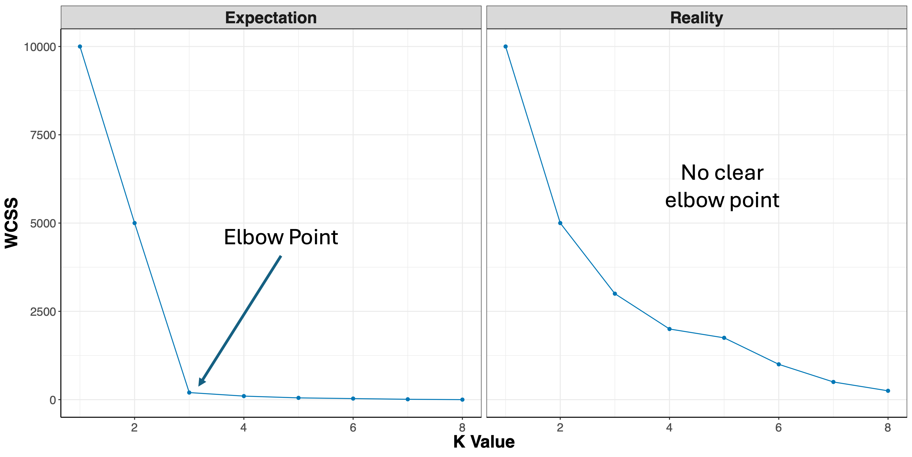
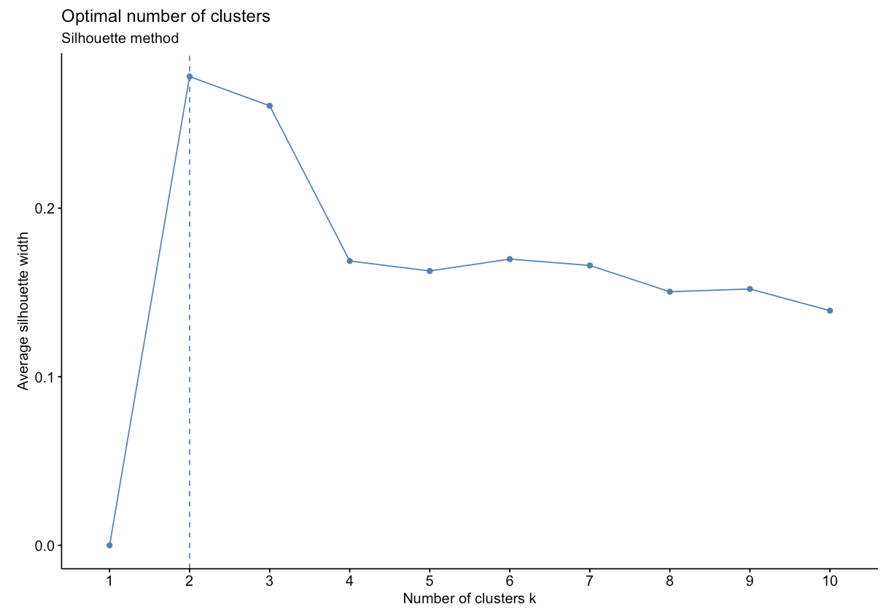
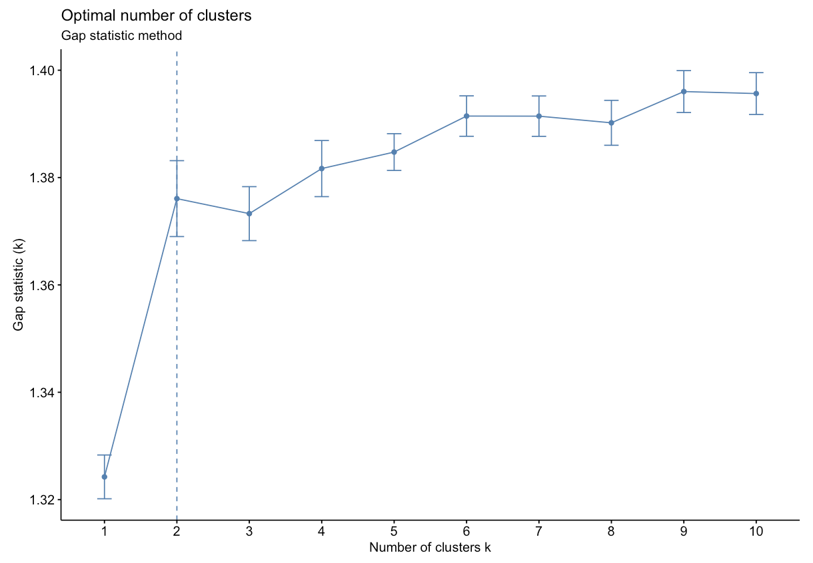
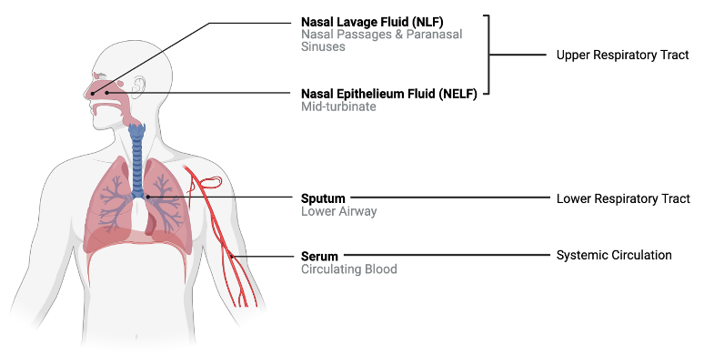

# 5.5 Unsupervised Machine Learning Part 2: Additional Clustering Applications

This training module was developed by Alexis Payton, Lauren E. Koval, David M. Reif, and Julia E. Rager.

All input files (script, data, and figures) can be downloaded from the [UNC-SRP TAME2 GitHub website](https://github.com/UNCSRP/TAME2).

## Introduction to Training Module

The previous module **TAME 2.0 Module 5.4 Unsupervised Machine Learning**, served as introduction to unsupervised machine learning (ML). **Unsupervised ML** involves training a model on a dataset lacking ground truths or response variables. However, in the previous module, the number of clusters was selected based on prior information (i.e., chemical class), but what if you're in a situation where you don't know how many clusters to investigate a priori? This commonly occurs, particularly in the field of environmental health research in instances when investigators want to take a more unbiased view of their data and/or do not have information that can be used to inform the optimal number of clusters to select. In these instances,unsupervised ML techniques can be very helpful, and in this module, we'll explore the following concepts to further understand unsupervised ML:

+ *K*-Means and hierarchical clustering
+ Deriving the optimal number of clusters
+ Visualizing clusters through a PCA-based plot, dendrograms, and heatmaps
+ Determining each variable's contribution to the clusters 
 
 
<br>

## *K*-Means Clustering

As mentioned in the previous module, *K*-means is a common clustering algorithm used to partition quantitative data. This algorithm works by first, randomly selecting a pre-specified number of clusters, *k*, across the data space, with each cluster having a data centroid. When using a standard Euclidean distance metric, the distance is calculated from an observation to each centroid, then the observation is assigned to the cluster of the closest centroid. After all observations have been assigned to one of the *k* clusters, the average of all observations in a cluster is calculated, and the centroid for the cluster is moved to the location of the mean. The process then repeats, with the distance computed between the observations and the updated centroids. Observations may be reassigned to the same cluster or moved to a different cluster if it is closer to another centroid. These iterations continue until there are no longer changes between cluster assignments for observations, resulting in the final cluster assignments that are then carried forward for analysis/interpretation.

Helpful resources on *k*-means clustering include the following: [The Elements of Statistical Learning](https://web.stanford.edu/~hastie/ElemStatLearn/printings/ESLII_print12_toc.pdf) &
[Towards Data Science](https://towardsdatascience.com/k-means-clustering-algorithm-applications-evaluation-methods-and-drawbacks-aa03e644b48a).

<br>

## Hierarchical Clustering
**Hierarchical clustering** groups objects into clusters by repetitively joining similar observations until there is one large cluster (aka agglomerative or bottom-up) or repetitively splitting one large cluster until each observation stands alone (aka divisive or top-down). Regardless of whether agglomerative or divisive hierarchical clustering is used, the results can be visually represented in a tree-like figure called a dendrogram. The dendrogram below is based on the `USArrests` dataset available in R. The datset contains statistics on violent crimes rates (murder, assault, and rape) per capita (per 100,000 residents) for each state in the United States in 1973. For more information on the `USArrests` dataset, check out its associated [RDocumentation](https://www.rdocumentation.org/packages/datasets/versions/3.6.2/topics/USArrests).

```{r fig.align = 'center', echo=FALSE, out.width = "55%"}
knitr::include_graphics("Module5_5_Input/Module5_5_Image1.png")
```

An appropriate title for this figure could be:

“**Figure X. Hierarchical clustering of states based on violent crime.** The dendogram uses violent crime data including murder, assault, and rape rates per 100,000 residents for each state in 1973." 

Takeaways from this dendogram:

+ The 50 states can be grouped into 4 clusters based on violent crime statistics from 1973
+ The dendogram can only show us clusters of states but not the data trends that led to the clustering patterns that we see. Yes, it is useful to know what states have similar violent crime patterns overall, but it is important to pinpoint the variables (ie. murder, assault, and rape) that are responsible for the clustering patterns we're seeing. This idea will be explored later in the module with an environmentally-relevant dataset. 

Going back to hiearchical clustering, during the repetitive splitting or joining of observations, the similarity between existing clusters is calculated after each iteration. This value informs the formation of subsequent clusters. Different methods, or linkage functions, can be considered when calculating this similarity, particularly for agglomerative clustering which is often the preferred approach. Some example methods include:

+ **Complete Linkage**: the maximum distance between two data points located in separate clusters. 
+ **Single Linkage**: the minimum distance between two data points located in separate clusters. 
+ **Average Linkage**: the average pairwise distance between all pairs of data points in separate clusters.
+ **Centroid Linkage**: the distance between the centroids or centers of each cluster.
+ **Ward Linkage**: seeks to minimize the variance between clusters.  

Each method has its advantages and disadvantages and more information on all distance calculations between clusters can be found at the following resource: [Hierarchical Clustering](https://www.learndatasci.com/glossary/hierarchical-clustering/#Hierarchicalclusteringtypes).


### Deriving the Optimal Number of Clusters
Before clustering can be performed, the function needs to be informed of the number of clusters to group the objects into. In the previous module, an example was explored to see if *k*-means clustering would group the chemicals similarly to their chemical class (either a PFAS or statin). Therefore, we told the *k*-means function to cluster into 2 groups. In situations where there is little to no prior knowledge regarding the "correct" number of clusters to specify, methods exist for deriving the optimal number of clusters. Three common methods to find the optimal *k*, or number of clusters, for both *k*-means and hierarchical clustering include: the **elbow method**, **silhouette method**, and the **gap statistic method**. These techniques help us in determining the optimal *k* using visual inspection.

+ **Elbow Method**: uses a plot of the within cluster sum of squares (WCSS) on the y axis and different values of *k* on the x axis. The location where we no longer observe a significant reduction in WCSS, or where an "elbow" can be seen, is the optimal *k* value. As we can see, after a certain point, having more clusters does not lead to a significant reduction in WCSS. 
```{r fig.align = 'center', out.width = "75%", echo=FALSE}

```

Looking at the figures above, the elbow point is much clearer in the first plot versus the second, however, elbow curves from real-world datasets typically resemble the second figure. This is why it's recommended to consider more than one method to determine the optimal number of clusters. 

+ **Silhouette Method**: uses a plot of the average silhouette width (score) on the y axis and different values of *k* on the x axis. The silhouette score is measure of each object's similarity to its own cluster and how dissimilar it is to other clusters. The location where the average silhouette width is *maximized* is the optimal *k* value.
```{r fig.align = 'center', out.width = "65%", echo=FALSE}

```

Based on the figure above, the optimal number of clusters is 2 using the silhouette method. 

+ **Gap Statistic Method**: uses a plot of the gap statistic on the y axis and different values of *k* on the x axis. The gap statistic evaluates the intracluster variation in comparison to expected values derived from a Monte Carlo generated, null reference data distribution for varying values of *k*. The optimal number of clusters is the smallest value where the gap statistic of *k* is greater than or equal to the gap statistic of *k*+1 minus the standard deviation of *k*+1. More details can be found [here](https://uc-r.github.io/kmeans_clustering#:~:text=The%20gap%20statistic%20compares%20the,simulations%20of%20the%20sampling%20process.).
```{r fig.align = 'center', out.width = "65%", echo=FALSE}

```

Based on the figure above, the optimal number of clusters is 2 using the gap statistic method. 

For additional information and code on all three methods, check out [Determining the Optimal Number of Clusters: 3 Must Know Methods](https://www.datanovia.com/en/lessons/determining-the-optimal-number-of-clusters-3-must-know-methods/). It is also worth mentioning that while these methods are useful, further interpreting the result in the context of your problem can be beneficial, for example, checking whether clusters make biological sense when working with a genomic dataset. 

<br>


## Introduction to Example Data

We will apply these techniques using an example dataset from a previously published study where 22 cytokine concentrations were derived from 44 subjects with varying smoking statuses (14 non-smokers, 17 e-cigarette users, and 13 cigarette smokers) from 4 different sampling regions in the body. These samples were derived from nasal lavage fluid (NLF), nasal epithelieum fluid (NELF), sputum, and serum as pictured below. Samples were taken from different regions in the body to compare cytokine expression in the upper respiratory tract, lower respiratory tract, and systemic circulation. 
```{r fig.align = 'center', out.width = "75%", echo=FALSE}

```

A research question that we had was "Does cytokine expression change based on a subject's smoking habits? If so, does cigarette smoke or e-cigarette vapor induce cytokine suppression or proliferation?" Traditionally these questions would have been answered by analyzing each biomarker individually using a two-group comparison test like a t test (which we completed in this study). However, biomarkers do not work in isolation in the body, suggesting that individual biomarker statistical approaches may not capture the full biological responses occurring. Therefore we used a clustering approach to group cytokines as an attempt to more closely simulate interactions that occur *in vivo*. From there, statistical tests were run to assess the effects of smoking status on each cluster. 

For the purposes of this training exercise, we will focus solely on the nasal epithelieum lining fluid, or NELF, samples. In addition, we'll use *k*-means and hierarchical clustering to compare how cytokines cluster at baseline. Full methods are further described in the publication below:

+ Payton AD, Perryman AN, Hoffman JR, Avula V, Wells H, Robinette C, Alexis NE, Jaspers I, Rager JE, Rebuli ME. Cytokine signature clusters as a tool to compare changes associated with tobacco product use in upper and lower airway samples. American Journal of Physiology-Lung Cellular and Molecular Physiology 2022 322:5, L722-L736. PMID: [35318855](https://journals.physiology.org/doi/abs/10.1152/ajplung.00299.2021)

Let's read in and view the dataset we'll be working with.

### Script Preparations

#### Cleaning the global environment
```{r}
rm(list=ls())
```

#### Installing required R packages
If you already have these packages installed, you can skip this step, or you can run the below code which checks installation status for you
```{r, message=FALSE}
if (!requireNamespace("vegan"))
  install.packages("vegan");
if (!requireNamespace("ggrepel"))
  install.packages("ggrepel");
if (!requireNamespace("dendextend"))
  install.packages("dendextend");
if (!requireNamespace("ggsci"))
  install.packages("ggsci");
if (!requireNamespace("FactoMineR"))
install.packages("FactoMineR");
```

#### Loading required R packages
```{r, message=FALSE}
library(readxl)
library(factoextra)
library(FactoMineR)
library(tidyverse)
library(vegan)
library(ggrepel)
library(reshape2)
library(pheatmap)
library(ggsci)
suppressPackageStartupMessages(library(dendextend))
```

#### Set your working directory
```{r, eval=FALSE, echo=TRUE}
setwd("/filepath to where your input files are")
```

#### Importing example dataset

Then let's read in our example dataset. As mentioned in the introduction, this example dataset contains cytokine concentrations derived from 44 subjects. Let's import and view these data:
```{r}
# Reading in file
cytokines_df <- data.frame(read_excel("Module5_5_Input/Module5_5_InputData.xlsx", sheet = 2))

# Viewing data 
head(cytokines_df)
```

These data contain the following information:

+ `Original_Identifier`: initial identifier given to each subject by our wet bench colleagues
+ `Group`: denotes the smoking status of the subject ("NS" = "non-smoker", "Ecig" = "E-cigarette user", "CS" = "cigarette smoker")
+ `SubjectNo`: ordinal subject number assigned to each subject after the dataset was wrangled (1-44)
+ `SubjectID`: unique subject identifier that combines the group and subject number
+ `Compartment`: region of the body from which the sample was taken ("NLF" = "nasal lavage fluid sample", "NELF" = "nasal epithelieum lining fluid sample", "Sputum" = "induced sputum sample", "Serum" = "blood serum sample")
+ `Protein`: cytokine name
+ `Conc`: concentration (pg/mL)
+ `Conc_pslog2`: psuedo-log~2~ concentration

Now that the data has been read in, we can start by asking some initial questions about the data.

### Training Module's Environmental Health Questions
This training module was specifically developed to answer the following environmental health questions:

1. What is the optimal number of clusters the cytokines can be grouped into that were derived from nasal epithelium fluid (NELF) in non-smokers using *k*-means clustering?
2. After selecting a cluster number, which cytokines were assigned to each *k*-means cluster?
3. What is the optimal number of clusters the cytokines can be grouped into that were derived from nasal epithelium fluid (NELF) in non-smokers using hierarchical clustering?
4. How do the hierarchical cluster assignments compare to the *k*-means cluster assignments?
5. Which cytokines have the greatest contributions to the first two eigenvectors?

To answer the first environmental health question, let's start by filtering to include only NELF derived samples and non-smokers.
```{r}
baseline_df <- cytokines_df %>%
    filter(Group == "NS", Compartment == "NELF") 

head(baseline_df)
```

The functions we use will require us to cast the data wider. We will accomplish this using the `dcast()` function from the *reshape2* package. 
```{r}
wider_baseline_df <- reshape2::dcast(baseline_df, Protein ~ SubjectID, value.var = "Conc_pslog2") %>% 
  column_to_rownames("Protein")

head(wider_baseline_df)
```

Now we can derive clusters using the `fviz_nbclust()` function to determine the optimal *k* based on suggestions from the elbow, silhouette, and gap statistic methods. We can use this code for both *k*-means and hierarchical clustering by changing the `FUNcluster` parameter. Lets start with *k*-means:.
```{r fig.align = 'center'}
# Elbow method
fviz_nbclust(wider_baseline_df, FUNcluster = kmeans, method = "wss") +
  labs(subtitle = "Elbow method") 

# Silhouette method
fviz_nbclust(wider_baseline_df, FUNcluster = kmeans, method = "silhouette") + 
  labs(subtitle = "Silhouette method") 

# Gap statistic method
fviz_nbclust(wider_baseline_df, FUNcluster = kmeans, method = "gap_stat") + 
  labs(subtitle = "Gap Statisitc method") 
```

The elbow method is suggesting 2 or 3 clusters, the silhouette method is suggesting 2, and the gap statistic method is suggesting 1. Since each of these methods is recommending different *k* values, we can go ahead and run *k*-means to visualize the clusters and test those different *k*'s. *K*-means clusters will be visualized using the `fviz_cluster()` function.
```{r fig.align = 'center'}
# Choosing to iterate through 2 or 3 clusters using i as our iterator
for (i in 2:3){
    # nstart = number of random starting partitions, it's recommended for nstart > 1
    cluster_k <- kmeans(wider_baseline_df, centers = i, nstart = 25)
    cluster_plot <- fviz_cluster(cluster_k, data = wider_baseline_df) + ggtitle(paste0("k = ", i))
    print(cluster_plot)
}
```

### Answer to Environmental Health Question 1
:::question
*With this, we can answer **Environmental Health Question #1***: What is the optimal number of clusters the cytokines can be grouped into that were derived from nasal epithelium fluid (NELF) in non-smokers using *k*-means clustering?
:::

:::answer
**Answer**: 2 or 3 clusters can be justified here, based on using the elbow or silhouette method or if *k*-means happens to group cytokines together that were implicated in similar biological pathways. In the final paper, we moved forward with 3 clusters, because it was justifiable from the methods and provided more granularity in the clusters. 
:::

The final cluster assignments can easily be obtained using the `kmeans()` function from the *stats* package. 
```{r}
cluster_kmeans_3 <- kmeans(wider_baseline_df, centers = 3, nstart = 25)
cluster_kmeans_df <- data.frame(cluster_kmeans_3$cluster) %>%
    rownames_to_column("Cytokine") %>%
    rename(`K-Means Cluster` = cluster_kmeans_3.cluster) %>%
    # Ordering the dataframe for easier comparison
    arrange(`K-Means Cluster`)

cluster_kmeans_df
```

### Answer to Environmental Health Question 2
:::question
*With this, we can answer **Environmental Health Question #2***: After selecting a cluster number, which cytokines were assigned to each *k*-means cluster?
:::

:::answer
**Answer**: After choosing the number of clusters to be 3, the cluster assignments are as follows: 
```{r fig.align = 'center', echo=FALSE}
knitr::include_graphics("Module5_5_Input/Module5_5_Image7.png")
```
:::

<br>

## Hierarchical Clustering

Next, we'll turn our attention to answering environmental health questions 3 and 4: What is the optimal number of clusters the cytokines can be grouped into that were derived from nasal epithelium fluid (NELF) in non-smokers using hierarchical clustering? How do the hierarchical cluster assignments compare to the *k*-means cluster assignments?

Just as we used the elbow method, silhouette profile, and gap statistic to determine the optimal number of clusters for *k*-means, we can leverage the same approaches for hierarchical by changing the `FUNcluster` parameter.
```{r fig.align = 'center'}
# Elbow method
fviz_nbclust(wider_baseline_df, FUNcluster = hcut, method = "wss") +
  labs(subtitle = "Elbow method") 

# Silhouette method
fviz_nbclust(wider_baseline_df, FUNcluster = hcut, method = "silhouette") + 
  labs(subtitle = "Silhouette method") 

# Gap statistic method
fviz_nbclust(wider_baseline_df, FUNcluster = hcut, method = "gap_stat") + 
  labs(subtitle = "Gap Statisitc method") 
```
We can see the results are quite similar with 2-3 clusters appearing optimal.

### Answer to Environmental Health Question 3
:::question
*With this, we can answer **Environmental Health Question #3***: What is the optimal number of clusters the cytokines can be grouped into that were derived from nasal epithelium fluid (NELF) in non-smokers using hierarchical clustering?
:::

:::answer
**Answer**: Again, 2 or 3 clusters can be justified here, but for the same reasons mentioned for the first environmental health question, we landed on 3 clusters.
:::

Now we can perform the clustering and visualize and extract the results. We'll start by using the `dist()` function to calculate the euclidean distance between the clusters followed by the `hclust()` function to obtain the hierarchical clustering assignments. 
```{r}
# Viewing the wider dataframe we'll be working with
head(wider_baseline_df)
```


```{r}
# First scaling data with each subject (down columns)
scaled_df <- data.frame(apply(wider_baseline_df, 2, scale))
rownames(scaled_df) = rownames(wider_baseline_df)

head(scaled_df)
```

The `dist()` function is initially used to calculate the Euclidean distance between each cytokine. Next, the `hclust()` function is used to run the hierarchical clustering analysis using the complete method by default. The method can be changed in the function using the method parameter.
```{r}
# Calculating euclidean dist
dist_matrix <- dist(scaled_df, method = 'euclidean')

# Hierarchical clustering
cytokines_hc <- hclust(dist_matrix)
```

Now we can generate a dendrogram to help us evaluate the results using the `fviz_dend()` function from the *factoextra* package. We use k=3 to be consistent with the *k*-means analysis.
```{r fig.align = 'center', out.width = "75%", warning=FALSE}
    fviz_dend(cytokines_hc, k = 3, # Specifying k
              cex = 0.85, # Label size
              palette = "futurama", # Color palette see ?ggpubr::ggpar
              rect = TRUE, rect_fill = TRUE, # Add rectangle around groups
              horiz = TRUE, # Changes the orientation of the dendogram 
              rect_border = "futurama",  # Rectangle color
              labels_track_height = 0.8  # Changes the room for labels
             )
```

We can also extract those cluster assignments using the `cutree()` function from the *stats* package.
```{r}
hc_assignments_df <- data.frame(cutree(cytokines_hc, k = 3)) %>%
    rownames_to_column("Cytokine") %>%
    rename(`Hierarchical Cluster` = cutree.cytokines_hc..k...3.) %>%
    # Ordering the dataframe for easier comparison
    arrange(`Hierarchical Cluster`)

# Combining the dataframes to compare the cluster assignments from each approach
 comp <- full_join(cluster_kmeans_df, hc_assignments_df, by = "Cytokine")
 
 comp
```

For additional resources on running hierarchical clustering in R, see [Visualizing Clustering Dendrogram in R](https://agroninfotech.blogspot.com/2020/06/visualizing-clusters-in-r-hierarchical.html) and [Hiearchical Clustering on Principal Components](http://www.sthda.com/english/articles/31-principal-component-methods-in-r-practical-guide/117-hcpc-hierarchical-clustering-on-principal-components-essentials/).

### Answer to Environmental Health Question 4
:::question
*With this, we can answer **Environmental Health Question #4***: How do the hierarchical cluster assignments compare to the *k*-means cluster assignments?
:::

:::answer
**Answer**: Though this may not always be the case, in this instance, we see that *k*-means and hierarchical clustering with k=3 clusters yield the same groupings despite the clusters being presented in a different order.
:::

<br>

## Clustering Plot

One additional way to visualize clustering is to plot the first two principal components on the axes and color the data points based on their corresponding cluster. This visualization can be used for both *k*-means and hierarchical clustering using the `fviz_cluster()` function. This figure is essentially a PCA plot with shapes drawn around each cluster to make them distinct from each other.
```{r fig.align = 'center', fig.height=5.5, fig.width=6}
fviz_cluster(cluster_kmeans_3, data = wider_baseline_df)
```

Rather than using the `fviz_cluster()` function as shown in the figure above, we'll extract the data to recreate the sample figure using `ggplot()`. For the manuscript this was necessary, since it was important to facet the plots for each compartment (i.e., NLF, NELF, sputum, and serum). For a single plot, this data extraction isn't required, and the figure above can be further customized within the `fviz_cluster()` function. However, we'll go through the steps of obtaining the indices to recreate the same polygons in `ggplot()` directly. 

*K*-means actually uses principal component analysis (PCA) to reduce a dataset's dimensionality prior to obtaining the cluster assignments and plotting those clusters. Therefore, to obtain the coordinates of each cytokine within their respective clusters, PCA will need to be run first. 
```{r}
# First running PCA
pca_cytokine <- prcomp(wider_baseline_df, scale = TRUE, center = TRUE)
# Only need PC1 and PC2 for plotting, so selecting the first two columns
baseline_scores_df <- data.frame(scores(pca_cytokine)[,1:2]) 
baseline_scores_df$Cluster <- cluster_kmeans_3$cluster
baseline_scores_df$Protein <- rownames(baseline_scores_df)

# Changing cluster to a character for plotting
baseline_scores_df$Cluster = as.character(baseline_scores_df$Cluster)

head(baseline_scores_df)
```

Within each cluster, the `chull()` function is used to compute the indices of the points on the convex hull. These are needed for `ggplot()` to create the polygon shapes of each cluster. 
```{r}
# hull values for cluster 1
cluster_1 <- baseline_scores_df[baseline_scores_df$Cluster == 1, ][chull(baseline_scores_df %>% 
                                                                    filter(Cluster == 1)),]  
# hull values for cluster 2
cluster_2 <- baseline_scores_df[baseline_scores_df$Cluster == 2, ][chull(baseline_scores_df %>% 
                                                                    filter(Cluster == 2)),] 
# hull values for cluster 3
cluster_3 <- baseline_scores_df[baseline_scores_df$Cluster == 3, ][chull(baseline_scores_df %>% 
                                                                    filter(Cluster == 3)),]  
all_hulls_baseline <- rbind(cluster_1, cluster_2, cluster_3)
# Changing cluster to a character for plotting
all_hulls_baseline$Cluster = as.character(all_hulls_baseline$Cluster)

head(all_hulls_baseline)
```

Now plotting the clusters using `ggplot()`.
```{r fig.align = 'center', fig.height=5.5, fig.width=6}
ggplot() + 
  geom_point(data = baseline_scores_df, aes(x = PC1, y = PC2, color = Cluster, shape = Cluster), size = 4) + 
  # Adding cytokine names
  geom_text_repel(data = baseline_scores_df, aes(x = PC1, y = PC2, color = Cluster, label = Protein), 
                  show.legend = FALSE, size = 4.5) + 
  # Creating polygon shapes of the clusters
  geom_polygon(data = all_hulls_baseline, aes(x = PC1, y = PC2, group = as.factor(Cluster), fill = Cluster, 
                                        color = Cluster), alpha = 0.25, show.legend = FALSE) + 

  theme_light() + 
  theme(axis.text.x = element_text(vjust = 0.5), #rotating x labels/ moving x labels slightly to the left
        axis.line = element_line(colour="black"), #making x and y axes black
        axis.text = element_text(size = 13), #changing size of x axis labels
        axis.title = element_text(face = "bold", size = rel(1.7)), #changes axis titles
        legend.title = element_text(face = 'bold', size = 17), #changes legend title
        legend.text = element_text(size = 14), #changes legend text
        legend.position = 'bottom', # moving the legend to the bottom
        legend.background = element_rect(colour = 'black', fill = 'white', linetype = 'solid'), #changes the legend background
        strip.text.x = element_text(size = 18, face = "bold"), #changes size of facet x axis 
        strip.text.y = element_text(size = 18, face = "bold")) + #changes size of facet y axis 
  xlab('Dimension 1 (85.1%)') + ylab('Dimension 2 (7.7%)') + #changing axis labels 

  # Using colors from the startrek palette from ggsci
  scale_color_startrek(name = 'Cluster') +
  scale_fill_startrek(name = 'Cluster') 
```

An appropriate title for this figure could be:

“**Figure X. *K*-means clusters of cytokines at baseline.** Cytokines samples are derived from nasal epithelium (NELF) samples in 14 non-smoking subjects. Cytokine concentration values were transformed using a data reduction technique known as Principal Component Analysis (PCA). The first two eigenvectors plotted on the axes were able to capture a majority of the variance across all samples from the original dataset."

Takeaways from this clustering plot:

+ PCA was able to capture almost all (~93%) of the variance from the original dataset 
+ The 22 cytokines were able to be clustered into 3 distinct clusters using *k*-means

<br>

## Hierarchical Clustering Visualization

We can also build a heatmap using the `pheatmap()` function that has the capability to display hierarchical clustering dendrograms. To do so, we'll need to go back and use the `wider_baseline_df` dataframe.
```{r fig.align = 'center', fig.height=7, fig.width=8}
pheatmap(wider_baseline_df, 
            cluster_cols = FALSE, # hierarchical clustering of cytokines
            scale = "column",    # scaling the data to make differences across cytokines more apparent
            cutree_row = 3, # adds a space between the 3 largest clusters
            display_numbers = TRUE, number_color = "black", fontsize = 12, # adding average concentration values
            angle_col = 45, fontsize_col = 12, fontsize_row = 12, # adjusting size/ orientation of axes labels
            cellheight = 17, cellwidth = 30 # setting height and width for cells
)
```

An appropriate title for this figure could be:

“**Figure X. Hierarchical clustering of cytokines at baseline.** Cytokines samples are derived from nasal epithelium (NELF) samples in 14 non-smoking subjects. The heatmap visualizes psuedo log~2~ cytokine concentrations that were scaled within each subject."

It may be helpful to add axes titles like "Subject ID" for the x axis, "Cytokine" for the y axis, and "Scaled pslog~2~ Concentration" for the legend after exporting from R. The `pheatmap()` function does not have the functionality to add those titles. 

Nevertheless, let's identify some key takeaways from this heatmap:

+ The 22 cytokines were able to be clustered into 3 distinct clusters using hierarchical clustering
+ These clusters are based on cytokine concentration levels with the first cluster having the highest expression, the second cluster having the lowest expression, and the last cluster having average expression

<br>

## Variable Contributions
To answer our final environmental health question: Which cytokines have the greatest contributions to the first two eigenvectors, we'll use the `fviz_contrib()` function that plots the percentage of each variable's contribution to the principal component(s). It also displays a red dashed line, and variables that fall above are considered to have significant contributions to those principal components. For a refresher on PCA and variable contributions, see the previous module, **TAME 2.0 Module 5.4 Unsupervised Machine Learning**.
```{r fig.align = 'center'}
# kmeans contributions
fviz_contrib(pca_cytokine, 
             choice = "ind", addlabels = TRUE,
             axes = 1:2) # specifies to show contribution percentages for first 2 PCs

```

An appropriate title for this figure could be:

“**Figure X. Cytokine contributions to principal components.** The bar chart displays each cytokine's contribution to the first two eigenvectors in descending order from left to right. The red dashed line represents the expected contribution of each cytokine if all inputs were uniform, therefore the seven cytokines that fall above this reference line are considered to have significant contributions to the first two principal components." 

### Answer to Environmental Health Question 5
:::question
*With this, we can answer **Environmental Health Question #5***: Which cytokines have the greatest contributions to the first two eigenvectors?
:::

:::answer
**Answer**: The cytokines that have significant contributions to the first two principal components include IL-8, Fractalkine, IP-10, IL-4, MIG, I309, and IL-12p70. 
:::

<br>

## Concluding Remarks
In this module, we explored scenarios where clustering would be appropriate but lack contextual details informing the number of clusters that should be considered, thus resulting in the need to derive such a number. In addition, methodology for *k*-means and hierarchical clustering was presented, along with corresponding visualizations. Lastly, variable contributions to the eigenvectors were introduced as a means to determine the most influential variables on the principal components' composition. 

### Additional Resources
+ [*K*-Means Cluster Analysis](https://uc-r.github.io/kmeans_clustering#silo)
+ [*K*-Means Clustering in R](https://www.datanovia.com/en/lessons/k-means-clustering-in-r-algorith-and-practical-examples/)
+ [Hierarchical Clustering in R](https://uc-r.github.io/hc_clustering)

<br>

<label class="tykfont">
Test Your Knowledge 
</label>

:::tyk
Using the same dataset, answer the questions below. 

1. Determine the optimal number of *k*-means clusters of cytokines derived from the nasal epithelieum lining fluid of **e-cigarette users**. 
2. How do those clusters compare to the ones that were derived at baseline (in non-smokers)?
3. Which cytokines have the greatest contributions to the first two eigenvectors?
:::