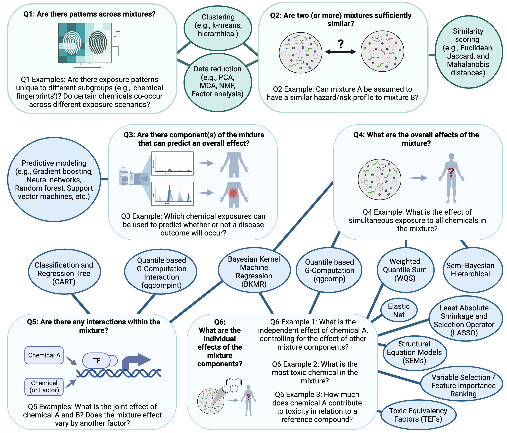

# 6.3 Mixtures Analysis Methods Part 1: Overview and Example with Quantile G-Computation 

This training module was developed by Dr. Lauren Eaves, Dr. Kyle Roell, and Dr. Julia E. Rager.

All input files (script, data, and figures) can be downloaded from the [UNC-SRP TAME2 GitHub website](https://github.com/UNCSRP/TAME2).


```{r , include=FALSE}
#set default values for R Markdown "knitting" to HTML, Word, or PDF
knitr::opts_chunk$set(echo = TRUE) #print code chunks
```


## Introduction to Training Module 

Historically, toxicology and epidemiology studies have largely focused on analyzing relationships between one chemical and one outcome at a time. This is still important in identifying the degree to which a single chemical exposure is associated with a disease outcome (e.g., [UNC Superfund Research Program's](https://sph.unc.edu/superfund-pages/srp/) focus on inorganic arsenic exposure and its influence on metabolic disease). However, we are exposed, everyday, to many different stressors in our environment. It is therefore critical to deconvolute what co-occurring stressors (i.e., mixtures) in our environment impact human health! The field of mixtures research continues to grow to address this need, with the goals of developing methods to study environmental exposures using approaches to that better capture the mixture of exposures humans experience in real life. In this module, we will provide an overview of mixtures analysis methods and demonstrate how to use one of these methods, quantile g-computation, to analyzing chemical mixtures in a large geospatial epidemiologic study. 


## Overview of Mixtures Analysis 

### Mixtures Methods Relevance and Challenges 

**Mixtures approaches are recently becoming more routine in environmental health because methodological advancements are just now making mixtures research more feasible.** These advancements parallel the following:

+ Advances in the ability to measure many different chemicals (e.g., through suspect screening and non-targeted chemical analysis approaches) and stressors (e.g., through improved collection and storage of survey data and clinical data) in our environment
+ Improvements in data science to organize, store, and analyze big data
+ Developments in statistical methodologies to parse relationships within these data

Though statistical methodologies are still evolving, we will be discussing our current knowledge in this module.

**Some challenges that data analysts may experience when analyzing data from mixtures studies include the following:**

1. Size of mixture:
+ As the number of components evaluated increases, your available analysis methods and statistical power may decrease

2. Correlated data structure:
+ Statistical challenge of collinearity: If data include large amounts of collinearity, this may dampen the observed effects from components that are highly correlated (e.g., may commonly co-occur) to other components
+ Methodological challenge of co-occurring contaminant confounding: Co-occurring contaminant confounding may make it difficult to discern what is the true driver of the observed effect.

3. Data analysis method selection:
+ There are many different methods to choose from!
+ A critical rule to address this challenge is to, first and foremost, *lay out your study's question*. This question will then help guide your method selection, as discussed below.


### Overview of Mixtures Methods

There are many methods that can be implemented to also elucidate relationships between individual chemicals/chemical groups in complex mixtures and their resulting toxicity/health effects. Some of the more common methods used in mixtures analyses, as identified by our team, are summarized in the below figure according to potential questions that could be asked in a study. Two of the methods, specifically quantile based g-computation (qgcomp) and bayesian kernel machine regression (BKMR) are highlighted as example mixtures scripted activities (qgcomp in this script and BKMR in Mixtures Methods 2). Throughout TAME 2.0 training materials, other methods are included such as Principal Component Analysis (PCA), K-means clustering, hierarchical clustering, and predictive modeling / machine learning (e.g., Random Forest modeling and variable selection). The following figure provides an overview of the types of questions that can be asked regarding mixtures and models that are commonly used to answer these questions:

```{r, echo=FALSE, fig.align='center'} 

```

In this module, we will be using quantile based g-computation to analyze our data. This method is used for analysis of a total mixture effect as opposed to individual effects of mixture components. It is similar to previous, popular methods such as weighted quantile sum (WQS) regression, but does not assume directional homogeneity. It also provides access to models for non-additive and non-linear effects of the individual mixture components and overall mixture. Additionally, it runs very quickly and does not require as much computationally as other methods, making it an accessible option for those without access to many computational resources.


## Introduction to Example Data

This script outlines single-contaminant (logistic regression) and multi-contaminant modeling approaches (Quantile G-Computation (qgcomp)). The workflow follows the steps used to generate results published in [Eaves et al. 2023](https://pubmed.ncbi.nlm.nih.gov/37845729/). This study examined the relationship between metals in private well water and the risk of preterm birth. The study population was all singleton, non-anomalous births in NC between 2003-2015. Pregnancies were assigned tract-level metal exposure based on maternal residence at delivery. The relationship with single metal exposure was examined with logistic regression and metal mixtures with qgcomp.  

For more info on qgcomp, see [Keil et al. 2020](:https://ehp.niehs.nih.gov/doi/full/10.1289/EHP5838) and the associated [vignette](https://cran.r-project.org/web/packages/qgcomp/vignettes/qgcomp-vignette.html). 

Note that for educational purposes, in this example we are using a randomly sampled dataset of 100,000 births, rather than the full dataset of >1.3million (ie. using less than 10% of the full study population). Therefore the actual results of the analysis outlined below do not match the results published in the paper. 


### Training Module's Environmental Health Questions 

This training module was specifically developed to answer the following questions:

1. What is the risk of preterm birth associated with exposure to each of arsenic, lead, cadmium, chromium, manganese, copper and zinc via private well water individually?

2. What is the risk of preterm birth associated with combined exposure to arsenic, lead, cadmium, chromium, manganese, copper and zinc (ie. a mixture) via private well water?

3. Which of these chemicals has the strongest effect on preterm birth risk?

4. Which of these chemicals increases the risk of preterm birth and which decreases the risk of preterm birth?

### Workspace Preparation

Install packages as needed, then load the following packages:
```{r cars, message = FALSE}
#load packages
library(tidyverse)
library(ggplot2)
library(knitr)
library(yaml)
library(rmarkdown)
library(broom)
library(ggpubr)
library(qgcomp)
```


Optionally, you can also create a current date variable to name output files, and create an output folder. 
```{r eval = FALSE}
# Create a current date variable to name outputfiles
cur_date <- str_replace_all(Sys.Date(),"-","")

#Create an output folder 
Output_Folder <- ("Module6_3_Output/")
```

### Data Import 
```{r}
cohort <- read.csv(file="Module6_3_Input/Module6_3_InputData.csv")
colnames(cohort)
head(cohort)
```

Note: there are many steps prior to the modeling steps outlined below. These are being skipped for educational purposes. Additional steps include assessment of normality and  transformations as needed, generation of a demographics table and assessing for missing data, imputation of missing data if needed, visualizing trends and distributions in the data, functional form assessments, decisions regarding what confounders to include etc.   

The following are the metals of interest: arsenic, lead, cadmium, chromium, manganese, copper, zinc. 

For each metal there are three exposure variables:   
  
1. [metal]_perc: 0: less than or equal to the 50th percentile, 1: above the 50th percentile and less than or equal to the 90th percentile, 3: above the 90th percentile
2. [metal]_limit: 0: <25% f well water tests for a given metal exceeded EPA regulatory standard, 1: 25% or over of well water tests for a given metal exceeded EPA regulatory standard
3. [metal].Mean_avg: the mean concentration of the metal in the tract (ppb). 
Please see the Eaves et al. 2023 paper linked above for further information on these variables. 

Other variables of interest (outcome and covariates) in this dataset:   
  
 * preterm:	0= 37 weeks gestational age or greater, 1= less than 37 weeks gestational age 
 * mage: maternal age in years, continuous
 * sex: sex of baby at birth: 1=M, 2=F
 * racegp: maternal race ethnicity: 1=white non-Hispanic, 2=Black non-Hispanic, 3=Hispanic, 4=Asian/Pacific Islander, 5=American Indian, 6=other/unknown
 * smoke: maternal smoking in pregnany: 0=non-smoker, 1=smoker 
 * season_conep: season of conception: 1=winter (Dec, Jan, Feb), 2=spring (Mar, Apr, May), 3=summer (June, Jul, Aug), 4=fall (Sept, Oct, Nov) 
 * mothed: mother's education: 1=<HS, 2=HS, 3=more than HS
 * pov_perc: ACS estimates for poverty rate in tract: 0=less than or equal to 25th percentile, 1= greater than 25th percentile and less than or equal to 50th percentile, 2= greater than 50th percentile and less than or equal to 75th percentile, 3= greater than 75th percentile
 * Nitr_perc: average of nitrites and nitrates in well water: 0= less than or equal to the 50th percentile, 1= above the 50th percentile and less than or equal to the 90th percentile, 2: above the 90th percentile

#### Check variable formats

Ensure that the outcome variable is binomial (factor) and has the correct reference level. Ensure that the exposure variables are categorical (factors). Ensure that covariates are in the correct variable format 
```{r, message=F, warning=F, error=F}

#outcome variable
cohort <- cohort %>% 
  mutate(preterm = as.factor(preterm)) 
cohort$preterm <- relevel(cohort$preterm, ref = "0")

#exposure variables
cohort <- cohort %>% 
  mutate(Arsenic_perc=as.factor(Arsenic_perc)) %>% 
  mutate(Cadmium_perc=as.factor(Cadmium_perc)) %>% 
  mutate(Chromium_perc=as.factor(Chromium_perc)) %>% 
  mutate(Copper_perc=as.factor(Copper_perc)) %>% 
  mutate(Lead_perc=as.factor(Lead_perc)) %>% 
  mutate(Manganese_perc=as.factor(Manganese_perc)) %>% 
  mutate(Zinc_perc=as.factor(Zinc_perc)) %>% 
  mutate(Arsenic_limit=as.factor(Arsenic_limit)) %>% 
  mutate(Cadmium_limit=as.factor(Cadmium_limit)) %>% 
  mutate(Chromium_limit=as.factor(Chromium_limit)) %>% 
  mutate(Copper_limit=as.factor(Copper_limit)) %>% 
  mutate(Lead_limit=as.factor(Lead_limit)) %>% 
  mutate(Manganese_limit=as.factor(Manganese_limit)) %>% 
  mutate(Zinc_limit=as.factor(Zinc_limit)) 


#ensure covariates are in correct variable type form 
cohort <- cohort %>% 
  mutate(racegp = as.factor(racegp)) %>% 
  mutate(mage = as.numeric(mage)) %>% 
  mutate(mage_sq = as.numeric(mage_sq)) %>% 
  mutate(smoke = as.numeric(smoke)) %>% 
  mutate(season_concep = as.factor(season_concep)) %>% 
  mutate(mothed = as.numeric(mothed)) %>% 
  mutate(Nitr_perc = as.numeric(Nitr_perc)) %>% 
  mutate(sex = as.factor(sex))%>% 
  mutate(pov_perc = as.factor(pov_perc))

```

#### Fit adjusted logistic regression models for each metal, for each categorical variable

First, we will fit an adjusted logistic regression model for each metal, for each categorical variable, to demonstrate a variable by variable approach before diving into mixtures methods. Note that there are different regression techniques (linear and logistic are covered in another TAME module) and that here we will start with using percentage variables.
```{r, message=F, warning=F, error=F}

metals <- c("Arsenic","Cadmium","Chromium", "Copper","Lead","Manganese","Zinc")

for (i in 1:length(metals)) {
  metal <- metals[[i]]
  metal <- as.name(metal)
  print(metal)
  
  print(is.factor(eval(parse(text = paste0("cohort$",metal,"_perc"))))) #check that metal var is a factor

  mod <- glm(preterm ~ eval(parse(text = paste0(metal,"_perc"))) + mage + mage_sq+ racegp + smoke + season_concep + mothed + Nitr_perc + pov_perc, family=binomial, data=cohort)
  
  mod_tid <- tidy(mod, conf.int=TRUE, conf.level=0.95) %>% 
  mutate(model_name=paste0(metal,"_adj_perc")) %>% 
  mutate(OR = exp(estimate)) %>% 
  mutate(OR.conf.high = exp(conf.high)) %>% 
  mutate(OR.conf.low = exp(conf.low)) 

  mod_tid[2,1] <- paste0(metal,"_perc_50to90")
  mod_tid[3,1] <- paste0(metal,"_perc_over90")
  
  plot <- mod_tid %>% 
  filter(grepl('perc_', term))%>% 
  ggplot(aes(OR, term, xmin = OR.conf.low, xmax = OR.conf.high, height = 0)) +
  geom_point() +
  scale_x_continuous(trans="log10")+
  geom_errorbarh()
  
  assign(paste0(metal,"_adj_perc"),mod_tid) 
  assign(paste0(metal,"_adj_perc_plot"),plot) 
  
}

```

Plot the results:
```{r, message=F, warning=F, error=F, fig.align='center'}


perc_plots <- ggarrange(Arsenic_adj_perc_plot,
                        Cadmium_adj_perc_plot,
                        Chromium_adj_perc_plot,
                        Copper_adj_perc_plot)
plot(perc_plots)

perc_plots1 <- ggarrange(Lead_adj_perc_plot,
                        Manganese_adj_perc_plot,
                        Zinc_adj_perc_plot)
plot(perc_plots1)
```

Save the plots:
```{r, eval = FALSE}
tiff(file = (paste0(Output_Folder,"/", cur_date, "_NCbirths_pretermbirth_singlemetal_adjusted_models_percplots_1.tiff")), width = 10, height = 8, units = "in", pointsize = 12, res = 600)
plot(perc_plots)
dev.off()

tiff(file = (paste0(Output_Folder,"/", cur_date, "_NCbirths_pretermbirth_singlemetal_adjusted_models_percplots_2.tiff")), width = 10, height = 8, units = "in", pointsize = 12, res = 600)
plot(perc_plots1)
dev.off()

```

We can also run the analysis using limit variables: 
```{r, message=F, warning=F, error=F, fig.align='center'}

  for (i in 1:length(metals)) {
  metal <- metals[[i]]
  metal <- as.name(metal)
  print(metal)
  
  print(is.factor(eval(parse(text = paste0("cohort$",metal,"_limit"))))) #check that metal var is a factor

  mod <- glm(preterm ~ eval(parse(text = paste0(metal,"_limit")))+ mage + mage_sq+ racegp + smoke + season_concep + mothed + Nitr_perc + pov_perc, family=binomial, data=cohort)
  
  mod_tid <- tidy(mod, conf.int=TRUE, conf.level=0.95) %>% 
  mutate(model_name=paste0(metal,"_adj_limit")) %>% 
  mutate(OR = exp(estimate)) %>% 
  mutate(OR.conf.high = exp(conf.high)) %>% 
  mutate(OR.conf.low = exp(conf.low)) 

  mod_tid[2,1] <- paste0(metal,"_limit_over25perc")
  
  plot <- mod_tid %>% 
  filter(grepl('limit', term))%>%
  ggplot(aes(OR, term, xmin = OR.conf.low, xmax = OR.conf.high, height = 0)) +
  geom_point() +
  scale_x_continuous(trans="log10")+
  geom_errorbarh()
  
  assign(paste0(metal,"_adj_limit"),mod_tid) 
  assign(paste0(metal,"_adj_limit_plot"),plot) 
  
}
```
Note: you will get this warning for some of the models:   
"Warning: glm.fit: fitted probabilities numerically 0 or 1". 
This is because for the variability in the exposure data, ideally the sample size would be larger (as noted above the analysis this draws from was completed on >1.3million observations). 

Plot the results:
```{r, message=F, warning=F, error=F, fig.align='center'}
limit_plots <- ggarrange(Arsenic_adj_limit_plot,
                        Cadmium_adj_limit_plot,
                        Chromium_adj_limit_plot,
                        Copper_adj_limit_plot)

plot(limit_plots)

limit_plots1 <- ggarrange(Lead_adj_limit_plot,
                        Manganese_adj_limit_plot,
                        Zinc_adj_limit_plot)

plot(limit_plots1)
```

Save the plots:
```{r, eval = FALSE}
tiff(file = (paste0(Output_Folder,"/", cur_date, "_NCbirths_pretermbirth_singlemetal_adjusted_models_limitplots1.tiff")), width = 10, height = 8, units = "in", pointsize = 12, res = 600)
plot(limit_plots)
dev.off()

tiff(file = (paste0(Output_Folder,"/", cur_date, "_NCbirths_pretermbirth_singlemetal_adjusted_models_limitplots2.tiff")), width = 10, height = 8, units = "in", pointsize = 12, res = 600)
plot(limit_plots1)
dev.off()
```

Merge all of the logistic regression model results. This is the data frame that you could export for supplementary material or to view the results in Excel. 
```{r, message=F, warning=F, error=F}
#merge all model output 
results_df <- rbind(Arsenic_adj_perc, Arsenic_adj_limit,
                    Cadmium_adj_perc, Cadmium_adj_limit,
                    Chromium_adj_perc, Chromium_adj_limit,
                    Copper_adj_perc, Copper_adj_limit,
                    Lead_adj_perc, Lead_adj_limit,
                    Manganese_adj_perc, Manganese_adj_limit,
                    Zinc_adj_perc, Zinc_adj_limit)
```

To select only the coefficients related to the primary exposures:
```{r}
results_df <- results_df %>% filter(str_detect(term, 'limit|50to90|over90')) 
```

This file outputs the coefficients and the odds ratios (OR) of the logistic regression models all together. 
+ The ORs in associated with [metal]_perc_50to90 can be interpreted as the OR comparing the odds of preterm birth among individuals in the 50th to 90th percentile of [metal] exposure compared to those below the 50th. 
+ The ORs in associated with [metal]_perc_over90 can be interpreted as the OR comparing the odds of preterm birth among individuals above the 90th percentile of [metal] exposure compared to those below the 50th. 
+ The ORs in associated with [metal]_limit_over25perc can be interpreted as the OR comparing the odds of preterm birth among individuals living in census tracts in with tests exceeding the an EPA standard for [metal] in 25% or more tests versus tracts with less that 25% of tests exceeding the standard 


### Answer to Environmental Health Question 1
:::question
*With this, we can answer also **Environmental Health Question #1***: What is the risk of preterm birth associated with exposure to each of arsenic, lead, cadmium, chromium, manganese, copper and zinc via private well water individually?
:::

:::answer
**Answer**: Using the interpretation guides described in the prior paragraph and the "_NCbirths_pretermbirth_singlemetal_adjusted_models.csv" file, you can answer this question. For example, for cadmium, compared to individuals residing in census tracts with cadmium below the 50th percentile, those residing in tracts with lead between the 50th and 90th percentile had a 7% increase in the adjusted odds of PTB (aOR 1.07 (95% CI: 1.00,1.14)) and those in tracts with cadmium above the 90th percentile had a 8% increased adjusted odds of PTB (aOR 1.08 (95% CI: 0.97,1.20). Compared to individuals in tracts with less than 25% of tests exceeding the standard for lead (note this is the EPA treatment technique action level=15 ppb), individuals residing in census tracts where 25% or more of tests exceeded the MCL had 1.23 (95% CI: 0.81,1.81) times the adjusted odds of preterm birth. IMPORTANT NOTE: as described above, these results differ from the publication (Eaves et al. 2023) because this scripted example is conducted on a smaller subsetted dataset.
:::

While the single contaminant models provide useful information, they cannot inform us of the effect of multiple simultaneous exposures or account for co-occurring contaminant confounding. Therefore, we want to utilize quantile g-compuation to assess mixtures. 

## Mixtures Model with Standard qqcomp
```{r, message=F, warning=F, error=F}
#list of exposure variables
Xnm <- c('Arsenic.Mean_avg', 'Cadmium.Mean_avg', 'Lead.Mean_avg', 'Manganese.Mean_avg', 'Chromium.Mean_avg', 'Copper.Mean_avg', 'Zinc.Mean_avg')
#list of covariates 
covars = c('mage','mage_sq','racegp','smoke','season_concep','mothed','Nitr_perc','pov_perc')

#fit adjusted model
PTB_adj_ppb <- qgcomp.noboot(preterm~.,
                          expnms=Xnm, dat=cohort[,c(Xnm,covars,'preterm')], family=binomial(), q=4)

```

In English, "preterm~." is saying fit a model that has preterm (1/0) as the dependent variable and then the independent variables (exposures and covariates) are all other variables in the dataset ("."). "expnms=Xnm" is saying that the mixture of exposures is given by the vector "Xnm," defined above. "dat=cohort[,c(Xnm,covars,'preterm')]" is saying that the dataset to be used to fit this model includes all columns in the cohort dataset that are listed in the "Xnm" and "covars" vectors and also the "preterm" variable. "family=binomial()" is saying that the outcome is a binary outcome and therefore the model will fit a logistic regression model. "q=4" is saying break the exposures into quartiles, other options woudl be q=3 for teriltes, q=5 for quintiles and so forth. 

This is a summary of the qgcomp model output
```{r, message=F, warning=F, error=F}
PTB_adj_ppb
```
This output can be interpreted as:

 * Cadmium, chromium, manganese and zinc had positive effects, as in they increased the risk of preterm birth. Arsenic, coppper and lead had negative effects, as in they reduced the risk of preterm birth. 
 * The total effect of all positive acting mixture components is given by the sum of positive coefficients = 0.0969, total effect of all negative acting mixture components is given by the sum of negative coefficients = -0.0532. 
 * The numbers underneath each of the individual mixture component are the weights assigned to each component. These sum to 1 in each direction. They represent the relative contribution of each component to the effect in that direction. If only one components was acting in the positive or negative direction, it would have a weight of 1. A component's weight multiplied by the sum of the coefficient's in the relevant direction is that individual component's coefficient and represents the independent effect of that component (e.g. cadmium log(OR) = 0.0969*0.4556=0.0441). 
 * The overall mixture effect (i.e. the log(OR) when all exposures are increased by one quartile) is given by psi1. Here it equals 0.0437. Note that this value is equal to combining the sum of coefficients in the positive direction adn the sum in the negative direction (ie. 0.0969-0.0532= 0.0437)

IMPORTANT NOTE: as described above, these results differ from the publication (Eaves et al. 2023) because this scripted example is conducted on a smaller subsetted dataset.

This is the plot that gives you the weights of the components 
```{r, message=F, warning=F, error=F, fig.align='center'}
plot(PTB_adj_ppb)
```

To save the plot: 
```{r, eval = FALSE}
tiff(file = (paste0(Output_Folder,"/", cur_date, "_NCbirths_pretermbirth_qgcomp_weights.tiff")), width = 10, height = 8, units = "in", pointsize = 12, res = 600)
plot(PTB_adj_ppb)
dev.off()
```


### Answer to Environmental Health Question 2
:::question
*With this, we can answer **Environmental Health Question #2***: What is the risk of preterm birth associated with combined exposure to arsenic, lead, cadmium, chromium, manganese, copper and zinc (ie. a mixture) via private well water?
:::

:::answer
**Answer**: When all exposures (arsenic, lead, cadmium, chromium, manganese, copper and zinc) are increased in concentration by one quartile the odds ratio is 1.044 (exp(0.043705)). IMPORTANT NOTE: as described above, these results differ from the publication (Eaves et al. 2023) because this scripted example is conducted on a smaller subsetted dataset. 
:::


### Answer to Environmental Health Question 3
:::question
*With this, we can answer also **Environmental Health Question #3***: Which of these chemicals has the strongest effect on preterm birth risk?
:::

:::answer
**Answer**: The mixture component with the strongest effect is the one that has the largest independent effect given my the component's coefficient (which can be calculated by (sum of coefficients in relevant direction)*(component weight), and, as shown below can also be generated to ouput into results files). In this case, the components with the largest independent effect is cadmium (0.0969*0.4556=0.0441). IMPORTANT NOTE: as described above, these results differ from the publication (Eaves et al. 2023) because this scripted example is conducted on a smaller subsetted dataset.
:::


### Answer to Environmental Health Question 4
:::question
*With this, we can answer also **Environmental Health Question #4***: Which of these chemicals increases the risk of preterm birth and which decreases the risk of preterm birth?
:::

:::answer
**Answer**: This is indicated by the direction of effect for each component. Thus, the mixture components that increase the risk of preterm birth are cadmium, chromium, manganese and zinc, while the mixture components that decrease the risk of preterm birth are arsenic, copper and lead. IMPORTANT NOTE: as described above, these results differ from the publication (Eaves et al. 2023) because this scripted example is conducted on a smaller subsetted dataset.
:::


We can export the mixtures modeling results using the following code, which stores the data in three different files:
+ Results_SlopeParams outputs the overall mixture effect results
+ Results_MetalCoeffs outputs the individual mixture components (metals) coefficients. Note that this will also output coefficient for covariates included in the model. 
+ Results_MetalWeights outputs the individual mixture components (metals) weights 
```{r, message=F, warning=F, error=F, eval = FALSE}
allmodels <- c("PTB_adj_ppb") #if you run more than one qgcomp model, list them here and the following code can output the results in clean format all together

clean_print <- function(x){
  output  = data.frame(
    x$coef,
    sqrt(x$var.coef),
    x$ci.coef,
    x$pval
  )
  names(output) = c("Estimate", "Std. Error", "Lower CI", "Upper CI", "p value")
  return(output)
}

Results_SlopeParams <- data.frame() #empty vector to append dfs to
for (i in allmodels){
  print(i)
  df <- eval(parse(text = paste0("clean_print(",i,")"))) %>%
    rownames_to_column("Parameter") %>%
    mutate("Model" = i) 
  Results_SlopeParams <- rbind(Results_SlopeParams,df)
}
Results_SlopeParams <- Results_SlopeParams %>% 
  mutate(OR=exp(Estimate)) %>% 
  mutate(UpperCI_OR=exp(`Upper CI`)) %>% 
  mutate(LowerCI_OR=exp(`Lower CI`))

Results_MetalCoeffs <- data.frame()
for (i in allmodels){
  print(i)
  df <- eval(parse(text = paste0("as.data.frame(summary(",i,"$fit)$coefficients[,])"))) %>% 
    mutate("Model" = i)
  df <- df %>% rownames_to_column(var="variable")  
  Results_MetalCoeffs<- rbind(Results_MetalCoeffs,df)
}

Results_MetalWeights <- data.frame()
for (i in allmodels){
  Results_PWeights <- eval(parse(text = paste0("as.data.frame(",i,"$pos.weights)"))) %>%
    rownames_to_column("Metal") %>%
    dplyr::rename("Weight" = 2) %>%
    mutate("Weight Direction" = "Positive")
  Results_NWeights <- eval(parse(text = paste0("as.data.frame(",i,"$neg.weights)"))) %>%
    rownames_to_column("Metal") %>%
    dplyr::rename("Weight" = 2) %>%
    mutate("Weight Direction" = "Negative")
  Results_Weights <- rbind(Results_PWeights, Results_NWeights) %>%
    mutate("Model" = i) %>% as.data.frame()
  Results_MetalWeights <- rbind(Results_MetalWeights, Results_Weights)
}

write.csv(Results_SlopeParams, paste0(Output_Folder,"/", cur_date, "_qgcomp_Results_SlopeParams.csv"), row.names=TRUE)
write.csv(Results_MetalCoeffs, paste0(Output_Folder,"/", cur_date, "_qgcomp_Results_MetalCoeffs.csv"), row.names=TRUE)
write.csv(Results_MetalWeights, paste0(Output_Folder,"/", cur_date, "_qgcomp_Results_MetalWeights.csv"), row.names=TRUE)
```


## Concluding Remarks
In conclusion, this module reviews a suite of methodologies researches can use to answer different questions relevant to environmental mixtures and their relationships to health outcomes. In this specific scripted example we utilized a large epidemiological dataset (for educational purposes, subsetted to a reduced sample size), to demonstrate using logistic regression to assess single contaminant associations with a health outcome (preterm birth) and quantile g computation to assess mixture effects with a health outcome. 

## Additional Resources
The field of mixtures is vast, with many different approaches and example studies to learn from as analysts lead in their own analyses. Some resources that can be helpful include the following reviews:

+ Our recent review on mixtures methodologies, particularly in the field of sufficient similarity, titled [Wrangling whole mixtures risk assessment: Recent advances in determining sufficient similarity](https://www.sciencedirect.com/science/article/abs/pii/S2468202023000323?via%3Dihub)
+ Two more general, epidemiology-focused reviews on mixtures questions and methodologies, titled [Complex Mixtures, Complex Analyses: an Emphasis on Interpretable Results](https://link.springer.com/article/10.1007/s40572-019-00229-5) and [Environmental exposure mixtures: questions and methods to address them](https://pubmed.ncbi.nlm.nih.gov/30643709/) 
+ [A helpful online toolkit](https://bookdown.org/andreabellavia/mixtures/preface.html) for mixtures analyses generated by Andrea Bellavia, PhD 

Some helpful mixtures case studies include the following:

+ Our recent study that implemented quantile g-computation statistics to identify chemicals present in wildfire smoke emissions that impact toxicity, published as the following: Rager JE, Clark J, Eaves LA, Avula V, Niehoff NM, Kim YH, Jaspers I, Gilmour MI. Mixtures modeling identifies chemical inducers versus repressors of toxicity associated with wildfire smoke. Sci Total Environ. 2021 Jun 25;775:145759. PMID: [33611182](https://pubmed.ncbi.nlm.nih.gov/33611182/).
+ Another study from our group that implemented quantile g-computation identify placental gene networks that had altered expression in response to cord tissue mixtures of metals, published as the following: Eaves LA, Bulka CM, Rager JE, Galusha AL, Parsons PJ, O’Shea TM and Fry RC. Metals mixtures modeling identifies birth weight-associated gene networks in the placentas of children born extremely preterm. Chemosphere. 2022;137469.PMID:[36493891](https://pubmed.ncbi.nlm.nih.gov/36493891/) 

Many other groups also leverage quantile g-computation, with the following as exemplar case studies: 

+ [Prenatal exposure to consumer product chemical mixtures and size for gestational age at delivery](https://link.springer.com/article/10.1186/s12940-021-00724-z)
+ [Use of personal care product mixtures and incident hormone-sensitive cancers in the Sister Study: A U.S.-wide prospective cohort](https://www.sciencedirect.com/science/article/pii/S0160412023005718)


<label class="tykfont">
Test Your Knowledge 
</label>

:::tyk

Using the metals dataset within the qgcomp package (see the [package vignette](https://cran.r-project.org/web/packages/qgcomp/vignettes/qgcomp-vignette.html) for how to access), answer the following three mixtures-related environmental health questions using quantile g-computation, focusing on a mixture of arsenic, copper, zinc and lead:

1. What is the risk of disease associated with combined exposure to each of the chemicals?
2. Which of these chemicals has the strongest effect on disease?
3. Which of these chemicals increases the risk of disease and which decreases the risk of disease?

Note that disease is given by the variable "disease_state" (1 = case, 0 = non-case).

:::


