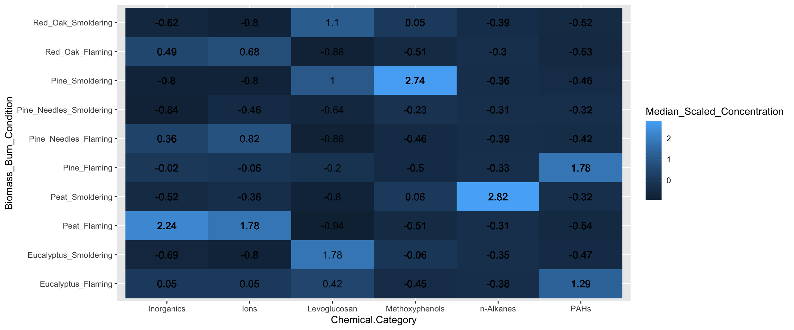
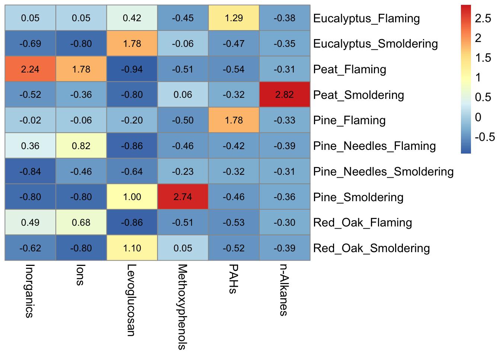
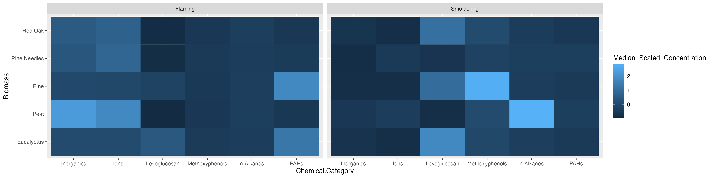
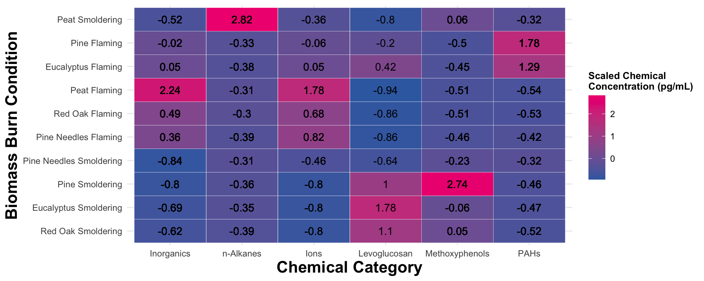
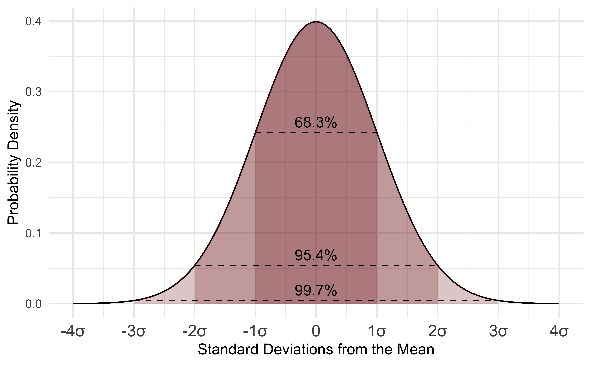
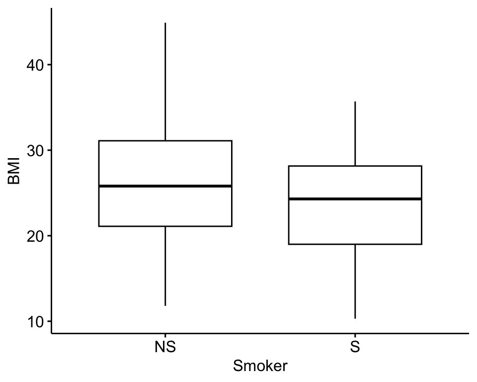
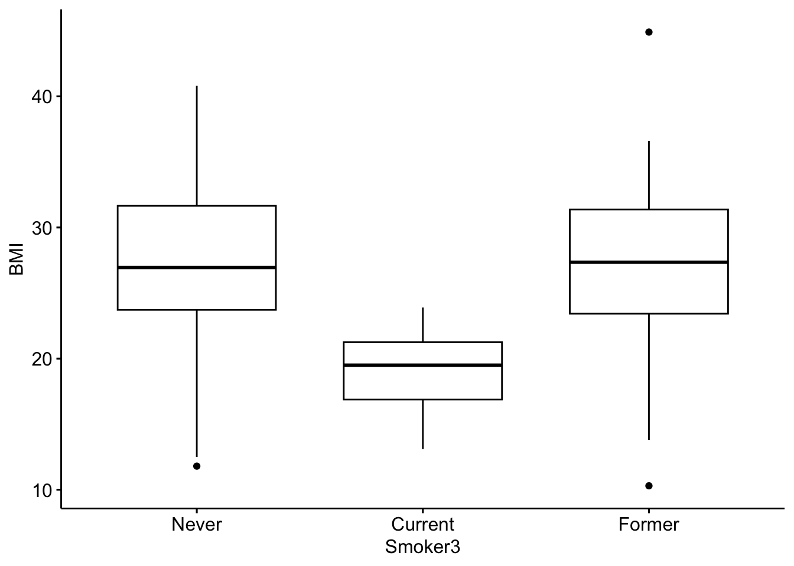

# (PART\*) Chapter 3 Basics of <br>Data Analysis and Visualizations {-}


<!-- ############################################################################################################################# -->

<!-- ################################################## -->
<!-- ################################################## -->
<!-- START SECTION ONE  -->
<!-- ################################################## -->
<!-- ################################################## -->


# Data Visualizations

This training module was developed by Alexis Payton, Kyle Roell, Lauren E. Koval, Elise Hickman, and Julia E. Rager.

All input files (script, data, and figures) can be downloaded from the [UNC-SRP TAME2 GitHub website](https://github.com/UNCSRP/TAME2).

## Introduction to Data Visualizations

Selecting an approach to visualize data is an important consideration when presenting scientific research, given that figures have the capability to summarize large amounts of data efficiently and effectively. (At least that's the goal!) This module will focus on basic data visualizations that we view to be most commonly used, both in and outside of the field of environmental health research, many of which you have likely seen before. This module is not meant to be an exhaustive representation of all figure types, rather it serves as an introduction to some types of figures and how to approach choosing the one that most optimally displays your data and primary findings. When selecting a data visualization approach, here are some helpful questions you should first ask yourself:

+ What message am I trying to convey with this figure?
+ How does this figure highlight major findings from the paper?
+ Who is the audience?
+ What type of data am I working with?

[A Guide To Getting Data Visualization Right](https://www.smashingmagazine.com/2023/01/guide-getting-data-visualization-right/) is a great resource for determining which figure is best suited for various types of data. More complex methodology-specific charts are presented in succeeding TAME modules. These include visualizations for:

+ Two Group Comparisons (e.g.,boxplots and logistic regression) in [Module 3.4 Introduction to Statistical Tests](insert link) and [Module 4.4 Two Group Comparisons and Visualizations](insert link)
+ Multi-Group Comparisons (e.g.,boxplots) in [Module 3.4 Introduction to Statistical Tests](insert link) and [Module 4.5 Mult-Group Comparisons and Visualizations](insert link)
+ Supervised Machine Learning (e.g.,decision boundary plots, variable importance plots) in [Module 5.3 Supervised ML Model Interpretation](insert link)
+ Unsupervised Machine Learning 
  + Principal Component Analysis (PCA) plots and heatmaps in  [Module 5.4 Unsupervised Machine Learning I: K-Means Clustering & PCA](insert link)
  + Dendrograms, clustering visualizations, heatmaps, and variable contribution plots in [Module 5.5 Unsupervised Machine Learning II: Additional Clustering Applications](insert link)
+ -Omics Expression (e.g.,MA plots and volcano plots) in [Module 6.2 -Omics and Systems Biology: Transcriptomic Applications](insert link)
+ Mixtures Methods
  + Forest Plots in [Module 6.3 Mixtures I: Overview and Quantile G-Computation Application](insert link)
  + Trace Plots in [Module 6.4 Mixtures II: BKMR Application](insert link)
  + Sufficient Similarity (e.g.,heatmaps, clustering) in [Module 6.5 Mixtures III: Sufficient Similarity](insert link)
+ Toxicokinetic Modeling (e.g.,line graph, dose response) in [Module 6.6 Toxicokinetic Modeling](insert link)

<br>

## Introduction to Training Module
Visualizing data is an important step in any data analysis, including those carried out in environmental health research. Often, visualizations allow scientists to better understand trends and patterns within a particular dataset under evaluation. Even after statistical analysis of a dataset, it is important to then communicate these findings to a wide variety of target audiences. Visualizations are a vital part of communicating complex data and results to target audiences.

In this module, we highlight some figures that can be used to visualize larger, more high-dimensional datasets using figures that are more simple (but still relevant!) than methods presented later on in TAME. This training module specifically reviews the formatting of data in preparation of generating visualizations, scaling datasets, and then guides users through the generation of the following example data visualizations:

+ Density plots
+ Boxplots
+ Correlation plots
+ Heatmaps

These visualization approaches are demonstrated using a large environmental chemistry dataset. This example dataset was generated through chemical speciation analysis of smoke samples collected during lab-based simulations of wildfire events. Specifically, different biomass materials (eucalyptus, peat, pine, pine needles, and red oak) were burned under two combustion conditions of flaming and smoldering, resulting in the generation of 12 different smoke samples. These data have been previously published in the following environmental health research studies, with data made publicly available:

+ Rager JE, Clark J, Eaves LA, Avula V, Niehoff NM, Kim YH, Jaspers I, Gilmour MI. Mixtures modeling identifies chemical inducers versus repressors of toxicity associated with wildfire smoke. Sci Total Environ. 2021 Jun 25;775:145759. doi: 10.1016/j.scitotenv.2021.145759. Epub 2021 Feb 10. PMID: [33611182](https://pubmed.ncbi.nlm.nih.gov/33611182/).
+ Kim YH, Warren SH, Krantz QT, King C, Jaskot R, Preston WT, George BJ, Hays MD, Landis MS, Higuchi M, DeMarini DM, Gilmour MI. Mutagenicity and Lung Toxicity of Smoldering vs. Flaming Emissions from Various Biomass Fuels: Implications for Health Effects from Wildland Fires. Environ Health Perspect. 2018 Jan 24;126(1):017011. doi: 10.1289/EHP2200. PMID: [29373863](https://pubmed.ncbi.nlm.nih.gov/29373863/).

### GGplot2

*ggplot2* is a powerful package used to create graphics in R. It was designed based on the philosophy that every figure can be built using a dataset, a coordinate system, and a geom that specifies the type of plot. As a result, it is fairly straightforward to create highly customizable figures and is typically preferred over using base R to generate graphics. We'll generate all of the figures in this module using *ggplot2*.

For additional resources on *ggplot2* see [ggplot2 Posit Documentation](https://ggplot2.tidyverse.org/) and [Data Visualization with ggplot2](https://datacarpentry.org/R-ecology-lesson/04-visualization-ggplot2.html).

### Script Preparations

#### Cleaning the global environment

```r
rm(list=ls())
```

#### Installing required R packages
If you already have these packages installed, you can skip this step, or you can run the below code which checks installation status for you

```r
if (!requireNamespace("GGally"))
  install.packages("GGally");
if (!requireNamespace("corrplot"))
  install.packages("corrplot");
if (!requireNamespace("pheatmap"))
  install.packages("pheatmap");
```

#### Loading R packages required for this session

```r
library(tidyverse)
library(GGally)
library(corrplot)
library(reshape2)
library(pheatmap)
```

#### Set your working directory

```r
setwd("/filepath to where your input files are")
```

#### Importing example dataset
Then let's read in our example dataset. As mentioned in the introduction, this example dataset represents chemical measurements across 12 different biomass burn scenarios representing potential wildfire events. Let's upload and view these data:

```r
# Load the data
smoke_data <- read.csv("Module3_1_Input/Module3_1_InputData.csv")

# View the top of the dataset
head(smoke_data) 
```

```
##   Chemical.Category           Chemical     CASRN Eucalyptus_Smoldering
## 1         n-Alkanes 2-Methylnonadecane 1560-86-7                  0.06
## 2         n-Alkanes 3-Methylnonadecane 6418-45-7                  0.04
## 3         n-Alkanes           Docosane  629-97-0                  0.21
## 4         n-Alkanes Dodecylcyclohexane 1795-17-1                  0.04
## 5         n-Alkanes           Eicosane  112-95-8                  0.11
## 6         n-Alkanes        Heneicosane  629-94-7                  0.13
##   Eucalyptus_Flaming Peat_Smoldering Peat_Flaming Pine_Smoldering Pine_Flaming
## 1               0.06            1.36         0.06            0.06         0.06
## 2               0.04            1.13         0.90            0.47         0.04
## 3               0.25            9.46         0.57            0.16         0.48
## 4               0.04            0.25         0.04            0.04         0.04
## 5               0.25            7.55         0.54            0.17         0.29
## 6               0.28            6.77         0.34            0.13         0.42
##   Pine_Needles_Smoldering Pine_Needles_Flaming Red_Oak_Smoldering
## 1                    0.06                 0.06               0.06
## 2                    0.04                 0.72               0.04
## 3                    0.32                 0.18               0.16
## 4                    0.12                 0.04               0.04
## 5                    0.28                 0.16               0.15
## 6                    0.30                 0.13               0.13
##   Red_Oak_Flaming     Units
## 1            0.13 ng_per_uL
## 2            0.77 ng_per_uL
## 3            0.36 ng_per_uL
## 4            0.04 ng_per_uL
## 5            0.38 ng_per_uL
## 6            0.69 ng_per_uL
```

### Training Module's Environmental Health Questions
This training module was specifically developed to answer the following environmental health questions:

1. How do the distributions of the chemical concentration data differ based on each biomass burn scenario?
2. Are there correlations between biomass burn conditions based on the chemical concentration data?
3. Under which biomass burn conditions are concentrations of certain chemical categories the highest?

<br>

We can create a **density plot** to answer the first question. Similar to a histogram, density plots are an effective way to show overall distributions of data and can be useful to compare across various test conditions or other stratifications of the data.

In this example of a density plot, we'll visualize the distributions of chemical concentration data on the x axis. A density plot automatically displays where values are concentrated on the y axis. Additionally, we'll want to have multiple density plots within the same figure for each biomass burn condition. 

Before the data can be visualized, it needs to be converted from a wide to long format. This is because we need to have variable or column names entitled `Chemical_Concentration` and `Biomass_Burn_Condition` that can be placed into `ggplot()`. For review on converting between long and wide formats and using other tidyverse tools, see **TAME 2.0 Module 2.3 Data Manipulation & Reshaping**.

```r
longer_smoke_data = pivot_longer(smoke_data, cols = 4:13, names_to = "Biomass_Burn_Condition", 
                                 values_to = "Chemical_Concentration")

head(longer_smoke_data)
```

```
## # A tibble: 6 × 6
##   Chemical.Category Chemical           CASRN     Units    Biomass_Burn_Condition
##   <chr>             <chr>              <chr>     <chr>    <chr>                 
## 1 n-Alkanes         2-Methylnonadecane 1560-86-7 ng_per_… Eucalyptus_Smoldering 
## 2 n-Alkanes         2-Methylnonadecane 1560-86-7 ng_per_… Eucalyptus_Flaming    
## 3 n-Alkanes         2-Methylnonadecane 1560-86-7 ng_per_… Peat_Smoldering       
## 4 n-Alkanes         2-Methylnonadecane 1560-86-7 ng_per_… Peat_Flaming          
## 5 n-Alkanes         2-Methylnonadecane 1560-86-7 ng_per_… Pine_Smoldering       
## 6 n-Alkanes         2-Methylnonadecane 1560-86-7 ng_per_… Pine_Flaming          
## # ℹ 1 more variable: Chemical_Concentration <dbl>
```

#### Scaling dataframes for downstream data visualizations

A data preparation method that is commonly used to convert values into those that can be used to better illustrate overall data trends is **data scaling**. Scaling can be achieved through data transformations or normalization procedures, depending on the specific dataset and goal of analysis/visualization. Scaling is often carried out using data vectors or columns of a dataframe.

For this example, we will normalize the chemical concentration dataset using a basic scaling and centering procedure using the base R function, `scale()`. This algorithm results in the normalization of a dataset using the mean value and standard deviation. This scaling step will convert chemical concentration values in our dataset into normalized values across samples, such that each chemical's concentration distributions are more easily comparable between the different biomass burn conditions.

For more information on the `scale()` function, see its associated [RDocumentation](https://www.rdocumentation.org/packages/base/versions/3.6.2/topics/scale) and helpful tutorial on [Implementing the scale() function in R](https://www.journaldev.com/47818/r-scale-function).

```r
scaled_longer_smoke_data = longer_smoke_data %>%
    # scaling within each chemical
    group_by(Chemical) %>%
    mutate(Scaled_Chemical_Concentration = scale(Chemical_Concentration)) %>%
    ungroup()

head(scaled_longer_smoke_data) # see the new scaled values now in the last column (column 7)
```

```
## # A tibble: 6 × 7
##   Chemical.Category Chemical           CASRN     Units    Biomass_Burn_Condition
##   <chr>             <chr>              <chr>     <chr>    <chr>                 
## 1 n-Alkanes         2-Methylnonadecane 1560-86-7 ng_per_… Eucalyptus_Smoldering 
## 2 n-Alkanes         2-Methylnonadecane 1560-86-7 ng_per_… Eucalyptus_Flaming    
## 3 n-Alkanes         2-Methylnonadecane 1560-86-7 ng_per_… Peat_Smoldering       
## 4 n-Alkanes         2-Methylnonadecane 1560-86-7 ng_per_… Peat_Flaming          
## 5 n-Alkanes         2-Methylnonadecane 1560-86-7 ng_per_… Pine_Smoldering       
## 6 n-Alkanes         2-Methylnonadecane 1560-86-7 ng_per_… Pine_Flaming          
## # ℹ 2 more variables: Chemical_Concentration <dbl>,
## #   Scaled_Chemical_Concentration <dbl[,1]>
```

We can see that in the `Scaled_Chemical_Concentration` column, each chemical is scaled based on a normal distribution centered around 0, with values now less than or greater than zero.

Now that we have our dataset formatted, let's plot it.

## Density Plot Visualization

The following code can be used to generate a density plot:

```r
ggplot(scaled_longer_smoke_data, aes(x = Scaled_Chemical_Concentration, color = Biomass_Burn_Condition)) + 
  geom_density()
```


### Answer to Environmental Health Question 1, Method I
:::question
*With this method, we can answer **Environmental Health Question #1***: How do the distributions of the chemical concentration data differ based on each biomass burn scenario?
::: 

:::answer
**Answer**: In general, there are a high number of chemicals that were measured at relatively lower abundances across all smoke samples (hence, the peak in occurrence density occurring towards the left, before 0). The three conditions of smoldering peat, flaming peat, and flaming pine contained the most chemicals at the highest relative concentrations (hence, these lines are the top three lines towards the right).
:::

<br>

## Boxplot Visualization
A **boxplot** can also be used to answer our first environmental health question: **How do the distributions of the chemical concentration data differ based on each biomass burn scenario?**. A boxplot also displays a data's distribution, but it incorporates a visualization of a five number summary (i.e., minimum, first quartile, median, third quartile, and maximum). Any outliers are displayed as dots.

For this example, let's have `Scaled_Chemical_Concentration` on the x axis and `Biomass_Burn_Condition` on the y axis. The `scaled_longer_smoke_data` dataframe is the format we need, so we'll use that for plotting.

```r
ggplot(scaled_longer_smoke_data, aes(x = Scaled_Chemical_Concentration, y = Biomass_Burn_Condition, 
                                     color = Biomass_Burn_Condition)) + 
  geom_boxplot()
```


### Answer to Environmental Health Question 1, Method II
:::question
*With this alternative method, we can answer, in a different way, **Environmental Health Question #1***: How do the distributions of the chemical concentration data differ based on each biomass burn scenario?
::: 

:::answer
**Answer, Method II**: The median chemical concentration is fairly low (less than 0) for all biomass burn conditions. Overall, there isn't much variation in chemical concentrations with the exception of smoldering peat, flaming peat, and flaming eucalyptus.
:::

<br>

## Correlation Visualizations
Let's turn our attention to the second environmental health question: **Are there correlations between biomass burn conditions based on the chemical concentration data?** We'll use two different correlation visualizations to answer this question using the *GGally* package. 

*GGally* is a package that serves as an extension of *ggplot2*, the baseline R plotting system based on the grammar of graphics. GGally is very useful for creating plots that compare groups or features within a dataset, among many other utilities. Here we will demonstrate the `ggpairs()` function within *GGally* using the scaled chemistry dataset. This function will produce an image that shows correlation values between biomass burn sample pairs and also illustrates the overall distributions of values in the samples. For more information on *GGally*, see its associated [RDocumentation](https://www.rdocumentation.org/packages/GGally/versions/1.5.0) and [example helpful tutorial](http://www.sthda.com/english/wiki/ggally-r-package-extension-to-ggplot2-for-correlation-matrix-and-survival-plots-r-software-and-data-visualization).

*GGally* requires a wide dataframe with ids (i.e.,`Chemical`) as the rows and the variables that will be compared to each other (i.e.,`Biomass_Burn_Condition`) as the columns. Let's create that dataframe.

```r
# first selecting the chemical, biomass burn condition, and 
# the scaled chemical concentration columns
wide_scaled_data = scaled_longer_smoke_data %>%
    pivot_wider(id_cols = Chemical, names_from = "Biomass_Burn_Condition", 
                               values_from = "Scaled_Chemical_Concentration") %>%
    # converting the chemical names to row names
    column_to_rownames(var = "Chemical")

head(wide_scaled_data)
```

```
##                    Eucalyptus_Smoldering Eucalyptus_Flaming Peat_Smoldering
## 2-Methylnonadecane            -0.3347765         -0.3347765        2.841935
## 3-Methylnonadecane            -0.8794448         -0.8794448        1.649829
## Docosane                      -0.3465132         -0.3327216        2.842787
## Dodecylcyclohexane            -0.4240624         -0.4240624        2.646734
## Eicosane                      -0.3802202         -0.3195928        2.841691
## Heneicosane                   -0.3895328         -0.3166775        2.835527
##                    Peat_Flaming Pine_Smoldering Pine_Flaming
## 2-Methylnonadecane   -0.3347765      -0.3347765   -0.3347765
## 3-Methylnonadecane    1.1161291       0.1183422   -0.8794448
## Docosane             -0.2223890      -0.3637526   -0.2534201
## Dodecylcyclohexane   -0.4240624      -0.4240624   -0.4240624
## Eicosane             -0.1940076      -0.3542370   -0.3022707
## Heneicosane          -0.2875354      -0.3895328   -0.2486793
##                    Pine_Needles_Smoldering Pine_Needles_Flaming
## 2-Methylnonadecane              -0.3347765           -0.3347765
## 3-Methylnonadecane              -0.8794448            0.6984509
## Docosane                        -0.3085863           -0.3568568
## Dodecylcyclohexane               0.7457649           -0.4240624
## Eicosane                        -0.3066012           -0.3585675
## Heneicosane                     -0.3069635           -0.3895328
##                    Red_Oak_Smoldering Red_Oak_Flaming
## 2-Methylnonadecane         -0.3347765      -0.1637228
## 3-Methylnonadecane         -0.8794448       0.8144726
## Docosane                   -0.3637526      -0.2947948
## Dodecylcyclohexane         -0.4240624      -0.4240624
## Eicosane                   -0.3628981      -0.2632960
## Heneicosane                -0.3895328      -0.1175398
```

By default, `ggpairs()` displays Pearson's correlations. To show Spearman's correlations takes more nuance, but can be done using the code that has been commented out below. 

```r
# ggpairs with Pearson's correlations
wide_scaled_data = data.frame(as.matrix(wide_scaled_data))
ggpairs(wide_scaled_data)
```


```r
# ggpairs with Spearman's correlations
# pearson_correlations = cor(wide_scaled_data, method = "spearman")
# ggpairs(wide_scaled_data, upper = list(continuous = wrap(ggally_cor, method = "spearman")))
```
    
Many of these biomass burn conditions have significant correlations denoted by the asterisks.

+ '*': p value < 0.1
+ '**': p value < 0.05
+ '***': p value < 0.01

The upper right portion displays the correlation values, where a value less than 0 indicates negative correlation and a value greater than 0 signifies positive correlation. The diagonal shows the density plots for each variable. The lower left portion visualizes the values of the two variables compared using a scatterplot.

### Answer to Environmental Health Question 2
:::question
*With this, we can answer **Environmental Health Question #2***: Are there correlations between biomass burn conditions based on the chemical concentration data?
:::

:::answer
**Answer**: There is low correlation between many of the variables (-0.5 < correlation value < 0.5). Eucalyptus flaming and pine flaming are significantly positively correlated along with peat flaming and pine needles flaming (correlation value ~0.7 and p value < 0.001).
:::

We can visualize correlations another way using the other function from *GGally*, `ggcorr()`, which visualizes each correlation as a square. Note that this function calculates Pearson's correlations by default. However, this can be changed using the `method` parameter shown in the code commented out below.

```r
# Pearson's correlations
ggcorr(wide_scaled_data)
```


```r
# Spearman's correlations
# ggcorr(wide_scaled_data, method = "spearman")
```

We'll visualize correlations between each of the groups using one more figure using the `corrplot()` function from the *corrplot* package.

```r
# Need to supply corrplot with a correlation matrix, here, using the 'cor' function
corrplot(cor(wide_scaled_data))
```


Each of these correlation figures displays the same information, but the one you choose to use is a matter of personal preference. Click on the following resources for additional information on [ggpairs()](https://r-charts.com/correlation/ggpairs/) and [corrplot()](https://cran.r-project.org/web/packages/corrplot/vignettes/corrplot-intro.html). 

<br>

## Heatmap Visualization

Last, we'll turn our attention to answering the final environmental health question: **Under which biomass burn conditions are concentrations of certain chemical categories the highest?** This can be addressed with the help of a heatmap.

**Heatmaps** are a highly effective method of viewing an entire dataset at once. Heatmaps can appear similar to correlation plots, but typically illustrate other values (e.g., concentrations, expression levels, presence/absence, etc) besides correlation values. They are used to draw patterns between two variables of highest interest (that comprise the x and y axis, though additional bars can be added to display other layers of information). In this instance, we'll use a heatmap to determine whether there are patterns apparent between chemical categories and biomass burn condition on chemical concentrations. 

For this example, we can plot `Biomass_Burn_Condition` and `Chemical.Category` on the axes and fill in the values with `Scaled_Chemical_Concentration`. When generating heatmaps, scaled values are often used to better distinguish patterns between groups/samples. 

In this example, we also plan to display the median scaled concentration value within the heatmap as an additional layer of helpful information to aid in interpretation. To do so, we'll need to take the median chemical concentration for each biomass burn condition within each chemical category. However, since we want `ggplot()` to visualize the median scaled values with the color of the tiles this step was already necessary. 

```r
# We'll find the median value and add that data to the dataframe as an additional column
heatmap_df = scaled_longer_smoke_data %>%
    group_by(Biomass_Burn_Condition, Chemical.Category) %>%
    mutate(Median_Scaled_Concentration = median(Scaled_Chemical_Concentration))

head(heatmap_df)
```

```
## # A tibble: 6 × 8
## # Groups:   Biomass_Burn_Condition, Chemical.Category [6]
##   Chemical.Category Chemical           CASRN     Units    Biomass_Burn_Condition
##   <chr>             <chr>              <chr>     <chr>    <chr>                 
## 1 n-Alkanes         2-Methylnonadecane 1560-86-7 ng_per_… Eucalyptus_Smoldering 
## 2 n-Alkanes         2-Methylnonadecane 1560-86-7 ng_per_… Eucalyptus_Flaming    
## 3 n-Alkanes         2-Methylnonadecane 1560-86-7 ng_per_… Peat_Smoldering       
## 4 n-Alkanes         2-Methylnonadecane 1560-86-7 ng_per_… Peat_Flaming          
## 5 n-Alkanes         2-Methylnonadecane 1560-86-7 ng_per_… Pine_Smoldering       
## 6 n-Alkanes         2-Methylnonadecane 1560-86-7 ng_per_… Pine_Flaming          
## # ℹ 3 more variables: Chemical_Concentration <dbl>,
## #   Scaled_Chemical_Concentration <dbl[,1]>, Median_Scaled_Concentration <dbl>
```

Now we can plot the data and add the `Median_Scaled_Concentration` to the figure using `geom_text()`. Note that specifying the original `Scaled_Chemical_Concentration` in the **fill** parameter will NOT give you the same heatmap as specifying the median values in `ggplot()`.

```r
ggplot(data = heatmap_df, aes(x = Chemical.Category, y = Biomass_Burn_Condition,
                                           fill = Median_Scaled_Concentration)) + 
  geom_tile() + # function used to specify a heatmap for ggplot
  geom_text(aes(label = round(Median_Scaled_Concentration, 2))) # adding concentration values as text, rounding to two values after the decimal
```



### Answer to Environmental Health Question 3
:::question
*With this, we can answer **Environmental Health Question #3***: Under which biomass burn conditions are concentrations of certain chemical categories the highest?
:::

:::answer
**Answer**: Peat flaming has the highest concentrations of inorganics and ions. Eucalyptus smoldering has the highest concentrations of levoglucosans. Pine smoldering has the highest concentrations of methoxyphenols. Peat smoldering has the highest concentrations of n-alkanes. Pine needles smoldering has highest concentrations of PAHs. 
:::

This same heatmap can be achieved another way using the `pheatmap()` function from the *pheatmap* package. Using this function requires us to use a wide dataset, which we need to create. It will contain `Chemical.Category`, `Biomass_Burn_Condition` and `Scaled_Chemical_Concentration`. 

```r
heatmap_df2 = scaled_longer_smoke_data %>%
    group_by(Biomass_Burn_Condition, Chemical.Category) %>%
    # using the summarize function instead of mutate function as was done previously since we only need the median values now
    summarize(Median_Scaled_Concentration = median(Scaled_Chemical_Concentration)) %>%
    # transforming the data to a wide format
    pivot_wider(id_cols = Biomass_Burn_Condition, names_from = "Chemical.Category", 
                               values_from = "Median_Scaled_Concentration") %>%
    # converting the chemical names to row names
    column_to_rownames(var = "Biomass_Burn_Condition")

head(heatmap_df2)
```

```
##                        Inorganics        Ions Levoglucosan Methoxyphenols
## Eucalyptus_Flaming     0.05405359  0.05273246    0.4208870    -0.44781893
## Eucalyptus_Smoldering -0.68595076 -0.80160192    1.7772753    -0.06449444
## Peat_Flaming           2.24332901  1.77515899   -0.9383328    -0.51488738
## Peat_Smoldering       -0.51860591 -0.36146158   -0.8041211     0.05720971
## Pine_Flaming          -0.02063532 -0.05999543   -0.1992054    -0.50269422
## Pine_Needles_Flaming   0.36405527  0.82229035   -0.8570130    -0.46331332
##                             PAHs  n-Alkanes
## Eucalyptus_Flaming     1.2885776 -0.3790357
## Eucalyptus_Smoldering -0.4724635 -0.3465132
## Peat_Flaming          -0.5369746 -0.3093608
## Peat_Smoldering       -0.3162278  2.8238921
## Pine_Flaming           1.7825403 -0.3347765
## Pine_Needles_Flaming  -0.4179505 -0.3850613
```

Now let's generate the same heatmap this time using the `pheatmap()` function:

```r
pheatmap(heatmap_df2, 
        # removing the clustering option from both rows and columns
        cluster_rows = FALSE, cluster_cols = FALSE,
        # adding the values for each cell, making those values black, and changing the font size
        display_numbers = TRUE, number_color = "black", fontsize = 12) 
```



Notice that the `pheatmap()` function does not include axes or legend titles as with `ggplot()`, however those can be added to the figure after exporting from R in MS Powerpoint or Adobe. Additional parameters, including `cluster_rows`, for the `pheatmap()` function are discussed further in **TAME 2.0 Module 5.4 Unsupervised Machine Learning**. For basic heatmaps like the ones shown here, `ggplot()` or `pheatmap()` can both be used however, both have their pros and cons. For example, `ggplot()` figures tend to be more customizable and easily combined with other figures, while `pheatmap()` has additional parameters built into the function that can make plotting certain features advantageous like clustering.

<br>

## Concluding Remarks
In conclusion, this training module provided example code to create highly customizable data visualizations using *ggplot2* pertinent to environmental health research.

<br>

<label class="tykfont">
Test Your Knowledge 
</label>

:::tyk
Replicate the figure below! The heatmap still visualizes the median chemical concentrations, but this time we're separating the burn conditions, allowing us to determine if the concentrations of chemicals released are contingent upon the burn condition.

For additional figures available and to view aspects of figures that can be changed in *GGplot2*, check out this [GGPlot2 Cheat Sheet](https://www.maths.usyd.edu.au/u/UG/SM/STAT3022/r/current/Misc/data-visualization-2.1.pdf). You might need it to make this figure!

**Hint 1**: Use the `separate()` function from *tidyverse* to split `Biomass_Burn_Condition` into `Biomass` and `Burn_Condition`. 

**Hint 2**: Use the function `facet_wrap()` within `ggplot()` to separate the heatmaps by `Burn_Condition`.
:::



<!-- ############################################################################################################################# -->

<!-- ################################################## -->
<!-- ################################################## -->
<!-- START SECTION TWO  -->
<!-- ################################################## -->
<!-- ################################################## -->


# Improving Data Visualizations

This training module was developed by Alexis Payton, Elise Hickman, and Julia E. Rager.

All input files (script, data, and figures) can be downloaded from the [UNC-SRP TAME2 GitHub website](https://github.com/UNCSRP/TAME2).

## Introduction to Data Visulization Conventions

Data visualizations are used to convey key takeaways from a research study's findings in a clear, succinct manner to highlight data trends, patterns, and/or relationships. In environmental health research, this is of particular importance for high-dimensional datasets that can typically be parsed using multiple methods, potentially resulting in many different approaches to visualize data. As a consequence, researchers are often faced with an overwhelming amount of options when deciding which visualization scheme(s) most optimally translate their results for effective dissemination. Effective data visualization approaches are vital to a researcher's success for many reasons. For instance, manuscript readers or peer reviewers often scroll through a study's text and focus on the quality and novelty of study figures before deciding whether to read/review the paper. Therefore, the importance of data visualizations cannot be understated in any research field.

As a high-level introduction, it is important that we first communicate some traits that we think are imperative towards ensuring a successful data visualization approach as described in more detail below.

Keys to successful data visualizations:

+ **Consider your audience, data type, and research question prior to selecting a figure to visualize your data**

  For example, if more computationally complex methods are used in a manuscript that is intended for a journal with an audience that doesn't have that same level of expertise, consider spending time focusing on how those results are presented in an approachable way for that audience. For a review of how to choose a rudimentary chart based on the data type, check out [How to Choose the Right Data Visualization](https://www.atlassian.com/data/charts/how-to-choose-data-visualization). Some of these basic charts will be presented in this module, while more complex analysis-specific visualizations, especially ones developed for high-dimensional data will be presented in later modules. 

+ **Take the legibility of the figure into account** 

  This includes avoiding abbreviations when possible. (If they can't be avoided explain them in the caption.) All titles should be capitalized, including titles for the legend(s) and axes. Underscores and periods between words should be replaced with spaces. Consider the legibility of the figure if printed in black and white. (However, that's not as important these days.) Lastly, feel free to describe your plot in further detail in the caption to aid the reader in understanding the results presented. 

+ **Minimize text**

  Main titles aren't necessary for single paneled figures (like the examples below), because in a publication the title of the figure is right underneath each figure. It's good practice to remove this kind of extraneous text, which can make the figure seem more cluttered. Titles can be helpful in multi-panel figures, especially if there are multiple panels with the same figure type that present slightly different results. For example, in the Test Your Knowledge section, you'll need to create two heatmaps, but one displays data under smoldering conditions and the other displays data under flaming conditions. In general, try to reduce the amount of extraneous text in a plot to keep a reader focused on the most important elements and takeaways in the plot.

+ **Use the minimal number of figures you need to support your narrative**

  It is important to include an optimal number of figures within manuscripts and scientific reports. Too many figures might overwhelm the overall narrative, while too few might not provide enough substance to support your main findings. It can be helpful to also consider placing some figures in supplemental material to aid in the overall flow of your scientific writing.

+ **Select an appropriate color palette**

  Packages have been developed to offer color palettes including *MetBrewer* and *RColorBrewer*. In addition, *ggsci* is a package that offers a collection of color palettes used in various scientific journals. For more information, check out  *MetBrewer*, see its associated [RDocumentation](https://cran.r-project.org/web/packages/MetBrewer/index.html) and [example tutorial](https://github.com/BlakeRMills/MetBrewer). For more information on *RColorBrewer*, see its associated [RDocumentation](https://cran.r-project.org/web/packages/RColorBrewer/index.html) and [example tutorial](https://r-graph-gallery.com/38-rcolorbrewers-palettes.html). For more information on *ggsci*, see its associated [RDocumentation](https://cran.r-project.org/web/packages/ggsci/vignettes/ggsci.html). In general, it's better to avoid bright and flashy colors that can be difficult to read.

  It's advisable to use colors for manuscript figures that are color-blind friendly. Check out these [Stack overflow answers about color blind-safe color palettes and packages](https://stackoverflow.com/questions/57153428/r-plot-color-combinations-that-are-colorblind-accessible). Popular packages for generating colorblind-friendly palettes include [viridis](https://cran.r-project.org/web/packages/viridis/vignettes/intro-to-viridis.html) and [rcartocolor](https://github.com/Nowosad/rcartocolor).

+ **Use color strategically**

  Color can be used to visualize a variable. There are three ways to categorize color schemes - sequential, diverging, and qualitative. Below, definitions are provided for each along with example figures that we've previously published that illustrate each color scheme. In addition, figure titles and captions are also provided for context. Note that some of these figures have been simplified from what was originally published to show more streamlined examples for TAME. 

  - **Sequential**: intended for ordered categorical data (i.e., disease severity, likert scale, quintiles). The choropleth map below is from [Winker, Payton et. al](https://doi.org/10.3389/fpubh.2024.1339700). 
<div class="figure" style="text-align: center">

<p class="caption">(\#fig:unnamed-chunk-18)**Figure 1. Geospatial distribution of the risk of future wildfire events across North Carolina.** Census tracts in North Carolina were binned into quintiles based on Wildfire Hazard Potential (WHP) with 1 (pale orange) having the lowest risk and 5 (dark red) having the highest risk. Figure regenerated here in alignment with its published [Creative Commons Attribution 4.0 International License](https://creativecommons.org/licenses/by/4.0/)</p>
</div>

  - **Diverging**: intended to emphasize continuous data at extremes of the data range (typically using darker colors) and mid-range values (typically using lighter colors). This color scheme is ideal for charts like heatmaps. The heatmap below is from [Payton, Perryman et. al](0.1152/ajplung.00299.2021).
<div class="figure" style="text-align: center">

<p class="caption">(\#fig:unnamed-chunk-19)**Figure 6. Individual cytokine expression levels across all subjects.** Cytokine concentrations were derived from nasal lavage fluid samples. On the x axis, subjects were ordered first according to tobacco use status, starting with non-smokers then cigarette smokers and e-cigarette users. Within tobacco use groups, subjects are ordered from lowest to highest average cytokine concentration from left to right. Within each cluster shown on the y axis, cytokines are ordered from lowest to highest average cytokine concentration from bottom to top. Figure regenerated here in alignment with its published [Creative Commons Attribution 4.0 International License](https://creativecommons.org/licenses/by/4.0/)</p>
</div>

  - **Qualitative**: intended for nominal categorical data to visualize clear differences between groups (i.e., soil types and exposure groups). The dendrogram below is from [Koval et. al](10.1038/s41370-022-00451-8).
<div class="figure" style="text-align: center">

<p class="caption">(\#fig:unnamed-chunk-20)**Figure 2. Translating chemical use inventory data to inform human exposure patterning.** Groups A-I illustrate the identified clusters of exposure source categories. Figure regenerated here in alignment with its published [Creative Commons Attribution 4.0 International License](https://creativecommons.org/licenses/by/4.0/)</p>
</div>

+ **Consider ordering axes to reveal patterns relevant to the research questions**

  Ordering the axes can reveal potential patterns that may not be clear in the visualization otherwise. In the cytokine expression heatmap above, there are not clear differences in cytokine expression across the tobacco use groups. However, e-cigarette users seem to have slightly more muted responses compared to non-smokers and cigarette smokers in clusters B and C, which was corroborated in subsequent statistical analyses. It is also evident that Cluster A had the lowest cytokine concentrations, followed by Cluster B, and then Cluster C with the greatest concentrations. 
  
What makes these figures so compelling is how the aspects introduced above were thoughtfully incorporated. In the next section, we'll put those principles into practice using data that were described and referenced previously in **TAME 2.0 Module 3.1 Data Visualizations**. 

<br>

## Introduction to Training Module
In this module, *ggplot2*, R's data visualization package will be used to walk through ways to improve data visualizations. We'll recreate two figures (i.e., the boxplot and heatmap) constructed previously in **TAME 2.0 Module 3.1 Data Visualizations** and improve them so they are publication-ready. Additionally, we'll write figure titles and captions to contextualize the results presented for each visualization. When writing figure titles and captions, it is helpful to address the research question or overall concept that the figure seeks to capture rather than getting into the weeds of specific methods the plot is based on. This is especially important when visualizing more complex methods that your audience might not have as much knowledge on.

### Script Preparations

#### Cleaning the global environment

```r
rm(list=ls())
```

#### Installing required R packages
If you already have these packages installed, you can skip this step, or you can run the below code which checks installation status for you

```r
if (!requireNamespace("MetBrewer"))
  install.packages("MetBrewer");
if (!requireNamespace("RColorBrewer"))
  install.packages("RColorBrewer");
if (!requireNamespace("pheatmap"))
  install.packages("pheatmap");
if (!requireNamespace("cowplot"))
  install.packages("cowplot");
```

#### Loading required R packages

```r
library(tidyverse)
library(MetBrewer)
library(RColorBrewer)
library(pheatmap)
library(cowplot)
```

#### Set your working directory

```r
setwd("/filepath to where your input files are")
```

#### Importing example dataset
Let's now read in our example dataset. As mentioned in the introduction, this example dataset represents chemical measurements across 12 different biomass burn scenarios, representing chemicals emitted during potential wildfire events. Let's upload and view these data:

```r
# Load the data
smoke_data <- read.csv("Module3_2_Input/Module3_2_InputData.csv")

# View the top of the dataset
head(smoke_data) 
```

```
##   Chemical.Category           Chemical     CASRN Eucalyptus_Smoldering
## 1         n-Alkanes 2-Methylnonadecane 1560-86-7                  0.06
## 2         n-Alkanes 3-Methylnonadecane 6418-45-7                  0.04
## 3         n-Alkanes           Docosane  629-97-0                  0.21
## 4         n-Alkanes Dodecylcyclohexane 1795-17-1                  0.04
## 5         n-Alkanes           Eicosane  112-95-8                  0.11
## 6         n-Alkanes        Heneicosane  629-94-7                  0.13
##   Eucalyptus_Flaming Peat_Smoldering Peat_Flaming Pine_Smoldering Pine_Flaming
## 1               0.06            1.36         0.06            0.06         0.06
## 2               0.04            1.13         0.90            0.47         0.04
## 3               0.25            9.46         0.57            0.16         0.48
## 4               0.04            0.25         0.04            0.04         0.04
## 5               0.25            7.55         0.54            0.17         0.29
## 6               0.28            6.77         0.34            0.13         0.42
##   Pine_Needles_Smoldering Pine_Needles_Flaming Red_Oak_Smoldering
## 1                    0.06                 0.06               0.06
## 2                    0.04                 0.72               0.04
## 3                    0.32                 0.18               0.16
## 4                    0.12                 0.04               0.04
## 5                    0.28                 0.16               0.15
## 6                    0.30                 0.13               0.13
##   Red_Oak_Flaming     Units
## 1            0.13 ng_per_uL
## 2            0.77 ng_per_uL
## 3            0.36 ng_per_uL
## 4            0.04 ng_per_uL
## 5            0.38 ng_per_uL
## 6            0.69 ng_per_uL
```

Now that we've been able to view the dataset, let's come up with questions that can be answered with our boxplot and heatmap figure. This will inform how we format the dataframe for visualization.

### Training Module's Environmental Health Questions 
This training module was specifically developed to answer the following environmental health questions:

1. Boxplot: How do the distributions of the chemical concentration data differ based on each biomass burn scenario?
2. Heatmap: Which classes of chemicals show the highest concentrations across the evaluated biomass burn conditions?
3. How can these figures be combined into a single plot that can be then be exported from R?

#### Formatting dataframes for downstream visualization code
First, format the dataframe by changing it from a wide to long format and normalizing the chemical concentration data. For more details on this data reshaping visit **TAME 2.0 Module 2.3 Data Manipulation & Reshaping**.

```r
scaled_longer_smoke_data = pivot_longer(smoke_data, cols = 4:13, names_to = "Biomass_Burn_Condition", 
                                 values_to = "Chemical_Concentration") %>%
    # scaling within each chemical
    group_by(Chemical) %>%
    mutate(Scaled_Chemical_Concentration = scale(Chemical_Concentration)) %>%
    ungroup()

head(scaled_longer_smoke_data)
```

```
## # A tibble: 6 × 7
##   Chemical.Category Chemical           CASRN     Units    Biomass_Burn_Condition
##   <chr>             <chr>              <chr>     <chr>    <chr>                 
## 1 n-Alkanes         2-Methylnonadecane 1560-86-7 ng_per_… Eucalyptus_Smoldering 
## 2 n-Alkanes         2-Methylnonadecane 1560-86-7 ng_per_… Eucalyptus_Flaming    
## 3 n-Alkanes         2-Methylnonadecane 1560-86-7 ng_per_… Peat_Smoldering       
## 4 n-Alkanes         2-Methylnonadecane 1560-86-7 ng_per_… Peat_Flaming          
## 5 n-Alkanes         2-Methylnonadecane 1560-86-7 ng_per_… Pine_Smoldering       
## 6 n-Alkanes         2-Methylnonadecane 1560-86-7 ng_per_… Pine_Flaming          
## # ℹ 2 more variables: Chemical_Concentration <dbl>,
## #   Scaled_Chemical_Concentration <dbl[,1]>
```
<br>

## Creating an Improved Boxplot Visualization

As we did in the previous module, a boxplot will be constructed to answer the first environmental heath question: **How do the distributions of the chemical concentration data differ based on each biomass burn scenario?**. Let's remind ourselves of the original figure from the previous module. 


Based on the figure above, peat smoldering has the highest median scaled chemical concentration. However, this was difficult to determine given that the burn conditions aren't labeled on the x axis and a sequential color palette was used, making it difficult to identify the correct boxplot with its burn condition in the legend. If you look closely, the colors in the legend are in a reverse order of the colors assigned to the boxplots. Let's identify some elements of this graph that can be modified to make it easier to answer our research question.

:::txtbx
### There are four main aspects we can adjust on this figure:

**1. The legibility of the text in the legend and axes.**

Creating spaces between the text or exchanging the underscores for spaces improves the legibility of the figure. 
   
 **2. The order of the boxplots.**
 
Ordering the biomass burn conditions from highest to lowest based on their median scaled chemical concentration allows the reader to easily determine the biomass burn condition that had the greatest or least chemical concentrations relative to each other. In R, this can be done by putting the `Biomass_Burn_Condition` variable into a factor.
     
**3. Use of color.**

Variables can be visualized using color, text, size, etc. In this figure, it is redundant to have the biomass burn condition encoded in the legend and the color. Instead this variable can be put on the y axis and the legend will be removed to be more concise. The shades of the colors will also be changed, but to keep each burn condition distinct from each other, colors will be chosen that are distinct from one another. Therefore, we will choose a qualitative color scheme. 

**4. Show all data points when possible.** 

Many journals now require that authors report every single value when making data visualizations, particularly for small *n* studies using bar graphs and boxplots to show results. Instead of just displaying the mean/median and surrounding data range, it is advised to show how every replicate landed in the study range when possible. Note that this requirement is not feasible for studies with larger sample sizes though should be considered for smaller *in vitro* and animal model studies.
:::

Let's start with addressing **#1: Legibility of Axis Text**. The legend title and axis titles can easily be changed with `ggplot()`, so that will be done later. To remove the underscore from the `Biomass_Burn_Condition` column, we can use the function `gsub()`, which will replace all of the underscores with spaces, resulting in a cleaner-looking graph. 

```r
# First adding spaces between the biomass burn conditions
scaled_longer_smoke_data = scaled_longer_smoke_data %>%
  mutate(Biomass_Burn_Condition = gsub("_", " ", Biomass_Burn_Condition))

# Viewing dataframe
head(scaled_longer_smoke_data)
```

```
## # A tibble: 6 × 7
##   Chemical.Category Chemical           CASRN     Units    Biomass_Burn_Condition
##   <chr>             <chr>              <chr>     <chr>    <chr>                 
## 1 n-Alkanes         2-Methylnonadecane 1560-86-7 ng_per_… Eucalyptus Smoldering 
## 2 n-Alkanes         2-Methylnonadecane 1560-86-7 ng_per_… Eucalyptus Flaming    
## 3 n-Alkanes         2-Methylnonadecane 1560-86-7 ng_per_… Peat Smoldering       
## 4 n-Alkanes         2-Methylnonadecane 1560-86-7 ng_per_… Peat Flaming          
## 5 n-Alkanes         2-Methylnonadecane 1560-86-7 ng_per_… Pine Smoldering       
## 6 n-Alkanes         2-Methylnonadecane 1560-86-7 ng_per_… Pine Flaming          
## # ℹ 2 more variables: Chemical_Concentration <dbl>,
## #   Scaled_Chemical_Concentration <dbl[,1]>
```

**#2. Reordering the boxplots based on the median scaled chemical concentration**.
After calculating the median scaled chemical concentration for each biomass burn condition, the new dataframe will be arranged from lowest to highest median scaled concentration from the top of the dataframe to the bottom. This order will be saved in a vector, `median_biomass_order`. Although the biomass burn conditions are saved from lowest to highest concentration, `ggplot()` will plot them in reverse order with the highest concentration at the top and the lowest at the bottom of the y axis.

Axis reordering can also be accomplished using `reorder` within the `ggplot()` function as described [here](https://guslipkin.medium.com/reordering-bar-and-column-charts-with-ggplot2-in-r-435fad1c643e) and [here](https://r-graph-gallery.com/267-reorder-a-variable-in-ggplot2.html).

```r
median_biomass = scaled_longer_smoke_data %>%
    group_by(Biomass_Burn_Condition) %>%
    summarize(Median_Concentration = median(Scaled_Chemical_Concentration)) %>%
    # arranges dataframe from lowest to highest from top to bottom
    arrange(Median_Concentration)

head(median_biomass)
```

```
## # A tibble: 6 × 2
##   Biomass_Burn_Condition  Median_Concentration
##   <chr>                                  <dbl>
## 1 Red Oak Smoldering                    -0.459
## 2 Eucalyptus Smoldering                 -0.451
## 3 Pine Smoldering                       -0.424
## 4 Pine Needles Smoldering               -0.370
## 5 Pine Needles Flaming                  -0.350
## 6 Red Oak Flaming                       -0.337
```

```r
# Saving that order
median_biomass_order = median_biomass$Biomass_Burn_Condition
```


```r
# Putting into factor to organize the burn conditions
scaled_longer_smoke_data$Biomass_Burn_Condition = factor(scaled_longer_smoke_data$Biomass_Burn_Condition, 
                                                                levels = median_biomass_order)

# Final dataframe to be used for plotting
head(scaled_longer_smoke_data)
```

```
## # A tibble: 6 × 7
##   Chemical.Category Chemical           CASRN     Units    Biomass_Burn_Condition
##   <chr>             <chr>              <chr>     <chr>    <fct>                 
## 1 n-Alkanes         2-Methylnonadecane 1560-86-7 ng_per_… Eucalyptus Smoldering 
## 2 n-Alkanes         2-Methylnonadecane 1560-86-7 ng_per_… Eucalyptus Flaming    
## 3 n-Alkanes         2-Methylnonadecane 1560-86-7 ng_per_… Peat Smoldering       
## 4 n-Alkanes         2-Methylnonadecane 1560-86-7 ng_per_… Peat Flaming          
## 5 n-Alkanes         2-Methylnonadecane 1560-86-7 ng_per_… Pine Smoldering       
## 6 n-Alkanes         2-Methylnonadecane 1560-86-7 ng_per_… Pine Flaming          
## # ℹ 2 more variables: Chemical_Concentration <dbl>,
## #   Scaled_Chemical_Concentration <dbl[,1]>
```

Now that the dataframe has been finalized, we can plot the new boxplot. The final revision, **#3: Making Use of Color**, will be addressed with `ggplot()`. However, a palette can be chosen from the *MetBrewer* package.

```r
# Choosing the "Jurarez" palette from the `MetBrewer` package
# `n = 12`, since there are 12 biomass burn conditions
juarez_colors = met.brewer(name = "Juarez", n = 12)[1:12]
```

**#4. Show all data points when possible** will also be addressed with `ggplot()` by simply using `geom_point()`. 

```r
FigureX1 = ggplot(scaled_longer_smoke_data, aes(x = Scaled_Chemical_Concentration, y = Biomass_Burn_Condition, 
                                   color = Biomass_Burn_Condition)) + 
  geom_boxplot() +
  # jittering the points, so they're not all on top of each other and adding transparency
  geom_point(position = position_jitter(h = 0.1), alpha = 0.7) + 

  theme_light() + # changing the theme
  theme(axis.text = element_text(size = 9), # changing size of axis labels
      axis.title = element_text(face = "bold", size = rel(1.5)), # changes axis titles
      legend.position = "none") + # removes legend

  xlab('Scaled Chemical Concentration (pg/uL)') + ylab('Biomass Burn Condition') + # changing axis labels 
  scale_color_manual(values = c(juarez_colors)) # changing the colors

FigureX1
```


An appropriate title for this figure could be:

“**Figure X. Chemical concentration distributions of biomass burn conditions.** The boxplots are based on the scaled chemical concentration values, which used the raw chemical concentrations values scaled within each chemical. The individual dots represent the concentrations of each chemical. The biomass burn conditions on the y axis are ordered from greatest (top) to least (bottom) based on median scaled chemical concentration." 

### Answer to Environmental Health Question 1
:::question
*With this, we can answer **Environmental Health Question #1***: Which biomass burn condition has the highest total chemical concentration?
:::

:::answer
**Answer**: Smoldering peat has the highest median chemical concentration, however the median concentrations are comparable across all biomass burn conditions. All the flaming conditions have the highest median chemical concentrations and more overall variation than their respective smoldering conditions with the exception of smoldering peat. 
:::

You may notice that the scaled chemical concentration was put on the x axis and burn condition was put on the y axis and not vice versa. When names are longer in length, they are more legible if placed on the y axis.

Other aspects of the figure were changed in the latest version, but those are minor compared to changing the order of the boxplots, revamping the text, and changing the usage of color. For example, the background was changed from gray to white. Figure backgrounds are generally white, because the figure is easier to read if the paper is printed in black and white. A plot's background can easily be changed to white in R using `theme_light()`, `theme_minimal()`, or `theme_bw()`. Posit provides a very helpful [GGplot2 cheat sheet](https://posit.co/resources/cheatsheets/?type=posit-cheatsheets&_page=2/) for changing a figure's parameters. 

<br>

## Creating an Improved Heatmap Visualization

We'll use a heatmap to answer the second environmental health question: **Which classes of chemicals show the highest concentrations across the evaluated biomass burn conditions?** Let's view the original heatmap from the previous module and find aspects of it that can be improved.

```r
# Changing the biomass condition variable back to a character from a factor
scaled_longer_smoke_data$Biomass_Burn_Condition = as.character(scaled_longer_smoke_data$Biomass_Burn_Condition)

# Calculating the median value within each biomass burn condition and category
scaled_longer_smoke_data = scaled_longer_smoke_data %>%
    group_by(Biomass_Burn_Condition, Chemical.Category) %>%
    mutate(Median_Scaled_Concentration = median(Scaled_Chemical_Concentration))

# Plotting
ggplot(data = scaled_longer_smoke_data, aes(x = Chemical.Category, y = Biomass_Burn_Condition,
                                           fill = Median_Scaled_Concentration)) + 
  geom_tile() + 
  geom_text(aes(label = round(Median_Scaled_Concentration, 2))) # adding concentration values as text, rounding to two values after the decimal
```


From the figure above, it's clear that certain biomass burn conditions are associated with higher chemical concentrations for some of the chemical categories. For example, peat flaming exposure was associated with higher levels of inorganics and ions, while pine smoldering exposure was associated with higher levels of methoxyphenols. Although these are important findings, it is still difficult to determine if there are greater similarities in chemical profiles based on the biomass or the incineration temperature. Therefore, let's identify some elements of this chart that can be modified to make it easier to answer our research question. 

:::txtbx
### There are three main aspects we can adjust on this figure:

**1. The legibility of the text in the legend and axes.**
Similar to what we did previously, we'll replace underscores and periods with spaces in the axis labels and titles. 
   
**2. The order of the axis labels.**
Ordering the biomass burn condition and chemical category from highest to lowest based on their median scaled chemical concentration allows the reader to easily determine the biomass burn condition that had the greatest or least total chemical concentrations relative to each other. From the previous boxplot figure, biomass burn condition is already in this order, however we need to order the chemical category by putting the variable into a factor. 
     
**3. Use of color.**
Notice that in the boxplot we used a qualitative palette, which is best for creating visual differences between different classes or groups. In this heatmap, we'll choose a diverging color palette that uses two or more contrasting colors. A diverging color palette is able to highlight mid range with a lighter color and values at either extreme with a darker color or vice versa.
:::

**#1: Legibility of Text** can be addressed in `ggplot()` and so can **#2: Reordering the heatmap**.

`Biomass_Burn_Condition` has already been reordered and put into a factor, but we need to do the same with `Chemical.Category`. Similar to before, median scaled chemical concentration for each chemical category will be calculated. However, this time the new dataframe will be arranged from highest to lowest median scaled concentration from the top of the dataframe to the bottom. `ggplot()` will plot them in the SAME order with the highest concentration on the left side and the lowest on the right side of the figure.

```r
# Order the chemical category by the median scaled chemical concentration
median_chemical = scaled_longer_smoke_data %>%
    group_by(Chemical.Category) %>%
    summarize(Median_Concentration = median(Scaled_Chemical_Concentration)) %>%
    arrange(-Median_Concentration)

head(median_chemical)
```

```
## # A tibble: 6 × 2
##   Chemical.Category Median_Concentration
##   <chr>                            <dbl>
## 1 Inorganics                      -0.265
## 2 n-Alkanes                       -0.335
## 3 Ions                            -0.359
## 4 Levoglucosan                    -0.417
## 5 Methoxyphenols                  -0.434
## 6 PAHs                            -0.459
```

```r
# Saving that order
median_chemical_order = median_chemical$Chemical.Category
```


```r
# Putting into factor to organize the chemical categories
scaled_longer_smoke_data$Chemical.Category = factor(scaled_longer_smoke_data$Chemical.Category, 
                                                                levels = median_chemical_order)

# Putting burn conditons back into a factor to organize them
scaled_longer_smoke_data$Biomass_Burn_Condition = factor(scaled_longer_smoke_data$Biomass_Burn_Condition, 
                                                                levels = median_biomass_order)

# Viewing the dataframe to be plotted
head(scaled_longer_smoke_data)
```

```
## # A tibble: 6 × 8
## # Groups:   Biomass_Burn_Condition, Chemical.Category [6]
##   Chemical.Category Chemical           CASRN     Units    Biomass_Burn_Condition
##   <fct>             <chr>              <chr>     <chr>    <fct>                 
## 1 n-Alkanes         2-Methylnonadecane 1560-86-7 ng_per_… Eucalyptus Smoldering 
## 2 n-Alkanes         2-Methylnonadecane 1560-86-7 ng_per_… Eucalyptus Flaming    
## 3 n-Alkanes         2-Methylnonadecane 1560-86-7 ng_per_… Peat Smoldering       
## 4 n-Alkanes         2-Methylnonadecane 1560-86-7 ng_per_… Peat Flaming          
## 5 n-Alkanes         2-Methylnonadecane 1560-86-7 ng_per_… Pine Smoldering       
## 6 n-Alkanes         2-Methylnonadecane 1560-86-7 ng_per_… Pine Flaming          
## # ℹ 3 more variables: Chemical_Concentration <dbl>,
## #   Scaled_Chemical_Concentration <dbl[,1]>, Median_Scaled_Concentration <dbl>
```

Now that the dataframe has been finalized, we can plot the new boxplot. The final revision, **#3: Making Use of Color**, will be addressed with `ggplot()`. Here a palette is chosen from the *RColorBrewer* package.

```r
# Only needed to choose 2 colors for 'low' and 'high' in the heatmap
# `n = 8` in the code to generate more colors that can be chosen from
rcolorbrewer_colors = brewer.pal(n = 8, name = 'Accent')
```


```r
FigureX2 = ggplot(data = scaled_longer_smoke_data, aes(x = Chemical.Category, y = Biomass_Burn_Condition,
                                           fill = Median_Scaled_Concentration)) + 
  geom_tile(color = 'white') + # adds white space between the tiles
  geom_text(aes(label = round(Median_Scaled_Concentration, 2))) + # adding concentration values as text

  theme_minimal() + # changing the theme
  theme(axis.text = element_text(size = 9), # changing size of axis labels
      axis.title = element_text(face = "bold", size = rel(1.5)), # changes axis titles
      legend.title = element_text(face = 'bold', size = 10), # changes legend title
      legend.text = element_text(size = 9)) + # changes legend text

  labs(x = 'Chemical Category', y = 'Biomass Burn Condition', 
       fill = "Scaled Chemical\nConcentration (pg/mL)") + # changing axis labels 
  scale_fill_gradient(low = rcolorbrewer_colors[5], high = rcolorbrewer_colors[6]) # changing the colors

FigureX2
```



An appropriate title for this figure could be:

“**Figure X. Chemical category concentrations across biomass burn conditions.** Scaled chemical concentration values are based on the raw chemical concentration values scaled within each chemical. Chemical category on the x axis is ordered from highest to lowest median concentration from left to right. Biomass burn condition on the y axis is ordered from the highest to lowest median concentration from top to bottom. The values in each tile represent the median scaled chemical concentration."

### Answer to Environmental Health Question 2
:::question
*With this, we can answer **Environmental Health Question #2***: Which classes of chemicals show the highest concentrations across the evaluated biomass burn conditions?
:::

:::answer
**Answer**: Ordering the axes from highest to lowest concentration didn't help organize the data as much as we would've liked given some of the variance of chemical concentrations across the chemical categories. Nevertheless, it's still clear that peat flaming produces the highest concentration of inorganics and ions, peat smoldering with n-Alkanes, eucalyptus smoldering with Levoglucosan, pine smoldering with methoxyphenols, and pine flaming with PAHs. In addition, flaming conditions seem to have higher levels of inorganics and ions while smoldering conditions seem to have higher levels of levoglucosan and PAHs.
:::

It would be helpful if there was a way to group these chemical profiles based on similarity and that's where the `pheatmap()` function can be helpful when it can be difficult to spot those patterns using visual inspection alone. Just for fun, let's briefly visualize a hierarchical clustering heatmap, which will be used to group both the biomass burn conditions and chemical categories based on their chemical concentrations. In this module, we'll focus only on the `pheatmap()` visualization, but more information on hierarchical clustering can be found in **Module 5.5 Unsupervised Machine Learning II: Additional Clustering Applications**.

As we showed in the previous module, this function requires a wide dataframe which we'll need to create. It will contain `Chemical.Category`, `Biomass_Burn_Condition` and `Scaled_Chemical_Concentration`. 

```r
heatmap_df2 = scaled_longer_smoke_data %>%
    group_by(Biomass_Burn_Condition, Chemical.Category) %>%
    # using the summarize function instead of mutate function as was done previously since we only need the median values now
    summarize(Median_Scaled_Concentration = median(Scaled_Chemical_Concentration)) %>%
    # transforming the data to a wide format
    pivot_wider(id_cols = Biomass_Burn_Condition, names_from = "Chemical.Category", 
                               values_from = "Median_Scaled_Concentration") %>%
    # converting the chemical names to row names
    column_to_rownames(var = "Biomass_Burn_Condition")

head(heatmap_df2)
```

```
##                         Inorganics  n-Alkanes       Ions Levoglucosan
## Red Oak Smoldering      -0.6236516 -0.3895328 -0.8011155    1.1042911
## Eucalyptus Smoldering   -0.6859508 -0.3465132 -0.8016019    1.7772753
## Pine Smoldering         -0.8012749 -0.3637526 -0.8016019    0.9961855
## Pine Needles Smoldering -0.8436790 -0.3076779 -0.4611222   -0.6357051
## Pine Needles Flaming     0.3640553 -0.3850613  0.8222903   -0.8570130
## Red Oak Flaming          0.4858796 -0.3016948  0.6793662   -0.8642615
##                         Methoxyphenols       PAHs
## Red Oak Smoldering          0.04674277 -0.5179641
## Eucalyptus Smoldering      -0.06449444 -0.4724635
## Pine Smoldering             2.74452541 -0.4580922
## Pine Needles Smoldering    -0.22835290 -0.3162278
## Pine Needles Flaming       -0.46331332 -0.4179505
## Red Oak Flaming            -0.51488738 -0.5318127
```

Now let's generate the same heatmap this time using the `pheatmap()` function:

```r
# creating a color palette 
blue_pink_palette = colorRampPalette(c(rcolorbrewer_colors[5], rcolorbrewer_colors[6]))

pheatmap(heatmap_df2, 
        # changing the color scheme
        color = blue_pink_palette(40),
        # hierarchical clustering of the biomass burn conditions
        cluster_rows = TRUE, 
        # creating white space between the two largest clusters
        cutree_row = 2, 
        # adding the values for each cell and making those values black
        display_numbers = TRUE, number_color = "black", 
        # changing the font size and the angle of the column names
        fontsize = 12, angle_col = 45) 
```


By using incorporating the dendrogram into the visualization, it's easier to see that the chemical profiles have greater similarities within incineration temperatures rather than biomasses (with the exception of pine needles smoldering).

<br>

## Creating Multi-Plot Figures
We can combine figures using the `plot_grid()` function from the *cowplot* package. For additional information on the `plot_grid()` function and parameters that can be changed see [Arranging Plots in a Grid](https://wilkelab.org/cowplot/articles/plot_grid.html). Other packages that have figure combining capabilities include the *[patchwork](https://patchwork.data-imaginist.com/)* package and the [`grid_arrange()`](https://cran.r-project.org/web/packages/gridExtra/vignettes/arrangeGrob.html) function from the *gridExtra* package.

Figures can also be combined after they're exported from R using other applications like MS powerpoint and Adobe pdf. 

```r
FigureX = plot_grid(FigureX1, FigureX2,
                     # Adding labels, changing size their size and position
                     labels = "AUTO", label_size = 15, label_x = 0.04,
                     rel_widths = c(1, 1.5))
FigureX
```


An appropriate title for this figure could be:

“**Figure X. Chemical concentration distributions across biomass burn conditions.** (A) The boxplots are based on the scaled chemical concentration values, which used the raw chemical concentrations values scaled within each chemical. The individual dots represent the concentrations of each chemical. The biomass burn conditions on the y axis are ordered from greatest (top) to least (bottom) based on median scaled chemical concentration. (B) The heatmap visualizes concentrations across chemical categories. Chemical category on the x axis is ordered from highest to lowest median concentration from left to right. Biomass burn condition on the y axis is ordered from the highest to lowest median concentration from top to bottom. The values in each tile represent the median scaled chemical concentration. 

By putting these two figures side by side, it's now easier to compare the distributions of each biomass burn condition in figure A alongside the median chemical category concentrations in figure B that are responsible for the variation seen on the left. 

<br>

## Concluding Remarks
In conclusion, this training module provided information and example code for improving, streamlining, and making *ggplot2* figures publication ready. Keep in mind that concepts and ideas presented in this module can be subjective and might need to be amended given the situation, dataset, and visualization. 

<br>

### Additional Resources

+ [Beginner's Guide to Data Visualizations](https://towardsdatascience.com/beginners-guide-to-enhancing-visualizations-in-r-9fa5a00927c9) and [Improving Data Visualizations in R](https://towardsdatascience.com/8-tips-for-better-data-visualization-2f7118e8a9f4)
+ [Generating Colors for Visualizations](https://blog.datawrapper.de/colorguide/)
+ [Additional Hands on Training](https://github.com/hbctraining/publication_perfect)
+ Brewer, Cynthia A. 1994. Color use guidelines for mapping and visualization. Chapter 7 (pp. 123-147) in Visualization in Modern Cartography
+ Hattab, G., Rhyne, T.-M., & Heider, D. (2020). Ten simple rules to colorize biological data visualization. PLOS Computational Biology, 16(10), e1008259. PMID: [33057327](https://doi.org/10.1371/journal.pcbi.1008259)

Lastly, for researchers who are newer to R programming, [*ggpubr*](http://www.sthda.com/english/articles/24-ggpubr-publication-ready-plots/) is a package specifically designed to create publication-ready graphs similar to *ggplot2* with more concise syntax. This package is particularly useful for statistically relevant visualizations, which are further explored in later modules including, **TAME 2.0 Module 3.4 Introduction to Statistical Tests**, **TAME 2.0 Module 4.4 Two Group Comparisons and Visualizations**, and **TAME 2.0 Module 4.5 Multigroup Comparisons and Visualizations**.

<br>

<label class="tykfont">
Test Your Knowledge 
</label>

:::tyk
Replicate the figure below! The heatmap is the same as the "Test Your Knowledge" figure from **TAME 2.0 Module 3.1 Data Visualizations**. This time we'll focus on making the figure look more publication ready by cleaning up the titles, cleaning up the labels, and changing the colors. The heatmap still visualizes the median chemical concentrations, but this time we're separating the burn conditions, allowing us to determine if the concentrations of chemicals released are contingent upon the burn condition.

**Hint**: To view additional aspects of figures that can be changed in *ggplot2* check out this [GGPlot2 Cheat Sheet](https://www.maths.usyd.edu.au/u/UG/SM/STAT3022/r/current/Misc/data-visualization-2.1.pdf). It might come in handy!
:::


<!-- ############################################################################################################################# -->

<!-- ################################################## -->
<!-- ################################################## -->
<!-- START SECTION THREE  -->
<!-- ################################################## -->
<!-- ################################################## -->


# Normality Tests and Data Transformations

This training module was developed by Elise Hickman, Alexis Payton, and Julia E. Rager.

All input files (script, data, and figures) can be downloaded from the [UNC-SRP TAME2 GitHub website](https://github.com/UNCSRP/TAME2).

## Introduction to Training Module

When selecting the appropriate statistical tests to evaluate potential trends in your data, selection often relies upon whether or not underlying data are normally distributed. Many statistical tests and methods that are commonly implemented in exposure science, toxicology, and environmental health research rely on assumptions of normality. Applying a statistical test intended for data with a specific distribution when your data do not fit within that distribution can generate unreliable results, with the potential for false positive and false negative findings. Thus, one of the most common statistical tests to perform at the beginning of an analysis is a test for normality.

In this training module, we will:

+ Review the normal distribution and why it is important
+ Demonstrate how to test whether your variable distributions are normal...
    + Qualitatively, with histograms and Q-Q plots
    + Quantitatively, with the Shapiro-Wilk test
+ Discuss data transformation approaches
+ Demonstrate log~2~ data transformation for non-normal data
+ Discuss additional considerations related to normality

We will demonstrate normality assessment using example data derived from a study in which chemical exposure profiles were collected across study participants through silicone wristbands. This exposure monitoring technique has been described through previous publications, including the following examples:

+ O'Connell SG, Kincl LD, Anderson KA. [Silicone wristbands as personal passive samplers](https://pubs.acs.org/doi/full/10.1021/es405022f). Environ Sci Technol. 2014 Mar 18;48(6):3327-35. doi: 10.1021/es405022f. Epub 2014 Feb 26. PMID: 24548134; PMCID: PMC3962070.

+ Kile ML, Scott RP, O'Connell SG, Lipscomb S, MacDonald M, McClelland M, Anderson KA. [Using silicone wristbands to evaluate preschool children's exposure to flame retardants](https://www.sciencedirect.com/science/article/pii/S0013935116300743). Environ Res. 2016 May;147:365-72. doi: 10.1016/j.envres.2016.02.034. Epub 2016 Mar 3. PMID: 26945619; PMCID: PMC4821754.

+ Hammel SC, Hoffman K, Phillips AL, Levasseur JL, Lorenzo AM, Webster TF, Stapleton HM. [Comparing the Use of Silicone Wristbands, Hand Wipes, And Dust to Evaluate Children's Exposure to Flame Retardants and Plasticizers](https://pubs.acs.org/doi/full/10.1021/acs.est.9b07909). Environ Sci Technol. 2020 Apr 7;54(7):4484-4494. doi: 10.1021/acs.est.9b07909. Epub 2020 Mar 11. PMID: 32122123; PMCID: PMC7430043.

+ Levasseur JL, Hammel SC, Hoffman K, Phillips AL, Zhang S, Ye X, Calafat AM, Webster TF, Stapleton HM. [Young children's exposure to phenols in the home: Associations between house dust, hand wipes, silicone wristbands, and urinary biomarkers](https://www.sciencedirect.com/science/article/pii/S0160412020322728). Environ Int. 2021 Feb;147:106317. doi: 10.1016/j.envint.2020.106317. Epub 2020 Dec 17. PMID: 33341585; PMCID: PMC7856225.


In the current example dataset, chemical exposure profiles were obtained from the analysis of silicone wristbands worn by 97 participants for one week. Chemical concentrations on the wristbands were measured with gas chromatography mass spectrometry. The subset of chemical data used in this training module are all phthalates, a group of chemicals used primarily in plastic products to increase flexibility and durability. 


### Script Preparations

#### Cleaning the global environment

```r
rm(list=ls())
```

#### Installing required R packages
If you already have these packages installed, you can skip this step, or you can run the below code which checks installation status for you


```r
if (!requireNamespace("openxlsx"))
  install.packages("openxlsx");
if (!requireNamespace("tidyverse"))
  install.packages("tidyverse");
if (!requireNamespace("ggpubr"))
  install.packages("ggpubr");
```

#### Loading R packages required for this session

```r
library(openxlsx) # for importing data
library(tidyverse) # for manipulating and plotting data
library(ggpubr) # for making Q-Q plots with ggplot 
```

#### Set your working directory

```r
setwd("/filepath to where your input files are")
```

#### Importing example dataset

```r
# Import data
wrist_data <- read.xlsx("Module3_3_Input/Module3_3_InputData.xlsx")

# Viewing the data
head(wrist_data)
```

```
##   S_ID      Age        DEP       DBP       BBP      DEHA       DEHP     DEHT
## 1    1 24.76986  335.58857  574.5443  40.67286  755.8157 10621.7029 30420.68
## 2    2 25.39452   56.38286 1075.7114 243.48857 2716.7314  3036.5757 23991.82
## 3    3 34.55068  515.65429  121.1657 205.86857 3286.5886  3056.2743 46188.06
## 4    4 23.83562 1009.00714  373.4957  66.97571 3966.5371   729.7971 17900.74
## 5    5 39.29315   33.74143  104.0629  77.17286 1654.3317  2599.7129 13597.44
## 6    6 36.15616  168.79714  503.8300  61.98429  398.6314  1492.6143 29875.76
##        DINP       TOTM
## 1 26534.290 1447.86000
## 2 10073.704   39.46143
## 3  1842.949  112.67714
## 4 78779.567   92.31000
## 5  3682.956  161.84571
## 6 23845.493  182.56429
```

Our example dataset contains subject IDs (`S_ID`), subject ages, and measurements of 8 different phthalates from silicone wristbands:

+ `DEP`: Diethyl phthalate
+ `DBP` : Dibutyl phthalate
+ `BBP` : Butyl benzyl phthalate
+ `DEHA` : Di(2-ethylhexyl) adipate
+ `DEHP` : Di(2-ethylhexyl) phthalate
+ `DEHT`: Di(2-ethylhexyl) terephthalate
+ `DINP` : Diisononyl phthalate
+ `TOTM` : Trioctyltrimellitate

The units for the chemical data are nanogram of chemical per gram of silicone wristband (ng/g) per day the participant wore the wristband. One of the primary questions in this study was whether there were significant differences in chemical exposure between subjects with different levels of social stress or between subjects with differing demographic characteristics. However, before we can analyze the data for significant differences between groups, we first need to assess whether our numeric variables are normally distributed.  

<br>

### Training Module's Environmental Health Questions
This training module was specifically developed to answer the following environmental health questions:

1. Are these data normally distributed?
2. How does the distribution of data influence the statistical tests performed on the data?

Before answering these questions, let's define normality and how to test for it in R.

<br>

## What is a Normal Distribution?

A normal distribution is a distribution of data in which values are distributed roughly symmetrically out from the mean such that 68.3% of values fall within one standard deviation of the mean, 95.4% of values fall within 2 standard deviations of the mean, and 99.7% of values fall within three standard deviations of the mean.
<div class="figure" style="text-align: center">

<p class="caption">(\#fig:unnamed-chunk-45)Figure Credit: D Wells, CC BY-SA 4.0 <https://creativecommons.org/licenses/by-sa/4.0>, via Wikimedia Commons</p>
</div>

Common parametric statistical tests, such as t-tests, one-way ANOVAs, and Pearson correlations, rely on the assumption that data fall within the normal distribution for calculation of z-scores and p-values. Non-parametric tests, such as the Wilcoxon Rank Sum test, Kruskal-Wallis test, and Spearman Rank correlation, do not rely on assumptions about data distribution. Some of the aforementioned between-group comparisons were introduced in **TAME 2.0 Module 3.4 Introduction to Statistical Tests**. They, along with non-parametric tests, are explored further in later modules including **TAME 2.0 Module 4.4 Two-Group Comparisons & Visualizations** and **TAME 2.0 Module 4.5 Multi-group Comparisons & Visualizations**.  

<br>

## Qualitative Assessment of Normality

We can begin by assessing the normality of our data through plots. For example, plotting data using [histograms](https://en.wikipedia.org/wiki/Histogram), [densities](https://www.data-to-viz.com/graph/density.html#:~:text=Definition,used%20in%20the%20same%20concept.), or [Q-Q plots](https://en.wikipedia.org/wiki/Q%E2%80%93Q_plot) can graphically help inform if a variable’s values appear to be normally distributed or not. We will start with visualizing our data distributions with histograms.

### Histograms

Let's start with visualizing the distribution of the participant's ages using the `hist()` function that is part of base R.

```r
hist(wrist_data$Age)
```


We can edit some of the parameters to improve this basic histogram visualization. For example, we can decrease the size of each bin using the breaks parameter:

```r
hist(wrist_data$Age, breaks = 10)
```


The `hist()` function is useful for plotting single distributions, but what if we have many variables that need normality assessment? We can leverage *ggplot2*'s powerful and flexible graphics functions such as `geom_histogram()` and `facet_wrap()` to inspect histograms of all of our variables in one figure panel. For more information on data manipulation in general, see **TAME 2.0 Module 2.3 Data Manipulation & Reshaping** and for more on *ggplot2* including the use of `facet_wrap()`, see **TAME 2.0 Module 3.2 Improving Data Visualizations**. 

First, we'll pivot our data to longer to prepare for plotting. Then, we'll make our plot. We can use the `theme_set()` function to set a default graphing theme for the rest of the script. A graphing theme represents a set of default formatting parameters (mostly colors) that ggplot will use to make your graphs. `theme_bw()` is a basic theme that includes a white background for the plot and dark grey axis text and minor axis lines. The theme that you use is a matter of personal preference. For more on the different themes available through *ggplot2*, see [here](https://ggplot2.tidyverse.org/reference/ggtheme.html).


```r
# Pivot data longer to prepare for plotting
wrist_data_long <- wrist_data %>%
  pivot_longer(!S_ID, names_to = "variable", values_to = "value")

# Set theme for graphing
theme_set(theme_bw())

# Make figure panel of histograms
ggplot(wrist_data_long, aes(value)) +
  geom_histogram(fill = "gray40", color = "black", binwidth = function(x) {(max(x) - min(x))/25}) +
  facet_wrap(~ variable, scales = "free") +
  labs(y = "# of Observations", x = "Value")
```


From these histograms, we can see that our chemical variables do not appear to be normally distributed. 

### Q-Q Plots

Q-Q (quantile-quantile) plots are another way to visually assess normality. Similar to the histogram above, we can create a single Q-Q plot for the age variable using base R functions. Normal Q-Q plots (Q-Q plots where the theoretical quantiles are based on a normal distribution) have theoretical quantiles on the x-axis and sample quantiles, representing the distribution of the variable of interest from the dataset, on the y-axis. If the variable of interest is normally distributed, the points on the graph will fall along the reference line. 

```r
# Plot points
qqnorm(wrist_data$Age)

# Add a reference line for theoretically normally distributed data
qqline(wrist_data$Age)
```


Small variations from the reference line, as seen above, are to be expected for the most extreme values. Overall, we can see that the age data are relatively normally distributed, as the points fall along the reference line.

To make a figure panel with Q-Q plots for all of our variables of interest, we can use the `ggqqplot()` function within the *[ggpubr](https://rpkgs.datanovia.com/ggpubr/)* package. This function generates Q-Q plots and has arguments that are similar to *ggplot2*.

```r
ggqqplot(wrist_data_long, x = "value", facet.by = "variable", ggtheme = theme_bw(), scales = "free")
```


With this figure panel, we can see that the chemical data have very noticeable deviations from the reference, suggesting non-normal distributions.  

To answer our first environmental health question, age is the only variable that appears to be normally distributed in our dataset. This is based on our histograms and Q-Q plots with data centered in the middle and spreading with a distribution on both the lower and upper sides that follow typical normal data distributions. However, chemical concentrations appear to be non-normally distributed. 

Next, we will implement a quantitative approach to assessing normality, based on a statistical test for normality. 

<br>

## Quantitative Normality Assessment

### Single Variable Normality Assessment

We will use the Shapiro-Wilk test to quantitatively assess whether our data distribution is normal, again looking at the age data. This test can be carried out simply using the `shapiro.test()` function from the base R stats package. When using this test and interpreting its results, it is important to remember that the null hypothesis is that the sample distribution is normal, and a significant p-value means the distribution is non-normal.

```r
shapiro.test(wrist_data$Age)
```

```
## 
## 	Shapiro-Wilk normality test
## 
## data:  wrist_data$Age
## W = 0.9917, p-value = 0.8143
```
This test resulted in a p-value of 0.8143, so we cannot reject the null hypothesis (that data are normally distributed). This means that we can assume that age is normally distributed, which is consistent with our visualizations above. 

### Multiple Variable Normality Assessment

With a large dataset containing many variables of interest (e.g., our example data with multiple chemicals), it is more efficient to test each column for normality and then store those results in a dataframe. We can use the base R function `apply()` to apply the Shapiro Wilk test over all of the numeric columns of our dataframe. This function generates a list of results, with a list element for each variable tested. There are also other ways that you could iterate through each of your columns, such as a `for` loop or a function as discussed in **TAME 2.0 Module 2.4 Improving Coding Efficiencies**.

```r
# Apply Shapiro Wilk test
shapiro_res <-  apply(wrist_data %>% select(-S_ID), 2, shapiro.test)

# View first three list elements
glimpse(shapiro_res[1:3])
```

```
## List of 3
##  $ Age:List of 4
##   ..$ statistic: Named num 0.992
##   .. ..- attr(*, "names")= chr "W"
##   ..$ p.value  : num 0.814
##   ..$ method   : chr "Shapiro-Wilk normality test"
##   ..$ data.name: chr "newX[, i]"
##   ..- attr(*, "class")= chr "htest"
##  $ DEP:List of 4
##   ..$ statistic: Named num 0.225
##   .. ..- attr(*, "names")= chr "W"
##   ..$ p.value  : num 2.74e-20
##   ..$ method   : chr "Shapiro-Wilk normality test"
##   ..$ data.name: chr "newX[, i]"
##   ..- attr(*, "class")= chr "htest"
##  $ DBP:List of 4
##   ..$ statistic: Named num 0.658
##   .. ..- attr(*, "names")= chr "W"
##   ..$ p.value  : num 1.08e-13
##   ..$ method   : chr "Shapiro-Wilk normality test"
##   ..$ data.name: chr "newX[, i]"
##   ..- attr(*, "class")= chr "htest"
```

We can then convert those list results into a dataframe. Each variable is now in a row, with columns describing outputs of the statistical test. 

```r
# Create results dataframe
shapiro_res <- do.call(rbind.data.frame, shapiro_res)

# View results dataframe
shapiro_res
```

```
##      statistic      p.value                      method data.name
## Age  0.9917029 8.143367e-01 Shapiro-Wilk normality test newX[, i]
## DEP  0.2248611 2.736536e-20 Shapiro-Wilk normality test newX[, i]
## DBP  0.6584967 1.076529e-13 Shapiro-Wilk normality test newX[, i]
## BBP  0.2367689 3.757059e-20 Shapiro-Wilk normality test newX[, i]
## DEHA 0.6646692 1.454576e-13 Shapiro-Wilk normality test newX[, i]
## DEHP 0.6163531 1.519572e-14 Shapiro-Wilk normality test newX[, i]
## DEHT 0.8072684 6.315917e-10 Shapiro-Wilk normality test newX[, i]
## DINP 0.5741864 2.486638e-15 Shapiro-Wilk normality test newX[, i]
## TOTM 0.3397424 6.901903e-19 Shapiro-Wilk normality test newX[, i]
```

Finally, we can clean up our results dataframe and add a column that will quickly tell us whether our variables are normally or non-normally distributed based on the Shapiro-Wilk normality test results.

```r
# Clean dataframe
shapiro_res <- shapiro_res %>% 
  
  # Add normality conclusion
  mutate(normal = ifelse(p.value < 0.05, F, T)) %>%
  
  # Remove columns that do not contain informative data
  select(c(p.value, normal)) 

# View cleaned up dataframe
shapiro_res
```

```
##           p.value normal
## Age  8.143367e-01   TRUE
## DEP  2.736536e-20  FALSE
## DBP  1.076529e-13  FALSE
## BBP  3.757059e-20  FALSE
## DEHA 1.454576e-13  FALSE
## DEHP 1.519572e-14  FALSE
## DEHT 6.315917e-10  FALSE
## DINP 2.486638e-15  FALSE
## TOTM 6.901903e-19  FALSE
```

The results from the Shapiro-Wilk test demonstrate that age data are normally distributed, while the chemical concentration data are non-normally distributed. These results support the conclusions we made based on our qualitative assessment above with histograms and Q-Q plots. 

### Answer to Environmental Health Question 1
:::question
*With this, we can now answer **Environmental Health Question #1***: Are these data normally distributed?
:::

:::answer
**Answer:** Age is normally distributed, while chemical concentrates are non-normally distributed.
:::

### Answer to Environmental Health Question 2
:::question
*We can also answer **Environmental Health Question #2***: How does the distribution of data influence the statistical tests performed on the data?
:::

:::answer
**Answer:** Parametric statistical tests should be used when analyzing the age data, and non-parametric tests should be used when analyzing the chemical concentration data
:::

<br>

## Data Transformation

There are a number of approaches that can be used to change the range and/or distribution of values within each variable. Typically, the purpose for applying these changes is to reduce bias in a dataset, remove known sources of variation, or prepare data for specific downstream analyses. The following are general definitions for common terms used when discussing these changes:

+ **Transformation** refers to any process used to change data into other, related values. Normalization and standardization are types of data transformation. Transformation can also refer to performing the same mathematical operation on every value in your dataframe. For example, taking the log~2~ or log~10~ of every value is referred to as log transformation.  

  + **Normalization** is the process of transforming variables so that they are on a similar scale and therefore are comparable. This can be important when variables in a dataset contain a mixture of data types that are represented by vastly different numeric magnitudes or when there are known sources of variability across samples. Normalization methods are highly dependent on the type of input data. One example of normalization is min-max scaling, which results in a range for each variable of 0 to 1. Although normalization in computational methodologies typically refers to min-max scaling or other similar methods where the variable's range is bounded by specific values, wet-bench approaches also employ normalization - for example, using a reference gene for RT-qPCR assays or dividing a total protein amount for each sample by the volume of each sample to obtain a concentration.

  + **Standardization**, also known as Z-score normalization, is a specific type of normalization that involves subtracting each value from the mean of that variable and dividing by that variable's standard deviation. The standardized values for each variable will have a mean of 0 and a standard deviation of 1. The `scale()` function in R performs standardization by default when the data are centered (argument `center = TRUE` is included within the scale function). 

### Transformation of example data

When data are non-normally distributed, such as with the chemical concentrations in our example dataset, it may be desirable to transform the data so that the distribution becomes closer to a normal distribution, particularly if there are only parametric tests available to test your hypothesis. A common transformation used in environmental health research is log~2~ transformation, in which data are transformed by taking the log~2~ of each value in the dataframe.

Let's log~2~ transform our chemical data and examine the resulting histograms and Q-Q plots to qualitatively assess whether data appear more normal following transformation. We will apply a pseudo-log~2~ transformation, where we will add 1 to each value before log~2~ transforming so that all resulting values are positive and any zeroes in the dataframe do not return -Inf. 

```r
# Apply psuedo log2 (pslog2) transformation to chemical data
wrist_data_pslog2 <- wrist_data %>%
  mutate(across(DEP:TOTM, ~ log2(.x + 1)))

# Pivot data longer
wrist_data_pslog2_long <- wrist_data_pslog2 %>%
  pivot_longer(!S_ID, names_to = "variable", values_to = "value")

# Make figure panel of histograms
ggplot(wrist_data_pslog2_long, aes(value)) +
  geom_histogram(fill = "gray40", color = "black", binwidth = function(x) {(max(x) - min(x))/25}) +
  facet_wrap(~ variable, scales = "free") +
  labs(y = "# of Observations", x = "Value")
```


```r
# Make a figure panel of Q-Q plots
ggqqplot(wrist_data_pslog2_long, x = "value", facet.by = "variable", ggtheme = theme_bw(), scales = "free")
```


Both the histograms and the Q-Q plots demonstrate that our log~2~ transformed data are more normally distributed than the raw data graphed above. Let's apply the Shapiro-Wilk test to our log~2~ transformed data to determine if the chemical distributions are normally distributed.

```r
# Apply Shapiro Wilk test
shapiro_res_pslog2 <-  apply(wrist_data_pslog2 %>% select(-S_ID), 2, shapiro.test)

# Create results dataframe
shapiro_res_pslog2 <- do.call(rbind.data.frame, shapiro_res_pslog2)

# Clean dataframe
shapiro_res_pslog2 <- shapiro_res_pslog2 %>% 
  
  ## Add normality conclusion
  mutate(normal = ifelse(p.value < 0.05, F, T)) %>%
  
  ## Remove columns that do not contain informative data
  select(c(p.value, normal)) 

# View cleaned up dataframe
shapiro_res_pslog2
```

```
##          p.value normal
## Age  0.814336705   TRUE
## DEP  0.001335217  FALSE
## DBP  0.368954224   TRUE
## BBP  0.052805523   TRUE
## DEHA 0.979072298   TRUE
## DEHP 0.304963678   TRUE
## DEHT 0.770066136   TRUE
## DINP 0.883662530   TRUE
## TOTM 0.004399442  FALSE
```

The results from the Shapiro-Wilk test demonstrate that the the log~2~ chemical concentration data are more normally distributed than the raw data. Overall, the p-values, even for the chemicals that are still non-normally distributed, are much higher, and only 2 out of the 8 chemicals are non-normally distributed by the Shapiro-Wilk test. We can also calculate average p-values across all variables for our raw and log~2~ transformed data to further demonstrate this point. 

```r
# Calculate the mean Shapiro-Wilk p-value for the raw chemical data
mean(shapiro_res$p.value)
```

```
## [1] 0.09048186
```

```r
# Calculate the mean Shapiro-Wilk p-value for the pslog2 transformed chemical data
mean(shapiro_res_pslog2$p.value)
```

```
## [1] 0.4643995
```

Therefore, the log~2~ chemical data would be most appropriate to use if researchers are wanting to perform parametric statistical testing (and particularly if there is not a non-parametric statistical test for a given experimental design). It is important to note that if you proceed to statistical testing using log~2~ or other transformed data, graphs you make of significant results should use the transformed values on the y-axis, and findings should be interpreted in the context of the transformed values. 

<br>

## Additional Considerations Regarding Normality

The following sections detail additional considerations regarding normality. Similar to other advice in TAME, appropriate methods for handling normality assessment and normal versus non-normal data can be dependent on your field, lab, endpoints of interest, and downstream analyses. We encourage you to take those elements of your study into account, alongside the guidance provided here, when assessing normality. Regardless of the specific steps you take, be sure to report normality assessment steps and the data transformation or statistical test decisions you make based on them in your final report or manuscript. 

#### Determining which data should go through normality testing:

Values for all samples (rows) that will be going into statistical testing should be tested for normality. If you are only going to be statistically testing a subset of your data, perform the normality test on that subset. Another way to think of this is that data points that are on the same graph together and/or that have been used as input for a statistical test should be tested for normality together. 

#### Analyzing datasets with a mixture of normally and non-normally distributed variables:

There are a couple of different routes you can pursue if you have a mixture of normally and non-normally distributed variables in your dataframe:

+ Perform parametric statistical tests on the normally distributed variables and non-parametric tests on the non-normally distributed variable.
+ Perform the statistical test across all variables that fits with the majority of the variable distributions in your dataset.

Our preference is to perform one test across all variables of the same data type/endpoint (e.g., all chemical concentrations, all cytokine concentrations). Aim to choose an approach that fits *best* rather than *perfectly*. 

#### Improving efficiency for normality assessment:

If you find yourself frequently performing the same normality assessment workflow, consider writing a function that will execute each normality testing step (making a histogram, making a Q-Q plot, determining Shapiro-Wilk normality variable by variable, and determining the average Shapiro-Wilk p-value across all variables) and store the results in a list for easy inspection. 

<br>

## Concluding Remarks

In conclusion, this training module serves as an introduction to and step by step tutorial for normality assessment and data transformations. Approaches described in this training module include visualizations to qualitatively assess normality, statistical tests to quantitatively assess normality, data transformation, and other distribution considerations relating to normality. These methods are an important step in data characterization and exploration prior to downstream analyses and statistical testing, and they can be applied to nearly all studies carried out in environmental health research.

### Additional Resources

+ [Descriptive Statistics and Normality Tests for Statistical Data](https://www.ncbi.nlm.nih.gov/pmc/articles/PMC6350423/)
+ [STHDA Normality Test in R](https://www.datanovia.com/en/lessons/normality-test-in-r/)
+ [Normalization vs. Standardization](https://www.geeksforgeeks.org/normalization-vs-standardization/)

<br>

<label class="tykfont">
Test Your Knowledge 
</label>

:::tyk
Use the input file provided ("Module3_3_TYKInput.xlsx"), which represents a similar dataset to the one used in the module, to answer the following questions:

1. Are any variables normally distributed in the raw data?
2. Does psuedo log~2~ transforming the values make the distributions overall more or less normally distributed?
3. What are the average Shapiro-Wilk p-values for the raw and psuedo log~2~ transformed data?
:::


<!-- ############################################################################################################################# -->

<!-- ################################################## -->
<!-- ################################################## -->
<!-- START SECTION FOUR  -->
<!-- ################################################## -->
<!-- ################################################## -->


# Intoduction to Statistical Tests

This training module was developed by Alexis Payton, Kyle Roell, Elise Hickman, and Julia E. Rager.

All input files (script, data, and figures) can be downloaded from the [UNC-SRP TAME2 GitHub website](https://github.com/UNCSRP/TAME2).

## Introduction to Training Module

This training module provides a brief introduction to some of the most commonly implemented statistics and associated visualizations used in exposure science, toxicology, and environmental health studies. This module first uploads an example dataset that is similar to the data used in **TAME 2.0 Module 2.3 Data Manipulation & Reshaping]**, though it includes some expanded subject information data to allow for more example statistical tests. Then, methods to evaluate data normality are presented, including visualization-based and statistical-based approaches. 

Basic statistical tests discussed in this module include: 

+ T test
+ Analysis of Variance (ANOVA) with a Tukey's Post-Hoc test
+ Regression Modeling (Linear and Logistic)
+ Chi-squared test
+ Fisher’s exact test

These statistical tests are very simple, with more extensive examples and associated descriptions of statistical models in the proceeding applications-based training modules in:

+ TAME 2.0 Module 4.4 Two-Group Comparisons & Visualizations
+ TAME 2.0 Module 4.5 Multi-Group Comparisons & Visualizations
+ TAME 2.0 Module 4.6 Advanced Multi-Group Comparisons & Visualizations

### Script Preparations

#### Cleaning the global environment

```r
rm(list=ls())
```

#### Installing required R packages
If you already have these packages installed, you can skip this step, or you can run the below code which checks installation status for you

```r
if (!requireNamespace("tidyverse"))
  install.packages("tidyverse");
if (!requireNamespace("car"))
  install.packages("car");
if (!requireNamespace("ggpubr"))
  install.packages("ggpubr");
if(!requireNamespace("effects"))
  install.packages("effects");
```

#### Loading R packages required for this session

```r
library(tidyverse) # all tidyverse packages, including dplyr and ggplot2
library(car) # package for statistical tests
library(ggpubr) # ggplot2 based plots
library(effects) # for linear modeling
```

#### Set your working directory

```r
setwd("/filepath to where your input files are")
```

#### Importing example datasets

Let's read in our example dataset. Note that these data are similar to those used previously, except that demographic and chemical measurement data were previously merged, and a few additional columns of subject information/demographics were added to serve as more thorough examples of data for use in this training module.

```r
# Loading data
full.data <- read.csv("Module3_4_Input/Module3_4_InputData.csv")
```

Let's view the top of the first 9 columns of data in this dataframe:

```r
full.data[1:10,1:9]
```

```
##    ID  BMI      BMIcat     MAge           MEdu       BW GA Smoker Smoker3
## 1   1 27.7  Overweight 22.99928 College_Degree 3180.058 34     NS   Never
## 2   2 26.8  Overweight 30.05142 College_Degree 3210.823 43      S   Never
## 3   3 33.2  Overweight 28.04660 College_Degree 3311.551 40     NS   Never
## 4   4 30.1  Overweight 34.81796 College_Degree 3266.844 32      S   Never
## 5   5 37.4  Overweight 42.68440 College_Degree 3664.088 35     NS   Never
## 6   6 33.3  Overweight 24.94960 College_Degree 3328.988 40     NS   Never
## 7   7 24.8  Overweight 29.54798 College_Degree 3061.949 30     NS   Never
## 8   8 16.9 Underweight 24.94954 College_Degree 3332.539 38     NS Current
## 9   9 36.9  Overweight 33.58589 College_Degree 3260.482 39     NS   Never
## 10 10 21.7      Normal 39.29018 College_Degree 3141.723 35     NS Current
```

These represent the subject information/demographic data, which include the following columns:
  
+ `ID`: subject number
+ `BMI`: body mass index
+ `BMIcat`: BMI <= 18.5 binned as "Underweight", 18.5 < BMI <= 24.5 binned as "Normal", BMI > 24.5 binned as "Overweight"
+ `MAge`: maternal age in years
+ `MEdu`: maternal education level; "No_HS_Degree" = "less than high school", "No_College_Degree" = "high school or some college", "College_Degree" = "college or greater"
+ `BW`: body weight in grams
+ `GA`: gestational age in weeks
+ `Smoker`: "NS" = non-smoker, "S" = smoker
+ `Smoker3`: "Never", "Former", or "Current" smoking status

<br>
Let's now view the remaining columns (columns 10-15) in this dataframe:

```r
full.data[1:10,10:15]
```

```
##        DWAs     DWCd     DWCr       UAs       UCd      UCr
## 1  6.426464 1.292941 51.67987 10.192695 0.7537104 42.60187
## 2  7.832384 1.798535 50.10409 11.815088 0.9789506 41.30757
## 3  7.516569 1.288461 48.74001 10.079057 0.1903262 36.47716
## 4  5.906656 2.075259 50.92745  8.719123 0.9364825 42.47987
## 5  7.181873 2.762643 55.16882  9.436559 1.4977829 47.78528
## 6  9.723429 3.054057 51.14812 11.589403 1.6645837 38.26386
## 7  6.268547 1.218410 52.08578  8.887948 0.6347667 39.45535
## 8  6.718448 1.414975 54.96740  9.304968 0.6658849 45.09987
## 9  9.074928 2.727755 55.72826 10.818153 1.6585757 42.58577
## 10 5.771691 2.410993 47.06552  8.747217 1.7354305 34.80661
```

These columns represent the environmental exposure measures, including:
  
+ `DWAs`: drinking water arsenic levels in µg/L
+ `DWCd`: drinking water cadmium levels in µg/L
+ `DWCr`: drinking water chromium levels in µg/L
+ `UAs`: urinary arsenic levels in µg/L
+ `UCd`: urinary cadmium levels in µg/L
+ `UCr`: urinary chromium levels in µg/L


Now that the script is prepared and the data are uploaded, we can start by asking some initial questions about the data that can be answered by running some basic statistical tests and visualizations.

<br>

### Training Module's Environmental Health Questions 
This training module was specifically developed to answer the following environmental health questions:

1. Are there statistically significant differences in BMI between non-smokers and smokers?
2. Are there statistically significant differences in BMI between current, former, and never smokers?
3. Is there a relationship between maternal BMI and birth weight?
4. Are maternal age and gestational age considered potential covariates in the relationship between maternal BMI and birth weight?
5. Are there statistically significant differences in gestational age based on whether a subject is a non-smoker or a smoker?
6. Is there a relationship between smoking status and BMI?

<br>

## Assessing Normality & Homogeneity of Variance
Statistical test selection often relies upon whether or not the underlying data are normally distributed and that variance across the groups is the same (homogeneity of variances). Many statistical tests and methods that are commonly implemented in exposure science, toxicology, and environmental health research rely on assumptions of normality. Thus, one of the most common statistical tests to perform at the beginning of an analysis is a **test for normality**.

As discussed in the previous module, there are a few ways to evaluate the normality of a dataset:

*First*, you can visually gauge whether a dataset appears to be normally distributed through plots. For example, plotting data using histograms, densities, or Q-Q plots can graphically help inform if a variable's values appear to be normally distributed or not.

*Second*, you can evaluate normality using statistical tests, such as the **Kolmogorov-Smirnov (K-S) test** and **Shapiro-Wilk test**. When using these tests and interpreting their results, it is important to remember that the null hypothesis is that the sample distribution is normal, and a significant p-value means the distribution is non-normal.

<br>

Let's start with the first approach based on data visualizations. In this module, we'll primarily be generating figures using the ***ggubr*** package which is specifically designed to generate ggplot2-based figures using more streamlined coding syntax. In addition, this package has statistical parameters for plotting that are useful for basic statistical analysis, especially for people with introductory experience to plotting in R. For further documentation on *ggubr*, click [here](https://jtr13.github.io/cc20/brief-introduction-and-tutorial-of-ggpubr-package.html).

Let's begin with a [histogram](https://en.wikipedia.org/wiki/Histogram) to view the distribution of BMI data using the `gghistogram()` function from the *ggubr* package:

```r
gghistogram(data = full.data, x = "BMI", bins = 20)
```


Let's also view the [Q–Q (quantile-quantile) plot](https://en.wikipedia.org/wiki/Q%E2%80%93Q_plot) using the `ggqqplot()` function also from the *ggubr* package:

```r
ggqqplot(full.data$BMI, ylab = "BMI")
```


From these visualizations, the BMI variable appears to be normally distributed, with data centered in the middle and spreading with a distribution on both the lower and upper sides that follow typical normal data distributions.

<br>

Let's now implement the second approach based on statistical tests for normality. Here, let's use the [Shapiro-Wilk test](https://en.wikipedia.org/wiki/Shapiro%E2%80%93Wilk_test) as an example, again looking at the BMI data. 

```r
shapiro.test(full.data$BMI)
```

```
## 
## 	Shapiro-Wilk normality test
## 
## data:  full.data$BMI
## W = 0.99232, p-value = 0.3773
```

This test resulted in a p-value of 0.3773, so we cannot reject the null hypothesis (that the BMI data are normally distributed). These findings support the assumption that these data are normally distributed.

Next, we'll assess homogeneity of variance using the Levene's test. This will be done using the `leveneTest()`function from the *car* package:

```r
# First convert the smoker variable to a factor
full.data$Smoker = factor(full.data$Smoker, levels = c("NS", "S"))
leveneTest(BMI ~ Smoker, data = full.data)
```

```
## Levene's Test for Homogeneity of Variance (center = median)
##        Df F value Pr(>F)
## group   1  0.2631 0.6086
##       198
```
The p value, (`Pr>F`), is 0.6086 indicating that variance in BMI across the smoking groups is the same. Therefore, the assumptions of a t-test, including normality and homogeneity of variance, have been met. 

<br>

## Two-Group Visualizations and Statistical Comparisons using the T-Test
T-tests are commonly used to test for a significant difference between the means of two groups in normally distributed data. In this example, we will be answering **Environmental Health Question 1**: Are there statistically significant differences in BMI between non-smokers and smokers?

We will specifically implement a two sample t-test (or independent samples t-test).

Let’s first visualize the BMI data across these two groups using boxplots:

```r
ggboxplot(data = full.data, x = "Smoker", y = "BMI")
```



From this plot, it looks like non-smokers (labeled "NS") *may* have significantly higher BMI than smokers (labeled "S"), though we need statistical evaluation of these data to more thoroughly evaluate this potential data trend.

It is easy to perform a t-test on these data using the `t.test()` function from the base R stats package:

```r
t.test(data = full.data, BMI ~ Smoker)
```

```
## 
## 	Welch Two Sample t-test
## 
## data:  BMI by Smoker
## t = 2.5372, df = 80.362, p-value = 0.01311
## alternative hypothesis: true difference in means between group NS and group S is not equal to 0
## 95 percent confidence interval:
##  0.583061 4.823447
## sample estimates:
## mean in group NS  mean in group S 
##         26.11176         23.40851
```

### Answer to Environmental Health Question 1
:::question
*With this, we can answer **Environmental Health Question #1***: Are there statistically significant differences in BMI between non-smokers and smokers?
:::

:::answer
**Answer**: From this statistical output, we can see that the overall mean BMI in non-smokers (group "NS") is 26.1, and the overall mean BMI in smokers (group "S") is 23.4. We can also see that the resulting p-value comparison between the means of these two groups is, indeed, significant (p-value = 0.013), meaning that the means between these groups are significantly different (i.e., are not equal).
:::

It's also helpful to save these results into a variable within the R global environment, which then allows us to access specific output values and extract them more easily for our records. For example, we can run the following to specifically extract the resulting p-value from this test:

```r
ttest.res <- t.test(data = full.data, BMI ~ Smoker) # making a list in the R global environment with the statistical results
signif(ttest.res$p.value, 2) # pulling the p-value and using the `signif` function to round to 2 significant figures
```

```
## [1] 0.013
```

<br>

## Three-Group Visualizations and Statistical Comparisons using	an ANOVA
Analysis of Variance (ANOVA) is a statistical method that can be used to compare means across three or more groups in normally distributed data. To demonstrate an ANOVA test on this dataset, let's answer **Environmental Health Question 2**: Are there statistically significant differences in BMI between current, former, and never smokers? To do this we'll use the `Smoker3` variable from our dataset.

Let's again start by viewing these data distributions using a boxplot:

```r
ggboxplot(data = full.data, x = "Smoker3", y = "BMI")
```



From this cursory review of the data, it looks like the current smokers likely demonstrate significantly different BMI measures than the former and never smokers, though we need statistical tests to verify this potential trend. We also require statistical tests to evaluate potential differences (or lack of differences) between former and never smokers.

Let’s now run the ANOVA to compare BMI between smoking groups, using the `aov()` function to fit an ANOVA model:

```r
smoker_anova = aov(data = full.data, BMI ~ Smoker3)
smoker_anova
```

```
## Call:
##    aov(formula = BMI ~ Smoker3, data = full.data)
## 
## Terms:
##                  Smoker3 Residuals
## Sum of Squares  2046.713  6817.786
## Deg. of Freedom        2       197
## 
## Residual standard error: 5.882861
## Estimated effects may be unbalanced
```

We need to extract the typical ANOVA results table using either the `summary()` or `anova()` function on the resulting fitted object:

```r
anova(smoker_anova)
```

```
## Analysis of Variance Table
## 
## Response: BMI
##            Df Sum Sq Mean Sq F value    Pr(>F)    
## Smoker3     2 2046.7 1023.36   29.57 5.888e-12 ***
## Residuals 197 6817.8   34.61                      
## ---
## Signif. codes:  0 '***' 0.001 '**' 0.01 '*' 0.05 '.' 0.1 ' ' 1
```

This table outputs a lot of information, including the `F value` referring to the resulting F-statistic, `Pr(>F)` referring to the p-value of the F-statistic, and other values that are described in detail through other available resources including this [helpful video](https://online.stat.psu.edu/stat485/lesson/12/12.2) through PennState's statistics online resources.


### Answer to Environmental Health Question 2
:::question
*With this, we can answer **Environmental Health Question #2***: Are there statistically significant differences in BMI between current, former, never smokers?
:::

:::answer
**Answer**: From this ANOVA output table, we can conclude that the group means across all three groups are not equal given that the p value, written as `Pr(>F)` is significant (p value = 5.88 x 10^-12^). However, it doesn't tell us which groups differ from each other and that's where post hoc tests like Tukey's are useful. 
:::

Let's run a Tukey's post hoc test using the `TukeyHSD()` function in base R to determine which of the current, former, and never smokers have significant differences in BMI:

```r
smoker_tukey = TukeyHSD(smoker_anova)
smoker_tukey
```

```
##   Tukey multiple comparisons of means
##     95% family-wise confidence level
## 
## Fit: aov(formula = BMI ~ Smoker3, data = full.data)
## 
## $Smoker3
##                     diff       lwr       upr     p adj
## Former-Current 7.4436765  4.203006 10.684347 0.0000005
## Never-Current  8.1167857  5.595470 10.638102 0.0000000
## Never-Former   0.6731092 -2.011764  3.357982 0.8245448
```

Although the above Tukey object contains a column `p adj`, those are the raw unadjusted p values. It is common practice to adjust p values from multiple comparisons to prevent the reporting of false positives or reporting of a significant difference that doesn't actually exist ([Feise, 2002](https://bmcmedresmethodol.biomedcentral.com/articles/10.1186/1471-2288-2-8#:~:text=Thus%2C%20the%20main%20benefit%20of,exists%20%5B10%E2%80%9321%5D.)). There are a couple of different methods that are used to adjust p values including the Bonferroni and the Benjamini & Hochberg approaches. 

For this example, we'll use the `p.adjust()` function to obtain the Benjamini & Hochberg adjusted p values. Check out the associated [RDocumentation](https://www.rdocumentation.org/packages/stats/versions/3.6.2/topics/p.adjust) to discover other methods that can be used to adjust p values using the `p.adjust()` function:

```r
# First converting the Tukey object into a dataframe
smoker_tukey_df = data.frame(smoker_tukey$Smoker3) %>%
    # renaming the `p adj` to `P Value` for clarity
    rename(`P Value` = p.adj)

# Adding a column with the adjusted p values
smoker_tukey_df$`P Adj` = p.adjust(smoker_tukey_df$`P Value`, method = "fdr")
smoker_tukey_df
```

```
##                     diff       lwr       upr      P Value        P Adj
## Former-Current 7.4436765  4.203006 10.684347 5.064863e-07 7.597295e-07
## Never-Current  8.1167857  5.595470 10.638102 3.432921e-12 1.029876e-11
## Never-Former   0.6731092 -2.011764  3.357982 8.245448e-01 8.245448e-01
```

### Answer to Environmental Health Question 2
*We can use this additional information to further answer **Environmental Health Question #2***: Are there statistically significant differences in BMI between current, former, and never smokers?

**Answer**: Current smokers have significantly lower BMIs than people who have never smoked and people who have formerly smoked. This is made evident by the 95% confidence intervals (`lwr` and `upr`) that don't cross 0 and the p values that are less than 0.05 even after adjusting. 

<br>

## Regression Modeling and Visualization: Linear and Logistic Regressions
Regression modeling aims to find a relationship between a dependent variable (or outcome, response, y) and an independent variable (or predictor, explanatory variable, x). There are many forms of regression analysis, but here we will focus on two: linear regression and logistic regression.

In brief, **linear regression** is generally used when you have a continuous dependent variable and there is assumed to be some sort of linear relationship between the dependent and independent variables. Conversely, **logistic regression** is often used when the dependent variable is dichotomous.

Let's first run through an example linear regression model to answer **Environmental Health Question 3**: Is there a relationship between maternal BMI and birth weight?

### Linear Regression
We will first visualize the data and a run simple correlation analysis to evaluate whether these data are generally correlated. Then, we will run a linear regression to evaluate the relationship between these variables in more detail. 


Plotting the variables against one another and adding a linear regression line using the function `ggscatter()` from the *ggubr* package:

```r
ggscatter(full.data, x = "BMI", y = "BW", 
          # Adding a linear line with 95% condfidence intervals as the shaded region
          add = "reg.line", conf.int = TRUE, 
          # Customize reg. line
          add.params = list(color = "blue", fill = "lightgray"), 
          # Adding Pearson's correlation coefficient
          cor.coef = TRUE, cor.method = "pearson", cor.coeff.args = list(label.sep = "\n")) 
```


We can also run a basic correlation analysis between these two variables using the `cor.test()` function. This function uses the Pearson's correlation test as default, which we can implement here due to the previously discussed assumption of normality for this dataset. Note that other tests are needed in instances when data are not normally distributed (e.g., Spearman Rank). This function is used here to extract the Pearson's correlation coefficient and p-value (which also appear above in the upper left corner of the graph):

```r
cor.res <- cor.test(full.data$BW, full.data$BMI)
signif(cor.res$estimate, 2)
```

```
##  cor 
## 0.25
```

```r
signif(cor.res$p.value, 2)
```

```
## [1] 0.00039
```

Together, it looks like there may be an association between BW and BMI, based on these correlation results, demonstrating a significant p-value of 0.0004.

To test this further, let’s run a linear regression analysis using the `lm()` function, using BMI (X) as the independent variable and BW as the dependent variable (Y):

```r
crude_lm <- lm(data = full.data, BW ~ BMI)
summary(crude_lm) # viewing the results summary
```

```
## 
## Call:
## lm(formula = BW ~ BMI, data = full.data)
## 
## Residuals:
##     Min      1Q  Median      3Q     Max 
## -598.39 -116.72    8.11  136.54  490.11 
## 
## Coefficients:
##             Estimate Std. Error t value Pr(>|t|)    
## (Intercept) 3069.201     52.576   58.38  < 2e-16 ***
## BMI            7.208      1.997    3.61 0.000388 ***
## ---
## Signif. codes:  0 '***' 0.001 '**' 0.01 '*' 0.05 '.' 0.1 ' ' 1
## 
## Residual standard error: 188 on 198 degrees of freedom
## Multiple R-squared:  0.06176,	Adjusted R-squared:  0.05702 
## F-statistic: 13.03 on 1 and 198 DF,  p-value: 0.0003876
```

### Answer to Environmental Health Question 3
:::question
*With this, we can answer **Environmental Health Question #3***: Is there a relationship between maternal BMI and birth weight?
:::

:::answer
**Answer**: Not only is there a slight positive correlation between maternal BMI and BW as indicated by ~0.25 correlation coefficient, this linear relationship is significant due to the p-value being ~0.0004. 
:::


Additionally, we can derive confidence intervals for the BMI estimate using:

```r
confint(crude_lm)["BMI",]
```

```
##     2.5 %    97.5 % 
##  3.270873 11.145740
```

Notice that the r-squared (R^2^) value in regression output is the squared value of the previously calculated correlation coefficient (R).

```r
signif(sqrt(summary(crude_lm)$r.squared), 2)
```

```
## [1] 0.25
```

<br>

In epidemiological studies, the potential influence of confounders is considered by including important covariates within the final regression model. Let's go ahead and investigate **Environmental Health Question 4**: Are maternal age and gestational age considered potential covariates in the relationship between maternal BMI and birth weight? We can do that by adding those variables to the linear model.


```r
adjusted_lm = lm(data = full.data, BW ~ BMI + MAge + GA)
summary(adjusted_lm)
```

```
## 
## Call:
## lm(formula = BW ~ BMI + MAge + GA, data = full.data)
## 
## Residuals:
##     Min      1Q  Median      3Q     Max 
## -454.04 -111.24    5.79  116.46  488.41 
## 
## Coefficients:
##             Estimate Std. Error t value Pr(>|t|)    
## (Intercept) 2247.995    117.946  19.060  < 2e-16 ***
## BMI            6.237      1.774   3.515 0.000547 ***
## MAge           4.269      1.887   2.263 0.024752 *  
## GA            19.612      2.656   7.385 4.28e-12 ***
## ---
## Signif. codes:  0 '***' 0.001 '**' 0.01 '*' 0.05 '.' 0.1 ' ' 1
## 
## Residual standard error: 165.5 on 196 degrees of freedom
## Multiple R-squared:  0.2805,	Adjusted R-squared:  0.2695 
## F-statistic: 25.47 on 3 and 196 DF,  p-value: 5.884e-14
```

<br>

Let's further visualize these regression modeling results by adding a regression line to the original scatterplot. Before doing so, we'll use the `effect()` function from the *effects* package to make estimated predictions of birth weight values for the crude and adjusted linear models. The crude model only has BMI as the dependent variable, while the adjusted model includes BMI, maternal age, and gestational age as dependent variables. This function creates a table that contains 5 columns: fitted values for BMI (`BMI`), predictor values (`fit`), standard errors of the predictions (`se`), lower confidence limits (`lower`), and upper confidence limits (`upper`). An additional column, `Model`, was added to specify whether the values correspond to the crude or adjusted model. 

For additional information on visualizing adjusted linear models, see [Plotting Adjusted Associations in R](https://nickmichalak.com/post/2019-02-13-plotting-adjusted-associations-in-r/plotting-adjusted-associations-in-r/).

```r
crude_lm_predtable = data.frame(effect(term = "BMI", mod = crude_lm), Model = "Crude") 
adjusted_lm_predtable = data.frame(effect(term = "BMI", mod = adjusted_lm), Model = "Adjusted") 

# Viewing one of the tables
crude_lm_predtable
```

```
##   BMI      fit       se    lower    upper Model
## 1  10 3141.284 33.63898 3074.948 3207.621 Crude
## 2  19 3206.159 18.54497 3169.588 3242.730 Crude
## 3  28 3271.034 14.21563 3243.000 3299.067 Crude
## 4  36 3328.700 24.86346 3279.669 3377.732 Crude
## 5  45 3393.575 41.18575 3312.356 3474.794 Crude
```

Now we can plot each linear model and their corresponding 95% confidence intervals (CI). It's easier to visualize this using *ggplot2* instead of *ggubr* so that's what we'll use: 

```r
options(repr.plot.width=9, repr.plot.height=6) # changing dimensions of the entire figure
ggplot(full.data, aes(x = BMI, y = BW)) + 
  geom_point() + 
  # Crude line
  geom_line(data = crude_lm_predtable, mapping = aes(x = BMI, y = fit, color = Model)) +
  # Adjusted line
  geom_line(data = adjusted_lm_predtable, mapping = aes(x = BMI, y = fit, color = Model)) +
  # Crude 95% CI
  geom_ribbon(data = crude_lm_predtable, mapping = aes(x = BMI, y = fit, ymin = lower, ymax = upper, fill = Model), alpha = 0.25) + 
  # Adjusted 95% CI
  geom_ribbon(data = adjusted_lm_predtable, mapping = aes(x = BMI, y = fit, ymin = lower, ymax = upper, fill = Model), alpha = 0.25)
```


### Answer to Environmental Health Question 4
:::question
*With this, we can answer **Environmental Health Question #4***: Are maternal age and gestational age considered potential covariates in the relationship between maternal BMI and birth weight?
:::

:::answer
**Answer**: BMI is still significantly associated with BW and the included covariates are also shown to be significantly related to birth weight in this model. However, the addition of gestational age and maternal age did not have much of an impact on modifying the relationship between BMI and birth weight.
:::

<br>

### Logistic Regression
To carry out a logistic regression, we need to evaluate one continuous variable (here, we select gestational age, using the `GA` variable) and one dichotomous variable (here, we select smoking status, using the `Smoker` variable) to evaluate **Environmental Health Question 5**: Are there statistically significant differences in gestational age based on whether a subject is a non-smoker or a smoker?

Because smoking status is a dichotomous variable, we will use logistic regression to look at this relationship. Let's first visualize these data using a stacked bar plot for the dichotomous smoker dataset:

```r
ggboxplot(data = full.data, x = "Smoker", y = "GA")
```


<br>
With this visualization, it's difficult to tell whether or not there are significant differences in maternal education based on smoking status.
<br>

Let's now run the statistical analysis, using logistic regression modeling:

```r
# Before running the model, "Smoker", needs to be binarized to 0's or 1's for the glm function
glm_data = full.data %>%
    mutate(Smoker = ifelse(Smoker == "NS", 0,1))

# Use GLM (generalized linear model) and specify the family as binomial
# This tells GLM to run a logistic regression
log.res = glm(Smoker ~ GA, family = "binomial", data = glm_data)

summary(log.res) # viewing the results
```

```
## 
## Call:
## glm(formula = Smoker ~ GA, family = "binomial", data = glm_data)
## 
## Coefficients:
##             Estimate Std. Error z value Pr(>|z|)  
## (Intercept)  1.26669    1.37042   0.924   0.3553  
## GA          -0.06764    0.03796  -1.782   0.0747 .
## ---
## Signif. codes:  0 '***' 0.001 '**' 0.01 '*' 0.05 '.' 0.1 ' ' 1
## 
## (Dispersion parameter for binomial family taken to be 1)
## 
##     Null deviance: 218.10  on 199  degrees of freedom
## Residual deviance: 214.89  on 198  degrees of freedom
## AIC: 218.89
## 
## Number of Fisher Scoring iterations: 4
```

Similar to the regression modeling analysis, we can also derive confidence intervals:

```r
confint(log.res)["GA",]
```

```
## Waiting for profiling to be done...
```

```
##       2.5 %      97.5 % 
## -0.14301103  0.00640128
```

### Answer to Environmental Health Question 5
:::question
*With this, we can answer **Environmental Health Question #5***: Are there statistically significant differences in maternal education level based on whether they are a non-smoker or a smoker?
:::

:::answer
**Answer**: Collectively, these results show a non-significant p-value relating gestational age to smoking status. The confidence intervals also overlap across zero. Therefore, these data do not demonstrate a significant association between gestational age and smoking status.
:::

<br> 

##	Statistical Evaluations of Categorical Data using the Chi-Squared Test and Fisher's Exact Test
Chi-squared test and Fisher's exact tests are used primarily when evaluating data distributions between two categorical variables. 
The difference between a Chi-squared test and the Fisher's exact test surrounds the specific procedure being run. The [Chi-squared test](https://en.wikipedia.org/wiki/Chi-squared_test) is an approximation and is run with larger sample sizes to determine whether there is a statistically significant difference between the expected vs. observed frequencies in one or more categories of a contingency table. The [Fisher's exact test](https://en.wikipedia.org/wiki/Fisher%27s_exact_test) is similar, though is an exact measure that can be run on any sample size, including smaller sample sizes.  

The number of samples or subjects (*n*) considered to be sufficiently large enough is subjective, contingent upon the research question being asked, and the experimental design. However, smaller sample sizes can be more permissible if the sample is normally distributed, but generally speaking having *n* > 30 is a common convention in statistics ([Alexander, 2022](https://datepsychology.com/no-the-sample-size-is-not-too-small/)).

For this example, we are interested in evaluating the potential relationship between two categorical variables: smoking status (using the `Smoker` variable) and categorical BMI group (using the `BMIcat` variable) to address **Environmental Health Question 6**: Is there a relationship between smoking status and BMI?

To run these categorical statistical tests, let's first create and view a 2-way contingency table describing the frequencies of observations across the categorical BMI and smoking groups:

```r
ContingencyTable <- with(full.data, table(BMIcat, Smoker))
ContingencyTable
```

```
##              Smoker
## BMIcat        NS  S
##   Normal      43 14
##   Overweight  87 22
##   Underweight 23 11
```

Now let's run the Chi-squared test on this table:

```r
chisq.test(ContingencyTable)
```

```
## 
## 	Pearson's Chi-squared test
## 
## data:  ContingencyTable
## X-squared = 2.1849, df = 2, p-value = 0.3354
```

Note that we can also run the Chi-squared test using the following code, without having to generate the contingency table:

```r
chisq.test(full.data$BMIcat, full.data$Smoker)
```

```
## 
## 	Pearson's Chi-squared test
## 
## data:  full.data$BMIcat and full.data$Smoker
## X-squared = 2.1849, df = 2, p-value = 0.3354
```

Or:

```r
with(full.data, chisq.test(BMIcat, Smoker))
```

```
## 
## 	Pearson's Chi-squared test
## 
## data:  BMIcat and Smoker
## X-squared = 2.1849, df = 2, p-value = 0.3354
```

### Answer to Environmental Health Question 6
:::question
Note that these all produce the same results. *With this, we can answer **Environmental Health Question #6***: Is there a relationship between smoking status and BMI?
:::

:::answer
**Answer**: This results in a p-value = 0.34, demonstrating that there is no significant relationship between BMI categories and smoking status.
:::

<br>
We can also run a Fisher's Exact Test when considering sample sizes. We won't run this here due to computing time, but here is some example code for your records:

```r
#With small sample sizes, can use Fisher's Exact Test
#fisher.test(full.data$BMI, full.data$Smoker)
```

## Concluding Remarks
In conclusion, this training module serves as a high-level introduction to basic statistics and visualization methods. Statistical approaches described in this training module include tests for normality, t-test, analysis of variance, regression modeling, chi-squared test, and Fisher’s exact test. Visualization approaches include boxplots, histograms, scatterplots, and regression lines. These methods serve as an important foundation for nearly all studies carried out in environmental health research.

<br>

<label class="tykfont">
Test Your Knowledge 
</label>

:::tyk
1. If we're interested in investigating if there are significant differences in birth weight based on maternal education level, which statistical test should you use?
2. Is that relationship considered to be statistically significant and how can we visualize the distributions of these groups?
:::
