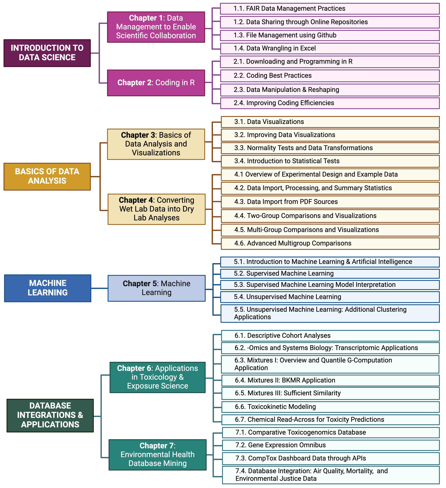
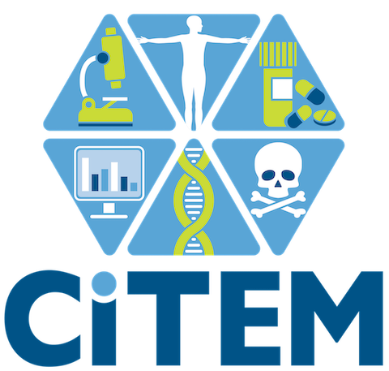

--- 
title: "TAME 2.0: An Update to the TAME Toolkit for Introductory Data Science, Chemical-Biological Analyses, Machine Learning and Predictive Modeling, and Database Mining for Environmental Health Research"
author: "Rager Lab"
date: "`r Sys.Date()`"
site: bookdown::bookdown_site
documentclass: book
bibliography: [book.bib]
# url: your book url like https://bookdown.org/yihui/bookdown
# cover-image: path to the social sharing image like images/cover.jpg
description: |
  This is an example of how the TAME 2.0 website will look, I hope!
link-citations: yes
github-repo: rstudio/bookdown-demo
favicon: Icons_Used_Throughout/Favicon.png
---

```{r , include=FALSE}
source("R/_common.R")
```

# Preface {-}


#### Background {-}
Research in exposure science, toxicology, and environmental health is becoming increasingly reliant upon data science and computational methods that can more efficiently extract information from complex datasets. These methods can be used to better identify relationships between exposures to chemicals in the environment and human disease outcomes. Still, there remains a critical gap surrounding the training of researchers on these in silico methods. 

#### Objectives {-}
We aimed to address this critical gap by developing the in**T**elligence **A**nd **M**achine l**E**arning (TAME) Toolkit, promoting trainee-driven data generation, management, and analysis methods to “TAME” data in environmental health studies. This toolkit encompasses training modules, organized as chapters within this [Github Bookdown site](https://uncsrp.github.io/Data-Analysis-Training-Modules/). TAME site users are welcome to participate in training modules by viewing them online and/or downloading all underlying script, data, and figure input files through the [UNC-SRP TAME2 GitHub website](https://github.com/UNCSRP).

#### Contributors to TAME 2.0 {-}
[Julia E. Rager, PhD, MSEE (UNC-Chapel Hill)](https://sph.unc.edu/adv_profile/julia-rager-phd/) directed the developed of TAME 2.0. All training resources were developed by combining modules drafted by multiple authors and experts in the field of environmental health and data science. Authors are specifically recognized at the beginning of each module section. Contributors specifically include the following, listed in alphabetical order:

+ **Oyemwenosa N. Avenbuan**, University of North Carolina at Chapel Hill (UNC-Chapel Hill)
+ **Rebecca Boyles**, MSPH, Research Triangle Institute (RTI) International
+ **Jessie Chappel**, PhD, University of North Carolina at Chapel Hill (UNC-Chapel Hill)
+ **Chloe K. Chou**, PhD Candidate, University of North Carolina at Chapel Hill (UNC-Chapel Hill)
+ **Lauren Eaves**, PhD, University of North Carolina at Chapel Hill (UNC-Chapel Hill)
+ **Rebecca C. Fry**, PhD, University of North Carolina at Chapel Hill (UNC-Chapel Hill)
+ **Elise Hickman**, PhD, University of North Carolina at Chapel Hill (UNC-Chapel Hill)
+ **Ilona Jaspers**, PhD, University of North Carolina at Chapel Hill (UNC-Chapel Hill)
+ **Lauren E. Koval**, PhD, University of North Carolina at Chapel Hill (UNC-Chapel Hill)
+ **Paul Kruse**, PhD, U.S. Environmental Protection Agency (U.S. EPA)
+ **Sarah Miller**, PhD Candidate, University of North Carolina at Chapel Hill (UNC-Chapel Hill)
+ **David M. Reif**, PhD, Division of Translational Toxicology (DTT), National Institutes of Environmental Health Science (NIEHS)
+ **Cynthia Rider**, PhD, Division of Translational Toxicology (DTT), National Institutes of Environmental Health Science (NIEHS)
+ **Kyle Roell**, PhD, University of North Carolina at Chapel Hill (UNC-Chapel Hill)
+ **Alexis Payton**, MS, University of North Carolina at Chapel Hill (UNC-Chapel Hill)
+ **Grace Patlewicz**, PhD, U.S. Environmental Protection Agency (U.S. EPA)
+ **Caroline Ring**, PhD, U.S. Environmental Protection Agency (U.S. EPA)
+ **Cavin Ward-Caviness**, PhD, U.S. Environmental Protection Agency (U.S. EPA)


#### Module Development Overview {-}
Training modules were developed to provide applications-driven examples of data organization and analysis methods that can be used to address environmental health questions. Target audiences for these modules include students and professionals in academia, government, and industry that are interested in expanding their skillset. Modules were developed by study coauthors using annotated script formatted for R/RStudio coding language and interface and are now organized into seven chapters. The first group of modules focuses on introductory data science, which included the following topics: data management and sharing practices, file management, and basic data wrangling. The second chapter of modules provides an overview of scripting, using R as the example language. Topics span downloading and programming in R, coding best practices, data manipulation and reshaping, and coding efficiencies. The third chapter demonstrates methods for basic data analysis and visualizations, spanning an introduction to data visualizations, methods to improve data visualizations, normality tests and data transformations, and introduction to statistical tests. The fourth chapter focuses on the translation of wet lab data into dry lab analyses. Topics in this chapter include an introduction to key experimental features and terms; data importing, cleaning and summary statistics from wet lab sources; two-group comparisons and visualizations; multigroup comparisons and visualizations; advanced multigroup comparisons; and advanced data export and sharing. The fifth chapter provides an introduction to machine learning and artifical intelligence (ML/AI). Topics in this chapter include a general introduction of ML/AI and then provides examples of unsupervised machine learning methods, supervised machine learning methods, and interpretation of developed ML models. The sixth chapter provides applications in toxicology and exposure science, spanning descriptive cohort analyses; -omics analyses; mixtures methodologies; toxicokinetic modeling; and chemical read-across.The seventh chapter delves into examples of environmental health database mining, and highlights the helpful databases of Comparative Toxicogenomics Database, Gene Expression Omnibus, Computational Toxicology Dashboard access through APIs, and database integration using geospatial methods.


The overall organization of this TAME toolkit is summarized below. Modules are organized into seven chapters that are listed on the left side of this website.
```{r ModuleOverview, out.width="70%", echo=FALSE, fig.align='center'}

```
<br>
  

#### Ways to use TAME 2.0 and Underlying Site License {-}
Site viewers are encouraged to follow along each module, either starting at the very beginning and reading through the material like a classical book or clicking on specific modules of interest and learning topics of greatest interest to their data science development. Each module is designed to stand-alone.

*Site license*

This site is covered by the BY-NC-ND Creative Commons license. This license allows reusers to copy and distribute the material in any medium or format in unadapted form only, for noncommercial purposes only, and only so long as attribution is given to the creator.

*Figure credit*

Figures included in TAME 2.0 were either generated in R, created within [Biorender.com](https://www.biorender.com/), and/or pulled from online publications with site licensing and author attribution throughout.


#### Concluding Remarks {-}
Together, this valuable resource provides unique opportunities to obtain introductory-level training on current data analysis methods applicable to 21st century exposure science, toxicology, and environmental health. These modules serve as applications-based examples on how to “TAME” data within the environmental health research field, expanding the toolbox for career development and cross-training of scientists in multiple specialties, as well as supporting the next generation of data scientists.
<br>


#### Funding {-}
This study was supported by the National Institutes of Health (NIH) from the National Institute of Environmental Health Sciences, including the following grant funds and associated programs:

**P42ES031007**: The [University of North Carolina (UNC)-Superfund Research Program](https://sph.unc.edu/superfund-pages/srp/) (SRP) seeks to develop new solutions for reducing exposure to inorganic arsenic and prevent arsenic-induced diabetes through mechanistic and translational research. The [UNC-SRP Data Analysis and Management Core (UNC-SRP-DMAC)](https://sph.unc.edu/superfund-pages/dmac/) provides the UNC-SRP with critical expertise in bioinformatics, statistics, data management, and data integration.

```{r, echo=FALSE, out.width="40%", fig.align='center'}

```
<br>
<br>
<br>
**T32ES007126**: The [UNC Curriculum in Toxicology and Environmental Medicine (CiTEM)](https://www.med.unc.edu/toxicology/) seeks to provide a cutting edge research and mentoring environment to train students and postdoctoral fellows in environmental health and toxicology. Towards this goal, the CiTEM has a T32 Training Program for Pre- and Postdoctoral Training in Toxicology to support the development of future investigators in environmental health and toxicology.

```{r, echo=FALSE, out.width="15%",fig.align='center'}

```
<br>
<br>
<br>
Support was additionally provided through the [Institute for Environmental Health Solutions (IEHS)](https://sph.unc.edu/iehs/institute-for-environmental-health-solutions/) at the University of North Carolina (UNC) Gillings School of Global Public Health. The IEHS is aimed at protecting those who are particularly vulnerable to diseases caused by environmental factors, putting solutions directly into the hands of individuals and communities of North Carolina and beyond.
  
```{r, echo=FALSE, out.width="60%", fig.align='center'}

```
<br>